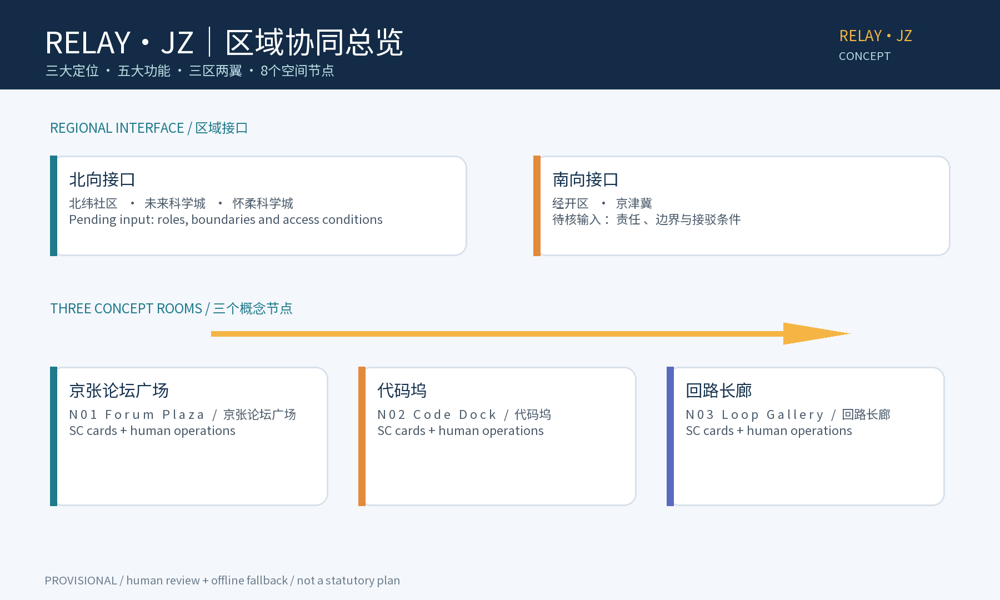
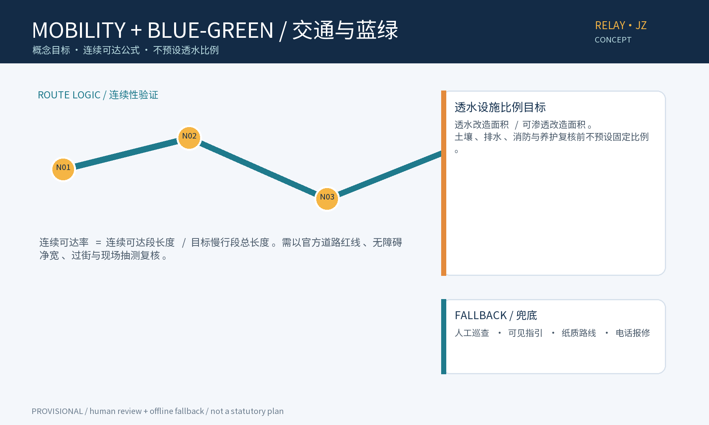
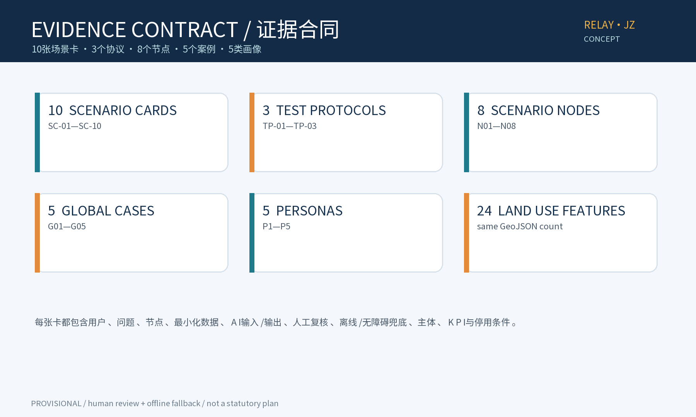
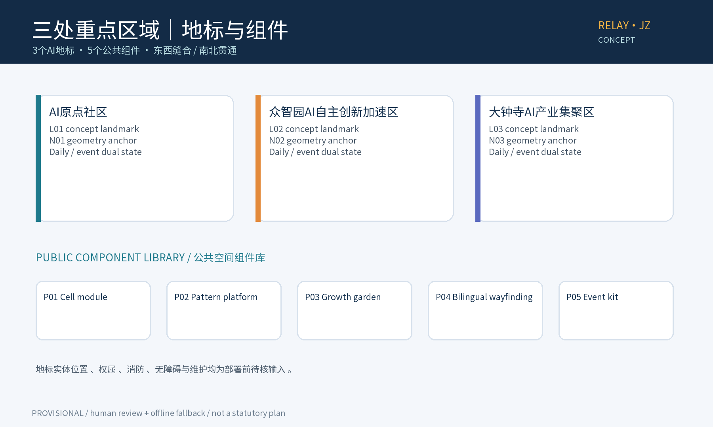

# 京张AI创新活动带：RELAY·JZ

## 设计依据与资料清单

本节的设计意图是把公开任务书转换为可追踪的范围、交付物和核验顺序，而不是把概念判断写成现状事实。范围、交付深度和公共合规边界以 [source:DATA-SRC-OFFICIAL-ANNOUNCEMENT-20260509]、[standard:PROJECT-AGENT-OPEN-CALL-TASKBOOK] 为依据；24个土地特征、3处重点区域和8个节点只用于本包表达，并在 [metric:land_use_feature_count] 与 [metric:scenario_node_count] 中复算。官方GIS/CAD、权属、文保、交通、消防、无障碍和活动基线尚未提供，故所有空间落位、容量、树木和建筑判断保持 provisional，资料到位后按旧值—新值差异重绘并由责任主体签字复核。

本稿是海淀百年京张 AI 创新带开源征集的概念方案。公告与任务书是范围、任务和交付深度的公开依据；几何、面积、节点和活动均是本包可复核的概念数据，不是红线、控规、审批、投资或合作承诺。总体设计概念范围约11.41 km²，统筹研究范围与正式资料口径以公告为准。

已登记公开依据：sources.json#DATA-SRC-OFFICIAL-ANNOUNCEMENT-20260509、#DATA-SRC-AGENT-TASKBOOK-20260518、#DATA-SRC-GENERATIVE-AI-INTERIM-MEASURES。未获得官方GIS/CAD、权属、文保、交通和活动基线，因此空间结果均为 provisional。

## 设计愿景与总体概念
RELAY·JZ 把“接力”转译为内容接力（活动与荣誉）、空间接力（东西缝合、南北贯通）、能力接力（开发者—企业—社区）。核心空间母题保留“元胞坊—智纹台—生长庭”：元胞坊是可拆换共创单元，智纹台是公开问题与测试协议接口，生长庭是社区、蓝绿和长期运营的日常容器。

## 三层范围工作框架

三层范围的设计意图是让区域研究、总体城市设计和节点试点分别承担不同决策，不把一张概念图误读为控规或工程图。统筹层读取产业、人才、算力、数据和场景接口；总体层把三定位、五功能、三区两翼和N01—N08组织成空间与运营回路；重点层用L01—L03、P01—P05和D01—D03验证可逆动作。范围关系由 [source:DATA-SRC-OFFICIAL-ANNOUNCEMENT-20260509] 与 [standard:PROJECT-AGENT-OPEN-CALL-TASKBOOK] 支撑，几何和面积仅影响 [metric:key_area_count]、[metric:scenario_node_count] 的包内复算。正式边界、权属、交通容量、文保等级和实施主体属于数据缺口，未核前不作现状或承诺表述。

统筹研究范围、总体设计范围和三处重点区域分别对应区域机制、空间设计和节点试点；范围关系以 [source:DATA-SRC-OFFICIAL-ANNOUNCEMENT-20260509] 与 [standard:PROJECT-AGENT-OPEN-CALL-TASKBOOK] 为依据，几何仍为 provisional。

## 统筹研究范围产业与未来城市研究

统筹研究范围的设计意图是先建立跨区域的资源—能力—场景接口，再决定是否进入空间试点；因此本稿提出触发条件而不宣称已有园区协作、企业订单或公共投资。产业、人才、算力、数据、资金和场景八要素在 [data:DATA-SRC-GENERATIVE-AI-INTERIM-MEASURES] 与 compliance_matrix.json#agent_delivery_crosswalk 中形成公开依据、方案建议和外部依赖三列，只有责任人、合规条件、数据授权和安全审查齐备才进入TP协议。对空间的影响是预留N06人才转化与N07/N08跨区域模板接口，对指标的影响是协议数、场景数和运营台账可追踪；产业基线、容量、采购与合作均待核。

统筹层回答跨区域产业、人才、算力、数据与场景如何进入回路；本稿只提出接口和触发条件，不宣称已有产业协作或未来城市建设承诺。

## 总体设计范围城市更新与控规深度城市设计

总体设计范围的设计意图是把元胞坊—智纹台—生长庭从叙事母题转成城市更新中的可拆、可测和可撤公共界面，同时尊重控规深度城市设计必须依赖法定底图和专业审批。空间上以24个概念用地特征、3处重点区域、8个节点和3个地标建立关系，指标计算分别见 [metric:land_use_zone_count]、[metric:landmark_count] 和 [metric:scenario_node_count]；产业上接入企业问题诊所与人才转化，场景上由SC-01—SC-10限定最小数据与人工复核，运营上由O01—O06和D01—D03控制扩展。正式道路红线、建筑规模、拆改权限、市政容量、消防和无障碍资料缺失，故本节不是控规替代物，所有落位保持 provisional。

总体设计层将三处重点区域、两翼服务与N01-N08节点组织成可逆公共空间；控规、权属、文保、消防和工程深度均待官方与专业输入。

## 重点区域详细设计

重点区域的设计意图是用少量可识别的节点把东西缝合、南北贯通、文化传播和AI公共服务落到可试点的界面，而不是凭空指定建设地点。L01论坛广场承担会期信息与人工台，L02代码坞承担安全共创与企业问题诊所，L03回路长廊承担授权荣誉与双语展签；N01—N08是概念节点，P01—P05是可拆组件，具体红线、接驳、消防、维护和产权须由D01—D03前置核验。图件 [metric:key_area_count] 与 [source:PACKAGE-GEOMETRY] 只表达包内关系，不能证明历史站房价值、成熟乔木、低效厂房或现状接口；证据到位后才决定保留、改造、迁移或撤除。

重点区域用三个概念地标和五个公共组件表达，具体落位、工程做法和管理边界在D01-D03前置核验后确定。

## 三大定位、五大功能与三区两翼
### 三大定位
1. P1 百年京张文化带：把可核验历史线索转成授权后的载体、导视和展陈，不把未核验价值写成现状事实。
2. P2 都市AI生活体验带：用活动、慢行、无障碍和社区服务形成日常/会期双态。
3. P3 AI融合创新带：把公开问题、开发者实践、企业转化和治理边界组成练—测—展—转回路。

### 五大功能
F1 AI全栈自主创新体系；F2 世界级AI创新生态；F3 AI+场景赋能新范式；F4 智能化AI活力城市；F5 AI治理全球话语权。每项的空间、产业、场景、运营闭环见区域协同交叉表和 compliance_matrix.json#positioning_function_crosswalk。

### 三区两翼
三区为 AI原点社区、众智园AI自主创新加速区、大钟寺AI产业集聚区；两翼为中关村科技服务翼与小月河场景赋能翼。两翼不是新增行政边界：前者提供技术服务、双语传播和人才转化接口，后者承载社区、蓝绿与日常场景。责任人、边界和接驳条件均待核。

## 区域协同交叉表
下表是机器可读矩阵 compliance_matrix.json#agent_delivery_crosswalk 的人类版。所有未获得责任人/边界/协议的区域接口均为“待核输入”。

| 对象 | 空间锚点 | 产业机制 | 场景机制 | 运营机制 | 证据状态 |
|---|---|---|---|---|---|
| 北纬社区 | 北部社区共创与日常使用 | SC-07；N04 PS-SN00；proposal.md#区域接口交叉表 | 待核输入 | 取得社区代表、边界、隐私与责任确认后触发 |
| 未来科学城 | 北向科研人才与场景模板 | SC-10；N07 PS-SN03；TP-03 | 待核输入 | 责任人、数据边界和接驳条件齐备后互评 |
| 怀柔科学城 | 北向科研验证与专家评审 | SC-10；N07 PS-SN03；TP-01 | 待核输入 | 试验对象、算力/数据合规条件齐备 |
| 经开区 | 南向产业问题与制造转化 | SC-04/09；N08 PS-SN04；TP-03 | 待核输入 | 自愿企业、商业秘密边界和责任人齐备 |
| 京津冀 | 区域模板与国际传播转化 | SC-10；N08 PS-SN04；agent.5链条 | 待核输入 | 法务、数据、安全和品牌审查完成 |

## agent.1—agent.6机器可读成果交叉表
| agent | 交付物 | 定位/功能闭环 | 三区两翼 | 空间/产业/场景/运营闭环 | 文件锚点 | 证据状态 |
|---|---|---|---|---|---|
| agent.1 | 总体概念与区域协同 | P1百年京张文化带；P2都市AI生活体验带；P3 AI融合创新带；F1全栈创新；F2世界级生态；F3场景范式；F4活力城市；F5治理话语权 | 三区：AI原点社区/众智园AI自主创新加速区/大钟寺AI产业集聚区；两翼：中关村科技服务翼/小月河场景赋能翼 | 空间N01-N08；产业场景/测试/转化；SC-01/10；区域运营台账与D01-D03 | proposal.md#区域协同交叉表；compliance_matrix.json#agent_delivery_crosswalk.agent.1；proposal.en.md#Agent 1-6 delivery crosswalk | 正式资料仅引用公告/任务书；区域接口待核 |
| agent.2 | AI生态要素与全球机制案例 | P3 AI融合创新带；F2世界级AI创新生态；F5治理话语权 | 三区两翼；八要素机制 | 空间八要素矩阵；产业G01-G05机制；SC-03/04/09/10；要素触发器 | proposal.md#agent.2八要素矩阵与全球机制案例；compliance_matrix.json#agent_delivery_crosswalk.agent.2 | G01-G05只作机制阅读，不代表合作或资产移植 |
| agent.3 | 场景卡与产业验证 | P2都市AI生活体验带；P3 AI融合创新带；F3场景范式；F4活力城市 | 三区两翼按节点承载 | N01-N08；TP-01-03；SC-01-10；人工复核/离线/停用 | proposal.md#SC-01—SC-10场景卡；proposal.md#TP-01—TP-03产业测试协议；metrics.json#scenario_card_count | 小规模试点前置条件未获批 |
| agent.4 | AI公共空间、地标与组件 | P1百年京张文化带；P3 AI融合创新带；F3场景范式；F4活力城市 | 三重点区域；两翼服务与场景贯通 | 东西缝合/南北贯通；L01-L03；P01-P05；SC-05/06；组件运维 | proposal.md#agent.4公共空间、三地标与组件库；compliance_matrix.json#agent_delivery_crosswalk.agent.4 | 地标为概念目录，实体位置/权属/审批待核 |
| agent.5 | 京张—中关村—AI文化叙事 | P1百年京张文化带；P3 AI融合创新带；F2世界级AI生态；F5治理话语权 | 节点与两翼叙事串联 | 历史线索到载体；SC-02/05/07/10；双语审校、授权、撤展 | proposal.md#agent.5文化资源—空间载体—导视—国际传播链；sources.json#HISTORY-NARRATIVE-CHAIN | 历史与站房价值不作现状判断 |
| agent.6 | 年度活动与长期运营 | 三大定位的长期运行回路；F3场景范式；F4活力城市；F5治理话语权 | 三重点区域为试点容器；两翼负责服务与开放 | D01-D03；人才—企业转化；SC-01/06/08/09/10；O01-O06 | proposal.md#agent.6运营台账与节点决策门；design_depth_matrix.json#agent6_long_term_operations | 角色、成本和节奏为建议/待核 |

## AI 创新生态、人才画像与 AI+ 场景

本节的设计意图是把AI从口号变成可拒绝、可人工复核、可离线兜底的公共服务和产业试验边界。五类画像分别映射居民/亲子、开发者、高校团队、企业转化人员、国际与无障碍访客及养护运营职责，SC-01—SC-10逐卡给出用户、问题、节点、最小数据、AI输入输出、人工复核、离线无障碍兜底、主体、KPI和停用条件；数量由 [metric:scenario_card_count] 与 [metric:persona_count] 约束。八要素矩阵以 [data:DATA-SRC-GENERATIVE-AI-INTERIM-MEASURES] 区分公开依据和外部依赖，未经授权的个人数据、商业秘密、自动执法和未经核验的合作均不得进入试点。

agent.2的八要素矩阵、agent.3的十张场景卡和五类画像共同定义从资源到公共体验的边界；证据锚点见 [data:DATA-SRC-GENERATIVE-AI-INTERIM-MEASURES]。

## agent.2八要素矩阵与全球机制案例
| 要素 | 公开依据 | 方案建议 | 外部依赖 | 触发条件 |
|---|---|---|---|---|
| 土地 | 公告/任务书概念范围 | 分区与用地建议，不替代控规 | 官方GIS/CAD与权属 | 官方几何到位后复算24 features |
| 空间 | 任务书三区两翼与节点 | N01-N08、三地标和组件 | 红线/文保/消防/无障碍 | 工程深化前专业校核 |
| 产业 | 任务书AI产业与场景 | TP-01-03、问题诊所、转化 | 自愿企业、法务、导师 | 责任人和非保密边界齐备 |
| 资金 | 无项目资金承诺 | 分档成本假设与公共投入边界 | 财政/赞助/收入待核 | 年度预算确认 |
| 人才 | 开发者/学生/居民画像 | 社区导师、志愿者、顾问建议 | 招募和服务合同待核 | 人工台和导师到位 |
| 算力 | 任务书AI创新方向 | 公开样例、小规模离线推理 | 配额、能耗、安全待核 | 安全/能耗测试通过 |
| 数据 | 生成式AI与无障碍公开规范 | 最小化、匿名聚合、公开文本 | 字典、保存期、权限、DPIA待核 | DPIA、投诉和删除先行 |
| 场景 | agent.3/4/6场景任务 | SC-01-10与TP-01-03 | 场地、活动、运营与审批待核 | D01-D03验收 |

G01—G05仅作为机制阅读，不是合作清单、场地事实或资产复用许可。
- **G01 SXSW**：多主题活动与城市文化联动。来源：https://sxsw.com/。不可直接移植：治理、商业结构、规模、版权不同，不可直接移植。
- **G02 Dutch Design Week**：开放展览与分布式城市场景。来源：https://ddw.nl/en。不可直接移植：城市尺度、许可和文化机构网络不同，不可直接移植。
- **G03 MWC Barcelona**：产业会议、展览与技术转化。来源：https://www.mwcbarcelona.com/。不可直接移植：主办方、会展基础设施和商业模式不同，不可直接移植。
- **G04 Ars Electronica Festival**：艺术、科技、教育与奖项展示。来源：https://ars.electronica.art/festival/en/。不可直接移植：机构品牌、内容权利和文化土壤不同，不可直接移植。
- **G05 MUTEK**：数字创意活动、现场体验和国际网络。来源：https://mutek.org/en。不可直接移植：版权、声学、节庆网络和受众结构不同，不可直接移植。

## agent.3 SC-01—SC-10场景卡
以下十张卡逐项给出用户、问题、节点、最小化数据、AI I/O、人工复核、离线/无障碍兜底、主体、KPI和停用条件；结构化镜像在 compliance_matrix.json#scenario_crosswalk。

### SC-01 活动编排与报名
- 用户：参会者/居民
- 问题：多会期信息分散
- 空间节点：N01 PS-LM00 Forum Plaza
- 最小化数据：匿名报名意向、时间窗、无障碍偏好
- AI输入/输出：活动元数据与偏好 -> 候选日程/冲突提示
- 人工复核点：活动运营员逐项确认
- 离线/无障碍兜底：纸质日程、人工台、电话入口；轮椅与大字版
- 运营主体：活动运营台
- KPI：报名完成率≥70%，冲突投诉≤5%
- 停用条件：连续2周期投诉>10%或出现敏感数据收集
- 证据映射：metrics.json#scenario_card_count；compliance_matrix.json#scenario_crosswalk.SC-01

### SC-02 多语字幕与无障碍指引
- 用户：国际访客/听障访客
- 问题：现场信息理解和换乘困难
- 空间节点：N01 Forum Plaza -> N03 Loop Gallery
- 最小化数据：公开讲稿、语言选择和无障碍需求，不留声纹
- AI输入/输出：公开文本 -> 字幕、文字路线和图标提示
- 人工复核点：人工校对关键专名与安全播报
- 离线/无障碍兜底：离线打印字幕、人工志愿者、盲文/大字指引
- 运营主体：公共体验服务组
- KPI：字幕抽检准确率≥95%，求助响应≤5分钟
- 停用条件：错误播报或无人工校对
- 证据映射：metrics.json#scenario_card_count；compliance_matrix.json#scenario_crosswalk.SC-02

### SC-03 代码共创赛陪跑
- 用户：开发者/高校团队
- 问题：代码任务和资源匹配成本高
- 空间节点：N02 PS-LM01 Code Dock
- 最小化数据：自愿提交的任务标签、算力时段和公开代码片段
- AI输入/输出：任务/资源标签 -> 检索建议、测试提示
- 人工复核点：导师审核；模型不得提交或合并代码
- 离线/无障碍兜底：纸面任务卡、离线样例、人工导师
- 运营主体：开发者社区运营员
- KPI：完成任务数/入场团队数≥0.6
- 停用条件：泄露密钥、建议错误或人工拒绝
- 证据映射：metrics.json#scenario_card_count；compliance_matrix.json#scenario_crosswalk.SC-03

### SC-04 企业问题诊所
- 用户：中小企业/科研转化团队
- 问题：问题描述与试验节点不匹配
- 空间节点：N02 Code Dock + N06 PS-SN02
- 最小化数据：自愿的非保密问题摘要和行业标签
- AI输入/输出：问题摘要 -> 候选节点/协议建议
- 人工复核点：产业协调员核准边界与合作方
- 离线/无障碍兜底：人工登记台；保密问题不入系统
- 运营主体：产业转化协调组
- KPI：问题到测试协议转化≥20%
- 停用条件：商业秘密或无责任方
- 证据映射：metrics.json#scenario_card_count；compliance_matrix.json#scenario_crosswalk.SC-04

### SC-05 AI荣誉与贡献展
- 用户：居民/学生/国际访客
- 问题：贡献难以被看见，展示易变成排名
- 空间节点：N03 PS-LM02 Loop Gallery
- 最小化数据：作者主动公开的项目摘要和授权肖像替代方案
- AI输入/输出：公开摘要 -> 主题聚类/中英短文草案
- 人工复核点：作者确认文案，不做数值排名
- 离线/无障碍兜底：纸质展签、人工导览、低刺激模式
- 运营主体：展陈与文化组
- KPI：展项授权完整率100%，理解反馈≥80%
- 停用条件：授权撤回或内容未经核验
- 证据映射：metrics.json#scenario_card_count；compliance_matrix.json#scenario_crosswalk.SC-05

### SC-06 匿名人流提示
- 用户：现场运营/居民
- 问题：会期拥堵与无障碍路径冲突
- 空间节点：N01/N03及连接慢行段
- 最小化数据：15分钟分区计数，不采集人脸、轨迹或设备标识
- AI输入/输出：分区计数 -> 拥堵等级/人工调度建议
- 人工复核点：现场总协调员决定分流，模型不得执法
- 离线/无障碍兜底：人工巡查、广播和可见指示牌
- 运营主体：安全运营组
- KPI：高峰响应≤5分钟，误报率≤15%
- 停用条件：不可匿名化或有歧视性规则
- 证据映射：metrics.json#scenario_card_count；compliance_matrix.json#scenario_crosswalk.SC-06

### SC-07 北纬社区记忆路线
- 用户：北纬社区居民/亲子
- 问题：社区与带状活动缺少低门槛连接
- 空间节点：N04 PS-SN00；北纬接口待核
- 最小化数据：主动口述主题标签，不保存原声和住址
- AI输入/输出：授权故事卡 -> 步行路线草案/社区活动建议
- 人工复核点：社区代表逐条确认，未确认标 provisional
- 离线/无障碍兜底：线下故事墙、社区工作者陪同
- 运营主体：社区共创组
- KPI：每季度≥1次共创，复访率≥30%
- 停用条件：代表撤回或隐私投诉未闭环
- 证据映射：metrics.json#scenario_card_count；compliance_matrix.json#scenario_crosswalk.SC-07

### SC-08 蓝绿设施巡检
- 用户：养护人员/居民
- 问题：雨水花园、慢行和活动设施需要联合巡检
- 空间节点：N05 PS-SN01
- 最小化数据：设施编号、巡检结果和降雨等级，不采集个人信息
- AI输入/输出：巡检表/降雨等级 -> 优先级和工单草案
- 人工复核点：养护主管审核后派单
- 离线/无障碍兜底：纸面工单、电话报修和人工复核
- 运营主体：蓝绿养护组
- KPI：工单闭环率≥90%，积水响应≤24小时
- 停用条件：结构异常或数据缺失
- 证据映射：metrics.json#scenario_card_count；compliance_matrix.json#scenario_crosswalk.SC-08

### SC-09 人才—企业转化
- 用户：学生/初创团队/企业导师
- 问题：活动成果难以进入真实试验
- 空间节点：N06 PS-SN02 -> N02 Code Dock
- 最小化数据：自愿技能标签、作品链接和联系同意
- AI输入/输出：公开作品/技能标签 -> 导师匹配建议
- 人工复核点：双方确认匹配，人工撤销
- 离线/无障碍兜底：纸质名片、人工转介，不强制注册
- 运营主体：开发者社区与产业组
- KPI：季度匹配≥10组，30天持续率≥50%
- 停用条件：未经双方同意联系或无安全审查
- 证据映射：metrics.json#scenario_card_count；compliance_matrix.json#scenario_crosswalk.SC-09

### SC-10 跨区域场景开放台
- 用户：北方科研节点/南方产业节点/运营方
- 问题：接口需求与本地条件无法直接对接
- 空间节点：N07 PS-SN03 + N08 PS-SN04；接口待核
- 最小化数据：场景模板、指标定义和匿名汇总，不交换个人数据
- AI输入/输出：模板/约束 -> 适配清单与试验问题
- 人工复核点：各地责任人分别批准，不宣称合作成立
- 离线/无障碍兜底：离线模板、人工协调会和双语版本
- 运营主体：区域协同组
- KPI：每年≥2次互评，前置条件记录率100%
- 停用条件：法务/数据/安全条件不满足
- 证据映射：metrics.json#scenario_card_count；compliance_matrix.json#scenario_crosswalk.SC-10

## TP-01—TP-03产业测试协议
### TP-01 开发者代码共创安全测试
- 测试对象与节点：匿名公开样例任务；N02
- 基线与概念目标：基线：首次通过率/人工耗时；目标：耗时下降20%且安全扫描100%通过
- 样本边界与周期：≤20组自愿团队、公开代码；8周
- 责任人：开发者社区运营员+安全导师
- 风险阈值：密钥泄露、建议错误率或人工拒绝超阈值
- 退出机制：撤下模型建议，转纸面任务卡；复盘后扩展/停止
- 状态：建议性小规模验证，未获批准，不构成合作或部署承诺。

### TP-02 多语无障碍活动导航
- 测试对象与节点：公开会期信息；N01-N03
- 基线与概念目标：基线：问路次数/字幕抽检；目标：问路下降15%、字幕准确率≥95%
- 样本边界与周期：≤3个会期、自愿反馈；3个月
- 责任人：公共体验服务组+无障碍顾问（待聘）
- 风险阈值：安全播报错误或求助>5分钟
- 退出机制：切换人工台和纸质指引；记录纠错后再评估
- 状态：建议性小规模验证，未获批准，不构成合作或部署承诺。

### TP-03 企业问题到场景协议转化
- 测试对象与节点：非保密问题摘要；N02/N06
- 基线与概念目标：基线：登记到协议耗时；目标：中位≤14天、退出条件完整率100%
- 样本边界与周期：≤10家自愿企业；12周
- 责任人：产业转化协调组+法务/数据顾问（待核）
- 风险阈值：商业秘密疑虑、责任人缺失或风险超阈值
- 退出机制：删除摘要、停止撮合、保留非敏感过程记录
- 状态：建议性小规模验证，未获批准，不构成合作或部署承诺。

## agent.4公共空间、东西缝合与南北贯通
东西缝合是待校核的空间动作：以N01—N03连续公共界面连接三处重点区域，沿连接线布置可拆组件、导视、人工服务和低速慢行优先时段。南北贯通通过N04—N08的模板接口和互评机制实现，具体站点接驳和红线待核。

### 三个AI地标目录
1. L01 / PS-LM00 京张论坛广场（Forum Plaza）：会期发布、人工服务、SC-01/02/06；日常保持开放。
2. L02 / PS-LM01 代码坞（Code Dock）：代码共创与企业问题诊所、SC-03/04/09、TP-01/03；不自动提交代码。
3. L03 / PS-LM02 回路长廊（Loop Gallery）：AI贡献荣誉与中英展签、SC-05/06；作者可撤回。

### 荣誉展示体系
采用“贡献主题—证据链接—作者授权—人工复核—撤展日期”五字段，不做未经核验的排名、奖项或官方荣誉背书。展项撤回时在纸质索引和HTML镜像中同步标记，替换为匿名公共主题展。

### 公共空间组件库
P01 可拆元胞坊；P02 智纹台问题/协议牌；P03 生长庭雨水花园边界和可移动种植箱；P04 双语导视柱（大字/触觉/纸卡）；P05 会期转换包（展墙、字幕屏、广播位、撤展清单）。每件组件需权属、消防、无障碍和维护确认后才可实体部署。

## agent.5文化资源—空间载体—导视符号—国际传播链
| 叙事素材（待核） | 空间载体 | 导视符号 | 国际传播文案草案 | 证据/动作 |
|---|---|---|---|---|
| 京张铁路公开历史线索 | 授权后的站房/轨迹展示位 | 道钉、轨枕、信号节奏抽象纹样 | Relay the line, share the next idea. | 先核文保/权属 |
| 中关村公开创新叙事 | 中关村科技服务翼服务台 | 代码纹理与服务节点编号 | From open questions to civic prototypes. | 公开资料与作者授权 |
| AI公共贡献故事 | L03 Loop Gallery | 贡献卡、日期、作者选择署名 | Public proof, human review, reversible steps. | 作者确认、撤展可追踪 |
| 社区主动记忆 | N04北纬社区接口 | 社区色带与离线故事卡 | A local story can travel without exposing a home. | 不存原声/住址、代表复核 |

## 用地、建筑规模与拆改留方案

本节的设计意图是把用地、建筑规模与拆改留从确定性结论降为证据驱动的决策树：先锁定法定边界、权属和安全，再选择保留、适应性改造、迁移或个案拆除。当前24个feature与24个zone是同一份概念GeoJSON的双字段合同，计算见 [metric:land_use_zone_count]、[metric:land_use_feature_count]，不是24个法定地块，也不代表开发量。既有林带、成熟乔木、历史价值站房、低效厂房和站点接口均为待核线索；文保、结构、消防、排水、无障碍和运营证据缺一不可。官方图形到位后必须同步更新中英文图、HTML、PDF、矩阵和manifest，并记录旧值、新值与影响。

本包几何含24个 land_use.geojson feature，指标统一为 land_use_zone_count=24 与 land_use_feature_count=24；两者指向同一份概念GeoJSON，不是24个法定地块。既有绿地、树木、站房历史价值、既有建筑使用效率和站点接驳均为待核输入。策略为“保留/改造/拆除”三种待决选项：保留需文保与权属证据，改造需结构/消防复核，拆除需安全论证和审批。

## 交通、轨道、市政与公共服务设施

本节的设计意图是把交通、轨道、市政和公共服务作为AI场景的安全边界，而不是用概念图宣称已消除车行割裂或已有轨道接驳。N01—N03只提出可校核的慢行公共界面，SC-02、SC-06和SC-08提供双语人工台、离线指引、分区匿名计数和纸面工单；每项输出须经现场运营员与专业责任人复核。评价采用连续可达段/目标段、无障碍净宽、过街等待、求助响应和设施工单等口径，引用 [metric:scenario_card_count] 与 [source:DATA-SRC-BARRIER-FREE-ENVIRONMENT-LAW]。道路红线、轨道站点、峰值客流、市政容量、消防疏散和服务半径仍是数据缺口，未核前不设固定比例和工程承诺。

交通、轨道、市政与公共服务采用人工台、离线指引、可拆组件和会期转换；轨道接口、道路红线、峰值承载和市政容量均待核。

## 蓝绿空间、公共空间与城市风貌

本节的设计意图是以生长庭、雨水花园边界、可移动种植箱、铁路工业记忆纹样和克制的双语导视形成日常可维护的公共空间，而不是把概念绿地或图形颜色当成树木、排水或风貌现状。空间机制由P03—P05、N03—N05和SC-06/08支撑，运营机制由O04养护台账、人工巡检、纸面工单和停用阈值支撑；面积和绿地比例只引用 [metric:green_space_area_sqm]、[metric:public_space_ratio]。透水设施采用项目可渗透改造口径，不预设“>65%”；树种、土壤、排水、防火、无障碍、文保和养护能力必须取得证据，未核前保持 provisional 并在中英文图件中同样标示。

蓝绿系统是概念韧性策略，城市风貌采用克制的铁路工业记忆符号；树木、绿地、排水和历史载体状态均不从 provisional 几何推定。

## 交通、蓝绿与公共空间
慢行连续性只作为待校核的概念目标。验证口径：连续可达段长度 / 目标慢行段总长度，按官方道路红线、无障碍净宽、过街等待和现场抽测复核；未有基线前只记录目标，不宣称达成。透水设施采用透水改造面积 / 可渗透改造面积的项目口径，比例不预设固定值，待土壤、排水、消防和养护条件复核后确定。

## 更新项目清单、实施政策与分期计划

本节的设计意图是把更新项目拆成可退出的试点组合，使政策、责任、预算假设和空间动作能够逐年复盘，而不是承诺已经获批的建设计划。近期以人工与离线服务完成D01—D03小试点，中期仅在KPI、投诉、安全、授权和维护条件达标后扩展，远期每年复核是否缩减、暂停或停止；O01—O06提供主体、职责、节奏、资源成本假设、KPI、风险阈值和退出。阶段数量与活动数量由 [metric:phase_count]、[metric:annual_program_count] 约束，项目清单还需权属、财政、采购、文保、消防、交通和无障碍责任主体确认；在此之前条目均为建议或外部依赖。

近1—3年做人工/离线小试点，中期3—5年在决策门达标后扩展，远期5—10年年度复盘；不把尚未核验的主体或预算写成确定实施。

## agent.6运营台账与节点决策门
| 编号 | 对象 | 牵头/协作 | 年度节奏 | 资源/成本假设 | KPI | 风险阈值 | 复盘/退出 |
|---|---|---|---|---|---|---|---|
| O01 | 开发者社区 | 社区运营员；导师/高校待核 | 每月开放夜、每季共创 | 活动、导师工时、离线样例；预算假设 | 季度活跃团队≥20、留存≥50% | 安全扫描100%、投诉≤10天 | 两季低于目标则改人工社群/停模型 |
| O02 | 公共体验与无障碍 | 公共体验组；志愿者/顾问待核 | 会期前演练、每周抽检 | 人工台、纸卡、字幕校对 | 响应≤5分钟、准确率≥95% | 安全播报不得未校对 | 两次超阈值只保留人工 |
| O03 | 年度文化与荣誉展 | 文化策展组；作者/权利人逐项确认 | 年1次主题展、季更新授权 | 展签、模块化展墙、撤展存档 | 授权完整率100%、撤展可追溯 | 授权撤回/事实待核即下展 | 改匿名公共主题展 |
| O04 | 蓝绿与公共组件 | 设施养护组；物业/街道待核 | 雨季演练、月度巡检 | 巡检工时、备件；不承诺采购 | 工单≥90%、积水≤24小时 | 结构异常封闭 | 连续两季超阈值停模块 |
| O05 | 企业/人才转化 | 产业协调组；企业/导师自愿 | 季度诊所、半年复盘 | 协调工时、法务预算假设 | 季度匹配≥10组、完整率100% | 商业秘密/责任人缺失退出 | 转化不足回公开问题库 |
| O06 | 国际传播与治理 | 区域协同组；翻译/法务/数据待核 | 年双语报告与风险复盘 | 翻译、审校、投诉渠道 | 实质等价抽检100%、投诉≤10天 | 未审校文案不得发布 | 年度复盘未通过暂停跨域 |

### 三个节点试点—评估—扩展/停止
- D01 N01 Forum Plaza：一个会期的SC-01/02/06；先决为活动信息、人工台、无障碍演练和匿名计数方案；达标可扩展到N03，不达标回到纸质/人工服务。
- D02 N02 Code Dock：20组以内公开样例的TP-01；先决为导师、安全扫描和不含密钥的离线样例；达标才引入TP-03，不达标停止模型陪跑但保留人工社群。
- D03 N03 Loop Gallery：授权展项的SC-05；先决为作者授权、事实核验和撤展清单；达标扩展年度展，不达标改匿名公共主题展。

## 指标体系、面积复算与合规矩阵

本节的设计意图是建立一个能被图、文、矩阵和运营台账共同引用的数量合同，避免中文、英文、HTML、PDF和GeoJSON各自出现不同口径。当前合同固定3处重点区域、3个地标、8个节点、10张场景卡、3个产业测试协议、5类画像、5个全球机制案例、3个阶段、3项年度活动以及24个土地feature/zone；来源和公式分别登记在 [metric:scenario_card_count]、[metric:protocol_count]、[metric:land_use_feature_count] 与 compliance_matrix.json#count_contract。每个指标必须说明状态、单位、来源文件、公式、置信度和假设；官方几何、基线或责任主体到位时按旧值—新值差异同步中英文图、HTML、PDF、manifest与self_check，不以自评替代官评。

本包固定数量合同：3个重点区域、3个AI地标、8个场景节点、10张场景卡、3个产业测试协议、5个画像、5个全球机制案例、3个阶段、3项年度活动、24个土地用途GeoJSON feature。核心面积与比例只来自 metrics.json 及其公式；官方资料到位后按旧值—新值差异重算中英文图表。

五类画像映射：P1居民/亲子→SC-07/N04/社区渠道/隐私伤害/社区代表；P2开发者→SC-03/N02/代码渠道/密钥泄露/安全导师；P3企业团队→SC-04/09/N02/N06/产业诊所/商业秘密/转化协调员；P4国际与无障碍访客→SC-02/N01-N03/双语人工台/错误播报/公共体验组；P5养护运营人员→SC-06/08/N03/N05/工单广播/误分流/安全运营组。

## 风险、版权与合规说明
依据 [source:DATA-SRC-GENERATIVE-AI-INTERIM-MEASURES]、[source:DATA-SRC-BARRIER-FREE-ENVIRONMENT-LAW] 与 [data:A-EVIDENCE-001]，本方案把数据最小化、人工复核、离线服务、撤回和停用作为设计意图与运营门槛。PACKAGE-GEOMETRY仅支撑概念可读性；它不证明法定边界、树木、站房价值、道路接口或工程安全。所有KPI是试点验收口径，需在D01-D03前取得主体、基线、投诉和安全测试记录后才能采用。
不采集人脸、声纹、住址、设备标识或非必要轨迹；AI输出必须人工复核，离线服务与撤回机制同时存在。所有场景是概念试点，不构成批准、部署、采购、合作、融资或绩效承诺。现状资料、法定边界、文保、消防、交通、树木、无障碍与数据安全均列为前置核验。

## 参考资料

本节的设计意图是区分公开依据、机制对标、包内生成物与待核事实，确保读者能追溯每个重要判断而不把外部案例误解为合作或本地现状。公告、任务书和生成式AI边界分别在 [source:DATA-SRC-OFFICIAL-ANNOUNCEMENT-20260509]、[source:DATA-SRC-AGENT-TASKBOOK-20260518]、[source:DATA-SRC-GENERATIVE-AI-INTERIM-MEASURES] 登记。

参考来源包括公告、任务书、城市设计/规划公开规范、生成式AI与无障碍公开边界，以及G01-G05五个官方公开主页机制对标；每条来源的URL、访问日期、许可与不可移植条件均在 [source:sources.json] 登记。面积、24个feature、节点和比例的公式在 [metric:metrics.json]；官方几何到位时必须记录旧值—新值差异并同步中英图文。历史线索、区域接口、预算、合作、场地和活动容量均为待核输入，不能由公开主页推导为事实。

## 参考资料与可核验边界

## RELAY·JZ 视觉识别规范（概念版）

RELAY·JZ 是“京张AI创新活动带”的统一识别系统，表达京张铁路的连续接力与 AI 场景的可循环验证。主标志由两条等粗、端点为 45° 箭头的折线环带组成：左环代表历史与公共记忆，右环代表开放模型与创新网络；两环在中央以一段不相交的水平连接线形成“接力”关系。字标固定为 `RELAY·JZ`，中英文组合锁定为“京张AI创新活动带 / RELAY·JZ”，中文在上、英文在下，左对齐，不得自行替换字体或改变字距。建议色为京张蓝 `#155EEF`、回路青 `#00A6A6`、暖橙 `#F79009`，色值仅为概念规范，正式使用前需完成商标、字体与资产权利核验。

| 规范项 | 可核验规则 |
| --- | --- |
| 主组合 | 主标志 + “京张AI创新活动带” + `RELAY·JZ`；横向锁定，标志高度为 H，字标组距为 0.5H。 |
| 中文/英文 | 中文全称与 `RELAY·JZ` 必须成组出现；英文单独出现时保留 `RELAY·JZ`，不可把 JZ 改写为未经批准的地名缩写。 |
| 单色/反白 | 单色版仅使用 100% 黑或 100% 白；深色底使用反白版，禁止把渐变或两种彩色混入单色版。 |
| 安全区 | 标志四周至少保留 1H 空间；任何标题、合作方标志、边框与安全区不得相交。 |
| 最小尺寸 | 印刷主组合宽度不小于 24 mm，数字界面不小于 120 px；低于该尺寸只使用图形标，不压缩字标。 |
| 禁用示例 | 禁止旋转、拉伸、描边、添加阴影、改变环带交接关系、低对比度置于照片上，或把合作方标志塞入安全区。 |

年度活动继承规则：年度前缀使用 `RELAY·JZ / OPEN SEASON YYYY`，年份只进入活动层，不改主标志比例。L01“京张论坛”、L02“代码坞”、L03“回路长廊”均继承主标志、安全区和蓝/青/橙色阶，仅允许在标志右侧增加一行节点描述；L01 可用蓝色主导、L02 可用青色主导、L03 可用橙色主导，但不得重绘环带或单独制造新图形。跨年、跨节点和中英页面均以该规则核对，首页与 `assets/figures/relay-identity.png` 为代表性执行样张。
来源、许可、访问日期、不可移植条件和 PACKAGE-GEOMETRY provenance 在 sources.json。全球G01-G05为公开主页机制阅读，未下载或复用图片、Logo、代码或文案。图件使用本包声明的Noto Sans SC本地嵌入字体；HTML不依赖网络字体。
