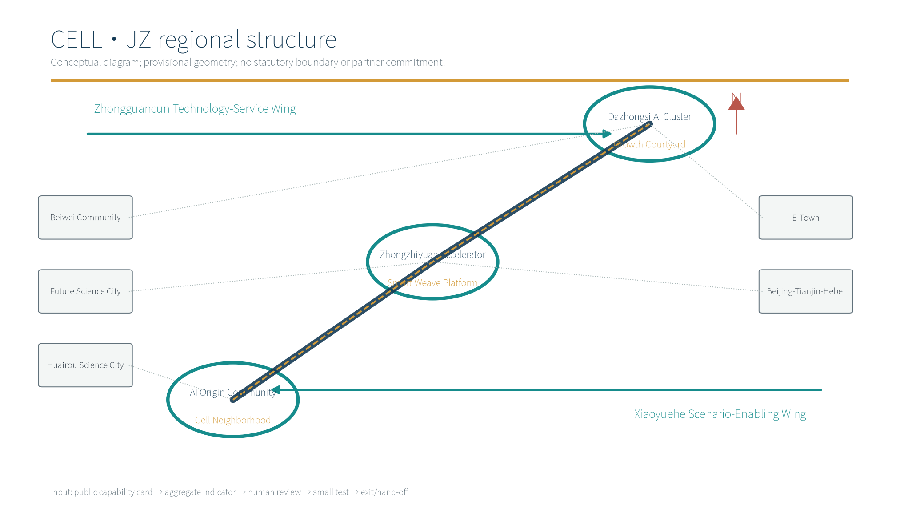
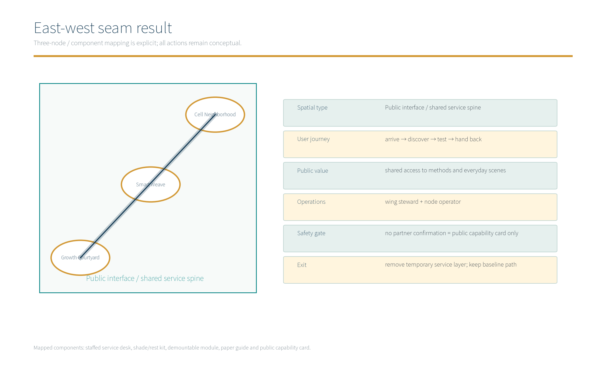
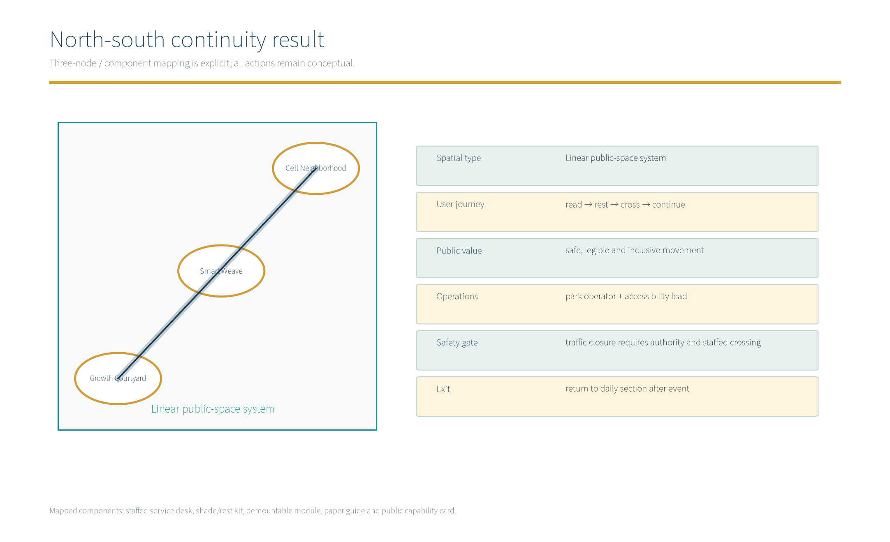
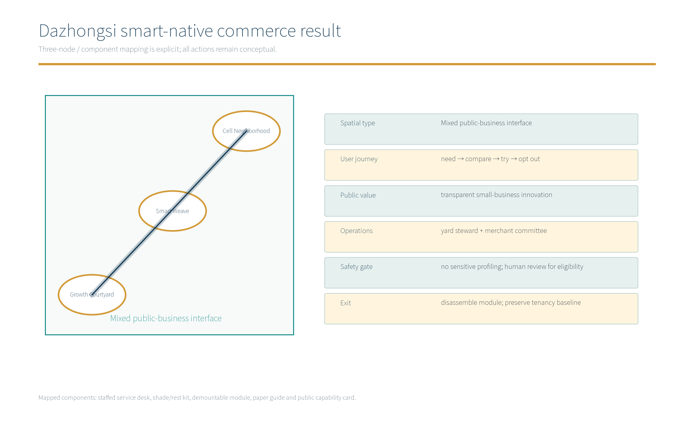

# CELL·JZ: a new urban form for AI

This proposal keeps the Cell Neighborhood — Smart Weave Platform — Growth Courtyard concept, but turns it into a testable, reviewable and reversible design delivery. It is not an approved plan. `geometry/*.geojson` is participant-authored provisional concept geometry. External relationships, partnerships, rights, approvals and implementation are not claimed as facts. [source:DATA-SRC-OFFICIAL-ANNOUNCEMENT-20260509]

## Design basis and source register

The announcement and taskbook define the project, three scopes, three zones, two wings and agent.1–agent.6 tasks. Public standards provide method references. Geometry, metrics and scenes are assumptions. `sources.json` records URLs, licenses, allowed uses and prohibited interpretations; official material cannot infer undisclosed redlines, ownership, approvals, transport conditions or partnerships. [source:DATA-SRC-AGENT-TASKBOOK-20260518]

### Evidence layers

Official/cleared material supports task interpretation; public cases support mechanism comparison; participant data supports a reproducible concept method. Public figures label values as conceptual estimates, non-official redlines and subject to recalculation when official data arrives. [standard:PROJECT-OFFICIAL-ANNOUNCEMENT]

## Three-level scope framework

|Scope|Spatial decision and delivery|Evidence|Boundary|
|---|---|---|---|
|Coordinated research|Regional interfaces, eight ecosystem factors and eight global mechanism cases|`site-overview.en.png`, agent.1/2 tables|No statutory boundary|
|Overall design|Three-node sequence, 27 conceptual land-use features and slow/blue-green spine|`site-boundary.geojson`, `metrics.json`|Approximately 11.4 km²; recalculate with official GIS|
|Key-area design|Node mechanisms, ten scene cards, three industry protocols and phasing|`key-areas.en.png`, three result figures|No regulatory, engineering or fire drawing|

## Coordinated research: industry and future-city study

### agent.1 task–space–mechanism–output matrix

|Task/position|Spatial placement|Distinct mechanism|Verifiable output|
|---|---|---|---|
|Jingzhang cultural belt|Smart Weave and heritage entry|source label → human guide → bilingual wayfinding|culture system figure, L1|
|Urban AI life-experience belt|Cell Neighborhood and Growth Courtyard|anonymous aggregate → human review → exit|S01–S06, life-service protocol|
|AI integration belt|Developer platform and open lab|capability card → small test → independent review|eight-factor atlas, three protocols|
|Autonomous innovation system|Smart Weave + technology-service wing|open topics, developer community, no sensitive profiling|agent.2 atlas and operations cards|
|World-class ecosystem|Research scope and regional interfaces|traceable cases, local translation and explicit limits|eight global cases|
|AI+ scene paradigm|Three nodes + scenario-enabling wing|ten complete cards and three test protocols|scene figure and P01–P03|
|Lively intelligent city|Slow spine, staffed service desk and event mode|daily/event switch, restore after event|mobility figure and decision cards|
|Global AI governance voice|Public display and international communication|equivalent English, rights ledger and human accountability|bilingual HTML/PDF and evidence figure|
|agent.1–agent.6|Structure, ecology, scenes, space, culture and operations|one sequence, three nodes, two wings, cards and review loop|this matrix, figures and appendices|

### Five external interfaces: concept objects, flows and reciprocal value

|Object|Concept flow/interface|Value for this proposal|Potential reciprocal deliverable|Status, limit and exit|
|---|---|---|---|---|
|Beiwei Community|community issue card → aggregate → staffed desk|turn family, elder and accessibility needs into tests|paper guide and review template|No authorization means no capture or device; offline demo only|
|Future Science City|compute/model capability card → offline load test|test model limits in city service|public method card and failure list|No confirmed resource; simulation is the fallback|
|Huairou Science City|public API/data-dictionary comparison → morphology review|translate research capability into a readable exhibit|bilingual case and dictionary sample|No sharing agreement means paper study only|
|E-Town|de-identified maintenance template → component test|test repairability and reversibility|maintenance training card and acceptance list|No procurement, investment or order claim|
|Beijing-Tianjin-Hebei|public standards/cross-city theme → design camp|reusable communication interface|bilingual toolkit and event review|No host confirmation means no third-party mark|

### Eight global AI ecosystem mechanism cases

|ID/case/source|Mechanism|Local translation|Non-inference boundary|
|---|---|---|---|
|C01 High Line; `SRC-GLOBAL-HIGHLINE`|operated heritage/infrastructure as continuous public space|Jingzhang linear heritage interface and demountable wayfinding|no asset copying or partnership claim|
|C02 Seoullo 7017; `SRC-GLOBAL-SEOULLO`|walkable infrastructure and connected nodes|slow spine connecting three nodes|no traffic approval or equal ridership inference|
|C03 Fab City; `SRC-GLOBAL-FABCITY`|local making, open knowledge and circular production|Growth Courtyard open lab and repair station|no local supply-chain or scale inference|
|C04 Station F; `SRC-GLOBAL-STATIONF`|shared platform for firms, talent and services|developer topic pool and service cards|no investment, tenancy or recruitment claim|
|C05 AI Verify Foundation; `SRC-GLOBAL-AIVERIFY`|testing, transparency and governance tools|impact review, human fallback and exit in protocols|no certification or compliance claim|
|C06 NIST AI RMF; `SRC-GLOBAL-NIST-AI-RMF`|identify, measure, manage and govern risk|failure, owner and stop conditions in every card|not legal advice or regulatory substitution|
|C07 The 606; `SRC-GLOBAL-606`|linear public space and community connection|Xiaoyuehe everyday open-space wing|no brand, funding or organization copying|
|C08 Algorithm Register; `SRC-GLOBAL-ALGO-REGISTER`|public algorithm explanations and intelligibility|public AI capability cards and downloadable rules|no government registration or personal data|

The eight-factor loop is **land** (retain/adapt/exit), **space** (nodes/components), **industry** (three protocols), **finance** (public small-test budget, pending), **talent** (developers/guides/accessibility testers), **compute** (capability cards, offline first), **data** (anonymous aggregates), and **scenes** (ten cards with human review). Finance, partners and compute are unverified assumptions, not commitments. [source:DATA-SRC-PROVISIONAL-BOUNDARIES-20260605]

## Overall design: urban renewal and design depth

### Spatial grammar and three zones/two wings

The **Cell Neighborhood** combines living, research, incubation and community service. The **Smart Weave Platform** is a low-power interface between railway heritage and public service. The **Growth Courtyard** is a demountable, relocatable and repairable component library. They map in sequence to AI Origin Community, Zhongzhiyuan AI Autonomous Innovation Accelerator and Dazhongsi AI Industry Cluster. The Zhongguancun Technology-Service Wing supplies methods and talent; the Xiaoyuehe Scenario-Enabling Wing supplies slow-mobility, blue-green and everyday tests. FAR, height, ownership, redline and engineering conditions remain to be verified. [source:DATA-SRC-MOHURD-CONTROL-DETAILED-PLANNING]

The section is **public base → staffed service layer → optional digital layer**. The public base guarantees access, rest and wayfinding. The staffed layer handles interpretation, complaints and field judgement. The digital layer shows public information and delayed aggregates only; if data is unavailable, it returns to paper service.

## Key-area detailed design

### agent.4 three independent result figures

|Result|Spatial type/components|Journey/public value|Operations, safety and exit|Figure|
|---|---|---|---|---|
|East-west seam|technology-service wing—three nodes—scenario wing; capability cards and desks|arrive → discover → test → feedback; shared methods and scenes|wing steward + node operator; no confirmed partner means no data connection; remove temporary layer, keep access|`east-west-seam.en.png`|
|North-south continuity|heritage greenway + accessible slow route; shade, rest and staffed crossing|read → rest → cross → continue; safe, legible and inclusive movement|park operator + accessibility lead; authority review for closure; restore daily section|`north-south-continuity.en.png`|
|Dazhongsi smart-native commerce/business|reversible yard + storefront lab; modules and public capability cards|need → compare → try → opt out; transparent small-business innovation|yard steward + merchant committee; no sensitive profiling; disassemble module and preserve tenancy baseline|`dazhongsi-commerce.en.png`|

### Three AI landmarks and component library

|Landmark|Distinct mechanism|Spatial prototype|Public value/human fallback|Boundary|
|---|---|---|---|---|
|L1 Jingzhang Time-Weave Gate|traceable public-history timeline + guide|heritage entry frame and paper guide|verified public honors only; readable without screen|no heritage conclusion or asset copying|
|L2 Smart Weave Help Desk|public issue card + human referral|shade, staffed desk and low-power display|unmatched issue goes to a person|no raw personal data|
|L3 Growth Component Yard|booking + structural/fire/accessibility review|demountable exhibit, repair and training corner|pause means disassembly|not a construction or acceptance drawing|

CELL·JZ is the concept identity mark. The cultural mark remains a source label and is never merged with the logo. Components are shade/rest kit, staffed desk, paper wayfinding, demountable module, capability-card panel and an optional aggregate counter used only with authorization.

## AI innovation ecosystem, personas and AI+ scenes

### Five personas and ten complete scene cards

The personas are resident/parent, accessibility tester, developer/student, maintenance enterprise and culture guide. These are concept test roles, not deployed systems. Input status `public`, `proposed` and `UNKNOWN` must not be read as data availability.

|ID|User/space/problem|Input and status|Model role → output|Human fallback/privacy|Failure, owner, maturity, KPI|
|---|---|---|---|---|---|
|S01|resident / Cell desk / find service|public directory; proposed issue card|rank retrieval → route and paper list|staff review; no identity storage|mismatch → human; community operator; M0; first-answer rate|
|S02|parent / Cell courtyard / safe walk|public network + human field note|rule check → lower-risk route|staff crossing; no trace|closure → field reroute; park operator; M0; accessibility rate|
|S03|accessibility tester / Weave / ramp break|proposed checklist; field status UNKNOWN|compare gaps → issue card|tester confirms; no raw imagery|false alert → review; accessibility lead; M0; close time|
|S04|visitor / Weave / understand history|public source labels|summarize → bilingual card|guide edits; no invented history|weak source → do not publish; culture operator; M1; verification rate|
|S05|developer / Weave / find test topic|public capability cards + voluntary entry|match topic → issue pool|human eligibility review; minimal contact|mismatch → human return; developer community; M0; reuse rate|
|S06|community group / Weave / hold event|public time windows + proposed need|conflict check → booking draft|operator confirms; no profiling|conflict → coordination; node operator; M0; on-time rate|
|S07|maintenance enterprise / Growth / service module|de-identified template; not live site data|cluster anomaly → priority list|engineer review; no personal device data|drift → pause; facility lead; M1; false-alert rate|
|S08|startup / Growth / test prototype|public rules + self-report|rule checklist → evidence pack|safety sign-off; no trade secrets|scope breach → exit; yard steward; M0; pass rate|
|S09|merchant / Growth frontage / read demand|aggregate count only; proposed and authorized|trend summary → business prompt|merchant decides; no individual profile|bias → withhold; merchant committee; M0; adoption rate|
|S10|international visitor / heritage gate / bilingual wayfinding|public copy + source status|translation aid → bilingual draft|human translator; no auto-publish|term conflict → edit; culture operator; M1; translation pass rate|

### Three industry test protocols

|Protocol|Baseline → small test → independent review|Zone/wing mapping|Stop/exit|
|---|---|---|---|
|P01 low-risk energy|public/de-identified baseline → one Growth module → facility review|Dazhongsi + E-Town interface + service wing|drift, false alerts or unclear safety pauses|
|P02 accessible continuity|human baseline → one Cell–Weave segment → tester review|AI Origin + Xiaoyuehe wing + Beiwei interface|no continuous access means remove device, return to paper|
|P03 open scene|public topic → small Weave/Growth event → community/operator review|Zhongzhiyuan + Zhongguancun wing + regional communication|no accountable human, unclear rights or unresolved complaint cancels|

## Land, building scale and retain/adapt/remove

The package counts 27 conceptual features, not statutory parcels. The design intent is to put retain, adapt, public-space and slow-mobility decisions into one auditable list so official GIS can replace each item later. Geometry implications include boundary area, green-space union, public-space union and reuse envelopes; metric implications include green ratio, public-space ratio and node count. Participant geometry is provisional and low-confidence items cannot support FAR, height, demolition, engineering or investment claims. The design intent is to put retain, adapt, public-space and slow-mobility decisions into one auditable list so official GIS can replace each item later. Geometry implications include boundary area, green-space union, public-space union and reuse envelopes; metric implications include green ratio, public-space ratio and node count. Participant geometry is provisional and low-confidence items cannot support FAR, height, demolition, engineering or investment claims. Public readout is approximately 11.4 km² site area, approximately 11% green and approximately 0.3% public-space ratio. These are **conceptual estimates / non-official redline / recalculate when official data arrives**. Exact values, formulas, source files and confidence remain only in `metrics.json`. Rail traces and park texture are retained first; existing envelopes are adapted before any removal; removal needs ownership, heritage, structural, fire, transport and public review.

## Transport, rail, municipal and public services

This section makes heritage reading, everyday mobility, accessibility and public service one pausable test chain. This section makes heritage reading, everyday mobility, accessibility and public service one pausable test chain. The north-south slow route combines heritage greenway, shade, seating, lighting, accessible ramps and staffed crossings. The east-west seam uses both wings to connect the nodes. Daily mode keeps the route open; event mode uses temporary boundaries, staff and restoration. Water, power, fire, rail interfaces, road redlines and capacity are UNKNOWN pending authority material and field review; concept figures cannot support engineering conclusions. [source:DATA-SRC-BARRIER-FREE-ENVIRONMENT-LAW]

## Blue-green space, public space and urban character

### Three-layer culture system

|Layer|Public source and interpretation boundary|Carrier|Signage hierarchy|Rights / bilingual copy|
|---|---|---|---|---|
|Jingzhang history|public railway sources; no undocumented story|L1, timeline, entry gate|source label → bilingual caption|reference only until cleared; “Read the city through railway heritage.”|
|Zhongguancun innovation|public innovation narratives; no company endorsement|service wing, maker wall|theme label → case card|attribute each text; “Turn research into shareable methods.”|
|AI new culture|proposed future interpretation; not official culture|Weave and Growth open lab|concept mark → event wayfinding|keep culture mark separate; “Test together, keep humans accountable.”|

Blue-green design prioritizes legible wayfinding, shade, rain gardens and repairable components over screen density. Visible values are rounded and every UNKNOWN, NULL, provisional and non-approval boundary is labeled nearby.

## Renewal project list, implementation policy and phasing

### Decision cards and RACI

|Phase|Project|Accountable/responsible|Precondition—build—operate—accept|Exit|
|---|---|---|---|---|
|0 research|capability cards, rights ledger and baseline|project lead / community, culture, accessibility advisers|verify material—no build—maintain by staff—evidence review|unclear source means no release|
|1 pilot|one route, one desk, one module|node operator / facility, transport, community|authorization and safety gate—demountable install—daily check—independent review|unresolved complaint or risk removes pilot|
|2 expand|three nodes and two-wing toolkit|project lead / future confirmed entities|evaluation pass—phased build—public operations—annual audit|cost, access or rights failure contracts scope|

Concept RACI: project lead is accountable; node operator responsible; community/accessibility/culture advisers consulted; public and developers informed; statutory authorities retain final decisions on approvals. No unconfirmed entity is written as consenting.

### Open operations and conversion

The developer community hosts a monthly open topic and quarterly failure review. Scene opening follows apply → rights review → staffed safety review → small test → public review. Annual programs are Jingzhang History Week, Public AI Service Week and Reversible Components Camp. Talent and enterprise conversion occurs through public capability cards, workshops and method showcases, not promises of investment, tenancy, procurement or recruitment. International communication uses bilingual pages, source labels and downloadable tools.

## Metrics, recalculation and compliance matrix

Machine metrics, exact values and formulas remain in `metrics.json`; human readouts are approximate. Content counts are eight global mechanism cases, ten scene cards, three industry protocols, five personas, three concept AI landmarks, 27 conceptual land-use features and three phases. No metric proves approval, partnership or deployment. Recalculate and refresh the manifest when official GIS arrives.

### Three AI governance rules

Only anonymous aggregation is allowed; no raw personal data or continuous individual identification. Any decision affecting rights, eligibility, safety or resource allocation requires human review and an appeal path. A scene without explainability, rights, an accountable owner or an exit route is not deployed and returns to paper service.

## Risk, rights and compliance statement

This section gives every case, cultural narrative, graphic asset and brand mark a traceable rights status, allowed use, prohibited use and replacement path. Geometry and metrics are concept evidence only; UNKNOWN and NULL become follow-up controls. A scene without rights, an accountable owner, human review or an exit route is not released. `sources.json` is the rights ledger: every global case, culture layer and graphic asset has URL, license summary, allowed use and prohibited use. Cases are text-only mechanism references; no image, logo, dataset or brand is copied and no partnership is claimed. CELL·JZ is a concept name and mark; if a search finds a conflict, use “JZ Civic Weave” and remove the conflicting graphic. Confidence is recorded in `metrics.json` and `assumptions.json`; UNKNOWN and NULL are follow-up controls.

## References

Official/method sources: `DATA-SRC-OFFICIAL-ANNOUNCEMENT-20260509`, `DATA-SRC-AGENT-TASKBOOK-20260518`, `DATA-SRC-MOHURD-URBAN-DESIGN-MEASURES`, `DATA-SRC-MOHURD-CONTROL-DETAILED-PLANNING`, `DATA-SRC-BARRIER-FREE-ENVIRONMENT-LAW`. Global cases: `SRC-GLOBAL-HIGHLINE`, `SRC-GLOBAL-SEOULLO`, `SRC-GLOBAL-FABCITY`, `SRC-GLOBAL-STATIONF`, `SRC-GLOBAL-AIVERIFY`, `SRC-GLOBAL-NIST-AI-RMF`, `SRC-GLOBAL-606`, `SRC-GLOBAL-ALGO-REGISTER`. URLs, access dates and rights boundaries are in `sources.json`.

