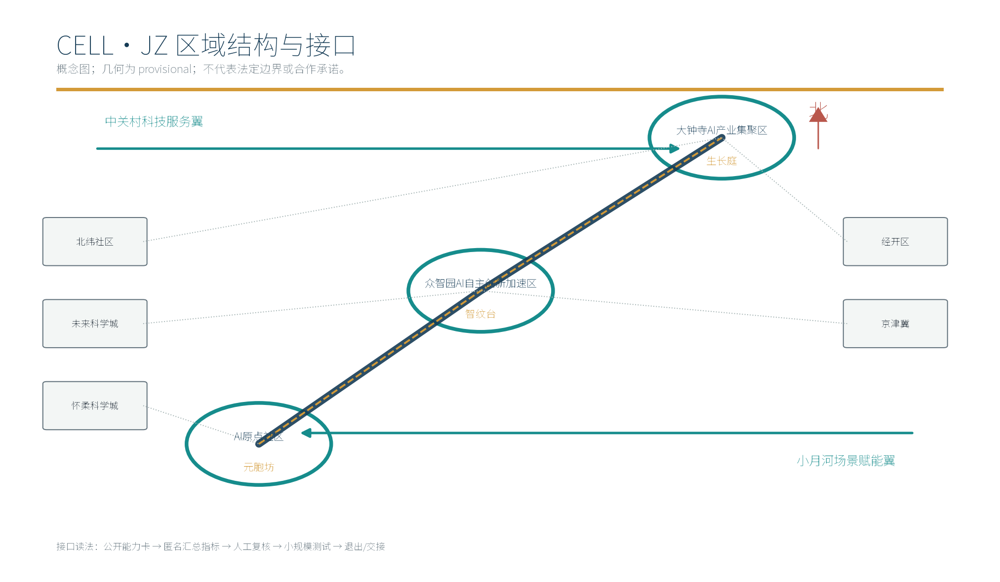
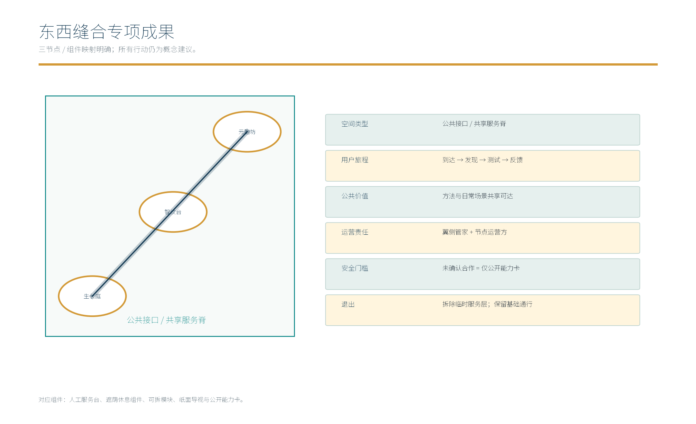
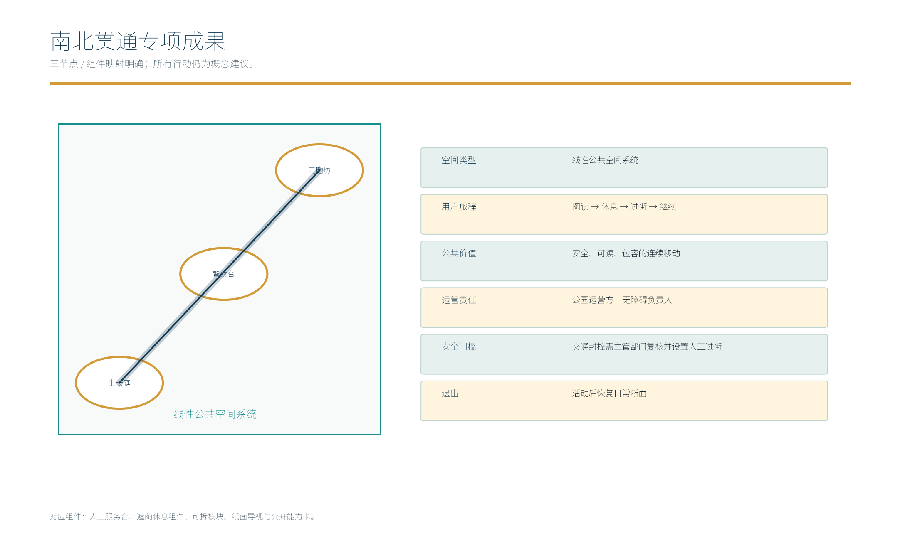
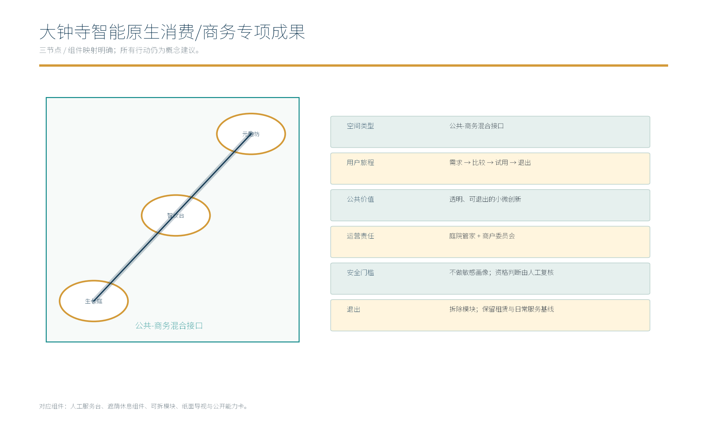
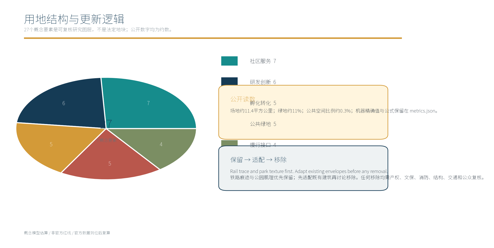
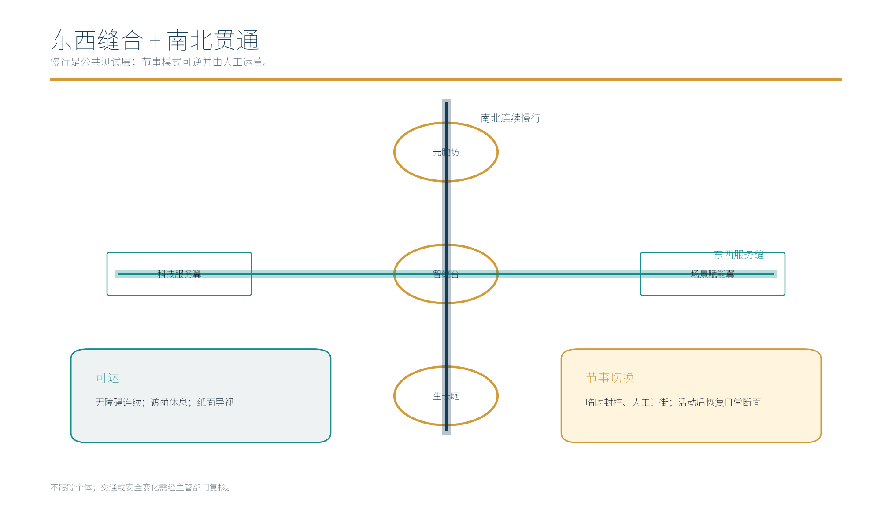

# 元胞智城（CELL·JZ）

本方案保留“元胞坊—智纹台—生长庭”的核心想法，但把它写成可试验、可复盘、可退出的城市设计交付，而不是已批准的规划。`geometry/*.geojson` 是自产 provisional 概念几何；所有外部关系、合作、权利、审批和实施均不作事实声称。[source:DATA-SRC-OFFICIAL-ANNOUNCEMENT-20260509]

## 设计依据与资料清单

公告与任务书提供项目定位、三层范围、三区两翼和 agent.1–agent.6 任务；公开标准用于方法参照；本包几何、指标和场景是假设层。来源、URL、许可、可用范围和禁止用途见 `sources.json`；官方资料不能推导未公开红线、控规、产权、交通或合作。[source:DATA-SRC-AGENT-TASKBOOK-20260518]

### 证据分层

**官方/已清理资料**：项目公告和任务书。**公开案例**：只支撑机制比较。**自产数据**：几何、指标和场景卡，均在页面就近标“概念模型估算/非官方红线/官方数据到位后复算”。[standard:PROJECT-OFFICIAL-ANNOUNCEMENT]

## 三层范围工作框架

机器证据锚点：`[depth:three_level_scope_framework]`。本节将设计意图、可核验来源、几何/指标影响和待补数据分开记录；这些内容是概念研究交付，不是法定结论。

|层级|空间决策与交付|本包证据|边界|
|---|---|---|---|
|统筹研究范围|区域协同、八要素生态、8个全球机制案例|`site-overview.png`、agent.1/2 表|不绘制法定边界|
|总体设计范围|三节点连续结构、27个概念用地要素、慢行蓝绿骨架|`site-boundary.geojson`、`metrics.json`|场地约11.4平方公里，待官方 GIS 复算|
|重点区域详细设计|三节点机制、10张场景卡、3个产业协议、分期矩阵|`key-areas.png`、三张专项成果图|不替代控规、工程或消防图则|

## 统筹研究范围产业与未来城市研究

### agent.1 任务书—空间—机制—成果总表

|任务/定位|空间落位|独有机制|可核验成果|
|---|---|---|---|
|三大定位：百年京张文化带|智纹台、遗产公园入口|来源标签—人工讲解—双语导视|文化系统图、L1、`culture-system.png`|
|三大定位：都市 AI 生活体验带|元胞坊、生长庭日常界面|匿名聚合—人工复核—退出|S01–S06 场景卡、生活服务协议|
|三大定位：AI 融合创新带|智纹台开发者台、生长庭开放实验室|能力卡—小规模测试—独立复盘|8要素图谱、3产业协议|
|五大功能：自主创新体系|智纹台+中关村科技服务翼|公开议题池、开发者社区、无敏感画像|agent.2生态图、O1/O2运营卡|
|五大功能：世界级创新生态|统筹研究层、京津冀接口|可追溯案例、在地转译、不可推断边界|8个全球案例及`ecosystem-atlas.png`|
|五大功能：AI+场景范式|三节点+小月河场景赋能翼|10张场景卡、3个产业测试协议|`scenario-cards.png`、P01–P03|
|五大功能：智能活力城市|慢行脊、公共服务台、节事模式|日常/节事切换，活动后恢复|`mobility-bluegreen.png`、节点决策卡|
|五大功能：AI治理全球话语权|公共展示与国际传播|英文实质等值、权利台账、人工问责|中英 HTML/PDF、`metrics-evidence.png`|
|agent.1|总览结构、命名、Logo与接口|三节点一序列、三区两翼一张图|本节与`site-overview`|
|agent.2|生态案例和八要素|8案例→在地机制卡|本节后“全球机制案例”|
|agent.3|用户、场景、产业测试|10卡+3协议+5画像|“AI+场景”小节|
|agent.4|空间、铁路文化、三个专项成果|三个节点+三张专项图+组件|“重点区域”小节|
|agent.5|文化系统与国际传播|三层文化表、导视层级、双语文案|“蓝绿空间”小节|
|agent.6|运营、活动、招引转化|年度节目、社区、RACI、退出|“实施政策”小节|

### 五个外部接口：概念对象、资源流与双向收益

|对象|概念资源流/接口|对本案收益|对方可获得的可交付|状态、不可推断与退出|
|---|---|---|---|
|北纬社区|社区问题卡→匿名汇总→人工服务台|把老年、亲子和无障碍需求变成可测试服务|纸面导视、体验复盘模板|未授权不采集、不部署；仅保留离线演示|
|未来科学城|算力/模型能力卡→离线负荷测试|验证模型在城市服务中的边界|公开方法卡和失败清单|未确认资源，不写合作；改为模拟即退出|
|怀柔科学城|公开 API/数据字典对照→形态绩效复盘|把科研能力转成可读展陈|双语案例与数据字典样例|没有共享协议只做纸面研究|
|经开区|脱敏运维指标模板→构件维护测试|验证生长庭模块可修、可拆|维护培训卡和验收表|不写采购、招商、订单；企业不确认即停|
|京津冀|公开标准/跨城议题→青年设计营|获得可复制传播接口|中英工具包和活动复盘|无主办方确认不使用标识，活动可取消|

### 全球 AI 生态机制案例（8个，均非合作）

|ID/案例/来源|机制|在地转译|不可推断边界|
|---|---|---|---|
|C01 High Line；`SRC-GLOBAL-HIGHLINE`|遗产/基础设施转为连续公共空间，依靠运营叙事|京张线性遗产界面+可拆导视|不复制设计资产、不声称合作|
|C02 Seoullo 7017；`SRC-GLOBAL-SEOULLO`|基础设施步行化与节点串联|慢行脊连接三节点，活动后恢复日常|不推导交通审批或同等客流|
|C03 Fab City；`SRC-GLOBAL-FABCITY`|地方制造、开放知识与循环生产|生长庭开放实验室、构件维修台|不推导当地供应链或产业规模|
|C04 Station F；`SRC-GLOBAL-STATIONF`|企业、人才、服务集中于共享创新平台|智纹台开发者议题池和服务卡|不声称招商、入驻、投资关系|
|C05 AI Verify Foundation；`SRC-GLOBAL-AIVERIFY`|AI 测试、透明和治理工具|三产业协议加入影响评估、人工复核、退出|不声称认证、不自动授予合规|
|C06 NIST AI RMF；`SRC-GLOBAL-NIST-AI-RMF`|风险识别、测量、管理、治理|场景卡的失败模式、责任人和停退条件|非中国法律意见，不替代主管审查|
|C07 The 606；`SRC-GLOBAL-606`|线性公共空间带动社区连接和日常使用|小月河场景赋能翼的连续开放空间|不复制品牌、资金或组织结构|
|C08 Algorithm Register；`SRC-GLOBAL-ALGO-REGISTER`|公开算法说明与公众可理解性|公共 AI 能力卡和可下载的规则说明|不声称政府登记，不放个人数据|

八要素闭环为：**土地**（保留/适配/退出清单）—**空间**（三节点和组件）—**产业**（3协议）—**资金**（公开小额测试预算，待确认）—**人才**（开发者/讲解员/无障碍体验员）—**算力**（能力卡、离线优先）—**数据**（匿名聚合、最小化）—**场景**（10卡、人工复核）。资金、合作与算力均为待核验假设，不写承诺。[source:DATA-SRC-PROVISIONAL-BOUNDARIES-20260605]

## 总体设计范围城市更新与控规深度城市设计

### 空间语法与三区两翼

**元胞坊**是混合单元：居住、研发、孵化、社区服务在可步行范围内叠合；**智纹台**是铁路遗产与公共服务的低功耗接口；**生长庭**是可拆、可换位、可修复的构件库。三者依次落入 AI原点社区、众智园AI自主创新加速区、大钟寺AI产业集聚区；中关村科技服务翼提供方法/人才，小月河场景赋能翼提供慢行/蓝绿/日常测试。容积率、高度、产权、红线和工程条件待官方资料核验。[source:DATA-SRC-MOHURD-CONTROL-DETAILED-PLANNING]

三节点剖面为“公共基底—人工服务层—可选数字层”：公共基底保证通行、休息和导视；人工服务层负责解释、申诉和现场判断；数字层只显示公开信息和延迟匿名汇总，缺数据时回退纸面服务。

## 重点区域详细设计

机器证据锚点：`[depth:key_area_design]`。本节将设计意图、可核验来源、几何/指标影响和待补数据分开记录；这些内容是概念研究交付，不是法定结论。

### agent.4 三个节点与三个专项成果

|专项成果|空间类型与组件|用户旅程/公共价值|运营、安全门槛、退出|图件|
|---|---|---|---|---|
|东西缝合|科技服务翼—三节点—场景赋能翼；能力卡、服务台|到达→发现→测试→反馈；让方法与日常场景互通|翼侧管家+节点运营；未确认合作不接入；拆临时服务层、保留通行|`east-west-seam.png`|
|南北贯通|遗产绿廊+无障碍慢行；遮荫、休息、人工过街|阅读→休息→过街→继续；安全、可读、包容|公园方+无障碍负责人；交通封控需复核；节事后恢复日常|`north-south-continuity.png`|
|大钟寺智能原生消费/商务|可逆庭院+首层店铺实验室；模块、公开能力卡|需求→比较→试用→退出；透明可退出的小微创新|庭院管家+商户委员会；不做敏感画像；拆模块、保留租赁基线|`dazhongsi-commerce.png`|

### 三个 AI 地标与组件库

|地标|独有机制|空间原型|公共荣誉/人工兜底|实施边界|
|---|---|---|---|---|
|L1 京张时纹门|来源可追溯时间线+人工讲解|遗产入口门架、纸面导览|只展示已核验公开荣誉；无屏幕也能阅读|不复制文保构筑物，不作文保结论|
|L2 智纹问答台|公共问题卡+人工转介|遮荫台、服务台、低功耗屏|问题未命中即转人工，不作资格决定|不收原始个人数据|
|L3 生长构件庭|模块预约+结构/消防/无障碍复核|可逆展台、维修台、培训角|停用即拆卸，纸面记录保留|不替代施工图或验收|

CELL·JZ Logo 是本方案的概念身份标记，文化标识另设来源标签，二者不合并。组件包括：遮荫/休息包、人工服务台、纸面导视、可拆模块、能力卡展板、匿名计数器（仅在授权且聚合时可选）。

## AI 创新生态、人才画像与 AI+ 场景

机器证据锚点：`[depth:ai_scene_framework]`。本节将设计意图、可核验来源、几何/指标影响和待补数据分开记录；这些内容是概念研究交付，不是法定结论。

### 五类画像与十张完整场景卡

画像：社区居民/家长、无障碍体验员、开发者/学生、运维企业、文化讲解员。以下场景卡是概念测试协议，不是已部署系统；输入状态中的“公开/拟议/UNKNOWN”不得被解释为已有数据。

|ID|用户/空间/问题|输入及来源状态|模型职责→输出|人工兜底/隐私|失败、责任、成熟度、KPI|
|---|---|---|---|---|---|
|S01|居民/元胞坊服务台/找公共服务|公开服务目录；拟议需求卡|检索排序→路线与纸面清单|服务员复核；不存身份|错配→人工；社区运营；M0；首问解决率|
|S02|家长/元胞坊院落/安全步行|公开路网+现场人工记录|规则校验→推荐低风险路径|人工过街；不采集轨迹|封路→现场改线；公园方；M0；可达率|
|S03|无障碍体验员/智纹台/坡道断点|拟议无障碍清单；UNKNOWN现场状态|差异比对→问题卡|体验员确认；不上传原始影像|误报→人工复核；无障碍负责人；M0；闭环时长|
|S04|访客/智纹台/理解京张历史|公开来源标签|摘要生成→双语卡片|讲解员审稿；不推断史实|来源不足→不发布；文化运营；M1；核验率|
|S05|开发者/智纹台/找测试场景|公开能力卡+用户主动填写|主题匹配→议题池|人工审核资格；最小化联系方式|不匹配→退回人工；开发者社区；M0；复用率|
|S06|社区组织/智纹台/办小活动|公开时间窗+拟议需求|冲突检查→预约草案|运营方确认；不画像|冲突→人工协调；节点运营；M0；按时率|
|S07|运维企业/生长庭/预测模块维护|脱敏设备指标模板；非现场真实数据|异常聚类→维护优先级|工程人员复核；不传设备个人信息|漂移→停用；设施方；M1；误报率|
|S08|创业团队/生长庭/验证低风险原型|公开规则+团队自报|规则清单→测试证据包|安全员签核；不收商业机密|超范围→退出；庭院管家；M0；通过率|
|S09|商户/生长庭首层/理解客流需求|仅匿名计数；拟议且须授权|趋势汇总→经营提示|商户人工决定；不做个体画像|样本偏差→不发布；商户委员会；M0；采纳率|
|S10|国际访客/遗产入口/获取双语导视|公开文案+来源状态|翻译辅助→双语导视草案|人工译审；不自动发布|术语冲突→人工改写；文化运营；M1；译审通过率|

### 三个产业测试协议

|协议|基线→小测→独立复核|三区两翼映射|停退条件|
|---|---|---|---|
|P01 低风险能耗|公开/脱敏基线→生长庭单模块→设施方复核|大钟寺区+经开区接口+科技服务翼|数据漂移、误报或安全不明即停|
|P02 无障碍连续|人工基线→元胞坊—智纹台一段→体验员复核|AI原点社区+小月河翼+北纬接口|无法保证连续通行即撤设备、回纸面|
|P03 开放场景|公开议题→智纹台/生长庭小活动→社区/运营复盘|众智园区+中关村翼+京津冀传播接口|无人工责任、权利不清或投诉未闭环即取消|

## 用地、建筑规模与拆改留方案

机器证据锚点：`[metric:site_area_sqm]`。本节将设计意图、可核验来源、几何/指标影响和待补数据分开记录；这些内容是概念研究交付，不是法定结论。

本包统计27个概念要素，不等于27个法定地块。统计的设计意图是把保留、适配、公共空间和慢行接口放进同一张可复核清单，使后续官方 GIS 到位时能够逐项替换，而不是把概念分区冒充控规地块。几何影响包括边界面积、绿色空间并集、公共空间并集和建筑再利用包络，指标影响包括绿地比例、公共空间比例与节点数量；当前几何均为参与者自产 provisional，低置信度项不能作为容积率、建筑高度、拆改量或工程投资依据。统计的设计意图是把保留、适配、公共空间和慢行接口放进同一张可复核清单，使后续官方 GIS 到位时能够逐项替换，而不是把概念分区冒充控规地块。几何影响包括边界面积、绿色空间并集、公共空间并集和建筑再利用包络，指标影响包括绿地比例、公共空间比例与节点数量；当前几何均为参与者自产 provisional，低置信度项不能作为容积率、建筑高度、拆改量或工程投资依据。公开展示使用场地约11.4平方公里、绿地约11%、公共空间比例约0.3%；这些是**概念模型估算/非官方红线/官方数据到位后复算**。精确值、公式、来源文件和置信度只保留在 `metrics.json`。采用“保留—适配—移除”决策：铁路、公园纹理先保留；既有建筑优先适配；任何移除需要产权、文保、结构、消防、交通和公众复核。

## 交通、轨道、市政与公共服务设施

本节的设计意图是把铁路遗产阅读、日常慢行、无障碍连续和公共服务放进同一条可暂停的测试链。本节的设计意图是把铁路遗产阅读、日常慢行、无障碍连续和公共服务放进同一条可暂停的测试链。南北慢行连续体由遗产绿廊、遮荫、坐凳、照明、无障碍坡道和人工过街组成；东西缝合由两翼能力卡、节点服务台和可逆活动边界完成。空间和数据缺口包括轨道接口、道路断面、消防疏散、市政容量、无障碍实测、照明电力、雨洪条件和活动时段，这些均为 UNKNOWN，不能从概念线形或场地面积反推出工程结论。几何影响是慢行和公共空间图层需要在官方底图上重新对齐，指标影响是节点连通率、可达率和活动恢复时间必须经现场基线校准。日常模式保持连续通行，节事模式由人工值守并在结束后恢复；若安全、产权或管理责任无法确认，立即撤除临时设施，回退纸面导视和人工服务。东西缝合由中关村科技服务翼和小月河场景赋能翼连接三节点。日常模式保持连续通行，节事模式采用临时边界、人工引导和活动后恢复。供水、电力、消防、轨道接口、道路红线和容量均为 UNKNOWN，待主管部门资料和现场核验；不得从概念图推导工程结论。[source:DATA-SRC-BARRIER-FREE-ENVIRONMENT-LAW]

## 蓝绿空间、公共空间与城市风貌

机器证据锚点：`[source:DATA-SRC-OFFICIAL-ANNOUNCEMENT-20260509]`。本节将设计意图、可核验来源、几何/指标影响和待补数据分开记录；这些内容是概念研究交付，不是法定结论。

### 三层文化资源系统

|文化层|公开来源与解释边界|空间载体|导视层级|权利状态/双语传播文案|
|---|---|---|---|---|
|京张历史资源|公开铁路史料；不补写未核验故事|L1、时间线、入口门|来源标签→双语说明|参考使用，逐条核验；“从铁路遗产读懂城市连接 / Read the city through railway heritage.”|
|中关村创新文化|公开创新叙事；不写企业背书|科技服务翼、创客墙|主题标签→案例卡|文本需注明来源；“把研究变成可共享的方法 / Turn research into shareable methods.”|
|AI新文化系统|本方案提出的未来概念；非官方文化|智纹台、生长庭开放实验室|概念标识→活动导视|CELL·JZ 与文化标识分开；“共同测试，人工负责 / Test together, keep humans accountable.”|

蓝绿系统不追求屏幕密度，而以可读导视、遮荫休息、雨水花园和可拆构件形成日常公共性。视觉交付中的数值使用约数，所有 UNKNOWN、NULL、provisional 和非审批边界就近标识。

## 更新项目清单、实施政策与分期计划

机器证据锚点：`[depth:implementation_phasing]`。本节将设计意图、可核验来源、几何/指标影响和待补数据分开记录；这些内容是概念研究交付，不是法定结论。

### 节点实施决策卡与 RACI

|阶段|项目|牵头/协作|前置—建设—运维—验收|退出|
|---|---|---|---|---|
|0 研究|公开能力卡、来源台账、基线|项目研究牵头/社区、文化、无障碍顾问|资料核验—不建设—人工维护—证据复核|来源不清即不发布|
|1 小测|一段慢行、一处服务台、一模块|节点运营/设施、交通、社区|授权和安全门槛—可拆安装—每日巡检—独立复盘|投诉未闭环或风险不明即撤|
|2 扩展|三节点与两翼工具包|项目牵头/合作主体待确认|评估通过—分期建设—公开运营—年度审计|成本、可达或权利不满足即缩回|

RACI（概念）：项目牵头 A；节点运营 R；社区/无障碍/文化顾问 C；公众和开发者 I；法定主管部门在审批事项上拥有最终决定。不得把未确认机构写成已同意。

### 开放运营、社区与转化

开发者社区每月一次公开议题、季度一次失败复盘；场景开放采用“申请—权利审查—人工安全审查—小测—公开复盘”；年度活动包括京张历史周、AI 公共服务周、可逆构件营。企业/人才转化只通过公开能力卡、人才工作坊和方法展示发生，不承诺招商、融资、入驻或采购。国际传播提供中英文页面、来源标签和可下载工具包。

## 指标体系、面积复算与合规矩阵

机器证据锚点：`[metric:global_case_count]`。本节将设计意图、可核验来源、几何/指标影响和待补数据分开记录；这些内容是概念研究交付，不是法定结论。

机器指标保留：`site_area_sqm`、`green_space_area_sqm`、`public_space_area_sqm` 及公式在 `metrics.json`；人类读数统一约数。内容交付口径为：8个全球机制案例、10张场景卡、3个产业测试协议、5类画像、3个概念 AI 地标、27个概念用地要素、3阶段实施。任何指标都不能证明审批、合作或部署；官方 GIS 到位后必须复算并更新 manifest。

### 三句 AI 治理红线

只允许匿名聚合，不采集或持续识别个人原始数据。任何影响权益、资格、安全或资源分配的判断必须由人工复核并提供申诉。无法解释、无权利、无责任人或无法退出的场景不部署，回退纸面服务。

## 风险、版权与合规说明

机器证据锚点：`[source:DATA-SRC-AGENT-TASKBOOK-20260518]`。本节将设计意图、可核验来源、几何/指标影响和待补数据分开记录；这些内容是概念研究交付，不是法定结论。

本节的设计意图是让每个案例、文化叙事、图形资产和品牌标识都有可追溯的权利状态、可用范围、禁止用途和替代路径。几何和指标只作概念模型证据，UNKNOWN/NULL 必须进入后续核验；任何缺乏权利、责任人、人工复核或退出机制的场景都不发布。本节的设计意图是让每个案例、文化叙事、图形资产和品牌标识都有可追溯的权利状态、可用范围、禁止用途和替代路径。几何和指标只作概念模型证据，UNKNOWN/NULL 必须进入后续核验；任何缺乏权利、责任人、人工复核或退出机制的场景都不发布。`sources.json` 为权利台账：每个全球案例、文化层和图形资产均有 URL、许可摘要、可用范围和禁止用途；案例只作文字机制参考，不复制图片、Logo、数据集或品牌，不声称合作。CELL·JZ 名称/标识是概念建议，文化标识设替代方案：若检索冲突，改用“京张智链 / JZ Civic Weave”，并移除冲突图形。所有数字和几何的置信度写在 `metrics.json`/`assumptions.json`；`UNKNOWN` 和 `NULL` 必须进入后续核验清单。

## 参考资料

机器证据锚点：`[source:SRC-GLOBAL-HIGHLINE]`。本节将设计意图、可核验来源、几何/指标影响和待补数据分开记录；这些内容是概念研究交付，不是法定结论。

官方与方法来源：`DATA-SRC-OFFICIAL-ANNOUNCEMENT-20260509`、`DATA-SRC-AGENT-TASKBOOK-20260518`、`DATA-SRC-MOHURD-URBAN-DESIGN-MEASURES`、`DATA-SRC-MOHURD-CONTROL-DETAILED-PLANNING`、`DATA-SRC-BARRIER-FREE-ENVIRONMENT-LAW`。全球案例：`SRC-GLOBAL-HIGHLINE`、`SRC-GLOBAL-SEOULLO`、`SRC-GLOBAL-FABCITY`、`SRC-GLOBAL-STATIONF`、`SRC-GLOBAL-AIVERIFY`、`SRC-GLOBAL-NIST-AI-RMF`、`SRC-GLOBAL-606`、`SRC-GLOBAL-ALGO-REGISTER`。URL、访问日期和许可边界均见 `sources.json`。

