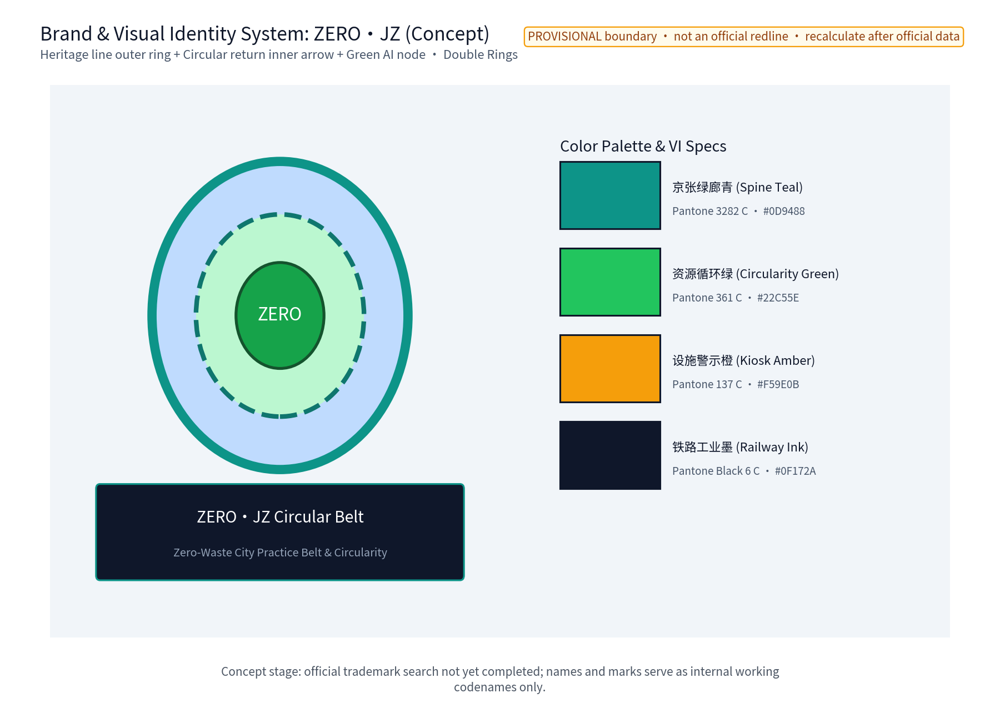
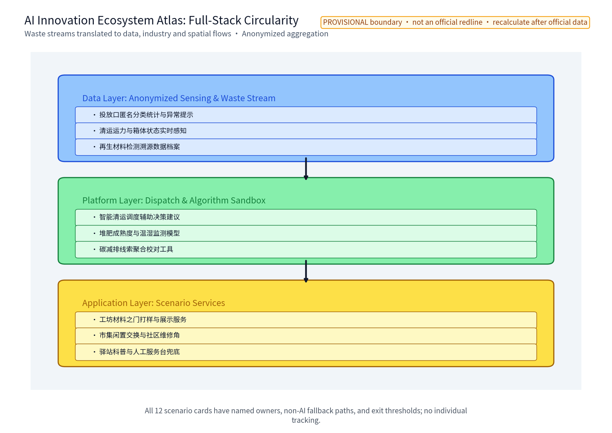
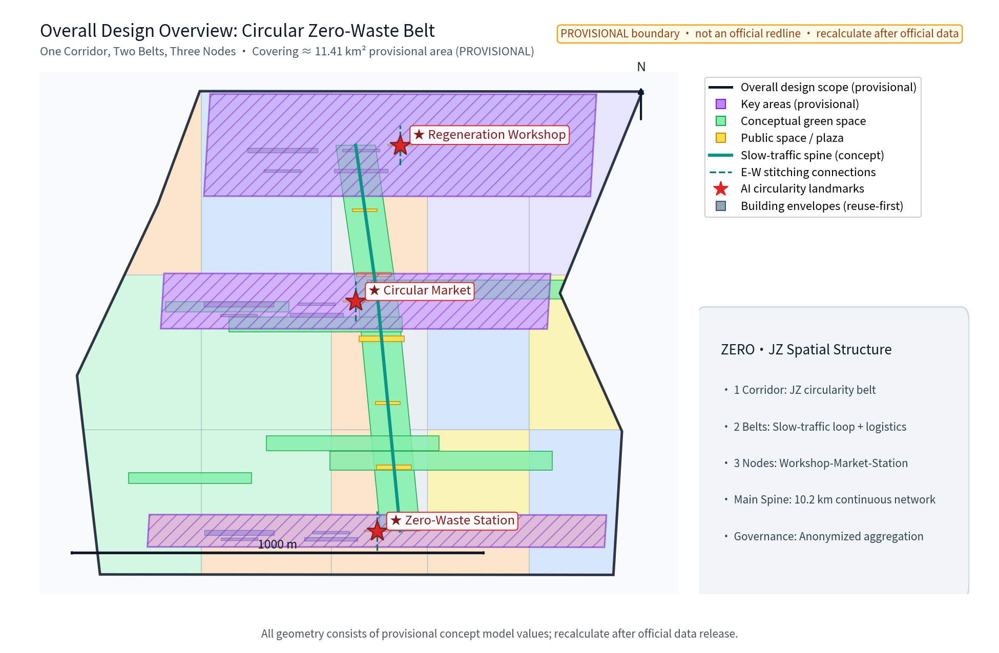
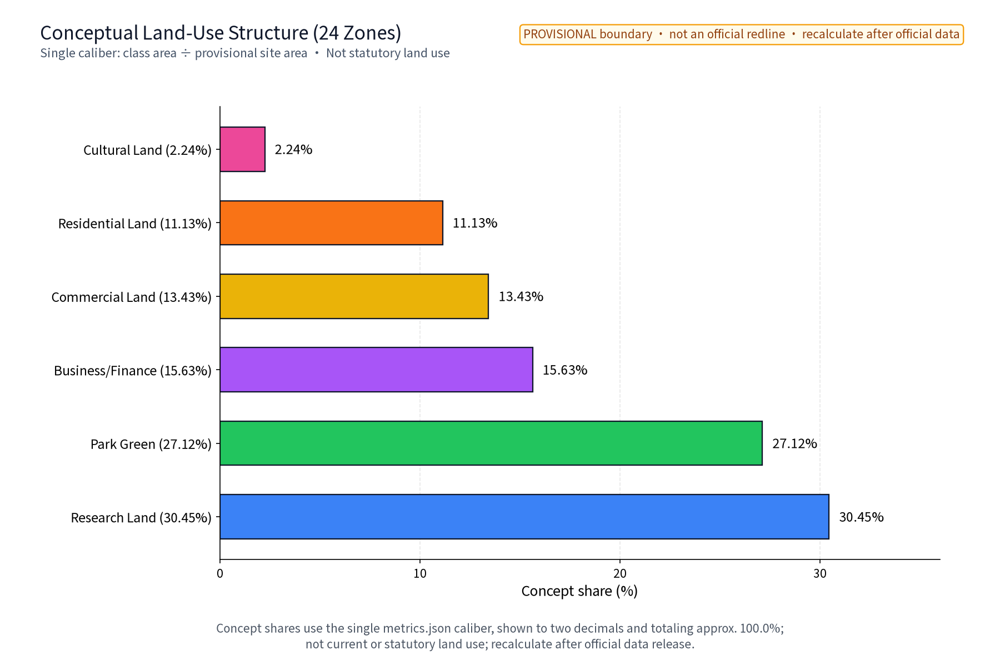
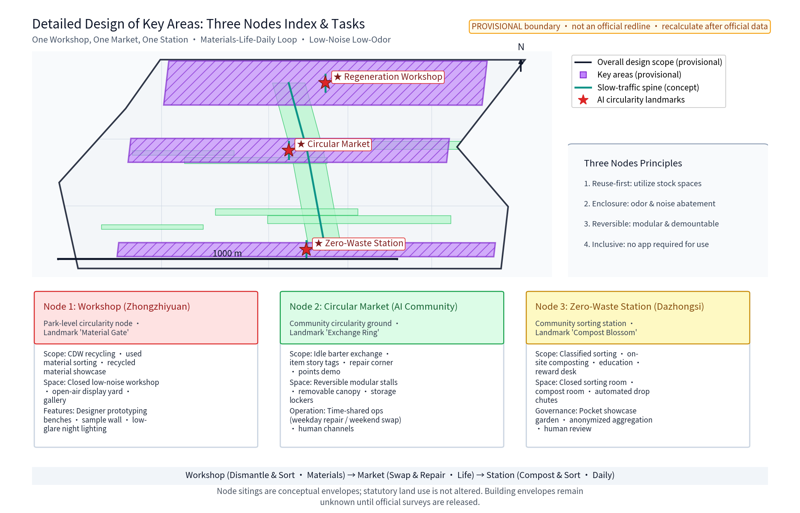
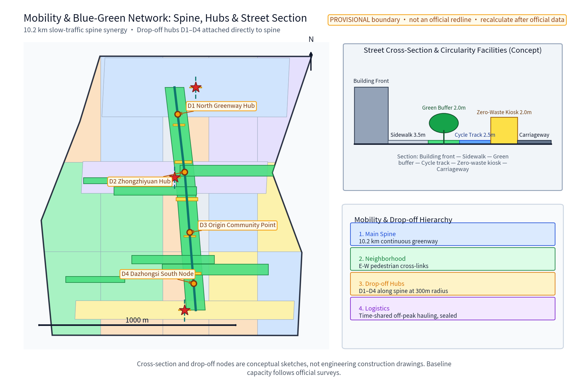
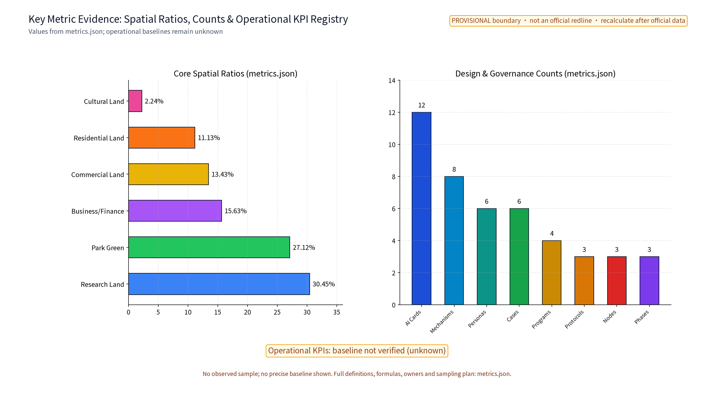

> The belt's "waste flows" are translated into resource-circularity scenes residents pass daily, dwell at, and can read results from. One workshop, one market, one station, six personas, 12 AI+ scenario cards and an eight-mechanism table form "ZERO·JZ"; everything is a concept proposal on a provisional boundary with participant provisional model data, to be fully recalculated when official data is published.

## Design Basis and Source List

The controlling bases are the published open-call announcement, the agent taskbook, the site package, the public information registration table and the fact pack. The taskbook's three major positions, five major functions, three zones and two wings, and agent.1–6 tasks form the skeleton this proposal responds to section by section; the submission skill defines the section organization. This proposal responds to the low-carbon green innovation environment dimension, referencing the national "zero-waste city" initiative and public resource-circularity policy directions—waste reduction, recovery and harmless treatment, and the linkage between classified collection and recyclable resource systems. These are public directional statements cited as directions only; no unverified figures or commitments are cited or restated.

**Official scope hierarchy (announcement wording)**: coordinated research area approx. 43.6 km², overall design area approx. 11.4 km², key areas approx. 368.4 ha, nested top-down. This package's geometry and figures belong to a conceptual sub-scope at the overall design area level: the submitted site_boundary provisional polygon of approx. 11.41 km² (provisional participant model data, not an official redline), and three key-area conceptual envelopes derived from announcement clues. When official geometry is published, all area-based metrics are recalculated wholesale with the same formulas.

Boundary and geometry materials: the repository has not published official overall boundaries or key-area polygons; this proposal uses publicly traceable provisional constraints (provisional_constraint) for concept generation, machine validation and replacement recalculation only. They do not constitute statutory redlines, ownership, planning permission or engineering positioning. Baseline diagnosis, precision limits and replacement requirements are recorded in the design depth matrix.

Reference-case materials: six global cases—Shenzhen zero-waste city pilot, Shanghai classified collection and "two networks integration", Japan's Basic Act for Establishing a Sound Material-Cycle Society and 3R framework, Copenhagen's Circular Copenhagen resource and waste management plan, Singapore's Zero Waste Masterplan, and the EU Circular Economy Action Plan—are registered per-item (CASE-* ids) in sources.json with publisher, access date, reuse boundary and license. Only mechanism-level summaries are used; no data or imagery is copied.

> **Evidence anchors**: [source:DATA-SRC-OFFICIAL-ANNOUNCEMENT], [source:DATA-SRC-AGENT-TASKBOOK] (announcement and taskbook are the textual basis).

## Three-Level Scope Framework

The three scope levels are linked by a responsibility chain of "resource flow—spatial facilities—operation mechanisms—metric evidence", and the package's position within the official hierarchy is explicit (table below). The coordinated research area answers how the recycling industry and AI support the belt's innovation ecosystem: waste flows are read as entry points for data and industry flows, producing an AI ecosystem atlas, industry–space mapping, six personas and 12 AI+ scenario cards. The overall design area translates research into the "one corridor, two belts, three nodes" spatial structure: a resource-circularity experience corridor along the Jingzhang heritage strip, a community collection route belt and a closed logistics belt, and three nodes—Regeneration Workshop, Circular Market, Zero-Waste Station. The key-area level resolves each node into function, spatial interface, operating shifts, acceptance conditions and decommissioning clauses.

| Level | Official scope | Package concept sub-scope | Main outputs |
| --- | --- | --- | --- |
| Coordinated research area | approx. 43.6 km² (announcement) | Industry & future city research chapter | Ecosystem atlas, industry–space mapping, eight-mechanism table |
| Overall design area | approx. 11.4 km² (announcement) | site_boundary provisional polygon (approx. 11.4 km²) | One corridor two belts three nodes; land use; networks; phasing |
| Key areas | approx. 368.4 ha (announcement) | three key_areas concept envelopes | Three concept prototypes, scenario cards, operating shifts |

Regional synergy (beyond the three key areas): five external interfaces are reserved—Beiwai Community (northward extension of community collection and circular market services), Future Science City (recycled-material R&D and traceability data exchange), Huairou Science City (materials-science validation), the Economic-Technological Development Area (processing and logistics capacity cooperation), and the Beijing–Tianjin–Hebei direction (cross-regional circulation and annual data exchange). Each interface is a concept protocol of "partner—resource exchange—validation mechanism", without presuming government commitments or inventing named projects.

Provisional polygon areas, green ratio and public-space ratio use the submitted geometry as the single caliber (provisional, low confidence); after official boundaries are published, all values are recalculated wholesale with the same formulas. The three key areas are rough concept envelopes from announcement clues, not official planned areas.

> **Evidence anchors**: [source:DATA-SRC-AGENT-TASKBOOK] (three-level division follows the taskbook's official wording).

## Coordinated Research Area: Industry and Future City Research

Against the three major positions and five major functions, the entry point is the "low-carbon green innovation environment": the urban AI living experience belt carries the zero-waste convention, circular market and outreach stations; the AI integration innovation belt carries the validation of 12 AI+ scenario cards; the Xiaoyue River scenario-enabling wing hosts scenario opening and public experience; the Zhongguancun technology-services wing links recycled-material supply chains and green factor allocation (concept).

### Naming System and Brand Direction

The Chinese name (ZERO-WASTE SMART LOOP, wordmark rendered in Chinese characters in the zh version) uses zero-waste as the value coordinate, AI as "smart", and resource circularity as the "loop"; the English name ZERO·JZ points to "zero waste" and "starting from zero", with JZ from the initials of Jing–Zhang. The naming is original and does not copy any city, park or company name. Logo concept (self-drawn in this package; no third-party graphics or fonts): the Jingzhang heritage strip arc as outer ring, a return-flow arrow as inner ring, and a green AI node, forming an interlocking "double ring" symbol meaning "workshop turns materials—market extends life—station guards daily life".

### Global AI and Resource-Circularity Ecosystem Cases (per-item sources)

| Case | Region | Public mechanism highlights | Relevance to this proposal | Source |
| --- | --- | --- | --- | --- |
| Zero-waste city pilot | Shenzhen | Institutional integration, source reduction, CDW reuse, collection network | Organization of a whole-chain institutional package and indicator system | CASE-SZ-2019 |
| Full classification & two networks | Shanghai | Classification legislation, 3-tier collection point–transfer station–bulk yard system | Collection network hierarchy and sanitation linkage interfaces | CASE-SH-2019 |
| Basic Act for Sound Material-Cycle Society | Japan | Statutory priority order (prevention–reuse–recycling–heat recovery–proper disposal), 3R, EPR principles | Institutionalized priority order and EPR expression | CASE-JP-2000 |
| Circular Copenhagen RAP | Copenhagen | High recycling with energy recovery, community reuse facilities | Low-disturbance collection facilities in dense urban fabric | CASE-DK-2019 |
| Zero Waste Masterplan | Singapore | 3R, integrated solid-waste management facilities | Land-efficient facilities combined with public education | CASE-SG-2019 |
| Circular Economy Action Plan | EU | Life-cycle product policy, secondary raw materials market, value-chain closure | Life-cycle closure and traceability frameworks | CASE-EU-2020 |

### Ecosystem Atlas and Industry–Space Mapping

"ZERO·JZ" merges waste flows into combined data flows, industry flows and spatial flows:

Industry–space mapping: sorting recognition maps to drop-off points, dispatch to logistics nodes, material tracing to the workshop sample wall, compost monitoring to the station compost room, carbon-effect tracking to public notice boards, repair matching to the market repair bench, bin-full prediction to drop-off points, and scenario experiments to the observation gallery test bench—a one-to-one "scenario–space" correspondence; on the industry side they form a five-class growth ladder (equipment, operations, testing, data, education) (concept only, no enterprises or investment presumed).

### Eight-Mechanism Table

| Mechanism | Concept action | Responsibility and validation | Data to be supplied |
| --- | --- | --- | --- |
| Land | Node sites prioritize existing edges and compound public-space use; no statutory land-use change | Single-caliber recalculation; re-cut after official regulatory plan | Statutory regulatory plan |
| Space | Reversible installations, light retrofit parts, time-shared operation | Prototype list and component-library versioning | Existing-building survey |
| Industry | Recycled-material preferential procurement, testing and prototyping ladder | Annual keep/modify/remove review of scenarios | Material-flow ledgers |
| Finance | Costs as qualitative tiers only (low/medium/high), no unbacked amounts | Tier table with method, price base year, confidence | Financial baseline |
| Talent | Six personas, developer community, volunteers and frontline worker training | Talent pathway and annual training review | Operator-side intent evidence |
| Compute | AI scenarios use existing public compute and lightweight models; no vendor presumed | Model evaluation and runtime monitoring baselines | Compute capacity catalogue |
| Data | Anonymized aggregates, no individual-identifying tracking, human review of key decisions | Data-quality checks, error stratification, annual disclosure | Waste/tonnage baseline data |
| Scenarios | Open application—review—pilot—annual review four-step flow | Documented opening flow and decommissioning rules | User participation survey |

> **Evidence anchors**: [source:DATA-SRC-PROVISIONAL-BOUNDARIES] (provisional boundary; research scope is conceptual only).

## Overall Design Area: Urban Renewal and Regulatory-Plan-Level Urban Design

The overall structure is "one corridor, two belts, three nodes" as described above. Corridor: the resource-circularity experience corridor conceptually linking the Jingzhang heritage strip, stitching communities east-west, carrying "visible circularity" outreach and recycled-material pavement demonstration segments (concept). Belts: the community walking collection route (integrated with the slow-traffic system) and the closed logistics belt (low-disturbance along existing roads). Nodes: Regeneration Workshop, Circular Market, Zero-Waste Station.

Regulatory-plan-level expression uses a "problem—spatial object—concept indicator—data gap—recalculation path" framework; it does not replace statutory regulatory planning, and gives no FAR, height, road redline or engineering conclusions. Urban renewal follows "stock-first, light retrofit, reversible, time-shared": nodes reuse existing buildings and public-space edges, the Circular Market uses reversible installations with time-shared operation, and the Zero-Waste Station embeds in public service facilities. All spatial proposals are framed as "concept suggestion", "reference scheme", "open for professional deepening".

Retain–renovate–demolish logic: verify existing conditions, ownership, heritage protection, structure and fire safety before discussing retain/light-modify/relocate/remove of concept components; no demolition area is proposed before surveys. Provisional recalculation follows the submitted geometry and is replaced when official data arrives.

**Single-caliber statement for conceptual land-use percentages**: all shares below derive solely from geometry/land_use.geojson projected in EPSG:4548; the aggregation rule is class area divided by provisional overall area; confidence is low (provisional); the recompute trigger is official geometry publication. These shares are concept model values and **do not represent current land use or any statutory plan**; after the official regulatory plan is published they are re-cut and recalculated with the same algorithm.

> **Evidence anchors**: [source:DATA-SRC-MOHURD-CONTROL-DETAILED-PLANNING], [source:DATA-SRC-PROVISIONAL-BOUNDARIES].

## Detailed Design of Key Areas

The three nodes form the loop "workshop turns materials—market extends life—station guards daily life", all designed closed, low-noise and low-odor; scale and siting are not concluded. The nodes double as the three AI landmark concept sites (table below).

### Regeneration Workshop (near Zhongzhiyuan AI autonomous innovation acceleration area)

Function: park-level resource-circularity practice node; concept scope covers CDW recovery, used-material sorting and recycled-material application display, plus AI scenario validation. Space: closed low-noise low-odor treatment room (concept), open-air recycled-material display yard, public observation gallery and teaching interface. Public experience: scheduled open days, recycled-material sample wall, designer prototyping benches.

### Circular Market (near Beijing AI Origin Community)

Function: community circularity ground for idle exchange, repair and second-life reuse. Space: reversible assemblies—modular stalls, removable canopy, storage units; time-shared operation: weekday repair corner, weekend exchange market; open, NIMBY-friendly interface. Public experience: barter stalls, repair benches, storage lockers, "item story" tags; the points and deposit concept is demonstrable at physical counters; paper, phone and human channels stay fully usable.

### Zero-Waste Station (near Dazhongsi AI industry cluster)

Function: community service point for classified collection, on-site food-waste treatment and recycled-material education. Space: closed sorting and compost rooms (concept), automated drop-off plus human service counter, education wall and pocket garden showing the "food waste—soil—food" loop. Public experience: no app needed for anyone to drop off or ask for help; anonymized records with human review; no individual-identifying tracking.

### Three AI Landmarks Design Catalogue (concept)

| Landmark | Theme | Catalogue essentials | Reversibility |
| --- | --- | --- | --- |
| Workshop "Material Gate" | dismantle–sort–regenerate | recycled-material cladding, observation gallery, prototyping bench, low-glare night lighting | componentized, demountable |
| Market "Exchange Ring" | second life for goods | modular stalls, removable canopy, storage units, item-story tags | fully reversible assemblies |
| Station "Compost Blossom" | food waste–soil–food | compost display segment, education wall, pocket garden, human service counter | lightweight embed in existing facilities |

### Honor Display System and Public-Space Component Library (concept)

Honor display: each node features a zero-waste honor wall—annual convention compliance, quarterly recognition of collection partners, green designer prototypes and resident volunteer contributions; all content reviewed by humans before publication; no sensitive personal data. Component library: eight component families (shade, seating, drop-off, wayfinding, notice board, storage, compost bin, service counter) share one module, are durable and repairable, and can be relocated wholesale; components pass structure, fire and accessibility checks before inclusion (concept checklist, not product selection).

Jingzhang–Zhongguancun–AI cultural wayfinding system: the heritage strip arc as graphic motif, overlaid with the Zhongguancun tech grid and an AI node symbol, unified naming, colors and information hierarchy; bilingual outreach texts explain each facility's cultural and circular meaning.

> **Evidence anchors**: [data:PACKAGE-GEOMETRY] (node polygons come from geometry/key_areas.geojson).

## AI Innovation Ecosystem, Personas, and AI+ Scenarios

The AI ecosystem loops "scenario—space—operation": all 12 AI+ scenario cards sit on ordinary, non-AI service paths; AI is only an assistive tool under anonymized aggregation and human review. Every scenario has a named responsible person, decommissioning conditions and annual review; no vendor or technology dependence is presumed. The ecosystem atlas is in the coordinated research chapter.

Six personas ([metric:persona_count]=6): community residents, property managers, collection partners, green designers, student visitors, and frontline collection workers (hauling and duty staff)—a full spectrum of "users—operators—creators—learners—workers".

| Persona | Needs and participation | Service interface |
| --- | --- | --- |
| Community resident | daily drop-off, points, idle exchange | drop-off points, market stalls, station counter |
| Property manager | facility upkeep, guidance, dashboard review | repair corner, work orders, station notice wall |
| Collection partner | micro collection business, dispatch confirmation | logistics nodes, dispatch desk |
| Green designer | samples, traceability records, prototyping | workshop sample wall and traceability terminal |
| Student visitor | outreach study, project learning, open days | observation gallery, education wall, market benches |
| Frontline collection worker | hauling, weighing, exception reporting, labor protection | logistics nodes, station duty desk, paper ledger |

### 12 AI+ Scenario Cards

| Scenario card | Core function | Data and review boundary | Spatial placement | Decommission or downgrade condition |
| --- | --- | --- | --- | --- |
| Sorting recognition AI | drop-off correction aid | anonymized aggregates only, human review, no individual-identifying tracking | drop-off point | sustained error-rate breach downgrades to indicator light |
| Collection dispatch AI | dispatch suggestions from bin status and capacity | executed only after dispatcher confirmation | logistics desk | manual scheduling when capacity baseline absent |
| Material tracing AI | batch "source–process–test" trace records | procurement reference only; test conclusions by certified bodies | workshop terminal | suspension of trace endorsement without certified tests |
| Compost monitoring AI | temperature, humidity, odor, maturity | advice reviewed by caretakers before action | station compost room | manual test-strip rounds when sensors fail |
| Carbon-effect tracking AI | node-level reduction clue estimation | draft disclosure reviewed by humans; not a substitute for professional accounting | notice board | method-only display before baselines exist |
| Bin-full prediction AI | overflow prediction and off-peak hints | anonymized bin-state aggregates, human review | drop-off points | falls back to scheduled patrols when samples are thin |
| Repair matching AI | repair items matched to repair-corner slots | anonymized booking aggregates, human confirmation | market repair bench | online booking closed when no bench time |
| Supply-demand matching AI | recycled-material demand vs batch supply | match suggestions only; transactions by humans | workshop hall | matching suspended without test certificates |
| Disclosure proofreading AI | consistency checks of disclosure drafts | suggestions adopted by humans | station office | reference-only before calibers settle |
| Visitor flow guidance AI | open-day flow and gallery limit hints | anonymized counts, human review | gallery entrance | manual flow control when devices fail |
| Compost maturity grading AI | maturity grading suggestions | reviewed by humans before garden use | community garden | grading stopped when review absent |
| Duty assistance AI | shift hints, ledger entry assistance | ledger confirmed by humans; paper stays parallel | station duty desk | full paper path when offline |

### Three Industry Test Scenarios (one-to-one with the metric)

[metric:industry_test_scenario_count]=3. The three scenarios enter pilot only through "application—test protocol—human review—failure threshold—complaint and decommissioning":

| Test scenario | Test protocol | Human review | Failure threshold | Complaint and decommissioning |
| --- | --- | --- | --- | --- |
| Sorting recognition AI trial | Single drop-off point, ≥30 days, real environment, dual-track with manual ledger; benchmark and field samples stratified | daily 20% sampling of records; weekly review report | error rate >15% for 7 consecutive days, or valid recognition <80% | ≥3 resident complaints suspend AI hints and switch to human guidance; decommission after 14 consecutive days over threshold |
| Dispatch AI shadow validation | 60 days parallel with existing dispatch; suggestions only; compared with human results | dispatcher confirms each suggestion and records deviation | adoption <50%, or overflow prediction error >2 h in >30% of cases | any indicator below target for two weeks exits shadow mode; appeal channel at station notice board |
| Carbon tracking pilot estimate | One node, one quarter; methodology disclosed before trial; compared with professional accounting | quarterly draft reviewed and retained | deviation >20% from professional accounting, or caliber cannot close | deviation breach stops numeric disclosure and switches to method display; annual review decides keep/modify/remove |

### AI Technical Protocols and Governance

Model evaluation: sorting and compost scenarios complete benchmark testing before pilot (annotated samples, field samples, bias samples in three strata). Data quality: monthly completeness, consistency and timeliness checks on drop-off, dispatch and ledger data. Error stratification: error rates grouped by time slot, bin type, weather and population characteristics to locate systemic errors, never individuals. Runtime monitoring: error rate, adoption rate and ledger completeness monitored weekly with public summaries. Privacy boundary: sorting recognition is anonymized aggregation with human review only; no face or unnecessary personal data collected; all outputs are withdrawable and deletable; complaint and human-review mechanisms are in place before deployment.

### Key-Population Service Journeys (digital and human paths of equal rights)

| Population | Digital path | Equivalent human path | Accessibility and equity measures | Pilot acceptance |
| --- | --- | --- | --- | --- |
| Seniors | large-type hints, phone booking | full counter assistance, paper registration | voice hints, seating and ramps, no-queue assistance | aging walkthrough and elder interviews |
| Children/carers | family demo mode | educator-led gallery tours | low education height, pinch-safe drop-offs | parent-child test and safety inspection |
| Persons with disabilities | accessible drop-off and voice prompts | assisted drop-off and retrieval | wheelchair routes, low counters, braille and large wayfinding | accessibility special acceptance |
| People without smartphones | hotline and community proxy registration | paper, phone, human triple channels | full offline and device-failure paths | offline drill in acceptance |
| Frontline collection workers | duty terminal and ledger | paper ledger, face-to-face handover | labor protection, transparent hours and rotation | labor-condition check and anonymous feedback |

Scenario–space–operation mapping: the 12 cards fall on the workshop gallery and prototyping room, market repair bench, drop-off points, station compost room and notice boards; operationally each binds a named responsible person, non-AI equivalent path, decommission triggers and annual disclosure; the card set spans transport (rail interchange and slow-traffic hints), public services (inquiries and assistance), culture (outreach display) and governance (disclosure and deliberation) interfaces.

> **Evidence anchors**: [source:DATA-SRC-GENERATIVE-AI-INTERIM-MEASURES] (reference for generative-AI governance wording).

## Land Use, Building Scale, and Retain-Renovate-Demolish Strategy

Land use uses the repository-allowed classification codes, covers the provisional overall area completely without gaps, and follows a **single caliber**: geometry/land_use.geojson (EPSG:4548 projection; class area ÷ provisional overall area; low confidence, provisional; re-cut with the same algorithm when the official regulatory plan arrives). Concept shares—research approx. 30.45%, park green approx. 27.12%, business/finance approx. 15.63%, commercial approx. 13.43%, residential approx. 11.13%, cultural approx. 2.24% (approx. 100% after rounding)—are concept model values and **do not represent current or statutory land use**; no FAR, height or scale conclusions are derived from any percentage. The three nodes use indicative combinations of public administration and service, commercial service, and green/facility categories (concept), without changing statutory land-use designations.

Building scale stays conclusion-free: only concept envelopes are defined—reversible installations, light-retrofit components and service porches. FAR, building height and footprint remain unknown (value null; reason: dependence on unpublished official regulatory plans and building surveys), recalculated when official data is published.

Retain–renovate–demolish in four steps: verify existing conditions and rights; retain when safety, heritage and function are satisfied; light-modify for service, accessibility, fire and energy needs; relocate or remove concept components when requirements conflict. No plot-level conclusion before surveys and official data. Character follows restrained industrial scale, recycled-material cladding segments and low-glare night lighting—not "AI styling"; land areas, green ratio and public-space ratio are provisional model values replaced upon official geometry release.

> **Evidence anchors**: [source:DATA-SRC-MNR-LAND-USE-CLASSIFICATION-202311] (land-use class names follow the current national caliber).

## Transport, Rail, Municipal Infrastructure, and Public Services

Collection routes integrate with the slow-traffic system: community drop-offs along slow paths form a walking "drop—store—haul" route sharing sections and furniture with shade, seating and wayfinding—collection becomes an en-route daily act rather than a special trip (concept; no road redline, section or quantity conclusions). Closed logistics nodes sit at existing road edges and site margins with enclosed loading, low noise and low odor, off-peak from commuting hours; no capacity, fleet or engineering conclusions. Logistics intensity is described as "frequency—time window—route" (concept: drop-offs hauled 2–3 times weekly; closed transport 1–2 runs weekly); the formal capacity baseline awaits waste-generation and collection data.

Rail and station interfaces: the three nodes prefer public-space adjacency to existing rail stations so "carrying things along" is natural; detailed interchange, station-city interface and passages await specialist transport and rail study. Municipal and public services: small, reversible, maintainable components (drop-off, storage, compost bin, notice board, service counter) each carry asset numbers, caretakers, inspection frequencies and decommissioning conditions; on-site food-waste points are closed low-odor concepts without municipal capacity or energy-load calculations. Noise and odor controls are concept thresholds ("closed, low-noise low-odor, time-shared"); quantitative limits (decibel, odor concentration) await EIA and engineering studies by professional bodies and are then written into acceptance conditions.

> **Evidence anchors**: [source:DATA-SRC-MOHURD-URBAN-DESIGN-MEASURES] (method reference for municipal and slow-traffic design).

## Blue-Green Network, Public Space, and Urban Character

The blue-green network makes circularity visible: station compost products return to community gardens and corner green spaces under compliance review ("food waste—soil—greening" loop); recycled permeable aggregates may edge blue-green boundaries as path and paving trials (concept, subject to testing and compliance). Public space is participatory: education walls, observation gallery, exchange market and repair corner are open interfaces with shade, seating, water and night lighting; when offline or when devices fail, paper, phone and human paths complete every core service.

Character: the Jingzhang railway's plain industrial scale as base, overlaid with recycled-material texture and low-glare lighting—"see circularity, touch regeneration". The public-space component library (shade, seating, drop-off, wayfinding, notice board, storage, compost bin, service counter—eight families) shares one module, is durable and repairable, and relocates wholesale as a reusable character and operation tool (concept), with "assemble—maintain—retire/return" life-cycle cards; retired components re-enter the recycled-material loop. Green/blue lines, green-space ownership and ecological control requirements are implemented only after professional verification; no engineering conclusions here.

> **Evidence anchors**: [source:DATA-SRC-MOHURD-URBAN-DESIGN-MEASURES] (method reference for blue-green organization).

## Renewal Projects, Implementation Policy, and Phasing

Three project families (concept only; no scale, investment or start conclusions):

1. Treatment facilities: Regeneration Workshop, Zero-Waste Station, on-site food-waste points—closed, low-noise, low-odor; scale and siting await professional demonstration and statutory procedures;
2. Collection network: community drop-offs, two-level collection routes, closed logistics nodes, reversible exchange installations—the "drop—haul—regenerate" skeleton;
3. Governance mechanisms: EPR cooperation, collection points and deposits, recycled-material preferential procurement, zero-waste convention and annual disclosure—concept-level institutional suggestions.

### Implementation Matrix: Roles, Thresholds, Gates and Review

| Node | Lead (R/A) | Support (C/I) | Siting threshold | Stage gates | Public participation | NIMBY control | Maintenance frequency | Decommission condition | Annual review metrics |
| --- | --- | --- | --- | --- | --- | --- | --- | --- | --- |
| Regeneration Workshop | park operation lead (concept role) | sanitation, environment, fire, heritage teams | existing building edge, clear ownership, outside heritage core, fire access | concept→statutory demonstration→construction drawings→acceptance | open days, sample-wall suggestion box | closed room, low noise-odor, off-peak loading | weekly equipment, annual structure | component shutdown on safety/test failure | scenario card count, test results, complaints |
| Circular Market | community and property lead (concept role) | merchants, volunteers, social organizations | square edge, near rail station, sun/noise friendly | prototype→pilot→scale | deliberation meetings, public stall rotation draw | removable canopy, volume time rules | monthly assembly, pre-rain safety | assembly removal on structure/fire issues | market sessions, repairs, points coverage |
| Zero-Waste Station | street & sanitation coordination lead (concept role) | property, partners, volunteers | compound public-service embedding, avoiding heritage and green lines | pilot station→grid rollout | station deliberation corner, notice-wall channel | closed sorting room, compost odor loop | daily drop-off, weekly compost | on-site treatment paused on odor/hygiene complaints over threshold | drop-off volumes, ledger completeness, complaint response |

Roles are expressed in RACI (concept role mapping; no government bodies or enterprise commitments are invented):

| Role | Responsible (R) | Accountable (A) | Consulted (C) | Informed (I) |
| --- | --- | --- | --- | --- |
| Pilot operator | daily operation, ledger, maintenance | pilot plan filing | environmental/sanitation advice | annual disclosure |
| Community & property | site coordination, resident liaison | time-shared operation scheduling | public opinion collection | decommission/resume notices |
| Professional verification team | structure, fire, accessibility checks | verification conclusions | heritage and environmental conditions | rectification lists |
| Sanitation/environment coordination | collection linkage, compliance guidance | compliance opinions | policy calibers | annual data exchange |
| Developer & scenario lead | model evaluation, runtime monitoring | scenario release application | data-quality reports | complaints and decommission events |
| Collection partners/volunteers | frontline execution, exception reporting | — | labor protection advice | training and rotation schedules |

Cost tiers (no unbacked precise RMB amounts): capital needs are qualitative tiers only—reversible assemblies and light retrofit parts low-to-medium; closed treatment rooms medium-to-high etc. The tier table states estimation method (analogy to comparable public facilities), price base year (2026 public market), scope (equipment and installation, excluding land and demolition), confidence (low), and recompute trigger (design deepening and official data release). No specific amounts are invented.

### Phasing (concept rhythm)

Near term (1–3 years): one pilot node and a mechanism sandbox, running the minimal loop "classified drop-off—closed haul—disclosure review"; the three industry test scenarios enter per protocol; AI+ scenarios run as shadow or human-assisted trials. Gates: pilot filing, professional verification, public notice. Mid term (3–5 years): the collection network closes, all three nodes operate, AI+ scenarios roll yearly through keep/modify/remove, developer community and scenario-opening flow become routine. Gates: annual review passes; decommission conditions written into operation manuals. Long term (5–10 years): systematic operation linked with Beijing–Tianjin–Hebei circularity cooperation, annual zero-waste disclosure, and talent/enterprise conversion channels. Gate: five-year indicator system re-evaluation.

### Developer Community, Scenario Opening and Conversion Paths (concept)

Developer community: a "zero-waste scenario sandbox" opens to universities, research institutes and independent developers with public (anonymized aggregate) data interfaces, test scenario lists and evaluation baselines; community outputs enter the scenario library after human review; an annual developer meeting and hack week (concept events) link to the honor display system. Scenario opening flow: application (scenario card template) → data and privacy review → sandbox test → pilot review → release and annual review, with published acceptance and feedback time limits. Talent/enterprise conversion: student visitors—project learning—internships—collection partners or green-designer studios; developer scenarios incubate as lightweight operation units (concept), linked with the Economic-Technological Development Area processing cooperation direction; international cooperation proceeds through the international-communication system as mutual learning, with no institutions presumed.

### Annual Program System

| Annual program | Cycle | Content | Responsibility and disclosure |
| --- | --- | --- | --- |
| Zero-Waste Science Week | every April | exhibitions, gallery opening, school study tours | node joint; all content human-reviewed before publication |
| Swap & Repair Market Season | one week in spring and autumn | exchange market, concentrated repair, points redemption | community/property lead; public stall draw |
| Recycled-Material Open Day | every October | sample wall renewal, designer demos, traceability ledger opening | workshop lead; test conclusions by certified bodies |
| Zero-Waste Annual Disclosure Festival | every December | annual disclosure, honor wall renewal, convention review | all key data human-reviewed before disclosure |

Policy compliance: EPR, two-networks integration, deposit and points mechanisms touch sanitation and environmental regulations—all concept suggestions; statutory demonstration, authority assessment and public participation precede any implementation; nothing is written as a confirmed arrangement.

> **Evidence anchors**: [source:DATA-SRC-AGENT-TASKBOOK] (phasing and implementation items follow the taskbook).

## Metrics, Area Recalculation, and Compliance Matrix

The concept indicator system has four groups: spatial—nodes (3), concept route length, green ratio, public-space ratio; scenario—AI+ scenario cards (12), industry test scenarios (3), personas (6), human-review coverage (concept threshold); mechanism—mechanism count (8), reference cases (6), annual programs (4), phases (3), annual disclosure frequency (concept 1/year); talent—personas (6), developer-community outputs (concept caliber). Every value states known/unknown/concept caliber, formula, source files and assumptions in the machine-readable registers.

### Operational KPI registry (baseline not verified)

This package has no real operating ledger, so activity attainment, community activity, scenario opening, reach-to-conversion, and landmark operational integrity are not presented as precise baselines or ranges. The table below records auditable definitions and a sampling plan; every current value is null, status is unknown, and any future target is only an unverified design-target illustration, never an observed result.

| KPI | Definition, numerator / denominator | Timepoint, sample and source | Formula; owner; status / confidence |
| --- | --- | --- | --- |
| Activity attainment | Completed and human-verified sessions / scheduled sessions | Baseline not established; census of the activity ledger at the first pilot-year review; operator ledger to be established | verified_completed_sessions / scheduled_sessions; pilot operator and professional/public review; unknown / unknown |
| Community activity | Unique anonymized participating units / anonymized units invited or covered in the same period | Baseline not established; quarterly observation after privacy review and annual roll-up; aggregate only, no individual tracking | unique_anonymized_participants / anonymized_covered_units; community/property coordination role; unknown / unknown |
| Scenario opening rate | Applications passing data/privacy review and entering a public pilot / valid submitted applications | Baseline not established; per opening cycle and annual review; application and review log to be established | reviewed_open_pilot_applications / valid_submitted_applications; scenario-opening review group; unknown / unknown |
| Reach-to-conversion rate | Anonymized reached units completing registration, attendance, feedback or pilot application / verifiable anonymized reached units | Baseline not established; per campaign after approved channel logging; no cookies, face recognition or individual tracking | anonymized_reached_units_with_action / verifiable_anonymized_reached_units; communication lead and privacy/public-disclosure review; unknown / unknown |
| Landmark operational integrity | Landmark inspection records passing safety, hygiene, accessibility, usability and disclosure checklist / total scheduled inspection records | Baseline not established; census after a lawful pilot of the three conceptual landmarks; maintenance ledger to be established | passing_landmark_inspections / scheduled_landmark_inspections; operator/maintenance role and professional safety/accessibility review; unknown / unknown |

The complete bilingual fields (definition, numerator, denominator, timepoint, sample, source, formula, responsible_party, status, confidence) are registered in metrics.json under operational_kpi_registry.children. No real baseline is available, so figures display unknown rather than invented percentages.

The three formal core visual metrics (site_area_sqm, green_ratio, public_space_ratio) must be known finite values recomputable from the submitted site_boundary, green_space and public_space geometry, and consistent with the data-value attributes in visual/index.html. This package uses provisional geometry: the three metrics are low-confidence provisional model values (area approx. 11.41 km², green ratio approx. 12.1%, public-space ratio approx. 0.3%; participant provisional model data), retaining provisional labeling, source, EPSG:4548 formulas and confidence; when official boundary, green and public-space data are published (trigger: official geometry files ingested or announcement updated), they are recomputed immediately with the same formulas. Metrics depending on unpublished official controls (FAR, heights) remain unknown with null values and reasons.

The compliance matrix links the announcement, taskbook agent.1–6, three positions, five functions, three zones two wings, boundary clauses and proposal sections one by one; spatial proposals are always "concept suggestion / reference scheme / open for professional deepening".

> **Evidence anchors**: [metric:green_ratio], [metric:public_space_ratio], [source:PACKAGE-GEOMETRY].

## Brand and Visual Identity System (concept)

The brand and visual identity is a concept direction for professional deepening: primary mark "double-ring interlock" (Jingzhang arc outer ring + return-flow arrow inner ring + green AI node; see the logo concept); wordmarks (Chinese wordmark) and ZERO·JZ (English); colors railway grey, regeneration green, warning orange; applications cover wayfinding, component library, notice boards, event materials and the international-communication copy (bilingual). International-communication copy examples (concept): "Zhangjiakou–Beijing heritage line · Zero waste, full cycle."; Chinese counterpart copy is kept in the zh version; bilingual tours, case and methodology English digests support international exchange. All brand text and graphics are original to this package; no third-party graphics or fonts. Until prior-rights clearance, names and marks are treated as internal working codenames (see Risk, Copyright, and Compliance).

## Risk, Copyright, and Compliance

Key risks and controls: provisional boundary misread as official redline—provisional labeling plus recompute triggers throughout; mechanisms misread as confirmed arrangements—EPR, two-networks integration etc. are always labeled "concept suggestion; statutory demonstration required before implementation"; odor, noise and NIMBY conflicts—mandatory closed, low-noise low-odor design written into acceptance and decommissioning conditions; AI drifting into individual-identifying tracking—sorting recognition stays anonymized aggregation with human review, no individual-identifying tracking, with complaint and data-protection mechanisms before pilots; data gaps—until baseline data (waste generation, recovery rates, capacity, carbon factors) exists, carbon-efficiency, recovery and scale conclusions remain unknown or conceptual, with no numeric claims.

**Trademark/prior-rights boundary (honest statement)**: no official trademark search is complete at concept stage; the Chinese wordmark, "ZERO·JZ" and the double-ring mark are treated as internal working codenames, restricted from external use or registration until clearance; this proposal claims no prior trademark rights and uses no unauthorized third-party marks.

Copyright and asset mapping: proposal text, figures and structure are original to the submitter in collaboration with AI. The font (Noto Sans SC, SIL OFL 1.1), logo, static figures, PDFs, HTML, geometry and generation tooling are registered per-asset (author, generation method, license, attribution, restrictions, asset mapping) in report/copyright_statement.md and in sources.json asset entries. Reference cases are quoted at mechanism level only; no copyrighted images, logos, fonts or marks are copied. No third-party basemap is used; all schematic maps are drawn from this package's own geometry.

Compliance: this proposal is an open co-creation suggestion; it does not replace formal planning and constitutes no government finding, implementation approval, investment commitment or engineering feasibility conclusion. All environmental-policy statements are directional concept suggestions; final judgment rests with humans and professional teams.

> **Evidence anchors**: [source:DATA-SRC-OFFICIAL-ANNOUNCEMENT] (rules as basis for ownership and compliance wording).

## References

The index below groups public information sources: call documents, submission skill, site materials, policy directions, domestic practice, international directions, map context and asset licenses; authoritative URLs, publishers, access dates (draft date 2026-08), licenses and uses are registered per-item in sources.json. Cases are summarized at mechanism level only; no copyrighted text, diagrams or marks are reproduced.

| Category | Index and use |
| --- | --- |
| Call documents | prequalification announcement and agent taskbook (positions, functions, zones/wings, agent.1–6, boundary clauses) |
| Submission skill | AI urban-design submission skill (structure, provisional-geometry and metric contract) |
| Site materials | site package, public information registration, fact pack, sample proposals |
| Policy directions | national zero-waste city initiative, resource-circularity public policy (directional) |
| Domestic practice | Shenzhen zero-waste pilot plan (State Council Document No. 128, 2018); Shanghai household-waste regulation and implementation opinions |
| International directions | Japan Basic Act for a Sound Material-Cycle Society (Act No. 110 of 2000); Copenhagen Circular Copenhagen plan; Singapore Zero Waste Masterplan; EU Circular Economy Action Plan (COM(2020) 98) |
| Map context | no third-party basemaps; all schematic maps drawn from this package's geometry |
| Asset licenses | font (SIL OFL 1.1) and self-produced figures/PDFs; license and limits in copyright statement and source list |

Before formal deepening: official overall boundary and key-area geometry, ownership and terrain data, building and utility surveys, heritage and ecological control materials, regulatory and transport data are required; after they arrive, all metrics are recalculated with the same formulas and this draft is updated.

> **Evidence anchors**: [source:DATA-SRC-OFFICIAL-ANNOUNCEMENT] (first item of this list is the organizer's public package).