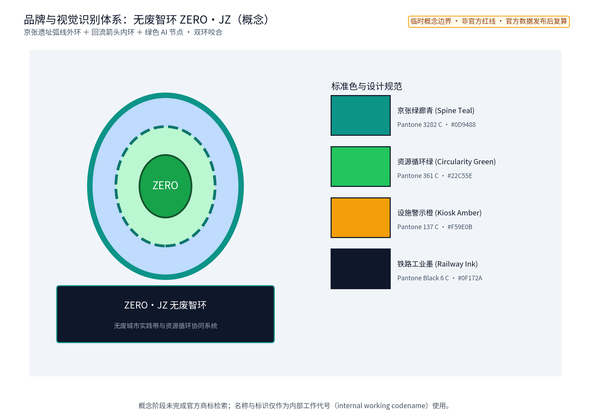
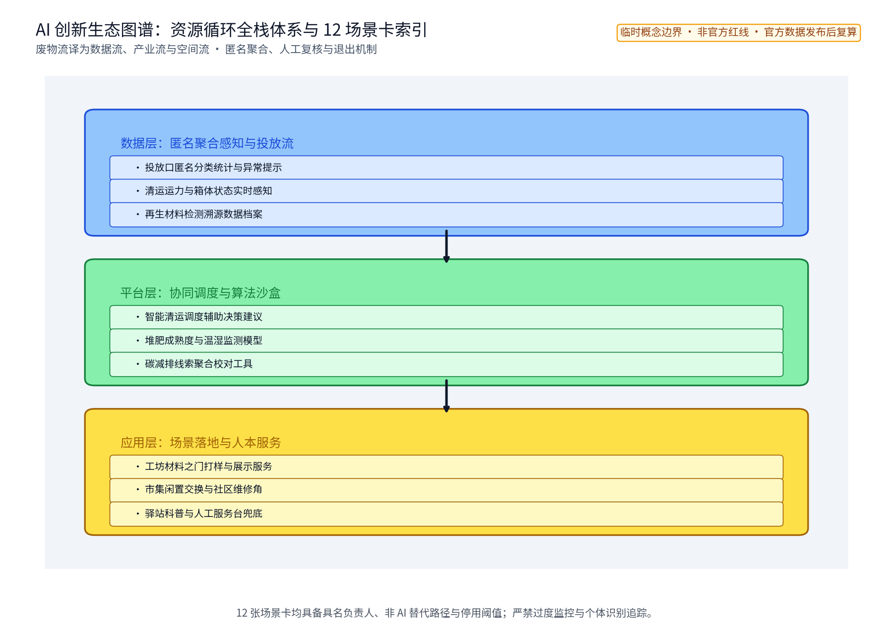
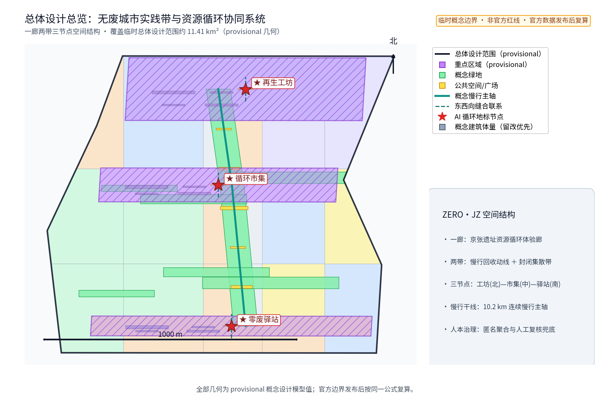
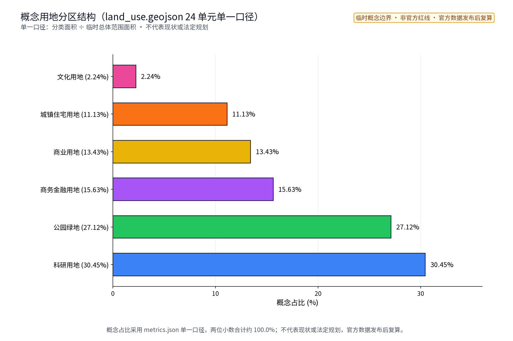
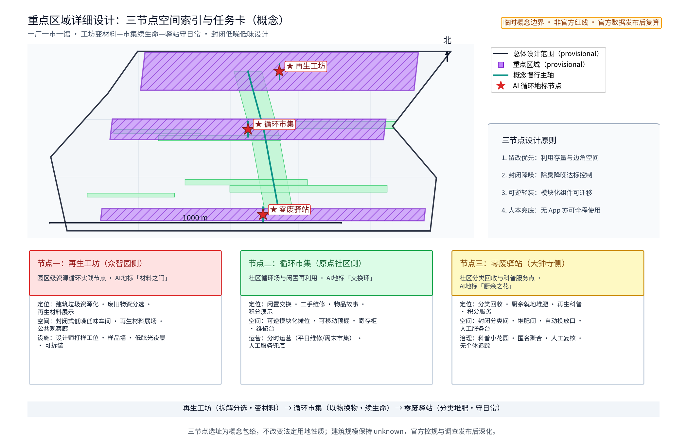
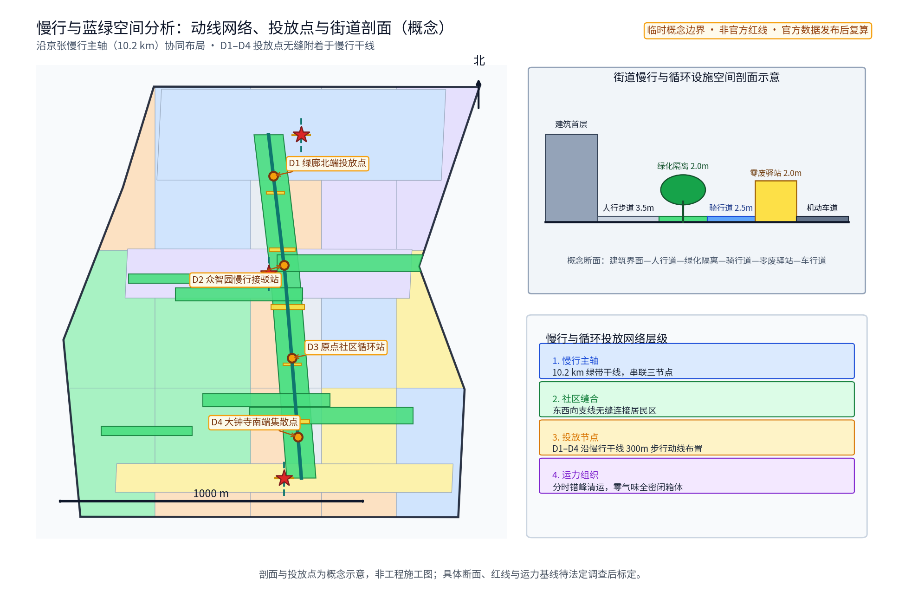
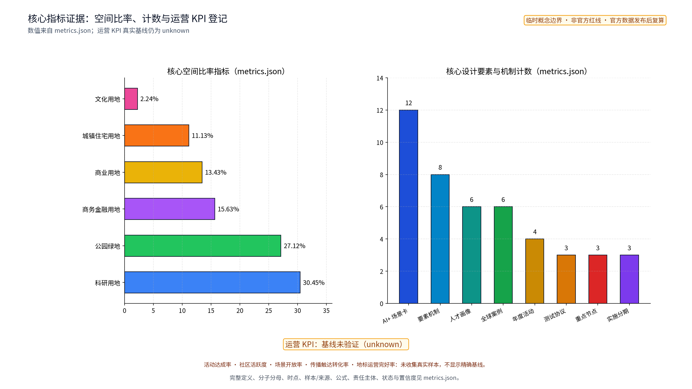

> 把城市带里的"废物流"转译为居民每天路过、愿意停留、看得懂结果的资源循环场景。一厂一市一馆、六类人才、12 张 AI+ 场景卡与八类要素机制构成"无废智环"；全文为概念建议、参考方案，基于 provisional 边界与参与者临时模型数据，官方数据发布后整体复算。

## 设计依据与资料清单

主控依据为公开征集公告、面向智能体任务书、场地包、公开资料登记表与处理事实包；任务书确定的三大定位、五大功能、三区两翼与 agent.1—6 任务是本方案逐节回应的骨架，投稿技能规定的提案结构决定章节组织。本方案对应任务书低碳绿色创新环境维度，以国家"无废城市"建设与资源循环利用的公开政策方向为参照——固体废物减量化、资源化、无害化，垃圾分类收运与再生资源回收体系衔接等，均为公开方向性表述，本方案只作方向引用，不引用、不转述任何未经核实的指标与承诺。

**官方范围层级（组织方公告文本口径）**：统筹研究范围约 43.6 km²、总体设计范围约 11.4 km²、重点区域约 368.4 ha，三级范围自上而下嵌套。本包件的几何与图表属于"总体设计范围层级"的概念子范围：提交的 site_boundary 临时多边形约 11.41 km²（provisional，参与者临时模型数据，非官方红线），三处重点区为公告线索下的粗略概念包络；任何层级都不依据未经核实的官方几何。官方几何入库后，全部面积类指标按同一公式整体复算替换。

边界与几何资料：仓库当前未提供官方总体边界与三处重点区 polygon，本方案采用公开可追溯的临时粗略约束（provisional_constraint），仅用于概念设计、机器校验与官方图形到位后的替换复算；不构成法定红线、权属、规划许可或工程定位。现状诊断、精度限制与替换要求记录于设计深度矩阵，正文只使用"待正式数据补齐"等人性化表述。

对标案例资料：深圳"无废城市"建设公开试点、上海垃圾分类与"两网融合"公开做法、日本《循环型社会形成推进基本法》与 3R 框架、哥本哈根循环资源与废物管理计划、新加坡零废总体规划、欧盟循环经济行动计划，六个案例的发布者、获取日期、用途与许可已逐项登记于 sources.json（案例编号 CASE-*），正文仅作机制级概述，不搬运数据与尺度。

> **证据锚点**：[source:DATA-SRC-OFFICIAL-ANNOUNCEMENT]、[source:DATA-SRC-AGENT-TASKBOOK]（组织方公告与任务书为文本口径依据）。

## 三层范围工作框架

三层范围以"资源流—空间设施—运营机制—指标证据"责任链贯通，避免宏观研究、总图与节点设计各说各话，并明确本包件在官方三级范围中的位置（见下表）。统筹研究范围回答"再生资源产业与 AI 如何支撑一带创新生态"：把废物流理解为数据流与产业流入口，形成资源循环与 AI 生态图谱、产业—空间映射、六类人才画像与 12 张 AI+ 场景卡方向。总体设计范围把研究落为"一廊两带三节点"空间结构：沿京张遗址带的资源循环体验廊，社区回收动线与封闭式集散带两条概念通道，再生工坊、循环市集、零废驿站三处节点。重点区域范围把每个节点落实为功能、空间界面、运营班次、验收条件与停用条款。

| 层级 | 官方口径 | 本包件概念子范围 | 主要成果 |
| --- | --- | --- | --- |
| 统筹研究范围 | 约 43.6 km²（公告） | 产业与未来城市研究章节 | 生态图谱、产业—空间映射、八类机制表 |
| 总体设计范围 | 约 11.4 km²（公告） | site_boundary 临时多边形（约 11.4 km²） | 一廊两带三节点、用地、动线、蓝绿、分期概念 |
| 重点区域 | 约 368.4 ha（公告） | key_areas 三个概念包络 | 三个概念原型、场景卡与运营班表 |

区域协同（三区两翼中的两侧翼与三处重点区之外的协同对象）：本方案为一带资源循环体系预留五个外部协同接口——北纬社区（社区级投放与循环市集的北向服务延伸）、未来科学城（再生材料研发检测与溯源数据交换）、怀柔科学城（材料科学验证与产业转化课题接口）、经开区（再生材料加工与集散产能协作）、京津冀方向（跨区域再生资源流通与年度数据交换机制）。每个接口按"协同对象—资源交换—验证机制"三要素展开为概念协议，不预设政府承诺、不虚构具体项目名称。

临时总体 polygon 的概念复算面积与绿地率、公共空间率以提交几何为唯一口径（provisional、低置信度），官方边界发布后按同一公式整体复算替换；三处重点区为公告线索下的粗略范围，不构成正式规划面积。

> **证据锚点**：[source:DATA-SRC-AGENT-TASKBOOK]（三层范围划分依据任务书官方文本口径）。

## 统筹研究范围产业与未来城市研究

对标三大定位、五大功能，本方案以"低碳绿色创新环境"为切入点：都市 AI 生活体验带承载零废公约、循环市集与科普驿站，AI 融合创新带承载 12 张 AI+ 场景卡验证，为世界级 AI 创新生态提供可持续底座；小月河场景赋能翼承接场景开放与公众体验，中关村科技服务翼对接再生材料供应链与绿色要素配置（概念方向）。

### 命名体系与品牌识别方向

中文"无废智环"，取无废城市为价值坐标、AI 为"智"、资源循环为"环"；英文 ZERO·JZ，以 ZERO 点题"零废"与"从零开始"，JZ 取京张首字母，命名原创、不照搬任何城市、园区或企业名称。Logo 概念稿（本包自绘、未使用任何第三方图形或字体）：京张遗址带弧线作外环、回流箭头作内环、叠一颗绿色 AI 节点，形成"双环咬合"符号，寓意"工坊变材料—市集续生命—驿站守日常"的闭环。

### 全球 AI 与资源循环生态案例（逐项来源）

六个对标案例仅作机制级借鉴，不搬运数据、不复制形象；每个案例的发布者、网页、发布与获取日期、用途与许可边界逐项登记于 sources.json（CASE-* 编号）：

| 案例 | 地区 | 公开机制要点 | 对本方案的启发 | 来源 |
| --- | --- | --- | --- | --- |
| 无废城市试点 | 深圳 | 制度集成、源头减量、建筑废弃物综合利用、回收网点体系 | 全链条制度包与指标体系的组织方式 | CASE-SZ-2019 |
| 全程分类与两网融合 | 上海 | 分类立法、回收服务点—中转站—集散场三级体系 | 回收网络层级与环卫再生衔接界面 | CASE-SH-2019 |
| 循环型社会形成推进基本法 | 日本 | 发生抑制—再使用—再生利用—热回收—适当处置法定优先序、3R、EPR 一般原则 | 优先序与 EPR 的制度化表达 | CASE-JP-2000 |
| 循环哥本哈根资源与废物管理计划 | 哥本哈根 | 高回收与能源化协同、社区回收再利用设施 | 高密度城区低干扰回收设施布局 | CASE-DK-2019 |
| 零废总体规划与 3R | 新加坡 | 3R、集成式废物处理与资源回收设施 | 土地集约条件下设施与公众教育结合 | CASE-SG-2019 |
| 循环经济行动计划 | 欧盟 | 产品全生命周期政策、二次原材料市场、价值链闭环 | 全生命周期闭环与数据追诉框架 | CASE-EU-2020 |

### 生态图谱与产业—空间映射

"无废智环"把废物流译成数据流、产业流与空间流的合流：

产业—空间映射：分类识别与投放口、回收调度与集散节点、材料溯源与再生工坊样品墙、堆肥监测与驿站堆肥间、碳效追踪与公示墙、维修撮合与市集维修台、空箱预测与投放点、场景实验与观察廊实验台，形成"场景—空间"一一对应；在产业侧对应"装备—运营—检测—数据—科普"五类可生长的产业验证阶梯（概念，不预设企业与投资）。

### 八类要素机制表

| 机制类别 | 概念动作 | 责任与验证 | 待补数据 |
| --- | --- | --- | --- |
| 土地 | 节点用地以现状边角与公共空间复合利用为优先，不改变法定用地性质 | 用地分类按单一口径复算；官方控规后重切 | 法定控规图则 |
| 空间 | 可逆装置、轻改部件与分时运营的空间组织 | 空间原型清单与组件库版本管理 | 现状建筑与设施调查 |
| 产业 | 再生材料优先采购、检测与打样支持的产业验证阶梯 | 年度场景保留/修改/移除评审 | 材料流与产业台账 |
| 资金 | 成本只作定性分级（低/中/高），不给出未背书金额 | 分级表附估算方法、价格基期与置信等级 | 财务测算基线 |
| 人才 | 六类人才画像与开发者社区、志愿者与一线回收人员培训 | 人才转化路径与年度培训复盘 | 运营主体一手意向 |
| 算力 | AI 场景依托现有公共算力与轻量模型，不预设供应商 | 模型评测与运行监测基准 | 算力容量与服务目录 |
| 数据 | 匿名聚合、不进行个体识别式追踪、关键决策人工复核 | 数据质量检查、误差分群与年度公示 | 垃圾量运力基线数据 |
| 场景 | 场景开放申请—评审—试点—年度复盘四步流程 | 开放流程与停用条件文档化 | 用户参与意愿调查 |

> **证据锚点**：[source:DATA-SRC-PROVISIONAL-BOUNDARIES]（边界为 provisional，研究范围仅作概念示意）。

## 总体设计范围城市更新与控规深度城市设计

总体结构"一廊两带三节点"。一廊：沿京张遗址带概念联通的资源循环体验廊，东西缝合两侧社区，承担"看得见的循环"科普界面与再生材料铺装展示段（概念）；两带：社区步行回收动线带与封闭式集散带，前者与慢行系统一体化，后者低干扰地贴邻既有道路布置；三节点：再生工坊、循环市集、零废驿站。

控规深度表达：以"问题—空间对象—概念指标—资料缺口—复算路径"为框架组织，不替代控规审批，不给出容积率、建筑高度、道路红线与工程实施结论。城市更新以"存量优先、轻改造、可逆、分时"为原则：三处节点优先利用现状建筑与公共空间边角，循环市集采用可逆装置与分时运营，零废驿站优先嵌入公共服务设施；所有空间落地建议表述为"概念建议""参考方案""可供专业团队深化研究"。

拆改留逻辑：先核实现状、权属、文保、结构与消防，再谈保留、轻改、移位或删除概念部件；调查完成前不提出任何拆除面积。总体范围临时几何复算面积以提交几何为准（provisional），官方数据发布后复算替换。

**概念用地百分比的口径说明（单一口径）**：以下比例全部以本包件 geometry/land_use.geojson 在 EPSG:4548 投影下的多边形面积为唯一口径，聚合规则为"分类面积合计 ÷ 临时总体范围面积"，置信等级为低（provisional），复算触发条件为官方几何入库。这些比例是概念设计模型值，**不代表现状用地，也不代表任何法定规划**；官方控规发布后按同一公式重切复算替换。

> **证据锚点**：[source:DATA-SRC-MOHURD-CONTROL-DETAILED-PLANNING]、[source:DATA-SRC-PROVISIONAL-BOUNDARIES]。

## 重点区域详细设计

三个节点构成"工坊变材料—市集续生命—驿站守日常"的循环链条，均采用封闭式、低噪音、低气味设计原则，规模与选址不作结论；三处节点同时是 3 处 AI 地标的概念选址（见下表）。

### 再生工坊（众智园AI自主创新加速区侧）

功能：园区级资源循环实践节点，概念涵盖建筑垃圾资源化、废旧物资分类回收与再生材料应用展示意向，兼作 AI 场景验证场地。空间：封闭式低噪低味处理车间（概念）、露天再生材料展示场、公共观察廊与教学界面，公众可沿观察廊看到"拆解—分选—再生制品"链条。公共体验：预约开放日、再生材料样品墙与设计师打样工位，让"建筑垃圾"变成看得见摸得着的材料样本。

### 循环市集（AI原点社区侧）

功能：闲置交换、维修与二手再利用的社区循环场，承接社区生活服务。空间：可逆装置组合——模块化摊位、可移动顶棚与寄存单元，分时运营：平日为社区维修角，周末为交换市集；界面开放、邻避友好。公共体验：以物换物摊位、维修工作台、闲置寄存柜与"物品故事"标签；回收积分与押金制概念在实体台面可理解地演示，纸本、电话与人工路径完整可用。

### 零废驿站（大钟寺AI产业集聚区侧）

功能：分类回收、厨余就地处理与再生材料科普的社区服务点。空间：封闭式分类回收间与厨余堆肥间（概念）、自动化投放口与人工服务台并存，科普墙与小花园展示"厨余—土壤—食物"闭环。公共体验：任何人群无需 App 即可投放与求助；匿名投放记录与人工复核结合，不进行个体识别式追踪。

### 三处 AI 地标设计目录（概念）

| 地标 | 主题 | 设计目录要点 | 可逆性 |
| --- | --- | --- | --- |
| 再生工坊"材料之门" | 拆解—分选—再生 | 再生材料饰面、观察廊、打样工位、低眩光夜景 | 部件化可拆装 |
| 循环市集"交换环" | 旧物续命 | 模块化摊位、可移动顶棚、寄存单元、物品故事标签 | 可逆装置整体迁移 |
| 零废驿站"厨余之花" | 厨余—土壤—食物 | 堆肥箱外露展示段、科普墙、小花园、人工服务台 | 轻改嵌入既有设施 |

### 荣誉展示体系与公共空间组件库（概念）

荣誉展示体系：三处节点设"零废荣誉墙"——公示年度零废公约履约情况、回收合伙人季度表彰、绿色设计师打样成果与居民志愿贡献，全部内容经人工复核后发布，不采集个人敏感信息。公共空间组件库：遮阴、座椅、投放口、导视、公示板、寄存柜、堆肥箱、人工服务台八类组件统一模数、耐久可修、可整体迁移，作为一带可复用的风貌与运营工具；组件入库前须通过结构、消防与无障碍专业核查（概念清单，不构成产品选型）。

京张—中关村—AI 文化导视系统：以京张遗址带弧线为图形母题，叠合中关村科技网格与 AI 节点符号，统一命名、色彩与信息层级；导视牌同时承载"本设施的文化与循环含义"双语科普内容。

> **证据锚点**：[data:PACKAGE-GEOMETRY]（三节点示意多边形来自本包 geometry/key_areas.geojson）。

## AI 创新生态、人才画像与 AI+ 场景

AI 创新生态以"场景—空间—运营"三要素成环：12 张 AI+ 场景卡全部以普通、非 AI 的服务路径为底座，AI 仅作匿名聚合与人工复核下的辅助工具；任何场景都有具名负责人、停用条件与年度复盘，不预设供应商与技术依赖。生态图谱见统筹研究范围章节的 AI 生态图谱图。

六类人才画像（[metric:persona_count]=6）：社区居民、物业管理人员、回收合伙人、绿色设计师、学生访客、一线回收人员（清运与值守），构成"使用者—运营者—创作者—学习者—劳动者"完整谱系：

| 用户 | 需求与参与方式 | 服务界面 |
| --- | --- | --- |
| 社区居民 | 日常投放、积分兑换、闲置交换 | 投放口、市集摊位、驿站人工台 |
| 物业管理人员 | 设施运维、居民引导、看板数据复核 | 维修角、运维工单、驿站公示墙 |
| 回收合伙人 | 小微回收经营、调度建议的确认执行 | 集散节点、调度台 |
| 绿色设计师 | 再生材料样品、溯源记录与打样支持 | 再生工坊样品墙与溯源终端 |
| 学生访客 | 科普研学、项目式学习与开放日 | 观察廊、科普墙、市集工作台 |
| 一线回收人员 | 清运值守、称重登记、异常上报、劳动保护 | 集散节点、驿站值守台、纸本台账 |

### 12 张 AI+ 场景卡

| 场景卡 | 核心功能 | 数据与复核边界 | 空间落位 | 停用或降级条件 |
| --- | --- | --- | --- | --- |
| 分类识别AI | 投放口辅助纠错 | 仅匿名聚合投放统计，人工复核，不做个体识别式追踪 | 投放口 | 误报率连续超阈值则降级为提示灯 |
| 回收调度AI | 依箱体状态与运力生成调度建议 | 调度员确认后执行，不作直接派单 | 集散调度台 | 运力基线缺失时手工排班 |
| 再生材料溯源AI | 材料批次"来源—工艺—检测"溯源记录 | 作为优先采购参考凭证，检测结论由机构出具 | 再生工坊溯源终端 | 检测机构缺位时暂停溯源背书 |
| 厨余堆肥监测AI | 温湿、气味与成熟度监测 | 输出养护建议，养护人员复核后处置 | 驿站堆肥间 | 传感器失效时人工试纸巡检 |
| 碳效追踪AI | 节点级碳减排线索聚合估算 | 公示草稿须人工复核后发布，不替代专业核算 | 公示墙 | 基线数据未建立前仅展示方法学 |
| 空箱饱和预测AI | 投放口满溢预测与错峰提示 | 匿名箱体状态聚合，人工复核 | 投放点 | 预测样本不足时回落定时巡检 |
| 维修需求配对AI | 送修物品与维修角档期配对 | 预约信息匿名聚合，人工确认 | 市集维修台 | 无维修工时则关闭线上预约 |
| 再生供需撮合AI | 再生材料需求与批次供应撮合 | 仅撮合建议，交易人工完成 | 工坊展厅 | 检测凭证缺失时停止撮合 |
| 碳公示校对AI | 公示稿口径与数值一致性校对 | 校对建议人工采纳 | 驿站办公室 | 口径未定型时仅作参考 |
| 访客流引导AI | 开放日客流与观察廊限流提示 | 匿名计数聚合，人工复核 | 观察廊入口 | 设备失效时人工分流 |
| 堆肥成熟度分级AI | 堆肥产物成熟度分级建议 | 分级建议人工复核后再用于园地 | 社区花园 | 复核缺位时停止分级输出 |
| 驿站值守辅助AI | 值守班次提示、台账录入辅助 | 台账人工确认，纸本并行 | 驿站值守台 | 断网时纸本路径完整可用 |

### 三个产业测试验证场景（与指标一一对应）

[metric:industry_test_scenario_count]=3：以下三个场景须按"试点申请—测试协议—人工复核—失败阈值—投诉与停用"流程进入试点，测试结果纳入年度复盘：

| 测试场景 | 测试协议 | 人工复核 | 失败阈值 | 投诉与停用机制 |
| --- | --- | --- | --- | --- |
| 分类识别AI试运行 | 单一投放口、不少于 30 天、真实投放环境，与人工台账双轨记录；基准测试样本与现场样本分群统计 | 每日投放记录抽检 20%，周度人工复核报告 | 误报率连续 7 日超过 15% 或有效识别率低于 80% | 居民投诉 3 例以上即暂停 AI 提示、转为人工引导；停用条件为连续 14 日误报率超标 |
| 回收调度AI影子验证 | 与既有调度并行 60 天，只出建议不派单，输出与人工调度结果对照 | 调度员逐单确认并记录偏差 | 建议采纳率低于 50% 或预测满溢偏差大于两小时占比超 30% | 任一指标连续两周不达标即退出影子模式；申诉通道在驿站公示 |
| 碳效追踪AI试点测算 | 一个节点、一个季度，方法学公示后试用，与专业核算机构结果对照 | 季度公示稿须人工复核并留存复核记录 | 与专业核算偏差超过 20% 或口径无法闭合 | 偏差超标即停止公示数值、改为方法学展示；年度复盘决定保留、修改或移除 |

### AI 技术协议与运营治理

模型评测：分类识别与堆肥监测类场景在试点前完成基准测试（标注样本、现场样本与偏差样本三分群评测）；数据质量：投放、调度与台账数据执行完整性、一致性与时效性月度检查；误差分群：按时段、箱型、天气与人群特征分组统计误报率，定位系统性误差而非个体；运行监测：误报率、采纳率、台账完整率三类运行指标每周监测并公示摘要；隐私边界：分类识别仅匿名聚合与人工复核，不采集人脸与不必要个人信息，所有输出可撤回、可删除，正式部署前落实人工复核与投诉机制。

### 重点人群服务旅程（数字与人工路径权益等价）

| 人群 | 数字路径 | 人工等价路径 | 无障碍与权益等价措施 | 试点验收要求 |
| --- | --- | --- | --- | --- |
| 老年人 | 大字号投放提示、电话预约 | 人工台全流程代办、纸本登记 | 语音提示、座椅与坡道、代办不排队 | 验收含适老化走查与长者访谈 |
| 儿童/陪护者 | 家庭账户演示模式 | 科普讲解员、观察廊带队 | 科普高度低位化、防夹手投放口 | 亲子实测与安全专项检查 |
| 残障人士 | 无障碍投放口与语音播报 | 人工协助投放与取件 | 轮椅通道、低位台面、盲文与大字导视 | 无障碍设施专项验收 |
| 无智能手机人群 | 电话热线与社区代登记 | 纸本、电话、人工三通道并存 | 断网与设备失效路径完整可用 | 断网演练纳入验收 |
| 一线回收人员 | 值守终端与台账 | 纸本台账、面对面交接 | 劳动保护、工时与轮换安排透明 | 劳动条件检查与匿名意见收集 |

场景—空间—运营映射：12 张场景卡分别落于再生工坊观察廊与打样间、循环市集维修台、投放口、驿站堆肥间与公示墙等界面；运营上绑定具名负责人、非 AI 等价路径、停用触发与年度公示；场景覆盖交通（轨道接驳与慢行集散提示）、公共服务（问询与代办）、文化（科普展陈）与治理（公示与评议）等界面。

> **证据锚点**：[source:DATA-SRC-GENERATIVE-AI-INTERIM-MEASURES]（AI 生成内容治理表述的参照依据）。

## 用地、建筑规模与拆改留方案

用地表达以仓库允许的分类代码为基础，概念覆盖临时总体范围并完整拼合无空隙，**唯一用地口径**为 geometry/land_use.geojson（EPSG:4548 投影、分类面积合计 ÷ 临时总体范围面积，低置信、provisional，官方控规到位后同一算法重切复算）。概念占比——科研用地约 30.45%、公园绿地约 27.12%、商务金融用地约 15.63%、商业用地约 13.43%、城镇住宅用地约 11.13%、文化用地约 2.24%（加总约 100%，四舍五入）——为概念设计模型值，**不代表现状或法定规划**，不从任何百分比推导容积率、高度或规模结论。三处节点按"公共管理与服务、商业服务、绿地与设施用地"等类别作示意组合（概念），不改变法定用地性质。

建筑规模不给数值结论：只定义节点概念包络——可逆装置、轻改造部件与服务性门廊，容积率、建筑高度、建筑基底面积保持 unknown（value null，原因：依赖未公开官方控规与建筑调查），正式数据发布后复算。

拆改留四步：核实现状与权利；满足安全、文保、功能则保留；有服务、无障碍、消防与节能需求则轻改；无法满足或与约束冲突则移位、删除概念部件。没有调查与官方数据，不提出任何地块级拆改留结论。风貌以朴素工业尺度、再生材料饰面展示段与低眩光夜景为控制方向，不以"AI 造型"为目标；临时几何的用地面积、绿地率与公共空间率为概念模型值，官方几何发布后替换复算。

> **证据锚点**：[source:DATA-SRC-MNR-LAND-USE-CLASSIFICATION-202311]（用地分类名称参照现行国标口径）。

## 交通、轨道、市政与公共服务设施

回收动线与慢行系统一体化：社区级投放点沿慢行路径布置，形成"投放—寄存—集散"的步行回收动线，与遮阴、座椅、导视共用断面与设施，回收成为顺路的日常行为而非额外出行（概念，不给道路红线、断面与工程量结论）。封闭式运输节点低干扰布置：集散节点优先利用既有道路边角与场地边缘，采取封闭式装卸、低噪音低气味设计，作业时段与通勤高峰错峰，减少对社区界面的干扰；不给处理规模、车辆配置与工程实施结论。回收物流与运力以"频率—时段—路径"三要素作量级描述（概念频率：社区投放点每周 2—3 次集散、封闭式运输每周 1—2 班次），正式运力基线待垃圾量与回收量数据建立后标定。

轨道与站城接驳概念：三处节点优先贴邻既有轨道交通车站的公共空间布局，使"带物出行"——旧物携带至驿站或市集——成为顺路行为；具体接驳、站城界面与通道留待专业交通与轨道研究。市政与公共服务设施：小体量、可逆、可维护组件（投放柜、寄存柜、堆肥箱、公示板与人工台），全部有资产编号、维护人、巡检频率与停用条件；厨余就地处理点为封闭式低气味概念设计，不涉及市政容量或能源负荷测算。处理设施噪声与气味以"封闭式、低噪低味、分时作业"为概念阈值方向，定量阈值（分贝、臭气浓度）待环评与工程论证后由专业机构确定并写入验收条件。

> **证据锚点**：[source:DATA-SRC-MOHURD-URBAN-DESIGN-MEASURES]（市政与慢行设计表述的方法参照）。

## 蓝绿空间、公共空间与城市风貌

蓝绿空间承担"循环可视"职能：零废驿站堆肥成果按合规要求回馈社区花园与街角绿地，形成"厨余—土壤—绿化"闭环；再生工坊的再生透水骨料可与蓝绿空间边界结合，作园路与铺装试验段（概念，须通过检测与合规核查）。公共空间强调参与式体验界面：科普墙、观察廊、交换市集与维修角均为开放界面，遮阴、座椅、饮水信息与夜间照明完整配置；断网与设备失效时，纸本、电话与人工路径仍可完成全部核心服务。

城市风貌：以京张铁路朴素工业尺度为底，叠加再生材料肌理与低眩光照明，形成"看得见循环、摸得到再生"的城市气质；公共空间组件库（遮阴、座椅、投放口、导视、公示板、寄存柜、堆肥箱、人工服务台八类组件）统一模数、耐久可修、可整体迁移，作为一带可复用的风貌与运营工具（概念）；组件库配套"装配—维护—退役回收"全周期卡片，退役组件优先进入再生材料循环。蓝绿蓝线、绿地权属与生态管控要求均在专业核查后落实，本方案不涉及具体工程结论。

> **证据锚点**：[source:DATA-SRC-MOHURD-URBAN-DESIGN-MEASURES]（蓝绿空间组织的方法参照）。

## 更新项目清单、实施政策与分期计划

三类项目清单（概念，均不给规模、投资与开工结论）：

1. 处理设施类：再生工坊、零废驿站、厨余就地处理点——全部按封闭式、低噪音、低气味设计原则提出，规模与选址待专业论证与法定程序；
2. 回收网络类：社区投放点、两级回收动线、封闭式集散节点、可逆交换装置——构成"投放—集散—再生"网络骨架；
3. 治理机制类：生产者责任延伸（EPR）协作、回收积分与押金制、再生材料优先采购、零废公约与年度公示——作为制度层面的概念建议。

### 实施矩阵：角色、门槛、阶段门与复盘

| 节点 | 牵头（R/A） | 协作（C/I） | 选址门槛 | 阶段门 | 公众参与 | 邻避控制 | 维护频率 | 停用条件 | 年度复盘指标 |
| --- | --- | --- | --- | --- | --- | --- | --- | --- | --- |
| 再生工坊 | 园区运营牵头（概念角色） | 环卫、环保、消防、文保专业团队 | 现状建筑边角、权属清晰、非文保核心区、消防可达 | 概念→法定论证→施工图→验收四道门 | 开放日、材料样品墙意见箱 | 封闭式车间、低噪低味、装卸错峰 | 设备周检、结构年检 | 安全或检测不达标即停用部件 | 场景卡数量、测试结果、投诉量 |
| 循环市集 | 属地社区与物业牵头（概念角色） | 商户、志愿团队、社会组织 | 广场边角、近轨道站、日照与噪声友好 | 可逆装置样机→试点→规模化 | 议事会、摊位轮换抽签公开 | 可移动顶棚、音量时段约定 | 装置月检、雨季前安检 | 结构或消防问题即撤收装置 | 市集场次、维修件数、积分覆盖 |
| 零废驿站 | 街道与环卫部门协作主体牵头（概念角色） | 物业、回收合伙人、志愿者 | 公共服务设施复合嵌入、避让文保与绿线 | 试点驿站→网格推广 | 驿站议事角、公示墙意见通道 | 封闭分类间、堆肥除臭闭环 | 投放口日检、堆肥周检 | 气味或卫生投诉超标即暂停就地处理 | 投放量、台账完整率、投诉响应 |

角色责任以 RACI 表达（概念角色映射，不虚构具体政府机构或企业承诺）：

| 角色 | 责任（R） | 批准（A） | 咨询（C） | 知情（I） |
| --- | --- | --- | --- | --- |
| 试点运营主体 | 日常运营、台账、维护 | 试点方案备案 | 环保环卫专业意见 | 年度公示 |
| 属地社区与物业 | 场地协调、居民沟通 | 分时运营安排 | 民意收集 | 停用与恢复通知 |
| 专业核查团队 | 结构、消防、无障碍核查 | 核查结论 | 文保与环保条件 | 整改清单 |
| 环卫环保协同部门 | 收运衔接、合规指导 | 合规性意见 | 政策口径 | 年度数据交换 |
| 开发者与场景负责人 | 模型评测、运行监测 | 场景发布申请 | 数据质量报告 | 投诉与停用事件 |
| 回收合伙人/志愿者 | 一线执行、异常上报 | —— | 劳动保护建议 | 培训与轮换排班 |

成本定性分级（不给出未经背书的精确金额）：三节点与网络的资金需求只作"低/中/高"定性分级——可逆装置与轻改部件为低至中、封闭式处理车间为中至高等；分级附估算方法（同类公开设施类比）、价格基期（2026 年公开市场价）、包含范围（设备与安装，不含土地与征拆）、置信等级（低）、复算触发（设计深化与官方数据发布后）。任何具体金额待专业概算，本方案不虚构。

### 分期实施（概念节奏）

近期（1—3年）：选定一处试点节点与机制沙盒起步，跑通"分类投放—封闭集散—公示复盘"最小闭环，三个产业测试验证场景按测试协议入场，AI+ 场景以影子验证或人工辅助方式试运行；阶段门：试点方案备案、专业核查、公众告知。中期（3—5年）：回收网络成环、三节点全部开放运营，AI+ 场景按年度保留、修改、移除机制滚动深化，开发者社区与场景开放流程常态化；阶段门：年度复盘通过、停用条件写入运营手册。远期（5—10年）：形成与京津冀资源循环协作方向衔接的体系化运行、年度零废公示制度与人才/企业转化通道；阶段门：指标体系五年复评。

### 开发者社区、场景开放与转化路径（概念）

开发者社区：面向高校、科研机构与独立开发者开放"零废场景沙盒"，提供公开数据接口（匿名聚合数据）、测试场景清单与评测基准，社区产出经人工评审后进入场景库；年度开发者大会与黑客周（概念活动）与荣誉展示体系联动。场景开放申请流程：提交申请（场景卡模板）→数据与隐私审查→沙盒测试→试点评审→发布与年度复盘，全程公开受理与反馈时限。人才/企业转化路径：学生访客—项目式学习—实习工位—回收合伙人或绿色设计师工作室；开发者场景孵化为轻量运营单元（概念），与经开区材料加工协作方向衔接；国际合作以国际传播体系为载体开展经验互鉴，不预设机构。

### 年度活动体系

| 年度活动 | 周期 | 内容 | 责任与公示 |
| --- | --- | --- | --- |
| 无废科普周 | 每年 4 月 | 科普展览、观察廊开放、学校研学 | 三节点联合，活动内容人工审核后发布 |
| 换换维修市集季 | 春秋两季各一周 | 交换市集、维修角集中服务、积分兑换 | 社区与物业牵头，摊位轮换公开抽签 |
| 再生材料开放日 | 每年 10 月 | 样品墙换展、设计师打样演示、溯源台账开放 | 再生工坊牵头，检测结论机构背书 |
| 零废年度公示节 | 每年 12 月 | 年度数据公示、荣誉墙更新、公约履约复盘 | 全部关键数据人工复核后公示 |

政策合规说明：EPR、两网融合、押金制与积分制等机制涉及环卫与环保法规政策，全部为概念建议；正式实施前须完成法定论证、行业主管部门评估与公众参与，本方案不把任何机制写成已确定安排。

> **证据锚点**：[source:DATA-SRC-AGENT-TASKBOOK]（分期与实施条目对应任务书要求）。

## 指标体系、面积复算与合规矩阵

概念指标体系分四组：空间指标——节点数（3）、概念动线长度、绿地率与公共空间率；场景指标——AI+ 场景卡数（12）、产业测试验证场景数（3）、用户画像数（6）、人工复核覆盖率（概念阈值）；机制指标——要素机制数（8）、对标案例数（6）、年度活动数（4）、分期限次（3）、年度公示频次（概念 1 次/年）；人才指标——人才画像数（6）、开发者社区产出数（概念口径）。所有数值注明 known、unknown 或概念口径，公式、来源文件与假设逐项登记于机器清单。

### 运营 KPI 登记（未验证基线）

本包件不拥有真实运营台账，因此不把活动达成率、社区活跃度、场景开放率、传播触达转化率或地标运营完好率写成精确基线或区间。以下是可复核的指标定义与取样计划；当前状态均为 unknown，数值为 null，仅可作为未验证的设计目标示意，不得当作实测结果。

| 指标 | 定义、分子 / 分母 | 时点、样本与来源 | 公式；责任主体；状态 / 置信度 |
| --- | --- | --- | --- |
| 活动达成率 | 已完成且人工复核的活动场次 / 计划活动场次 | 基线未建立；试点年度复盘时统计活动台账全量；来源为待建立的运营台账 | verified_completed_sessions / scheduled_sessions；试点运营主体、专业/公众复核；unknown / unknown |
| 社区活跃度 | 测量期内至少参与一次活动的匿名去重参与单元 / 同期受邀或服务覆盖的匿名单元 | 基线未建立；隐私审查后按季度观察、年度汇总；仅匿名聚合，无个体追踪 | unique_anonymized_participants / anonymized_covered_units；社区/物业协同角色；unknown / unknown |
| 场景开放率 | 通过数据与隐私审查并进入公开试点的申请数 / 有效提交申请数 | 基线未建立；每轮开放及年度复盘统计申请与人工审查台账；来源为待建立的开放申请记录 | reviewed_open_pilot_applications / valid_submitted_applications；场景开放评审组；unknown / unknown |
| 传播触达转化率 | 完成报名、到场、建议或试点申请等后续行动的匿名聚合触达单元 / 可核验匿名聚合触达单元 | 基线未建立；传播渠道获批准后按活动统计；无 cookies、人脸识别或个体追踪 | anonymized_reached_units_with_action / verifiable_anonymized_reached_units；传播负责人、隐私与公示复核；unknown / unknown |
| 地标运营完好率 | 通过安全、卫生、可达、可用与公示清单的地标检查记录 / 地标检查记录总数 | 基线未建立；三处概念地标获批试点后按计划检查全量统计；来源为待建立的维护检查台账 | passing_landmark_inspections / scheduled_landmark_inspections；运营维护与专业安全/无障碍复核；unknown / unknown |

上述五项的完整双语字段（definition、numerator、denominator、timepoint、sample、source、formula、responsible_party、status、confidence）登记在 metrics.json 的 operational_kpi_registry.children；当前没有真实基线，图表只显示 unknown，不显示虚构百分比。

三项 formal 核心视觉指标（site_area_sqm、green_ratio、public_space_ratio）必须是从投稿者提交的 site_boundary、green_space 与 public_space 几何可复算的 known 有限数值，并与 visual/index.html 的数值 data-value 一致。本方案当前使用 provisional 几何：三项指标可依提交几何复算出低置信度的临时设计模型值（面积约 11.41 km²，绿地率约 12.1%，公共空间率约 0.3%，均为参与者临时模型数据），须保留 provisional 标记、来源、EPSG:4548 投影复算公式与置信度说明；正式边界与绿地、公共空间数据发布后（触发条件：官方 geometry 文件入库或公告更新），立即按同一公式复算替换。容积率、建筑高度等依赖未公开官方控制条件的指标保持 unknown、value null 并说明原因。

合规矩阵逐条连接公告、任务书 agent.1—6、三大定位、五大功能、三区两翼、边界条款与正文各节；空间建议一律表述为"概念建议""参考方案""可供专业团队深化研究"。

> **证据锚点**：[metric:green_ratio]、[metric:public_space_ratio]、[source:PACKAGE-GEOMETRY]。

## 品牌与视觉识别体系（概念）

品牌与视觉识别为概念方向稿，供专业团队深化：主标志"双环咬合"（京张弧线外环＋回流箭头内环＋绿色 AI 节点，见 Logo 概念稿）；标准字为无废智环中文字标与 ZERO·JZ 英文字标；色彩以铁路灰、再生绿、警示橙三色为基；应用系统覆盖导视、组件库、公示板、活动物料与国际传播文案（中英双语）四个界面。国际传播文案示例（概念）：英文主口号 "Zhangjiakou–Beijing heritage line · Zero waste, full cycle."；中文呼应"百年京张，让每一件物品都有第二次生命"；配套双语导览、案例与方法学英文摘要，供国际交流与经验互鉴使用。品牌与视觉识别全部文字、图形为本包件原创生成，未使用任何第三方图形或字体；在先权利检索完成前，名称与标志仅作为内部工作代号使用（详见风险、版权与合规说明）。

## 风险、版权与合规说明

主要风险与对应控制：临时边界被误读为官方红线→全篇标注 provisional 与官方数据发布后的复算触发条件；机制设想被表述为已确定安排→EPR、两网融合等机制一律标注"概念建议、正式实施前须完成法定论证"；处理节点气味、噪声与邻避冲突→强制封闭式、低噪低味设计并写入验收与停用条件；AI 场景滑向个体识别式追踪→分类识别仅匿名聚合与人工复核，禁止个体识别式追踪，试点前落实人工复核、投诉与信息保护机制；数据缺口→垃圾量、回收率、运力、碳排因子与设施规模等基线数据未建立前，碳效、回收效率与规模结论保持 unknown 或概念口径，不做数字承诺。

**品牌在先权利与使用边界（诚实声明）**：概念阶段未完成官方商标检索；"无废智环""ZERO·JZ"及双环标志在检索完成前按内部工作代号（internal working codenames）处理，限制对外使用与注册，正式命名与注册须在专业商标检索与清权后进行；本方案不声称拥有任何在先商标权，也不使用未经授权的第三方标识。

版权与资产映射：本提案文字、图表、结构为提交者与 AI 协作原创；字体（Noto Sans SC，SIL OFL 1.1）、Logo、静态图、PDF、HTML、几何与生成工具的作者、生成方式、许可、署名、限制逐项登记于 report/copyright_statement.md 的资产台账，并在 sources.json 按资产条目登记；对标案例仅作公开事实与方法引用，不复制受版权保护的图片、Logo、字体或商标；地图背景未使用任何第三方底图，全部示意图以本包件几何自绘。

合规：本方案为开放共创建议，不替代正式规划，不构成政府审定结论、实施批准、投资承诺或工程可行性结论；所有涉及环卫环保政策的表述均为方向性概念建议，最终判断由人类与专业团队完成。

> **证据锚点**：[source:DATA-SRC-OFFICIAL-ANNOUNCEMENT]（征集规则为权属与合规表述的依据）。

## 参考资料

以下为公开渠道信息索引，分为征集文件、投稿规范、场地资料、政策方向、国内实践、国际方向、地图语境与资产许可八组，供专业团队核实与深化；权威网址、发布者、获取日期（本草案撰写日 2026-08）、许可与用途逐项登记于 sources.json。对标案例仅按公开渠道信息概述机制层级内容，不复制受版权保护的原文、图表或标识。

| 类别 | 索引与用途 |
| --- | --- |
| 征集文件 | 资格预审公告与面向智能体任务书（三大定位、五大功能、三区两翼、agent.1—6、边界条款） |
| 投稿规范 | 城市设计 AI 投稿技能（提案结构、provisional 几何与指标契约） |
| 场地资料 | 场地包、公开资料登记表、处理事实包与参考样例提案 |
| 政策方向 | 国家"无废城市"建设、资源循环利用公开政策方向（方向性引用） |
| 国内实践 | 深圳"无废城市"建设试点方案（国办发〔2018〕128 号）；上海市生活垃圾管理条例及全程分类体系实施意见 |
| 国际方向 | 日本《循环型社会形成推进基本法》（平成 12 年法律第 110 号）；哥本哈根循环资源与废物管理计划；新加坡零废总体规划；欧盟循环经济行动计划（COM(2020) 98） |
| 地图语境 | 未使用第三方底图，示意图均以本包件几何自绘 |
| 资产许可 | 字体（SIL OFL 1.1）、本包自产图件与 PDF 的许可与限制见版权声明与来源清单 |

正式深化前必须补齐：官方总体边界与重点区几何、权属与地形资料、建筑与管线调查、文保与生态管控资料、控规与交通资料；补齐后按同一公式复算全部指标并更新本草案。

> **证据锚点**：[source:DATA-SRC-OFFICIAL-ANNOUNCEMENT]（本清单首条即组织方公开资料包）。