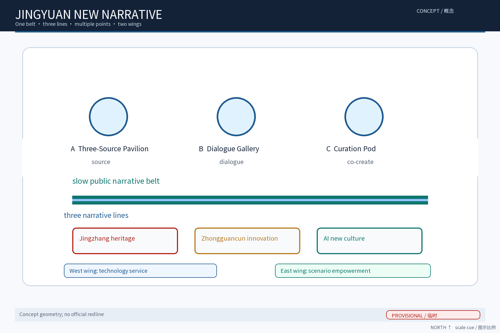
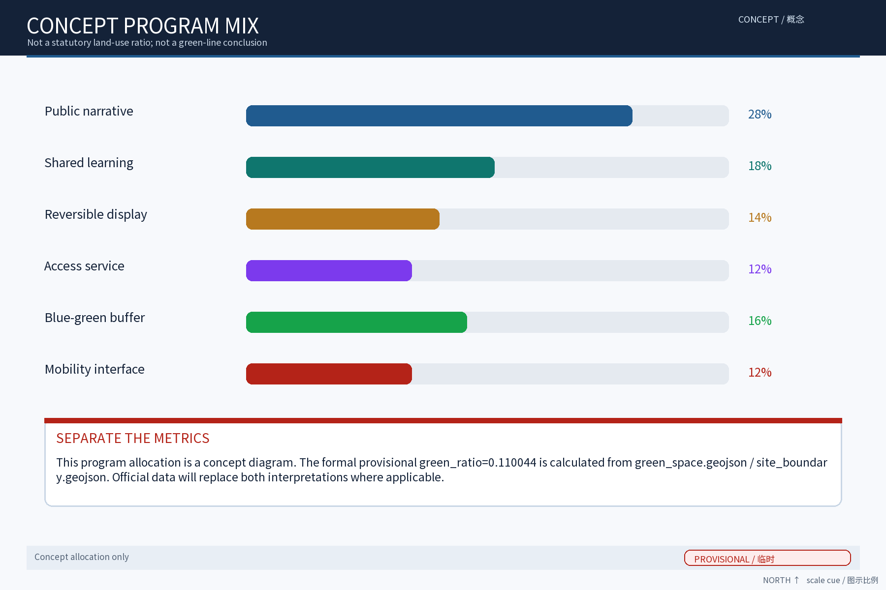
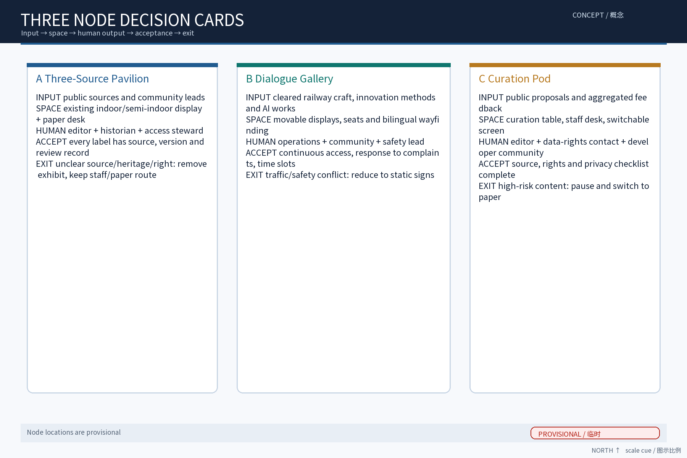
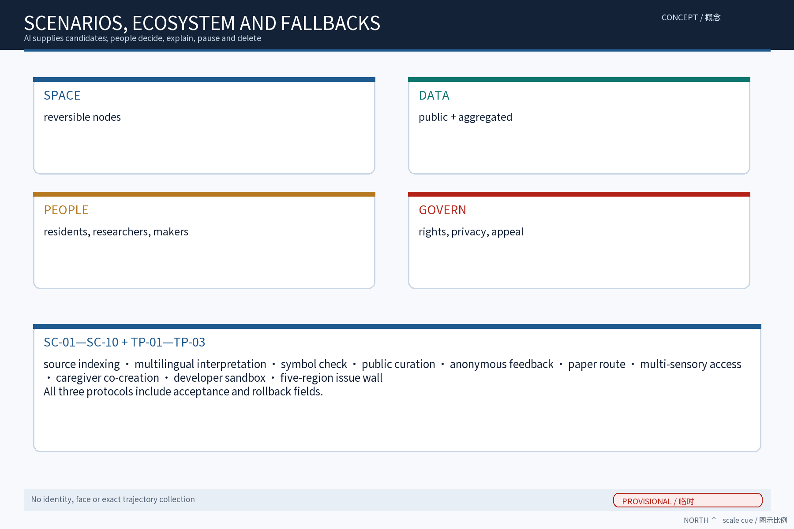
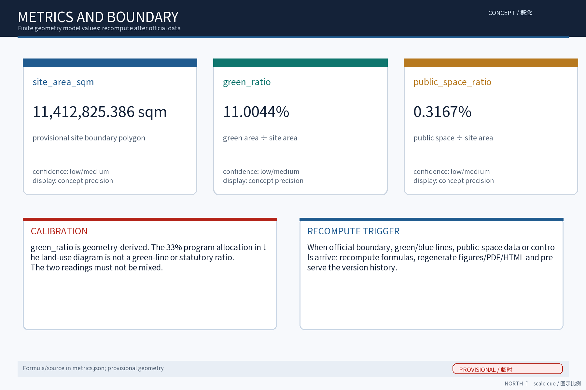

> **Scope note.** I propose “Jingyuan New Narrative / FUSION·JZ” as a cultural sub-system under the future belt identity, not as the organizer's final logo. The design uses three distinct narrative lines—railway heritage, innovation culture and AI culture—and connects them through readable, experiential and co-created public space. It is a concept and reference proposal, not a planning, approval, partnership, investment or engineering conclusion.

## Basis, sources and evidence boundary

The package uses the open-call brief, public planning/design methods, land-use classification, generative-AI governance and accessibility references listed in `sources.json`. Case studies are mechanism references only; no third-party images, logos or proprietary data are reproduced. Official boundaries, heritage controls, rights, utilities, current conditions and operating baselines were not supplied, so package geometry is provisional and all areas are model values for checking and later recomputation. The rights ledger records publisher, URL, access date, license status, intended use and limitations.

## Three-level scope framework

The coordination level connects the belt with Beihui Community, Future Science City, Huairou Science City, Beijing E-Town and the wider Beijing-Tianjin-Hebei region through conditional interfaces, not promises: public topics or test requests enter; aggregated feedback, reusable cards and review records leave. The overall level uses the provisional green corridor as a narrative backbone. The detailed level tests three conceptual nodes with input, space, operator, acceptance and exit fields. Official data must trigger a full review.

## Coordinated research, industry and future-city interface

The three positions are the Centennial Jingzhang Culture Belt, the Urban AI Life Experience Belt and the AI Fusion Innovation Belt. Five functions are full-stack AI innovation, a world-class ecosystem, AI-plus scenarios, an intelligent and lively city, and a global voice for AI governance. The eight-element ecosystem matrix covers space, industry, finance, talent, compute, data, scenarios and governance. No enterprise, investment, policy or cooperation is presented as confirmed.

The three taskbook areas have distinct roles in this proposal: the AI Origin Community is the public-knowledge, low-barrier experience and co-creation interface; the Zhongzhiyuan AI Independent-Innovation Acceleration Area is the controlled R&D, sandbox, data/compute and rights-check interface; and the Dazhongsi AI Industry Cluster is the smart-native consumption and industry-problem validation interface. These are taskbook function layers, not confirmed geographic locations, tenants or operators, and they are not identical to the three conceptual nodes. The Zhongguancun technology-service wing sends tools, rights guidance and public questions into the loop; the Xiaoyuehe scenario wing returns low-barrier cards, human review and public feedback. Without a confirmed partner or site condition, the interface degrades to public sources, paper guidance and human explanation.

## Overall urban-renewal and planning-depth concept

The structure is one belt, three narrative lines, multiple points and two functional wings. The Zhongguancun technology-service wing supports tools, knowledge-rights guidance and public interfaces; the Xiaoyuehe scenario wing supports daily experience, accessibility and scenario recovery. “Read source, dialogue, co-create, recover” is the shared operating loop. All buildings, roads, land-use shapes and nodes are conceptual design geometry, not official redlines or statutory controls.

Four reversible working mechanisms make the fusion auditable: “Source-Archive Compact” records provenance, version, rights and proofreader for each story; “Three-Source Rotating Forum” rotates community, older/disabled, caregiver, researcher and creator voices; “Echo Register” logs feedback, appeals, corrections and response ownership; and “Reversible Exhibit Valve” allows an operator to switch off a screen, remove an exhibit and return to paper or human service. These are proposal names, not existing policies, organizations or awards.

## Detailed design of three focus nodes

Node A, the Three-Source Narrative Pavilion, turns public historical material into cited bilingual interpretation; missing rights or heritage conditions cause the exhibit to return to research or paper display. Node B, the Cross-Culture Dialogue Gallery, uses movable displays and bilingual wayfinding for a slow public sequence; safety or traffic conflicts reduce it to static signage. Node C, the New Culture Curation Pod, receives public proposals and aggregated feedback, but releases nothing without human editorial, rights and privacy checks. Three nodes share source records, scenario cards and a review board; they do not share personal identity data.

The node-to-area relationship is functional mapping, not a geographic claim. A primarily carries the AI Origin Community's public knowledge and low-barrier experience, dependent on an accessible indoor/semi-indoor space and heritage/rights review. B primarily carries Dazhongsi's smart-native consumption and industry dialogue, dependent on a continuous safe public route and mobility review. C primarily carries Zhongzhiyuan and the Zhongguancun wing's controlled curation/developer test, dependent on a staffed worktable, data protection and editorial responsibility. If the real site fails a dependency, the node becomes static signage, paper or an online version.

## AI ecosystem, people and AI-plus scenarios

Six mechanism references are recorded as reference-only. High Line is read as continuous public space with long-term public operation; Zollverein as a compound of industrial heritage, cultural content and creative uses; King's Cross as a railway-area renewal and knowledge-economy interface; mAAch ecute Manseibashi as small-scale station activation; Shougang Park as phased industrial-heritage reuse; and Yangpu Riverside as a public-space continuity interface. The local translation is only “mechanism—condition—boundary”: a public problem pack and small test come first, while rights, heritage, safety and operating conditions decide adoption. No brand, image or unverified effect is copied. Eight ecosystem elements are mapped to actual package evidence. User coverage includes researchers, innovators, international visitors, railway-history readers, families, older/disabled visitors, caregivers and low-digital or device-free visitors. Ten scenario cards SC-01—SC-10 cover source indexing, multilingual interpretation, symbol checking, public curation, anonymous feedback, paper guidance, multi-sensory access, family co-creation, developer testing and regional issue exchange. Three test protocols cover multilingual retrieval, accessible guidance and public-curation review. AI supplies candidates only; humans may revise, reject, pause or delete. Aggregation only, human review for key decisions, and no over-surveillance are mandatory.

The three protocols are auditable by target, input, AI boundary, space/operator, acceptance and exit: TP-01 uses cleared public text for multilingual retrieval, with editorial citation checks and version rollback; TP-02 uses no identity input for accessible guidance, with accessibility review and immediate shutdown on misleading output; TP-03 uses voluntary public text for curation, with de-identification, rights screening, human editing, appeal timing and takedown. `compliance_matrix.json` stores these fields. AI is linked to planning cautiously: it may summarize spatial context, mobility gaps and public-service needs, but cannot infer ownership, statutory intensity, approvals or individualized recommendations. Human safety, capacity and planning review remain decisive.

## Land use, building and retain-adapt-remove logic

The program mix is conceptual and distinct from the geometry-derived `green_ratio=0.110044`. The figure labels its allocation as non-statutory. The retain-adapt-remove decision gate first checks ownership, heritage, structure and safety; only a professional review could consider local removal. No FAR, height, density, setback, utility capacity, investment or construction conclusion is made.

## Mobility, rail, utilities and public service

Slow walking, cycling, wheelchair and stroller continuity comes first. Event access is a proposal for time-slotting, human guidance and emergency planning, not a confirmed shuttle or road arrangement. Public toilets, water, rest, information and human assistance are requirements to verify against existing capacity. Every AI route has a paper, tactile, audio, staff or offline alternative; no device is required. Each year, the proposal publishes an issue list, event record and correction record. The rotating forum provides paper submission and human registration for people without devices, with anti-harassment rules, appeal handling and no service penalty for declining data collection. Activities do not expand when representation, staffing or safety conditions are absent.

## Blue-green space, public realm and identity

Interventions are light, reversible and heritage-aware. Three landmark component families are proposed: source cards, dialogue seats/bilingual signs and a switchable curation table/screen. An honors display keeps fields for award, issuer, year, official URL and verification status; no unverified honor is claimed. The cultural wayfinding system remains distinct from the belt's eventual master brand. Figures include context notes, legend, north/orientation cue and provisional boundary wording.

## Projects, implementation and long-term operation

Near term (1–3 years) establishes source and rights records, paper guidance and small reversible trials. Mid term (3–5 years) may connect selected narrative segments and open a developer community after heritage, ownership, safety and accessibility review. Long term (5–10 years) is conditional on annual review. A proposed RACI assigns accountability to public-culture/space operations, responsibility to curators and historians, consultation to community/accessibility advisers and information to developers and universities. Annual rhythms are a Three-Source Culture Season, Cross-Culture Dialogue Week and New Culture Curation Day, all proposals rather than confirmed events.

## Metrics, recomputation and compliance matrix

The finite provisional model values are approximately 11,412,825 sqm for `site_area_sqm`, 11.00% for `green_ratio` and 0.32% for `public_space_ratio`. The exact recomputable values remain in `metrics.json` and the figure `data-value` fields; the narrative uses approximate display precision so a provisional boundary is not presented as survey accuracy. FAR, height, road redline and utility capacity remain unknown/null. Package counts are ten scenario cards, three test protocols, six cases, seven user groups, three landmarks and three annual programs. `compliance_matrix.json` maps these outputs to the three positions, five functions, three areas/two wings, regional interfaces and agent.1–agent.6.

## Risk, rights and compliance

This is a concept proposal and does not replace formal planning, heritage review, safety review, accessibility review, approvals or agreements. Data flow is public/voluntary input, minimum fields, controlled candidate generation, human review, limited release, aggregated review and deletion. No ID, face, exact trajectory or sensitive inference is collected. Every historical item, map, font, case name, code, model and output is recorded in the rights ledger. Case names and links are reference-only; current graphics are self-drawn. Missing rights, cooperation, awards, approvals or official data remain pending and are not published as facts.

## References

See `sources.json` for the full source and rights ledger. Public task materials, planning methods, land-use classification, AI governance and accessibility texts define the evidence boundary. Jingzhang history is treated as a public-source research lead pending specialist verification. Geometry and metrics are package-generated provisional models and must be recomputed when official material arrives.

### Agent.1–Agent.6 delivery index

| Agent | Deliverable | Evidence |
| --- | --- | --- |
| 1 | Name, visual grammar, positions, functions, structure | proposal.md; compliance_matrix.json; site-overview.en.png |
| 2 | Six cases and eight-element ecosystem map | proposal.md; sources.json; design_depth_matrix.json |
| 3 | Ten scenario cards, seven groups, three test protocols | proposal.md; compliance_matrix.json |
| 4 | Three landmarks, honors fields and component library | proposal.md; key-areas.en.png; metrics-evidence.en.png |
| 5 | Three-source narrative and bilingual communication | proposal.md; proposal.en.md; sources.json |
| 6 | Events, developer community, RACI and decision cards | proposal.md; design_depth_matrix.json; visual/index.en.html |

> All space, cooperation, data, rights, awards and metrics remain concept/provisional/pending items until verified through formal sources and professional procedures.
