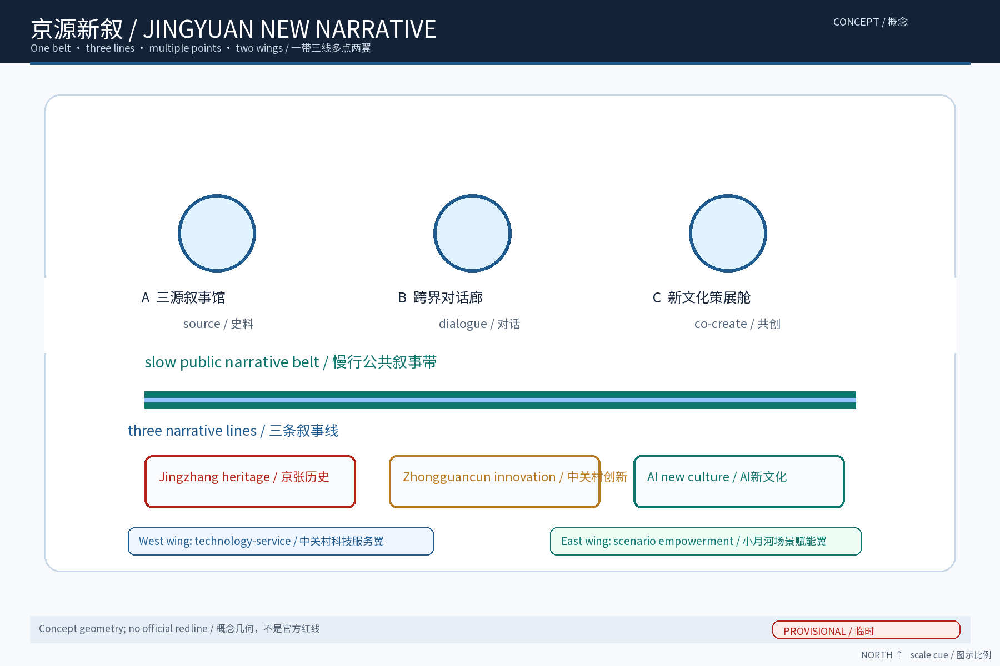

> 主题定位：我提出「京源新叙 / FUSION·JZ」作为一带整体品牌下的文化叙事子系统，不替代主办方最终品牌规范。核心不是把三种文化混成装饰，而是以「各自有源、相互校验、共同续写」把百年京张、中关村创新文化和AI新文化组织成一条可阅读、可体验、可共创的公共空间故事线。本文为概念建议与参考方案，不构成规划、审批、合作、招商、投资或工程结论。

## 设计依据与资料清单

我以任务书、组织方公告和公开法规/方法资料建立工作边界；文化史料只使用公开线索，案例仅用于机制参照，不复制其图片、商标或未核实数据。正式边界、文保范围、绿线蓝线、权属、现状设施和运营基线尚未由本包取得，因此几何文件标为 provisional，所有面积只用于概念模型、机器校验与后续复算。来源、访问日期、许可证状态、允许用途和限制统一登记在 `sources.json` 的 `rights_ledger` 中；其中“来源可查”不等于本方案取得再发布权。

资料清单包括：任务公告与任务书；住房城乡建设部城市设计与详细规划公开方法资料；自然资源部用地分类公开口径；国家网信部门生成式人工智能服务治理公开文件；无障碍环境建设公开法律文本；公开可查的京张铁路史料、中关村创新文化资料及工业遗产更新案例。每条材料注明 `source_id`、发布者、URL、访问日期与证据用途；待核材料列入缺口，不把现场踏勘、合作关系或官方数据写成既成事实。[source:DATA-SRC-AGENT-TASKBOOK-20260518] [source:DATA-SRC-PROVISIONAL-BOUNDARIES-20260605]

## 三层范围工作框架

第一层“统筹研究”看一带与五地协同：北纬社区作为社区文化与低门槛参与接口，未来科学城作为科研议题与测试需求接口，怀柔科学城作为基础研究和科普交流接口，经开区作为产业验证与制造反馈接口，京津冀作为跨区域知识、人才、展陈巡回与公共传播接口。第二层“总体设计”以临时边界内的绿带和遗址公园为故事骨架，采用一带三线多点，不据此推断红线、地块或现状权属。第三层“重点区域”只对三个概念节点提出输入—空间—运营—验收—退出卡片。三层采用同一证据编号回链：研究提出回路，空间翻译动作，节点验证体验，节点结果再反馈研究；官方资料到位后整体复核。[source:DATA-SRC-PROVISIONAL-BOUNDARIES-20260605] [depth:three_level_scope_framework]

## 统筹研究范围产业与未来城市研究

三大定位是：百年京张文化带（让历史成为可核验的公共知识）、都市AI生活体验带（让AI以可选择、可解释的日常服务出现）、AI融合创新带（让文化内容成为安全的测试与交流媒介）。五大功能是：AI全栈自主创新体系、世界级AI创新生态、AI+场景赋能新范式、智能化AI活力城市、AI治理全球话语权。五地协同不是承诺招商，而是一组可被公开资料和合作意向验证的“接口”：输入公开议题/内容/测试请求，输出匿名聚合反馈、可复用场景卡、审议记录与下一轮问题清单；无合作时由公开资料、人工讲解和社区志愿者替代，停止对外传播或停止测试不影响公共通行。

任务书的三个重点区域在本方案中承担不同功能：AI原点社区承担公共知识、低门槛体验和公众共创接口；众智园AI自主创新加速区承担全栈研发、受控沙盒、数据/算力与知识产权校核接口；大钟寺AI产业集聚区承担智能化消费与企业问题包的场景验证接口。三者是任务书要求的功能层，不等同于本包几何中的三个概念节点，也不表示已确认的地理落位、招商或运营主体。中关村科技服务翼向三个区域输入工具、权利咨询和公开议题，小月河场景赋能翼回收低门槛场景卡、人工复盘和公众反馈；无合作或条件不具备时，接口降级为公开资料、纸本导视和人工讲解。[source:DATA-SRC-AGENT-TASKBOOK-20260518]

我将产业、空间和未来城市研究连接成一条闭环：公开知识进入“源档案”，由人工校读的AI整理生成候选叙事；候选内容在节点以小规模、可撤回的场景卡测试；运营方只保留汇总结果、问题与处置记录；专业团队据此决定是否深化。涉及个人的感知只做匿名聚合，关键决策人工复核，禁止过度监控。[source:DATA-SRC-GENERATIVE-AI-INTERIM-MEASURES] [standard:PUBLIC_INTEREST_AI_GOVERNANCE] 这条区域协同闭环的字段见 `compliance_matrix.json` 与 `design_depth_matrix.json`。

## 总体设计范围城市更新与控规深度城市设计

空间结构为“一带、三线、多点、两翼”：一带是沿京张遗址公园的连续公共叙事带；三线分别是“铁轨记忆线”“创新方法线”“AI新文化线”，通过时间、方法和共同创作三种阅读方式并置互文；多点是三个地标节点与可替换的小型叙事点；中关村科技服务翼负责开放工具、知识产权咨询和企业/高校接口，小月河场景赋能翼负责日常体验、无障碍服务与场景回收。两翼是功能接口，不代表行政边界或现有组织关系。

为避免把“文化融合”停留在口号，提出四个可撤回的工作机制：“源档公约”规定每条叙事的出处、版本、权利和校读人；“三源议事轮换”让社区、老年/残障、照护者、研究者和创作者轮换进入公开评审；“回声备案”记录意见、申诉、更正与处理时限；“可逆撤展阀”允许运营方立即关闭屏幕、撤下展项并退回纸本/人工路径。这些是本方案的原创工作名，不是既有政策、组织或奖项。

总体更新坚持“以留为先、轻介入、可逆、可退出”：先使用可公开进入的存量公共空间和可移动展陈，再由专业团队依据文保、绿地、交通、市政和权属条件研究深化。道路、站点、绿线、建筑和节点几何均为本包概念绘制，不能解释为官方红线；法定规划深度只用来建立校核清单，不给容积率、高度、强度、拆改留、投资或容量结论。可供评审的设计动作是“读源—对话—共创—回收”，每个动作都绑定来源、负责人和退出条件。[data:PACKAGE-GEOMETRY] [source:DATA-SRC-MOHURD-CONTROL-DETAILED-PLANNING]

## 重点区域详细设计

三个节点不是抽象矩形，而是三张可审计决策卡。节点A“三源叙事馆”输入公开史料和社区口述线索，空间为存量室内/半室内展陈，输出带来源的三线对读页；责任为策展编辑、史料顾问、无障碍服务员，验收为每条展签有来源、版本、人工复核记录，若文保或权属条件不明则撤回装置并保留线上/纸本替代。节点B“跨界对话廊”输入可清权的铁路工艺、创新方法和AI作品，空间为可移位展架、座椅和地面导视，输出一条可漫游的对话序列；责任为公共空间运营、社区代表、活动安全岗，验收为通行连续、投诉有响应、活动可分时，若交通或安全条件不满足则缩小为静态导视。节点C“新文化策展舱”输入公众提案和匿名聚合反馈，空间为可关闭的策展桌、人工咨询位和离线展板，输出经过人工审核的双语内容；责任为内容审核人、数据保护联络人、开发者社区，验收为来源/版权/隐私清单齐全，任何高风险内容一键停用。

节点与任务书区域的关系只作功能映射，不作地理断言：A优先承接AI原点社区的公共知识与低门槛体验，依赖可公开进入的室内/半室内空间和史料/权利复核；B优先承接大钟寺AI产业集聚区的智能化消费与产业问题对话，依赖连续安全的公共路径和交通审查；C优先承接众智园AI自主创新加速区及中关村科技服务翼的受控策展/开发者测试，依赖有值守的工作台、数据保护与编辑责任。每个节点的验收、依赖和退出字段见 `compliance_matrix.json`；真实场地不满足时，节点降级为静态导视、纸本或线上版本。

三个节点共享“源档案—场景卡—复盘板”接口：不共享个体身份、不把活动设想写成已安排。三地标的荣誉展示也仅展示可核验的公开奖项或待核字段，不虚构获奖；组件以可拆卸牌、盲文/触觉标识、纸本地图、人工讲解点、可关闭屏幕和可回收展架为主。[depth:node_decision_cards]

## AI 创新生态、人才画像与 AI+ 场景

八要素生态矩阵把“土地/空间、产业、资金、人才、算力、数据、场景、治理”逐项写成接口：空间提供可逆展陈和公共服务位；产业提供问题而非名单承诺；资金只列可研究的公共文化/科研/更新渠道，不写金额；人才由高校、居民、开发者、策展人、无障碍顾问共同参与；算力优先本地或经授权的受控环境；数据优先公开资料和匿名汇总；场景以小规模测试卡推进；治理用来源、版权、隐私、人工复核和申诉台账把关。

六个有来源案例只用于机制对照，不声称复制其治理或效果。纽约 High Line 的参照机制是线性遗产的连续公共空间与长期公共运营。[source:CASE-HIGHLINE] 德国 Zollverein 的参照机制是工业遗产、文化内容与创意产业的复合使用。[source:CASE-ZOLLVEREIN]

伦敦 King's Cross 的参照机制是铁路场地更新与知识经济公共界面的组织。[source:CASE-KINGS-CROSS]

另外三例同样只作参考。东京万世桥 mAAch ecute 参照旧站点的小尺度活化与可进入性。[source:CASE-MAAch] 北京首钢园参照工业遗存与新功能复合的分期利用。[source:CASE-SHOUGANG]

上海杨浦滨江参照工业遗产与连续公共空间的公共化接口。[source:CASE-YANGPU] 本地翻译只取“机制—条件—边界”三列：先形成公开问题包和小试，再由权属、文保、安全和运营条件决定是否采用，不复制品牌、图像或未核实成效。

七类画像与人工替代是硬约束：高校研究者、科创从业者、国际访客、铁路史爱好者、社区家庭、老年人/残障人士、儿童照护者及低数字/无设备访客。每张卡必须同时提供手机/二维码可选路径、纸本/实体导视、人工讲解、无障碍文字/触觉/声音替代和投诉申诉入口。

十张场景卡（SC-01—SC-10）均含用户、输入、AI角色、空间、人工输出、验收和退出：SC-01史料索引；SC-02多语讲解；SC-03文化符号一致性校验；SC-04公众策展；SC-05匿名动线反馈；SC-06无设备纸本导览；SC-07低视力/听障多感官导览；SC-08儿童照护者共同策展；SC-09开发者可解释展项测试；SC-10五地协同议题墙。匿名动线只输出分箱计数与阈值内趋势，不留个体轨迹；AI只给候选，不自动发布；人工可以拒绝、改写、暂停或删除。

三项产业测试协议把目标、数据、模型边界、空间、责任、验收和退出写成可审计字段：TP-01多语文化检索以公开且已清权文本为输入，AI只做检索候选，策展编辑核验引用，叙事馆/纸本服务为失败路径，按引用完整率与纠错时长验收，版本错误即回滚；TP-02无障碍导览助手不接收身份信息，AI生成文字/声音/大字候选，无障碍顾问在节点复核，人工讲解为替代，按任务完成率与误导投诉验收，失败即停用；TP-03公共策展内容审核接收自愿公众文本，先做脱敏和版权初筛，人工编辑在策展舱小范围发布，按来源完整率与申诉处置时长验收，争议内容下架并保留最小审计记录。[standard:AI_TEST_PROTOCOLS] `compliance_matrix.json` 记录三项协议的目标、输入、人工输出和退出字段。

AI与规划的连接保持克制：土地/空间只提供场景上下文和可逆承载，不由模型推断权属或强度；交通只生成慢行断点和服务需求清单，安全岗核验后才进入组织方案；市政与公共服务只形成饮水、厕所、休憩、信息和人工服务的需求核对表，必须以现状容量核验为准；规划决策只使用版本差异和审计记录，不自动作出拆改、审批或个体化推荐。

## 用地、建筑规模与拆改留方案

本节只讨论空间类型与决策顺序，不给法定强度结论。概念程序分为公共叙事、共享研习、可逆展陈、无障碍服务、生态缓冲和交通转换六类；现有 `land_use.geojson` 的 27 个多边形是设计表达，不是规划分类结论。`metrics.json` 的绿地比例 0.110044 是临时绿地几何面积/临时总体边界的可复算模型值，不能与图中“公园绿地33%”的概念程序分配混称；因此图件明确写“概念程序分配，非绿线/非控规比例”，正式绿线、蓝线及边界到位后整体复算并保留版本差异。

建筑采取“留—改—拆”决策门：先核验权属、文保、结构和公共安全；能用存量则留，能用轻介入则改，只有专业论证后才研究局部拆除。任何新建/改造面积、高度、退界、道路、地下空间、市政容量和能源负荷均待核；临时建筑体量仅作图件占位，不是工程建议。[standard:MOHURD-CONTROL-DETAILED-PLANNING] [data:PACKAGE-GEOMETRY]

## 交通、轨道、市政与公共服务设施

交通策略为慢行优先但不擅自改变道路或轨道：连续慢行轴串起三节点，先做安全步行、骑行、轮椅和推车连续性审查，再研究与公交/轨道站点的接驳；节事采用预约、分时、人工引导与应急疏散预案，不把接驳专线或共享单车调度写成既有安排。市政服务优先利用现状可核验设施，节点只预留饮水、厕所、休憩、充电、信息与人工服务的需求清单；容量和管线必须由主管部门与专项团队核验。

“无设备旅程”从入口纸本地图开始，经地面色带、触觉节点、人工讲解、实体卡片到离线反馈箱完成；老年人和低数字技能访客可不使用手机，残障人士有无障碍路径/听觉或文字替代，儿童照护者有可视的停留、集合和离场提示。任何AI服务发生误导时，以人工解释、纸本内容、关闭屏幕和撤下展项作为替代。[source:DATA-SRC-BARRIER-FREE-ENVIRONMENT-LAW] [depth:inclusive_service_path]

参与治理不只依赖线上表单：每年公开一次问题清单、活动记录和更正记录；“三源议事轮换”按场次邀请社区、老年/残障、照护者、研究者和创作者代表，并为低数字参与者保留纸本投递和人工登记。现场规则包含反骚扰、内容审核、申诉入口、回复责任和不因拒绝采集而降低服务；没有代表、值守或安全条件时，活动不扩张。

## 蓝绿空间、公共空间与城市风貌

蓝绿空间以低干预和可逆为先：保留现状生态线索，文化装置不遮挡遗存、不侵占待核绿线、不阻断消防与无障碍通行。三处地标采用三种可识别组件：A“源页灯箱/纸本源卡”展示来源与版本；B“对话座/双语导视”承载不同观点并提供申诉入口；C“策展桌/可关闭屏”展示经人工审核的公众内容。荣誉墙只预留“奖项名称—颁发机构—年份—官方链接—核验状态”字段，当前不得填入未核实荣誉；地标名称是原创工作名，不等于官方命名。

风貌系统以深蓝、铁锈红、暖白和可读黑为主，图形语法使用“轨线、源点、校验框”三种符号；文化导视系统与一带整体Logo分开登记。所有图件包含北向、比例尺/图示比例、语境说明、图例和 provisional 警示；缺少真实底图处明确标为概念示意。日常空间可承载阅读、休息、研习、展陈和低强度活动，避免把历史遗产过度娱乐化。[depth:landmark_component_system]

## 更新项目清单、实施政策与分期计划

近期1—3年只做资料与低风险试点：建立源档案、版权台账、纸本导视和三个节点的小规模可逆展陈，TP-01—03各进行一次桌面演练；触发条件是公开资料可核验、责任人到位、风险清单通过人工审查。中期3—5年在条件允许时贯通部分叙事动线、开放开发者社区和年度活动；触发条件是权属/文保/安全/无障碍专项意见具备。远期5—10年是否扩展由年度复盘决定，不预设建设规模。

RACI建议为：公共文化/空间运营方A，策展与史料编辑R，社区代表与无障碍顾问C，开发者与高校I；数据保护联络人对数据字段和停用负责，活动安全岗对容量和疏散负责。年度活动为建议性节律：三源文化季、跨界对话周、新文化策展日；另设每月源档案校读、每季场景复盘、每年公开报告。开发者社区采用“问题征集—沙盒测试—人工评审—小范围展示—版本沉淀”机制，企业/人才转化只提供公开问题、作品展示、合规咨询和后续联系入口，不承诺招商或政策。

三张实施决策卡明确继续/暂停/退出：D1资料与权利齐全则小试，缺来源则退回校读；D2无障碍、隐私和安全验证通过则开放，出现投诉聚集或误导则暂停；D3年度复盘证明公共价值且条件具备才研究扩展，否则保留纸本/人工服务并撤除设备。所有机制均为建议，不代表组织方或政府已确认安排。[depth:phasing_and_operations]

## 指标体系、面积复算与合规矩阵

正式核心几何指标为已知有限的临时模型值：`site_area_sqm` 约为 11,412,825 平方米，`green_ratio` 约为 11.00%，`public_space_ratio` 约为 0.32%，分别来自 `site_boundary.geojson`、`green_space.geojson`、`public_space.geojson` 的几何运算。机器复算所需的精确值仍保存在 `metrics.json` 和图件 `data-value` 中；正文采用近似显示，避免把临时边界包装成测绘精度。每个指标附分子、分母、公式、来源、获取/生成时间与复算触发；官方边界、绿线、蓝线和正式公共空间数据到位后必须重算。建筑高度、容积率、道路红线、市政容量等保持 unknown/null，不以图形推断。

过程指标不造目标结果：10张场景卡、3项测试协议、6个案例、7类画像、3个地标、3个年度活动是本包交付计数；运营阶段可记录来源完整率、人工复核及时率、无障碍替代可用率、申诉关闭时长、匿名反馈分箱覆盖、场景停用响应时长。每个指标需写口径、样本/分母、责任人、复核频率、置信度和偏差处理。`compliance_matrix.json` 明确三大定位、五大功能、三区两翼、五地协同与 agent.1—agent.6 的实际文件证据，不用同一摘要重复充数。[metric:site_area_sqm]

绿地比例的精确字段见 `metrics.json`。[metric:green_ratio] 公共空间比例的精确字段见 `metrics.json`。[metric:public_space_ratio]

## 风险、版权与合规说明

本方案全部为空间、文化、AI和运营概念建议，不能替代正式规划、法定审批、文保审查、交通组织、安全评估、投资测算或合作协议。AI治理固定采用三句式：仅匿名聚合；关键决策人工复核；禁止过度监控。数据流为“公开来源/公众自愿提交→最小必要字段→本地或受控环境生成候选→人工核验→小范围发布→汇总复盘→按保留期限删除”，不得采集身份证、人脸、精确轨迹或敏感推断。

版权采用逐项台账：历史文本/图像、地图底图、字体、案例标识、代码、生成模型和输出分别记录权利人、URL、访问日期、许可证/限制、是否仅参考、是否允许修改和发布状态；当前图片与图标为本包自绘，Noto Sans SC 仅作为本地生成工具字体，HTML不依赖CDN。案例名称和链接只做机制研究，未经另行清权不把其商标、图片或Logo放入发布物。“原创或公共领域”不代替清权；权属、合作、奖项、审批和官方数据缺失时显示待核并不发布。

五类投诉与停用触发为：史料错误、版权争议、隐私越界、无障碍失败、交通/安全冲突。处理顺序是下架或关闭设备、保留最小审计记录、人工回复、来源/权限复核、公开更正，再由责任人决定恢复或退出。所有节点、地标、事件、协同和五地接口都保持 provisional/待核边界。[source:DATA-SRC-GENERATIVE-AI-INTERIM-MEASURES] [standard:PUBLIC_INTEREST_AI_GOVERNANCE]

## 参考资料

本包实际引用与权利状态见 `sources.json`，案例只作机制对照：High Line、Zollverein、King's Cross、万世桥、首钢园、杨浦滨江均登记了公开入口和 reference-only 限制。任务公告与任务书作为任务边界来源。[source:DATA-SRC-OFFICIAL-ANNOUNCEMENT-20260509]

规划方法、用地分类、生成式AI治理和无障碍法律文本作为边界与方法来源。[source:DATA-SRC-AGENT-TASKBOOK-20260518] 京张历史资料仅以公开资料线索呈现，待专业史料团队复核；几何和指标为本包自绘临时模型，正式数据到位后整体复算。[source:PACKAGE-GEOMETRY]

### 附录A：agent.1—agent.6交付索引

| 任务 | 本包实际交付 | 可复核文件 |
| --- | --- | --- |
| agent.1 总体概念 | 京源新叙命名、视觉语法、三定位五功能、三区两翼结构 | proposal.md；compliance_matrix.json；site-overview.png |
| agent.2 AI生态 | 六案例、八要素矩阵、五地接口与要素保障边界 | proposal.md；sources.json；design_depth_matrix.json |
| agent.3 场景赋能 | 10张场景卡、7类画像、3项测试协议、人工替代 | proposal.md；compliance_matrix.json；mobility-bluegreen.png |
| agent.4 公共空间 | 三地标、荣誉展示字段、组件库、蓝绿与导视 | proposal.md；key-areas.png；metrics-evidence.png |
| agent.5 文化融合 | 京张—中关村—AI三线叙事、双语传播、来源校读 | proposal.md；proposal.en.md；sources.json |
| agent.6 长期运营 | 年度活动、开发者社区、RACI、决策卡与转化路径 | proposal.md；design_depth_matrix.json；visual/index.html |

### 附录B：场景卡与测试协议审计字段

| 卡片 | 用户/输入 | 空间与AI边界 | 人工输出/验收/退出 |
| --- | --- | --- | --- |
| SC-01 史料索引 | 研究者；公开文本 | 源档案桌；AI候选不自动发布 | 编辑核引；来源缺失退回 |
| SC-02 多语讲解 | 国际访客；已核文本 | 叙事馆；只读版本库 | 讲解员复核；误译即切人工 |
| SC-03 符号校验 | 策展人；视觉规则 | 策展舱；输出差异提示 | 设计师判定；争议不发布 |
| SC-04 公众策展 | 居民/儿童；自愿文本 | 策展桌；版权初筛 | 编辑审核；侵权下架 |
| SC-05 匿名反馈 | 全体；分箱反馈 | 对话廊；无个体轨迹 | 运营看趋势；低样本不展示 |
| SC-06 纸本导览 | 老年/低数字；纸本 | 入口/导视；无AI依赖 | 志愿者讲解；纸本持续可用 |
| SC-07 多感官导览 | 残障人士；自愿偏好 | 节点；不推断身份 | 无障碍顾问验收；失败停用 |
| SC-08 亲子共创 | 照护者/儿童；人工提交 | 叙事馆；不采集儿童身份 | 监护人同意与编辑复核 |
| SC-09 开发者测试 | 开发者；公开测试集 | 策展舱沙盒；受控环境 | 评审记录；越权立即撤回 |
| SC-10 五地议题墙 | 协同参与者；公开议题 | 廊道议题墙；不代表合作 | 责任人回执；无责任不发布 |

> 以上空间、合作、数据、奖项、权利和指标均保持概念/待核状态；后续专业团队应以正式资料、许可和法定程序为准。
