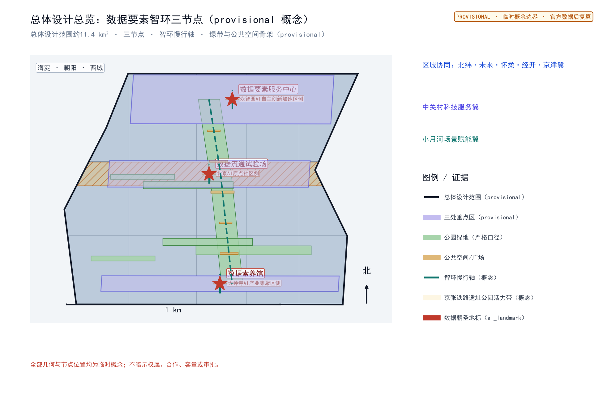
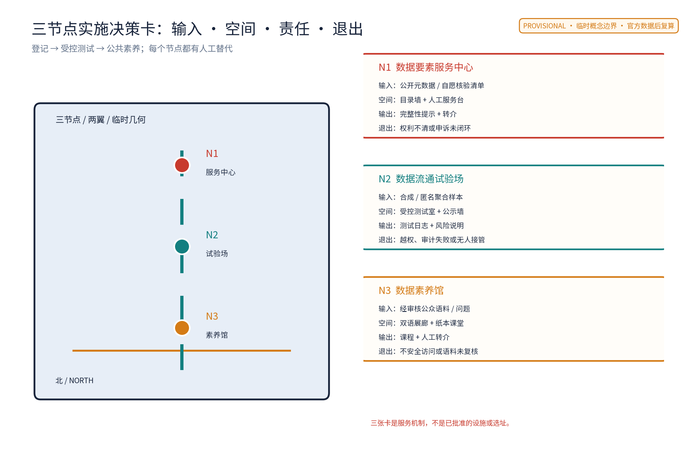
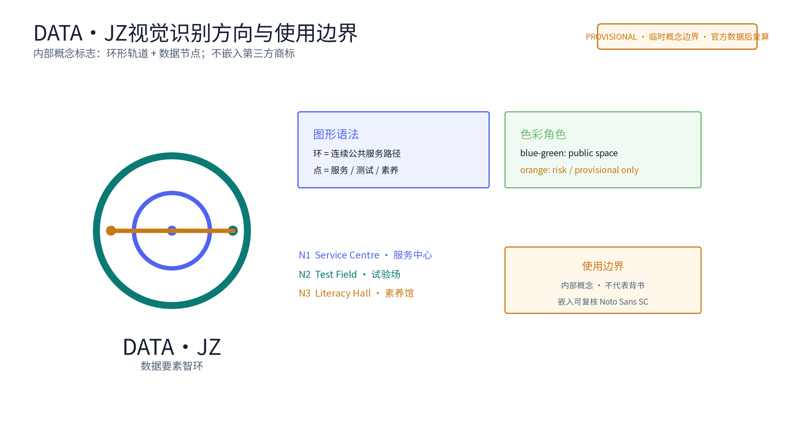
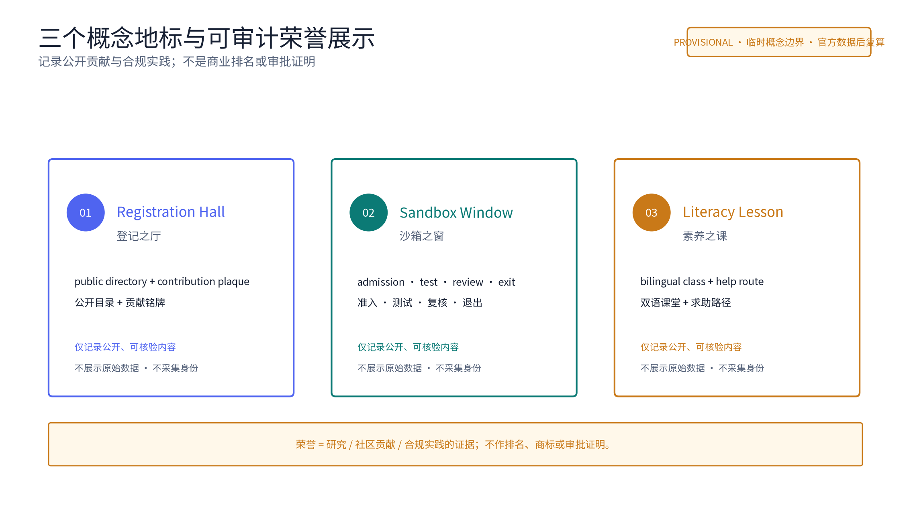
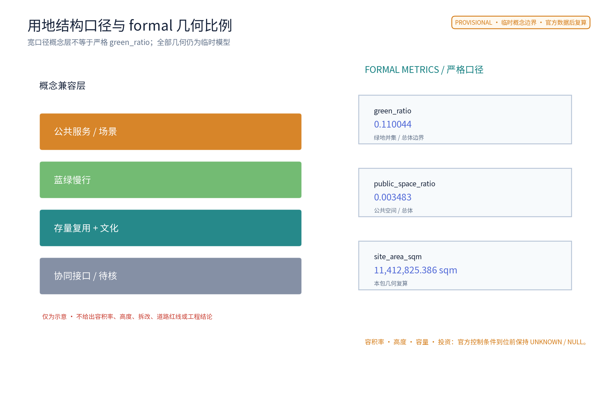
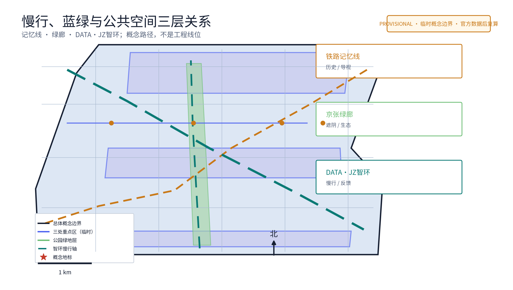
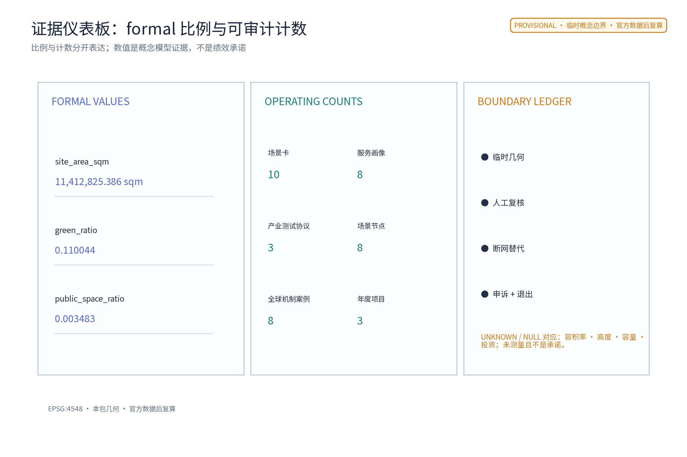

# 数据要素智环 DATA·JZ

> 数据如流水，智环如沟渠。以登记为入口、以受控验证为中段、以公众素养为出口，把抽象的数据治理转译成可阅读、可质询、可暂停的城市公共服务。

本方案是“数据要素智环 DATA·JZ”（Data-Element Loop）的概念建议，保留“数据要素服务中心—数据流通试验场—数据素养馆”三节点主线。三节点分别承担公开目录与登记咨询、受控验证与审计摘要、公众教育与求助转介，沿智环慢行轴形成“登记—流通—素养—反馈—复算”的闭环。空间位置、面积、运营主体、合作关系和活动均为参考方案，不是已批准的选址、政策、工程或合作承诺；官方边界、控规、权属、文保、消防和无障碍资料发布后，须由专业团队复核。

## 设计依据与资料清单

主控依据是公开征集公告、面向全球智能体任务书及其边界条款。

> [source:DATA-SRC-OFFICIAL-ANNOUNCEMENT-20260509] [source:DATA-SRC-AGENT-TASKBOOK-20260518] [standard:PROJECT-AGENT-OPEN-CALL-TASKBOOK]

方案明确回应三大定位、五大功能、三区两翼和 agent.1—agent.6，并用结构化矩阵将每项交付连接到正文、图件、几何、指标与来源。资料分为三层：官方公开文本用于任务和边界口径；公开政策/法律/机构页面用于机制参照；本包 provisional geometry 只用于概念组织、图件和几何复算测试。

| 资料层 | 本方案用途 | 能证明什么 | 不能证明什么 |
| --- | --- | --- | --- |
| 公开公告与任务书 | 名称、三大定位、五大功能、三区两翼、agent.1—6 | 任务响应关系 | 不证明具体地块、合作或审批 |
| 政策、法律与机构公开页面 | 数据登记、受控共享、公共教育的机制方向 | 可追溯的比较依据 | 不构成项目合规意见或机构背书 |
| 本包 geometry 与 metrics | 临时图件、公式演示、机器校验 | 可复算的概念模型值 | 不构成官方红线、测绘或控规 |

已知资料缺口包括官方总体边界、重点区 polygon、权属、现状测绘、控规、道路红线、文保、消防、市政容量、无障碍调查和运营需求基线。所有缺口在 `assumptions.json`、`sources.json`、`metrics.json` 和 `report/copyright_statement.md` 中登记；不得用临时数字替代正式资料。

## 三层范围工作框架

三层范围采用“证据—空间—服务—复算”四步链。

> [depth:three_level_scope_framework] [source:DATA-SRC-PROVISIONAL-BOUNDARIES-20260605]

统筹研究范围解释一带与区域协同，包含海淀及北纬社区、未来科学城、怀柔科学城、经开区和京津冀的接口关系；总体设计范围组织一环三节点、三区两翼和京张文化骨架；重点区域范围把服务中心、试验场和素养馆拆成组件、责任、准入、输出和退出条件。每层都区分事实、概念建议和待核事项。

| 层级 | 工作问题 | DATA·JZ 回答 | 可交付证据 |
| --- | --- | --- | --- |
| 统筹研究 | 数据要素怎样服务一带的创新与公共利益 | 八要素生态矩阵、八个公开案例、三区两翼接口 | `ecosystem-atlas`、案例表、来源登记 |
| 总体设计 | 数据服务怎样成为城市可感知的连续路径 | 智环慢行轴、三节点、三地标、文化导视 | `site-overview`、`mobility-bluegreen`、指标图 |
| 重点区域 | 每个节点如何安全地运行、暂停和复盘 | 输入—空间—输出—责任—申诉—退出卡 | `key-areas`、十张场景卡、三项协议 |

总体回路为：N1 众智园侧服务中心登记公开目录与服务需求 → N2 AI原点社区侧试验场在受控环境中验证匿名聚合或合成数据 → N3 大钟寺侧素养馆把公开方法、风险和求助路径转译成公众课程 → 居民议事和年度公示反馈 → 多智能体提出下一轮概念情景 → 人工复核、公开说明和几何复算。

> [source:DATA-SRC-AGENT-TASKBOOK-20260518] [data:PACKAGE-GEOMETRY] [metric:scenario_node_count]

此回路不接触个人隐私，不将反馈变成个体画像。

## 统筹研究范围产业与未来城市研究

### 1. 三大定位与五大功能的转译

“百年京张文化带”对应铁路记忆、资料来源和公共知识传递；“都市AI生活体验带”对应无需 App/登录的素养课、人工窗口、纸本和可访问导视；“AI融合创新带”对应数据目录、受控试验、开发者社区和多主体复盘。五大功能不是口号，而是五条可检查的服务链：AI全栈自主创新体系由“数据目录—登记核验—沙箱验证—审计复盘”支撑；世界级 AI 创新生态由八要素矩阵和跨区域接口支撑；AI+场景赋能新范式由十张场景卡支撑；智能化 AI 活力城市由公共课堂、慢行、文化导视和低门槛问答支撑；AI治理全球话语权由公约、证据登记、年度公示和国际传播短文支撑。

### 2. 三区两翼的输入/输出/空间/责任/退出映射

| 区域/翼 | 输入 | 空间接口 | 输出 | 概念责任 | 退出条件 |
| --- | --- | --- | --- | --- | --- |
| AI原点社区 | 合成/匿名聚合测试请求、公开规则 | N2试验场受控区与报告墙 | 测试日志摘要、风险清单、复盘建议 | 待核运营方牵头，安全审计员复核 | 越权、审计不通过、无法人工接管 |
| 众智园AI自主创新加速区 | 目录条目、登记材料、开发者议题 | N1服务中心、公示墙、咨询室 | 完整性提示、服务转介、公开议题 | 数据服务专员与人工评审小组 | 材料不完整、权属不清、申诉未闭环 |
| 大钟寺AI产业集聚区 | 公众问题、企业服务需求、课程反馈 | N3素养馆、课堂、问答台 | 双语课程、纸本指引、求助转介 | 讲解员、双语编辑、社区联络员 | 语料未审核、内容误导、投诉未响应 |
| 中关村科技服务翼 | 公开方法、开发者议题、服务需求 | 智环东西向接口与 N1 转介台 | 技术咨询候选、人才/项目线索（待核） | 服务窗口与高校/企业协作者（待核） | 无授权、权利边界不清、无法说明来源 |
| 小月河场景赋能翼 | 场景提案、公共体验反馈 | 智环东西向公共空间与 N3 课程接口 | 场景卡、体验复盘、可迁移模板 | 社区团队与人工评审小组 | 体验伤害、无障碍检查不通过、无人工替代 |

三大定位、五大功能、三区两翼和这张接口表共同构成区域协同协议：

> [source:DATA-SRC-AGENT-TASKBOOK-20260518] [source:SRC-DATA-20] [depth:overall_spatial_structure]

北纬社区、未来科学城、怀柔科学城、经开区及京津冀只作为公开资料语境和潜在互学接口，不暗示合作、招商、落地或资源承诺。

### 3. 八个有来源的全球机制案例与八要素生态矩阵

以下案例只提取公开页面可核查的机制方向，不搬用机构的规模、效果、客户、投资或本地合作关系。完整 URL、访问日期、允许用途与禁止用途见 `sources.json`。

| 案例 | 可借鉴机制 | DATA·JZ 的转译边界 | 来源 |
| --- | --- | --- | --- |
| 北京国际大数据交易所 | 数据流通规则与服务接口 | 只借公开目录/规则接口思路，不宣称本地合作 | SRC-BJ-BIGDATA |
| 上海数据交易所 | 场内流通与合规服务探索 | 只作制度比较，不复制交易安排 | SRC-SH-DATA-EXCHANGE |
| 贵阳大数据交易所 | 数据要素交易探索的公开叙事 | 只借登记与撮合的讨论框架 | SRC-GY-BIGDATA |
| 欧盟 Data Act 方向 | 数据访问、共享和责任讨论 | 只作国际法规方向参照，不作适用性结论 | SRC-EU-DATA-ACT |
| Fab Lab Network | 开放式创客协作与知识共享 | 转译为开发者议题和公开复盘，不使用其标识 | SRC-FABLAB |
| Station F | 创业社区与服务集成 | 转译为可预约/可退出的社区服务包，不宣称关联 | SRC-STATIONF |
| AI Verify Foundation | AI 测试与治理工具讨论 | 转译为测试协议和人工复核清单，不宣称认证 | SRC-AIVERIFY |
| NIST AI RMF | 风险识别、衡量、管理、治理框架 | 转译为场景卡的风险字段，不作合规认证 | SRC-NIST-AIRMF |

| 生态要素 | N1 服务中心 | N2 试验场 | N3 素养馆 | 区域/翼接口 | 可审计输出 |
| --- | --- | --- | --- | --- | --- |
| 土地与空间 | 存量优先的服务界面 | 受控验证空间 | 公共课堂与展廊 | 片区接口待核 | 空间卡、provisional 图件 |
| 规则与权利 | 目录/登记提示 | 准入、审计、退出 | 公开语料与投诉 | 来源和许可复核 | 权利台账、规则版本 |
| 数据 | 公开目录元数据 | 合成/匿名聚合样本 | 公开教学语料 | 只读共享方法 | 输入清单、删除记录 |
| 算力与工具 | 检索候选 | 受控计算概念 | 离线纸本/人工替代 | 工具来源待核 | 运行日志摘要 |
| 人才 | 数据服务专员 | 开发者、审计员 | 讲解员、编辑 | 高校/企业线索待核 | 角色表、培训记录 |
| 产业与资金 | 服务需求登记 | 三项测试协议 | 招引信息素养化 | 资金不作承诺 | 需求卡、转介单 |
| 场景 | 目录、登记、入表咨询 | 撮合、准入、质量复核 | 课程、问答、议事 | 迁移条件 | 十张场景卡 |
| 公共信任与文化 | 公示墙 | 报告墙 | 京张记忆、导视 | 国际传播 | 年度公示、申诉闭环 |

### 4. 面向规划迭代的 AI 机制

四类代理分别提出目录、空间、交通/蓝绿、公共服务候选；

> [source:DATA-SRC-GENERATIVE-AI-INTERIM-MEASURES] [metric:annual_program_count] [standard:PROJECT-AGENT-OPEN-CALL-TASKBOOK]

每轮只读取授权的匿名聚合或合成数据，生成两种以上概念情景。人工评审小组依据无障碍、消防、文保、权属、隐私和来源边界比较情景，形成可公开的差异记录；居民意见通道和年度公示反馈到下一轮。AI 只生成候选和风险提示，关键决策由人复核；仅匿名聚合、关键决策人工复核、禁止过度监控。断网时退化为纸本目录、人工窗口、课堂和电话/现场转介，不因没有 App 而拒绝公共服务。

## 总体设计范围城市更新与控规深度城市设计

总体空间结构为“一环、三节点、三地标、两翼接口”。智环慢行轴与京张铁路遗址公园绿带并行但不等同，南北串联文化与公共体验，东西把中关村科技服务翼和小月河场景赋能翼接入三节点。图件中的边界、节点与路径均为 provisional 概念点位，不是官方红线、道路、轨道、桥隧或管线方案；比例尺、指北针、图例和临时边界警示已在中英文图件中同步呈现。

更新策略是“先核验、再轻改、可逆转、可退出”：

> [depth:overall_spatial_structure] [source:DATA-SRC-MOHURD-CONTROL-DETAILED-PLANNING] [data:PACKAGE-GEOMETRY]

优先使用存量建筑和公共空间，不预设拆除；需要功能调整时先做权属、文保、消防和无障碍核查；条件不具备则移位或删除概念组件。法定强度、容积率、建筑高度、具体拆改留、投资、容量和市政负荷均保持 unknown/to_verify，不用概念数值冒充结论。

| 空间层 | 概念对象 | 体验与证据 | 待核边界 |
| --- | --- | --- | --- |
| 一环 | 智环慢行轴、文化记忆线、东西缝合支线 | 节点导视、座椅、公示、课程和反馈点 | 线位、断面、权属、无障碍现状 |
| 三节点 | N1 服务中心、N2 试验场、N3 素养馆 | 三节点卡、RACI、准入/退出 | 具体地块、建筑与运营主体 |
| 三地标 | 登记之厅、沙箱之窗、素养之课 | 可阅读的公共界面和荣誉记录 | 不新建工程、不注册商标 |
| 两翼 | 中关村科技服务翼、小月河场景赋能翼 | 转介台、场景模板、公共体验 | 合作与资源均待核 |

## 重点区域详细设计

### N1 数据要素服务中心｜众智园AI自主创新加速区

空间组件为入口导视、公开目录墙、登记材料咨询台、授权运营撮合意向登记台和申诉转介台。输入是依法可公开的目录元数据与自愿提交的材料；输出是完整性提示、人工解释、服务转介单和可公开的统计摘要，不作确权、审批或交易判断。责任链为服务专员执行、人工评审小组复核、待核运营方维护、居民/开发者代表观察。材料缺失、权属不清、无法说明来源或申诉未闭环即暂停。

### N2 数据流通试验场｜北京AI原点社区

空间组件为受控验证区、观察窗、报告墙、人工接管台和离线应急柜。仅接收合成、志愿或去标识化的测试数据；安全沙箱 AI 只提示清单，不能接触个人信息、不能作安全审计结论。输出是测试协议、风险记录和公开摘要；原始临时数据在退出时删除，必要审计摘要按权利边界保留。三项产业测试协议 T01—T03 见场景部分，均以小范围、可暂停、可复盘为前提。

### N3 数据素养馆｜大钟寺AI产业集聚区

空间组件为京张记忆导视、双语展廊、儿童/长者纸本课堂、人工问答台和无障碍休息点。免预约优先，纸本、图示、人工讲解与低位触觉导视并行，不强制 App 或登录；教学语料需人工审核，投诉转人工。面向居民、儿童、长者、青年、企业、游客、低数字素养者和无障碍人士提供差异化服务，但不建立个体画像。

### 三个概念朝圣地标与荣誉展示

1. **登记之厅 Registration Hall**：把公开目录、登记流程和年度贡献铭牌放在可阅读界面；荣誉记录公开可核验的研究、社区贡献或合规实践，不作商业排名。
2. **沙箱之窗 Sandbox Window**：展示准入—测试—人工复核—退出的流程与摘要，不展示原始数据，不将测试称为认证。
3. **素养之课 Literacy Lesson**：以儿童、长者、游客都能进入的双语课堂讲解数据权利、风险和求助路径，不采集身份。

DATA·JZ 的视觉识别是内部概念方向，不借用第三方商标：

> [source:DATA-SRC-AGENT-TASKBOOK-20260518] [metric:landmark_count]

主标志以“环形轨道 + 数据节点”构成，蓝绿为公共空间语义，橙色只用于风险/临时边界提示，深墨色用于正文；中文与 DATA·JZ 同级，节点用 N1/N2/N3 及中英文副标题。`logo-datajz`、`honor-display` 图板记录色彩、字号层级、图形语法和使用禁区；字体采用可嵌入的本地 Noto Sans SC，图件不嵌入第三方 Logo、肖像或照片。

## AI 创新生态、人才画像与 AI+ 场景

八类服务画像分别是周边居民、长者、儿童与陪同者、青年开发者、企业服务人员、游客、低数字素养者和无障碍支持需求者；

> [source:DATA-SRC-AGENT-TASKBOOK-20260518] [metric:scenario_card_count] [metric:persona_count]

另以数据分析师、审计员和讲解员作为服务角色，不把角色表当作个人画像。每张场景卡统一记录：输入边界、空间、AI 输出、人类责任、公共输出、申诉/人工替代和退出条件。

### 十张完整场景卡

| ID | 输入边界 | 空间 | AI输出/人工责任 | 公共输出与替代 | 退出条件 |
| --- | --- | --- | --- | --- | --- |
| S01目录检索 | 公开目录元数据 | N1公示墙 | 检索候选/服务专员 | 纸本目录、人工解释 | 来源过期或命中敏感字段 |
| S02登记提示 | 自愿提交的材料清单 | N1咨询台 | 缺项提示/登记专员 | 清单打印、申诉台 | 权属或授权不清 |
| S03入表咨询 | 企业自述的非敏感摘要 | N1咨询室 | 问题分流/人工顾问 | 公开指引、转介单 | 需要法律意见或内部数据 |
| S04需求撮合测试 | 合成/匿名聚合样本 | N2撮合区 | 候选配对/沙箱管理员 | 测试摘要、人工复核 | 越权、无法溯源、投诉未闭环 |
| S05沙箱准入 | 测试方案与最小数据清单 | N2受控区 | 清单提示/安全审计员 | 准入说明、纸本表 | 审计不通过或无人工接管 |
| S06质量复核测试 | 合成/去标识化样本 | N2验证区 | 差异提示/开发者+审计员 | 质量摘要、人工解释 | 数据越界或复现失败 |
| S07居民素养课 | 公开语料、现场问题 | N3课堂 | 课程草稿/讲解员 | 纸本课件、现场问答 | 语料未审核或误导 |
| S08儿童长者课 | 不采集身份的课堂反馈 | N3无障碍课堂 | 难度建议/讲解员 | 图示、触觉、陪同者说明 | 安全/可达性检查不通过 |
| S09双语游客问答 | 审核后的中英常识库 | N3问答台 | 语言候选/双语编辑 | 中文、英文、人工转介 | 超出常识或无法翻译 |
| S10年度议事 | 匿名汇总意见、纸本意见 | 智环节点 | 主题归纳/社区联络员 | 年度公示、回复清单 | 无法匿名化或无回复责任 |

### 三项产业测试协议

| 协议 | 目的与最小输入 | 过程与指标口径 | 人工闸门 | 退出与复盘 |
| --- | --- | --- | --- | --- |
| T01 匿名需求撮合 | 合成供需标签，不含个人信息 | 候选召回率、误配例数、人工复核覆盖率；仅作试验指标 | 每一候选由沙箱管理员确认 | 误配或来源不可追溯即停，发布摘要 |
| T02 沙箱准入 | 测试方案、数据字典、授权说明 | 缺项数、人工接管演练是否完成、审计问题关闭数 | 安全审计员与人工评审小组签字 | 越权/断网无替代即停，删除临时数据 |
| T03 模型与数据质量 | 合成或去标识化样本 | 可复现性、缺失项提示准确记录、偏差案例数 | 开发者解释，审计员复核，不作认证 | 复现失败或伤害风险上升即停，公开复盘 |

### 场景—空间—运营闭环

多智能体只提交候选，人工评审决定是否进入概念测试；

> [source:DATA-SRC-GENERATIVE-AI-INTERIM-MEASURES] [metric:industry_test_scenario_count] [depth:phasing_implementation]

测试不等于部署，指标不等于正式绩效基线。服务中心提供登记与证据，试验场提供受控验证，素养馆提供公众解释；开发者社区以公开议题、线下工作坊、人工复核、短期验证、公开摘要、反馈修订、退出和归档为路径。招引、资金、合作和审批都标为待核，不把线索写成承诺。

## 用地、建筑规模与拆改留方案

概念用地仅分为数据服务、创新验证、公共绿地、慢行廊道和公共服务五类，

> [source:DATA-SRC-MNR-LAND-USE-CLASSIFICATION-202311] [metric:green_ratio] [data:PACKAGE-GEOMETRY]

采用公开用地分类词汇而不改变法定性质。`land-use-structure` 的宽口径公园绿地比例仅用于结构阅读；三项 formal 指标则严格从几何计算。当前 geometric boundary 是 provisional，面积不是官方面积。

存量优先的拆改留流程为：A 核查测绘/权属/文保/消防/无障碍 → B 满足条件则保留 → C 需适配时做可逆轻改 → D 不满足时移位或删除概念组件。没有上述资料，不给出具体地块拆改留、建筑高度、容积率、建筑强度、投资或市政负荷结论。建筑和设施只作为可替换的功能包络，不能被理解为建设方案。

## 交通、轨道、市政与公共服务设施

智环采取步行、骑行和无障碍连续优先的概念原则，

交通层的空间意图是把“能到达、能看懂、能停下、能求助”作为连续性验收顺序：入口先用中英文字、图形和低位/触觉提示标明 N1/N2/N3，节点之间用不依赖定位服务的方向牌和纸本索引维持认知；每个休息点同时记录无障碍现状、遮阴、照明、座椅和人工求助缺口。`roads.geojson` 仅是概念路径数据，`road_network_length_m` 只表示本包几何可复算模型值，不是道路工程量、服务半径或容量基线。官方道路、轨道、消防、市政和无障碍资料未提供前，任何断点修补都只能作为待核的轻量策略；若核查不通过则移位、降级为纸本信息或退出，不以“出站即入环”替代现场安全论证。

> [depth:traffic_rail_slow_parking] [source:DATA-SRC-MOHURD-URBAN-DESIGN-MEASURES] [metric:road_network_length_m]

与既有轨道/公交到达方向建立“出站—入环”的体验关系，但不指定新站、线位、道路红线、断面、桥隧或容量。断点修补优先用标识、座椅、照明、人工服务和纸本信息解决，工程措施需专业团队另行论证。三节点共享公共服务：N1 企业服务窗口，N2 测试与审计，N3 社区课堂；断网时三者都保留人工和纸本替代。

## 蓝绿空间、公共空间与城市风貌

“铁轨记忆—绿廊—数据环”是三层可读叙事。

蓝绿层的空间意图不是把临时绿地率包装成生态承诺，而是先建立“可遮阴的停留—可读的公示—可达的课堂—可退出的试验”公共连续性。`green_space.geojson` 和 `public_space.geojson` 的 union 面积只用于复算本包三项 formal 值；图中的宽口径绿地层约 26% 只服务结构阅读，不能与严格 `green_ratio=0.110044` 相加或互换。正式深化必须核对绿线、蓝线、文保、消防、树木、排水和无障碍现状；任一资料缺失时只保留概念组件清单，不给工程断面、容量或实施结论。公共空间的风险由人工巡查、居民意见通道、年度公示和退出牌共同管理，夜间只采用低眩光功能照明，不以摄像或个体追踪换取运营。

> [depth:blue_green_public_space] [source:DATA-SRC-MOHURD-URBAN-DESIGN-MEASURES] [metric:public_space_ratio]

公共空间组件库包括公示墙、遮阴座椅、低位/触觉导视、休息点、可移动课堂套件、低眩光功能照明和申诉转介牌；组件不以传感器、屏幕或身份识别为开放前提。蓝绿空间只作概念布局，须以官方绿线/蓝线、文保、消防、权属和现状无障碍核查为前置。所有图件均有图例、比例尺、指北针、路径层级和 PROVISIONAL 提示，颜色同时用文字和线型表达，避免仅靠色彩识别。

## 更新项目清单、实施政策与分期计划

> [depth:renewal_project_list] [metric:phase_count]

| 项目包 | 近期1—3年 | 中期3—5年 | 远期5—10年 |
| --- | --- | --- | --- |
| 服务中心 | 公开目录、人工窗口、登记材料清单 | 形成公开服务指引与复盘 | 仅在官方数据/授权齐备后讨论扩展 |
| 试验场 | T01—T03 小范围、合成/匿名数据、人工接管演练 | 复核更多公开议题，完善退出台账 | 形成可迁移的测试协议库，不承诺部署 |
| 素养馆 | 双语/纸本课堂、儿童长者服务 | 年度课程和开发者工作坊 | 形成跨区域公开课程交换接口（待核） |
| 智环公共空间 | 导视、休息、公示、反馈点概念试点 | 依据无障碍与现状调查调整 | 官方几何发布后整体复算和重定位 |

### RACI、资源与停项

牵头 A：待确认的园区运营主体；负责 R：服务专员、沙箱管理员、讲解员、审计员；协作 C：企业、高校、社区服务团队和开发者；监督 I：依法有权部门、居民议事代表和公开评审小组。主体均为角色而非已确认机构。启动门槛为授权说明、最小数据清单、人工接管演练、无障碍检查、来源/版权核对和退出预案；任一缺失不启动。退出触发包括数据越界、审计失败、投诉未闭环、断网无法人工替代、权属变化或语料未审核；退出后删除临时数据、保留必要审计摘要、向公众说明原因。

### 年度活动、开发者社区与转化

三项活动品牌为“DATA·JZ 数据素养周”“DATA·JZ 沙箱开放日”“DATA·JZ 开放协同季”，均为待核设想，不是已确定安排。开发者社区以公开议题板、双语说明会、线下工作坊、预约测试、人工复核、公开摘要、贡献署名和年度归档运行；贡献可被记忆但不自动形成招商或政策资格。转化路径是“公开议题 → 资格与权利核对 → 小范围测试 → 人工复核 → 公开摘要 → 反馈修订 → 退出/归档”，合作、资金、招引、审批和效果均需后续核实。

## 指标体系、面积复算与合规矩阵

### Formal 三项核心指标

| 指标 | 当前值 | 公式与源文件 | 置信度/边界 |
| --- | ---: | --- | --- |
| `site_area_sqm` | 11,412,825.386 sqm | `area(site_boundary.geojson, EPSG:4548)` | known 但 geometry provisional/low |
| `green_ratio` | 0.110044 | `union(green_space)/site_boundary` | known 几何比，非官方绿地率 |
| `public_space_ratio` | 0.003483 | `union(public_space)/site_boundary` | known 几何比，非法定公共空间率 |

三项值均从本包 `site_boundary.geojson`、`green_space.geojson`、`public_space.geojson` 复算，

> [metric:site_area_sqm] [metric:green_ratio] [metric:public_space_ratio]

并在双语 `visual/index*.html` 的 `data-value` 中保持一致。`land-use-structure` 中约 26% 是“公园绿地+开放绿地+生态缓冲”的宽口径概念图层，不等于严格 `green_ratio=0.110044`；图注和指标表明确区分。官方边界、绿地和公共空间数据发布后，按同一公式替换并复算。FAR、建筑高度、容量、投资等依赖未公开控制条件的项目指标保持 `unknown`/`null` 并说明原因。

### 计数指标和证据索引

三节点、三地标、十张场景卡、三项产业测试协议、八类服务画像、八个生态案例、八个场景节点（五个场景节点+三地标）、三项年度活动和三期节奏均在正文、`metrics.json`、图件和矩阵中逐项对应。`compliance_matrix.json` 的 agent.1—agent.6 条目分别指向命名/视觉、生态案例、场景卡、地标组件、文化导视、运营转化证据；`design_depth_matrix.json` 覆盖现状资料缺口、三层框架、空间、交通、蓝绿、更新、分期、复算和风险。

### 证据与合规矩阵（面向复核）

| 任务 | 关键证据 | 可复核文件 | 边界 |
| --- | --- | --- | --- |
| agent.1 总体统筹 | DATA·JZ、Logo语法、三大定位/五大功能/三区两翼、总体图 | proposal、site-overview、logo、compliance | 不作法定选址/强度 |
| agent.2 生态体系 | 八案例、八要素矩阵、三节点机制 | proposal、ecosystem-atlas、sources、metrics | 不作企业/资金/合作承诺 |
| agent.3 场景赋能 | S01—S10、T01—T03、八类画像 | proposal、key-areas、metrics | 不采集个人信息，不自动决策 |
| agent.4 公共空间/地标 | 三地标、荣誉展示、组件库 | proposal、honor-display、key-areas | 不新建工程、不用第三方标识 |
| agent.5 文化融合 | 铁路记忆线、导视规则、双语传播 | proposal、logo、site-overview | 历史与权利待来源核验 |
| agent.6 运营 | 三项活动、社区流程、RACI、退出/年度公示 | proposal、metrics、compliance | 活动和招引均待核 |

## 风险、版权与合规说明

本方案的第一风险是把概念建议误读为已决定安排。

> [source:SRC-DATA-SECURITY-LAW] [source:SRC-PIPL] [source:DATA-SRC-GENERATIVE-AI-INTERIM-MEASURES]

正文、图件、HTML、PDF 和 manifest 明确标注 PROVISIONAL、来源、公式、置信度和复算触发条件；`manifest.validation_claim.data_confidence` 使用 mixed_provisional_and_conceptual。第二风险是数据越权：场景只允许公开、合成、志愿或去标识化输入，仅匿名聚合，关键决策人工复核，禁止过度监控；不做个体识别式追踪、不建立大规模行为画像。第三风险是来源和版权：八个新增案例逐项登记 URL、发布/访问日期、允许用途、禁止用途和未核验边界；不嵌入第三方 Logo、照片、人物或论文图像，DATA·JZ 标志为内部概念方向。

AI 治理采用三句式并贯穿所有场景：**仅匿名聚合；关键决策人工复核；禁止过度监控。** 居民意见通道、年度公示、年度活动、申诉转人工和审计摘要是公共信任的最低机制。任何服务若不能解释来源、不能提供人工替代、不能完成无障碍检查或不能执行退出，就不进入下一阶段。所有成果均为开放共创建议和参考方案，不替代正式规划，不构成政府审定结论、合作/投资/资金承诺或工程可行性判断。

## 参考资料

完整来源登记见 `sources.json`，

> [source:SRC-FABLAB] [source:SRC-STATIONF] [source:SRC-AIVERIFY]

包含公告、任务书、城市设计管理办法、控规编制审批办法、用地分类指南、生成式人工智能服务管理暂行办法、数据二十条、数据安全法、个人信息保护法、四个数据机制案例和四个全球开放生态/治理案例。每项记录发布者、URL、发布日期或 unknown、访问日期、来源类型、权利状态、允许用途和禁止用途。几何来自 `geometry/`，只用于概念可视化和复算测试；假设与资料缺口见 `assumptions.json`。双语文件 `proposal.en.md` 与本稿逐节对应，图件、HTML、A0/A3 PDF 和 visual/index 均使用同一版本证据。

> 本方案由 JohnXu22786 提交，AI 辅助起草并由人工复核；感谢审阅。
