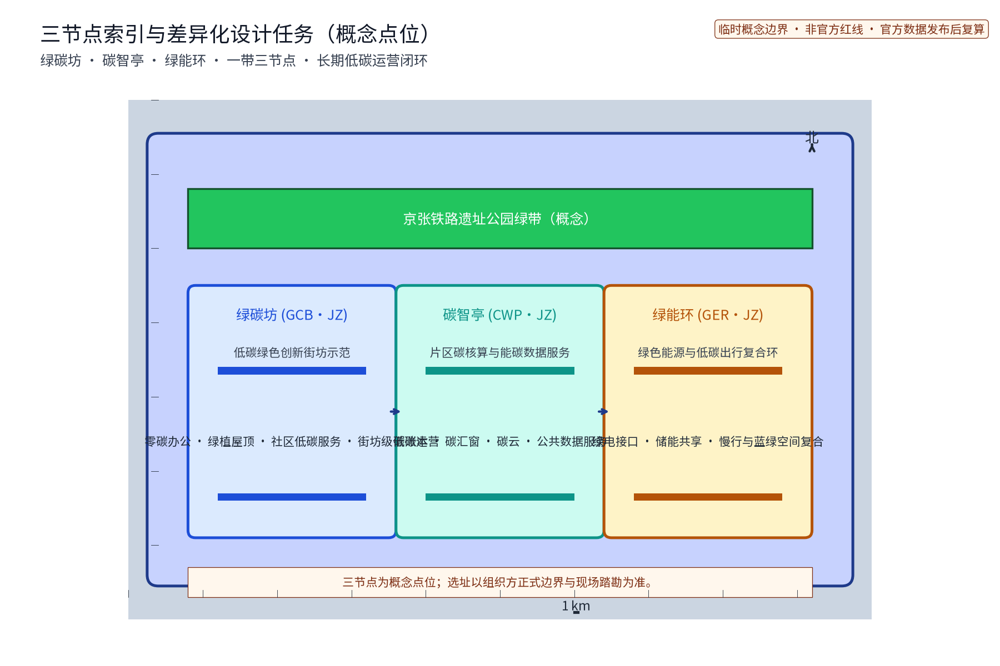
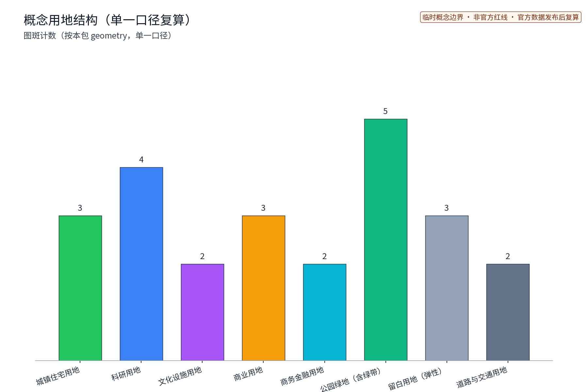
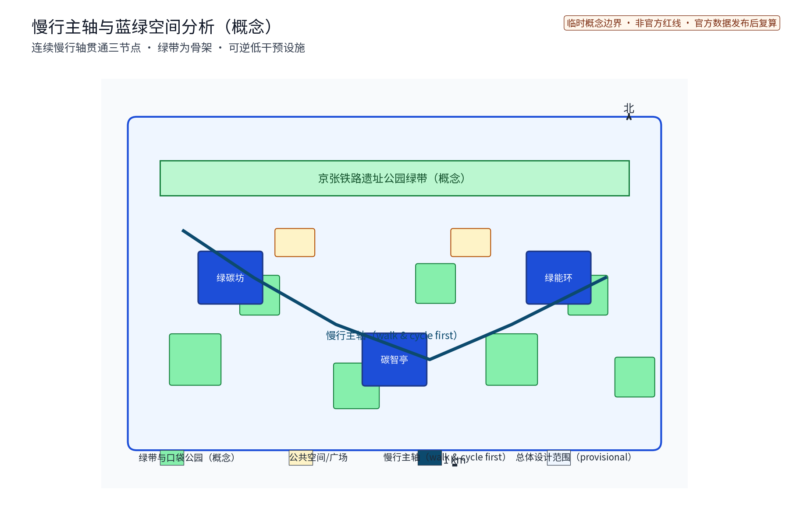
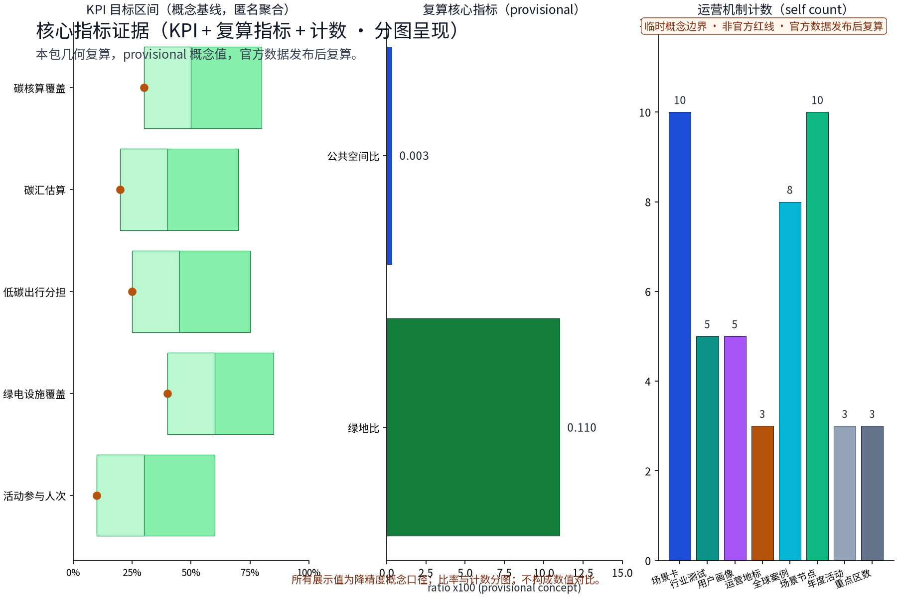
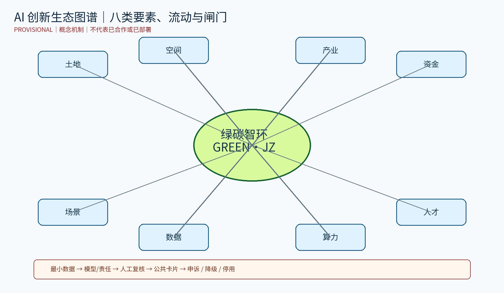

> 状态声明 / STATUS：本方案是概念性、非工程、非红线的研究与设计建议。几何来自 geometry/ 的 provisional 临时边界；已知几何数值是低置信度复算，不是现状或审批指标。任何碳减排、绿电、合作、审批、运营和实测效果均未被本包证明。

# 绿碳智环：片区碳核算与低碳绿色创新环境

## 设计依据与资料清单

[source:DATA-SRC-OFFICIAL-ANNOUNCEMENT-20260509] [source:DATA-SRC-AGENT-TASKBOOK-20260518]

本案依据任务公告、agent taskbook、城市设计管理与用地分类公开文本、生成式人工智能治理和无障碍法律文本。它们只支撑任务边界、专业深度和合规提醒，不支撑本项目红线、产权、实测碳排、审批或合作事实。全球 AI 机制案例 C01–C06 仅引用发布者公开页面的机制描述；页面截图、Logo、完整段落和本地适用性不主张复用。访问日期、事实边界、许可边界与待核验项在 sources.json 和 report/copyright_statement.md 逐条登记。

## 三层范围工作框架

[depth:three_level_scope] [data:DATA-SRC-PROVISIONAL-BOUNDARIES-20260605]

| 层级 | 工作对象 | 交付与传导 | 状态边界 |
|---|---|---|---|
| 统筹研究层 | 京张 AI 创新带及区域接口 | 产业、人才、碳核算口径、全球机制案例、八类支撑要素 | 研究范围 provisional |
| 总体设计层 | 连续绿带、慢行环、三节点及三区两翼 | 空间结构、交通蓝绿、公共服务、品牌、运营回路 | 设计范围 provisional |
| 重点区域层 | 绿碳坊、碳智亭、绿能环 | 平面/断面意图、旅程、测试节点、人工兜底 | 位置和尺度 to_verify |

三区为生态碳汇区、创新生产区、公共交往区；两翼为产业协同翼、社区生活翼。外部协同不是第四个分区，而是通过数据字典、场景申请、开发者社区和季度复盘接入的接口：北纬社区、未来科学城、怀柔科学城、经开区、京津冀均为待确认资源关系。

## 统筹研究范围产业与未来城市研究

[source:DATA-SRC-AGENT-TASKBOOK-20260518] [depth:agent.1-2]

### agent.1：三大定位、五大功能与任务图

三大定位：片区碳核算公共解释界面；蓝绿慢行承载的低碳创新交往环境；可撤回、可审计的 AI 场景试验场。五大功能：碳账本与指标解释、绿色空间与低碳出行、企业/高校验证、公众参与与无障碍服务、年度运营与国际传播。

任务链：任务依据 → 三区两翼 → 三节点服务编排 → S01–S12 场景测试 → 人工审查/申诉/停用 → 季度复盘 → 分期更新。碳账本提供同口径比较，不提供个体画像；绿能环提供可达性与蓝绿体验，不承诺减排；绿碳坊提供可逆试点单元，不承诺零碳建筑。

### 八类支撑要素与区域接口

| 要素 | 最小输入 | 协作产品 | 角色/周期 | 状态 |
|---|---|---|---|---|
| 土地 | 官方用途、权属、控制条件 | 更新候选清单 | 规划接口/季度 | unknown |
| 空间 | 实测边界、断面、障碍物 | 节点路径包 | 设计总协调/阶段 | provisional |
| 产业 | 企业/高校需求、测试伦理 | 场景申请沙盒 | 产业接口/月度 | to_verify |
| 资金 | 预算、采购、维护 | 分期成本闸门 | 财务责任方/阶段 | unknown |
| 人才 | 开发者、运营员、无障碍顾问 | 社区与值守排班 | 运营方/月度 | to_verify |
| 算力 | 托管、延迟、功耗 | 可降级推理队列 | 技术岗/周月 | unknown |
| 数据 | 能耗、交通、绿地聚合口径 | 数据字典与版本日志 | 数据治理/月度 | unknown |
| 场景 | 目的、字段、阈值、人工岗 | 测试卡、退出单 | 发起方/季度 | concept |

| 接口 | 资源/协作产品 | 责任角色 | 复盘 |
|---|---|---|---|
| 北纬社区 | 低碳反馈卡、纸面/人工入口 | 社区服务接口待确认 | 月度/季度公开 |
| 未来科学城 | 算力需求与测试结果模板 | 科研产业接口待确认 | 月度开发者会 |
| 怀柔科学城 | 模型评估与科学传播清单 | 科研接口待确认 | 季度同行复核 |
| 经开区 | 企业碳字段与产品化反馈 | 产业运营接口待确认 | 双月评审 |
| 京津冀 | 指标词典与案例交换 | 区域协同接口待确认 | 半年复盘 |

## 总体设计范围城市更新与控规深度城市设计

[standard:DATA-SRC-MOHURD-URBAN-DESIGN-MEASURES] [data:DATA-SRC-PROVISIONAL-BOUNDARIES-20260605]

本案原创方法是“碳账本—绿带—试点单元”：将可解释的碳字段、置信度和来源先放入公共界面，再把每个 AI 输出绑定到可走、可看、可人工接管的节点，最后用继续/暂停/删除作决策。它区别于一般 TOD/智慧交通方案：碳核算被设计成可申诉公共设施；模型不自动改变交通或服务；纸面、人工和断电版本始终存在。

整体品牌建议为 绿碳智环 / GREEN CARBON RING，环形碳线、京张锈色和低碳青仅是概念视觉语法，不是官方 Logo。文化遗产标识、机构标志、站名 Logo 和既有地标图形须单独授权；当前图件只使用本包原创矢量符号。

## 重点区域详细设计

[metric:key_area_count] [data:DATA-SRC-PROVISIONAL-BOUNDARIES-20260605]

N1 绿碳坊：建筑界面—半室外廊—种植/雨水带—慢行道—公共空间的断面，主入口接入慢行环；设置人工咨询、纸面账本、可拆卸遮荫与预约测试台。  
N2 碳智亭：公共路径侧布置双语屏/纸面版，侧向人工问答台和等候位；版本灯只显示更新时间与置信度，不识别个人。  
N3 绿能环：步行主线、骑行/接驳线、服务/应急线三层并置，雨水绿带、口袋空间和无障碍导视形成连续体验；坡度、宽度、消防、轨道控制须工程复核。

旅程：N3 进入 → 双语导视/人工替代 → N2 阅读来源/置信度/更新时间 → 自愿匿名反馈 → N1 参加可逆测试 → 运营员记录事件 → 月度复盘继续/降级/停用。模型缺数、阈值越界或公众异议时，回到纸面图、人工问答和静态公告。

## AI 创新生态、人才画像与 AI+ 场景

[depth:agent.2-3] [metric:scenario_card_count]

### agent.2：全球机制案例

C01 Helsinki AI Register（City of Helsinki）；C02 Dutch Algorithm Register（Dutch government）；C03 Model AI Governance Framework（Singapore IMDA）；C04 AI Security Institute（UK DSIT/AISI）；C05 OECD.AI（OECD）；C06 Australia AI Ethics Principles（Australian Government）。sources.json 逐条记录发布者、URL、日期或页面状态、访问日期、事实摘录、引用/复用边界、转译机制和不可照搬条件。它们是治理/评估/透明机制参考，不是 TOD 案例，不表示本地合作；页面无法稳定核验的字段保持 to_verify，不升级为本地事实。

| 案例机制 | 事实边界 | 转译 | 不可照搬 |
|---|---|---|---|
| C01/C02 登记机制 | 公开入口及算法说明机制 | 碳智亭公开目的、字段、人工岗、版本 | 不等同本地备案 |
| C03 组织问责/人类参与 | 框架页面为治理参考 | owner、reviewer、incident log、停用门 | 非本地法规 |
| C04 独立评估/风险测试 | 官方机构公开研究与测试职能 | 红队桌面测试和第三方抽查 | 不宣称认证/合作 |
| C05 比较指标平台 | 风险、隐私、事件、指标主题 | 年度指标词典和复盘字段 | 不移植外部数值 |
| C06 人本、公平、透明、申诉、问责原则 | 官方页面公开原则 | 写入碳账本解释和申诉 | 不等于本地合规 |

### agent.3：12 张场景卡与 3 个行业测试

每张卡必须有目的、最小字段、模型/规则、空间、人工责任、阈值或不适用、留存/删除、升级、停止和成熟度：

| ID | 目的/输入 | 规则→输出 | 空间/责任 | 阈值/留存/停止 |
|---|---|---|---|---|
| S01 | 月度能源与因子版本 | 复算→分项区间 | N2/数据岗 | 缺因子 N/A；版本留存；异常停 |
| S02 | 绿地类别、季节记录 | 系数假设→区间 | N3/生态顾问 | 未测 unknown；反常删除 |
| S03 | 分时能耗、天气 | 基线趋势→提示 | N1/设施员 | 小样本 N/A；回退历史值 |
| S04 | 断面计数、方式类别 | 占比规则→路径提示 | N3/交通员 | 不收轨迹；不足不发布 |
| S05 | 自愿问卷、纸面意见 | 主题归类→议题 | N2/人工台 | 原始90日后删；异议人工复核 |
| S06 | 时段评分、遮荫座椅 | 描述统计→改善单 | N3/无障碍顾问 | 不足不比较；投诉升级 |
| S07 | 设备台账、月度能耗 | 规则清单→维护顺序 | N1/设施责任人 | 不作工程结论；安全异常停 |
| S08 | 可核验电量、时间窗 | 匹配规则→缺口 | N1/N2/能源岗 | 无凭证 N/A；撤回即停 |
| S09 | 活动规模、交通问卷 | 方案比较→提示 | 三节点/活动岗 | 不算个人足迹；结束删原始 |
| S10 | 申请目的、字段、风险 | 准入清单→补件/拒绝 | N1/评审组 | 无人工岗不准入 |
| S11 | 自愿设施反馈 | 人工优先→维修单 | 三节点/人工台 | 不推断身份；敏感内容不入模 |
| S12 | 版本、事件、申诉汇总 | 审计规则→继续/删除 | 运营台/责任主体待指定 | 无法解释则删；年审 |

ITP-01 能源账本：匿名月度汇总对人工表，差异阈值 to_verify，缺因子或未解释差异即停并回退人工表。ITP-02 绿带/出行：三个时段人工断面计数为基线，容差和样本量 to_verify，样本不足不发布并回退静态导视。ITP-03 反馈/无障碍：纸面和数字反馈人工编码为基线，完整性/误分率/响应时限 to_verify，偏差或投诉即停自动归类并回退人工登记。

用户画像 P01 开发者、P02 设施运营员、P03 居民/家长、P04 学生/访客、P05 老年人/行动不便/低数字能力者；均为设计假设，后续以共创记录修正。P05 默认低位阅读、无障碍路径、电话/纸面和人工服务。

## 用地、建筑规模与拆改留方案

[metric:green_ratio] [standard:DATA-SRC-MNR-LAND-USE-CLASSIFICATION-202311]

geometry 的 green_ratio=0.110044 是 provisional 绿地多边形/边界的低置信度几何比值，不是法定绿地率； building_footprint_area_sqm=111600 也不是建筑普查。概念目标只表达优先序且不可反推面积：生态蓝绿30%、创新生产25%、公共文化15%、服务商业12%、社区生活10%、弹性保留8%，合计100%；取得官方底图后须公开分母、坐标系、重叠处理、公式、面积和置信度。拆改留遵循优先保留、可逆插入、专业复核、无法核验则不动。

## 交通、轨道、市政与公共服务设施

[standard:DATA-SRC-MOHURD-CONTROL-DETAILED-PLANNING] [depth:agent.4]

设计意图是把步行、骑行/接驳、服务/应急三层流线放在同一条可读的慢行骨架上，并让碳账本只作为解释和提示，不改变信号、不追踪个人。`geometry/roads.geojson` 只表达概念路径，road_network_length_m 仅为图形复算；轨道保护、道路红线、消防通道、无障碍坡度、雨洪、照明、能源和市政容量都没有现状证据。图件中的路径与节点不代表已批准线形，必须由交通、消防、轨道和无障碍专业复核。公共服务在断电或无网络时以纸面导视、人工问答和电话/公告栏替代；任何模型提示不能替代现场安全判断。[metric:road_network_length_m] [data:DATA-SRC-PROVISIONAL-BOUNDARIES-20260605]

绿能环以步行主线、骑行/接驳线、服务/应急线区分；颜色、线型和人工导视同时使用。碳智亭不控制信号、不追踪个人。轨道保护、消防、无障碍坡度、雨洪、照明、能源和市政容量均 to_verify，须资质团队及主管部门确认。

## 蓝绿空间、公共空间与城市风貌

[metric:public_space_ratio] [data:DATA-SRC-PROVISIONAL-BOUNDARIES-20260605]

设计意图是以连续绿带、遮荫、雨水管理、停留和触读导视形成三节点公共体验，而不是把概念色块当作既有绿线或工程设计。`green_space.geojson`、`public_space.geojson` 和 `roads.geojson` 只用于 provisional 图形测试；public_space_ratio=0.003167 是按本包多边形复算的低置信度比值，不是法定公共空间率。可拆座椅/遮荫、低位双语牌、纸面账本、人工问答台、可断电展示架、触读方向牌和事件公告栏均需无障碍、消防、维护和权属核验。三处地标只表达叙事与运营界面，不主张已建、已获荣誉或可使用遗产标志；缺少正式绿线、蓝线、权属、雨洪和现场踏勘资料时不进入工程实施。[metric:public_space_area_sqm] [standard:DATA-SRC-MOHURD-URBAN-DESIGN-MEASURES]

蓝绿空间强调连续、遮荫、雨水管理、停留和无障碍。组件库包括可拆座椅/遮荫、低位双语牌、纸面账本、人工问答台、可断电展示架、触读方向牌和事件公告栏。三地标目录：京张遗址公园记忆界面（文化叙事，不重绘受保护标志）、绿碳坊碳线门廊（原创概念）、碳智亭版本灯箱（原创概念）。文化标识、整体品牌和机构 Logo 分开管理。

## 更新项目清单、实施政策与分期计划

[metric:phase_count] [depth:agent.6]

P0 证据准备：边界、能源、数据保护、无障碍核查；资料缺失不进入现场。P1 低技术试点：纸面账本、静态导视、人工断面、可逆组件；以可理解性、投诉闭环和维护记录决定是否继续。P2 受控 AI：ITP-01–03、匿名聚合、版本日志；需责任人签字，误差/偏差/隐私事件触发降级。P3 年度运营：公开摘要、开发者社区、场景申请/退出；连续两期无法解释或维护则删除。

RACI 建议：R 场景发起方/运营员，A 待指定项目责任主体，C 规划、数据保护、无障碍、能源、交通顾问，I 居民/公众。未虚构机构、姓名、经费。每月维护数据字典和设备台账、季度复核场景、年度重审案例指标和权利；公众可纸面/人工提出更正、申诉和停用请求。

## 指标体系、面积复算与合规矩阵

[metric:site_area_sqm] [source:DATA-SRC-PROVISIONAL-BOUNDARIES-20260605]

A 类几何指标来自 provisional GeoJSON，低置信度时仅作图形测试；B 类指标是本包内容计数：3 节点、12 场景卡、3 测试、5 画像、6 机制案例、3 阶段、3 年度程序，不是建成数量。C 类治理指标是版本、人工复核、留存/删除、申诉、停止和回退的流程证据。design_depth_matrix.json、compliance_matrix.json、standard_matrix.json 提供章节—图件—几何—指标—来源映射。

双语核对表在 report/copyright_statement.md：只证明文件和结构对应；中文与英文事实、主张、证据、图位和限制条件仍需人工逐项复核，不能把自动映射写成“实质等值已认证”。

## 风险、版权与合规说明

[source:DATA-SRC-GENERATIVE-AI-INTERIM-MEASURES] [source:DATA-SRC-BARRIER-FREE-ENVIRONMENT-LAW]

治理链为目的限定 → 数据最小化 → 版本/置信度公开 → 人工复核 → 公众申诉 → 降级/停用 → 删除原始数据 → 年度审计。高风险或无法解释输出不进入公共展示；人工台和纸面路径始终可用。生成式 AI 公共内容上线前须完成适用法规、内容安全、数据保护和责任审查；本包不声明已备案、已审批或已合规。

report/copyright_statement.md 为逐资产台账，覆盖正文、双语图件、HTML、PDF、字体、代码/库、地图/数据、AI 生成素材、名称/Logo。Noto Sans SC 的具体 OFL 版本、依赖版本和许可文本逐项记录；第三方网页、Logo、地图、遗产标识和未证明素材不随包再许可。英文图件是本地重绘，不是中文截图翻译。

## 官评返修加深包：机制、阶段与双语证据

### 三大定位、五大功能、三区两翼

三大定位逐项落地为：百年京张文化带——将铁路记忆转为可撤回时间线、纸面导视和口述资料入口；都市 AI 生活体验带——在碳智亭公开目的、字段、更新时间、置信度和人工申诉入口，不做人群画像；AI 融合创新带——以“场景申请→桌面测试→人工复核→退出单”连接产业和空间。五大功能是碳账本解释、蓝绿慢行与公共服务、企业/高校验证、全龄无障碍参与、年度运营与国际传播；每项均绑定至少一张场景卡、一个人工兜底和一项季度证据。

三区为生态碳汇区（维护绿带与雨洪）、创新生产区（低碳测试）和公共交往区（展示/申诉）；两翼为产业协同翼（交换测试字段和结果）与社区生活翼（交换纸面反馈和维护需求）。这不是新的法定分区，所有空间仍是 provisional。

| 区域接口 | 交换要素 | 空间/运营接口 | 责任与不确定性 |
|---|---|---|---|
| 北纬社区 | 纸面低碳反馈、无障碍断点、服务需求 | 公告栏与人工台，月度汇总 | 社区服务接口待确认，不写成共建 |
| 未来科学城 | 算力功耗字段、模型测试报告、开发者需求 | 桌面测试，不预设专线 | 科研产业接口及数据边界待验证 |
| 怀柔科学城 | 评估方法、科学传播素材、同行问题 | 季度评审与双语摘要 | 机构关系未核验 |
| 经开区 | 企业碳字段、供应链边界、产品化反馈 | 产业翼申请/退出模板 | 参与、采购和权利未确认 |
| 京津冀 | 指标词典、案例机制、可迁移条件 | 半年案例交换，不交换个人数据 | 区域协同仅为研究假设 |

### 碳核算—空间—运营与三阶段闸门

碳账本只接收分区、月份、能源/交通/绿地类别等聚合字段；模型只做单位换算、区间估计和异常提示，不生成个人碳足迹、不自动调度设施。输出落到 N1 绿碳坊、N2 碳智亭、N3 绿能环的纸面卡、静态牌和人工问答。缺因子、样本不足、无法解释差异、隐私事件或无人工岗时，立即回退静态公告并关闭场景；原始反馈按卡片规则删除，去标识版本日志用于审计。

| 阶段 | 前置条件 | 责任/产物 | 验收与维护 | 退出 |
|---|---|---|---|---|
| 近期 1–3 年 | 官方边界/碳基线未到位也不进入工程；先做纸面字段、无障碍走访、桌面测试 | 场景发起方 R；责任主体 A 待指定；字段字典、卡片、静态导视 | 人工复核、投诉闭环、来源版本齐全；月维护 | 缺字段、无维护人或无法解释不扩展 |
| 中期 3–5 年 | ITP-01–03 通过，取得合法聚合数据和权利审查 | 运营员 R；数据/能源/交通/无障碍顾问 C；受控试点包 | 样本量、误差/投诉阈值先批准，数值阈值待正式基线 | 隐私、偏差或安全事件降级/停用 |
| 远期 5–10 年 | 连续两期可解释、可维护且责任与预算真实确认 | 责任主体 A 待指定；年度复盘、迁移模板、开发者报告 | 年审指标词典、权利台账、维护成本和申诉摘要 | 两期失败或维护不可承受即删除 |

### 视觉识别、agent.2–6 与数值合同

GREEN·JZ 为内部概念代号：外环=连续蓝绿带，断轴=京张记忆，节点方框=可审计服务；中文/英文锁定同一左边界，安全区为外径 1/4，最小尺寸为印刷 18 mm、屏幕 72 px。仅用墨黑或白色反白单色版；禁止拉伸、旋转、渐变、叠加未授权铁路/机构标志或冒充注册商标。年度活动继承环和中轴；L01/L02/L03 只继承环线、编号和色彩，不暗示独立机构。agent.2 为 C01–C06 的公开机制对标；八要素图谱为土地—空间—产业—资金—人才—算力—数据—场景。agent.3 的 S01–S12 与 ITP-01–03 均有输入边界、模型任务、输出、空间、责任、人工复核、阈值、留存和退出；agent.4 为三节点、授权荣誉展示位和可拆组件库；agent.5 为京张记忆—中关村创新—AI 公共服务双语叙事；agent.6 为开发者社区、场景开放、国际招引—落地—留存、资源/成本与年度复盘。全部为概念交付，不是已建、已合作或已获荣誉。

图面将 `green_ratio=0.110044` 显示为“约 11.0%”，相邻保留 raw value、公式、低置信度和 provisional 警示；“用地结构约 32%”是独立的概念优先序，不等同绿地率。`metrics.json` 保留原始值和公式。中英文正文、图件、HTML、A0/A3 均以 `translation_of`/`translation_file` 配对；核对表只证明字段、图位、警示和边界同时出现，不宣称人工翻译认证。

## 参考资料

[source:DATA-SRC-OFFICIAL-ANNOUNCEMENT-20260509] [source:DATA-SRC-AGENT-TASKBOOK-20260518]

1. 公告与任务书见 sources.json 的官方/清理用户文档条目。
2. 专业与合规文本见 sources.json。
3. C01–C06 逐条记录发布者、URL、日期/状态、访问日期、事实、许可、转译和不可照搬条件。
4. 官方红线、控制条件、能源/交通/碳排基线、产权、预算、责任主体、合作与审批均保持 unknown 或 to_verify。
