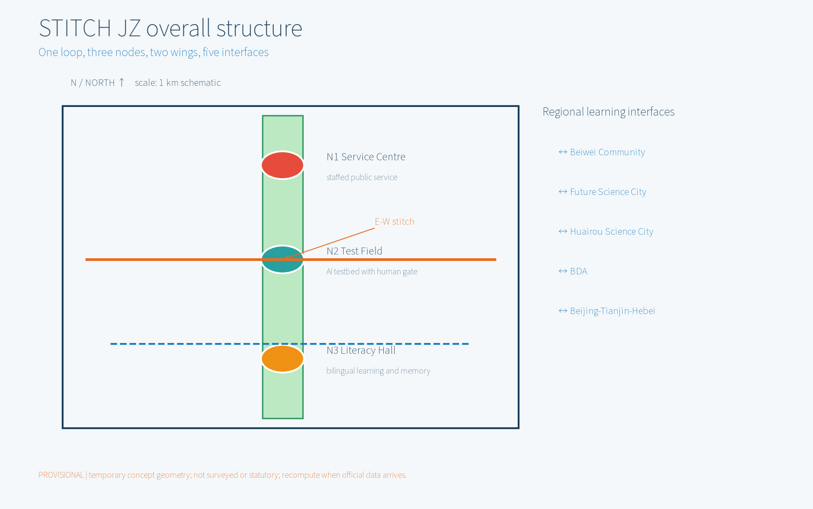
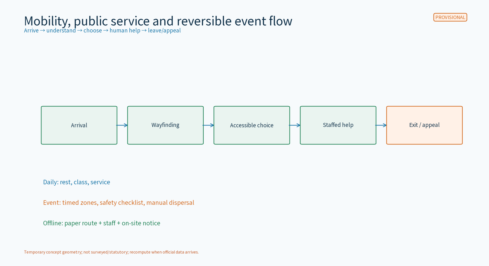
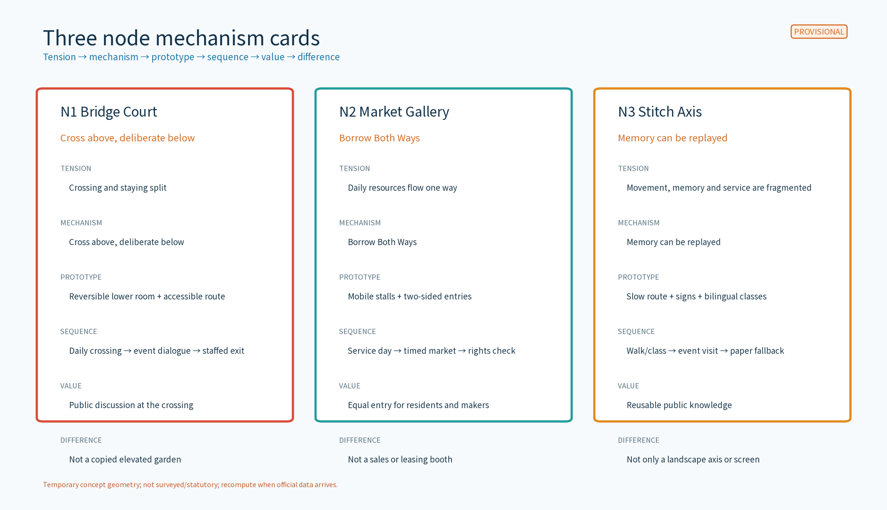
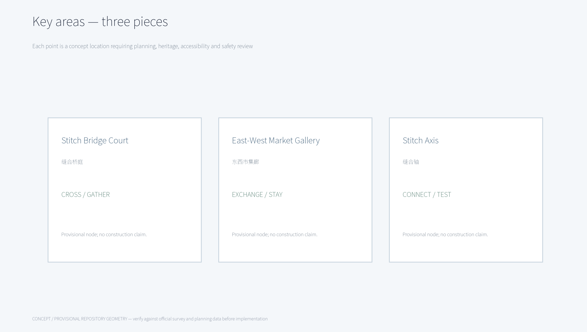
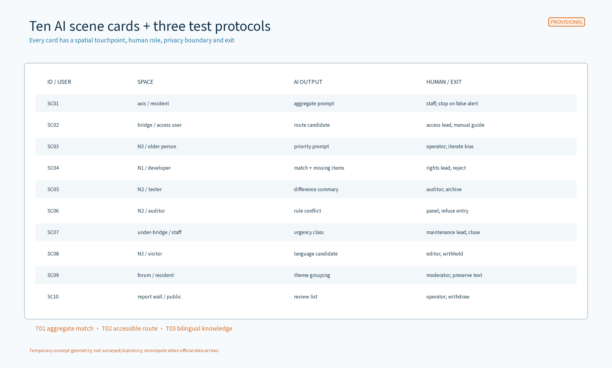
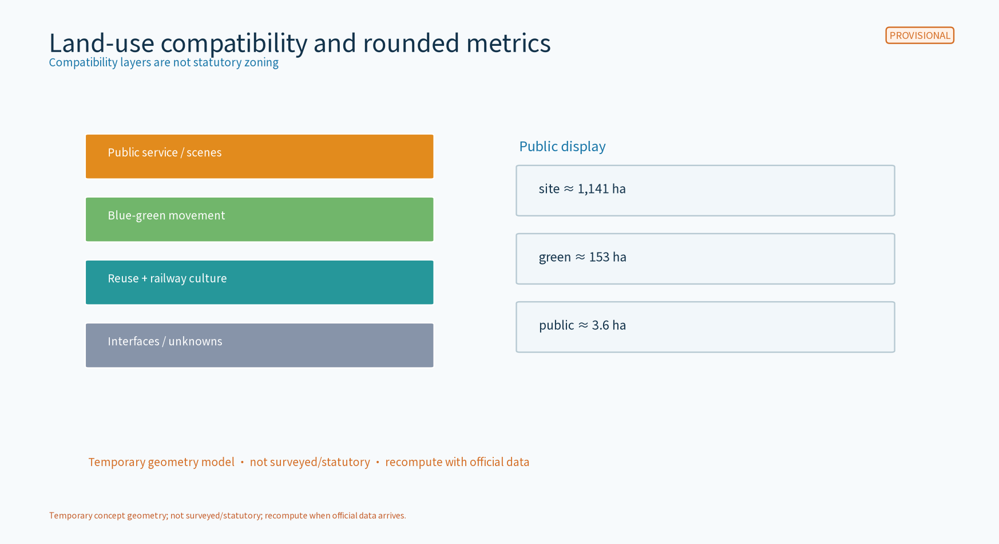
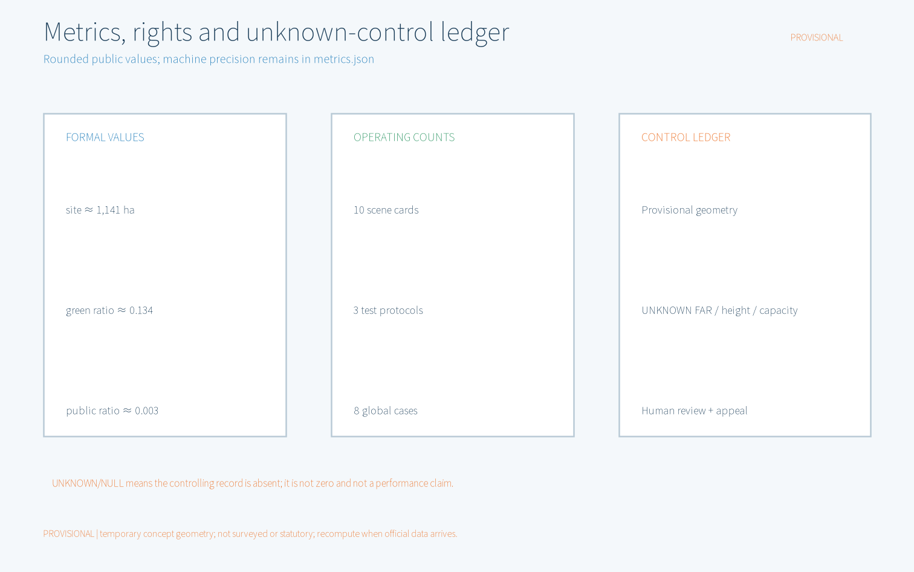

# STITCH Living Room / STITCH·JZ

STITCH Living Room treats the Jingzhang railway-heritage green belt as a public interface between east and west. It is not only a connection: it makes crossing, exchange and memory into a daily, reviewable and stoppable civic mechanism. The three original spatial prototypes are Stitch Bridge Court (continuous movement above, reversible public rooms below), East-West Market Gallery (resources exchanged across both sides), and Stitch Axis (heritage memory, accountable AI prompts and accessible movement). This is a concept and reference scheme, not an approval, redline, construction, partnership, investment or site-survey conclusion.

## Design basis and source list
[source:DATA-SRC-OFFICIAL-ANNOUNCEMENT-20260509]

The public call, taskbook, public planning references and public-service standards set the task boundary. Global and domestic cases are mechanism comparisons only; no logo, image, performance claim or partnership is imported. `sources.json` records publisher, URL, date, license/reuse boundary and claims not made here. `geometry/` is provisional concept geometry and `metrics.json` contains recomputable machine values. Public figures use rounded values labelled “temporary geometry model, not surveyed/statutory area; recompute when official data arrives”.

Known gaps are official GIS/CAD, survey, ownership, statutory land use, railway/heritage controls, green/blue lines, road redlines, fire, accessibility, municipal capacity, operating baselines and real crossing counts. The package does not claim a site visit or access to non-public data.

Evidence anchors: [source:DATA-SRC-OFFICIAL-ANNOUNCEMENT-20260509], [source:DATA-SRC-AGENT-TASKBOOK-20260518], [source:DATA-SRC-PROVISIONAL-BOUNDARIES-20260605], [data:PACKAGE-GEOMETRY].

## Three-scope working framework
[source:DATA-SRC-OFFICIAL-ANNOUNCEMENT-20260509]

The three levels form a loop: coordination research identifies interfaces; overall design organizes the public seam; key-area design tests mechanisms. Each level states inputs, spatial objects, accountable roles, public outputs and exit conditions. Any crossing, under-bridge or event action remains subject to ownership, heritage, fire, accessibility and public-review checks.

### Brief—space—mechanism—output matrix

| Brief requirement | Spatial home | Distinct mechanism | Deliverable/evidence |
|---|---|---|---|
| Centennial Jingzhang Culture Belt | Railway heritage green belt and N1-N3 | “Memory Stitch” turns sourced history into wayfinding, oral-memory prompts and bilingual classes | site overview, culture system, international copy |
| Urban AI Everyday Experience Belt | Bridge Court, Market Gallery, Stitch Axis | “Borrow Both Ways” shares daily services and event space; AI prompts are never decisions | key areas, 10 cards, time-sequence flow |
| AI-Integrated Innovation Belt | Three nodes and two wings | “Three-gate review”: rights, spatial safety, and human review; one failed gate pauses | ecosystem atlas, protocols, RACI |
| AI full-stack innovation | Zhongzhiyuan accelerator, N1, developer community | Directory → registration → small test → explanation → human review → archive | agent.1/2 matrix, application route, T01-T03 |
| World-class AI ecosystem | AI Origin Community, service wing, eight factors | Land/space, rules/rights, industry, finance, talent, compute, data and scenes are reversible ledgers | 8-factor map, 8 global cases, source ledger |
| AI+ scenes | Xiaoyuehe wing, N1-N3 | Ten cards lock space, source status, human role and failure exit | SC01-SC10, T01-T03 |
| Lively AI city | Slow movement, public rooms, classes and markets | Daily/event modes; paper, staff and accessible paths do not require login | mobility, components, events |
| Global AI governance voice | N2 report wall, N3 bilingual classroom | Public data flow, review record, appeal and stop reason become a shareable sample | governance flow, annual note, bilingual HTML |
| agent.1 | STITCH·JZ identity and three-node plan | Stitch is a space-service system, not a slogan | logo, plan/flow, compliance matrix |
| agent.2 | N1 registry, N2 test field and service wing | Eight-factor ledger and sourced cases; no invented firms or funds | atlas, case table, sources |
| agent.3 | N1-N3 and Xiaoyuehe interface | Ten cards plus three industry tests, each pausable and appealable | cards, protocols, KPIs |
| agent.4 | Bridge Court, Gallery, Axis and landmarks | Restrained railway translation, reversible under-bridge use, no commercial ranking | node cards, landmarks, component library |
| agent.5 | Heritage line, wayfinding, bilingual classes | Fact → present interpretation → public question; no unlicensed media | culture/signage copy, bilingual figures |
| agent.6 | Developer community, open-scene desk, annual events | Topic → rights check → pilot → public note → archive/exit | implementation matrix, RACI, conversion path |

### Regional interfaces and reciprocal value

These are concept interfaces, not confirmed cooperation, contracts, available resources or implementation commitments. Flows refer to public material, licensable methods, anonymized aggregate learning and possible talent exchange; they do not claim internal data or public funding.

| Interface | Concept object/resource flow | Interface | Possible reciprocal value (to verify) |
|---|---|---|---|
| Beiwei Community | Resident forum and age/child/accessibility feedback ↔ Axis scene cards | N3 paper class, forum, complaint and exit ledger | Community gets explainable service; package gets real-needs validation |
| Future Science City | Public research questions and developer methods ↔ N2 test protocols | Open topic call, aggregate examples, remote exchange | Reusable test methods; technical readability feedback |
| Huairou Science City | Science communication content ↔ N3 bilingual lessons | Rights review, course-exchange intention, offline material | Public science reach; communication validation |
| BDA | Industry scene questions and open-operations learning ↔ T01-T03 templates | Scene application, rights/safety gates, public result note | Low-risk concept testing; transferability check |
| Beijing-Tianjin-Hebei | Railway memory, slow networks and governance methods ↔ case library | Public case library, bilingual communication, annual exchange | Reusable public-space/governance methods; no cooperation claim |

## Coordinated research: industry and future city
[source:DATA-SRC-OFFICIAL-ANNOUNCEMENT-20260509]

The industry value is not turning under-bridge space into a sales booth. It is a low-risk public interface: an enterprise or developer states a problem, data boundary and exit condition; only after rights review and human review can a small concept test begin. The public sees methods, summaries and an appeal route, not raw data. N1 registers and refers, N2 controls tests, and N3 translates results into public learning.

The eight-factor full-stack mechanism is land/space (reversible rooms and slow interface) → rules/rights (ledger and three gates) → industry (problem directory and conversion route) → finance (public sources only, no amount promised) → talent (developers, residents, educators, auditors) → compute/tools (small, replaceable tools with paper fallback) → data (public, synthetic, voluntary or de-identified aggregates) → scenes (ten cards and three protocols). Each factor can be refused, paused, deleted or returned to paper.

## Overall design, renewal and regulatory-depth urban design
[source:DATA-SRC-OFFICIAL-ANNOUNCEMENT-20260509]

The structure is “green belt as needle, east-west as cloth, three pieces as stitches, three nodes as civic gates”. North-south continuity carries railway memory and slow movement; east-west stitching uses Bridge Court, Market Gallery and Stitch Axis as exchange interfaces. Plans, sections and flows show types, relationships and verification points only; they do not state road redlines, bridge/tunnel engineering, building height, FAR, underground works or municipal capacity.

Space types, arrival flows, accessibility and reversible boundaries are shown in `node-mechanisms.en.png` and `implementation-matrix.en.png`; professional checks remain required for railway protection, under-bridge structure/fire, traffic, ownership, green/blue lines, lighting and event safety.

## Key-area detailed design
[source:DATA-SRC-OFFICIAL-ANNOUNCEMENT-20260509]

The three nodes are three different civic mechanisms, not three identical destinations. STITCH·JZ is distinctive because restrained railway translation, non-coercive AI prompts and stoppable daily operation work as one system.

| Node | Site tension | Distinct mechanism | Spatial prototype | Sequence | Public value | Difference from cases |
|---|---|---|---|---|---|---|
| Stitch Bridge Court N1 | Visible heritage edge but weak crossing/staying | “Cross above, deliberate below”: one exit record covers prompts and staffed discussion | Continuous accessible route subject to check; reversible seats, paper desk, report wall below | Daily crossing/rest; timed event market; manual route remains if prompts stop | Lessens psychological distance and enables public discussion | Not a High Line copy; focuses on crossing accountability and exit |
| East-West Market Gallery N2 | Services and innovation flow one way | “Borrow Both Ways”: weekly exchange of themes and service responsibility | Mobile stalls, shade, low wayfinding and two-sided entries | Daily service/class; event zones; remove if rights unclear | Equal entry for residents, small businesses and developers | Not a sales or leasing booth; each event has rights ledger and staff |
| Stitch Axis N3 | Movement, memory, AI prompts and service lack continuity | “Memory can be replayed”: public versions of signs, bilingual classes and scene results | Slow route, rest points, tactile/low signs and staff points | Daily walk/class; event visit; paper/staff fallback | Reusable, learnable public knowledge | Not only a landscape axis or screen; explainable, stoppable service |

Three landmarks are Stitch Gate (crossing rules/accessibility/help), Exchange Window (two-sided services and rights), and Memory Classroom (history, AI methods and appeals). They use no unlicensed historic photo, enterprise logo or portrait. The honor display records verifiable community contribution, research method or safety practice, not commercial ranking.

## AI innovation ecosystem, talent profiles and AI+ scenes
[source:DATA-SRC-OFFICIAL-ANNOUNCEMENT-20260509]

### Ten complete scene cards

AI is limited to prompts, aggregation, classification or difference detection; it does not make approval, enforcement, medical or commercial decisions. “Concept/pilot hypothesis” means no field collection has occurred and an impact assessment is required before real testing.

| ID/user | Space and problem | Input/source status | Model role/output | Human fallback/minimization | Failure/owner | Maturity/KPI/exit |
|---|---|---|---|---|---|---|
| SC01 resident/commuter | Axis entry; identify who needs help | Paper button or anonymous count, concept | Aggregate trend prompt, no identity | Staff confirms; no route/identity record | False alert/offline; axis steward | Low; prompt coverage/manual confirmation; stop on persistent false alerts |
| SC02 wheelchair/stroller user | Bridge entry; find access break | Voluntary paper/voice feedback, unverified source | Classify break and suggest route | Access coordinator checks; no voiceprint | Blocked route; operator guides first | Low; closure time/manual success; stop on safety risk |
| SC03 older person/child companion | N3 rest point; prioritize rest/light | Anonymous aggregate service requests, concept | Rank maintenance prompts | Staff decides; no profile | Wrong priority; N3 operator reviews | Low; response/complaint closure; iterate on bias |
| SC04 developer/enterprise | N1 desk; match public problem to test | Public directory + voluntary summary | Candidate match and missing-item prompt | Rights steward checks; no trade secrets | Unclear rights; N1 lead rejects/returns | Low; complete/clear-return rate; exit on unclear rights |
| SC05 enterprise tester | N2 field; test anonymous matching | Synthetic/aggregate sample, pilot hypothesis | Candidate pairs and difference summary | Auditor checks each; no personal data | Irreproducible/bias; test lead pauses | Low; reproducibility/review coverage; archive on failure |
| SC06 auditor/developer | N2 controlled room; test explanation | Dictionary, rights note, voluntary test pack | Detect missing fields/rule conflict | Human panel decides; minimum audit summary | Unexplained source; auditor refuses entry | Low; closure/explanation rate; stop on boundary breach |
| SC07 maintenance staff | Under-bridge room; detect facility issue | Staff report + anonymous aggregate, concept | Classify urgency, never auto-dispatch | Maintenance lead confirms; no user link | False/missed alert; lead reviews | Medium-low; confirmation/false-alert rate; close on safety incident |
| SC08 visitor/editor | Exchange Window; bilingual explanation | Reviewed bilingual public text | Language candidate and citation pointer | Editor checks; no identity record | Translation/history uncertainty; return | Low; citation/adoption rate; do not publish if unverified |
| SC09 forum participant | N3 forum; group paper opinions | Anonymous paper/voluntary summary, concept | Theme grouping, no stance score | Moderator preserves original and appeals | Minority diluted; moderator retains text | Low; completeness/appeal rate; publish disagreement |
| SC10 operations/public | Report wall; annual review | Aggregated metrics and exit log, pilot-only | Difference summary and review list | Operator, auditor and community sign-off | Misread/false precision; operator withdraws | Low; review coverage/timeliness; withhold if source incomplete |

### Three industry validation protocols

| Protocol | Three-area/two-wing mapping | Open process | Evidence/KPI | Human gate and exit |
|---|---|---|---|---|
| T01 public problem—aggregate match | N2 AI Origin; Zhongzhiyuan accelerator; service wing/BDA | Public problem → rights → synthetic sample → pilot → audit → public summary | Reproducibility, missing fields, review coverage | Test lead/auditor confirm each; delete if untraceable |
| T02 accessible route/service | N1 accelerator; N3 Dazhongsi; Xiaoyuehe/Beiwei interface | Voluntary feedback → paper/aggregate → walk-through → suggestion → follow-up | Break closure, manual guidance, complaint closure | Access coordinator confirms; paper fallback if unsafe/offline |
| T03 bilingual public knowledge | N3 Dazhongsi; AI Origin; Future/Huairou/Jing-Jin-Ji learning interface | Source → rights/history check → class → feedback → annual note | Citation, comprehension, response rate | Editor, moderator and operator sign; withhold if uncertain |

Personas include residents, older people, children/companions, accessibility users, developers/students, enterprise testers, maintenance staff, educators/editors, auditors/operators and international visitors. Every group has a non-digital entry; public service is not traded for login.

## Land use, building scale and retain/adapt/remove approach
[source:DATA-SRC-OFFICIAL-ANNOUNCEMENT-20260509]

Land use is a compatibility reading only: heritage/public green, slow blue-green movement, public service, innovation testing and reversible event interface. The temporary site model is about 1,141 ha, the green model about 153 ha and the public-space model about 3.6 ha; each is labelled “temporary geometry model, not surveyed/statutory area; recompute when official data arrives”. `metrics.json` retains machine precision for deterministic checks; public figures do not show three decimal places.

Retain railway memory, trees and usable public infrastructure. Adapt through light, removable components, paper desks, seats, signs and mobile stalls. No demolition object is preselected; any decision follows survey, ownership, safety and statutory process. No FAR, height, demolition amount, investment, capacity or municipal-load conclusion is provided.

## Mobility, railway, municipal and public-service facilities
[source:DATA-SRC-OFFICIAL-ANNOUNCEMENT-20260509]

Walking/cycling priority, continuous accessibility, event manageability and switch-off prompts organize movement. Arrival follows “arrive → understand → choose → receive human help → leave/appeal”. Aggregate crossing demand is not traffic control or personal tracking. Railway, bus and shuttle are arrival interfaces only; no new station, alignment, bridge/tunnel, road redline or underground engineering is proposed.

Daily/event checklists cover lighting, water, mobile toilets, parent/rest space, paper signs, temporary power, waste and medical contact, subject to professional checks. Before an event, operators, fire, transport, heritage, accessibility and community representatives complete the checklist. Paper routes, staff and on-site notices continue during network outage.

## Blue-green space, public realm and city character
[source:DATA-SRC-OFFICIAL-ANNOUNCEMENT-20260509]

Railway memory, continuous movement, rain and shade form three readable layers; drainage, green/blue lines and tree protection await official evidence. Components are low/tactile signs, movable seats, shade, low-glare lighting, paper desks, removable stalls, switchable prompt boards and complaint boxes. Color is paired with line type and text.

Wayfinding uses “fact label → present interpretation → public question”: facts cite sources; AI interaction explains method and boundary; residents can correct through paper, bilingual pages and annual forums. International copy: “a reversible civic seam where railway memory, accessible everyday life and accountable AI meet”, explicitly a concept, unpartnered and unapproved.

## Renewal projects, implementation policy and phasing
[source:DATA-SRC-OFFICIAL-ANNOUNCEMENT-20260509]

| Project | Phase | Lead/collaboration | Preconditions | Build/operate | Acceptance | Exit/iteration |
|---|---|---|---|---|---|---|
| N1 Bridge Court prototype | Near 1–3 years | Operator TBD / transport, heritage, access, community | Ownership, structure, fire, traffic, public review | Reversible seats/signs; staff and paper | Review coverage and accessibility walk-through | Withdraw or return to ground service if unsafe/unclear |
| N2 Market Gallery pilot | Near 1–3 years | Community operator TBD / vendors, developers, auditor | Event permit, stall rights, fire, complaints | Mobile stalls; rights ledger each event | Rights completeness and response | Stop if permission missing or complaints unresolved |
| N3 Axis classes | Middle 3–5 years | Public-service role TBD / schools, community, editor | History, access and bilingual review | Signs, paper class, report wall | Comprehension and citation coverage | Remove if history cannot be explained |
| T01-T03 industry tests | Near → middle | Test lead TBD / enterprise, university, auditor | Aggregate/synthetic input, rights and impact review | Small, pausable, auditable | Reproducibility, review and exits | Delete/archive on boundary or bias issue |
| Developer/open-scene desk | Middle 3–5 years | Community host TBD / enterprise, talent, residents | Open rules, capacity, conflict/appeal | Monthly topics, quarterly review, annual note | Open questions, response, conversion review | Reduce without owner or explainable rights |
| International/events | Long 5–10 years | Communications role TBD / editor, community, interested parties | Bilingual rights, fact review, safety plan | Stitch festival, market month, slow tour | Public note, citations, accessibility | Cancel if facts or safety are not ready |

Developer community uses a monthly public-problem gate, quarterly open-scene review and annual result/exit notice. Conversion does not promise investment or recruitment; it offers public problems, protocols, method summaries and talent introductions. The three events are suggestions only and require permits and safety acceptance.

## Metrics, area recomputation and compliance matrix
[source:DATA-SRC-OFFICIAL-ANNOUNCEMENT-20260509]

The formal core visual metrics are recomputable package values, not statutory metrics: site boundary about 1,141 ha, green ratio about 0.134 and public-space ratio about 0.003. Each public value is labelled temporary geometry model, not surveyed/statutory area, recompute with official data. `metrics.json` retains 11,412,825.386 sqm, 0.134275 and 0.003167 for deterministic validation; figures and HTML use rounded display values.

Long-term metrics define methods without promised targets: accessible-break closure time, human-review coverage, scene-exit execution, source/license completeness, complaint response, paper-service availability, event-safety checklist completion, bilingual citation coverage and developer-scene archival. Missing baselines remain UNKNOWN/to verify, never zero.

## Risk, copyright and compliance statement
[source:DATA-SRC-OFFICIAL-ANNOUNCEMENT-20260509]

### Proposed data-flow and privacy requirements

The privacy statement is a proposed governance requirement, not a verified deployed control: only anonymous aggregates, human review for key decisions, and no excessive monitoring. Flow: voluntary/public input → minimum-field check → local/controlled aggregation only → human review → summary publication → timed deletion or disablement. No identity recognition, persistent route, cross-scene joining, profiling or automated penalty.

| Step | Collection | Retention/access | Owner and human duty | Deletion/appeal/assessment |
|---|---|---|---|---|
| Public directory/paper feedback | Necessary fields only; no-name option | No identity by default; minimum operator access | N1 officer checks source and rights | Return paper; correction/deletion request |
| Synthetic/aggregate pilot | Yes, only concept or authorized pilot | Summary only; test-team access | Test lead/auditor review | Delete after test; impact assessment before real data |
| Scene prompt/alert | Prompt/difference only | No route or raw content | Node operator decides action | Appeal false alert; disable if unexplained |
| Annual public note | Aggregate result only | Public version after human edit | Operator, auditor and community sign | Withhold if incomplete; retain exit reason |

`report/copyright_statement.md` contains a rights/provenance ledger for text, figures, logo, font, data, code and cases. STITCH·JZ, STITCH Living Room, One Belt Three Pieces and the logo are provisional assets. A dated public-web exact/near-variant screen was recorded on 2026-08-31, but it is not a trademark-register or legal clearance. Replacement options are “JZ Civic Seam”, neutral `JZ-01/02/03` labels and text-only `DATA·JZ`. Noto Sans SC is locally embeddable and bundled/self-contained for HTML/PDF; no case logo, photo or historic image is embedded.

Risks include provisional geometry, railway/under-bridge safety and ownership, events, AI bias/privacy, historical/copyright uncertainty, missing operator and public acceptance. If any risk fails professional review, return to paper/staff service or remove the scene. No temporary value, event, cooperation or policy suggestion is presented as decided.

## References
[source:DATA-SRC-OFFICIAL-ANNOUNCEMENT-20260509]

### Global mechanism cases (text-only comparison)

| Case | Traceable mechanism | Difference/boundary here | Source |
|---|---|---|---|
| High Line, New York | Railway heritage to linear public space and long-term operation | No shape/brand reuse; this package emphasizes east-west responsibility and AI exits | SRC-GLOBAL-HIGHLINE |
| Seoullo 7017, Seoul | Elevated walking and city connection | No structural feasibility inference; retains access and human gates | SRC-GLOBAL-SEOULLO |
| Promenade Plantée, Paris | Continuous railway-heritage walking experience | No image/performance import; adds exchange and rights ledger | SRC-GLOBAL-PROMENADE |
| The 606, Chicago | Linear path connecting communities | No operating data import; uses three nodes and public exits | SRC-GLOBAL-606 |
| Fab Lab Network | Open making, shared knowledge, community learning | No membership/partnership claim; informs N2 open tests | SRC-GLOBAL-FABLAB |
| Station F | Startup community and integrated services | No recruitment or tenancy claim; only service-chain comparison | SRC-GLOBAL-STATIONF |
| AI Verify Foundation | AI testing and governance discussion | No certification claim; informs review, appeals and stop gates | SRC-GLOBAL-AIVERIFY |
| NIST AI RMF | Govern/map/measure/manage risk structure | No compliance certification; informs T01-T03 evidence | SRC-GLOBAL-NIST-AIRMF |

Domestic comparisons (Shougang, West Bund/Xuhui, Dasha River and Mengzhuiwan) are also narrow text references with boundaries in `sources.json`. No cooperation, copying or endorsement is claimed.

Submitted by JohnXu22786. AI-assisted drafting was human-reviewed. Thank you for reviewing.
