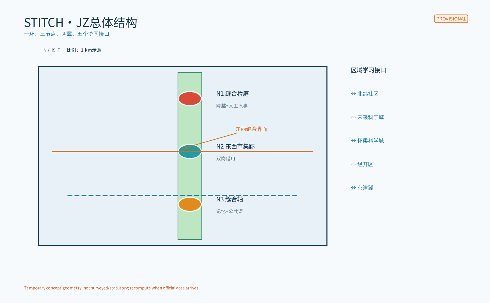
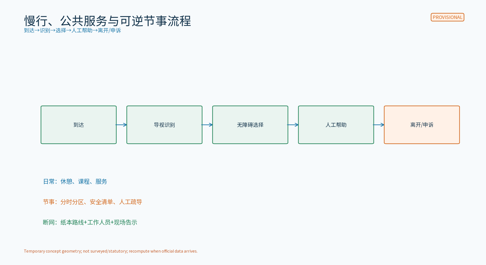
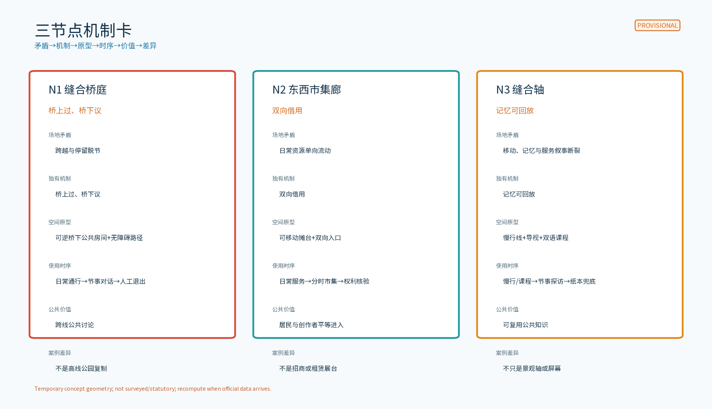
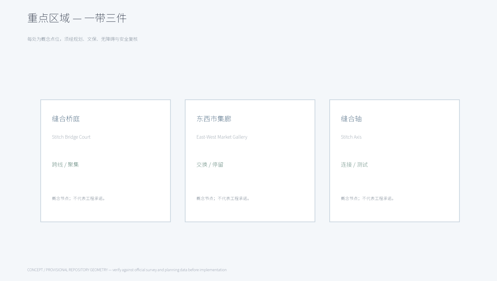
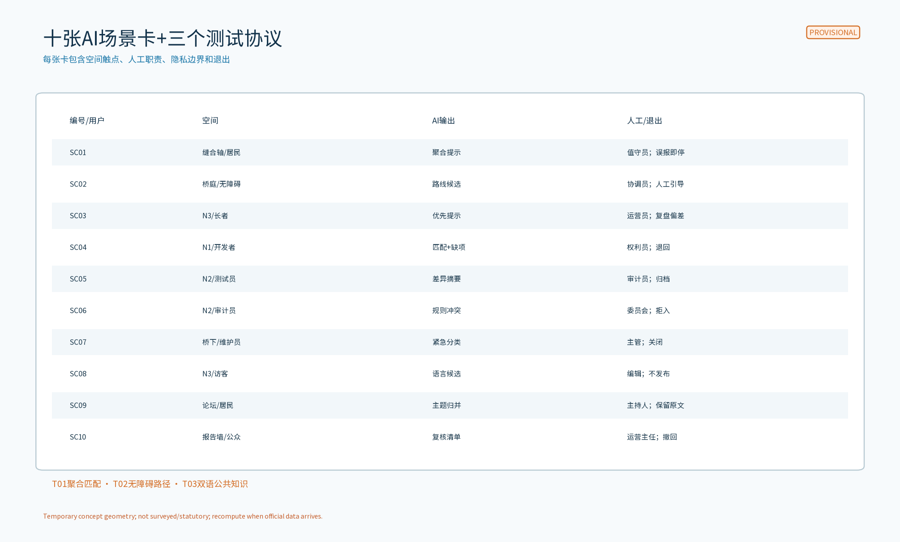
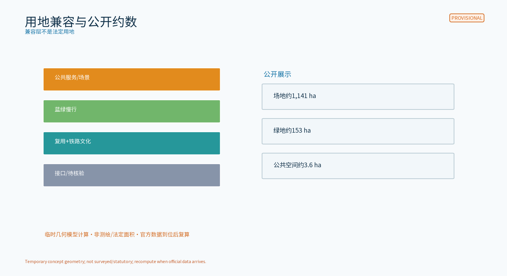
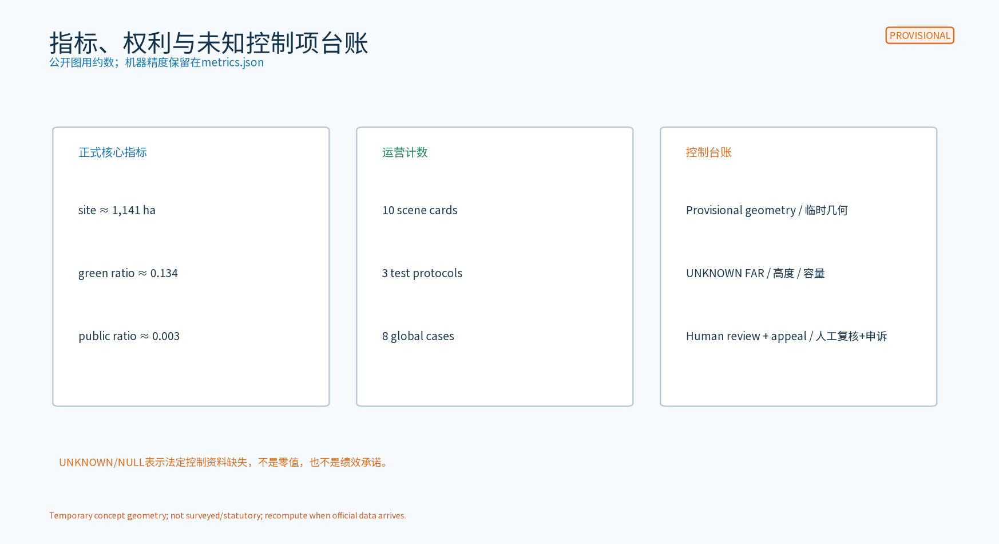

# 缝合客厅 / STITCH·JZ

「缝合客厅（STITCH·JZ）」把京张铁路遗产绿带作为东西两侧的公共界面：不是简单把两端连起来，而是让“跨越—交换—记忆”成为每天可使用、可复核、可退出的城市机制。三件原创空间原型是「缝合桥庭」（桥上连续慢行、桥下可逆公共房间）、「东西市集廊」（两侧资源互换的日常廊道）和「缝合轴」（铁路记忆、AI公共服务与无障碍慢行的连续界面）。全部内容是概念建议和参考方案，不是审批、红线、建设、合作、投资或现场调查结论。

## 设计依据与资料清单
[source:DATA-SRC-OFFICIAL-ANNOUNCEMENT-20260509]

本案以公开征集公告、任务书、公开规划与公共服务规范为任务依据；全球和国内案例只用于机制比较，不移植其商标、图片、绩效或合作关系。`sources.json` 逐项记录发布者、URL、日期、许可/复用边界和本案不作的推断。`geometry/` 是临时概念几何，`metrics.json` 是可复算的机器值；公开图件只使用约数，并在数值旁标注“临时几何模型计算、非测绘/法定面积、官方数据到位后复算”。

已知缺口包括官方总体/重点区 GIS 或 CAD、现状测绘、权属、法定用地、铁路及文保控制、绿线蓝线、道路红线、消防、无障碍、市政容量、运营基线和真实跨线流量。本包不声称已经进行现场踏勘，不把“待核验”写成已获得资料。

证据锚点：[source:DATA-SRC-OFFICIAL-ANNOUNCEMENT-20260509]、[source:DATA-SRC-AGENT-TASKBOOK-20260518]、[data:PACKAGE-GEOMETRY]。

## 三层范围工作框架
[source:DATA-SRC-OFFICIAL-ANNOUNCEMENT-20260509]

三层工作采用“统筹研究识别协同—总体设计组织界面—重点区域验证机制”的闭环。每一层都写出输入、空间对象、责任人、公开输出和退出条件；任何跨线、桥下或节事动作都必须先经过权属、文保、消防、无障碍和公众意见复核。

### 任务书—空间—机制—成果总表

| 任务书要求 | 空间落点 | 独有机制 | 可交付成果/证据锚点 |
|---|---|---|---|
| 百年京张文化带 | 铁路遗产绿带、站场记忆界面、N1-N3 | 「记忆针脚」把历史节点转成导视、口述记忆和双语公共课，不仿造文物 | site-overview、文化导视、国际传播文案 |
| 都市AI生活体验带 | 缝合桥庭、东西市集廊、缝合轴 | 「双向借用」让日常服务与节事市集共享可逆空间；AI只给提示，工作人员做决定 | key-areas、10张场景卡、时序流程 |
| AI融合创新带 | 三节点、两翼接口和测试流程 | 「三闸复核」：权利闸、空间安全闸、人工复核闸，任何一闸失败即暂停 | ecosystem-atlas、测试协议、RACI |
| AI全栈自主创新体系 | 众智园AI自主创新加速区、N1与开发者社区 | 目录—登记—小测—解释—人工复核—归档的开放链 | agent.1/2矩阵、开放申请表、协议T01-T03 |
| 世界级AI创新生态 | AI原点社区、科技服务翼、八要素网络 | 土地/空间/产业/资金/人才/算力/数据/场景八要素按“可用、可拒、可退出”登记 | 8要素生态图、8个全球案例、来源台账 |
| AI+场景赋能新范式 | 小月河场景赋能翼、N2/N3 | 场景卡同时锁定空间触点、输入来源状态、人工责任和失败出口 | SC01-SC10、T01-T03 |
| 智能化AI活力城市 | 绿带慢行、桥下公共房间、公共课和市集 | 日常/节事两态切换，纸本、工作人员、无障碍路径不依赖登录 | mobility、公共空间组件库、活动矩阵 |
| AI治理全球话语权 | N2报告墙、N3双语课堂、年度公开说明 | 公开数据流、复核记录、申诉与停用理由形成可传播的治理样本 | governance flow、年度公示、双语HTML |
| agent.1 总体概念 | STITCH·JZ品牌、三节点总图 | “缝合”不是口号，而是桥庭/市集廊/缝合轴的空间—服务联动 | Logo、总平/流程图、compliance_matrix |
| agent.2 生态设计 | N1登记台、N2试验场、科技服务翼 | 8要素登记与全球案例机制抽取，不编造企业/资金 | ecosystem-atlas、case table、sources |
| agent.3 场景范式 | N1-N3和小月河接口 | 10张卡 + 3个产业测试，逐卡可暂停、可申诉、可删除 | scenario cards、T01-T03、KPI |
| agent.4 公共空间/地标 | 桥庭、廊、轴及三地标 | 铁路符号克制转译、桥下可逆使用、荣誉展示不做商业排名 | node cards、landmark catalog、component library |
| agent.5 文化融合 | 铁路记忆线、导视、双语课堂 | “历史事实—当代解释—公众参与”三层叙事，国际传播不挪用素材 | signage/culture copy、双语图件 |
| agent.6 活动与长期运营 | 开发者社区、开放场景台、年度活动 | 主题征集—权利审查—小试—公开说明—归档/退出的运营循环 | implementation matrix、RACI、conversion path |

### 区域协同对象与双向收益

以下是概念接口，不代表合作、签约、资源已到位或项目落地。资源流以“公开资料、可授权方法、匿名聚合经验、人才交流意向”描述，不写成内部数据或财政承诺。

| 协同对象 | 概念对象/资源流 | 接口 | 双向收益（待验证） |
|---|---|---|---|
| 北纬社区 | 居民议事、适老/儿童使用反馈 ↔ 缝合轴无障碍场景卡 | N3纸本课、居民论坛、投诉与退出台账 | 社区获得可解释的服务与休息点；方案获得真实需求校核 |
| 未来科学城 | 公开科研议题、开发者方法 ↔ N2小测协议 | 公开主题征集、匿名聚合案例、远程分享 | 形成可复用测试方法；本案获得技术可读性反馈 |
| 怀柔科学城 | 科普与科研传播内容 ↔ N3双语课程/国际传播 | 内容权利审查、课程交换意向、离线材料 | 科普内容有公共触点；本案获得科学传播校验 |
| 经开区 | 产业场景问题、开放运营经验 ↔ T01-T03产业验证模板 | 场景开放申请、权利/安全闸、结果公开说明 | 企业得到低风险概念验证路径；方案得到产业可转化性检验 |
| 京津冀 | 铁路记忆、慢行网络和治理方法 ↔ STITCH·JZ案例库 | 跨地区公开案例库、双语传播、年度交流 | 共享可复用的公共空间与治理方法；不构成区域合作承诺 |

## 统筹研究范围产业与未来城市研究
[source:DATA-SRC-OFFICIAL-ANNOUNCEMENT-20260509]

缝合带的产业价值不是把桥下空间变成招商展台，而是把公共空间变成“可观察的低风险接口”：企业或开发者先说明问题、数据边界和退出条件，经过权利审查和人工复核，才进入小规模概念测试；公众看到的是方法、结果摘要和申诉入口，不是原始数据。N1服务中心负责登记和转介，N2试验场负责受控验证，N3素养馆把结果翻译成公众可理解的课程。

八要素全栈机制为：土地/空间（可逆房间与慢行界面）→规则/权利（许可台账与三闸复核）→产业（问题目录与转化路径）→资金（只登记公开来源和待核验支持，不承诺金额）→人才（开发者、居民、教育者、审计者）→算力/工具（小规模可替代工具，断网纸本兜底）→数据（公开、合成、自愿或去标识化，按聚合层级管理）→场景（10张卡与3个测试协议）。每个要素都可以拒绝、暂停、删除或回到纸本流程。

五个产业转化接口分别是：目录登记、无障碍路线提示、设施维护优先级、公共空间舒适度建议、内容安全复核。企业/人才转化采用“问题—权利检查—小试—人工评审—公开摘要—复盘—归档”的七步，不把招商、融资、采购或政策支持写成既定安排。

## 总体设计范围城市更新与控规深度城市设计
[source:DATA-SRC-OFFICIAL-ANNOUNCEMENT-20260509]

总体空间结构是“绿带为针、东西为布、三件为空间针脚、三节点为公共服务闸口”。南北贯通以铁路遗产记忆和慢行连续为主，东西缝合以桥庭/市集廊/缝合轴形成互换界面。总平、剖面和流程图只表达类型、关系与复核点，不表达道路红线、桥隧工程、建筑高度、容积率、地下空间或市政容量结论。

空间原型：桥庭=上层连续慢行 + 下层可逆公共房间；市集廊=东西两侧可双向进入的摊位、座椅、讲解和小型展示；缝合轴=无障碍慢行、文化导视、人工服务和低侵入提示的连续界面。设施采用可拆、可移、可关闭的组件；日常以休憩、问询、课程为主，节事以分时、分区和人工疏导切换。

适用空间类型、入口流线、无障碍和可逆边界详见 `node-mechanisms.png` 与 `implementation-matrix.png`；需复核事项包括铁路保护、桥下结构/消防、道路交通组织、权属、绿线蓝线、照明扰民和节事安全。

## 重点区域详细设计
[source:DATA-SRC-OFFICIAL-ANNOUNCEMENT-20260509]

三节点不是三个相同的“打卡点”，而是三种不同的公共机制。它们的独有性来自铁路文化符号的克制转译、AI提示的非强制性和日常运营的可退出性共同构成 STITCH·JZ。

| 节点 | 场地矛盾 | 独有机制 | 空间原型 | 使用时序 | 公共价值 | 与案例差异 |
|---|---|---|---|---|---|---|
| 缝合桥庭 N1 | 线性遗产界面可见但跨越与停留脱节 | 「桥上过、桥下议」：跨越提示与桥下人工议事同一张退出单 | 连续坡面/台阶需专业复核；桥下可逆座席、纸本台、报告墙 | 日常通行→问询/休憩；节事分时市集；异常时关闭AI提示、保留人工通道 | 缩短心理距离、提升可达性和公共讨论 | 不复制高线的高架花园运营；重点是跨线责任和退出机制 |
| 东西市集廊 N2 | 两侧生活服务与创新资源各自单向，公共界面缺少交换 | 「双向借用」：同一摊位/展台按周交换东西侧主题和服务责任 | 可移动摊台、遮阴、低位导视、双向入口 | 日常服务/课程；节事分区；投诉或权利不清则撤下 | 支持小商户、居民、开发者平等进入 | 不把市集当招商展销；每次活动都要有权利台账和人工值守 |
| 缝合轴 N3 | 慢行、铁路记忆、AI提示和公共服务缺少连续叙事 | 「记忆可回放」：导视、双语课程和场景结果按公开版本迭代 | 慢行线、休息点、触觉/低位标识、人工服务节点 | 日常慢行/课程；节事探访；数据停止时切纸本与工作人员 | 形成可学习、可复用的城市公共知识 | 不只是景观轴或数字屏；以可解释、可关闭服务为核心 |

三地标为：①「桥庭门」——展示跨越规则、无障碍路线和人工帮助；②「交换窗」——展示东西两侧可互换的服务与权利说明；③「记忆课室」——展示铁路史实、AI方法和公众申诉路径。三者不使用未经授权的历史照片、企业Logo或人物肖像。荣誉展示记录公开可核验的社区贡献、研究方法或安全实践，不做商业排名。

## AI 创新生态、人才画像与 AI+ 场景
[source:DATA-SRC-OFFICIAL-ANNOUNCEMENT-20260509]

### 十张完整场景卡

每张卡都把 AI 限定为提示、聚合、分类或差异检测，不作审批、执法、医疗或商业结论。来源状态“概念/试点假设”意味着尚未发生现场采集，必须在进入真实试验前经过影响评估。

| ID/用户 | 具体空间与问题 | 输入/来源状态 | 模型职责与输出 | 人工兜底/隐私最小化 | 失败模式/运营责任 | 成熟度/KPI/退出 |
|---|---|---|---|---|---|---|
| SC01 居民/通勤者 | 缝合轴入口；判断哪一侧需要帮助 | 纸本按钮或匿名计数，概念假设 | 聚合趋势提示，不识别人 | 服务员确认；不采集轨迹/身份 | 误报或设备离线；轴线值守员负责 | 低；提示覆盖率/人工确认率；误报持续即停 |
| SC02 轮椅/推车用户 | 桥庭入口；发现无障碍断点 | 用户自愿纸本/语音反馈，来源待核验 | 归类断点类型并生成路线候选 | 无障碍协调员复核；不留声纹 | 路径阻断；运营员先人工引导 | 低；反馈闭环时长/人工成功率；安全风险即停 |
| SC03 长者/儿童陪伴者 | N3休息点；提示休息和照明需求 | 匿名聚合服务请求，概念 | 排序公共维护提示 | 工作人员判断优先级；不建个体档案 | 资源误排；N3运营员复核 | 低；响应时长/投诉关闭率；偏差上升即迭代 |
| SC04 开发者/企业 | N1登记台；匹配公开问题与小测模板 | 公开目录+自愿摘要，来源公开/待审 | 提供候选匹配和缺项提示 | 权利管理员审核；不收商业机密 | 权利不清；N1主任拒绝/退回 | 中低；登记完整率/退回可解释率；权利不清退出 |
| SC05 企业测试员 | N2试验场；检验匿名需求匹配 | 合成/聚合样本，试点假设 | 生成候选对和差异摘要 | 审计员逐项复核；不接个人数据 | 不可复现/偏差；测试负责人暂停 | 中低；复现率/人工复核覆盖；失败即归档 |
| SC06 审计员/开发者 | N2受控室；验证模型说明是否完整 | 数据字典、权利说明、自愿测试包 | 检查字段缺失和规则冲突 | 人工委员会决定；保存最小审计摘要 | 无法说明来源；审计员拒绝入场 | 中低；缺项关闭率/解释完成率；边界突破即停 |
| SC07 维护人员 | 桥下公共房间；发现设施异常 | 设施状态人工上报+匿名汇总，概念 | 分类轻重缓急，不做自动派单 | 维护主管确认；不关联使用者 | 错误告警/遗漏；维护主管复核 | 中；告警确认率/误报率；安全事故即关闭场景 |
| SC08 游客/国际访客 | 交换窗与记忆课室；获得双语解释 | 已审双语文本，公开来源 | 生成语言候选和引用指向 | 编辑复核；不记录身份 | 翻译失真/史实不明；编辑退回 | 中低；引用覆盖率/人工采纳率；无法核实即不用 |
| SC09 居民论坛参与者 | N3论坛；把纸本意见归并为主题 | 匿名纸本/自愿摘要，概念 | 主题聚类，不评判立场 | 论坛主持人确认；不建立政治/行为画像 | 少数意见被稀释；主持人保留原文与申诉 | 低；意见呈现完整率/申诉处理率；争议未解则公开原样 |
| SC10 运营团队/公众 | 报告墙；发布年度复盘 | 已聚合指标与退出记录，试点后 | 生成差异摘要和待复核清单 | 公开前由运营、审计、社区代表复核 | 误读或过度精度；运营主任撤回 | 中低；复核覆盖率/公开及时率；来源不完整即不发布 |

### 三个产业测试验证协议

| 协议 | 三区两翼映射 | 开放流程 | 证据/KPI | 人工闸与退出 |
|---|---|---|---|---|
| T01 公开问题—匿名匹配 | N2 AI原点社区；众智园加速区；科技服务翼/经开区接口 | 公开问题→权利检查→合成样本→小测→审计→公开摘要 | 候选复现率、缺项数、人工复核覆盖率 | 测试负责人和审计员逐项确认；不可追溯或权利不明即删除 |
| T02 无障碍路径与设施服务 | N1众智园；N3大钟寺；小月河场景赋能翼/北纬社区接口 | 居民自愿反馈→纸本/匿名汇总→人工走查→修复建议→回访 | 断点闭环时长、人工引导成功率、投诉关闭率 | 无障碍协调员确认；不能保证安全或断网即回人工流程 |
| T03 双语公共知识与场景开放 | N3大钟寺；AI原点社区；未来/怀柔/京津冀学习接口 | 内容来源登记→权利/史实复核→课程试讲→反馈→年度公开说明 | 引用覆盖率、课程可理解性、反馈回应率 | 编辑、社区主持、运营主任共同发布；来源或史实不明即不上墙 |

人才画像覆盖居民/长者/儿童陪伴者/无障碍使用者、开发者/高校、企业测试员、维护人员、教育者/编辑、审计员、运营者和国际访客；每类都有非数字化入口，不以登录换取公共服务。

## 用地、建筑规模与拆改留方案
[source:DATA-SRC-OFFICIAL-ANNOUNCEMENT-20260509]

用地只表达兼容关系：遗产/公共绿地、慢行与蓝绿、公共服务、创新试验、可逆活动界面。约 1,141 ha 的临时 site boundary 模型、约 153 ha 的绿地模型和约 3.6 ha 的公共空间模型仅用于概念复算，均为“临时几何模型计算、非测绘/法定面积、官方数据到位后复算”；metrics.json 保留机器精度，公开图不展示平方米后三位。

留：优先保留铁路记忆、树木、可继续使用的公共空间和可复核的既有设施。改：以轻介入、可拆组件、纸本台、座椅、导视和可逆摊台为主。拆：不预设对象，只有在正式调查、权属、安全和法定程序后由专业团队决定。本包不提供容积率、高度、拆改量、投资、容量或市政负荷结论。

## 交通、轨道、市政与公共服务设施
交通策略不把临时几何当成道路红线：以三节点入口、铁路遗产安全边界和无障碍慢行连续性为设计意图，先建立入口—停留—换乘—疏散的空间关系，再以官方道路、轨道、市政容量和消防资料复核。空间指标关注连续无障碍路径、交叉口等候时间、事件日疏散宽度、夜间照明和人工值守覆盖；现有 roads.geojson 与 mobility 图仅为概念模型，不能替代测绘、管线、权属或交通组织审批。公交接驳、骑行停放、应急车行和服务装卸均设置可逆接口，若权属、红线、容量或安全复核不通过，则停在纸面/低风险试验阶段并回退，不宣称已获得任何交通或市政许可。

[source:DATA-SRC-OFFICIAL-ANNOUNCEMENT-20260509]

交通策略是步行/骑行优先、无障碍连续、节事可疏导、AI提示可关闭。入口流线按“到达—识别—选择—人工帮助—离开/申诉”组织，不把跨线需求感知当作车流控制或个人跟踪。轨道、公交和接驳仅作为到达接口概念，不提出新站、线位、桥隧、道路红线或地下工程。

市政设施采用日常/节事两档清单：照明、饮水、移动卫生间、母婴/休息、纸本导视、临时电源、垃圾分类和医疗联系均需专业复核；节事前由运营、消防、交通、文保、无障碍和社区代表做清单式验收。断网时继续使用纸本路线、工作人员和现场告示。

## 蓝绿空间、公共空间与城市风貌
[source:DATA-SRC-OFFICIAL-ANNOUNCEMENT-20260509]

蓝绿空间以铁路遗产记忆、连续慢行、雨水和遮阴为三层叙事；具体排水、绿线蓝线和树木保护以正式资料为准。组件库包括低位/触觉导视、可移动座椅、遮阴、低眩光照明、纸本台、可拆摊台、可关闭提示牌和投诉箱。颜色、线型和文字三重表达，避免把颜色当作唯一信息。

文化导视采用“事实标签—当代解释—公众提问”三级：历史事实引用来源；AI交互只解释方法和边界；公众可通过纸本、双语页面和年度论坛提出更正。国际传播叙事为“a reversible civic seam where railway memory, accessible everyday life and accountable AI meet”，并明确为概念方案、未合作、未审批。

## 更新项目清单、实施政策与分期计划
[source:DATA-SRC-OFFICIAL-ANNOUNCEMENT-20260509]

### 项目—阶段—责任—验收—退出矩阵

| 项目 | 阶段 | 牵头/协作 | 前置条件 | 建设/运维 | 验收指标 | 退出/迭代 |
|---|---|---|---|---|---|---|
| N1缝合桥庭原型 | 近期1-3年 | 运营待定/交通、文保、无障碍、社区 | 权属、结构、消防、交通和公众意见 | 可逆座席、导视；值守与纸本 | 人工复核覆盖、无障碍走查完成 | 安全或权利不明则撤回/改为地面服务 |
| N2东西市集廊小试 | 近期1-3年 | 社区运营待定/商户、开发者、审计 | 活动许可、摊位权利、消防、投诉机制 | 可移摊台；每场有权利台账 | 来源/许可完整率、投诉响应 | 许可缺失或投诉未闭环则停办 |
| N3缝合轴课程 | 中期3-5年 | 公共服务待定/学校、社区、编辑 | 内容史实、无障碍、双语复核 | 导视、纸本课、报告墙 | 课程可理解性、双语引用覆盖 | 史实争议或无法人工解释则下架 |
| T01-T03产业验证 | 近期→中期 | 测试负责人待定/企业、高校、审计 | 合成/聚合输入、权利和影响评估 | 小规模、可暂停；审计摘要 | 复现率、人工复核率、退出记录 | 数据边界或偏差异常即删除归档 |
| 开发者社区/开放场景台 | 中期3-5年 | 社区主持待定/企业、人才、居民 | 开放规则、名额、冲突与申诉 | 月度主题、季度复核、年度公示 | 公开问题数、反馈回应、转化复盘 | 无法解释权利或缺少运营者则缩减 |
| 国际传播与年度活动 | 远期5-10年 | 传播角色待定/编辑、社区、合作意向方 | 双语权利、事实审校、安全预案 | 缝合节、市集月、慢行探访日 | 公开说明、引用覆盖、无障碍服务 | 事实不明或安全预案未通过则取消 |

开发者社区采用月度“公开问题门”、季度“场景开放复核”、年度“成果/退出公示”；招引转化不承诺招商结果，而是提供可复用的公开问题、测试协议、方法摘要和人才介绍。三项建议性活动“东西社区缝合节、桥下市集月、慢行探访日”均未确定，必须获得活动许可和安全验收。

## 指标体系、面积复算与合规矩阵
[source:DATA-SRC-OFFICIAL-ANNOUNCEMENT-20260509]

正式核心视觉指标从包内几何可复算，但不是法定指标：site boundary 约 1,141 ha、green ratio 约 0.134、public space ratio 约 0.003；它们旁边均标注临时几何模型、非测绘/法定面积、官方数据到位后复算。`metrics.json` 保留 11,412,825.386 sqm、0.134275、0.003167 等机器精度，供确定性检查；公开图和HTML采用约数。

长期指标只定义方法，不预填承诺值：无障碍断点闭环时长、人工复核覆盖率、场景退出执行率、来源/许可完整率、投诉回应时长、纸本服务可用率、活动安全清单完成率、双语引用覆盖率、开发者场景归档率。每项写明数据来源、责任人、复核频率和停退条件；缺少基线时显示 UNKNOWN/待核验，不用零替代。

## 风险、版权与合规说明
[source:DATA-SRC-OFFICIAL-ANNOUNCEMENT-20260509]

### 概念数据流与隐私拟议要求

本案的隐私承诺是拟议治理要求，不是已实施控制：仅匿名聚合、关键决策人工复核、禁止过度监控。数据流为“自愿/公开输入→最小化字段检查→仅在本地或受控空间聚合→人工复核→只发布摘要→按期限删除或停用”。禁止身份识别、持续轨迹、跨场景拼接、个体画像和把提示变成自动处罚。

| 环节 | 是否采集 | 保留/访问 | 控制者与人工职责 | 删除/申诉/影响评估 |
|---|---|---|---|---|
| 公开目录/纸本反馈 | 只收必要字段；可不留名 | 默认不留身份，运营台最小权限 | N1服务员检查来源和权利 | 纸本回收；公众可要求更正/删除 |
| 合成/聚合小测 | 是，但仅概念或授权试点 | 只留样本摘要，测试组访问 | 测试负责人、审计员逐项复核 | 试验结束删除；进入真实数据前做影响评估 |
| 场景输出/告警 | 仅输出提示/差异 | 不存轨迹和原始内容 | 节点运营员决定是否行动 | 误报可申诉；无法解释则停用 |
| 年度公开说明 | 只发布聚合结果 | 永久公开版本需人工审校 | 运营主任、社区代表、编辑共同签发 | 来源不全则不发布；保留退出理由 |

### 权利、许可与名称检索

`report/copyright_statement.md` 建立文字、图件、Logo、字体、数据、代码和案例来源台账。STITCH·JZ、缝合客厅、一带三件和 Logo 都是待核验概念资产：本包做了 2026-08-31 的公开网页精确词/近似词筛查记录，但没有把网页筛查写成商标注册清查。冲突时的替代方案为“JZ Civic Seam / 京张公共缝线”、中性无Logo的 `JZ-01/02/03` 节点编号和仅使用 `DATA·JZ` 文字，不继续使用冲突标识。Noto Sans SC 来自本地可嵌入字体文件，PDF/HTML 使用嵌入或自包含副本；不下载、嵌入或仿用案例Logo、照片和历史图。

风险包括 provisional 边界、铁路/桥下安全和权属、节事组织、AI偏差与隐私、史实/版权、运营者缺位及公众接受度。任一风险未通过专业复核，方案退回纸本/人工服务或撤下场景；不把临时数值、概念活动、概念合作或政策建议写成已确定事项。

## 参考资料
[source:DATA-SRC-OFFICIAL-ANNOUNCEMENT-20260509]

### 全球机制案例（只作文本比较）

| 案例 | 可追溯机制 | 本案差异与边界 | 来源 |
|---|---|---|---|
| High Line, New York | 铁路遗产转公共线性空间、长期运营 | 不复制其形态/品牌；本案强调东西缝合责任和可退出AI | SRC-GLOBAL-HIGHLINE |
| Seoullo 7017, Seoul | 高架步行与城市连接 | 不据此推断本案结构可行；本案保留无障碍和人工闸 | SRC-GLOBAL-SEOULLO |
| Promenade Plantée, Paris | 铁路遗产的连续公共步行经验 | 不导入图片/绩效；本案增加双向资源交换和权利台账 | SRC-GLOBAL-PROMENADE |
| The 606, Chicago | 线性步行系统连接多社区 | 不移植运营数据；本案用三节点和公开退出记录组织 | SRC-GLOBAL-606 |
| Fab Lab Network | 开放制作、共享知识与社区学习 | 不宣称加入或合作；本案将开放流程放入N2小测 | SRC-GLOBAL-FABLAB |
| Station F | 创业社区、空间与服务集成 | 不宣称招商或入驻；本案只借鉴开放社区的服务链 | SRC-GLOBAL-STATIONF |
| AI Verify Foundation | AI测试与治理讨论框架 | 不宣称认证；本案把人工复核、申诉和停退写成概念闸 | SRC-GLOBAL-AIVERIFY |
| NIST AI RMF | govern/map/measure/manage 风险框架 | 不宣称合规认证；本案用于T01-T03证据结构 | SRC-GLOBAL-NIST-AIRMF |

国内公开对标（首钢园、西岸/徐汇滨江、大沙河生态长廊、成都猛追湾）同样只作窄范围文字比较，来源和禁止推断记录在 `sources.json`。本案不声称任何合作、复制或官方背书。

---

提交者：JohnXu22786。AI辅助起草并人工复核。感谢审阅。
