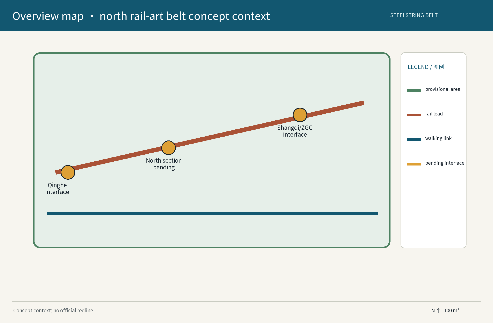
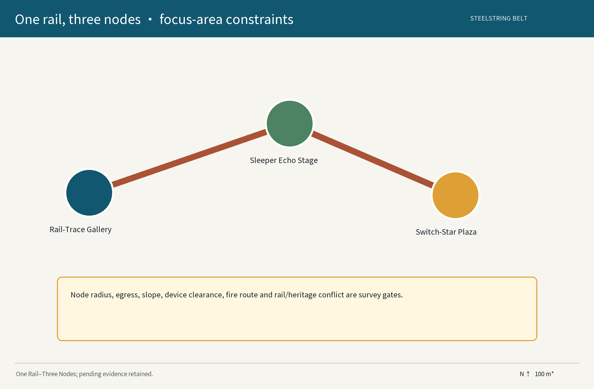
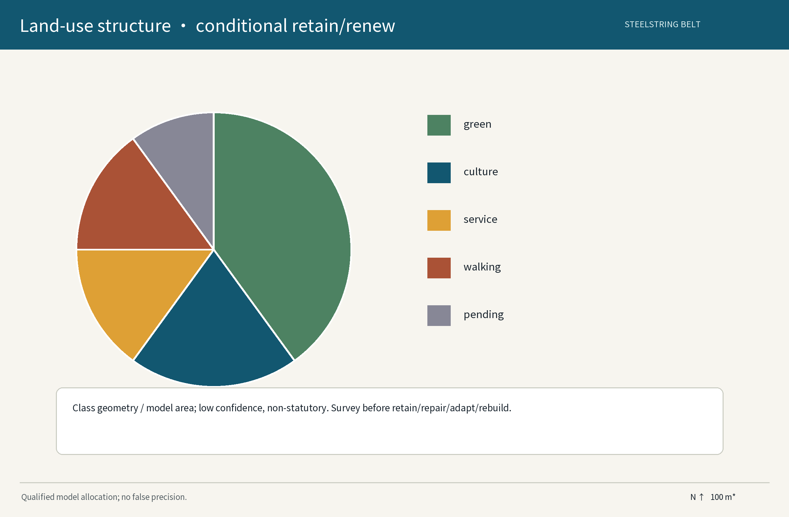
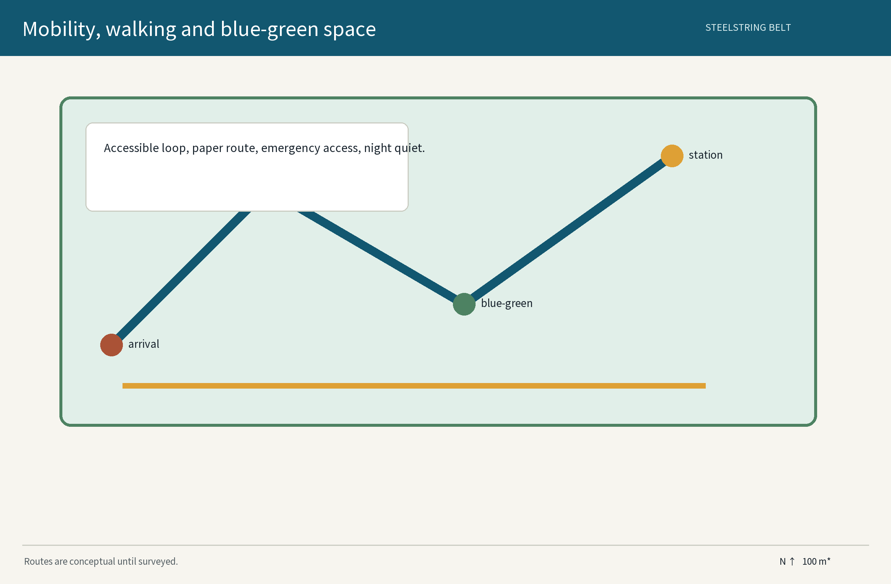
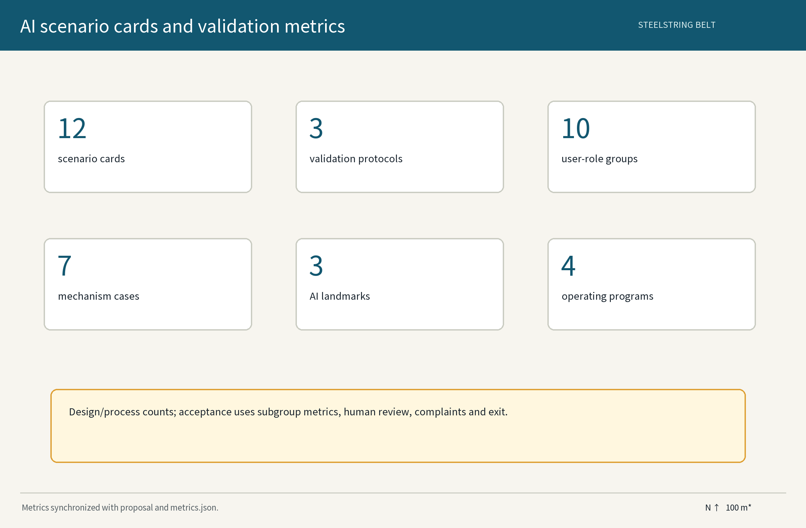

# Steelstring Belt

## Design Basis and Source List

This is a concept proposal and reference scheme for the Centennial Jingzhang AI Innovation Belt. It uses the taskbook, public planning methods, auditable public cases, and provisional geometry in this package. Rail traces, sleepers, switches, buildings and heritage attributes are survey subjects rather than asserted site facts. Any retention, adaptation or protection decision must follow a dated evidence record combining survey, archives, ownership, conservation, structural, fire and accessibility review. Historical narration uses public Jingzhang references without inventing a construction date, protection grade or operating right. Data practice is limited to anonymous aggregation, human review for consequential decisions and a ban on excessive monitoring. Generative AI is limited to drafting, retrieval, translation and option comparison; it cannot replace historical judgment, statutory planning, engineering design or public decisions. Once official data arrives, freeze the version, recalculate the boundary and three visual metrics, then enter professional refinement.

Known gaps include official redlines, road lines, rail protection limits, demand baselines, accessibility conditions, sound/light conditions, utility capacity, ownership and media permissions. Every gap enters a decision–demonstration–supervision loop: a versioned decision log, a reversible small pilot, human inspection, annual disclosure and an appeal route. Cases are mechanism references only and do not imply local implementation or partnership.

Evidence anchors:[source:DATA-SRC-AGENT-TASKBOOK-20260518][source:DATA-SRC-OFFICIAL-ANNOUNCEMENT-20260509][standard:PROJECT-AGENT-OPEN-CALL-TASKBOOK]

Evidence anchors (continued):[depth:existing_conditions_diagnosis][data:A-EVIDENCE-001][metric:site_area_sqm]

## Three-Level Scope Framework

The three levels answer where regional cooperation comes from, how spatial experience stays continuous, and how nodes can be made safe. The regional level links the Centennial Jingzhang Culture Belt, Urban AI Life Experience Belt and AI Integration Innovation Belt with Qinghe Station, Shangdi/Zhongguancun and confirmation-pending interfaces to Beiwei Community, Future Science City, Huairou Science City, E-Town and the Beijing-Tianjin-Hebei region. The overall-design level tests industry, living, culture and operation flows between three areas and two wings, with east–west stitching and north–south continuity as concepts. The detailed level focuses on one rail and three nodes: Archive Gallery, Sleeper Echo Stage and Switch-Star Plaza. These are concept locations, not official boundaries or engineering alignments.

Evidence packets pass downward: the regional level submits an interface matrix and case mechanisms; the overall level submits spatial constraints and public-interest metrics; the detailed level submits node cards, test protocols and handover specifications. The technology-service wing and scenario-empowerment wing are proposed roles, not confirmed organizations. If official geometry conflicts with the current model, official geometry replaces it and all geometry, metrics, figures, HTML and PDFs are regenerated.

Evidence anchors:[source:DATA-SRC-AGENT-TASKBOOK-20260518][standard:PROJECT-OFFICIAL-ANNOUNCEMENT][depth:three_level_scope_framework]

Evidence anchors (continued):[data:A-REGION-001][metric:key_area_count]

## Regional Industry and Future-City Research

The regional study joins cultural traces, an AI ecosystem and everyday public services into one validation chain. Rail traces provide a readable public-story interface; the three areas and two wings are roles to be verified; developers, residents, schools, cultural institutions, professional teams and potential partners enter through an open scenario pool. For Beiwei Community, Future Science City, Huairou Science City, E-Town and Beijing-Tianjin-Hebei, the proposal creates a confirmation-pending interface matrix: confirm partner, resource, data fields, mobility/talent/scenario need, approval boundary, returned output and exit condition. It presumes no cooperation, funding or policy arrangement.

AI is limited to evidence organization, audio/text guidance, anonymous time-bucket estimation, accessible-content conversion and multi-party option comparison. Every industry test has a baseline, sample, success threshold, error grouping, human fallback and stop gate. Generative AI may draft outlines, translations, candidate narratives and non-critical visual studies; humans must verify history, legal boundaries, heritage value, safety, rights and decisions. Outputs are open mechanism cards, data dictionaries and annual reviews rather than opaque scores.

Evidence anchors:[source:DATA-SRC-CASE-HELSINKI-3D][source:DATA-SRC-CASE-SINGAPORE-VIRTUAL][standard:PROJECT-AGENT-OPEN-CALL-TASKBOOK]

Evidence anchors (continued):[depth:overall_spatial_structure][data:A-REGION-001][metric:global_case_count]

## Overall Design, Urban Renewal and Planning-Study Depth

The overall design uses a light-touch, reversible and evidence-before-construction grammar. It proposes spatial relations, visual language, public-service interfaces and verification gates, but does not provide FAR, building height, road redlines, demolition/retention conclusions or engineering commitments. The survey-pending rail trace is a narrative spine; walking and blue-green links organize experience; station and road conditions are entry checks. Follow-up survey must cover rail/walking clearance, accessible slope and rest points, emergency egress, equipment/heritage conflicts, drainage and tree roots. Roads, stations, north, scale and flows in the figures are conceptual context, not official lines.

Three gates govern decisions. The evidence gate verifies survey, archive, ownership, conservation, structure, fire and municipal records. The demonstration gate tests no-weld, no-drill, removable installations. The supervision gate records human review by residents, professionals, operators and managers, with annual disclosure and a pause/transfer decision. A concept location can enter professional conditions only after all gates pass; otherwise the proposal returns to the decision log and does not use a rendering as evidence.

Evidence anchors:[source:DATA-SRC-MOHURD-CONTROL-DETAILED-PLANNING][standard:MOHURD-CONTROL-DETAILED-PLANNING][depth:overall_spatial_structure]

Evidence anchors (continued):[data:A-IMPLEMENTATION-001][metric:site_area_sqm]

## Detailed Design of Key Areas

One rail and three nodes assign three kinds of public value. Archive Gallery supports archives, display, making and human interpretation; Sleeper Echo Stage supports community performance, licensed sound and quiet-hour changeovers; Switch-Star Plaza supports wayfinding, low-light display and event distribution. Each node requires confirmation of a rail trace, green/protection status, ownership and equipment conflicts, fire access, continuous accessibility and noise-sensitive neighbors. If the evidence is insufficient, the names remain narrative containers while location, construction and events pause.

Minimum needs are auditable functions rather than area promises: a continuous accessible route, a staffed service point, a removable display surface, paper and audio guidance, an emergency contact point, an equipment power-down record and a maintenance card. No node requires a phone or facial recognition. Night events use human-approved registration, timed lighting, noise limits, neighbor notice and removal. AI output is reviewed by curatorial, safety and accessibility staff. “Retention” is a design intent only; it becomes a protection or adaptation action only after survey confirmation.

Evidence anchors:[source:DATA-SRC-SELF-PRODUCED-ASSETS][standard:PROJECT-AGENT-OPEN-CALL-TASKBOOK][depth:three_key_area_detailed_design]

Evidence anchors (continued):[data:A-EVIDENCE-001][metric:landmark_count]

## AI Ecosystem, Talent Profiles and AI+ Scenes

The package retains and structures 12 cards, SC-01 to SC-12. Every card records user, spatial touchpoint, input fields, model or rule, human review, privacy boundary, operator, metric and failure stop. Ten role groups cover residents and older adults, child caregivers, disabled and low-digital-literacy users, developers and university youth, temporary visitors and international visitors. Three industry tests are T1 rail-culture retrieval, T2 accessible-route ranking and T3 anonymous people-flow and event scheduling support. T1 returns candidate source indexes and is accepted only when a human sample is traceable; T2 is accepted only after human accessibility inspection; T3 is accepted only when time-bucket error groups are explainable against manual counts. Otherwise the process falls back to human scheduling.

The ecosystem map has eight elements: land, space, industry, finance, talent, compute, data and scenarios. Helsinki 3D City Model, Virtual Singapore, Decidim, TfL Open Data, NYC Open Data and Amsterdam Smart City are public mechanism references; High Line is a spatial-operation reference only. None is a local partner or implementation claim. Generative AI drafts and compares; it does not create facts, approvals, identity profiles or enforcement. Data is minimized and local by default, only anonymous aggregates cross systems, consequential decisions require human review, and excessive monitoring is prohibited.

Evidence anchors:[source:DATA-SRC-CASE-DECIDIM][source:DATA-SRC-CASE-TFL-OPEN-DATA][source:DATA-SRC-GENERATIVE-AI-INTERIM-MEASURES]

Evidence anchors:[standard:PROJECT-AGENT-OPEN-CALL-TASKBOOK][depth:overall_spatial_structure][data:A-PRIVACY-001]

Evidence anchors (continued):[metric:scenario_card_count][metric:industry_test_scenario_count][metric:persona_count]

## Land, Building Scale and Retain–Adapt–Remove Scheme

Land, buildings and retention are governed by a verification sequence rather than asserted categories or ownership. After official boundaries, current land use, ownership and protection data arrive, professionals align site_boundary, land_use, buildings and public_space in one coordinate system. Each survey subject receives an object ID, location, survey/archive source, owner or manager, structural and safety status, historical evidence, protection option and uncertainty field. Only cross-confirmed subjects may enter retain in place, reversible adaptation, relocation display or removal assessment. Demolition, alteration, closure and permanent construction require statutory procedure and human review.

No construction quantity is a conclusion. Temporary works are controlled by count, removable volume, event time and removal time; permanent buildings depend on verified professional conditions. Model green/public ratios are geometry area divided by the provisional boundary area, shown as approximate values with confidence, not planning standards. If structure, fire, conservation, ownership or neighborhood impact is missing, the process stops at survey. The maintainer receives the object register, equipment list, removal instructions and annual inspection form.

Evidence anchors:[source:DATA-SRC-MNR-LAND-USE-CLASSIFICATION-202311][standard:MNR-LAND-USE-CLASSIFICATION-GUIDE][depth:land_use_layout]

Evidence anchors (continued):[data:A-EVIDENCE-001][metric:building_footprint_area_sqm]

## Mobility, Rail, Municipal and Public-Service Facilities

Mobility follows “make walking work first, then make it beautiful, and always be able to revert.” Qinghe Station, surrounding roads and other rail stations are pending interfaces whose exits, conflicts, bicycle storage, emergency access and accessibility must be confirmed by official transport information, field survey and managers. Roads, station dots, walking links, conceptual 100 m scale and north arrows in the figures aid review; they are not route design or redline commitments. The three nodes need a continuous accessible route, rest points, drinking water, toilets, staffed inquiry, paper maps, audio guidance, tactile markers and temporary lighting. Slope, clear width, surface and crossings await inspection.

Municipal interfaces use low intervention: timed lighting keeps a manual power-off, drainage, trees, utilities and equipment are surveyed before placement, and safety, protection and statutory management override rail/equipment conflicts. Public service has equivalent phone, paper, staffed desk and broadcast channels rather than one app. Drills cover night evacuation, event removal, power-off, lost child, wheelchair detour and extreme weather. A shared shuttle is only a service hypothesis; vehicles, capacity and permits are not claimed.

Evidence anchors:[source:DATA-SRC-MOHURD-URBAN-DESIGN-MEASURES][standard:MOHURD-URBAN-DESIGN-MEASURES][depth:traffic_rail_slow_parking]

Evidence anchors (continued):[data:A-IMPLEMENTATION-001][metric:road_network_length_m]

## Blue-Green Space, Public Space and Urban Character

The blue-green strategy is a connectivity check, not an assertion that every green shape is an existing park. Confirm existing vegetation, water, drainage, ecological sensitivities and maintenance before deciding which links can connect, which areas must be avoided and which nodes can carry events. Public space uses point–line–surface: points are three nodes and three AI landmark touchpoints; lines are walking, soundscape and wayfinding links; surfaces are pocket spaces for rest, observation and participation. Every point has paper guidance, human service, an accessible route and a safe removal area. Older adults, child caregivers, people with sensory disabilities and temporary visitors can choose low-stimulus, non-digital and non-interactive modes.

Rust, charcoal and warm white form an original working palette, not the overall Belt logo. Wayfinding distinguishes belt, node, event and partner levels. Night lighting does not track individuals or force interaction; sound uses licensed recordings only; events follow hours, noise, glare and neighborhood notice rules. Monitoring indicators are connectivity, accessible service coverage, complaint closure, human acceptance and removal time. They are design-monitoring indicators, not green-space standards or engineering acceptance.

Evidence anchors:[source:DATA-SRC-BARRIER-FREE-ENVIRONMENT-LAW][standard:PROJECT-AGENT-OPEN-CALL-TASKBOOK][depth:blue_green_public_space]

Evidence anchors (continued):[data:A-IMPLEMENTATION-001][metric:green_ratio][metric:public_space_ratio]

## Renewal Project List, Policy and Phasing

Phasing follows decision–demonstration–supervision and never presents a government commitment. Near term, years 1–3, completes surveys, object register, ownership/protection/safety checks, public participation and one removable pilot. Selection requires evidence, walking access, interpretable fire/equipment conflict and a confirmed maintainer. Mid term, years 3–5, expands reversible displays, accessible guidance, community programs and industry tests only after human review; every expansion has a stage gate, funding boundary, maintenance role, stop action and handover specification. Long term, years 5–10, creates a transferable mechanism only after formal conditions, evaluation and public agreement; no scale, investment attraction or approval result is presumed.

Project types are survey, reversible demonstration, public service, content operations, AI testing and annual review. The developer community uses open scenario applications, a data dictionary, ethics/privacy screening, human selection, short pilots, public results and failure exit. International outreach offers public information, translation, visits and scenario matching, not policy, funding or landing promises. Potential public-culture budgets, co-building or donations require pre-use verification of source, purpose, audit and exit responsibility. Two consecutive failures on safety, accessibility or privacy pause a scene; an unrepairable scene is removed and the site restored.

Evidence anchors:[source:DATA-SRC-AGENT-TASKBOOK-20260518][standard:PROJECT-AGENT-OPEN-CALL-TASKBOOK][depth:phasing_implementation]

Evidence anchors (continued):[data:A-IMPLEMENTATION-001][metric:phase_count][metric:annual_program_count]

## Metrics, Area Recalculation and Compliance Matrix

site_area_sqm, green_ratio and public_space_ratio are finite values recalculated from provisional geometry; they are not official redlines or statutory indicators. The formulas are site area = area(site_boundary), green ratio = area(union(green_space))/area(site_boundary), and public ratio = area(union(public_space))/area(site_boundary). When official geometry or land use changes, freeze the geometry version, recalculate, regenerate figures and HTML data values, and record the delta in the changelog. FAR, height, investment, capacity, visitor volume and retain/adapt/remove quantities are not given as conclusions. Content counts are 12 structured cards, 3 industry protocols, 10 role groups, 7 source-backed cases, 3 AI landmarks and 4 annual programs; they describe process deliverables, not existing implementation.

The matrix maps the three positions, five functions, three areas/two wings, agent.1–6 and package outputs. Overall context responds to agent.1; eight-resource ecosystem and cases to agent.2; cards, profiles and tests to agent.3; landmarks, honors and components to agent.4; Jingzhang narrative, wayfinding and international communication to agent.5; community, open applications, annual operation and conversion/exit to agent.6. The same version and evidence boundary is carried across metrics, figures, HTML, PDFs and manifest. AI governance remains anonymous aggregation only, human review for consequential decisions and no excessive monitoring.

Evidence anchors:[source:DATA-SRC-SELF-PRODUCED-ASSETS][standard:PROJECT-OFFICIAL-ANNOUNCEMENT][depth:metrics_recalculation]

Evidence anchors:[data:A-DATA-001][metric:site_area_sqm][metric:green_ratio]

Evidence anchors (continued):[metric:public_space_ratio]

## Risks, Rights and Compliance

Risk control is discovery, grading, review, stop, transfer. Factual risk means rail, sleepers, switches, buildings or history remain pending without cross-confirmation. Spatial risk means geometry remains provisional when official boundary, roads, fire, accessibility, conservation, ecology or utilities are absent. AI risk means no faces, individual tracking or behavioral profiles; processing is minimized and local, cross-system fields are anonymous aggregates, consequential decisions receive human review, and excessive monitoring is forbidden. Operations cover noise, glare, flows, equipment failure and child/wheelchair conflict with hours, staff, power-off, removal and appeals. Safety, privacy, rights or factual disputes pause the affected scene and preserve an incident record.

The itemized rights ledger is merged into `report/copyright_statement.md`. It covers text, original working names, self-produced figures, GeoJSON, HTML/PDF, local Noto Sans SC OFL-1.1, public case URLs, generation method, permitted and prohibited uses, attribution and replacement gates. Unverified maps, historical images, photos, audio, portraits, trademarks, company logos and third-party fonts are excluded. Names and marks remain subject to later clearance; the visual identity does not borrow the overall Belt logo. All landing suggestions are concept/reference material for professional refinement and do not constitute approval, construction commitment or official endorsement.

Evidence anchors:[source:DATA-SRC-NOTO-SANS-SC][source:DATA-SRC-SELF-PRODUCED-ASSETS][standard:PROJECT-AGENT-OPEN-CALL-TASKBOOK]

Evidence anchors (continued):[depth:risk_missing_data][data:A-RIGHTS-001][metric:global_case_count]

## References

References are organized by verifiability, fitness, rights and status. The announcement and taskbook explain the three positions, five functions and three areas/two wings; planning, land classification, accessibility and AI-governance sources provide methods or compliance references, not site-level statutory conditions. Helsinki 3D City Model, Virtual Singapore, Decidim, TfL Open Data, NYC Open Data and Amsterdam Smart City are public first-party entry points for city models, participation, data interfaces and ecosystem mechanisms; High Line is a public-space operation reference only. Noto Sans SC uses a local OFL-1.1 file and is embedded as a subset in offline HTML; details are in the copyright statement.

The use boundary is explicit: cases are not local partners, taskbook areas are not official polygons, figures are not site photographs, generative drafts are not facts, and assumptions are not existing conditions. Future updates record retrieval date, URL, license, transformation, coverage and limits. Material that cannot enter the rights ledger is excluded from proposal, HTML, figure and PDF. All derivatives share the proposal, matrices, metrics and geometry version and preserve provisional notices and human final judgment.

Evidence anchors:[source:DATA-SRC-CASE-HELSINKI-3D][source:DATA-SRC-CASE-SINGAPORE-VIRTUAL][source:DATA-SRC-CASE-HIGH-LINE]

Evidence anchors:[standard:PROJECT-AGENT-OPEN-CALL-TASKBOOK][depth:risk_missing_data][data:A-RIGHTS-001]

Evidence anchors (continued):[metric:global_case_count]
