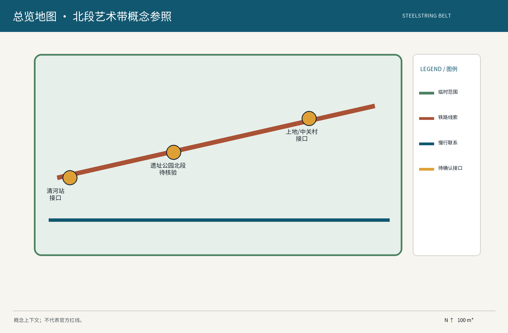
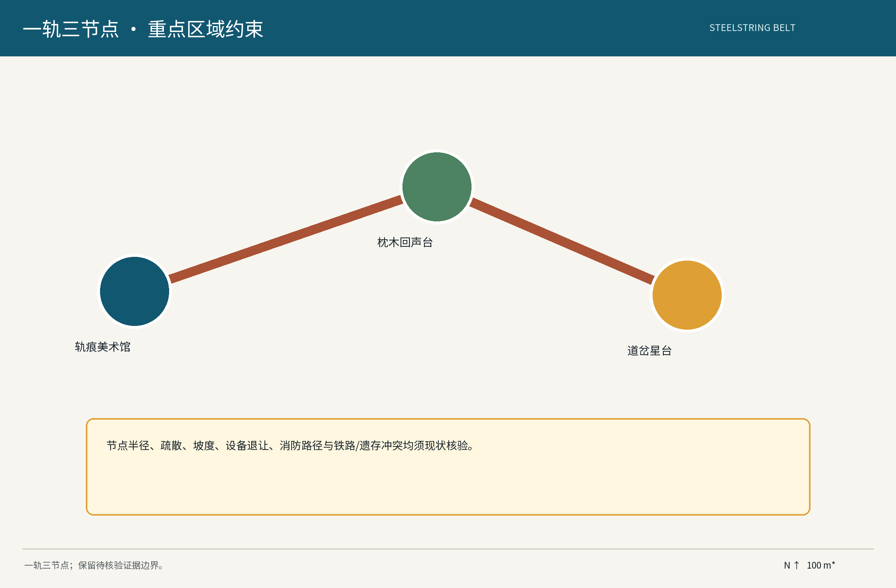
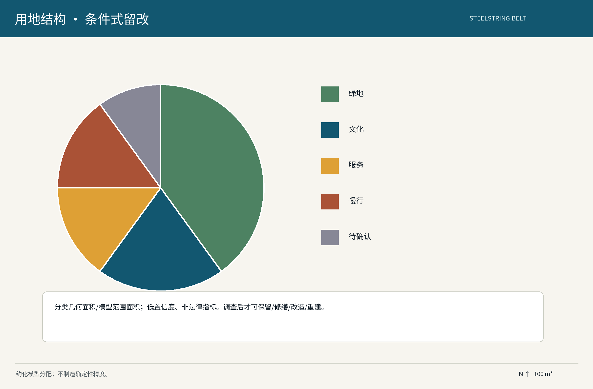
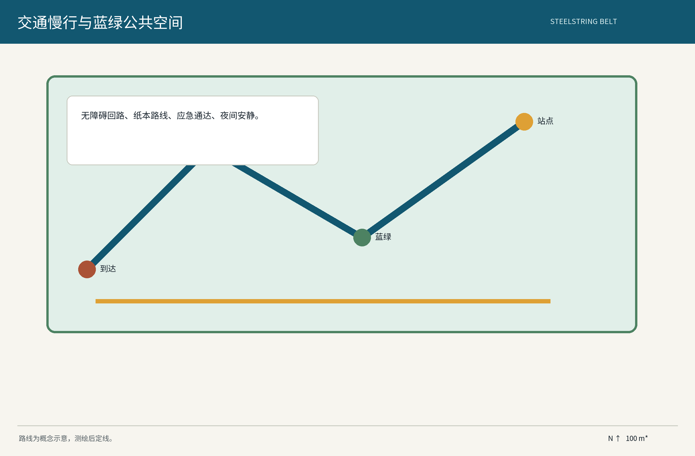
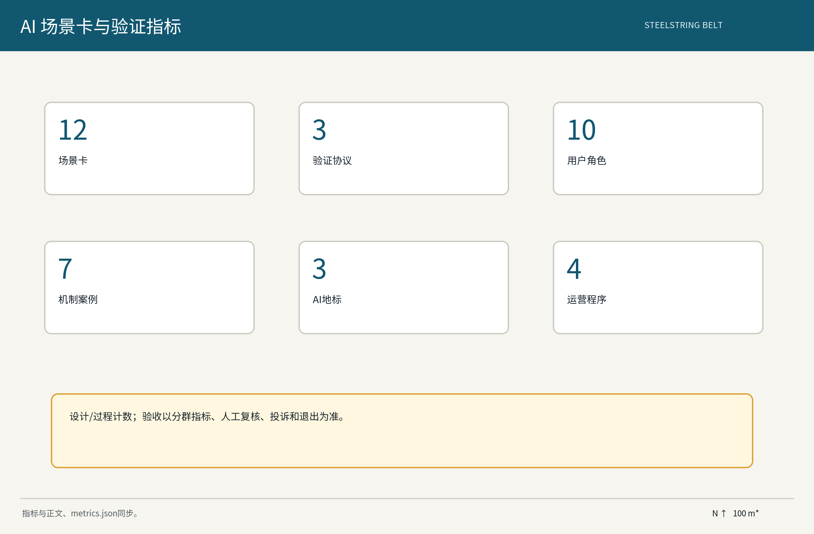

# 钢弦之带 / The Steelstring Belt

## 设计依据与资料清单

本方案是面向百年京张 AI 创新带的概念建议与参考方案，使用任务书、公开规划方法、可审计的公开案例与本包 provisional 几何作为设计输入。这里的“轨道、枕木、道岔、建筑、遗存”均不是已经完成的场地事实清单，而是需要由现状测绘、档案查验、产权核对、文保/结构/消防专业意见确认的调查对象；任何“经现状调查确认后”的保留、改造或保护结论都必须附证据编号、时间和责任人。历史叙事仅采用公开史料可复核的京张文化线索，不把推测性的具体构筑年代、保存等级或运营权属写成事实。数据处理遵循仅匿名聚合、关键决策人工复核、禁止过度监控；生成式 AI 只用于草拟、检索和多方案比较，不替代历史判断、规划审批或工程设计。正式数据到位后，先冻结版本、复算边界和三项视觉指标，再进入专业团队深化。

证据来源包括任务书、公开法律法规、城市设计方法、Noto Sans SC 许可证和已登记的案例 URL；案例只作为机制参照，不暗示在本场地已经实施。资料清单的缺口包括官方红线、道路红线、轨道保护范围、客流基线、无障碍现状、声光环境、管线容量、产权和素材授权。每一个缺口都进入“决策—示范—监督”闭环：决策记录采用版本化议事单，示范先做可逆小样，监督以人工抽检、年度公示和申诉处理为闸门。

证据锚点：[source:DATA-SRC-AGENT-TASKBOOK-20260518][source:DATA-SRC-OFFICIAL-ANNOUNCEMENT-20260509][standard:PROJECT-AGENT-OPEN-CALL-TASKBOOK]

证据锚点（续）：[depth:existing_conditions_diagnosis][data:A-EVIDENCE-001][metric:site_area_sqm]

## 三层范围工作框架

三层范围分别回答“区域协同从哪里来、空间体验如何连续、节点如何安全落地”。统筹研究层以百年京张文化带、都市 AI 生活体验带、AI 融合创新带为三条定位线，连接清河站、上地/中关村接口以及北纬社区、未来科学城、怀柔科学城、经开区和京津冀的待确认协同接口；总体设计层研究三区两翼之间的产业、生活、文化和运营流，提出东西缝合、南北贯通的概念网络；重点区域层聚焦遗址公园北段的“一轨三节点”：轨痕美术馆（Archive Gallery）、枕鸣剧场（Sleeper Echo Stage）、岔光广场（Switch-Star Plaza）。三节点只是待选概念位置，不能替代官方边界或工程线位。

三层之间用“证据包”传导：统筹层提交接口矩阵和案例机制，整体层提交空间约束和公共利益指标，重点层提交节点卡、试点协议和移交规格。三区两翼不写成已建成组织关系，而是可供专业团队验证的协同假设：中关村科技服务翼可能提供专业服务接口，小月河场景赋能翼可能承接公共体验试点，具体责任、资源和合作均须另行确认。所有比例、范围和可达半径只作为模型参数，若与官方数据冲突，以官方数据替换并重跑 geometry、metrics、图件和 PDF。

证据锚点：[source:DATA-SRC-AGENT-TASKBOOK-20260518][standard:PROJECT-OFFICIAL-ANNOUNCEMENT][depth:three_level_scope_framework]

证据锚点（续）：[data:A-REGION-001][metric:key_area_count]

## 统筹研究范围产业与未来城市研究

统筹研究把“文化线索—AI 生态—日常公共服务”作为同一条验证链。空间上，轨道线索提供可读的公共叙事接口；产业上，众智园、AI 原点社区、大钟寺、科技服务翼和场景赋能翼被当作待确认的角色节点；运营上，开发者、居民、学校、文化机构、专业团队和潜在合作方通过公开申请进入场景池。对北纬社区、未来科学城、怀柔科学城、经开区、京津冀的协同只设“待确认接口矩阵”：需要确认对接主体、主题资源、数据字段、交通/人才/场景需求、审批边界、回传成果和退出条件，不预设合作成立、资金到位或政策承诺。

未来城市研究不追求把 AI 变成摄像头或自动决策，而是把 AI 限定为证据整理、语音/图文导览、匿名客流估计、无障碍内容转换和多方方案比较。产业测试必须在小范围、低风险、可回退的空间内开展；每次测试都有基线、采样、成功阈值、误差分群、人工回退和停用门。生成式 AI 的适用范围是提纲、翻译、候选叙事和非关键视觉草案；历史事实、法定边界、遗存价值、消防安全、个体权益和正式决策必须由人类专业团队确认。研究成果沉淀为公开的机制卡、数据字典和年度复盘，而不是不可解释的模型分数。

证据锚点：[source:DATA-SRC-CASE-HELSINKI-3D][source:DATA-SRC-CASE-SINGAPORE-VIRTUAL][standard:PROJECT-AGENT-OPEN-CALL-TASKBOOK]

证据锚点（续）：[depth:overall_spatial_structure][data:A-REGION-001][metric:global_case_count]

## 总体设计范围城市更新与控规深度城市设计

总体设计采用“轻触式、可逆、先证据后建设”的更新语法。规划研究深度只负责提出空间关系、风貌语言、公共服务接口和待核验约束，不给出容积率、建筑高度、道路红线、拆改留结论或工程可行性承诺。整体空间以待调查确认的轨道线索为叙事骨架，以慢行和蓝绿联系组织公共体验，以站点和周边道路的现状核查作为入口条件。关键断面至少需在后续补测：轨道与步行净距、无障碍坡度和休息节点、消防疏散与应急车可达、照明设备与遗存保护冲突、雨洪排水和树木根系影响。示意图中的道路、站点、北向、尺度和节点流线均为概念上下文，不是官方红线。

设计决策采用三道闸门。第一道是证据闸门：完成测绘、档案、产权、文保、结构、消防和市政资料核查；第二道是示范闸门：用不焊接、不打孔、可整体移除的临时装置验证安全、可达和公众接受度；第三道是监督闸门：由居民、专业人员、运营者和管理方人工复核，形成年度公示、问题清单和暂停/移交决定。只有当三道闸门均通过，某一概念位置才可进入专业设计条件编制；任何未通过项都回到决策台账，不以效果图替代事实。

证据锚点：[source:DATA-SRC-MOHURD-CONTROL-DETAILED-PLANNING][standard:MOHURD-CONTROL-DETAILED-PLANNING][depth:overall_spatial_structure]

证据锚点（续）：[data:A-IMPLEMENTATION-001][metric:site_area_sqm]

## 重点区域详细设计

重点区域采用“一轨三节点、三节点三种公共性”的概念分工。轨痕美术馆承担档案、展陈、创作和人工讲解；枕鸣剧场承担社区演出、授权声景和安静时段切换；岔光广场承担分流、导视、夜间低亮度展示和活动集散。三处节点都要先核验现状条件：是否存在可识别轨道线索、是否属于绿地或保护边界、是否有权属/设备/消防冲突、是否能形成连续无障碍路径、是否有邻里噪声敏感点。若核查不能证明适宜，节点名称和功能可保留为叙事容器，但位置、构筑和活动必须暂停。

节点最小需求不是面积承诺，而是可审计的功能清单：一条连续的可达路径、一个人工服务点、一块可撤展陈面、一套纸本和语音导览、一个应急联络点、一份设备断电/收撤记录和一张维护责任卡。三节点之间以沿线步行联系和可读标记连接，不设置必须依赖手机或人脸识别的入口。夜间活动实行预约容量由人工核准、照明分时、音量上限、邻里告知和临时撤场；所有 AI 输出在公开前由策展/安全/无障碍复核。这里的“保留”只表示设计意向，只有现状调查确认后才能进入保护或改造清单。

证据锚点：[source:DATA-SRC-SELF-PRODUCED-ASSETS][standard:PROJECT-AGENT-OPEN-CALL-TASKBOOK][depth:three_key_area_detailed_design]

证据锚点（续）：[data:A-EVIDENCE-001][metric:landmark_count]

## AI 创新生态、人才画像与 AI+ 场景

本包保留并结构化 12 张场景卡 SC-01—SC-12：每卡都写明用户、空间触点、输入字段、模型/规则、人工复核、隐私边界、运营角色、指标和失败停用。五类核心画像包括居民与老年人、儿童照护者、残障人士/低数字能力用户、开发者/高校青年、临时访客与国际来访者；产业测试 T1 轨道文化内容检索、T2 无障碍导览路线排序、T3 匿名人流与活动排班建议，均只在概念试点内使用公开或经同意的聚合字段。T1 输出候选史料索引，成功阈值为人工抽检可追溯且错误分群可识别；T2 输出多模式路线建议，阈值为人工无障碍验收通过；T3 输出时段级密度趋势，阈值为与人工计数的误差分群可解释，任何阈值不通过即回退人工排班。

生态图按土地、空间、产业、资金、人才、算力、数据、场景八要素组织。案例只做机制参照：赫尔辛基 3D 城市模型、Virtual Singapore、Decidim、TfL Open Data、NYC Open Data、Amsterdam Smart City 为公开来源的制度/数据接口案例，High Line 仅作空间运营参照；不把任何案例说成合作方或本地复制。生成式 AI 只可用于草拟和候选比较，不能生成事实、审批、身份画像或自动执法。所有数据默认本地最小化处理，仅匿名聚合；关键决策人工复核；禁止过度监控。

证据锚点：[source:DATA-SRC-CASE-DECIDIM][source:DATA-SRC-CASE-TFL-OPEN-DATA][source:DATA-SRC-GENERATIVE-AI-INTERIM-MEASURES]

证据锚点（续）：[standard:PROJECT-AGENT-OPEN-CALL-TASKBOOK][depth:overall_spatial_structure][data:A-PRIVACY-001]

证据锚点（续）：[metric:scenario_card_count][metric:industry_test_scenario_count][metric:persona_count]

## 用地、建筑规模与拆改留方案

用地、建筑与拆改留只提出核验流程，不伪造现状类别或权属。待官方边界、现状地类、产权和保护资料到位后，专业团队按统一坐标系复核 site_boundary、land_use、buildings、public_space 的叠合关系；当前几何仅用于概念表达和指标复算。对“既有建筑”“铁路构筑”“工业遗存”等对象，先建立对象 ID、坐标、照片/测绘来源、产权/管理人、结构与安全状态、历史证据、保护建议和不确定性字段；只有档案与现场交叉确认后，才允许进入“原位保护、可逆改造、迁移展示、拆除论证”之一。任何拆除、改造、封闭和永久新建都必须经过法定程序与人工审查。

建设量不做结论性数字。临时装置以“点位数量、单件可撤体量、活动时段和撤场时间”控制，永久建筑以现状核查后的专业条件为准；模型中的绿地/公共空间比例按 geometry 面积÷ provisional site_boundary 面积计算，展示只保留约数和置信度，不把比例图当作规划指标。建议的资源闭环是“留改优先、可逆先行、证据不足暂停”：若结构、消防、文保、产权或邻里影响任一字段缺失，则停在调查阶段，保留纸面叙事和临时导览，不进入建设承诺。维护者须接收对象台账、设备清单、撤场说明和年度巡检表。

证据锚点：[source:DATA-SRC-MNR-LAND-USE-CLASSIFICATION-202311][standard:MNR-LAND-USE-CLASSIFICATION-GUIDE][depth:land_use_layout]

证据锚点（续）：[data:A-EVIDENCE-001][metric:building_footprint_area_sqm]

## 交通、轨道、市政与公共服务设施

交通策略是“先走通、再好看、可随时回退”。清河站、周边道路和其他轨道站点只作为待核验的门户接口，需以官方交通资料、现场测绘和管理方确认其出入口、慢行冲突、非机动车停放、消防通道和无障碍连续性。图示的站点、道路、步行联系、概念 100 m 比例尺和北向用于帮助复核，不是路线设计或红线承诺。三节点之间需要形成连续可达的慢行路径，至少配置休息、饮水、卫生间、人工问询、纸本地图、语音播报、盲文/触觉标记和临时照明；坡度、净宽、铺装、防滑和交叉口均待现场验收。

市政接口采用低干预原则：照明分时调光且保留人工断电，排水、树木、管线和设备位置先探查后布置，任何铁路线索与设备冲突以安全、保护和法定管理要求优先。公共服务不依赖单一 App；手机、纸本、人工柜台、电话和现场广播提供等价入口。应急演练至少覆盖夜间疏散、活动撤场、设备断电、儿童走失、轮椅绕行和极端天气，运营者记录响应时间、未服务原因和修复责任。共享接驳仅为待验证的服务假设，不把车辆、容量或经营许可写成已落实。

证据锚点：[source:DATA-SRC-MOHURD-URBAN-DESIGN-MEASURES][standard:MOHURD-URBAN-DESIGN-MEASURES][depth:traffic_rail_slow_parking]

证据锚点（续）：[data:A-IMPLEMENTATION-001][metric:road_network_length_m]

## 蓝绿空间、公共空间与城市风貌

蓝绿策略不是把图上的绿色直接当作现状公园，而是提出一套待核验的连通性检查：确认既有绿地、水系、树木、排水和生态敏感点后，再决定哪些路径可连、哪些区域应避让、哪些节点能承受活动。公共空间采用“点—线—面”结构：点是三节点和三个 AI 地标的候选触点，线是慢行/声景/导视联系，面是可休息、可观察、可参与的口袋空间。每个点位配纸本导览、人工服务、无障碍路线和安全撤场面；面向老年人、儿童照护者、视听障碍者和临时访客提供低刺激、可停留、可拒绝互动的选择。

城市风貌采用锈色、深灰、暖白的原创工作色板，但不冒用“一带”整体 Logo；导视层级区分区域名、节点名、活动名和第三方合作标识。夜间灯光不追踪个人、不以互动强迫参与，声景仅使用已获授权的采集，活动遵守时段、音量、眩光和邻里告知规则。蓝绿和公共空间的指标只做设计监测：连通路径完成度、可达服务点覆盖、投诉闭环率、人工验收通过率和撤场时间；不把概念面积或效果图解释为绿地率、公共设施标准或工程验收结论。

证据锚点：[source:DATA-SRC-BARRIER-FREE-ENVIRONMENT-LAW][standard:PROJECT-AGENT-OPEN-CALL-TASKBOOK][depth:blue_green_public_space]

证据锚点（续）：[data:A-IMPLEMENTATION-001][metric:green_ratio][metric:public_space_ratio]

## 更新项目清单、实施政策与分期计划

分期采用“决策—示范—监督”闭环，不把概念节奏写成政府承诺。近期 1—3 年首先完成现状调查、对象台账、权属/保护/安全核验、公众参与和一处可撤小样；选择条件是证据齐全、慢行可达、消防与设备冲突可解释、维护主体可确认。中期 3—5 年在人工复核通过后扩展三节点的轻量展陈、无障碍导览、社区活动和产业测试；每项扩展都需要阶段闸门、预算来源边界、运维责任、停损动作和移交规格。远期 5—10 年只在复算后的正式条件、评估结果和公众同意基础上形成可复制机制，不预设规模、投资、招商、审批或建设结果。

项目清单分为调查、可逆示范、公共服务、内容运营、AI 测试和年度复盘六类。开发者社区通过公开场景申请、数据字典、伦理/隐私初筛、人工评审、短周期试点、结果公示和失败退出运营；国际招引只提供公开信息、翻译、访问和场景对接，不承诺政策、资金或落地。资金可以来自待确认的公共文化预算、项目共建或社会捐赠，但每一项都必须在实施前核实来源、用途、审计和退出责任。运营者接收设备、内容、授权、巡检、应急和投诉记录；连续两次未达到安全/可达/隐私阈值即暂停，无法修复则撤场并恢复原状。

证据锚点：[source:DATA-SRC-AGENT-TASKBOOK-20260518][standard:PROJECT-AGENT-OPEN-CALL-TASKBOOK][depth:phasing_implementation]

证据锚点（续）：[data:A-IMPLEMENTATION-001][metric:phase_count][metric:annual_program_count]

## 指标体系、面积复算与合规矩阵

本包的 site_area_sqm、green_ratio、public_space_ratio 是从 provisional geometry 复算的有限数值，只能作为当前设计模型，不是官方红线或法定指标。公式分别为：site_area_sqm = area(site_boundary)；green_ratio = area(union(green_space))/area(site_boundary)；public_space_ratio = area(union(public_space))/area(site_boundary)。正式边界或地类变化时，必须锁定 geometry 版本、重新计算、更新图件和 HTML data-value，并在 changelog 记录差异。建筑规模、容积率、高度、投资、容量、客流和拆改留不提供结论数字。计数型交付包括 12 张结构化场景卡、3 个产业测试协议、10 类画像、7 个来源案例、3 个 AI 地标和 4 个年度运营项目，它们是内容/流程计数，不是现状实施量。

合规矩阵把三大定位、五大功能、三区两翼、agent.1—6 和本包产物逐项映射：总体图对应 agent.1，八要素生态与案例对应 agent.2，场景卡/画像/测试对应 agent.3，地标/荣誉/组件对应 agent.4，京张叙事/导视/国际传播对应 agent.5，社区/开放申请/年度运营/转化退出对应 agent.6。所有判断均以来源、数据缺口和人工复核为前提；AI 治理固定为仅匿名聚合、关键决策人工复核、禁止过度监控。指标卡、图件、HTML、PDF 和 manifest 共享同一版本号，避免把派生视觉误读为新的事实来源。

证据锚点：[source:DATA-SRC-SELF-PRODUCED-ASSETS][standard:PROJECT-OFFICIAL-ANNOUNCEMENT][depth:metrics_recalculation]

证据锚点（续）：[data:A-DATA-001][metric:site_area_sqm][metric:green_ratio]

证据锚点（续）：[metric:public_space_ratio]

## 风险、版权与合规说明

风险控制采用“发现—分级—复核—停用—移交”五步。事实风险：轨道、枕木、道岔、建筑或历史叙事若无档案与现状交叉证据，只能标为待核验；空间风险：官方边界、道路、消防、无障碍、文保、生态和市政资料缺失时，几何只作 provisional 设计模型；AI 风险：不采集人脸、不追踪个体、不做行为画像，默认本地最小化处理，仅传匿名聚合，关键决策人工复核，禁止过度监控；运营风险：噪声、眩光、人流、设备故障和儿童/轮椅冲突必须设时段、人工值守、断电、撤场和申诉机制。发生安全、隐私、授权或事实争议时，立即暂停相关场景并保存事件记录。

本包的逐项权利台账已合并到本节对应的 `report/copyright_statement.md`：包括正文、原创工作名称、原创图件、GeoJSON、HTML/PDF、Noto Sans SC OFL-1.1、公开案例 URL、生成方式、允许用途、禁止用途、署名要求和删除/替换门槛。未经权利确认的地图、历史影像、照片、声音、人物肖像、商标、企业 Logo 和第三方字体不进入发布素材；案例只引用公开机制，不复制其视觉或代码。名称和标识仍须后续检索，原创识别系统不冒用“一带”整体 Logo。所有落地建议都是概念建议、参考方案、可供专业团队深化研究，不构成规划审批、建设承诺或官方背书。

证据锚点：[source:DATA-SRC-NOTO-SANS-SC][source:DATA-SRC-SELF-PRODUCED-ASSETS][standard:PROJECT-AGENT-OPEN-CALL-TASKBOOK]

证据锚点（续）：[depth:risk_missing_data][data:A-RIGHTS-001][metric:global_case_count]

## 参考资料

参考资料按“可核验、用途匹配、权利清楚、状态诚实”整理。组织方公告和任务书只用于理解任务范围、三大定位、五大功能和三区两翼；城市设计、土地分类、无障碍和 AI 治理资料只作方法或合规参照，不替代场地级法定条件。赫尔辛基 3D 城市模型、Virtual Singapore、Decidim、TfL Open Data、NYC Open Data、Amsterdam Smart City 是公开的一手或官方项目入口，分别用于说明城市模型、开放协作、数据接口和生态机制；High Line 仅作为公共空间运营参照。Noto Sans SC 使用本地 OFL-1.1 字体文件并在离线 HTML 中嵌入子集，具体台账见版权说明。

资料使用的边界是：不把公开案例写成当地合作，不把任务书面积文本写成官方 polygon，不把图件样式写成实景照片，不把生成式 AI 草案写成事实，不把假设字段写成现状。每次后续更新应记录获取日期、来源 URL、许可、转换、时空范围和局限；新增素材若不能完成台账登记，就不进入 proposal、HTML、图件或 PDF。所有派生文件都由本正文、矩阵、metrics 和 geometry 同步生成，并保留 provisional 警示与人工最终判断。

证据锚点：[source:DATA-SRC-CASE-HELSINKI-3D][source:DATA-SRC-CASE-SINGAPORE-VIRTUAL][source:DATA-SRC-CASE-HIGH-LINE]

证据锚点（续）：[standard:PROJECT-AGENT-OPEN-CALL-TASKBOOK][depth:risk_missing_data][data:A-RIGHTS-001]

证据锚点（续）：[metric:global_case_count]
