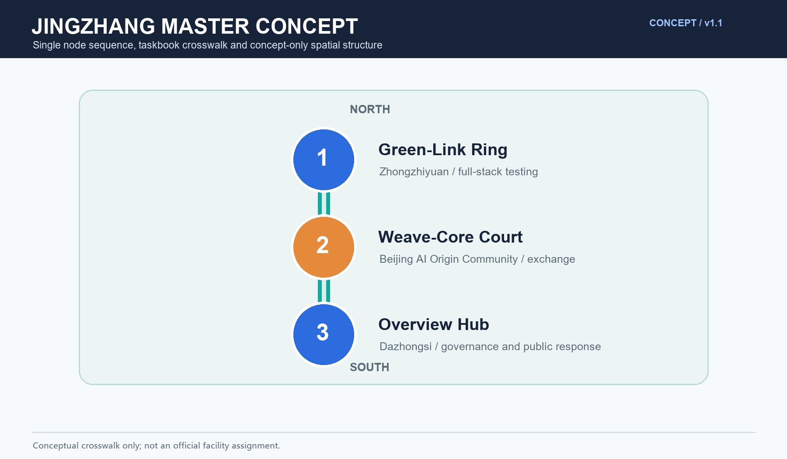
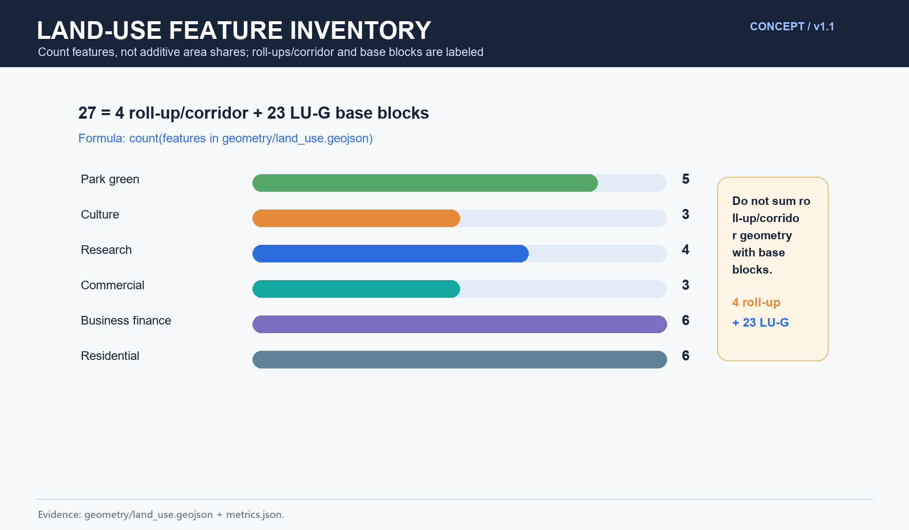
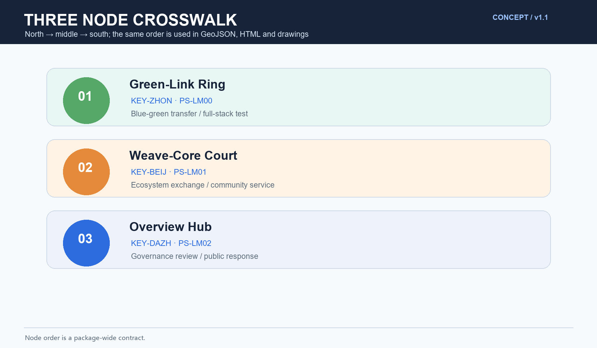
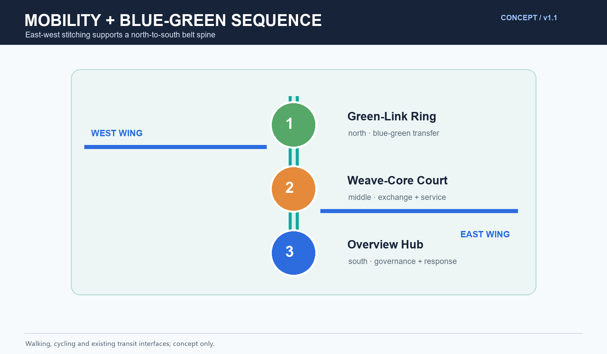
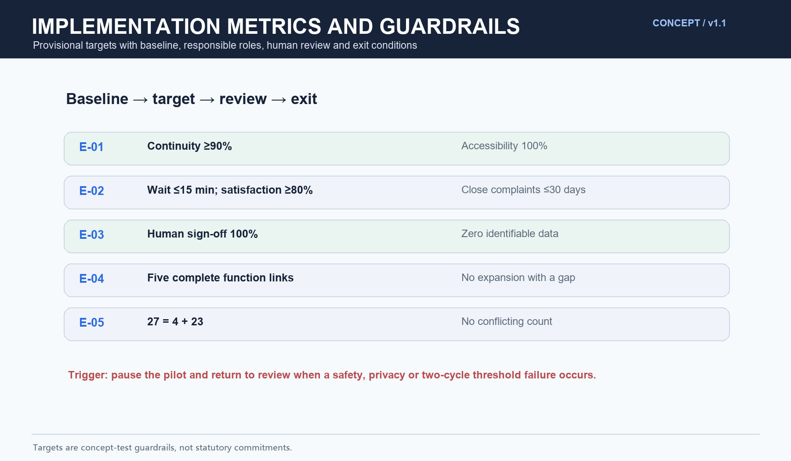

# Jingzhang Master Concept: Overall Concept and Functional Coordination

This is a concept proposal for open review. It uses public and provisional evidence, does not replace statutory plans, and does not assert official FAR, building height, demolition, engineering feasibility or facility siting conclusions.

## Design Basis and Source List

The design basis is the official call, the agent taskbook, public Jingzhang railway heritage material, public planning summaries, open spatial data and professional guidance. The authoritative source register is \`sources.json\`; provisional boundaries, professional review and later official data are explicit constraints.

Evidence anchors: \`[source:DATA-SRC-OFFICIAL-ANNOUNCEMENT-20260509]\`, \`[source:DATA-SRC-AGENT-TASKBOOK-20260518]\`.

## Three-Level Scope Framework

The three levels are: the coordination research scope of the belt and connected districts; the overall design scope of the greenway and its interfaces; and detailed concept nodes. The only node sequence used in this package is north to south: Green-Link Ring, Weave-Core Court, Overview Hub. All crosswalks are conceptual and are not official facility assignments.

## Industry and Future City Research in the Coordinated Study Scope

The belt connects research, translation, enterprise application and public experience through a spatial-industry loop. The proposal treats the belt as a civic interface for talent, culture, mobility and scenario testing. It does not promise investment, land conversion or a statutory development program.

## Overall Design Scope: Urban Renewal and Regulatory-Depth Urban Design

The structure is one greenway axis, three spatial character zones, multiple beads and two east-west wings. The three taskbook positions are the Centennial Jingzhang Cultural Belt, the Metropolitan AI Life-Experience Belt and the AI Integration and Innovation Belt. The spatial expression layer uses cultural memory, innovation vitality and ecological livability; these are not substituted for the taskbook positions.

### Taskbook functions and spatial translations

The taskbook functions are the source dimensions. The spatial functions below are design translations and must not be counted as the same list.

| Taskbook function | Spatial translation (not a renamed taskbook function) | Area/node | Agent, scenario and operation evidence |
| --- | --- | --- | --- |
| Full-stack AI autonomous innovation system | Full-stack test and factor-coordination corridor | Zhongzhiyuan AI Autonomous Innovation Acceleration Area / north Green-Link Ring | agent.1, agent.2; S-06 research coordination and S-08 developer testing; developer sandbox and quarterly factor review |
| World-class AI innovation ecosystem | International-facing exchange and ecosystem interface | Beijing AI Origin Community / middle Weave-Core Court | agent.2, agent.5, agent.6; S-02 international exchange and S-09 ecosystem release; partner register and public review |
| New paradigm of AI+ scenario enablement | Open scenario and public-experience belt | Xiaoyuehe Scenario Enablement Wing / all three nodes | agent.3, agent.4; S-03 public experience, S-04 blue-green sensing and S-07 mobility forecast; admission, human review and feedback loop |
| Intelligent AI-vital city | 15-minute service and blue-green slow-mobility network | Weave-Core Court and the two wings | agent.3, agent.4; S-01 daily service and S-05 traffic coordination; accessibility audit and dispatch |
| Global voice in AI governance | Anonymous aggregation—human review—public correction loop | Overview Hub / belt-wide governance interface | agent.1, agent.3, agent.6; S-05 governance review and T-02 public response; annual public review and appeal route |

The five spatial functions—heritage memory, innovation exchange, commercial life, blue-green recreation and mobility transfer—are a separate translation layer.

## Detailed Design of Key Areas

The three concept nodes are aligned north to south as follows:

| Order | Node | Area crosswalk | Spatial role |
| --- | --- | --- | --- |
| 1 north | Green-Link Ring | \`KEY-ZHON\` Zhongzhiyuan AI Autonomous Innovation Acceleration Area; \`PS-LM00\` | Blue-green and slow-mobility transfer plus full-stack testing |
| 2 middle | Weave-Core Court | \`KEY-BEIJ\` Beijing AI Origin Community; \`PS-LM01\` | Ecosystem exchange, community services and open scenarios |
| 3 south | Overview Hub | \`KEY-DAZH\` Dazhongsi AI Industry Cluster; \`PS-LM02\` | Belt-wide display, governance review and public response |

The GeoJSON layers record \`north_south_order\`, \`related_concept_node_id\` and the English/Chinese crosswalk. The locations are conceptual and require statutory, heritage, accessibility, safety and professional review.

## AI Innovation Ecosystem, Talent Profiles and AI+ Scenarios

Five AI+ scenarios are proposed: overall operations visualization, functional matching assessment, greenway mobility forecasting, blue-green sensing, and aggregated public-participation feedback. The package contains five representative user profiles and three industry test scenarios. All sensing is anonymous and aggregated; consequential decisions require human sign-off.

## Land Use, Building Scale, and Retain/Renovate/Demolish Strategy

The proposal follows retain-first, adaptive reuse and case-by-case removal. It does not set statutory intensity, height or demolition quantities.

The land-use inventory uses one reproducible definition: one unit equals one GeoJSON Feature. \`geometry/land_use.geojson\` contains 27 features: four named roll-up/corridor features (\`LU-ZHON\`, \`LU-BEIJ\`, \`LU-DAZH\`, \`LU-CORRIDOR\`) and 23 \`LU-G\` base-block features. This is an inventory count, not an additive area share; roll-up/corridor geometries must not be summed with base blocks. The category counts are park green 5, culture 3, research 4, commercial 3, business finance 6 and residential 6. Evidence: \`[metric:land_use_zone_count]\`, \`[data:PACKAGE-GEOMETRY]\`.

## Transport, Rail, Municipal and Public Service Facilities

The greenway is a conceptual slow-mobility spine ordered Green-Link Ring—Weave-Core Court—Overview Hub. East-west stitching connects campuses, innovation districts and stations through walking, cycling and existing transit interfaces. Public service principles include accessibility, multilingual orientation, community services and human review for AI-supported decisions.

## Blue-Green Space, Public Space and Urban Character

The greenway, cross-links, small parks, campuses and community greens form a connected blue-green network. Heritage references remain light, reversible and non-obstructive. Materials, signage, public art and night guidance follow a restrained family language rather than literal branding.

## Renewal Project List, Implementation Policy and Phasing Plan

The concept project list has four families: coordination platform, slow-mobility continuity, adaptive reuse and blue-green stitching. The phases are near term 1–3 years, middle term 3–5 years and long term 5–10 years. Each test begins with a baseline, runs in a limited area, receives human review, and expands only when the target threshold is met.

| Evidence | Baseline | Target threshold | Responsible roles | Exit condition |
| --- | --- | --- | --- | --- |
| E-01 Green-Link Ring | Two weekdays and one weekend walking/accessibility audit | Continuity ≥90%, key accessibility points 100%, review coverage 100% | agent.3/4; operator; community and accessibility reviewers | Two observation windows below target or an unresolved safety event |
| E-02 Weave-Core Court | Four-week anonymous flow, wait, satisfaction and complaint log | Peak average wait ≤15 minutes, satisfaction ≥80%, complaints closed within 30 days | agent.2/3; operator; human reviewer | Two cycles below target or unresolved safety/accessibility complaint |
| E-03 Overview Hub | Data dictionary, AI-output register, sign-off and response-time baseline | Human sign-off 100%, response ≤30 days, zero identifiable personal data | agent.1/6; data-protection and professional reviewers; public oversight | Any identifiable data, unsigned automated decision or out-of-scope use |
| E-04 Function crosswalk | Check every taskbook function through translation, area, agent, scenario, drawing and operation | Five complete traceable rows; no expansion with a missing link | agent.1 lead; agents.2–6; project sign-off | Broken traceability or mixed function vocabularies |
| E-05 Land-use inventory | Direct feature count and role labels | 27 = four roll-up/corridor + 23 \`LU-G\`; no conflicting count | agent.1/2 data review; planning reviewer | Changed feature count/role without synchronized outputs |

These are concept-test guardrails, not statutory commitments.

## Metrics, Area Recalculation and Compliance Matrix

Metrics are provisional design indicators. The package keeps the single rule \`count(features in geometry/land_use.geojson) == 27\`, with explicit role labels and a non-additive area rule. \`metrics.json\`, \`design_depth_matrix.json\`, \`compliance_matrix.json\`, the HTML pages and the bilingual A0/A3 drawings point to this definition and to the node sequence.

## Risk, Copyright and Compliance Statement

This concept does not constitute an administrative approval basis, statutory plan, engineering conclusion or official data release. Risks include provisional boundaries, planning coordination, implementation capacity, AI ethics and privacy. Controls are minimum necessary anonymous aggregation, human review, source labeling, public response and professional review. Names, text and diagrams are original concept work or public-domain references; no private data or unauthorized third-party assets are used.

## References

## Regional interfaces and research assumptions

Cross-region relationships below are research hypotheses, not confirmed partnerships. Exchange is limited to public references, anonymized aggregates, methods and review findings; no private person-level data is required.

| Partner area | Exchange | Spatial interface | Operating interface | Suggested responsibility | Uncertainty |
| --- | --- | --- | --- | --- | --- |
| Beiwei Community | resident issues, public comments, accessibility observations | community entry to Green-Link Ring; no new road redline | monthly forum, anonymous summary, human follow-up | community forum + operator | hypothesis; consent and boundary pending |
| Future Science City | open test methods, scenario needs, reusable components | online method exchange and node display, no inferred rail/road works | quarterly case exchange and failure review | test organizer + professionals | hypothesis; venue/data not confirmed |
| Huairou Science City | ethics templates and evaluation methods | public display and remote collaboration only | annual open day and safety review | research collaborators + human review group | hypothesis; no authorization evidence |
| E-Town | industry problem cards, test outputs, talent needs | Overview Hub display interface, no relocation claim | lead registration, human screening, review | industry service + operator | hypothesis; no investment or output promise |
| Beijing-Tianjin-Hebei | portable scenario cards, bilingual knowledge | online open platform and cultural narrative, no cross-city engineering line | annual regional open call and public review | communication + knowledge-base team | hypothesis; cooperation pending |

## Human-readable belt map and node enlargements

`assets/figures/regional-coordination.png` is the belt-level study map: a grey dashed provisional boundary, north/middle/south nodes, existing road and rail interfaces, green links, public-service entries and a “to verify” constraints legend. `assets/figures/node-zooms.png` enlarges Green-Link Ring, Weave-Core Court and Overview Hub. It does not draw new road redlines, rail alignments or engineering works; all locations are non-statutory reference relationships pending official GIS/CAD, heritage, transport, municipal and ownership inputs.

## Agent 2: eight-factor mechanism and seven global cases

The seven cases are comparisons, not endorsements or copy targets: G01 SXSW, G02 Dutch Design Week, G03 MWC Barcelona, G04 Ars Electronica, G05 Amsterdam AI Register (public algorithm accountability), G06 Helsinki AI Register (transparent city AI use cases), and G07 Montreal Mila (research–talent–industry network). `sources.json` records each source, transferable mechanism, non-portable condition and Jingzhang node. The eight-factor mechanism connects land, space, industry, funding, talent, compute, data and scenarios: provisional land classes; reversible spatial nodes; problem cards; resource-type registration without funding promises; contributor community; compute service type without capacity claims; public/anonymized data; and baseline—limited pilot—human review—public retrospective. `assets/figures/ecosystem-eight-factors.png` is the corresponding mechanism map.

## Agent 3: ten independent scenario cards and three test protocols

| Card | Space / user | Data boundary and model task | Output / responsibility / review | Threshold, failure and exit |
| --- | --- | --- | --- | --- |
| S01 registration flow | Green-Link / residents, visitors | anonymous time counts; routing suggestion | queue prompt / operator / human confirm | anomaly→manual flow control; unauthorized use stops |
| S02 multilingual wayfinding | three nodes / visitors, deaf users | public text; translation and plain-language rewrite | bilingual card / guide / spot check | terminology error→withdraw and rewrite |
| S03 code co-creation | Weave-Core / developers, students | volunteered code and license; risk class | test report / test lead / security review | unclear rights→isolate, do not publish |
| S04 problem clinic | Overview Hub / firms, youth | de-identified problem cards; topic match | resource list / industry service / referral | low confidence→human reassignment |
| S05 contribution exhibit | Loop Gallery / contributors, public | public credit and consent; summary draft | exhibit card / curator / rights review | unclear rights→no display |
| S06 density notice | public entry / elders, carers | anonymous density level; trend notice | paper/screen prompt / steward / patrol | anomaly→human patrol; refusal exits |
| S07 memory route | heritage park / children, tourists | public history; age-graded narration | guide route / cultural guide / fact check | conflict→remove pending review |
| S08 blue-green check | green link / volunteers, maintenance | public observation form; issue class | work-order draft / maintenance lead / acceptance | unauthorized capture→delete and stop |
| S09 talent conversion | Code Dock / schools, firms | voluntary tags; no person scoring | opportunity list / community admin /本人 confirm | mismatch→human withdrawal |
| S10 regional open platform | online / regional participants | public cases and de-identified results | knowledge card / curator / annual review | missing source→do not archive |

T01 code safety: license/dependency scan → risk list → test lead review → isolate high risk and exit. T02 accessible multilingual navigation: public text/manual labels → bilingual card → accessibility review → withdraw on misleading output or complaint threshold. T03 industry problem to scenario: de-identified card → test task and stop conditions → service lead plus human panel sign-off → stop without authorization, explainability or beneficiary. None requires a vendor or claims approved operation.

## Agents 4–6: landmarks, culture and long-term operation

The three landmarks are Jingzhang Forum Plaza (L01), Code Dock (L02) and Loop Gallery (L03): civic forum, developer co-creation and railway-memory/contribution display. They are reversible concepts that do not alter heritage fabric, green/blue lines or third-party property. The honor system uses voluntary credit, provenance card, version number, human curation and annual withdrawal review. The component library includes removable signs, paper task cards, staffed accessibility signs, reversible displays, low-brightness night markers and paper/desk complaint alternatives.

The developer loop is register—covenant—working group—code/scenario contribution—human review—public retrospective—contribution memory. Scenario opening is application, data-boundary review, limited pilot, human sign-off, public feedback and annual notice. International attraction-to-retention is public cases → bilingual problem card → human matching → short test → compliance review → contributor follow-up. Resources are facilitator, test lead, accessibility specialist, data-protection adviser and curator; cost is stated only as staff hours, translation, printing and reversible-display maintenance, never as a fabricated budget. Annual review reports participation, complaints, exits, accessibility repairs and knowledge assets.

## All-age and non-digital journeys

Older adults use a paper map, staffed desk and rest points without a phone. Children and carers use age-graded paper cards and guided routes without identity collection. People with mobility, hearing, visual or cognitive disabilities receive route alternatives, human assistance, large print, captions/text service, tactile cues, one-step instructions and confirmation by a companion. Every scenario keeps paper booking, in-person queueing, staffed complaints, phone/desk referral and a switch-off for automated suggestions. These are concept service designs, not completed compliance findings; specialists must verify them later.

## Rights boundary and concept data flow

`京章智轴 / MASTER·JZ` is a concept name requiring trademark search. The package uses a local font or system fallback; figures are authored for this package, while external base maps, historical material and cases are recorded with source, license, use and credit in `sources.json`. Data flow is voluntary/public material → minimization and de-identification → local rule/model suggestion → human review → anonymous notice → complaint/withdrawal → annual deletion or archive. No identification, automatic penalty or uninterruptible decision is allowed. Provisional areas, ratios and lengths are rounded in the main visual; machine files retain recomputable values and every metric group states provisional, non-redline and recompute-after-official-data.

## Canonical phasing and bilingual audit

The single phase version is `PHASE-1.0`: near term 1–3 years, Green-Link Ring and north-factor pilot; middle term 3–5 years, Weave-Core Court and major connection study; long term 5–10 years, Overview Hub, belt-wide open platform and annual governance review. Proposal, matrices, phasing layer, HTML and A0/A3 use this same order; any earlier “near-term Overview Hub” summary is obsolete. The bilingual audit covers positioning, five functions, node order, ten cards, T01–T03, metrics, provisional warnings, roles and exit conditions; `translation_of` does not replace item-by-item review.

See \`sources.json\` for the package source register and access dates. Public references include Jingzhang railway history and heritage materials, Beijing planning summaries, urban design guidance, and public international linear-park and innovation-district cases. Official versions prevail when later data supersedes the concept evidence.
