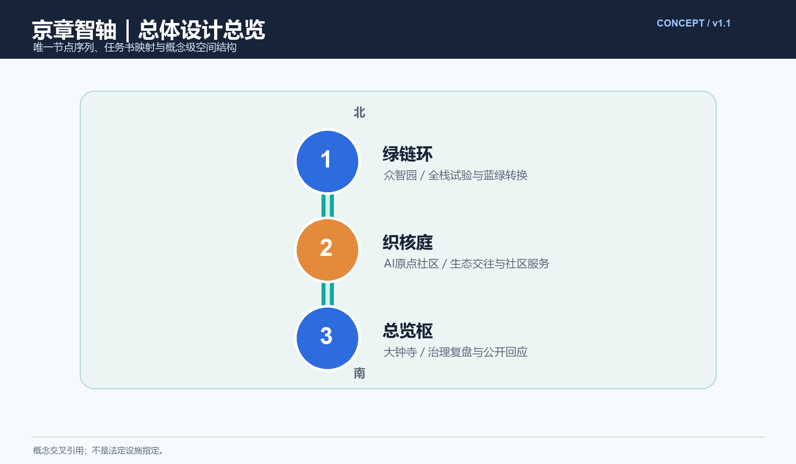
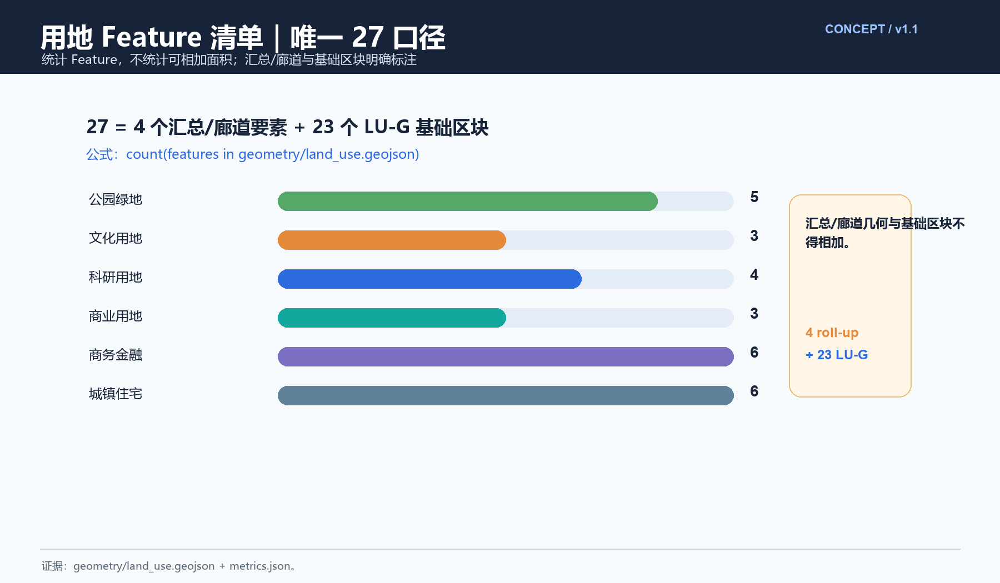
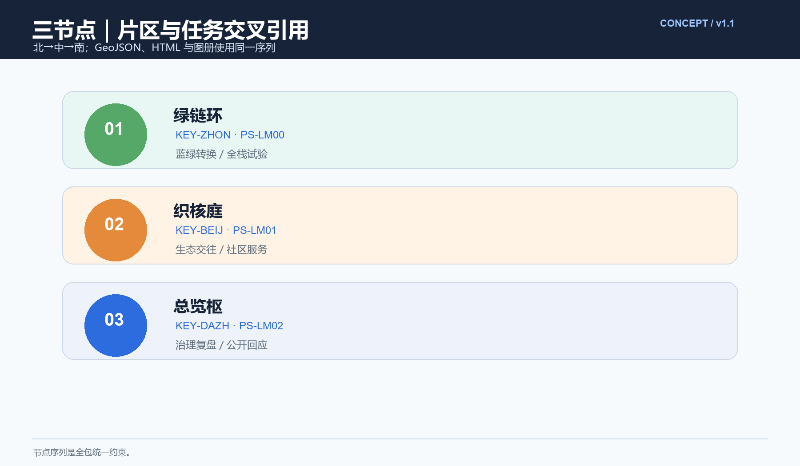
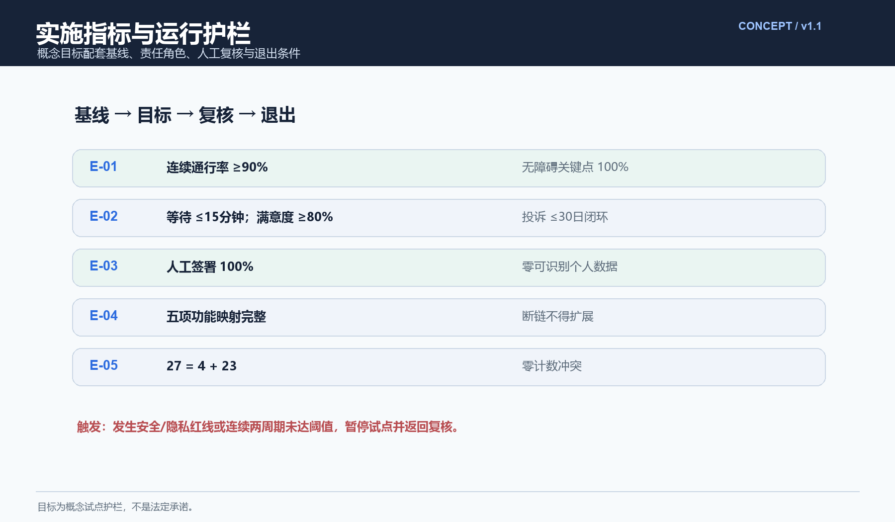

## 一带总体概念与功能统筹方案（概念草案）

> 编制说明：本草案为概念建议，仅引用公开可查证资料，不编造官方数据；不给出容积率、建筑高度、拆改留结论或工程可行性结论；统筹框架不替代沿线各片区既有规划。

## 方案名称与总体构想（概念）
**总体概念**：京章智轴——以京张铁路遗址公园绿带为轴的一带总体概念：一条贯通南北的记忆之轴、创新之轴、宜居之轴；以珠链状结构串联站点与片区，以绿带为轴的协同回路组织"产—学—城—人"的循环流动。

**主名称**：京章智轴。**英文名称**：MASTER·JZ，取 Metropolitan Axis of Smart Technology, Ecology & Rail（大都市尺度的科技—生态—铁路协同之轴）。

**命名体系**（原创，不含真实机构商标）："京章"谐音"京张"（Jing-Zhang，首字母JZ），兼取"篇章/印章"双关——京张铁路是中国自主设计施工铁路的开端之章，海淀是当代创新之章，一带如一方长印钤于城市；"智轴"指AI创新之智与绿带主轴。统一母题：汉字体系（枢、庭、环、章）与JZ编号体系（JZ-01…）并行；节点名总览枢、织核庭、绿链环；年度活动冠"京章+"前缀。

**视觉识别与Logo方向**（概念方向，非成品标识）：母题"一轴贯之、珠链成章"——贯穿性水平轴线（兼具铁轨与绿带意象）串联节点圆珠，整体轮廓如一方"城市之印"；辅助图形取连续线、圆点与律动网格（轨枕/等高线意象）。色彩方向：钢灰与锈红（铁路历史记忆）配海淀蓝与青绿（科创与生态），低饱和、克制；应用方向：导览标识、活动视觉与数字界面的统一版式系统，不指定具体成品。

**三大定位**：① 百年铁路记忆的公共活化之轴；② 全球AI创新协同的交往展示之轴；③ 蓝绿慢行宜居的未来示范之轴。

**任务书五大功能（原文维度）与方案空间功能（转译层）必须分列**。任务书的五大功能是目标维度；下表的“方案空间功能”是设计转译，不把两套清单混名。每一行均落到片区/节点、agent任务、场景卡、图件与运营机制，便于评审追踪。

| 任务书规定功能 | 方案空间功能（转译，不是同名替代） | 片区/节点 | agent任务与场景 | 图件与运营机制 |
| --- | --- | --- | --- | --- |
| AI全栈自主创新体系 | 全栈试验与要素协同廊 | 众智园AI自主创新加速区／北段绿链环 | agent.1、agent.2；S-06科研协同、S-08开发者测试 | 总览图、核心区图、metrics；开发者沙盒、数据/算力/人才协同评审 |
| 世界级AI创新生态 | 生态要素交换与国际展示界面 | AI原点社区／中段织核庭 | agent.2、agent.5、agent.6；S-02国际交流、S-09生态发布 | key-areas、A0/A3、visual；国际交流日、生态伙伴名录与季度复盘 |
| AI+场景赋能新范式 | 场景开放与公共体验带 | 小月河场景赋能翼／三节点串联 | agent.3、agent.4；S-03公共体验、S-04蓝绿感知、S-07慢行预测 | 蓝绿图、场景卡、HTML；场景准入、人工复核、公众反馈闭环 |
| 智能化AI活力城市 | 15分钟生活圈与蓝绿慢行服务网络 | 中段织核庭＋东西两翼 | agent.3、agent.4；S-01生活服务、S-05交通组织 | 慢行蓝绿图、A3；无障碍巡检、服务运营与错峰调度 |
| AI治理全球话语权 | 匿名聚合—人工复核—公开纠偏治理环 | 南段总览枢／全带治理接口 | agent.1、agent.3、agent.6；S-05治理复盘、T-02公开回应 | 指标图、visual、治理矩阵；年度公开评审、申诉与退出机制 |

> 任务书三大定位仍为：百年京张文化带、都市AI生活体验带、AI融合创新带；方案以文化记忆、创新活力、生态宜居作为空间表达层，二者也不混为同一字段。

**三区两翼协同回路**：三区为沿轴分段概念——北段文化记忆区（清河—清华东路段）、中段创新活力区（五道口—学院路段）、南段生态宜居区（知春路—西直门段）；两翼为东翼（学院路高校街区）与西翼（中关村西—上地科创街区）；回路以绿带为轴、站点为阀、片区为器：西翼产业创新→绿带与站点交往转换→东翼高校转化育才→回馈西翼，形成"产—学—城—人"闭环。

**总体空间结构与区域协同**（示意如下）：一轴、三区、多珠、两翼的珠链状结构。

```
一带总体空间结构示意：一轴 · 三区 · 多珠 · 两翼（珠链状）

                    北端：清河 · 上地（片区协同）
                            │
                  北段 ● 文化记忆区──「绿链环」慢行与蓝绿转换枢纽
                            ‖
           西翼 ◀──跨线缝合──‖ 绿带主轴：京张铁路遗址公园绿带 ──跨线缝合──▶ 东翼
（中关村西·上地科创街区）    ‖ 连续慢行轴 + 珠链节点     （学院路·五道口东高校街区）
                            ‖
                  中段 ● 创新活力区──「织核庭」功能复合与社区服务交织
                            ‖
                  南段 ● 生态宜居区──「总览枢」一带总体门户与统筹展示
                            │
                    南端：西直门 · 中关村（片区协同）

协同关系：主轴串联站点与片区，两翼以跨线缝合联动，
与中关村、五道口、学院路、上地、清河诸片区形成放射状协同网。
```

**唯一节点序列（北→中→南）**：

| 序位 | 概念节点 | 片区交叉引用 | 空间功能 | 可实施校验（概念目标） |
| --- | --- | --- | --- | --- |
| 1 北段 | 绿链环 / Green-Link Ring | `KEY-ZHON` 众智园AI自主创新加速区；`PS-LM00` | 试验要素协同、蓝绿慢行转换 | 基线：试点前两次工作日+周末步行无障碍审计。目标：连续通行率≥90%、无障碍关键点通过率100%；连续两次低于目标则暂停布置并复盘。 |
| 2 中段 | 织核庭 / Weave-Core Court | `KEY-BEIJ` AI原点社区；`PS-LM01` | 生态交往、社区服务与场景开放 | 基线：试点前4周客流、排队、满意度和投诉台账。目标：高峰平均等待≤15分钟、满意度≥80%；连续两周期未达标或出现未闭环安全/无障碍投诉则暂停场景。 |
| 3 南段 | 总览枢 / Overview Hub | `KEY-DAZH` 大钟寺AI产业集聚区；`PS-LM02` | 总体展示、治理复盘与公开回应 | 基线：数据字典、人工复核日志、意见回应时限台账。目标：AI输出人工签署率100%、公众回应≤30日；出现可识别个人数据或未经人工复核的自动决策即立即退出该试点。 |

三节点均为概念点位，不是法定设施指定；`geometry/public_space.geojson`、`geometry/key_areas.geojson` 已以 `north_south_order` 和 `related_concept_node_id` 固化上述交叉引用。

**综合规划思路**："空间产业融合"——以一带空间承载AI创新链（研究—转化—展示—应用—生活）全流程，功能分区与产业生态互为表里；"国土空间规划创新"——以城市设计导则作为上位规划与详细规划间的弹性衔接工具，探索功能兼容互认、绿带生态底线管控、分期弹性指标等方向，均为衔接建议，不替代法定规划。

## 设计依据与资料清单
资料清单所列公开史料、规划报道与通则规范等均为概念工作依据清单，并非本包已获取的数据；本包实际使用的全部数据见 sources.json，未获取项已在风险与缺失数据说明中如实标注。

设计依据：征集任务书及 agent.1 一带层面成果要求；公开资料口径，含京张铁路遗址公园公开建设信息、沿线地区既有规划公开摘要；京张铁路历史公开文献。资料清单：任务书与技术要求；公开规划与公开报道图纸；历史文献与照片；开源地图与开放数据；踏勘记录。原则：只引用可查证资料，不编造官方数据；本框架不替代沿线各片区既有规划。

> **证据锚点**：[source:DATA-SRC-OFFICIAL-ANNOUNCEMENT-20260509]、[source:DATA-SRC-AGENT-TASKBOOK-20260518]（组织方公告与任务书为文本口径依据）。

## 三层范围工作框架
三层成果逐级传导：统筹研究输出的带与沿线协同判断约束总体设计，总体设计校核的功能分区、协同回路与慢行贯通再落实到节点详设；每层均保留与任务书对应章节的机器可读证据锚点，便于评审对照。

三层递进：统筹研究范围——一带整体及中关村、五道口、学院路、上地、清河等片区，回答"带与城"协同命题；总体设计范围——绿带主轴及两侧功能界面，达控规深度城市设计；重点区域详细设计——按北→中→南为绿链环、织核庭、总览枢三个原创节点。三层自上而下传导方向、自下而上校核反馈，边界均为概念建议，随法定规划动态衔接。

> **证据锚点**：[source:DATA-SRC-AGENT-TASKBOOK-20260518]（三层范围划分依据任务书官方文本口径）。

## 统筹研究范围产业与未来城市研究
产业与城市研究识别一带的「统筹」效应：以绿带为轴把沿线高校、科创片区与国际化住区的功能需求有序组织为双向可达的协同回路，形成「一带—片区—街区」三级联动结构；未来城市研究仅作方向性预判，不构成对用地与投资的承诺。
研究一带与沿线高校、科创片区及国际化住区的协同：梳理"基础研究—技术转化—企业应用—公众体验"的AI创新链在沿线的空间落位；识别高校院所、科技企业、国际人才社区间的流线与交往需求，将一带定位为创新要素流动的"城市基础设施"。未来城市方向：产业社区化、空间复合化、绿色低碳化、数实融合化，突出韧性与弹性，以方向性建议呈现。

> **证据锚点**：[source:DATA-SRC-PROVISIONAL-BOUNDARIES-20260605]（边界为 provisional，研究范围仅作概念示意）。

## 总体设计范围城市更新与控规深度城市设计
总体设计强调「以绿带为骨架的总体概念框架」：依托京张铁路遗址公园绿带组织三区两翼空间结构（文化记忆区/创新活力区/生态宜居区与东西两翼跨线联动），对控规指标只做校核建议，不预设数值结论，统筹框架不替代沿线各片区既有规划。
以绿带为骨架构建总体概念框架：一轴（绿带主轴）、三区（文化记忆、创新活力、生态宜居）、多珠（站点与节点）、两翼（东西街区联动）、一环（以绿带为轴的协同回路）。功能分区落实"三区两翼"统筹，分段明确主导功能与兼容方向；更新方式为留改拆并举的概念口径。控规深度上输出城市设计导则方向（界面、体量关系、慢行、蓝绿底线），不给数值结论。






> **证据锚点**：[source:DATA-SRC-MOHURD-CONTROL-DETAILED-PLANNING]、[source:DATA-SRC-PROVISIONAL-BOUNDARIES-20260605]。

## 重点区域详细设计
三节点的设施选址均为概念点位，须经规划、文保与主管部门评估及专业审查后重新落位；节点间的绿带动线与慢行通道构成完整统筹动线，详细平面与剖面以图册与 geometry 层表达。下列顺序是唯一北→中→南表达。
以三个原创节点作为珠链上的示范珠：

- **绿链环**——慢行与蓝绿系统转换枢纽节点：概念选址北段绿带与横向绿廊交汇处，承担慢行换乘与蓝绿系统转换衔接。
- **织核庭**——功能复合与社区服务交织节点：概念选址中段五道口—学院路段，交叠站点、大学与社区服务，以庭院式交往空间组织多样功能。
- **总览枢**——一带总体门户与统筹展示节点：概念选址南端门户（西直门—知春路方向），集总体展示、运营统筹与铁路历史叙事起点于一体，是一带形象窗口。

节点选址与功能配比均为概念建议。




> **证据锚点**：[data:PACKAGE-GEOMETRY]（三节点示意多边形来自本包 geometry/key_areas.geojson）。

## AI 创新生态、人才画像与 AI+ 场景
整体运行态势AI可视化、功能区匹配度AI评估、绿带慢行流量AI预测为主干场景，每处均配置人工复核兜底；蓝绿空间感知AI、公众参与意见AI聚合为支撑场景；仅处理匿名聚合数据、关键决策人工复核双保险，不设过度监控。
AI创新生态：依托沿线高校与AI企业形成研究、转化、应用、展示的完整生态圈，一带提供交往、发布与体验空间；五类人才画像见附录A。五个AI+场景：① 整体运行态势AI可视化——匿名聚合运行数据的总览屏；② 功能区匹配度AI评估——用地功能与服务覆盖匹配分析；③ 绿带慢行流量AI预测——引导错峰均衡使用；④ 蓝绿空间感知AI——微气候、绿量与声环境感知；⑤ 公众参与意见AI聚合——建议聚类与公开回应。全部匿名聚合+人工复核，禁止过度监控，不采集个体身份。

> **证据锚点**：[source:DATA-SRC-GENERATIVE-AI-INTERIM-MEASURES]（AI 生成内容治理表述的参照依据）。

## 用地、建筑规模与拆改留方案
拆改留坚持留改拆并举：以留为主保留遗址公园肌理与铁路历史遗存，存量建筑功能置换为门户展厅、社区服务与配套，拆除仅限经个案论证的局部疏通慢行零星建筑；全部面积为概念口径，官方数据发布后复算。

概念口径：留改拆并举。**留**：保留铁路遗存、历史建筑与街坊肌理；**改**：以功能植入与空间提升转化既有建筑，优先承载创新交往与社区服务；**拆**：仅限经个案论证确无保留价值者，按法定程序推进。本方案不预设容积率、建筑规模与拆改量等数值，不出工程可行性结论；具体结论留待后续专题研究与法定程序，本框架仅提供研判口径与原则。

> **证据锚点**：[source:DATA-SRC-MNR-LAND-USE-CLASSIFICATION-202311]（用地分类名称参照现行国标口径）。

## 交通、轨道、市政与公共服务设施
以交通慢行优先为核心组织交通概念机制：沿绿带构建连续慢行轴按北→中→南贯通绿链环、织核庭与总览枢，东西两翼以跨线缝合衔接沿线高校、园区与轨道站点（接驳以步行与骑行为主，预留接驳专线与共享单车调度区），节事交通以轨道交通＋接驳为主、散场分时分区疏导、降低小汽车依赖；市政以集约共享为原则，优先利用现状设施条件；公共服务配置无障碍与多语服务、社区服务与研习空间，AI决策均设人工复核。

交通慢行优先：以既有轨道与公交站点为锚（不新增线路建议），绿带连续慢行轴贯通三个节点；东西向以跨线缝合（天桥、地道、路口改造）联结两翼街区，加密横向慢行联系，步行与骑行网络一体设计。市政：管线集约、绿带段地下化与海绵化布置为方向建议。公共服务：结合站点配置社区服务、文化、卫生、便民设施，构建15分钟生活圈。

> **证据锚点**：[source:DATA-SRC-MOHURD-URBAN-DESIGN-MEASURES]（市政与慢行设计表述的方法参照）。

## 蓝绿空间、公共空间与城市风貌
构建「绿带为轴、节点公园为珠」的蓝绿公共空间体系：以遗址公园绿带为蓝绿骨架串联沿线小微绿地与开敞空间，形成连续成网的生态与公共空间体系；文化装置与公园融合布置、宜轻宜透宜可逆，不遮挡历史遗迹与绿带视线；指示与解说系统统一克制；风貌延续京张铁路工业记忆语汇并与科创氛围对话，整体风貌导控克制统一，避免符号堆砌与口号化包装。

蓝绿公共空间连续成网：绿带为脊，横向绿廊、小微绿地、校园与社区绿地织网，形成连续体系；以遮荫、海绵、降噪提升舒适度。风貌导控克制统一：色彩、材质、标识、街道家具统一母题，历史意象（铁轨、锈色、站房语汇）与现代科创气质并置；夜景、公共艺术与导览系统遵循同一版式语言，不指定具体样式。


> **证据锚点**：[source:DATA-SRC-MOHURD-URBAN-DESIGN-MEASURES]（蓝绿空间组织的方法参照）。

## 更新项目清单、实施政策与分期计划
四类项目清单（统筹平台/慢行贯通/存量植入/蓝绿织补）为概念清单，规模与投资估算均为建议性表述；政策建议（功能准入与统筹、多元主体共建、意见复核机制）均须依法依规论证，不构成政府或运营方承诺。

近期（1—3年）：贯通绿带断点，先做绿链环与北段要素协同试点；中期（3—5年）：实施织核庭并完成主要跨线缝合；远期（5—10年）：完善总览枢治理展示、全线功能统筹与年度运营机制。年度活动：一带总体开放日、功能统筹工作坊、慢行蓝绿体验季。每个试点先基线、再小范围运行、人工复核后扩展；未达阈值或触发隐私/安全红线即暂停并退出。实施政策方向：分区统筹、社区参与、弹性更新、试点先行，均为建议。

> **证据锚点**：[source:DATA-SRC-AGENT-TASKBOOK-20260518]（分期与实施条目对应任务书要求）。

## 指标体系、面积复算与合规矩阵
功能统筹覆盖度、慢行贯通度、蓝绿空间连续度、公众参与人次、节点可达性五类概念指标体系进入 metrics.json；面积复算以官方文本口径为底，官方数据到位后整体复算并标注复算版本。试点指标均为待校准的概念目标，不是行政审批或工程结论。

指标体系概念框架：绿带连续度、慢行连通率、蓝绿开敞率、功能混合度、节点可达性、公众满意度、AI场景有效运行率等。面积复算：`geometry/land_use.geojson` 实际含 27 个 Feature，其中 4 个命名汇总/廊道要素、23 个 `LU-G` 基础区块；`metrics.json` 的唯一公式为 `count(features) == 27`，不把两类几何面积相加，也不再使用另一套区块计数。合规矩阵：逐项核对上位规划、片区既有规划、生态与文保要求，明确"统筹不替代、衔接不冲突"；列出需后续专题与法定程序确认的事项清单。

### 可实施证据表（概念试点，不替代法定程序）

| 编号 | 基线 | 目标阈值/容差 | 责任角色 | 退出条件 | 证据与复核 |
| --- | --- | --- | --- | --- | --- |
| E-01 绿链环 | 两个工作日+一个周末时段的步行、骑行、无障碍审计 | 连续通行率≥90%；关键无障碍点通过率100%；人工复核覆盖100% | agent.3/4 提交；空间运营方执行；社区代表与无障碍专业复核 | 连续两观察窗低于阈值，或出现未闭环安全事件，立即暂停并回滚试点布置 | `PS-LM00`、慢行蓝绿图、复核日志 |
| E-02 织核庭 | 试点前4周匿名客流、等待、满意度、投诉台账 | 高峰平均等待≤15分钟；满意度≥80%；投诉30日内闭环率100% | agent.2/3 设计；社区/运营方管理；人工评审签署 | 连续两周期不达标，或安全/无障碍投诉未闭环，暂停场景 | `PS-LM01`、场景卡、公众回应记录 |
| E-03 总览枢 | 数据字典、AI输出清单、人工签署和公众回应时限基线 | AI输出人工签署率100%；回应≤30日；零可识别个人数据 | agent.1/6 统筹；数据保护与专业顾问复核；公众监督 | 任何可识别数据、未签署自动决策或超范围用途，立即退出 | `PS-LM02`、治理日志、公开复盘页 |
| E-04 五大功能映射 | 逐项检查任务书功能—空间转译—片区/节点—agent—场景—图件—运营链 | 五项均有可追踪证据；缺一项不得扩展试点 | agent.1牵头，agent.2—6分工，项目负责人签署 | 映射断链或把任务书功能与空间功能混名时，退回修改 | 本表、合规矩阵、A0/A3、双语HTML |
| E-05 用地清单 | `len(land_use.geojson.features)` 直接复算；记录汇总/廊道与基础区块角色 | 27=4个汇总/廊道+23个 `LU-G`；零计数冲突 | agent.1/2 数据管理员复核；规划专业人员确认分类 | 要素数或角色标注改变而未同步正文/图件/指标，冻结发布 | GeoJSON、metrics、land-use图、manifest |

> 角色与阈值是概念试点的操作护栏；正式实施前需完成主管部门、文保、无障碍、安全、数据保护等专业审查。




> **证据锚点**：[metric:land_use_zone_count]、[data:PACKAGE-GEOMETRY]、[depth:metrics_recalculation]。

## 风险、版权与合规说明
本方案为概念研究性设计，不构成行政审批依据，也不构成容积率、建筑高度、拆改留或工程可行性结论；风险已按一带整体交通组织与跨线慢行衔接、运行感知与公众参与数据边界、AI可视化与评估技术成熟度、统筹口径与公众接受度四维度如实登记于 risk.json（应对原则：匿名聚合、最小必要、人工复核、来源标注与意见通道）；引用公开资料均已标注来源并注明获取时间，图形、名称与文字为原创或公共领域素材，若与既有标识雷同属巧合；统筹框架不歪曲历史事实、不替代沿线各片区既有规划，未经授权不使用肖像商标论文图像等版权材料；正式实施前须完成多部门联审、文物保护与安全评估。

风险：公开口径偏差、与既有规划衔接冲突、实施协同与资金压力、AI伦理与隐私；应对：仅用可查证资料、预留规划弹性、匿名聚合+人工复核、试点先行。版权：本草案文字、命名（京章智轴/MASTER·JZ）与概念为作者原创，不含真实机构商标，未侵犯第三方权利。合规：全文为概念建议，不构成规划、拆改或工程结论，不替代沿线任何法定规划。

> **证据锚点**：[source:DATA-SRC-OFFICIAL-ANNOUNCEMENT-20260509]（征集规则为权属与合规表述的依据）。

## 参考资料
参考资料以政府正式发布版本为准，按公开/内部分类存档并标注获取时间：京张铁路历史与遗址公园公开材料（含詹天佑与京张铁路公开史料口径）、中关村创新文化公开资料、北京城市总体规划及分区规划公开口径、国内外线性公园带与城市功能统筹公开案例（The High Line、清溪川、巴黎绿荫步道、Zollverein及首钢园、751、杨浦滨江、天府绿道）、现场踏勘记录与自绘分析草图（本项目自行采集）；本包 sources.json 仅收录可查证条目，未虚构任何官方数据或链接。

以公开可查版本为准，引用注明出处：京张铁路沿革与京张铁路遗址公园公开报道及图纸；沿线各区既有规划公开摘要；国际案例公开资料（纽约高线公园、首尔清溪川、巴黎绿荫步道、新加坡铁道走廊）；国内对标公开资料（北京首钢园、北京751、上海杨浦滨江）；开源地图与开放数据平台。本草案不引用未公开信息，不编造数据。

---

> **证据锚点**：[source:DATA-SRC-OFFICIAL-ANNOUNCEMENT-20260509]（本清单首条即组织方公开资料包）。

## 附录A：五类用户画像

| 画像 | 人群 | 核心需求 |
| --- | --- | --- |
| 创新从业者 | 中关村、上地等园区及沿线AI企业员工 | 通勤慢行、交往发布、午间游憩 |
| 高校师生 | 学院路、五道口周边高校师生 | 慢行通学、自习交往、平价服务 |
| 社区居民 | 沿线住区及国际化住区居民 | 日常游憩、社区服务、蓝绿景观 |
| 来访访客 | 会展、旅游及国际交流访客 | 文化体验、导览服务、门户形象 |
| 运营与公众参与者 | 政府、运营机构、市民 | 数据决策、参与共建、活动供给 |

## 附录B：国际案例（4个）

- **纽约高线公园**：废弃高架铁路改造为线性公园，以公共艺术与分期建设带动周边更新，验证"线性遗产+功能统筹"模式。
- **首尔清溪川**：拆除高架、复原河道，以蓝绿空间复兴带动中心区功能统筹与生态修复。
- **巴黎绿荫步道**：既有铁路线改造为连续步行绿道，示范低干预、长距离慢行贯通。
- **新加坡铁道走廊**：原铁路线转为连续绿廊，公众参与式规划，联动沿线社区更新。

## 附录C：国内对标（3个）

## 区域协同接口与研究假设（可核验机制表）

本带不把跨区域关系写成已确认合作。下表的“责任”是建议的接口角色，不代表机构已承诺；未有授权、协议或正式数据的部分统一标为研究假设。交换的不是未经许可的个人数据，而是公开资料、脱敏的统计口径、场景方法与复核结果。

| 协同对象 | 交换要素 | 空间接口 | 运营接口 | 建议责任 | 不确定性 |
| --- | --- | --- | --- | --- | --- |
| 北纬社区 | 社区议题、公示意见、无障碍观察清单 | 社区入口—绿链环步行接驳；不主张新增道路红线 | 月度议事、匿名汇总、人工回访 | 社区议事方+方案运营方 | 研究假设；需居民授权与正式边界 |
| 未来科学城 | 开源测试方法、场景需求、可复用组件 | 以线上方法交换和节点展陈为主，不推断轨道/道路新增 | 季度案例交换、失败样本复盘 | 测试组织者+专业团队 | 研究假设；主体、数据和场地未确认 |
| 怀柔科学城 | 科研伦理模板、实验评估方法 | 通过公共展示与远程协作接口，不替代科研设施规划 | 年度开放日、伦理与安全评审分享 | 科研协作方+人工复核小组 | 研究假设；无合作或数据授权证明 |
| 经开区 | 产业问题卡、测试输出格式、人才需求 | 大钟寺总览枢作为展示接口，不宣称产业迁入 | 招引线索登记—人工筛选—复盘 | 产业服务方+运营方 | 研究假设；不承诺招商、资金或产值 |
| 京津冀 | 可迁移场景卡、双语传播材料、公共利益指标 | 以线上开放台和铁路文化叙事相连，不绘制跨域工程线路 | 年度跨域场景开放台、公开评审 | 传播与知识库维护方 | 研究假设；区域合作机制待确认 |

## 可人读的全带地理总图与节点放大说明

`assets/figures/regional-coordination.png` 是全带研究总图：以 provisional 场地边界为灰色虚线，标出北—中—南三节点、现状道路接口、轨道站点接口、绿带连续性、社区/公共服务入口和保护/控制条件的“待核”图例；`assets/figures/node-zooms.png` 将绿链环、织核庭、总览枢分别放大。图中不绘制新的道路红线、轨道线位或工程设施，所有距离和落位均为非红线的参考关系，待官方 GIS/CAD、文保、交通、市政和权属资料到位后复核。

## agent.2：八要素机制与全球案例（实际交付）

新增案例用于比较机制而非复制品牌：G05 Amsterdam AI Register（公开算法登记与问责，来源 `sources.json`，不可移植条件是法律/机构体系不同，对应总览枢治理展示）；G06 Helsinki AI Register（城市 AI 用例透明登记，来源 `sources.json`，不可移植条件是公共数据制度和语言环境不同，对应北纬社区公示）；G07 Montreal Mila（研究—人才—产业协作网络，来源 `sources.json`，不可移植条件是机构与资助结构不同，对应织核庭开发者社区）。既有 G01—G04 同样逐项记录来源、借鉴机制、不可移植条件和京张节点；总计 7 个，不把企业名单、投资额或合作关系写成事实。

八要素机制图按“土地—空间—产业—资金—人才—算力—数据—场景”串联：土地只作为 provisional 接口分类；空间提供三节点和两翼的可逆公共体验；产业用问题卡进入测试；资金只登记公开、待核的资源类型；人才以贡献者和开发者社区参与；算力只写算力服务类型，不宣称容量；数据只接收公开或脱敏聚合数据；场景通过 S01—S10 进入基线—小试—人工复核—公开复盘。`assets/figures/ecosystem-eight-factors.png` 以八个环形节点和四个决策门呈现该机制。

## agent.3：十张独立场景卡与场景—空间—用户—运营矩阵

每张卡均为概念测试建议，数据边界为公开/脱敏聚合；模型输出不能自动决定公共资源，责任人必须人工复核。阈值是触发复核的概念门槛，不是实测基线。

| 卡片 | 场景/空间 | 用户 | 数据边界与模型任务 | 输出/责任/复核 | 阈值、失败与退出 |
| --- | --- | --- | --- | --- | --- |
| S01 | 报名分流/绿链环 | 居民、访客 | 匿名时段计数；分配建议 | 排队提示/运营员/人工确认 | 等待趋势异常→人工限流；越权即停 |
| S02 | 多语导视/三节点 | 游客、听障者 | 公开文本；翻译与易读改写 | 双语卡/导视员/抽检 | 术语错误→撤回并人工改写 |
| S03 | 代码共创/织核庭 | 开发者、学生 | 自愿提交代码与许可；风险分类 | 测试报告/测试负责人/安全复核 | 依赖未清权→隔离，不公开 |
| S04 | 企业问题诊所/总览枢 | 企业、青年 | 脱敏问题卡；主题匹配 | 资源清单/产业服务方/人工转介 | 匹配置信不足→人工重分 |
| S05 | 荣誉贡献展/回路长廊 | 贡献者、公众 | 公开署名与授权；摘要生成 | 展陈卡/策展人/权利复核 | 权利不明→不展示 |
| S06 | 人流提示/公共入口 | 老人、照护者 | 匿名密度等级；趋势提示 | 纸质/屏幕提示/现场人员 | 连续异常→人工巡查；拒绝采集即退出 |
| S07 | 京张记忆路线/遗址公园 | 儿童、游客 | 公开史料；路线叙事 | 分龄导览/文化讲解员/史实核对 | 史料冲突→下线待核 |
| S08 | 蓝绿巡检/绿带 | 志愿者、维护方 | 公开观察表；问题分类 | 工单草案/维护责任人/人工验收 | 无授权拍摄→删除并停用 |
| S09 | 人才—企业转化/代码坞 | 高校、企业 | 自愿简历标签；不做个体画像 | 机会清单/社区管理员/本人确认 | 不匹配→人工撤回，不自动推荐 |
| S10 | 跨域开放台/线上 | 京津冀参与者 | 公开案例与脱敏结果；相似机制检索 | 案例包/知识库管理员/年度公示 | 来源缺失→不入库 |

产业测试协议固定为 T01（代码共创安全：开源许可/依赖扫描→输出风险清单→测试负责人复核→高风险隔离并退出）、T02（多语无障碍导航：公开文本/人工标注→输出双语易读卡→无障碍专员抽检→误导或投诉超门槛即撤回）、T03（企业问题到场景：脱敏问题卡→输出可测试任务和停止条件→产业服务方与人工评审签署→无授权、无法解释或无受益人即停止）。三个协议均不需要指定供应商，不收集个人敏感信息，不代表已获场地或运营批准。

## agent.4—agent.6：空间、文化与长期运营实际交付

三处 AI 地标为“京张论坛广场”（L01，公共议事与双语开放日）、“代码坞”（L02，开发者共创与可逆展台）、“回路长廊”（L03，铁路记忆与贡献展）；均是模块化概念，不触碰文保本体、绿线蓝线或权属建筑。荣誉展示采用贡献者自愿署名、来源卡、版本号、人工策展和年度撤展复核五件套。组件库包括可拆导视牌、纸质任务卡、无障碍座椅旁的人工服务牌、可逆展台、夜间低亮度标识和投诉二维码/纸质替代，不把组件写成工程承诺。

开发者社区采用“注册—公约—小组—代码/场景贡献—人工评审—公开复盘—贡献记忆”的链路；场景开放采用申请、数据边界审查、有限试运行、人工签署、公众反馈、年度公示六步。国际招引—落地—留存转化只做概念机制：公开案例吸引→双语问题卡→人工匹配→短期测试→合规复盘→贡献者回访；资源角色为社区主持、测试负责人、无障碍专员、数据保护顾问和文化策展人，成本只登记“人员工时、翻译、印刷、可逆展陈维护”等资源类别，不编造金额。年度复盘发布参与、投诉、退出、无障碍修复和知识资产沉淀五类指标，未达目标则暂停或改版。

## 全龄与非数字替代旅程

老人可从纸质地图、人工问询台和座椅休息点进入，不要求手机；儿童与照护者使用分龄纸卡、可见路线和人工讲解，不采集儿童身份；行动障碍者获得平整路径信息、人工陪同和替代入口；视听障碍者获得大字、字幕、手语/文字服务和触觉提示；认知障碍者获得单步指引、颜色/符号重复和陪同确认。每个场景都保留纸质预约、现场排队、人工投诉、电话/柜台转介和关闭自动化建议的选项；这些是概念服务设计，必须由无障碍与安全专业人员后续核验，不能写成已达标。

## 权利边界与概念数据流

名称与 Logo：`京章智轴 / MASTER·JZ` 为本方案概念命名，使用前须做商标近似检索；字体仅使用包内本地字体或系统回退。图件由本方案生成，外部底图/史料/案例按 `sources.json` 记录来源、许可、用途和署名；数据只使用公开、授权或脱敏聚合材料；代码测试遵循提交者声明的开源许可，不把第三方代码并入展示。数据流为“自愿提交/公开资料→最小化与脱敏→本地规则/模型建议→人工复核→匿名结果公示→投诉/撤回→年度删除或归档”，禁止个体识别、自动处罚和无法人工终止的决定。指标主视觉采用四舍五入的临时设计模型值，原始可复算值仅在机器文件保留，并在每个指标组就近标明“provisional、非官方红线、官方数据到位后复算”。

## 统一分期版本与双语核对

本包唯一分期版本为 `PHASE-1.0`：近期 1—3 年先做绿链环与北段要素协同试点；中期 3—5 年做织核庭与主要跨线缝合的概念深化；远期 5—10 年完善总览枢、全带开放台和年度治理复盘。proposal、compliance_matrix、design_depth_matrix、phasing 图层、HTML 与 A0/A3 均按此顺序；此前“近期总览枢”的摘要已视为过期，不再使用。中英逐项核对清单覆盖定位、五功能、三节点顺序、10 张卡、T01—T03、指标、provisional 警示、责任与退出条件；任一翻译缺项都回到正文修订，不以 `translation_of` 字段替代人工核对。

- **北京首钢园**：工业遗存大规模活化，以重大事件为契机的功能统筹与分期实施。
- **北京751**：铁路与厂房遗存之上的设计创意集聚，证明"遗产+产业"路径可行。
- **上海杨浦滨江**："工业锈带"转"生活秀带"，连续公共空间贯通的人民城市实践。
