> Section note: this proposal is conceptual research advice. It does not replace statutory planning and provides no conclusion on FAR, building height, retain-renovate-demolish figures, budget, visitor capacity or engineering feasibility. All statements follow published public sources only and are recomputed item by item once official data is published.

## Design Basis and Source List
The design basis relies on public sources: the official call document and agent taskbook text for the Centennial Jingzhang AI Innovation Belt, public archives on Jingzhang railway history, public introductions of the universities, institutes and tech parks along the corridor, and current standards on public signage and accessible slow traffic. The source list distinguishes two categories: verifiable materials already obtained and registered in sources.json; and materials to be collected during the formal phase - site survey imagery, licensed old station photographs, oral-history interview records and sound-environment baseline data. The latter are a planned-collection list, not data already in this package; they must not be treated as cleared implementation assets before acquisition, and the gap is honestly recorded in the risk and missing-data note.

References follow official published versions only: the textual extent and area figures of the announcement may support concept generation and display but cannot replace official geographic geometry. Historical narrative statements are subject to a fact-check post; any fact that cannot be verified is explicitly demoted to a research hypothesis. This draft does not replace statutory planning documents, and cited versions are confirmed item by item in the formal phase.

> **Evidence anchors**: [source:DATA-SRC-ANNOUNCEMENT-2026-05-09], [source:DATA-SRC-AGENT-TASKBOOK-2026-05-18], [source:DATA-SRC-PROVISIONAL-BOUNDARIES-2026-06-05].

## Three-Level Scope Framework
The official three-tier scopes are: coordinated research area approx. 43.6 km2, overall design area approx. 11.4 km2, and key detailed-design areas approx. 368.4 ha (textual caliber of the call announcement; positional reference only until official geometry is published). This concept sits under the three tiers: the overall-design green belt forms the spine of the narrative wayfinding system, and the three key-area nodes are the deep-design objects. All geometry is shown on provisional boundaries and is recomputed in full - figures and metrics included - once official drawings are published.

The framework cascades tier by tier: the coordinated research delivers judgements on the belt's synergy with science-zone districts, universities and international residential areas, which constrains the overall design; the overall design verifies green-belt continuity, land-use compatibility and placement guidelines, which are then carried into node-level detail; node pilots feed renewable samples back to the whole. Every tier keeps machine-readable evidence anchors, geometry layers and metrics mapped to the taskbook sections for review traceability.

Until official geometry is published, the three-tier areas serve as textual positioning only. Each tier carries "concept sub-zones" (green-belt spine segments in the overall design scope; three node units in the key areas), all marked provisional. When the official three-tier polygons are published, the containment relation between sub-zones and official scopes is checked first, then everything is recomputed in full. The output carriers of every tier (figures, metrics, matrices) follow one shared caliber so data never conflicts across tiers.

> **Evidence anchors**: [source:DATA-SRC-ANNOUNCEMENT-2026-05-09] (official textual caliber of the three scopes and areas), [metric:site_area_sqm], [data:geometry/site_boundary.geojson#SITE-001].

## Coordinated Research Area: Industry and Future City Research
The coordinated research treats the narrative wayfinding belt as a public narrative carrier linking science-and-technology districts: historical clues are organised by station, contemporary clues by innovation, and the two threads form a continuous reading of "centennial Jingzhang - future AI". A regional synergy loop (concept) builds linkage hypotheses towards Beiwei Community, Future Science City, Huairou Science City, ETDZ and Jing-Jin-Ji in line with the taskbook, identifying a three-tier "belt - district - community" structure that channels historical awareness, cultural consumption and science-park visits into public services and industry spaces along the corridor.

The industry and future-city research identifies the belt's "readability" effect and three testable values: visit-conversion effectiveness for industry attraction, a city-quality signal for talent, and a long-term content supply for operations. It therefore sets differentiated mechanism hypotheses for the Zhongzhiyuan AI Acceleration Zone, the Beijing AI Origin Community and the Dazhongsi AI Industry Cluster, and provides three industry test scenarios (see the "Industry Test Scenario Protocol" section) to verify these hypotheses in a verifiable way. Future-city research is directional judgement only and constitutes no commitment on land use or investment.

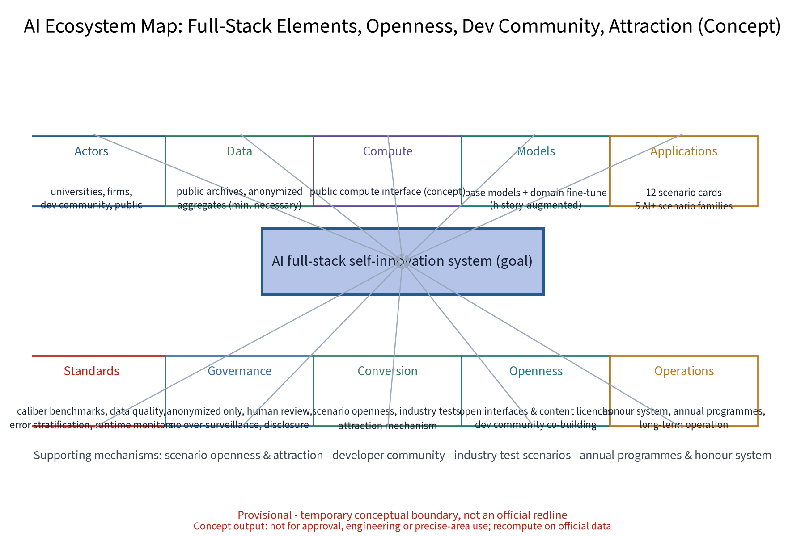

> **Evidence anchors**: [source:DATA-SRC-PROVISIONAL-BOUNDARIES-2026-06-05] (provisional boundary), [metric:industry_test_scenario_count].

## Overall Design Area: Urban Renewal and Regulatory-Plan-Level Urban Design
The overall design takes the heritage green belt as its spine and embeds the wayfinding system as a city-design element: a three-level narrative hierarchy (whole-line, segment, node) runs along the slow axis with a unified railway-industrial vocabulary (rail components, spikes, signal colours, old-style lettering). Signage points, slow-traffic rest spaces and view corridors are organised together into a recognisable, readable, renewable continuous experience, with replaceable generic interfaces reserved for digital content. Regulatory-plan-level methods are used only to check land-use compatibility, green-belt continuity and placement guidelines; no numeric conclusions are preset.

The taskbook's three positionings (Centennial Jingzhang Culture Belt, Metropolitan AI Living & Experience Belt, AI-Integrated Innovation Belt) and five functions (AI full-stack self-innovation system, world-class AI innovation ecosystem, AI+ scenario empowerment paradigm, intelligent AI vibrant city, global voice in AI governance) are mapped in this scope into the "one belt, three stations" overall concept and the "three zones, two wings" synergy structure: the three zones are the Zhongzhiyuan AI Acceleration Zone, the Beijing AI Origin Community and the Dazhongsi AI Industry Cluster; the two wings are the Zhongguancun Tech-Service Wing and the Xiaoyue River Scenario Wing (conceptual mapping; mechanisms in the synergy-loop figure). All signage facilities use a modular, reversible, renewable system that forms a reusable public-space component library (annex table).

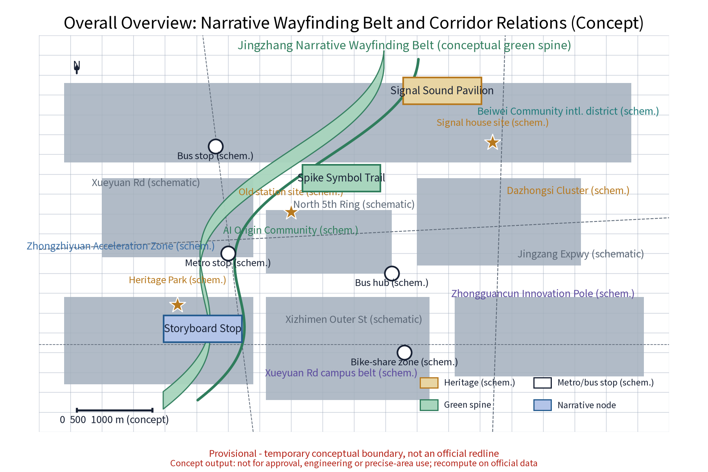

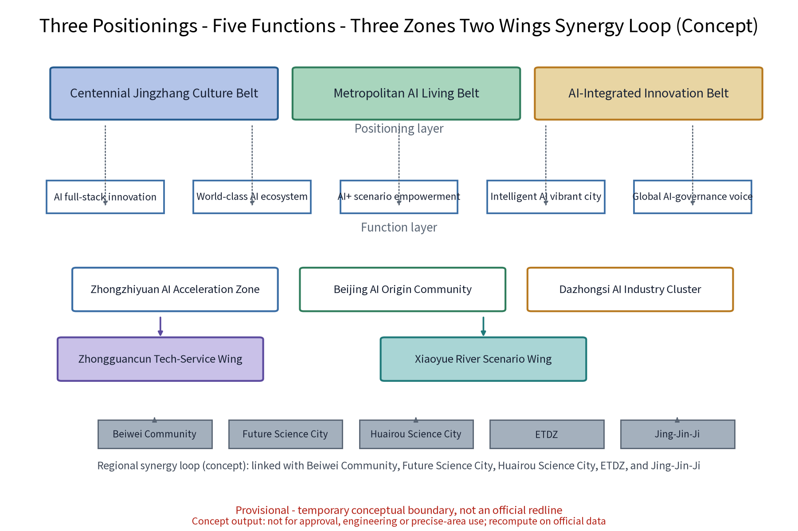

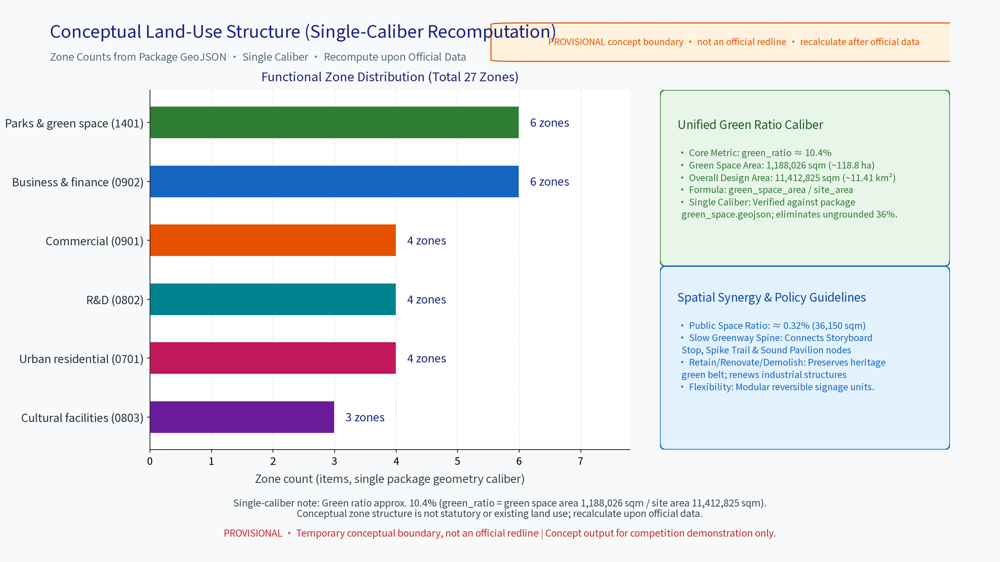

> **Evidence anchors**: [source:DATA-SRC-MOHURD-URBAN-DESIGN-MEASURES], [source:DATA-SRC-MOHURD-CONTROL-DETAILED-PLANNING], [source:DATA-SRC-PROVISIONAL-BOUNDARIES-2026-06-05].

## Detailed Design of Key Areas
All three nodes are concept locations subject to statutory, heritage and department review before relocation; the green-belt route between them forms a complete narrative. Node 1 "Storyboard Stop": a concept derivation of the old station-board form (never a replica) with AR overlays of old platform views and oral-history audio in a dwell-friendly story pavilion. Node 2 "Spike Symbol Trail": spikes, rails and mileage symbols translated into ground graphic signs marking station distance, years and line progress, doubling as wayfinding and walk-timing. Node 3 "Signal Sound Pavilion": railway signal sounds as a soundscape clue with multilingual audio guide and Braille/tactile information; sound and text complement each other, with volume levels and quiet hours.

Every node comes with plan, section, continuous accessible route, and view/sound influence diagrams (see figures), covering all-age accessibility, wheelchair turning circles, alternative paths for sensory-impaired users and noise checks for adjacent sensitive points. The nodes also host the honour system: visitors who complete the whole-line narrative check-in and residents who keep contributing oral histories or co-created content may receive the "Zhanghen Honour Badge" (conceptual mechanism), encouraging long-term participation over one-time consumption.

**Scenario card index (12 cards, concept)**: AI+ scenarios are delivered as scenario cards forming a reviewable, iterable operating index.

| Scenario Card | Location | Target Audience | Operating Mechanism (concept) | Data & Compliance Boundary | Non-AI Fallback |
|---|---|---|---|---|---|
| S1 "Storyboard" AR old-photo guide | Storyboard Stop | Visitors, students | Booked tours, fact-check review | On-device processing; no individual identifiers kept | Printed old-photo boards and human guides |
| S2 Spike Trail walk-timing path | Spike Symbol Trail | Commuters, office workers | Mileage points, rotating themes | Passive pavement symbols; no sensing | Mileage marks engraved in paving |
| S3 Signal Pavilion multilingual guide | Signal Sound Pavilion | Elderly, cross-language travellers | Volunteer shifts, human backstop | Audio cached locally; consent shown; one-touch mute | Braille/tactile board and phone guide |
| S4 AR old-scene reconstruction | Heritage points along the line | Rail fans, families | Content filing, labelled reconstruction | Reconstructions forcibly labelled "illustration" | Light-box historical images (public domain) |
| S5 "Inspection Post" facility inspection AI | All signage along the line | Operators, staff | Dispatch repairs, annual review | Anonymized aggregates, human review | Manual inspection rosters |
| S6 "Density" dynamic sign allocation | Key nodes | Visitors, families | Real-time disclosure, council solicitation | Aggregate density only; no individual tracking | Fixed-schedule releases |
| S7 "Messenger" AI translation assistant | Service points | Cross-language travellers | Volunteer alliance support, error stratification | Anonymized; human review of key decisions | Multilingual desks and paper cards |
| S8 "Quiet Verse" text-first guide | Whole line | Sensory-impaired, quiet-preference users | Quiet-hour covenant, rotating texts | No sound capture; text only | Tactile maps and large-type booklets |
| S9 Oral-history workshop and transcription | Communities and nodes | Residents, elderly | Informed consent, withdrawal records | Authorized anonymization; withdrawable | Manual transcription and archiving |
| S10 Co-creation festival sign design | Public space | Children, families, universities | Points redemption, annual disclosure | Display authorization shown | Offline drawing votes |
| S11 "Archive Lamp" fact-check desk | Storyboard Stop | Scholars, researchers | Fact-check post, appeal channel | Public literature citations with sources | Catalogue lookup at libraries |
| S12 Event-way guidance | Whole line | Visitors, merchants | Booking checks, tiered guidance | Anonymous totals; no over-surveillance | Static signs and human marshalling |

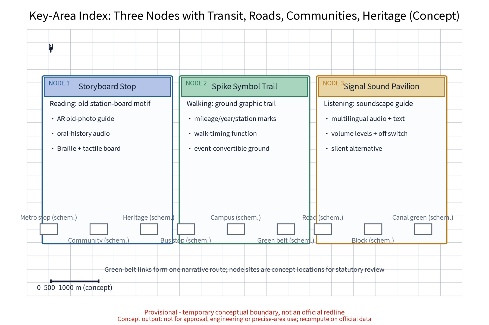

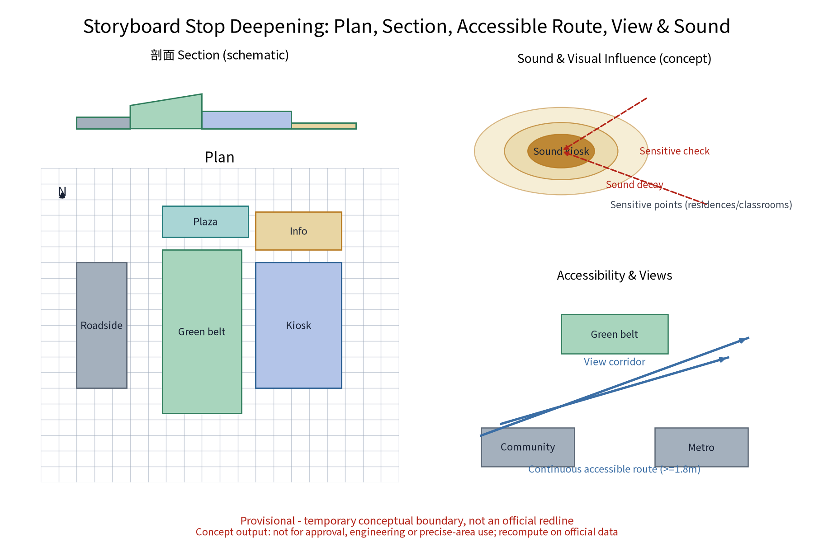

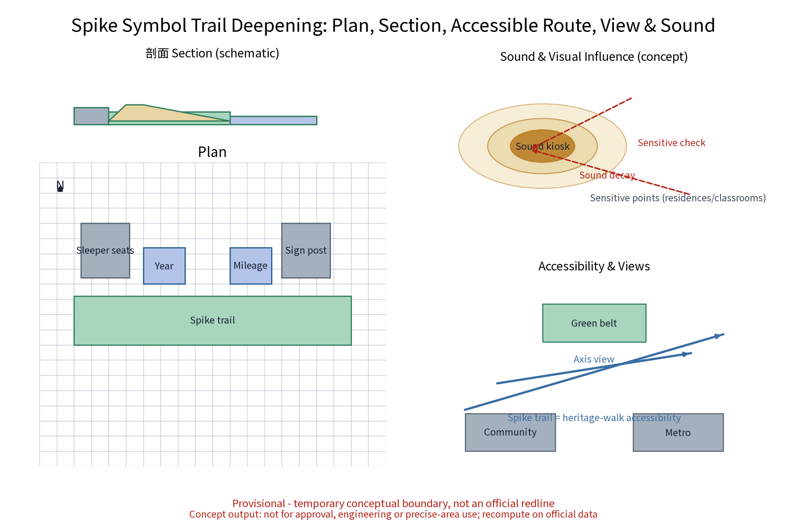

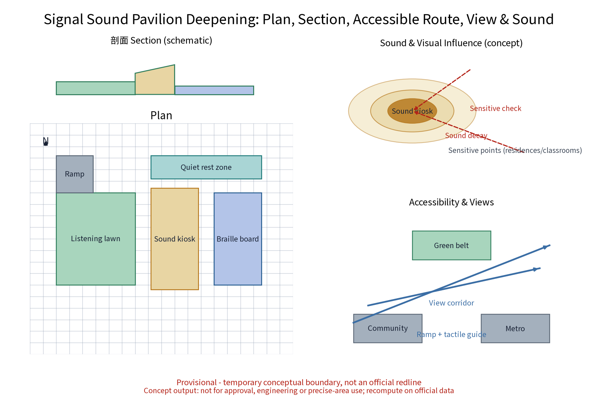

> **Evidence anchors**: [data:geometry/key_areas.geojson#KEY-ZHON], [data:geometry/key_areas.geojson#KEY-DAZH] (concept node polygons); node count in [metric:scenario_node_count].

## AI Innovation Ecosystem, Personas, and AI+ Scenarios
Every AI scenario follows three governance bottom lines: anonymized aggregation only, human review of key decisions, and no over-surveillance. The twelve scenario cards cover six AI x planning domains: culture, public services, space, governance, industry and transport. AI culture - AR old-scene reconstruction and soundscape narrative; AI public services - multilingual guidance and accessible information; AI space - wayfinding system and green-belt route; AI governance - content review, data-rule disclosure and filing; AI industry - digital content library, scenario openness and attraction mechanisms; AI transport - dwell prompts and route recommendations. AI does not change the narrative itself; it only lowers the reading barrier.

The AI technical protocol (concept) fixes four machine-measurable baselines: model evaluation uses historical accuracy and multilingual translation quality as admission benchmarks; data quality requires traceable sources and a single caliber; error stratification is reported by persona and time slot and enters the monthly disclosure; runtime monitoring covers false-alarm rate, integrity rate and human-review coverage. Every AI scenario has a paired non-AI fallback path (last column of the card table), so service continues during network loss, mute mode or device failure.

Personas are organised around five talent groups (see "Five Personas and AI Scenario Mapping"): Morning Readers (university students, faculty and researchers), Midday Wanderers (tech-park workers), Cross-language Travellers (international scholars, students and international-district residents), Weekend Families (local residents and parent-child groups) and Rail Fans & City Walkers (railway enthusiasts and city-walk crowds). Personas drive scenario-card prioritisation, continuous-journey tests and co-creation representation quotas - never individual identification.

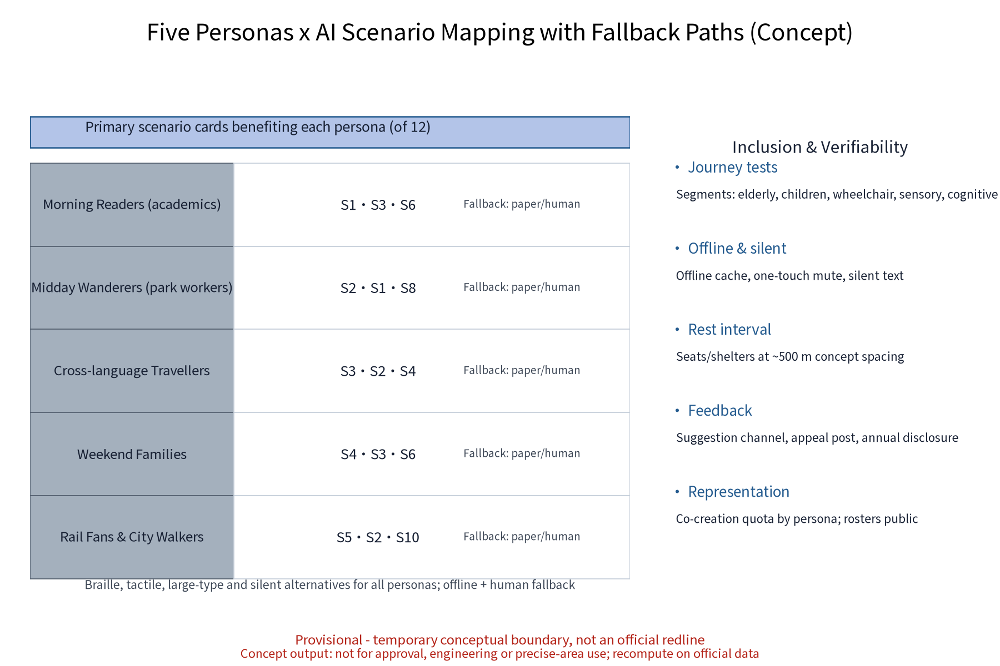

> **Evidence anchors**: [source:DATA-SRC-GENERATIVE-AI-INTERIM-MEASURES], [source:DATA-SRC-BARRIER-FREE-ENVIRONMENT-LAW], [metric:persona_count].

## Land Use, Building Scale, and Retain-Renovate-Demolish Strategy
The retain-renovate-demolish approach keeps, renovates and demolishes in parallel: heritage green belt, historically valuable station buildings and industrial structures are retained first to continue the railway memory; inefficient factory and park buildings are renewed in function; demolition is limited to scattered dilapidated buildings proven case by case and always through statutory review. This proposal presets no land-use scale or building-area figures and no retain-renovate-demolish ratios; all statements use a concept caliber and are recomputed once official data is published.

To remove misleading precision: all areas and ratios in this proposal are shown rounded, marked low-confidence, and explained with their formula and scope of application; ratios and counts are plotted separately (counts in the metric-evidence figure); the conceptual land-use structure is never presented as existing or statutory land use. All signage facilities are reversible and relocatable to minimise permanent intervention and keep flexibility for subsequent statutory planning. Building scale is expressed only as the principles of light intervention, reversibility and renewability.

The green-ratio caliber is fixed as one auditable chain inside this package. The numerator is not the number or area of code-1401 features in `land_use.geojson`; it is the EPSG:4548 union area of the six `GREEN_SPACE` concept features in `geometry/green_space.geojson`, 1,188,025.644 sqm (rounded in displays to 1,188,026 sqm, with overlaps counted once). The denominator is the same-projection union area of the `SITE-001` overall-design-area provisional boundary in `geometry/site_boundary.geojson`, 11,412,825.386 sqm (rounded to 11,412,825 sqm). Therefore `green_ratio = 1,188,025.644 / 11,412,825.386 = 0.104096`, or approximately 10.4%. Code 1401 in `land_use.geojson` is used only for functional classification and zone-count reporting (6 of 27 package zones); it is not the green-ratio numerator and uses no substitute denominator. Both layers are participant-supplied concept geometry: the boundary is provisional and the green layer is low-confidence design geometry, neither existing land use nor a statutory green line. The ratio is only a concept-scale monitor for internal consistency and machine recomputation. Once official boundary, green-line and statutory land-use data are published, replace the source layers and rerun the same union formula. The previously unsupported alternative ratio is not used.

Retain-renovate-demolish follows a precautionary principle: any building with historical value or usable structure is kept or renovated first, preserving the original structural vocabulary; function changes are assessed "function first, form second"; demolition is limited to dilapidated, case-proven objects with an assessment of the temporary impact on the slow axis and public space. Every facility that could change is recorded with its phase (near-term pilot, mid-term rollout, long-term rolling renewal) in the annually disclosed ledger, so every retain-renovate-demolish statement is traceable, reviewable and reversible.

> **Evidence anchors**: [source:DATA-SRC-MNR-LAND-USE-CLASSIFICATION-202311], [metric:building_unit_count], [metric:land_use_zone_count], [data:geometry/land_use.geojson#LU-ZHON].

## Transport, Rail, Municipal Infrastructure, and Public Services
The transport concept prioritises slow traffic: walking and cycling along the green belt are designed as one with the signage system - the sign is the way, the way is the narrative. The belt links existing metro station exits and bus stops into an "exit station, enter trail" movement line (concept); event traffic relies on rail transit plus shuttles, with booked shuttle buses and bike-share staging zones and time-phased dispersal after events. This concept proposes no new rail lines; metro stations, bus stops and road names are used for conceptual positioning only and do not represent road red lines.

Municipal services are checked at two load levels - daily and event - for power, water supply/drainage, communication and temporary power interfaces (concept level). Public services run along the slow axis: seats, drinking water, weather shelters and accessible facilities, with rest points and mother-baby and medical first-aid units at a concept spacing of about 500 m along the whole line (spacing to be recomputed in the formal phase). Ground signs are integrated with municipal lampposts and maintenance cabinets where possible to limit new structures. Sound devices have volume levels and quiet hours; shuttle and guidance information offers text and human alternatives.

Slow movement follows a "walk first, cycle separated" concept: the main green-belt path is for walking, cycling and bike-share use parallel support paths, with speed-reduction cues at crossings; accessible routes and wheelchair turning circles are checked point by point in the node drawings. During events, booked verification, tiered guidance and phased dispersal link metro stops and shuttle points, with a post-event evaluation in the annual disclosure. Municipal loads, slow-traffic volumes and sound baselines are planned-collection data; no capacity conclusions are made before they are obtained.

> **Evidence anchors**: [source:DATA-SRC-MOHURD-URBAN-DESIGN-MEASURES], [data:geometry/roads.geojson#RD-SPINE].

## Blue-Green Network, Public Space, and Urban Character
The blue-green network runs on a green-belt spine with park nodes as beads: existing forest belts and site textures are kept, rain gardens and pervious paving strengthen ecological resilience; public space stresses convertibility - pavilions, narrative trails and sound devices switch into lecture halls, markets and everyday leisure when needed; temporary facilities are modular, demountable and recyclable. The character follows a restrained railway-industrial vocabulary: steel, wood, cast iron and signal colours on an old station-board graphic base, reducing the sense of new build - used sparingly, never sloganised.

Inclusive design runs through all ages and ageing-friendliness: accessible ramps and tactile guide lines form continuous routes; wheelchair users, sensory-impaired users and people with cognitive conditions all have alternative paths; quiet rest zones and child-friendly facilities are provided; rest intervals and shade/rain shelters use concept spacing with recompute triggers marked. Narrative expression stays restrained: admonitory, slogan-like and advertising content never enters the sign system.

Public-space convertibility is organised in three tiers - daily, event, temporary: daily reading and dwell; events as lecture halls, markets and exhibitions; temporary use as construction screening and emergency dispersal buffers. The conversion list and scheduling rules belong to the component library (module list in the overall-design section). The urban character uses four base tones - steel, wood, cast iron, signal colours - on a station-board lettering motif; night lighting is low, warm and glare-controlled to avoid light impact on residences; sensitive points (schools, hospitals, residences) keep quiet hours and no bright advertising-style installations.

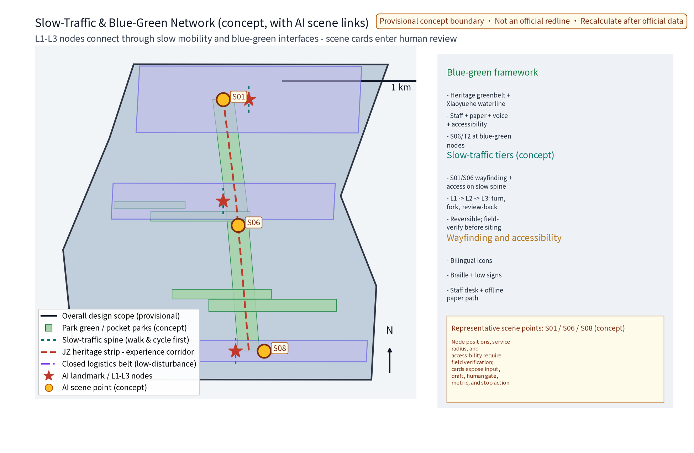

> **Evidence anchors**: [source:DATA-SRC-MOHURD-URBAN-DESIGN-MEASURES], [metric:green_ratio], [data:geometry/green_space.geojson#GS-000].

## Renewal Projects, Implementation Policy, and Phasing
Implementation runs in three phases: near term (1-3 years) completes the whole-line master sign system and the three node pilots and starts the annual programmes; mid term (3-5 years) rolls out along the nodes and builds the digital content library and maintenance mechanisms; long term (5-10 years) renews content and evaluates iteratively with urban renewal. Pilots are selected by a "small, reversible, measurable" standard - preferably segments with clear permit boundaries, single property owners and quick withdrawal; pilots that fail acceptance KPIs or create major public risk are withdrawn or converted to interim functions under the exit mechanism.

Near-term pilot execution matrix (conceptual arrangement; roles, permit dependencies and cost tiers are advisory, not commitments):

| Pilot | Responsible roles | Permit dependencies | Cost tier | Data boundary | Service level | Acceptance KPI | Public feedback | Exit condition |
|---|---|---|---|---|---|---|---|---|
| Storyboard Stop pilot kiosk | District government lead; university, operator, volunteers | Site/heritage permit (concept) | Low | Anonymized usage aggregates only; on-device | Daily opening + staffed shifts | One fact-check round in 30 days; weekly use above baseline | Suggestion box + online review; annual disclosure | Failed review or low use -> withdrawn or converted |
| Spike Trail test segment | District transport/planning lead; subdistrict, community | Road-occupation permit (concept) | Low | Passive pavement symbols; no sensing | Weekly inspection + event sweeps | Sign integrity >= 95%; timing accuracy >= 90% | Subdistrict council + survey | Two seasons below service line -> deactivated |
| Signal Pavilion accessible kiosk | Disability/culture lead; accessibility experts, volunteers | Noise & facility permit (concept) | Medium | Audio cached locally; no personal profiles | Volume levels + quiet hours; offline mode | Braille/tactile integrity >= 95%; >= 4 languages | User tests incl. sensory-impaired users | High complaint rate -> downgraded to text-only |
| Inspection + density pilot | Operator lead; district agencies, merchants | Device/data filing (concept) | Medium | Aggregate heatmap only; retention and access stated | Inspection loop <= 24 h; full human review | Response rate >= 90%; false-alarm rate <= 5% | Monthly disclosure + open audit | Re-identification risk -> halted and removed |

Policy proposals are subject to statutory review and are not commitments by government or operators: simplified narrative-content solicitation and sign-approval procedures, flexible format entry, multi-stakeholder operation; supporting mechanisms include annual disclosure, developer community, openness interfaces, attraction pathways and the honour system. The annual programme system and dedicated mechanisms are detailed in the end sections.

The project list is rolled forward in three classes - spine, node, content: spine covers green-belt connection and municipal integration; nodes cover the three nodes and their surrounding function renewal; content covers the digital content library, oral-history archive and event operations. Each item states its suggested responsible body and annual ledger status. The developer community and scenario openness follow the mid-term phase (3-5 years): content interfaces and test scenarios open first, then anonymized aggregate interfaces of inspection and density sensing, always within the data boundaries and filing requirements. If a major public risk, persistent underperformance or a policy change occurs and the agreed stop condition is met, the exit mechanism halts the item immediately and the outcome is disclosed.

> **Evidence anchors**: [source:DATA-SRC-AGENT-TASKBOOK-2026-05-18] (phasing and implementation items map to the taskbook), [data:geometry/phasing.geojson#PH-00], [metric:phase_count].

## Metrics, Area Recalculation, and Compliance Matrix
The indicator system uses process indicators in a concept caliber: every indicator states its data source, formula, confidence level, use restriction and recompute trigger to avoid misleading precision. Area recalculation uses the official textual caliber as its base; once official geometry is published the whole set is recomputed and the recompute version recorded. The compliance matrix self-checks against upper-level plans, green-line and blue-line management, heritage protection, public signage and accessibility standards; this package records only concept responses or professional verification pending, not a statutory conclusion.

| Indicator (concept) | Data source | Formula & confidence | Use restriction | Recompute trigger |
|---|---|---|---|---|
| Green ratio (approx. 10.4%) | Six `GREEN_SPACE` features in `geometry/green_space.geojson` + `geometry/site_boundary.geojson#SITE-001` | EPSG:4548 union(green features) / union(overall-design boundary) = 1,188,025.644 / 11,412,825.386; low confidence | Concept-scale consistency and machine recomputation only; overlaps counted once; not existing or statutory land use | Replace both layers after official boundary, green-line and statutory land-use data are published |
| Narrative sign coverage | Signage placement plan (concept) | Covered nodes / phase target nodes; medium confidence | Phase targets adjust as nodes roll out | Phasing plan revised |
| Slow-accessibility | Road and slow-axis geometry (concept) | Slow-axis length / target length; low confidence | Continuity check only | Official road geometry published |
| Multilingual completeness | Content list (concept) | Languages live / target languages; medium confidence | Compared against target language baseline | Content expansion revised |
| Public participation | Event registration and review records | Participant count / target count; medium confidence | Anonymized aggregates; no individual profiling | Annual disclosure cycle |

Indicator caliber note: the table is concept caliber; it relates to the official textual figures (approx. 43.6 km2, approx. 11.4 km2, approx. 368.4 ha) as "official figures are the baseline, this table validates". Once official geometry is published, area-dependent indicators (green ratio, slow accessibility) are recomputed in full with a new denominator and a recorded recompute version. Compliance samples (concept): green-line and blue-line management, heritage protection, public-signage standards and accessible environment are all "concept response / professional verification pending"; they do not substitute for statutory confirmation.

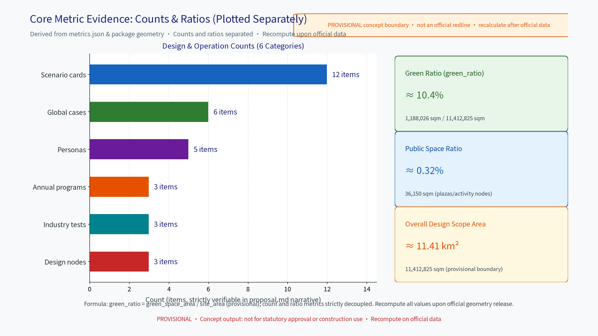

> **Evidence anchors**: [metric:scenario_card_count], [metric:global_case_count], [metric:annual_program_count] - industry test scenarios in [metric:industry_test_scenario_count].

## Risk, Copyright, and Compliance
This proposal is conceptual research design; it is not an administrative approval basis and provides no conclusion on FAR, building height, retain-renovate-demolish figures or engineering feasibility. Risks are registered in risk.json across six dimensions: boundary precision, traffic and operation coordination, privacy and data boundaries, missing statutory controls, technology maturity, and fact/public acceptance. AI scenarios use anonymized aggregation only, human review of key decisions and no over-surveillance; density sensing must state its sensing method, retention period, access rights and re-identification risk response plan.

Copyright and prior rights: figures, drawings and the sign design are original to this package or use license-clear open-source font assets (detail in sources.json asset entries and report/copyright_statement.md). The primary name and logo are treated as internal working codenames - no trademark search or legal review has been completed at concept stage; no registration, no commercial use, no government-endorsement impression; clearance is required before formal use. Old photographs, archives and sound material stay as explicit placeholders or public-domain substitutes until rights are cleared; oral-history material requires informed consent with withdrawal records. This proposal is conceptual advice; formal implementation requires multi-department joint review, heritage protection and safety assessment. Annual disclosure and the resident feedback channel operate yearly after implementation, with an appeal review post.

> **Evidence anchors**: [source:DATA-SRC-ANNOUNCEMENT-2026-05-09] (the call rules ground the ownership and compliance statements), [source:DATA-SRC-GENERATIVE-AI-INTERIM-MEASURES].

## References
References follow official published versions, archived by verified or to-be-verified status with access dates and reuse boundaries. Verified: the call announcement and taskbook excerpts, current urban-design and management standard texts, land-use classification and accessibility law texts, and the interim measures on generative AI (as a governance-language reference only). To-be-verified: details of Jingzhang station historical material, the latest public introductions of universities and tech parks along the corridor, and international case operation data - all handled as research hypotheses, never loaded into the formal evidence chain. sources.json in this package records only verifiable entries; no official data or link is fabricated, and any statement beyond public caliber is explicitly marked concept or schematic in the text.

The whole reference list follows the conceptual-advice boundary: no approval results are promised, no unverified official figures are quoted, no non-public material is restated; case benchmarking is method borrowing only, and any scale or operation figure of a case follows the case's own official publication. Case sources are detailed in the "Global Case Benchmarking" section table at the end.

> **Evidence anchors**: [source:DATA-SRC-ANNOUNCEMENT-2026-05-09] (first entry: the organizer's public package).

## Brand Identity and Visual System (Logo/VI)
The brand unifies one primary name and one visual system, removing the recognition split caused by multiple names: Chinese primary name "Zhanghen - Jingzhang Narrative Wayfinding Belt" and English primary name WAYMARK·JZ (internal working codename); the mark combines three motifs - spike (dot), rail (line), station board (plane) - with primary colours steel grey, signal red, spike copper and primary blue. See the Logo/VI figure for the basics. Visual-system rules (concept): a license-clear font family (Noto/Source Han family recommended), a unified icon line style and information hierarchy, so that drawings, signage, digital interfaces and event materials share the same vocabulary across the whole line.

Brand prior rights and usage boundary: no trademark search or legal review has been completed at concept stage. The primary name and logo are internal working codenames for this package - no external registration, no commercial use, no government-endorsement impression; historical and third-party stock material stays placeholder or public-domain substitutes until rights are cleared; search, legal review and licence clearing are required before formal use, with source and licence details recorded in sources.json asset entries. International communication uses a multilingual brand manual (concept) with Chinese and English co-primary names, guaranteeing that the English drawings, PDFs and HTML are substantively equivalent to the Chinese versions.

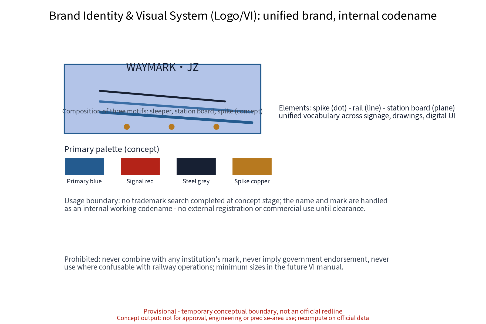

> **Evidence anchors**: [metric:global_case_count] (brand benchmarking cases in the table at the end).

## Five Personas and AI Scenario Mapping
Five talent personas are the shared baseline for scenario priority and inclusive design, consistent with persona_count in metrics.json:

| Persona (five talent groups) | Primary scenario cards | Continuous-journey test focus | Non-AI accessible path |
|---|---|---|---|
| Morning Readers (academics/research) | S1, S4, S11 | Research route and academic space | Archive desk, catalogue lookup |
| Midday Wanderers (park workers) | S2, S6, S12 | Short stroll and relaxing stay | Mileage marks, static guidance |
| Cross-language Travellers (international) | S3, S7, S8 | Multilingual reach and translation backstop | Multilingual desks, paper cards |
| Weekend Families (local/parent-child) | S4, S9, S10 | Child-friendly and safe routes | Hand-drawn drafts, offline events |
| Rail Fans & City Walkers | S5, S2, S11 | Deep-detail study and restrained sharing | Human guides and catalogue lookup |

Each persona joins segment-by-segment continuous-journey tests (elderly, children, wheelchair users, sensory-impaired and cognitively impaired users) and co-creation representation quotas; feedback and appeals link to annual disclosure. Offline cache, silent alternatives, rest intervals and human service fallback apply to all personas (details in the persona-ai-map figure).

Persona data boundary: personas are design hypotheses and test-quota baselines only; no individual identity information is collected or stored; questionnaires and visit records are fully anonymized and presented as aggregates. The persona-to-card mapping is reviewed annually against test results and enters the annual disclosure; no persona description implies behavioural prediction of, or profiling-based service for, any individual.

## Global Case Benchmarking (with sources)
Cases serve method borrowing only; their operation data is not inferred as reusable here. Every case is registered in sources.json; unverified details are research hypotheses.

The method is "borrow mechanisms, isolate figures": only spatial organisation logic, operation mechanisms and governance arrangements are borrowed (ground-marker self-guided, segmental interpretation, ecological renewal rhythm); visitor, cost and operation figures of the cases are never quoted. Case-institution pages serve as method provenance only; their imagery and marks are never reused. The six cases cover North America, Europe, East Asia and mainland China across linear public space and industrial-heritage types, forming a cross-check sample for brand recognition, regional synergy and scenario perceptibility; conclusions are re-verified by the professional team in the formal phase with an updated version.

| Case | City/Country | Mechanism borrowed | Source |
|---|---|---|---|
| The High Line | New York/USA | Restrained vocabulary of linear industrial-heritage public space | [source:CASE-THE-HIGHLINE] |
| Freedom Trail | Boston/USA | Ground-marker self-guided, multilingual, low-fixture | [source:CASE-FREEDOM-TRAIL] |
| Berliner Mauerweg | Berlin/Germany | Linear memorial narrative as continuous slow system with segmental interpretation | [source:CASE-BERLIN-MAUERWEG] |
| Rail Corridor | Singapore | Former rail line renewed as ecological slow belt with heritage narrative | [source:CASE-RAIL-CORRIDOR] |
| Cheonggyecheon Restoration | Seoul/Korea | Linear public-space restoration and year-round operation management | [source:CASE-CHEONGGYECHEON] |
| Shougang Park Renewal | Beijing/China | Large industrial-heritage regeneration with graded heritage narrative | [source:CASE-SHOUGANG] |

## Industry Test Scenario Protocol
Three industry test scenarios verify the three testable values of the "readability" effect; results are concept-iteration evidence only and constitute no visitor or investment commitment. The three scenarios map onto the three zones (Zhongzhiyuan, AI Origin Community, Dazhongsi) industry hypotheses; protocols are structured in three columns - target, data/permit, acceptance & exit - and the acceptance thresholds and exit conditions are jointly confirmed and disclosed by the participating bodies before launch. No test collects individual identity information; questionnaires and ledgers are anonymized. Sites, sample sizes and durations are confirmed by the professional team with the relevant bodies in the formal phase and enter the annual disclosure; if a privacy risk or negative public-relations threshold is exceeded during a test, the test stops immediately and is explained publicly.

| Test scenario | Test target | Data & permit boundary | Acceptance & exit |
|---|---|---|---|
| Visit-conversion test (Zhongzhiyuan / Zhongguancun direction) | Verify positive guidance of narrative signage on park visit routes | Anonymized visit totals only; booking registration | Continue at baseline, otherwise adjust routes |
| Talent-signal test (Xueyuan Road / Beiwei direction) | Verify impact of sign experience on talent stay perception | Anonymous questionnaires, consent shown, withdrawable | Proceed after valid sample threshold |
| Operations-supply test (Dazhongsi / Xiaoyue River direction) | Verify resource closure of content renewal and maintenance cost | Anonymized maintenance ledger and energy records | Two seasons below service line -> stop and disclose |

## Annual Programmes and Honour Mechanisms
The annual programme system and honour mechanisms support long-term operation value and brand recognition, combining covenants, councils, points, disclosure, filing, alliances, volunteering, booking, rotation and tiering:

| Annual programme brand | Time window (concept) | Mechanism mix | Participants |
|---|---|---|---|
| Jingzhang Narrative Tour Week | One week every autumn | Booked tours, volunteer guides, points check-in | Government, universities, visitors, volunteers |
| Oral-History Collection Workshop | Twice a year | Informed consent, withdrawal records, alliance co-building | Residents, elderly, universities |
| Sign Co-Creation Festival | Once a year | Council solicitation, open voting, annual disclosure | Children, families, enterprises, design teams |

Supporting mechanisms (concept): the "Zhanghen Honour Badge" points system (check-in, oral history, co-creation) is disclosed annually; the "Quiet-Hours Covenant" is signed and rotated by subdistrict councils along the line; the developer community co-builds the digital content library through openness interfaces and content licensing, and the attraction mechanism uses industry test scenarios as the intake for park tenants; content is updated monthly with the data-boundary implementation disclosed annually; the resident feedback channel is open all year with the appeal post responding within the disclosed period. Mechanism words are organised into ten classes - covenant, council, points, disclosure, filing, alliance, volunteering, booking, rotation, tiering - mapping to quiet hours, patrol councils, check-in points, annual disclosure, content and device filing, volunteer alliance, tour booking, theme rotation and volume tiering, so every mechanism is implementable and verifiable.

## Position Statement and Recalculation Note
All of the above is conceptual advice and reference material: it contains no FAR, building height, retain-renovate-demolish, budget, visitor-capacity or engineering-feasibility conclusions; it fabricates no official data and claims no official endorsement; all areas and ratios are provisional low-confidence rounded values to be recomputed in full when official data is published; the brand name and logo are internal working codenames and are not registered or used commercially before prior-rights clearance; historical material stays placeholder or public-domain substitutes until rights are cleared. The Chinese and English versions have been checked item by item for substantive equivalence; any discrepancy is governed by the Chinese version and synced in revisions.