> 章节定位：本方案为概念研究性建议，不替代法定规划，不给出容积率、建筑高度、拆改留数值、投资预算、客流容量或工程可行性结论；全部表述以公开资料口径为限，官方数据发布后逐条复算。

## 设计依据与资料清单
设计依据以公开资料为主：百年京张AI创新带征集公告与任务书文本口径、京张铁路历史档案与公开史料、沿线高校院所与科创园区公开介绍、现行公共标识与无障碍慢行相关规范。资料清单区分为两类：本包已取得并登记于 sources.json 的可查证资料；以及拟在正式编制阶段收集的现场踏勘影像、站点老照片授权件、口述史访谈记录与声环境基线数据——后者属于拟收集清单而非本包已获取数据，未取得前不得作为清权实施素材，相关缺口已在风险与缺失数据说明中如实标注。

依据引用全部以政府正式发布版本为准：公告文字四至与面积口径可用于概念生成与展示，但不能替代官方地理几何；历史叙事表述设史实核对岗，凡无法核验的史料一律标注为待研究假设。本草案不替代法定规划文件，引用版本在正式编制阶段逐条核定。

> **证据锚点**：[source:DATA-SRC-ANNOUNCEMENT-2026-05-09]、[source:DATA-SRC-AGENT-TASKBOOK-2026-05-18]、[source:DATA-SRC-PROVISIONAL-BOUNDARIES-2026-06-05]。

## 三层范围工作框架
官方三层范围为：统筹研究范围约 43.6 平方公里、总体设计范围约 11.4 平方公里、重点区域约 368.4 公顷（均按征集公告文本口径，官方几何未发布前仅作文字定位）。本概念方案位于三层之下：以总体设计范围绿带为骨架组织叙事导视系统，以三个重点区域节点为详细设计对象，全部几何以 provisional 边界示意，官方图件发布后整体复算并刷新图件与指标。

工作框架逐级传导：统筹研究输出导视带与沿线科创片区、高校、国际化住区的协同判断，约束总体设计；总体设计校核绿带连续性、用地兼容与标识设施落位准则，再落实到节点详设；节点试验反向为总体提供可更新的样板。每层均保留与任务书章节对应的机器可读证据锚点、geometry 层与指标，便于评审对照。

在官方几何未发布前，三层范围的面积仅作文字定位使用，本包在每层内部再划分"概念子区"（如总体设计范围内的绿带骨架段、重点区域的三个节点单元），子区边界全部标记 provisional；官方三层 polygon 发布后，先核对子区与官方范围的包含关系，再整体复算。三层成果的表达载体（图件、指标、矩阵）均按同一复数口径组织，避免各层数据口径冲突。

> **证据锚点**：[source:DATA-SRC-ANNOUNCEMENT-2026-05-09]（三层范围与面积数值的官方文本口径）、[metric:site_area_sqm]、[data:geometry/site_boundary.geojson#SITE-001]。

## 统筹研究范围产业与未来城市研究
统筹研究把叙事导视带视为链接科创片区的公共叙事载体：历史线索以站点为纲，当代线索以创新为主题，双线并置形成"百年京张—未来AI"的连续阅读。区域协同回路（概念）按任务书方向与北纬社区、未来科学城、怀柔科学城、经开区、京津冀五个方向建立联动假设，识别"导视带—片区—社区"三级联动结构，使历史认知、文化消费与科创参访有序导入沿线公共服务与产业空间。

产业与未来城市研究识别导视带的「可读性」效应及其三类可测试价值：面向产业招商的参访转化效能、面向人才的城市品质信号、面向运营的长期内容供给。为此设置众智园AI自主创新加速区、北京AI原点社区、大钟寺AI产业聚集区的差异化机制假设，并给出三个产业测试场景（见「产业测试场景协议」一节）以可核验方式校验上述假设。未来城市研究仅作方向性预判，不构成用地与投资承诺。

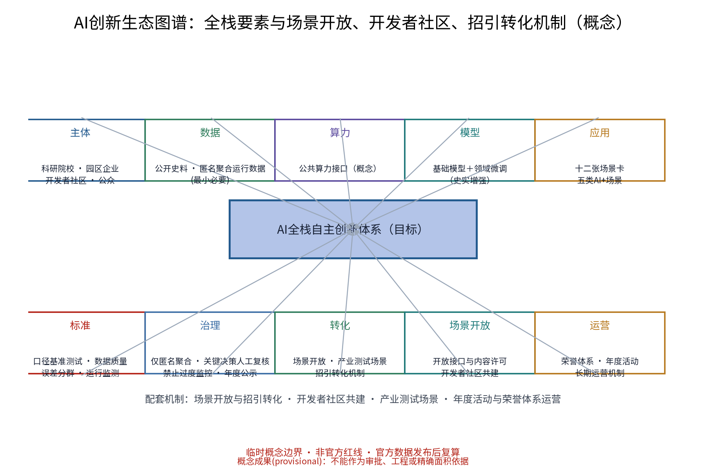

> **证据锚点**：[source:DATA-SRC-PROVISIONAL-BOUNDARIES-2026-06-05]（边界为 provisional）、[metric:industry_test_scenario_count]。

## 总体设计范围城市更新与控规深度城市设计
总体设计以遗留绿带为骨架，把导视系统作为城市设计要素整体落位：沿慢行轴建立全线级—段级—节点级三级叙事层级，统一采用铁路工业语汇（钢轨构件、道钉、信号色彩与旧式字样），标识点位与慢行驻留空间、视线通廊同步组织，形成可识别、可阅读、可更新的连续体验，并为数字内容预留可替换的通用接口。控规深度方法仅用于校核用地兼容、绿带连续性与设施落位导则，不预设数值结论。

任务书三大定位（百年京张文化带、都市AI生活体验带、AI融合创新带）与五大功能（AI全栈自主创新体系、世界级AI创新生态、AI+场景赋能新范式、智能化AI活力城市、AI治理全球话语权）在本范围映射为「一带三站」总体概念与「三区两翼」协同结构：三区即众智园AI自主创新加速区、北京AI原点社区、大钟寺AI产业聚集区；两翼即中关村科技服务翼与小月河场景赋能翼（概念映射，机制见协同回路图）。标识设施全部采用模块化、可逆、可更新体系，形成公共空间可复用的组件库（组件库清单见附录表）。

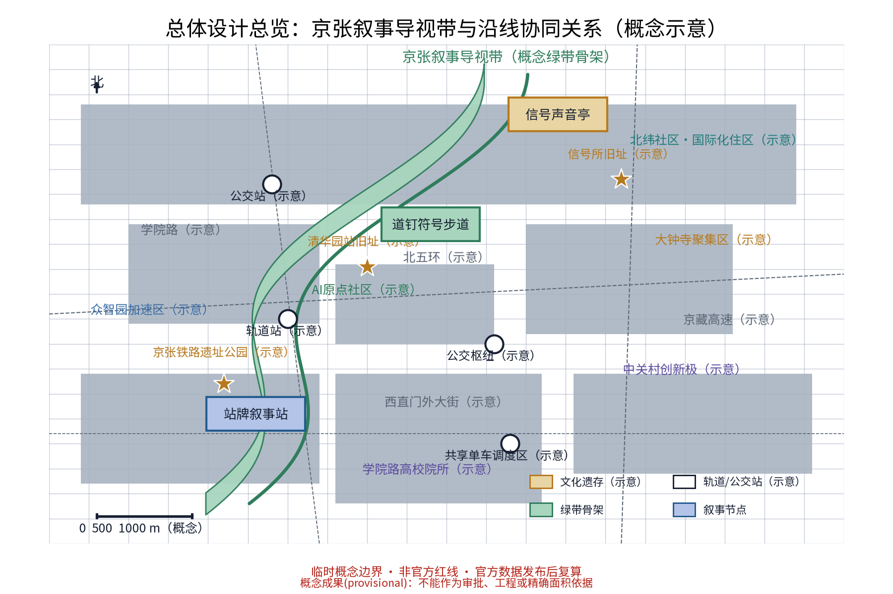

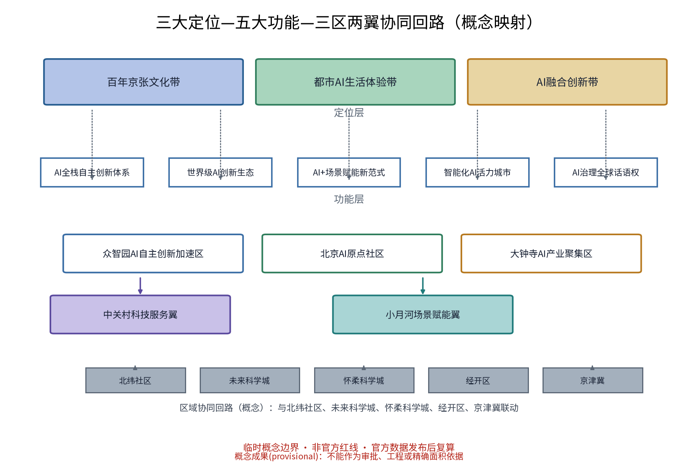

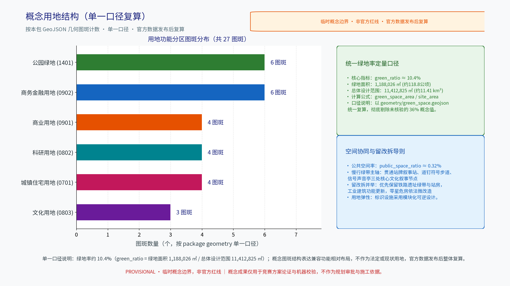

> **证据锚点**：[source:DATA-SRC-MOHURD-URBAN-DESIGN-MEASURES]、[source:DATA-SRC-MOHURD-CONTROL-DETAILED-PLANNING]、[source:DATA-SRC-PROVISIONAL-BOUNDARIES-2026-06-05]。

## 重点区域详细设计
三个节点均为概念点位，须经规划、文保与主管部门评估后重新落位；节点间的绿带动线构成完整叙事动线。节点一「站牌叙事站」：以老站牌形制为原型作概念演绎（不复制原件），结合AR出示站点旧影与口述史音频，形成可驻留的故事亭。节点二「道钉符号步道」：将道钉、钢轨与里程符号转译为地面图形标识，标记站距、年份与线路进展，兼具指路与步行计时。节点三「信号声音亭」：以铁路信号音为声景线索，提供多语语音导览与盲文触觉信息，声音与文字互为补充，设音量分级与静音时段。

每个节点配备平面、剖面、无障碍连续路线、视线与声音影响示意（见附图），校验内容涵盖全龄可达、轮椅回转半径、视听障碍替代路径与相邻敏感点噪声。节点同步设置荣誉体系：完成全线叙事打卡的游客与持续贡献口述史、共创内容的居民可获「章痕荣誉章」（概念机制），鼓励长期参与而非一次性消费。

**场景卡索引（12张，概念）**：AI+场景以场景卡落地，形成可评审、可迭代的运营索引。

| 场景卡 | 落点 | 面向人群 | 运营机制（概念） | 数据与合规边界 | 非AI降级路径 |
|---|---|---|---|---|---|
| S1「站牌故事」AR旧影导览 | 站牌叙事站 | 游客、学生 | 预约讲解、史实复核 | 端侧处理，不留存个体可识别信息 | 纸质旧影展板与人工讲解 |
| S2「道钉径」步行计时步道 | 道钉符号步道 | 通勤者、白领 | 里程积分、轮换主题 | 地面符号非感知性，无采集 | 里程刻度实刻于铺装 |
| S3「信号亭」多语声景导览 | 信号声音亭 | 老年人、跨语旅人 | 志愿者值守、人工兜底 | 音频本地缓存，授权明示、可一键关闭 | 盲文触觉站牌与电话导览 |
| S4「旧影AR」复原示意 | 沿线遗存点 | 铁轨迷、家庭 | 内容备案、复原标注 | 复原内容强制标注"复原示意" | 历史影像灯箱（公共领域素材） |
| S5「巡检哨」设施巡检AI | 全线导视设施 | 运营方、从业者 | 派单维修、年度评估 | 匿名聚合，人工复核 | 人工巡检排班表 |
| S6「密度调」标识动态调配 | 重点节点 | 游客、家庭 | 实时公示、议事征集 | 仅聚合密度，不进行个体识别式追踪 | 固定时段定额发布 |
| S7「使者多语」AI翻译口语助手 | 全线服务点 | 跨语旅人、国际住区 | 志愿者联盟支持、误差分群改善 | 匿名聚合，关键决策人工复核 | 多语人工服务台与纸质卡 |
| S8「静音诗径」文字优先导览 | 全线 | 视听障碍者、偏好安静者 | 静音时段公约、轮换文本 | 无声音采集，纯文本 | 触觉地图与大字版手册 |
| S9「口述史坊」采集与转写 | 社区与节点 | 居民、老年人 | 知情同意、撤回记录 | 经授权匿名化，可撤回 | 手工誊写与归档 |
| S10「共创节」标识设计共创 | 公共空间 | 儿童、亲子、高校 | 积分兑换、年度公示 | 展示授权明示 | 线下画稿投票 |
| S11「文献灯」史料核查台 | 站牌叙事站 | 学者、考据人群 | 史实核对岗、申诉通道 | 公开文献引用，标注来源 | 馆藏目录查询 |
| S12「节事导引」节事动线提示 | 全线 | 游客、商户 | 预约核验、分级引导 | 匿名总量，禁止过度监控 | 静态导引与人工疏导 |

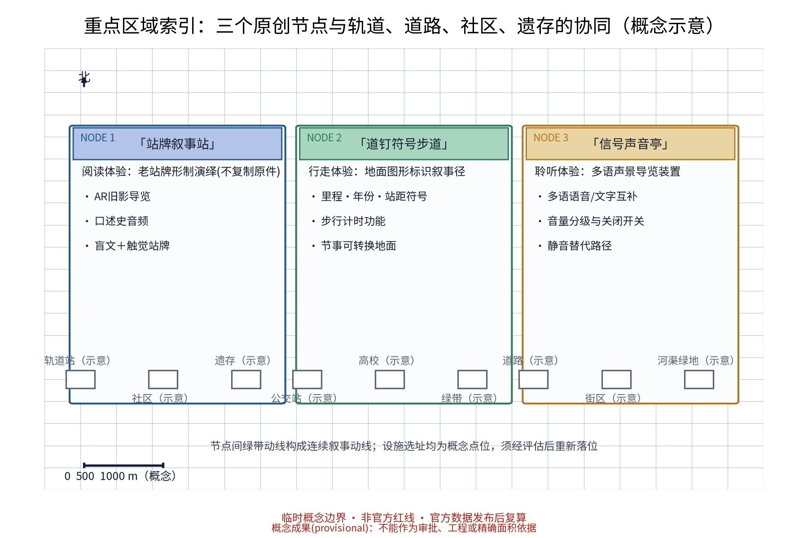

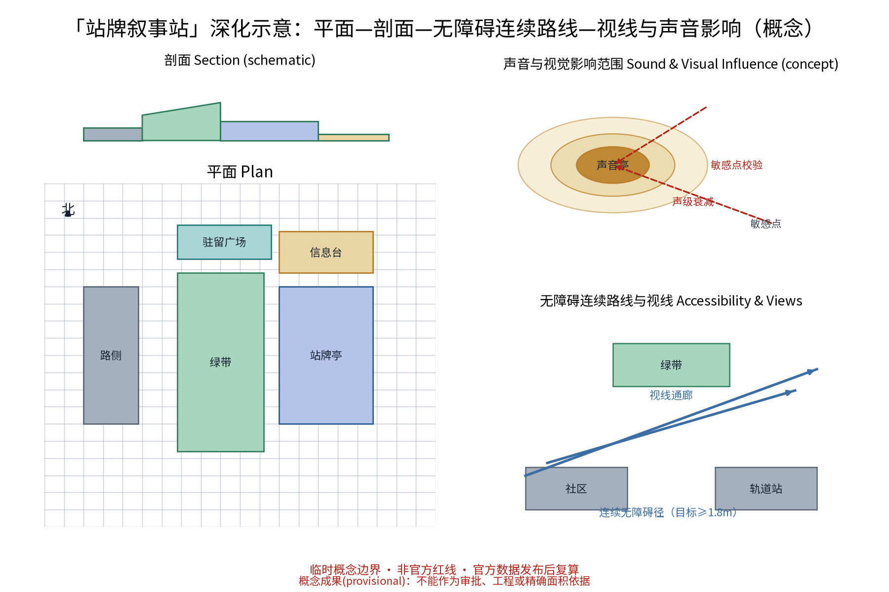

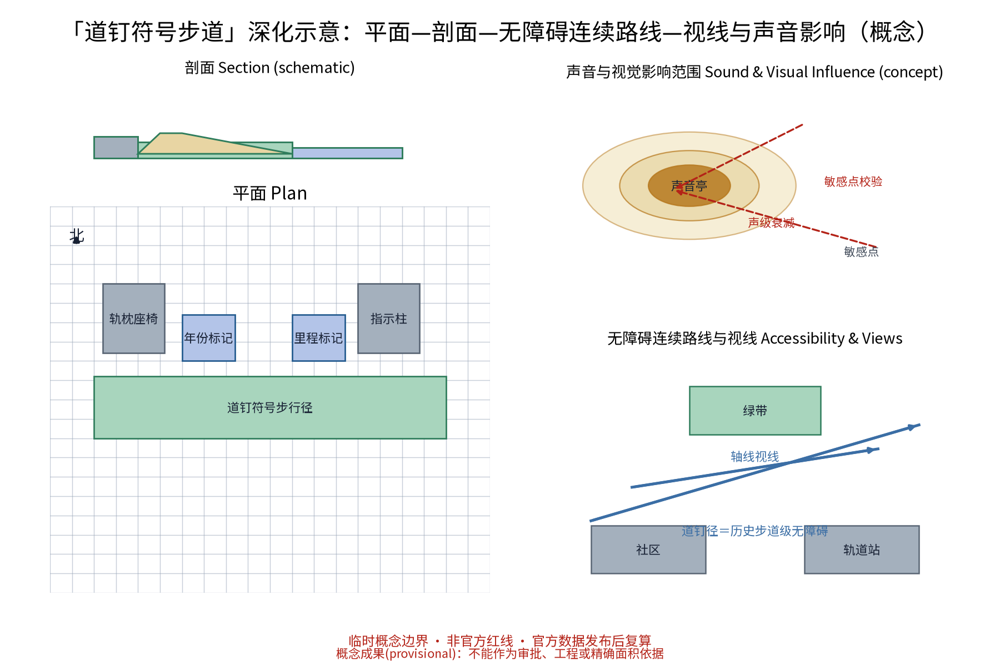

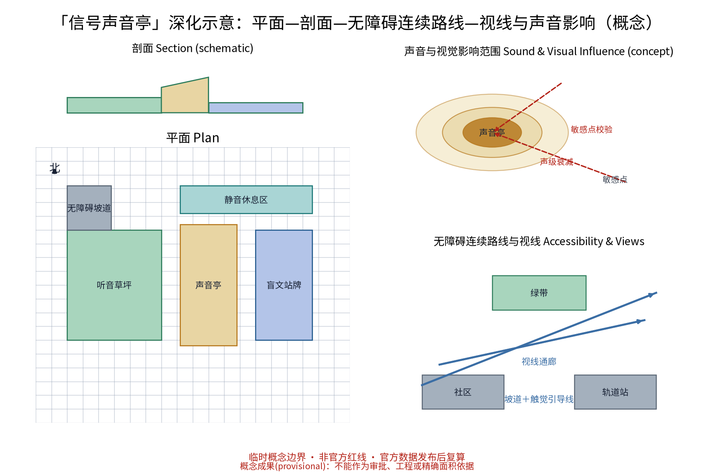

> **证据锚点**：[data:geometry/key_areas.geojson#KEY-ZHON]、[data:geometry/key_areas.geojson#KEY-DAZH]（三节点示意多边形）；三节点计数见 [metric:scenario_node_count]。

## AI 创新生态、人才画像与 AI+ 场景
AI场景全部遵循三条治理底线：仅匿名聚合数据、关键决策人工复核、禁止过度监控。十二张场景卡覆盖文化、公共服务、空间、治理、产业、交通六个AI×规划域域：AI文化（AR旧影复原与声景叙事）、AI公共服务（多语导览与无障碍信息）、AI空间（导视系统与绿带动线）、AI治理（内容审核、数据规则公示与备案）、AI产业（数字内容库、场景开放与招引转化）、AI交通（驻留提示与动线推荐）。AI不改变叙事本体，只降低阅读门槛。

AI技术协议（概念）明确四项机器可测基线：模型评测以史实准确率与多语翻译质量为准入基准测试；数据质量要求来源可溯、口径唯一；误差分群按画像与时段分层统计并纳入月度公示；运行监测含误报率、完好率与人工复核覆盖率指标。每个AI场景同步给出非AI降级路径（见场景卡表末列），确保断网、静默或设备故障时服务不中断。

人才画像以五类人才为骨架（详见「五类人才画像与AI场景映射」一节）：晨读人（高校师生与科研人员）、午间漫游者（科创园区从业者）、跨语旅人（外籍学者、留学生与国际住区居民）、周末家庭（在地居民与亲子群体）、铁轨迷与城市漫游者（铁路爱好者与city walk人群）。画像用于场景卡优先级排序、连续性旅程测试与共创代表性配额，不作为个体识别依据。

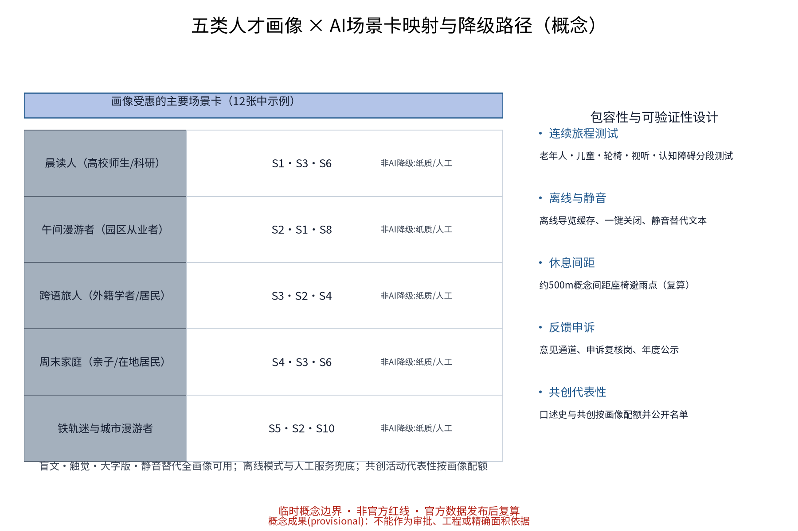

> **证据锚点**：[source:DATA-SRC-GENERATIVE-AI-INTERIM-MEASURES]、[source:DATA-SRC-BARRIER-FREE-ENVIRONMENT-LAW]、[metric:persona_count]。

## 用地、建筑规模与拆改留方案
拆改留坚持留改拆并举：优先保留遗址绿带、历史价值站房与工业构筑物延续铁路记忆，低效厂房与园区建筑以功能更新为主，拆除仅限经个案论证的零星危旧建筑且一律经法定审查程序。本方案不预设用地规模与建筑面积数值，不给出拆改留比例，全部表述为概念口径（口径说明见本节末注），官方数据发布后复算。

为消除误导性精度：本方案面积与比例一律取整显示、标注低置信度、说明公式与适用范围，比例与计数分图表达（计数见指标证据图），概念用地结构不表达为现状或法定用地结构。所有标识设施均为可逆、可移设计，降低对场地的永久干预，为后续法定规划留出弹性；建筑规模仅以"轻介入、可逆、可更新"为原则表述。

绿地率的定量口径在本包内固定为一条可复核证据链：分子不是 `land_use.geojson` 中 1401 类图斑的数量或面积，而是 `geometry/green_space.geojson` 六个 `GREEN_SPACE` 概念图斑在 EPSG:4548 中的 union 面积 1,188,025.644 平方米（图文取整显示 1,188,026 平方米；重叠部分只计一次）；分母是 `geometry/site_boundary.geojson#SITE-001` 总体设计范围 provisional 边界的同一投影 union 面积 11,412,825.386 平方米（取整 11,412,825 平方米）。因此 `green_ratio = 1,188,025.644 / 11,412,825.386 = 0.104096`，约 10.4%。`land_use.geojson` 的 1401 仅用于按本包用地分类规则做结构图斑计数（27 个图斑中 6 个），不参与绿地率分子；它与绿地率是两个不同用途、不同分母的指标。两层几何都由本包概念数据生成，边界为 provisional、绿地为低置信度设计建议，既不表示现状也不表示法定绿线；该比例仅用于方案量级监测、图文一致性和机器复算。官方边界、绿线和法定用地分类发布后，替换两层来源并按同一 union 公式重算。此前无法核验的替代性比例不再使用。

拆改留执行审慎原则：凡具有历史价值、结构可用的建筑一律按"留改"优先处理，改造设计保留原结构语汇；确需调整功能时按"先功能后形态"次序评估；拆整仅限危旧且经个案论证的对象，并同步评估对慢行动线与公共空间的临时影响。各类设施清单一律标注所属阶段（近期试点/中期铺开/远期滚动），并纳入年度公示的更新台账，保证任何拆改留表述都可追溯、可审核、可撤销。

> **证据锚点**：[source:DATA-SRC-MNR-LAND-USE-CLASSIFICATION-202311]、[metric:building_unit_count]、[metric:land_use_zone_count]；概念用地层见 [data:geometry/land_use.geojson#LU-ZHON]。

## 交通、轨道、市政与公共服务设施
交通组织坚持慢行优先：绿带内步行与骑行慢行轴和标识系统一体化设计，标识即指路、指路即叙事。导视带衔接既有轨道站点出入口与公交站点，形成"出站即入线"的动线（概念）；节事交通以轨道交通＋接驳为主，采用预约班车与共享单车调度区，散场分时分区疏导。本概念不新增轨道线路建议，轨道站、公交站与道路名称仅用于概念定位，不代表道路红线。

市政按日常与节事两档负荷校核供电、给排水、通信与临时电源接口（概念级）；公共服务沿慢行轴配置座椅、饮水、避雨与无障碍设施，全线按约500米概念间距设置休息点与母婴、医疗应急服务单元（间距须在正式阶段复算），地面标识尽量与市政灯杆、检修设施整合以减少新增构筑物。声音装置设音量分级与静音时段，接驳与导引信息提供文字与人工替代。

慢行组织采用"步行优先、骑行分离"概念：绿带内主径以步行为主，骑行与共享单车利用并行支径组织，交叉处设置降速提示；无障碍路线与轮椅回转空间在节点详图中逐点核验。节事期间按预约核验、分级引导与分区分时出行的原则衔接轨道站与接驳点，节后组织动态评估并纳入年度公示。市政负荷、慢行流量与声环境基线均属拟收集数据，未取得前不做容量结论。

> **证据锚点**：[source:DATA-SRC-MOHURD-URBAN-DESIGN-MEASURES]、[data:geometry/roads.geojson#RD-SPINE]。

## 蓝绿空间、公共空间与城市风貌
蓝绿空间以绿带为轴、节点公园为珠：保留现状林带与场地肌理，结合雨水花园与透水铺装提升生态韧性；公共空间强调可转换性，标识亭、叙事径与声音装置可按需切换为讲堂、市集与日常休闲场所；临时设施采用模块化、可拆卸、可回收体系。风貌延续铁路工业记忆语汇：以钢、木、铸铁与信号色为基调，字样构图借鉴旧站牌要素，弱化新建感，克制使用、避免标语化包装。

包容性设计贯彻全龄友好与适老化：无障碍坡道与触觉引导线贯穿连续路线，轮椅使用者、视听障碍者与认知障碍者均有对应替代路径；设静音休息区与儿童友好设施，休息间距与遮荫遮雨点按概念间距配置并标注复算触发条件。叙事表达坚持克制，警语化、口号化与广告化内容一律不进入标识体系。

公共空间的可转换性按"日常—节事—临时"三档组织：日常为慢行阅读与驻留，节事切换为讲堂、市集与展览场地，临时作为施工围挡与应急疏散缓冲；转换清单与调度规则列入组件库（模块清单见总体设计节）。风貌控制采用钢、木、铸铁与信号色四种基调与站牌字样构图母题，夜间照明以低位、暖光、防眩光为原则，避免对沿线住区的光影响；敏感点（学校、医院、住区）周边设静音时段并禁设高亮广告式装置。

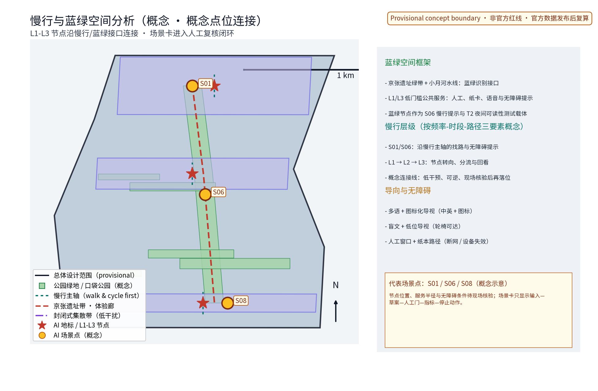

> **证据锚点**：[source:DATA-SRC-MOHURD-URBAN-DESIGN-MEASURES]、[metric:green_ratio]、[data:geometry/green_space.geojson#GS-000]。

## 更新项目清单、实施政策与分期计划
实施分三期：近期（1—3年）完成全线导视主系统与三个节点试点，启动年度活动；中期（3—5年）节点沿线铺开，建设数字内容库与维护机制；远期（5—10年）随城市更新滚动更新内容并评估迭代。试点按"小、可逆、可测"标准选取：优先选许可边界清晰、产权主体单一、可快速撤收的高校与园区段，试点不满足验收KPI或出现重大公共风险时按退出机制撤收或改临时功能。

近期试点执行矩阵（概念编排，责任角色、许可依赖、成本级别均为建议性，不作为承诺）：

| 试点 | 责任角色 | 许可依赖 | 成本级别 | 数据边界 | 维护服务水平 | 验收KPI | 公众反馈 | 失败退出条件 |
|---|---|---|---|---|---|---|---|---|
| 「站牌叙事站」试验亭 | 区政府牵头；高校、运营方、志愿者协作 | 场地与文保审查（概念） | 低 | 仅匿名聚合使用量；端侧处理 | 日常开放＋人工值守班次 | 试运行30天内完成1轮史实复核；周均使用高于基线 | 意见箱＋线上评议；年度公示 | 复核超标或使用不达标→撤收或改临展 |
| 「道钉径」试验段 | 区级交通与规自部门牵头；街道、社区协作 | 占道与慢行审批（概念） | 低 | 地面符号非感知性，无采集 | 按周巡检＋节事前后专项 | 标识完好率不低于95%；计时准确率不低于90% | 沿线议事会＋问卷 | 连续两季低于服务线→停用该段 |
| 「信号亭」无障碍声景亭 | 残联与文旅部门牵头；无障碍专家、志愿者协作 | 噪声与设施审批（概念） | 中 | 音频本地缓存；无个人档案 | 音量分级＋静音时段；离线可用 | 盲文与触觉完好率不低于95%；多语覆盖不少于4语 | 体验测试（含视听障碍用户） | 投诉率超标→降级为纯文字站牌 |
| 巡检＋密度集成试点 | 运营主体牵头；辖区部门、商户协作 | 设备与数据备案（概念） | 中 | 仅聚合热力；明确保留与访问权限 | 巡检闭环不超过24小时；人工复核全覆盖 | 报修响应率不低于90%；误报率不超过5% | 月度公示＋公开审计 | 出现重识别风险→立即停用并下架 |

政策建议均须依法依规论证，不构成政府或运营方承诺：叙事内容征集与标识设置审批简化、弹性业态准入、多元主体参与运营；配套机制包括年度公示、开发者社区共建、场景开放接口、招引转化路线与荣誉体系。年度活动体系与专项机制详见文末专节。

项目清单按"骨架—节点—内容"三类滚动更新：骨架类为绿带贯通与市政整合工程，节点类为三节点及其周边功能更新，内容类为数字内容库、口述史档案与活动运营；每类均标注责任主体建议与年度台账状态。开发者社区与场景开放的时间表挂钩中期阶段（3-5年）：先开放内容接口与测试场景，再开放设施巡检与密度感知的聚合数据接口，全程遵守数据边界与备案要求。实施中出现重大公共风险、持续不达标或政策调整时，满足约定停止条件即启动退出机制，立即停止并公示处置结果。

> **证据锚点**：[source:DATA-SRC-AGENT-TASKBOOK-2026-05-18]（分期与实施条目对应任务书要求）、[data:geometry/phasing.geojson#PH-00]、[metric:phase_count]。

## 指标体系、面积复算与合规矩阵
指标体系以过程性指标为主，全部为概念口径：每项指标注明数据来源、公式、置信等级、用途限制与复算触发条件，避免误导性精度；面积复算以官方文本口径为底，官方几何发布后整体复算并标注复算版本。合规矩阵对照上位规划、绿线与蓝线管理、文物与历史建筑保护、公共标识及无障碍相关规范逐项自查；本包只记录概念响应或待专业核验，不把自查结果写成主管部门结论。

| 指标（概念） | 数据来源 | 公式与置信等级 | 用途限制 | 复算触发 |
|---|---|---|---|---|
| 绿地率（约10.4%） | `geometry/green_space.geojson` 六个 `GREEN_SPACE` 图斑 + `geometry/site_boundary.geojson#SITE-001` | EPSG:4548 union(绿地图斑) / union(总体设计范围) = 1,188,025.644 / 11,412,825.386；低置信 | 仅作概念量级、图文一致性和机器复算校验；重叠只计一次，不作为现状或法定绿线 | 官方边界、绿线和法定用地分类发布后替换两层并重算 |
| 叙事标识覆盖率 | 标识布点方案（概念） | 覆盖节点数/阶段目标数；中置信 | 阶段目标按节点铺开动态调整 | 分期计划修订 |
| 慢行可达性 | 道路与慢行轴几何（概念） | 慢行轴长度/目标长度；低置信 | 仅作动线连续性检查 | 官方道路几何发布 |
| 多语内容完整度 | 内容清单（概念） | 已上架语种数/目标语种数；中置信 | 与目标语种基线对比 | 内容扩容计划修订 |
| 公众参与度 | 活动报名与评议记录 | 参与人次/目标人次；中置信 | 匿名聚合统计，不做个体画像 | 年度公示周期 |

指标口径说明：本表全部为概念口径，与官方公告文本口径（约43.6/约11.4平方公里/约368.4公顷）以"公告数值为基准、本表数值为校验"的关系表述；官方几何发布后，绿地率、慢行可达性等与面积相关的指标按新分母整体复算并记录复算版本号。合规矩阵示例条目（概念）：绿线与蓝线管理、文物与历史建筑保护、公共标识设置及无障碍环境均标为"概念响应/待专业核验"，不替代主管部门核定；全部结论以正式阶段主管部门核定为准。

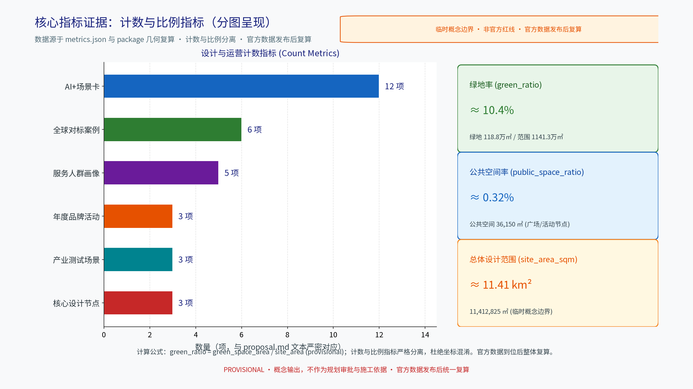

> **证据锚点**：[metric:scenario_card_count]、[metric:global_case_count]、[metric:annual_program_count]（产业测试场景数见「产业测试场景协议」一节）。

## 风险、版权与合规说明
本方案为概念研究性设计，不构成行政审批依据，也不构成容积率、建筑高度、拆改留或工程可行性结论；风险已按边界精度、交通与运营协调、隐私与数据边界、法定控制缺位、技术成熟度、史实与公众接受度六维度登记于 risk.json。AI场景仅匿名聚合、关键决策人工复核、禁止过度监控，密度感知须明示传感方式、保留周期、访问权限与重识别风险处置预案。

版权与在先权利：图形、图件与标识设计为本包原创或采用许可明确的开源字体素材（详细清单见 sources.json 资产条目与 report/copyright_statement.md）；主名称与Logo按「内部工作代号」处理——概念阶段未完成商标检索与法律审查，不对外注册、不进行商业使用、不作政府背书表示，正式使用前完成检索与在先权利核验；老照片、档案、声音素材在授权核验完成前仅使用明确占位或公共领域替代物，口述史素材须签署知情同意并保留撤回记录。本方案为概念建议，正式实施前须完成多部门联审、文物保护与安全评估；年度活动与居民意见通道在实施后按年度公示，并设申诉复核岗。

> **证据锚点**：[source:DATA-SRC-ANNOUNCEMENT-2026-05-09]（征集规则为权属与合规表述的依据）、[source:DATA-SRC-GENERATIVE-AI-INTERIM-MEASURES]。

## 参考资料
参考资料以政府正式发布版本为准，按已核验与待核验分类存档并标注获取时间与复用边界：已核验类包括征集公告与任务书摘录、现行城市设计与管理规范条文、用地分类与无障碍法律条文、生成式AI管理暂行办法（仅用作治理表述参照）；待核验类包括京张铁路站点史料细节、沿线高校与科创园区公开介绍的最新版本、国际案例运营数据——待核验内容一律按待研究假设处理，不载入正式证据链。本包 sources.json 仅收录可查证条目，未虚构任何官方数据或链接；凡超出公开口径的表述均在正文标注为概念或示意。

参考资料全文遵守"概念建议"边界：不承诺审批结果、不引用未核验官方数值、不复述非公开资料；案例对标仅作方法借鉴，任何案例的规模与运营数值以案例方官方发布为准。详细案例来源见文末「全球案例对标」专节表格。

> **证据锚点**：[source:DATA-SRC-ANNOUNCEMENT-2026-05-09]（本清单首条即组织方公开资料包）。

## 品牌识别与视觉系统（Logo/VI）
品牌识别统一为一个主名与一套视觉系统，消除多名称并存造成的识别分散：中文主名「章痕·京张叙事导视带」，英文主名 WAYMARK·JZ（内部工作代号），图形以"道钉（点）—钢轨（线）—站牌（面）"三个母题组合，标准色为钢灰、信号红、道钉铜与主蓝；Logo/VI 基础见图。视觉系统规范（概念）：统一字体建议采用许可明确的思源黑体系列，统一图标线型与信息层级，全线图件、标识、数字界面与活动物料共用同一语汇。

品牌在先权利与使用边界：概念阶段未完成商标检索与法律审查，主名称与Logo不对外注册、不商业使用、不作政府背书表示，仅作为本方案内部工作代号与展示用途；历史素材与第三方图库素材未经授权一律采用占位或公共领域替代物；正式使用前完成检索、法律审查与许可清点，来源与许可明细见 sources.json 资产条目。国际传播采用中英双主名的多语品牌手册（概念），保证英文版图件、PDF与HTML与中文版实质等价。

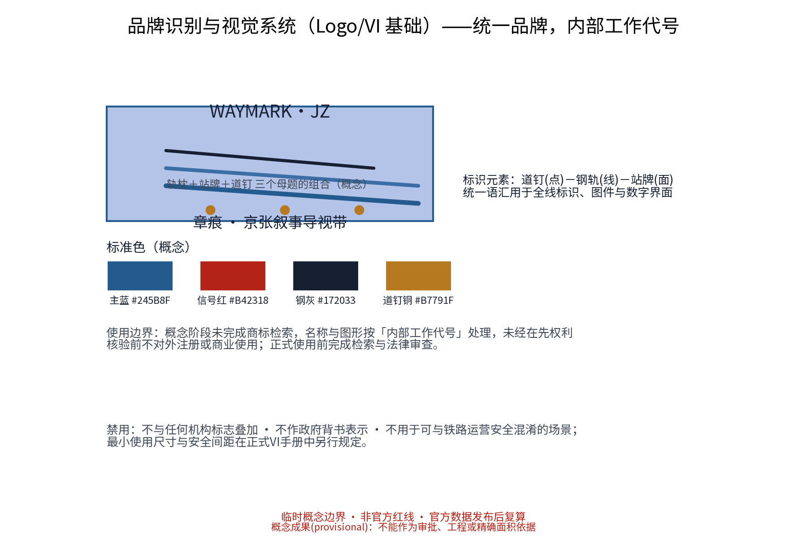

> **证据锚点**：[metric:global_case_count]（品牌对标案例见文末表）。

## 五类人才画像与AI场景映射
五类人才画像作为场景优先级与包容性设计的共同基准，与 metrics.json 的 persona_count 一致：

| 画像（五类人才） | 主要场景卡 | 旅程校验要点 | AI之外的可及路径 |
|---|---|---|---|
| 晨读人（高校师生/科研） | S1·S4·S11 | 考据动线与学术交流空间 | 文献台、馆藏目录 |
| 午间漫游者（园区从业者） | S2·S6·S12 | 短时慢行与减压驻留 | 里程刻度、静态导引 |
| 跨语旅人（外籍学者/居民） | S3·S7·S8 | 多语可达与翻译兜底 | 多语人工服务台、纸质卡 |
| 周末家庭（亲子/在地） | S4·S9·S10 | 儿童友好与安全动线 | 手工画稿、线下活动 |
| 铁轨迷与城市漫游者 | S5·S2·S11 | 深细节考据与分享克制引导 | 人工讲解与馆藏查询 |

每类画像对应连续性旅程测试（老年人、儿童、轮椅使用者、视听障碍者、认知障碍者分段测试）与共创代表性配额，反馈申诉与年度公示联动；离线缓存、静音替代、休息间距与人工服务兜底适用于全部画像（细节见 persona-ai-map 图）。

画像数据使用边界：画像仅作为设计假设与测试配额依据，不采集、不存储任何个体身份信息；问卷与访问记录全部匿名化，展示时以聚合口径呈现。画像与场景卡的对应关系随测试结果按年度复盘调整，调整记录进入年度公示；任何画像描述均不构成对特定人群的行为预测或画像式服务。

## 全球案例对标（带来源）
案例仅作方法借鉴，不推断其运营数据可复用于本项目；每条案例均登记于 sources.json，未核验细节一律按待研究假设处理。

对标方法是"机制借鉴、数值隔离"：只借鉴空间组织逻辑、运营机制与治理安排（如地面印记式自导览、分段解说体系、生态化更新节奏），不引述案例的客流、造价与运营成本数值；案例机构的公开页面仅作方法出处，其页面图片与标志一律不复用。本表六条案例覆盖北美、欧洲、东亚与中国本土的线形公共空间与工业遗存类型，构成品牌识别、区域协同与场景可感知度的横向校验样本；样本结论在正式阶段由专业团队复核并更新版本。

| 案例 | 城市/国家 | 借鉴机制 | 来源 |
|---|---|---|---|
| 高线公园 The High Line | 纽约/美国 | 线性工业遗产公共空间"少即是多"的克制语汇 | [source:CASE-THE-HIGHLINE] |
| 自由之路 Freedom Trail | 波士顿/美国 | 地面印记式自导览与多语低设施干预 | [source:CASE-FREEDOM-TRAIL] |
| 柏林墙之路 Berliner Mauerweg | 柏林/德国 | 线性纪念叙事的连续慢行系统与分段解说 | [source:CASE-BERLIN-MAUERWEG] |
| 新加坡铁道走廊 Rail Corridor | 新加坡 | 前铁路线更新为生态慢行带的历史叙事与自然体验并存 | [source:CASE-RAIL-CORRIDOR] |
| 清溪川恢复工程 Cheonggyecheon | 首尔/韩国 | 城市线性公共空间恢复与常年运营管理机制 | [source:CASE-CHEONGGYECHEON] |
| 首钢园更新 | 北京/中国 | 大型工业遗存整体更新与遗存分级叙事方法 | [source:CASE-SHOUGANG] |

## 产业测试场景协议
三个产业测试场景用于验证"可读性"效应的三类可测试价值，测试结果仅作为概念迭代依据，不构成客流与投资承诺。三个场景分别对位三区（众智园、AI原点社区、大钟寺）的产业假设，测试协议按"目标—数据许可—验收退出"三列结构化登记，验收阈值与退出条件在启动前由参与主体共同确认并公示；任何测试均不采集个体身份信息，问卷与台账匿名化处理。测试场景的选址、样本规模与运行时长在正式阶段由专业团队与相关主体共同核定，核定结果纳入年度公示；测试期间出现隐私风险或负面舆情超出阈值的，立即停止并公开说明。协议的具体执行由牵头运营主体负责、辖区部门与高校协作监督，测试台账按备案要求留存。

| 测试场景 | 测试目标 | 数据与许可边界 | 验收与退出 |
|---|---|---|---|
| 参访转化测试（众智园/中关村方向） | 验证叙事导视对园区参访动线的正向引导 | 仅匿名聚合参访量；预约登记制 | 达到基线即可持续，否则调整动线 |
| 人才品质信号测试（学院路/北纬社区方向） | 验证标识体验对人才驻留感知的影响 | 问卷匿名化，授权明示，可撤回 | 有效样本达标后进入下一阶段 |
| 运营供给测试（大钟寺/小月河方向） | 验证内容更新与维护成本的资源闭环 | 维护台账与能耗记录匿名上报 | 连续两季低于服务线→停项并公示 |

## 年度活动体系与荣誉机制
年度活动体系与荣誉机制支撑长期运营价值与品牌识别度积累，机制词以公约、议事、积分、公示、备案、联盟、志愿、预约、轮换、分级等模式组合落地：

| 年度活动品牌 | 时间窗口（概念） | 机制构成 | 参与主体 |
|---|---|---|---|
| 京张叙事导览周 | 每年秋季一周 | 预约导览、志愿讲解、积分打卡 | 政府、高校、游客、志愿者 |
| 口述史采集工作坊 | 每年两期 | 知情同意、撤回记录、联盟共建 | 居民、老年人、高校 |
| 标识设计共创节 | 每年一次 | 议事征集、公开投票、年度公示 | 儿童、亲子、企业、专业团队 |

配套机制（概念）：「章痕荣誉章」积分体系（打卡、口述、共创三类积分）按年度公示；「静音时段公约」由沿线社区议事会签约轮换执行；开发者社区以场景开放接口与内容许可（CC类）共建数字内容库，招引转化机制以产业测试场景为入口对接园区招商；每月更新一次内容并在年度公示中披露数据边界执行情况；居民意见通道全年开放，申诉复核岗按公示时限响应。机制词按"公约、议事、积分、公示、备案、联盟、志愿、预约、轮换、分级"十类组织，分别对应静音时段、巡察议事、打卡积分、年度公示、内容与设备备案、志愿者联盟、讲解预约、主题轮换与音量分级等具体动作，保证机制可落地、可核查。

## 概念定位与复核声明
以上全部内容均为概念建议与参考方案：不含容积率、建筑高度、拆改留、投资预算、客流容量或工程可行性结论；不编造官方数据，不冒用官方背书；所有面积与比例为 provisional 低置信度取整值，官方数据发布后整体复算；品牌名称与Logo为内部工作代号，未完成在先权利检索前不对外注册使用；历史素材未授权前仅使用占位或公共领域替代物。中英双语版本逐条人工核对实质等价，任何差异以中文版为准并在修订时同步。