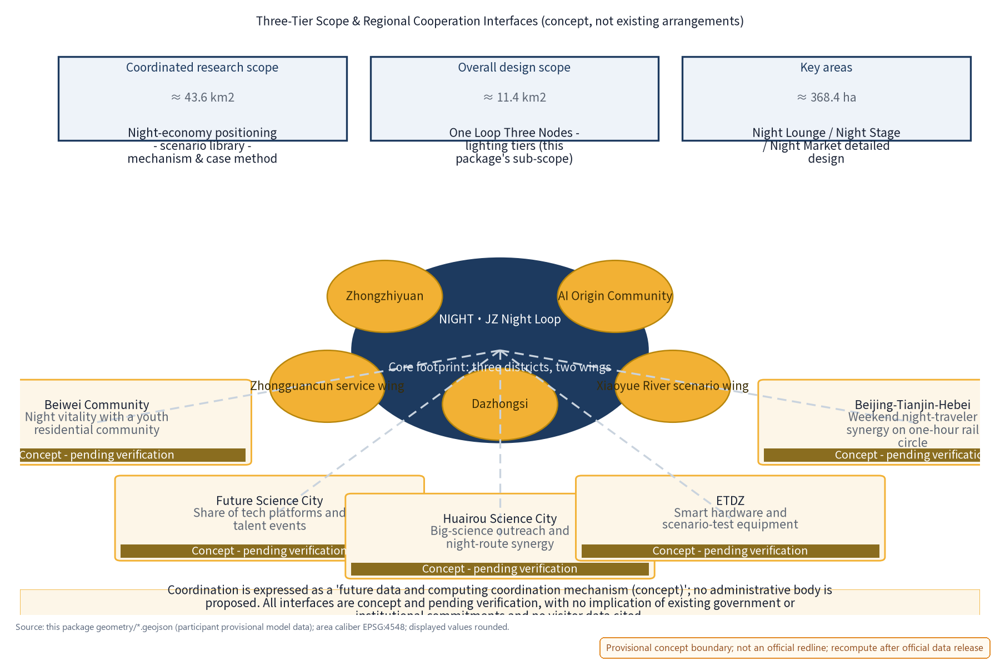
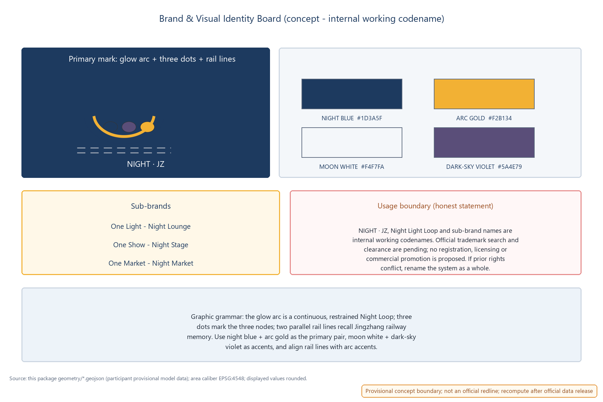
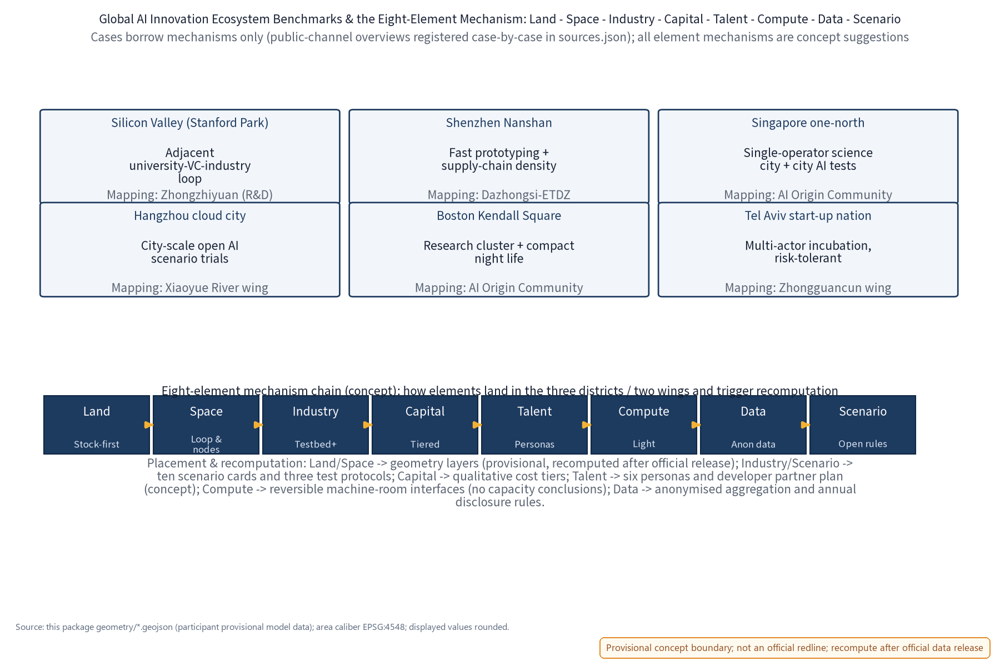
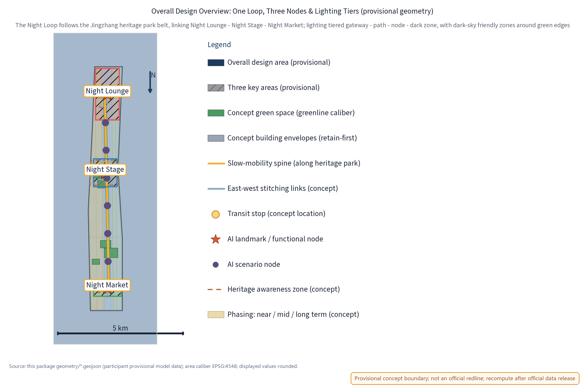
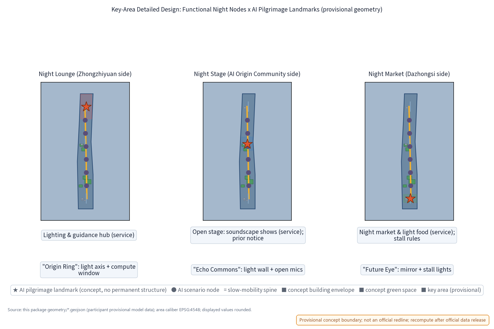
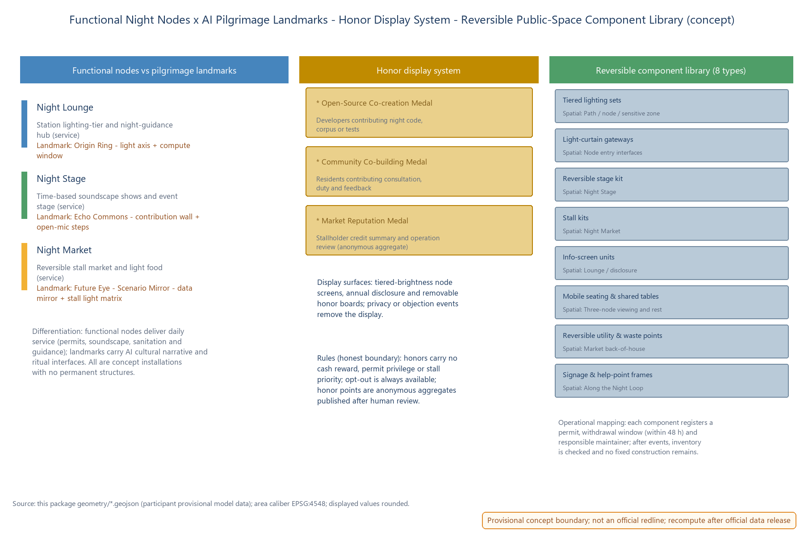
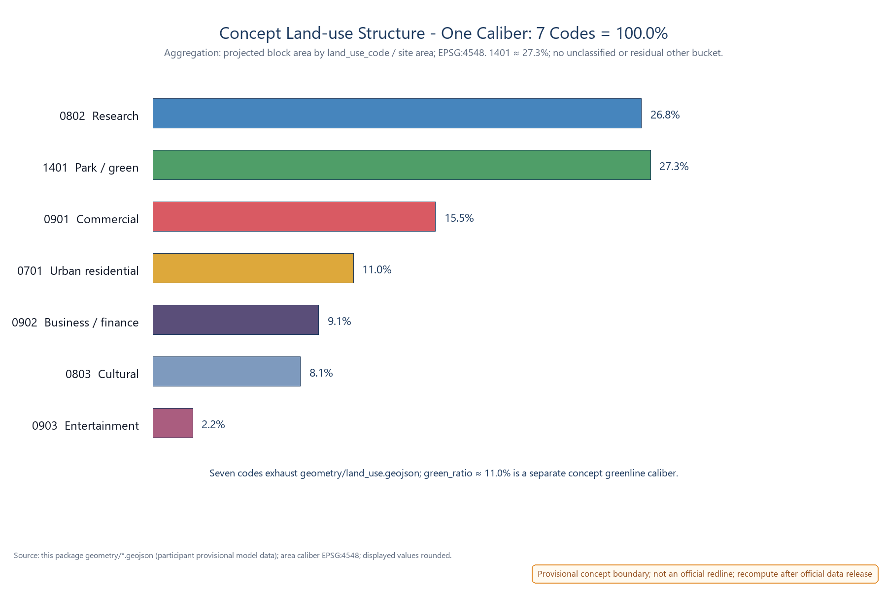
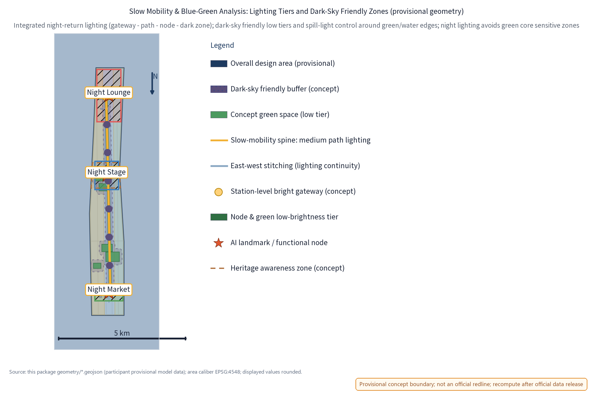
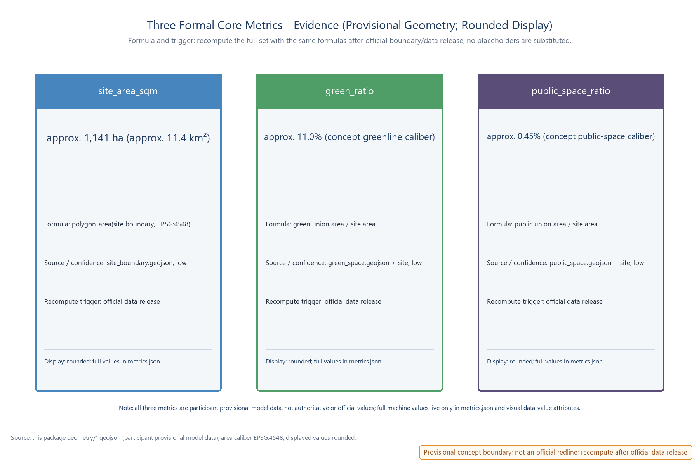

> Day belongs to innovation, night belongs to life. NIGHT·JZ organises the public spaces along the Jingzhang heritage park belt into an operable, governable and replicable night route: One Light, One Show and One Market nodes, closed-loop through five mechanisms - time-based permits, lighting tiers, service credits, event filing and annual disclosure. AI only proposes and summarises; permits and volume are always decided by people.

## Design Basis and Reference List

This proposal follows the open call task book of the Centennial Jingzhang AI Innovation Belt urban design competition: three positioning themes (Centennial Jingzhang culture belt, urban AI living-experience belt, AI-integrated innovation belt), five functions (of which "smart AI vibrant city" is the direct match for this theme), and three districts with two wings (Zhongzhiyuan, AI Origin Community and Dazhongsi districts; Zhongguancun tech-service wing and Xiaoyue River scenario-enabling wing). The theme maps to the Night Vitality dimension of the youth-friendly public space track, the agent.6 event-system dimension and the smart AI vibrant city positioning.

The official announcement states the three-tier scope in text: coordinated research scope approx. 43.6 km2, overall design scope approx. 11.4 km2, and key detailed-design areas approx. 368.4 ha. This package's sub-scope is a night-economy concept inside the overall design scope (night vitality and operation-governance dimensions); its footprint geometry is provisional concept geometry - it is not a full correspondence of the official scopes and not an official redline.

Reference list: task book excerpts and full excerpts (including prohibited-expression list), submission skill documents, reference sample proposals, public standards and regulations; benchmark cases are registered case-by-case in the Benchmark Cases & Source Registration table and sources.json, described only as public-channel overviews without unverified data details. As of this draft, the repository has not provided official overall boundaries or key-area polygons; the proposal uses provisional geometry labelled as such, to be fully recomputed and replaced when official data is released. All spatial suggestions are open co-creation concept suggestions and reference proposals for professional teams to deepen; they do not substitute formal planning or constitute government conclusions.

Proposal evidence anchors use short IDs that map one-to-one to the full sources.json entries: DATA-SRC-OFFICIAL-ANNOUNCEMENT <-> DATA-SRC-OFFICIAL-ANNOUNCEMENT-2026-05-09; DATA-SRC-AGENT-TASKBOOK <-> DATA-SRC-AGENT-TASKBOOK-2026-05-18; DATA-SRC-PROVISIONAL-BOUNDARIES <-> DATA-SRC-PROVISIONAL-BOUNDARIES-2026-06-05; DATA-SRC-GENERATIVE-AI-MEASURES <-> DATA-SRC-GENERATIVE-AI-INTERIM-MEASURES; DATA-SRC-MNR-LAND-USE-CLASSIFICATION <-> DATA-SRC-MNR-LAND-USE-CLASSIFICATION-2023-11-22.

> **Evidence anchors**: [source:DATA-SRC-OFFICIAL-ANNOUNCEMENT], [source:DATA-SRC-AGENT-TASKBOOK] (organiser announcement and task book are the textual-caliber basis).

## Three-Tier Scope Working Framework

The concept proceeds on three tiers through "industry research - spatial structure - node operation - evidence recomputation". The coordinated research scope answers how the night economy and night governance become a long-term operational asset of the belt (producing the night-economy positioning, AI night-scenario library, operation mechanism elements and benchmark case method library); the overall design scope answers where the Night Loop lands and how it shares daytime space (producing the One Loop Three Nodes structure, lighting-tier framework and regulatory-planning-depth urban design expression); the key-area scope places the Night Lounge, Night Stage and Night Market at the functional, spatial and public-experience interface level, with relocatable concept prototypes.

All three tiers share the same provisional temporary geometry: it expresses design structure and content review only, and does not describe statutory redlines, ownership or engineering positioning; after official geometry is released, every tier is recomputed by the same rule, and the structure itself can be re-fit.

Regional cooperation (concept interfaces, not existing arrangements): with the three districts and two wings as the core footprint, this package proposes five conceptual cooperation directions - with Beiwei Community (night vitality linkage with a youth residential community), Future Science City (sharing of tech platforms and talent events), Huairou Science City (big-science outreach and night-route synergy), ETDZ (supply of smart hardware and scenario-test equipment) and the Beijing-Tianjin-Hebei region (weekend night-traveler synergy of the one-hour rail circle). All cooperation relations are labelled concept/pending verification with no implication of existing government or institutional commitments; coordination is expressed as a "future data and computing coordination mechanism (concept)" and no administrative body is proposed.

| Cooperation counterpart | Cooperation content (concept interface) | Status and boundary |
| --- | --- | --- |
| Beiwei Community | Night-return slow routes and vitality-time connection with a youth residential community | Concept; pending resident consultation and measured baseline |
| Future Science City | Linkage of sci-tech events, showcases and night public experience | Concept; no resource commitment |
| Huairou Science City | Science communication, open days and night-route synergy | Concept; pending official interface confirmation |
| ETDZ | Supply of smart hardware, scenario-test equipment and pilot content | Concept; not a procurement or cooperation intent |
| Beijing-Tianjin-Hebei | Weekend night-traveler and destination linkage on the one-hour rail circle | Concept; no visitor data cited |

> **Evidence anchors**: [source:DATA-SRC-AGENT-TASKBOOK] (three-tier scope split follows the official task book text); [source:DATA-SRC-PROVISIONAL-BOUNDARIES] (cooperation diagram is a concept schematic, not an official cooperation network).

## Brand & Visual Identity (NIGHT·JZ Logo and Mark)

Brand naming system: primary Chinese name "Night Light Loop", English name NIGHT·JZ (internal abbreviation of Night-Economy & Lightscape Joint Zone), operation brand "Night Economy & Lightscape Operation Belt". At this stage the names are treated strictly as internal working codenames: no official trademark search has been completed at concept stage; until official search and clearance are completed, no brand-use, licensing or registration arrangements may be signed with any external party, and no commercial promotion is permitted; if a candidate name conflicts with prior rights, the brand will be renamed as a whole. Brand asset ownership, reuse boundaries and generation methods are registered in the copyright statement and asset ledger.

Visual identity direction (concept): the logo uses a "glow arc plus three dots" motif expressing the One Loop Three Nodes, with parallel rail lines continuing the Jingzhang railway industrial memory; standard type NIGHT·JZ / Night Light Loop; primary colors night blue, arc gold and moon white, with dark-sky violet as accent; the sub-brand system is One Light (Night Lounge), One Show (Night Stage), One Market (Night Market), corresponding to the annual programme system (Night Market Season, Summer Open Stage, Winter Light Festival - all concept). The logo, VI board and usage boundary are shown below.

> **Evidence anchors**: [source:DATA-SRC-AGENT-TASKBOOK] (brand and event-system dimension maps to the agent task requirements).

## Coordinated Research Scope: Industry and Future-City Research

Night translation of the three positioning themes: culture belt - railway memory and light narrative connect the daytime heritage park with the night slow route; living-experience belt - night public life becomes an experienceable, operable AI city interface; innovation belt - the night economy becomes an open testbed for AI sensing, energy and guidance scenarios. "Smart AI vibrant city" is the main line among the five functions: the night-governance mechanism itself is a public product of urban intelligence.

Benchmark cases borrow mechanisms, not scales, and are registered case-by-case with public sources (details are not cited or invented; "first", "world's first" and similar claims are public-channel calibers, not independently fact-checked, to be treated as research hypotheses when necessary). This package maintains two benchmark groups - night-economy mechanism cases (6, table below) and global AI innovation ecosystems (6, see "Global AI Innovation Ecosystem Benchmarks"), 12 cases registered case-by-case in sources.json:

| Case (public-channel caliber) | Mechanism borrowed | Source registration (sources.json) | Status |
| --- | --- | --- | --- |
| Shanghai Bund and Yuyuan night tours | Centralised light control, lighting hours and crowd management, "light-show-market" night district | CASE-SRC-BUND-YUYUAN | Public overview |
| Chengdu Jinjiang night cruise | Waterfront-axis continuous night route and light narrative | CASE-SRC-JINJIANG | Public overview |
| Singapore Night Safari (opened 1994; public materials call it the world's first night zoo) | Time-differentiated operation plus moonlight-level low illuminance | CASE-SRC-NIGHT-SAFARI | Public caliber; independent verification pending |
| Amsterdam night mayor (public reports call it the world's first) | A dedicated coordinator connecting operators and residents | CASE-SRC-AMS-NIGHTMAYOR | Public-report caliber; verification pending |
| Shanghai Yuyuan Lantern Festival (public reports trace its modern run to 1995) | Traditional festival night tours, time-based control and resident consultation | CASE-SRC-YUYUAN-FAIR | Public caliber; verification pending |
| Seoul night market brand (public materials date its official launch to 2015) | Time-based market licensing and stallholder admission | CASE-SRC-SEOUL-NIGHT | Public caliber; verification pending |

Future-city research conclusion: the night city needs a governable operation paradigm of "permit - tier - credit - filing - disclosure", where AI performs calculation, summarisation and reminders, and humans keep the judgment. This conclusion is a research hypothesis to be validated by measured night visitor, noise and lighting baselines (currently missing; see the monitoring baseline table).

### Global AI Innovation Ecosystem Benchmarks (agent.2, mechanism borrowing only)

The night economy is only the entry point: following task 1.3.1 "build a world-class AI innovation ecosystem" of the task book, this proposal benchmarks six global AI innovation ecosystems (public-channel overviews; mechanisms only, never scales; "first/leading" phrases are public-channel calibers pending independent verification and treated as research hypotheses when necessary), mapping each ecosystem mechanism to a concrete placement within the three districts and two wings:

| Global AI innovation ecosystem (public-channel caliber) | Mechanism borrowed | Placement (three districts / two wings) | Source registration (sources.json) |
| --- | --- | --- | --- |
| Silicon Valley (Stanford Research Park area) | Adjacent closed loop of university research - venture capital - industrial iteration | Zhongzhiyuan (R&D acceleration) | ECOSYS-SRC-SILICON |
| Shenzhen (Nanshan hardware ecosystem) | Industrial density of rapid prototyping and supply-chain synergy | Dazhongsi - ETDZ coordination | ECOSYS-SRC-SHENZHEN |
| Singapore (one-north) | Single-operator science city + city-scale AI scenario testing | AI Origin Community - coordination mechanism | ECOSYS-SRC-ONENORTH |
| Hangzhou (city-cloud-brain practice) | City-scale open AI scenario trials and data elements | Xiaoyue River scenario wing | ECOSYS-SRC-HANGZHOU |
| Boston (Kendall Square) | Research cluster + compact public space + night-lab economy | AI Origin Community (academic belt) | ECOSYS-SRC-KENDALL |
| Tel Aviv (start-up nation) | Multi-actor incubation and risk-tolerant culture | Zhongguancun tech-service wing | ECOSYS-SRC-TELAVIV |

Ecosystem mechanisms enter this proposal only through a four-step "mechanism - space - operation - recomputation" check: mechanisms are treated as research hypotheses, never copying any institution's organisation or commitments; all spatial placements are provisional geometry; operation is a concept mechanism; everything is recomputed after official data release.

### Eight-Element Mechanism: Land - Space - Industry - Capital - Talent - Compute - Data - Scenario (agent.2)

The six global ecosystem cases are folded into a self-checkable eight-element mechanism chain; every element explicitly states its mechanism content, placement, borrowed case mechanism and recomputation trigger:

| Element | This package's mechanism (concept) | Placement (three districts / two wings) | Case mechanism borrowed | Recompute trigger |
| --- | --- | --- | --- | --- |
| Land | Stock-first, reversible use; no new large buildings for the night economy | Three districts along the Jingzhang green belt | Silicon Valley - stock campus renewal | After official land data release |
| Space | One Loop Three Nodes structure; day/night shared public space | Zhongzhiyuan / AI Origin Community / Dazhongsi | Kendall Square - compact public space | After official geometry release |
| Industry | Industry testbed: three test protocols + open scenario operation rules | Dazhongsi - Xiaoyue River wing | Shenzhen - hardware iteration density | After pilot measurement calibration |
| Capital | No investment promise; qualitative cost tiers (low/medium/high) | Whole belt (concept tiers) | Tel Aviv - risk-tolerant culture | After the system is fixed |
| Talent | Six personas + developer partner plan (concept) + honor display | AI Origin Community - Zhongguancun wing | Silicon Valley - talent circulation | After community pilot |
| Compute | Light-touch, reversible, low-footprint computing-facility direction (no capacity conclusion) | Zhongzhiyuan - machine-room interface direction | one-north - single-operator coordination | After demand estimation |
| Data | Anonymised aggregation, annual disclosure, no individual-identifying tracking | Belt-wide governance interfaces | Hangzhou - city-scale scenario trials | After monitoring system is set up |
| Scenario | Ten AI scenario cards + open operation rules (measurable pass/fail) | Three nodes and the route | Singapore - city-scale test scenarios | After pilot calibration |

The eight-element mechanism shares the same "human review + anonymised aggregation" governance boundary as the ten scenario cards and five operation mechanisms; inter-element linkages (e.g. the talent-to-scenario-to-data loop) are concept statements only, with no output-indicator commitments.

> **Evidence anchors**: [source:ECOSYS-SRC-SILICON], [source:ECOSYS-SRC-SHENZHEN], [source:ECOSYS-SRC-ONENORTH] (first three global ecosystem cases; public-channel mechanism overviews).
> **Evidence anchors**: [source:ECOSYS-SRC-HANGZHOU], [source:ECOSYS-SRC-KENDALL], [source:ECOSYS-SRC-TELAVIV] (last three global ecosystem cases; public-channel mechanism overviews).

> **Evidence anchors**: [source:DATA-SRC-PROVISIONAL-BOUNDARIES] (boundary is provisional; research scope is a concept illustration only).

## Overall Design Scope: Urban Renewal and Regulatory-Planning-Depth Urban Design

The concept overall structure is One Loop, Three Nodes: a Night Loop uses the Jingzhang heritage park belt and transit stops (concept locations) as its skeleton, connecting the Zhongzhiyuan, AI Origin Community and Dazhongsi nodes into a continuous but calm night slow route; lighting is tiered along the path - station-level bright gateways, path-level medium guidance, node-and-green low-brightness zones, plus reserved dark-sky friendly zones. Regulatory-planning depth is expressed as "problem - spatial object - indicator - data gap - recomputation path"; intensity indicators such as FAR and building height remain unknown and do not substitute for regulatory-planning approval.

Urban renewal is stock-first and reversibility-first: the three nodes prioritise existing plazas, public spaces and retainable buildings, using light-touch, removable light and operation components; no large new buildings and no land-use change are introduced for the night economy; the implementation order is "lighting tiers and environmental safety first, then performance and market operation, then governance mechanisms". East-west stitching and north-south connection extend through the night: the Night Loop shares pedestrian interfaces, seating and signage with the daytime public-space network without adding independent works. The temporary boundary is marked provisional and will be recomputed after official geometry is released.

> **Evidence anchors**: [source:DATA-SRC-MOHURD-CONTROL-DETAILED-PLANNING], [source:DATA-SRC-PROVISIONAL-BOUNDARIES] (regulatory-depth expression and provisional-boundary caution).

## Key-Area Detailed Design

### Night Lounge (Zhongzhiyuan side)

Function: station-level night lighting and information interface hub, receiving transit arrivals and serving as the night-guidance start point and a light-environment tier-control demonstration section. Space: organised around the station forecourt, colonnades and existing public interfaces, with lighting transitioning from bright gateway to low-brightness zones, a tiered-lighting demonstration and light-environment information panels, and no new large buildings. Public experience interface: night signage, a luminous route map and paper guides coexist; screen brightness is tiered by time; night commuters first "read the night" here, then enter the Loop.

### Night Stage (AI Origin Community side)

Function: open performance and event stage for community, developer and resident self-organised night activities, with time-based control and soundscape design. Space: primarily an open stage and viewing areas with reversible, demountable stage components; performance hours follow a concept rhythm (quiet mode on weekdays, event mode on weekends - both concept settings); soundscape design requires directional sound, a volume cap and quiet transitions before and after performances to avoid leakage toward residential interfaces. Public experience interface: open viewing, seating zones, event filing and a resident-opinion channel published in advance - residents are informed beforehand, give feedback during, and are evaluated after; no event idea is treated as a confirmed arrangement.

### Night Market (Dazhongsi side)

Function: night market and light-food operation ground carrying small-business night vitality, centred on low-impact reversible stalls. Space: along public interfaces, fully removable stall kits and shared tables; water, power and waste points are reserved as reversible concept interfaces; no capacity or engineering conclusions are given. Public experience interface: low-glare, spill-light-controlled lighting, published stall rules, enclosure defined by light rather than solid walls; stall matching and time-based permits are piloted here, with shared service credits for stallholders and visitors.

### AI Pilgrimage Landmarks vs Functional Night Nodes (agent.4)

Functional night nodes deliver daily service (permits, soundscape, sanitation, guidance); AI pilgrimage landmarks are culture-narrative and ritual interfaces juxtaposed with the nodes but with separate responsibilities (photographable, displayable, without becoming an operation burden). Both share the same spatial carriers but differ in users, content form and maintenance; all are concept installations with no permanent structures:

| Node | Functional night role (service) | AI pilgrimage landmark concept (differentiated theme) | Differentiation logic |
| --- | --- | --- | --- |
| Night Lounge (Zhongzhiyuan side) | Station-level lighting-tier hub and night-guidance start | "Origin Ring": circular light axis + compute display window; theme is the start ritual of "where I plug into AI", with renewable compute-science content slots | Service targets arriving crowds and guidance; landmark targets AI-culture origin narrative, content replaceable |
| Night Stage (AI Origin Community side) | Open performance and event stage with time-based soundscape control | "Echo Commons": open-source contribution light wall (anonymised aggregate) + open-mic steps; theme is the co-creation ritual of "everyone can write AI" | Service targets show operation; landmark targets contributor narrative, light points displayed as anonymised aggregates only |
| Night Market (Dazhongsi side) | Night market and light-food ground with reversible stalls | "Future Eye - Scenario Mirror": data mirror screen (concept) + stall light matrix; theme is "the scenario is the exhibit" | Service targets stallholders and visitors; landmark targets scenario-data narrative, content human-reviewed |

The three landmark concepts are differentiated from each other and independently adjustable: any landmark content is human-reviewed before going live, involves no individual identification, and never displays unverified evaluation or ranking statements.

### Honor Display System (agent.4)

The honor system translates anonymous, auditable, opt-out night public contributions into visible public feedback - no cash reward, no permit privilege, no priority stalls:

| Honor category | Recipients (concept) | Award & review | Display surfaces |
| --- | --- | --- | --- |
| Open-Source Co-creation Medal | Developers contributing code, corpus or tests at night open scenarios | Nominated at contribution nights; reviewed by operation staff + developer representatives | Node info screens (tiered brightness), annual disclosure |
| Community Co-building Medal | Residents contributing to consultation, volunteer duty and feedback | Community liaison recommendation, confirmed by resident assembly | Info screens, removable physical badge boards |
| Market Reputation Medal | Stallholders with clean credit records and no escalated complaints | Credit summary + operation review (anonymised aggregate) | Annual disclosure, market info panels |

Display rules: honor points are anonymised aggregates only, never personal profiles; any privacy event, escalated complaint or objection triggers removal and exit; honor-award data and its caliber are disclosed with the annual disclosure and are reviewable.

### Reversible Public-Space Component Library (agent.4)

The library pins "reversible, removable, reusable" to the spatial and operational mapping of every component (concept catalogue; no engineering or cost conclusions):

| Component | Spatial mapping (node/interface) | Operational mapping (deployment & withdrawal) | Reuse scenarios | Cost tier |
| --- | --- | --- | --- | --- |
| Tiered lighting sets | Paths, nodes, dark-sky sensitive zones | Bound to time permits; withdrawal within 48 h | Daily lighting, festival enhancement | Low-Medium |
| Light-curtain gateways | Entry interfaces of the three nodes | Deployed after event filing; removed after events | Market season, light festival | Low-Medium |
| Reversible stage kit | Night Stage | Bound to performance permits; storable in quiet mode | Open stage, developer nights | Medium |
| Stall kits | Night Market | Bound to time permits; inventoried per withdrawal checklist | Market season, weekend markets | Medium |
| Info-screen units | Lounge, disclosure interfaces | Tiered brightness control; content human-reviewed | Guidance, disclosure, honor display | Medium |
| Mobile seating & shared tables | Viewing and rest areas at the three nodes | Shared day/night; maintained by operation crews | All-day public use | Low |
| Reversible utility & waste points | Market back-of-house, cleaning routes | Permit-bound; points restored after withdrawal | Market season, pop-up events | Low-Medium |
| Signage & help-point frames | Along the Night Loop | Year-round; bound to patrol and emergency operation | Night guidance, safety guidance | Low |

The component library maps item by item to the public-space geometry (geometry/public_space.geojson): every component placement finds its operational owner in the scenario-to-space mapping (see AI section), and no fixed construction remains after any component is withdrawn.

> **Evidence anchors**: [data:PACKAGE-GEOMETRY] (the three node polygons come from this package's geometry/key_areas.geojson, provisional).

## AI Innovation Ecosystem, Talent Personas and AI+ Scenarios

The user personas are not population inference, but night-service differences that must be tested. All six persona types keep non-digital equivalent paths, and any AI tool can be refused or removed:

### Local AI Innovation Ecosystem Architecture (agent.2)

Building on the eight-element mechanism, this proposal expresses the AI innovation ecosystem as a five-layer, self-checkable local architecture (concept; no concrete compute or data-scale conclusions): data layer (anonymised aggregated night-operation data; no individual-identifying collection) -> compute layer (light-touch, reversible, low-footprint machine-room interface direction; no capacity conclusions) -> model-service layer (guidance, matching, monitoring and other scenario models; shadow-tested before going live) -> scenario layer (ten AI scenario cards and open operation rules) -> governance layer (human review, annual disclosure, stop-and-withdrawal). The five layers connect through a "data - scenario - review" loop, with placements in the three districts and two wings shown in the ai-ecosystem figure; every layer keeps a human fallback interface, and any layer can be stopped as a whole.

| Persona | Core need | Service placement |
| --- | --- | --- |
| Night commuter | Safe walking after the last train, continuous lighting, clear guidance | Night Loop path and Night Lounge |
| Young resident | Night socialising, shows and markets, online booking and credits | Night Stage, Night Market |
| Visitor / tourist | Night guidance, orientation and safety | Night guidance AI and signage system |
| Market stallholder | Stall matching, time permits and credit accumulation | Stall-matching AI and credit mechanism |
| Elderly nearby resident | Quiet rights, non-digital equivalent services and opinion channel | Event filing collaboration, annual disclosure |
| Night operation & maintenance staff | Duty management, equipment inspection, decommissioning decisions | Operation governance mechanism and maintenance-workorder AI |

Ten AI scenario cards (input - output & boundary - human review - placement), all processing anonymised aggregated data only, no individual-identifying tracking, and every output can be stopped by humans:

| Scenario card | Category | Input | Output & boundary | Human review | Placement |
| --- | --- | --- | --- | --- | --- |
| Night energy optimisation AI | Energy governance | Anonymised operation data of lighting tiers and hours | Dimming and on/off suggestions; no direct device control, no energy conclusions | Operator confirms before execution | Night Lounge, paths |
| Crowd-density sensing AI | Safety governance | Anonymised aggregated area counts | Density hints and guidance suggestions; no individual identification, no trajectory tracking | On-site staff verify | Three nodes and route |
| Night guidance AI | Public service | Reviewed corpus | Draft route and point narration; paper guides remain equivalent | Editors approve before publishing | Whole Night Loop |
| Stall-matching AI | Industry governance | Stallholder applications, time-slot and space info | Placement suggestion candidates; permits issued by humans | Operation staff review | Night Market |
| Light-pollution monitoring AI | Environment governance | Brightness and spectrum monitoring data | Anomaly alerts and annual-disclosure material | Human review before disclosure | Lounge and green sensitive zones |
| Night-return safety guidance AI | Public service | Anonymised aggregated lighting coverage and help-point status | Safe-route and help-point suggestions; no individual tracking | On-site staff verify | Night Loop paths |
| Event filing collaboration AI | Governance collaboration | Event plan forms and venue proposals | Draft filing material and checklist; permits issued by humans | Operation staff review | Night Stage |
| Market credit AI | Industry governance | Stallholder credit records and event feedback (anonymised) | Credit summaries; no personal profiling | Operation staff verify | Night Market |
| Disclosure copy AI | Public service | Annual monitoring summary data | Draft disclosure text; indicator interpretation reviewed by humans | Human review before publication | Lounge screens, online |
| Maintenance workorder AI | Operation governance | Equipment status and inspection records | Inspection suggestions and decommissioning material; decisions by humans | Maintenance supervisor confirms | Node operation rooms |

Three industry test protocols (sandbox boundaries and exit conditions are explicit; all concept pilots, not test commitments):

| Industry test scenario (test protocol) | Test hypothesis | Sandbox boundary | Exit/pass conditions |
| --- | --- | --- | --- |
| Crowd-density guidance test (Lounge-route) | Anonymised aggregated density hints reduce late-peak dwell congestion | Lounge to route boundary only; no extension to residential interfaces; no individual identification or trajectory retention | Pass: late-peak false-alarm rate below concept threshold for 8 consecutive weeks; fail/exit: privacy complaints or ineffective guidance trigger stop and withdrawal |
| Stall-matching & time-permit pilot (Night Market) | Time x location x volume x business-type permits balance stallholder opportunity and resident peace | Dazhongsi pilot stall kits only; water/power/waste reversible interfaces; no new fixed construction | Pass: no escalated complaints during pilot; fail/exit: noise or waste exceedance revokes permits and withdraws kits |
| Light-pollution & dark-sky zone validation (green edges) | Low-brightness tiers keep sensitive-zone illuminance inside the concept target band | Concept dark-sky pilot luminaires only; heritage and ecological core zones untouched | Pass: 4 consecutive weeks of monitoring compliance; fail/exit: ecological or resident complaints trigger overall downgrade and recomputation |

Scenario-to-space mapping: energy and light-pollution monitoring mainly sit at the Night Lounge and tiered path lighting; crowd-density sensing covers the three nodes and route boundaries, only as basis for guidance and time control; night guidance starts at the Lounge and runs the whole Loop; stall matching is limited to the Market; safety guidance and workorders cover the Loop and operation rooms; filing collaboration and disclosure copy serve the Stage and annual disclosure. All scenarios are constrained by the five mechanism elements - time-based operation permits, night lighting tiers, night-economy service credits, event filing collaboration and annual light-environment disclosure. The Xiaoyue River scenario-enabling wing can be an extension direction for night AI scenario testing and public experience paths (concept). This proposal gives no conclusions on visitor numbers, revenue or stall counts.

> **Evidence anchors**: [source:DATA-SRC-GENERATIVE-AI-MEASURES] (reference basis for generative-AI content governance); [metric:industry_test_scenario_count] (source of the three-industry-test-protocol count).

## Land Use, Building Scale and Retain-Renovate-Demolish Plan

Retain-renovate-demolish follows "retain first" among all three: the heritage park fabric and historical remains are retained; existing stock is functionally reused with reserved computing-facility retrofit directions (machine-room interfaces, display windows); demolition is limited to case-by-case small structures that unblock slow routes; computing facilities are light-touch, reversible, low-footprint, with no large new buildings; all areas are concept calibers to be recomputed after official data release.

The concept land-use layout adopts this package's single caliber (class names follow the current national standard's public subset; aggregation and recomputation rules below):

| Land-use code (national public subset) | Class | Share of site area (concept) | Confidence |
| --- | --- | --- | --- |
| 0802 | R&D land | approx. 26.8% | Low (concept sketch) |
| 1401 | Park and green land | approx. 27.3% | Low (concept sketch) |
| 0901 | Commercial land | approx. 15.5% | Low (concept sketch) |
| 0701 | Residential land | approx. 11.0% | Low (concept sketch) |
| 0902 | Business/finance land | approx. 9.1% | Low (concept sketch) |
| 0803 | Cultural land | approx. 8.1% | Low (concept sketch) |
| 0903 | Entertainment land | approx. 2.2% | Low (concept sketch) |

Caliber statement: the percentages above use one land-use-class caliber = sum of projected concept parcel areas grouped by the same land_use_code in geometry/land_use.geojson divided by geometry/site_boundary.geojson area (all areas computed in EPSG:4548). Code 1401 is five parcels totaling 3,116,095.041 sqm / 11,412,825.386 sqm = 27.30345%, displayed as approx. 27.3%. All 27 features fall into the seven tabled codes, which total 100.0%; there is no residual or unclassified “other 4.6%” bucket, and roads/water are not invented as extra classes. This table is the package's only land-use classification. The green_ratio in metrics.json (approx. 11.0%) is the separate "concept greenline caliber" = geometry/green_space.geojson area divided by site area. The two calibers are distinct and not interchangeable; when official land-use and boundary data are released, everything is recomputed by the same aggregation rule, and unknown or placeholder values are not used in the meantime.

Retain-renovate-demolish follows a four-step concept principle: "verify current condition and ownership first; retain when safe and heritage-compliant; lightly renovate where necessary; relocate or withdraw where conflicting" - no plot-level demolition areas are given. Indicators depending on unpublished official control conditions (FAR, building height, building intensity) remain unknown until regulatory plans and surveys are available for recomputation. Light sources and operation components are all reversible, removable and replaceable, with no fixed construction dependent on the night economy. Temporary geometry supports structure expression only, not any scale conclusion.

> **Evidence anchors**: [source:DATA-SRC-MNR-LAND-USE-CLASSIFICATION] (land-use class names follow the current national standard); [metric:land_use_1401_ratio] (1401 aggregation and no-residual check); [metric:green_ratio] (greenline-caliber distinction).

## Transport, Transit, Municipal and Public Service Facilities

Integrated night-return slow lighting and safe routes: night routes are organised around transit stops (concept locations) with lighting tiered "gateway - path - node - dark zone"; one light pole covers path lighting, night signage and help-point marking to reduce facility count; safety design emphasises open sight lines, unobstructed corners, continuous lighting and physical help points, sharing the same pedestrian interface day and night. This concept gives no lighting-energy or engineering conclusions.

Last-train connection: conceptually a "slow-guidance after last arrival" mechanism - night route guidance at exits in parallel with paper versions, low-level lighting, seating and shelter in waiting spaces; connection rhythm follows real-time transit alerts (concept mechanism, not a schedule commitment), walking and cycling are preferred, and no automated shuttle or capacity conclusions are introduced. Municipal and public services are reversible point components: stall water/power interfaces, bins, mobile seating and info kiosks are concept configurations without pipeline-capacity estimation.

> **Evidence anchors**: [source:DATA-SRC-MOHURD-URBAN-DESIGN-MEASURES] (method reference for municipal and slow-mobility expressions).

## Blue-Green Space, Public Space and City Character

A "green belt as axis, node parks as beads" blue-green public-space system: the heritage park green belt is the skeleton linking small green spaces and open spaces; computing and display facilities integrate with parks as light-transparent-reversible elements that do not block views of historical remains or the green belt; the Night Lounge, Night Stage and Night Market all provide public science-communication and experience interfaces with human-service fallback; character continues the Jingzhang railway industrial-memory vocabulary in orderly dialogue with new computing facilities, with restrained unified guidance.

Blue-green and night light-environment coordination: green and water edges adopt dark-sky friendly low-brightness tiers and spill-light control to protect nocturnal flora/fauna rhythms and reduce ecological light pollution; night lighting is placed only along paths and nodes, avoiding green core sensitive zones. At the public-space level, the Night Loop is the night version of the daytime public-space network: seating, shade and accessible ramps are shared with daytime; deep night hours wind down through time-based control and calm interfaces return before dawn. Character control follows the concept direction of "low glare, warm tone, railway industrial memory plus restrained light art", without neon skins or high-saturation dynamic screens; light-art installations are replaceable content nodes, and no permanent landmark structures are built. The urban temperament continues the plain industrial scale of the Jingzhang railway: night vitality comes from orderly people and light, not brightness competition.

### Culture Narrative & International Communication Copy Bank (agent.5, reusable zh/en)

The narrative strategy has three layers: first "railway memory" (Jingzhang railway industrial vocabulary - a century of accumulation); second "Zhongguancun innovation" (agglomeration and openness); third "AI public life" (people under the lights, anonymised aggregation, human-review governance ethics). The copy below is a directly reusable bilingual bank, every item with usage boundaries:

| Use | Chinese copy (reusable) | English copy (reusable) | Usage boundary |
| --- | --- | --- | --- |
| Mission statement | “白天属于创新，夜晚属于生活。夜光智环让人与光在百年京张线上重新相遇。” | Day belongs to innovation, night belongs to life. NIGHT·JZ reunites people and light along the Centennial Jingzhang line. | Internal working codename stage: package display and community communication only, no commercial external use |
| Elevator pitch | “一条可运营、可治理、可复制的夜间动线：一亮、一演、一市，五项机制闭环，AI 只建议、许可由人决定。” | An operable, governable, replicable night route: One Light, One Show, One Market; five mechanisms in a closed loop; AI suggests, humans decide. | Human review before any public-channel use; never implies confirmed arrangements |
| Wayfinding intro | “从这里接入夜色，也从这里接入AI：客厅的光在告诉你下一站在哪里。” | Plug into the night here - and into AI: the Lounge light tells you where the next stop is. | Multilingual versions follow localisation, not word-for-word translation |
| Event invitation | “周末的舞台灯光不喧哗：节拍、音量与安静时段，都在人手里。” | Weekend stage lights stay calm: rhythm, volume and quiet hours always remain with people. | Events are concepts; update to actual arrangements or keep the concept label |
| Annual disclosure intro | “我们把一年的光、声与数据，透明地交还给你审阅。” | We return a year of light, sound and data to you - transparently, for your review. | Professional and legal review before publication |
| Media one-liner | “夜景经济不是亮度的竞赛，而是秩序、边界与公共生活的演练场。” | The night economy is not a brightness race; it is a rehearsal ground for order, boundaries and public life. | No unverified visitor, revenue or ranking data is ever accepted |

Channels and rhythm (concept): offline info screens in parallel with paper guides, online community channels (no third-party resource commitments); always human-reviewed before publishing, with the update rhythm aligned to the annual disclosure; international communication is localised against this copy bank - no word-for-word translation, no exaggerated effects, no provisional data released externally.

> **Evidence anchors**: [source:DATA-SRC-MOHURD-URBAN-DESIGN-MEASURES] (method reference for blue-green organisation).

## Renewal Project List, Implementation Policies and Phasing Plan

Three project lists (concept lists, not investment commitments): lighting & environment - light-environment tier demonstration, night-return path lighting, light-pollution monitoring pilot, dark-sky friendly zones; performance & market - Night Stage reversible components, Night Market stall kits, night guidance and event-filing collaboration templates; operation & governance - time-based operation permits, night-economy service credits, annual light-environment disclosure, resident opinion channel.

Implementation policies are mechanism concepts: time-based operation permits are issued on "time x location x volume x business type"; service credits accumulate stallholder trust and event feedback; event filing collaboration forms an inform-inspect-evaluate loop; annual disclosure publishes monitoring and evaluation results.

Annual programme brand system (concept; not a commitment to hold events; every programme has exit conditions):

| Annual programme brand | Period (concept) | Content and control | Exit condition |
| --- | --- | --- | --- |
| Night Market Season | Once each in spring and autumn | Reversible stall market plus credit-mechanism trial | Stops if safety or waste indicators fail |
| Summer Open Stage | Summer weekend evenings | Time-based soundscape performances plus event filing | Narrows hours on noise exceedance |
| Winter Light Festival | Winter | Low-illuminance light installations plus lighting-tier demonstration | Downgrades and recomputes on light-pollution complaints |

Phasing (concept pace, not confirmed schedule): near-term 1-3 years - the Night Lounge pilots lighting tiers and night guidance, with Stage and Market validated as pop-ups; mid-term 3-5 years - the three nodes form per validation results, the five mechanisms are piloted, and AI scenarios enter shadow testing with human review; long-term 5-10 years - the Night Loop is completed, annual disclosure becomes routine, and mechanisms extend to the wider belt. Every phase has evaluation thresholds: unmet targets trigger stop or withdrawal (stop conditions and exit mechanisms).

Pilot implementation and long-term operation responsibility matrix (concept RACI; lead and collaboration roles are concept divisions, no institutions are proposed; R=responsible, A=accountable, C=consulted, I=informed):

| Responsibility item | Lead | Collaboration | Mechanism placement |
| --- | --- | --- | --- |
| Area operation coordination (pilot coordination) | Area operation coordinator (R/A) | Relevant government offices, professional teams (C/I) | Time permits and annual disclosure |
| Lighting and light environment | Lighting professional team (R/A) | Maintenance crews (I) | Lighting tiers, light-pollution monitoring AI |
| Noise and performances | Event operation (R/A) | Acoustics consultants (C), resident representatives (I) | Soundscape design, event filing |
| Event safety and emergency | Operation safety lead (R/A) | Fire services, emergency contacts (C/I) | Admission verification, contingency plans |
| Food and market | Market operation (R/A) | Market-regulation liaison (C/I) | Stall rules, food operation registration |
| Waste and sanitation | Sanitation liaison (R/A) | Stallholders (R) | Reversible waste points, withdrawal checklist |
| Privacy and data | Data officer (R/A) | Legal advisers (C) | Anonymised aggregation, annual data disposal |
| Resident consultation and disclosure | Community liaison (R/A) | Resident representatives (C/I) | Inform - feedback - evaluation |

Pre-admission conditions (all concept requirements): site safety and fire verification; baseline night-environment monitoring of lighting, noise, waste and crowds filed first; resident prior notice and an opinion channel published in advance; complete filing materials (event-filing template, emergency contacts, food-operation and stall rules); reversible-component checklist and withdrawal plan confirmed.

Cost categories (no unverified amounts; qualitative tiers only):

| Cost category | Qualitative tier | Estimation method | Price base period | Coverage | Confidence | Recompute trigger |
| --- | --- | --- | --- | --- | --- | --- |
| Lighting components and tier system | Low-Medium | Order-of-magnitude from comparable pilot price bands | 2026 concept stage | Luminaires, controllers, light-environment info panels | Low | When technology and scale are fixed |
| Reversible stage and stall kits | Medium | Unit cost x quantity band estimate | 2026 concept stage | Stage, stalls, shared tables | Low | When locations and counts are fixed |
| Operation staffing and monitoring | Medium | Posts x market salary band | 2026 concept stage | Operation, security, monitoring, data officer | Low | When the operation system is fixed |
| Annual disclosure and evaluation | Low | Evaluation workload estimate | 2026 concept stage | Monitoring report, disclosure production, review meeting | Low | When the monitoring system is fixed |

Monitoring baseline (items without measured baselines are marked "to be established"; no invented numbers):

| Monitoring object | Baseline status | Success threshold (concept) | Failure threshold (concept) |
| --- | --- | --- | --- |
| Lighting and light pollution | To be established | Sensitive-interface illuminance within the tier target band | Complaints or exceedance trigger downgrade |
| Noise | To be established | Directional sound compliant during performance hours | Exceedance narrows hours or stops |
| Event safety and emergency | To be established | No safety incidents; emergency response compliant | Incidents trigger halt and review |
| Food operation | To be established | Licenses/registration complete; sampling compliant | Non-compliant stalls removed |
| Waste and sanitation | To be established | Daily clearance and sorting compliant | Accumulation triggers closure and withdrawal |
| Privacy and data | System-first | No individual-identifying events with aggregation | Privacy events stop the related AI |
| Resident consultation and disclosure | To be established | Prior-notice rate and feedback loop compliant | Escalated complaints trigger the stop procedure |

Stop-and-withdrawal procedure (concept): triggers = monitoring enters the failure-threshold band, escalated resident complaints, privacy or safety events; procedure = area operation coordination (lead) suspends permits, removable components are withdrawn and lighting downgraded within 48 hours, an incident statement is published within 7 days, and an annual evaluation decides resumption or termination; temporary data is deleted or de-identified under privacy rules.

### Developer Community Operation Mechanism (agent.6)

The developer community aims to make "night scenarios" an open interface that the open-source community can inspect, co-build and exit; the mechanism is concept-level, proposes no institutions and promises no operational resources:

| Mechanism | Concept content | Boundary and prohibitions |
| --- | --- | --- |
| Developer partner plan | Volunteer-style participation list: corpus contribution, scenario testing, community duty; rewarded with credits and honor display (non-cash) | No employment, incubation or cooperation commitment; no personal data |
| Community rhythm | Concept regular activities: night hackathons, open-source nights, scenario demo days (all subject to community consultation) | All events are concepts; every event is filed and exited independently |
| Asset opening rules | Anonymised-aggregate sandbox data and scenario access documentation; candidate open-source licenses (e.g. Apache-2.0/MIT) pending legal confirmation | Sandbox data prohibits individual identification; no external licensing before license confirmation |
| Operation support | Concept rotating professional teams + volunteer self-organisation, with a human-review liaison | No institutions proposed; no equipment or funding commitments |

### AI Scenario Open Operation Rules (agent.6, measurable boundaries)

Ten scenario cards must follow uniform open operation rules when online: data-quality requirements (sampling and missing-rate calibrated in pilots), benchmark and shadow mode (new models run in shadow comparison against the existing baseline), quantitative pass/fail definitions (calibrated before pilot, disclosed before operation), human-review interfaces (operator dashboards; any output stoppable) and exit conditions (privacy, safety or exceedance events stop the scenario):

| Scenario card | Data-quality requirement (pilot-calibrated) | Benchmark & shadow mode | Quantitative pass/fail (calibrated, then disclosed) | Human-review interface | Exit condition |
| --- | --- | --- | --- | --- | --- |
| Night energy optimisation AI | Tiered lighting run records; missing rate below pilot threshold | Shadow comparison against utility ledgers | Adoption rate and false-alarm rate double thresholds | Operations dashboard | Energy anomaly or complaints stop it |
| Crowd-density sensing AI | Area aggregated counts, no individual fields | Shadow comparison against manual guidance records | Late-peak false-alarm rate and response-time thresholds | On-site review screens | Privacy events stop it |
| Night guidance AI | Reviewed corpus, versioned | Shadow comparison with existing guide texts | Content accuracy and human-rejection rates | Editor review | Factual errors take it down |
| Stall-matching AI | Application forms + time-slot/space data | Shadow comparison with manual placement results | Adoption and dispute rates | Operation staff review | Escalated complaints stop it |
| Light-pollution monitoring AI | Brightness/spectrum records with instrument calibration | Shadow comparison with manual spot checks | False-alarm and miss-rate double thresholds | Human review before disclosure | Ecological complaints downgrade it |
| Night-return safety guidance AI | Lighting coverage and help-point status | Shadow comparison with patrol records | Guidance accuracy, help-point availability | On-site staff verify | Safety events stop it |
| Event filing collaboration AI | Filing forms and venue parameters | Shadow comparison with human checklists | Material completeness, checklist miss rate | Operation staff review | Violations stop it |
| Market credit AI | Credit records (anonymised aggregate) | Shadow comparison with manual credit review | Agreement and dispute rates | Operation staff verify | Privacy events stop it |
| Disclosure copy AI | Annual monitoring summaries | Shadow comparison with human drafts | Indicator-explanation accuracy | Human review before publication | Caliber errors trigger rework |
| Maintenance workorder AI | Equipment status and inspection records | Shadow comparison with manual workorders | Workorder accuracy, miss rate | Maintenance supervisor confirms | Stops are decided by humans |

Rules: all "thresholds" in the table are pilot-calibrated preset values; nothing goes live and no performance is claimed before actual calibration; calibration results are published with the annual disclosure.

### Talent - Enterprise - Developer Non-Committal Conversion Pathway (agent.6)

The pathway connects "participating in night public life" with "entering the AI innovation ecosystem" as a ladder; every step is explicitly non-committal:

| Step | Participation mode (concept) | Boundary and formalisation conditions |
| --- | --- | --- |
| Experiencer | Night guidance, shows and markets; non-digital equivalent paths | No registration; no individual data collection |
| Co-creator | Feedback, volunteer duty, corpus contribution; honor display and credits | Credits have no cash value and no privileges; opt-out anytime |
| Pilot participant | Stallholders, performers, developers apply for sandbox and test-protocol eligibility | Pilot eligibility is human-reviewed; no cooperation intent |
| Ecosystem partner | Concept-stage informal engagement with universities, enterprises and communities | No employment, incubation, procurement, investment or policy commitment; formal cooperation requires official procedures and contracts |

No statement on any step may be relayed as a "confirmed arrangement"; the pathway stays consistent with the "future data and computing coordination mechanism (concept)" and proposes no government body.

> **Evidence anchors**: [source:DATA-SRC-AGENT-TASKBOOK] (phasing, event system and operation items map to task-book requirements); [metric:annual_program_count] (source of the annual programme count).

## Indicator System, Area Recomputation and Compliance Matrix

The concept indicator system is organised around light-environment quality, night accessibility and operation-governance completeness: lighting-tier coverage, night-route length, scenario-pilot counts, mechanism-item counts and disclosure counts are all concept counts without performance commitments. The three formal core visual indicators - site_area_sqm, green_ratio and public_space_ratio - must be recomputable from the submitted site_boundary, green_space and public_space geometry. This draft recomputes from provisional geometry: layer areas are computed in EPSG:4548, green_ratio = green-space area / site area, public_space_ratio = public-space area / site area; the values are low-confidence provisional design-model numbers kept consistent with the data-value attributes of visual/index.html; the release of official boundaries and data triggers a full recomputation and replacement, and unknown or placeholder values are not used in the meantime.

Display precision rule: provisional values are always rounded for display - site area approx. 1,141 ha (approx. 11.4 km2), green ratio approx. 11.0%, public-space ratio approx. 0.45%; no millimetre-grade or many-decimal "pseudo-survey precision" is shown, and full machine-verifiable values remain only in metrics.json and data-value attributes. Indicators depending on unpublished official control conditions (FAR, building height) remain unknown with reasons stated. The compliance matrix links the task book, proposal text, scenario cards and indicator files item by item, as coverage proof for the youth-friendly public space, agent.6 and smart AI vibrant city dimensions.

> **Evidence anchors**: [metric:site_area_sqm], [metric:green_ratio], [metric:public_space_ratio] (all three recomputed from this package's geometry, provisional) [source:PACKAGE-GEOMETRY].

## Risks, Copyright and Compliance

Risks and responses: light pollution and resident peace - lighting tiers, time-based control and annual disclosure; performance noise - soundscape design, volume caps and resident opinion channels; over-monitoring - crowd sensing is anonymised aggregation only, no individual-identifying tracking, all AI outputs human-reviewed and stoppable; provisional-boundary misreading - provisional markers and recomputation triggers retained throughout; event-idea misreading - uniformly expressed as "concept suggestion"/"reference proposal", never as confirmed arrangements; cost misreading - costs are qualitative tiers only, no unverified amounts.

Brand prior rights and usage boundary: no official trademark search has been completed at concept stage; NIGHT·JZ, Night Light Loop and sub-brand names are treated strictly as internal working codenames; until official search and clearance, no brand-use, licensing or registration arrangements may be signed with external parties, and no commercial promotion; if conflicts with prior rights arise, the brand will be renamed as a whole; this proposal's brand expressions are not a rights claim or authorisation evidence.

Copyright: the text, figures and structure of this proposal are original; generation is AI-assisted and disclosed (see agent.json and the copyright statement); benchmark cases are described only as public-channel mechanism overviews with case-by-case source registration, without copying copyrighted images, marks or long passages; public standards and regulations are referenced only as methods. Compliance: all content is open co-creation suggestion and does not replace formal planning or statutory approval; no FAR, engineering, energy, investment, visitor or stall conclusions are given; provisional model data is never called authoritative or official; consistency with the announcement is phrased as "consistent with announcement text (self-computed per the announcement, not officially issued)"; public-interest-first and human-centred governance principles are followed.

> **Evidence anchors**: [source:DATA-SRC-OFFICIAL-ANNOUNCEMENT] (the competition rules are the basis of ownership and compliance expressions).

## References

| Category | Content and use | Status and restriction |
| --- | --- | --- |
| Task book | Excerpts and full excerpts (including prohibited-expression list) | Read; concept basis |
| Submission skills | Proposal structure and formal submission package requirements | Read; executed as v2 bilingual contract |
| Reference samples | 007xf and others | B orrowing chapter style and structure only |
| Benchmark cases | Twelve: 6 night-economy mechanisms + 6 global AI innovation ecosystems | Public overviews registered case-by-case; no data details |
| Public standards | Regulatory-planning measures, urban design measures, land-use classification guide, interim measures on generative AI | Method references; not approval basis |
| Site data | Official boundary and key-area geometries | Missing; provisional geometry used, to be recomputed after official release |

The full source registry, indicator file, compliance matrix, standard matrix and design-depth matrix accompany this package; citation and generation methods are recorded per the public-material boundary and generation-disclosure principles. Official boundary, ownership, regulatory-planning, heritage, transport and municipal data must be supplemented before formal deepening.

> **Evidence anchors**: [source:DATA-SRC-OFFICIAL-ANNOUNCEMENT] (first item of this list is the organiser's public data package).
