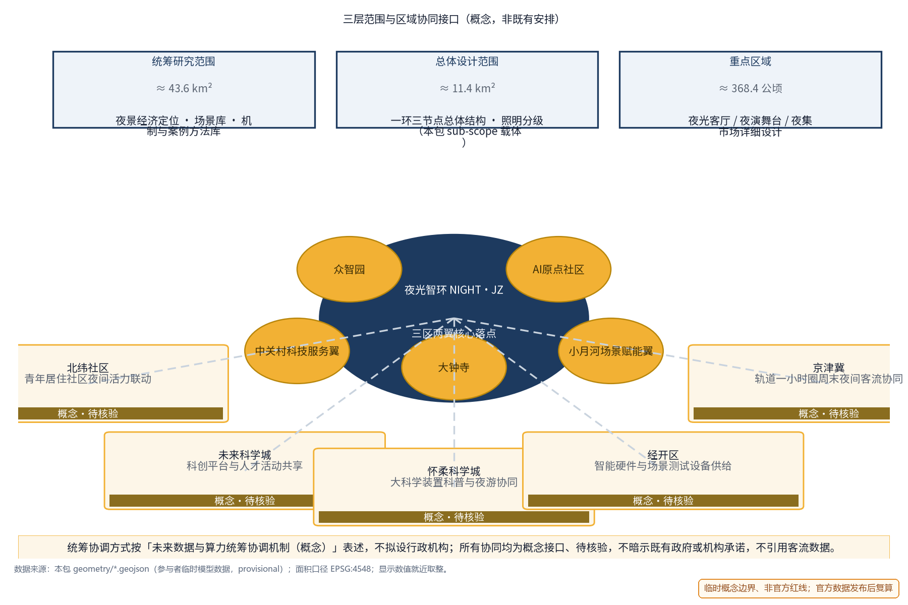
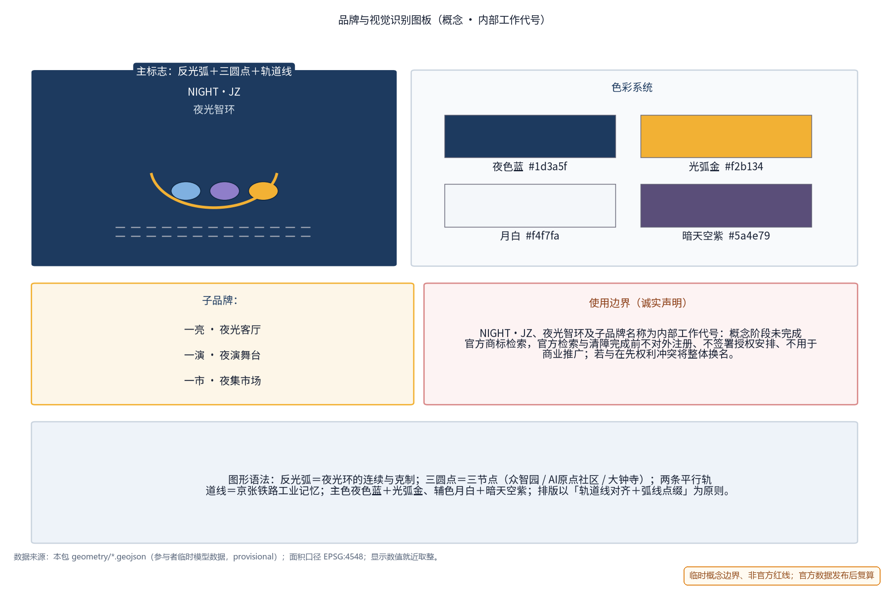
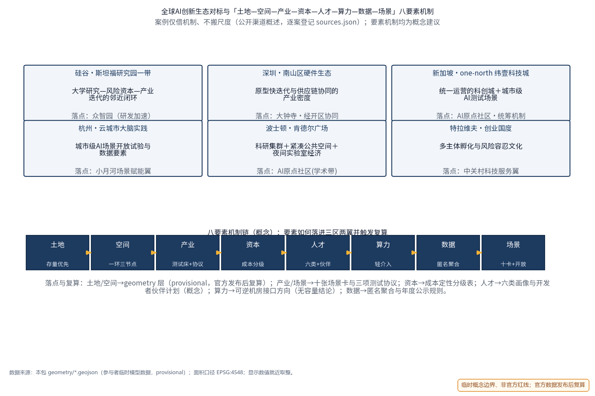
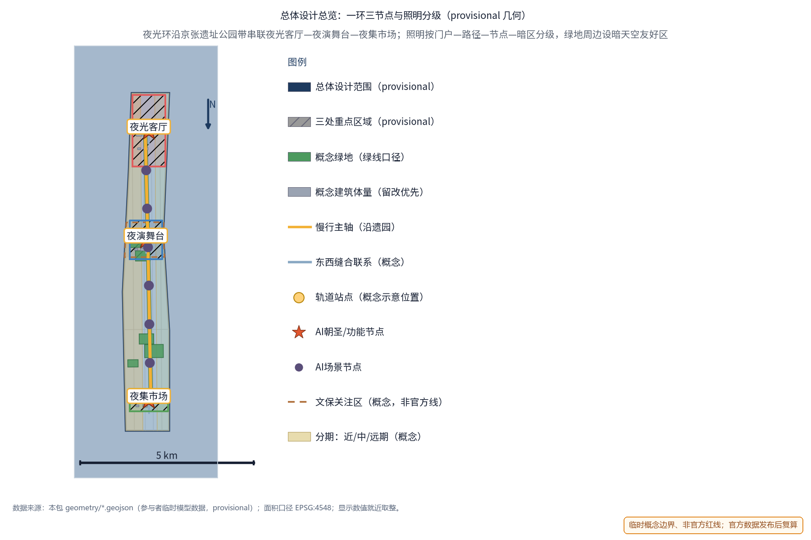
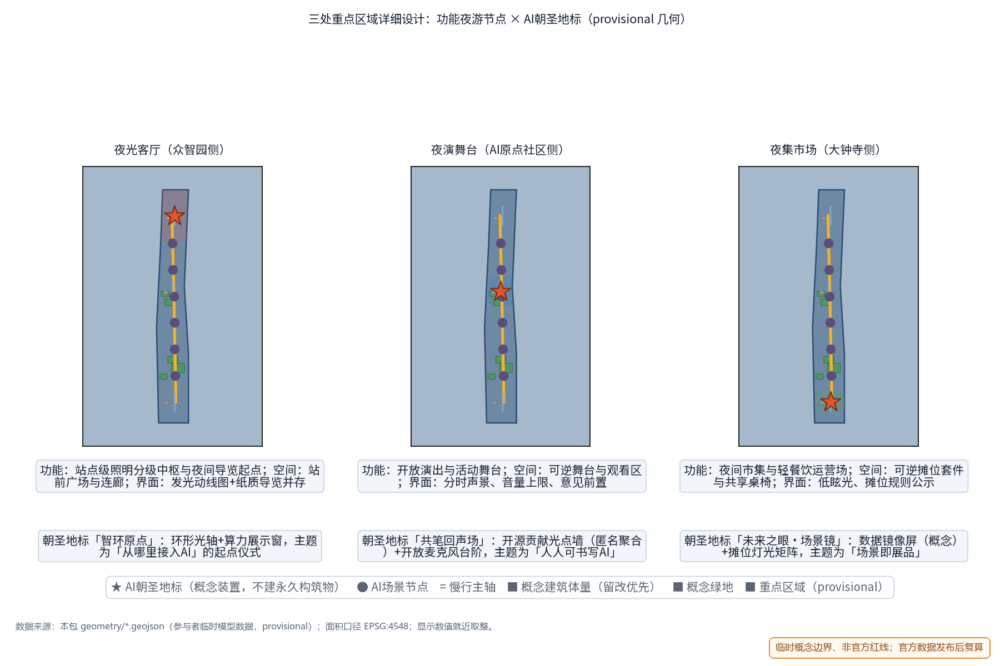
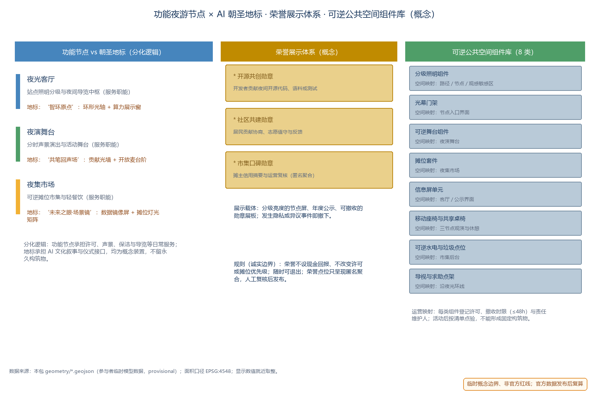
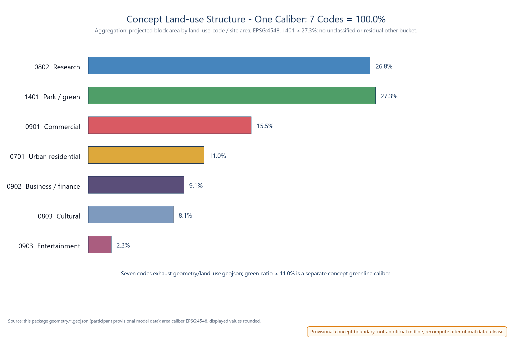
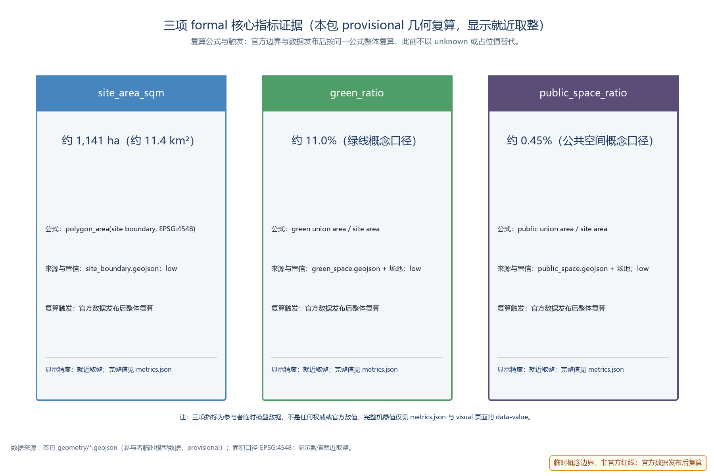

> 白天属于创新，夜晚属于生活。夜光智环将京张遗址公园带沿线的公共空间组织为一条可运营、可治理、可复制的夜间动线：一亮、一演、一市三处节点，以分时许可、照明分级、服务积分、活动报备、年度公示五项机制闭环运转；AI 只提供建议与汇总，许可与音量始终由人决定。

## 设计依据与资料清单

本提案依据百年京张AI创新带城市设计开源征集任务书组织：三大定位（百年京张文化带、都市AI生活体验带、AI融合创新带）、五大功能（其中"智能化AI活力城市"为本主题的直接对应）、三区两翼（众智园、AI原点社区、大钟寺三区，中关村科技服务翼与小月河场景赋能翼）。主题对应任务书青年友好公共空间 track 的夜间活力维度、agent.6 活动体系维度与智能化AI活力城市定位。

公告给出的三层范围文本口径为：统筹研究范围约 43.6 km²、总体设计范围约 11.4 km²、重点区域约 368.4 公顷。本包的 sub-scope 是总体设计范围内部的夜景经济专项概念（对应总体设计范围内的夜间活力与运营治理维度），落点几何为 provisional 概念几何，不等于公告范围的完整对应，更不构成官方红线。

资料清单：任务书摘录与全文摘录（含禁止性表述清单）、投稿技能文档、参考样例提案、公开标准与管理办法；对标案例逐案登记见「对标案例与来源登记」表及 sources.json，仅按公开渠道概述，不引用未经核验的数据细节。截至本稿，仓库未提供官方总体边界与重点区 polygon，方案采用标记为 provisional 的临时几何支撑概念设计，正式数据发布后整体替换复算。全部空间建议均为开放共创的概念建议与参考方案，供专业团队深化研究，不替代正式规划，不构成政府审定结论。

正文证据锚点使用短标识，与 sources.json 的完整条目一一对应：DATA-SRC-OFFICIAL-ANNOUNCEMENT ↔ DATA-SRC-OFFICIAL-ANNOUNCEMENT-2026-05-09；DATA-SRC-AGENT-TASKBOOK ↔ DATA-SRC-AGENT-TASKBOOK-2026-05-18；DATA-SRC-PROVISIONAL-BOUNDARIES ↔ DATA-SRC-PROVISIONAL-BOUNDARIES-2026-06-05；DATA-SRC-GENERATIVE-AI-MEASURES ↔ DATA-SRC-GENERATIVE-AI-INTERIM-MEASURES；DATA-SRC-MNR-LAND-USE-CLASSIFICATION ↔ DATA-SRC-MNR-LAND-USE-CLASSIFICATION-2023-11-22。

> **证据锚点**：[source:DATA-SRC-OFFICIAL-ANNOUNCEMENT]、[source:DATA-SRC-AGENT-TASKBOOK]（组织方公告与任务书为文本口径依据）。

## 三层范围工作框架

概念按三层范围推进，以"产业研究—空间结构—节点运营—证据复算"贯通。统筹研究范围回答"夜景经济与夜间治理如何成为一带的长期运营资产"，产出夜景经济定位、AI+夜景场景库、运营要素机制与对标案例方法库；总体设计范围回答"夜光环落在何处、与日间空间如何共用"，产出一环三节点总体结构、照明分级框架与控规深度城市设计表达；重点区域范围把夜光客厅、夜演舞台、夜集市场落实到功能、空间与公共体验界面，并给出可整体移位的概念原型。

三层共用同一套 provisional 临时几何：只表达设计结构与内容评审，不描述法定红线、权属与工程定位；官方图形公布后，各层按同一规则复算替换，结构本身可平移适配。

区域协同（概念接口，非既有安排）：本包以三区两翼为核心落点，对外提出五项概念协同方向——与北纬社区（青年居住社区夜间活力联动）、未来科学城（科创平台与人才活动共享）、怀柔科学城（大科学装置科普与夜游协同）、经开区（智能硬件与场景测试设备供给）及京津冀（轨道一小时圈周末夜间客流协同）的协作关系全部标注为"概念、待核验"，不暗示已有政府或机构承诺；统筹协调方式按「未来数据与算力统筹协调机制（概念）」表述，不拟设行政机构。

| 协同对象 | 协作内容（概念接口） | 状态与边界 |
| --- | --- | --- |
| 北纬社区 | 夜归慢行路径与青年居住社区活力时段衔接 | 概念；待居民协商与实测基线 |
| 未来科学城 | 科创活动、成果展示与夜间公共体验联动 | 概念；不涉及资源承诺 |
| 怀柔科学城 | 科学传播、开放日与夜游动线协同 | 概念；待官方接口确认 |
| 经开区 | 智能硬件、场景测试设备与试点供给 | 概念；不构成采购或合作意向 |
| 京津冀 | 轨道周末夜间客流与目的地联动 | 概念；不引用客流数据 |

> **证据锚点**：[source:DATA-SRC-AGENT-TASKBOOK]（三层范围划分依据任务书官方文本口径）；[source:DATA-SRC-PROVISIONAL-BOUNDARIES]（区域协同图为概念示意，非官方合作网络）。

## 品牌与视觉识别（NIGHT·JZ 标识与 Logo）

品牌命名体系：主名称「夜光智环」、英文名 NIGHT·JZ（Night-Economy & Lightscape Joint Zone 的内部缩写）、运营品牌「夜景经济与光影运营带」。命名现阶段一律按内部工作代号处理：概念阶段未完成官方商标检索，官方检索与清障完成前不与任何外部主体签署品牌使用、授权或注册安排，不用于商业推广；候选名若与在先权利冲突，将整体换名。品牌资产权属、引用边界与生成方式登记见版权说明与资产台账。

视觉识别方向（概念）：Logo 以"反光弧＋三圆点"表达一环三节点，平行轨道线延续京张铁路工业记忆；标准字 NIGHT·JZ / 夜光智环；主色为夜色蓝、光弧金、月白，辅以暗天空紫；子品牌系统为一亮（夜光客厅）、一演（夜演舞台）、一市（夜集市场），对应年度活动体系（夜光市集季、夏夜开放舞台、冬日灯光节，均为概念）。Logo、VI 图板与使用边界见下图与品牌图板。

> **证据锚点**：[source:DATA-SRC-AGENT-TASKBOOK]（品牌与活动体系维度对应 agent 任务要求）。

## 统筹研究范围产业与未来城市研究

三大定位的夜间转译：文化带——以铁路记忆与灯火叙事衔接日间遗址公园与夜间慢行动线；生活体验带——夜间公共生活成为可体验、可运营的AI城市界面；创新带——夜景经济成为AI感知、能耗、导览等场景的开放测试床。五大功能中"智能化AI活力城市"是主线：夜景治理机制本身就是城市智能化的公共产品。

对标案例只借机制、不搬尺度，逐案公开来源登记如下（细节不作引用、不编造；"首个""率先"等表述均为公开渠道口径，未做独立事实核查，必要时按待研究假设处理）。本包对标案例分两组：夜间经济机制案例（下表 6 项）与全球AI创新生态案例（见"全球AI创新生态系统对标"小节，6 项），共 12 项逐案登记于 sources.json：

| 案例（公开渠道口径） | 借鉴机制 | 来源登记（sources.json） | 状态 |
| --- | --- | --- | --- |
| 上海外滩与豫园夜游 | 灯光系统集中控制、亮灯时分与客流管理、「光、秀、市」夜经济圈 | CASE-SRC-BUND-YUYUAN | 公开渠道概述 |
| 成都夜游锦江 | 以水岸为轴线的连续夜游动线与光影叙事 | CASE-SRC-JINJIANG | 公开渠道概述 |
| 新加坡夜间野生动物园（1994年开放，公开资料称全球首个夜间动物园） | 时间差异化运营＋月光级低照度照明 | CASE-SRC-NIGHT-SAFARI | 公开渠道口径，待独立核验 |
| 阿姆斯特丹「夜间市长」（公开报道称全球首个） | 专职协调角色连接经营者与居民 | CASE-SRC-AMS-NIGHTMAYOR | 公开报道口径，待独立核验 |
| 上海豫园灯会（公开报道称1995年起步延续举办） | 传统节庆夜游、分时管控与居民协商 | CASE-SRC-YUYUAN-FAIR | 公开渠道口径，待独立核验 |
| 首尔「夜猫子市场」（公开资料称2015年启动的官方夜市品牌） | 分时夜市许可与摊主准入管理 | CASE-SRC-SEOUL-NIGHT | 公开渠道口径，待独立核验 |

未来城市研究结论：夜间城市需要"许可—分级—积分—报备—公示"的可治理运营范式，AI 在其中履行测算、汇总与提醒，判断权留在人。本结论为研究假设，需以实测夜间客流、噪声与照明基线验证（当前缺基线，见监测基线表）。

### 全球AI创新生态系统对标（agent.2，案例机制借鉴）

夜景经济只是入口：本方案按任务书 1.3.1"构建世界级AI创新生态体系"的总体目标，对标六个全球AI创新生态（公开渠道概述，只借机制、不搬尺度；"首个/领先"等表述均为公开渠道口径、待独立核验，必要时按待研究假设处理），把生态机制逐一映射到三区两翼的落点：

| 全球AI创新生态案例（公开渠道口径） | 借鉴的生态机制 | 三区两翼落点 | 来源登记（sources.json） |
| --- | --- | --- | --- |
| 硅谷（斯坦福研究园一带） | 大学研究—风险资本—产业迭代的邻近闭环 | 众智园（研发加速） | ECOSYS-SRC-SILICON |
| 深圳（南山区硬件生态） | 原型快迭代与供应链协同的产业密度 | 大钟寺·经开区协同 | ECOSYS-SRC-SHENZHEN |
| 新加坡（one-north 纬壹科技城） | 统一运营的科创城＋城市级AI场景测试 | AI原点社区·统筹机制 | ECOSYS-SRC-ONENORTH |
| 杭州（云城市大脑实践） | 城市级AI场景开放试验与数据要素 | 小月河场景赋能翼 | ECOSYS-SRC-HANGZHOU |
| 波士顿（肯德尔广场） | 科研集群＋紧凑公共空间＋夜间实验室经济 | AI原点社区（学术带） | ECOSYS-SRC-KENDALL |
| 特拉维夫（创业国度） | 多主体孵化与风险容忍文化 | 中关村科技服务翼 | ECOSYS-SRC-TELAVIV |

生态机制在本方案的落位必须经过"机制—空间—运营—复算"四步校验：机制只作为研究假设进入设计，不复制任何机构的组织模式与承诺；空间落点全部为 provisional 几何；运营为概念机制；官方数据发布后整体复算。

### 八要素机制：「土地—空间—产业—资本—人才—算力—数据—场景」（agent.2）

把六个全球生态案例的机制收敛为本包可自检的八要素机制链，每个要素都明确"机制内容、三区两翼落点、案例借鉴、复算触发"：

| 要素 | 本包机制（概念） | 三区两翼落点 | 机制借鉴（公开渠道） | 复算触发 |
| --- | --- | --- | --- | --- |
| 土地 | 存量优先、可逆用地，不新增夜景大型建筑 | 三区沿京张绿带既有用地 | 硅谷·存量园区更新 | 官方用地数据发布后 |
| 空间 | 一环三节点总体结构，日夜间共用公共空间 | 众智园/AI原点社区/大钟寺 | 肯德尔广场·紧凑公共空间 | 官方几何发布后 |
| 产业 | 产业测试床：三项测试协议＋场景开放运营规则 | 大钟寺·小月河翼 | 深圳·硬件迭代密度 | 试点实测后校准 |
| 资本 | 不承诺投资：成本定性分级（低/中/高） | 全带（概念分级） | 特拉维夫·风险容忍文化 | 制度确定后 |
| 人才 | 六类画像＋开发者伙伴计划（概念）＋荣誉展示 | AI原点社区·中关村翼 | 硅谷·人才循环 | 社区机制试点后 |
| 算力 | 轻介入、可逆、低占地的算力设施方向（无容量结论） | 众智园·机房接口方向 | one-north·统一运营 | 需求测算后 |
| 数据 | 匿名聚合、年度公示、不个体识别追踪 | 全带治理界面 | 杭州·城市级场景试验 | 监测体系建立后 |
| 场景 | 十张AI场景卡＋开放运营规则（可测通过/失败） | 三节点及动线 | 新加坡·城市级测试场景 | 试点校准后 |

八要素机制与上文十张场景卡、五项运营机制共用同一套"人工复核＋匿名聚合"治理边界；要素之间的联动关系（如人才→场景→数据的回路）只做概念表述，不承诺产出指标。

> **证据锚点**：[source:ECOSYS-SRC-SILICON]、[source:ECOSYS-SRC-SHENZHEN]、[source:ECOSYS-SRC-ONENORTH]（前三项全球生态案例：公开渠道机制概述）。
> **证据锚点**：[source:ECOSYS-SRC-HANGZHOU]、[source:ECOSYS-SRC-KENDALL]、[source:ECOSYS-SRC-TELAVIV]（后三项全球生态案例：公开渠道机制概述）。

> **证据锚点**：[source:DATA-SRC-PROVISIONAL-BOUNDARIES]（边界为 provisional，研究范围仅作概念示意）。

## 总体设计范围城市更新与控规深度城市设计

概念总体结构为一环三节点：一条夜光环以京张遗址公园带与轨道站点（概念示意位置）为骨架，串联众智园、AI原点社区、大钟寺三处节点，形成连续但不喧闹的夜间慢行动线；照明随路径分级——站点级高亮度门户、路径级中亮度引导、节点与绿地低亮度分区，并预留暗天空友好区。控规深度以"问题—空间对象—指标—资料缺口—复算路径"表达，容积率、建筑高度等强度指标保持 unknown，不替代控规审批。

城市更新强调存量优先与可逆优先：三节点优先利用现状广场、公共空间与可保留建筑，以轻介入、可撤收的光影与经营组件为主，不因夜景新增大型建筑、不改变用地性质；实施顺序为"先照明分级与环境安全，再演艺市集运营，后治理机制"。东西缝合与南北贯通借夜色延伸——夜光环与日间公共空间网络共用人行界面、座椅与导视，不增设独立工程。临时边界标记 provisional，官方图形公布后复算替换。

> **证据锚点**：[source:DATA-SRC-MOHURD-CONTROL-DETAILED-PLANNING]、[source:DATA-SRC-PROVISIONAL-BOUNDARIES]（控规深度表述与临时边界警示）。

## 重点区域详细设计

### 夜光客厅（众智园侧）

功能：站点级夜景照明与信息界面中枢，承接轨道到达客流，作为夜间导览起点与光环境分级管控示范段。空间：以站前广场、连廊与现有公共界面组织，照明由高亮门户向低亮度区有序过渡，设分级照明展示与光环境信息牌，不新增大型建筑。公共体验界面：夜间导视、发光动线地图与纸质导览并存，信息屏亮度随时段分级调节；夜归者先在此"看懂夜色"，再进入环线。

### 夜演舞台（AI原点社区侧）

功能：开放演出与活动舞台，承接社区、开发者与居民自组织的夜间活动，实行分时管控与声景设计。空间：以开放舞台与观看区为主，舞台组件可逆可拆卸；演出时段按概念节奏分档（平日静音模式、周末活动模式，均为概念设定）；声景设计要求定向扩声、音量上限与演出前后静音过渡，避免向居住界面泄漏。公共体验界面：开放观看、座椅分区、活动报备与居民意见通道前置公示——居民事前知情、事中反馈、事后评估；任何活动设想均不视为已确定安排。

### 夜集市场（大钟寺侧）

功能：夜间市集与轻餐饮运营场，承载小微商业夜间活力，以低干扰可逆摊位为核心。空间：沿公共界面布置可整体撤收的摊位组件与共享桌椅，水电与垃圾点位以可逆接口概念预留，不给容量与工程量结论。公共体验界面：低眩光防溢光照明、摊位规则公示、围合感由灯光而非实体墙界定；摊位撮合与分时许可在此试点，摊主与顾客共享服务积分。

### AI 朝圣地标与功能夜游节点的分化（agent.4）

功能夜游节点承担"每日服务职能"（许可、声景、保洁、导览等运营动作）；AI 朝圣地标是与节点并置但职责分开的"文化叙事与仪式界面"（可打卡、可展示、不构成运营负担）。两者共用同一空间载体，但服务对象、内容形态、运维方式不同，全部按概念装置处理、不建永久构筑物：

| 节点 | 功能夜游定位（服务职能） | AI朝圣地标概念（差异化主题） | 分化逻辑 |
| --- | --- | --- | --- |
| 夜光客厅（众智园侧） | 站点级照明分级中枢与夜间导览起点 | 「智环原点」：环形光轴＋算力展示窗，主题为"从哪里接入AI"的起点仪式，包含可更新的算力科普内容位 | 服务面向到达客流与导览；地标面向AI文化的起点叙事，内容可替换 |
| 夜演舞台（AI原点社区侧） | 开放演出与活动舞台，分时声景管控 | 「共笔回声场」：开源贡献光点墙（匿名聚合）＋开放麦克风台阶，主题为"人人都可书写AI"的共创仪式 | 服务面向演出运营；地标面向贡献者叙事，光点仅做匿名聚合展示 |
| 夜集市场（大钟寺侧） | 夜间市集与轻餐饮运营场，可逆摊位 | 「未来之眼·场景镜」：数据镜像屏（概念）＋摊位灯光矩阵，主题为"场景即展品" | 服务面向摊主与客流；地标面向场景数据叙事，画面经人工审定 |

三个地标概念相互区分且可独立调整：任何地标内容上线前均经人工审定，内容不涉及个体识别，不悬挂任何未经核验的评测或排名表述。

### 荣誉展示体系（agent.4）

荣誉体系用于把"匿名、可核查、可退出"的夜间公共贡献转译为可被看见的公共反馈，不设现金奖励、不构成许可特权或优先摆位：

| 荣誉类别 | 授予对象（概念） | 授予与复核 | 展示载体 |
| --- | --- | --- | --- |
| 开源共创勋章 | 在夜间开放场景贡献代码、语料或测试的开发者 | 贡献之夜提名，运营专员＋开发者代表复核 | 节点信息屏（分级亮度）、年度公示 |
| 社区共建勋章 | 参与居民协商、志愿值守与意见反馈的居民 | 社区联络推荐，居民议事确认 | 信息屏、线下实体徽章位（可撤收） |
| 市集口碑勋章 | 信用记录良好、无升级投诉的摊主 | 信用摘要＋运营复核（匿名聚合） | 年度公示、市集信息面 |

展示规则：荣誉点仅做匿名聚合展示，不形成个人画像；任何隐私事件、升级投诉或异议即触发停用与退出；荣誉授予数据随年度公示一并披露口径并接受复核。

### 可逆公共空间组件库（agent.4）

组件库把"可逆、可撤收、可复用"落到每个组件的空间映射与运营映射上（概念目录，不给工程与造价结论）：

| 组件 | 空间映射（节点/界面） | 运营映射（部署与撤收） | 复用场景 | 成本分级 |
| --- | --- | --- | --- | --- |
| 分级照明灯组 | 路径、节点、暗天空敏感区 | 分时许可绑定；撤收时限≤48h | 日常照明、节庆增亮 | 低—中 |
| 光幕门架 | 三节点入口界面 | 活动报备后部署，活动后撤收 | 市集季、灯光节 | 低—中 |
| 可逆舞台组件 | 夜演舞台 | 演出许可绑定；静音模式可存放 | 开放舞台、开发者之夜 | 中 |
| 摊位套件 | 夜集市场 | 分时许可绑定；按撤收清单清点 | 市集季、周末市集 | 中 |
| 信息屏单元 | 客厅、公示界面 | 亮度分级管控；内容人工审定 | 导览、公示、荣誉展示 | 中 |
| 移动座椅与共享桌椅 | 三节点观看与休憩区 | 日夜间共用；运维班组巡检 | 全天候公共使用 | 低 |
| 可逆水电与垃圾点位 | 市集后台、保洁动线 | 许可绑定；撤收时点位一并复绿 | 市集季、快闪活动 | 低—中 |
| 导视与求助点架 | 夜光环沿线 | 全年配置；巡检与应急绑定 | 夜间导览、安全指引 | 低 |

组件库与公共空间几何（geometry/public_space.geojson）逐项对应：每个组件的落位都能在场景与空间映射表（见 AI 章节）中找到运营归属，任何组件撤收后不残留固定建设。

> **证据锚点**：[data:PACKAGE-GEOMETRY]（三节点示意多边形来自本包 geometry/key_areas.geojson，provisional）。

## AI 创新生态、人才画像与 AI+ 场景

本方案的用户画像不是人口推断，而是必须进入测试的夜间服务差异。六类人才画像均保留非数字等价路径，任何AI工具可被拒绝、可被移除：

### AI 创新生态本地架构（agent.2）

承接八要素机制，本方案把 AI 创新生态表达为五层可自检的本地架构（概念，不涉及任何具体算力与数据规模结论）：数据层（匿名聚合的夜间运行数据，不采集个体识别信息）→ 算力层（轻介入、可逆、低占地的机房接口方向，无容量结论）→ 模型服务层（导览、撮合、监测等场景模型，均先影子测试后上线）→ 场景层（十张 AI 场景卡与开放运营规则）→ 治理层（人工复核、年度公示、停用与撤收）。五层之间通过"数据—场景—复核"回路贯通，与三区两翼的落点关系见 ai-ecosystem 图；任何一层都保留人工兜底接口，任一环节可被整体停用。

| 画像 | 核心需求 | 服务落点 |
| --- | --- | --- |
| 夜归通勤者 | 末班轨道到达后的安全步行、连续照明与清晰导视 | 夜光环路径与夜光客厅 |
| 青年居民 | 夜间社交、演出市集、线上预约与积分 | 夜演舞台、夜集市场 |
| 访客游客 | 夜游导览、方位感与安全 | 夜间导览AI与导视系统 |
| 市集摊主 | 摆位撮合、分时许可与信用积累 | 摊位撮合AI与积分机制 |
| 周边老年居民 | 安静权、非数字等价服务与意见通道 | 活动报备协作、年度公示 |
| 夜间运营与维护人员 | 值班管理、设备巡检与停用判定 | 运营治理机制与运维工单AI |

十张 AI 场景卡（输入—输出与边界—人工复核—落点），全部仅处理匿名聚合数据、禁止个体识别式追踪、任一输出均可被人工停用：

| 场景卡 | 类别 | 输入 | 输出与边界 | 人工复核 | 落点节点 |
| --- | --- | --- | --- | --- | --- |
| 夜景能耗优化AI | 能源治理 | 照明分级与时段的匿名运行数据 | 调光与开启建议；不直接控制设备，不给能耗结论 | 运维人员确认后执行 | 夜光客厅、路径 |
| 人流密度感知AI | 安全治理 | 区域匿名聚合计数 | 密度提示与疏导建议；不识别个体、不追踪轨迹 | 现场人员复核 | 三节点及动线 |
| 夜间导览AI | 公共服务 | 经审核语料 | 路线与点位讲解草稿；纸质导览等价并存 | 编辑校审后发布 | 夜光环全线 |
| 摊位撮合AI | 产业治理 | 摊主申请与时段空间信息 | 摆位建议候选；许可由人核发 | 运营专员审核 | 夜集市场 |
| 光污染监测AI | 环境治理 | 亮度与光谱监测数据 | 异常提醒与年度公示素材 | 公示前人工审定 | 客厅与绿地敏感区 |
| 夜归安全指引AI | 公共服务 | 匿名聚合的照明覆盖与求助点状态 | 安全路径与求助点提示；不追踪个体 | 现场人员复核 | 夜光环路径 |
| 活动报备协作AI | 治理协作 | 活动计划表单与场地方案 | 报备材料草稿与要素核查清单；许可由人核发 | 运营专员审核 | 夜演舞台 |
| 市集积分信用AI | 产业治理 | 摊主信用记录与活动反馈（匿名聚合） | 积分与信用摘要；不形成个人画像 | 运营专员复核 | 夜集市场 |
| 环境公示文案AI | 公共服务 | 年度监测汇总数据 | 公示稿初稿；指标解释由人工审定 | 公示前人工审定 | 客厅信息屏与线上 |
| 运维工单AI | 运营治理 | 设备状态与巡检记录 | 巡检建议与停用判定材料；决策由人作出 | 运维主管确认 | 三节点运营室 |

三项产业测试协议（沙盒边界与退出条件明确，均为概念试点，不构成测试承诺）：

| 产业测试场景（测试协议） | 测试假设 | 沙盒边界 | 退出/通过条件 |
| --- | --- | --- | --- |
| 人流密度感知·疏导效果测试（客厅—动线） | 匿名聚合密度提示可降低晚高峰停留拥堵 | 仅限客厅至动线边界；不扩展至居住界面；不做个体识别与轨迹留存 | 通过：连续8周晚高峰误报率低于概念阈值；失败/退场：出现隐私投诉或疏导无效即停用撤收 |
| 摊位撮合与分时许可试点（夜集市场） | 分时×位置×音量×业态四要素许可可平衡摊主机会与居民安宁 | 仅限大钟寺侧试点摊位套件；水电垃圾为可逆接口；不新增固定建设 | 通过：试点期内无升级投诉；失败/退场：噪声或垃圾超限即收回许可并撤收 |
| 光污染监测与暗天空友好区验证（绿地周边） | 低照度分级可将生态敏感区照度控制在概念目标带内 | 仅限概念暗天空友好区试点灯组；不触碰文保与生态核心区 | 通过：连续4周监测达标；失败/退场：出现生态或居民投诉即整体降档并复算 |

场景与空间运营映射：能耗与光污染监测主要落在夜光客厅与路径分级照明；人流密度感知覆盖三节点及动线边界，仅作疏导与分时管控依据；夜间导览起于客厅、贯穿全环；摊位撮合限定于市集；安全指引与运维工单覆盖全环与运营室；报备协作与公示文案分别服务舞台与年度公示。所有场景由五项要素机制约束——分时运营许可、夜景照明分级、夜经济服务积分、活动报备协作、光环境年度公示。小月河场景赋能翼可作为夜间AI场景测试与公共体验路径的延伸方向（概念）。本方案不给出客流、收益与摊位数量结论。

> **证据锚点**：[source:DATA-SRC-GENERATIVE-AI-MEASURES]（AI 生成内容治理表述的参照依据）；[metric:industry_test_scenario_count]（三项产业测试协议计数来源）。

## 用地、建筑规模与拆改留方案

拆改留坚持留改拆并举：以留为主保留遗址公园肌理与历史遗存，存量建筑功能置换并预留算力设施改造方向（机房接口、展示窗口），拆除仅限经个案论证的局部疏通慢行零星建筑；算力设施以轻介入、可逆、低占地为主，不新增大体量建筑；全部面积为概念口径，官方数据发布后复算。

概念用地布局采用本包唯一口径（分类名称沿用现行国标公开子集，聚合与复算规则见下）：

| 用地代码（国标公开子集） | 类别 | 占场地面积（概念） | 置信等级 |
| --- | --- | --- | --- |
| 0802 | 科研用地 | 约 26.8% | 低（概念粗绘） |
| 1401 | 公园绿地 | 约 27.3% | 低（概念粗绘） |
| 0901 | 商业用地 | 约 15.5% | 低（概念粗绘） |
| 0701 | 城镇住宅用地 | 约 11.0% | 低（概念粗绘） |
| 0902 | 商务金融用地 | 约 9.1% | 低（概念粗绘） |
| 0803 | 文化用地 | 约 8.1% | 低（概念粗绘） |
| 0903 | 娱乐用地 | 约 2.2% | 低（概念粗绘） |

口径说明：以上百分比是唯一的"用地分类口径"＝按同一 land_use_code 汇总 geometry/land_use.geojson 的概念地块面积，再除以 geometry/site_boundary.geojson 场地面积（均按 EPSG:4548 投影面积计算）。1401 公园绿地由 5 个区块合计 3,116,095.041 sqm ÷ 11,412,825.386 sqm ＝ 27.30345%，展示为约 27.3%；全文件 27 个区块归入表内 7 类，七类合计 100.0%，不存在“其他4.6%”或未分类残差，道路与水系也不另造分类。本表是全包唯一用地分类口径。metrics.json 的 green_ratio（约 11.0%）是另一层的“绿线概念绿地率口径”＝geometry/green_space.geojson 面积 ÷ 场地面积，两者分层不同、互不替代；官方用地与边界数据发布后按同一聚合规则整体复算，此前不以 unknown 或占位值代替。

拆改留执行"先核实现状与权属；满足安全与文保则保留；必要处轻改；冲突处移位或撤收"的四步概念原则，不给出具体地块拆除面积。容积率、建筑高度、建筑强度等依赖官方控制条件的指标保持 unknown，等待控规与调查后复算。光源与经营组件全部可逆、可撤收、可更换，不形成依赖夜景的固定建设。临时几何只支撑结构表达，不支撑任何规模结论。

> **证据锚点**：[source:DATA-SRC-MNR-LAND-USE-CLASSIFICATION]（用地分类名称参照现行国标口径）；[metric:land_use_1401_ratio]（1401 聚合比例与无残差校验）；[metric:green_ratio]（绿地率口径区分）。

## 交通、轨道、市政与公共服务设施

夜归慢行照明与安全路径一体化：以轨道站点（概念示意位置）为端点组织夜间动线，照明按"门户—路径—节点—暗区"分档，同一灯柱兼顾路径照明、夜间导视与求助点标识，减少设施条数；安全设计强调视线通透、无遮挡拐角、照明连续与实体求助点，日夜间共用同一人行界面。本概念不给照明能耗与工程量结论。

末班轨交接驳衔接：概念上以"末班到达后的慢行引导"为机制——出站口设夜间路线指引并与纸质版并行，站外等候空间提供低位照明、座椅与避护；接驳节奏随轨道时刻动态发布提示（概念机制，非时刻承诺），优先鼓励步行与骑行衔接，不引入自动接驳与运力结论。市政与公共服务采用可逆点位化组件：摊位水电接口、垃圾桶、移动座椅、信息亭均为概念配置，不涉及管线容量测算。

> **证据锚点**：[source:DATA-SRC-MOHURD-URBAN-DESIGN-MEASURES]（市政与慢行设计表述的方法参照）。

## 蓝绿空间、公共空间与城市风貌

构建「绿带为轴、节点公园为珠」的蓝绿公共空间体系：以遗址公园绿带为蓝绿骨架串联沿线小微绿地与开敞空间，算力与展示设施与公园融合布置、宜轻宜透宜可逆，不遮挡历史遗迹与绿带视线；「夜光客厅」「夜演舞台」「夜集市场」均设置面向公众的科普与体验界面，人工服务兜底；风貌延续京张铁路工业记忆语汇并与算力新设施有序对话，整体导控克制统一。

蓝绿空间与夜间光环境协同：绿地水体周边采用暗天空友好的低照度分级与防溢光配光，保护夜间动植物栖息节律、降低生态光污染；夜游照明只沿路径与节点布置，避让绿地核心敏感区。公共空间层面，夜光环是日间公共空间网络的夜间版本：座椅、遮阴、无障碍坡道与日间共用，深夜以时段管控收束运营，凌晨恢复安静界面。风貌控制以"低眩光、暖色基调、铁路工业记忆加克制的光艺术"为概念方向，不依赖霓虹表皮与高饱和动态屏；光艺术装置为可替换内容节点，不建永久地标构筑物。城市气质延续京张铁路的朴素工业尺度，夜间活力来自秩序分明的人与光，而非亮度竞争。

### 文化叙事与国际传播文案库（agent.5，中英双语可复用）

叙事策略三层递进：第一层"铁路记忆"（京张铁路工业语汇，讲百年积淀）；第二层"中关村创新"（讲集聚与开放）；第三层"AI 公共生活"（讲灯下人、匿名聚合、人工复核的治理伦理）。以下文案为可直接复用的中英双语素材库，全部标注使用边界：

| 用途 | 中文文案（可直接复用） | English copy (reusable) | 使用边界 |
| --- | --- | --- | --- |
| 使命宣言 | 白天属于创新，夜晚属于生活。夜光智环让人与光在百年京张线上重新相遇。 | Day belongs to innovation, night belongs to life. NIGHT·JZ reunites people and light along the Centennial Jingzhang line. | 内部工作代号阶段仅用于本包展示与社区沟通，不用于商业对外传播 |
| 电梯陈述 | 一条可运营、可治理、可复制的夜间动线：一亮、一演、一市，五项机制闭环，AI 只建议、许可由人决定。 | An operable, governable, replicable night route: One Light, One Show, One Market; five mechanisms in a closed loop; AI suggests, humans decide. | 面向公众渠道需先人工审定，不暗示任何确定安排 |
| 站点导览词 | 从这里接入夜色，也从这里接入AI：客厅的光在告诉你下一站在哪里。 | Plug into the night here - and into AI: the Lounge light tells you where the next stop is. | 多语种版本按本地化原则校准，不做逐字直译 |
| 活动邀请 | 周末的舞台灯光不喧哗：节拍、音量与安静时段，都在人手里。 | Weekend stage lights stay calm: rhythm, volume and quiet hours always remain with people. | 活动均为概念，发布前需更新为实际安排或标注概念 |
| 年度公示引言 | 我们把一年的光、声与数据，透明地交还给你审阅。 | We return a year of light, sound and data to you - transparently, for your review. | 公示材料上线前须经专业复核与法律审查 |
| 媒体一句话 | 夜景经济不是亮度的竞赛，而是秩序、边界与公共生活的演练场。 | The night economy is not a brightness race; it is a rehearsal ground for order, boundaries and public life. | 不接受任何未经核验的客流、收益与排名数据 |

传播渠道与节律（概念）：线下信息屏与纸质导览并行、线上社区渠道（不绑定任何第三方资源承诺）；发布前一律人工审核，更新节奏与年度公示对齐；国际传播以本文案库为准绳做本地化校准，不逐字直译、不夸大效果、不外发任何临时数据。

> **证据锚点**：[source:DATA-SRC-MOHURD-URBAN-DESIGN-MEASURES]（蓝绿空间组织的方法参照）。

## 更新项目清单、实施政策与分期计划

三类项目清单（概念清单，非投资承诺）：照明环境类——光环境分级示范、夜归路径照明、光污染监测试点、暗天空友好区；演艺市集类——夜演舞台可逆组件、夜集市场摊位套件、夜间导览与活动报备协作模板；运营治理类——分时运营许可、夜经济服务积分、光环境年度公示、居民意见通道。

实施政策为机制概念：分时运营许可按"时段×位置×音量×业态"四要素核发；服务积分积累摊主信用与活动反馈；活动报备协作形成事前知情、事中检查、事后评估闭环；年度公示向社会公开监测与评估结果。

年度活动品牌体系（概念，不构成举办承诺，均设退出条件）：

| 年度活动品牌 | 时段（概念） | 内容与管控 | 退出条件 |
| --- | --- | --- | --- |
| 夜光市集季 | 春秋两季各一次 | 可逆摊位市集＋积分机制试行 | 安全或垃圾指标不达标即停办 |
| 夏夜开放舞台 | 夏季周末晚 | 分时声景演出＋活动报备 | 噪声超限即收窄时段 |
| 冬日灯光节 | 冬季 | 低照度灯光装置＋照明分级展示 | 光污染投诉即降档复算 |

分期（概念节奏，非确定安排）：近期1—3年，夜光客厅开展照明分级与夜间导览试点，夜演与市集以快闪形式验证；中期3—5年，三节点按验证结果成型，五项机制试行，AI场景进入影子测试与人工复核阶段；远期5—10年，夜光环全线贯通、年度公示常态化，机制向一带更大范围推广。每期均设评估阈值：未达标即停项或撤收（停止条件与退出机制）。

试点实施与长期运营责任矩阵（概念 RACI；牵头与协作角色为概念分工，不拟设机构；R 执行 / A 问责 / C 咨询 / I 知情）：

| 责任事项 | 牵头 | 协作 | 机制落点 |
| --- | --- | --- | --- |
| 区域运营协调（试点总协调） | 区域运营协调专员（R/A） | 政府相关科室、专业团队（C/I） | 分时许可与年度公示 |
| 照明与光环境 | 照明专业团队（R/A） | 运维班组（I） | 照明分级、光污染监测AI |
| 噪声与演出活动 | 活动运营（R/A） | 声学顾问（C）、居民代表（I） | 声景设计、活动报备 |
| 活动安全与应急 | 运营安全负责人（R/A） | 消防、应急联络人（C/I） | 准入核验、应急预案 |
| 食品与市集 | 市集运营（R/A） | 市场监管协同（C/I） | 摊位规则、食品经营登记 |
| 垃圾与环卫 | 环卫协同（R/A） | 摊主（R） | 可逆垃圾点位、撤收清单 |
| 隐私与数据 | 数据专员（R/A） | 法律顾问（C） | 匿名聚合、年度数据处置 |
| 居民协商与公示 | 社区联络（R/A） | 居民代表（C/I） | 事前知情、事中反馈、事后评估 |

准入前置条件（全部为概念要求）：场地安全与消防核验；照明、噪声、垃圾与客流四项夜间环境基线监测先行建档；居民事前知情与意见通道前置公示；备案材料齐备（活动报备模板、应急联络人、食品经营与摊位规则）；可逆组件清单与撤收方案确认。

成本类别（无未核验金额，仅定性分级）：

| 成本类别 | 定性分级 | 估算方法 | 价格基期 | 包含范围 | 置信等级 | 复算触发 |
| --- | --- | --- | --- | --- | --- | --- |
| 照明组件与分级系统 | 低—中 | 同类试点单价区间粗估 | 2026年概念阶段 | 灯具、控制器、光环境信息牌 | 低 | 工艺与规模确定后 |
| 可逆舞台与摊位套件 | 中 | 单元造价×数量区间粗估 | 2026年概念阶段 | 舞台、摊位、共享桌椅 | 低 | 点位与数量确定后 |
| 运营人力与监测 | 中 | 岗位配置×市场薪资带 | 2026年概念阶段 | 运营、安保、监测、数据专员 | 低 | 运营制度确定后 |
| 年度公示与评估 | 低 | 评估工作量粗估 | 2026年概念阶段 | 监测报告、公示制作、评估会 | 低 | 监测体系确定后 |

监测基线（缺实测基线项以"待建"标注，不编造数值）：

| 监测对象 | 监测基线状态 | 成功阈值（概念） | 失败阈值（概念） |
| --- | --- | --- | --- |
| 照明与光污染 | 待建（无实测光环境基线） | 敏感界面照度符合分级目标带 | 投诉或监测超限即降档 |
| 噪声 | 待建 | 演出时段定向扩声达标 | 超限即收窄时段/停止 |
| 活动安全与应急 | 待建 | 无安全事故、应急响应达标 | 事故即停项并复盘 |
| 食品经营 | 待建 | 证照与登记齐全、抽检合规 | 不合规摊位即清退 |
| 垃圾与环卫 | 待建 | 日产日清、分类达标 | 积存即停办并撤收 |
| 隐私与数据 | 制度先行 | 匿名聚合无个体事件 | 隐私事件即停用相关AI |
| 居民协商与公示 | 待建 | 事前知情率与反馈闭环达标 | 升级投诉即启动停用流程 |

停用与撤收流程（概念）：触发条件＝监测指标进入失败阈值带、居民升级投诉、隐私事件或安全事件；流程＝区域运营协调（牵头）启动暂停许可 → 48小时内撤收可逆组件/降档照明 → 7日内公示事件说明 → 年度评估决定恢复或终止；临时数据按隐私规则删除或去标识化归档。

### 开发者社区运营机制（agent.6）

开发者社区的目标是让"夜间场景"成为可被开源社区检验、共建与退出的开放界面，机制为概念设计、不拟设机构、不承诺任何运营资源：

| 机制 | 概念内容 | 边界与禁止事项 |
| --- | --- | --- |
| 开发者伙伴计划 | 志愿者式参与清单：贡献语料、测试场景、社区值守；以积分与荣誉展示回报（非现金） | 不构成录用、入驻或合作承诺；不涉及个人数据 |
| 社区节律 | 概念性常规活动：夜间黑客马拉松、开源之夜、场景演示日（均待社区协商） | 活动均为概念；每场活动独立报备与退出 |
| 资产开放规则 | 匿名聚合沙盒数据与场景接入文档；候选开源协议（如 Apache-2.0/MIT）待法务确认 | 沙盒数据禁止个体识别；协议确认前不对外授权 |
| 运营支持 | 专业团队概念性轮值＋社区志愿者自组织，设人工复核联络人 | 不拟设机构；不承诺设备与经费支持 |

### AI 场景开放运营规则（agent.6，量化可测边界）

十张场景卡上线运行必须遵守统一的开放运营规则：**数据质量要求**（样本口径与缺失率以试点校准）、**基准与影子模式**（新模型先与既有基线并跑影子对比）、**量化通过/失败定义**（试点前校准、公示后执行）、**人工复核界面**（操作员仪表盘，任一输出可停用）与**退出条件**（隐私、安全或超限事件即停）：

| 场景卡 | 数据质量要求（试点校准） | 基准与影子模式 | 量化通过/失败定义（试点校准后公示） | 人工复核界面 | 退出条件 |
| --- | --- | --- | --- | --- | --- |
| 夜景能耗优化AI | 照明分级运行记录，缺失率低于试点阈值 | 与电量台账影子对比 | 建议采纳率与错报率双阈值 | 运维仪表盘 | 能耗异常或投诉即停 |
| 人流密度感知AI | 区域聚合计数，无个体字段 | 与人工疏导记录对比 | 晚高峰误报率阈值、响应时长阈值 | 现场复核屏 | 隐私事件即停 |
| 夜间导览AI | 经审核语料库，版本可追溯 | 与既有导览文案对比 | 内容准确率与人工退稿率 | 编辑校审 | 事实性错误即下架 |
| 摊位撮合AI | 申请表单+时段空间数据 | 与人工排位结果对比 | 撮合采纳率、争议率阈值 | 运营专员审核 | 投诉升级即停 |
| 光污染监测AI | 亮度光谱监测，仪器校准记录 | 与人工抽测对比 | 误报率与漏报率双阈值 | 公示前人工审定 | 生态投诉即降档 |
| 夜归安全指引AI | 照明覆盖与求助点状态 | 与巡逻记录对比 | 指引准确率、求助点可用率 | 现场人员复核 | 安全事件即停 |
| 活动报备协作AI | 报备表单与场地参数 | 与人工核查清单对比 | 材料完整率、核查漏项率 | 运营专员审核 | 违规报备即停 |
| 市集积分信用AI | 信用记录（匿名聚合） | 与人工信用复核对比 | 一致率阈值、争议率 | 运营专员复核 | 隐私事件即停 |
| 环境公示文案AI | 年度监测汇总数据 | 与人工起草版本对比 | 指标解释准确率 | 公示前人工审定 | 口径错误即重校 |
| 运维工单AI | 设备状态巡检记录 | 与人工工单对比 | 工单准确率、漏报率 | 运维主管确认 | 停用判定由人作出 |

规则说明：表中所有"阈值"均为试点校准预设值，未完成实测校准前不投产、不对外声称任何性能；校准结果随年度公示公开。

### 人才·企业·开发者转化路径（agent.6，非承诺）

转化路径把"参与夜间公共生活"与"进入AI创新生态"连接成阶梯，**每一步都明确为非承诺性质**：

| 阶梯 | 参与方式（概念） | 边界与正式化条件 |
| --- | --- | --- |
| 体验者 | 参与夜间导览、演出与市集，使用非数字等价路径 | 无需注册；不采集个体数据 |
| 共创者 | 反馈意见、志愿值守、语料贡献，获荣誉展示与积分 | 积分无现金价值、无特权，可随时退出 |
| 试点参与者 | 摊主、演出者、开发者申请沙盒与测试协议参与资格 | 试点资格经人工审核，不构成任何合作意向 |
| 生态伙伴 | 酝酿阶段的概念接口：与院校、企业、社区的非正式接洽 | 不构成录用、入驻、采购、投资或政策承诺；正式合作需官方程序与合同另行依法办理 |

任何阶梯上的表述均不得被转述为"已确定安排"；本路径与"未来数据与算力统筹协调机制（概念）"保持一致，不拟设政府机构。

> **证据锚点**：[source:DATA-SRC-AGENT-TASKBOOK]（分期、活动体系与运营条目对应任务书要求）；[metric:annual_program_count]（年度活动计数来源）。

## 指标体系、面积复算与合规矩阵

概念指标体系围绕光环境质量、夜间可达性与运营治理完备度组织：照明分级覆盖、夜游动线长度、场景试点数、机制条目数、公示次数等均为概念计数，不作绩效承诺。三项 formal 核心视觉指标——site_area_sqm（场地面积）、green_ratio（绿地率）、public_space_ratio（公共空间率）——必须从投稿者提交的 site_boundary、green_space、public_space 几何可复算。本草案以 provisional 几何复算：按 EPSG:4548 投影求各图层面积，green_ratio＝绿色空间面积/场地面积，public_space_ratio＝公共空间面积/场地面积，所得数值为低置信度临时设计模型值，与 visual/index.html 的数值 data-value 保持一致；官方边界与数据发布后触发整体复算替换，此前不以 unknown 或占位值代替。

显示精度规则：provisional 数值一律就近取整显示——场地面积约 1141 公顷（约 11.4 km²）、绿地率约 11.0%、公共空间率约 0.45%；不显示毫米级或多小数位的"伪测绘精度"，机器可校验的完整数值仅保留在 metrics.json 与 data-value 属性中。容积率、建筑高度等依赖未公开官方控制条件的指标保持 unknown 并说明原因。合规矩阵逐条连接任务书、正文、场景卡与指标文件，作为本主题对青年友好公共空间、agent.6 与智能化AI活力城市维度的覆盖证明。

> **证据锚点**：[metric:site_area_sqm]、[metric:green_ratio]、[metric:public_space_ratio]（三项指标均由本包几何复算，provisional）[source:PACKAGE-GEOMETRY]。

## 风险、版权与合规说明

风险与对策：光污染与居民安宁——照明分级、时段管控与年度公示；演出噪音——声景设计、音量上限与居民意见通道；过度监控——人流感知仅匿名聚合，不进行个体识别式追踪，AI 输出均人工复核、可停用；临时边界误读——全篇保留 provisional 标记与复算触发条件；活动设想误读——统一以"概念建议""参考方案"表述，不写成已确定安排；成本误读——成本仅定性分级，不给出未核验金额。

品牌在先权利与使用边界：概念阶段未完成官方商标检索，NIGHT·JZ、夜光智环及子品牌名称现阶段一律按内部工作代号处理；官方检索与清障完成前，不与任何外部主体签署品牌使用、授权或注册安排，不用于商业推广；若与在先权利冲突将整体换名；本稿品牌表述不构成权利主张或授权证据。

版权：本稿文字、图件与结构为原创，生成方式为AI辅助撰写并如实披露（见 agent.json 与版权声明）；对标案例仅按公开渠道概述机制并逐案登记来源，不复制受版权保护的图片、标识或大段文本；引用公开标准与管理办法仅作方法参照。合规：全部内容为开放共创建议，不替代正式规划与法定审批，不给容积率、工程、能耗、投资、客流与摊位结论；不把临时模型数据称为权威数据或官方数据，不与公告互相印证表述为"与公告口径一致（按公告文本自算，非官方核发）"；遵循公共利益优先与人本治理原则。

> **证据锚点**：[source:DATA-SRC-OFFICIAL-ANNOUNCEMENT]（征集规则为权属与合规表述的依据）。

## 参考资料

| 类别 | 内容与用途 | 状态与限制 |
| --- | --- | --- |
| 任务书 | 任务书摘录与全文摘录（含禁止性表述清单） | 已读取；概念依据 |
| 投稿技能 | 提案结构与正式投稿包要求 | 已读取；草案按 v2 双语合同执行 |
| 参考样例 | 007xf 提案等 | 仅借鉴章节风格与结构方法 |
| 对标案例 | 十二项：夜间经济机制 6 项＋全球AI创新生态 6 项 | 公开渠道概述并逐案登记，不引用数据细节 |
| 公开标准 | 控规编制审批办法、城市设计管理办法、用地分类指南、生成式AI暂行办法 | 方法参照，不构成审批依据 |
| 场地资料 | 官方边界与重点区图形 | 暂缺；采用 provisional 几何，官方发布后复算替换 |

完整来源登记、指标文件、合规矩阵、标准矩阵与设计深度矩阵随本包配套提交；引用与生成方法已按公开资料边界与生成方法披露原则记录。正式深化前须补官方边界、权属、控规、文保、交通与市政资料。

> **证据锚点**：[source:DATA-SRC-OFFICIAL-ANNOUNCEMENT]（本清单首条即组织方公开资料包）。
