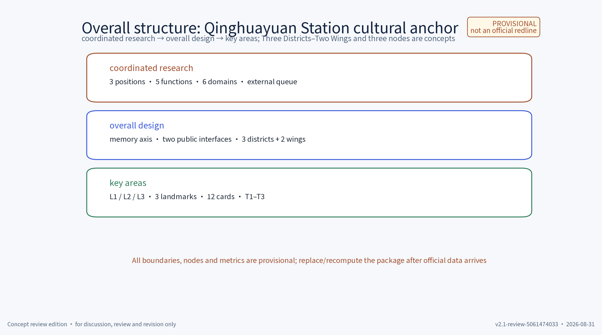
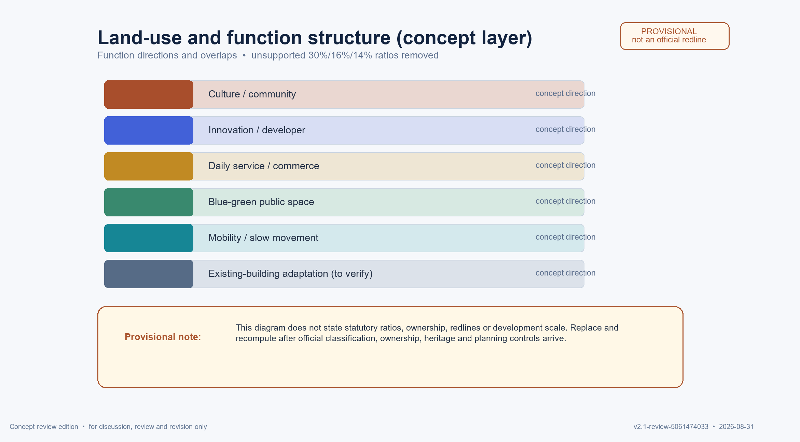
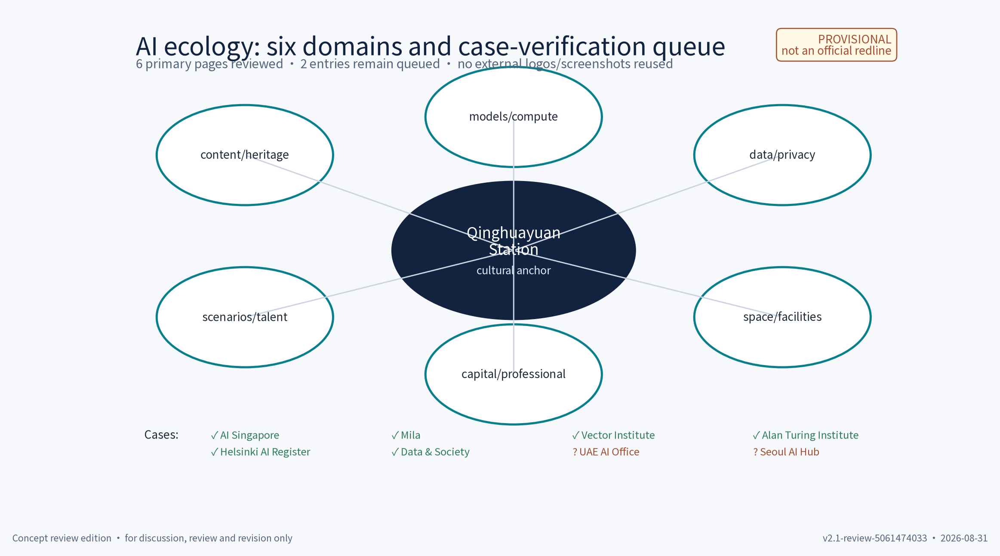
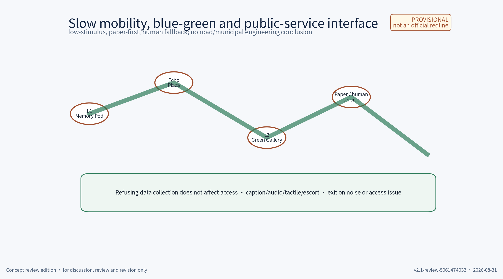
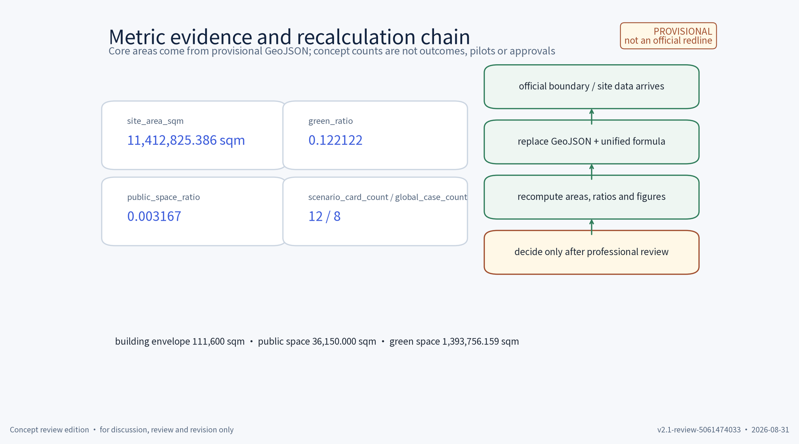

# Qinghuayuan Station · Centennial Jingzhang Cultural Anchor: One-Belt Concept Plan

**Core proposition:** use Qinghuayuan Station as a provisional cultural anchor and connect “memory–experience–innovation–governance” through a walkable, co-edited, small-testable and withdrawable AI culture belt. **Centennial Platform** is a working name, not a registered mark. The station, heritage and surrounding conditions are not asserted beyond the sources currently available.

This is a **concept proposal** for a station-city culture quarter. It is not a statutory plan, planning approval, engineering design, investment or operating commitment. All GeoJSON layers are provisional concept geometry; they cannot support conclusions about FAR, height, building scale, heritage controls, road redlines or municipal feasibility. Unverified historical claims, interviews and external cases are marked “to verify / research only”.

## Design Basis and Source List

The package distinguishes taskbook requirements, public policy/method references, provisional package geometry and original design work. The three positions, five functions, Three Districts–Two Wings and agent.1–6 deliverables come from the taskbook as a design brief, not as an adoption commitment.[source:DATA-SRC-OFFICIAL-ANNOUNCEMENT-20260509] [source:DATA-SRC-AGENT-TASKBOOK-20260518]

Specific station history, heritage status, ownership, boundaries, traffic, utilities, interviews and visitor data are not filled in without a verifiable source. The existing `geometry/` layer is a provisional input and must be replaced/recomputed when official boundary, survey, control and operating data arrive.[source:DATA-SRC-PROVISIONAL-BOUNDARIES-20260605] [data:geometry/site_boundary.geojson] [data:geometry/key_areas.geojson]

`sources.json` records IDs, URLs/paths, source type, dates, verification status and reuse boundaries. Six of the eight global AI ecology entries now have a primary institutional page review; two remain “to verify”. None is performance evidence or a partnership claim. Text, drawings, PNGs, HTML, Logo sketches, scenario cards, fonts and AI-assisted material are governed by `report/copyright_statement.md`.[source:PACKAGE-SOURCES-REGISTRY] [source:PACKAGE-RIGHTS-LEDGER]

## Three-Level Scope Framework

The three levels form a transmission chain: regional coordination judgment → district structure → station-node pilot. The coordinated research area addresses industry, culture, talent, compute, data and external relationships; the overall design area translates them into public space, slow traffic and renewal concepts; the key-area level tests reversible components, scenario cards and protocols. No level replaces statutory planning.[source:DATA-SRC-AGENT-TASKBOOK-20260518]

| Level | Question | Package output | Recalculation trigger |
|---|---|---|---|
| Coordinated research area | How can the belt complement innovation, communities, science cities, advanced manufacturing and Beijing–Tianjin–Hebei? | Positions, functions, ecology queue and external coordination | Official area, industry, talent and mobility baselines |
| Overall design area | How can a culture–AI belt become walkable, usable and operable? | Three Districts–Two Wings spatial/function/actor loop | Road, ownership, heritage, utility and accessibility data |
| Detailed key area | How can the cultural anchor host safe, reversible pilots? | Three landmarks, 12 cards, T1–T3, gates and component library | Station records, manager, consent and pilot authorization |

The minimum loop is **space provides reversible capacity; function defines public value; actors own content/data/safety/maintenance; indicators trigger continuation, change or exit**. All locations and counts return to `geometry/`, `metrics.json` and the stage gates.[data:geometry/key_areas.geojson] [data:geometry/land_use.geojson] [data:geometry/public_space.geojson] [data:geometry/phasing.geojson]

## Coordinated Research Area: Industry and Future City Research

The industrial proposition is not a promise to attract capital or companies. Qinghuayuan Station is a proposed low-risk, low-data and human-supervised public test entrance: verified cultural content creates an understandable public experience; the experience gives developers and companies a service-quality question; reviewed results may enter a talent/company conversion chain. No company, investment, intensity or occupancy conclusion is made.[source:DATA-SRC-AGENT-TASKBOOK-20260518]

**Three positions:** (1) **Centennial Jingzhang Cultural Belt**, based on verified heritage content, public interpretation, community co-editing and international storytelling; (2) **Urban AI Life-Experience Belt**, based on accessible guidance, low-tech access, aggregate-only data and human service; (3) **AI Integration Innovation Belt**, based on an open scenario catalogue, developer community, test protocols, rights clearance and talent/company conversion. **Five functions:** full-stack AI autonomy, world-class AI innovation ecology, AI+ scenario enablement, intelligent AI-active city and global AI-governance voice. “World-class” is a task direction, not an award or existing status.[source:DATA-SRC-AGENT-TASKBOOK-20260518]

External coordination is listed separately from the Three Districts–Two Wings: Beiwei Community for daily life and low-tech participation; Future Science City for public science communication; Huairou Science City for cleared public science content; E-Town for reviewed advanced-manufacturing demonstrations; and Beijing–Tianjin–Hebei for a linked bilingual cultural narrative. Each remains a proposed relationship requiring named actors, consent, source review and rights clearance; none is an existing partnership.[source:PACKAGE-EXTERNAL-COORDINATION]

Six ecology domains connect content/heritage, models/compute, data/privacy, space/facilities, capital/professional services and scenarios/talent. The proposed chain is question → public card → privacy/safety pre-review → small test → review → talent/company opportunity. It may stop at any step and creates no default cooperation.[source:PACKAGE-AI-ECOLOGY]

## Overall Design Area: Urban Renewal and Regulatory-Plan-Level Urban Design

The concept uses one memory axis, two public interfaces and three reversible nodes. The axis links the cultural anchor, station-front open space and Chengfu Road slow-mobility interface. The interfaces are a quiet interpretation/reading interface and a rotatable market/demo interface. The three node IDs correspond to the three concept AI landmarks in `public_space.geojson`; they are not new buildings or approval drawings.[data:geometry/roads.geojson] [data:geometry/public_space.geojson]

Renewal follows retain–renovate–demolish gates. First register and protect unverified heritage elements; then use removable, repairable exhibition and service components; only after professional heritage, ownership, structural, fire and planning review may any temporary obstruction enter a study list. This package does not decide what to demolish and gives no FAR, height, setback, footprint or heritage-control conclusion.[source:DATA-SRC-MOHURD-URBAN-DESIGN-MEASURES] [source:DATA-SRC-MOHURD-CONTROL-DETAILED-PLANNING] [source:DATA-SRC-MNR-LAND-USE-CLASSIFICATION-202311]

The operating loop is verified content → low-stimulus public experience → aggregate service improvement → community/professional review → developer/company test → maintenance or exit. Older adults, children, people with hearing or visual disabilities and non-smartphone users receive paper, human and physical-sign alternatives; an app, account or consent to data collection is never a condition of entering public space.[source:DATA-SRC-BARRIER-FREE-ENVIRONMENT-LAW]

> Evidence layers: [data:geometry/site_boundary.geojson] [data:geometry/key_areas.geojson] [data:geometry/land_use.geojson] [data:geometry/buildings.geojson] [data:geometry/roads.geojson] [data:geometry/green_space.geojson] [data:geometry/public_space.geojson] [data:geometry/constraints.geojson] [data:geometry/phasing.geojson]. Drawings support concept discussion only and must be redrawn after official data.

## Detailed Design of Key Areas

The station anchor is a test bench for the belt, not an isolated heritage display. Node space hosts culture and public life; the Three Districts–Two Wings provide content, service, talent, enterprise and governance interfaces; the five external partners remain separate verification queues. The three node names are original working concepts and do not certify the condition of an “original waiting room” or “original platform”.

| Node | Concept space | Function | Actor types | Reversible/safety boundary |
|---|---|---|---|---|
| L1 | **Waiting-Room Memory Pod** | Bilingual guidance, reading room, community room after source review | Content reviewers, community operator, human guide | Removable screen, paper, tactile/audio alternatives; no face/voice capture |
| L2 | **Platform Echo Plaza** | Small performance, rotating market, public developer demo | Event operator, community representatives, evaluator | Removable furniture and staffed operation; stop on crowd/noise threshold |
| L3 | **Rail-Shadow Green Gallery** | Slow mobility, low-stimulus night guidance, blue-green pause | Maintenance team, accessibility adviser, volunteers | Mobile signs, seating and concept rain-garden modules; no road-engineering claim |

| Spatial unit | Main functions | Position interface | Actor loop | Verifiable output |
|---|---|---|---|---|
| AI Origin Community | AI ecology and an intelligent active city | Culture supplies public narrative; life belt supplies community entry | Residents/students ask → content/service team co-edits → operator reviews | Guides, paper alternatives, monthly community note |
| Zhongzhiyuan AI Autonomous Innovation Acceleration Area | Full-stack autonomy and governance | Public experience offers low-risk tests; innovation offers developer interfaces | Developer submits → privacy/safety review → T1/T2 → evaluation | API/SDK concept note, test report, failure register |
| Dazhongsi AI Industry Cluster | AI+ enablement and industry service | Culture supplies understandable questions; innovation supplies conversion | Company/university prototype → host organizes → community/evaluator reviews | T3 test, talent/company conversion record |
| Zhongguancun Technology-Service Wing | AI ecology and governance voice | IP, legal, capital, evaluation and international links | Professional service clears/reviews → operator publishes → traceable result | Rights ledger, bilingual case card, review note |
| Xiaoyuehe Scenario-Enablement Wing | AI+ scenarios and active city | Extends public service, mobility, blue-green and low-stimulus experience | Maintenance need → scenario adaptation → human fallback | Mobility/guidance test, environment note, maintenance list |

The three AI cultural landmarks mean evidence entry, public echo and slow-mobility connection. They do not imply permanent construction. The Logo concept combines a platform cut-line, station-house frame and rail rhythm; steel blue, ochre red and moon white are suggested with high-contrast and line/number alternatives. The international asset set is a bilingual name, a short English abstract, eight verification-queue cases, bilingual scenario fields and a “verify before publish; withdraw when needed” governance note. Suggested line: **“Walk the memory, test the future.”** It is original concept copy, not an institutional slogan.[source:DATA-SRC-AGENT-TASKBOOK-20260518]

**Brand and Logo rights record (preliminary screening, 2026-08-31; not legal advice):** The author is JohnXu22786. The mark and identity sketch were self-drawn and procedurally generated within this package/Direct Codex workflow, with a creation record dated 2026-08-31. No third-party Logo, photograph, screenshot, historical image or page styling is embedded; the font is recorded separately under the OFL entry. The screening scope covered this package, `sources.json`, and exact public-web strings “百年月台”, “Centennial Platform”, “Centennial Platform Qinghuayuan Station”, plus the self-drawn circular-platform mark; the screening date was 2026-08-31. Results found descriptive/general uses of “百年月台” (including a historical platform description in Keelung) and general educational/platform uses of “Centennial Platform”, but no evidence that any result is this project or mark; this is not a trademark-register clearance or owner permission. The potential conflict is recorded as descriptive/generic similarity. Disposition: repository review/display only, no registration, commercialisation or external licence; a rights lead must run a formal similarity/database search before public use and replace the name/Logo if unresolved.[source:PACKAGE-BRAND-RIGHTS-RECORD]

## AI Innovation Ecosystem, Personas, and AI+ Scenarios

The ecology map connects content, data, models, space, operation and governance. Its outer ring contains eight global AI-ecosystem entries; its inner ring contains the three nodes, five spatial units and T1–T3. Six cases have been checked against their primary institutional pages and two remain **to verify / research only**. The package records original title, named body, date status, factual note, comparable/non-comparable dimension, licence/screenshot status, verifier and review date in `sources.json`. No performance, partnership, funding, ranking or public endorsement is asserted.[source:PACKAGE-AI-CASE-QUEUE]

| Case | Original page / body / date | Fact checked | Comparable / not comparable | Licence, screenshot and verifier |
|---|---|---|---|---|
| AI Singapore | **100 Experiments** / AI Singapore / not stated on page | The page describes a problem-statement-to-PoC/MVP framework and 3-month PoC and 6-month development paths | Problem briefs and time-boxed prototypes / Singapore funding and mandate do not transfer | URL and short note only; no screenshot/logo reused; Codex SA, 2026-08-31 |
| Mila | **Mila – Quebec Artificial Intelligence Institute** / Mila / not stated on page | The page identifies a research community, Mila Ventures Launchpad and AI Policy Compass | Research–startup–policy interfaces / scale, funding and campus governance do not transfer | URL and short note only; no screenshot/logo reused; Codex SA, 2026-08-31 |
| Vector Institute | **About Vector Institute** / Vector Institute / not stated on page | The page describes research, talent, practical adoption and organisational support | Research/talent/organisation interface / Canadian corporate and partner model is not a local agreement | URL and short note only; no screenshot/logo reused; Codex SA, 2026-08-31 |
| The Alan Turing Institute | **About us** / The Alan Turing Institute / not stated on page | The page identifies an independent UK data-science and AI institute with research, skills and public-dialogue goals | Research–skills–public dialogue / UK charity and national network are not a local template | URL and short note only; no screenshot/logo reused; Codex SA, 2026-08-31 |
| City of Helsinki | **Get to know AI Register** / City of Helsinki / 2020-06-29 indexed page date; exact page date not stated | The page describes an AI register with system overviews, feedback and human accountability | Public AI transparency and feedback / Helsinki law and digital-service context differs | URL and short note only; no screenshot/logo reused; Codex SA, 2026-08-31 |
| Data & Society | **About Us** / Data & Society / not stated on page | The page identifies an independent nonprofit research and policy institute studying social, political and economic implications of data, automation and AI | Public-interest research and policy engagement / research mission is not site operation or authority | URL and short note only; no screenshot/logo reused; Codex SA, 2026-08-31 |

UAE AI Office and Seoul AI Hub remain queue entries until title, body and page scope are confirmed. They are not used as formal facts.[source:DATA-SRC-CASE-AI-SINGAPORE] [source:DATA-SRC-CASE-MILA] [source:DATA-SRC-CASE-VECTOR] [source:DATA-SRC-CASE-TURING] [source:DATA-SRC-CASE-HELSINKI] [source:DATA-SRC-CASE-DATA-SOCIETY]

The queue is AI Singapore, Mila, Vector Institute, The Alan Turing Institute, UAE AI Office, Seoul AI Hub, Helsinki AI Register and Data & Society. They are search entry points for organization, research and governance interfaces rather than factual evidence in this package.[source:DATA-SRC-CASE-AI-SINGAPORE] [source:DATA-SRC-CASE-MILA] [source:DATA-SRC-CASE-VECTOR] [source:DATA-SRC-CASE-TURING] [source:DATA-SRC-CASE-UAE] [source:DATA-SRC-CASE-SEOUL] [source:DATA-SRC-CASE-HELSINKI] [source:DATA-SRC-CASE-DATA-SOCIETY]

Five personas are students/researchers; developers and AI practitioners; heritage/community contributors; local residents/older adults; and families, students and visitors. Their access needs include source transparency, paper and staffed routes, quiet times, tactile/subtitle/audio alternatives, safe child boundaries, a way to leave, and no identity collection.[source:DATA-SRC-BARRIER-FREE-ENVIRONMENT-LAW]

### Twelve scenario cards

Each card uses eleven fields: problem; input; AI capability; user flow; space; operating actor; data minimization/consent; fallback; metric/threshold; exit/withdrawal; verification status. The common rule is aggregate-only data, human review for key decisions and no surveillance or individual identification.

1. **C01 Evidence-led guidance** — problem: visitors need to know what is verified; input: source IDs and human catalogue; capability: retrieval/citation; flow: choose card → read status → ask guide; space: L1 paper shelf/screen/desk; actor: content team; data: no identity; fallback: guide/blank card; metric: 100% traceable citations; exit: remove stale source; status: station detail to verify.
2. **C02 Bilingual low-tech guide** — problem: language and literacy access; input: reviewed text/icons/audio; capability: controlled translation draft; flow: choose language → human check → paper/subtitle/audio; space: bilingual/tactile signs; actor: translation reviewer; data: no language profile; fallback: paper/guide; metric: human spot-check pass; exit: revert on terminology dispute; status: package asset.
3. **C03 Oral-memory co-editing** — problem: contribute without public identity; input: voluntary audio/text and scope; capability: transcription/topic draft; flow: explain consent → choose attribution/term → human review → withdraw; space: quiet corner/paper form; actor: community content team; data: minimum, short retention; fallback: manual/no intake; metric: complete consent fields; exit: delete unpublished copy; status: future process, no existing interviews.
4. **C04 Memory-map retrieval** — problem: link verified content to walking points; input: public sources and concept IDs; capability: geographic retrieval/summary; flow: topic → point → human explanation; space: numbered plan and non-phone route; actor: map reviewer; data: aggregate clicks only if enabled; fallback: static map; metric: source-point match; exit: pause after geometry change; status: provisional geometry.
5. **C05 Open-scenario catalogue** — problem: developers need clear public questions; input: 12 cards and limits; capability: tag search; flow: read boundary → submit intent → pre-review; space: board/static page; actor: scenario host; data: no personal data; fallback: human directory; metric: field completeness/pre-review time; exit: reject non-compliant input; status: concept catalogue.
6. **C06 Accessible-route prompt** — problem: route continuity and obstacles are unknown; input: human inspection list; capability: rule matching, not safety certification; flow: select destination → paper/audio prompt → on-site check; space: signs, rests, alternatives; actor: maintenance/accessibility adviser; data: none; fallback: escort/close segment; metric: inspection update; exit: disable unverified guidance; status: site survey required.
7. **C07 Community schedule aid** — problem: event conflict and quiet periods; input: human duration/size/time entries; capability: constraint suggestion; flow: operator draft → community review → notice → human edit; space: L2/L1; actor: operator/community; data: no resident profiles; fallback: manual schedule; metric: conflicts/response time; exit: cancel or retime; status: no annual promise.
8. **C08 Low-noise market prompt** — problem: sound/light may disturb residents; input: human schedule/device/field reading; capability: threshold reminder; flow: pre-check → staffed observation → downgrade/stop; space: removable stalls/low-light signs; actor: safety lead/community; data: session-level readings; fallback: human stop; metric: response time; exit: pause after repeated excess; status: threshold needs site confirmation.
9. **C09 Green-gallery maintenance** — problem: cleaning, watering and damage; input: human maintenance log/public weather; capability: task ordering; flow: inspect → suggest → assign → verify; space: concept rain garden/seats/tool store; actor: maintenance team; data: no visitor data; fallback: paper list; metric: closure/overdue count; exit: manual mode; status: not a municipal design.
10. **C10 Content safety review** — problem: summaries can miscite or overreach; input: source, draft and human labels; capability: difference/risk prompt; flow: draft → two-person review → publish/reject → appeal; space: editor desk/correction board; actor: content and appeal team; data: version only; fallback: remove and correct; metric: error/appeal time; exit: disable model; status: mandatory human review.
11. **C11 Company prototype registration** — problem: low-risk public prototype testing; input: proposal, compliance statement, synthetic/aggregate data; capability: field-completeness only, no approval; flow: apply → pre-review → timed test → review → abstract; space: bookable test position/staff desk; actor: host/company/evaluator; data: no sensitive data; fallback: stop/remove; metric: completion/response; exit: any hard ban terminates; status: no procurement/partnership claim.
12. **C12 Cross-region bilingual link** — problem: public content is hard to read across regions; input: cleared text and institution confirmation; capability: translation/tag draft; flow: verify source → review → static link → periodic check; space: screen/paper index; actor: culture institution/translator; data: no personal data; fallback: original link only; metric: link availability/review coverage; exit: remove stale/uncleared source; status: external coordination to verify.

### T1–T3 proposed test protocols

| Protocol | Boundary and input | Participants/cycle | Metrics and threshold | Human review/exit |
|---|---|---|---|---|
| T1 Content and bilingual guidance | C01/C02/C10; verified/cleared text only | 2 weeks; guides, reviewers and volunteers; catalogue → draft → two reviews → feedback → retrospective | 100% citation match; no unmarked fact in sample; comprehension target ≥80% after method approval | Misquote, reversal or unclear rights takes item offline; keep correction/version record |
| T2 Accessibility and low-tech experience | C06/C07/C08; no full-site certification or individual tracking | 3 weeks; inspection → alternatives → staffed route → sound/time review → fix; older adults/accessibility advisers/community volunteers optional and withdrawable | Every obstacle has status; alternative access target ≥90%; excess suggested sound threshold handled ≤5 min after site confirmation | Stop segment/time or remove unnecessary records; children are not an unapproved test sample |
| T3 Open company scenario | C05/C11; synthetic/aggregate data only; no screening, identification or automated approval | 4 weeks; 1–3 companies/university teams to be selected, host, evaluator and community observer; apply → pre-review → timed test → public abstract | Zero hard bans; human takeover ≤2 min; record completeness ≥95%; every complaint answered | Host may stop immediately; sensitive data, uncleared collection or persistent error exits and deletes test data; no procurement promise |

The governance sentence is: **aggregate-only data; human review for key decisions; no over-surveillance, individual tracking or automated approval**.[source:DATA-SRC-GENERATIVE-AI-INTERIM-MEASURES]

## Land Use, Building Scale, and Retain-Renovate-Demolish Strategy

The package gives functional directions only: culture/community, innovation/developer service, daily service, blue-green public space, mobility connection and survey-dependent existing-building adaptation. `geometry/land_use.geojson` is a concept layer, not a statutory use map. Unsupported illustrative percentages have been removed. The displayed [metric:site_area_sqm], [metric:green_ratio] and [metric:public_space_ratio] are provisional geometry monitors, not planning indicators.[data:geometry/land_use.geojson]

Retain first: register and protect unverified station/heritage elements. Renovate reversibly: use removable interiors, exhibits and public service. Demolish only after heritage, ownership, structure, fire and planning review confirms no retention value and a public-access reason; this package decides none of those questions. No footprint, floor count, height, FAR or engineering node is proposed.

All geometry is concept/low-confidence and only supports package self-check. Recalculation is triggered by official boundary/coordinate data, survey and ownership, heritage controls, and road/utility/service baselines.[data:geometry/buildings.geojson] [data:geometry/constraints.geojson]

## Transport, Rail, Municipal Infrastructure, and Public Services

Transport is a slow-mobility concept with staffed public-service fallback and unknown rail/road conditions. L1–L3 are conceptually connected through the station-front open space, Chengfu Road interface and heritage-park direction. Proposed research items include continuous accessible routes, rest points, paper signs, staff desks, event egress and bicycle parking; no road redline, rail interchange, signal timing, fire, drainage, power, communications or capacity conclusion is made.[source:DATA-SRC-MOHURD-URBAN-DESIGN-MEASURES] [data:geometry/roads.geojson]

Accessibility begins with a segment checklist: level changes, breaks, obstructions, light, seating, toilets, crossings, tactile/Braille, subtitles/audio, staff and fallback routes. If not surveyed, mark “site verification required”. No phone/account/location is required. Hearing access uses text, visual access uses audio/tactile/staff help, older adults use large paper maps, and children need adult supervision and stop boundaries. Any queue/flow assistance is aggregate-only and **does not perform screening, identification, tracking or enforcement**.[source:DATA-SRC-BARRIER-FREE-ENVIRONMENT-LAW]

Municipal interfaces are only removable lighting, temporary power, concept rain gardens, waste points, toilet wayfinding, emergency announcements and staffing. Capacity and placement require responsible authorities and professionals. Events require site review of egress, sound, light, weather and neighbors; without authorization, retain only a tabletop exercise.

## Blue-Green Network, Public Space, and Urban Character

The blue-green idea is a continuous experience of heritage memory, station-front public space and a slow-mobility green gallery; it does not claim that a continuous route exists today. Green and rain-garden components are concept devices for shade, rest, orientation and maintenance learning; species, drainage, fire separation and sponge-city parameters remain for professional design. Steel blue information, ochre red memory, moon white and low light form a visual language; historical signs or artifacts are not fabricated.[source:DATA-SRC-MOHURD-URBAN-DESIGN-MEASURES] [data:geometry/green_space.geojson] [data:geometry/public_space.geojson]

The component library is removable, repairable, rotatable and restorable. Each item records material, connection, removal, storage, maintenance interval, owner and check date. Honors are a replaceable paper/digital wall, not a permanent monument or official award. Contributors may be anonymous and may withdraw. Night events use a site-confirmed disturbance threshold; human staff lower light/sound, retime or stop when exceeded.

## Renewal Projects, Implementation Policy, and Phasing

Implementation follows evidence → small test → exit → extension. Actor labels are types requiring confirmation; S/M/L means workload, not a budget. Gates are concept acceptance conditions, not approvals.[data:geometry/phasing.geojson]

| Phase | Project and test space | Actor types | Gate/acceptance | Exit and maintenance |
|---|---|---|---|---|
| P1 evidence and low-risk prototype (months 1–12) | source/rights review, L1 paper guide, obstacle survey, C01/C02, T1 | content, community, accessibility, developer teams | G0 source/rights ready; G1 traceable citations, alternatives, no personal data | Remove unclear items; monthly source/sign maintenance |
| P2 public-experience small test (months 13–30) | L2 rotation, L3 mobility components, C06–C09, T2 | manager, event operator, maintenance, community | G2 obstacle closure, human takeover, sound/egress review, appeal | Stop/retime/remove above threshold; seasonal and post-event reset |
| P3 open ecology and conversion (months 31–60) | C05/C11/C12, T3, developer community and bilingual dissemination | host, company/university, evaluator, culture institution | G3 zero hard bans, takeover, deletion proof, public retrospective | Roll back to P2/P1; remove prototype and delete test data |

RACI: the content team is Responsible for source and rights review, with a project data lead Accountable and rights/community advisers Consulted; the scenario host is Responsible for data pre-review, with a privacy/safety lead Accountable; the event operator is Responsible for public activity, with the venue manager Accountable; maintenance and visual editors are Responsible for components; an independent evaluator is Responsible for retrospective and a future project committee is Accountable. The six open-operation steps are publish problem → submit plan/data statement → privacy/safety/rights/accessibility review → timed test → metric/appeal/failure review → continue, fix, archive or exit. Monthly cadence: publish, pre-review, test, then publish a safe summary and maintenance list.

## Metrics, Area Recalculation, and Compliance Matrix

Metrics are geometry monitors, package counts and concept targets. Geometry values are recalculated from provisional GeoJSON in EPSG:4548 for internal consistency only; they do not become legal indicators. Scenario, persona, case and phase counts are document counts, not outcome evidence. Official data, site pilots, rights or consent changes trigger full recalculation.[source:PACKAGE-METRICS-REGISTRY] [data:geometry/site_boundary.geojson] [data:geometry/green_space.geojson] [data:geometry/public_space.geojson] [data:geometry/buildings.geojson]

| Metric | Package value | Status and rule |
|---|---:|---|
| [metric:site_area_sqm] | 11,412,825.386 sqm | provisional polygon area; replace and recalculate with official boundary |
| [metric:green_space_area_sqm] | approx. 1,393,756.2 sqm | provisional union of concept green polygons; raw recompute 1,393,756.159 sqm |
| [metric:public_space_area_sqm] | approx. 36,150.0 sqm | provisional union; raw recompute 36,150.000 sqm; not an ownership/open-space conclusion |
| [metric:building_footprint_area_sqm] | 111,600 sqm | known concept-geometry count (low-confidence / provisional); not building area, buildable scale, statutory metric or built fact |
| [metric:green_ratio] | approx. 0.1221 | green area/site area; machine value 0.122122, displayed to four decimals |
| [metric:public_space_ratio] | approx. 0.0032 | public area/site area; machine value 0.003167, displayed to four decimals |
| [metric:global_case_count] | 8 | known research-queue count (low-confidence / provisional); six primary pages reviewed and two queued, not case outcomes, partnerships or endorsements |
| [metric:scenario_card_count] | 12 | known concept-record count (low-confidence / provisional); eleven fields each, not completed pilots, industry validation or outcome evidence; cards remain withdrawable |
| [metric:industry_test_scenario_count] | 3 | known proposed-protocol count (low-confidence / provisional); T1/T2/T3 are not completed industry tests, authorized pilots or validation results |
| [metric:landmark_count] | 3 | known concept-record count (low-confidence / provisional); three `scenario_type=ai_landmark` records, not built landmarks, heritage designation or construction approval |
| [metric:persona_count] | 5 | known concept-persona-category count (low-confidence / provisional); not population statistics, user samples or a needs survey |
| [metric:phase_count] | 3 | known concept-stage count (low-confidence / provisional); P1–P3 are research windows, not delivery, approval or operating commitments |

`compliance_matrix.json` maps 23 task items; `standard_matrix.json` maps five professional standards; `design_depth_matrix.json` maps 15 depth items. They point to text, drawings, geometry, metrics and risk files as evidence navigation and do not replace professional review.[source:DATA-SRC-AGENT-TASKBOOK-20260518] [source:DATA-SRC-MOHURD-URBAN-DESIGN-MEASURES] [source:DATA-SRC-MOHURD-CONTROL-DETAILED-PLANNING] [source:DATA-SRC-MNR-LAND-USE-CLASSIFICATION-202311]

## Risk, Copyright, and Compliance

`risk.json` records missing official scope, heritage controls, survey, road/utilities, event capacity, case pages, interviews, rights, acceptance, technology and maintenance resources. Unverified station history, site visits, interviews and case performance are not fact paragraphs. The package makes no approval, engineering, fire, rail, FAR, height, statutory land-use or return-on-investment claim.[source:DATA-SRC-OFFICIAL-ANNOUNCEMENT-20260509] [source:DATA-SRC-PROVISIONAL-BOUNDARIES-20260605]

Oral/feedback processes state purpose, optional attribution, default non-publication, retention, withdrawal/deletion, human appeal and correction. Refusing data does not prevent access to public space. Tests use aggregate, synthetic or public inputs only; no face, voiceprint, precise track, ID, contact, sensitive job/health or classified data. A boundary incident stops, isolates and deletes the data and records only a non-personal event summary.[source:DATA-SRC-GENERATIVE-AI-INTERIM-MEASURES] [source:DATA-SRC-BARRIER-FREE-ENVIRONMENT-LAW]

The package text, tables, Logo sketch, figures, PDFs and HTML are original/programmatic working assets unless the rights record says otherwise. `COMMUNITY-DISPLAY-ONLY` permits display under the call rules but does not grant commercial reuse, trademark registration, model training, relicensing or derivative rights. Professional modification or derivation requires permission, versioning, attribution and fresh rights review of fonts, images, code, data and case links. Residents can use an offline/printed feedback route with status, response and appeal; maintainers review sources/components monthly, scenarios quarterly and rights/consent annually. The preliminary brand/Logo screening and its unresolved similarity boundary are recorded in `report/copyright_statement.md`.[source:PACKAGE-BRAND-RIGHTS-RECORD]

## References

Formal sources, verification queues, package geometry and original assets are separated in `sources.json`. “To verify” means the page has not been checked line by line for this package and cannot support a factual, performance or partnership claim. Planning and policy documents are method references only.

| ID | Use | Status |
|---|---|---|
| DATA-SRC-OFFICIAL-ANNOUNCEMENT-20260509 | public call | official public source; recheck original page |
| DATA-SRC-AGENT-TASKBOOK-20260518 | positions, functions, districts/wings and agent deliverables | taskbook excerpt |
| DATA-SRC-MOHURD-URBAN-DESIGN-MEASURES | urban-design method | official public method reference |
| DATA-SRC-MOHURD-CONTROL-DETAILED-PLANNING | statutory-boundary caution | not a package approval |
| DATA-SRC-MNR-LAND-USE-CLASSIFICATION-202311 | land-use terminology | recheck current edition |
| DATA-SRC-GENERATIVE-AI-INTERIM-MEASURES | AI risk language | not legal advice |
| DATA-SRC-BARRIER-FREE-ENVIRONMENT-LAW | accessibility reference | not whole-site certification |
| DATA-SRC-PROVISIONAL-BOUNDARIES-20260605 | concept geometry | not an official redline |

### Eight global AI-ecosystem verification entries

AI Singapore, Mila, Vector Institute, The Alan Turing Institute, UAE AI Office, Seoul AI Hub, Helsinki AI Register and Data & Society each have a URL/path and a verification record in `sources.json`. Six are primary-page reviewed and two remain to verify; none supplies a performance statistic, cooperation statement, award or rights grant in this proposal.[source:PACKAGE-AI-CASE-QUEUE]

### Bilingual, drawings and rights register

Chinese/English proposals, seven bilingual PNG pairs, two bilingual PDF pairs, two report HTML files and two visual indexes are listed in `manifest.json`. Each figure carries a provisional/non-redline/recompute notice and aims to show north, concept scale, legend, node numbers and data layer. Offline HTML does not load remote resources. The rights ledger lists text, graphics, fonts, code, GeoJSON, links and AI-assisted copy; items without fields remain research-only.[source:PACKAGE-BILINGUAL-MANIFEST] [source:PACKAGE-RIGHTS-LEDGER]
