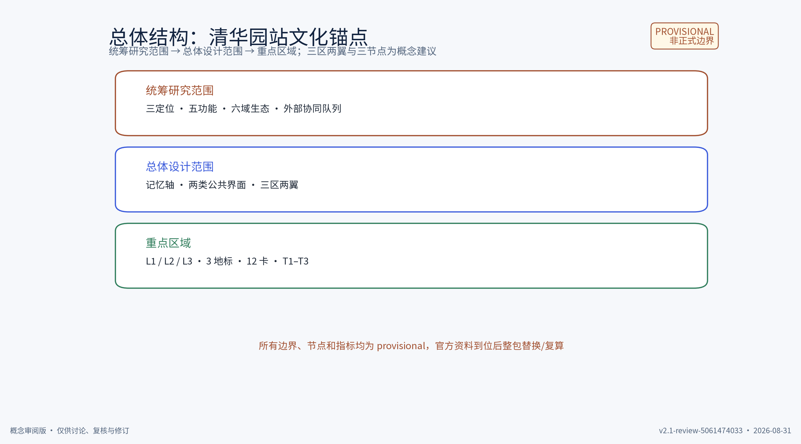
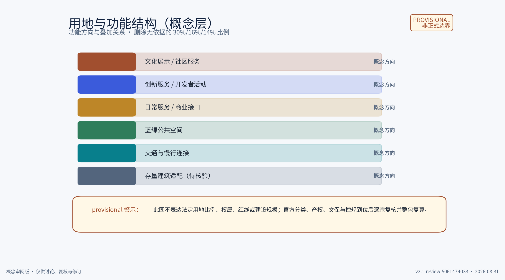
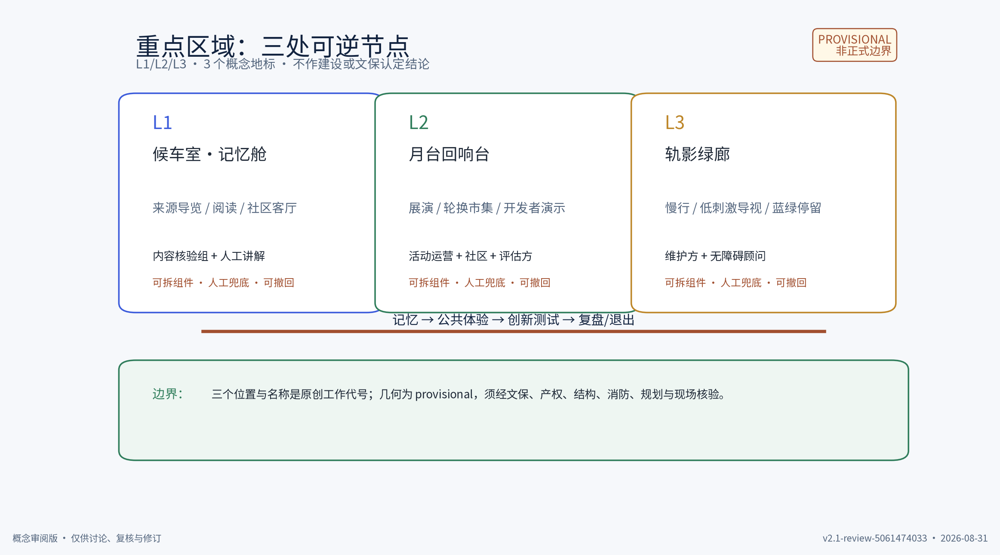
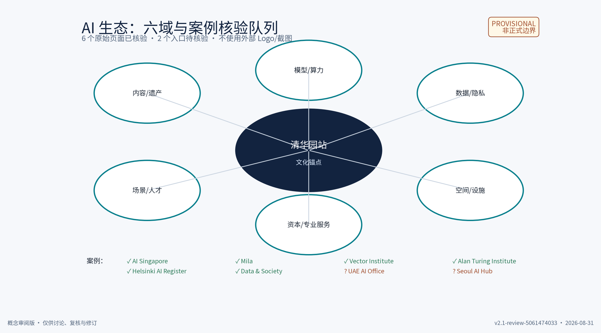
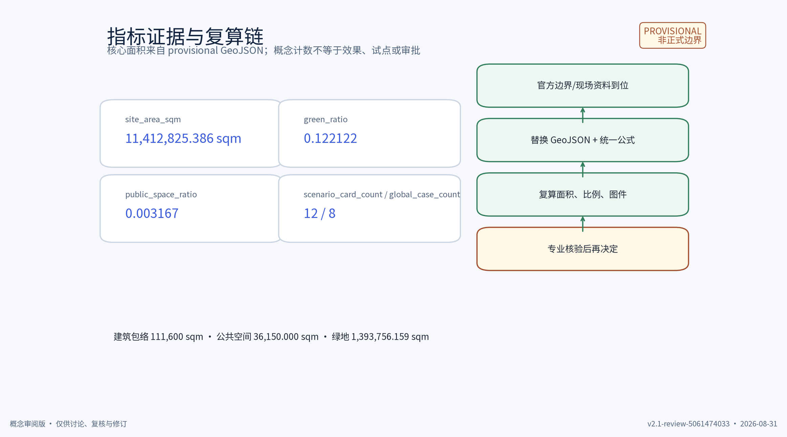
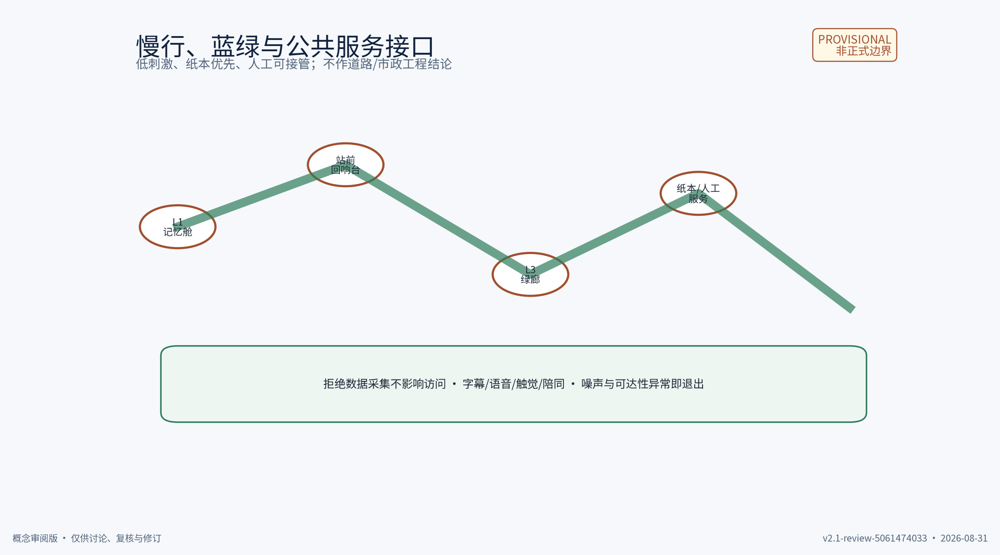

# 清华园站·百年京张文化锚点：一带概念方案

**一句话主张：**把清华园站作为资料核验前的文化锚点，将“记忆—体验—创新—治理”串成可步行、可共编、可小规模测试、可撤回维护的 AI 文化带。主名称建议为 **「百年月台 / Centennial Platform」**，仅是未完成检索的工作代号。

本包是概念性城市设计建议，不是法定规划、规划审批、工程设计、投资承诺、运营承诺、文保认定或合作协议。`geometry/` 中的边界、重点区、建筑和用地都是 provisional 概念几何；不得据此推出红线、容积率、高度、权属、建设规模或现状事实。官方资料到位后必须整包替换几何并复算。[source:DATA-SRC-OFFICIAL-ANNOUNCEMENT-20260509] [source:DATA-SRC-AGENT-TASKBOOK-20260518]

## 1. 设计依据与范围

本包区分四类证据：任务书要求、公开政策方法参考、provisional 几何、原创设计。三定位、五功能、三区两翼和 agent.1–6 输出来自任务书，是设计问题而非采纳承诺。清华园站的具体站史、文保等级、产权、道路、市政、客流、访谈和现状无来源时不写成事实。[source:DATA-SRC-AGENT-TASKBOOK-20260518] [source:DATA-SRC-PROVISIONAL-BOUNDARIES-20260605]

| 层级 | 研究问题 | 本包输出 | 触发复算或复核 |
|---|---|---|---|
| 统筹研究范围 | 如何连接产业、社区、科学城、先进制造与京津冀文化叙事？ | 三定位、五功能、六生态域、外部协同队列 | 官方范围、产业/人才/交通基线 |
| 总体设计范围 | 如何把文化锚点变成可步行、可停留、可运营的生活体验带？ | 三区两翼、记忆轴、两类公共界面 | 道路、产权、文保、市政、无障碍数据 |
| 重点区域 | 如何用小而安全的机制承接公共体验与 AI 试验？ | L1/L2/L3、3 个概念地标、12 张卡、T1–T3 | 站房资料、管理主体、同意记录、试点授权 |

最小闭环是“空间提供可逆容量 → 功能定义公共价值 → 主体负责内容/数据/安全/维护 → 指标触发继续、调整或退出”。图件、正文和 `metrics.json` 只引用同一组文件。[data:geometry/key_areas.geojson] [data:geometry/land_use.geojson] [data:geometry/public_space.geojson]

分期窗口与撤收路径由 `geometry/phasing.geojson` 登记；它是实施研究输入，不是建设承诺。[data:geometry/phasing.geojson]

## 2. 三定位、五功能与三区两翼

**三定位：**

1. **百年京张文化带**：以来源状态清楚的内容、社区共编和双语解释作为文化入口；未核验站史不进入事实段。
2. **城市 AI 生活体验带**：以无障碍导览、低技术入口、匿名聚合和人工服务提升可理解性；不以手机、账号或定位为前提。
3. **AI 融合创新带**：以公开场景目录、开发者社区、权利清单和可退出的小测试连接人才与企业；不许诺招商、采购或投资。

**五功能：**全栈 AI 自主创新、世界级 AI 创新生态、AI+ 场景赋能、智能化 AI 主动城市、全球 AI 治理话语。“世界级”是任务方向，不是现状排名、奖项或机构背书。[source:DATA-SRC-AGENT-TASKBOOK-20260518]

| 单元 | 主要接口 | 可验证输出 |
|---|---|---|
| AI 原点社区 | 文化叙事与日常生活入口 | 双语导览、纸本替代、社区月报 |
| 众智园 AI 自主创新加速区 | 开发者、评估和低风险测试 | API/SDK 概念说明、失败登记、复盘 |
| 大钟寺 AI 产业集群 | 企业服务与场景转化 | T3 方案、人才/企业转化记录 |
| 中关村科技服务翼 | 知识产权、法律、资本、专业服务 | 权利台账、案例卡、审校记录 |
| 小月河场景赋能翼 | 慢行、蓝绿、公共服务与维护 | 导览测试、环境记录、维护清单 |

外部协同对象（北魏社区、未来科学城、怀柔科学城、经开区、京津冀）均是待命名主体、待确认意愿、待清权的研究队列，不是既有合作。[source:PACKAGE-EXTERNAL-COORDINATION]

## 3. 清华园站文化锚点与重点区域

文化锚点不是孤立展陈，而是让内容、公共生活、创新服务和治理在同一条可撤回链上相遇。三处重点区对应 `geometry/key_areas.geojson` 的概念多边形和 `public_space.geojson` 的 3 个 `ai_landmark` 记录；名称与位置均不证明原有候车室、月台或任何历史构件的真实性。[data:geometry/key_areas.geojson] [data:geometry/public_space.geojson]

| ID | 工作名 | 作用 | 组件与边界 |
|---|---|---|---|
| L1 | 候车室·记忆舱 / Waiting-Room Memory Pod | 来源可追溯的双语导览、阅读和社区客厅 | 可拆屏、纸本、大字、字幕、语音和人工台；不采集人脸/声纹 |
| L2 | 月台回响台 / Platform Echo Plaza | 小型展演、轮换市集、开发者公开演示 | 可移动家具、限时预约、人工值守；超过人流/噪声阈值即停用 |
| L3 | 轨影绿廊 / Rail-Shadow Green Gallery | 慢行连接、低刺激夜间导视、蓝绿停留 | 移动标识、座椅、概念雨水花园；不作道路或市政工程结论 |

保留优先、改造可逆、拆除需门槛。任何存量建筑或站房要进入留改拆清单，必须先完成文保、产权、结构、消防、规划和现场核验；本包不决定拆除对象。[source:DATA-SRC-MOHURD-URBAN-DESIGN-MEASURES] [source:DATA-SRC-MOHURD-CONTROL-DETAILED-PLANNING]

## 4. 六域 AI 生态与已核验案例

生态图把内容/遗产、模型/算力、数据/隐私、空间/设施、资本/专业服务、场景/人才六域接成“问题 → 公共卡 → 隐私/安全预审 → 小测试 → 复盘 → 人才/企业机会”的链路。案例只用于方法启发，不变成清华园站的合作、绩效、排名或背书。[source:PACKAGE-AI-ECOLOGY]

本轮已打开并核验 6 个官方/机构原始页面，逐项记录原始标题、主体、页面发布日期（未标注则明确为“页面未标注”）、事实、可比/不可比、许可/截图状态和核验人；UAE AI Office 与 Seoul AI Hub 保留为待进一步核验队列。所有案例均不使用对方 Logo、截图或页面视觉，不把案例事实移植为本地事实。[source:PACKAGE-AI-CASE-QUEUE]

| 案例 | 原始页面标题 / 主体 / 日期 | 页面可核验事实 | 可比与不可比 | 许可、截图与核验 |
|---|---|---|---|---|
| AI Singapore | **100 Experiments**；AI Singapore；页面发布日期未标注 | 页面说明 100E 为从问题陈述到 PoC/MVP 的实施框架，并列出 3 个月 PoC 与 6 个月开发路径 | 可比：问题单、限时原型、人才/工程支持；不可比：新加坡资助/组织机制不等于清华园站授权 | 只保留 URL 与文字摘要；未截屏、未用 Logo；Codex SA，2026-08-31 |
| Mila | **Mila – Quebec Artificial Intelligence Institute**；Mila；页面发布日期未标注 | 首页介绍研究共同体、Mila Ventures Launchpad 与 AI Policy Compass | 可比：研究—创业—政策接口；不可比：机构规模、资金和校园治理不能外推到本站 | 只保留 URL 与文字摘要；未截屏、未用 Logo；Codex SA，2026-08-31 |
| Vector Institute | **About Vector Institute**；Vector Institute；页面发布日期未标注 | 官方页面说明其连接 AI 研究、人才、企业采用和组织支持 | 可比：研究/人才/企业接口；不可比：加拿大组织法人与伙伴关系不构成清华园合作 | 只保留 URL 与文字摘要；未截屏、未用 Logo；Codex SA，2026-08-31 |
| The Alan Turing Institute | **About us**；The Alan Turing Institute；页面发布日期未标注 | 官方页面说明其为英国独立的数据科学与 AI 研究机构，包含研究、技能和公共对话目标 | 可比：研究—技能—公共对话；不可比：英国慈善法人和国家研究网络不能当作本地治理模板 | 只保留 URL 与文字摘要；未截屏、未用 Logo；Codex SA，2026-08-31 |
| City of Helsinki | **Get to know AI Register**；City of Helsinki；页面发布日期约 2020-06-29（页面未给精确发布日期） | 页面说明 AI Register 展示市政府 AI 系统概览，并提供反馈入口和人工负责原则 | 可比：公共 AI 透明登记、反馈、人工责任；不可比：城市数字服务制度和本地法域不同 | 只保留 URL 与文字摘要；未截屏、未用 Logo；Codex SA，2026-08-31 |
| Data & Society | **About Us**；Data & Society；页面发布日期未标注 | 官方页面说明其为独立非营利研究与政策机构，研究数据、自动化和 AI 的社会/政治/经济影响 | 可比：社会影响研究、政策参与、公众利益；不可比：研究机构使命不等于场地运营或政府授权 | 只保留 URL 与文字摘要；未截屏、未用 Logo；Codex SA，2026-08-31 |

UAE AI Office 与 Seoul AI Hub 的入口、主体归属和页面范围尚未达到上述证据阈值，仍标 `to_verify`，不进入正式论据。完整字段在 `sources.json` 的 `case_verification` 中，网页许可与原创视觉边界见 `report/copyright_statement.md`。[source:DATA-SRC-CASE-AI-SINGAPORE] [source:DATA-SRC-CASE-MILA] [source:DATA-SRC-CASE-VECTOR]

其余案例的页面入口、许可状态和复核人继续列在 `sources.json`；未核验项不会被写成项目事实。[source:DATA-SRC-CASE-TURING] [source:DATA-SRC-CASE-HELSINKI] [source:DATA-SRC-CASE-DATA-SOCIETY]

## 5. 五类画像与 12 张 AI+ 场景卡

五类概念画像为学生/研究者、开发者/AI 从业者、社区与文化贡献者、本地居民/老年人、家庭/学生/访客。画像只用于检查服务入口，不是人口统计、需求调查或访谈结果。[source:DATA-SRC-BARRIER-FREE-ENVIRONMENT-LAW]

所有卡片统一使用 11 个字段：问题、输入、AI 能力、用户流程、空间、运营主体、数据最小化/同意、人工兜底、指标/阈值、退出/撤回、核验状态。共同硬边界是匿名聚合/合成/公开输入、关键决策人工复核、禁止个体识别、面部/声纹、精确轨迹、安防筛查和自动审批。

| ID | 场景卡 | 核心输入/AI 能力 | 空间/主体 | 指标、退出与状态 |
|---|---|---|---|---|
| C01 | 证据导览 | 来源 ID；检索与引用草稿 | L1；内容核验组+人工讲解 | 引用可追溯率 100%；来源失效即下架；待核验 |
| C02 | 低刺激导览 | 公开路线与人工规则；路线建议 | L1/L3；无障碍顾问+志愿者 | 纸本可用率 100%；障碍/投诉即人工接管；概念 |
| C03 | 口述史共编 | 自愿提交、撤回字段；摘要草稿 | L1；社区代表+审校人 | 未同意不公开；撤回即删除/下架；概念 |
| C04 | 记忆卡审校 | 清权文本；重复/缺字段提示 | L1；内容负责人 | 复核覆盖率 100%；权利不明不发布；概念 |
| C05 | 企业原型登记 | 合成/聚合数据；字段完整性检查 | L2；场景主持人+企业 | 硬禁项 0；命中即拒绝/撤场；外部协同待核验 |
| C06 | 人流提示 | 匿名计数；排队和流向建议 | L2/L3；现场运营者 | 只看聚合吞吐；隐私/安全异常即关闭；概念 |
| C07 | 噪声与安静时段 | 匿名声级；排期提示 | L2；活动运营+社区 | 超阈值停演并回到安静时段；概念 |
| C08 | 蓝绿维护排序 | 公开维护单；优先级草稿 | L3；维护方 | 维护单按期关闭率；现场核验失败即人工排序；概念 |
| C09 | 无障碍问题单 | 纸本/人工反馈；分类草稿 | L1–L3；无障碍责任人 | 每项有编号和答复时限；无回应可申诉；概念 |
| C10 | 双语内容互链 | 已清权文本；翻译/主题标签草稿 | 三节点；翻译审校+文化机构 | 审校覆盖率 100%；来源失效即断链；概念 |
| C11 | 测试复盘 | 试验日志；结构化摘要 | L2；独立评估方 | 公开失败样例；数据/权利异常即删除；概念 |
| C12 | 跨区域文化索引 | 已清权公开文本；静态互链 | L1；文化机构+翻译审校 | 链接可用率；权利变更即下架；外部协同待核验 |

## 6. T1–T3 协议、实施与 RACI

| 协议 | 对应卡 | 周期 | 阶段门与硬阈值 | 退出 |
|---|---|---|---|---|
| T1 内容与导览 | C01/C02/C04/C10 | 2 周 | 引用完整、纸本可用、人工接管 | 来源或权利不清即停止 |
| T2 无障碍与公共体验 | C06/C07/C08/C09 | 3 周 | 低数据、投诉可处理、无障碍顾问复核 | 噪声/安全/可达性异常即撤回 |
| T3 企业开放测试 | C05/C11 | 1–3 周 | 零硬禁项、人工批准、数据删除可证明 | 任一硬禁项命中即拒绝并物理撤场 |

P1（1–12 周）只做来源、权利和纸本入口；P2（13–30 周）做小规模无障碍/蓝绿体验；P3（31–60 周）在主体和授权明确后再考虑企业开放测试。三阶段是研究窗口建议，不是交付、审批或运营承诺。[data:geometry/phasing.geojson] [source:PACKAGE-TEST-PROTOCOLS]

| 工作 | R 执行 | A 最终负责 | C 咨询 | I 知会 |
|---|---|---|---|---|
| 史料/案例/权利核验 | 内容核验组 | 项目资料负责人 | 版权顾问、社区代表 | 运营与开发者 |
| 场景与数据预审 | 场景主持人 | 隐私/安全责任人 | 无障碍顾问、评估方 | 社区与参与团队 |
| 活动与现场安全 | 活动运营者 | 场地管理者 | 社区代表、应急/专业单位 | 公众与居民 |
| 组件/图件维护 | 维护方、视觉编辑 | 资产负责人 | 内容、无障碍、版权顾问 | 开发者与公众 |
| 复盘与去留 | 独立评估方 | 待组建项目委员会 | 运营、社区、参与团队 | 公开摘要读者 |

## 7. 指标、用地与 provisional 警示

本包只保留可由 GeoJSON 按公式复算的核心面积指标；其余是包内概念记录计数。以下数值与 `metrics.json`、中英 HTML、视觉图和 A0/A3 一致：

| 指标 | 当前值 | 状态与公式 |
|---|---:|---|
| `site_area_sqm` | 11,412,825.386 sqm | provisional；`polygon_area(site_boundary, EPSG:4548)` |
| `green_space_area_sqm` | 1,393,756.159 sqm | provisional；概念绿地 union 面积，不是法定绿地 |
| `public_space_area_sqm` | 36,150.000 sqm | provisional；概念公共空间 union 面积，不等于权属/开放权 |
| `building_footprint_area_sqm` | 111,600.000 sqm | provisional 概念包络，不是建筑面积或可建规模 |
| `green_ratio` | 0.122122 | provisional；绿地面积 / 场地面积 |
| `public_space_ratio` | 0.003167 | provisional；公共空间面积 / 场地面积 |
| `global_case_count` | 8 | 8 个案例入口；6 个已核验、2 个待核验，不是绩效证据 |
| `scenario_card_count` | 12 | 12 张概念卡，不是完成试点或效果指标 |
| `industry_test_scenario_count` | 3 | T1–T3 三个拟议协议，不是授权测试 |
| `landmark_count` | 3 | 3 个概念记录，不是建成地标或文保认定 |
| `persona_count` | 5 | 5 类概念画像，不是人口统计或访谈样本 |
| `phase_count` | 3 | P1–P3 研究窗口，不是交付排期 |

本轮**删除**没有正式口径支持的 30%/16%/14% 用地百分比；`land_use.geojson` 只表达文化/社区、创新服务、日常服务、蓝绿、慢行和存量适配等功能方向，不再给出法定比例。正式资料到位后按官方分类、产权、文保和控规逐宗复核，并重新生成所有图件。[data:geometry/land_use.geojson] [source:DATA-SRC-MNR-LAND-USE-CLASSIFICATION-202311]

## 8. 品牌、权利与公共利益

主名 **「百年月台 / Centennial Platform」**、L1/L2/L3 名称、Logo 草图、活动名“车站记忆开放日 / 京张口述史市集 / 轨影低刺激季”和机制名“记忆证据卡 / 回响轮换表 / 场景退出票”均是本包原创工作代号；本包不主张它们在任何日期范围内可自由使用，也不代表与任何机构有合作。对外使用前要由权利负责人重做名称检索、主体确认、许可记录和版本冻结。[source:PACKAGE-ORIGINAL-ASSETS] [source:PACKAGE-RIGHTS-LEDGER]

**品牌与 Logo 权利记录（2026-08-31 初筛，非法律意见）：**作者为 JohnXu22786；图形由本包作者/直接 Codex 工作流自绘并以程序化方式生成，创作记录日期为 2026-08-31；未嵌入第三方 Logo、照片、截图、历史图像或外部页面装饰，字体另按 OFL 记录。初筛范围包括本包全文、`sources.json` 及公开网页精确词组“百年月台”“Centennial Platform”“Centennial Platform Qinghuayuan Station”和自绘平台环形标志；检索日期为 2026-08-31。结果仅发现“百年月台”作为台湾基隆历史月台的描述性用语，以及“Centennial Platform”在教育/平台语境中的一般性结果，未证明与本包相同的项目或标志，但也未形成商标注册、近似检索或权利人许可结论。潜在冲突按“描述性/通用词相似”记录；处置为仅保留本次征集仓库展示和评审，不注册、不商业化、不对外授权，进入正式传播前由权利负责人完成商标数据库及近似标志检索，若冲突未解决则替换名称/Logo。[source:PACKAGE-BRAND-RIGHTS-RECORD]

`COMMUNITY-DISPLAY-ONLY` 只表示按征集规则展示，不自动授予商业、商标注册、训练、再许可或派生权。外部案例不使用 Logo、截图或其页面装饰；本包的字体、原创图件、程序化 PDF/HTML、文字和品牌/Logo初筛记录按 `report/copyright_statement.md` 登记。公共服务保留纸本、字幕、语音、触觉、人工陪同和申诉入口；拒绝数据采集不影响公共空间访问。[source:DATA-SRC-BARRIER-FREE-ENVIRONMENT-LAW] [source:PACKAGE-BRAND-RIGHTS-RECORD]

## 设计依据与资料清单
本包把设计依据分成任务书与征集公告、公开政策方法、待核验的现场资料、provisional 概念几何和原创设计五层，并在正文、`sources.json`、`assumptions.json` 与 `report/copyright_statement.md` 中分别登记。任务书规定的目标、三层工作范围、agent.1—6 问题和公共利益约束是设计输入，不等同于清华园站已有事实、审批结论或组织方采纳承诺；没有原始页面或现场记录的站史、文保等级、产权、客流、道路、市政、访谈和合作关系均保持待核验。[source:DATA-SRC-OFFICIAL-ANNOUNCEMENT-20260509] [source:DATA-SRC-AGENT-TASKBOOK-20260518]
每一项几何和指标都应能回到一个文件、一个字段和一个复核动作，正式资料到位后按同一版本号替换并重新计算，而不是用概念图形填补事实空缺。原创设计与外部案例分开叙述，案例只承担方法启发和比较维度，不能替代项目证据。[data:geometry/site_boundary.geojson] [source:PACKAGE-SOURCES-REGISTRY]

## 三层范围工作框架
三层范围形成“统筹研究—总体设计—重点区域”的递进工作框架：第一层回答产业、未来城市和区域接口如何进入研究队列；第二层把城市更新、交通、市政、蓝绿和公共服务组织成可复算的概念结构；第三层把清华园站文化锚点、三处重点区、公共空间组件和 AI 场景卡落到可解释的空间关系。当前 43.6 公顷、11.4 公顷和 368.4 公顷等数字仅是任务书及 provisional 输入的工作口径，不能被解释为法定边界、权属或建设规模。[source:DATA-SRC-AGENT-TASKBOOK-20260518] [data:geometry/site_boundary.geojson]
三层之间以文件引用而不是口号衔接：统筹层的研究队列进入总体层的目标与阶段门，总体层的空间单元进入重点区的活动、责任和撤收路径；若官方边界、产权或现场调查改变，三层必须同步改写并留下变更记录。这样既保留城市设计的整体性，也让重点区不脱离证据边界。[data:geometry/key_areas.geojson] [data:geometry/phasing.geojson]

## 统筹研究范围产业与未来城市研究
统筹研究范围以六域 AI 生态为骨架，分别观察内容与遗产、模型与算力、数据与隐私、空间与设施、资本与专业服务、场景与人才之间的进入条件，再把问题转化为“公共卡—小测试—复盘—机会”的研究链。北魏社区、未来科学城、怀柔科学城、经开区及京津冀等对象只进入待命名、待清权、待确认意愿的区域协同队列，不写成已建立合作、投资来源、产业排名或绩效承诺。[source:PACKAGE-AI-ECOLOGY] [source:PACKAGE-EXTERNAL-COORDINATION]
未来城市研究不以宏大叙事替代场地事实，而是先提出可验证问题：谁能使用、哪些数据必须拒绝、哪个空间可撤收、什么条件触发继续或退出。外部案例逐项记录原始入口、主体、页面日期、事实摘要、可比性和许可状态；未完成核验的案例留在队列，不进入项目结论。[source:PACKAGE-AI-CASE-QUEUE] [source:PACKAGE-SOURCES-REGISTRY]

## 总体设计范围城市更新与控规深度城市设计
总体设计范围把用地方向、存量建筑适配、交通慢行、市政接口、蓝绿公共空间、公共服务和 P1—P3 分期放在同一张概念控制图上，重点说明空间如何支持功能、主体如何负责、指标如何触发调整。`geometry/` 的多边形、线和点用于说明相互关系与复算路径，不代表控规图则、建筑红线、容积率、高度、产权、消防或工程设计；任何控制条件都要等待官方资料、权属、结构和现场核验。[data:geometry/land_use.geojson] [data:geometry/buildings.geojson] [data:geometry/roads.geojson]
总体设计的深度体现在“对象—动作—证据—门槛”四件事：对象是空间和服务单元，动作是保留、适配、试点或撤收，证据是几何、来源和人工记录，门槛是合规、无障碍、隐私和安全审查。若资料缺失，方案宁可保留条件式选项，也不把概念容量包装成可施工承诺。[data:geometry/phasing.geojson] [source:DATA-SRC-MOHURD-CONTROL-DETAILED-PLANNING]

## 重点区域详细设计
重点区域以清华园站文化锚点串联三处 provisional 概念区，分别承担记忆证据与导览、公共生活与低刺激活动、AI 场景试验与人才服务的不同入口；每处都用公共空间组件、场景卡、人工回退、责任矩阵和撤收路径形成“空间—活动—主体—指标”的闭环。区位、站房构件、遗产状态、服务容量和使用者结构都不能从概念多边形推出，须由文保、产权、结构、消防、无障碍和现场调查共同确认。[data:geometry/key_areas.geojson] [data:geometry/public_space.geojson]
详细设计不只画地标，而是交代人在进入、停留、拒绝采集、寻求人工帮助和离开时的连续体验：标识给出纸本入口，空间提供可逆家具和遮阴，AI 只在授权和最小数据条件下工作，异常时回到人工流程。每个重点区都应能从图件找到对应场景卡和责任人，任何无法通过安全或权利审查的组件都先不实施。[source:PACKAGE-TEST-PROTOCOLS] [source:DATA-SRC-BARRIER-FREE-ENVIRONMENT-LAW]

## AI 创新生态、人才画像与 AI+ 场景
AI 创新生态用五类概念画像检查入口是否覆盖学生与研究者、开发者与 AI 从业者、社区与文化贡献者、本地居民与老年人、家庭与学生访客；画像是设计检查工具，不是人口统计、访谈结论或需求调查。12 张 AI+ 场景卡把问题、用户、空间、数据、模型角色、人工决策边界、预期输出、失败回退、申诉入口和退出条件写成同一格式，避免只展示技术名词。[source:PACKAGE-AI-ECOLOGY] [source:PACKAGE-TEST-PROTOCOLS]
T1—T3 三项协议先做纸本和小规模、低风险、可逆测试，再考虑经授权的企业开放测试；所有测试都要求最小化数据、明确告知、人工复核、日志留存、无障碍替代和拒绝采集不受惩罚。案例和模型名称只作方法参照，不能成为本地能力、合作关系、商业效果或安全认证的证据；若协议不能说明责任人与人工回退，就不进入实施清单。[source:PACKAGE-TEST-PROTOCOLS] [source:DATA-SRC-BARRIER-FREE-ENVIRONMENT-LAW]

## 用地、建筑规模与拆改留方案
用地结构目前只表达文化与社区、创新服务、日常服务、蓝绿空间、慢行和存量适配等功能方向，不给出没有正式口径支撑的法定比例、容积率或建设规模。建筑对象只用于说明与公共服务、更新项目和撤收路径的关系；它们的现状用途、层数、结构、产权和可改造性均须通过资料和现场调查确认，不能从 GeoJSON 外形推导。[data:geometry/land_use.geojson] [data:geometry/buildings.geojson]
留改拆采用保留优先、改造可逆、拆除设门槛的顺序：先做文保与历史价值、产权与授权、结构与消防、规划与市政、无障碍与公众影响核验，再由有资质主体形成清单和决定。任一门槛缺失时只能进入研究队列，不得在图件、指标或宣传文字中把概念对象写成确定拆除或保留事实。[source:DATA-SRC-MNR-LAND-USE-CLASSIFICATION-202311] [source:DATA-SRC-MOHURD-URBAN-DESIGN-MEASURES]

## 交通、轨道、市政与公共服务设施
交通与公共服务以“到达—换乘—慢行—停留—求助—离开”为连续路径，概念上连接轨道站点、慢行入口、蓝绿公共空间、纸本服务点和人工陪同点；线位与节点只表达设计关系，不证明既有轨道接驳、道路等级、客流、管线或市政容量。正式阶段必须核查道路红线、交通组织、消防救援、给排水电力、照明、无障碍连续性及运营责任，再决定是否试点。[data:geometry/roads.geojson] [data:geometry/public_space.geojson]
公共服务不以 AI 作为唯一入口：信息可通过纸本、字幕、语音、触觉、人工咨询和申诉渠道获得，拒绝数据采集不影响公共空间访问；算法或传感器异常时，值守人员按手册暂停、解释、记录并回退。市政与设施接口需由法定主体和专业团队复核，当前文本不作容量、成本、安全或交付承诺。[source:DATA-SRC-BARRIER-FREE-ENVIRONMENT-LAW] [source:PACKAGE-TEST-PROTOCOLS]

## 蓝绿空间、公共空间与城市风貌
蓝绿策略以连续绿脉、可达的公共停留和低刺激活动组织风貌体验，使用遮阴、座椅、雨水花园、可移动展陈、清晰导视和可撤收接口等组件连接重点区。图件中的“京张铁路遗址公园”是任务书语境下的设计研究方向，不等于本包已核验的遗产边界、现状构件、权属或文保认定；所有历史表达必须回到来源和现场证据。[data:geometry/green_space.geojson] [data:geometry/public_space.geojson]
城市风貌不只追求视觉统一，也要让夜间、老年人、儿童、残障者和对噪声敏感的人能选择不同强度的公共生活。组件采用可逆安装和撤收登记，活动前核对容量、照明、消防、无障碍、噪声、维护和版权，活动后记录使用反馈与损耗；无法满足门槛时优先减量或退出，而不是扩大宣传。[source:DATA-SRC-BARRIER-FREE-ENVIRONMENT-LAW] [source:PACKAGE-TEST-PROTOCOLS]

## 更新项目清单、实施政策与分期计划
更新项目按 P1 资料与权利核验、P2 小规模公共空间体验、P3 经主体授权的企业或机构开放测试分期，不把周数写成工期、融资或运营承诺。P1 的出口是来源、边界、权利、文保、产权、结构、消防、无障碍和隐私清单可审；P2 的出口是低风险场景完成记录、人工回退、公众反馈和维护责任可追；P3 的出口是授权、数据协议、第三方安全与退出机制齐全。[data:geometry/phasing.geojson] [source:PACKAGE-TEST-PROTOCOLS]
每个项目应明确牵头主体、协同主体、现场值守、数据负责人、版权负责人、申诉入口、阶段门、失败动作和复盘时间；政策上先采用研究队列、临时许可、公共空间可逆设施和小规模测试等可回退工具，待官方审批与授权明确后再进入下一阶段。任何阶段都可以因权利、公众安全、无障碍、隐私或维护条件不满足而暂停、缩小或撤收。[source:PACKAGE-EXTERNAL-COORDINATION] [data:geometry/public_space.geojson]

## 指标体系、面积复算与合规矩阵
指标体系把概念目标、几何计数、测试记录和合规门槛分开，避免把 provisional 面积或示意数量伪装成正式绩效。`metrics.json` 记录字段、单位、来源、计算方法、状态和复核动作；`geometry/` 提供面积、点线面和分期对象；`compliance_matrix.json` 将 agent.1—6 映射到正文、图件、来源和机器证据。面积复算必须使用同一版本的几何和坐标说明，若边界改变就同步更新图、表、HTML、PDF和 manifest。[metric:site_area_sqm] [data:geometry/land_use.geojson]
T1—T3 的目标值只能在基线、样本、时间窗、公式、阈值、负责人和失败动作同时具备时进入测试；当前缺失的官方面积、客流、现状用地或历史数据明确标为 provisional，不用自评结果冒充 CocoSgt 或正式验收。合规矩阵还要检查无障碍、隐私、版权、消防、数据最小化和人工回退，任何一项不能证明时，指标只保留为研究问题。[source:PACKAGE-METRICS-REGISTRY] [source:PACKAGE-TEST-PROTOCOLS]

## 风险、版权与合规说明
风险登记覆盖官方边界、站史和文保控制、产权、道路与市政、结构与消防、现场无障碍、活动容量、案例页面、访谈、版权、公众接受、算法成熟度和运维资金；缺失信息保持“待核验”，不进入事实段。数据只采集完成测试所必需的最小范围，明确告知用途、保存期、访问权限和删除路径，未成年人、老年人和弱势使用者保留人工服务与申诉，不因拒绝采集失去公共空间访问。[source:DATA-SRC-BARRIER-FREE-ENVIRONMENT-LAW] [source:PACKAGE-RISK-REGISTER]
字体、原创图件、程序化 HTML/PDF、文字和外部案例分别登记权利状态、来源 URL、许可条件、复核人和再利用边界；引用、链接或案例核验不自动等于复制、商标、训练、商业发布或再许可权。对外发布前由权利负责人完成名称、Logo、图片、字体、页面截图和第三方内容的最终检索与版本冻结，发现权利不清时替换、删去或只保留文字方法摘要。[source:PACKAGE-RIGHTS-LEDGER] [source:PACKAGE-SOURCES-REGISTRY]

## 参考资料
参考资料以 `sources.json` 为唯一可追溯登记入口，逐项保存标题、主体、URL、访问日期、事实摘要、与本项目的可比性、许可或截图边界、复核人和状态；任务书与公告用于界定问题和提交格式，政策方法用于提出审查框架，外部案例用于方法比较，provisional 数据只用于概念复算。资料被引用不代表组织方、案例主体或政府部门认可本方案，也不把案例事实移植为清华园站事实。[source:PACKAGE-SOURCES-REGISTRY] [source:DATA-SRC-AGENT-TASKBOOK-20260518]
案例队列优先使用可打开、主体清楚、内容可核验的官方或机构原始页面，记录页面未标注日期的情况，并把 UAE AI Office、Seoul AI Hub 等尚未达到证据阈值的条目保留为 `to_verify`。正式发布前重新打开链接，复核页面更新、许可和事实范围；失效、改版或权利状态变化时，必须更新来源、正文、图件和 changelog，而不是继续沿用旧结论。[source:PACKAGE-AI-CASE-QUEUE] [source:PACKAGE-RIGHTS-LEDGER]

## 9. 风险与复算触发

风险登记在 `risk.json`：官方范围、站史与文保控制、产权、道路/市政、结构/消防、现场无障碍、活动容量、案例页面、访谈、版权、公众接受、算法成熟度和运维资金均有缺口。缺失信息保持“待核验”，不进入事实段。触发整包复算的事件包括：官方几何发布、现场调查完成、主体/授权确认、同意与权利状态变化、案例页面更新、字体或视觉资产替换。

**统一免责声明：**本包及其 A0/A3、HTML、PNG、GeoJSON、指标和案例记录均为截至 **2026-08-31** 的 `v2.1-review-5061474033` 概念审阅版本；provisional 几何、概念计数和研究案例不得解释为法定指标、建成事实、审批、投资、合作、绩效或安全认证。任何继续、发布、试点、采购、改造、拆除或对外命名都必须经过真实主体和专业团队的独立复核。

## 10. 证据文件索引

| 文件 | 作用 |
|---|---|
| `sources.json` | 来源、案例核验字段、日期、事实、可比性、许可和核验人 |
| `metrics.json` | 统一指标、公式、状态和复算触发 |
| `geometry/*.geojson` | provisional 概念空间数据 |
| `report/copyright_statement.md` | 主名、Logo、机制名、字体、图片、PDF/HTML 和案例素材权利边界 |
| `compliance_matrix.json` / `design_depth_matrix.json` / `standard_matrix.json` | 任务、专业标准和设计深度映射 |
| `self_check.json` | 四门正式自检结果；不等同于 CocoSgt 评审 |
