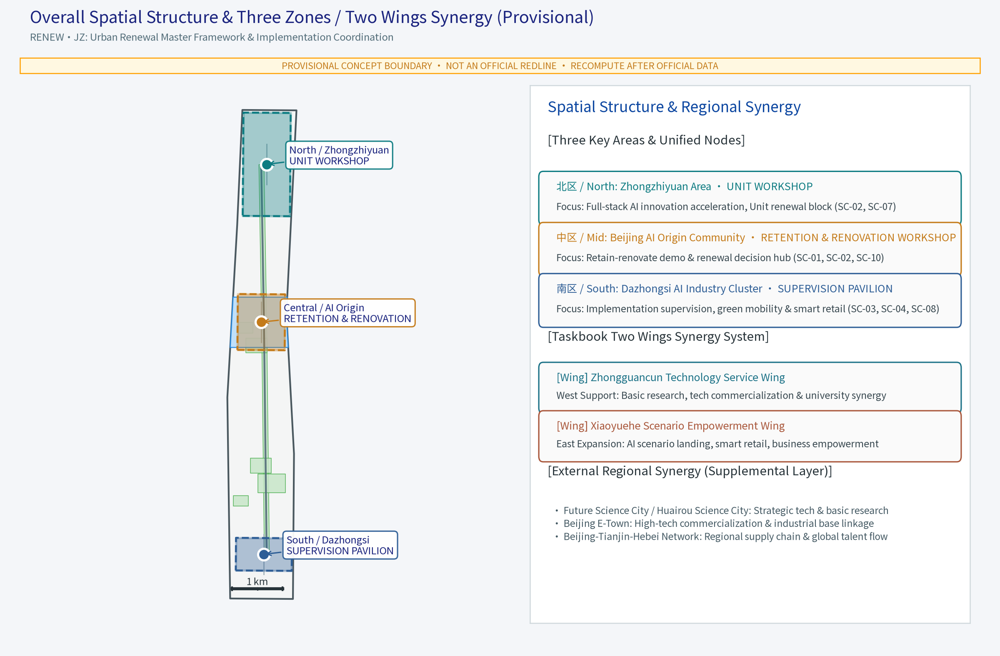
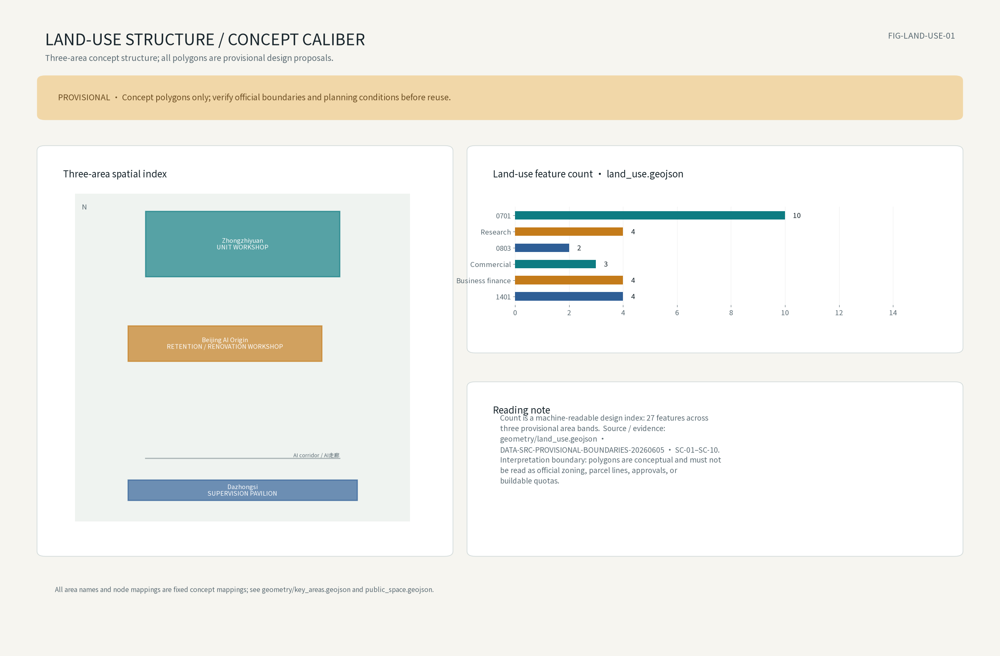
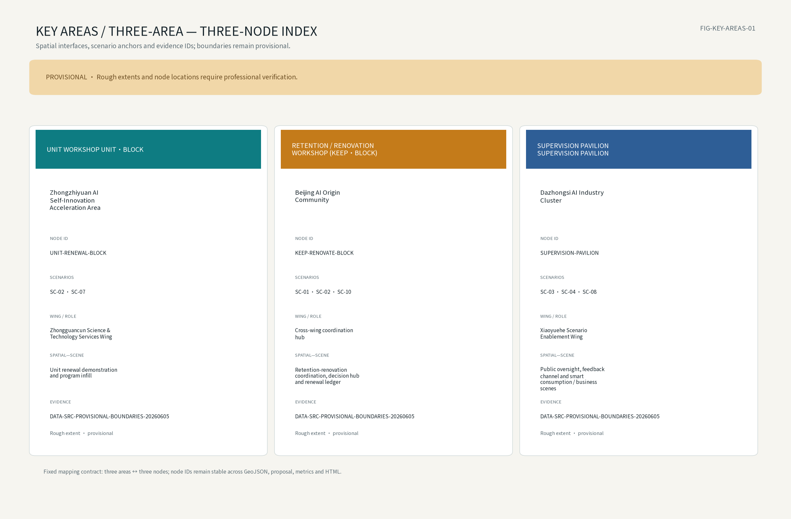
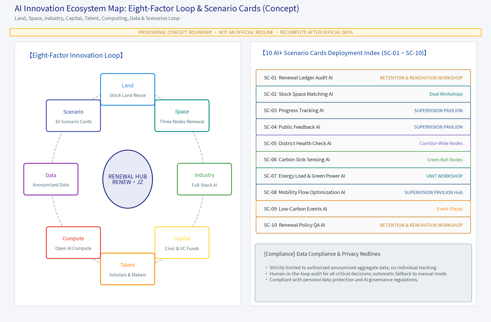
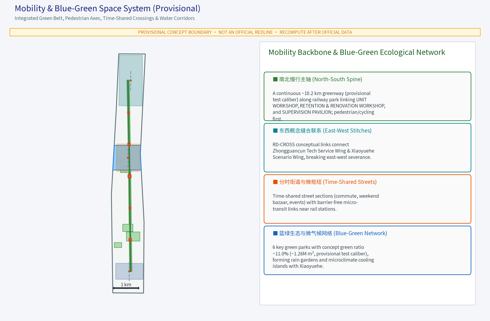
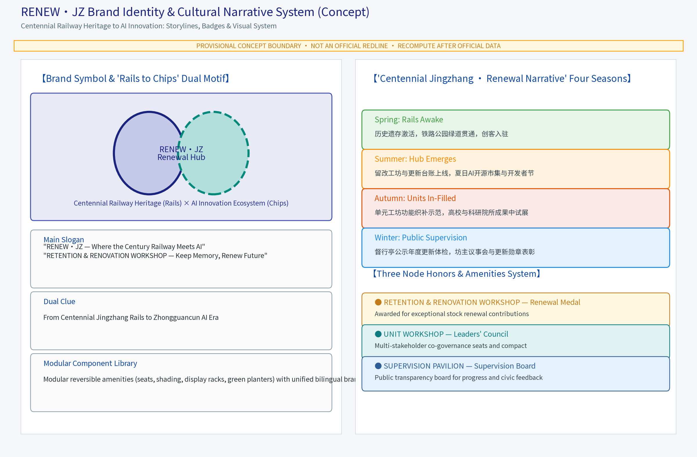
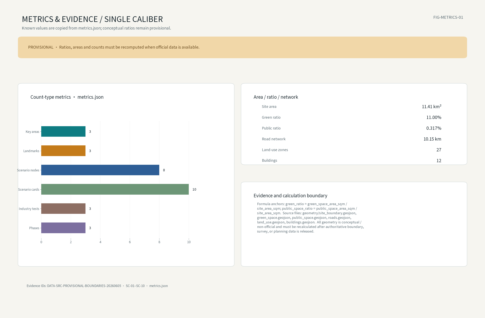

> Disclaimer: this document is a conceptual, forward-looking planning research suggestion. It is not an official renewal plan, investment data or engineering implementation scheme; all figures are concept-level indications that preset no FAR, building height, retain-renovate-demolish ratio or road-redline conclusions. The legally approved outcomes prevail.

## Design Basis and Source List
The listed public historical records, planning reports and technical codes are a concept work-basis checklist — citation targets, not data already acquired by this package. All data actually used are recorded in sources.json; every asset's license and attribution (logo, fonts, icons, images, maps, data, code, AI-generated content) is recorded in report/copyright_statement.md; unacquired items are disclosed in the risk and missing-data statements. The tasks of this proposal are anchored to the official call-for-entry announcement and the agent taskbook, with the Barrier-Free Environment Law of the PRC, national and Beijing urban renewal measures, and urban-design and regulatory-plan management codes used as methodological references; public material on the Jingzhang Railway Heritage Park is used for concept narrative only, never to assert established facts.

Before any further deepening, every version and its validity date must be re-verified against official publications: the announcement and taskbook text, the latest amendments of the laws and codes, and the published planning documents along the corridor. The difference between this checklist and sources.json is the package's honest data-gap disclosure, including: no organizer-supplied official boundary polygon in a verifiable coordinate system, no statutory land-use or road redlines, no rail or heritage-protection lines, no listed-building control lines, no green/blue lines, and no ownership or municipal-capacity survey data.

> **Evidence anchor**：[source:DATA-SRC-OFFICIAL-ANNOUNCEMENT]、[source:DATA-SRC-AGENT-TASKBOOK]。

## Three-Level Scope Framework
Following the official textual scope of the announcement: the coordinated research area is about 43.6 square kilometres, the overall design area about 11.4 square kilometres, and the key detailed-design area about 368.4 hectares (the sum of the three key districts). This package's own sub-scope sits inside the overall design area and is expressed as concept geometry in geometry/site_boundary.geojson, whose area matches the announced textual caliber, but the geometry is a provisional rough constraint, not an official redline; once official geometry is published, all figures, metrics and drawings must be recomputed and redrawn.

The three levels transmit design intent level by level: the coordinated research area outputs regional-coordination judgments and future-city directions that constrain the overall design; the overall design checks the retain-renovate-demolish framework, renewal units and the slow-traffic backbone that are then detailed in the key areas. Each level keeps machine-readable evidence anchors to the corresponding taskbook chapters. All three-level boundaries are provisional and may be adjusted with data verification and public feedback; no implementation conclusion is preset by the hierarchy. The three key districts (Zhongzhiyuan AI Self-Innovation Acceleration Zone, Beijing AI Origin Community, Dazhongsi AI Industry Cluster) are represented as temporary rough polygons derived from the announcement's names and approximate areas, used only for concept generation, display and recalculation testing.

> **Evidence anchor**：[source:DATA-SRC-PROVISIONAL-BOUNDARIES] (provisional boundary; concept display and recomputation testing only).

## Coordinated Research Area: Industry and Future City Research
The industry and future-city study identifies the "fit" effect of urban renewal: stock space carries the pilot-plant, incubation and support functions of industrial upgrading to avoid large-scale demolition; spill-over research from Haidian universities converts locally with community innovation; international residential clusters support a diverse talent-service network. The future-city study is directional only and implies no land-use or investment commitment. At the coordination level the proposal focuses on the Three Zones / Two Wings regional loop (conceptual mapping from the directional reading of the taskbook, to be re-verified against the official text word by word), organized as a space-industry-operation closed loop as itemized below. The two wings are the taskbook-defined "Zhongguancun Technology Service Wing" (中关村科技服务翼) and "Xiaoyuehe Scenario Empowerment Wing" (小月河场景赋能翼); this proposal adopts no alternative names and does not substitute any external party for the wings' site or functional roles. The three key zones are the spatial nodes where the wings land (the north zone carries the Zhongguancun Technology Service Wing, the south zone carries the Xiaoyuehe Scenario Empowerment Wing, and the middle zone is the junction where the two wings meet); Future Science City, Huairou Science City, E-Town and the Jing-Jin-Ji direction serve only as a supplementary coordination layer. The space-industry-operation loop between the wings, the three zones and the external partners runs: the Zhongguancun Technology Service Wing injects basic research, talent and commercialization services into the three zones through the technology-service interface and corridor universities (spatial interface — industry supply — operational collaboration); the Xiaoyuehe Scenario Empowerment Wing brings AI application conversion, smart-native consumption and business scenarios into the three zones through the Xiaoyuehe scenario interface and spills over to station-area business districts (spatial corridor — industry landing — open operation); the supplementary coordination layer carries brand outreach, international attraction and Jing-Jin-Ji industry coordination (external spatial interface — industry coordination — joint operation). The loop is a conceptual mapping; the wings' official spatial scope will be re-verified against the taskbook text and recomputed once official geometry is published.

| Three Zones / Two Wings (concept mapping) | Spatial anchor (provisional) | Industry theme | Operation mechanism (concept) | Partners |
| --- | --- | --- | --- | --- |
| Zone North (Zhongzhiyuan AI Self-Innovation Acceleration Zone) | UNIT·BLOCK demonstration unit and renewal units | Full-stack AI self-innovation acceleration | Renewal-unit compact, tiered admission, annual public disclosure | Zhongguancun Technology Service Wing, Future Science City, Huairou Science City |
| Zone Mid (Beijing AI Origin Community) | KEEP·BLOCK retain-renovate-demolish demonstration unit | AI entrepreneurship with in-situ living | Block leaders' council, points incentives, rotating exhibitions | Beiwai community, corridor universities |
| Zone South (Dazhongsi AI Industry Cluster) | SUPERVISION PAVILION station and industry-service node | AI application conversion and scenario landing | Industry alliance, facility registration, annual health check | Xiaoyuehe Scenario Empowerment Wing, E-Town, station-area business districts |
| Zhongguancun Technology Service Wing (taskbook wing, concept mapping) | technology-service interface and tech-services interface (provisional) | Basic research — commercialization — tech-services chain | University collaboration, pilot-incubation registration, reservation-based sharing | North-zone nodes, corridor universities, Beiwai community |
| Xiaoyuehe Scenario Empowerment Wing (taskbook wing, concept mapping) | Xiaoyuehe scenario interface and station-area interface (provisional) | AI application conversion, smart-native consumption and business scenarios | Open scenario operation, industry alliance, event reservation, annual health check | South-zone nodes, E-Town, station-area business districts |
| Supplementary layer: east-west coordination network (does not replace the two wings) | External connector and brand-outreach interface (provisional) | International attraction and Jing-Jin-Ji industry coordination | Joint attraction, international communication, alliance building | Future Science City, Huairou Science City, E-Town, Jing-Jin-Ji direction |

> **Evidence anchor**：[source:DATA-SRC-AGENT-TASKBOOK] (the wing names follow the taskbook — Zhongguancun Technology Service Wing and Xiaoyuehe Scenario Empowerment Wing; this table is a concept mapping; the supplementary layer does not replace the two wings).

## Overall Design Area: Urban Renewal and Regulatory-Plan-Level Urban Design
The overall design builds an "urban renewal implementation-coordination environment with the green belt as backbone": the Jingzhang Railway Heritage Park green belt organizes the retain-renovate-demolish framework, renewal units and slow-traffic backbone; the principle is "systematically retain, prudently renovate, selectively demolish"; renewal units couple functional in-fill with public-space upgrading; regulatory-plan indices are checked only as calibration suggestions — no FAR or building-height values are preset. The overall spatial structure, the Three Zones / Two Wings relations and the key-district positions are shown in figure site-overview; the concept land-use structure is shown in figure land-use-structure.

The spatial structure proposes two concept strategies — "north-south connectivity and east-west stitching" (agent.4 verifiable deliverable): north-south connectivity runs the slow-traffic spine along the Jingzhang Heritage Park green belt through the three key zones (Zhongzhiyuan — Beijing AI Origin Community — Dazhongsi) and the three implementation nodes (KEEP·BLOCK — UNIT·BLOCK — SUPERVISION PAVILION), organizing the north-south renewal implementation sequence with a continuous walking-cycling backbone and time-phased activities; east-west stitching connects the east-west urban functions across the green belt through concept "stitch links" (RD-CROSS-00 to RD-CROSS-02 in geometry/roads.geojson; concept alignments, not road redlines), bringing the western research-and-services functions and the eastern scenario-and-consumption functions together at the nodes. Stitch points, cross-section and slow-traffic connections are concept suggestions that require transport and municipal professional re-check before siting, with recalculation when official data is published.

> **Evidence anchor**：[source:DATA-SRC-MOHURD-CONTROL-DETAILED-PLANNING] (methodological reference for regulatory-depth calibration).

## Detailed Design of Key Areas
Unified naming: "RENEW·JZ" is the working brand of the belt-wide master framework; no separate "Renewal Workshop" name is used. The three implementation nodes are uniformly named RETENTION & RENOVATION WORKSHOP (KEEP·BLOCK, retain-renovate-demolish demonstration unit and renewal-coordination decision hub, converging unit applications, index calibration and decision flows), UNIT WORKSHOP (UNIT·BLOCK, unit-based renewal demonstration unit validating ledger-based retain-renovate-demolish management and functional in-fill) and SUPERVISION PAVILION (implementation supervision and public-participation station with transparent supervision windows and a resident feedback channel); node IDs (KEEP-RENOVATE-BLOCK / UNIT-RENEWAL-BLOCK / SUPERVISION-PAVILION) are synchronized across the text, figures, metrics, GeoJSON properties and HTML. The three nodes sit along the green belt and connect to the slow-traffic axis, forming a decision-demonstration-supervision loop; all node positions are concept points that must be re-sited after planning, heritage and authority review.

The proposal follows the three major positions (Centennial Jingzhang Culture Belt, Urban AI Living Experience Belt, AI Integration Innovation Belt) and five major functions (full-stack AI self-innovation system, world-class AI innovation ecosystem, AI+ scenario-enabling paradigm, intelligent AI vibrant city, global discourse on AI governance) in the renewal-and-governance direction, as the renewal-coordination and public-supervision carrier of the "intelligent AI vibrant city" along the belt (concept mapping). Three concept landmarks with an honor system are proposed: "RENEW·JZ · KEEP·BLOCK" carries the "Renewal Medal" (annual honor for renewal contributors), UNIT·BLOCK carries the "Block Leaders' Council" honor seats, and SUPERVISION PAVILION carries the "Supervision Honor Board" (open public disclosure of honors and rectification). Public-space facilities are assembled from the reversible "RENEW KIT" component library (seating, shading, display frames, temporary stages, greening modules; each item registered, rotated and reservation-based) — components are demountable and relocatable, avoiding any construction commitment. The scenario-card index (unique IDs SC-01 to SC-10) is:

| Card ID | Scenario card | Location | Target users | Operation mechanism (concept) | Data and compliance boundary |
| --- | --- | --- | --- | --- | --- |
| SC-01 | Renewal Ledger index-calibration AI | KEEP·BLOCK | Practitioners, office workers | Annual accounting, public disclosure | Anonymized aggregation, human review |
| SC-02 | Stock-space matching AI | KEEP·BLOCK, UNIT·BLOCK | Start-ups, enterprises | Space reservation, rotating exhibitions | Anonymized aggregation, human review |
| SC-03 | Renewal progress tracking AI | SUPERVISION PAVILION | Residents, practitioners | Progress board, monthly disclosure | Anonymized aggregation, no over-surveillance |
| SC-04 | Public renewal feedback AI | SUPERVISION PAVILION | Residents, seniors | Reply, appeal-and-correction, timely response | Aggregate statistics only, human review |
| SC-05 | Block health-check AI | Belt nodes | Operators, merchants | Annual assessment, points incentives | Density aggregates, no individual-identifying tracking |
| SC-06 | Green-space carbon-sink sensing AI | Green-belt nodes | Community, students | Sink estimates, science volunteering | Anonymized aggregation, human review |
| SC-07 | Energy-load forecasting AI | UNIT·BLOCK | Property, operators | Energy board, green-power interface | Anonymized aggregation, minimum necessity |
| SC-08 | Renewal mobility-flow AI | Green belt, SUPERVISION PAVILION | Commuters, visitors | Time-phased guidance, event reservation | Aggregate statistics only, no over-surveillance |
| SC-09 | Low-carbon event operation AI | Green-belt nodes | Residents, youth, families | Event reservation, points, rotating exhibitions | Anonymized aggregation, human review |
| SC-10 | Renewal policy Q&A AI | KEEP·BLOCK | Residents, practitioners | Policy Q&A with human review backstop | Anonymized aggregation, human review of key decisions |

Dazhongsi smart-native consumption and business scenario mapping (concept, agent.4): the Dazhongsi AI Industry Cluster pivots on the SUPERVISION PAVILION station and industry-service node, mapping two smart-native scenario families — smart-native consumption (AI-assisted shopping and virtual-try-on pop-ups, smart-native markets, scenario-based low-carbon consumption, linked to SC-09 low-carbon event operation and SC-08 mobility flows, with density governed by reservation, rotating exhibitions and time-phased guidance) and smart-native business (AI enterprise-service front ends, ready-to-use stock space and showroom offices, linked to SC-02 stock-space matching and SC-10 policy Q&A, with quality maintained through tiered admission and annual health checks). The mapping ties into the governance mechanisms (SUPERVISION PAVILION honor board, block leaders' council) and expresses scenario-space-operation correspondences only; it presets no business scale, visitor-flow or capacity conclusions and is recomputed when official data is published.

## AI Innovation Ecosystem, Personas, and AI+ Scenarios
The full-stack AI innovation ecosystem is organized as an eight-factor mechanism chain (concept): land-space-industry-capital-talent-compute-data-scenario. Stock land and space carry pilot and incubation functions; industry and capital loops support scenario landing; talent and compute supply is open-source-oriented; data returns to the scenario loop in anonymized aggregates. The ecosystem map is figure ecosystem-map; five to eight global benchmark cases with per-case sources, timepoints and usage boundaries are listed in the References section. Every chain link is backstopped by human review; AI output never replaces professional judgment.

Five persona groups: entrepreneurs, AI developers, community residents, students and senior neighbours. Personas serve service-journey simulation only, never individual identification; offline alternative channels (staffed windows, phone, paper forms) and digital-exclusion safeguards are provided. The AI+ scenarios are unified into ten numbered cards (SC-01 to SC-10, table in the key-areas section) covering governance (SC-01, SC-03), industry (SC-02), space (SC-05, SC-06), public services (SC-04, SC-10), culture (SC-09) and transport (SC-08); the two earlier five-scenario lists (renewal coordination AI, stock-space matching AI, progress tracking AI, public feedback AI, block health-check AI / renewal coordination AI, carbon-sink sensing AI, energy-load forecasting AI, mobility-flow AI, low-carbon feedback AI) are merged into this single numbered list, synchronized in the text, figures, metrics and GeoJSON properties. AI governance is stated in three phrases: anonymized aggregation only, human review of key decisions, no over-surveillance; carbon accounting is a concept-level public-data-service suggestion that does not replace official statistics. Three test protocols make the scenarios verifiable and reviewable:

| Protocol ID | Test protocol | Verification goal (concept) | Evaluation metrics (concept) | Data and human review | Recompute trigger |
| --- | --- | --- | --- | --- | --- |
| TP-01 | Indicator data-quality and model-evaluation protocol | Index caliber consistency and model-output reliability | Data-quality completeness, model-evaluation baseline | Anonymized aggregation, human review | When official data is published |
| TP-02 | Stock-matching recall and error-stratification protocol | Precision and recall of stock-space matching | Recall, false-positive rate, error-stratification share | Anonymized aggregation, human review | When the stock survey updates |
| TP-03 | Feedback-AI human-review and runtime-monitoring protocol | Feedback flow, correction and response loop | Runtime-monitoring anomaly rate, review pass rate | Human review, full trace | When policy or corpus updates |

Baseline, sample framework and thresholds for the three protocols (concept framework, not conclusion indicators): the baseline is the concept baseline formed by the first-year field survey and public statistics after a pilot launch; once official data is published the whole recalculation runs and the baseline becomes versioned. The sample framework is organized as "monthly collection, quarterly aggregation, annual evaluation", with the sample caliber and coverage rolling with the pilot scope. Thresholds preset no conclusive values: the professional review team sets review-trigger intervals from the baseline distribution (the magnitude of a deviation-hint interval is only a method example), with "human-review backstop and full trace" as the execution boundary.

> **Evidence anchor**：[source:DATA-SRC-GENERATIVE-AI-INTERIM-MEASURES] (reference for AI-generated-content governance phrasing).

## Repair Closure and Single Naming Contract
This repair fixes the only mapping as Zhongzhiyuan AI Self-Innovation Acceleration Area - UNIT·BLOCK, Beijing AI Origin Community - KEEP·BLOCK, and Dazhongsi AI Industry Cluster - SUPERVISION PAVILION. The three areas use teal, amber and blue consistently across legends, scenario links, GeoJSON properties, bilingual figures, HTML and PDFs under `v2.1-three-areas-three-nodes`. The official wing names are only 中关村科技服务翼 / Zhongguancun Technology Service Wing and 小月河场景赋能翼 / Xiaoyuehe Scenario Empowerment Wing. Future Science City, Huairou Science City, E-Town and Jing-Jin-Ji remain supplemental collaboration objects and never replace the two wings. All geometry, derived ratios and pending KPIs are concept suggestions; they are not current-state conclusions and must be recomputed after official boundaries, CRS, controls, mobility, ownership and survey inputs arrive.

### Operational fields for all ten scenario cards (concept work package)
The fields below make each card auditable: inputs and model capability require future authorized data; facilities, operational ownership, fallback, evaluation metrics and exit conditions are completed per pilot, with no uncollected baseline or threshold presented as a real result.

| ID | Inputs / model capability | Facility / ownership | Fallback | Evaluation (baseline pending) | Exit condition (concept) |
|---|---|---|---|---|---|
| SC-01 | Authorized anonymized aggregates only; Renewal Ledger index-calibration AI | KEEP·BLOCK; staffed channel and human owner | Switch to manual ledger, phone and paper channels when data or model fails | Set completeness, timeliness or correction baseline in first pilot survey | Pause and disclose if repeated review fails, complaints concentrate, or privacy/safety is not met |
| SC-02 | Authorized anonymized aggregates only; Stock-space matching AI | KEEP·BLOCK / UNIT·BLOCK; staffed channel and human owner | Switch to manual ledger, phone and paper channels when data or model fails | Set completeness, timeliness or correction baseline in first pilot survey | Pause and disclose if repeated review fails, complaints concentrate, or privacy/safety is not met |
| SC-03 | Authorized anonymized aggregates only; Renewal progress tracking AI | SUPERVISION PAVILION; staffed channel and human owner | Switch to manual ledger, phone and paper channels when data or model fails | Set completeness, timeliness or correction baseline in first pilot survey | Pause and disclose if repeated review fails, complaints concentrate, or privacy/safety is not met |
| SC-04 | Authorized anonymized aggregates only; Public renewal feedback AI | SUPERVISION PAVILION; staffed channel and human owner | Switch to manual ledger, phone and paper channels when data or model fails | Set completeness, timeliness or correction baseline in first pilot survey | Pause and disclose if repeated review fails, complaints concentrate, or privacy/safety is not met |
| SC-05 | Authorized anonymized aggregates only; Block health-check AI | Belt nodes; staffed channel and human owner | Switch to manual ledger, phone and paper channels when data or model fails | Set completeness, timeliness or correction baseline in first pilot survey | Pause and disclose if repeated review fails, complaints concentrate, or privacy/safety is not met |
| SC-06 | Authorized anonymized aggregates only; Green-space carbon-sink sensing AI | Green-belt nodes; staffed channel and human owner | Switch to manual ledger, phone and paper channels when data or model fails | Set completeness, timeliness or correction baseline in first pilot survey | Pause and disclose if repeated review fails, complaints concentrate, or privacy/safety is not met |
| SC-07 | Authorized anonymized aggregates only; Energy-load forecasting AI | UNIT·BLOCK; staffed channel and human owner | Switch to manual ledger, phone and paper channels when data or model fails | Set completeness, timeliness or correction baseline in first pilot survey | Pause and disclose if repeated review fails, complaints concentrate, or privacy/safety is not met |
| SC-08 | Authorized anonymized aggregates only; Renewal mobility-flow AI | Green belt / SUPERVISION PAVILION; staffed channel and human owner | Switch to manual ledger, phone and paper channels when data or model fails | Set completeness, timeliness or correction baseline in first pilot survey | Pause and disclose if repeated review fails, complaints concentrate, or privacy/safety is not met |
| SC-09 | Authorized anonymized aggregates only; Low-carbon event operation AI | Green-belt nodes; staffed channel and human owner | Switch to manual ledger, phone and paper channels when data or model fails | Set completeness, timeliness or correction baseline in first pilot survey | Pause and disclose if repeated review fails, complaints concentrate, or privacy/safety is not met |
| SC-10 | Authorized anonymized aggregates only; Renewal policy Q&A AI | KEEP·BLOCK; staffed channel and human owner | Switch to manual ledger, phone and paper channels when data or model fails | Set completeness, timeliness or correction baseline in first pilot survey | Pause and disclose if repeated review fails, complaints concentrate, or privacy/safety is not met |

## Land Use, Building Scale, and Retain-Renovate-Demolish Strategy
The strategy combines retention, renovation and selective demolition: it makes no present-condition claim about any specific building or railway-related element; after survey and archival confirmation, suitable objects may be prioritized for conservation or adaptation. Stock buildings get functional replacement with low-carbon retrofit directions reserved (envelope, energy use, green-power interface); demolition is limited to individual case-by-case openings for slow-traffic connections. All areas are concept caliber; caliber, aggregation rules and recompute triggers are stated in the Metrics, Area Recalculation, and Compliance Matrix section; no inferred area numbers are published in the text, and a full recalculation with redrawn figures follows once official data is published.

The overall approach is managed through three ledgers: heritage-and-value retention with repair and activation; structural retention with functional replacement; and cautious, selective partial demolition and rebuild. Ledger contents and scales preset no numbers and are itemized with the stock survey and ownership coordination; the concept land-use figure uses a single caliber (share of concept parcels over the concept overall-design area, same caliber as green_ratio), so no other public-green share is shown side by side, avoiding misreading; any retain-renovate-demolish conclusion follows statutory procedure and public participation.

> **Evidence anchor**：[source:DATA-SRC-MNR-LAND-USE-CLASSIFICATION] (land-use classification names follow the current national guide).

### Scenario-space-operations-metrics loop (concept acceptance chain)
Each scenario card follows one auditable loop: the spatial node provides a legible service interface; an operating owner runs it through a covenant, reservation, rotation or staffed channel; metrics are reviewed to retain, adjust or pause the service. The three levels are fixed in the same loop: the coordination study range handles cross-area cooperation and resource interfaces; the overall design range handles the green-belt spine, wing interfaces and node sequence; key areas handle card-level pilots and public feedback. Lower-level outputs never replace statutory upper-level boundaries.

| Level/object | Spatial action | AI and operations | Metric/decision gate | Owner/evidence |
|---|---|---|---|---|
| Coordination study range | Two-wing and external collaboration interfaces | Annual cooperation agenda and data list | Response timeliness and collaboration completion (baseline pending) | Government coordination and alliance; annual disclosure |
| Overall design range | Connect green belt, three nodes and east-west stitches | Phase, event and shared-facility orchestration | Walkability continuity and facility availability (baseline pending) | Planning/transport/municipal review; versioned recalculation |
| Key areas | Pilot cards at KEEP-BLOCK, UNIT-BLOCK and SUPERVISION PAVILION | SC cards, human review and failover | Closure, correction and service-access measures (baseline pending) | Community, enterprise, university and operator; pilot ledger |

Concept rule: missing data or model failure switches to manual ledgers; two review cycles without improvement trigger deliberation and disclosure; safety, ownership, heritage, fire, accessibility or rights disputes pause automation and move to professional review. Thresholds, samples and baselines are set only after an authorized pilot; package ratios and derived areas are not current-state results.

## Transport, Rail, Municipal Infrastructure, and Public Services
The transport concept is slow-traffic-first: a continuous slow-traffic axis along the green belt links KEEP·BLOCK, UNIT·BLOCK and SUPERVISION PAVILION; street sections respond to activities by time of day (morning market, events, daily modes); corridor universities, parks and rail stations are connected with walking-and-cycling-first transfers; green mobility first, less car dependence, time-phased crowd dispersion after events; no road redline or engineering values are preset. Municipal services follow intensive sharing: green-power interfaces and renewal-data facilities integrate with buildings as a concept, existing facilities are reused first, and shared utility corridors with modular implementation are encouraged; public services provide barrier-free and multilingual support, community low-carbon services and study spaces, with facility scale re-checked against population and service radius, and every AI decision subject to human review.

> **Evidence anchor**：[source:DATA-SRC-MOHURD-URBAN-DESIGN-MEASURES] (methodological reference for slow-traffic and municipal phrasing).

## Blue-Green Network, Public Space, and Urban Character
A "green belt as the axis, node parks as pearls" blue-green public-space system is proposed: the heritage green belt strings together small green spaces and open spaces into a continuous ecological and public-space network; carbon-sink and blue-green spaces are blended; facilities are light, transparent and reversible, never blocking heritage relics or views along the belt. The blue-green share uniformly follows the green_ratio concept caliber (about 0.11, i.e. the share of concept green parcels), identical to the figures and metrics, marked provisional, to be recomputed when official data is published; no other share figure is placed on the same page.

### Culture narrative and international communication (concept)
A cultural-resource system and spatial storylines (concept): the railway industrial memory vocabulary (points, station houses, rails, signals) forms the motif; historical resource points along the corridor are catalogued as a concept inventory (to be verified item by item with archival sources) and framed into the "Centennial Jingzhang · Renewal Narrative" four-season storyline — Spring "Rails Awake", Summer "Hub Emerges", Autumn "Units In-Filled", Winter "Public Supervision" — with restrained, unified narrative nodes along the belt. Bilingual communication copy examples: "RENEW·JZ — Where the Century Railway Meets AI" (with the Chinese gloss “更新枢·让百年铁路与AI相遇”); "KEEP·BLOCK — Keep the memory, renew the future" (gloss “留改工坊·留住记忆，改出未来”). International communication is supported by the bilingual site, an international-review invitation-letter template and bilingual case cards (concept), open to global AI developers and urban-renewal practitioners.

The narrative adds a "Zhongguancun innovation culture — AI new culture" layer (concept, agent.5). Spatial carriers: "innovation narrative nodes" along the belt — the KEEP·BLOCK courtyard gallery, UNIT·BLOCK innovation windows, the SUPERVISION PAVILION digital-disclosure interface and green-belt science-communication nodes — carrying, in a restrained unified language, the fusion of Zhongguancun's research-cluster and commercialization tradition with AI open-source co-creation culture; carriers and content are concept suggestions, verified step by step with archival and cultural research. Wayfinding symbols: on top of the railway vocabulary (points, signals, rails), an "innovation-cyan iteration-arrow" wayfinding symbol set (sharing its origin with the logo's twin-ring iteration-arrow system) unifies the identity of innovation narrative nodes, scenario entrances and bilingual interfaces. The international narrative proposes a "track-chip" dual-thread concept — from the century Jingzhang railway (track) to Zhongguancun's AI innovation (chip) — with a concept bilingual slogan: "RENEW·JZ — From Jingzhang Rails to Zhongguancun's AI Era", carried by the bilingual site, the international-review invitation-letter template and the case cards; the copy undergoes prior-rights and archival verification before external use.

### Brand identity and visual system (concept)
The single master brand is "RENEW·JZ". The logo concept combines a railway track, two rings and an iteration arrow (railway for the Jingzhang heritage, twin rings for renewal units and the green belt, the arrow for incremental renewal); the color system is Jingzhang rust red, innovation cyan, track grey and ecology green; fonts prefer openly licensed typefaces (see the asset ledger); applications include wayfinding, event posters, disclosure boards and bilingual digital interfaces. The logo and the full visual set are original concepts and remain internal working codenames until prior-rights clearance (see the Risk section).

> **Evidence anchor**：[source:DATA-SRC-MOHURD-URBAN-DESIGN-MEASURES] (methodological reference for character and public-space organization).

## Renewal Projects, Implementation Policy, and Phasing
Implementation phasing (concept): near term 1-3 years — build the framework and launch the KEEP·BLOCK pilot and the SUPERVISION PAVILION station; mid term 3-5 years — deliver the UNIT·BLOCK demonstration and rolling unit renewal; long term 5-10 years — complete the green-belt backbone and mature the whole-belt operation mechanisms. The project list is managed as a deepening ledger with lead and collaborating actor types, preconditions, professional re-checks, pilot admission and exit conditions, indicator baselines and data cycles, annual reviews and long-term operating-and-conversion pathways; costs are given only as low/medium/high tiers with estimation method, price base year, scope included, confidence level and recompute trigger — no monetary amounts. Baseline-setting methodology: the concept baseline is formed by the first-year field survey and public data after a pilot launch, each indicator registering its data source, formula caliber, confidence level and recompute trigger (see the Metrics section), with whole recalculation when official data is published; cost estimation uses the analogy method with the price base year (2026), scope included and confidence level stated, revised as the stock survey and cost information update. Pilot admission requires ownership-coordination readiness and majority consent; pilot exit requires "baseline not met for two consecutive years and annual review not passed" or "concentrated dissent in the public disclosure", followed by disclosed withdrawal.

| Implementation ledger (concept) | Phase | Lead / collaborating actors | Preconditions and professional re-check | Pilot admission / exit | Baseline / data cycle | Annual review and conversion | Cost tier (method · base year · confidence) |
| --- | --- | --- | --- | --- | --- | --- | --- |
| RENEW·JZ · KEEP·BLOCK coordination pilot | Near 1-3y | Government-led; property owners, planning-heritage team, universities, community, professional teams | Stock survey and ownership sorting; planning, heritage, fire re-check | Ownership ready and residents' council passed; exit via disclosed withdrawal | Renewal coverage / annual | Annual disclosed review; converts to standing coordination platform | Medium (analogous neighbourhood renewal, 2026 base, low confidence) |
| UNIT·BLOCK demonstration unit | Mid 3-5y | Government-led; development-operator, property management, universities | Retain-ledger and municipal-connection re-check | Application-based admission with majority consent | Unit completion / quarterly | Annual review; rolls out into the unit regime | Medium (analogous stock retrofit, 2026 base, low confidence) |
| SUPERVISION PAVILION station | Near 1-3y | Government-led; volunteers, merchant federation, community, merchants | Site disclosure and feedback collection | 6-month trial assessment before admission | Feedback resolution / monthly | Annual disclosure; upgrades to standing supervision | Low (modular light build, 2026 base, medium confidence) |
| Green-belt slow-traffic linking | Mid 3-5y | Government-led; municipal engineering teams, corridor schools, volunteers | Rail-protection re-check, slow-traffic safety review | Segment-first, open after acceptance | Slow-traffic connectivity / quarterly | Annual review; enters belt O&M alliance | High (municipal-engineering analogy, 2026 base, low confidence) |
| RENEW KIT public-space components | Near 1-3y ongoing | Government-guided; enterprise-sponsored; community and designer volunteers co-build | Structural-safety and fire-registration re-check | Registration-based, rotating placement | Component reuse / annual | Annual review; consolidates into reusable product library | Low (standardized components, 2026 base, medium confidence) |
| RENEW Developer Community and data openness | Mid 3-5y start | Enterprise-led; universities, developer volunteers; third-party evaluation participates | De-identification and compliance review | Developer-agreement admission, compliance-based exit | Open API count / half-yearly | Annual review; converts to international attraction | Low (platform operation, 2026 base, medium confidence) |

Annual event brands (consistent with the annual-program metrics): RENEW OPEN DAY, RENEW BAZAAR and BLOCK HEALTH-CHECK SEASON, set on a base of monthly regular activities (guided tours, exhibitions, volunteer duty) and a week-month-season-year rhythm. The long-term operating-and-conversion pathway runs: developer community — open scenario operation — international attraction (bilingual communication, international jury and alliance exchanges) — diversified funding and governance (a renewal-operation alliance under government guidance, enterprise participation and social-capital supplements, run on compact, council, disclosure and registration mechanisms). Policy suggestions (low-carbon function admission and coordination, multi-stakeholder co-building, opinion re-check mechanisms) all require statutory review and imply no government or operator commitment.

| Annual event brand (concept) | Cycle | Main content | Participants | Long-term conversion path |
| --- | --- | --- | --- | --- |
| RENEW OPEN DAY | Annual | Renewal results expo, scenario experience, staffed tours | Government, enterprises, universities, residents, volunteers | Consolidates into annual brand asset and international window |
| RENEW BAZAAR | Annual | Maker market, stock-space tour, policy Q&A | Merchants, start-ups, residents, youth | Converts into merchant and start-up community portal |
| BLOCK HEALTH-CHECK SEASON | Annual | Health-check release, index disclosure, points incentives | Operators, community residents, professional teams | Converts into annual baseline update and supervision mechanism |

> **Evidence anchor**：[source:DATA-SRC-AGENT-TASKBOOK] (phasing and implementation items follow the taskbook requirements).

## Metrics, Area Recalculation, and Compliance Matrix
The concept indicator system is stored in metrics.json, each indicator carrying data source, formula or caliber, confidence level, usage restriction and recompute trigger (the table below is the in-text index; full fields are in metrics.json). Area recalculation follows the official textual caliber (coordinated research area about 43.6 km², overall design area about 11.4 km², key area about 368.4 ha): the package's concept geometry is cross-checked against it but no inferred area is published; once official polygons are released, a full recalculation is performed with a recalculation version number; provisional-boundary warnings are synchronized in figures, metrics and geometry properties.

| Indicator (concept) | Data source | Formula / caliber | Confidence | Usage restriction | Recompute trigger |
| --- | --- | --- | --- | --- | --- |
| site_area_sqm | geometry/site_boundary.geojson | polygon area (EPSG:4548) | Medium | Concept display and machine checks only | Official boundary published |
| green_ratio | green_space.geojson and boundary | concept green parcels / overall design area | Low | Same-caliber display only | Official data published |
| public_space_ratio | public_space.geojson and boundary | concept public-space area / overall design area | Low | Same-caliber display only | Official data published |
| scenario_card_count | scenario-card index in proposal.md | count of SC-01 to SC-10 | High | Text-figure caliber consistency | Scenario list revised |
| global_case_count | case table and sources.json | eight case entries | High | Concept reference, not case-status judgment | Source verification updated |
| annual_program_count | annual-event table in proposal.md | three annual events | High | Event-system caliber consistency | Event list revised |

The compliance matrix checks laws, codes and call requirements item by item with a traceable record (compliance_matrix.json); the standard matrix and design-depth matrix are in their JSON files, each evidence summary pointing to its own real response content rather than duplicated boilerplate.

> **Evidence anchor**：[metric:green_ratio]、[metric:public_space_ratio]、[data:PACKAGE-GEOMETRY]。

> **Evidence anchor**：[metric:scenario_card_count]、[metric:global_case_count]、[metric:phase_count]。

## Risk, Copyright, and Compliance
This proposal is a concept research design: it is not an administrative-approval basis and contains no FAR, building-height, retain-renovate-demolish or engineering-feasibility conclusions. Risks are honestly registered in risk.json across boundary precision, statistical caliber, data boundaries, missing statutory controls, technology maturity and public acceptance, with the response principles of anonymized aggregation, minimum necessity, human review, source labeling and feedback channels. AI governance in three phrases: anonymized aggregation only, human review of key decisions, no over-surveillance. A resident feedback channel (online entry, staffed offline windows, phone and paper forms) is paired with appeal, correction, timely response and digital-exclusion safeguards; major matters are disclosed per law with an annual update disclosure; annual events run the three brands OPEN DAY, BAZAAR and HEALTH-CHECK SEASON.

### Brand prior-rights and usage boundary
No official trademark search has been completed at this concept stage: "RENEW·JZ", "KEEP·BLOCK", "UNIT·BLOCK", "SUPERVISION PAVILION", the logo mark and slogans are internal working codenames; prior-rights clearance and relevant permissions are required before any external use, application or formal naming. Asset rights records are in report/copyright_statement.md and visual/assets/figure_qc.json, with asset entries registered in sources.json and manifest role notes kept consistent.

Copyright: the proposal builds on public sources (all citations carry source and access date); original graphics, names and text are generated by the package authors with rights reserved; fonts, icons, images, maps, data and code are itemized in the asset ledger; any resemblance to existing marks or names is coincidental; third-party portraits, trademarks, papers or images are not used without authorization; multi-department joint review, heritage protection and safety assessment must precede formal implementation. This proposal is a concept research suggestion that constitutes no commitment; the outcomes of statutory procedures prevail.

> **Evidence anchor**：[source:DATA-SRC-OFFICIAL-ANNOUNCEMENT] (basis for the ownership and compliance phrasing under the call rules).

## References
Public-caliber citations: the official call-for-entry announcement and taskbook; the Barrier-Free Environment Law of the PRC; national and Beijing urban renewal measures and technical codes; public material on the Jingzhang Railway Heritage Park; urban-design and regulatory-plan codes; the interim measures on generative AI services and the national land-use classification guide. Every citation follows the official published text and must be version-checked before deepening; case sources are registered item by item in sources.json (institution URL, access date, milestone timepoint, reuse boundary). Cases are concept references only, not judgments on the current state of the projects; entries without cross-verification are treated as research hypotheses.

International and domestic benchmark cases (concept reference; sources verified on 2026-08-25):

| Category | Case | Source (institution / URL / milestone) | Lesson borrowed | Verification |
| --- | --- | --- | --- | --- |
| International | King's Cross regeneration, London | King's Cross Central Limited Partnership, kingscross.co.uk; outline permission 2006-12-22 (Camden ref 2004/2307/P) | Whole-district rail-lands renewal, public space and infrastructure first, long-horizon coordinated delivery and supervision | Verified (site reachable) |
| International | Barcelona Superblocks | Barcelona City Council, ajuntament.barcelona.cat/superilles; programme start 2015 | Block-level traffic-calming units with before/after quantitative monitoring (block health check) | Verified (site reachable) |
| International | Tokyo Marunouchi | Mitsubishi Estate, mec.co.jp corporate history; "Reconstruction of Marunouchi" began 1998, Marunouchi Building completed 2002 | Multi-owner coordinated renewal with co-built and co-managed public space | Verified (site reachable) |
| International | HafenCity Hamburg | HafenCity Hamburg GmbH, hafencity.com; master plan approved by the Hamburg Senate 2000-02-29 | Phased district delivery with public space and services first | Verified (site reachable) |
| Domestic | Shanghai Yuyuan Road | Changning District Government, shcn.gov.cn; renewal launched 2014 | Incremental micro-renewal with in-situ operation and integrated operator | Verified (government page reachable) |
| Domestic | Beijing Shougang Park | Shougang Group, shougang.com.cn; 2016 BOCOG move-in as milestone | Industrial heritage conservation-based transformation and mega-event driven | Verified (group page reachable) |
| Domestic | Nanjing Laomendong | Qinhuai District Government, njqh.gov.cn; block opened 2013-09 | Historic-district conservation renewal with commercial activation | Verified (government page reachable) |
| Domestic | Shenzhen Nantou Ancient City | Nanshan District Government, szns.gov.cn; conservation task force established 2019-03 | Organic renewal of urban villages with public participation; "government-led, enterprise-implemented, resident-participated" | Verified (government page reachable) |

(End of proposal: 13 sections plus annex tables; the full indicator, source, risk and compliance records are in the corresponding JSON files.)

> **Evidence anchor**：[source:DATA-SRC-OFFICIAL-ANNOUNCEMENT] (first entry of this list is the organizer's public package).