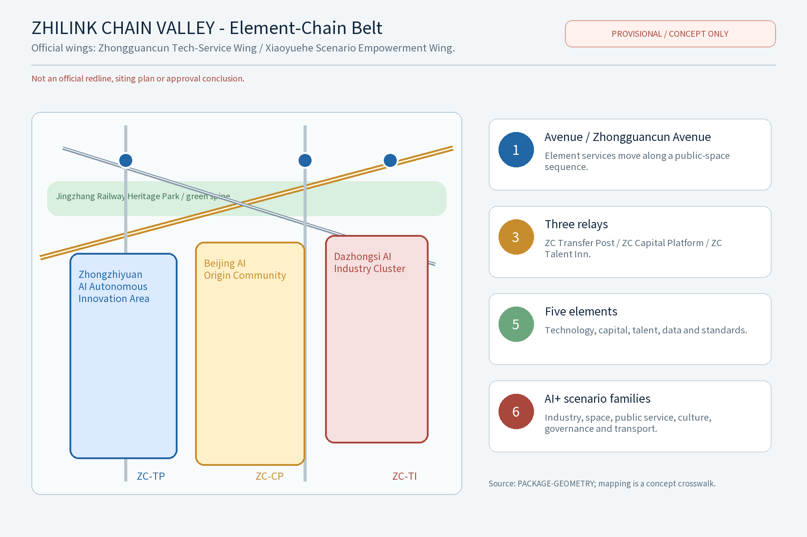
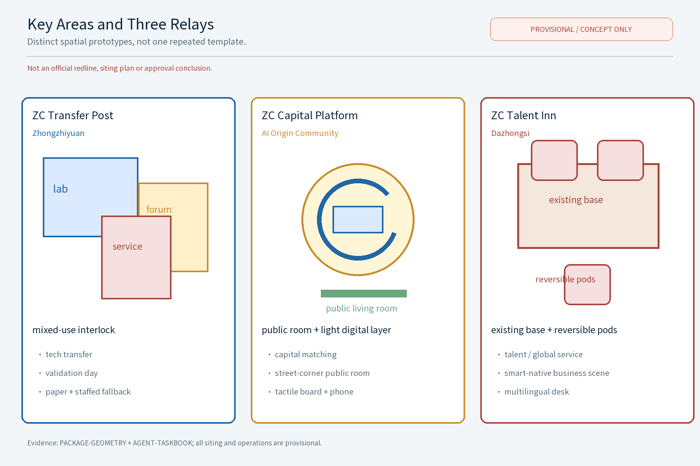
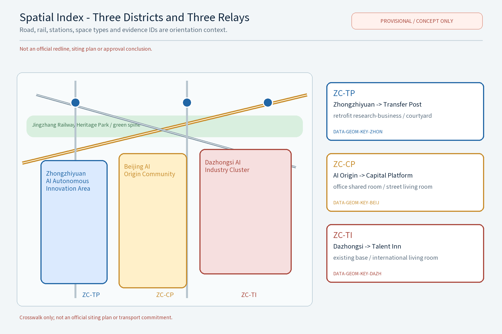
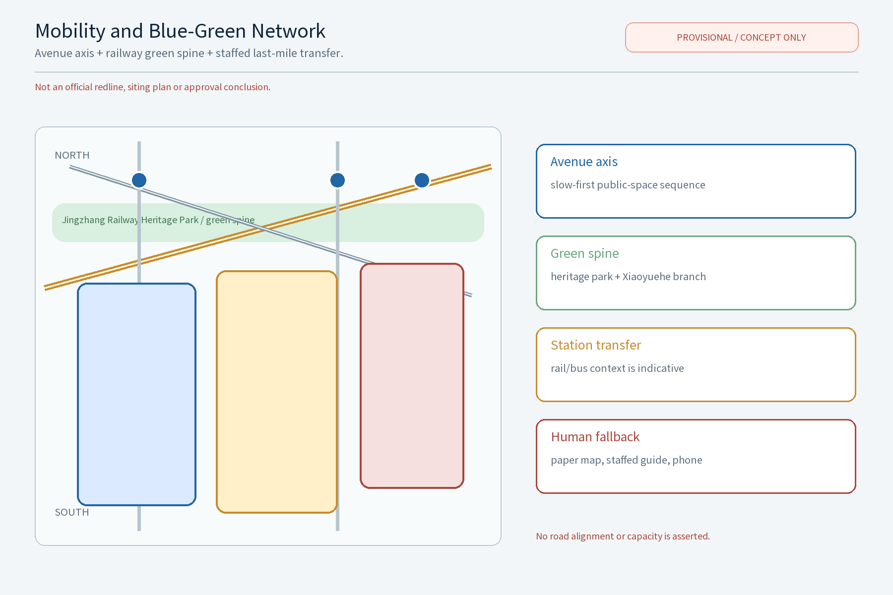
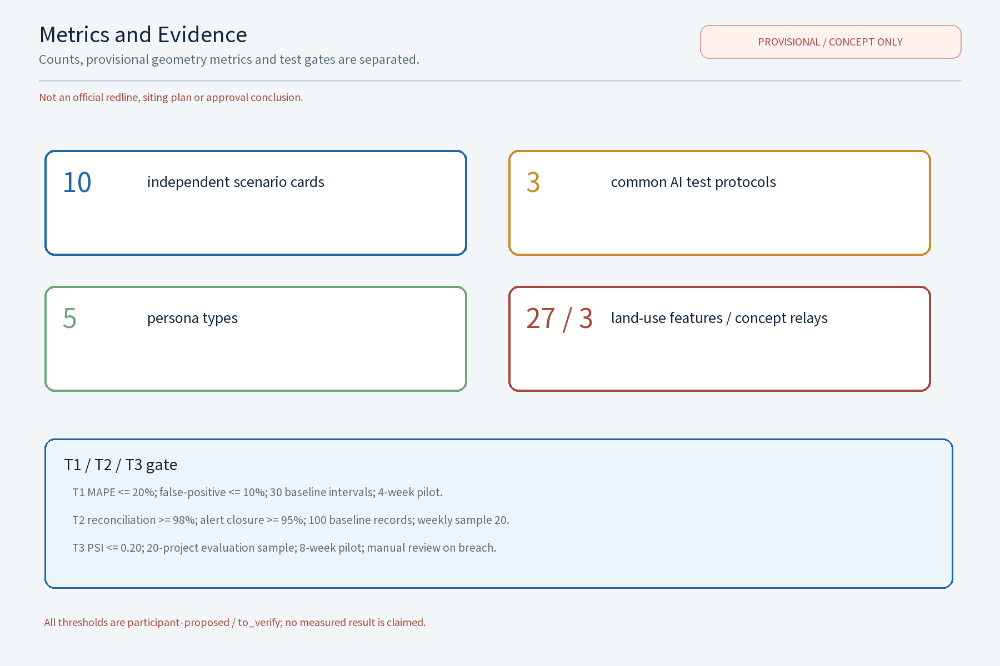

**Scheme Name and Overall Positioning (Concept)**

Primary name: "ZHILINK CHAIN VALLEY", English: ZHILINK CHAIN VALLEY (an original concept name that does not refer to any real city, park or enterprise; used as an internal working codename). Overall idea: taking the "Zhongguancun Tech-Service Wing" as the topic, treat tech services as the "first chain" that organizes the flow of innovation elements, and build along Zhongguancun Avenue (Haidian section) a tech-service ecosystem belt for global element allocation, letting technology, capital, talent, data and standards flow along the chain and aggregate in the belt. Drawing on the century-old Beijing-Zhangjiakou Railway spirit of "independent innovation, one line through", the scheme turns the full tech-service chain into the "three chain relays": ZC Transfer Post (tech-transfer), ZC Capital Platform (investment & innovation capital), and ZC Talent Inn (talent & international cooperation) - three original concept nodes stringing together the avenue's public-service sequence, together with a "ZHILINK CHAIN VALLEY · Element-Chain Belt" brand identity (logo, tagline, color and icon component library) and regional co-ordination loops. The scheme links the three orientations (Jingzhang century culture belt, urban AI-life experience belt, AI-integrated innovation belt) and the five functions (full-stack independent AI innovation system, world-class AI innovation ecosystem, new AI+ scenario empowerment paradigm, intelligent AI-vibrant city, global voice in AI governance); all deliverables are concept proposals and reference schemes for professional teams to develop further.

**Brand and node naming convention (current review baseline)**: the canonical brand is **ZHILINK CHAIN VALLEY**; **ZC** is only an internal layout abbreviation for compact labels and is not an independent mark, approved endorsement or real-world entity. The three concept nodes are fixed as **知转驿站 / ZC Transfer Post (ZC-TP)**, **金链驿台 / ZC Capital Platform (ZC-CP)** and **慧才驿栈 / ZC Talent Inn (ZC-TI)**. The narrative, matrices, bilingual figures, HTML and A0/A3 boards must use these exact names; unregistered variants such as Zhizhuan Post, JinLian Platform and HuiCai Inn are not used. All names and graphics remain internal working codenames until prior-rights clearance.

## Design Basis and Source List

This scheme is grounded in the call-for-proposal announcement and design taskbook, using the organizers' published text calibers: coordinated research area 43.6 sq km, overall design area 11.4 sq km, key areas totaling 368.4 hectares, and the district calibers of Zhongzhiyuan AI Autonomous Innovation Acceleration Area (about 192 ha), Beijing AI Origin Community (about 104 ha) and Dazhongsi AI Industry Cluster (about 72 ha). References include: published design results of the Jingzhang Railway Heritage Park, publicly available Beijing and Haidian territorial spatial plans and urban-renewal policy texts, published statistics, along-the-belt site surveys, and open geodata used only for spatial narrative illustration. The organizers have not yet published a coordinate-bearing official boundary; this scheme claims no precise area or geometry, treats all geometry as provisional, and will recompute uniformly once official boundary and regulatory-control data are published. Where site-specific professional inputs are missing (statutory regulatory plans, rail/road control conditions, heritage and ecological constraints, ownership, municipal capacity, fire control), the scheme uses only methodological references for boundary and terminology, draws no project-specific conclusions, and records the gaps in the risk & compliance section.

> **Evidence anchors**:[source:OFFICIAL-ANNOUNCEMENT](call text caliber), [source:AGENT-TASKBOOK](taskbook task caliber).

**Auditable 13-dimension crosswalk (supplementary review dimensions)**: the table links every taskbook dimension to a fixed section, matrix and delivery artifact. All evidence remains conceptual or provisional; proposed thresholds are not reported as measured results.

| dimension_id | Review dimension | Text / matrix evidence | Figure / metric evidence | Status |
|---|---|---|---|---|
| objective_alignment | Objective alignment | design basis; three-level framework | site-overview.en.png; source:AGENT-TASKBOOK | addressed |
| function_match | Function match | taskbook crosswalk; three orientations, five functions, three districts and two formal wings | spatial-index.en.png; compliance_matrix.json | addressed |
| brand_identity | Brand identity | ZHILINK CHAIN VALLEY naming and brand system (agent.1) | logo-zhilink.en.png; icon library | addressed / rights to_verify |
| regional_synergy | Regional synergy | five-candidate co-ordination matrix (agent.6) | metrics.json; annual event system | participant-proposed / to_verify |
| planning_innovation | Planning innovation | research-design-implementation loop; land-use and retain-renovate-demolish section | land-use-structure.en.png; design_depth_matrix.json | addressed / provisional |
| industry_support | Industry support | ecosystem map, five elements and T1-T3 (agent.2/3) | metrics-evidence.en.png; metrics.test_protocols | participant-proposed / to_verify |
| scenario_perceptibility | Scenario perceptibility | 10 scenario cards, public-space and relay experience (agent.3/4) | scenario-cards.en.png; key-areas.en.png | addressed |
| spatial_clarity | Spatial clarity | district-relay-space-type crosswalk; landmark cards (agent.4) | spatial-index.en.png; geometry/key_areas.geojson | provisional / to_verify |
| transferability | Transferability | phasing, RACI, resource packs and stop gates (agent.6) | A0/A3; drawings/*.pdf | addressed / concept |
| expression_completeness | Expression completeness | fixed 13 sections, bilingual body, matrices and evidence anchors | bilingual figures, HTML, A0/A3, visual/index | addressed |
| public_compliance | Public compliance | risk, rights and compliance section; human fallback and no-tracking boundary | report/copyright_statement.md; sources.json | addressed / rights to_verify |
| international_communication | International communication | heritage-resource to carrier to story/signage/copy matrix (agent.5) | bilingual logo, key-area and mobility figures | addressed / concept |
| long_term_operation_value | Long-term operation value | annual events, developer community, scenario opening and regional loops (agent.6) | annual_program_count; go_no_go | participant-proposed / to_verify |

**Agent.1-6 coverage**: agent.1 owns the name/brand and overall framework; agent.2 owns the ecosystem, cases and element-flow map; agent.3 owns the 10 scenario cards and T1-T3 protocols; agent.4 owns the three distinct public-space relays, honor display and reversible component library; agent.5 owns the heritage/culture/story/signage/international-copy matrix; agent.6 owns phasing, RACI, events, developer community, scenario opening and regional co-ordination. Each owner reference is cross-linked in `compliance_matrix.json` and `design_depth_matrix.json`.

## Three-Level Scope Framework

Results cascade down three levels: the coordinated research level outputs on element-flow patterns and service-belt functions and constrains the overall design; the overall design level's land-use compatibility, avenue sections and flexible indicators then land in the node detailed design. Each level keeps machine-readable evidence anchors for the corresponding taskbook chapters to support reviewers.

The framework is organized as a closed "research-design-implementation" loop. Level 1 - the coordinated research area (43.6 sq km, official text caliber): studies industry structure, element-flow networks and future-city research, settling the tech-service wing's hub position in the innovation belt. Level 2 - the overall design area (11.4 sq km, official text caliber): uses regulatory-plan-depth urban design to prepare the overall spatial scheme and a design-guideline element list for the urban renewal along Zhongguancun Avenue. Level 3 - the key areas (totaling 368.4 ha, official text caliber): detailed design of the three districts and deepening of the "three chain relays" concept nodes. The three levels share one "ZC digital base" (concept mechanism) that locally de-identifies and anonymizes industry, transport, building, blue-green and population data to support dynamic calibration and phasing evaluation; the base does not collect or use individual-identifying information and supports aggregate decision support only.

> **Evidence anchors**:[source:AGENT-TASKBOOK](three-level scope divided by the official text caliber of the taskbook).

## Coordinated Research Area: Industry and Future City Research

The along-the-belt industry narrative runs north to south: Qinghe-Shangdi/Zhongguancun Software Park as an AI software-platform and compute heavyweight, Zhichun Road concentrating research institutes and hard-tech incubation, Zhongguancun Avenue as the innovation source and tech-business core, and Xueyuan Road converging the university talent belt - together forming the full-stack independent AI innovation industry spectrum. The coordinated research proposes "five conceptual mechanisms for global element allocation": global innovation-network links (liaison nodes at offshore innovation hubs, two-way guidance); technology transfer and IP trading (open licensing of patents and on-site settlement); cross-border talent-mobility services (one-stop visa guidance and qualification recognition); standards and evaluation services (co-building AI benchmarks and evaluation rules); and data-element circulation rules (on-site registration, anonymized circulation, revenue sharing).

**Ecosystem map (concept)**: with the "chip-framework-model-data-application-evaluation" full-stack chain as the horizontal axis and "source-incubation-transfer-capital-talent-governance" service stages as the vertical axis, the scheme maps the tech-service wing's place in the global AI innovation ecosystem, locating where the five elements flow and where gaps sit. **Global case comparison (concept, 5 items)** are listed below; all are public institutional pages used only as mechanism references, not official endorsements, and should be re-verified at citation time.

| Case (region/park) | Mechanism point | Transferable element | Source (public verifiable page) |
|---|---|---|---|
| one-north, Singapore | government-guided + market-operated R&D community | cluster layout and shared platforms | JTC (Singapore) official site |
| Kendall Square, Cambridge, USA | research-university/venture-capital corridor | concept validation and capital aggregation | MIT Kendall Square Initiative site |
| Hetao Shenzhen-Hong Kong Innovation Zone | cross-border element flows and rule alignment | cross-border talent and data arrangements | State Council gazette (gov.cn) |
| Mila AI Institute, Montreal, Canada | open datasets and talent-network co-building | open science and international talent networks | Mila official site |
| Pangyo Tech Valley, South Korea | government park + enterprise-led operation | industry clustering and exhibition ecosystem | Pangyo Techno Valley official site |

> **Evidence anchors**:[source:PROVISIONAL-BOUNDARIES](boundaries provisional; ecosystem map and cases are conceptual), [metric:global_case_count].

## Overall Design Area: Urban Renewal and Regulatory-Plan-Level Urban Design

The overall design area (11.4 sq km, official text caliber) is organized with "avenue as axis, service as chain". First, integrate service nodes with the avenue public-space sequence: embed the three chain-relay concept nodes in avenue segments near Zhichun Road, the middle Zhongguancun Avenue and the south entrance of Xueyuan Road, aligning with existing squares and green spaces to form a continuous "tech-service living room" experience. Second, let tech-service functions co-exist with street life: service retail and display on the ground floor, professional services and incubation above, encouraging work-live-consume mixing. Third, strengthen pedestrian and slow links: restructure the avenue section, reserve a continuous walking band, and network with the Jingzhang Railway Heritage Park green corridor, Xueyuan Road and Zhichun Road slow links. Fourth, supplement public services: convenience centers, 24-hour shared service points, nursery/elder-care micro-facilities and barrier-free facilities. Building heights, building-line ratios and similar indicators should be settled only after official boundary and regulatory plans are published; this scheme offers guideline elements only and presets no conclusive control values.

> **Evidence anchors**:[source:MOHURD-URBAN-DESIGN](urban-design method reference), [source:PROVISIONAL-BOUNDARIES](provisional boundary, recompute).

## Detailed Design of Key Areas

The key areas total 368.4 ha (official text caliber), comprising the Zhongzhiyuan AI Autonomous Innovation Acceleration Area (about 192 ha), the Beijing AI Origin Community (about 104 ha) and the Dazhongsi AI Industry Cluster (about 72 ha). They focus respectively on autonomous-innovation acceleration, AI-origin culture and daily-life experience, and AI-industry clustering with service support. This preserves the taskbook's formal "three districts, two wings" frame: the three districts are the three named key areas, and the two wings are the **Zhongguancun Tech-Service Wing** and the **Xiaoyuehe Scenario Empowerment Wing**. East-west stitching is only a cross-wing public-space and service strategy around the Jingzhang Railway Heritage Park; it does not replace the formal wing names or claim an official boundary. The three original concept nodes are explicitly mapped to service scenes rather than treated as substitutes for the geographic framework: **ZC Transfer Post** serves Zhongzhiyuan's technology-transfer and pilot-acceleration scenes; **ZC Capital Platform** serves the AI Origin Community's public-facing capital and innovation-service scenes; and **ZC Talent Inn** serves Dazhongsi's talent, international cooperation and smart-native consumption/business scenes. All three are concept nodes, not official sites, and use modular, reversible components for later professional refinement.

**AI landmark cards (concept nodes, not official siting)**: each card binds a spatial type, public experience, low-digital fallback, reversible component, operator type and a participant-proposed stop gate. The gates are provisional/to_verify; no baseline or result is claimed.

| Landmark / relay | Applicable spatial type | Target users | Public experience | Non-digital fallback | Reversible component | Operator type | Stop gate (participant-proposed, provisional/to_verify) |
|---|---|---|---|---|---|---|---|
| ZC Transfer Post / 知转驿站 | retrofit research-business ground floor, courtyard and plaza | founders, engineers, students | concept-validation day, roadshow, dialogue wall, results display | staffed registration, paper intent form, volunteer guide | street furniture, display wall, modular booth | relay operator + university + enterprise | if conversion leads stay below 10% for two consecutive weeks, or any critical compliance-sandbox item fails: disable the tool, withdraw components and switch to manual service |
| ZC Capital Platform / 金链驿台 | shared meeting room, street-corner living room and display arcade in office buildings | investors, employees, companies | bi-weekly capital matching, patient-capital day, case display | paper filing form and staffed phone/desk | mobile booth and demountable partition | capital platform + industry association + compliance self-regulator | if effective matching stays below 15% for two consecutive bi-weekly sessions, or one unacceptable review risk is found: withdraw components and return to manual matching |
| ZC Talent Inn / 慧才驿栈 | existing building at S. Xueyuan Road, residential ground floor and international living room | international talent, students, young workers | cross-border service day, culture night, talent-map display | staffed help desk, paper handbook and multilingual volunteers | street furniture, display panels, rotating exhibition | relay + university international office + NGO | if complaints exceed 5% for two consecutive service periods, or accessibility/privacy review fails: disable the digital flow and keep the staffed window |

The east-west stitching is the continuous public-space and service sequence from the Zhongzhiyuan acceleration area through the AI Origin Community to Dazhongsi; the north-south throughline is the Jingzhang green spine, avenue crossings and station-facing pedestrian links. These are design narratives, not claims of completed connectivity.

**Xiaoyuehe Scenario Empowerment Wing — public-experience path (concept interface, not an official route)**: this package does not treat a blue-green line as a wing-level design. It proposes a reviewable sequence of **entry notice point → under-bridge shared living room → community service lookout**, all reversible concept spaces whose exact siting must be checked against official boundary, ownership, slow-traffic and flood-control information. Each node is tied to an existing scenario card through the same seven fields: space, audience, data boundary, responsibility, human fallback, metric and exit gate.

| Path node (concept) | Linked scenario card | Space type / target group | Input-data boundary | Operating responsibility / human fallback | Metric / exit gate |
|---|---|---|---|---|---|
| Xiaoyuehe entry notice point | "Relay Commute" event shuttle | riverfront slow-mobility entry and wayfinding node / commuters, visitors, residents | aggregate time-bucket counts and voluntary event bookings only; no individual traces | street + operator; paper map, staffed wayfinding and manual shuttle phone | punctuality, complaints and human-takeover closure / remove digital recommendation after complaints exceed the participant-proposed gate |
| Under-bridge shared living room | "Origin Stage" roadshow space | reversible under-bridge event area and mobile seating / founders, public, families and nearby merchants | de-identified project summaries and voluntary registration only; no face recognition or behavior profiles | relay + media; human host, paper registration and public-interest priority | sessions, participation and feedback closure / pause and withdraw components after two weak-demand cycles or failed safety review |
| Community service lookout | "Silver Care" community terminal | riverside community service micro-node and low counter / elders, families and low-digital-ability users | non-digital channel first; only anonymous service counts and satisfaction | street + volunteers; home visit, paper form and staffed window | service reach, satisfaction and response time / disable automated triage after repeated complaint or privacy-review failure while retaining manual service |

The public value is not more equipment; it is translating Xiaoyuehe from a blue-green backdrop into a walkable, participatory and reversible scenario-empowerment interface. Data is limited to event scheduling and service review, and every node can be withdrawn without removing the human service path. The path, nodes and metrics are participant concept proposals, not claims of an official boundary or completed construction.

**Dazhongsi AI Industry Cluster — smart-native consumption and business loop (concept)**: ZC Talent Inn is not only a talent-help desk here. It becomes a service interface for **talent entry → trial experience → demand matching → repeat use**, using a retrofit industrial-street ground-floor shared service hall and demountable display cabinets (concept space, not official siting). "Talent Window" provides human-first onboarding for international talent and engineers; "Cloud Ladder" turns de-identified product/service summaries into withdrawable pilot displays and small-business service booths; "Chain Capital Lounge" then connects voluntary pilot demand to capital, procurement and technical-service partners after human review. Responsibility sits with an industry operator, relay operator and industry-association/compliance reviewer. Only de-identified briefs, bookings and aggregate feedback are allowed; no individual tracking or automated credit decision. Paper forms, a staffed guide and manual matching remain available when digital tools are off. Public value is a legible trial-and-service entry for international talent, start-ups and neighborhood merchants. Concept go/no-go metrics are repeat-use intent, effective-match rate, complaint closure and human-review completion; if two cycles fall below participant-proposed gates or compliance review fails, withdraw the digital matching in "Cloud Ladder", retain the offline service and publish the review.

**Scenario-card index (concept, 10 independent cards; each mapped to 1–3 of the three common protocols)**: AI+ scenarios land as scenario cards to form a reviewable, iterable operating index. The protocol links are a separate mapping field; they do not change the fixed count of 10 independent cards.

| Scenario card (concept) | Location and audience | Operating mechanism | Model/data boundary | Space and operator | Metric / exit gate | Protocol mapping |
|---|---|---|---|---|---|---|
| "Value Assistant" IP valuation | ZC Transfer Post; founders and engineers | booking plus expert review | anonymized patent/transaction samples; no individual tracking | screened consultation room; licensed valuation specialist | error bands and false positives / disable above T1 gate | T1 |
| "Chain Capital Lounge" VC match | ZC Capital Platform; investors and companies | bi-weekly matching and rotating agenda | anonymized project catalogue; human decision | shared meeting room and rotating booth; capital platform + compliance self-regulator | effective matches and intent / withdraw if gate fails | T1, T2 |
| "Talent Window" cross-border service | ZC Talent Inn; international talent and students | booking plus multilingual volunteers | de-identified documents; no over-monitoring | staffed reception and paper window; university international office | service time and complaints / retain staffed window | T2, T3 |
| "Zhilink Screen" data ledger | avenue public space; operators and merchants | annual disclosure and deliberation | aggregate ledger only; human review | street-corner screen plus tactile board; operator + compliance reviewer | reconciliation and closure / return to paper ledger | T2 |
| "Relay Commute" event shuttle | three relays and avenue stops; visitors and commuters | reservation, points and staffed wayfinding | aggregate mobility counts; one-tap shutdown | shelter and directional signs; street + operator | punctuality and complaints / remove digital route | T2 |
| "Zero Validation" concept validation | Zhichun incubators; research teams and students | milestone gate and deliberation | de-identified project briefs; public results only | shared test room; university + relay | graduation and drift / return to manual review | T1, T3 |
| "Cloud Ladder" incubation conversion | avenue street-level booths; SMEs and start-ups | tiered rent and filing | anonymized business data; human matching | demountable booth and counter; commercial operator | occupancy and renewal / stop conversion path | T2, T3 |
| "Origin Stage" roadshow space | avenue stage nodes; founders and public | booked slots and open registration | de-identified project summary; public-interest priority | mobile stage and modular seating; relay + media | sessions and participation / pause if demand gate fails | T2 |
| "Silver Care" community terminal | community service centre; elders and families | voluntary pairing with human fallback | non-digital channel first; aggregate only | low counter and staffed corner; street + volunteers | service reach and satisfaction / remove automated triage | T2 |
| "Teen Maker" youth AI workshop | public component node; children and families | booked batches and rotating courses | no minor data collection; adult supervision | demountable workstations; relay + volunteer teachers | participation and parent satisfaction / stop on safeguarding concern | T3 |

> **Evidence anchors**:[data:PACKAGE-GEOMETRY](three-district and relay polygons from geometry/key_areas.geojson).

## AI Innovation Ecosystem, Personas, and AI+ Scenarios

At ecosystem level the belt links the chip-framework-model-data-application-evaluation full stack, using the tech-service wing as the common support for every stage (ecosystem map in the coordinated-research section). Persona portraits cover five types of talent: frontier researchers, serial entrepreneurs, engineers and product people, internationally mobile talent, and tech-service professionals; facilities are allocated by persona with off-peak scheduling, keeping alternative channels for elders, children and people with disabilities who have low digital ability. AI+ scenarios (concept tools, six families): tech-service smart matching & policy-compliance assistant; IP valuation assistant; investment-matching assistant; talent & visa assistant; standards & evaluation digital tool; data-element circulation ledger. Privacy and human-review boundary: all assistants process anonymized aggregates only; personal information is locally de-identified and differentially private aggregated; sensitive conclusions (compliance opinions, valuations, credit opinions, visas) must be human-reviewed by licensed professionals before release; no behavior-tracking or individual-profiling surveillance, no person-recognition applications, no individual tracking, no over-monitoring.

**AI technical test protocols (concept, 3 - test first, scale later)** verify tool reliability before real business integration; each records test conditions, pass criteria and exit mechanism:

| Test protocol (concept) | Test conditions (samples/environment) | Pass criteria | Failure exit & human takeover |
|---|---|---|---|
| "Policy Compliance Assistant" | anonymized policy corpus, offline sandbox | key-clause hit and false-positive rates within target; human review pass | stop above threshold; hand to legal team |
| "IP Valuation Assistant" | de-identified valuation samples, licensed baseline | valuation-band deviation within band; error stratification controlled | out of band, return to manual valuation |
| "Data Ledger" protocol | anonymized transaction sample, simulated flow | ledger reconciliation consistent; model eval & runtime monitoring OK | mismatch -> withdraw, revert to manual registration |

**Reproducible threshold card (participant-proposed, not an official acceptance standard)**: these values are for a concept pilot go/no-go rehearsal only. Before launch, the data-protection and business leads jointly lock the baseline, sample, window and missing-value rule; no entry is an official approval, safety, accessibility or professional certification.

| Protocol / gate | Baseline and sample window | Formula and participant-proposed threshold | Reviewer and go/no-go |
|---|---|---|---|
| T1 IP Valuation Assistant | Eight-week pre-pilot history, at least 30 de-identified reviewable intervals; four-week pilot, at least 10 cases/week | MAPE = mean(abs(predicted-midpoint - observed-midpoint) / max(abs(observed-midpoint), epsilon)); MAPE <= 20%, false-positive rate <= 10%, and at least 10 cases per error stratum | Valuation specialist + privacy lead review weekly; two consecutive breaches = NO-GO, disable model and use manual valuation |
| T2 ZC Screen / Data Ledger | Two-week double-entry manual ledger, at least 100 reconciliation records; four-week pilot, weekly checks | reconciliation rate = matched_records / checked_records; rate >= 98%, alert-closure rate >= 95%, 20 records sampled/week | Ledger administrator + compliance reviewer sign weekly; any weekly breach = NO-GO, revert to manual registration |
| T3 Zero-Number Validation | One-quarter pre-pilot baseline from a comparable project, at least 20 de-identified projects; eight-week pilot | graduation rate = graduated / admitted; evaluation sample >= 20, PSI drift <= 0.20; admission rate is observational only, not a success promise | University/station review pair; two consecutive PSI breaches or graduation rate 20% below baseline = NO-GO, manual review |
| Any phase gate | Lock baseline, sample, period, owner and missing-data rule before launch; never invent a missing baseline | Expansion requires both safety/privacy/human-review records and protocol threshold; “meets expectation” alone is not acceptance evidence | Lead proposes, compliance reviewer confirms, operator records; any unmet condition means no expansion, disable or withdraw |

These are auditable starting proposals by the participant. Where a real baseline is unavailable, mark the result proposed / to_verify rather than tested. Preserve human review, paper alternatives, appeal and withdrawal.
> Protocols verify the tools only; none constitutes a business-approval commitment.

AI scenario domains cover six areas: industry (concept validation & pilot acceleration), space (avenue public-space sequence), public services (talent & visa guidance), culture (roadshows & annual forum), governance (data ledger & compliance sandbox), and transport (event shuttle & market organization); each domain is backed by human review.

> **Evidence anchors**:[source:GENERATIVE-AI-MEASURES](AI-generated-content governance reference), [source:BARRIER-FREE-LAW](accessibility & human-fallback baseline, listed scenarios only).

## Land Use, Building Scale, and Retain-Renovate-Demolish Strategy

The retain-renovate-demolish strategy keeps the order "retain first, then renovate, demolish last": along the avenue, quality research/business premises, heritage buildings and public green spaces are registered and kept as much as possible; only the rare buildings that are dilapidated or seriously obstruct slow travel and public services undergo building-by-building demolition appraisal. All areas are concept-caliber and will be recalculated when official data is published. This section asserts no numeric land shares: until the official regulatory plan and land-cadastre classification are published, the relative structure of uses (research & service, commercial/tech business, education-research-design, green & open space, residential supporting, cultural facilities, transport facilities and flexible reserve) is shown only as a single aggregate-caliber illustration (see land-use-structure figure) and is not a statutory conclusion; formal land data follows official publication and recomputation.

This scheme provides a conceptual retain-renovate-demolish strategy and scale suggestion: retain - quality research/business premises, heritage buildings and green public space along the avenue, preserving and revitalizing their functions; renovate - low-efficiency buildings and older streetfront shops upgraded with mixed functions, adding service and open public space; build - only a small number of controlled node buildings reserved around the three concept points. No precise building scale is presupposed; a ratio range among "service space, incubation space, public space" is proposed for further study. All land classification and indicators are concept-level and are not statutory planning conclusions.

> **Evidence anchors**:[source:MNR-LAND-USE-GUIDE](land-use classification terminology by current national guide).

### Spatial Index and Three Relay Mapping (Concept)

The spatial index is a bilingual crosswalk, not an official siting plan: **Zhongzhiyuan AI Autonomous Innovation Acceleration Area → ZC Transfer Post (ZC-TP)**; **Beijing AI Origin Community → ZC Capital Platform (ZC-CP)**; **Dazhongsi AI Industry Cluster → ZC Talent Inn (ZC-TI)**. It shows the three provisional polygons, Zhongguancun Avenue, the Jingzhang Railway Heritage Park green spine, indicative road/rail/station context, each space type and evidence ID. Existing transport lines and station names are orientation context only; the three relay positions remain conceptual and must be rechecked against official geometry, ownership and control data.

> **Evidence anchors**: [data:PACKAGE-GEOMETRY] (provisional polygons), [source:PROVISIONAL-BOUNDARIES] (not an official redline), [source:AGENT-TASKBOOK] (task alignment).
## Transport, Rail, Municipal Infrastructure, and Public Services

Slow mobility is organized with Zhongguancun Avenue as the axis and the Jingzhang Railway Heritage Park as the green spine, linking bus-bone and pedestrian-first sections with last-mile rail-station transfers; municipal work combines power capacity upgrades, distributed energy and rainwater collection (concept); public services use a two-tier system (chain relays + community services) integrating convenience, sharing, nursery/elder care, barrier-free, mother-and-baby and AED facilities, with human review on all AI decisions.

Transport concept: Zhongguancun Avenue reinforces bus-bone and pedestrian-first sections and organizes last-mile transfer around stations; existing rail nodes (Qinghe, Zhichunlu, Wudaokou, Dazhongsi and other current facilities) serve as transfer anchors for deepening rail-innovation-belt coupling research. Slow traffic and greenways: network with the Jingzhang Railway Heritage Park, Xueyuan Road and Xiaoyuehe riverfront trails to form both commuter and vitality systems. Municipal: compute-oriented power expansion, distributed energy and photovoltaics, rainwater collection and infiltration retrofit (all concept). Public services: supplemented by the two-tier "chain relays + community services" system covering convenience centers, 24-hour shared service points, nursery and elder-care micro-facilities, barrier-free and mother-and-baby rooms, and AED points, with age-friendly, elder-friendly and child-friendly design throughout, raising shared service for international talent and residents. Accessibility and human fallback use the scenarios listed in the Barrier-Free Environment Law as the baseline and do not claim all spaces compliant.

> **Evidence anchors**:[source:MOHURD-URBAN-DESIGN](municipal and slow-design method reference), [source:BARRIER-FREE-LAW](accessibility baseline).

## Blue-Green Network, Public Space, and Urban Character

The blue-green network integrates the Jingzhang Railway Heritage Park green spine, the Xiaoyuehe blue-green branch and the Xueyuan Road university green belt; the three relay-point plazas act as "breathing points" on the chain. Smart street furniture, information release and night lighting follow a restraint principle - moderate lighting, on-demand illumination, avoiding over-decoration and light pollution.

The blue-green network takes the Jingzhang Railway Heritage Park as the green spine, the Xiaoyuehe riverfront as the blue-green branch, and the Xueyuan Road green belt and street greenery as a network; each concept point is paired with a small plaza as a breathing point. The public-space sequence runs along Zhongguancun Avenue, integrating station plazas, street living rooms, relay plazas and park entrances into a continuous "tech-service living room" experience. **Public-space component library (concept, reversible)**: standardized modules of street furniture, seating, planters, information columns, charging and vending units combine and rotate by season and event to avoid rigid construction. **Honor & display system (concept)**: on the Origin Stage and Zhilink Screen, an honor wall for founders, volunteers and community co-builders is updated through annual disclosure and points incentives, highlighting people's participation rather than device surveillance.

### Heritage, Stories, Signage, and International Communication (Concept)

The cultural layer separates fact, translation and concept. The historical reference is the publicly documented Jingzhang Railway heritage; the Zhongguancun reference is the publicly documented university and innovation culture; the relay names, chain metaphor and overseas copy are original concept translations pending rights review.

| Resource / evidence boundary | Spatial carrier | Story and sign system | International communication copy | Status |
|---|---|---|---|---|
| Jingzhang Railway heritage; verify against official heritage materials | railway heritage park, green spine and station-facing path | rail-line mark, timeline panels, bilingual "one line through" story | "One line through: a century of independent innovation" | fact reference + concept translation |
| Zhongguancun university and innovation culture; use public institutional sources | avenue public-space sequence, university-facing crossings and relay plazas | element-flow icons, research-to-service wayfinding | "From research to public value" | public-source reference + concept translation |
| AI service ecosystem; no claim of completed ecosystem | three relays, Origin Stage and Zhilink Screen | chain-ring identity, service cards and human-fallback symbols | "First chain, chaining everything" | original concept |
| Community participation; mechanism proposal only | street living rooms, event booths and honor wall | volunteer levels, paper sign-up and annual disclosure | "Build the service belt together" | original concept; participant-proposed |

The English labels use the same carrier order, relay mapping and evidence boundaries as the Chinese version. No heritage fact is presented as a newly verified site claim, and no concept name is presented as a registered brand.

### Brand Identity and Visual System (Concept)

The unifying identity is "ZHILINK CHAIN VALLEY · Element-Chain Belt": the logo uses a "chain-ring + five element dots" motif with the tagline "first chain, chaining everything"; the color system takes tech blue as the base with auxiliary colors distinguishing the five elements; the icon component library covers the intellectual hub, chain belt, relay post, platform and inn categories. The identity also serves the wayfinding system and **international communication copy** (bilingual): publish a "ZHILINK CHAIN VALLEY" tech-service narrative and overseas-facing materials for global talent and companies, blending the century-old Jingzhang culture, Zhongguancun culture and new AI culture to strengthen international reach; wayfinding centers on the three relays with both text and voice channels for barrier-free and low-digital-ability users. All brand names and marks are treated as internal working codenames until trademark clearance; they are not registered or used externally.

> **Evidence anchors**:[source:MOHURD-URBAN-DESIGN](blue-green organization & character-control method reference).

## Renewal Projects, Implementation Policy, and Phasing

The three-phased project list (near 1-3y / mid 3-5y / far 5-10y) is a concept list; scale and investment estimates are qualitative suggestions only and do not constitute government, investment or approval commitments. Implementation is organized as "actor - prerequisite - minimum viable pilot - concept resource pack - milestone - indicator - human takeover & go/no-go", with a RACI of four actor types (lead, collaborator, approval channel, operator), and stop conditions for each project (a pilot that under-performs is withdrawn or halted; a data-compliance sandbox that fails evaluation is disabled).

**Project list and phasing (concept)**: near term (start-up 1-3y) - build the ZC digital base and AI-assistant platform 1.0, run pilot-point micro-renewal and relay-siting research, open the first Xiaoyuehe experience-path segment; mid term (growth 3-5y) - the three relays come online, the avenue public-space sequence links through, pilot-block mixed-use renovation; far term (maturity 5-10y) - the full-chain ecosystem forms, offshore liaison nodes and global networks run routinely, and the developer community and scenario-opening platform become self-organizing. Each phase sets a minimum viable pilot (e.g., validating the event mechanism with a single roadshow day), a concept resource pack (scripts, graphics, budget-tier description), milestones and stage acceptance indicators, and reserves human takeover and go/no-go decision points.

**Developer community and scenario opening (concept)**: run a developer community (online workshops + offline hackathons), open the "scenario opening" interface and dataset catalog under an "open co-creation covenant" bounding participant rights and duties; **attraction-to-conversion mechanism (concept)**: the "Cloud Ladder" incubation service converts event traffic into a "event - match - entry - repurchase" chain. **Annual event system (concept, 6 branded programs)**:

| Annual program brand (concept) | Frequency | Lead & partners (concept) | Review indicator (concept) |
|---|---|---|---|
| Results Roadshow Day | quarterly | universities + relays + enterprises | project count and conversion leads |
| Technology Trading Market | monthly | relays + associations + agencies | booths and intent-to-deal count |
| Capital Matching Bi-weekly | bi-weekly | Capital Platform + investors | sessions held and follow-on intent |
| Global Talent Service Day | monthly | Talent Inn + university intl. offices | served persons and satisfaction |
| Standards & Evaluation Open Week | yearly | standards bodies + relays | participating bodies & reports |
| ZHILINK CHAIN VALLEY Annual Forum | yearly | alliance + media + government | attendance and topics count |

**Regional co-ordination loops (concept, auditable matrix)**: all metrics below are participant-proposed/to_verify operating hypotheses, not measured results or partner commitments. The named objects are collaboration candidates from the taskbook/public context; professional teams must confirm the contact, data and governance route before any pilot.

| Collaboration candidate | Bidirectional elements | Mechanism | Suggested frequency | Owner types | One verifiable metric (participant-proposed/to_verify) | Evidence boundary |
|---|---|---|---|---|---|---|
| Beiwai Community | relay service scripts ↔ resident feedback and volunteer shifts | co-hosted service day + paper feedback register | monthly | community + relay operator + university | ≥30 valid feedback forms/event and ≥80% response closure within 30 days | taskbook/public name; verify local authorization |
| Future Science City | pilot demand and test cases ↔ research/compute resources | shared test-call and results review | quarterly | science-city operator + relay + enterprise | ≥2 jointly reviewed cases/quarter with signed human-review record | concept collaboration; no resource access claimed |
| Huairou Science City | cultural/education event content ↔ research interpretation and speakers | rotating exhibition + expert exchange | twice yearly | science-city operator + cultural operator + university | ≥2 exchange sessions/year and ≥1 traceable public output/session | concept collaboration; to_verify |
| Economic-Technological Development Area | industrial needs ↔ supply-chain/service matchmaking | service-belt referral protocol and case clinic | quarterly | industrial park operator + capital platform + associations | ≥10 de-identified referrals/quarter with outcome code | concept collaboration; no industrial data claimed |
| Beijing-Tianjin-Hebei innovation collaboration | standards, talent and capital ↔ local scenarios and market feedback | annual forum + rotating bilateral working group | yearly forum + quarterly working group | regional alliance + relays + professional institutions | ≥5 organizations/year and ≥3 reciprocal agenda items recorded | broad public cooperation frame; verify partners |

The proposed metric is recorded before each activity with baseline, sample and window; failure pauses the exchange loop and returns to a staffed/manual channel. No row represents an existing agreement.

> **Evidence anchors**:[source:AGENT-TASKBOOK](phasing and implementation items mapped to the taskbook).

## Metrics, Area Recalculation, and Compliance Matrix

A three-tier goal-indicator-validation conceptual indicator system lives in metrics.json; area recalculation uses this package's provisional geometry as its base and will be recomputed wholesale - with a recalculation version - when official data arrives.

Indicator system (concept): 10-minute walkable coverage of element services; average tech-transfer cycle; cross-border talent service time; AI-assistant penetration and human-review pass rate; job-density; slow-network connectivity; public-service per-thousand-people achievement rate. Each indicator documents data source, formula, confidence level, scope of use and the recalculation trigger when official data is published (see metrics.json). Area recalculation: the scheme uses only official text-caliber values (43.6 sq km, 11.4 sq km, 368.4 ha and the three district hectares), claims no precise coordinates or geometry, and will be recomputed by professional teams on a uniform basis once official boundary polygons are published; provisional indicators are displayed at reduced precision to avoid being read as formal. The compliance matrix checks the scheme item-by-item against statutory planning, urban-renewal policy and data-compliance requirements, rated as "fully aligned / to deepen / to be studied", serving as the working baseline for further study.

> **Evidence anchors**:[metric:green_ratio], [metric:public_space_ratio], [data:PACKAGE-GEOMETRY].

## Risk, Copyright, and Compliance

This scheme is conceptual research design and is not an administrative-approval basis; prior to any formal implementation, multi-department joint review, data-compliance evaluation and security evaluation are required. Main risks and responses: the official boundary and site-specific professional data are not yet published, so geometry and analysis are treated as provisional and will be recalculated on trigger; market demand and capital cycles fluctuate, so the phasing plan keeps flexibility; privacy and data-compliance risks are controlled by anonymized aggregation plus human review; legacy ownership is complex, so the retain-renovate-demolish scheme insists on fulcrum micro-renewal; accessibility and rights are not yet verified one by one and are not claimed compliant.

Copyright: the names "智枢链谷" and "ZHILINK CHAIN VALLEY", together with the three relay names, are original concept names that do not refer to any real city, park or enterprise. **Prior-rights and use boundary (concept)**: no official trademark search has been completed at concept stage, so all names and marks are treated as internal working codenames, not registered or used commercially until a prior-rights search clears them; citation itself does not establish reuse permission; each asset remains subject to its recorded license or authorization; the item-level asset-rights ledger is in report/copyright_statement.md. Compliance: this is a competition concept submission; all implementation suggestions are concept proposals and reference schemes, not statutory planning approval conclusions; the final authority is the official call rules and the professional teams' development results. Resident feedback channels, annual disclosure and annual events are all conceptual mechanism suggestions.

> **Evidence anchors**:[source:OFFICIAL-ANNOUNCEMENT](call rules as the basis for ownership and compliance wording).

## References

References follow the officially published versions; sources.json in this package lists only verifiable entries and fabricates no official data or links.

1. The call announcement, design taskbook and the organizers' public explanations of theme, positioning and scope (official text-caliber source); 2. published design and construction materials of the Jingzhang Railway Heritage Park; 3. public planning texts such as the Beijing Master Urban Plan and the Haidian District territorial spatial plan; 4. public policy documents on Beijing urban renewal, data elements and AI governance; 5. published along-the-belt industry and population statistics; 6. the public institutional pages listed in the global case comparison (comparative research use; re-verify at citation); 7. site-survey records and open geodata (spatial narrative only, not statutory boundaries). The above are cited by category; specific clauses and drawings follow the official published versions, and the scheme assumes no responsibility for updates after the retrieval date.

> **Evidence anchors**:[source:OFFICIAL-ANNOUNCEMENT](first item of the list is the organizers' public package).
