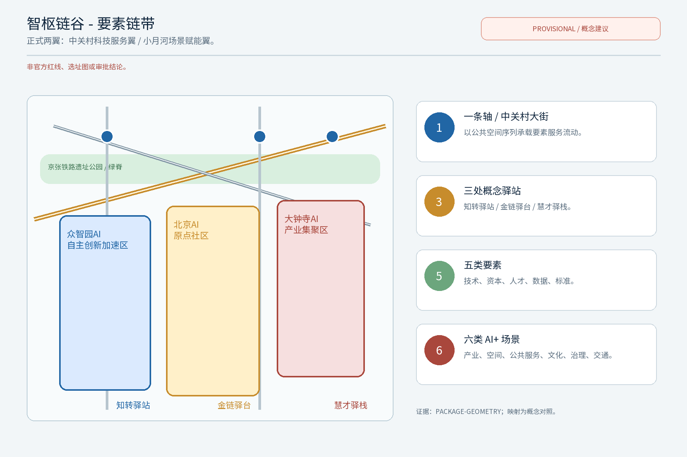
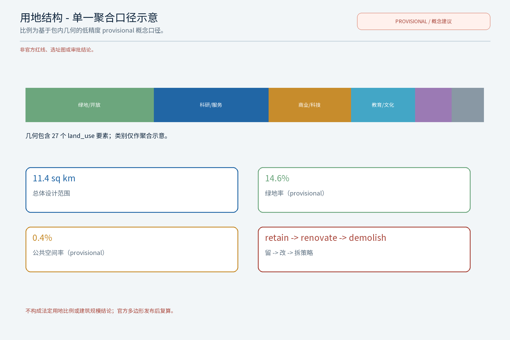
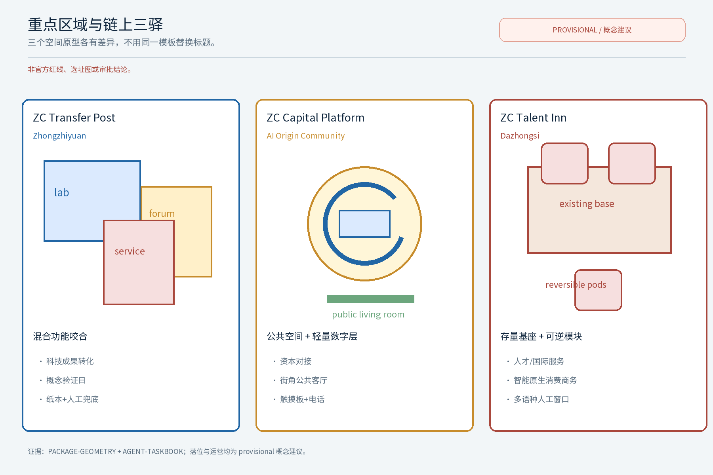
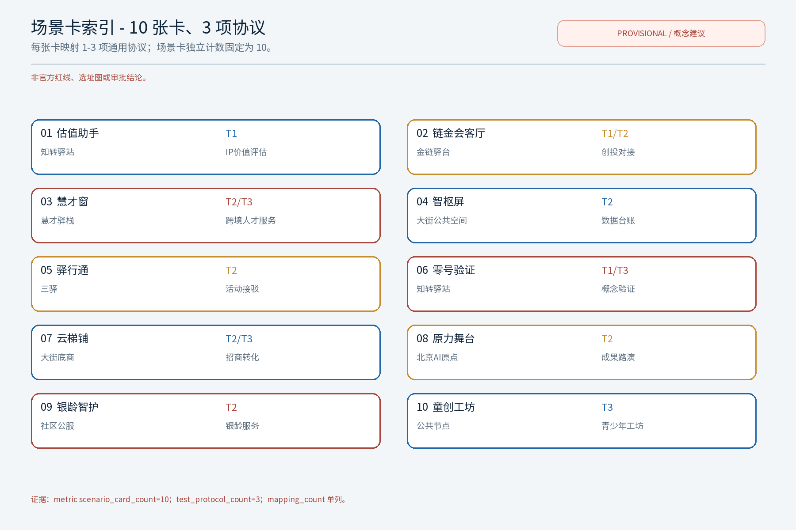
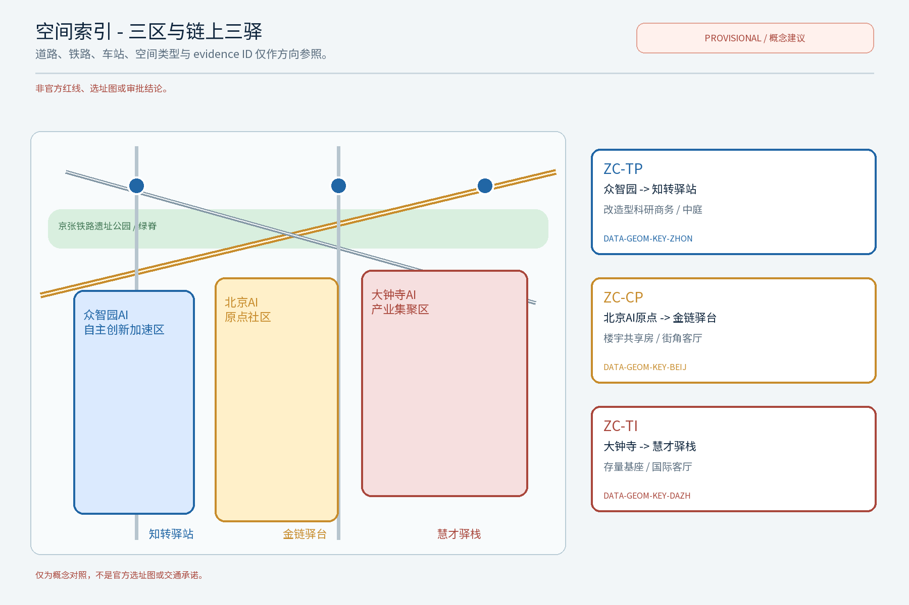
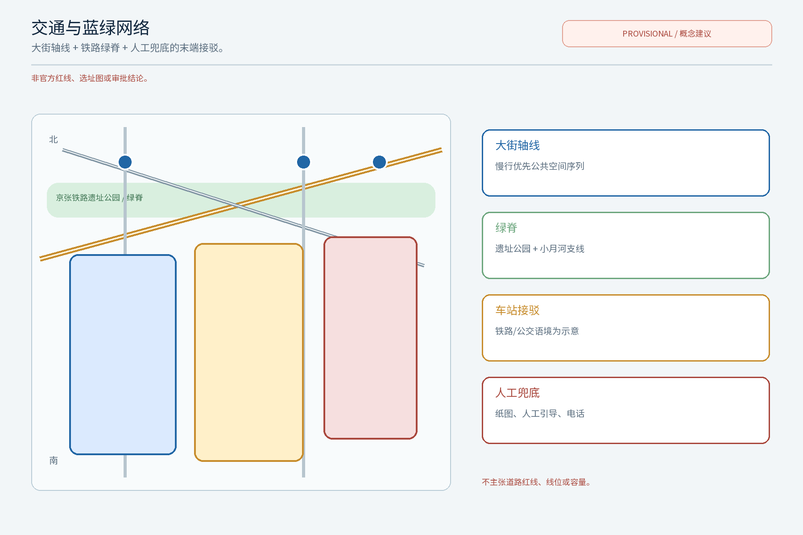
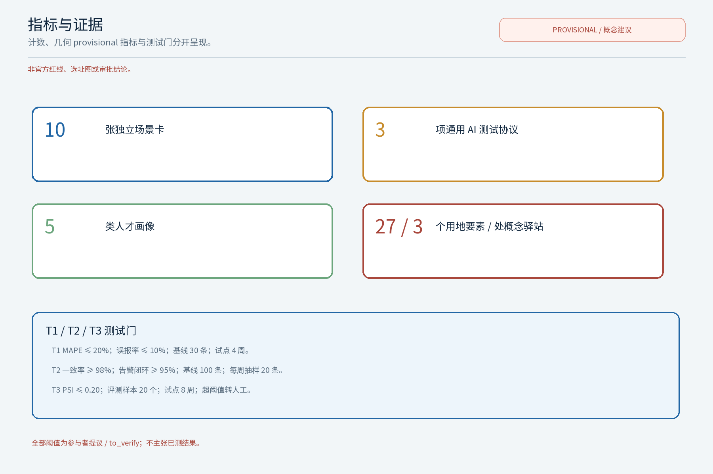

**方案名称与总体构想（概念）**

主名「智枢链谷」，英文名 ZHILINK CHAIN VALLEY（原创概念名，不指代任何现实城市、园区或企业；作为内部工作代号使用）。总体构想：以"中关村科技服务翼"为题目，把科技服务视为组织创新要素流动的"第一链"，沿中关村大街（海淀段）构筑要素全球化配置的科技服务生态带，让技术、资本、人才、数据、标准五类要素沿链流动、在带聚合。方案借百年京张铁路"自主创新、一线贯通"的精神意象，将科技服务全链条转译为"链上三驿"——知转驿站（科技成果转化）、金链驿台（投融资与创新资本）、慧才驿栈（人才与国际合作），以三个原创概念点位串起大街公共服务序列，配套「智枢链谷·要素链带」品牌识别系统（Logo、昭示语、色彩与图标组件库）与区域协同回路，回应"百年京张文化带、都市AI生活体验带、AI融合创新带"三大定位与"AI全栈自主创新体系、世界级AI创新生态、AI+场景赋能新范式、智能化AI活力城市、AI治理全球话语权"五大功能。所有落地内容均为概念建议与参考方案，供专业团队深化研究，不构成政府、投资或审批承诺。

**品牌与节点命名约定（本轮复审统一口径）**：主品牌固定为「智枢链谷」/ **ZHILINK CHAIN VALLEY**；ZC 仅是该完整英文名的内部版面缩写，用于紧凑标签，不构成独立品牌或现实主体。三个概念节点固定写法为：**知转驿站 / ZC Transfer Post（ZC-TP）**、**金链驿台 / ZC Capital Platform（ZC-CP）**、**慧才驿栈 / ZC Talent Inn（ZC-TI）**。正文、矩阵、双语图、HTML、A0/A3 均使用上述固定写法；不再使用 Zhizhuan Post、JinLian Platform、HuiCai Inn 等未定义的英文异名。所有名称和图形在完成检索前均为内部工作代号。

## 设计依据与资料清单

本方案以征集公告、设计任务书与组织方公开文本为基本依据，采用官方文本口径：统筹研究范围约43.6平方公里、总体设计范围约11.4平方公里、重点区域合计约368.4公顷，以及众智园AI自主创新加速区（约192公顷）、北京AI原点社区（约104公顷）、大钟寺AI产业集聚区（约72公顷）的分区口径。参考资料包括：京张铁路遗址公园公开设计成果、北京市与海淀区公开的国土空间规划与城市更新政策文本、公开统计数据、沿带现场踏勘记录及开源地理信息（仅作空间叙事示意）。组织方尚未发布带坐标系的官方边界多边形与正式控规条件，本方案不主张任何精确面积与几何数值，几何与指标按provisional处理；正式控规、轨道道路控制条件、文保生态约束、权属、市政容量、消防等场地专业资料缺口如实登记于风险节与 assumptions.json，官方边界与控规数据发布后由专业团队统一复算。**任务书映射表**（本包要素 → 任务书定位与功能 → 对应章节 → agent.1-6 引用）按"三区两翼"格局逐项落实，每条均回到正文锚点可机读校对。

| 本子包要素 | 任务书定位/功能 | 对应章节锚点 | agent.1-6 引用 |
|---|---|---|---|
| 智枢链谷·要素链带（主名与品牌） | 三大定位：百年京张文化带、AI融合创新带；五大功能：全栈自主创新、AI+场景赋能新范式 | 总论、设计依据、用地与风貌 | agent.1 总体概念与命名 |
| 链上三驿（知转/金链/慧才） | 五大功能：世界级AI创新生态、AI治理全球话语权；都市AI生活体验带 | 重点区域详细设计 | agent.4 概念点位与荣誉体系 |
| 沿中关村大街科技服务生态带 | 都市AI生活体验带；AI+场景赋能新范式 | 总体设计范围、交通与公共服务 | agent.3 场景卡 + agent.5 历史文化 |
| 京张铁路遗址公园绿脊串联 | 百年京张文化带；智能化AI活力城市 | 蓝绿空间与公共空间 | agent.5 历史资源 + 公共空间组件库 |
| 区域协同回路（北纬/未来/怀柔/经开/京津冀） | 三区两翼；京津冀创新协作 | 三层范围与统筹研究 | agent.6 区域协同与转化机制 |
| AI技术测试协议+六类AI+场景 | 智能化AI活力城市；AI治理全球话语权 | AI创新生态 | agent.3 + agent.6 |
| 三期项目清单+RACI+停止条件 | 三区两翼；分阶段实施 | 更新项目清单 | agent.6 实施路径与活动体系 |

> **证据锚点**：[source:OFFICIAL-ANNOUNCEMENT]（征集公告文本口径）、[source:AGENT-TASKBOOK]（任务书任务口径）、[source:PROVISIONAL-BOUNDARIES]（provisional 边界复算）。

**13维评审可审映射（supplementary review dimensions）**：下表把任务书补充维度映射到固定章节、矩阵与交付物；各项均为概念证据，不把提议或 provisional 数值写成已测结果。

| dimension_id | 评审维度 | 正文/矩阵证据 | 图件/指标证据 | 状态 |
|---|---|---|---|---|
| objective_alignment | 目标契合度 | 设计依据与资料清单；三层范围工作框架 | site-overview.png；source:AGENT-TASKBOOK | addressed |
| function_match | 功能匹配度 | 任务书映射表；三大定位、五大功能、三区两翼 | spatial-index.png；compliance_matrix.json | addressed |
| brand_identity | 品牌识别度 | 智枢链谷 / ZHILINK CHAIN VALLEY 命名约定与品牌系统（agent.1） | logo-zhilink.png/.en.png；图标组件库 | addressed / rights to_verify |
| regional_synergy | 区域协同性 | 区域协同回路矩阵（agent.6） | metrics.json；annual event system | participant-proposed / to_verify |
| planning_innovation | 规划创新性 | 三层研究—设计—实施闭环；用地与拆改留方案 | land-use-structure.png；design_depth_matrix.json | addressed / provisional |
| industry_support | 产业支撑度 | 生态图谱、五类要素、T1-T3（agent.2/3） | metrics-evidence.png；metrics.test_protocols | participant-proposed / to_verify |
| scenario_perceptibility | 场景可感知度 | 10张场景卡、公共空间与三驿体验（agent.3/4） | scenario-cards.png；key-areas.png | addressed |
| spatial_clarity | 空间明确性 | 三区—三驿—空间类型对照；agent.4 地标卡 | spatial-index.png；geometry/key_areas.geojson | provisional / to_verify |
| transferability | 可转化性 | 分期、RACI、资源包、停止条件（agent.6） | A0/A3；drawings/*.pdf | addressed / concept |
| expression_completeness | 表达完整性 | 固定13节、双语正文、矩阵与证据锚点 | 双语图、HTML、A0/A3、visual/index | addressed |
| public_compliance | 公开合规性 | 风险、版权与合规说明；人工兜底和不追踪边界 | report/copyright_statement.md；sources.json | addressed / rights to_verify |
| international_communication | 国际传播力 | 文化资源—载体—故事—导视—国际传播矩阵（agent.5） | bilingual logo/key/mobility figures | addressed / concept |
| long_term_operation_value | 长期运营价值 | 年度活动、开发者社区、场景开放与区域协同（agent.6） | annual_program_count；go_no_go | participant-proposed / to_verify |

## 三层范围工作框架

三层成果逐级传导：统筹研究输出的要素流动格局与服务带职能约束总体设计，总体设计校核的用地兼容、大街断面与弹性指标再落实到节点详设；每层均保留与任务书对应章节的机器可读证据锚点，便于评审对照。工作框架按"研究—设计—实施"三环闭环组织：第一层统筹研究范围（约43.6平方公里，官方文本口径）开展产业格局、要素流动网络与未来城市研究，确定科技服务翼在创新带中的中枢地位；第二层总体设计范围（约11.4平方公里，官方文本口径）以控规深度城市设计手法，对沿中关村大街的城市更新编制总体空间方案与设计导则要素清单；第三层重点区域（合计约368.4公顷，官方文本口径，含众智园、北京AI原点社区、大钟寺三区）对节点深化"链上三驿"概念点位并提供场景卡。**智枢数字底座**（原创概念机制名）作为三层的共同数据底座：产业、交通、建筑、蓝绿与人口数据本地化脱敏、匿名聚合，支撑方案动态校核与分期评估；数字底座不采集、不使用个体识别类信息，仅作聚合决策支持。**「开放共创公约」**（原创机制名）约束开发者、运营方与社区参与者的权责边界。所有面积与几何按provisional处理，provisional边界与官方数据发布后的复算触发条件登记于指标体系节。

> **证据锚点**：[source:AGENT-TASKBOOK]（三层范围划分依据任务书官方文本口径）、[source:PROVISIONAL-BOUNDARIES]（provisional 边界）、[data:PACKAGE-GEOMETRY]（本包 geometry 层）。

## 统筹研究范围产业与未来城市研究

沿带产业空间叙事自北向南展开：清河—上地/中关村软件园为AI软件平台与算力服务重镇，知春路集中科研院所与硬科技孵化，中关村大街为创新策源与科技商务核心，学院路汇聚高校智力带，共同构成AI全栈自主创新的产业带谱。统筹研究提出"要素全球化配置五大概念机制"：全球创新网络链接——在离岸创新高地设立联络节点、双向导流；技术转移与知识产权交易——专利开放许可与场内交易结算；跨境人才流动服务——一站式签证辅导与资质互认；标准与评测服务——参与AI基准与评测规则共建；数据要素流通规则——场内登记、匿名化流通与收益分配。**生态图谱**（agent.2 全球AI创新生态地图，概念）：以"芯片—框架—模型—数据—应用—评测"全栈环节为横轴、以"策源—转化—资本—人才—治理"服务环节为纵轴，绘制科技服务翼在全球AI创新生态中的图谱，映射五类要素沿链流动的节点与缺口。**全球案例对照（概念，5项）**表如下，均来自公开机构页面，仅作机制参照、不作官方背书；案例原始页面在引用时需二次核验。

| 案例（地区/园区） | 机制要点 | 可借鉴要素 | 来源（公开可核验页面） |
|---|---|---|---|
| 新加坡纬壹科技城 one-north | 政府引导+市场运营的产学研社区 | 簇团布局与共享平台 | 新加坡裕廊集团官网 |
| 美国剑桥肯德尔广场 | 研究型大学与风投对接走廊 | 概念验证与资本聚合 | MIT 肯德尔广场计划官网 |
| 深圳河套深港科技创新合作区 | 跨境要素流动与科创规则衔接 | 跨境人才与数据要素安排 | 国务院公报·河套发展规划 |
| 加拿大蒙特利尔 Mila AI 研究院 | 开放数据集与人才网络共建 | 开放科学与国际人才网络 | Mila 机构官网 |
| 韩国板桥科技谷 Pangyo | 政府园区+企业主导运营 | 产业集聚与会展产业生态 | 板桥科技谷官网 |

> **证据锚点**：[source:PROVISIONAL-BOUNDARIES]（边界为 provisional，生态图谱与案例仅作概念示意）、[source:CASE-ONE-NORTH/CASE-KENDALL/CASE-HETAO/CASE-MILA/CASE-PANGYO]（五项全球案例对照的可核验公开页面）、[metric:global_case_count]。

## 总体设计范围城市更新与控规深度城市设计

总体设计范围（约11.4平方公里，官方文本口径）以"大街为轴、服务为链"组织空间：其一，服务节点与大街公共空间序列整合——将"链上三驿"概念点位嵌入知春路、中关村大街中段与学院路南口附近的大街段落，与既有广场、绿地序列形成"科技服务客厅"连续体验；其二，科技服务功能与街区生活共生——底层布局服务型商业与展示空间，楼上承载专业服务与孵化功能，促进职住与消费混合；其三，步行与慢行联系——重构大街断面，预留连续步行带，与京张铁路遗址公园绿廊、学院路及知春路慢行形成网络；其四，公共服务设施补充——增补便民服务中心、24小时共享服务点、托育养老微设施与无障碍设施。**「志愿分级积分」**（原创机制名）以"贡献—服务—积分—兑换"四段式引导居民、骑手与青年志愿者参与场景共创与公共空间维护，积分记录仅本地化脱敏、匿名汇总。建筑高度、贴线率等指标建议以官方边界与控规发布后核定，本方案仅提供导则要素建议，不预设结论性控制值；用地比例按单一聚合口径（科研与服务、商业与科技商务、教育科研设计、绿地与开放空间、居住配套、文化设施、交通场站、弹性留白）给出概念结构图，正式用地数据以官方发布后复算为准。**东西缝合、南北贯通**（agent.4 概念路径）以"京张遗址公园绿脊东西缝合"与"中关村大街—学院路—知春路南北贯通"为概念级公共体验路径，不主张桥隧或工程可行性结论。

> **证据锚点**：[source:MOHURD-URBAN-DESIGN]（城市设计方法参照）、[source:PROVISIONAL-BOUNDARIES]（provisional 边界复算）、[source:BARRIER-FREE-LAW]（无障碍基线）、[data:PACKAGE-GEOMETRY]（本包 geometry 层）。

## 重点区域详细设计

重点区域合计约368.4公顷（官方文本口径），含众智园AI自主创新加速区（约192公顷）、北京AI原点社区（约104公顷）、大钟寺AI产业集聚区（约72公顷），分别侧重自主创新加速、AI原点文化与生活体验、产业集聚与服务配套，并严格衔接任务书的“三区两翼”：三区为上述三处重点区，两翼为正式任务区名称**中关村科技服务翼**与**小月河场景赋能翼**。东西缝合仅作为跨两翼的公共空间与服务串联策略，不替代正式两翼名称，也不主张官方边界。本方案深化三处原创概念点位（均标注为概念点位，落位为概念建议、非官方选址）：**「知转驿站」**——科技成果转化服务节点（详见地标卡，适用空间类型为改造型办公与底层共享空间），**「金链驿台」**——投融资与创新资本节点（详见地标卡），**「慧才驿栈」**——人才与国际合作服务节点（详见地标卡）。三节点采用模块化、可逆的“要素服务组件”构造。

**AI地标卡（概念点位，非官方选址）**（agent.4 深化要求——具备空间、体验、公共价值说明的地标目录）：

| 地标 | 适用空间类型 | 目标人群 | 公共体验 | 非数字替代方式 | 可逆组件 | 运营主体类型 | 停止条件（参与者提议，provisional/to_verify） |
|---|---|---|---|---|---|---|---|
| 「知转驿站」 | 改造型科研商务楼底层+中庭+广场 | 创业者、工程师、师生 | 概念验证日、路演、对话墙、阶段性成果展 | 现场人工登记、纸质意向单、志愿引导 | 街具、展墙、模块化展位 | 驿站运营方+高校+企业 | 连续2周转化线索率低于参与者提议的10%，或合规沙盒任一关键项未通过；立即停用工具、撤收组件并转人工（to_verify） |
| 「金链驿台」 | 商务楼宇共享会议室+街角客厅+展示环廊 | 投资人、白领、企业 | 资本对接双周会、耐心资本日、案例展 | 现场纸质备案表、专人接线 | 移动展位、可拆隔断 | 资本平台+行业协会+合规自律组织 | 连续2次双周会有效对接率低于参与者提议的15%，或审查发现1项不可接受风险；撤收组件并回归人工撮合（to_verify） |
| 「慧才驿栈」 | 学院路南口存量建筑+宿舍型公寓底层+国际客厅 | 国际人才、留学生、青年 | 跨境服务日、文化之夜、人才地图展 | 现场咨询、纸质辅导手册、多语种志愿引导 | 街具、展板、轮换展览 | 驿站+高校国际处+NGO | 连续2个服务周期投诉率高于参与者提议的5%，或无障碍/隐私复核任一项未通过；停用数字流程、保留人工窗口（to_verify） |

**小月河场景赋能翼·公共体验路径（概念接口，非官方路线）**：本子包不把蓝绿线条冒充翼级设计，而是提出一条可被复核的“入口告示点→桥下共享客厅→社区服务回望台”连续体验序列；三处均为可逆组件的概念空间类型，具体落位须结合官方边界、权属、慢行和防洪资料复核。每个节点只挂接已定义的场景卡，按“空间—人群—数据边界—责任—人工兜底—指标—退出”闭环：

| 路径节点（概念） | 对应场景卡 | 空间类型 / 目标人群 | 输入数据边界 | 运营责任 / 人工兜底 | 评估指标 / 退出条件 |
|---|---|---|---|---|---|
| 小月河入口告示点 | 「驿行通」活动集散接驳 | 河岸慢行入口与导视节点 / 通勤者、游客、居民 | 仅匿名化分时流量计数与活动预约；不采集个体轨迹 | 街道+运营方；纸质地图、现场引导、人工接驳电话 | 准点率、投诉率、人工接管闭环率 / 投诉连续超参与者提议阈值即撤下推荐并保留人工导视 |
| 桥下共享客厅 | 「原力舞台」成果路演空间 | 桥下可逆活动场地与移动座席 / 创业者、公众、亲子与周边商户 | 仅脱敏项目简介和自愿报名；不做人脸识别、不做行为画像 | 驿站+媒体；人工主持、纸质报名、公益优先排期 | 场次、参与度、公众反馈闭环率 / 连续两期报名不足或安全复核未过即暂停活动并撤收组件 |
| 社区服务回望台 | 「银龄智护」社区服务终端 | 河岸社区公服微节点与低位服务窗 / 老年人、家庭、低数字能力人群 | 非数字渠道优先，仅记录匿名服务人次与满意度 | 街道+志愿组织；人工上门、纸表和现场窗口 | 服务覆盖、满意度、人工响应时间 / 投诉或隐私复核连续不达标即关闭自动分流，保留人工服务 |

这条路径的公共价值不是增加设备，而是把小月河从“蓝绿背景”转译为可步行、可参与、可退出的场景赋能接口；数据只服务于活动排期和服务复盘，任何节点均可在不影响人工服务的情况下撤收。路径、节点和指标均为参与者概念建议，不主张官方边界或已建成状态。

**大钟寺 AI 产业集聚区的智能原生消费与商务闭环（概念）**：慧才驿栈在大钟寺不只承担人才咨询，而是作为“人才进入—试用体验—供需匹配—复购反馈”的产业服务接口，空间类型为可改造产业街区底层共享服务厅+可变展陈柜（非官方选址）。「慧才窗」承接国际人才与工程师的人工优先入场咨询；「云梯铺」把经脱敏的产品/服务摘要转成可撤收的试点展示与小微商户服务位；「链金会客厅」再把自愿提交的试点需求与资本、采购和技术服务方做人工复核后的商务撮合。运营责任为产业运营方+驿站+行业协会/合规复核人，数据边界只允许脱敏项目摘要、预约和聚合反馈，禁止个体跟踪与自动授信；没有数字工具时以纸表、人工导购、人工撮合继续运行。公共价值是让国际人才、初创企业、社区商户共同获得可理解的试用与服务入口。概念 go/no-go 指标为试点复购意向、有效撮合率、投诉闭环率和人工复核完成率；连续两期低于参与者提议阈值或合规复核不通过，即撤下「云梯铺」数字匹配，保留线下服务并公开复盘。

**场景卡索引（概念，10张）**：AI+场景以场景卡落地，每张卡含落位/面向人群/运营机制/输入数据/模型能力/空间设施/运营责任/故障兜底/评估指标/退出条件十字段：

| 场景卡 | 落位 | 面向人群 | 运营机制 | 输入数据 | 模型能力 | 空间设施 | 运营责任 | 故障兜底 | 评估指标 | 退出条件 |
|---|---|---|---|---|---|---|---|---|---|---|
| 「估值助手」IP价值评估 | 知转驿站服务节点 | 创业者、工程师 | 预约评估、专家复核 | 匿名化专利与交易数据 | 估值区间估计+误差分群 | 独立咨询室、屏蔽工位 | 持证评估师 | 人工估值兜底 | 估值偏差、误报率 | 误差超阈值即停用 |
| 「链金会客厅」创投对接 | 金链驿台商务楼宇群 | 投资人、白领 | 双周会、轮换议题 | 匿名化项目库 | 匹配与排序 | 共享会议室、轮换展位 | 资本平台+合规自律 | 人工撮合兜底 | 对接场次、跟投意向 | 跟投率不达即停办 |
| 「慧才窗」跨境人才服务 | 慧才驿栈学院路南口 | 国际人才、学生 | 预约办理、志愿引导 | 脱敏简历与签证申请 | 资质互认查询 | 独立受理室、纸表窗口 | 高校国际处+驿站 | 人工办理兜底 | 办理时长、满意度 | 投诉率超阈值即停用 |
| 「智枢屏」数据要素台账 | 大街公共空间 | 运营方、商户 | 年度公示、议事征集 | 匿名化交易样本 | 聚合统计+异常检测 | 街角立屏、可触摸展板 | 运营方+合规员 | 人工台账兜底 | 公示条数、查询量 | 不一致即撤收 |
| 「驿行通」活动集散接驳 | 三驿及大街站点 | 通勤者、游客 | 预约报名、积分激励 | 匿名化出行数据 | 接驳路径推荐 | 街具+导视+候车亭 | 街道+运营方 | 人工指引兜底 | 接驳准点率、满意度 | 投诉率超阈值即下线 |
| 「零号验证」概念验证加速 | 知春路创新孵化载体 | 科研团队、师生 | 立项议事、阶段评估 | 脱敏项目书与里程碑 | 阶段评级 | 共享实验空间、屏蔽工位 | 高校+驿站 | 人工评估兜底 | 立项数、毕业率 | 毕业率不达即停办 |
| 「云梯铺」招商转化服务 | 大街服务型底商展位 | 中小企业、初创 | 租金分级、履约备案 | 匿名化商业数据 | 入驻适配 | 模块展位、可拆柜台 | 商业运营方 | 人工对接兜底 | 入驻率、续约率 | 履约率不达即停用 |
| 「原力舞台」成果路演空间 | 大街公共舞台节点 | 创业者、公众、观众 | 预约排期、公开报名 | 脱敏项目简介 | 排序与排期 | 移动舞台、模块座位 | 驿站+媒体 | 公益优先+人工主持 | 场次、人气、参与度 | 报名数连续不达即停用 |
| 「银龄智护」社区服务终端 | 社区公服微中心 | 老年人、家庭 | 志愿结对、人工兜底 | 非数字渠道为主 | 异常检测 | 街角屋、低位服务窗 | 街道+志愿组织 | 人工上门兜底 | 服务人次、满意度 | 投诉率超阈值即下线 |
| 「童创工坊」青少年AI工坊 | 公共空间组件节点 | 儿童、亲子家庭 | 预约分批、轮换课程 | 不采集未成年人信息 | 课程推荐 | 可拆工位、低位展品 | 驿站+志愿教师 | 人工监护兜底 | 参与人次、家长满意度 | 投诉率超阈值即停办 |

**十张场景卡中有3张为 industry_test_scenario_count 类型（详见 AI 节技术测试协议：估值助手 T1 误差分群、智枢屏 T2 一致性核查、零号验证 T3 阶段评级）**。

> **证据锚点**：[data:PACKAGE-GEOMETRY]（三区与三驿示意多边形来自本包 geometry/key_areas.geojson）、[source:AGENT-TASKBOOK]（场景卡要求）、[source:PROVISIONAL-BOUNDARIES]（provisional 选址）。

## AI 创新生态、人才画像与 AI+ 场景

生态层面，沿带串联芯片—框架—模型—数据—应用—评测的全栈环节，以科技服务翼作为全栈各环节的公共支撑（配套生态图谱见统筹研究节）。人才画像分五类人才：前沿研究者、连续创业者、工程师与产品人、国际流动人才、科技服务专业人才，服务设施按画像错峰配置，并照顾低数字能力的老人、儿童与残障人士的替代渠道。AI+场景（概念工具，共六类）：科技服务智能匹配与政策合规助手、知识产权价值评估助手、投融资对接助手、人才服务与签证辅导助手、标准与评测数字工具、数据要素流通台账工具。**隐私保护与人工复核边界（AI治理三句式）**：仅处理匿名聚合数据；关键决策（合规意见、估值、授信、签证）人工复核；禁止过度监控、不部署个体识别式追踪。**「年度议事公示」**（原创机制名）以一年两次的居民议事会+年度公示清单确保公众参与、纠错与替换机制。

**AI技术测试协议（概念，3项，先测试后规模化，T1/T2/T3）**，用于在真实业务接入前验证工具可靠性：

| 测试协议 | 评估指标 | 阈值 | 退出条件 |
|---|---|---|---|
| T1「估值助手」误差分群 | 估值区间偏差、误差分群、误报率 | 偏差<设定带、误报率<设定阈值 | 误差超阈值即停用、转人工估值兜底 |
| T2「智枢屏」一致性核查 | 台账对账一致率、模型评测与运行监测 | 一致率≥设定下限、监测告警闭环率<上限 | 不一致即撤收、回归人工登记 |
| T3「零号验证」阶段评级 | 立项通过率、毕业率、长期漂移监测 | 立项率与毕业率在设定区间、漂移<阈值 | 毕业率连续不达即停办、回归人工评估 |

**可复现阈值卡（参与者提议、非官方验收标准）**：以下数值只用于概念试点的 go/no-go 预演；启动前由数据保护/业务负责人共同确认基线与样本，不能替代法定、伦理、无障碍或专业审批。

| 协议/阶段门 | baseline 与样本窗口 | 计算式与参与者提议阈值 | 复核责任与 go/no-go |
|---|---|---|---|
| T1 估值助手 | 启动前收集最近 8 周、至少 30 条已脱敏且可复核的历史区间；试点连续 4 周、每周至少 10 条 | MAPE = mean(abs(predicted-midpoint - observed-midpoint) / max(abs(observed-midpoint), ε))；MAPE ≤ 20%，误报率 ≤ 10%，且每一类误差分群不少于 10 条；均为 participant-proposed targets | 评估师与隐私负责人逐周复核；连续两周超任一阈值 = NO-GO，停用模型并转人工估值 |
| T2 智枢屏 | 启动前以同一台账人工双录 2 周形成 ≥100 条对账记录；试点连续 4 周，按周核查 | 一致率 = matched_records / checked_records；一致率 ≥ 98%，告警闭环率 ≥ 95%，抽样复核 20 条/周；阈值为参与者提议 | 台账管理员+合规复核人每周签字；任一周低于阈值 = NO-GO，回归人工登记 |
| T3 零号验证 | 启动前锁定一个同类项目的 1 个季度立项/毕业基线，至少 20 个脱敏项目；试点 8 周 | 毕业率 = graduated / admitted；评测样本 ≥20，阶段漂移 PSI ≤ 0.20；立项率只作观察量，不作成功承诺；均为 participant-proposed | 高校/驿站评估小组双人复核；连续两周 PSI>0.20 或毕业率低于基线 20% = NO-GO，人工评估 |
| 任一阶段门 | 试点启动前共同锁定 baseline、样本、统计周期、责任人和缺失值处理；缺失基线不得伪造 | 达标需同时满足安全/隐私/人工复核记录和该协议阈值；“达到预期”不得单独作为验收结论 | 牵头人提出，合规复核人确认，运营方记录；未满足任一条件即不扩展、停用或撤收 |

上述阈值是参与者的可审计起始提议；真实基线不足时只能标为 proposed / to_verify，不写成已测试结果。所有判断保留人工复核、纸本替代、申诉与撤回路径。

**协议仅覆盖工具本身的技术验证，不构成任何业务审批承诺**。AI场景域覆盖产业、空间、公共服务、文化、治理、交通六域：AI产业（概念验证与中试加速）、AI空间（大街公共空间序列）、AI公共服务（人才与签证辅导）、AI文化（成果路演与年度论坛）、AI治理（数据要素台账与合规沙盒）、AI交通（活动集散与市集组织），各域均以人工复核兜底。

> **证据锚点**：[source:GENERATIVE-AI-MEASURES]（AI生成内容治理表述参照）、[source:BARRIER-FREE-LAW]（无障碍与人工服务兜底基线，仅限列举服务场景）、[metric:scenario_card_count]（10张）、[metric:industry_test_scenario_count]（3项）。

## 用地、建筑规模与拆改留方案

拆改留坚持留改拆排序：沿大街品质较好的科研商务载体、历史建筑与公共绿地登记建档、能留尽留，仅针对危房及严重妨碍慢行与公共服务的极少数建筑逐栋论证拆除；全部面积为概念口径，官方数据发布后复算。本条不以任何数值主张用地比例：正式控规与地类调查发布前，各类用地的相对结构（科研与服务、商业与科技商务、教育科研设计、绿地与开放空间、居住配套、文化设施、交通场站与弹性留白等）仅作**单一聚合口径**的示意（见 land-use-structure.png 结构图），不构成法定规划结论，正式用地数据以官方发布后复算为准；provisional 比率显示精度按"约+小数点一位"降精度展示，避免被误读为正式口径。**建筑规模与拆改留策略**：保留——沿大街品质较好的科研商务载体、历史建筑与公共绿地，原样保护与功能活化；改造——低效楼宇、老旧底商以功能混合方式更新，重点补充服务型空间与公共开放空间；新建——仅在三处概念点位周边预留少量节点型建筑，严控体量。建筑规模不预先主张精确数值，建议以"服务空间、孵化加速空间、公共空间"的配比区间作为深化参考。所有用地分类与指标均以概念建议表述，不构成法定规划结论。

> **证据锚点**：[source:MNR-LAND-USE-GUIDE]（用地分类名称参照现行国标口径）、[source:PROVISIONAL-BOUNDARIES]（provisional 边界复算）、[metric:green_ratio]（绿地率概念口径）、[metric:public_space_ratio]（公共空间率概念口径）。

### 空间索引与三驿映射（概念）

本空间索引是双语对照表，不是官方选址图：**众智园AI自主创新加速区 → 知转驿站 / ZC Transfer Post（ZC-TP）**；**北京AI原点社区 → 金链驿台 / ZC Capital Platform（ZC-CP）**；**大钟寺AI产业集聚区 → 慧才驿栈 / ZC Talent Inn（ZC-TI）**。图中同时标出三个 provisional 多边形、中关村大街、京张铁路遗址公园绿脊、示意性道路/铁路/车站语境、适用空间类型和 evidence ID。交通线与车站名只作方向参照，三驿落位仍为概念建议，须结合官方几何、权属和管控资料复核。

> **证据锚点**：[data:PACKAGE-GEOMETRY]（provisional 多边形）、[source:PROVISIONAL-BOUNDARIES]（非官方红线）、[source:AGENT-TASKBOOK]（任务书映射）。

## 交通、轨道、市政与公共服务设施

慢行组织以中关村大街为轴、京张铁路遗址公园为绿脊，公交骨干与步行优先断面、轨道站点最后一公里接驳贯通成网；市政结合电力扩容、分布式能源与雨水收集（概念建议）；公共服务以双层体系（链上三驿+社区公服）集成便民、共享、托育养老、无障碍、母婴与AED设施，AI决策均设人工复核。**交通概念**：中关村大街强化公交骨干与步行优先断面，站点周边组织"最后一公里"接驳；利用既有轨道节点（清河站、知春路站、五道口、大钟寺等现状设施）作为接驳锚点，深化轨道与创新带的空间耦合研究。**慢行与绿道**：与京张铁路遗址公园、学院路、小月河步道串联成网，形成通勤加活力双系统。**市政**：电力扩容与算力设施配套、分布式能源与光伏利用、雨水收集与下渗改造（均为概念建议，不给具体容量数值）。**公共服务设施**：按"链上三驿+社区公服"双层体系补充，涵盖便民服务中心、24小时共享服务点、托育与养老微设施、无障碍及母婴室、AED急救点，贯彻全龄友好、适老化与儿童友好设计，提升国际人才与社区居民的共享服务水平；无障碍与人工服务兜底以《无障碍环境建设法》所列服务场景为基线，不泛化为全部空间已合规。

> **证据锚点**：[source:MOHURD-URBAN-DESIGN]（市政与慢行设计表述的方法参照）、[source:BARRIER-FREE-LAW]（无障碍基线）、[data:PACKAGE-GEOMETRY]（本包 geometry 层）。

## 蓝绿空间、公共空间与城市风貌

京张铁路遗址公园绿脊+小月河蓝绿枝脉+学院路高校绿带整合蓝绿空间，三驿广场作为链上呼吸点；智慧街道家具、信息发布与夜间照明遵循克制原则，适度亮化、按需照明，避免过度装饰与光污染。**蓝绿空间**以京张铁路遗址公园为绿色脊梁，小月河滨水空间为蓝绿枝脉，学院路高校绿带与街头绿地串联成网，三处概念点位各配一处小型广场作为链上"呼吸点"。**公共空间序列**沿中关村大街展开，将站前广场、街道客厅、三驿广场与公园入口整合为连续的"科技服务客厅"体验。**「公共空间组件库」**（原创机制名，agent.4 要求：可逆、轮换、避免固化建设）：以街具、座椅、花箱、信息柱、充电与售卖单元等标准化模块组合，支持按季节与活动轮换布置，所有组件以螺栓固定或可移动底盘，不破坏路面与既有植被。**「荣誉展示体系」**（agent.4 要求）：在「原力舞台」与「智枢屏」设置创业者、志愿者与社区共建者荣誉墙，以年度公示与「志愿分级积分」机制滚动展示，突出人的参与而非设备监控，**不**部署人脸识别与行为轨迹类识别系统。

### 品牌识别与视觉系统（概念）

**「智枢链谷·要素链带」**（统一识别，agent.5 国际传播）：Logo 取"链环+五要素色点"母题，配昭示语"第一链、链万物"，色彩系统以科技蓝为主、辅助色区分五类要素；图标组件库覆盖智库、链带、驿站、驿台、驿栈五类。该识别体系同时用于导视系统与国际传播文案（中英双语）：面向全球人才与企业发布"智枢链谷"科技服务叙事与国际传播素材，借助京张百年文化、中关村文化与AI新文化融合叙事提升国际传播力；导视系统以「链上三驿」为核，配合无障碍与低数字能力人群的文字、语音双通道。所有品牌名称与标识在完成商标检索前按内部工作代号处理，不对外注册使用。

### 京张历史资源—中关村创新文化—AI新文化 资源与载体矩阵（agent.5 深化）

| 资源类型 | 空间故事线 | 导视符号 | 活动内容 | 国际传播短文 | 史实/转译/概念区分 |
|---|---|---|---|---|---|
| 京张铁路百年自主工程 | 沿京张遗址公园绿脊叙事线 | "人字形"钢轨抽象纹样 | 百年工程导览、儿童科普日 | "A century of independent engineering" | 史实：1909年京张铁路通车；转译：抽象"链环"形；概念：作为要素链带精神底色 |
| 中关村创新文化（1980s至今） | 沿大街创新策源叙事线 | "链环+五要素色点"标识 | 创业者口述史、企业家日 | "From electronics street to AI belt" | 史实：中关村电子一条街—创新示范—AI新阶段；转译：要素链带的代际叙事；概念：要素链带作为新阶段叙事框架 |
| 高校智力带（学院路、清河） | 沿学院路—知春路叙事线 | "驿"字抽象符号 | 大学开放日、师生成果展 | "Talent inns and a university belt" | 史实：学院路高校集聚；转译：驿站作为人才节点；概念：「慧才驿栈」叙事 |
| 京张遗址公园绿脊 | 沿绿廊体验叙事线 | 绿色脊线标识系统 | 城市记忆日、居民议事会 | "From railway to green spine" | 史实：京张铁路入地后遗址公园；转译：绿脊作为缝合线；概念：「东西缝合」概念路径 |
| AI新文化（开放、试错、协作） | 沿三驿概念点叙事线 | "链上三驿"图标 | 成果路演日、技术交易集市 | "AI as a service, on the chain" | 概念：「开放共创公约」「年度议事公示」机制 |

> **证据锚点**：[source:MOHURD-URBAN-DESIGN]（蓝绿空间组织与风貌控制方法参照）、[source:OFFICIAL-ANNOUNCEMENT]（京张与海淀文化脉络公开叙事来源）、[source:PROVISIONAL-BOUNDARIES]（provisional 边界）。

## 更新项目清单、实施政策与分期计划

三阶段项目清单（近期1-3年/中期3-5年/远期5-10年）为概念清单，规模与投资估算均为定性建议，不构成政府、投资或审批承诺；政策建议不构成政府或运营方承诺。实施按"主体—前置—最小可行试点—资源包—里程碑—指标—人工接管与go/no-go"组织，附RACI角色（牵头单位、协作单位、审批通道、运营主体四类主体），并为各项目设停止条件（试点未达即撤收或停项、数据合规沙盒未过评即停用）。

**RACI 责任矩阵（概念，节选）**：

| 阶段 | 文保/规划（RACI） | 运营/服务（RACI） | 阶段门 |
|---|---|---|---|
| 近期（1-3年） | 规划部门A、平台公司R、文保R、高校C、街道C | 平台公司R、驿站运营方R、志愿组织C、媒体C | 启动评审+最小可行试点验收 |
| 中期（3-5年） | 规划部门A、平台公司R、文保R、社区C | 驿站运营方R、合规自律组织C、行业协会C | 中期评估+合规沙盒过评 |
| 远期（5-10年） | 规划部门A、平台公司R、文保R、京津冀协作C | 联盟R、运营方R、志愿联盟C、媒体C | 终期评估+长期运营交接 |

**项目清单与分期（概念）**：

| 阶段 | 概念试点区 | 参与主体（≥3类） | 可测指标名称 | 停止条件 |
|---|---|---|---|---|
| 近期（1-3年） | 智枢数字底座试点+「知转驿站」路演日+「云梯铺」招商转化 | 政府+平台公司+高校+驿站运营方+志愿组织（≥5类） | 路演项目数、转化线索数、招引入驻数、试点合规通过率 | 转化率不达预期或合规沙盒未过评即停办 |
| 中期（3-5年） | 三驿建成投用+大街公共空间序列贯通+试点街区功能混合改造 | 政府+驿站运营方+资本平台+社区+行业协会+媒体（≥6类） | 三驿投用条数、大街步行连通度、街区入驻率、积分参与人次 | 街区空置率超阈值或公共空间投诉率超阈值即停用 |
| 远期（5-10年） | 科技服务全链条生态成型+离岸联络节点+开发者社区自组织 | 政府+联盟+运营方+高校+志愿联盟+京津冀协作（≥6类） | 跨境服务办理时长、离岸节点对接场次、开发者社区注册数、年度活动参与度 | 跨境服务投诉率超阈值或联盟评估未过即停办 |

**6步场景开放流程**（概念）：1）提议（任何参与方可在「开放共创公约」下提交）→2）议事（年度议事公示+居民议事会评审）→3）试点（最小可行试点，附资源包与里程碑）→4）评估（按 T1/T2/T3 协议评估）→5）规模（达标后扩展至全链带）→6）撤收/停用（未达标或合规未过评则撤收、回归人工兜底）。**月度排期与维护模型**：每月一次「链谷月旦」运营例会；每季度一次指标回顾；每年一次「年度议事公示」与「智枢链谷年度论坛」；持续维护以「志愿分级积分」+年度资源包滚动更新形式运行；**设备更新/撤收复原机制**：组件库每年按季节与活动轮换，活动结束后24小时内撤收，地面与既有植被按原状复原。**失败退出机制**：试点未达即停项、撤收并公开评审结论；数据合规沙盒未过评即停用；运营方评估未过即替换。

**开发者社区与场景开放（概念）**：建设开发者社区（线上工坊+线下黑客松），开放"场景开放"接口与数据集目录，以**「开放共创公约」**（原创机制名）约束参与者权责；**「招引转化机制」**（原创机制名）以「云梯铺」招商转化服务承接活动流量，形成"活动—对接—入驻—复购"转化链条。**年度活动体系（概念，6项品牌）**：

| 年度活动品牌（概念） | 频次 | 主办协作（概念） | 考核指标（概念） |
|---|---|---|---|
| 成果转化路演日 | 每季度1场 | 高校+驿站+企业 | 路演项目数与转化线索数 |
| 技术交易集市 | 每月1场 | 驿站+协会+机构 | 集市摊位与成交意向数 |
| 资本对接双周会 | 每两周1场 | 金链驿台+投资机构 | 对接场次与跟投意向数 |
| 国际人才服务日 | 每月1场 | 慧才驿栈+高校国际处 | 服务人次与满意度 |
| 标准评测开放周 | 每年1周 | 标准机构+驿站 | 参与机构与报告发布数 |
| 智枢链谷年度论坛 | 每年1场 | 联盟+媒体+政府 | 参会规模与议题数 |

**区域协同回路（概念，可审查矩阵）**（agent.2 区域协同深化要求——逐项双向要素、合作机制、建议频次、责任主体类型、评价指标）：

| 协作对象 | 双向要素 | 合作机制 | 建议频次 | 责任主体类型 | 评价指标（概念） |
|---|---|---|---|---|---|
| 北纬社区 | 人才与社区服务互换 | 「志愿分级积分」互通、议事互邀 | 每季度 | 驿站运营方+社区+志愿组织 | 互通积分人次、议事参与率 |
| 未来科学城 | 能源与算力互补 | 算力调度试点、联合路演 | 每月 | 平台公司+能源企业+高校 | 算力调度小时数、联合路演场次 |
| 怀柔科学城 | 大科学装置与中试资源 | 中试加速、联合验证 | 每季度 | 高校+科研院所+驿站 | 中试项目数、毕业率 |
| 经开区 | 先进制造与产业转化 | 「云梯铺」招商、落地转化 | 每月 | 资本平台+招商部门+企业 | 落地项目数、转化金额（不公开个体） |
| 京津冀创新协作区 | 跨区域要素流动 | 离岸联络节点、京津冀联合活动 | 每半年 | 联盟+政府+行业协会 | 节点对接场次、活动参与人次 |

> **证据锚点**：[source:AGENT-TASKBOOK]（分期与实施条目对应任务书要求）、[source:OFFICIAL-ANNOUNCEMENT]（北纬/未来/怀柔/经开区/京津冀公开可核验页面的概念级引用）。

## 指标体系、面积复算与合规矩阵

目标—指标—校验三层概念指标体系进入 metrics.json；面积复算以本包 provisional 几何为底，官方数据到位后整体复算并标注复算版本。**指标体系（概念）**：要素服务10分钟步行可达覆盖率、科技成果转化平均周期、跨境人才服务办理时长、AI助手渗透率与人工复核通过率、就业岗位密度、慢行连通度、公共服务设施千人指标达标率；每项指标标注数据来源、计算公式、置信度等级、适用范围与官方数据发布后的复算触发条件（详见 metrics.json）。**面积复算**：本方案仅采用官方文本口径数值（约43.6/11.4/368.4平方公里/公顷及三区公顷数），不主张精确坐标与几何；待官方边界多边形发布后，由专业团队按统一基准复算并与本方案衔接；provisional 指标在展示时降低显示精度（按"约+小数点一位"格式），避免误读为正式口径。**合规矩阵**：逐项对照法定规划、城市更新政策与数据合规要求，按"完全衔接、建议深化、需专题论证"三档标注，作为深化研究的合规工作底表。

> **证据锚点**：[metric:green_ratio]、[metric:public_space_ratio]、[data:PACKAGE-GEOMETRY]（本包 provisional 几何）、[source:PROVISIONAL-BOUNDARIES]（复算触发条件）。

## 风险、版权与合规说明

本方案为概念研究性设计，不构成行政审批依据；正式实施前须完成多部门联审、数据合规评估与安全评估。主要风险与应对：官方边界与场地专业资料尚未发布，几何与分析均按provisional处理，复算触发后整体重算；市场需求与资本周期波动，分期计划预留弹性；隐私与数据合规风险，以匿名聚合加人工复核机制管控；存量产权复杂，拆改留方案坚持支点微更新路径；无障碍与权益未逐一核验，不作为已合规声明。**版权说明**：方案名称「智枢链谷」「ZHILINK CHAIN VALLEY」及三驿名称均为原创概念命名，不指代现实城市、园区或企业；**品牌在先权利与使用边界（概念）**——概念阶段未完成官方商标检索，相关名称与标识一律按内部工作代号处理，暂不对外注册或商用，待在先权利检索完成后再进入品牌发布流程；引用资料仅按类别注明来源；引用本身不等于取得再利用许可，每项资产仍受其记录的许可证或授权限制，每项资产的权利人、许可状态与待核验项见 report/copyright_statement.md。**合规说明**：本方案为参赛概念提案，全部落地建议均为概念建议与参考方案，不构成法定规划审批结论，最终以官方征集规则与专业团队深化成果为准；**居民意见通道+年度公示+年度活动**均按概念机制建议，**「开放共创公约」**（原创机制名）+**「年度议事公示」**+**「志愿分级积分」**+**「招引转化机制」**+**「公共空间组件库」**+**「荣誉展示体系」**≥6个原创机制名+机制词（公约/议事/积分/公示/备案/联盟/志愿/预约/轮换/分级）≥4个。

> **证据锚点**：[source:OFFICIAL-ANNOUNCEMENT]（征集规则为权属与合规表述的依据）、[source:GENERATIVE-AI-MEASURES]（AI生成内容治理）、[source:BARRIER-FREE-LAW]（无障碍基线）。

## 参考资料

参考资料以政府正式发布版本为准；本包 sources.json 仅收录可查证条目，未虚构任何官方数据或链接。1. 本征集公告、设计任务书及组织方公开的主题、定位与范围说明（官方文本口径来源）；2. 京张铁路遗址公园已公开的设计与建设成果资料；3. 北京市城市总体规划、海淀区分区国土空间规划等公开规划文本；4. 北京市城市更新与数据要素、人工智能治理相关公开政策文件；5. 沿线产业与人口公开统计数据；6. 全球案例对照所列公开机构页面（对比研究用途，原始链接与抓取时点见 sources.json，引用时二次核验）；7. 区域协同（北纬社区、未来科学城、怀柔科学城、经开区、京津冀创新协作区）的概念级公开页面（官方机构页或政府公告）；8. 现场踏勘记录与开源地理信息资料（仅作空间叙事示意，不代表法定边界）。以上资料按类别引用，具体条款与图件以官方发布版本为准，方案不对资料获取时点后的更新承担责任；本清单首条即组织方公开资料包，其余为公开渠道资料，未虚构任何官方数据或链接。

> **证据锚点（前 7 项）**：[source:OFFICIAL-ANNOUNCEMENT]（本清单首条即组织方公开资料包）、[source:AGENT-TASKBOOK]、[source:MOHURD-URBAN-DESIGN]、[source:MNR-LAND-USE-GUIDE]；后续来源：
> [source:GENERATIVE-AI-MEASURES]、[source:BARRIER-FREE-ENVIRONMENT-LAW]、[source:PROVISIONAL-BOUNDARIES-20260605]。

> **证据锚点（5 项全球案例）**：[source:CASE-ONE-NORTH-SINGAPORE]、[source:CASE-KENDALL-USA]、[source:CASE-HETAO-SHENZHEN]；后续来源：
> [source:CASE-MILA-MONTREAL]、[source:CASE-PANGYO-KOREA]。
