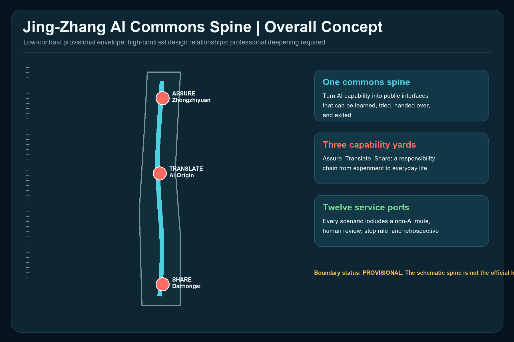
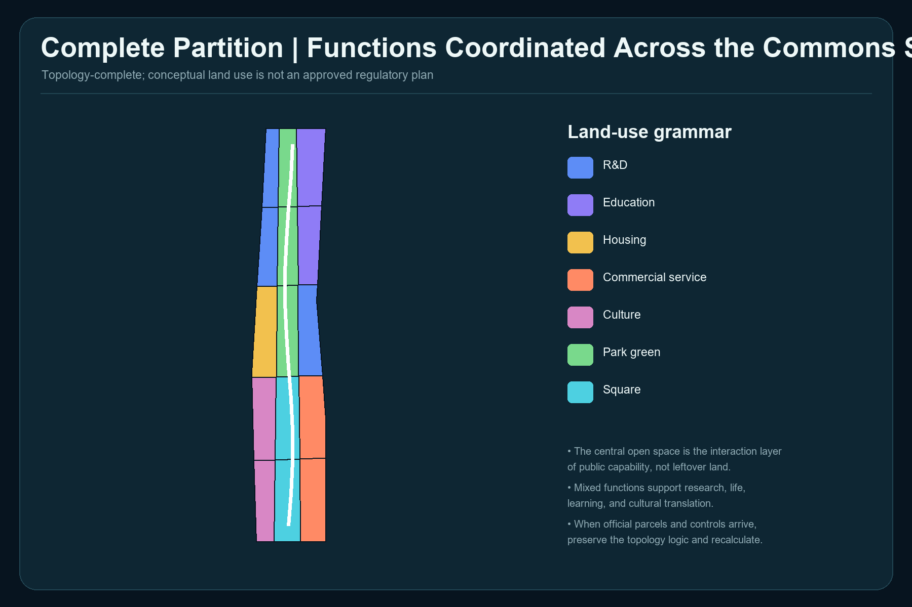
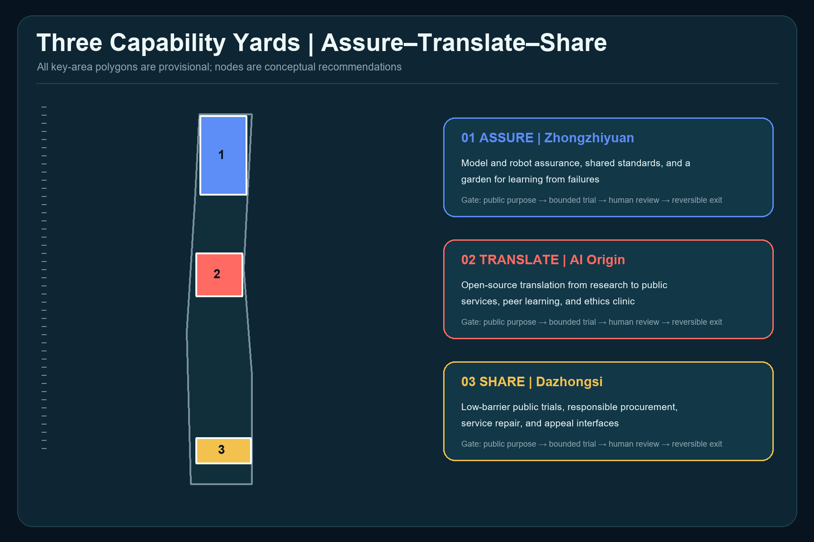
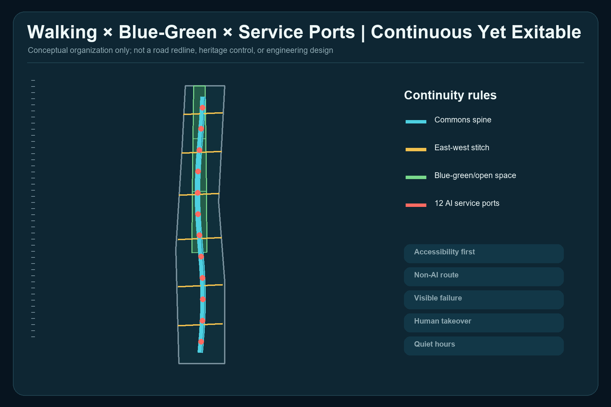
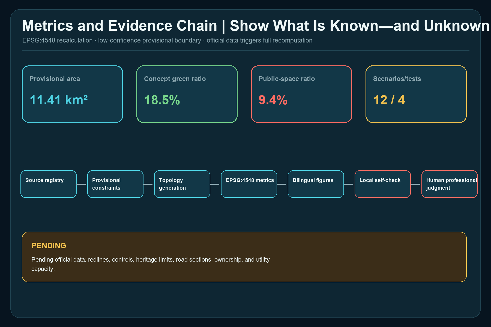

# Jing-Zhang AI Commons Spine

This proposal does not add a decorative layer of smart devices. It proposes public-capability urban design: before an AI service enters real urban space, it must state its public purpose, intended users, non-AI route, responsible human, stop condition, and retrospective process. The structure is one commons spine, three capability yards, two reciprocal wings, and twelve service ports. Zhongzhiyuan assures, Beijing AI Origin translates, and Dazhongsi shares, forming a traceable chain from research to trial to everyday public value. Every spatial move is a conceptual recommendation for professional teams to deepen; none replaces statutory planning or constitutes government approval or implementation commitment. [source:AGENT-TASKBOOK] [standard:PROJECT-AGENT-OPEN-CALL-TASKBOOK]

## Design Basis and Source List

The work begins with source permissions. The official announcement establishes the project name, textual scope descriptions, approximate areas, tasks, and deliverable context. The rights-cleared Agent taskbook establishes the six Agent tasks, scenario, persona, landmark, identity, and long-term operation requirements. [source:OFFICIAL-ANNOUNCEMENT] [source:AGENT-TASKBOOK]

The repository registry distinguishes formal-ready, background-only, and provisional-only material. This proposal uses provisional polygons only for generation, visual explanation, and intake checks; the processed fact pack is navigation, not a new authority. [source:SOURCE-REGISTRY] [source:PROCESSED-FACT-PACK]

Professional principles come from the national urban-design measures, regulatory-detailed-planning rules, and land-use classification guide. They inform method and language but do not prove approved project-specific land use, intensity, or alignments. [source:URBAN-DESIGN-MEASURES] [source:CONTROL-DETAILED-PLANNING] [source:LAND-USE-GUIDE]

## Three-Level Scope Framework

The approximately 43.6 km² Coordinated Research Area considers exchanges across the Three Zones and Two Wings; the approximately 11.4 km² Overall Design Area organizes renewal, public space, and service interfaces; the approximately 368.4 ha Key-Area Detailed Design Area hosts differentiated assure–translate–share prototypes. Announcement areas are task facts. The submitted 11.413 km² is only an EPSG:4548 recalculation of the provisional polygon, not an official precise boundary. [data:geometry/site_boundary.geojson#SITE-001] [metric:site_area_sqm] [depth:three_level_scope_framework]

There are three required key areas, but every polygon is provisional. Once organizer-supplied geometry is available, boundary, land use, buildings, public space, phasing, figures, and metrics must all be regenerated. [data:geometry/key_areas.geojson#PROV-KEY-001] [metric:key_area_count] [source:BOUNDARY-SOURCE]

Repository Issue #846 reports that the provisional Overall Design Area does not intersect the OSM-mapped Jing-Zhang Railway Heritage Park, with a reported nearest distance of 412.5 m. A subsequently registered street-centerline cross-check also places the roads named by the announcement approximately 533–898 m east of the provisional envelope. That cross-check is background-only, is not an official boundary, and does not justify moving this submission's geometry. Neither OSM nor street centerlines are promoted to an official alignment here. The displayed spine is a schematic relationship inside the provisional envelope and must be reconciled with official site, park, heritage, and protection geometry. [data:geometry/constraints.geojson#CONSTRAINT-PROV-001] [source:BOUNDARY-SOURCE] [depth:existing_conditions_diagnosis]

## Coordinated Research Area: Industry and Future City Research

Public capability translates the three positionings into operating rules. The Centennial Jing-Zhang Cultural Belt carries engineering truth-seeking and public memory; the Urban AI Life Experience Belt makes services understandable, optional, and exitable; the AI Integrated Innovation Belt allows bounded validation before wider use. The Zhongguancun Technology Services Wing supplies talent, capital, standards, and translation. The Xiaoyue River Scenario Enablement Wing returns user problems, public feedback, and operating evidence. [depth:overall_spatial_structure] [standard:PROJECT-OFFICIAL-ANNOUNCEMENT]

Five international cases are background comparisons, not imported controls:

| Case | Verifiable mechanism | Transfer to Jing-Zhang |
| --- | --- | --- |
| MIT Kendall Square | Research, housing, retail, open space, and community engagement are combined | Put innovation, daily life, and public open space under one responsibility framework [source:CASE-KENDALL] |
| 22@Barcelona | Industrial land is renewed as an innovation district | Tie renewal to staged public-return conditions rather than an innovation label alone [source:CASE-22BARCELONA] |
| Toronto MaRS | Research, entrepreneurship, capital, customers, and public challenges meet in one translation platform | Add a public translation gate between research and public services [source:CASE-MARS] |
| Paris-Saclay | Research, urban projects, ecological protection, and large-scale tests coexist | Design test sites together with blue-green resilience, movement, and public life [source:CASE-PARIS-SACLAY] |
| London Knowledge Quarter | Academic, cultural, research, and community organizations form a cross-sector network | Connect institutions and residents through annual capability inventories and public programs [source:CASE-KNOWLEDGE-QUARTER] |

A Capability Passport records purpose, data minimization, operating boundary, responsible human, non-AI route, stop threshold, appeal channel, and review date. It is not regulatory approval; it is a reference template for professional, ethical, safety, and community review before scenario access. [depth:municipal_new_infrastructure]

## Overall Design Area: Urban Renewal and Regulatory-Plan-Level Urban Design

The spatial model uses a continuous public interface to link the three capability yards and east-west walking interfaces to stitch adjacent functions. `land_use.geojson` is split from one common boundary and forms a complete, gap-free partition. Central open-space units host learning, trials, appeals, and retrospectives; research, education, housing, culture, and commercial services support all-day use. [data:geometry/land_use.geojson#LU-001] [depth:land_use_layout]

The building layer is a typological placeholder for conceptual retrofit or infill. It does not correspond to surveyed buildings, ownership, or parcel-level retain-renovate-demolish decisions. FAR and height remain pending official data because approved controls, road redlines, heritage limits, and aviation or landscape controls are absent. [data:geometry/buildings.geojson#BLDG-001] [depth:development_intensity_controls] [standard:MOHURD-CONTROL-DETAILED-PLANNING]

Controls are separated into three classes: known provisional geometry and task requirements; editable public interfaces, functional relationships, and scenario governance; and pending statutory land use, intensity, height, ownership, roads, utilities, and engineering feasibility. Professional deepening must convert the third class into official or rights-cleared evidence before calculation and review. [depth:height_massing_character]

## Detailed Design of Key Areas

The three areas are not three copies of an “AI park”; they are distinct roles in one responsibility chain. [data:geometry/key_areas.geojson#PROV-KEY-002] [depth:three_key_area_detailed_design]

**Zhongzhiyuan ASSURE Yard** conceptually hosts a model-and-robot assurance walk, shared standards room, failure retrospective garden, and contribution wall. Tests remain bounded, slow, supervised, and stoppable. Passing a test is not approval; it produces an evidence packet for later review.

**Beijing AI Origin TRANSLATE Yard** conceptually hosts an open-source translation workshop, public-service co-design table, peer-learning court, and ethics clinic. It translates research into understandable service descriptions, accessible procedures, and human takeover scripts. Low-disruption retrofit and shared ground floors come first; building decisions await surveys and ownership evidence.

**Dazhongsi SHARE Yard** conceptually hosts low-barrier trials, an urban-service repair station, a responsible-procurement window, and an appeal desk. Commercial translation must face usability, affordability, and recovery tests. Four-quadrant station connections state walking goals only; they are not bridge, tunnel, or road-engineering conclusions.

## AI Innovation Ecosystem, Personas, and AI+ Scenarios

Six personas determine access: researchers and founders need bounded tests and translation; residents and older adults need low cognitive load and human service; students need learnable open projects; frontline and delivery workers need quiet hours, legible curbs, and appeals against algorithmic penalties; international visitors need multilingual and accessible guidance; public operators need stop authority, logs, and named responsibility. The count is six and does not imply personal-data collection. [metric:persona_count]

Each of twelve scenario cards records public purpose, space, operator, data minimization, human takeover, stop condition, and non-AI route:

| # | Scenario | Type | Spatial and governance rule |
| --- | --- | --- | --- |
| 01 | Model Assurance Walk | Testing/validation | Zhongzhiyuan; public test purpose, red-team record, failure samples, and a human safety lead |
| 02 | Robot Curb Lab | Testing/validation | Low speed, timed windows, physical separation, ordinary walking and human delivery retained |
| 03 | Privacy Nutrition Label Desk | Testing/validation | AI Origin; readable comparison of data needs; refusal does not remove basic service |
| 04 | Climate Comfort Court | Testing/validation | Environmental sensing only; humans verify shade and opening decisions |
| 05 | Public-Service Co-Pilot Desk | Everyday service | Advice and decision remain separate; counter staff retain responsibility |
| 06 | Accessible Wayfinding Partner | Everyday service | Tactile, text, and human routes coexist; errors can be reported |
| 07 | Multilingual Community Studio | Everyday service | Community volunteers or staff review translations |
| 08 | AI Repair Café | Everyday service | Explain errors, restore service, log problems, avoid vendor lock-in |
| 09 | Jing-Zhang Memory Companion | Culture | Verified historical sources only; generated content is visibly marked |
| 10 | Quiet Logistics Hours | Urban operation | Human conflict takes priority; workers may appeal algorithmic schedules |
| 11 | Capability Passport Display | Public learning | Purpose, owner, exit, and review date are public |
| 12 | Civic Appeal and Retrospective Station | Public governance | Offline, telephone, and digital routes; humans decide remedies |

There are twelve scenarios and four testing/validation scenarios. These are counts of proposal cards, not approved operations. [metric:scenario_count] [metric:testing_scenario_count]

Four conceptual pilgrimage and honor nodes celebrate responsibility: the Gate of Proof, Open Standards Wall, Hundred-Person Translation Table, and Civic Repair Bell. They honor contribution, correction, and public service rather than corporate advertising or spectacle. [metric:landmark_count]

## Land Use, Building Scale, and Retain-Renovate-Demolish Strategy

The complete partition contains 15 topology units using the national classification subset. It is a design model, not an approved land-use plan; official parcels should become the minimum unit when available. [metric:land_use_feature_count] [standard:MNR-LAND-USE-CLASSIFICATION-GUIDE]

Conceptual footprints total 96.48 ha and cover 8.45% of the provisional envelope. These values describe typological placeholders, not surveyed or approved building scale. [metric:building_footprint_area_sqm] [metric:building_coverage_ratio]

Retain-renovate-demolish follows “survey before classification”: safety and heritage review; structural and carbon assessment; public-use and shared-ground-floor potential; then ownership and implementation negotiation. The present rule is retain first, repair first, reversible addition, and demolition only after evidence. [depth:retain_renovate_demolish]

FAR and height are pending official data. Any displayed massing is relational, not an approved control, engineering proposal, or sunlight conclusion. [metric:floor_area_ratio] [metric:building_height_m]

## Transport, Rail, Municipal Infrastructure, and Public Services

One north-south spine and six east-west interfaces form a conceptual walking network whose centerlines total about 15.72 km. This expresses continuity, accessibility, and exit; it is not a road redline or engineering alignment. Station integration, parking, curbs, and sections require official transport evidence and site surveys. [data:geometry/roads.geojson#RD-001] [metric:road_centerline_length_m] [depth:traffic_rail_slow_parking]

Municipal and new infrastructure follows a shared-base, minimum-sensing, edge-processing, human-duty, graceful-degradation rule. Compute, energy, communications, and sensing are interface requirements only. No load, utility, fire, flood, cost, supplier, or construction claim is made. [depth:municipal_new_infrastructure] [standard:MOHURD-URBAN-DESIGN-MEASURES]

Public services first close capability gaps: staffed desks, accessible continuity, seating and water, quiet space, child- and older-person-friendly service, human appeal, and failure alternatives. Existing facility inventories and responsible operators remain to be confirmed.

## Blue-Green Network, Public Space, and Urban Character

Conceptual green space totals 211.03 ha or 18.49%; conceptual public space totals 107.37 ha or 9.41%. The first is derived from the complete land-use partition; the second is a relational buffer around the commons spine. They overlap and must not be added as a statutory indicator. [data:geometry/green_space.geojson#GREEN-002] [metric:green_ratio] [metric:green_space_area_sqm]

The public-space ratio tests conceptual continuity and is not a statutory green-space control. Every value is affected by provisional geometry and the alignment conflict, so official polygons trigger full recalculation. [data:geometry/public_space.geojson#PS-001] [metric:public_space_ratio] [metric:public_space_area_sqm]

Urban character combines railway engineering clarity, civic-infrastructure durability, and AI-system legibility: paths and structure are readable, materials are repairable, and status and responsibility are visible. It avoids neon spectacle, entertainment theming, and corporate-showroom urbanism. The cultural narrative carries Jing-Zhang engineering truth-seeking, Zhongguancun open innovation, and public responsibility without fabricated history or unauthorized brands, portraits, or images. [depth:blue_green_public_space]

## Renewal Projects, Implementation Policy, and Phasing

Eight conceptual project packages are offered for professional deepening: official data and baseline; accessible continuity and non-AI routes; Zhongzhiyuan bounded assurance; AI Origin open translation; Dazhongsi civic repair; pilgrimage and honor components; Capability Passport and scenario-access rules; and annual public review. Each package passes data, ownership, operation, safety, and approval gates before progressing. [depth:renewal_project_list]

The three phases are conditions, not promised dates: establish data, rules, and accessibility baselines; run only bounded pilots that pass safety and operating review; then expand, modify, or retire based on independent evaluation. The three `phasing.geojson` polygons are visual indices, not development timing or investment commitments. [data:geometry/phasing.geojson#PHASE-001] [metric:phase_count] [depth:phasing_implementation]

Long-term operation uses a daily–weekly–quarterly–annual rhythm: daily repair duty, weekly scenario-access windows, quarterly developer-community retrospectives, and an annual Jing-Zhang Public Capability Assembly publishing both capability and retirement lists. Brand, organizer, funding, frequency, and impact remain conceptual and require agreement.

## Metrics, Area Recalculation, and Compliance Matrix

Metrics answer what the conceptual model generated, not what statutory planning approved. Geometry is exchanged in EPSG:4326 and recalculated in EPSG:4548; low-confidence values remain linked to provisional boundaries or missing baseline evidence. [depth:metrics_recalculation]

| Metric | Model value | Meaning |
| --- | ---: | --- |
| Provisional site area | 11.413 km² | Projected provisional polygon [metric:site_area_sqm] |
| Concept green ratio | 18.49% | Design partition, not statutory control [metric:green_ratio] |
| Concept public-space ratio | 9.41% | Relational model; may overlap green space [metric:public_space_ratio] |
| Concept building coverage | 8.45% | Typological placeholders [metric:building_coverage_ratio] |
| Walking/interface centerlines | 15.72 km | Concept relationship, not road works [metric:road_centerline_length_m] |
| Key areas / scenarios / personas / landmarks | 3 / 12 / 6 / 4 | Task coverage counts [metric:key_area_count] [metric:scenario_count] [metric:persona_count] |

The compliance matrix covers announcement sections 1.3, 1.4, 1.5 and Agent tasks 1–6. Standards and design-depth matrices connect each judgment to narrative, geometry, metrics, drawings, sources, assumptions, and self-checks. Machine PASS does not mean approval or design excellence; human and professional judgment remains final. [standard:MOHURD-ARCH-DESIGN-DEPTH-2016]

## Risk, Copyright, and Compliance

Five blocking evidence boundaries remain: official precise boundaries are absent; provisional scope conflicts with a public mapping cross-check; regulatory, heritage, road, and utility controls are absent; building, ownership, and facility baselines are absent; and implementation bodies, funding, and approvals are not confirmed. The proposal is therefore an open co-creation and formal-intake package only, not a basis for statutory control, demolition, investment, engineering, or approval. [depth:risk_missing_data]

Figures are deterministically drawn from package GeoJSON, metrics, and matrices using system fonts. No external basemap, news image, peer figure, trademark, or portrait is copied. International cases are paraphrased mechanism comparisons with sources. See `report/copyright_statement.md` for generation and rights details.

Future iterations should sync the repository; inspect changed Issues, PRs, rules, and sources; update the changelog; and rerun rendering, finalization, self-check, and preflight. The top professional priority is organizer-supplied site, key-area, heritage, and regulatory attachments, followed by a joint correction of the Issue #846 alignment conflict.

## References

- Public site package, source registry, and fact navigation. [source:SITE-PACKAGE]
- Official announcement and rights-cleared Agent taskbook. [source:OFFICIAL-ANNOUNCEMENT] [source:AGENT-TASKBOOK]
- Provisional site and key-area polygons, for intake only. [source:BOUNDARY-SOURCE] [source:KEY-AREA-SOURCE]
- National urban-design, regulatory-planning, and land-use references. [standard:MOHURD-URBAN-DESIGN-MEASURES] [standard:MOHURD-CONTROL-DETAILED-PLANNING]
