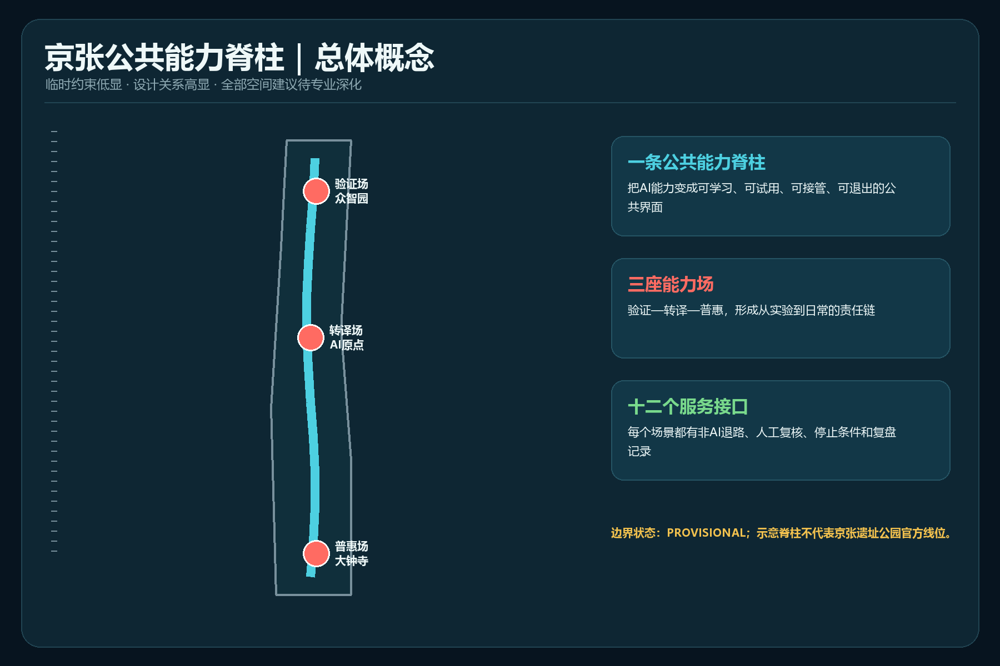
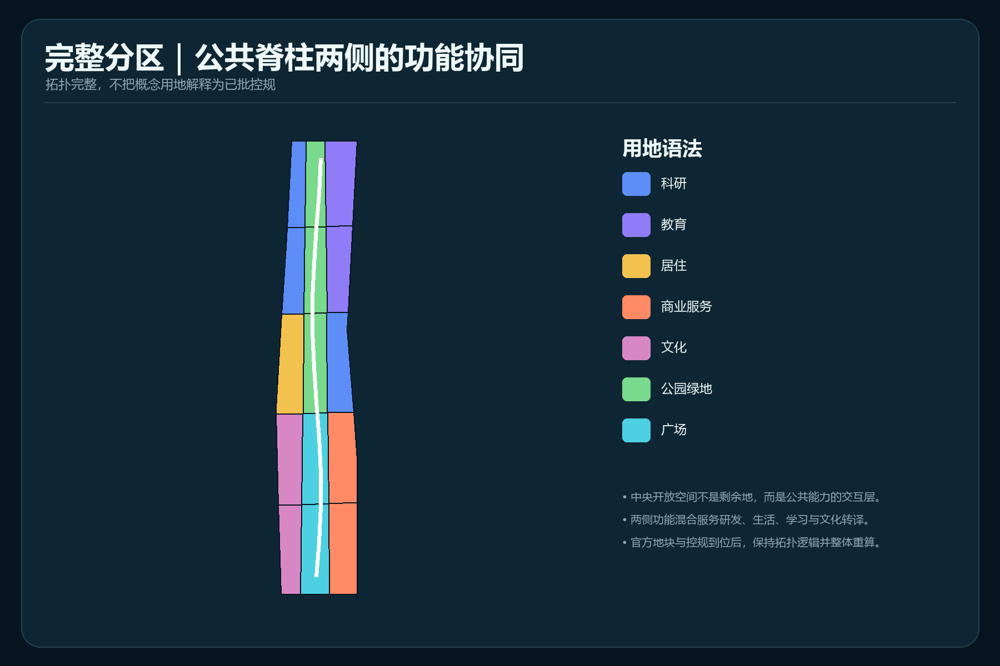
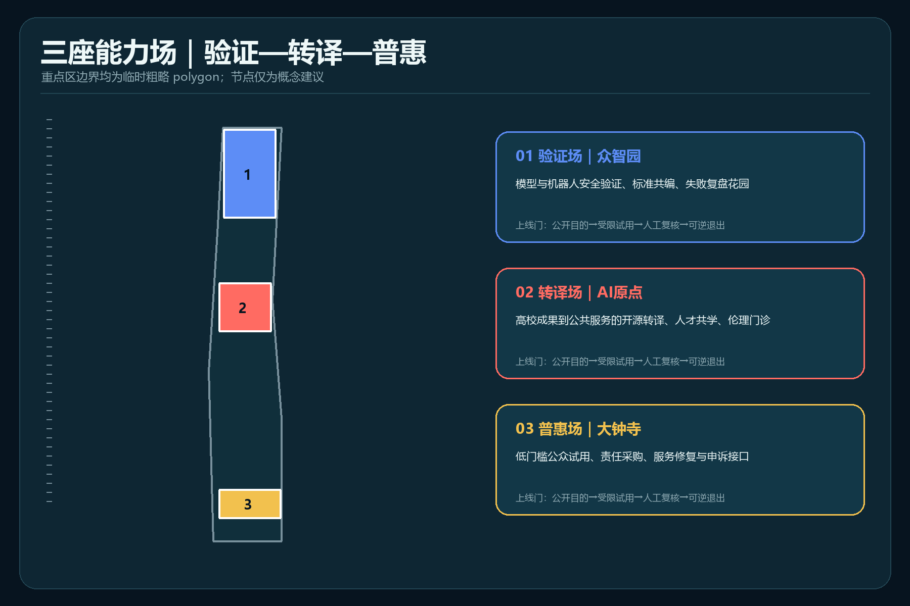
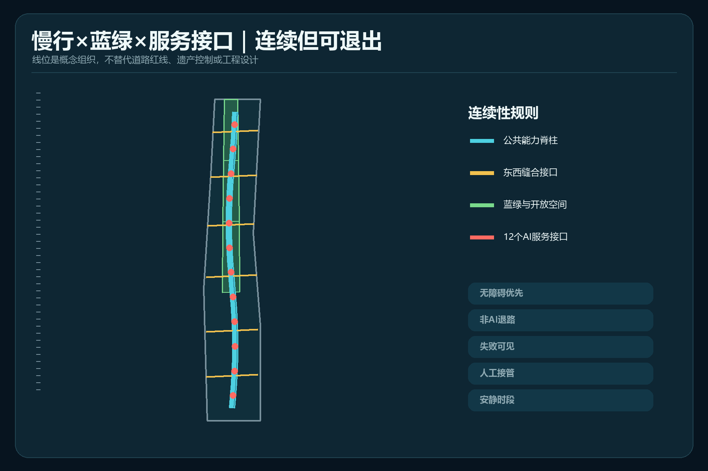
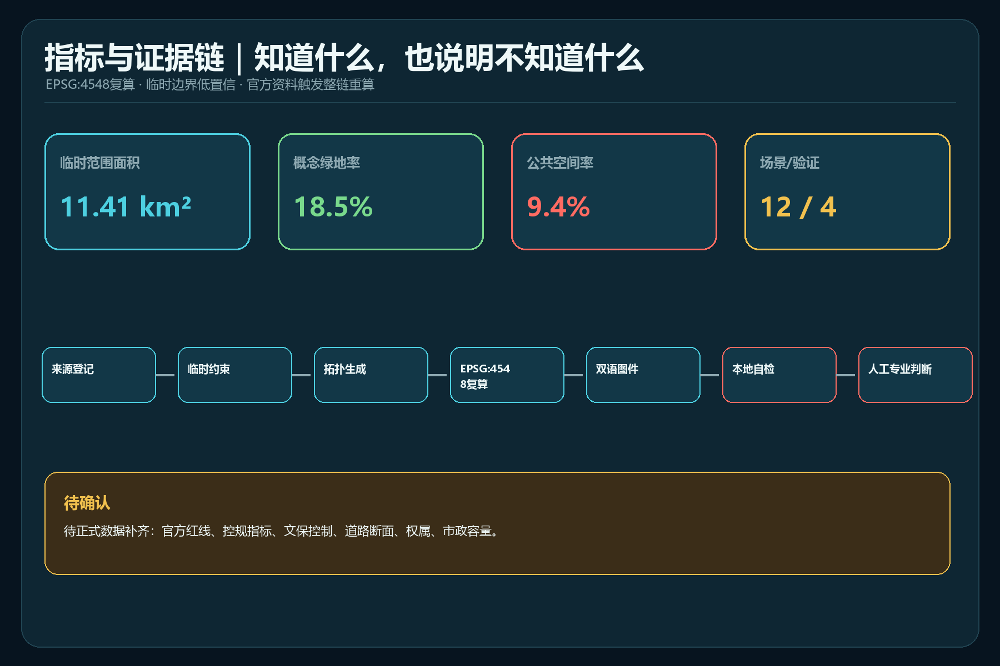

# 京张公共能力脊柱｜Jing-Zhang AI Commons Spine

本方案不是在城市表面叠加更多智能设备，而是提出一种公共能力型城市设计：任何 AI 服务进入真实空间前，都必须说明公共目的、适用人群、非 AI 退路、人工接管者、停止条件和复盘方式。总体结构为“一条公共能力脊柱、三座能力场、两翼互惠回路、十二个服务接口”；三座能力场分别承担众智园“验证”、北京 AI 原点社区“转译”、大钟寺“普惠”，让研发、试用与日常公共价值形成可追溯责任链。本方案全部空间内容均为概念建议，可供专业团队深化研究，不替代正式规划，也不构成政府审定或实施承诺。[source:AGENT-TASKBOOK] [standard:PROJECT-AGENT-OPEN-CALL-TASKBOOK]

## 设计依据与资料清单

工作从来源权限开始，而不是从图形开始。官方公告用于确认项目名称、三层范围的文字描述与约面积、设计任务和成果语境；清权智能体任务书用于确认六项任务、场景数量、画像、地标、品牌与长期运营要求。[source:OFFICIAL-ANNOUNCEMENT] [source:AGENT-TASKBOOK]

仓库来源登记表把资料分成 formal 可用、仅作背景和 provisional only。本案只把临时 polygon 用于生成、图面和 intake 自检；处理事实包只作阅读导航，不能升级来源权威性。[source:SOURCE-REGISTRY] [source:PROCESSED-FACT-PACK]

专业判断依据包括《城市设计管理办法》的以人为本、公共空间、历史文化与城市风貌要求，《控规编制审批办法》关于法定控制与审批边界的规定，以及自然资源部用地分类术语。它们支撑方法与表达，不证明本项目已有批准的用地、强度或线位。[source:URBAN-DESIGN-MEASURES] [source:CONTROL-DETAILED-PLANNING] [source:LAND-USE-GUIDE]

## 三层范围工作框架

统筹研究范围约 43.6 平方公里，用于讨论“三区两翼”创新资源与公共能力交换；总体设计范围约 11.4 平方公里，用于组织更新、公共空间与服务接口；三处重点区约 368.4 公顷，用于形成验证—转译—普惠的差异化原型。公告面积是任务依据，提交图层中的 11.413 平方公里只是 EPSG:4548 下对临时 polygon 的复算值，不能当作官方精确范围。[data:geometry/site_boundary.geojson#SITE-001] [metric:site_area_sqm] [depth:three_level_scope_framework]

三处重点区数量为 3，但 polygon 均为临时粗略约束；获得主办方官方图件后，必须替换边界并重算用地、建筑、公共空间、分期、图件和指标。[data:geometry/key_areas.geojson#PROV-KEY-001] [metric:key_area_count] [source:BOUNDARY-SOURCE]

需要特别披露：仓库 Issue #846 报告临时总体范围与 OSM 测绘的京张铁路遗址公园不相交，最近距离 412.5 米；仓库随后登记的街道中心线交叉核查还显示，公告文字所指边界道路相对临时范围向东偏移约 533–898 米。后者仅作背景核查，不是官方边界，也不据此移动本次几何。本方案不把 OSM 或街道中心线当官方线位，也不把图中的脊柱称为遗址公园官方轴线；它只是临时范围内的关系模型，待官方遗产、公园和保护控制资料共同校正。[data:geometry/constraints.geojson#CONSTRAINT-PROV-001] [source:BOUNDARY-SOURCE] [depth:existing_conditions_diagnosis]

## 统筹研究范围产业与未来城市研究

“公共能力”把三大定位转化为可运营机制：百年京张文化带负责保存工程求真和公共记忆；都市 AI 生活体验带负责让服务可理解、可选择、可退出；AI 融合创新带负责让技术在受限场景中验证后再扩散。中关村科技服务翼提供人才、资本、标准与转化服务，小月河场景赋能翼回传使用问题、公众反馈和运行证据，形成双向而非单向技术扩散。[depth:overall_spatial_structure] [standard:PROJECT-OFFICIAL-ANNOUNCEMENT]

五个国际案例只作背景比较，不直接移植空间或指标：

| 案例 | 可验证机制 | 对京张的转化 |
| --- | --- | --- |
| MIT Kendall Square | 混合研发、住房、零售、开放空间与社区参与 | 把创新空间与日常生活、公共开放空间放入同一责任框架 [source:CASE-KENDALL] |
| 22@Barcelona | 产业用地更新为创新城区 | 用阶段性公共回报条件约束更新，而非只追求产业标签 [source:CASE-22BARCELONA] |
| Toronto MaRS | 研究、创业、资本、客户和公共议题的转化平台 | 在 AI 原点设置“公共转译门”，补足从论文到公共服务的中间层 [source:CASE-MARS] |
| Paris-Saclay | 科研集群、城市项目、生态保护与大型测试并置 | 把验证场与蓝绿韧性、出行和公共生活共同设计 [source:CASE-PARIS-SACLAY] |
| London Knowledge Quarter | 学术、文化、科研与社区组织形成跨部门网络 | 用年度会员式能力清单和公共活动连接机构与居民 [source:CASE-KNOWLEDGE-QUARTER] |

据此提出“能力护照”：每项服务记录目的、数据最小化、适用边界、人工负责人、无 AI 通道、停止阈值、申诉入口和复盘日期。护照不是监管批准，而是场景开放前供专业、伦理、安全与社区团队共同审查的参考模板。[depth:municipal_new_infrastructure]

## 总体设计范围城市更新与控规深度城市设计

总体空间不是把临时长方形边界切成均质色块，而是以连续公共界面连接三座能力场，并用东西向步行接口缝合周边功能。`land_use.geojson` 由同一边界拓扑切分，形成完整无缝分区；中央开放单元承担学习、试用、申诉和复盘，两侧科研、教育、居住、文化与商业服务为其提供全天候使用基础。[data:geometry/land_use.geojson#LU-001] [depth:land_use_layout]

建筑图层表达类型化更新占位：优先把可识别、可修复、可共享的既有或新载体组织在公共界面两侧，但不对应真实建筑、产权或拆改留结论。容积率与高度保持“待正式数据补齐”，因为仓库没有已批控规、道路红线、文保、航空或景观控制附件。[data:geometry/buildings.geojson#BLDG-001] [depth:development_intensity_controls] [standard:MOHURD-CONTROL-DETAILED-PLANNING]

设计控制分三类：已知的是临时几何与任务约束；可设计的是公共界面、功能协同和场景治理；待确认的是法定用地、强度、建筑高度、地块权属、道路市政和工程可行性。任何后续深化都必须先把第三类转为官方或清权基础资料，再重新计算与评审。[depth:height_massing_character]

## 重点区域详细设计

三处重点区不是三个相同的“AI 园区”，而是同一责任链上的三种城市角色。[data:geometry/key_areas.geojson#PROV-KEY-002] [depth:three_key_area_detailed_design]

**众智园验证场（ASSURE）**：概念设置模型与机器人安全验证廊、标准共编室、失败复盘花园和贡献荣誉墙。新技术先在边界清楚、速度受限、有人值守的环境中测试；通过不等于批准，只生成可被下一阶段读取的证据包。

**北京 AI 原点转译场（TRANSLATE）**：概念设置开源转译工坊、公共服务共创桌、人才共学庭与伦理门诊，把高校成果翻译成普通人理解的服务说明、无障碍流程和人工接管脚本。空间更新以低扰动、共享首层与步行连接为优先，具体拆改留待权属与建筑调查。

**大钟寺普惠场（SHARE）**：概念设置低门槛试用厅、城市服务修复站、责任采购橱窗和申诉复核台，让商业转化接受公众可用性、价格可达性与失败恢复测试。大钟寺站四象限连接只表达步行关系目标，不给出桥隧或道路工程结论。

## AI 创新生态、人才画像与 AI+ 场景

六类画像共同决定场景是否可进入：研究者/创业者需要可验证的试验与转化接口；居民与长者需要低认知负担和人工服务；学生需要可学习的开放项目；一线服务与配送人员需要安静时段、清晰路缘和不被算法处罚的申诉；国际访客需要多语与无障碍导览；公共运营者需要停止权限、日志和跨部门责任人。画像数量为 6，不对应个人数据采集。[metric:persona_count]

十二张场景卡均要求“公共目的—空间—运营者—数据最小化—人工接管—停止条件—非 AI 退路”：

| # | 场景卡 | 类型 | 空间与治理要点 |
| --- | --- | --- | --- |
| 01 | 模型保证步道 | 测试验证 | 众智园；公开测试目的、红队记录和失败样本，人工安全负责人可停测 |
| 02 | 机器人路缘实验室 | 测试验证 | 众智园；低速、分时、物理隔离，保留普通步行与人工配送 |
| 03 | 隐私营养标签台 | 测试验证 | AI 原点；用可读标签比较数据需求，拒绝不影响基本服务 |
| 04 | 气候舒适调度庭 | 测试验证 | 公共脊柱；只用环境传感，人工核验遮阴与开放策略 |
| 05 | 公共服务共驾台 | 日常服务 | AI 原点；建议与决定分离，窗口人员最终负责 |
| 06 | 无障碍寻路伙伴 | 日常服务 | 全线；触觉/文字/人工问路并存，错误可报修 |
| 07 | 多语社区转译室 | 日常服务 | AI 原点；翻译结果由社区志愿者或工作人员复核 |
| 08 | AI 修复咖啡馆 | 日常服务 | 大钟寺；解释错误、恢复服务、记录问题，不绑定品牌 |
| 09 | 京张记忆伴读 | 文化 | 公共空间；只引用核验史料，明确生成内容与史实边界 |
| 10 | 安静物流时段 | 城市运营 | 大钟寺；人车冲突优先，配送人员可申诉算法排程 |
| 11 | 能力护照展台 | 公共教育 | 三座能力场；公开目的、负责人、退出与复盘日期 |
| 12 | 城市申诉与复盘站 | 公共治理 | 大钟寺；提供线下、电话和数字入口，人工决定救济 |

场景数为 12，其中 4 个测试验证场景；数量来自正文卡片计数，不表示已经批准或运营。[metric:scenario_count] [metric:testing_scenario_count]

四处 AI 朝圣/荣誉节点均为概念组件：北端“求证门”展示测试失败与修正；众智园“开源标准墙”记录可复用规则；AI 原点“百人转译桌”让技术语言变成公共语言；大钟寺“城市修复钟”按年度鸣示已解决与未解决问题。它们以贡献和责任为荣誉，不以企业广告或夸张装置为地标。[metric:landmark_count]

## 用地、建筑规模与拆改留方案

完整用地分区共 15 个拓扑单元，采用自然资源部分类子集。它是设计模型，不是已批用地方案；取得官方地块后应以地块为最小单元重新编码。[metric:land_use_feature_count] [standard:MNR-LAND-USE-CLASSIFICATION-GUIDE]

概念建筑基底面积为 96.48 公顷，概念覆盖率为 8.45%。这些数值只描述 `buildings.geojson` 的类型化占位，不描述现状或获批建设规模。[metric:building_footprint_area_sqm] [metric:building_coverage_ratio]

拆改留采用“先调查、后分类”的四步门：安全与文保核验；结构与碳评估；公共使用与首层开放潜力；权属和实施协商。当前只能提出“保留优先、修复优先、可逆加建、最后才讨论拆除”的原则，不能给具体建筑下结论。[depth:retain_renovate_demolish]

容积率和建筑高度均待正式数据补齐；即便图面出现体量，也只是空间关系示意，不是控制指标、工程方案或日照结论。[metric:floor_area_ratio] [metric:building_height_m]

## 交通、轨道、市政与公共服务设施

概念慢行网络由一条南北脊柱与六个东西缝合接口组成，复算中心线总长约 15.72 公里。它表达“连续、无障碍、可退出”的关系，不是道路红线或工程线位；轨道站点接驳、停车、路缘和断面必须在官方交通资料与现场调查后深化。[data:geometry/roads.geojson#RD-001] [metric:road_centerline_length_m] [depth:traffic_rail_slow_parking]

市政与新基建采用“共享底座、最小感知、边缘处理、人工值守、故障降级”原则。分布式算力、能源、通信和感知只作为接口需求，未进行负荷、管线、消防、防洪或投资测算，不主张任何供应商或建设安排。[depth:municipal_new_infrastructure] [standard:MOHURD-URBAN-DESIGN-MEASURES]

公共服务设施优先补“能力缺口”而非新增设备：实体服务台、无障碍连续、休息饮水、安静空间、儿童与长者友好、人工申诉、故障替代。这些内容需与现状设施底数和运营主体共同校核。

## 蓝绿空间、公共空间与城市风貌

概念绿地面积为 211.03 公顷、比例为 18.49%；概念公共空间面积为 107.37 公顷、比例为 9.41%。前者来自完整用地分区中的开放空间，后者来自公共脊柱的关系缓冲，两者可叠加，不能相加为建设指标。[data:geometry/green_space.geojson#GREEN-002] [metric:green_ratio] [metric:green_space_area_sqm]

公共空间比例用于检查概念网络是否连续，不是法定绿地率。所有值受临时边界与线位冲突影响，官方 polygon 到位后整链重算。[data:geometry/public_space.geojson#PS-001] [metric:public_space_ratio] [metric:public_space_area_sqm]

风貌采用“铁路工程的清晰、公共设施的耐用、AI 系统的可解释”三层语法：结构和路径可读，材料可维修，状态与责任人可见；避免霓虹化、娱乐化、企业展厅化。文化叙事从京张工程求证、中关村开放创新和 AI 公共责任三条线并行展开，不伪造史实或使用未授权商标、肖像和图像。[depth:blue_green_public_space]

## 更新项目清单、实施政策与分期计划

八个概念项目包供专业团队按条件深化：P1 官方数据与现状基线；P2 无障碍连续与非 AI 退路；P3 众智园受限验证场；P4 AI 原点开源转译场；P5 大钟寺公共修复站；P6 三类朝圣/荣誉组件与城市修复钟；P7 能力护照和场景开放规则；P8 年度公开复盘与指标回写。每个项目必须在数据、权属、运营、安全和审批五道门后才能进入下一阶段。[depth:renewal_project_list]

三期不是承诺日期：近期建立数据、规则和无障碍基线；中期只在通过安全与运营审查的接口开展受限试点；远期根据独立评估决定扩大、修改或退出。`phasing.geojson` 的三块区域仅为图面索引，不代表开发时序或投资安排。[data:geometry/phasing.geojson#PHASE-001] [metric:phase_count] [depth:phasing_implementation]

长期运营形成“一日一周一季一年”节律：每日服务修复值守、每周场景开放时段、每季开发者与社区复盘、每年“京张公共能力大会”发布能力清单和退出清单。活动品牌为概念建议；主办、资金、频次与影响均待协商，不构成政府承诺。

## 指标体系、面积复算与合规矩阵

指标只回答“这套概念模型生成了什么”，不回答“法定规划批准了什么”。几何统一以 EPSG:4326 交换、EPSG:4548 复算；低置信值均关联临时边界或缺少现状底数。[depth:metrics_recalculation]

| 指标 | 模型值 | 解释 |
| --- | ---: | --- |
| 临时范围面积 | 11.413 km² | 临时 polygon 投影复算 [metric:site_area_sqm] |
| 概念绿地率 | 18.49% | 设计分区值，非法定指标 [metric:green_ratio] |
| 概念公共空间率 | 9.41% | 关系模型值，可与绿地叠加 [metric:public_space_ratio] |
| 概念建筑覆盖率 | 8.45% | 类型化占位，非现状或已批值 [metric:building_coverage_ratio] |
| 慢行/接口中心线 | 15.72 km | 概念关系总长，非道路工程量 [metric:road_centerline_length_m] |
| 重点区 / 场景 / 画像 / 地标 | 3 / 12 / 6 / 4 | 任务覆盖计数 [metric:key_area_count] [metric:scenario_count] [metric:persona_count] |

任务覆盖矩阵逐项对应公告 1.3、1.4、1.5 与 agent.1—agent.6；专业标准矩阵和设计深度矩阵把每项判断连接到正文、图层、指标、图纸、来源、假设与自检。机器通过不等于方案获批或优秀，最终判断仍由人类与专业团队完成。[standard:MOHURD-ARCH-DESIGN-DEPTH-2016]

## 风险、版权与合规说明

五项阻断性事实边界持续有效：官方精确红线缺失；临时范围与公开测绘线位存在冲突；控规、文保、道路和市政控制缺失；现状建筑、权属与设施底数缺失；实施主体、资金与审批未确定。因此，方案只能作为开放共创建议与 formal intake 成果，不能用于法定控制、征拆、投资、工程或审批判断。[depth:risk_missing_data]

图件全部由本包 GeoJSON、指标与矩阵确定性绘制；使用 Windows 系统内置微软雅黑/Arial 进行排版，不复制外部地图、新闻图、同业图件、商标或人物素材。国际案例只作文字机制比较并保留来源。详细生成与权利说明见 `report/copyright_statement.md`。

任何后续版本都应先同步仓库，检查 Issue、PR、规则和来源变化，再更新 `changelog.md`、重渲染、finalize、自检和 preflight。当前最优先的专业工作是取得主办方官方场地、重点区、遗产保护与控规附件，并对 Issue #846 的空间冲突做联合校正。

## 参考资料

- 项目公开场地包、来源登记和事实导航。[source:SITE-PACKAGE]
- 官方资格预审公告与清权智能体任务书。[source:OFFICIAL-ANNOUNCEMENT] [source:AGENT-TASKBOOK]
- 临时总体与重点区 polygon，仅用于 intake。[source:BOUNDARY-SOURCE] [source:KEY-AREA-SOURCE]
- 住建部城市设计与控规办法、自然资源部用地分类指南。[standard:MOHURD-URBAN-DESIGN-MEASURES] [standard:MOHURD-CONTROL-DETAILED-PLANNING]
