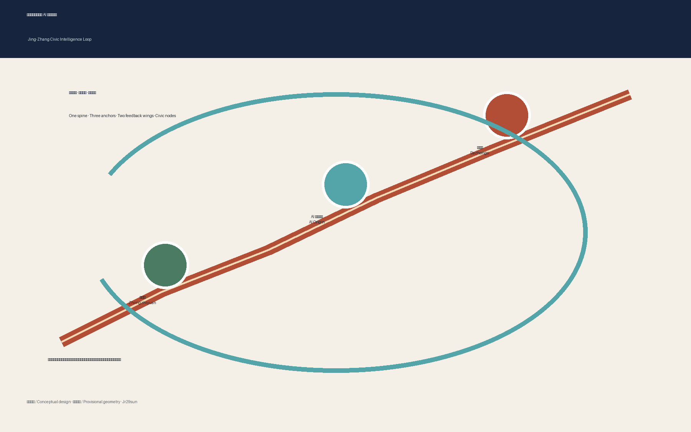
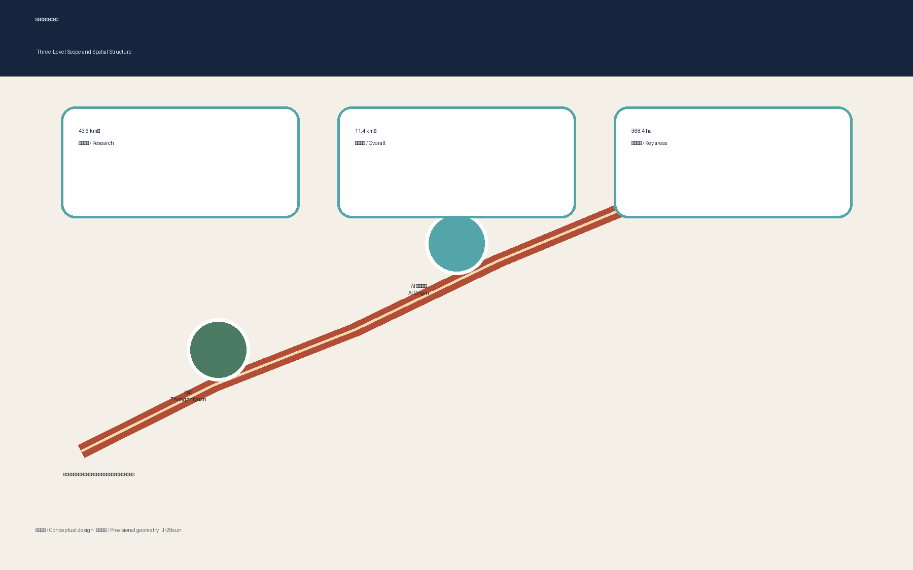
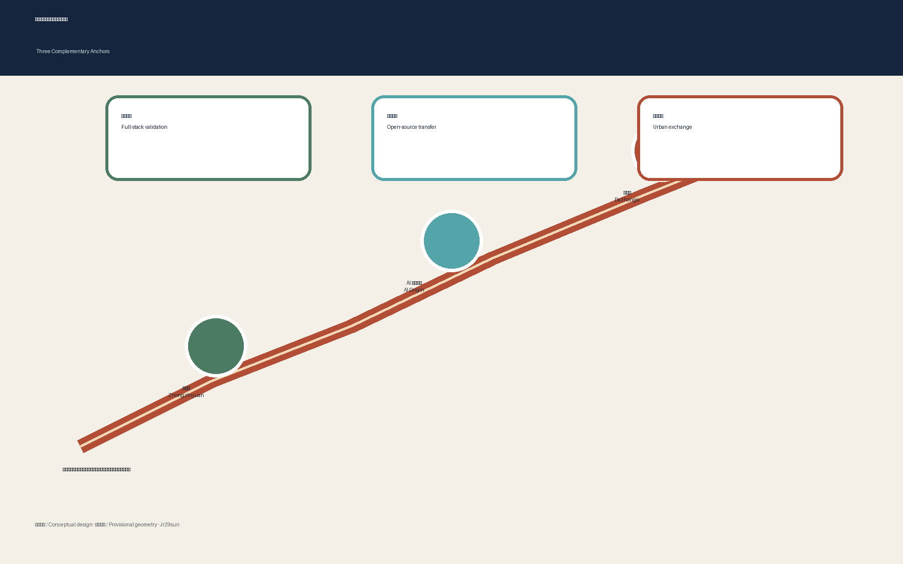
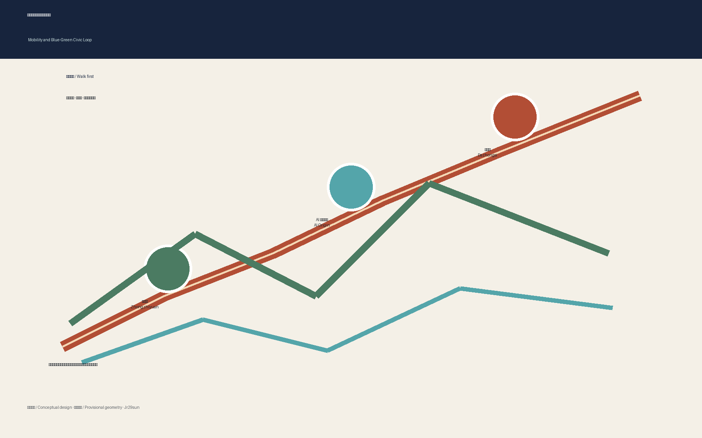

# Jing-Zhang Civic Intelligence Loop

The Civic Intelligence Loop is not a new statutory boundary. It is an urban protocol connecting railway heritage, everyday public life and responsible AI innovation. The Jing-Zhang Heritage Park becomes a north-south civic spine; Zhongzhiyuan, the Beijing AI Origin Community and Dazhongsi become complementary anchors for validation, open-source transfer and metropolitan exchange. Every spatial move is a conceptual suggestion for professional development, not an approved plan or implementation commitment.

## Design Basis and Source List

The proposal is grounded in the official pre-announcement, the cleared Agent taskbook, the site package, the public source registry and locally archived professional references. Sources marked background-only or provisional-only are never promoted into statutory evidence. The current polygons are repository-supplied provisional constraints and therefore support design discussion and local recomputation only; they are not official redlines or precise survey geometry [source:OFFICIAL-ANNOUNCEMENT] [source:AGENT-TASKBOOK] [depth:existing_conditions_diagnosis]. When official polygons arrive, all dependent geometry, metrics, figures and drawings must be regenerated.

## Three-Level Scope Framework

The 43.6 km² coordinated research area frames industry and future-city relationships; the 11.4 km² overall design area organizes renewal, mobility, infrastructure and character; the 368.4 ha key-area scope tests detailed interventions in three districts. The proposal translates these levels into “one spine, three anchors, two feedback wings and a hundred civic nodes.” This is a working framework rather than an extra planning boundary [data:geometry/site_boundary.geojson#SITE-001] [metric:site_area_sqm] [depth:three_level_scope_framework].

## Coordinated Research Area: Industry and Future City Research

The innovation model forms a loop from university research and open-source collaboration to controlled testing, enterprise services, public demonstration and international exchange. Seven reference ecosystems—Kendall Square, Toronto MaRS, Station F, 22@Barcelona, High Tech Campus Eindhoven, Singapore one-north and Seoul Digital Media City—are used only as comparative operating patterns, not copied spatial templates. Their transferable lessons are mixed-use proximity, shared technical platforms, clear governance, affordable entry points and long-term community operations [source:AGENT-TASKBOOK] [standard:PROJECT-AGENT-OPEN-CALL-TASKBOOK]. The proposed identity uses a continuous rail-line motif interrupted by three open nodes; no protected logo, typeface or corporate mark is reused.

## Overall Design Area: Urban Renewal and Regulatory-Plan-Level Urban Design

The overall structure prioritizes the heritage park spine, frequent east-west crossings, station gateways and open ground floors at innovation anchors. Existing conditions, ownership, heritage controls and regulatory parameters are incomplete, so the proposal does not prescribe demolition, height, FAR or road redlines. Instead it defines a reversible method: retain sound structures, retrofit adaptable shells, insert lightweight shared services and reserve major redevelopment decisions for verified surveys and statutory review [data:geometry/land_use.geojson#LU-001] [depth:overall_spatial_structure] [standard:MOHURD-CONTROL-DETAILED-PLANNING].

## Detailed Design of Key Areas

Zhongzhiyuan is conceived as a garden-based full-stack validation campus with a Qinghe-facing public commons and visible safety-governance work. The AI Origin Community is a near-university open-source neighborhood combining release rooms, founder services, affordable collaboration spaces and daily amenities. Dazhongsi is a transit-oriented urban showroom where intelligent agents, devices, creative content and international exchange meet ordinary commerce. Connections across roads or rail remain conceptual pending engineering and safety review [data:geometry/key_areas.geojson#PROV-KEY-001] [data:geometry/key_areas.geojson#PROV-KEY-002] [depth:three_key_area_detailed_design].

## AI Innovation Ecosystem, Personas, and AI+ Scenarios

Five personas guide the design: open-source developers, start-up teams, enterprise visitors, nearby residents, and university students and researchers. Ten scenario cards locate an open-source release hall, safety sandbox, edge-compute kiosk, explainable walking guide, international demo room, Qinghe low-carbon corridor, university-transfer street, governed data salon, AI-assisted daily-service street and annual civic route. Three controlled industry tests cover model safety, accessible mobility assistance and low-carbon edge services. Each requires consent, minimum data, visible human review, manual alternatives and a named operator; none is described as approved operation [standard:PROJECT-AGENT-OPEN-CALL-TASKBOOK] [data:geometry/public_space.geojson#PUBLIC-001].

## Land Use, Building Scale, and Retain-Renovate-Demolish Strategy

The land-use layer is a provisional design partition whose geometry remains subordinate to future official survey and planning controls. Building-scale decisions follow a four-step audit: verify structure and heritage value; test adaptable reuse; compare carbon and public-value outcomes; then submit any major intervention to professional and statutory review. FAR, building height, ownership and exact floor area stay pending official data. This avoids turning an AI concept into parcel-level demolition advice [data:geometry/land_use.geojson#LU-001] [data:geometry/buildings.geojson#BLDG-001] [depth:retain_renovate_demolish].

## Transport, Rail, Municipal Infrastructure, and Public Services

Mobility is organized as a continuous walking and cycling spine with frequent east-west links, legible station gateways, safe bicycle parking and accessible rest points. An explainable mobility assistant may identify interruptions and suggest routes, but it must never replace signs, staffed help or emergency procedures. Proposed crossings of major roads and railway infrastructure are location hypotheses only and require transport, structural, fire and utility review. Edge-compute and distributed-energy nodes are small, reversible pilots subject to capacity, cybersecurity and operator confirmation [data:geometry/roads.geojson#ROAD-001] [depth:traffic_rail_slow_parking].

## Blue-Green Network, Public Space, and Urban Character

The heritage park is treated as living civic infrastructure rather than a technological display strip. Green areas manage shade, habitat and rainwater; public spaces support rest, play, debate and small demonstrations; cultural interpretation links railway engineering, Zhongguancun innovation and contemporary open-source culture. Three pilgrimage landmarks are proposed: the Origin Platform for public releases, the Full-Stack Garden for transparent testing, and the Dazhongsi World Window for global exchange. A contributor ribbon records people and projects only with consent and verifiable attribution [data:geometry/green_space.geojson#GREEN-001] [metric:green_ratio] [depth:blue_green_public_space].

## Renewal Projects, Implementation Policy, and Phasing

Phase 1 uses reversible pilots: wayfinding, accessibility audits, temporary crossings, scenario governance and public programming. Phase 2 deepens station gateways, shared innovation services and selected ground-floor retrofits after ownership and infrastructure checks. Phase 3 addresses major construction only after official planning, heritage, transport and environmental review. Six project families—slow-mobility repair, Qinghe commons, origin transfer street, Dazhongsi four-quadrant connection, civic edge nodes and an annual global AI route—each retain a dependency register and a stop/go decision gate [data:geometry/phasing.geojson#PHASE-001] [depth:phasing_implementation].

The operating calendar includes a spring open-source assembly, summer urban test season, autumn Global Civic AI Week and winter evidence review. A resident council, developer guild, professional panel and public-interest steward share oversight. The conversion path moves from open call to sandbox, public evaluation, professional deepening and independently authorized implementation; publicity, investment and policy support are never assumed.

## Metrics, Area Recalculation, and Compliance Matrix

Site area, green ratio and public-space ratio are recomputed from submitted geometry and exposed with matching machine-readable values in the offline visual. Because the source boundary is provisional, these are low-confidence design-model values rather than official planning statistics. FAR, height and infrastructure capacity remain unknown where official controls are absent. The compliance, standards and design-depth matrices carry exhaustive coverage; the narrative highlights only claim-adjacent evidence [metric:site_area_sqm] [metric:green_ratio] [depth:metrics_recalculation].

## Risk, Copyright, and Compliance

Primary risks are provisional geometry, missing regulatory controls, incomplete ownership and building surveys, unknown municipal capacity, heritage uncertainty, privacy and accessibility failures, and overstatement of implementation. Each risk has a trigger for professional confirmation. Generated imagery is clearly labeled conceptual and is not site evidence. Diagrams are derived from package data; no remote fonts, scripts, map tiles, trackers or forms are used. AI services require purpose limitation, minimum collection, retention limits, human appeal and non-digital alternatives [depth:risk_missing_data] [source:SITE-PACKAGE].

## References

The machine-auditable bibliography is maintained in `sources.json`. Principal references include the official open-call announcement, the cleared Agent taskbook, the site-package design brief, allowed-design-space rules, source registry, planning-limit register and locally archived professional standards. Every future external dataset must record publisher, retrieval date, coverage, transformation, license and limitations before it supports a claim [source:SITE-PACKAGE] [source:SOURCE-REGISTRY].
