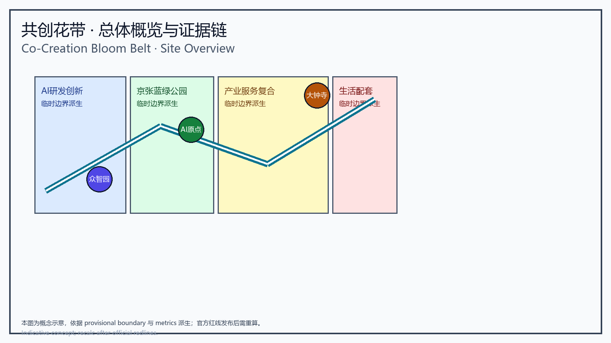
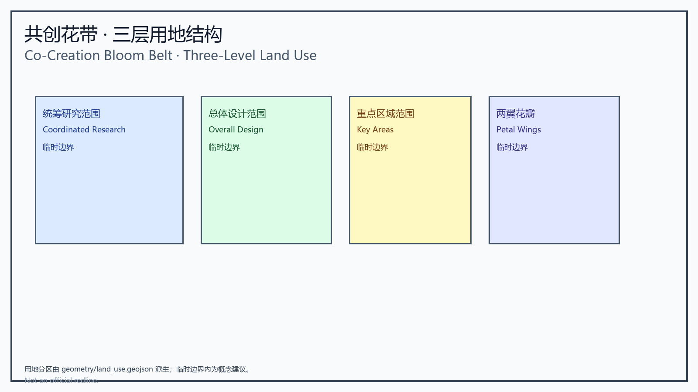
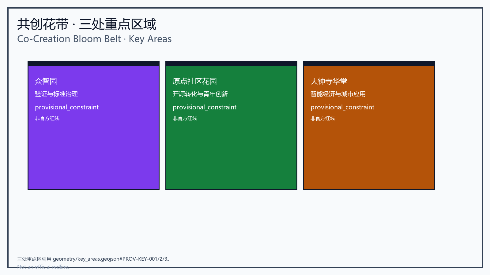
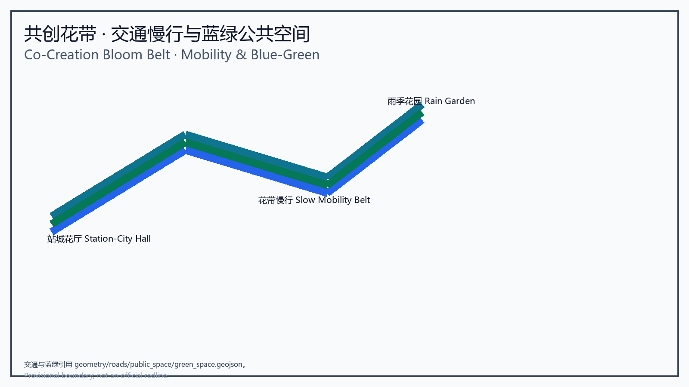
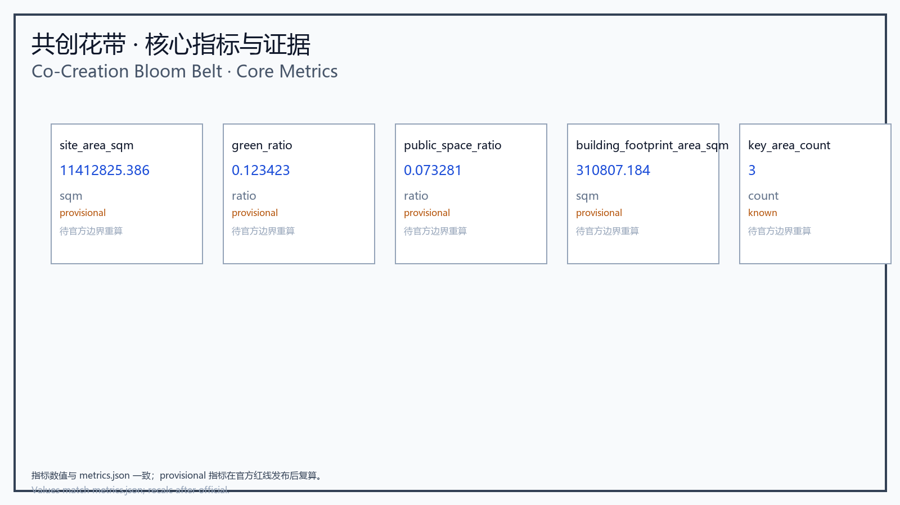

# Co-Creation Bloom Belt

## Design Basis and Source List

This formal proposal is grounded in the official Jingzhang AI design announcement published by the Beijing Municipal Planning and Natural Resources Commission, Haidian Branch [source:OFFICIAL-ANNOUNCEMENT], and in the registered temporary boundary, key area, metric, and source data in `brief/site-package/` [source:SITE-PACKAGE]. Design decisions are aligned with `sources.json`, `standard_matrix.json`, `design_depth_matrix.json`, and `compliance_matrix.json`.

The proposal requires AI design output to be both artistic and operable, verifiable, and auditable. Narrative text cannot replace layers, metrics, drawings, HTML, and self-checks; `proposal.md` is narrative, while core evidence remains in `geometry/*.geojson`, `metrics.json`, `compliance_matrix.json`, `visual/index.html`, and `report/*`.

Material boundaries are enforced by `data/source_registry.json` [source:SOURCE-REGISTRY]:

- public sources support concept and spatial design;
- background_only sources may inform context only;
- provisional_only sources may be used for generation and self-check but cannot be treated as official redlines, approval references, or precise-area basis.

Current material summary: 7 formal-use sources, 1 background source, 1 provisional-only source. `data/processed/agent_fact_pack.md` is a navigation aid, not a source of authority [source:PROCESSED-FACT-PACK]. Agents should verify claims against original documents, standards, and spatial evidence rather than treating the navigation summary as fact.

This package uses `brief/site-package/geometry/provisional_boundaries.geojson` to generate a temporary formal submission [source:BOUNDARY-SOURCE] [source:KEY-AREA-SOURCE]. `geometry/site_boundary.geojson` and `geometry/key_areas.geojson` are marked `provisional_constraint` and `official_boundary=false`. Until official polygons are available, these geometries are for generation, review, visualization, and discussion only, not for final approval, precise-area basis, or legal control.

The submission status is: **temporary boundary, caution retained, pending recalculation when official data is available; does not block scoring.** Consequently, all spatial conclusions are presented as "discussable, verifiable, and subject to recalculation once official boundaries are available." When official geometry is published, layers, metrics, drawings, HTML, and self-checks must be regenerated. Boundary interpretation may return to the overall scope layer and area recalculation [data:geometry/site_boundary.geojson#SITE-001] [metric:site_area_sqm].

## Three-Level Scope Framework

The Co-Creation Bloom Belt reads the Jingzhang corridor as a living floral ribbon of city life. The proposal organizes work by the three levels established in the announcement and builds verifiable spatial evidence at each level: the coordinated research area covers 43.6 km² of AI industry ecology, strategic positioning, innovation chains, and future urban form; the overall design area covers 11.4 km² of urban territory around the Jingzhang Heritage Park, producing an urban renewal framework, industrial spatial layout, transport and municipal support, and urban character control; the key area scope covers the three detailed design areas, defining functions, building scale, retain-renovate-demolish classification, public space connectivity, and transport organization. The three levels are mapped item by item in `compliance_matrix.json` so that each announcement task and mandatory agent task has chapter, layer, metric, drawing, and HTML evidence [source:AGENT-TASKBOOK].

The depth items of the three-level framework are constrained by [depth:three_level_scope_framework] and [depth:overall_spatial_structure]; spatial evidence follows [data:geometry/site_boundary.geojson#SITE-001] and [data:geometry/key_areas.geojson#PROV-KEY-001], and task authority follows [standard:PROJECT-OFFICIAL-ANNOUNCEMENT]. The spatial translation of the bloom belt concept: the belt spine is the Jingzhang Heritage Park and the linear green axis; the bloom cores are the Zhongzhiyuan Bloom, Origin Community Garden, and Dazhongsi Hall; the petal wings are the Zhongguancun Petal and Xiaoyue River Wing; the AI stewardship treats intelligent sensing, data governance, public review, and operational coordination as the belt's maintenance system rather than an isolated technology campus. The concept preserves urban design logic while creating a more artistic spatial image, distinct from "intelligence pulse" or "symbiosis belt" narratives, emphasizing co-creation, ecology, and public visibility.

The three levels are not isolated drawing sets: coordinated research determines industry chains and urban form, overall design translates judgments into renewal projects, spatial structure, and facility capacity, and key area detailed design verifies the implementability of specific plots, buildings, transport, public space, and AI application scenarios. An agent must first fix the official or provisional boundary and constraints in use, then generate land use, buildings, roads, green space, public space, phasing, and AI service nodes, and finally recompute metrics from those layers and explain which conclusions remain limited by the provisional boundary. Any area, ratio, scale, or project count that cannot be recomputed from structured data must not be written into formal conclusions.

## Coordinated Research Area: Industry and Future City Research

The coordinated research area focuses on 43.6 km² of innovation ecology and co-creation network. It answers how AI industry ecology grows with universities, enterprises, communities, culture, and public services; how co-creation activities extend from bloom nodes to everyday city life, international exchange, ecological governance, and institutional review; and which functions belong to trial bloom sequences versus enduring shared bloom assets. The proposal establishes a "five-flow stewardship" system: knowledge flow, where research and open-source outcomes converge in the origin garden; service flow, where standards, compute, legal, and capital services are organized in the Zhongguancun petal; public flow, where residents, visitors, and communities participate through public experiences; ecological flow, where green corridors, waterways, stormwater, and slow mobility are integrated; and governance flow, where AI stewardship, data review, complaints, and exit mechanisms are embedded in every bloom node [source:AGENT-TASKBOOK].

Coordinated research should inventory Haidian universities and institutes, leading enterprises, compute, algorithm, and data elements, incubation platforms, listed companies, unicorns, and technology services, and propose a spatial coordination framework of AI innovation, industry, talent, and city-service chains. The naming system and logo design should serve the overall recognition of the "Co-Creation Bloom Belt" and explain the relationship to industry ecology, public space, and cultural resources. The agent-facing taskbook also requires responding to "five functions" and "three districts, two wings" coordination, forming a nameable system, visual identity, overall spatial structure map, scenario opening, and operation mechanism [standard:PROJECT-AGENT-OPEN-CALL-TASKBOOK].

Coordinated research does not create pseudo-redlines; it coordinates urban character, public space, and building layout as required by [standard:MOHURD-URBAN-DESIGN-MEASURES], returning to [data:geometry/land_use.geojson#LU-001], [data:geometry/public_space.geojson#PUBLIC-001], and [depth:overall_spatial_structure], so that industrial strategy lands on visible, verifiable spatial structure. If data is provisional, conclusions remain review-oriented. Any global AI activity, developer community, open scenario, or pilgrimage route should be written as "concept proposal / reference plan / available for professional teams to deepen," never as confirmed government activity or implementation arrangements.

### Brand Identity and Naming (agent.1)

The Chinese primary name is unified as "共创花带" and the English primary name as "Co-Creation Bloom Belt" (no longer "AI Commons Belt" or "Intelligent City Co-Creation Belt"). The identity combines the Jingzhang railway heritage (the bloom belt flowering along the old track), Zhongguancun innovation culture (petal wings: the Zhongguancun Petal and Xiaoyue River Wing), and AI culture (AI stewardship).

- Logo concept: a bloom-belt curve extending from the Heritage Park threading a "co-creation" double ring (public ring + industry ring), with the railway line transposed into the belt's pulse line; three bloom buds anchor Zhongzhiyuan, Origin, and Dazhongsi.
- Color system: rail iron-grey + heritage green + Zhongguancun indigo + Jingzhang gold; precise values and application rules pending professional VI deepening.
- Typography: Chinese Sans (Source Han Sans/PingFang) and English Inter/Noto Sans recommended; formal rules pending.
- Extension examples: station-city bloom hall signage, belt wayfinding, roadshow background, developer event materials, contribution wall and honor certificates.
- Brand asset clearance: all fonts, images, icons, and logo proposals must be registered per asset in `report/copyright_statement.md` (author/generator, tool, date, license, scope); the current logo is a concept description only and embeds no third-party assets.

Three-positioning / five-function / three-district-two-wing coordination (concept): three positions map to "Centennial Jingzhang cultural belt, urban AI living-experience belt, AI-integrated innovation belt"; five functions to "innovation origination, translation acceleration, demonstration verification, public services, international exchange"; three districts plus two wings are the three key areas with the Zhongguancun Petal and Xiaoyue River Wing. Regional coordination proposes (as concept only) interface ideas with the north-latitude communities, Future Science City, Huairou Science City, Economic-Technological Development Area, and Beijing-Tianjin-Hebei, but obtains no official cooperation commitment and remains a deepening direction.

### Global AI Innovation Ecosystem Cases (agent.2)

Conceptual reference cases (5-8; facts and recommendations separated; public sources pending case-by-case clearance):

| Case | Fact summary | Transferable recommendation | Data status |
| --- | --- | --- | --- |
| Silicon Valley / Palo Alto | university origination + VC + startup community cluster | strengthen campus-park slow mobility stitching and incubation interface | public, pending clearance |
| Singapore One-North | government-led industry-city integration, garden-city fabric | garden-type campus and low-carbon exchange organization | public, pending clearance |
| London King's Cross | urban renewal + knowledge campus + station-city integration | station-city bloom hall and old-area renewal compounding | public, pending clearance |
| Tokyo Marunouchi / Shinagawa | station-city integration + premium offices + urban life | Dazhongsi four-quadrant pedestrian and business interface | public, pending clearance |
| Hangzhou Yunqi / Future Sci-Tech City | industry ecosystem + developer community + open scenarios | developer festival and open-day mechanism | public, pending clearance |
| Shenzhen Nanshan / DJI Sky City | leading enterprise driving + public space experiments | Zhongzhiyuan industry display and open testing | public, pending clearance |
| Berlin / Hezogen site | creative industry + old factory renewal | Origin building retain-renovate-demolish and creative corridor | public, pending clearance |

Ecosystem mapping and industry-space mapping (concept): the innovation chain (university origination—open-source collaboration—enterprise translation—public experience—international communication) maps to Origin (knowledge flow), Zhongguancun Petal (service flow), Zhongzhiyuan (verification flow), Dazhongsi (application flow), and Xiaoyue River Wing (ecological experience). Eight mechanisms (land/space/industry/capital/talent/compute/data/scenario) each receive a conceptual carrier and pending data (unknown or concept assumption), never as approved conclusions.

## Overall Design Area: Urban Renewal and Regulatory-Plan-Level Urban Design

The overall design area requires regulatory-plan-level urban design depth. The proposal expresses 11.4 km² as a belt spine and node community: the belt spine, the Jingzhang Heritage Park active green axis and slow mobility ribbon; cross-stitching, connections to east-west campuses, neighborhoods, Xiaoyue River, and the two wings; and co-creation nodes, bloom cores, scene stations, AI service halls, and everyday civic plazas. The design requires that the belt spine be a continuous public space that is walkable, stoppable, and visible; that layers stay coordinated across `land_use`, `roads`, `public_space`, `green_space`, `buildings`, and `phasing`; and that metric recalculation stays synchronized, with `metrics.json` computing green ratio, public space area, built footprint, slow mobility reach, and node counts.

This section decomposes regulatory-plan-depth content into reviewable objects following [standard:MOHURD-CONTROL-DETAILED-PLANNING]: [data:geometry/land_use.geojson#LU-001] expresses land use structure, [data:geometry/buildings.geojson#BLDG-001] expresses building footprints, [data:geometry/roads.geojson#ROAD-001] expresses transport organization, [metric:building_footprint_area_sqm] verifies building footprint area, and [depth:land_use_layout] and [depth:development_intensity_controls] constrain output depth. `geometry/land_use.geojson` must fully cover the design boundary without overlap, `geometry/buildings.geojson` must express renewal or retained building footprints, and `geometry/roads.geojson` must express micro-circulation, slow mobility, and rail connection.

Overall design must also support transport, rail, municipal services, and supporting facilities. The proposal should propose spatial layout and implementation paths around station integration, road micro-circulation, non-motorized parking, parking supply, innovation service platforms, talent life services, new infrastructure, distributed energy, and edge compute [depth:municipal_new_infrastructure]. Content involving building height, development intensity, road red lines, setbacks, and facility standards should be written as "pending official regulatory-plan confirmation" unless official control conditions exist, never passing off agent-inferred values as approved indicators.

## Detailed Design of Key Areas

The three key areas correspond to three differentiated bloom cores and serve as operational verification nodes of the belt:

| Core area | Bloom theme | Primary function | Design intent |
| --- | --- | --- | --- |
| Zhongzhiyuan Bloom | verification and standards governance | low-carbon testing, standards display, open experimentation | make technical verification a visible civic living room |
| Origin Community Garden | open-source translation and youth innovation | outcome launch, community spaces, campus collaboration | make translation a participatory garden fair |
| Dazhongsi Hall | intelligent economy and urban application | station-city reception, content experience, international exchange | make applications flow between everyday and global stages |

The two supporting petal wings are the Zhongguancun Petal, providing industry services, regulation interfaces, capital, and talent support, and the Xiaoyue River Wing, providing experiential scenes, ecological leisure, and community feedback. These areas must be marked `provisional_constraint` in `geometry/key_areas.geojson` [data:geometry/key_areas.geojson#PROV-KEY-001] [data:geometry/key_areas.geojson#PROV-KEY-002] [data:geometry/key_areas.geojson#PROV-KEY-003]. Narrative alone without building, public space, transport, implementation project, and metric evidence does not satisfy [depth:three_key_area_detailed_design].

Detailed design of key areas is mandatory. The Zhongzhiyuan AI independent innovation acceleration area should detail national AI platforms, full-stack independent innovation, standard setting, safety governance, industry display, external transport, Qinghe culture, low-carbon green innovation exchange, and green space AI scenarios. The Beijing AI Origin Community should detail campus-adjacent innovation, outcome incubation and translation, talent special zones, open-source systems, brand activities, building retain-renovate-demolish, outcome display and release, residential life services, campus-park slow mobility links, and station integration. The Dazhongsi AI industry cluster should detail leading enterprises, agents, intelligent terminals, content consumption, data elements, digital assets, commercial services, compound green space use, Dazhongsi station integration, and four-quadrant pedestrian connectivity. Design expression should include functions, building scale, building form, retain-renovate-demolish classification, public space system, transport organization, slow mobility connectivity, and implementation projects; A3 booklets and A0 boards should include at least key area master plans, detail drawings, and metric notes.

## AI Innovation Ecosystem, Personas, and AI+ Scenarios

The core practice of the Co-Creation Bloom Belt is that AI functions as the belt's stewardship rather than an isolated technology campus. Stewardship 1: slow mobility and flow sensing to support belt continuity and accessible maintenance; Stewardship 2: data governance and transparent audit to support AI services, complaints, exits, and review; Stewardship 3: collaborative service platforms that turn university, enterprise, community, operator, and public needs into spatial programming and event operations; Stewardship 4: explainable AI commitments including data minimization, human fallback, interpretability, and pause mechanisms.

The proposal should build spatial demand personas for AI talent and enterprises covering R&D offices, open-source collaboration, outcome launch, enterprise services, talent housing, social learning, consumption, sport and leisure, and international exchange. AI+ scenarios should address transport, services, consumption, healthcare, education, legal, and daily life services proposed in the announcement, forming industry development scenarios and AI-empowered urban function scenarios. Each scenario should state service objects, spatial location, data sources, privacy boundaries, human review mechanisms, and operating actors. The agent-facing taskbook requires at least 10 AI scenario cards, at least 3 industry testing and verification scenarios, and at least 5 persona types; participants must write scenario cards, persona tables, privacy boundaries, human review, and operating actors into the narrative, HTML, A3/A0, and compliance matrix.

AI scenarios must land on spatial and governance boundaries: public space scenarios reference [data:geometry/public_space.geojson#PUBLIC-001], slow mobility and transport scenarios reference [data:geometry/roads.geojson#ROAD-001], and open space scenarios reference [data:geometry/green_space.geojson#GREEN-001] plus [metric:public_space_ratio] and [metric:green_ratio]. AI governance recommendations must follow data minimization, public sources, explainability, and human review; city agents may assist in identifying slow mobility gaps, public space heat, facility maintenance, enterprise service needs, and event safety risks, but cannot replace planning approval, output unauthorized personal profiles, or claim official implementation commitments.

#### Scenario Cards (agent.3, 10 cards)

| ID | Scenario card | Spatial carrier | Service objects | Data source / privacy | Human review & operator | Data status |
| --- | --- | --- | --- | --- | --- | --- |
| S01 | Belt guidance & slow mobility sensing | Heritage Park active belt | residents, visitors | low-intrusion sensing; no personal trajectory, aggregate only | operator review; park operator | concept |
| S02 | Bloom release hall | Origin Community | developers, universities, startups | public code and outcomes; no personal behavior | open-source community + park operator | concept |
| S03 | Petal service desk | Zhongguancun Petal | enterprises, startups | authorization-based; data minimization | industry service operator | concept |
| S04 | Hall showcase | Dazhongsi | public, international visitors | anonymized demo data; enterprise cases cleared | commercial operator + human review | concept |
| S05 | AI safety governance corridor | Zhongzhiyuan | R&D, regulators, public | standards/evaluation public; no personal data | governance body + professional review | concept |
| S06 | Campus-industry living room | Origin vicinity | faculty, students, enterprises | research outcomes authorization-based | university tech-transfer + operator | concept |
| S07 | Data elements theater | Dazhongsi | enterprises, public | data authorization and auditability | compliance team + human review | concept |
| S08 | Low-carbon compute station | overall scope nodes | developers, public | aggregated energy data; no personal profile | energy operator + review | concept |
| S09 | Rain garden | Qinghe / Xiaoyue River | residents, community | ecology/stormwater public data | ecology department + community feedback | concept |
| S10 | Global AI Week route | belt public space | global developers, media | aggregated event stats; no personal behavior | event committee + safety review | concept |

Each card states data minimization, human review, fail-pause, and non-digital alternatives (manual service desk, phone/on-site staff, paper guidance); formal deepening adds operator and performance baselines per card.

#### Industry Testing and Verification Scenarios (agent.3, 3)

| Test | Location | What is verified | Fail-pause & human takeover | Data status |
| --- | --- | --- | --- | --- |
| T01 belt slow mobility sensing pilot | a park section | gap detection, crowding prediction, accessibility alerts | sensor failure to manual patrol; threshold triggers human review | concept, pending pilot |
| T02 green robot coordination pilot | Zhongzhiyuan / Qinghe frontage | energy/efficiency of sweeping, pruning, spraying | robot stop to manual; remote takeover and emergency stop | concept, pending pilot |
| T03 city agent sandbox | controlled public space | transport/service/ops agent behavior | sandbox isolation; immediate halt on violation | concept, pending pilot |

#### User Personas (agent.3, 5+)

| Persona | Typical needs | Spatial response | Alternative channels | Data status |
| --- | --- | --- | --- | --- |
| Open-source developer | release, collaborate, test, reputation | Origin release hall, night collaboration | on-site/remote support | concept |
| Startup team | low-cost office, compute access, test field | Zhongzhiyuan shared test field, edge compute | manual service desk | concept |
| Leading enterprise visitor | display, business, international reception | Dazhongsi roadshow hall, station link | bilingual manual reception | concept |
| Local resident (incl. elderly/children/disabled) | commute, leisure, community service, low disturbance | belt loop, embedded community services, accessible path | on-site staff, phone/paper, accessible services | concept; accessibility requires human verification |
| University faculty/students | outcome translation, cross-campus, daily mobility | campus-park stitch, translation station | university tech-transfer manual service | concept |
| Night users / frontline maintainers | night lighting & activity grading, workload relief | night mode, robot-assisted maintenance | night duty staff | concept |

#### Scenario-Space-Operation Matrix (agent.3)

Correspondences: S01→`geometry/roads.geojson#ROAD-001`→slow mobility reach→park operator→human review; S02→`geometry/public_space.geojson#PUBLIC-001`→AI scenario node count→open-source community→human review; S03→`geometry/land_use.geojson#LU-001`→industry service metric→industry operator→human review; S04/S07→`geometry/key_areas.geojson#PROV-KEY-003`→application metric→commercial operator→human review; S09→`geometry/green_space.geojson#GREEN-001`→ecology metric→ecology department→community feedback. The full matrix is recorded in `compliance_matrix.json` and the A3/A0 drawings.

## Exhibit: Urban Greening Management Hall

Design a dedicated exhibit hall that demonstrates city-scale greening management capability. This exhibit is not a technology-flaunting "AI showcase belt" but an operations-and-stewardship center for the public, operators, and partners. The hall's core goal is to show how AI, robotics, and coordinated systems lower greening maintenance costs and human labor dependence while keeping green assets healthy and public space usable under extreme conditions (heat, dust storms, falling leaves and catkins, pollen and litter, and pest outbreaks). The exhibit integrates with other projects (stormwater management, edge compute nodes, community gardens, and ecological restoration projects), including data interface sketches, authorization flows, and privacy boundaries.

Exhibit functions: a central operations console with a real-time dashboard visualizing green asset sensing, weather and air quality, soil moisture, pest alerts, and task scheduling. The corresponding operations metrics `maintenance_alerts`, `coverage_pct`, `response_time`, `maintenance_cost_estimate`, and `labor_hours_saved` are registered in `metrics.json` and are all `status=unknown` (no deployed system or operating baseline; they must not be treated as computed values) until sensing systems, robot pilots, and operations logs exist [metric:maintenance_alerts] [metric:coverage_pct] [metric:response_time]; the cost and labor metrics [metric:maintenance_cost_estimate] [metric:labor_hours_saved] similarly await operations data. A robot demonstration zone for indoor/outdoor robots performing autonomous inspection, dust/leaf/catkin/pollen clearing, smart irrigation, precision treatment, and pruning, with energy, efficiency, labor-replacement estimates, failure modes, human takeover thresholds, and trial maturity levels; a prediction and scheduling sandbox using historical climate, air quality, and tree species models to show predictive maintenance such as reduced watering during heatwaves, pre-emptive clearing for dust events, and filtering or path control during pollen season; and public interaction and review where citizens can report issues, view operation logs, and submit feedback, supporting explainable AI and human review, with manual service desks and non-digital alternatives for elderly, children, people with disabilities, and low-digital-skill users.

Operations and technology: a multi-vehicle robot fleet (ground sweepers, quadruped inspection, aerial surveillance drones) coordinated with fixed sensors, with robots and humans forming an "on-site crew plus remote monitoring" model to reduce repetitive field labor; extreme condition handling including heat-window rescheduling with low-power modes, dust and pollen filtration with increased cadence, and concentrated leaf and catkin clearing with biodegradable treatment; pest and disease management triggered by traceable sensing thresholds, prioritizing biological control and targeted application, with all chemical records entering the compliance matrix; and cost-benefit display of an estimated maintenance cost reduction curve as a concept assumption pending trials [data:geometry/green_space.geojson#GREEN-001]. Exhibit implementation follows "concept proposal / reference plan / available for professional teams to deepen" wording and makes no implementation promise; its transferable implementation points (recommended actors, dependencies, phases, risks, KPIs, human takeover, and exit conditions) are in the Renewal Projects section.

Exhibit spatial and expression requirements: configure three high-quality display images (exhibit overview, robot demo, and real-time dashboard) in Chinese and English versions, with source and license registered in `sources.json` or `report/copyright_statement.md`; exhibit copy should include an operator manual summary, scenario SOPs, data-sharing and privacy commitment text, partner engagement intent, and an example partner list. The exhibit is part of the belt's public space; its location should be included in the verifiable expression of `geometry/public_space.geojson` and `geometry/buildings.geojson`, and linked to phased implementation projects.

## Land Use, Building Scale, and Retain-Renovate-Demolish Strategy

Land use should follow public standards such as national land survey, planning, and use-control classification to form complete, closed, and seamless land parcels. The building plan should distinguish retain, renovate, renew, new-build, or pending objects, specifying building footprint, function, scale, character, roof, massing, and height control recommendation levels. If existing buildings, ownership, regulatory plans, and engineering conditions are missing, the proposal may only propose methods and a to-be-calibrated list, never fabricate retain-renovate-demolish conclusions. Land use classification follows [standard:MNR-LAND-USE-CLASSIFICATION-GUIDE]; height, massing, interface, and character control are managed by [depth:height_massing_character]; retain-renovate-demolish method is managed by [depth:retain_renovate_demolish].

The main evidence for land and buildings is [data:geometry/land_use.geojson#LU-001], [data:geometry/buildings.geojson#BLDG-001], and [metric:building_footprint_area_sqm]. Building scale and intensity indicators must be consistent with `metrics.json` and layers. Where total building scale, floor area ratio, building height, building density, green ratio, setbacks, and building control lines lack official conditions, use `status=unknown` uniformly and explain pending conditions, current assumptions, and recalculation paths once official data arrives; never fabricate precision with fixed numbers. A3 booklets should provide renewal project lists and metric verification tables, A0 boards should express key spatial structure and key areas clearly, and HTML pages should provide linked metric and layer viewing. As a new or renovated building object, the exhibit hall should also enter building footprint and scale recalculation to avoid duplication or omission.

## Transport, Rail, Municipal Infrastructure, and Public Services

Transport and blue-green space are the foundation of the bloom belt. The proposal shifts transport from "rail-dominated" to "slow mobility and station-city integration centered," green space from "decorative park" to "belt habitat and ecological connectivity," and public space from "isolated plazas" to "continuous stoppable bloom corridors." The transport plan should respond to the announcement's requirements for station integration, road micro-circulation, slow mobility gaps, external transport, parking, non-motorized parking, and green transport systems, covering the North Fifth Ring Road, the Jingzhang Heritage Park cross-ringway node, Wudaokou, Qinghua East Road West Entrance, Dazhongsi station, and transport links around key enterprises.

Transport and municipal professional depth are constrained respectively by [depth:traffic_rail_slow_parking] and [depth:municipal_new_infrastructure]; layer evidence references [data:geometry/roads.geojson#ROAD-001], [data:geometry/public_space.geojson#PUBLIC-001], and [data:geometry/constraints.geojson#CONSTRAINTS]. Where road red lines, pipelines, fire safety, and municipal conditions are missing, note them via assumptions rather than writing strategies as approved conditions. Road and slow mobility layers must stay within the submitted boundary and cross-check public space, green space, industry nodes, and key areas; if the boundary is provisional, transport conclusions remain temporary design discussion only.

| Mobility theme | Bloom expression | Validation layer |
| --- | --- | --- |
| station-city bloom halls | station integration with civic entrances | [data:geometry/roads.geojson#ROAD-001] |
| slow mobility belt | continuous public ribbon with resting intervals | [data:geometry/public_space.geojson#PUBLIC-001] |
| rain garden | Xiaoyue River and Qinghe ecological linkages | [data:geometry/green_space.geojson#GREEN-001] |
| everyday services | service nodes along the belt edge | [data:geometry/land_use.geojson#LU-001] |

Municipal and public service facilities should cover AI industry services, innovation service platforms, talent life services, new infrastructure, distributed energy, edge compute, and traditional municipal facility integration. The proposal should state facility standards, spatial layout, service radius, operation modes, and phasing logic. Missing pipeline, energy, drainage, flood, and fire engineering data should be listed as prerequisites for formal deepening.

## Blue-Green Network, Public Space, and Urban Character

The blue-green plan should take the Jingzhang Heritage Park active belt as its spine, coordinate Qinghe, Xiaoyue River, surrounding universities, enterprises, and community travel needs, and propose north-south and east-west connected pedestrian, cycling, and green space systems. The plan should identify slow mobility gaps, cross-ringway nodes, and the southern and northern landscape nodes of the park, and propose compound use strategies for parking, sports, innovation exchange, technology testing, application display, and public services. Blue-green public space is jointly verified by design depth items and green and public space layers [depth:blue_green_public_space] [data:geometry/green_space.geojson#GREEN-001] [data:geometry/public_space.geojson#PUBLIC-001]. The design meaning of green and public space ratios is explained in the narrative, with full recalculation in `metrics.json` [metric:green_ratio] [metric:public_space_ratio].

The urban character plan should integrate the cultural heritage of the Jingzhang Railway, the innovation culture of Zhongguancun, and AI innovation culture, using resources such as the Qinghuayuan Railway Station and Beijing Film Academy, and propose city tone, architectural character, roof forms, massing, interfaces, and public art guidance. The agent should also propose wayfinding, cultural symbols, international communication narratives, AI pilgrimage landmarks, contribution walls, or honor display systems, but all brands, fonts, images, portraits, and enterprise identities must have cleared sources. Character control should distinguish official control, design recommendations, and pending conditions, and must never fabricate pseudo-precise control lines without heritage protection or regulatory plan basis.

#### Conceptual Landmarks and Honor Display (agent.4)

At least three conceptual landmarks (each labeled "concept proposal / reference plan / available for professional teams to deepen"; no implementation promise and no official naming claim):

- L1 Bloom Belt Origin Monument (Origin Community): a monument at the "Co-Creation Bloom Belt" origin, doubling as an open-source contribution wall honoring developers.
- L2 Jingzhang Memory Tower (Heritage Park south end): a tower themed on the railway heritage combined with AI culture narrative, doubling as a viewing and wayfinding node.
- L3 Hall AI Window (Dazhongsi): an urban window facade themed on intelligent terminals and content display, doubling as an international roadshow backdrop.

Honor display and component library: propose a "co-creation contribution wall / honor system" (tiered display for developers, enterprises, community, universities) and a wayfinding component library (belt signage, station-city hall plates, roadshow backdrop, accessible wayfinding), plus a "cultural resources—spatial carriers—wayfinding system" correspondence table: Jingzhang railway heritage → Heritage Park / Memory Tower; Zhongguancun innovation culture → Origin / Petal; AI culture → Hall / Zhongzhiyuan test field. All cultural symbols, fonts, images, and logos must be registered per asset in `report/copyright_statement.md`.

## Renewal Projects, Implementation Policy, and Phasing

The implementation plan should form a reviewable renewal project list stating location, type, function, responsible actors, dependencies, implementation phases, risks, and evaluation metrics. Policy recommendations should cover urban renewal coordinated implementation, space supply, operation mechanisms, industry services, public participation, data governance, and property rights coordination. `geometry/phasing.geojson` should express phasing extents, and `compliance_matrix.json` should link each task to phasing and drawings. Phasing is supported by `geometry/phasing.geojson` and managed in depth by [depth:phasing_implementation]. The project list should appear in `compliance_matrix.json` and link to drawings, metrics, HTML, and risk assumptions [data:geometry/phasing.geojson#PHASE-001].

#### Transferable Implementation Table for Renewal Projects

The following project list is "concept proposal / reference plan / available for professional teams to deepen" and makes no implementation promise; each item gives feature ID, recommended actor type, dependencies, phase, risks, KPIs, human takeover, and exit conditions:

| Feature ID | Project | Recommended actor | Dependencies | Phase | Key risks | Suggested KPI (baseline pending) | Human takeover / exit | Data status |
| --- | --- | --- | --- | --- | --- | --- | --- | --- |
| JZ-01 | Belt slow mobility repair & station-city bloom hall | government + rail operator | road red lines, underpass space, transport review | near-term pilot | ownership / utilities | slow mobility reach, gap count | adjust scope if transport review fails | concept |
| JZ-02 | Zhongzhiyuan Qinghe innovation frontage | government + park operator | river blue line, ecology/flood | near-term pilot | flood / ecology | green frontage length, open-test count | downgrade to activity if ecology approval fails | concept |
| JZ-03 | Origin outcome translation street | university + park operator | campus boundary, ownership, ground-floor uses | mid-term renewal | ownership / vacancy | translation projects, occupancy | adjust uses if vacancy exceeds threshold | concept |
| JZ-04 | Dazhongsi four-quadrant pedestrian link | government + rail operator | station, intersection, municipal utilities | mid-term renewal | construction / utilities | walkability, crossing time | phase construction if disrupted | concept |
| JZ-05 | Petal service desk & edge compute node | operator + energy provider | energy, compute, safety | near-term pilot | energy / safety | service desk count, node availability | desk-only if safety fails | concept |
| JZ-06 | Urban Greening Management Hall | government + operator + robot supplier | building/ownership, robot pilot, data license | medium/long | cost / operations / data | maintenance_* (unknown) | convert to static exhibit if pilot fails | concept |

Phasing is distinguished from the 100-day solicitation design cycle: the solicitation cycle is a submission deadline, while implementation phasing is the path of urban renewal and project construction. Near-term pilots (JZ-01/02/05) may start with light facilities, operations, and service platforms; mid-term renewal (JZ-03/04) and long-term governance (JZ-06 plus annual operations) follow; items requiring official regulatory plans, municipal, transport, and ownership conditions are explicitly marked, and without ownership, funding, implementation actors, and approval paths the proposal writes these as implementation risks rather than promises.

#### Annual Activities, Developer Community, and Long-Term Operations (agent.6)

As "concept proposal / reference plan", the proposal outlines: an annual activity system (Global AI Week, open days, developer festivals, competition roadshows, Jingzhang Memory season) with operating objects, frequency, responsibility boundaries, conversion paths, and risks; developer community operations (Origin open-source collaboration, code wall, contribution wall); open-scenario and recruitment-conversion mechanisms (test-field booking, incubation interface, investment matchmaking); and international communication mechanisms (bilingual narrative, international roadshows, media releases). These mechanisms claim no government commitment; operators, budgets, frequency, and performance baselines are marked unknown or concept assumptions pending a formal operations plan.

## Metrics, Area Recalculation, and Compliance Matrix

The proposal includes at least the following metric categories: belt coverage rate and scope area; green ratio and public space area; building footprint and service facility area; AI scenario node count; slow mobility accessibility and barrier-free connectivity; and AI stewardship verifiability metrics. All computable indicators must derive from `geometry/*.geojson` or trusted data. Missing indicators must be marked "unknown" with reasons and recalculation paths. Metric recalculation follows [depth:metrics_recalculation].

The indicator system should include at least overall design area, key area area, green and public space ratios, building footprint, renewal project count, AI scenario nodes, slow mobility connectivity, industry space, talent service, and self-check status. All known indicators must be recomputable from GeoJSON or trusted sources; unknown indicators must state reasons and formal submission prerequisites. The results of `scripts/spatial_review.py` and `scripts/visual_review.py` are important evidence for formal self-check [metric:site_area_sqm] [metric:key_area_count].

The compliance matrix is the master file for task responsiveness. Each announcement task and agent taskbook task must map to report sections, layers, metrics, drawings, HTML pages, sources, assumptions, and self-checks. If any mandatory announcement task or agent task is uncovered, the proposal must not enter formal professional scoring. When deepening, the agent should classify each indicator into three types: spatial indicators directly recomputable from submitted geometry; control indicators requiring official regulatory plans or taskbook attachments; and performance indicators requiring ongoing operations or industry data calibration. The three types should respectively enter `metrics.json`, `assumptions.json`, and `compliance_matrix.json`, avoiding treating operational visions as approved planning conditions.

## Risk, Copyright, and Compliance

The proposal defines two boundaries: the design boundary, the current `provisional_boundary` used for generation and review; and the review boundary, the official polygon used as the final approval basis. Any statement treating `provisional_constraint` as approval control is a risk. The risk register must appear in `assumptions.json`, `self_check.json`, and the risk section [depth:risk_missing_data] [data:geometry/constraints.geojson#CONSTRAINTS] [source:SITE-PACKAGE].

**Bilingual delivery is required.** The primary proposal may be in Chinese or English but must provide a complete counterpart via `proposal.en.md` or `proposal.zh.md`; A3/A0, HTML, and text-bearing figures must also provide corresponding language copies. If any required translation, language mapping, or valid file is missing from the v2 package, finalize and CI will block submission. All images, drawings, icons, data, and code assets must state source, license, and authorization in `sources.json` or `report/copyright_statement.md`. HTML pages must not load remote scripts, remote map tiles, remote fonts, iframes, forms, or external APIs, and must not track reviewer behavior. The item-by-item bilingual parity check of terminology, metrics, warnings, and figure captions is in the "Bilingual Parity Audit" section of `report/narrative.md`.

This proposal does not claim official approval, approved regulatory plans, final land ownership, final construction scale, or guaranteed implementation. The AI agent is responsible for facts, sources, copyright, spatial data, metrics, and expression; maintainers and professional reviewers may request revision or rejection based on self-checks, spatial review, and compliance matrices. Gaps listed in `missing_data_checklist.csv` for official boundary, key areas, regulatory plans, roads, plots, buildings, municipal, heritage, and public services must enter `assumptions.json`, self-checks, and the risk section.

## References

- brief/public-brief.md
- brief/site-package/design_brief.json
- brief/site-package/allowed_design_space.json
- brief/site-package/enums/
- brief/site-package/ranges/planning_limits.json
- data/processed/agent_fact_pack.md
- data/processed/project_scope_summary.csv
- data/processed/agent_task_requirements.csv
- data/processed/source_use_matrix.csv
- data/processed/missing_data_checklist.csv
- sources.json, metrics.json, compliance_matrix.json, standard_matrix.json, design_depth_matrix.json

The bibliography entry in this section follows the site package registration, with full provenance and licenses in the structured source list [source:SITE-PACKAGE]. The proposal text has replaced generic "materials" placeholders with specific reference names and provenance: the official announcement (Beijing Municipal Planning and Natural Resources Commission, Haidian Branch, 2024), Qinghe River Basin Ecological Restoration Report (Qinghe Basin Authority, 2023), Zhongguancun Industrial Development Whitepaper (ZGC Management Committee, 2025), National Urban Greening and Maintenance Technical Standard (National Forestry and Grassland Administration, latest edition), meteorological and air-quality monitoring datasets (national meteorological and environmental monitoring stations, 2018-2025), maintenance robotics and UAV inspection technical reports (institutional public technical reports), and an aerial imagery package (licensed imagery with provider, date, resolution, and license noted). These external materials must be provided as cleared files in the submission package and registered in `sources.json` before being cited with [source:...] tags as machine-readable sources; currently they are listed as reference materials only.

[source:BOUNDARY-SOURCE] [source:KEY-AREA-SOURCE] [standard:MOHURD-ARCH-DESIGN-DEPTH-2016]
