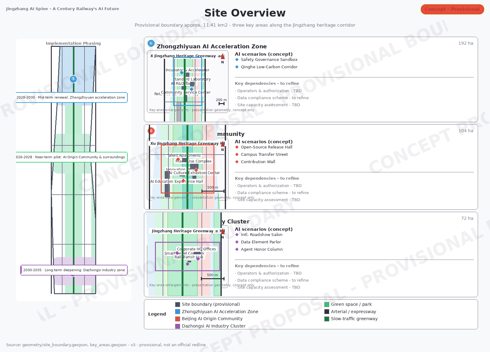
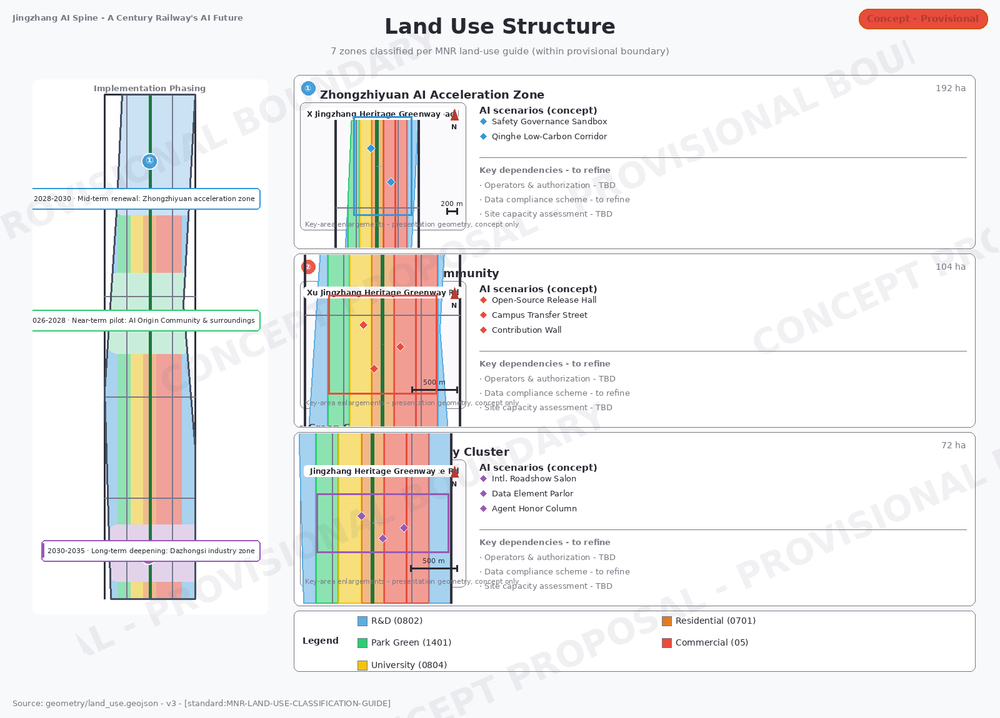
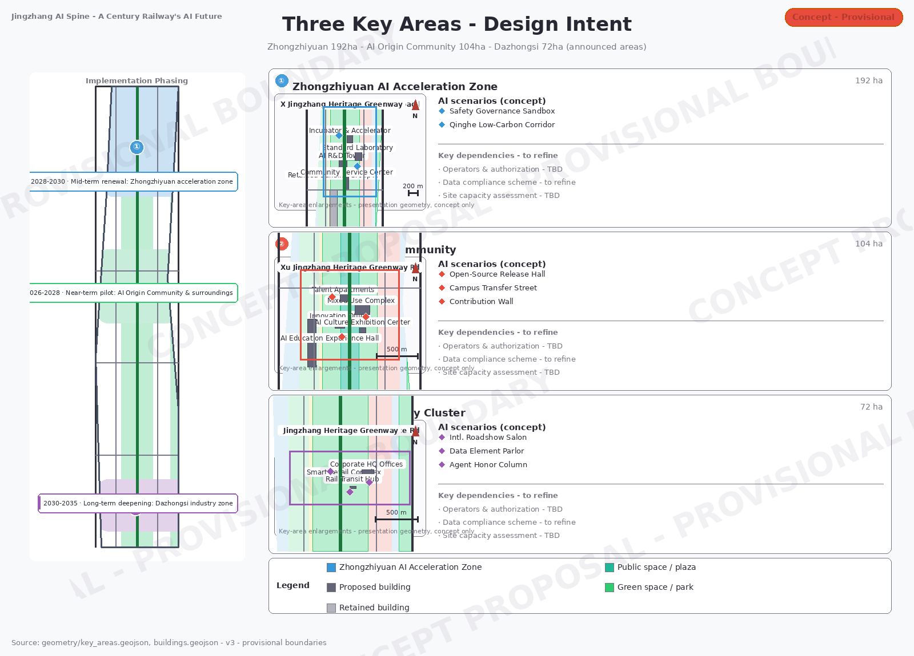
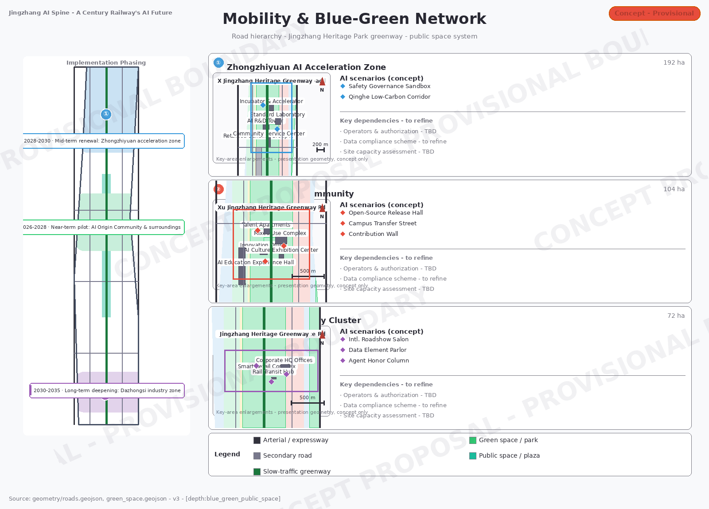
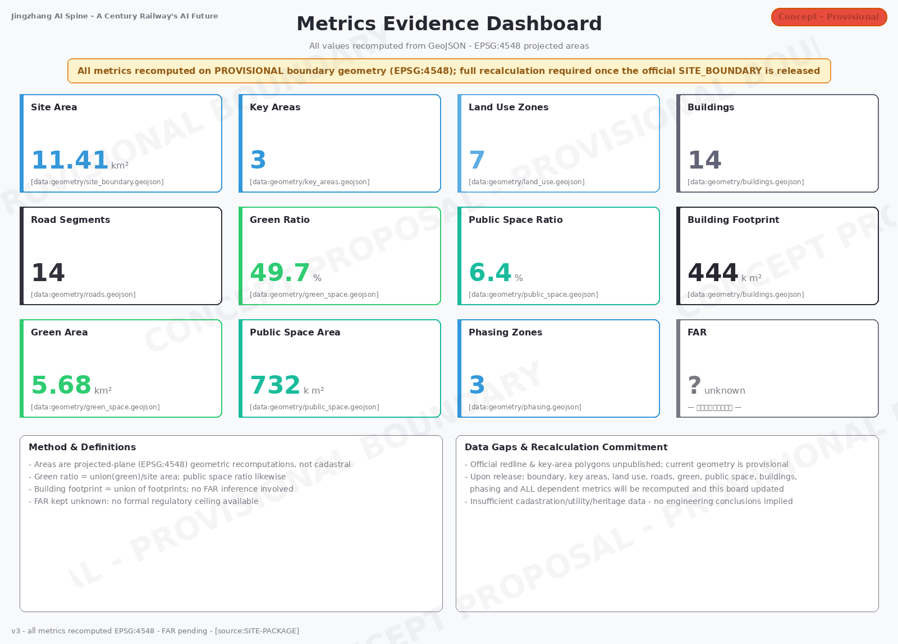

# Jingzhang AI Symbiosis Belt · The AI Future of a Century-Old Railway

## Design Basis and Source Inventory

This formal proposal takes the "Centennial Jingzhang AI Innovation Belt Urban Design International Open Call Prequalification Announcement" issued by the Haidian Branch of the Beijing Municipal Planning and Natural Resources Commission as its primary basis [source:OFFICIAL-ANNOUNCEMENT], together with the maintainer-registered provisional rough boundaries, key areas, enumerations, metrics, and source inventory under `brief/site-package/` as its machine-readable basis [source:SITE-PACKAGE]. Before generating this proposal, the AI agent read `design_brief.json`, `allowed_design_space.json`, `sources.json`, `enums/`, `ranges/`, `schemas/`, and `data/source_registry.json`, and used `agent_taskbook.json` to build the task, scope, data-use, and gap inventory [source:AGENT-TASKBOOK]. Every design judgment is decomposed into traceable sources, recomputable metrics, verifiable layers, and human-reviewable assumptions.

This proposal is not a standalone vision text: it is organized from the official announcement, the agent-facing taskbook, professional standards, boundaries, the processed fact pack, and the source registry. The announcement basis is cited at [source:OFFICIAL-ANNOUNCEMENT], task and co-creation principles at [source:AGENT-TASKBOOK], and machine-readable constraints at [source:SITE-PACKAGE]. The complete indexes of sources, standards, and design-depth items are kept in `sources.json`, `standard_matrix.json`, and `design_depth_matrix.json`; the narrative cites them only where key judgments are made.

The usage boundaries of the public source registry are as follows:

- data/source_registry.json records the usage boundaries of public, cleared, and provisional materials.
- Current registry summary: 7 formal-ready sources, 1 background-only source, and 1 provisional-only source (9 entries registered in total).
- An agent must not upgrade background_only or provisional_only materials into official boundaries, statutory controls, formal scoring evidence, or government implementation commitments.

`data/processed/agent_fact_pack.md` is the reading-navigation layer of this proposal, not a new authority [source:PROCESSED-FACT-PACK]. It helps the agent organize the three-level scope, three key areas, announcement tasks, agent.1–agent.6, data availability, and gaps into a readable proposal; all factual judgments still trace back to the announcement source [source:OFFICIAL-ANNOUNCEMENT] and the taskbook source [source:AGENT-TASKBOOK], verified through the registry [source:SOURCE-REGISTRY], with boundary and key-area bases at [source:BOUNDARY-SOURCE] and [source:KEY-AREA-SOURCE].

Where the official `SITE_BOUNDARY` or the three `KEY_AREA` polygons have not yet been obtained, this formal package uses `brief/site-package/geometry/provisional_boundaries.geojson`. Both `geometry/site_boundary.geojson` and `geometry/key_areas.geojson` in this package are marked `provisional_constraint` with `official_boundary=false`: they may be used only for proposal generation, self-checks, visualization, and design discussion — not as an official redline, approval basis, precise-area basis, or statutory-control conclusion. The organizer-side data gap itself does not block content scoring; once official polygons arrive, the site boundary, key areas, land use, roads, green space, public space, buildings, phasing, and metrics must all be recalculated.

The readable interpretation of the boundary and key areas corresponds to [data:geometry/site_boundary.geojson#SITE-001] and [data:geometry/key_areas.geojson#PROV-KEY-001]. Area and count bases appear in [metric:site_area_sqm] and [metric:key_area_count]. Readers can move from the narrative back to the GeoJSON for boundary provenance, to metrics.json for recomputed areas, and to sources.json for provenance records.

## Three-Level Scope Working Framework

The proposal is organized according to the three levels defined in the announcement [standard:PROJECT-OFFICIAL-ANNOUNCEMENT]:

| Level | Area | Design question | Proposal answer | Data location |
| --- | --- | --- | --- | --- |
| Coordinated research scope | 43.6 km² | How to organize the AI industry ecosystem and future urban form | Build an innovation chain of "university origination → open-source collaboration → enterprise translation → public experience → international communication" | compliance_matrix.json, standard_matrix.json |
| Overall design scope | 11.4 km² | How industry space, urban renewal, transport/municipal systems, and character map onto the ground | 7 land-use zones, 14 buildings, 14 road segments, 5 green spaces, 4 public spaces | [data:geometry/land_use.geojson#LU-001], [data:geometry/roads.geojson#ROAD-001] |
| Key area scope | 368.4 ha | How the three districts reach detailed-design depth | Positioning, spatial moves, AI scenarios, and implementation dependencies for each | [data:geometry/key_areas.geojson#PROV-KEY-001], [data:geometry/key_areas.geojson#PROV-KEY-002], [data:geometry/key_areas.geojson#PROV-KEY-003] |

The three levels are not isolated drawing sets. The coordinated research determines the industry-chain and urban-form judgments; the overall design translates those judgments into renewal projects, spatial structure, and facility capacity; and the key-area detailed designs test feasibility on specific parcels, buildings, traffic, public space, and AI application scenarios.

The depth items of the three-level framework are governed by [depth:three_level_scope_framework] and [depth:overall_spatial_structure]; spatial evidence is anchored at [data:geometry/site_boundary.geojson#SITE-001], and the task basis at [standard:PROJECT-OFFICIAL-ANNOUNCEMENT].

## Overall Concept: Jingzhang AI Symbiosis Belt (agent.1)

### Naming System and Brand Direction

The overall concept proposed here is the **"Jingzhang AI Symbiosis Belt" (JZ-AI Belt)**. The Chinese name 京张智脉共生带 joins the "pulse" (脉) of the Jingzhang Railway lineage with the "intelligence" (智) of AI, symbolizing the symbiosis of a century of railway heritage and AI innovation — the railway was the artery of the industrial age, AI is the intelligence spine of the new century, and the two converge here into a future-facing innovation corridor.

> **Brand hierarchy:** The overall brand is 「京张智脉共生带」 in Chinese with **Jingzhang AI Symbiosis Belt** (JZ-AI Belt) as its single official English name; sub-brands, event brands and communication titles are all subordinate to it. All bilingual deliverables use this official name consistently.

**Naming system:**

| Level | Chinese name | English name | Meaning |
| --- | --- | --- | --- |
| Overall | 京张智脉共生带 | Jingzhang AI Symbiosis Belt | Belt-wide brand |
| Zhongzhiyuan | 众智园·自主加速核 | Zhongzhiyuan AI Acceleration Core | Full-stack independent innovation and standards governance |
| AI Origin | 北京AI原点社区 | Beijing AI Origin Community | Campus-adjacent translation and open-source collaboration |
| Dazhongsi | 大钟寺·智能经济港 | Dazhongsi Smart Economy Port | Industry clustering and international engagement |
| Two wings | 中关村科技服务翼 / 小月河场景赋能翼 | Zhongguancun Tech Wing / Xiaoyuehe Scenario Wing | Factor allocation and scenario enablement |

**Logo direction:** the parallel lines of Jingzhang railway track form the base skeleton, interwoven with AI neural-network node graphics, producing the visual motif "track as network, station as node". The recommended palette is deep blue (technological trust) + warm orange (innovative vitality) + grey-green (ecological base). The logo should adapt to vertical, horizontal, monochrome, and badge formats.

### Three Positionings · Five Functions · Three Districts and Two Wings

The proposal responds to the agent taskbook's three positionings, five functions, and the three-district/two-wing framework [source:AGENT-TASKBOOK]:

- **Three positionings:** Centennial Jingzhang cultural belt (heritage continuity), metropolitan AI life-experience belt (scenario experience), and AI-integrated innovation belt (industrial innovation)
- **Five functions:** AI full-stack independent innovation system, world-class AI innovation ecosystem, AI+ scenario-enablement paradigm, intelligently vibrant AI city, and global voice in AI governance
- **Three-district/two-wing loop:** Zhongzhiyuan (independent innovation + governance) → AI Origin Community (ecosystem + translation) → Dazhongsi (industry + international); the Zhongguancun Tech Wing supplies factor allocation and capital enablement, while the Xiaoyuehe Scenario Wing supplies AI+ landing scenarios and urban vitality

All such spatial ideas above are conceptual suggestions or reference schemes; they do not constitute statutory planning, approvals, or implementation commitments [source:AGENT-TASKBOOK].

## Coordinated Research: Industry and Future-City Study (agent.2)

### Global AI Innovation Ecosystem Design Analogies (5; not factual citations)

| Case | City | Core lesson | Haidian application |
| --- | --- | --- | --- |
| Sand Hill Road, Silicon Valley | San Francisco | The triangle of venture capital + university origination + entrepreneurial culture | Introduce a "capital–technology–standards" triangle mechanism at Zhongzhiyuan [source:CASE-A01] |
| Shenzhen Nanshan Science Park | Shenzhen | Government-enterprise synergy, rapid iteration, industrial-chain clustering | Apply clustering and rapid-validation models at Dazhongsi [source:CASE-A02] |
| Kashiwa-no-ha Smart City | Tokyo | Public-private partnership, smart-city test field, university-driven development | Build a full-stack test field and standards-governance sandbox at Zhongzhiyuan [source:CASE-A03] |
| Kings Cross, London | London | Railway heritage regeneration, mixed use, public-space-led design | Apply railway-space regeneration strategy to the heritage park [source:CASE-A04] |
| Seoul DMC | Seoul | Digital media city, culture-tech fusion, international communication | Apply culture-tech fusion and international roadshows at Dazhongsi [source:CASE-A05] |

> **Case source note:** This proposal was generated and submitted from an environment with no external network egress, so the underlying literature could not be verified online. All five cases are therefore **treated strictly as design analogies**: they inform concept framing only, constitute no verifiable factual citation, and support no metric, boundary, or spatial conclusion in this document; removing any case does not affect the core argument. `sources.json` (CASE-A01–A05) registers a candidate authoritative reference (publisher, title, URL) for each case, all flagged unverified; during deepening, a team with network access must confirm each item before any citation upgrade. Until then they remain analogies. [source:SOURCE-REGISTRY]

### AI Innovation Ecosystem Map

The proposal builds a five-stage innovation chain: "university origination → open-source collaboration → enterprise translation → public experience → international communication":

1. **University origination:** Tsinghua, Peking University, Beihang, BUPT and other universities supply fundamental research and talent
2. **Open-source collaboration:** the AI Origin Community hosts an open-source launch hall, code-contribution wall, and collaboration spaces
3. **Enterprise translation:** Zhongzhiyuan provides incubators, accelerators, and standards-governance advisory
4. **Public experience:** the heritage park and Xiaoyuehe wing offer AI+ lifestyle scenario experiences
5. **International communication:** the Dazhongsi international roadshow lounge and a Global AI Week carry the brand outward

These industry strategies follow [source:AGENT-TASKBOOK] and [standard:PROJECT-AGENT-OPEN-CALL-TASKBOOK]; spatial anchors cite [data:geometry/key_areas.geojson#PROV-KEY-001], [data:geometry/key_areas.geojson#PROV-KEY-002], [data:geometry/key_areas.geojson#PROV-KEY-003].

### Zhongzhiyuan Full-Stack Independent Innovation System

Around the national AI platform, full-stack independent innovation, standard-setting, safety governance, industry showcase, external transport, Qinghe culture, low-carbon green innovation-exchange environment, and green-space AI scenarios, the Zhongzhiyuan AI Acceleration Area makes these conceptual suggestions:

- **Independent model test field:** a regulated environment for AI model red-team testing and standardized evaluation
- **Standards-setting workshop:** convening industry, academia, and research to advance AI safety and ethics standards
- **Low-carbon compute experience center:** combining green space to demonstrate distributed computing and edge inference
- **Qinghe innovation interface:** walking, cycling, exhibition, and social spaces along the Qinghe riverfront

### Regional Synergy Matrix (Conceptual Suggestions)

The coordinated research scope calls for a response on regional synergy [source:AGENT-TASKBOOK]. Following the division of "AI sourcing — conversion — application", the proposal sketches tentative synergy relations with neighboring innovation hubs:

| Counterpart | Proposed division of labor | Proposed interfaces |
| --- | --- | --- |
| Beiwei Community | Complementary node for living services and talent amenities | Community co-decision mechanisms; shared public service facilities |
| Future Science City | Compute and research collaboration in energy and life sciences | Mutual compute backup; joint laboratories |
| Huairou Science City | Linkage with big-science-facility-driven basic research | Achievement transfer channels; joint graduate programs |
| Beijing E-Town | Advanced manufacturing and scenario-scale production | Pilot-scale-up bases; supply-chain collaboration |
| Jing-Jin-Ji region | Tianjin/Hebei manufacturing support and application markets | Technology export; off-site incubation and scenario replication |

All entries above are conceptual suggestions: verified counterpart needs, cooperation interfaces, and commitments are unavailable at this stage; formal synergy requires stakeholder participation and separate justification.

## Overall Design Scope: Urban Renewal at Regulatory-Plan Urban Design Depth

The overall design scope must reach urban-design depth at the level of regulatory detailed planning [standard:MOHURD-CONTROL-DETAILED-PLANNING]. The proposal sets out the overall renewal spatial structure, identification of underused space, a renewal project list, and implementation policy suggestions.

**Land-use structure:** `geometry/land_use.geojson` partitions the design boundary into 7 land-use zones with full coverage and no overlaps [data:geometry/land_use.geojson#LU-001]. Classes follow [standard:MNR-LAND-USE-CLASSIFICATION-GUIDE] and [standard:MOHURD-ARCH-DESIGN-DEPTH-2016]:

| Zone ID | Land-use code | Type | Area (approx.) | Positioning |
| --- | --- | --- | --- | --- |
| LU-001 | 0802 | Research and development | — | Zhongzhiyuan AI R&D core |
| LU-002 | 1401 | Park green space | — | Zhongzhiyuan ecological green corridor |
| LU-003 | 0804 | Education | — | University collaboration and education area |
| LU-004 | 0701 | Urban residential | — | AI Origin Community housing |
| LU-005 | 05 | Commercial and business services | — | Mixed commercial services |
| LU-006 | 05 | Commercial and business services | — | Dazhongsi AI industry commerce |
| LU-007 | 0802 | Research and development | — | Dazhongsi intelligent-terminal R&D |

**Building scheme:** `geometry/buildings.geojson` expresses 14 building footprints, distinguishing retained from proposed [data:geometry/buildings.geojson#BLDG-001]. Types cover AI R&D, laboratories, incubators, offices, mixed use, talent apartments, cultural exhibition, commerce, transport interchange, and existing retained stock.

**Traffic organization:** `geometry/roads.geojson` expresses 14 road segments including expressway, arterials (non-editable, retained as-is), secondaries, branches, pedestrian paths, and greenways [data:geometry/roads.geojson#ROAD-001]. The heritage-park slow-mobility greenway is the north-south green backbone.

## Key Area Detailed Designs

### Zhongzhiyuan AI Acceleration Area (PROV-KEY-001, approx. 192 ha)

**Positioning:** a garden-style full-stack independent-innovation block

**Spatial moves:**
- Strengthen the Qinghe riverfront interface with industry showcase and low-carbon innovation exchange space
- Host open testing and standards-governance exhibits in the green space
- Organize external transport and optimize North Fifth Ring connections

**AI industry and operations scenarios:** independent model testing, standards workshops, safety-governance exhibits, low-carbon compute experiences

**Evidence citations:** [data:geometry/key_areas.geojson#PROV-KEY-001], [depth:three_key_area_detailed_design]

### Beijing AI Origin Community (PROV-KEY-002, approx. 104 ha)

**Positioning:** a campus-adjacent community for research translation and talent

**Spatial moves:**
- Stitch campus, park, and neighborhood slow-mobility networks
- Supply spaces for achievement launches, talent services, daily living, and open-source collaboration
- Integrated design with the rail station

**AI industry and operations scenarios:** open-source community, achievement launches, talent-zone services, campus-adjacent incubation

**Evidence citations:** [data:geometry/key_areas.geojson#PROV-KEY-002], [source:AGENT-TASKBOOK]

### Dazhongsi AI Industry Cluster (PROV-KEY-003, approx. 72 ha)

**Positioning:** an urban block for the intelligent economy and international engagement

**Spatial moves:**
- Dazhongsi station integration with four-quadrant pedestrian connectivity
- Renewal of commercial services and the public environment around anchor enterprises
- Embedding intelligent-terminal and content-consumption scenarios

**AI industry and operations scenarios:** agent and terminal showcases, content consumption, data-element services, and international roadshows

**Evidence citations:** [data:geometry/key_areas.geojson#PROV-KEY-003], [metric:key_area_count]

The three key-area designs are checked against planning-comprehensive-implementation depth by [depth:three_key_area_detailed_design]. `compliance_matrix.json` covers announcement items 1.5.3.1, 1.5.3.2, and 1.5.3.3.

## AI Innovation Ecosystem, Talent Personas, and AI+ Scenarios (agent.3)

### User Personas (5)

| Persona | Typical needs | Spatial response | Self-check boundary |
| --- | --- | --- | --- |
| Open-source developer | Publishing, collaboration, testing, community reputation | Origin Community launch hall, public code wall, nighttime collaboration space | No personal behavior-tracking collected; event data aggregated only |
| Startup team | Low-cost offices, compute access, product testbed | Zhongzhiyuan shared test field, edge-compute service points, governance advisory | Compute and data services require separate authorization |
| Enterprise visitor | Exhibits, business, international reception, recruiting | Dazhongsi international roadshow lounge, station interchange | Corporate marks and cases require rights clearance |
| Local resident | Commuting, leisure, community services, low-disruption renewal | Heritage park slow-mobility loop, embedded community services | Resident profiles never used for commercial recommendation |
| University faculty & students | Translation of results, cross-campus collaboration, daily slow mobility | Campus-park slow-mobility stitching, translation waypoints | Campus data and research outputs require authorization |

### AI Scenario Cards (10 + 3 validation scenarios)

| Card | Spatial carrier | Design note |
| --- | --- | --- |
| 01 Open-source Launch Hall | Beijing AI Origin Community | For universities, open-source communities, and startups: launches, code-contribution display, small roadshows |
| 02 Safety Governance Sandbox | Zhongzhiyuan | Translates standard-setting, safety evaluation, and model red-team testing into visitable, bookable, supervised nodes |
| 03 Edge-Compute Waystation | Nodes across the overall design scope | Combined with public services, enterprise services, and low-carbon energy strategies as a new-infrastructure prototype awaiting deepening |
| 04 AI Slow-Mobility Navigation | Heritage park vitality band | Explainable wayfinding and low-intrusion sensing to identify mobility gaps, congestion, and accessibility needs |
| 05 Dazhongsi International Roadshow Lounge | Dazhongsi AI Industry Cluster | Serves agent, terminal, and content enterprises for exhibits, negotiations, media, and international exchange |
| 06 Qinghe Low-Carbon Innovation Corridor | Zhongzhiyuan Qinghe interface | Combines green space, stormwater, walking/cycling, and AI exhibits as the district's public living room |
| 07 Campus-Adjacent Translation Street | Beijing AI Origin Community | Organizes incubation, exhibits, legal, IP, and investment services for university outcomes |
| 08 Data-Element Salon | Dazhongsi area | A compliant, authorized, auditable city-service interface demonstrating data-element and digital-asset flows |
| 09 AI Life-Services Model Street | Community-commerce junctions | Lands medical, educational, legal, and daily-life AI+ scenarios in operable small-scale street space |
| 10 Global AI Week Route | Belt-wide public space system | A walkable, communicable route from heritage culture through open-source community to industry showcase and international roadshows |

**Industry validation scenarios (3):**

| Test scenario | Location | Validation goal | Operator | Privacy boundary |
| --- | --- | --- | --- | --- |
| A Autonomous delivery corridor | Dazhongsi → AI Origin | Safety, efficiency, public acceptance of robot delivery | Enterprises + property managers | Routes de-identified; no facial capture |
| B Adaptive traffic signals | Wudaokou area | Measured effect of AI traffic optimization | Traffic management authority | Aggregated flow data only |
| C Public-space heat perception | Heritage park | Crowd heatmaps, safety alerts, facility dispatching | Park operations | Heatmaps anonymized, non-traceable to individuals |

Scenario spaces cite [data:geometry/public_space.geojson#PUBLIC-001], [data:geometry/roads.geojson#ROAD-001] and [data:geometry/green_space.geojson#GREEN-001]. Ratio metrics follow [metric:public_space_ratio] and [metric:green_ratio]; area bases appear in [metric:public_space_area_sqm] and [metric:green_space_area_sqm], each recomputable from its layer.

## AI Public Space, Pilgrimage Landmarks, and Honor System (agent.4)

### AI Public Space of the Jingzhang Heritage Park

With the heritage park as the north-south public-space spine, the proposal advances an "east-west stitching, north-south connection" strategy:

- **East-west stitching:** footbridges, underpasses, and interface renewal sew together urban fabric split by the railway
- **North-south connection:** a continuous walking-and-cycling greenway system from the North Fifth Ring to Xizhimenwai Street

### AI Pilgrimage Landmarks (3)

| Landmark | Location | Concept | Spatial expression |
| --- | --- | --- | --- |
| Open-source Contribution Wall | AI Origin Community · heritage park entrance | Records global AI open-source contributor IDs and landmark commits, continuously updated | Interactive digital wall + engraved stone combination |
| AI Milestone Stones | Heritage park mid-section | Key nodes of AI history (Turing Test → deep learning → large models → AGI exploration) | Timeline stones along the slow-mobility path |
| Agent Honor Columns | Dazhongsi station forecourt | Displays the names and contributions of agents participating in urban design | Circular colonnade, extensible over time |

All of the above are conceptual suggestions; final forms, locations, and physical construction depend on selection, approvals, and actual delivery [source:AGENT-TASKBOOK].

### Honor Display System

The proposal suggests a sustainable commemorative system: an agent-contributions honor wall, AI milestones, open-source outcome displays, and a global developer honor wall. Selected proposals, their agents, and contributors may leave their names in engraved or other permanent display forms [source:AGENT-TASKBOOK].

**Governance clauses for contribution and honor walls (concept proposal)**: all attribution is **opt-in** — contributors authorize inclusion of their identifier through explicit confirmation at submission time; non-consenting contributions appear only as anonymized aggregate statistics. Display follows **data-minimization**: by default only the project codename, a contribution-hash prefix, and an optionally public nickname are shown; real names, avatars, contact details, or other directly identifying information are neither collected nor displayed. Contributors may **request withdrawal at any time**: online displays are removed within a committed turnaround (turnaround set at decision gate G2), physically engraved portions are addressed by full-panel re-engraving or plaque covering, and the technical limits of withdrawal are documented in the copyright statement. An **appeal and review channel** is provided: a proposed open-source community committee (including community representatives and legal support) hears objections, corrections, and takedown requests; handling is logged and published in annual summaries; attribution by minors is not accepted. These clauses are consistent with the personal-data minimization and non-traceable aggregation boundaries declared in the scenario cards; the formal clause text is published together with `report/copyright_statement.md`.

### Public Space Component Library (Concept Catalog)

To improve composability and implementability of public space, the following standard component catalog is proposed; all components are concept directions whose selection and depth await key-area detailed design:

| Component | Intended function | Intended location |
| --- | --- | --- |
| Smart pole · sensing | Lighting, environmental monitoring, accessible-navigation beacons | Full greenway line |
| AR heritage columns | Augmented-reality narrative nodes of the railway's centenary | Cultural nodes of the heritage park |
| Open discussion pods | Semi-enclosed bookable discussion space with collaboration screens | Zhongzhiyuan & Dazhongsi cluster greens |
| Open-source contribution wall | Live (anonymized, aggregated) display of community code/design contributions | AI Origin Community plaza |
| Community co-decision screens | Voting on public matters, plan disclosure and feedback | Community service nodes |
| Quiet rooms & nursing rooms | Inclusive facilities during high-density events | Around event venues |
| Accessible guidance posts | Guidance for visually-impaired/wheelchair routes with call buttons | All public spaces |
| Reconfigurable market modules | Standardized rapid-assembly units for market/exhibition switching | Dazhongsi & Xiaoyuehe wing |

## Centennial Jingzhang Cultural Narrative (agent.5)

### Three-Layer Cultural Narrative

The proposal organizes Jingzhang railway culture, Zhongguancun innovation culture, and emerging AI culture into one narrative:

1. **Layer 1 · Century railway (1909–2019):** Zhan Tianyou's independently designed and built Jingzhang Railway → functional transition → heritage park. Spatial carriers: heritage park paths, Qinghuayuan Station relics, railway component displays.
2. **Layer 2 · Zhongguancun innovation (1980–2025):** Electronics Street → Zhongguancun Science Park → world-class innovation center. Spatial carriers: innovation-culture wall at the AI Origin Community, university collaboration area.
3. **Layer 3 · New AI culture (2025–future):** AI-native scenarios → open-source collaboration → global AI innovation belt. Spatial carriers: pilgrimage landmarks, scenario-card nodes, honor display system.

### Wayfinding and Signage Direction

- **Motif system:** parallel rail lines and neural-network nodes unify signage, identity, and public art
- **Palette:** deep blue (technology) + warm orange (vitality) + grey-green (ecology) + brick red (railway heritage)
- **Bilingual signage:** Chinese-English throughout, supporting international communication

### International Communication Narrative

> "A century ago, Zhan Tianyou designed China's first independent railway here. A century later, this place becomes a global pilgrimage site for AI innovation — the pulse of the railway never stopped; it merely turned from steam into intelligence."

The cultural narrative and signage directions are conceptual suggestions; brands, fonts, imagery, likenesses, and corporate marks must be rights-cleared before use [source:AGENT-TASKBOOK].

## Global AI Event System and Long-Term Operations (agent.6)

### Annual Event System

| Event | Timing | Scale | Venue | Operator |
| --- | --- | --- | --- | --- |
| Jingzhang AI Innovation Week | Every May | 5,000+ people | Full heritage park line | Haidian District authorities + open-city.ai (all proposed) |
| Global Developers Conference | Every October | 3,000+ people | AI Origin Community | Open-source community consortium (proposed) |
| Open-Source Outcomes Festival | Every August | 2,000+ people | Zhongzhiyuan | Industry-academia-research alliance (proposed) |
| AI City Experience Day | Quarterly | 500+ people | Dazhongsi + Xiaoyuehe wing | Enterprises + community (proposed) |

All scale figures are proposed targets without site-capacity or safety assessments; operators and cooperation authorizations remain at proposal stage and require confirmation by competent local authorities and venue owners before serving as commitments.

### Developer Community Operations

- **Contribution points:** code, documentation, testing, and annotation earn points redeemable for priority access to public spaces
- **Scenario open days:** monthly openings of test scenarios by application
- **Community governance council:** developers, enterprises, universities, residents, and government representatives

### International Communication and Conversion

- **International roadshow lounge:** year-round operation at Dazhongsi for enterprise showcases and investment attraction
- **Global AI city network:** exchange mechanisms with Silicon Valley, London, Tokyo, Seoul, and other AI clusters
- **Conversion path:** concept → pilot validation → scaled rollout → international export

### Event Brand Visual System Direction (Concept)

Brand identity centers on a "parallel tracks × neural-network nodes" core graphic, extensible into an event visual system:

- **Core graphic:** five parallel track lines evolving upward into neural-network node connections, symbolizing the century's transformation from railway to AI spine
- **Bilingual wordmark:** Chinese standard type "京张智脉" with English "Jingzhang AI Symbiosis Belt", grid-aligned in horizontal and vertical versions
- **Palette:** primary "Jingzhang Teal", secondary "Spine Blue", accent "Combustion Orange"; contrast checked against accessibility standards
- **Extension rules:** venue wayfinding, credentials, and online materials share one grid and graphic language for cross-media consistency
- **Open strategy:** base visual components are intended for open-license release alongside the contribution wall; terms subject to the copyright statement

The event system, operations mechanisms, and visual system are conceptual suggestions and do not constitute confirmed government programs or implementation arrangements [source:AGENT-TASKBOOK].

## Land Use, Building Scale, and Retain/Renovate/Demolish Scheme

Land-use classification follows [standard:MNR-LAND-USE-CLASSIFICATION-GUIDE] and [standard:MOHURD-ARCH-DESIGN-DEPTH-2016]; building height, massing, interface, and character controls are governed by [depth:height_massing_character] and [depth:development_intensity_controls].

Retain/renovate/demolish methodology follows [depth:retain_renovate_demolish] and [depth:land_use_layout]; primary evidence for land use and buildings is [data:geometry/land_use.geojson#LU-001], [data:geometry/buildings.geojson#BLDG-001] and [metric:building_footprint_area_sqm].

The building scheme distinguishes retained stock (BLDG-011, BLDG-012 as existing retained clusters) from proposed buildings (the other 12 as design suggestions). Where existing-building surveys, ownership, regulatory plans, and engineering conditions are missing, the proposal can only state methods and calibration lists — it cannot invent retain/renovate/demolish conclusions.

Building-scale and intensity metrics must stay consistent with `metrics.json` and the geometry layers. Where total floor area, FAR, heights, coverage, green ratio, setbacks, and building control lines lack official conditions, they remain unknown or pending_control in the metric system [metric:floor_area_ratio].

## Traffic, Rail, Municipal Systems, and Public Services

The traffic scheme responds to the announcement's requirements on station integration, road micro-circulation, slow-mobility gaps, external connections, parking, bicycle parking, and green transport [standard:PROJECT-OFFICIAL-ANNOUNCEMENT], focusing on the North Fifth Ring, the heritage park's ring-crossing node, Wudaokou, Qinghua East Road West Gate, Dazhongsi Station, and access around anchor enterprises.

Road and slow-mobility layers stay within the submitted boundary [data:geometry/roads.geojson#ROAD-001] and are cross-checked against public space, green space, industry nodes, and key areas. The heritage-park greenway remains the north-south green backbone linking the three key areas.

Professional depth for traffic and municipal systems is governed respectively by [depth:traffic_rail_slow_parking] and [depth:municipal_new_infrastructure]. Where road red-lines, pipelines, fire access, and municipal conditions are missing, assumptions record what must be supplied [assumption:A-CONTROLS-001].

## Blue-Green Space, Public Space, and Urban Character

Anchored on the heritage-park vitality band, the blue-green scheme coordinates the Qinghe River, Xiaoyuehe River, and the travel needs of surrounding campuses, enterprises, and communities [data:geometry/green_space.geojson#GREEN-001]. The green ratio reaches 49.7% per [metric:green_ratio] and [metric:green_space_area_sqm]; the public-space ratio is 6.4% per [metric:public_space_ratio] and [metric:public_space_area_sqm].

Blue-green public space is verified by [depth:blue_green_public_space]. The Measures for Urban Design Management require integrated treatment of landscape character, public space, and building control [standard:MOHURD-URBAN-DESIGN-MEASURES].

The character scheme fuses Jingzhang railway heritage, Zhongguancun innovation culture, and AI culture into guidance on the urban tone, building character, roofscape, massing, interfaces, and public art. Wayfinding motifs follow the cultural narrative chapter.

## Renewal Project List, Implementation Policies, and Phasing

### Renewal Project List

| Project ID | Name | Type | Key dependencies | Evidence |
| --- | --- | --- | --- | --- |
| JZ-01 | Heritage park slow-mobility gap stitching | Public space / transport | Road red-lines, under-bridge space, traffic re-organization review | [data:geometry/roads.geojson#ROAD-001] |
| JZ-02 | Zhongzhiyuan Qinghe innovation interface | Blue-green / industry showcase | River blue-line, ecology, and flood conditions | [data:geometry/green_space.geojson#GREEN-001] |
| JZ-03 | Origin Community campus-adjacent translation street | Urban renewal / industry services | Campus boundary, ownership, ground-floor program | [data:geometry/buildings.geojson#BLDG-001] |
| JZ-04 | Dazhongsi four-quadrant pedestrian connection | Rail integration / slow mobility | Rail station, intersections, municipal pipelines | [data:geometry/public_space.geojson#PUBLIC-001] |
| JZ-05 | AI public services and edge-compute nodes | New infrastructure / public services | Energy, compute, safety, operators | [data:geometry/constraints.geojson#CONSTRAINTS] |
| JZ-06 | Global AI Week public route | Operations / brand | Public-space permits, event safety, copyright clearance | [data:geometry/phasing.geojson#PHASE-001] |

### Phasing Plan

Project-list and phasing depth is governed by [depth:renewal_project_list] and [depth:phasing_implementation]; phased spatial evidence is [data:geometry/phasing.geojson#PHASE-001].

- **Near-term pilots (2026–2028):** AI Origin Community and surroundings; light facilities, operations activities, and service platforms start [data:geometry/phasing.geojson#PHASE-001]
- **Mid-term renewal (2028–2030):** Zhongzhiyuan acceleration area; deeper industry space and standards-governance exhibits [data:geometry/phasing.geojson#PHASE-002]
- **Long-term deepening (2030–2035):** Dazhongsi industry area; full-line operations and international engagement [data:geometry/phasing.geojson#PHASE-003]

Without ownership, funding, implementation bodies, and approval pathways, the plan records these as implementation risks rather than delivery commitments.

### Implementation Matrix: Priority Criteria, Proposed Roles, Decision Gates, and Stop Conditions

This subsection advances JZ-01–06 from a project list into a decision-ready implementation framework. All content is a concept proposal and proposed arrangement; it does not constitute an investment, approval, or operations commitment. All KPI targets take effect only after being set by formal bodies at decision gate G2 [depth:renewal_project_list] [depth:phasing_implementation].

**Priority criteria (0–2 points each, 8 maximum)**: (1) public-accessibility gain — does it remove an existing gap or open a closed interface; (2) campus/station synergy — does it directly serve university users and rail passengers; (3) light-asset reversibility — can temporary structures, events, and operations lead with minimal construction; (4) governance demonstration value — can it yield replicable standards, agreements, or data-governance templates. Scores of 6–8 are P1 (first wave), 4–5 P2, 0–3 P3.

| ID | (1) Access | (2) Campus/Station | (3) Reversible | (4) Governance | Total | Priority |
| --- | --- | --- | --- | --- | --- | --- |
| JZ-01 | 2 | 1 | 2 | 1 | 6 | P1 |
| JZ-03 | 1 | 2 | 2 | 1 | 6 | P1 |
| JZ-04 | 2 | 2 | 1 | 1 | 6 | P1 |
| JZ-06 | 2 | 1 | 1 | 1 | 5 | P2 |
| JZ-05 | 1 | 1 | 0 | 2 | 4 | P2 |
| JZ-02 | 1 | 0 | 0 | 1 | 2 | P3 |

Priority governs launch order and resource tilt only; it does not change phased spatial attribution. P3 projects do not enter design deepening until their dependencies are verified.

**Proposed role types (RACI-lite; typological placeholders, not named institutions)**

| ID | Approver A (proposed type) | Deliverer R (proposed type) | Key consultees C |
| --- | --- | --- | --- |
| JZ-01 | Municipal/district planning authorities | Local platform company + sub-district | Railway property and operator, traffic management, municipal utilities owners |
| JZ-02 | Water, landscape, and planning departments | River-basin or district platform company | River owner, flood-control authority, ecological organizations |
| JZ-03 | Local sub-district government | University incubation platform + commercial operator | University asset manager, prospective tenants, community representatives |
| JZ-04 | Transport authority + rail property owner | Platform company + design institute | Metro operator, bus companies, pipeline owners |
| JZ-05 | Economy/informatization and data authorities | State-owned compute platform | Energy supplier, security review bodies, universities and institutes |
| JZ-06 | Culture-tourism and publicity authorities | Professional operator + open-source community | Large-event safety authority, venue owners, copyright holders |

**Resource magnitude (cost grades; planning convention reference, not a cost estimate)**: L1 light = signage, temporary structures, events, and software-type platform investment; L2 medium = block-scale construction such as slow-mobility links and ground-floor retrofits; L3 heavy = utility expansion, river-engineering, or purpose-built infrastructure. Mapping: JZ-01 starts at L1, full delivery L2; JZ-02 is L3; JZ-03 is L1–L2; JZ-04 is L2; JZ-05 is L3; JZ-06 is L1. Formal investment decisions require feasibility studies.

**Decision gates (no stage advance without passing; reasons for failure are recorded publicly)**

- **G1 Pre-screening gate (enter deepening)**: ownership verification complete + control elements (red-line/blue-line) rechecked + stakeholder register established.
- **G2 Approval gate (enter delivery)**: funding channel and cost grade secured + implementing body designated + KPI targets and stop conditions signed.
- **G3 Review gate (expand, adjust, or terminate)**: after one full operating cycle, decide on measured KPI evidence.

**Milestones, KPI families, and stop conditions (targets set at G2; this plan specifies metric families only, no committed values)**

| ID | Milestones (proposed) | KPI family | Stop/exit trigger (proposed) |
| --- | --- | --- | --- |
| JZ-01 | Gap inventory ratified → pilot segment built | Gaps removed, cross-rail detour coefficient change | Pilot usage below set floor for two consecutive quarters → pause remaining segments |
| JZ-02 | Hydrology/ecology recheck → concept deepening | Interface length opened, compliant waterfront events | Flood-control or ecological red-line veto → segment permanently shelved |
| JZ-03 | Ground-floor tenancy signed → street opening | University-origin tenants, ground-floor vacancy rate | Vacancy above threshold for two assessment periods → convert to civic use |
| JZ-04 | Four-quadrant design stable → connection opens | Crossing-detour reduction, peak travel time | Safety incident liability unresolved → closure for rectification |
| JZ-05 | Power/safety assessment → node trial operation | Compute utilization, service calls, safety-event closure rate | Utilization persistently low and safety non-compliant → stop building, switch to leased service |
| JZ-06 | Route permits obtained → first edition delivered | Sessions, attendance (capped by certified venue capacity), complaint rate | Capacity or safety exceeded → scale down to block level |

Event capacity is always capped by venue-certified maximum occupancy; this plan presupposes no uncertified headcounts. Operating risks (missing bodies, permit uncertainty, funding gaps) are maintained in `missing_data_checklist.csv` in liaison with the risk chapter.

## Metrics, Area Recalculation, and Compliance Matrix

Core spatial metrics are directly recomputable from the submitted geometry: site area [metric:site_area_sqm] ≈ 11.41 km², key-area count [metric:key_area_count] = 3, with green ratio and public-space ratio given by [metric:green_ratio] and [metric:public_space_ratio]. Remaining indicators — building footprint area, land-use zone count, building count, road segment count, and phase count — are registered in `metrics.json` with their source layers and formulas; the narrative does not duplicate the list.

The compliance matrix is the master file for task responsiveness. Each announcement task and agent_taskbook task is mapped item-by-item in `compliance_matrix.json`, covering announcement sections 1.3, 1.4, 1.5 and all mandatory tasks agent.1–agent.6.

For formal deepening, the agent should classify metrics into three kinds: spatial metrics directly recomputable from submitted geometry; control metrics requiring official regulatory support (such as FAR [metric:floor_area_ratio]); and performance metrics needing ongoing operational or industry-data calibration.

## Risks, Copyright, and Compliance Notes

This package is filed in Chinese with English as the equivalent companion (`proposal.en.md`). All images, drawings, icons, data, and code assets document their origin, license, and clearance status in `sources.json` or `report/copyright_statement.md`. HTML pages load no remote scripts, remote map tiles, remote fonts, iframes, forms, or external APIs.

Risks and missing-data lists are governed by [depth:risk_missing_data] and cross-checked against [data:geometry/constraints.geojson#CONSTRAINTS]; data-use boundaries follow [source:SITE-PACKAGE], with the reading-navigation note at [source:PROCESSED-FACT-PACK]. Gaps listed in `missing_data_checklist.csv` — official boundary, key areas, regulatory plans, roads, parcels, buildings, municipal systems, heritage protection, and public services — must enter `assumptions.json`, the self-check, and the risk chapter; regulatory-plan judgments also follow [standard:MOHURD-CONTROL-DETAILED-PLANNING] and are logged as pending items.

This proposal claims no official approval, no approved regulatory plan, no final land ownership, no final construction scale, and no guaranteed implementation. The AI agent is responsible for facts, sources, copyright, spatial data, metrics, and expression; maintainers and professional reviewers may request repairs or rejection based on self-check results, spatial review, and compliance-matrix requirements.

## References

- brief/site-package/design_brief.json
- brief/site-package/allowed_design_space.json
- brief/site-package/agent_taskbook.json
- brief/site-package/enums/
- brief/site-package/ranges/planning_limits.json
- brief/site-package/standards/standards.json
- data/source_registry.json
- data/processed/agent_fact_pack.md
- Machine-readable citation index: sources live in `sources.json` (announcement basis [source:OFFICIAL-ANNOUNCEMENT], taskbook [source:AGENT-TASKBOOK], site package [source:SITE-PACKAGE])
- Citation index (cont.): registry [source:SOURCE-REGISTRY], navigation layer [source:PROCESSED-FACT-PACK]; standards and depth items respectively in `standard_matrix.json` and `design_depth_matrix.json`
