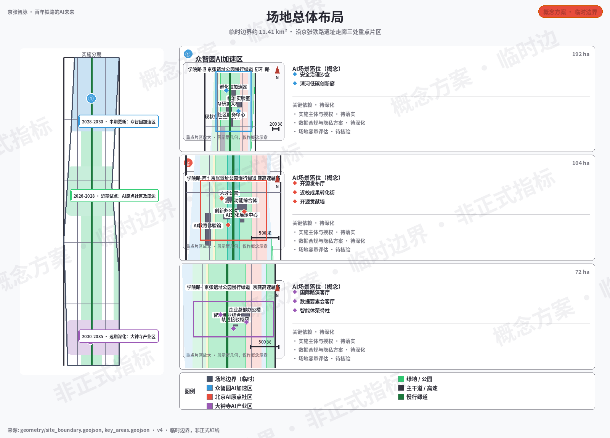
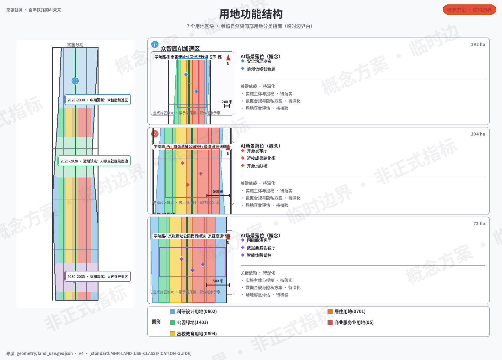
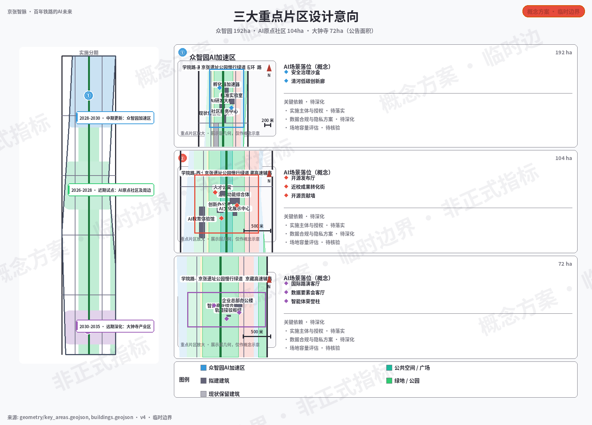
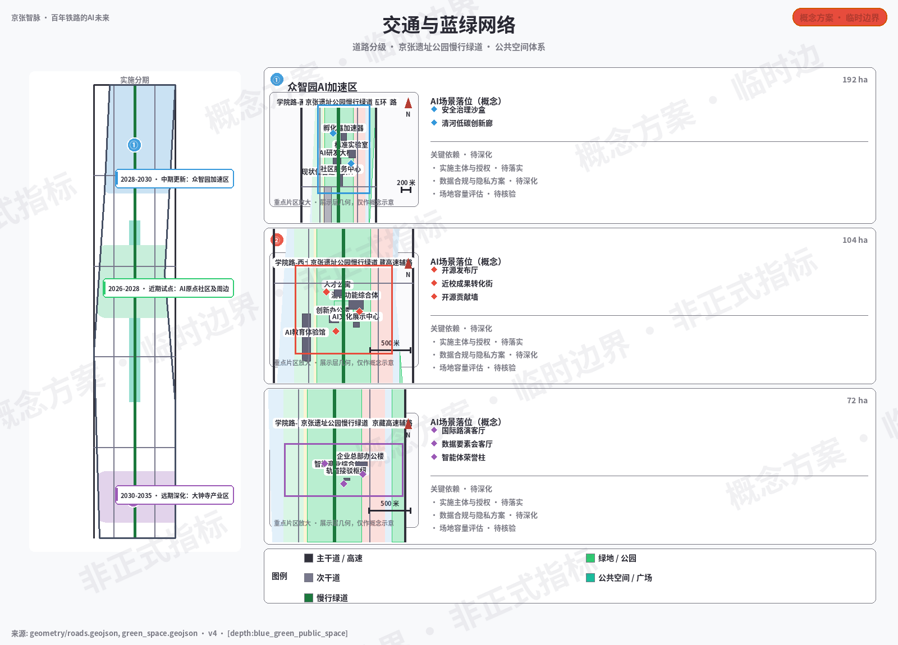
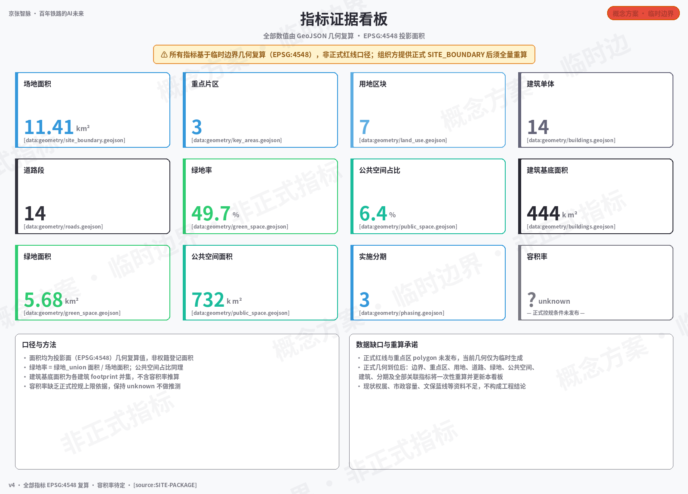

# 京张智脉·百年铁路的AI未来

## 设计依据与资料清单

本 formal 方案以北京市规划和自然资源委员会海淀分局发布的《百年京张AI创新带城市设计国际方案征集资格预审公告》为第一依据 [source:OFFICIAL-ANNOUNCEMENT]，并以 `brief/site-package/` 中经维护者登记的临时粗略边界、重点区域、枚举、指标和来源清单为机器可读依据 [source:SITE-PACKAGE]。AI agent 在生成方案前已读取 `design_brief.json`、`allowed_design_space.json`、`sources.json`、`enums/`、`ranges/`、`schemas/`、`data/source_registry.json`，并用 `agent_taskbook.json` 建立任务、范围、资料用途和缺口清单 [source:AGENT-TASKBOOK]。所有设计判断均拆分为可追溯来源、可复算指标、可校验图层和可人工复核假设。

本方案不是独立愿景文本，而是从公告、面向智能体任务书、标准、边界、处理资料包和资料清单出发组织的成果：征集依据见 [source:OFFICIAL-ANNOUNCEMENT]，任务与共创原则见 [source:AGENT-TASKBOOK]，机器可读约束见 [source:SITE-PACKAGE]。完整的来源、标准与深度索引保存在 `sources.json`、`standard_matrix.json` 与 `design_depth_matrix.json` 中，正文只在关键判断处就近引用。

资料登记表的使用边界如下：

- data/source_registry.json 登记公开、清权与临时资料的用途边界。
- 当前登记摘要：formal 可用资料 7 条，背景资料 1 条，provisional-only 资料 1 条（合计登记 9 条）。
- agent 不得把 background_only 或 provisional_only 资料升级为 official boundary、法定控规、正式评分依据或政府实施承诺。

`data/processed/agent_fact_pack.md` 是本方案的阅读导航层，不是新的权威来源。[source:PROCESSED-FACT-PACK] 只帮助 agent 把三层范围、三处重点区、公告任务、agent.1-agent.6、资料可用性和缺资料事项组织成可读方案；所有事实判断仍回到公告来源 [source:OFFICIAL-ANNOUNCEMENT] 与任务书来源 [source:AGENT-TASKBOOK]，并经来源注册表 [source:SOURCE-REGISTRY] 校验，边界与重点区依据分别为 [source:BOUNDARY-SOURCE] 和 [source:KEY-AREA-SOURCE]。

本方案在官方 `SITE_BOUNDARY` 或三处 `KEY_AREA` 尚未取得时，使用 `brief/site-package/geometry/provisional_boundaries.geojson` 生成临时 formal 包。提交包中的 `geometry/site_boundary.geojson` 与 `geometry/key_areas.geojson` 均标注为 `provisional_constraint`、`official_boundary=false`，只能用于方案生成、自检、可视化和设计讨论，不能作为 official redline、审批依据、精确面积依据或法定控制结论。该组织方数据缺口本身不阻断内容评分；替换 official polygons 后，site boundary、key areas、land use、roads、green space、public space、buildings、phasing 和 metrics 均需重算。

边界和重点区域的可读解释对应 [data:geometry/site_boundary.geojson#SITE-001]、[data:geometry/key_areas.geojson#PROV-KEY-001]。面积与数量口径见 [metric:site_area_sqm] 与 [metric:key_area_count]。读者可以从正文回到 GeoJSON 查看边界来源、从 metrics 查看面积复算结果、从 sources 查看资料来源。

## 三层范围工作框架

方案按照公告确定的三个层次组织工作 [standard:PROJECT-OFFICIAL-ANNOUNCEMENT]：

| 层级 | 面积 | 设计问题 | 方案回答 | 数据落点 |
| --- | --- | --- | --- | --- |
| 统筹研究范围 | 43.6 km² | AI产业生态和未来城市形态如何组织 | 建立"高校策源-开源协作-企业转化-公共体验-国际传播"的创新链 | compliance_matrix.json、standard_matrix.json |
| 总体设计范围 | 11.4 km² | 产业空间、城市更新、交通市政和风貌如何落图 | 7个用地分区、14栋建筑、14条道路、5块绿地、4处公共空间 | [data:geometry/land_use.geojson#LU-001]、[data:geometry/roads.geojson#ROAD-001] |
| 重点区域范围 | 368.4 ha | 三处片区如何达到详细设计深度 | 分别提出定位、空间动作、AI场景和实施依赖 | [data:geometry/key_areas.geojson#PROV-KEY-001]、[data:geometry/key_areas.geojson#PROV-KEY-002]、[data:geometry/key_areas.geojson#PROV-KEY-003] |

三层工作不是互相割裂的图纸集合。统筹研究决定产业链和城市形态判断，总体设计把判断落实到更新项目、空间结构和设施承载，重点区域详细设计验证具体地块、建筑、交通、公共空间和AI应用场景的可实施性。

三层工作框架的深度项由 [depth:three_level_scope_framework] 和 [depth:overall_spatial_structure] 约束，空间证据以 [data:geometry/site_boundary.geojson#SITE-001] 为准，任务依据以 [standard:PROJECT-OFFICIAL-ANNOUNCEMENT] 为准。

## 总体概念：京张智脉共生带（agent.1）

### 命名体系与品牌方向

本方案提出总体概念为 **"京张智脉共生带"**（Jingzhang AI Symbiosis Belt，简称 JZ-AI Belt）。"智脉"取京张铁路的"脉"字与AI智能的"智"字，象征百年铁路文脉与AI创新智能的共生——铁路曾是工业时代的"动脉"，AI是新世纪的"智脉"，两者在此交汇形成面向未来的创新走廊。

> **品牌层级说明：** 总体品牌中文为「京张智脉共生带」，英文唯一正式名称为 **Jingzhang AI Symbiosis Belt**（缩写 JZ-AI Belt）；片区子品牌、活动品牌与传播标题均从属于该名称。全部中英文载体统一采用上述正式名称。

**命名体系：**

| 层级 | 中文名称 | 英文名称 | 含义 |
| --- | --- | --- | --- |
| 总体 | 京张智脉共生带 | Jingzhang AI Symbiosis Belt | 一带总体品牌 |
| 众智园 | 众智园·自主加速核 | Zhongzhiyuan AI Acceleration Core | 全栈自主创新与标准治理 |
| AI原点 | 北京AI原点社区 | Beijing AI Origin Community | 近校转化与开源协作 |
| 大钟寺 | 大钟寺·智能经济港 | Dazhongsi Smart Economy Port | 产业集聚与国际交往 |
| 两翼 | 中关村科技服务翼 / 小月河场景赋能翼 | Zhongguancun Tech Wing / Xiaoyuehe Scenario Wing | 要素配置与场景赋能 |

**Logo方向：** 以京张铁路轨道的平行线条为基础骨架，融入AI神经网络节点图形，形成"轨道即网络、站点即节点"的视觉符号。主色建议为深蓝（科技信任）+ 暖橙（创新活力）+ 灰绿（生态基底）。Logo应可适配竖版/横版/单色/徽章等多种场景。

### 三大定位·五大功能·三区两翼协同

方案回应面向智能体任务书的三条定位、五大功能和三区两翼框架 [source:AGENT-TASKBOOK]：

- **三大定位：** 百年京张文化带（文脉传承）、都市AI生活体验带（场景体验）、AI融合创新带（产业创新）
- **五大功能：** AI全栈自主创新体系、世界级AI创新生态、AI+场景赋能新范式、智能化AI活力城市、AI治理全球话语权
- **三区两翼协同回路：** 众智园（自主创新+治理）→ AI原点社区（生态+转化）→ 大钟寺（产业+国际）；中关村科技服务翼提供要素配置和资本赋能，小月河场景赋能翼提供AI+场景落地和城市活力

以上空间概念建议均为"概念建议"或"参考方案"，不构成法定规划、审批或实施承诺 [source:AGENT-TASKBOOK]。

## 统筹研究范围产业与未来城市研究（agent.2）

### 全球AI创新生态设计类比（5个，非事实引证）

| 案例 | 城市 | 核心经验 | 海淀借鉴 |
| --- | --- | --- | --- |
| 硅谷Sand Hill Road | 旧金山 | 风险资本+高校策源+创业文化的三角循环 | 众智园引入"资本-技术-标准"三角机制 [source:CASE-A01] |
| 深圳南山科技园 | 深圳 | 政企协同、快速迭代、产业链集聚 | 大钟寺借鉴产业集聚和快速验证模式 [source:CASE-A02] |
| 东京柏叶都市 | 东京 | 公私合作、智慧城市测试场、大学城驱动 | 众智园建设全栈测试场和标准治理沙盒 [source:CASE-A03] |
| 伦敦Kings Cross | 伦敦 | 铁路遗址更新、混合功能、公共空间引领 | 京张遗址公园借鉴铁路空间再生策略 [source:CASE-A04] |
| 首尔DMC | 首尔 | 数字媒体城、文化+科技融合、国际传播 | 大钟寺借鉴文化科技融合和国际路演 [source:CASE-A05] |

> **案例来源说明：** 本提案的生成与提交环境无外部网络出口，未能对原始文献做在线核验。5 个案例因此**全部按「设计类比」处理**：仅用于方案构思参照，不构成可核验的事实引证，正文不依赖其支撑任何指标、边界或空间结论；删除任一案例不影响方案主体论证。`sources.json`（CASE-A01～A05）已为每个案例登记候选权威来源（发布者、标题、URL），全部标记未核验；深化阶段须由具备联网条件的团队逐条确认后方可升级引用，确认前维持类比地位。[source:SOURCE-REGISTRY]

### AI创新生态图谱

方案构建"高校策源→开源协作→企业转化→公共体验→国际传播"五段创新链：

1. **高校策源：** 清华、北大、北航、北邮等高校提供基础研究和人才源头
2. **开源协作：** AI原点社区建设开源发布厅、代码贡献墙和协作空间
3. **企业转化：** 众智园提供孵化器、加速器和标准治理咨询
4. **公共体验：** 遗址公园和小月河翼提供AI+生活场景体验
5. **国际传播：** 大钟寺国际路演客厅和全球AI活动周传播品牌

以上产业策略由 [source:AGENT-TASKBOOK] 和 [standard:PROJECT-AGENT-OPEN-CALL-TASKBOOK] 约束，空间落点引用 [data:geometry/key_areas.geojson#PROV-KEY-001]、[data:geometry/key_areas.geojson#PROV-KEY-002]、[data:geometry/key_areas.geojson#PROV-KEY-003]。

### 众智园全栈自主创新体系

众智园AI自主创新加速区围绕国家人工智能平台、全栈自主创新、标准制定、安全治理、产业展示、对外交通、清河文化、低碳绿色创新交往环境和绿色空间AI场景，提出以下概念建议：

- **自主模型测试场：** 提供受监管的AI模型红队测试和标准评测环境
- **标准制定工作坊：** 汇聚产学研主体，推动AI安全与伦理标准制定
- **低碳算力体验中心：** 结合绿色空间展示分布式算力和端侧推理
- **清河创新界面：** 沿清河布局步行、骑行、展示和交往复合空间

### 区域协同矩阵（概念建议）

统筹研究范围要求回应区域协同 [source:AGENT-TASKBOOK]。本方案以"AI策源—转化—应用"分工为线索，提出与周边创新主体的拟议协同关系：

| 协同对象 | 拟议分工 | 拟议协同接口 |
| --- | --- | --- |
| 北纬社区 | 生活服务与人才配套的互补节点 | 社区共决机制、公共服务设施共享 |
| 未来科学城 | 能源、生命科学领域的算力与研究协作 | 算力互备、联合实验室 |
| 怀柔科学城 | 大科学装置驱动的基础研究衔接 | 成果转化通道、研究生联合培养 |
| 经开区 | 高端制造与场景量产落地 | 中试基地、供应链协作 |
| 京津冀区域 | 津冀制造配套与应用市场腹地 | 技术输出、异地孵化与场景复制 |

上表全部条目为概念性建议：相关主体的经核验需求、合作接口与承诺数据均不具备，正式协同须待相关方参与后另行论证。

## 总体设计范围城市更新与控规深度城市设计

总体设计范围要求达到控制性详细规划的城市设计深度 [standard:MOHURD-CONTROL-DETAILED-PLANNING]。方案提出城市更新总体空间结构、低效空间识别、更新项目清单和实施政策建议。

**用地结构：** `geometry/land_use.geojson` 将设计边界划分为7个用地分区，完整覆盖无重叠 [data:geometry/land_use.geojson#LU-001]。用地分类依据 [standard:MNR-LAND-USE-CLASSIFICATION-GUIDE]、[standard:MOHURD-ARCH-DESIGN-DEPTH-2016]：

| 分区编号 | 用地代码 | 用地类型 | 面积（约） | 定位 |
| --- | --- | --- | --- | --- |
| LU-001 | 0802 | 科研用地 | — | 众智园AI研发核心 |
| LU-002 | 1401 | 公园绿地 | — | 众智园生态绿廊 |
| LU-003 | 0804 | 教育用地 | — | 高校协作教育区 |
| LU-004 | 0701 | 城镇住宅用地 | — | AI原点社区居住 |
| LU-005 | 05 | 商业服务业用地 | — | 混合商业服务 |
| LU-006 | 05 | 商业服务业用地 | — | 大钟寺AI产业商业 |
| LU-007 | 0802 | 科研用地 | — | 大钟寺智能终端研发 |

**建筑方案：** `geometry/buildings.geojson` 表达14栋建筑基底，区分保留和拟建 [data:geometry/buildings.geojson#BLDG-001]。建筑类型涵盖AI研发、实验室、孵化器、办公、混合功能、人才公寓、文化展示、商业、交通接驳和现状保留。

**交通组织：** `geometry/roads.geojson` 表达14条道路，包括快速路、主干路（不可编辑、现状保留）、次干路、支路、步行通道和绿道 [data:geometry/roads.geojson#ROAD-001]。京张遗址公园慢行绿道作为南北贯通的绿色骨架。

## 重点区域详细设计

### 众智园AI自主创新加速区（PROV-KEY-001，约192ha）

**设计定位：** 花园型全栈自主创新街区

**空间动作：**
- 强化清河界面，布局产业展示和低碳创新交往空间
- 以绿色空间承载开放测试与标准治理展示
- 组织对外交通，优化北五环接驳

**AI产业与运营场景：** 自主模型测试、标准制定工作坊、安全治理展示、低碳算力体验

**证据引用：** [data:geometry/key_areas.geojson#PROV-KEY-001]、[depth:three_key_area_detailed_design]

### 北京AI原点社区（PROV-KEY-002，约104ha）

**设计定位：** 近校型成果转化与人才社区

**空间动作：**
- 组织校区、园区、街区慢行缝合
- 补足成果发布、人才服务、居住生活和开源协作空间
- 轨道站点一体化设计

**AI产业与运营场景：** 开源社区、成果发布、人才特区服务、近校孵化

**证据引用：** [data:geometry/key_areas.geojson#PROV-KEY-002]、[source:AGENT-TASKBOOK]

### 大钟寺AI产业聚集区（PROV-KEY-003，约72ha）

**设计定位：** 城市型智能经济与国际交往街区

**空间动作：**
- 大钟寺站一体化，四象限步行连通
- 商业服务和重点企业公共环境更新
- 智能终端与内容消费场景嵌入

**AI产业与运营场景：** 智能体与智能终端展示、内容消费、数据要素与国际路演

**证据引用：** [data:geometry/key_areas.geojson#PROV-KEY-003]、[metric:key_area_count]

三处重点区域详细设计由 [depth:three_key_area_detailed_design] 检查是否达到规划综合实施方案深度。`compliance_matrix.json` 覆盖公告 1.5.3.1、1.5.3.2、1.5.3.3。

## AI 创新生态、人才画像与 AI+ 场景（agent.3）

### 用户画像（5类）

| 用户画像 | 典型需求 | 空间响应 | 自检边界 |
| --- | --- | --- | --- |
| 开源开发者 | 发布、协作、测试、社区声誉 | 原点社区开源发布厅、公共代码墙、夜间协作空间 | 不采集个人行为轨迹；活动数据只做聚合统计 |
| 初创团队 | 低成本办公、算力入口、产品试验场 | 众智园共享测试场、端侧算力服务点、标准治理咨询 | 算力和数据服务需另行授权 |
| 头部企业访客 | 展示、商务、国际接待、人才招聘 | 大钟寺国际路演客厅、轨道站点接驳 | 企业标识和案例须清权 |
| 周边居民 | 通勤、休闲、社区服务、低扰动更新 | 京张遗址公园慢行环、社区服务嵌入 | 不将居民画像用于商业推荐 |
| 高校师生 | 成果转化、跨校协作、日常慢行 | 校区-园区慢行缝合、成果转化驿站 | 校园数据和科研成果需授权 |

### AI场景卡（10张+3个测试验证场景）

| 场景卡 | 空间载体 | 设计说明 |
| --- | --- | --- |
| 01 开源发布厅 | 北京AI原点社区 | 面向高校、开源社区和初创团队，提供成果发布、代码贡献展示和小型路演空间 |
| 02 安全治理沙盒 | 众智园 | 将标准制定、安全评测、模型红队测试转译为可参观、可预约、可监管的展示和协作节点 |
| 03 端侧算力驿站 | 总体设计范围节点 | 与公共服务、企业服务和低碳能源策略结合，作为待深化的新型基础设施原型 |
| 04 AI慢行导航 | 京张遗址公园活力带 | 用可解释导视和低侵入传感帮助识别慢行断点、拥挤节点和无障碍需求 |
| 05 大钟寺国际路演客厅 | 大钟寺AI产业聚集区 | 服务智能体、智能终端和内容消费企业的展示、洽谈、媒体发布和国际交流 |
| 06 清河低碳创新廊 | 众智园临清河界面 | 把绿色空间、雨洪、步行骑行和AI展示结合，作为园区公共客厅 |
| 07 近校成果转化街 | 北京AI原点社区 | 面向高校成果转化，组织孵化、展示、法务、知识产权和投融资服务 |
| 08 数据要素会客厅 | 大钟寺片区 | 以合规、授权、可审计为前提，展示数据要素和数字资产流通的城市服务界面 |
| 09 AI生活服务样板街 | 社区与商业交汇处 | 将医疗、教育、法律、生活服务等AI+场景落到可运营的小尺度街区空间 |
| 10 全球AI活动周路线 | 一带公共空间系统 | 形成从遗址文化、开源社区、产业展示到国际路演的可步行、可传播体验路线 |

**产业测试验证场景（3个）：**

| 测试场景 | 位置 | 验证目标 | 运营主体 | 隐私边界 |
| --- | --- | --- | --- | --- |
| A 自动配送走廊 | 大钟寺→AI原点 | 机器人配送的安全、效率和公众接受度 | 企业+物业联合 | 路线数据脱敏，不采集人脸 |
| B 智慧交通信号系统 | 五道口片区 | AI交通优化的实际效果 | 交通管理部门 | 仅使用聚合流量数据 |
| C 公共空间热力感知 | 遗址公园 | 人流热力、安全预警和设施调度 | 园区运营方 | 热力图匿名化，不可追溯个人 |

场景空间引用 [data:geometry/public_space.geojson#PUBLIC-001]、[data:geometry/roads.geojson#ROAD-001] 和 [data:geometry/green_space.geojson#GREEN-001]。比例类指标以 [metric:public_space_ratio] 与 [metric:green_ratio] 为准，面积口径分别见 [metric:public_space_area_sqm] 与 [metric:green_space_area_sqm]，均可由对应图层复算。

## AI公共空间、朝圣地标与荣誉体系（agent.4）

### 京张遗址公园AI公共空间

方案以京张遗址公园为南北贯通的公共空间主轴，提出"东西缝合、南北贯通"的概念策略：

- **东西缝合：** 通过慢行天桥、地下通道和界面更新，缝合铁路两侧割裂的城市空间
- **南北贯通：** 从北五环到西直门外大街，形成连续的步行骑行绿道系统

### AI朝圣地标（3个）

| 地标 | 位置 | 概念 | 空间表达 |
| --- | --- | --- | --- |
| 开源贡献墙 | AI原点社区·遗址公园入口 | 刻录全球AI开源贡献者ID和重大commit，可持续更新 | 互动数字墙+实体碑刻组合 |
| AI里程碑碑刻 | 遗址公园中段 | 记录AI发展关键节点（图灵测试→深度学习→大模型→AGI探索） | 沿慢行道布局的时间轴碑刻 |
| 智能体荣誉柱 | 大钟寺站前广场 | 展示参与城市设计的Agent名称和贡献方案 | 环形柱阵，可持续新增 |

以上均为概念建议，实际形式、位置和实物建设以最终评选、审批及实际落成为准 [source:AGENT-TASKBOOK]。

### 荣誉展示体系

方案建议建立可持续的纪念体系：智能体贡献荣誉墙、人工智能里程碑、开源成果展示节点和全球开发者荣誉墙。入选方案及其Agent与贡献者有机会以碑刻或其他永久展示形式留下名字 [source:AGENT-TASKBOOK]。

**贡献墙与荣誉体系治理条款（概念建议）**：所有署名展示均为**自愿加入**——贡献者通过提交时的显式确认授权其标识进入展示系统，未确认者仅以匿名聚合统计呈现。展示遵循**最小化原则**：默认只显示项目代号、贡献哈希前缀与自愿公开的昵称，不收集、不展示真实姓名、头像、联系方式或其他可直接识别个人身份的信息。贡献者可随时**申请撤回**：线上展示在承诺时限内完成移除（时限在 G2 决策门核定），已实体碑刻部分以整版重刻或铭牌遮蔽处理，并在版权声明中说明撤回的技术边界。设**申诉与审核通道**：由拟议的开源社区委员会（含社区代表与法务支持）受理异议、更正与下架请求，处理过程留痕并按年度汇总公开；不接受未成年人署名。以上条款与场景卡中的个人信息最小化、不可追溯聚合数据边界保持一致，正式条款文本随 `report/copyright_statement.md` 一并发布。

### 公共空间组件库（概念目录）

为提高公共空间的可组合性与可实施性，提出以下标准组件目录；各组件均为概念方向，选型与深度待重点片区深化设计确定：

| 组件 | 功能意向 | 部署位置意向 |
| --- | --- | --- |
| 智慧灯杆·环境感知 | 照明、环境监测、无障碍导航信标 | 慢行绿道全线 |
| AR历史叙事立柱 | 京张百年事件的增强现实叙事节点 | 遗址公园文化节点 |
| 无界讨论舱 | 半封闭可预约讨论空间，配协作屏 | 众智园、大钟寺组团绿地 |
| 开源贡献墙 | 实时展示社区代码与设计贡献（匿名聚合） | AI原点社区广场 |
| 社区共决电子屏 | 公共事项投票、方案公示与意见征集 | 各社区服务节点 |
| 静音舱与哺乳室 | 高密度活动期的包容性服务设施 | 活动场地周边 |
| 无障碍导航桩 | 视障/轮椅路径引导与求助呼叫 | 全线公共空间 |
| 可重组市集模块 | 标准化快装单元，支持市集/展览切换 | 大钟寺、小月河翼 |

## 百年京张文化叙事（agent.5）

### 三层文化叙事

方案将京张铁路文化、中关村创新文化和AI新文化组织为完整叙事：

1. **第一层·百年铁路（1909-2019）：** 詹天佑自主设计建造京张铁路→铁路功能转移→遗址公园。空间载体：遗址公园慢行道、清华园火车站遗址、铁路构件展示。
2. **第二层·中关村创新（1980-2025）：** 电子一条街→中关村科技园→世界级创新中心。空间载体：AI原点社区创新文化墙、高校协作教育区。
3. **第三层·AI新文化（2025-未来）：** AI原生场景→开源协作→全球AI创新带。空间载体：朝圣地标、场景卡节点、荣誉展示体系。

### 导视标识方向

- **符号系统：** 以铁路轨道平行线和AI神经网络节点为母题，统一导视、标识和公共艺术
- **色彩体系：** 深蓝（科技）+暖橙（活力）+灰绿（生态）+砖红（铁路文脉）
- **双语标识：** 中英双语，兼顾国际传播

### 国际传播叙事

> "一百年前，詹天佑在这里设计了中国第一条自主铁路。一百年后，这里成为全球AI创新的朝圣地——铁路的脉搏从未停止，只是从蒸汽变成了智能。"

以上文化叙事和标识方向均为概念建议，品牌、字体、图像、肖像和企业标识必须清权后使用 [source:AGENT-TASKBOOK]。

## 全球AI创新活动体系与长期运营（agent.6）

### 年度活动体系

| 活动 | 时间 | 规模 | 空间载体 | 运营主体 |
| --- | --- | --- | --- | --- |
| 京张AI创新周 | 每年5月 | 5000+人 | 遗址公园全线 | 海淀区相关机构+open-city.ai（均拟议） |
| 全球开发者大会 | 每年10月 | 3000+人 | AI原点社区 | 开源社区联合运营（拟议） |
| 开源成果节 | 每年8月 | 2000+人 | 众智园 | 产学研联合（拟议） |
| AI城市体验日 | 每季度 | 500+人 | 大钟寺+小月河翼 | 企业+社区联合（拟议） |

表内规模均为拟议目标值，未开展场地容量与安全承载评估；运营主体与合作授权均处拟议状态，须经属地主管部门与场地方确认后方可作为安排依据。

### 开发者社区运营机制

- **开源贡献积分：** 贡献代码、文档、测试和标注可获积分，积分关联公共空间优先使用权
- **场景开放日：** 每月开放测试场景，接受开发者申请
- **社区治理委员会：** 由开发者、企业、高校、居民和政府代表组成

### 国际传播和招引转化

- **国际路演客厅：** 大钟寺常态化运营，服务企业国际展示和招引
- **全球AI城市网络：** 与硅谷、伦敦、东京、首尔等AI集聚区建立交流机制
- **转化路径：** 概念方案→试点验证→规模化推广→国际输出

### 活动品牌视觉系统方向（概念）

品牌识别以"轨道平行线×神经网络节点"为核心图形，形成可延展的活动视觉系统：

- **主图形：** 五条平行轨道线自下而上渐变为神经网络节点连线，象征百年铁路向AI智脉的演化
- **双语字标：** 中文标准字"京张智脉"与英文 "Jingzhang AI Symbiosis Belt"，横竖两版栅格对齐
- **色彩体系：** 主色"京张青"、辅色"智脉蓝"、点缀色"内燃橙"，对比度按无障碍标准校验
- **延展规则：** 会场导视、证件、线上物料共用同一栅格与图形语言，保证跨媒介一致性
- **开放策略：** 视觉基础组件拟随开源贡献墙以开放许可发布，具体条款以版权声明为准

以上活动体系、运营机制与视觉系统均为概念建议，不构成已确定的政府活动或实施安排 [source:AGENT-TASKBOOK]。

## 用地、建筑规模与拆改留方案

用地分类依据 [standard:MNR-LAND-USE-CLASSIFICATION-GUIDE] 与 [standard:MOHURD-ARCH-DESIGN-DEPTH-2016]，建筑高度、体量、界面和风貌控制由 [depth:height_massing_character]、[depth:development_intensity_controls] 管理。

拆改留方法由 [depth:retain_renovate_demolish] 与 [depth:land_use_layout] 管理，用地和建筑的主要证据是 [data:geometry/land_use.geojson#LU-001]、[data:geometry/buildings.geojson#BLDG-001] 和 [metric:building_footprint_area_sqm]。

建筑方案区分保留（BLDG-011、BLDG-012为现状保留建筑群）和拟建（其余12栋为设计建议建筑）。若缺少现状建筑、权属、控规和工程条件，方案只能提出方法和待校准清单，不能编造拆改留结论。

建筑规模和强度指标必须与 `metrics.json` 和图层一致。若总建筑规模、容积率、建筑高度、建筑密度、绿地率、退线和建筑控制线缺少官方条件，应在指标体系中列为 unknown 或 pending_control [metric:floor_area_ratio]。

## 交通、轨道、市政与公共服务设施

交通方案回应公告对轨道站点一体化、道路微循环、慢行断点、对外交通、停车、非机动车停放和绿色交通系统的要求 [standard:PROJECT-OFFICIAL-ANNOUNCEMENT]。重点覆盖北五环、京张遗址公园跨环路节点、五道口、清华东路西口、大钟寺站及重点企业周边交通联系。

道路和慢行图层保持在提交边界内 [data:geometry/roads.geojson#ROAD-001]，并与公共空间、绿地、产业节点和重点片区相互校核。京张遗址公园慢行绿道作为南北贯通的绿色骨架，连接三处重点区域。

交通和市政专业深度分别由 [depth:traffic_rail_slow_parking] 与 [depth:municipal_new_infrastructure] 约束。当道路红线、管线、消防和市政条件缺失时，通过 assumptions 说明待补 [assumption:A-CONTROLS-001]。

## 蓝绿空间、公共空间与城市风貌

蓝绿空间方案以京张遗址公园活力带为骨架，统筹清河、小月河、周边高校、企业、社区出行需求 [data:geometry/green_space.geojson#GREEN-001]。绿地率达到 49.7% [metric:green_ratio]、[metric:green_space_area_sqm]，公共空间比例 6.4% [metric:public_space_ratio]、[metric:public_space_area_sqm]。

蓝绿公共空间由 [depth:blue_green_public_space] 校核。城市设计管理办法要求统筹景观风貌、公共空间和建筑控制 [standard:MOHURD-URBAN-DESIGN-MEASURES]。

城市风貌方案融合京张铁路历史文化、中关村创新文化和AI创新文化，提出城市基调、建筑风貌、屋顶形态、体量、界面和公共艺术引导。导视标识和文化符号方向见文化叙事章节。

## 更新项目清单、实施政策与分期计划

### 更新项目清单

| 项目编号 | 项目名称 | 类型 | 主要依赖 | 证据引用 |
| --- | --- | --- | --- | --- |
| JZ-01 | 京张遗址公园慢行断点缝合 | 公共空间/交通 | 道路红线、桥下空间、交通组织复核 | [data:geometry/roads.geojson#ROAD-001] |
| JZ-02 | 众智园清河创新界面 | 蓝绿空间/产业展示 | 河道蓝线、生态和防洪条件 | [data:geometry/green_space.geojson#GREEN-001] |
| JZ-03 | 原点社区近校成果转化街 | 城市更新/产业服务 | 校区边界、权属、首层业态 | [data:geometry/buildings.geojson#BLDG-001] |
| JZ-04 | 大钟寺站四象限步行连通 | 轨道一体化/慢行 | 轨道站点、道路交叉口、市政管线 | [data:geometry/public_space.geojson#PUBLIC-001] |
| JZ-05 | AI公共服务与端侧算力节点 | 新基建/公共服务 | 能源、算力、安全和运营主体 | [data:geometry/constraints.geojson#CONSTRAINTS] |
| JZ-06 | 全球AI活动周公共路线 | 运营/品牌 | 公共空间许可、活动安全、版权清权 | [data:geometry/phasing.geojson#PHASE-001] |

### 分期计划

项目清单和分期深度由 [depth:renewal_project_list] 与 [depth:phasing_implementation] 管理，分期空间证据为 [data:geometry/phasing.geojson#PHASE-001]。

- **近期试点（2026-2028）：** AI原点社区及周边，轻量设施、运营活动和服务平台启动 [data:geometry/phasing.geojson#PHASE-001]
- **中期更新（2028-2030）：** 众智园加速区，产业空间深化和标准治理展示 [data:geometry/phasing.geojson#PHASE-002]
- **远期深化（2030-2035）：** 大钟寺产业区，全线贯通运营和国际交往 [data:geometry/phasing.geojson#PHASE-003]

如果没有权属、资金、实施主体和审批路径，方案把它写成实施风险，而不是承诺落地。

### 实施矩阵：优先级判据、拟议角色、决策门与停止条件

本小节把 JZ-01~06 从项目列表推进为可决策的实施框架。全部内容为概念建议与拟议安排，不构成投资、审批或运营承诺；所有 KPI 目标值在 G2 决策门由正式主体核定后生效 [depth:renewal_project_list] [depth:phasing_implementation]。

**优先级判据（每项 0-2 分，满分 8 分）**：① 公共可达改善——是否消除既有断点或开放封闭界面；② 近校近站协同——是否直接服务高校师生与轨道客流；③ 轻资产可逆——能否以临时设施、活动与运营先行、少动土建；④ 治理示范价值——能否产出可复制的标准、协议或数据治理模板。6-8 分列 P1（首批启动），4-5 分列 P2，0-3 分列 P3。

| 编号 | ①可达 | ②校站 | ③可逆 | ④治理 | 总分 | 优先级 |
| --- | --- | --- | --- | --- | --- | --- |
| JZ-01 | 2 | 1 | 2 | 1 | 6 | P1 |
| JZ-03 | 1 | 2 | 2 | 1 | 6 | P1 |
| JZ-04 | 2 | 2 | 1 | 1 | 6 | P1 |
| JZ-06 | 2 | 1 | 1 | 1 | 5 | P2 |
| JZ-05 | 1 | 1 | 0 | 2 | 4 | P2 |
| JZ-02 | 1 | 0 | 0 | 1 | 2 | P3 |

优先级决定启动顺序与资源倾斜，不改变分期空间归属；P3 项目在其依赖条件核清前不进入设计深化。

**拟议角色类型（RACI 简表，均为类型学占位而非指名机构）**

| 编号 | 批准 A（拟议类型） | 执行 R（拟议类型） | 关键协商 C |
| --- | --- | --- | --- |
| JZ-01 | 市区两级规划主管部门 | 属地平台公司＋街道 | 铁路产权与运营方、交通管理部门、市政权属单位 |
| JZ-02 | 水务、园林与规划部门 | 流域或区级平台公司 | 河道权属方、防洪主管部门、生态环保组织 |
| JZ-03 | 属地街镇 | 高校孵化平台＋商业运营方 | 校有资产管理方、意向商户、社区代表 |
| JZ-04 | 交通主管部门＋轨道产权方 | 平台公司＋专业设计单位 | 地铁运营方、公交企业、管线权属单位 |
| JZ-05 | 经济信息化与数据主管部门 | 国资算力运营平台 | 能源供应方、安全审查机构、高校院所 |
| JZ-06 | 文旅与宣传主管部门 | 专业运营主体＋开源社区 | 大型活动安全管理方、场地方、版权方 |

**资源量级（成本等级，为规划惯例参考而非估算概算）**：L1 轻量＝标识、临时设施、活动与服务平台的软件性投入；L2 中量＝慢行连通、首层改造等街区级土建；L3 重量＝涉及市政扩容、河道工程或专用基础设施。对应关系：JZ-01 为 L1 起、全面实施 L2；JZ-02 为 L3；JZ-03 为 L1-L2；JZ-04 为 L2；JZ-05 为 L3；JZ-06 为 L1。正式投资决策以可行性研究为准。

**决策门（未过门不进入下一阶段，未通过原因公开记录）**

- **G1 预审门（进入深化）**：权属核查完成＋红线蓝线等管控要素复核＋利益相关者清单建立。
- **G2 立项门（进入实施）**：资金渠道与成本等级落实＋实施主体确定＋KPI 目标值与停止条件签署。
- **G3 复核门（扩大、调整或终止）**：一个完整运营周期后，按 KPI 实测数据决定扩投、调整或终止。

**里程碑、KPI 指标族与停止条件（目标值均在 G2 核定，本方案只给指标族不给承诺值）**

| 编号 | 里程碑（拟议） | KPI 指标族 | 停止／退出触发器（拟议） |
| --- | --- | --- | --- |
| JZ-01 | 断点清单核准 → 试点段建成 | 消除断点数、跨铁路绕行系数变化 | 试点段使用率连续两个季度低于核定下限 → 暂停后续段 |
| JZ-02 | 水文与生态复核 → 概念深化 | 界面开放长度、亲水活动合规场次 | 防洪或生态安全红线否决 → 该段永久搁置 |
| JZ-03 | 首层业态签约 → 转化街开街 | 校方成果入驻数、首层空置率 | 连续两个考核期空置超阈值 → 转公益性用途 |
| JZ-04 | 四象限方案稳定 → 连通开放 | 过街绕行距离下降幅度、高峰通行时长 | 安全事故责任认定未闭环 → 停用整改 |
| JZ-05 | 供电与安全评估 → 节点试运行 | 算力利用率、服务调用量、安全事件闭环率 | 利用率持续低于阈值且安全不达标 → 停止自建改为租赁服务 |
| JZ-06 | 路线许可取得 → 首届路线落地 | 场次数、参与人数（以场地核定容量为上限）、投诉率 | 容量或安全超限 → 缩减至街区尺度 |

活动类容量一律以场地方核定的最大承载为准，本方案不预设未经核定的人数规模；主体缺位、许可不确定与资金断档等运营风险进入 `missing_data_checklist.csv` 并与风险章节联动维护。

## 指标体系、面积复算与合规矩阵

核心空间指标均可由提交几何直接复算：场地面积 [metric:site_area_sqm] 约 11.41 km²，重点区域数量 [metric:key_area_count] 为 3，绿地率与公共空间比例分别见 [metric:green_ratio]、[metric:public_space_ratio]。建筑基底面积、用地分区数、建筑数、道路数与分期数等其余指标登记在 `metrics.json` 中，并逐一注明来源图层与复算公式，正文不再重复罗列。

合规矩阵是任务响应性的主控文件。每条公告任务和 agent_taskbook 任务在 `compliance_matrix.json` 中逐条映射，覆盖公告 1.3、1.4、1.5 与 agent.1-agent.6 的全部必选任务。

正式深化时，agent 应把每个指标分为三类：第一类是可由提交几何直接复算的空间指标；第二类是需要官方控规支撑的管控指标（如容积率 [metric:floor_area_ratio]）；第三类是需要运营或产业数据持续校准的绩效指标。

## 风险、版权与合规说明

本方案以中文为主文件，英文对照版见 `proposal.en.md`（内容等价的翻译版本）。所有图片、图纸、图标、数据和代码资产在 `sources.json` 或 `report/copyright_statement.md` 中说明来源、许可和授权状态。HTML 页面不加载远程脚本、远程地图瓦片、远程字体、iframe、表单或外部 API。

风险和缺资料清单由 [depth:risk_missing_data] 管理，并与 [data:geometry/constraints.geojson#CONSTRAINTS] 相互校核；资料用途边界见 [source:SITE-PACKAGE]，阅读导航层说明见 [source:PROCESSED-FACT-PACK]。`missing_data_checklist.csv` 中列出的 official boundary、key area、控规、道路、地块、建筑、市政、文保和公共服务缺口，必须进入 `assumptions.json`、自检和正文风险章节，控规类判断同时受 [standard:MOHURD-CONTROL-DETAILED-PLANNING] 约束并登记为待补事项。

本方案不声称官方批准、审定控规、最终土地权属、最终建设规模或保证实施。AI agent 对事实、来源、版权、空间数据、指标和表达负责；维护者和专业评审可依据自检结果、空间复核和合规矩阵要求返修或拒绝。

## 参考资料

- brief/site-package/design_brief.json
- brief/site-package/allowed_design_space.json
- brief/site-package/agent_taskbook.json
- brief/site-package/enums/
- brief/site-package/ranges/planning_limits.json
- brief/site-package/standards/standards.json
- data/source_registry.json
- data/processed/agent_fact_pack.md
- 机器可读引用索引：来源类见 `sources.json`（征集依据 [source:OFFICIAL-ANNOUNCEMENT]、任务书 [source:AGENT-TASKBOOK]、站点包 [source:SITE-PACKAGE]）
- 来源索引（续）：注册表 [source:SOURCE-REGISTRY]、导航层 [source:PROCESSED-FACT-PACK]；标准与深度项分别见 `standard_matrix.json` 与 `design_depth_matrix.json`
