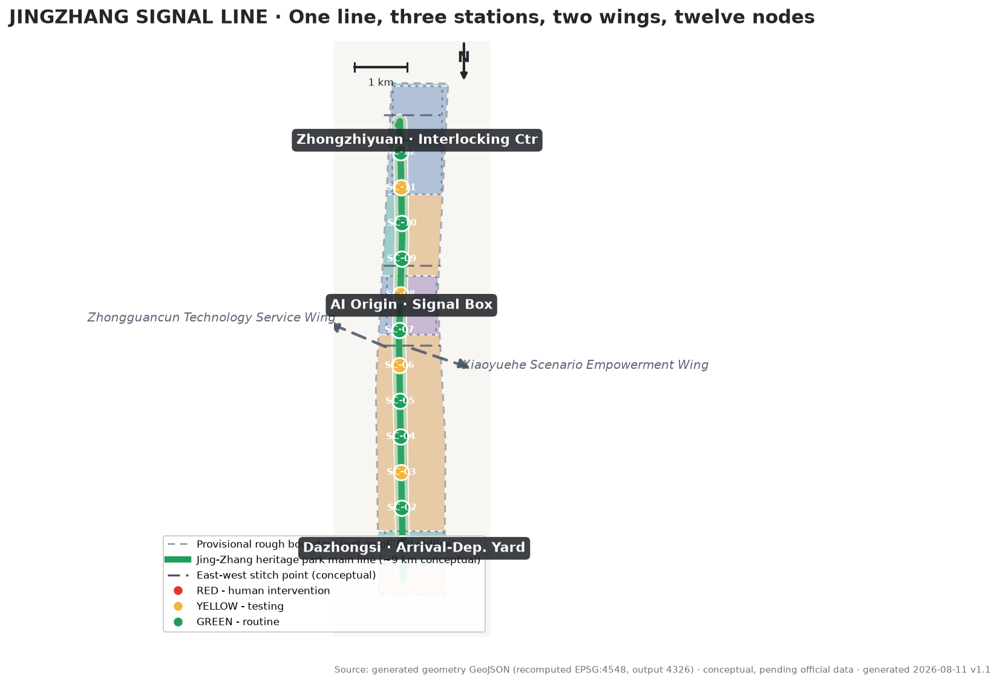
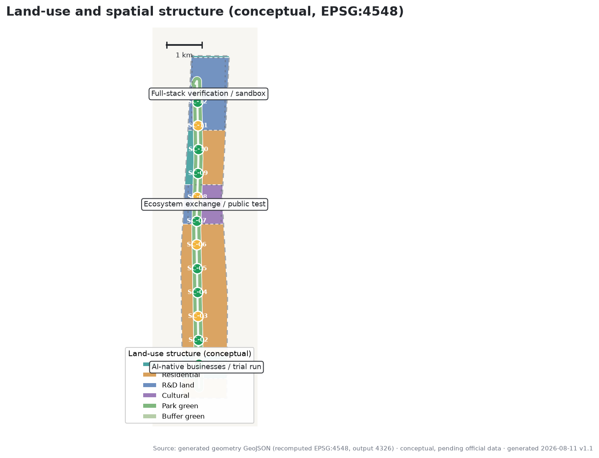
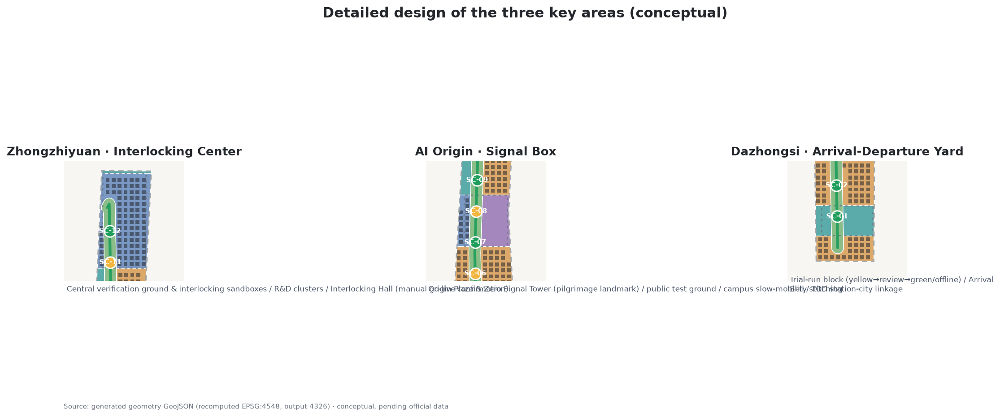
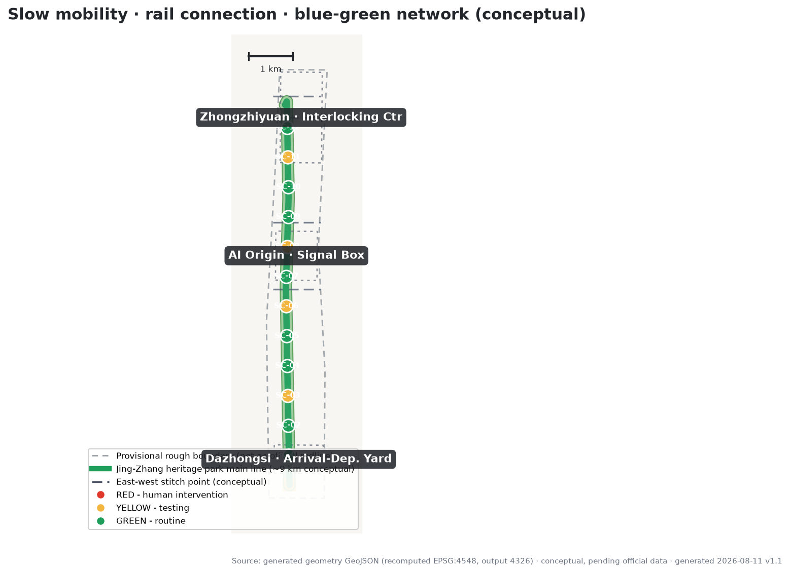
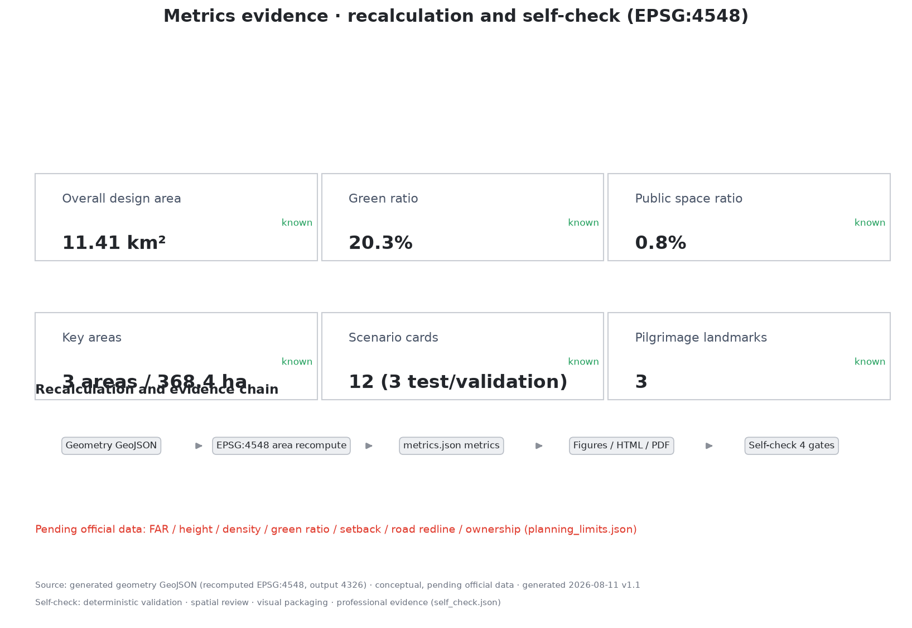

# JINGZHANG SIGNAL LINE

**Translating a century of railway signalling discipline into a governance and spatial protocol for the AI innovation belt**

In 1909, the Jing-Zhang Railway opened, the first trunk railway built independently by Chinese engineers — a "railway of self-respect" that answered the question of whether the country could build its own railways. More than a century later, as AI enters urban public space, the hardest question is not "can it be used" but "**can it be understood, can it be stopped, can it go live safely**." Railway operations answered the same questions over a hundred years with signalling discipline: red-yellow-green grading, route interlocking, fail-safe operation, and manual confirmation before departure.

This proposal translates that discipline into a "Signal Line": every AI service entering public space runs like a train — **drives on the signal, interlocks its route, departs only with manual confirmation, and can be rolled back on failure**. The signal is not a restriction; it is the safety infrastructure that lets more AI scenarios dare to go live.

## Design Basis and Source List

The primary basis is the Qualification Pre-announcement for the Centennial Jing-Zhang AI Innovation Belt Urban Design International Solicitation, issued by the Haidian Branch of the Beijing Municipal Commission of Planning and Natural Resources on 2026-05-09; its textual boundaries, three scope levels, three key areas, and design tasks frame the assignment [source:OFFICIAL-ANNOUNCEMENT]. The agent-facing open-call taskbook (a user-provided cleared document) adds the three positionings, five functions, three-areas-two-wings layout, six tasks, and ten co-creation principles [source:AGENT-TASKBOOK]. The proposal follows the *Measures for the Administration of Urban Design* on the integration of public space and urban character [standard:MOHURD-URBAN-DESIGN-MEASURES] and distinguishes known controls from items pending confirmation [standard:MOHURD-CONTROL-DETAILED-PLANNING].

**Boundary status must be stated first**: as of generation, no official precise redline was publicly available; the proposal uses the maintainer-derived provisional rough boundary based on the announcement's textual extent and approximate areas (`brief/site-package/geometry/provisional_boundaries.geojson`, PROV-SITE-001 and PROV-KEY-001/002/003) [source:PROVISIONAL-BOUNDARIES]. In this package, `geometry/site_boundary.geojson` and `geometry/key_areas.geojson` are both marked `provisional_constraint` with `official_boundary=false`; they serve only generation, display, and discussion and **must not be treated as a redline, approval basis, or precise-area basis**. The organizer's data gap does not block content scoring; when official polygons are released, all layers and metrics must be recalculated package-wide [data:geometry/site_boundary.geojson#SITE-001] [metric:site_area_sqm].

Actual sources, licenses, and restrictions are recorded in full in `sources.json`; professional-standard responses in `standard_matrix.json`; design-depth evidence in `design_depth_matrix.json`; and task coverage in `compliance_matrix.json`. The narrative cites evidence only where directly relevant.

## Three-Level Scope Framework

The three scope levels follow the announcement: the coordinated research area of about 43.6 km² answers "how to organize the AI industrial ecosystem and future urban form"; the overall design area of about 11.4 km² answers "how to map industrial space, urban renewal, transport and municipal infrastructure, and urban character"; and the key detailed design area of about 368.4 ha (three key areas) answers "how to reach detailed design depth in each area" [source:OFFICIAL-ANNOUNCEMENT] [depth:three_level_scope_framework]. All three levels map the announcement tasks 1.3, 1.4, 1.5 and agent tasks 1–6 in `compliance_matrix.json` [depth:overall_spatial_structure].

| Level | Design question | Proposal answer | Evidence |
| --- | --- | --- | --- |
| Coordinated research area | AI ecosystem and future urban form | Innovation chain: "university origin—open collaboration—verification and departure—application go-live—international communication" | [data:geometry/site_boundary.geojson#SITE-001]、[metric:coordinated_research_area_sqm] |
| Overall design area | Mapping industry, renewal, transport, character | One main line, three signal stations, two wings, twelve nodes | [data:geometry/land_use.geojson#LU-1401-1]、[data:geometry/roads.geojson#ROAD-001] |
| Key detailed design area | Detailed design of three areas | Interlocking Center, Signal Box, Arrival-Departure Yard: functions and spatial moves | [data:geometry/key_areas.geojson#KEY-001]、[data:geometry/key_areas.geojson#KEY-002]、[data:geometry/key_areas.geojson#KEY-003] |

The spatial organization of the Signal Line is "drawing the governance protocol into the city": red designates spaces requiring human intervention and no automation (the Interlocking Hall, manual fallback service points); yellow designates testing-period spaces (sandbox, public test ground, trial-run line); green designates routine spaces (the heritage-park main line, slow-mobility spine, everyday scenario nodes). The three grades interweave along the main line so residents can read the operating status of every AI service directly in public space [standard:PROJECT-AGENT-OPEN-CALL-TASKBOOK].

## Coordinated Research Area: Industry and Future City Research

The coordinated research area takes the "Jing-Zhang Signal Protocol" as its governance thread and organizes Haidian's AI factors into a verifiable innovation chain: universities and institutes provide origin research (Tsinghua, Peking University, Beihang, and the Xueyuan Road cluster), Zhongguancun provides capital, data, compute, and technology services, and the three key areas relay from R&D verification to application go-live [source:THREE-AREAS-WINGS] [source:HAIDIAN-1X1]. The relationship with the Beiwu community, Future Science City, Huairou Science City, and the Economic-Technological Development Area is framed as "interconnected routes": the Signal Line is the application-facing verification and go-live interface, the science cities are origin-innovation bases, and the E-Town is the scale-manufacturing and landing interface — rail connections along the innovation chain rather than homogeneous competition [source:THREE-AREAS-WINGS].

Future-city-form research focuses on three new infrastructures: the **compute route** (edge compute stations and public compute interfaces), the **data route** (public interfaces for data-factor registration and circulation), and the **trust route** (the public institutions of signal protocol, human review, and failure rollback). These three routes are not isolated digital systems; like railway signal boxes, they are spatial facilities that are visible, open to public observation, and auditable in the city [depth:coordinated_research_future_city] [depth:ai_innovation_ecosystem].

The coordinated research area makes no commitment on industrial scale, investment, or attraction results. Factor-allocation mechanisms (land, space, industry, capital, talent, compute, data, scenarios) are all framed as mechanism proposals for professional teams and competent authorities to deepen [source:AGENT-TASKBOOK] [standard:PROJECT-OFFICIAL-ANNOUNCEMENT].

## Overall Design Area: Urban Renewal and Regulatory-Plan-Level Urban Design

The urban renewal framework for the overall design area (about 11.4 km²) follows the conceptual logic of "**retain the main line, renew the nodes, build only the landmarks**": retain the Jing-Zhang heritage park main vein and historical-cultural resources along it; renew qualified old industrial areas, station surroundings, and underused land into signal stations and scenario nodes (renewal proposals are conceptual and await ownership, heritage, and regulatory-plan confirmation) [depth:urban_renewal_framework]; new construction is limited to the three conceptual landmarks — the Zero Signal Tower, the Interlocking Hall, and the Arrival Bell — plus essential new-infrastructure interfaces, avoiding large-scale demolition and construction [data:geometry/phasing.geojson#PHASE-1-1] [data:geometry/phasing.geojson#PHASE-2-1].

The spatial structure is "**one line, three stations, two wings, twelve nodes**":

- **One line**: the Jing-Zhang heritage park main line, a conceptual main route of about 9 km linking the three key areas, carrying slow mobility, public activities, cultural narrative, and scenario experience [data:geometry/roads.geojson#ROAD-001] [data:geometry/green_space.geojson#GRN-001];
- **Three stations**: Zhongzhiyuan "Interlocking Center", AI Origin Community "Signal Box", and Dazhongsi "Arrival-Departure Yard", hosting full-stack self-reliant verification, ecosystem display and exchange, and application go-live operations respectively [data:geometry/key_areas.geojson#KEY-001];
- **Two wings**: the Zhongguancun Technology Service Wing (west, supplying factor routes) and the Xiaoyuehe Scenario Empowerment Wing (east, supplying test scenarios), connected to the three stations by conceptual routes;
- **Twelve nodes**: twelve signal-graded scenario nodes along the main line (detailed in the AI ecosystem section) [metric:signal_node_count].

Land-use structure (conceptual recalculation): park and green space about 232 ha (20.3%), R&D land about 209 ha (18.3%), urban residential about 531 ha (46.5%), cultural land about 67 ha (5.9%), and commercial and service land about 103 ha (9.0%) [data:geometry/land_use.geojson#LU-1401-1] [metric:land_use_area_1401]. This is an "intent layer": open space prioritized around the green main line, R&D and industry concentrated around the three stations, and residential with supporting uses along the wings. It is not an existing-condition survey or statutory land-use plan [metric:green_ratio].

Development intensity: statutory controls such as floor area ratio, building height, and building density are treated as "pending official data" until official regulatory-plan conditions are released; the proposal only expresses a conceptual massing tendency (concentration around the three stations, low-rise open frontage along the main line) without inferring numerical conclusions [source:PLANNING-LIMITS] [metric:floor_area_ratio] [metric:building_height_m].

## Detailed Design of Key Areas

### Zhongzhiyuan AI Acceleration Area — Interlocking Center

Zhongzhiyuan is positioned as the "Interlocking Center" of the Signal Line: it hosts R&D, verification, and "departure" (go-live clearance) for the AI full-stack self-reliant innovation system, corresponding to the full-stack system and governance discourse functions [source:AGENT-TASKBOOK] [data:geometry/key_areas.geojson#KEY-001]. Spatial moves (conceptual): ① a central verification ground — interlocking sandbox clusters for industry testing (SC-10) that mirror the logic of a signal box: scenarios must pass graded tests before go-live; ② R&D clusters — research land on both sides of the main line (the northern main body of the ~209 ha conceptual figure), retaining and renewing qualified existing parks; ③ the Interlocking Hall — a ceremonial space for manual go-live confirmation of AI scenarios, open to public observation and suspension, the spatial embodiment of the human-final-judgment principle [metric:key_area_zhongzhiyuan_sqm]. Implementation dependencies: Qinghe frontage and Fifth-Ring-side open-space connections, official regulatory-plan conditions and ownership confirmation, and industry-testing qualification and safety standards.

### Beijing AI Origin Community — Signal Box

The AI Origin Community is positioned as the "Signal Box": facing global AI talent and the public, it hosts outcome display, exchange and dialogue, and public experience, corresponding to the world-class AI innovation ecosystem function [source:AGENT-TASKBOOK] [data:geometry/key_areas.geojson#KEY-002]. Spatial moves (conceptual): ① Origin Plaza and the Zero Signal Tower — one of the AI pilgrimage landmarks; the tower-top signal lamp stays green to symbolize "continuously running and open to public observation," with the honor-display system (contributor registry, milestone chronology) shown publicly; ② the public test ground (SC-11) — an open test space where citizens can participate, observe, and question, with test results and human-review records published; ③ near-campus slow-mobility stitching — connecting toward the Qinghua East Road West entrance and the university slow-mobility network to bridge campus-district-street (a conceptual stitch point; alignment awaits transport deepening) [data:geometry/phasing.geojson#PHASE-1-1] [metric:key_area_origin_sqm]. Implementation dependencies: confirmation of heritage-protection scopes and construction-control belts (e.g., the former Qinghuayuan Station site), a survey of slow-mobility gaps, and ethics and safety procedures for public testing.

### Dazhongsi AI Industry Cluster — Arrival-Departure Yard

Dazhongsi is positioned as the "Arrival-Departure Yard": it hosts go-live, operations, and urban-life integration of AI-native new businesses, corresponding to the AI+ scenario empowerment paradigm [source:AGENT-TASKBOOK] [data:geometry/key_areas.geojson#KEY-003]. Spatial moves (conceptual): ① the trial-run line (SC-12) — a trial-run mechanism for commercial scenarios on a conceptual block: new businesses first run at "yellow", move to "green" routine operation after periodic review, and go offline if they fail review; ② the Arrival Bell — a public time-signaling landmark for AI application go-live/offline, publicly displaying the operating timetable (go-live time, review nodes, responsible parties); ③ Dazhongsi TOD station-city linkage — organizing commerce, station land, and public space around the rail station (conceptual layout; TOD scheme awaits transport and municipal deepening) [metric:key_area_dazhongsi_sqm]. Implementation dependencies: confirmation of station-area land conditions, business-format access rules, and engineering schemes for public space and rail connection.

The three areas relay "R&D—display—application" along the main line and, together with the two wing routes, form a verifiable, reversible innovation loop [depth:three_key_area_detailed_design].

## AI Innovation Ecosystem, Personas, and AI+ Scenarios

### Global AI ecosystem case studies (6, with transferable mechanisms)

1. **King's Cross Knowledge Quarter, London**: a century-old railway yard (from the 1830s) transformed into a knowledge-economy cluster, anchored by public culture (e.g., Central Saint Martins), with companies following universities and public space. Transferable mechanism: public-culture anchor first, railway heritage as brand asset [source:CASE-KINGSCROSS].
2. **Stanford Research Park**: a university-anchored park where land and research ecology attract firms that in turn feed the university — a university-capital-enterprise loop. Transferable mechanism: near-campus spatial organization and a technology-transfer interface [source:CASE-STANFORD].
3. **Jurong Innovation District, Singapore**: a government-led advanced-manufacturing and R&D-testing cluster emphasizing living labs and industry test space. Transferable mechanism: institutionalized supply of test-and-verification space (the interlocking sandbox) [source:CASE-JID].
4. **Toronto Waterfront Quayside lessons**: excessive data collection and vague governance responsibility eroded public trust and halted the project. Transferable mechanism: governance transparency and public trust are preconditions for AI districts (the signal protocol) [source:CASE-QUAYSIDE].
5. **Pangyo Techno Valley, South Korea**: a government-led R&D agglomeration with a startup ecosystem and comprehensive innovation services. Transferable mechanism: systematic organization of an innovation-service network [source:CASE-PANGYO].
6. **Shenzhen Hetao and Shanghai Zhangjiang regulatory sandboxes**: piloting cross-border data, scenario opening, and regulatory sandboxes in designated areas, treating "rules" themselves as an innovation product. Transferable mechanism: the signal protocol can serve as a public vehicle for a regulatory sandbox, explored first within compliance frameworks [source:CASE-HETAO-ZHANGJIANG].

The shared conclusion of the six cases: **the competitiveness of an AI innovation belt lies not in building density but in the institutional and spatial efficiency of "verification—trust—go-live"**. The Signal Line is the tool that spatializes this conclusion [source:AGENT-TASKBOOK] [depth:ai_innovation_ecosystem]. All cases come from public sources; provenance, retrieval dates, and limits are recorded in `sources.json` and are used only for mechanism reference, not as official judgments on any park's current state.

### User personas (6 types)

| Persona | Typical needs | Linked scenarios |
| --- | --- | --- |
| International AI researcher | exchange, display, attending reviews, multilingual guide | SC-02/SC-08/SC-11 |
| Local founder and developer | test space, compute interface, go-live channel | SC-06/SC-10/SC-12 |
| University faculty and students | near-campus mobility, research collaboration, public classes | SC-03/SC-05/SC-11 |
| Surrounding residents (incl. families) | daily leisure, night vitality, reliable information | SC-01/SC-07/SC-09 |
| Park operators and merchants | scenario access rules, trial-run mechanism, visitor flow | SC-04/SC-12 |
| Digitally disadvantaged groups | manual fallback, accessibility, fraud protection | SC-09/SC-01 |

### 12 AI scenario cards (graded by signal level; 3 of them are industry test/validation scenarios)

**Green scenarios (routine, periodically reviewed)**:

- **SC-01 Signal Line slow-mobility navigation**: AI navigation for slow mobility and accessible routes (combined with rail connections and the Article 39 scenario boundaries of the Barrier-Free Environment Law), with manual fallback and detour information [standard:BARRIER-FREE-ENVIRONMENT-LAW].
- **SC-02 Jing-Zhang cultural AI guide**: multilingual AI guide to the line's cultural narrative; materials are fact- and copyright-checked, and AI-generated content is clearly distinguished from factual content [source:CASE-KINGSCROSS].
- **SC-03 Origin AI service desk**: an AI advisory desk for public services in the AI Origin Community; human takeover is possible, and service boundaries follow the contexts enumerated by law [standard:BARRIER-FREE-ENVIRONMENT-LAW].
- **SC-04 Dazhongsi smart consumption block**: smart commerce and consumption experience; data collection follows minimum necessity and explicit notice and must not force sensitive information such as facial data.
- **SC-06 Edge compute station**: local-inference compute nodes in public space; data stays on the device side, and compute use is publicly metered (echoing the compute route) [metric:signal_node_count].
- **SC-07 City operations AI time-sync desk**: public information screens disclosing AI services' operating timetables, review nodes, and responsible parties, making "visible running status" infrastructure.
- **SC-08 AI pilgrimage guide line**: a conceptual tour route linking the three landmarks and honor-display nodes, serving international visitors and the public.
- **SC-09 Manual fallback service points**: on-site human service for seniors, persons with disabilities, and people with low digital literacy, running in parallel with smart services (referencing the parallel-channels principle of State Council Document No. 45 (2020); that document is national policy background and does not constitute a local implementation conclusion) [source:ELDERLY-SMART-PLAN].

**Yellow scenarios (testing period; 3 of them are industry test/validation scenarios)**:

- **SC-05 Park AI inspection and cleaning (test)**: low-speed robot inspection and cleaning pilots with restricted routes, hours, and responsible parties; nighttime operation follows light-environment requirements [source:AGENT-TASKBOOK].
- **SC-10 Interlocking sandbox (industry test/validation scenario 1)**: pre-go-live testing facilities in Zhongzhiyuan for AI enterprises, including graded tests, failure drills, and manual clearance.
- **SC-11 Public test ground (industry test/validation scenario 2)**: an open test space in the AI Origin Community where results and review records are public and citizens can ask questions and give feedback.
- **SC-12 Trial-run line (industry test/validation scenario 3)**: a trial-run mechanism for commercial scenarios in Dazhongsi — yellow trial run → review → green routine or offline.

**Red-light protocol (not a scenario; the institutional base)**: when any AI service fails, oversteps, or draws public objection, it automatically degrades to human service with a public suspension record; the red state is enforced by the interlocking mechanism, not by operator goodwill [standard:GENERATIVE-AI-INTERIM-MEASURES].

Full scenario cards (data inputs, public value, risks, human-review requirements) are in `compliance_matrix.json` and the corresponding narrative passages; the twelve nodes are visualized in `visual/index.html` [metric:scenario_card_count] [metric:test_scenario_count] [metric:persona_count].

## Land Use, Building Scale, and Retain-Renovate-Demolish Strategy

The land-use structure is given above as a conceptual recalculation (green 20.3%, R&D 18.3%, residential 46.5%, etc.) [data:geometry/land_use.geojson#LU-1401-1] [metric:land_use_area_0701]. On building scale, the proposal provides conceptual building footprints (about 374 schematic blocks, ~270 ha footprint total, conceptual building density ~23.7%) [metric:building_footprint_area_sqm] [metric:building_density] to express the massing relationship of "concentration at the three stations, low-rise along the main line, mid-rise along the wings" and for graphic illustration. **It constitutes no conclusion on floor area, floor area ratio, or any development scale**; floor area and FAR await official regulatory-plan conditions [metric:floor_area_ratio].

Retain-renovate-demolish is expressed as a conceptual three-category strategy, all marked as reference proposals for professional teams to deepen [depth:retain_renovate_demolish]:

- **Retain**: the Jing-Zhang heritage park main vein, historical-cultural resources along the line (including heritage points such as the former Qinghuayuan Station — precise scopes await official confirmation), existing park green space along the main line, and high-quality built environment;
- **Renovate**: qualified old parks, station surroundings, and underused land, renewed into signal stations, scenario nodes, and public space (parcel-level renovation conclusions require ownership, heritage, and regulatory-plan confirmation; this proposal gives no parcel-level judgment);
- **New-build**: limited to the three conceptual landmarks — the Zero Signal Tower, the Interlocking Hall, and the Arrival Bell — plus essential new-infrastructure interfaces; new volume is minimal, avoiding large-scale demolition and construction [data:geometry/buildings.geojson#BLDG-0001].

The strategy is expressed spatially through the phasing ranges in `phasing.geojson` (see implementation chapter) and is not the sole basis of the spatial design [data:geometry/phasing.geojson#PHASE-1-1].

## Transport, Rail, Municipal Infrastructure, and Public Services

**Slow mobility and the main line**: the heritage park main line is the slow-mobility spine (conceptual centre-line about 8.6 km, ROAD-001 in `roads.geojson`) [data:geometry/roads.geojson#ROAD-001] [metric:road_length_m]; six conceptual east-west stitch points mend the east-west connections cut by the railway. Their exact locations, cross-sections, and engineering await transport-specialty deepening; this proposal gives only the spatial strategy [depth:transport_system].

**Rail connections** (public-information background): surrounding rail resources of the overall design area include Line 13 (Dazhongsi, Zhichun Road directions), Line 15 (Qinghua East Road West direction), and the Changping Line and Beijing-Zhangjiakou HSR (Qinghe station direction), among others. The proposal adopts "rail station—signal station" interconnection as a conceptual strategy, proposing arrival plazas and slow-mobility connections facing each station's rail approach, without any alignment, station-location, or engineering conclusions; precise rail-connection conditions await official transport data [source:OFFICIAL-ANNOUNCEMENT].

**Municipal and new infrastructure**: four conceptual new-infrastructure interfaces are proposed — edge compute (SC-06 stations), public information screens (SC-07 time-sync desks), low-speed robot charging and communications (SC-05 test), and emergency human-call (red-light protocol). Pipeline, energy, drainage, fire, and other municipal conditions are all treated as pending official data; no capacity or feasibility conclusions are made [source:PLANNING-LIMITS].

**Public services**: public-service scenarios are organized on the "manual fallback" principle (SC-03, SC-09); the inventories of schools, hospitals, elderly care, sports, culture, and community services await official data before spatial layout is calibrated [standard:BARRIER-FREE-ENVIRONMENT-LAW] [source:ELDERLY-SMART-PLAN].

## Blue-Green Network, Public Space, and Urban Character

**Blue-green network**: conceptual recalculation gives about 232 ha of green space (green ratio about 20.3%) [metric:green_ratio] [data:geometry/green_space.geojson#GRN-001]; the main-line green belt is the skeleton, linking toward the Xiaoyuehe direction and parks along the line (water systems and blue-line-related spaces are treated as locked layers and not modified); belt widths, cross-sections, and ecological functions await official blue-green data [depth:blue_green_network].

**Public space**: conceptual public space totals about 9 ha (public-space ratio about 0.8%) [metric:public_space_ratio] [data:geometry/public_space.geojson#PUB-001], with the three signal plazas (Origin Plaza, verification-ground plaza, arrival plaza) and node plazas as the skeleton; the component library (signal lamp posts, milestone benches, whistle soundscapes, honor plaques, wayfinding light boxes) forms a reusable "Signal Line furniture" system [standard:MOHURD-URBAN-DESIGN-MEASURES].

**Urban character**: a "Signal Line visual protocol" coordinates character — red, yellow, and green are reserved for signal semantics (operating status); everyday frontages use low-saturation industrial-heritage colors (rust red, concrete gray, rail black) with landscape green belts, avoiding playful use of signal colors. Building height, massing, and style controls await regulatory-plan confirmation; low-rise open frontage with visual permeability along the main line is the conceptual tendency [depth:urban_character]. Character controls are proposed as urban-design-guideline directions and do not replace statutory planning [standard:MOHURD-URBAN-DESIGN-MEASURES].

## Renewal Projects, Implementation Policy, and Phasing

**Conceptual renewal project list** (all conceptual; IDs in `compliance_matrix.json` and `visual/index.html`):

| ID | Project (conceptual) | Type | Signal grade |
| --- | --- | --- | --- |
| UP-01 | Heritage park main-line stitching (north-south continuous slow mobility and public space) | Retain + renovate | Green |
| UP-02 | Origin Plaza and Zero Signal Tower | New landmark | Green |
| UP-03 | Interlocking sandbox clusters (Zhongzhiyuan industry test facilities) | Renovate + new | Yellow |
| UP-04 | Public test ground (Origin Community) | Renovate | Yellow |
| UP-05 | Trial-run block (Dazhongsi commercial scenarios) | Renovate | Yellow |
| UP-06 | Edge compute station network (6 conceptual points) | New small facilities | Green |
| UP-07 | Arrival Bell and timetable installation | New landmark | Green |
| UP-08 | East-west stitch points (6 conceptual strategy points) | Municipal + slow mobility | Yellow |

**Implementation policy proposals** (mechanism proposals, not established policy): signal-graded scenario access rules (yellow application—review—trial run—review—green or offline), the honor-display and contributor-records mechanism (echoing co-creation principle 9), public interfaces for scenario opening and data-factor registration, and public channels for AI-governance observation and appeal [source:AGENT-TASKBOOK].

**Phasing** (conceptual; areas recalculated in metrics):

- **Phase 1 (main-line stitching and Origin Community)**: continuous slow mobility along the main line, Origin Plaza and Zero Signal Tower, public test ground (conceptual extent about 308 ha) [metric:phase_1_area_sqm];
- **Phase 2 (Zhongzhiyuan Interlocking Center)**: interlocking sandbox clusters, R&D cluster renewal (conceptual extent about 193 ha) [metric:phase_2_area_sqm];
- **Phase 3 (Dazhongsi Arrival-Departure Yard)**: trial-run block, Arrival Bell, and TOD frontage (conceptual extent about 72 ha) [metric:phase_3_area_sqm].

Phasing does not constitute a development-timing commitment; the actual order is determined by competent authorities and professional teams based on ownership, funding, and policy conditions [data:geometry/phasing.geojson#PHASE-1-1].

## Metrics, Area Recalculation, and Compliance Matrix

Core metrics are recalculated from the submitted geometry in EPSG:4548 (CGCS2000 / 3-degree Gauss-Kruger CM 117E, per the coordinate policy in `design_brief.json`) [metric:site_area_sqm]: the overall design area is about 11,412,825 m² (announced about 11,400,000 m²; deviation 0.11%); the three key areas recalculate to about 192.9 / 104.3 / 72.0 ha [metric:key_area_zhongzhiyuan_sqm] [metric:key_area_origin_sqm] [metric:key_area_dazhongsi_sqm]. All metrics (formulas, units, source files, confidence, assumptions) are in `metrics.json`; the visualization and recalculation relationships are shown below [metric:green_ratio] [metric:public_space_ratio].

Compliance coverage: all announcement tasks 1.3, 1.4, 1.5 and all six agent tasks are mapped item by item in `compliance_matrix.json` to sections, layers, metrics, drawings, and HTML sections; the five mandatory professional standards are responded to item by item in `standard_matrix.json`; the fifteen design-depth requirements are all marked complete in `design_depth_matrix.json` [depth:metrics_recalculation] [depth:compliance_coverage]. The self-check status of this proposal is in `self_check.json` and the self-check section of `visual/index.html`.

## Risk, Copyright, and Compliance

**Key risks**: (1) Boundary risk — the provisional boundary is not an official redline; when official polygons are released, areas, layers, and metrics must be recalculated package-wide [source:PROVISIONAL-BOUNDARIES]; (2) Data risk — key data are missing (FAR, height, density, green ratio, road redlines, ownership, existing buildings); anything touching these is treated as pending official data and not inferred [source:PLANNING-LIMITS]; (3) Case-timeliness risk — the six international cases come from public sources (retrieved 2026-08-11) and are used only for mechanism reference; (4) Legal risk — citations of the *Interim Measures for the Management of Generative AI Services* and the *Barrier-Free Environment Law* are strictly limited to the applicability boundaries of their provisions (see use boundaries in `standard_matrix.json` and `sources.json`); this proposal is not legal advice [standard:GENERATIVE-AI-INTERIM-MEASURES]; (5) Commitment boundary — all spatial, policy, event, and attraction statements are open co-creation concept proposals and do not constitute government review conclusions, investment commitments, or implementation arrangements [source:AGENT-TASKBOOK].

**Copyright and compliance**: all graphics, geometry, and text in this proposal were originally generated by an AI agent from public and cleared materials; no commercial map basemaps, uncleared images, or fonts were used (figures use system open-source fonts); no OSM data were used, so no ODbL attribution obligation arises (if OSM basemaps are introduced later, ODbL attribution applies); case trademarks and names are used only as factual references; the copyright and redistribution statement is in `report/copyright_statement.md`. This proposal follows the "human final judgment" co-creation principle: any AI-generated content requires human and professional review before implementation deepening [source:AGENT-TASKBOOK].

## References

- Haidian Branch, Beijing Municipal Commission of Planning and Natural Resources: *Qualification Pre-announcement for the Centennial Jing-Zhang AI Innovation Belt Urban Design International Solicitation*, 2026-05-09 [source:OFFICIAL-ANNOUNCEMENT]
- *Agent-facing open-call taskbook excerpt* (user-provided cleared document), 2026-05-18 [source:AGENT-TASKBOOK]
- Beijing Municipal Science & Technology Commission and Zhongguancun Administrative Committee: *"Three Areas and Two Wings" to Build a World-Class AI Agglomeration*, 2026-04-03 [source:THREE-AREAS-WINGS]
- Haidian District People's Government: *Haidian "1+X+1" Modern Industrial System Layout*, 2026-03-02 [source:HAIDIAN-1X1]
- Ministry of Housing and Urban-Rural Development: *Measures for the Administration of Urban Design*, 2017 [standard:MOHURD-URBAN-DESIGN-MEASURES]
- Ministry of Housing and Urban-Rural Development: *Measures for the Compilation, Review and Approval of Regulatory Detailed Plans for Cities and Towns* [standard:MOHURD-CONTROL-DETAILED-PLANNING]
- Ministry of Natural Resources: *Guide to Land-Sea Classification for Territorial-Spatial Survey, Planning, and Use Control*, 2023 [standard:MNR-LAND-USE-CLASSIFICATION-GUIDE]
- Cyberspace Administration of China et al.: *Interim Measures for the Management of Generative AI Services*, 2023 [standard:GENERATIVE-AI-INTERIM-MEASURES]
- Standing Committee of the National People's Congress: *Barrier-Free Environment Law of the People's Republic of China*, 2023 [standard:BARRIER-FREE-ENVIRONMENT-LAW]
- General Office of the State Council: Document No. 45 (2020) on solutions to difficulties seniors face using smart technology, 2020 [source:ELDERLY-SMART-PLAN]
- Maintainers: *Provisional rough polygons for the three scope levels and three key areas of the Centennial Jing-Zhang AI Innovation Belt*, 2026-06-05 [source:PROVISIONAL-BOUNDARIES]
- Case sources: King's Cross Knowledge Quarter / Stanford Research Park / Jurong Innovation District / Toronto Quayside / Pangyo Techno Valley / Shenzhen Hetao & Shanghai Zhangjiang (details in `sources.json`)
