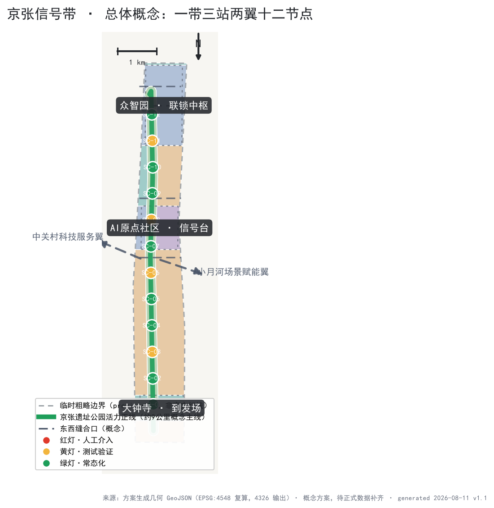
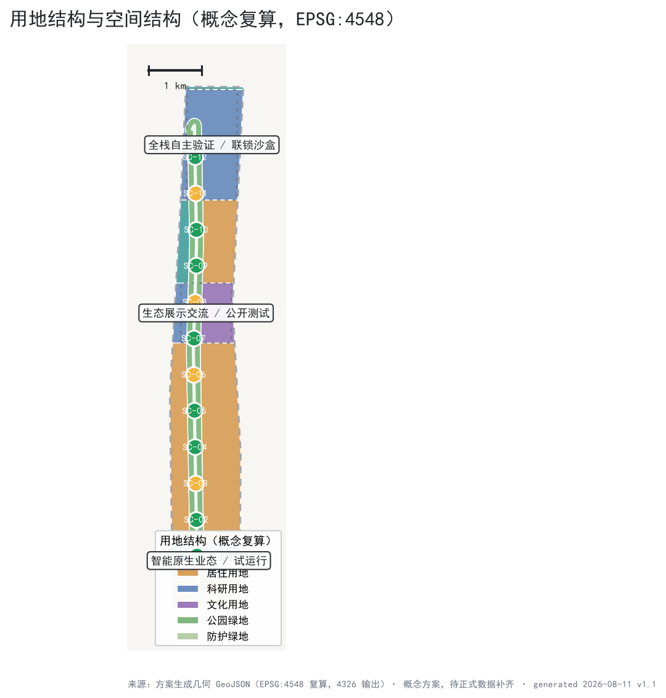
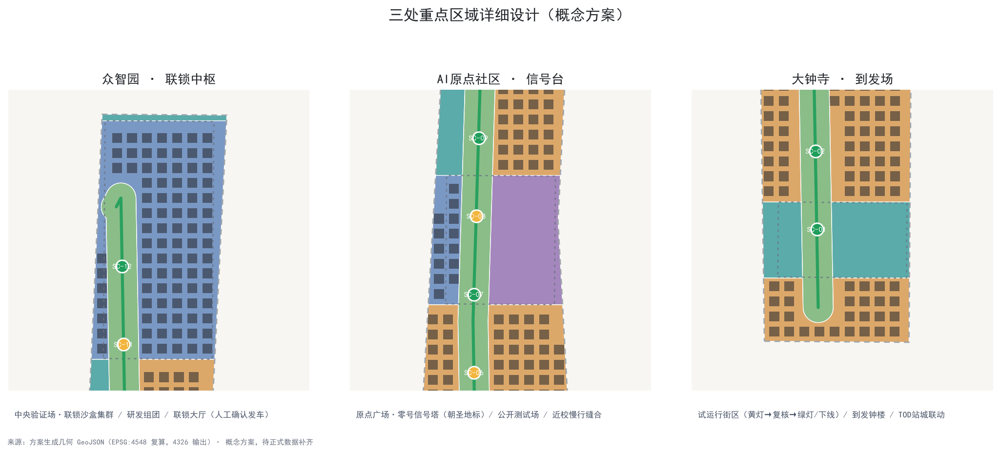
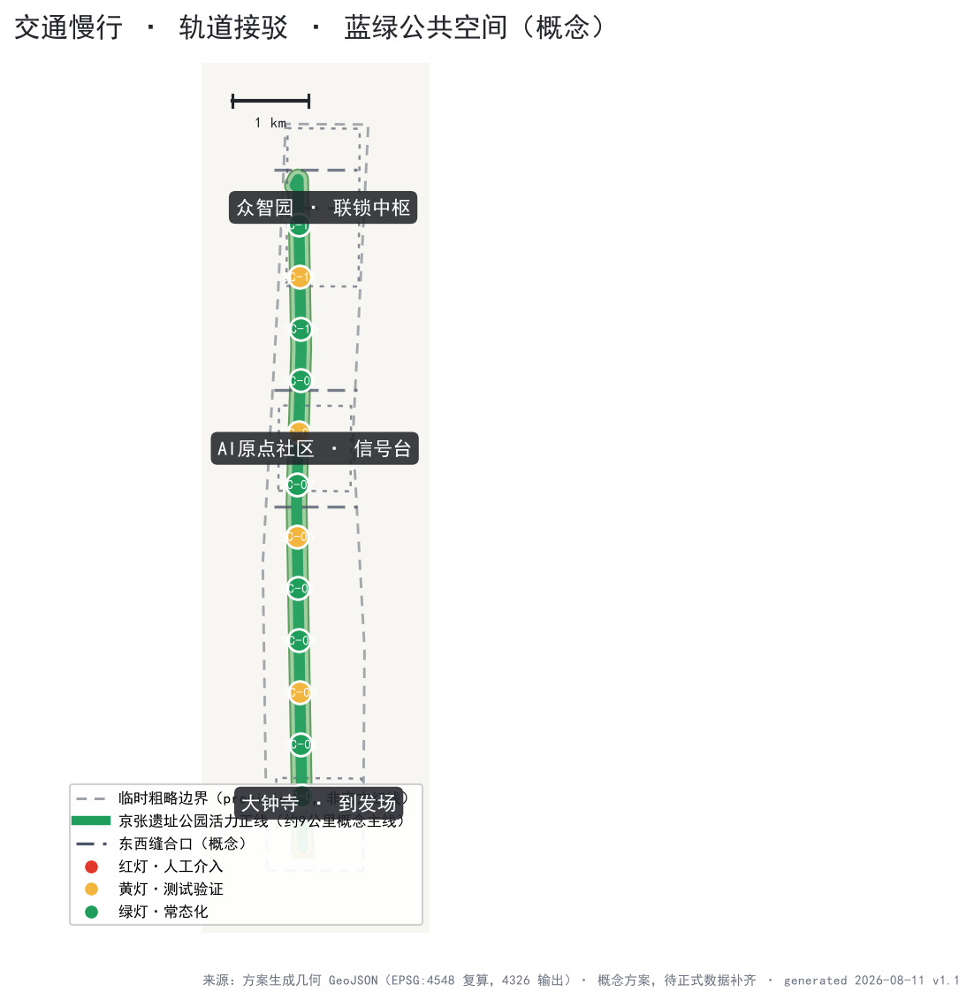
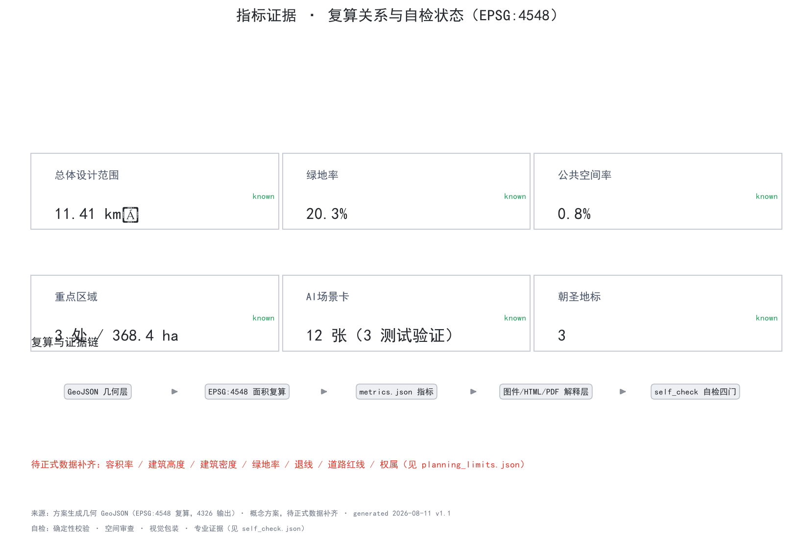

# 京张信号带 JINGZHANG SIGNAL LINE

**把百年铁路的信号纪律转译为 AI 创新带的治理与空间协议**

1909 年京张铁路通车，中国人第一次自主建成干线铁路，这条"争气路"用工程主权回答了"能不能自己修路"。一百多年后，AI 进入城市公共空间，最难的问题不是"能不能用"，而是"**能不能看懂、能不能叫停、能不能安全上线**"。铁路运营用一百年回答了同样的问题，答案是信号纪律：红黄绿三色分级、进路联锁、故障导向安全、人工确认发车。

本方案把这份纪律转译为一条"信号带"：让每一项进入公共空间的 AI 服务，都像列车一样**按信号行驶、进路联锁、人工确认发车、故障可回退**。信号不是限制，而是让更多 AI 场景敢于上线的安全基础设施。

## 设计依据与资料清单

本方案的第一依据是北京市规划和自然资源委员会海淀分局发布的《百年京张AI创新带城市设计国际方案征集资格预审公告》（2026-05-09），其文字四至、三层范围、三处重点区域和设计任务构成任务框架 [source:OFFICIAL-ANNOUNCEMENT]；面向全球智能体的开源征集任务书（用户提供清权资料）补充了三大定位、五大功能、三区两翼、六项任务与十条共创原则 [source:AGENT-TASKBOOK]。方案同时遵守《城市设计管理办法》关于公共空间与城市风貌统筹的要求 [standard:MOHURD-URBAN-DESIGN-MEASURES]，并区分已知控制条件与待确认事项 [standard:MOHURD-CONTROL-DETAILED-PLANNING]。

**边界状态必须首先说明**：截至本方案生成，公开渠道未取得官方精确红线，方案使用维护者依据公告文字四至与约面积推定的临时粗略边界（`brief/site-package/geometry/provisional_boundaries.geojson`，PROV-SITE-001 及 PROV-KEY-001/002/003）[source:PROVISIONAL-BOUNDARIES]。本提交包中 `geometry/site_boundary.geojson` 与 `geometry/key_areas.geojson` 均标注 `provisional_constraint`、`official_boundary=false`，仅用于方案生成、展示与讨论，**不得作为红线、审批依据或精确面积依据**；组织方数据缺口不阻断内容评分，官方 polygon 发布后全部图层与指标须整包复算 [data:geometry/site_boundary.geojson#SITE-001] [metric:site_area_sqm]。

本方案的实际数据来源、许可与限制完整登记在 `sources.json`，专业标准响应在 `standard_matrix.json`，设计深度证据在 `design_depth_matrix.json`，任务覆盖在 `compliance_matrix.json`，正文只在与判断直接相关处引用证据。

## 三层范围工作框架

三层范围按公告确定：统筹研究范围约 43.6 平方公里，回答"AI 产业生态与未来城市形态如何组织"；总体设计范围约 11.4 平方公里，回答"产业空间、城市更新、交通市政与风貌如何落图"；重点区域范围约 368.4 公顷（三处重点片区），回答"三处片区如何达到详细设计深度" [source:OFFICIAL-ANNOUNCEMENT] [depth:three_level_scope_framework]。三层范围在 `compliance_matrix.json` 中逐条映射公告 1.3、1.4、1.5 与 agent.1–agent.6 任务 [depth:overall_spatial_structure]。

| 层级 | 设计问题 | 方案回答 | 数据落点 |
| --- | --- | --- | --- |
| 统筹研究范围 | AI 产业生态与未来城市形态 | "高校策源—开源协作—验证发车—应用上线—国际传播"创新链 | [data:geometry/site_boundary.geojson#SITE-001]、[metric:coordinated_research_area_sqm] |
| 总体设计范围 | 产业空间、更新、交通、风貌落图 | 一条正线、三座信号站、两翼进路、十二节点 | [data:geometry/land_use.geojson#LU-1401-1]、[data:geometry/roads.geojson#ROAD-001] |
| 重点区域范围 | 三处片区详细设计 | 联锁中枢、信号台、到发场各自的功能与空间动作 | [data:geometry/key_areas.geojson#KEY-001]、[data:geometry/key_areas.geojson#KEY-002]、[data:geometry/key_areas.geojson#KEY-003] |

信号带的空间组织是"把治理协议画进城市"：红色代表需人工介入、不可自动化的空间（联锁大厅、人工兜底服务点）；黄色代表测试验证期空间（沙盒、公开测试场、试运行线）；绿色代表常态化空间（公园正线、慢行主轴、日常场景节点）。三类空间沿正线交织，市民在公共空间中即可读懂每一项 AI 服务的运行状态 [standard:PROJECT-AGENT-OPEN-CALL-TASKBOOK]。

## 统筹研究范围产业与未来城市研究

统筹研究范围以"京张信号协议"为治理主线，把海淀的 AI 要素组织成一条可验证的创新链：高校院所提供策源（清华、北大、北航及学院路高校群），中关村提供资本、数据、算力与科技服务，三处重点片区提供从研发验证到应用上线的接力 [source:THREE-AREAS-WINGS] [source:HAIDIAN-1X1]。方案与北纬社区、未来科学城、怀柔科学城、经开区的关系定位为"进路互通"：信号带是面向应用的验证与上线界面，科学城是源头创新基地，经开区是规模化制造与落地界面，形成创新链上下游的轨道接驳，而非同质竞争 [source:THREE-AREAS-WINGS]。

未来城市形态研究聚焦三类新基础设施：**算力进路**（端侧算力驿站与公共算力接口）、**数据进路**（数据要素登记与流通的公共界面）、**信任进路**（信号协议、人工复核与故障回退的公共制度）。三类进路不是孤立的数字系统，而是像铁路信号楼一样在城市中可见、可旁听、可审计的空间设施 [depth:coordinated_research_future_city] [depth:ai_innovation_ecosystem]。

统筹研究范围不承诺具体产业规模、投资或招商结果。要素配置机制（土地、空间、产业、资金、人才、算力、数据、场景）全部表述为机制建议，供专业团队与主管部门深化 [source:AGENT-TASKBOOK] [standard:PROJECT-OFFICIAL-ANNOUNCEMENT]。

## 总体设计范围城市更新与控规深度城市设计

总体设计范围（约 11.4 平方公里）的城市更新框架遵循"**保留正线、改造节点、新建地标**"的概念逻辑：保留京张遗址公园主脉与沿线历史文化资源；改造具备条件的老旧厂区、站场周边与低效用地为信号站与场景节点（改造方案属概念建议，待权属、文保与控规条件确认）[depth:urban_renewal_framework]；新建仅限零号信号塔、联锁大厅、到发钟楼三类概念性地标及必要的新基建接口，避免大拆大建 [data:geometry/phasing.geojson#PHASE-1-1] [data:geometry/phasing.geojson#PHASE-2-1]。

空间结构为"**一带三站两翼十二节点**"：

- **一带**：京张遗址公园活力正线，约 9 公里概念主线，串联三处重点片区，承担慢行、公共活动、文化叙事与场景体验 [data:geometry/roads.geojson#ROAD-001] [data:geometry/green_space.geojson#GRN-001]；
- **三站**：众智园"联锁中枢"、AI 原点社区"信号台"、大钟寺"到发场"，分别承接全栈自主验证、生态展示交流、应用上线运营 [data:geometry/key_areas.geojson#KEY-001]；
- **两翼**：中关村科技服务翼（西，要素进路供给）与小月河场景赋能翼（东，测试场景供给），以概念性进路接入三站；
- **十二节点**：沿正线布置 12 个信号分级场景节点（详见 AI 创新生态章节）[metric:signal_node_count]。

用地结构（概念复算）：公园绿地约 232 公顷（20.3%），科研用地约 209 公顷（18.3%），城镇住宅约 531 公顷（46.5%），文化用地约 67 公顷（5.9%），商业服务业用地约 103 公顷（9.0%）[data:geometry/land_use.geojson#LU-1401-1] [metric:land_use_area_1401]。该结构是"设计意图层"：以绿带为主轴的开放空间优先布局、围绕三站的科研与产业用地集中布局、居住与配套沿两翼展开，并非现状调查或法定用地规划 [metric:green_ratio]。

开发强度方面，容积率、建筑高度、建筑密度等法定控制条件在官方控规数据发布前一律按"待正式数据补齐"处理，方案只给出体量分布的概念倾向（三站周边集聚、正线两侧低层开敞），不推测数值结论 [source:PLANNING-LIMITS] [metric:floor_area_ratio] [metric:building_height_m]。

## 重点区域详细设计

### 众智园AI自主创新加速区 —— 联锁中枢（Interlocking Center）

众智园定位为信号带的"联锁中枢"：承担 AI 全栈自主创新体系的研发、验证与"发车"（上线放行）功能，对应五大功能中的全栈自主体系与治理话语权 [source:AGENT-TASKBOOK] [data:geometry/key_areas.geojson#KEY-001]。空间动作（概念建议）：① 中央验证场——面向产业测试的联锁沙盒集群（SC-10），模拟"信号楼"逻辑，场景上线前必须通过分级测试；② 研发组团——沿正线两侧布局科研用地（概念复算约 209 公顷的北段主体），保留改造具备条件的既有园区；③ 联锁大厅——AI 场景上线的人工确认仪式空间，公开可旁听、可中止，是人类最终判断原则的空间化身 [metric:key_area_zhongzhiyuan_sqm]。实施依赖：清河界面与五环侧开放空间连通、官方控规条件与权属确认、产业测试资质与安全标准。

### 北京AI原点社区 —— 信号台（Signal Box）

AI 原点社区定位为信号带的"信号台"：面向全球 AI 人才与公众，承担成果展示、交流对话与公共体验，对应世界级 AI 创新生态功能 [source:AGENT-TASKBOOK] [data:geometry/key_areas.geojson#KEY-002]。空间动作（概念建议）：① 原点广场与零号信号塔——AI 朝圣地标之一，塔顶信号灯常亮绿色，象征"持续运行且可旁听"，荣誉展示系统（贡献者名录、里程碑年表）在此公开展示；② 信号台公开测试场（SC-11）——市民可参与、可观察、可提问的 AI 场景公开测试空间，测试结果与人工复核记录公开；③ 近校慢行缝合——衔接清华东路西口方向与高校慢行网络，打通校区—园区—街区（概念性缝合口，线位待交通方案深化）[data:geometry/phasing.geojson#PHASE-1-1] [metric:key_area_origin_sqm]。实施依赖：清华园车站旧址等文保范围与建设控制地带确认、慢行断点现状调查、公开测试的伦理与安全规程。

### 大钟寺AI产业聚集区 —— 到发场（Arrival-Departure Yard）

大钟寺定位为信号带的"到发场"：承担智能原生新业态的上线、运营与城市生活融合，对应 AI+ 场景赋能新范式 [source:AGENT-TASKBOOK] [data:geometry/key_areas.geojson#KEY-003]。空间动作（概念建议）：① 到发场试运行线（SC-12）——以概念性街区为载体的商业场景试运行机制，新业态先以"黄灯"试运行、定期复核达标后转"绿灯"常态化，不达标即下线；② 到发钟楼——AI 应用上线/下线的公开报时地标，运行时刻表（上线时间、复核节点、责任方）公开展示；③ 大钟寺 TOD 站城联动——围绕轨道站点组织商业、场站与公共空间（概念性布局，TOD 方案待交通与市政深化）[metric:key_area_dazhongsi_sqm]。实施依赖：站点周边用地条件确认、商业业态准入规则、公共空间与轨道接驳的工程方案。

三处片区沿正线形成"研发—展示—应用"的接力，与两翼进路共同构成可验证、可回退的创新回路 [depth:three_key_area_detailed_design]。

## AI 创新生态、人才画像与 AI+ 场景

### 全球 AI 创新生态案例（6 个，可转化机制）

1. **伦敦国王十字知识区（King's Cross Knowledge Quarter）**：百年铁路站场（1830 年代始建）改造为知识经济集聚区，以中央圣马丁等机构锚定公共文化，企业随大学与公共空间集聚。可转化机制：以公共文化设施为先导锚点、以铁路遗产为品牌资产 [source:CASE-KINGSCROSS]。
2. **斯坦福研究园（Stanford Research Park）**：大学以土地与科研生态吸引企业、企业反哺大学的园区模式，形成大学—资本—企业闭环。可转化机制：近校空间组织与成果转化界面 [source:CASE-STANFORD]。
3. **新加坡裕廊创新区（Jurong Innovation District）**：政府主导的先进制造与研发测试集聚区，强调"活实验室"（living lab）与产业测试空间。可转化机制：测试验证空间的制度化供给（对应联锁沙盒）[source:CASE-JID]。
4. **多伦多滨水区智慧社区教训（Quayside）**：过度的数据采集与模糊的治理责任导致公众信任崩塌、项目中止。可转化机制：治理透明度与公众信任是 AI 城区的先行条件（对应信号协议）[source:CASE-QUAYSIDE]。
5. **韩国板桥科技谷（Pangyo Techno Valley）**：政府主导的研发集聚与创业生态，配套完善的创新服务。可转化机制：创新服务网络的系统化组织 [source:CASE-PANGYO]。
6. **深圳河套与上海张江规则沙盒**：以特定区域实施数据跨境、场景开放与监管沙盒试点，把"规则"本身作为创新产品。可转化机制：信号协议可作为规则沙盒的公共载体，在合规框架内先行探索 [source:CASE-HETAO-ZHANGJIANG]。

六个案例的共同结论：**AI 创新带的竞争力不在楼宇密度，而在"验证—信任—上线"的制度与空间效率**。信号带正是把这一结论空间化的工具 [source:AGENT-TASKBOOK] [depth:ai_innovation_ecosystem]。案例均来自公开资料，来源、检索日期与限制登记于 `sources.json`，仅用于机制借鉴，不构成对任何园区现状的官方判断。

### 用户画像（6 类）

| 画像 | 典型需求 | 对应场景 |
| --- | --- | --- |
| 国际 AI 研究者 | 交流、展示、旁听评审、多语言导览 | SC-02/SC-08/SC-11 |
| 本土创业者与开发者 | 测试场地、算力接口、场景上线通道 | SC-06/SC-10/SC-12 |
| 高校师生 | 近校慢行、研究合作、公共课堂 | SC-03/SC-05/SC-11 |
| 周边居民（含家庭） | 日常休闲、夜间活力、信息可靠 | SC-01/SC-07/SC-09 |
| 园区运营与商户 | 场景准入规则、试运行机制、客流组织 | SC-04/SC-12 |
| 数字弱势群体 | 人工兜底、无障碍、防诈骗 | SC-09/SC-01 |

### 12 张 AI 场景卡（按信号等级分级，其中 3 张为产业测试验证场景）

**绿灯场景（常态化，定期复核）**：

- **SC-01 信号带慢行导航**：面向慢行与无障碍路径的 AI 导航（结合轨道接驳、无障碍环境建设法第 39 条场景边界），提供人工兜底与绕行信息 [standard:BARRIER-FREE-ENVIRONMENT-LAW]。
- **SC-02 京张文化 AI 导览**：沿线文化叙事的多语言 AI 导览，素材经史实与版权复核，AI 生成内容与事实内容明确区分 [source:CASE-KINGSCROSS]。
- **SC-03 原点 AI 服务台**：AI 原点社区公共服务的 AI 咨询台，人工可接管，服务边界按法规列举场景执行 [standard:BARRIER-FREE-ENVIRONMENT-LAW]。
- **SC-04 大钟寺智能消费街区**：智能商业与消费体验，数据采集遵循最小必要与明示告知，不得强制人脸等敏感信息。
- **SC-06 端侧算力驿站**：公共空间内的本地推理算力节点，数据不出端侧，算力使用公开计量（呼应算力进路）[metric:signal_node_count]。
- **SC-07 城市运行 AI 对时台**：公共信息屏公开 AI 服务的运行时刻表、复核节点与责任方，让"运行状态可见"成为基础设施。
- **SC-08 AI 朝圣导览专线**：串联三处地标与荣誉展示节点的概念性游览线路，服务国际访客与公众。
- **SC-09 人工兜底服务点**：面向老年人、残障与低数字素养人群的现场人工服务，作为智能化服务的并行通道（参照国办发〔2020〕45 号的传统服务与智能服务并行原则，该文件为全国性政策背景，不构成本地实施结论）[source:ELDERLY-SMART-PLAN]。

**黄灯场景（测试验证期，其中 3 张为产业测试验证场景）**：

- **SC-05 公园 AI 巡检与清洁（测试）**：低速机器人巡检与清洁试点，限定路线、时段与责任主体，夜间按光环境要求运行 [source:AGENT-TASKBOOK]。
- **SC-10 联锁沙盒（产业测试验证场景 1）**：众智园面向 AI 企业的场景上线前测试设施，含分级测试、故障演练与人工确认放行。
- **SC-11 信号台公开测试场（产业测试验证场景 2）**：AI 原点社区面向公众的开放测试空间，测试结果与复核记录公开，市民可提问与反馈。
- **SC-12 到发场试运行线（产业测试验证场景 3）**：大钟寺面向商业场景的试运行机制，黄灯试运行→复核→绿灯常态化或下线。

**红灯协议（非场景，作为制度底座）**：任何 AI 服务发生故障、越界或公众异议时自动降级为人工服务，暂停记录公开；红灯状态由联锁机制强制执行，不依赖运营者自觉 [standard:GENERATIVE-AI-INTERIM-MEASURES]。

场景卡完整版（含数据输入、公共价值、风险、人工复核要求）见 `compliance_matrix.json` 与正文对应段落；12 个信号节点在 `visual/index.html` 中可视化 [metric:scenario_card_count] [metric:test_scenario_count] [metric:persona_count]。

## 用地、建筑规模与拆改留方案

用地结构已在前文给出概念复算（绿带 20.3%、科研 18.3%、居住 46.5% 等）[data:geometry/land_use.geojson#LU-1401-1] [metric:land_use_area_0701]。建筑规模方面，方案提供概念建筑基底（约 374 个示意体块，基底合计约 270 公顷、概念建筑密度约 23.7%）[metric:building_footprint_area_sqm] [metric:building_density]，用于表达"三站集聚、正线低层、两翼多层"的体量关系与图面示意，**不构成建筑面积、容积率或任何开发规模结论**；建筑面积与容积率待正式控规条件补齐后复算 [metric:floor_area_ratio]。

拆改留按"保留—改造—新建"三类概念策略表达，全部标注为待专业团队深化的参考方案 [depth:retain_renovate_demolish]：

- **保留**：京张遗址公园主脉、沿线历史文化资源（含清华园车站旧址等文保点位——精确范围待官方确认）、正线两侧现状公园绿地与高质量建成环境；
- **改造**：具备条件的老旧园区、站场周边与低效用地，改造为信号站、场景节点与公共空间（具体地块改造结论需权属、文保与控规确认，本方案不给地块级判断）；
- **新建**：仅限零号信号塔、联锁大厅、到发钟楼三类概念性地标与必要新基建接口，新建体量极小，避免大拆大建 [data:geometry/buildings.geojson#BLDG-0001]。

拆改留图层以 `phasing.geojson` 的分期范围表达实施逻辑（见实施章节），不以拆改留为空间设计的唯一依据 [data:geometry/phasing.geojson#PHASE-1-1]。

## 交通、轨道、市政与公共服务设施

**慢行与正线**：京张遗址公园活力正线为慢行主脊（概念中心线约 8.6 公里，见 `roads.geojson` ROAD-001）[data:geometry/roads.geojson#ROAD-001] [metric:road_length_m]；六处概念性东西缝合口缝合被铁路割裂的东西向联系，缝合口的具体位置、断面与工程方案待交通专项深化，本方案仅给出空间策略 [depth:transport_system]。

**轨道接驳**（公开信息背景）：总体设计范围周边轨道资源包括 13 号线（大钟寺站、知春路站方向）、15 号线（清华东路西口方向）、昌平线与京张高铁（清河站方向）等，本方案以"轨道站点—信号站"接驳为概念策略，提出三站各自面向轨道来向的到达广场与慢行接驳，不涉及任何线位、站位或工程结论；轨道接驳的精确条件待官方交通资料补齐 [source:OFFICIAL-ANNOUNCEMENT]。

**市政与新基建**：概念性提出四类新基建接口——端侧算力（SC-06 驿站）、公共信息屏（SC-07 对时台）、低速机器人补给与通信（SC-05 测试）、应急人工呼叫（红灯协议）；管线、能源、排水、消防等市政条件全部按待正式数据补齐处理，不做任何容量或可行性结论 [source:PLANNING-LIMITS]。

**公共服务设施**：以"人工兜底"为原则组织公共服务场景（SC-03、SC-09），学校、医疗、养老、文化等设施底数待官方数据补齐后校核空间布局 [standard:BARRIER-FREE-ENVIRONMENT-LAW] [source:ELDERLY-SMART-PLAN]。

## 蓝绿空间、公共空间与城市风貌

**蓝绿空间**：概念复算绿地约 232 公顷（绿地率约 20.3%）[metric:green_ratio] [data:geometry/green_space.geojson#GRN-001]；正线绿带为骨架，衔接小月河方向与沿线公园（水系与蓝线相关空间按锁定图层处理，不修改）；绿带宽度、断面与生态功能待官方蓝绿资料补齐后深化 [depth:blue_green_network]。

**公共空间**：概念公共空间约 9 公顷（公共空间率约 0.8%）[metric:public_space_ratio] [data:geometry/public_space.geojson#PUB-001]，以三处信号广场（原点广场、验证场前广场、到发广场）与沿线节点广场为骨架；公共空间组件库（信号灯柱、里程碑坐凳、鸣笛声景、荣誉铭牌、导视灯箱）构成可复用的"信号带家具"体系 [standard:MOHURD-URBAN-DESIGN-MEASURES]。

**城市风貌**：以"信号带视觉协议"统筹风貌——红黄绿三色仅用于信号语义（运行状态），日常界面采用低饱和工业遗产色（铁锈红、混凝土灰、轨道黑）与景观绿带，避免信号色彩娱乐化；建筑高度、体量、风格控制待控规条件确认，正线两侧以低层开敞、视线通透为概念倾向 [depth:urban_character]。风貌控制作为城市设计导则方向的建议提出，不替代法定规划 [standard:MOHURD-URBAN-DESIGN-MEASURES]。

## 更新项目清单、实施政策与分期计划

**概念更新项目清单**（全部为概念建议，编号见 `compliance_matrix.json` 与 `visual/index.html`）：

| 编号 | 项目（概念） | 类型 | 信号等级 |
| --- | --- | --- | --- |
| UP-01 | 京张遗址公园正线缝合（南北贯通慢行与公共空间） | 保留+改造 | 绿 |
| UP-02 | 原点广场与零号信号塔 | 新建地标 | 绿 |
| UP-03 | 联锁沙盒集群（众智园产业测试设施） | 改造+新建 | 黄 |
| UP-04 | 信号台公开测试场（原点社区） | 改造 | 黄 |
| UP-05 | 到发场试运行街区（大钟寺商业场景） | 改造 | 黄 |
| UP-06 | 端侧算力驿站网络（6 处概念点位） | 新建小型设施 | 绿 |
| UP-07 | 到发钟楼与运行时刻表装置 | 新建地标 | 绿 |
| UP-08 | 东西缝合口（6 处概念策略点） | 市政+慢行 | 黄 |

**实施政策建议**（机制建议，非已定政策）：信号分级场景准入规则（黄灯申请—评审—试运行—复核—绿灯/下线）、荣誉展示与贡献者记录机制（呼应共创原则第 9 条）、场景开放与数据要素登记的公共界面、AI 治理公众旁听与申诉通道 [source:AGENT-TASKBOOK]。

**分期计划**（概念，面积复算见指标）：

- **一期（主轴缝合与原点社区）**：正线慢行贯通、原点广场与零号信号塔、信号台公开测试场（概念范围约 308 公顷）[metric:phase_1_area_sqm]；
- **二期（众智园联锁中枢）**：联锁沙盒集群、研发组团更新（概念范围约 193 公顷）[metric:phase_2_area_sqm]；
- **三期（大钟寺到发场）**：试运行街区、到发钟楼与 TOD 界面（概念范围约 72 公顷）[metric:phase_3_area_sqm]。

分期不构成开发时序承诺，具体实施顺序由主管部门与专业团队依据权属、资金与政策条件确定 [data:geometry/phasing.geojson#PHASE-1-1]。

## 指标体系、面积复算与合规矩阵

核心指标由提交几何在 EPSG:4548 下复算（坐标系 CGCS2000 / 3-degree Gauss-Kruger CM 117E，见 `design_brief.json` 坐标政策）[metric:site_area_sqm]：总体设计范围约 11,412,825 平方米（公告约 11,400,000 平方米，偏差 0.11%）；三处重点区复算面积分别约 192.9 / 104.3 / 72.0 公顷 [metric:key_area_zhongzhiyuan_sqm] [metric:key_area_origin_sqm] [metric:key_area_dazhongsi_sqm]。全部指标（含公式、单位、来源文件、置信度与假设）见 `metrics.json`，指标可视化与复算关系见下图 [metric:green_ratio] [metric:public_space_ratio]。

合规覆盖：官方公告 1.3、1.4、1.5 全部任务与 agent.1–agent.6 六项任务在 `compliance_matrix.json` 逐条映射到章节、图层、指标、图纸与 HTML 板块；五项强制专业标准在 `standard_matrix.json` 逐条响应；十五项设计深度要求在 `design_depth_matrix.json` 全部标记 complete [depth:metrics_recalculation] [depth:compliance_coverage]。本方案自检状态见 `self_check.json` 与 `visual/index.html` 自检板块。

## 风险、版权与合规说明

**主要风险**：(1) 边界风险——provisional 边界非官方红线，官方 polygon 发布后面积、图层与指标须整包复算 [source:PROVISIONAL-BOUNDARIES]；(2) 数据风险——控规容积率、高度、密度、绿地率、道路红线、权属与现状建筑等关键数据缺失，凡涉上述事项均按待正式数据补齐处理，本方案不推测 [source:PLANNING-LIMITS]；(3) 案例时效风险——6 个国际案例来自公开资料（检索日期 2026-08-11），仅作机制借鉴；(4) 法律风险——涉及《生成式人工智能服务管理暂行办法》《无障碍环境建设法》的引用严格限定于其条文适用边界（见 `standard_matrix.json` 与 `sources.json` 中的用途边界说明），本方案不构成法律意见 [standard:GENERATIVE-AI-INTERIM-MEASURES]；(5) 承诺边界——所有空间、政策、活动与招商表述均为开放共创的概念建议，不构成政府审定结论、投资承诺或实施安排 [source:AGENT-TASKBOOK]。

**版权与合规**：本方案全部图形、几何与文字由 AI agent 依据公开与清权资料原创生成；未使用任何商业地图底图、未清权图片或字体（图件使用系统开源字体）；未使用 OSM 数据，因此不涉及 ODbL 归属义务（若后续引入 OSM 底图须按 ODbL 署名）；案例商标、名称仅作事实性引用；版权与再分发声明见 `report/copyright_statement.md`。本方案遵循"人类最终判断"共创原则，任何 AI 生成内容均需人类与专业团队复核后方可进入实施深化 [source:AGENT-TASKBOOK]。

## 参考资料

- 北京市规划和自然资源委员会海淀分局：《百年京张AI创新带城市设计国际方案征集资格预审公告》，2026-05-09 [source:OFFICIAL-ANNOUNCEMENT]
- 面向全球智能体的开源征集任务书摘录（用户提供清权资料），2026-05-18 [source:AGENT-TASKBOOK]
- 北京市科委、中关村管委会：《"三区两翼"打造世界级AI集聚地》，2026-04-03 [source:THREE-AREAS-WINGS]
- 海淀区人民政府：海淀区"1+X+1"现代化产业体系建设布局，2026-03-02 [source:HAIDIAN-1X1]
- 住房和城乡建设部：《城市设计管理办法》，2017 [standard:MOHURD-URBAN-DESIGN-MEASURES]
- 住房和城乡建设部：《城市、镇控制性详细规划编制审批办法》 [standard:MOHURD-CONTROL-DETAILED-PLANNING]
- 自然资源部：《国土空间调查、规划、用途管制用地用海分类指南》，2023 [standard:MNR-LAND-USE-CLASSIFICATION-GUIDE]
- 国家互联网信息办公室等：《生成式人工智能服务管理暂行办法》，2023 [standard:GENERATIVE-AI-INTERIM-MEASURES]
- 全国人大常委会：《中华人民共和国无障碍环境建设法》，2023 [standard:BARRIER-FREE-ENVIRONMENT-LAW]
- 国务院办公厅：国办发〔2020〕45 号（老年人运用智能技术困难实施方案），2020 [source:ELDERLY-SMART-PLAN]
- 维护者登记：《百年京张AI创新带三层范围与三处重点区临时粗略 polygon》，2026-06-05 [source:PROVISIONAL-BOUNDARIES]
- 案例来源：King's Cross Knowledge Quarter / Stanford Research Park / Jurong Innovation District / Toronto Quayside / Pangyo Techno Valley / 深圳河套·上海张江（详见 `sources.json`）
