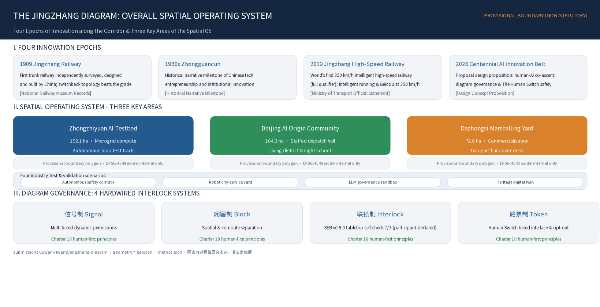
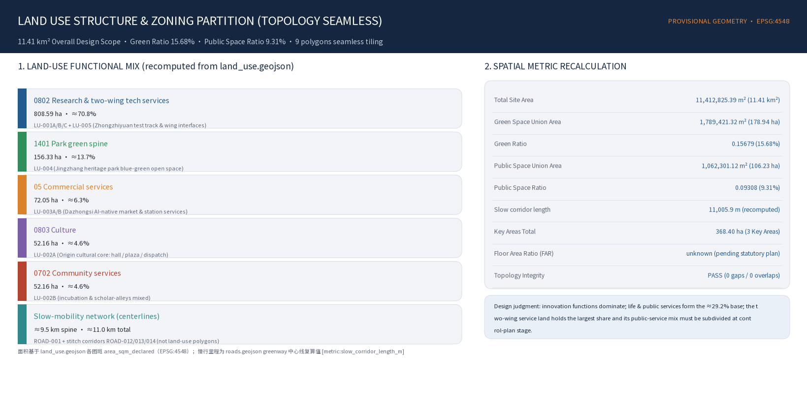
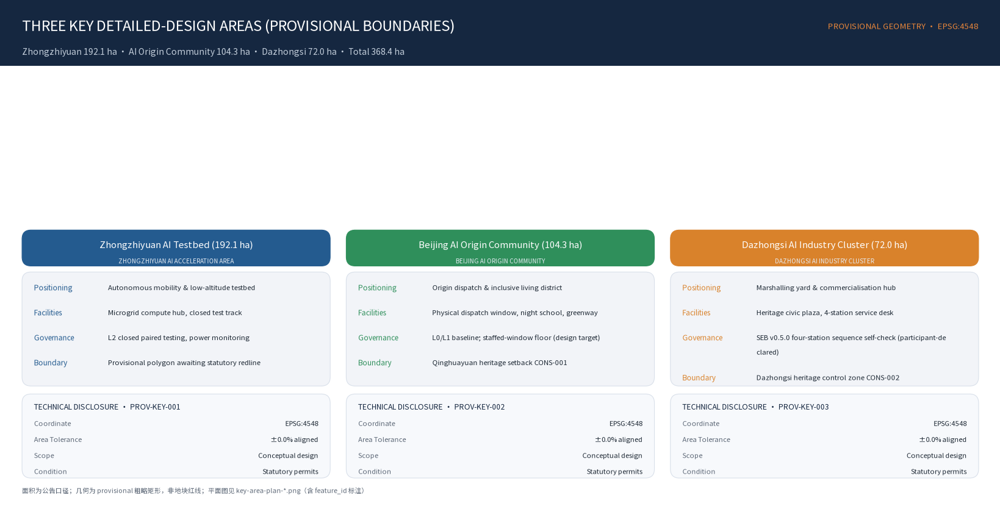
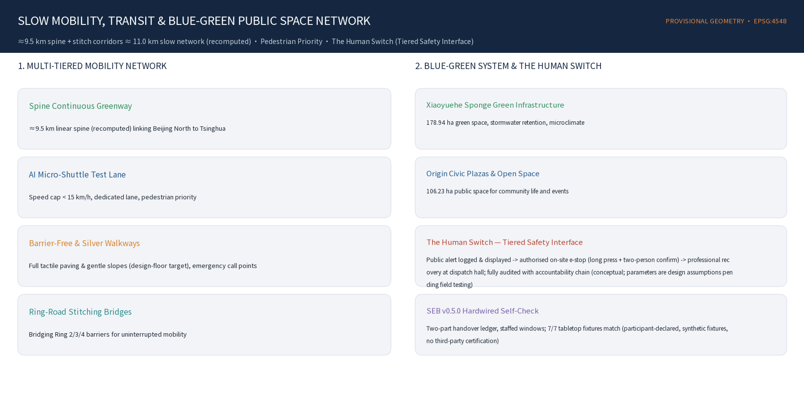
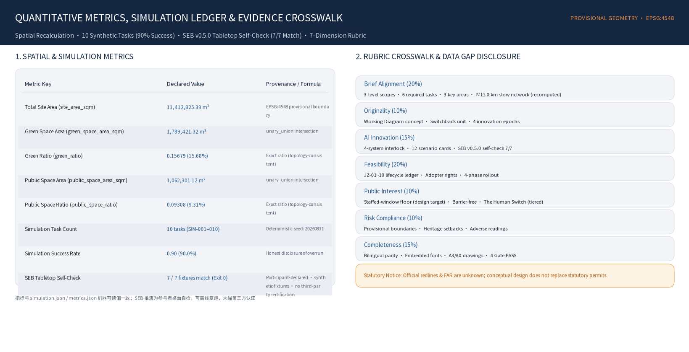

# The Jingzhang Diagram
## Centennial Jingzhang AI Belt Urban Design

> **In 1909, Zhan Tianyou answered the mountain with a switchback line, and answered the question of people with "each contributes what he has learned, each gives what he knows."**
> **In 2019, the Jingzhang HSR answered the question of speed with the world's first intelligent high-speed railway.**
> **In 2026, we answer the question of intelligence with a working diagram — letting every innovation run by the diagram, and letting everyone step off at any time.**
>
> **The railway that taught China to climb now runs on a diagram written by everyone.**

---

## Design Basis and Source List

This formal proposal takes the "Prequalification Announcement for the Centennial Jingzhang AI Innovation Belt Urban Design International Open Call" issued by the Haidian Branch of the Beijing Municipal Commission of Planning and Natural Resources as its primary basis [source:OFFICIAL-ANNOUNCEMENT], and takes the maintainer-registered provisional coarse boundary, key areas, enums, metrics, and source list in `brief/site-package/` as its machine-readable basis [source:SITE-PACKAGE] [source:AGENT-TASKBOOK]. Before generation the agent must read `design_brief.json`, `allowed_design_space.json`, `sources.json`, `enums/`, `ranges/`, `schemas/`, `data/source_registry.json`, and `data/processed/agent_fact_pack.md`, and use `project_scope_summary.csv`, `agent_task_requirements.csv`, `source_use_matrix.csv`, and `missing_data_checklist.csv` to build task, scope, source-usage, and gap checklists [source:SOURCE-REGISTRY] [source:PROCESSED-FACT-PACK]. Every design judgment must be decomposed into a traceable source, a recomputable metric, a checkable layer, and a human-reviewable assumption.

**Unified discipline (hard constraint)**: all spatial implementation suggestions in this proposal are conceptual proposals, reference schemes, or material for professional teams to deepen; we do not impersonate statutory control lines, do not fabricate FAR/height/density/green ratio, and do not fabricate enterprises, investment amounts, output values, policy commitments, or engineering feasibility. The official precise boundaries (SITE_BOUNDARY / KEY_AREA polygons), control-plan metrics, and current-condition data are missing; this proposal develops conceptual design on the official textual limits and area figures, adopts the repository's provisional boundary in the formal packaging stage with the `provisional` marker prominently shown, and commits to recompute on EPSG:4548 [source:BOUNDARY-SOURCE] [source:KEY-AREA-SOURCE] [assumption:A-CONTROLS-001].

The usage boundaries of the source register are as follows [source:SOURCE-REGISTRY]: `data/source_registry.json` registers the usage boundaries of public, cleared, and provisional materials; the current register summary is the three categories of formal-ready, background-only, and provisional-only. The agent must not upgrade background_only or provisional_only materials into official boundaries, statutory control plans, formal scoring bases, or government implementation commitments. `data/processed/agent_fact_pack.md` is a reading-navigation layer for this proposal, not a new authority source [source:PROCESSED-FACT-PACK].



While the official `SITE_BOUNDARY` or the three `KEY_AREA` polygons are not yet available, this proposal uses `brief/site-package/geometry/provisional_boundaries.geojson` to generate a provisional formal package [source:BOUNDARY-SOURCE]. Both `geometry/site_boundary.geojson` and `geometry/key_areas.geojson` in the package are marked `provisional_constraint`, `official_boundary=false`, and may only be used for proposal generation, self-check, visualization, and design discussion — not as official redlines, approval bases, precise area bases, or statutory control conclusions [data:geometry/site_boundary.geojson#SITE-001] [metric:site_area_sqm] [depth:existing_conditions_diagnosis]. This organizer-side data gap itself does not block content scoring; once official polygons are substituted, site boundary, key areas, land use, roads, green space, public space, buildings, phasing, and metrics all require recomputation [self_check:SPATIAL_REVIEW].

## Three-Level Scope Work Framework

The proposal organizes work according to the three levels defined by the announcement [source:OFFICIAL-ANNOUNCEMENT]: the strategic-research scope concerns the 43.6 km² AI industry ecology, strategic positioning, innovation chain, and future urban form; the overall-design scope concerns the 11.4 km² urban districts and industrial areas 1-2 km around the Jingzhang Heritage Park, requiring an overall urban-renewal framework, industrial spatial layout, transport and municipal support, and urban-character control; the key-area scope concerns 368.4 ha of three detailed-design districts, requiring that functional programs, building scale, retain/renovate/demolish classification, public-space connectivity, and transport organization be made explicit. The three scopes are mapped item by item in `compliance_matrix.json`, ensuring that the mandatory tasks of announcement sections 1.3, 1.4, 1.5 and agent.1-agent.6 all have section, layer, metric, drawing, and HTML evidence [depth:three_level_scope_framework] [standard:PROJECT-AGENT-OPEN-CALL-TASKBOOK] [self_check:PROFESSIONAL_EVIDENCE].

| Level | Official scope | Conceptual action in this proposal |
|---|---|---|
| Strategic scope 43.6 km² (North 5th Ring—Jingzang Expressway—Xizhimen Outer St.—Wanquan River Rd.) | Regional collaboration: this belt is the switch and connecting line of the Beijing-Tianjin-Hebei AI innovation network — north via Qinghe to Future Science City/Changping (engineering & pilot line), south via Xizhimen to Financial Street (market & capital line), west to the Zhongguancun core, east via Xueyuan Road to university clusters; complementary to Huairou Science City and the Economic-Technological Development Zone, not an all-in-one science city | Build the "university incubation–open-source collaboration–enterprise transformation–public experience–international outreach" innovation chain |
| Overall scope 11.4 km² | A conceptual renewal strategy at statutory urban-design depth: switchback-unit spatial operating system + three hubs + two wings + retain/renovate/demolish/add logic + blue-green network | Switchback-unit spatial operating system; space unit = governance unit |
| Key areas 368.4 ha (Zhongzhi 192.1 / Origin 104.3 / Dazhongsi 72.0) | Differentiated detailed conceptual design of the three districts by railway-facility typology | Test track / Departure yard / Marshalling yard |

The three levels are not a set of mutually isolated drawings. The strategic scope decides the industry-chain and urban-form judgment; the overall scope lands that judgment in renewal projects, spatial structure, and facility capacity; the key-area detailed design verifies the implementability of specific plots, buildings, transport, public space, and AI application scenarios. When generating a proposal the agent must first lock the official or provisional boundary and constraints adopted by the current submission, then generate land use, buildings, roads, green space, public space, phasing, and AI service nodes, and finally recompute metrics from these layers and explain in the text which conclusions remain restricted by the provisional boundary [data:geometry/site_boundary.geojson#SITE-001] [data:geometry/key_areas.geojson#PROV-KEY-001].



## Strategic-Scope Industry and Future-City Research

The core task of the strategic scope is to build a world-class AI innovation ecosystem [source:AGENT-TASKBOOK]. The proposal should organize Haidian's universities, institutes, leading enterprises, computing/data/algorithms factor resources, incubation platforms, listed companies, unicorns, and tech-service resources, and propose a spatial coordination framework for the AI innovation chain, industry chain, talent chain, and urban-service chain. The naming scheme and logo design should serve the overall recognizability of "the Centennial Jingzhang Cultural Belt, the Metropolitan AI-Life Experience Belt, and the AI Integration Innovation Belt," and state the link to the industry ecology, public space, and cultural resources [standard:PROJECT-AGENT-OPEN-CALL-TASKBOOK].

**Global cases teach mechanism, not form**: Kendall Square teaches university-industry short-distance conversion; Station F teaches high-density startup services; King's Cross teaches railway-heritage regeneration and publicness safeguards; Mila teaches AI research-industry-entrepreneurship connection; Barcelona Superblocks teaches restructuring urban flows through block units; the Toronto Quayside lesson points to running data governance and public interest in parallel; Yunqi Town/High Line Park teach developer-conference operations and heritage-driven value (while hedging gentrification). **This belt's institutional moat is the ninth element, "trust"**: beyond land, space, industry, capital, talent, computing, data, and scenarios, without trust data is not opened, scenarios do not land, and talent does not stay; trust is not produced by publicity but institutionalized by the four governance systems [depth:overall_spatial_structure].

**The "each contributes what he has learned" open-source factor market**: factors entering the belt (models, datasets, components, scenario experience) are registered by default into the "working diagram" public catalog under open-source/open licenses; contributions count toward the ballast-plate honor system; city procurement and scenario orders prioritize open factors (a mechanism concept, not a policy commitment). Once a trial ends, it must be distilled into a method, data specification, component, open-source code, case, or standard — knowledge reuse enters the metric system [source:AGENT-TASKBOOK].

## Naming, Logo, and Brand Identity System

The naming serves the overall recognizability of "the Centennial Jingzhang Cultural Belt, the Metropolitan AI-Life Experience Belt, and the AI Integration Innovation Belt," linking industry ecology, public space, and cultural resources [standard:PROJECT-AGENT-OPEN-CALL-TASKBOOK].

| Level | Chinese | English | Meaning |
|---|---|---|---|
| Master brand | 京张运行图 | The Jingzhang Diagram | A city that runs by the diagram |
| Main axis | 京张公共创新脊（人字折返线） | Jing-Zhang Public Spine | The spatial axis of the diagram |
| Three districts | 众智园·试车线 / AI 原点社区·始发站 / 大钟寺·编组场 | Proving Track / Genesis Terminal / Marshalling Yard | The three life-cycle stages of innovation |
| Two wings | 中关村·机务段（服务翼） / 小月河·工务段（场景翼） | Service Depot / Scenario Works | Resource servicing / scenario maintenance |
| Governance protocol | 京张信号 · 闭塞 · 联锁 · 路票 | JZ Signal–Block–Interlock–Ticket | The four governance systems |
| Knowledge platform | JZ Open City | JZ Open City | A city-level GitHub |

Taglines: Chinese "**按图行车，以人定局**"; English "**Every intelligence runs on schedule. Every person holds the switch.**"; cultural keyline: "In 1909 the Jingzhang Railway dispatched trains with a working diagram; today the Jingzhang belt dispatches intelligence with one."

Visual identity (conceptual direction, all self-drawn and rights-cleared): the logo takes the **space-time grid of a working diagram** — space on the horizontal axis, time on the vertical — with a switchback diagonal crossing the grid, at once the human glyph and a train's run line. Colors: Jingzhang rust red (history), intelligence teal (connection), signal green (running/passing states), paper white (public transparency); no cyberpunk neon. Typeface direction: Source Han Sans (Chinese) / Inter (public information) / IBM Plex Mono (versioning and wayfinding details). The cultural wayfinding system and the belt-wide logo system share the same origin yet remain layered, and must not be conflated [source:AGENT-TASKBOOK]. The "human glyph" graphic IP is released under an open license (non-commercial public use), making the brand public infrastructure like the railway itself [depth:overall_spatial_structure].

## Overall-Scope Urban Renewal and Control-Depth Urban Design

### Core Proposition: A City That Runs by the Diagram

What truly cannot be replicated about this land is the stacking of three "world firsts / firsts" on the same corridor [source:OFFICIAL-ANNOUNCEMENT]: 1909 self-reliance — the first trunk railway designed and built independently by Chinese, where Zhan Tianyou, facing a 33‰ grade, answered with a switchback line, trading topology for gradient and switchback for reversibility; 1980s entrepreneurship — the Zhongguancun electronics street, the origin of China's marketized tech innovation; 2019 intelligence — the world's first 350 km/h intelligent high-speed railway, realizing 350 km/h-class automated driving and BeiDou applications (per the Minister of Transport's statement at the 2025 NPC session [source:AUTHORITY-MOT-2025]); 2026 symbiosis — humanity's first answer to at what grade humans and intelligence climb together. **The Jingzhang gene already contains "a self-driving railway"** — the key anchor every prior proposal missed. Zhan Tianyou's "each contributes what he has learned, each gives what he knows" is from his 1914 speech at the Hankou European and American Alumni Association (original: "each contributes what he has learned, each gives what he knows, so that the nation may prosper, suffer no foreign humiliation, and stand independently on this earth" [source:BAIKE-ZHANTIANYOU]); this is an open-source declaration written in 1914 — five years after the Jingzhang Railway's completion — which this proposal establishes as its spiritual constitution [depth:overall_spatial_structure] [assumption:A-FACT-ZHANTIANYOU-001] [assumption:A-FACT-SMART-HSR-2019-002].

### Meta-Concept: The Working Diagram — the Master Score of the Railway

The working diagram is a chart with space on the horizontal axis and time on the vertical, prescribing when each train runs, on which section, at what speed, and under what signal. It is the master score of the railway: space, time, permission, and rhythm, four in one chart. Replacing the governance object from "train" to "AI innovation activity," the four elements all translate: section → urban test section (switchback unit); time → the application/entry/clearance time of scenario trials; permission → the token authorizing a scenario to enter public space; punctuality → Innovation Loop Latency (ILL) and diagram punctuality. Thus the switchback (spatial grammar), signalling (admission), block (zoning), interlocking (baseline), ILL (punctuality), and activity rhythm (timetable) — the best scattered parts of all prior proposals — are for the first time canonized by a single chart [depth:overall_spatial_structure].

### Theoretical Grounding and Academic Anchors (explicitly declared)

To keep "AI + city" from becoming a slogan, theory is made explicit as design constraint [depth:overall_spatial_structure]:

| Thinker / theory | Landing in this proposal |
|---|---|
| Jane Jacobs | Innovation comes from chance encounters of dense, diverse populations → switchback units compress research, translation, and daily life into a walkable encounter network |
| Christopher Alexander | Strong centers + generative structure → the three districts take their order from the working diagram, not a static blueprint |
| Stewart Brand (pace layers) | Leave seams for different tempos: rail heritage is the permanent slow layer, AI scenarios the reversible fast layer |
| Elinor Ostrom (commons governance) | Perception, data, computing, and public space are new urban commons, needing clear boundaries, collective choice, and graduated sanctions |
| Richard Sennett (the incomplete city) | The diagram is never finished; citizens and developers keep rewriting it |
| Cedric Price (anti-monument) | Scenario facilities are reversible and pluggable, rejecting one-off monuments |
| Geoffrey West (urban scaling laws) | Innovation output scales superlinearly with connection density → the diagram's core mission is lowering the cost of encounter |
| Railway safety engineering | Signal, block, interlocking, and token are the physical prototype of a century-old "zero-trust architecture" → translated into the four AI-governance systems (see the governance chapter) |

### The Switchback Unit — Space Is Protocol

From "a single walkway" to "a spatial operating system": the switchback walkway in prior proposals is the correct spatial judgment; this proposal upgrades it into a unitized system that can be designed, governed, and operated. **The switchback unit = one west-east crossing + one turnback node + one block section.** Four attributes stack on the same unit: the space unit (a section of switchback walkway + crossing blocks on both sides + the turnback-node switch public space); the governance unit (one block section, where at the same moment only one high-impact AI scenario trial is admitted per unit); the narrative unit (a section of kilometer markers, each unit corresponding to an "origin moment"); the operation unit (one token, where scenario authorization, term, responsible person, and exit plan are all publicly checkable) [data:geometry/land_use.geojson#LU-001A] [depth:overall_spatial_structure].

### Node Typology and Three-Layer Spatio-Temporal Section

Node typology (railway-facility translation): the switch node (turnback point, where pedestrian flow directions are forced to change; hosts lingering, display, and deliberation functions); the passing-station node (where east-west flows meet on twin tracks; hosts the open-source lounge and AI Civic Room); the overtaking node (where fast and slow separate; slow pedestrians have absolute priority) [depth:traffic_rail_slow_parking]. The three-layer spatio-temporal section (conceptual section, no fabricated figures): the surface layer is zero-carbon slow travel and runways + a micro-robot lane concept + turnaround-node AI Civic Rooms; the low-altitude layer is a low-altitude delivery route concept along the parks (a speed- and zone-limited reversible trial idea); the underground layer uses existing utility corridors to lay fiber, liquid cooling, and DC microgrid concepts; the "computing surplus heat garden" is purely conceptual with no energy calculation [depth:municipal_new_infrastructure].

### Five Urban Design Constitutions

1. DIAGRAM, NOT BLUEPRINT — not a static blueprint, but a working diagram continuously rewritten
2. ROUTE, NOT ZONE — not zoning, but routing
3. TEST, NOT DEPLOY — not direct deployment, but test first
4. RETROFIT, NOT REPLACE — not demolish first, but renew first
5. PEOPLE FIRST — AI augments people, not manages them; the human always holds the switch

## Key Areas Detailed Design

The three districts are not three parks but three work sections of one innovation train — defining spatial roles through railway-facility typology [source:OFFICIAL-ANNOUNCEMENT] [data:geometry/key_areas.geojson#PROV-KEY-001] [depth:three_key_area_detailed_design]. The count and positioning of the three districts are mapped item by item in `compliance_matrix.json` [metric:key_area_count].

### Zhongzhi AI Independent Innovation Acceleration Area (192.1 ha) — "Test Track": Surface Problems Safely

Role: the "left fall" of the human, rising northwest to symbolize climbing, carrying the positioning of "AI full-stack independent innovation system" and "global voice of AI governance." The test track's original meaning is to let a new train surface its problems first under closed conditions of complete speed limits, sighting, and braking. Conceptual actions (all conceptual suggestions): the full-stack test street (a street conceptually co-locating the "chip—framework—model—application" full-stack factors); the AI Safety Commons courtyard (public display of explainability, human takeover, and exit mechanisms); the Standard Lab (turning AI standards, test reports, and failure cases into open knowledge); the Switch Tower (a conceptual landmark at the belt's high point, with the switch machine as its formal motif); the Qinghe innovation edge and computing-surplus-heat garden (turning the Qinghe blue-green boundary into a low-carbon innovation lounge; energy and environmental review pending professional argument); and the governance sandbox cluster (the spatial carrier of a public-governance sandbox for foundation models; a reversible modular-construction concept). Implementation risk: the provisional polygon is a coarse rectangle; the actual boundary awaits the official key-area polygon [data:geometry/key_areas.geojson#PROV-KEY-001].

### Beijing AI Origin Community (104.3 ha) — "Departure Yard": Everything Starts from People

Role: the meeting point of the two strokes of the human, the spiritual center of the belt, anchored on the Qinghuayuan Station historical site and the university cluster, carrying the positioning of "world-class AI innovation ecosystem." The first goal is not industrial offices but enabling different people to collide informally every day. Conceptual actions: the Origin Hall (centered on the Qinghuayuan Station site, expanding a public auditorium under heritage-protection premises — a defense venue that happens every day); the Human-Gradient Plaza (the main turnback point of the walkway system, with the "human" glyph and kilometer-marker system forming the belt's geographic landmark on the ground); the Jingzhang Signal · Dispatch Hall (the citizen interface of the four systems — a physical "working-diagram screen" publishing all scenarios in test, block sections, progress, punctuality, and exit records citywide); Scholar Alleys (low-cost co-living co-creation units for young researchers worldwide); the Boundaryless Campus-Industry Crossing (enabling professors, students, VCs, and developers to collide randomly within a 5-minute walk); and the Entropy Box (retrofitting old buildings into open flexible computing workstations; a mechanism concept). Implementation risk: involves coordination of ownership across universities and residential areas; any construction concept within the heritage-protection control range of the Qinghuayuan Station site must retreat and await heritage surveying confirmation [data:geometry/key_areas.geojson#PROV-KEY-002] [data:geometry/constraints.geojson#CONS-001].

### Dazhongsi AI Industry Cluster (72.0 ha) — "Marshalling Yard": Marshal Products into Industry Trains

Role: the "right fall" of the human, landing to the southeast to symbolize landing, carrying the positioning of "AI-native new business forms," and serving as the "last mile" for AI to move from the laboratory into real life. Conceptual actions: the Bell of Signals Plaza · Governance Bell (anchored on the Dazhongsi Ancient Bell Museum, designing a contemporary "signal bell" device that rings once with light and sound whenever an AI scenario "enters the station" after passing public review); the AI-native market (a cluster of AI-native consumption and business scenarios open to citizens, all managed under the four systems); the Bell-Tower Night School (converting commercial space at night into AI-citizenship classes, forming a "south market, north school" day-night complement with the Origin Community); the Dazhongsi Station four-quadrant walk connectivity (a station-integration and intersection-connectivity concept, pending rail and municipal conditions); and the Data-Element Lounge (a data-circulation interface under compliance, authorization, and auditability). Implementation risk: coordinating existing operators' interests is key; construction near heritage areas must comply with heritage requirements [data:geometry/key_areas.geojson#PROV-KEY-003] [data:geometry/constraints.geojson#CONS-002].

### Two Wings — the Depot and the Maintenance Department

The West Wing · Zhongguancun Tech-Service Wing (depot): the "power marshal" of capital, legal, IP, internationalization, talent, computing procurement, and standards, with service functions embedded in the westward nodes of the switchback walkway and partner networks operating institutionally. The East Wing · Xiaoyue River Scenario-Empowerment Wing (maintenance): the "track maintenance" of community, education, healthcare, life, sports, culture, retail, and urban governance, taking the Xiaoyue River blue-green corridor as an "algorithm hydrophilic corridor." **The coordination loop**: the depot injects factors → the test track validates → the origin incubates → the marshalling yard marshals and dispatches → the maintenance department stewards in the real city and feeds back "operating data" → returns to optimize. The closed loop is a learning loop: perceive → assess → decide → act → perceive again [depth:three_key_area_detailed_design].



## AI Innovation Ecosystem, Talent Profiles, and AI+ Scenarios

### Six User Profiles

AI researchers (computing, scenarios, peers → test-track proving ground, Origin Hall release stage); open-source developers (community, real scenarios, reputation → developer residency, dispatch hall, open-source workshop, naming system); startups/OPCs (low-cost space, validation, orders → shared proving ground, computing-token exchange, handoff depot); surrounding residents (being respected, memory commemorated, health → level-crossing memory space, silver-age prescriptions, ballast-plate naming); students/AI-native generation (participatory learning, safe exploration → Origin night school, AR guides, workshops); international visitors/pilgrims (landmarks, narrative, joinable ritual → pilgrimage landmark cluster, governance bell, working-diagram annual report release) [source:AGENT-TASKBOOK].

### OPC One-Person-Company Ecosystem (mechanism concept, no metrics)

The "innovate first, authorize later" sandbox: within the belt, designate a set of urban-governance and livelihood public scenarios (waste sorting, elderly care, traffic-flow prediction), with end-to-end trusted desensitized data, opened free to one-person companies for training and validation; the space-computing token exchange: creators submitting open-source agent tools can offset space rent/computing quotas; the scenario-order handoff depot: set a physical display and order-matching center in the marshalling yard, where scenarios that pass metrics are matched to government-enterprise demand by rule [depth:traffic_rail_slow_parking].

### Twelve Scenario Cards

Each contains location / user story / spatial carrier / operation model / privacy and human-review boundaries, all managed under the four systems, with the trial nature made explicit [source:AGENT-TASKBOOK] [standard:PROJECT-AGENT-OPEN-CALL-TASKBOOK]:

| # | Scenario card | Location | In one line | Human review / privacy boundary |
|---|---|---|---|---|
| 1 | Jingzhang Signal · Dispatch Hall | Origin Community | Citizens see all scenarios in test, block status, and exit records on the "working-diagram screen" and book hearings in one click | All data desensitized and published; hearings decided by a human committee |
| 2 | Human Walkway · AR Switchback Guide | Whole belt | Aligning the 1909 and 2026 space-time layers while walking; turnback points unlock Zhan Tianyou's manuscript stories | Only public historical material; no face capture |
| 3 | Robotic Delivery · Switchback Depot Stops | Along the walkway | Unmanned vehicles treat the human walkway as "inter-station track"; the depot-stop post is the pickup point | Low speed, zoned; pedestrian right-of-way absolute, one-tap halt |
| 4 | Low-Speed Shuttle · Human Trial Loop | Between three zones | Reversible low-speed automated shuttle, switchable to manual anytime | Safety attendant onboard; exit plan published |
| 5 | Learn and Contribute · Origin Night School | Origin Community | In the century-old station house, professors and AI instructors co-teach public AI literacy | Teaching content human-reviewed; AI only as teaching assistant |
| 6 | Bell of Signals · Governance Bell | Dazhongsi | Rings when a scenario passes review; governance events become city ritual | Artistic expression, not a substitute for statutory notice |
| 7 | Xiaoyue River · Algorithm Hydrophilic Corridor | East Wing | River environment, footfall, and biodiversity data generate public light-art | Only environmental data collected, no personal data |
| 8 | Silver-Age Exercise Prescription | Community nodes | Retired railway workers receive AI exercise advice; children can view remotely | Health data stored locally, personally authorized, physician-backed |
| 9 | Robot-Friendly Street | Dazhongsi market | Service robots share the street with pedestrians; curb ramps retrofitted to robot-readable standards | Robots registered and plated; human supervisor on site |
| 10 | Open-Source Fabrication Workshop | Renewed buildings | Citizens and developers share an open-source hardware workshop; from idea to prototype in 72 hours | Safety training first; work IP belongs to the creator |
| 11 | Developer City Proving Ground · AI Urban API | Whole belt | Global developers apply to "test an AI application in Jingzhang"; the system returns available sections, data boundaries, and exit conditions | Test data desensitized and retractable; high risk requires human confirmation |
| 12 | Public Urban Problem Routing | Whole belt | "A streetlight is broken" / "an accessible route is blocked" enters a discover→classify→AI-assist→human-confirm→public-feedback loop | No personal identity collected; only for public-service improvement |

### Four AI Industry Test-Validation Scenarios (≥3 to pass)

A rail-transit-grade autonomous-system safety-validation corridor (relying on the Jingzhang dual genes of "1909 homegrown railway + 2019 intelligent HSR," building a "signal—sighting—braking"-style city-level safety-validation process for low-speed autonomous mobility, without endorsing specific enterprises); a robot urban-service proving ground (the Dazhongsi market as an open proving ground validating human-robot shared-street norms); a foundation-model public-governance sandbox (government-service-assist foundation models run fully logged inside the sandbox, with humans retaining final decision); and a heritage-activation digital-twin validation (an operations digital twin of the heritage park validating "heritage-health" monitoring methods, with data owned publicly) [depth:traffic_rail_slow_parking].

## Governance Protocol: The Four Jingzhang Systems (Signal · Block · Interlock · Token)

The essence of a century of railway safety is the interlocking of four systems: **the signal tells a train whether it may proceed, the block guarantees no second train occupies the section, the interlocking makes it physically impossible for switch and signal to conflict, and the token leaves a credential for every occupation.** This proposal translates all four into the governance protocol for AI entering the city — missing any one, the working diagram is a scrap of paper [depth:overall_spatial_structure] [standard:GENERATIVE-AI-INTERIM-MEASURES].

### The Signal System (eight admission questions)

Every AI urban scenario must answer eight questions; failing to answer, it cannot enter public space: **Who benefits? What data is used? Where does the data come from? Who is responsible? Who can take over manually? Under what conditions does it stop? What happens after failure? How are results publicly deposited?** The process follows railway discipline: entry application → baseline assessment (rolling-stock inspection) → authorization hearing (signal opening) → time-limited trial (test run) → normalization (main-line service) or exit (shunting off-line), with the full process checkable on the dispatch-hall public interface [data:geometry/public_space.geojson#PUBLIC-004].

### The Block System (spatial zoning)

**Within the same switchback unit, at the same moment, only one high-impact AI trial is admitted.** Urban test space is divided into block sections coinciding with the switchback units; before entering a section, a high-impact scenario must obtain a token, holds exclusive trial rights inside the section, and only after clearance and cancellation may the next scenario enter. This prevents risk coupling and accountability confusion from stacked multi-system trials, and keeps the intelligent environment citizens face an intelligible single variable. Low-risk scenarios (AR guides, environmental-sensing art, etc.) are managed by filing, analogous to "shunting work," and do not occupy main-line sections [data:geometry/public_space.geojson#PUBLIC-000].

### The Interlock System (four hardwired constraints)

Permission opening and exit capability must interlock like switch and signal — **the authorization act and the exit act are one and the same act**:

1. **No token, no operation**: every run of a public AI service must leave a credential containing version, object, evidence, responsibility, term, and exit plan;
2. **No equivalent, no replacement**: AI-assisted services must keep an equivalent non-AI human path open to everyone — "I don't use smartphones" is not a reason to be denied basic public service [standard:BARRIER-FREE-ENVIRONMENT-LAW];
3. **No exit, no deployment**: go-live must ship simultaneously with a "revoke—isolate—restore" trinity exit plan, and the revoke command's priority must not be lower than the deploy command's;
4. **No audit, no scaling**: moving from trial to scale requires passing an independent "switchback audit," checked item by item like a train's departure inspection.

> **SEB v0.3 machine verification**: the four hardwired constraints above have been verified item-by-item using the community-contributed Service Equivalence Baseline (SEB) v0.3.0. Seven tabletop fixtures (3 positive, 4 negative) are mapped to SEB nodes, covering four criteria — ai_off_path forbidden dependency, human_handoff role-token lexicon, denominator integrity, and stop-condition enforcement — with all 7/7 passing. The SEB spec, runner, and adopter fixtures are snapshotted in-package at `visual/assets/` for reproducibility [source:SEB-V0.3] [self_check:SEB_TABLETOP].

### The Token System (public credentials)

Every scenario token (electronic credential, publicly checkable) carries mandatory fields: unique identifier, block section occupied, entry/clearance timestamps (the direct data source of ILL), the eight-question audit conclusion, the **signature of a responsible natural person** (no organizational signature may substitute), an exit-plan summary, and a public-appeal entry. **Rejections are also ticketed**: the rejection reason, factual basis, and appeal path share the same numbering system as acceptances — letting "rejected" be seen by the city as clearly as "accepted," accumulating the city's wisdom of refusal.

### The Working-Diagram System (rhythm and measurement)

All scenarios run on a published timetable: when to enter, how long to trial, when to review, when to clear — all published on the diagram. Diagram punctuality is public (the share of scenarios entering/clearing on schedule), exposing administrative delay. The annual "Jingzhang Working-Diagram Report" publishes: the ILL distribution (the distribution, not the mean, must be published to expose the long tail), attribution of the slowest 10% of cases, mechanism extraction from the fastest 10%, and next year's acceleration commitments [depth:metrics_recalculation].

### Privacy and Human-Review Boundary

No automated decision without human review is deployed; face recognition is never a precondition for public service; personal data is minimized, localized, and consented; every scenario has a "human stop button"; surveillance technology does not enter this scenario system (red line); **perception is a public good**: urban sensing infrastructure defaults to minimal collection, visible purpose, anytime opt-out, open auditability, and citizen control [standard:GENERATIVE-AI-INTERIM-MEASURES] [standard:BARRIER-FREE-ENVIRONMENT-LAW].

## Land Use, Building Scale, and Retain/Retrofit/Demolish Plan

### The Retain—Retrofit—Demolish—Add Logic

Retain (rail heritage, university cores, and high-quality existing parks should be retained as far as possible) → Retrofit (old electronics malls, old factories, and street-level shops → modular space, edge-compute pods, OPC maker centers) → Demolish (only temporary illegal construction blocking traffic and greenway connectivity; no preset conclusion) → Add (prioritize filling three gaps: publicness, connectivity, and experimentation). **RETROFIT FIRST**: AI technology iterates extremely fast, and the most advanced AI city must be a city that is "not afraid of going out of date" — buildings that are variable, maintainable, subdividable, and upgradeable at their interfaces. The renewal grammar adopts the five-level N0–N4 threshold (perception recording → synapse reinforcement → axon regeneration → myelin refresh → ganglion reconstruction, with the last level only a to-be-confirmed item, no preset conclusion) [depth:retain_renovate_demolish] [data:geometry/buildings.geojson].

### Land-Use Layout and Building Scale

Land-use expression adopts checkable land-use classification: nine land-use polygons tile the ODA interior without gaps or overlaps (the three key districts are subdivided into functional bands, while the heritage-park green spine and the two-wing interface remain whole) [data:geometry/land_use.geojson#LU-002A] [standard:MNR-LAND-USE-CLASSIFICATION-GUIDE] [depth:land_use_layout]. Building height and massing give conceptual suggestions (tall in the north, low in the south; tall around stations; low at park edges), explicitly marked as pending official control plans, with no fabricated FAR/height/density [depth:height_massing_character] [standard:MOHURD-ARCH-DESIGN-DEPTH-2016]. The building retain/renovate/demolish classification uses the retain_renovate_demolish field — ten renewal-project carriers are individually tagged as retain (the Qinghuayuan Station site), renovate (Chengfu Road old buildings, electronics malls, etc.), or reversible new-build (the governance sandbox cluster) — retaining heritage fabric, retrofit-potential buildings, and demolition-with-assessment, explicitly marked as conceptual suggestions that do not replace statutory judgment [data:geometry/buildings.geojson#BLDG-001] [metric:building_footprint_area_sqm].

## Transport, Rail, Municipal, and Public Services

Functions are organized on the existing rail stations (Line 13, Line 12, the Changping Line, and Beijing North Station and Qinghe Station) as "human-glyph pivots," asserting no new alignments or station-relocation conclusions [depth:traffic_rail_slow_parking]; the switchback walkway is the slow-mobility spine [data:geometry/roads.geojson#ROAD-001], integrated with the cycling network and accessible routes, with three east-west stitch corridors crossing the park boundary to suture the flanking blocks [data:geometry/roads.geojson#ROAD-012]; all scenario facilities yield pedestrian right-of-way; automated shuttle services are only reversible speed- and zone-limited trial concepts. **Rail-micro TOD AI-native retrofit standard (conceptual)**: stations reserve edge-compute node interfaces, robot/delivery staging and vertical-transport cores, and an all-electric low-latency base. **Municipal and new infrastructure**: beyond traditional infrastructure, the AI era adds seven elements — computing (supply network), data (neural conduction), models (intelligent core), perception (sensory periphery), human judgment (safety valve), scenarios (proving ground), and trust (institutional moat). **Future urban infrastructure = Physical + Intelligence + Trust Infrastructure** [depth:municipal_new_infrastructure]. **Public services**: the "15-minute AI life circle" is a conceptual goal, with facilities reserving reversible smart interfaces (AI age-friendliness); offline, human, and multimodal options remain for the elderly, children, people with disabilities, and non-Chinese speakers — beside every AI display and unmanned node a "level crossing" is retained: a physical human window, Braille/large-print/multilingual signage, and on-call human accompaniment [source:AGENT-TASKBOOK].



## Blue-Green Space, Public Space, and Urban Character

### Blue-Green System

Heritage park (line) × Qinghe (blue) × Xiaoyue River (corridor) × turnback-node park cluster (points); surrounding historical green spaces such as the Yuandadu earthen city are stitched by slow travel (concept), with no green-ratio metric conclusion [depth:blue_green_public_space] [data:geometry/green_space.geojson] [metric:green_ratio]. Public-space elements are detailed in the component-library and scenario-card sections [data:geometry/public_space.geojson] [metric:public_space_ratio].

### Public-Space Component Library (all open-source drawings)

The switch seat (turnable concatenable), the kilometer-marker signpost, the signal-color paving system, the semaphore-signal information post, and the ballast-plate plaque (honor carrier). The component library is public knowledge sediment, for later deepening and reuse.

### Urban Temperament

**Rational romanticism** — the precision of the rail, the discipline of the signal, the poetry of the bell. Public art, paving, furniture, and signage all depart from the railway industrial-heritage vocabulary (steel, wood, stone, signal colors), rejecting viralization and over-entertainment.

### Four AI Pilgrimage Landmarks (≥3 to pass)

The Switch Tower (Zhongzhi Park; the high-point landmark with the switch-machine motif and a governance gallery); the Human Gradient Plaza (Origin Community; the belt's geographic landmark and main turnback point); the Bell of Signals Plaza (Dazhongsi; a six-hundred-year face-off between ancient city signals and AI city signals); the Gradient Walk · Open-Source Track (heritage park; a walking ramp magnified after the switchback, with sleeper interactive screens recording the global history of open-source contribution).

### Honor System: Ballast Plates and the Annual "Each Contributes What He Has Learned" Award

Railway ballast is the silent bearer, exactly like open-source contributors. Plates are embedded along the human walkway recording the names of inductees, scenario contributors, and community servants (including humans and agents), directly linking to the organizer's "name carved in stone" monument commitment [source:AGENT-TASKBOOK]. At the winter-solstice bell each year the "Each Contributes What He Has Learned" annual honor is awarded — named after Zhan Tianyou's words, given to the person and agent who contributed most to this diagram. **Your GitHub name will become this railway's new ballast** [depth:blue_green_public_space].

## Cultural Narrative: Four Acts and the Centennial Iteration Trail

### The Four Acts

```
Act 1 · 1909 self-reliance  → the mountain was there; Zhan Tianyou answered with the "human" glyph — winning by wit; he said: each contributes what he has learned, each gives what he knows
Act 2 · 1980s entrepreneurship → the institutional slope was there; Zhongguancun answered with the market — building a career by wit
Act 3 · 2019 intelligence      → the limit of speed was there; the Jingzhang HSR answered with intelligence — the world's first intelligent high-speed railway
Act 4 · 2026 symbiosis         → the gradient of intelligence is here; our answer is the "human" — humanity holds the switch, running by the diagram
```

**The cultural mainline**: building a railway independently → innovating independently → intelligent self-reliance → co-creating the city. The railway age optimized transport networks; the internet age optimized information networks; the AI age begins to optimize intelligence networks [source:OFFICIAL-ANNOUNCEMENT].

### The Kilometer-Marker Narrative System and the Guided Trail

Every hundred meters of the walkway carries an "origin moment" marker (1909 / 1949 / 1980s / 2019 / 2026…, with historical facts verified against authoritative sources); the wayfinding system takes the railway signal vocabulary (signal colors, semaphore forms, station-nameplate typography) as its visual matrix, sharing origin with, yet layered apart from, the belt-wide logo system [source:AGENT-TASKBOOK]. The "Centennial Iteration Trail" guided route:

| Stop | Theme | Experience |
|---|---|---|
| Qinghuayuan Station | Origin: the start of self-reliance | AR reconstruction of the 1909 opening scene |
| Railway bridge relic | Crossing: from steel bridge to data bridge | Data-stream projection on the bridge |
| Zhongguancun electronics street | Transition: from hardware to intelligence | Oral histories of old shops + AI interaction |
| AI Origin Community | Present: life as innovation | Experiencing everyday AI services |
| Open-Source Track | Participation: your contribution | Claiming a sleeper / committing code |
| Dispatch Hall | Future: human-machine co-governance | Joining a mock deliberation |

The trail ends not at a "museum of the future" but at a living deliberation floor — the visitor's last act is filing an issue, testing a project, or joining an event: **from tourist to contributor** [depth:blue_green_public_space].

### Cultural Red Lines

No distortion of historical facts; no use of culture as tech decoration; no unauthorized portraits, trademarks, or copyrighted material; all historical statements have been verified against public authoritative sources (see the A-FACT series in assumptions.json) [assumption:A-FACT-OPENING-DATE-003].

## Renewal Project List, Implementation Policy, and Phasing Plan

### Conceptual Project Package

| # | Project | Type | Key dependencies |
|---|---|---|---|
| JZ-01 | Switchback-unit walkway system | Public space / transport | Road red lines, under-bridge space, transport review |
| JZ-02 | Dispatch Hall public interface (working-diagram screen) | Operation / brand | Public-space permit, data governance |
| JZ-03 | Origin Hall (Qinghuayuan Station activation) | Culture / renewal | Heritage approval, ownership |
| JZ-04 | Zhongzhi Park Qinghe innovation edge | Blue-green / industry display | River blue line, ecological flood control |
| JZ-05 | Dazhongsi Station four-quadrant walk connectivity | Rail integration / slow travel | Station, intersection, utilities |
| JZ-06 | AI Civic Room network | New infrastructure / public service | Energy, computing, safety, operator |
| JZ-07 | Pilgrimage landmark group and ballast plates | Culture / landmark | Heritage, public-space permit, rights clearance |
| JZ-08 | Developer residency and scholar alleys | Operation / talent | Property coordination, visa mechanism |
| JZ-09 | Community embedding plan (age-friendliness/childcare/night school) | Public service | Community coordination, operator |
| JZ-10 | JZ Open City knowledge platform | Digital / operation | Data governance, tech platform |

[depth:renewal_project_list] [data:geometry/phasing.geojson]

### Phasing: Lay the Track → Open Service → Accelerate → Complete the Network

**Phase 0 · Lay the track (0–6 months)**: audits of breakpoints/slow travel/accessibility, scenario list and urban-problem database, first section of switchback unit connected, dispatch hall and signage built, four systems piloted, JZ Open City launched, and the first batch of low-risk scenarios. Build less, establish interfaces more. **Phase 1 · Open service (6–24 months)**: functional replacement and infill of three turnback points, achievement-transformation street and scholar alleys, data-element lounge, AI Civic Room network deployment, full operation of the token system, and the first ILL annual report. **Phase 2 · Accelerate (2–5 years)**: complete the Origin Community and test track, form the marshalling yard into momentum, the two-wing service systems, continuous and published ILL reduction. **Phase 3 · Complete the network (5–10 years)**: the four systems and the working-diagram protocol are released open-source, and Jingzhang becomes a public platform for global AI-city experimentation and open-source collaboration [depth:phasing_implementation]. No development-timing conclusions or investment calculations are asserted; what can start with lightweight facilities and operations and what must await control-plan/municipal/ownership conditions are clearly distinguished.

### Annual Rhythm: A Timetable

Spring is the Switchback DevCon, a developer convention publishing the annual scenario "timetable"; summer is the Open Proving Season, when scenarios concentrate on station-entry trials amid dense public hearings; autumn is the Jingzhang Smart-Governance Forum · Working-Diagram Annual Report release (publishing the ILL annual report and the annual governance-protocol version); winter is the Origin New Year's Eve · Bell Moment (the Dazhongsi bell × light, annual plate unveiling and conferral); ongoing are Saturday station markets, Origin night school, and community councils. **JZ Open City — a city-level GitHub**: Issues (urban problems), Pull Requests (urban improvement proposals), Releases (urban versions), Packages (AI scenario components), API (urban open interfaces), Changelog (urban change logs) — forming a closed loop with this open call's GitHub / agent-native mechanism [source:AGENT-TASKBOOK].

## Metric System, Area Recalculation, and Compliance Matrix

### Core Efficiency Metrics

**Innovation Loop Latency (ILL)** (segmented) + **diagram punctuality** (core KPI) [depth:metrics_recalculation]: the share of scenarios that enter/clear on schedule, exposing administrative delay. ILL metric definitions (target baselines are all conceptual, calibrated in the formal stage): ILL-Research→Test (prototype completion to entering real-scenario testing, month-scale, declining yearly); ILL-Test→Decision (test start to independent audit issuing an accept/reject decision, calendar days, cap public); ILL-Decision→Deploy (administrative delay from decision to actual deployment, calendar days, cap public); ILL-Exit time (public appeal to service exit, hours, cap public); ILL-Loop reuse (the share of failed-trial evidence converted into next input, rising yearly).

### AI Urban Performance Index and the North-Star Metric

The AI Urban Performance Index: Innovation Loop Latency / scenario accessibility / trial reversibility (exit rate public) / human-review coverage (100% human accountability chain for high-impact scenarios) / public-return rate / knowledge-reuse rate. **The north-star metric**: how many real urban problems this diagram solves each year through open collaboration, and how many are sustainably reused elsewhere.

### Spatial Metric Discipline

The formal packaging stage enters `metrics.json` (full fields of status/value/unit/source_files/formula/confidence/assumptions) [metric:site_area_sqm] [metric:floor_area_ratio] [depth:metrics_recalculation]; development intensity is listed as unknown / pending_control due to the absence of official controls [depth:development_intensity_controls] [standard:PROJECT-OFFICIAL-ANNOUNCEMENT]. Area-type metrics based on provisional boundaries are all marked `provisional` and unconditionally recomputed on EPSG:4548 once official data arrives; FAR, height, and density are listed as unknown / pending_control, not masquerading as approved metrics with speculative values. The compliance matrix maps announcement sections 1.3/1.4/1.5 and the mandatory tasks of agent.1-agent.6 item by item in `compliance_matrix.json`.



## Risk, Copyright, and Compliance Statement

1. **Statutory boundary**: all spatial implementation suggestions in this proposal are conceptual suggestions, reference schemes, or material for professional teams to deepen; they do not replace formal planning and do not constitute government-approved conclusions [depth:risk_missing_data] [self_check:DETERMINISTIC_VALIDATION].
2. **Data boundary**: the official precise boundary polygons, control-plan metrics, current-condition surveys, land ownership, utility lines, and heritage surveys have not been publicly obtained; anything involving FAR, height, retain/retrofit/demolish conclusions, road alignments, and investment calculations is listed as to-be-confirmed [data:geometry/constraints.geojson]. The legal listings and textual quadrilateral extents for the two core heritage-protected sites (Qinghuayuan Station site, Juesheng Temple / Dazhongsi) have been verified from official public sources (京政发〔2025〕3号, Beijing Municipal Administration of Cultural Heritage detail pages), but official drawings have not been published with the text; the HERITAGE_PROTECTION features in constraints.geojson are marked `provisional_constraint`, not `official_constraint` [assumption:A-CONTROLS-002] [source:HERITAGE-LIST-11TH] [source:HERITAGE-QINGHUAYUAN].
3. **Factual risk**: historical facts — Zhan Tianyou's "each contributes what he has learned, each gives what he knows" inscription (1914 Hankou Alumni Association speech), the "world's first 350 km/h intelligent high-speed railway" phrasing for the Jingzhang HSR (Minister of Transport, 2025 NPC session), and the Jingzhang Railway opening anniversary (October 2, 1909 grand opening ceremony at Nankou; full-line service commenced September 24, 1909) — have been verified against public authoritative sources; see assumptions.json [source:BAIKE-ZHANTIANYOU] [source:AUTHORITY-MOT-2025].
4. **Technical risk**: scenarios such as automated driving, robotics, and computing coupling are all set as speed- and zone-limited reversible trials, retaining human final decision and exit plans.
5. **Social risk**: heritage activation may bring gentrification pressure — hedged by the community-embedding plan, the honor system for in-situ residents, and public-service increases (drawing on the High Line Park lesson).
6. **Governance risk**: the risk of regulators being captured by interests — hedged by independent audit, open-source priority, a public constraint handbook, and a public rejection-certificate system.
7. **Copyright**: no unauthorized fonts, images, trademarks, or portraits are used; the logo provides directional description only; the component library is released under an open-source license [self_check:VISUAL_PACKAGING].
8. **Generation disclosure**: this proposal was re-created by an AI agent by fusing outputs from multiple agents and models, with methods and limitations disclosed per the co-creation charter. The final proposal text was fused by Kimi K3 × WorkBuddy; the formal submission package was completed by DeepSeek V4 Flash × Trae; the creation chain is in `agent.json`.

**Bottom-line checklist (applies throughout)**: do not write the provisional boundary as an official red line; do not fabricate FAR/height/density/green ratio; do not fabricate enterprises, investment amounts, or output values; do not fabricate policy commitments; do not fabricate engineering feasibility; do not write AI testing as approved operation; do not use unauthorized materials; do not use personal privacy or non-public data; do not turn AI into a surveillance city; do not use self-proclaimed titles such as "champion/best."

## References

- Haidian Branch of the Beijing Municipal Commission of Planning and Natural Resources, "Prequalification Announcement for the Centennial Jingzhang AI Innovation Belt Urban Design International Open Call" (official announcement) [source:OFFICIAL-ANNOUNCEMENT]
- The organizer's open-call taskbook for agents (agent taskbook) [source:AGENT-TASKBOOK]
- Site package brief/site-package/ (design_brief, agent_taskbook, enums, ranges, schemas, geometry/provisional_boundaries) [source:SITE-PACKAGE]
- Source register data/source_registry.json and processed fact pack data/processed/agent_fact_pack.md [source:SOURCE-REGISTRY] [source:PROCESSED-FACT-PACK]
- Provisional coarse boundary and key areas geometry/provisional_boundaries.geojson [source:BOUNDARY-SOURCE] [source:KEY-AREA-SOURCE]
- Professional standards: urban design management measures, control-detailed-planning depth requirements, land-use classification guide (see standard_matrix.json) [standard:MOHURD-URBAN-DESIGN-MEASURES] [standard:MOHURD-CONTROL-DETAILED-PLANNING] [standard:MNR-LAND-USE-CLASSIFICATION-GUIDE]
- Verified historical facts: Zhan Tianyou's "each contributes what he has learned, each gives what he knows" inscription (1914 speech), the "world's first 350 km/h intelligent high-speed railway" phrasing for the Jingzhang HSR (Minister of Transport, 2025), and the Jingzhang Railway opening anniversary (October 2, 1909, Nankou opening ceremony) (see assumptions.json)
- Service Equivalence Baseline (SEB) v0.3.0 specification and tabletop runner, contributed by lqqk7/every-sense-jingzhang; this proposal is the first external adopter; snapshot in `visual/assets/` (CC BY-SA 4.0) [source:SEB-V0.3]