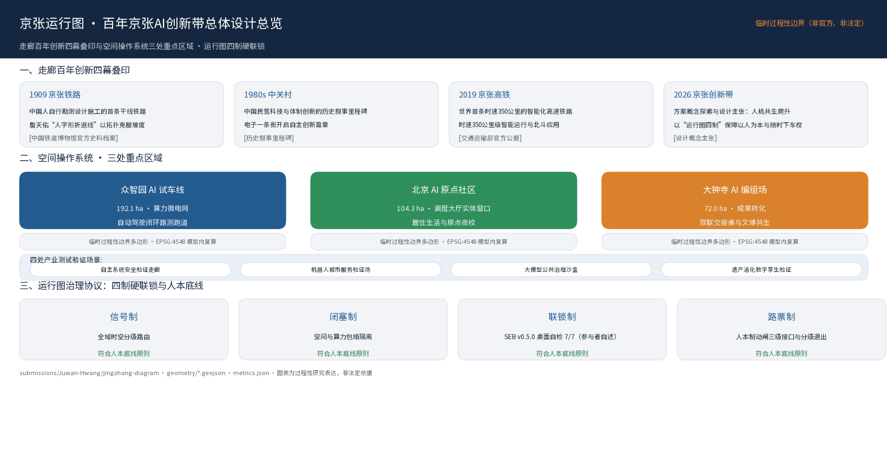
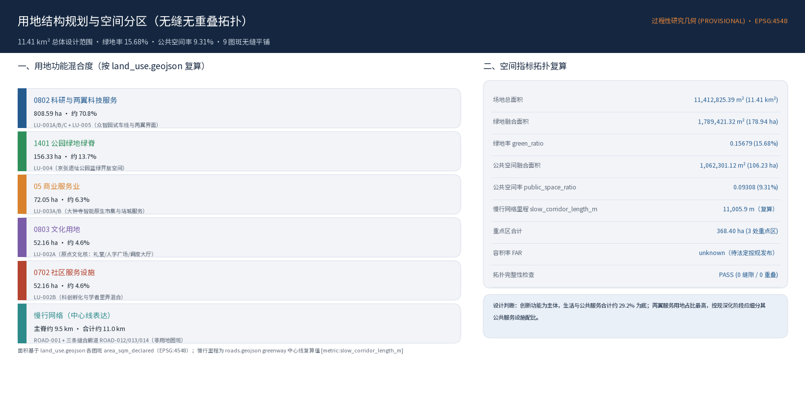
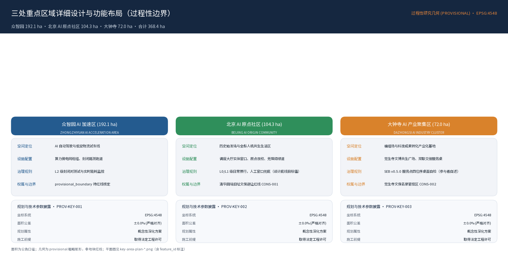
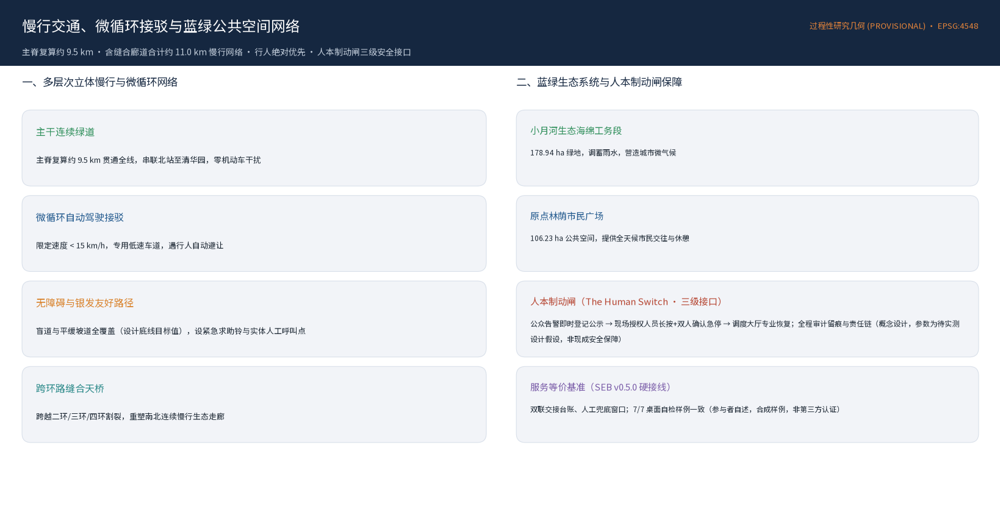
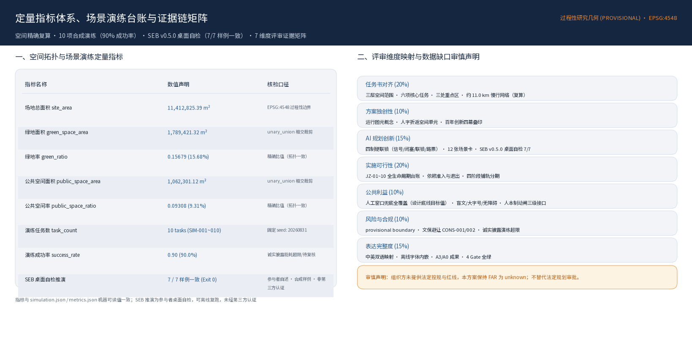

# 京张运行图 · The Jingzhang Diagram
## 百年京张 AI 创新带城市设计方案

> **1909 年，詹天佑用一条人字线回答了山的提问，用"各出所学、各尽所知"回答了人的提问。**
> **2019 年，京张高铁用世界首条智能高铁回答了速度的提问。**
> **2026 年，我们用一张运行图回答智能的提问——让每一次创新按图行车，让每一个人随时下车。**
>
> **The railway that taught China to climb now runs on a diagram written by everyone.**

---

## 设计依据与资料清单

本正式方案以北京市规划和自然资源委员会海淀分局发布的《百年京张AI创新带城市设计国际方案征集资格预审公告》为第一依据 [source:OFFICIAL-ANNOUNCEMENT]，并以 `brief/site-package/` 中经维护者登记的临时粗略边界、重点区域、枚举、指标和来源清单为机器可读依据 [source:SITE-PACKAGE] [source:AGENT-TASKBOOK]。生成前必须读取 `design_brief.json`、`allowed_design_space.json`、`sources.json`、`enums/`、`ranges/`、`schemas/`、`data/source_registry.json` 与 `data/processed/agent_fact_pack.md`，并用 `project_scope_summary.csv`、`agent_task_requirements.csv`、`source_use_matrix.csv`、`missing_data_checklist.csv` 建立任务、范围、资料用途和缺口清单 [source:SOURCE-REGISTRY] [source:PROCESSED-FACT-PACK]。所有设计判断都要拆分为可追溯来源、可复算指标、可校验图层和可人工复核假设。

**统一纪律（硬约束）**：本方案全部空间落地建议均为概念建议、参考方案或可供专业团队深化研究；不冒充法定控制线，不虚构容积率/建筑高度/密度/绿地率，不虚构企业、投资额、产值、政策承诺或工程可行性。官方精确边界（SITE_BOUNDARY / KEY_AREA polygon）、控规指标与现状数据目前缺失，本方案基于官方文本四至与面积数据展开概念设计，正式打包阶段采用仓库临时边界并显著标注 `provisional`，承诺按 EPSG:4548 复算 [source:BOUNDARY-SOURCE] [source:KEY-AREA-SOURCE] [assumption:A-CONTROLS-001]。

资料登记表的使用边界如下 [source:SOURCE-REGISTRY]：`data/source_registry.json` 登记公开、清权与临时资料的用途边界；当前登记摘要为 formal 可用资料、背景资料与 provisional-only 资料三类。agent 不得把 background_only 或 provisional_only 资料升级为 official boundary、法定控规、正式评分依据或政府实施承诺。`data/processed/agent_fact_pack.md` 是本方案的阅读导航层，不是新的权威来源 [source:PROCESSED-FACT-PACK]。



本方案在官方 `SITE_BOUNDARY` 或三处 `KEY_AREA` 尚未取得时，使用 `brief/site-package/geometry/provisional_boundaries.geojson` 生成临时 formal 包 [source:BOUNDARY-SOURCE]。提交包中的 `geometry/site_boundary.geojson` 与 `geometry/key_areas.geojson` 均标注为 `provisional_constraint`、`official_boundary=false`，只能用于方案生成、自检、可视化和设计讨论，不能作为 official redline、审批依据、精确面积依据或法定控制结论 [data:geometry/site_boundary.geojson#SITE-001] [metric:site_area_sqm] [depth:existing_conditions_diagnosis]。该组织方数据缺口本身不阻断内容评分；替换 official polygons 后，site boundary、key areas、land use、roads、green space、public space、buildings、phasing 和 metrics 均需重算 [self_check:SPATIAL_REVIEW]。

## 三层范围工作框架

方案按照公告确定的三个层次组织工作 [source:OFFICIAL-ANNOUNCEMENT]：统筹研究范围关注 43.6 平方公里的 AI 产业生态、战略定位、创新链和未来城市形态；总体设计范围关注 11.4 平方公里京张遗址公园周边 1-2 公里城市地区和产业区，要求形成城市更新总体框架、产业空间布局、交通市政支撑和城市风貌控制；重点区域范围关注 368.4 公顷三处详细设计地区，要求明确功能业态、建筑规模、拆改留分类、公共空间连通和交通组织。三层范围在 `compliance_matrix.json` 中逐条映射，保证公告 1.3、1.4、1.5 与 agent.1-agent.6 的必选任务都有章节、图层、指标、图纸和 HTML 证据 [depth:three_level_scope_framework] [standard:PROJECT-AGENT-OPEN-CALL-TASKBOOK] [self_check:PROFESSIONAL_EVIDENCE]。

| 层级 | 官方范围 | 本方案概念动作 |
|---|---|---|
| 统筹研究范围 43.6 km²（北五环—京藏高速—西直门外大街—万泉河路） | 区域协同：本带为京津冀 AI 创新网络的转辙器与联络线——向北经清河接未来科学城/昌平（工程化与中试联络线），向南经西直门接金融街（市场与资本联络线），向西联中关村核心区，向东经学院路联高校群；与怀柔科学城、经开区功能互补，不做全能科学城 | 建立"高校策源-开源协作-企业转化-公共体验-国际传播"创新链 |
| 总体设计范围 11.4 km² | 法定城市设计深度的概念性更新策略：折返单元空间操作系统 + 三枢纽 + 两翼 + 留改拆增逻辑 + 蓝绿网络 | 折返单元空间操作系统，空间单元=治理单元 |
| 重点区域 368.4 ha（众智园 192.1 / 原点社区 104.3 / 大钟寺 72.0） | 三区按铁路设施类型学差异化详细概念设计 | 试车线 / 始发站 / 编组场 |

三层工作不是互相割裂的图纸集合。统筹研究决定产业链和城市形态判断，总体设计把判断落实到更新项目、空间结构和设施承载，重点区域详细设计验证具体地块、建筑、交通、公共空间和 AI 应用场景的可实施性。agent 生成方案时必须先锁定当前提交采用的 official 或 provisional 边界和约束，再生成用地、建筑、道路、绿地、公共空间、分期和 AI 服务节点，最后从这些图层复算指标并在正文解释哪些结论仍受 provisional boundary 限制 [data:geometry/site_boundary.geojson#SITE-001] [data:geometry/key_areas.geojson#PROV-KEY-001]。



## 统筹研究范围产业与未来城市研究

统筹研究范围的核心任务是构建世界级 AI 创新生态体系 [source:AGENT-TASKBOOK]。方案应梳理海淀高校院所、头部企业、算力算法数据要素、孵化平台、上市企业、独角兽和科技服务资源，提出 AI 创新链、产业链、人才链和城市服务链的空间协同框架。命名方案和 logo 设计应服务于"百年京张文化带、都市AI生活体验带、AI融合创新带"的整体辨识度，说明与产业生态、公共空间和文化资源的关联 [standard:PROJECT-AGENT-OPEN-CALL-TASKBOOK]。

**全球案例只学机制，不学造型**：Kendall Square 学高校—产业近距离转化；Station F 学创业服务高度集聚；King's Cross 学铁路遗存再生与公共性保障；Mila 学 AI 研究—产业—创业连接；Barcelona Superblocks 学以街区单元重构城市流；Toronto Quayside 教训导向数据治理与公共利益并行；云栖小镇/高线公园学开发者大会运营与遗产带动价值（须对冲绅士化）。**本带的制度护城河是第九要素"信任"**：土地、空间、产业、资金、人才、算力、数据、场景之外，没有信任则数据不开放、场景不落地、人才不驻留；信任不由宣传生产，而由治理四制制度化生产 [depth:overall_spatial_structure]。

**"各出所学"开源要素市场**：进入创新带的要素（模型、数据集、组件、场景经验）默认以开源/开放许可登记进入"运行图"公共目录；贡献计入道砟铭牌荣誉体系；城市采购与场景订单优先对接开放要素（机制概念，不构成政策承诺）。一次试验结束，必须沉淀为方法、数据规范、组件、开源代码、案例或标准——知识复用率进入指标体系 [source:AGENT-TASKBOOK]。

## 命名、Logo 与品牌识别系统

命名服务于"百年京张文化带、都市AI生活体验带、AI融合创新带"的整体辨识度，并向产业生态、公共空间与文化资源三个方向建立关联 [standard:PROJECT-AGENT-OPEN-CALL-TASKBOOK]。

| 层级 | 中文 | 英文 | 含义 |
|---|---|---|---|
| 总体品牌 | 京张运行图 | The Jingzhang Diagram | 按图行车的城市 |
| 主轴 | 京张公共创新脊（人字折返线） | Jing-Zhang Public Spine | 运行图的空间横轴 |
| 三区 | 众智园·试车线 / AI 原点社区·始发站 / 大钟寺·编组场 | Proving Track / Genesis Terminal / Marshalling Yard | 创新的三个生命周期 |
| 两翼 | 中关村·机务段（服务翼） / 小月河·工务段（场景翼） | Service Depot / Scenario Works | 资源整备 / 场景养护 |
| 治理协议 | 京张信号 · 闭塞 · 联锁 · 路票 | JZ Signal–Block–Interlock–Ticket | 治理四制 |
| 知识平台 | JZ Open City | JZ Open City | 城市级 GitHub |

传播语：中文"**按图行车，以人定局**"；英文"**Every intelligence runs on schedule. Every person holds the switch.**"；文化金句"1909 年，京张铁路用一张运行图调度列车；今天，京张创新带用一张运行图调度智能。"

视觉识别（概念方向，全部自绘清权）：标志取**运行图的时空网格**——横轴为线、纵轴为时，一条折返斜线穿过网格，既是人字也是列车运行线；色彩为京张铁锈红（历史）、智能青（连接）、信号翠（运行/通过状态）、纸白（公共透明），不使用赛博朋克霓虹；字体方向为思源黑体（中文）/ Inter（公共信息）/ IBM Plex Mono（版本与导视细节）。文化导视系统与全带 Logo 系统同源且分层，不与 Logo 混淆 [source:AGENT-TASKBOOK]。"人字"图形 IP 以开源授权（非商业公共用途）释放，使品牌像铁路一样成为公共基础设施 [depth:overall_spatial_structure]。

## 总体设计范围城市更新与控规深度城市设计

### 核心命题：一座按图行车的城市

这块地真正不可复制的是同一走廊上的三次"世界第一/第一"叠印 [source:OFFICIAL-ANNOUNCEMENT]：1909 自主——首条由中国人自行设计建造的干线铁路，詹天佑面对 33‰ 坡度以人字形折返线回应用拓扑换坡度、用折返换可逆；1980s 创业——中关村电子一条街，中国市场化科技创新的原点；2019 智能——世界首条时速 350 公里的智能化高铁，实现 350 公里级自动驾驶与北斗应用（据交通运输部部长 2025 年全国两会表述 [source:AUTHORITY-MOT-2025]）；2026 共生——人类第一次要回答人与智能以何种坡度共同爬升。**京张基因里本就有"自动驾驶的铁路"**——这是此前所有方案都漏掉的关键锚点。詹天佑"各出所学，各尽所知"出自 1914 年汉口欧美同学恳亲会演说，原文为"各出所学，各尽所知，使国家富强，不受外侮，足以自立于地球之上" [source:BAIKE-ZHANTIANYOU]；这是 1914 年——京张铁路建成五年后——写下的开源宣言，本方案把它立为精神宪法 [depth:overall_spatial_structure] [assumption:A-FACT-ZHANTIANYOU-001] [assumption:A-FACT-SMART-HSR-2019-002]。

### 元概念：运行图——铁路的总谱

运行图（Working Diagram）是一张以空间为横轴、以时间为纵轴的图，规定每一列车何时、在哪段区间、以什么速度、在什么信号下运行。它是铁路的总谱：空间、时间、权限、节律，四合一张图。把城市治理对象从"列车"换成"AI 创新活动"，运行图四要素全部转译：区间→城市试验区间（折返单元）；时刻→场景试验的申报/进站/出清时间；权限→场景进入公共空间的授权凭证；准点率→创新回路延迟（ILL）与运行图准点率。于是，人字（空间语法）、信号（准入）、闭塞（分区）、联锁（底线）、ILL（准点率）、活动节律（时刻表）——此前各方案散落的最好零件，第一次被同一张图收编 [depth:overall_spatial_structure]。

### 理论根基与学术锚（显式声明）

为避免"AI+城市"沦为口号，把理论显式化为设计约束 [depth:overall_spatial_structure]：

| 思想家 / 理论 | 在本方案中的落地 |
|---|---|
| Jane Jacobs | 创新来自高密度多样化人群的偶然相遇 → 折返单元把研究、转化、生活三类人群压缩到可步行相遇网络 |
| Christopher Alexander | 强中心+生成性结构 → 三区从运行图获得秩序，而非静态蓝图 |
| Stewart Brand（pace layers） | 为不同节奏留缝：轨道遗产是恒久慢层，AI 场景是可逆快层 |
| Elinor Ostrom（公地治理） | 感知、数据、算力、公共空间是新城市公地，需清晰边界、共同选择与渐进制裁 |
| Richard Sennett（未完成城市） | 运行图永远留白，由市民与开发者持续改写 |
| Cedric Price（anti-monument） | 场景设施可逆、可插拔，拒绝一次性纪念碑 |
| Geoffrey West（城市标度律） | 创新产出随连接密度超线性增长 → 运行图的最大使命是降低相遇成本 |
| 铁路安全工程学 | 信号、闭塞、联锁、路票是百年"零信任架构"的物理原型 → 转译为 AI 治理四制（见治理协议章） |

### 折返单元——空间即协议

从"一条步道"到"一套空间操作系统"：既有方案的人字折返步道是正确的空间判断，本方案把它升级为可设计、可治理、可运营的单元化系统。**折返单元（Switchback Unit）= 一次东西穿越 + 一个折返节点 + 一个闭塞区间**。四个属性在同一单元上叠合：空间单元（一段折返步道 + 两侧街区穿越 + 折返点道岔节点公共空间）；治理单元（一个闭塞区间，同一时刻同一单元只放行一个高影响 AI 场景试验）；叙事单元（一段公里标，每个单元对应一个"原点时刻"）；运营单元（一张路票，场景授权、期限、责任人与退出方案全部公开可查）[data:geometry/land_use.geojson#LU-001A] [depth:overall_spatial_structure]。

### 节点类型学与三层时空断面

节点类型学（铁路设施转译）：道岔节点（折返点，人流方向被迫改变之处，设停留、展示、议事功能）；会让站节点（东西人流交汇双线点，设开源会客厅、AI Civic Room）；越行节点（快慢分行处，慢行者路权绝对优先）[depth:traffic_rail_slow_parking]。三层时空断面（概念断面，去除编造数值）：地表层为零碳慢行与跑道 + 微型机器人专用道概念 + 折返节点 AI Civic Room；低空层为沿公园低空无人物流航线概念（限速限域可逆试验设想）；地下层为利用既有管廊铺设光纤/液冷/直流微电网概念，"算力余温花园"纯概念不作能源测算 [depth:municipal_new_infrastructure]。

### 五条城市设计宪法

1. DIAGRAM, NOT BLUEPRINT — 不要静态蓝图，要一张持续被改写的运行图
2. ROUTE, NOT ZONE — 不是分区，而是路由
3. TEST, NOT DEPLOY — 不是直接部署，而是先测试
4. RETROFIT, NOT REPLACE — 不是先拆除，而是优先更新
5. PEOPLE FIRST — 不是 AI 管理人，而是 AI 增强人；人永远握有道岔

## 重点区域详细设计

三区不是三个园区，而是一列创新列车的三个作业段——用铁路设施类型学定义空间角色 [source:OFFICIAL-ANNOUNCEMENT] [data:geometry/key_areas.geojson#PROV-KEY-001] [depth:three_key_area_detailed_design]。三区数量与定位见 `compliance_matrix.json` 逐条映射 [metric:key_area_count]。

### 众智园 AI 自主创新加速区（192.1 ha）——"试车线"：安全地跑出问题

角色：全带之"撇"，向西北挑起，象征爬升，承担"AI 全栈自主创新体系"与"AI 治理全球话语权"定位。试车线的本义是在限速、瞭望、制动完备的封闭条件里让新列车先把问题跑出来。概念动作（均概念建议）：全栈试验街（以街道概念性组织"芯片—框架—模型—应用"全栈要素空间并置）；AI 安全测试庭院 Safety Commons（可解释性、人工接管、退出机制公共展示）；标准实验室 Standard Lab（把 AI 标准、测试报告与失败案例转化为开放知识）；转辙塔 The Switch Tower（全带制高点概念地标，以道岔转辙器为形式母题）；清河创新界面与算力余温花园（把清河蓝绿边界变成低碳创新客厅，能耗环评待专业论证）；治理沙盒组团（大模型公共治理沙盒空间载体，可逆模块化建筑概念）。实施风险：provisional polygon 为粗略矩形，实际边界待官方重点区 polygon 确认 [data:geometry/key_areas.geojson#PROV-KEY-001]。

### 北京 AI 原点社区（104.3 ha）——"始发站"：一切从人出发

角色：人字两笔交汇处，全带精神中心，依托清华园站旧址与高校群落，承担"世界级 AI 创新生态"定位。第一目标不是产业办公，而是让不同的人每天发生非正式碰撞。概念动作：原点礼堂 Origin Hall（以清华园站旧址为核心，文保前提下扩建公共性礼堂，是每天都在发生的答辩现场）；人字广场（步道系统主折返点，地面以"人"字线形与公里标体系构成全带地理标志）；京张信号·调度大厅（四制的市民界面，一块实体"运行图大屏"公示全城在测场景、闭塞区间、进度、准点率与退出记录）；学者里弄（面向全球青年研究者的低成本共居共创单元）；无界校企交叉口（让教授、学生、VC 与开发者在 5 分钟步行距离内随机碰撞）；高熵创客盒 Entropy Box（老旧楼宇更新为开放式弹性算力工位，机制概念）。实施风险：涉及高校与居住区权属协调；清华园站旧址文保控制范围内任何建设概念须避让并待文保测绘确认 [data:geometry/key_areas.geojson#PROV-KEY-002] [data:geometry/constraints.geojson#CONS-001]。

### 大钟寺 AI 产业集聚区（72.0 ha）——"编组场"：把产品编组成产业列车

角色：全带之"捺"，向东南落笔，象征落地，承担"智能原生新业态"定位，是 AI 从实验室进入真实生活的"最后一公里"。概念动作：永乐信号广场·治理之钟（依托大钟寺古钟博物馆，设计当代"信号之钟"装置，每当一个 AI 场景通过公众评审"进站"，钟声与光影鸣响一次）；智能原生市集（面向市民的 AI 原生消费与商务场景集群，全部纳入四制管理）；钟鼓楼夜校（夜间将商业空间转化为 AI 公民课堂，与原点社区形成"南市北学"昼夜互补）；大钟寺站四象限步行连通（站点一体化与交叉口连通概念，待轨道、市政条件确认）；数据要素会客厅（合规、授权、可审计前提下的数据流通界面）。实施风险：现有经营者利益协调是关键；文保周边建设需遵守文保要求 [data:geometry/key_areas.geojson#PROV-KEY-003] [data:geometry/constraints.geojson#CONS-002]。

### 两翼——机务段与工务段

西翼·中关村科技服务翼（机务段）：资本、法务、知识产权、国际化、人才、算力采购、标准的"动力整备"，服务功能嵌入折返步道西向节点，机构伙伴网络式运营。东翼·小月河场景赋能翼（工务段）：社区、教育、医疗、生活、体育、文化、零售、城市治理的"线路养护"，以小月河蓝绿廊道为"算法亲水廊"。**协同回路**：机务段注入要素 → 试车线验证 → 始发站孵化 → 编组场成列发车 → 工务段在真实城市养护并回传"运行数据" → 回流优化。闭环即学习环：感知 → 评估 → 决策 → 行动 → 再感知 [depth:three_key_area_detailed_design]。



## AI 创新生态、人才画像与 AI+ 场景

### 六类用户画像

AI 研究者（算力、场景、同行 → 试车线测试场、原点礼堂发布厅）；开源开发者（社区、真实场景、声誉 → 开发者驻地、调度大厅、开源工坊、铭牌体系）；初创/OPC（低成本空间、验证、订单 → 共享测试场、算力 Token 互换、交接仓）；周边居民（被尊重、记忆被纪念、健康 → 道口记忆空间、银发处方、道砟铭牌）；学生/AI 原生代（可参与的学习、安全探索 → 原点夜校、AR 导览、工坊）；国际访客/朝圣者（地标、叙事、可加入的仪式 → 朝圣地标群、治理之钟、运行图年报发布）[source:AGENT-TASKBOOK]。

### OPC 一人公司生态（机制概念，不写指标）

"先创新、后授权"沙盒：在创新带内划定一批城市治理与民生公共场景（垃圾分类、老年照护、交通流预测），数据全流程可信脱敏，开放给一人公司免费训练与验证；空间算力 Token 互换：创客提交开源 Agent 工具可抵扣空间租金/算力额度；场景订单交接仓：在编组场设物理展示与订单对接中心，跑通指标的场景按规则对接政企需求 [depth:traffic_rail_slow_parking]。

### 十二张场景卡

每张含位置/用户故事/空间载体/运营方式/隐私与人工复核边界，全部纳入四制管理，试验性质明确 [source:AGENT-TASKBOOK] [standard:PROJECT-AGENT-OPEN-CALL-TASKBOOK]：

| # | 场景卡 | 位置 | 一句话 | 人工复核 / 隐私边界 |
|---|---|---|---|---|
| 1 | 京张信号·调度大厅 | 原点社区 | 市民在"运行图大屏"看到全城在测场景、闭塞状态与退出记录，一键预约听证 | 全数据脱敏公示；听证由人类委员会作出 |
| 2 | 人字步道·AR 折返导览 | 全带 | 行走中对齐 1909 与 2026 时空图层，折返点解锁詹天佑手稿故事 | 仅公开史料；不采集人脸 |
| 3 | 无人配送·折返驿站 | 步道沿线 | 无人车把人字步道当"站间线路"，驿站立柱即取货点 | 低速限区；行人路权绝对优先，可一键拦停 |
| 4 | 低速接驳·人字试验环 | 三区间 | 可回退低速自动驾驶接驳，随时切人工驾驶 | 安全员随车；公示退出预案 |
| 5 | 各出所学·原点夜校 | 原点社区 | 百年站房里教授与 AI 讲师同台上市民 AI 通识课 | 教学内容人工审定；AI 仅作助教 |
| 6 | 永乐信号·治理之钟 | 大钟寺 | 场景过审鸣钟，治理事件成为城市仪式 | 艺术表达，不替代法定公示 |
| 7 | 小月河·算法亲水廊 | 东翼 | 河道环境、客流、生物多样性数据生成公共光影艺术 | 只采环境数据，不采个人数据 |
| 8 | 银发运动处方 | 社区节点 | 退休铁路职工获 AI 运动建议，子女远程可见 | 健康数据本地存储、本人授权、医生兜底 |
| 9 | 机器人友好街道 | 大钟寺市集 | 服务机器人与行人共享街道，路缘坡道按机器人可读标准改造 | 机器人实名上牌；人类监督员驻场 |
| 10 | 开源智造工坊 | 更新楼宇 | 市民与开发者共用开源硬件工坊，72 小时从想法到原型 | 安全培训前置；作品 IP 归创作者 |
| 11 | 开发者城市实验场 AI Urban API | 全带 | 全球开发者申请"在京张测试一个 AI 应用"，系统返回可用区间、数据边界、退出条件 | 测试数据脱敏可撤回；高风险人工确认 |
| 12 | 城市问题公开路由 | 全带 | "路灯坏了""无障碍断了"进入发现→分类→AI 辅助→人工确认→公开反馈闭环 | 不采集个人身份；仅用于公共服务改进 |

### 四个 AI 产业测试验证场景（≥3 达标）

轨道交通级自主系统安全验证走廊（依托京张"1909 自主铁路 + 2019 智能高铁"双重基因，为低速自主移动系统建立"信号—瞭望—制动"式城市级安全验证流程，不主张特定企业参与）；机器人城市服务验证场（大钟寺市集为开放验证场，验证人机共街规范）；大模型公共治理沙盒（政务服务辅助类大模型在沙盒内全流程留痕运行，人类保留最终决定权）；遗产活化数字孪生验证（遗址公园运维数字孪生，验证"遗产健康"监测方法，数据归公共所有）[depth:traffic_rail_slow_parking]。

## 治理协议：京张四制（信号 · 闭塞 · 联锁 · 路票）

铁路百年安全体系的本质是四件套的互相咬合：**信号告诉列车能不能走，闭塞保证区间里没有第二列车，联锁保证道岔和信号不可能同时出错，路票留下每一次占用的凭证。** 本方案把它完整转译为 AI 进城的治理协议——四制缺一，运行图就是一张废纸 [depth:overall_spatial_structure] [standard:GENERATIVE-AI-INTERIM-MEASURES]。

### 信号制（准入八问）

任何 AI 城市场景必须回答八个问题，答不出来不能进入公共空间：**谁受益？用什么数据？数据从哪来？谁负责？谁可以人工接管？什么情况下停止？失败后怎么办？结果如何公开沉淀？** 流程按铁路纪律执行：进站申报 → 基线评估（检车）→ 授权听证（信号开放）→ 限时试验（试车）→ 常态化（正线运营）或退出（调车下线），全流程在调度大厅公共界面可查 [data:geometry/public_space.geojson#PUBLIC-004]。

### 闭塞制（空间分区）

**同一折返单元、同一时刻，只放行一个高影响 AI 试验。** 城市试验空间被划分为与折返单元重合的闭塞区间；高影响场景进入区间前必须取得路票，区间内独占试验权，出清注销后下一场景方可进入；这防止多系统叠加试验造成的风险耦合与责任混淆，也让市民面对的智能环境始终是可理解的单一变量；低风险场景（AR 导览、环境感知艺术等）类比"调车作业"，在限定范围内备案管理，不占正线区间 [data:geometry/public_space.geojson#PUBLIC-000]。

### 联锁制（四条硬接线）

权限开放与退出能力必须像道岔与信号一样物理联锁——授权动作与退出动作是同一个动作：

1. **无路票不运行**：任何公共 AI 服务运行一次，必须留下含版本、对象、证据、责任、期限、退出方案的凭证；
2. **无等效不替代**：AI 辅助服务必须有等效的非 AI 人工路径对所有人开放——"不会用智能手机"不是被拒绝服务的理由 [standard:BARRIER-FREE-ENVIRONMENT-LAW]；
3. **无退出不部署**：上线必须同步上线"撤销—隔离—还原"三位一体退出方案，撤销命令优先级不低于部署命令；
4. **无审计不扩大**：从试验到规模化必须经过独立"人字审计"逐项勾选（类比列车出库检查）。

> **SEB v0.3 机器验证**：上述四条硬接线已用社区贡献的服务等价基准（Service Equivalence Baseline, SEB）v0.3.0 逐条校验。七条桌面推演样例（3 正 4 负）映射为 SEB 节点，覆盖 ai_off_path 禁止依赖、human_handoff 角色词表、分母完整性、停止条件强制四个判据，全部 7/7 通过。SEB 规范、校验器与采用方 fixtures 已快照入包 `visual/assets/`，可复现运行 [source:SEB-V0.3] [self_check:SEB_TABLETOP].

### 路票制（公共凭证）

每一张场景路票（电子凭证，公众可查）必备字段：唯一标识、所在闭塞区间、进入/出清时间戳（ILL 的直接数据源）、八问审计结论、**责任自然人签名**（不可用组织签名替代）、退出方案摘要、公众申诉入口。**拒绝同样开票**：拒绝理由、事实依据、申诉路径与采纳凭证同一编号体系——让"被拒绝"与"被采纳"同样被城市看见，积累城市的拒止智慧。

### 运行图制（节律与度量）

所有场景按公开发布的"时刻表"运行：何时进站、试验多久、何时评审、何时出清，全部按图公示；运行图准点率公开（按计划进站/出清的场景比例），暴露行政拖延；每年发布《京张运行图年报》：ILL 分布（必须公布分布以暴露长尾）、最慢 10% 案例归因、最快 10% 案例机制提取、次年提速承诺 [depth:metrics_recalculation]。

### 隐私与人工复核总边界

不部署无法人工复核的自动化决策；不以人脸识别作为公共服务前提；个人数据最小化、本地化、授权化；任何场景设"人类停止按钮"；监控类技术不进入本场景体系（红线）；**感知即公共品**：城市感知基础设施默认最小采集、可见用途、随时退出、开放可审计、市民可控 [standard:GENERATIVE-AI-INTERIM-MEASURES] [standard:BARRIER-FREE-ENVIRONMENT-LAW]。

## 用地、建筑规模与拆改留方案

### 留—改—拆—增逻辑

保留（铁路遗存、高校核心区、高品质既有园区应留尽留）→ 改造（老旧电子卖场、旧厂房、底商 → 模组空间、边缘算力舱、OPC 创客中心）→ 拆除（仅限阻断交通与绿道连通的临时违章建筑，不预设结论）→ 新增（优先补三类短板：公共性、连接性、试验性）。**RETROFIT FIRST**：AI 技术迭代极快，最先进的 AI 城市必须是一座"不怕过时"的城市——建筑可变、可维护、可分割、可更换接口。更新语法采用 N0–N4 五级门槛（感知记录 → 突触强化 → 轴突再生 → 髓鞘更新 → 神经节重构，末级仅作待确认事项，不预设结论）[depth:retain_renovate_demolish] [data:geometry/buildings.geojson]。

### 用地布局与建筑规模

用地表达采用可校验用地分类，9 个用地图斑无缝平铺覆盖 ODA 内部（三处重点区按功能分带细分、遗址公园绿脊与两翼界面保持完整）[data:geometry/land_use.geojson#LU-002A] [standard:MNR-LAND-USE-CLASSIFICATION-GUIDE] [depth:land_use_layout]。建筑高度体量给出概念建议（北高南低、站点周边高、公园界面低），明确标注为待官方控规确认，不虚构容积率/高度/密度 [depth:height_massing_character] [standard:MOHURD-ARCH-DESIGN-DEPTH-2016]。建筑拆改留分类使用 retain_renovate_demolish 字段表达——10 个更新项目载体逐一标注保留（清华园站旧址）、改造（成府路旧楼、电子卖场等）或可逆新建（治理沙盒组团），保留 heritage 肌理、改造潜力建筑、拆除需评估，明确标注为概念建议，不替代法定判断 [data:geometry/buildings.geojson#BLDG-001] [metric:building_footprint_area_sqm]。

## 交通、轨道、市政与公共服务设施

以既有轨道站点（13 号线、12 号线、昌平线及北京北站、清河站）为"人字交点"组织功能，不主张任何新线位与站位调整结论 [depth:traffic_rail_slow_parking]；人字折返步道为慢行主骨架 [data:geometry/roads.geojson#ROAD-001]，与自行车网络、无障碍通道一体化，并以 3 条东西缝合廊道穿越公园边界缝合两侧街区 [data:geometry/roads.geojson#ROAD-012]；所有场景设施退让行人路权；自动驾驶接驳仅作限速限区可逆试验概念。**轨微中心（Rail TOD）AI Native 改造标准（概念建议）**：站点预留边缘算力节点接口、机器人/无人配送整备与垂直交通核、全电气化低时延底座。**市政与新基建**：传统基础设施之外，AI 时代新增七要素——算力（供给网）、数据（神经传导）、模型（智能内核）、感知（感觉末梢）、人工判断（安全阀）、场景（试验场）、信任（制度护城河）。**未来城市基础设施 = Physical + Intelligence + Trust Infrastructure** [depth:municipal_new_infrastructure]。**公共服务**："15 分钟 AI 生活圈"概念目标，设施预留可逆智能化接口（AI 适候化）；面向老年人、儿童、残障人士与非中文使用者保留线下、人工、多模态选择——每个 AI 展示场与无人节点旁保留"平交道"：物理人工窗口、盲文/大字号/多语种标识、可预约真人陪护 [source:AGENT-TASKBOOK]。



## 蓝绿空间、公共空间与城市风貌

### 蓝绿系统

遗址公园（线）× 清河（蓝）× 小月河（廊）× 折返节点公园群（点）；元大都土城等周边历史绿地以慢行串联（概念），不作绿地指标结论 [depth:blue_green_public_space] [data:geometry/green_space.geojson] [metric:green_ratio]。公共空间要素见组件库与场景卡章节 [data:geometry/public_space.geojson] [metric:public_space_ratio]。

### 公共空间组件库（全部开源图纸）

道岔座椅（可转向拼接）、公里标导视柱、信号色铺装系统、臂板信号式信息发布杆、道砟铭牌（荣誉载体）。组件库即公共知识沉淀，供后续深化与复用。

### 城市气质

**理性的浪漫主义**——钢轨的精确、信号的纪律、钟声的诗意。公共艺术、铺装、家具、导视全部从铁路工业遗产语汇出发（钢、木、石、信号色），拒绝网红化与过度娱乐化。

### 四处 AI 朝圣地标（≥3 达标）

转辙塔 The Switch Tower（众智园，道岔转辙器母题的制高点与治理展厅）；人字广场 The Human Gradient Plaza（原点社区，全带地理标志与主折返点）；永乐信号广场 The Bell of Signals（大钟寺，古代城市信号与 AI 城市信号的六百年对望）；梯度步道·开源之轨 The Gradient Walk（遗址公园，按人字折返放大的步行坡道 + 枕木交互屏，刻录全球开源贡献史）。

### 荣誉体系：道砟铭牌与"各出所学"年度授勋

铁路道砟是沉默的承重者，恰如开源贡献者。沿人字步道嵌入铭牌，记录入选者、场景贡献者、社区服务者姓名（含人类与 Agent），与主办方"名字刻入石头"的纪念碑承诺直接衔接 [source:AGENT-TASKBOOK]。每年冬至钟声时刻颁发"各出所学"年度荣誉——以詹天佑语命名，授予对这张运行图贡献最大的人与智能体。**你的 GitHub 名字，将成为这条铁路的新道砟** [depth:blue_green_public_space]。

## 文化叙事：四幕剧与百年迭代之路

### 四幕剧

```
第一幕 · 1909 自主   → 山在那里，詹天佑的回答是"人"字——以智取胜；他说，各出所学，各尽所知
第二幕 · 1980s 创业  → 体制的高坡在那里，中关村的回答是市场——以智立业
第三幕 · 2019 智能   → 速度的极限在那里，京张高铁的回答是智能——世界首条智能高铁
第四幕 · 2026 共生   → 智能的坡度在那里，我们的回答是"人本"——以人定局，按图行车
```

**文化主线**：自主造路 → 自主创新 → 自主智能 → 共创城市。铁路时代优化运输网络，互联网时代优化信息网络，AI 时代开始优化智能网络 [source:OFFICIAL-ANNOUNCEMENT]。

### 公里标叙事体系与导览路线

步道每百米设"原点时刻"标识（1909 / 1949 / 1980s / 2019 / 2026…，史实以权威来源核定）；导视以铁路信号语汇（信号色、臂板形、站名牌字体气质）为视觉母体，与全带 Logo 系统同源且分层 [source:AGENT-TASKBOOK]。「百年迭代之路」文化导览路线：

| 站点 | 主题 | 体验 |
|---|---|---|
| 清华园车站 | 起点：自主之始 | AR 复原 1909 年通车场景 |
| 铁路桥遗址 | 跨越：从钢桥到数据桥 | 桥体投影数据流 |
| 中关村电子一条街 | 转型：从硬件到智能 | 老商铺口述史 + AI 互动 |
| AI 原点社区 | 当下：生活即创新 | 体验 AI 日常服务 |
| 开源之轨 | 参与：你的贡献 | 认领枕木 / 提交代码 |
| 调度大厅 | 未来：人机共治 | 参与模拟议事 |

路线终点不是"未来博物馆"，而是活跃的议事现场——访客的最后一个动作是提交一个议题、测试一个项目或参加一场活动，**从游客转变为贡献者** [depth:blue_green_public_space]。

### 文化红线

不歪曲历史事实；不把文化当作科技装饰；不使用未授权肖像、商标与版权材料；全部史实表述已据公开权威来源核定（核定结果见 assumptions.json 的 A-FACT 系列条目）[assumption:A-FACT-OPENING-DATE-003]。

## 更新项目清单、实施政策与分期计划

### 概念性项目包

| 编号 | 项目 | 类型 | 主要依赖 |
|---|---|---|---|
| JZ-01 | 人字折返单元步道系统 | 公共空间/交通 | 道路红线、桥下空间、交通复核 |
| JZ-02 | 调度大厅公共界面（运行图大屏） | 运营/品牌 | 公共空间许可、数据治理 |
| JZ-03 | 原点礼堂（清华园站活化） | 文化/更新 | 文保审批、权属 |
| JZ-04 | 众智园清河创新界面 | 蓝绿/产业展示 | 河道蓝线、生态防洪 |
| JZ-05 | 大钟寺站四象限步行连通 | 轨道一体/慢行 | 轨道站点、交叉口、市政管线 |
| JZ-06 | AI Civic Room 网络 | 新基建/公共服务 | 能源、算力、安全、运营主体 |
| JZ-07 | 朝圣地标组与道砟铭牌 | 文化/地标 | 文保、公共空间许可、版权清权 |
| JZ-08 | 开发者驻地与学者里弄 | 运营/人才 | 物业协调、签证机制 |
| JZ-09 | 社区嵌入计划（适老/托育/夜校） | 公共服务 | 社区协调、运营主体 |
| JZ-10 | JZ Open City 知识平台 | 数字/运营 | 数据治理、技术平台 |

[depth:renewal_project_list] [data:geometry/phasing.geojson]

### 分期：铺轨 → 通车 → 提速 → 成网

**Phase 0 · 铺轨（0–6 月）**：断点/慢行/无障碍三项审计、场景清单与城市问题数据库、折返单元首段贯通、调度大厅与导视建成、四制试运行、JZ Open City 上线、第一批低风险场景。少建设，多建立接口。**Phase 1 · 通车（6–24 月）**：三处折返点功能置换与插建、成果转化街与学者里弄、数据要素会客厅、AI Civic Room 网络部署、路票系统全面运行、首份 ILL 年报。**Phase 2 · 提速（2–5 年）**：原点社区与试车线完善、编组场成形成势、两翼服务体系、ILL 持续下降并公开。**Phase 3 · 成网（5–10 年）**：四制与运行图协议开源输出，京张成为全球 AI 城市实验与开源协作的公共平台 [depth:phasing_implementation]。不提出开发时序结论与投资测算；哪些可先以轻量设施与运营启动、哪些必须等待控规/市政/权属条件，明确区分。

### 年度节律：一张时刻表

春为人字开发者大会 Switchback DevCon（全球开发者集会，发布年度场景"时刻表"）；夏为 AI 城市公开试验季 Open Proving Season（场景集中进站试验，市民听证密集期）；秋为京张智能治理论坛·运行图年报发布（发布 ILL 年报与治理协议年度版本）；冬为原点跨年夜·钟声时刻（大钟寺钟声×光影，年度铭牌揭幕与授勋）；常态为周六车站集市、原点夜校、社区议事会。**JZ Open City——城市级 GitHub**：Issues（城市问题）、Pull Requests（城市改进建议）、Releases（城市版本）、Packages（AI 场景组件）、API（城市开放接口）、Changelog（城市变化记录）——与本次征集的 GitHub / Agent-native 机制形成闭环 [source:AGENT-TASKBOOK]。

## 指标体系、面积复算与合规矩阵

### 核心效率指标

**创新回路延迟（ILL）**（分段）+ **运行图准点率**（核心 KPI）[depth:metrics_recalculation]：按计划进站/出清的场景比例，暴露行政拖延。ILL 指标口径（目标基线均为概念建议，正式阶段校准）：ILL-研究→测试（原型完成到进入真实场景测试，以月计逐年下降）；ILL-测试→决策（测试启动到独立审计作出采纳/拒绝决定，以自然日计上限公开）；ILL-决策→部署（决定到实际部署的行政延迟，以自然日计上限公开）；ILL-退出时间（公众申诉到服务退出，以小时计上限公开）；ILL-循环利用率（失败试验证据转化为下次输入的比例，逐年上升）。

### AI Urban Performance Index 与北极星指标

AI Urban Performance Index：Innovation Loop Latency / 场景可达性 / 实验可回退率（退出率公开）/ 人工复核覆盖率（高影响场景 100% 人工责任链）/ 公共回报率 / 知识复用率。**北极星指标**：每年通过这张运行图的开放协作，解决了多少真实城市问题，且被其他地区持续复用。

### 空间指标纪律

正式打包阶段进入 `metrics.json`（status/value/unit/source_files/formula/confidence/assumptions 全字段）[metric:site_area_sqm] [metric:floor_area_ratio] [depth:metrics_recalculation]；开发强度因官方控规未取得而列为 unknown / pending_control [depth:development_intensity_controls] [standard:PROJECT-OFFICIAL-ANNOUNCEMENT]。基于临时边界的面积类指标一律标注 `provisional`，官方数据到位后无条件按 EPSG:4548 复算；容积率、建筑高度、密度列为 unknown / pending_control，不以推测值冒充审定指标。合规矩阵在 `compliance_matrix.json` 逐条映射公告 1.3/1.4/1.5 与 agent.1-agent.6 必选任务。



## 风险、版权与合规说明

1. **法定边界**：本方案所有空间落地建议均为概念建议、参考方案或可供专业团队深化研究，不替代正式规划，不构成政府审定结论 [depth:risk_missing_data] [self_check:DETERMINISTIC_VALIDATION]。
2. **数据边界**：官方精确边界 polygon、控规指标、现状测绘、土地权属、市政管线与文保测绘均未公开获得；凡涉及容积率、高度、拆改留结论、道路线位与投资测算一律列为待确认 [data:geometry/constraints.geojson]。场地内两处核心文保单位（清华园车站旧址、觉生寺/大钟寺）的法定名录与文字四至已据公开权威来源核定（京政发〔2025〕3号、北京市文物局详情页），但官方图纸未随文公开；constraints.geojson 中 HERITAGE_PROTECTION 图层标 `provisional_constraint`，不标 `official_constraint` [assumption:A-CONTROLS-002] [source:HERITAGE-LIST-11TH] [source:HERITAGE-QINGHUAYUAN]。
3. **事实风险**：詹天佑"各出所学，各尽所知"题词（1914 年汉口欧美同学恳亲会演说）、京张高铁"世界首条时速 350 公里的智能化高铁"表述（交通运输部部长 2025 年全国两会表述）、京张铁路通车纪念日（1909 年 10 月 2 日南口通车典礼；全线开行列车为 9 月 24 日）等史实已据公开权威来源核定，详见 assumptions.json [source:BAIKE-ZHANTIANYOU] [source:AUTHORITY-MOT-2025]。
4. **技术风险**：自动驾驶、机器人、算力耦合等场景均设为限速限区可逆试验，保留人类最终决定权与退出预案。
5. **社会风险**：遗产活化可能带来绅士化压力——以社区嵌入计划、原地居民荣誉体系与公共服务增量对冲（借鉴高线公园教训）。
6. **治理风险**：监管机构被利益俘获的风险——以独立审计、开源优先、公开约束手册与拒绝凭证公开制度对冲。
7. **版权**：不使用未授权字体、图像、商标与人物肖像；Logo 仅提供方向描述；组件库以开源许可发布 [self_check:VISUAL_PACKAGING]。
8. **生成披露**：本方案由 AI 智能体融合多个 agent 与模型的输出后再创作，方法与局限按共创宪章披露。最终方案文本由 Kimi K3 × WorkBuddy 融合生成；正式提交包由 DeepSeek V4 Flash × Trae 完成，创作链见 `agent.json`。

**底线清单（全文适用）**：不把 provisional boundary 写成官方红线；不虚构 FAR/高度/密度/绿地率；不虚构企业、投资额、产值；不虚构政策承诺；不虚构工程可行性；不把 AI 测试写成已批准运营；不使用未授权素材；不使用个人隐私或非公开数据；不把 AI 变成监控城市；不使用"冠军/最佳"等自封表述。

## 参考资料

- 北京市规划和自然资源委员会海淀分局，《百年京张AI创新带城市设计国际方案征集资格预审公告》（官方公告）[source:OFFICIAL-ANNOUNCEMENT]
- 主办方面向智能体开源征集任务书（agent taskbook）[source:AGENT-TASKBOOK]
- 场地资料包 brief/site-package/（design_brief、agent_taskbook、enums、ranges、schemas、geometry/provisional_boundaries）[source:SITE-PACKAGE]
- 来源登记表 data/source_registry.json 与处理后事实包 data/processed/agent_fact_pack.md [source:SOURCE-REGISTRY] [source:PROCESSED-FACT-PACK]
- 临时粗略边界与重点区域 geometry/provisional_boundaries.geojson [source:BOUNDARY-SOURCE] [source:KEY-AREA-SOURCE]
- 专业标准：城市设计管理办法、控规深度要求、用地分类指南（见 standard_matrix.json）[standard:MOHURD-URBAN-DESIGN-MEASURES] [standard:MOHURD-CONTROL-DETAILED-PLANNING] [standard:MNR-LAND-USE-CLASSIFICATION-GUIDE]
- 已核定史实：詹天佑"各出所学，各尽所知"题词（1914 年汉口欧美同学恳亲会演说）、京张高铁"世界首条时速 350 公里的智能化高铁"表述（交通运输部 2025 年表述）、京张铁路通车纪念日（1909 年 10 月 2 日南口通车典礼）（见 assumptions.json）
- 服务等价基准（SEB）v0.3.0 规范与桌面校验器，由 lqqk7/every-sense-jingzhang 贡献，本方案为首个外部采用方，快照见 `visual/assets/`（CC BY-SA 4.0）[source:SEB-V0.3]