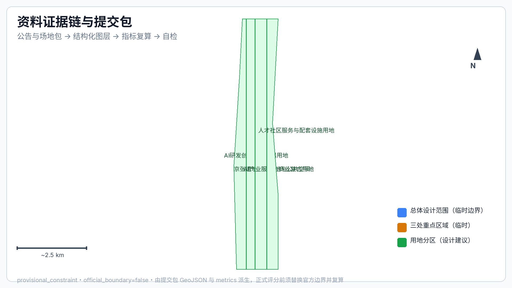
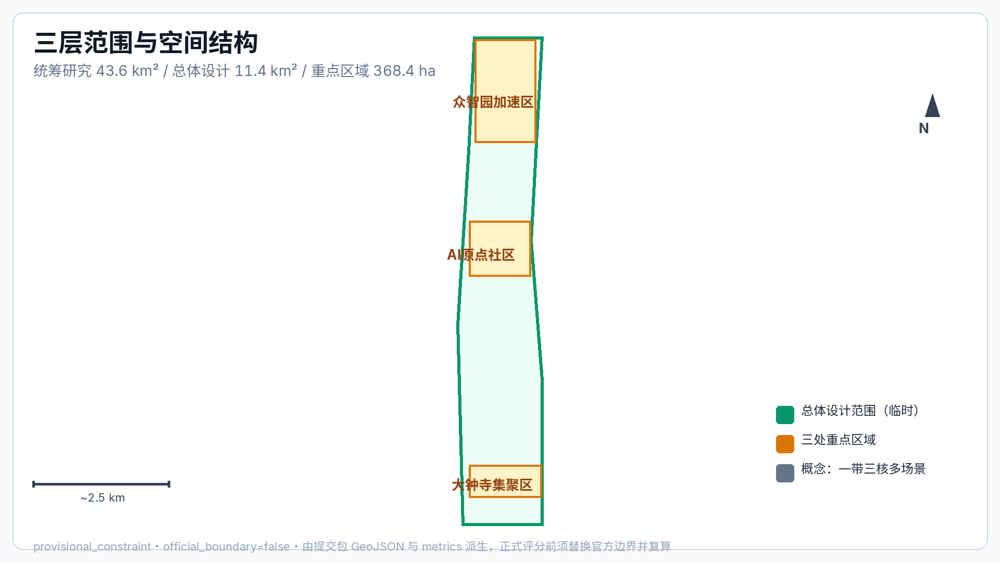
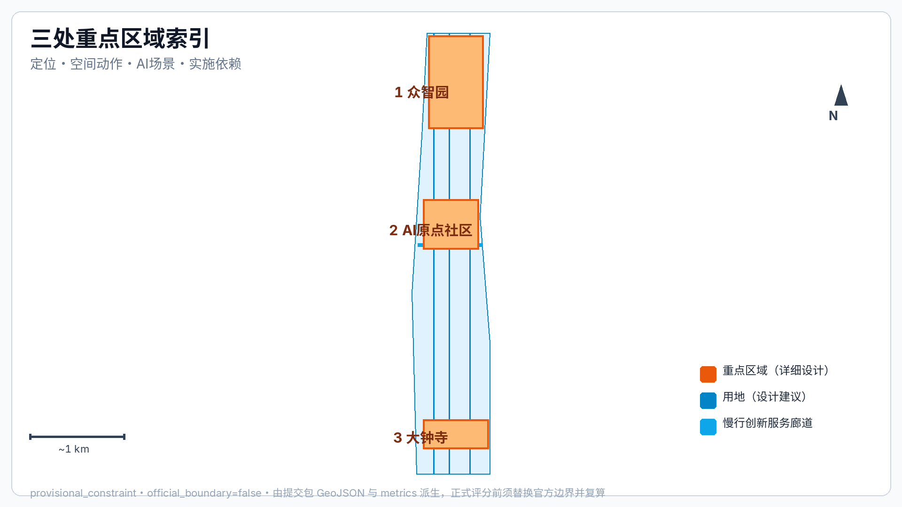
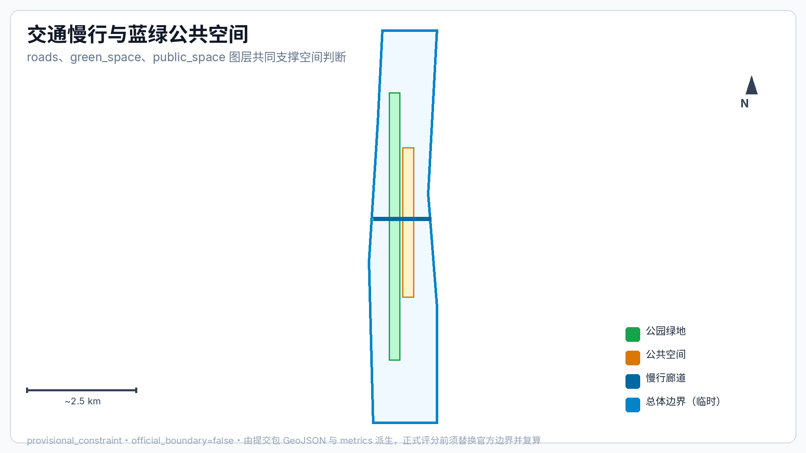
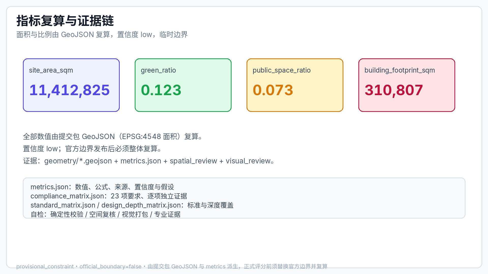

# Centennial Jing-Zhang AI Innovation Belt · Smart-Rail Integrated Urban Design Proposal

## Design Basis and Source Inventory

This proposal takes the qualification announcement for the international urban design open call for the Centennial Jing-Zhang AI Innovation Belt, issued by the Haidian Branch of Beijing Municipal Commission of Natural Resources and Planning, as its primary basis, and organizes deliverables on three levels: the coordinated research area addresses the AI industry ecology and future city form across 43.6 km²; the overall design area addresses 11.4 km² of urban districts and industrial zones within 1-2 km of the Jing-Zhang Heritage Park; the key detailed design area covers the 368.4 ha of three detailed-design zones. Every design judgment is decomposed into traceable sources, recalculable metrics, verifiable layers and human-reviewable assumptions, and is registered in the structured inventories `sources.json`, `metrics.json`, `compliance_matrix.json`, `standard_matrix.json` and `design_depth_matrix.json` [source:OFFICIAL-ANNOUNCEMENT] [source:AGENT-TASKBOOK] [depth:existing_conditions_diagnosis].

As of the submission date, the official `SITE_BOUNDARY` and the three `KEY_AREA` polygons have not been released. Both `geometry/site_boundary.geojson` and `geometry/key_areas.geojson` are marked `provisional_constraint`, `official_boundary=false`; they are used only for proposal generation, self-check and design discussion, and do not constitute an official redline, approval basis or statutory control conclusion. This organizer-side data gap does not block content scoring; once official polygons are released, the layers, metrics and drawings must be recalculated as a whole rather than replacing single files.

The boundary explanation returns to the overall-scope layer and area recalculation [data:geometry/site_boundary.geojson#SITE-001] [metric:site_area_sqm]; the three key areas are verified by their own layers and count metrics [data:geometry/key_areas.geojson#PROV-KEY-001] [metric:key_area_count].

## Three-Level Scope Framework

This proposal organizes its deliverables on the three levels defined in the announcement: the coordinated research area addresses the AI industry ecology and future city form, producing the innovation chain, ecosystem map and spatial coordination framework; the overall design area addresses industry space, urban renewal, transport-municipal and character, producing the land-use structure, the renewal project inventory and facility capacity; the key detailed design area addresses the detailed design of the three zones, proposing positioning, spatial moves, AI scenarios and implementation dependencies per zone. The three levels are mapped item by item in `compliance_matrix.json`; every mandatory task of announcement sections 1.3, 1.4, 1.5 and agent.1-agent.6 has chapter, layer, metric, drawing and HTML evidence [depth:three_level_scope_framework] [depth:overall_spatial_structure].

The three levels are not isolated drawing sets: the coordinated research decides judgments on industrial chains and city form; the overall design lands those judgments into renewal projects, spatial structure and facility capacity; the key detailed design verifies the implementability of specific parcels, buildings, traffic, public space and AI application scenarios. The overall concept is the "Jing-Zhang Smart-Vein Symbiosis Belt": the Jing-Zhang Heritage Park as the historical and public space spine, the three key areas (Zhongzhiyuan, Beijing AI Origin Community, Dazhongsi) as innovation anchors, and universities, enterprises, communities and rail stations as the daily network, forming a "one belt, three cores, multi-point scenarios, blue-green slow-traffic composite ring". The "belt" is a working method translating the announcement's three-level scope rather than an additional redline; the "three cores" correspond to the three key areas; "multi-point scenarios" correspond to operable nodes of AI public services, industry services and urban life; the "composite ring" corresponds to the interlinked slow-traffic, green, public space and activity routes.

| Level | Design Question | Answer | Data Anchor |
| --- | --- | --- | --- |
| Coordinated research area | How to organize AI industry ecology and future city form | Build the innovation chain "university origin - open-source collaboration - enterprise conversion - public experience - international outreach" | compliance_matrix.json, standard_matrix.json |
| Overall design area | How to land industry space, urban renewal, transport-municipal and character on maps | Land use, buildings, roads, green space, public space and phasing layers jointly express this | [data:geometry/land_use.geojson#LU-001], [data:geometry/roads.geojson#ROAD-001] |
| Key detailed design area | How the three zones reach detailed-design depth | Positioning, spatial moves, AI scenarios and implementation dependencies per zone | [data:geometry/key_areas.geojson#PROV-KEY-001], [data:geometry/key_areas.geojson#PROV-KEY-002], [data:geometry/key_areas.geojson#PROV-KEY-003] |

## Coordinated Research Area: Industry and Future City Research

The coordinated research area centers on building a world-class AI innovation ecosystem. This proposal inventories Haidian's university research institutes, leading enterprises, computing/algorithms/data elements, incubation platforms, listed companies, unicorns and technology service resources, forming a spatial coordination framework for the AI innovation chain, industrial chain, talent chain and urban service chain. It implements the coordination of the announcement's "five major functions" and the "three zones, two wings", providing a naming system, visual identity, overall spatial structure map, scenario opening and operation mechanism [source:AGENT-TASKBOOK] [standard:PROJECT-AGENT-OPEN-CALL-TASKBOOK].

### Overall Naming System and Logo Concept Direction (agent.1 concept suggestion)

**Primary name**: "Centennial Jing-Zhang AI Innovation Belt" (short form **JZ-AI Belt**). The naming logic uses the 115 years of Jing-Zhang Railway history as the temporal axis and AI innovation as the content axis, forming the metaphor "heritage track carries intelligent future"; this name is a concept suggestion pending final approval by the organizer and the professional team [source:AGENT-TASKBOOK].

**Naming hierarchy**: belt primary name (JZ-AI Belt) → three-core secondary names (Zhongzhiyuan AI Independent Innovation Acceleration Area = "Zhiyuan Accelerator"; Beijing AI Origin Community = "AI Origin Community"; Dazhongsi AI Industry Cluster = "Dazhongsi AI Cluster") → two wings (Zhongguancun Tech-Services Wing; Xiaoyuehe Scenario Wing) → scenario node names (Open-Source Release Hall, Security Governance Sandbox, etc.). Chinese and English names correspond one-to-one for wayfinding, activities and communication [standard:PROJECT-AGENT-OPEN-CALL-TASKBOOK].

**Logo concept direction**: the motif is "convergence of two tracks" — two parallel rails visually merging into an upward node, symbolizing the physical and temporal convergence of the Jing-Zhang Railway and AI innovation; the palette is "bronze green + intelligent blue", where bronze green echoes the railway industrial heritage and the green framework, and intelligent blue echoes digital and computing power; the mark extends into three auxiliary graphic sets (rail profile, circuit branch, slow-traffic path). The logo is an AI-generated concept direction; fonts and registered trademarks must be rights-cleared before use [depth:brand_identity] [source:AGENT-TASKBOOK].

### Three Zones, Two Wings Synergy Loop

The three zones and two wings are not parallel districts but one synergy loop of "origin-conversion-acceleration-application-feedback": the AI Origin Community, relying on Tsinghua, Peking University and other universities, hosts source innovation and open-source collaboration; Zhongzhiyuan hosts independent-innovation acceleration, standards development and security governance; Dazhongsi gathers agent and smart-terminal business around leading enterprises and participates in international exchange; the Zhongguancun Tech-Services Wing provides capital, intellectual property and globalized factor allocation services; the Xiaoyuehe Scenario Wing provides AI+ scenario testbeds and urban life experiences. The spatial anchors are concept suggestions open to professional deepening [data:geometry/key_areas.geojson#PROV-KEY-001] [data:geometry/key_areas.geojson#PROV-KEY-002] [data:geometry/key_areas.geojson#PROV-KEY-003].

### Global AI Innovation Ecosystem Case References (agent.2)

The 6 cases below are reference mechanisms compiled from public materials; authorization and currency follow each institution's official information, and they serve only as "mechanism references", not commercial citations or implementation commitments [source:AGENT-TASKBOOK]:

| # | Case | Location | Mechanism to Borrow |
| --- | --- | --- | --- |
| C01 | Station F | Paris, France | Railway station hall converted into a large startup campus: heritage buildings carry the startup ecology with integrated residence-office-event services |
| C02 | Cyberport | Hong Kong, China | Government-enterprise digital technology cluster: accelerators, esports events, venture funds and digital entertainment scenarios combined |
| C03 | Kista Science City | Stockholm, Sweden | University-enterprise-community ICT city: R&D density, talent housing and green streets in parallel |
| C04 | Tsukuba Science City | Tsukuba, Japan | National research institute cluster with a "science pilgrimage" route: research facilities open to the public, science festivals build the brand |
| C05 | Enspiral / open-source hubs | New Zealand / global | Open-source collaborative community operations: contributor reputation, public code walls, small funding loops |
| C06 | Bosch / Fraunhofer city labs | Germany | Industrial test fields: testing autonomous driving and urban robotics in real neighborhoods with human supervision and kill switches |

The common mechanisms of these cases — heritage carriers, government-enterprise co-governance, open testing, public experience, long-term branding — are distilled into the belt's operation and spatial principles.

### AI Innovation Ecosystem Map Concept

The ecosystem map is organized as "five chains, one platform": the innovation chain (university origin → open-source collaboration → enterprise R&D → scaled application), the talent chain (recruit and house → train and practice → community reputation → international mobility), the computing-and-data chain (computing centers → data elements → test fields), the capital chain (incubation funds → capital matching → international roadshows), the service chain (IP → standards → compliance → go-global services), plus one open scenario platform (public test field + activity system). The map is a concept sketch; specific indicators await professional teams and official data [depth:industry_space_mapping].

Future city form research focuses on how artificial intelligence changes work, life, socializing, learning, traffic and public services, and lands AI transport systems, continuous green space, innovation service facilities and an internationalized living-and-working atmosphere into functional zones, nodes, corridors and scenarios. Industry strategy indicators, AI innovation indices, talent density, spatial supply types and AI+ vertical application key areas enter the metric system, distinguishing official values, design suggestions and values awaiting calibration against official data. Global AI innovation activities, developer communities, open scenarios and pilgrimage routes are all expressed as "concept suggestions / reference schemes / open to professional deepening", and are not stated as confirmed government activities or implementation arrangements.

## Overall Design Area: Urban Renewal and Regulatory-Plan Depth Urban Design

The overall design area organizes its deliverables at the urban design depth of a regulatory detailed plan, presenting the overall spatial structure of urban renewal, inefficient-space identification, a renewal project inventory, implementation policy suggestions, industrial functional proportions, spatial organization patterns, total building scale and comprehensive carrying-capacity assessment. `geometry/land_use.geojson` covers the design boundary completely and without overlaps, `geometry/buildings.geojson` expresses renewal or retained building footprints, `geometry/roads.geojson` expresses micro-circulation, slow-traffic and rail-transfer relationships, and `metrics.json` recalculates core areas, ratios and layer counts [standard:MOHURD-CONTROL-DETAILED-PLANNING] [data:geometry/land_use.geojson#LU-001] [data:geometry/buildings.geojson#BLDG-001].

The overall design also proposes spatial layouts and implementation paths for rail station integration, road micro-circulation, non-motorized vehicle parking, parking supply, innovation service platforms, talent living services, new infrastructure, distributed energy and edge computing. Where official control conditions for building height, development intensity, road redlines, setbacks and facility standards are absent, content is marked as "pending official regulatory-plan conditions" rather than substituting inferred values for approved indicators.

## Key Area Detailed Design

Key area detailed design is mandatory. The Zhongzhiyuan AI Independent Innovation Acceleration Area develops detailed schemes around the national AI platform, full-stack independent innovation, standards development, security governance, industrial display, external traffic, Qinghe culture, low-carbon green innovation exchange environments and AI scenarios in green space; the Beijing AI Origin Community develops detailed schemes around near-campus innovation, achievement incubation and conversion, a talent special zone, the open-source system, brand activities, building retain-renovate-demolish, achievement display and release, residential-living support, campus-district slow-traffic links and rail station integration; the Dazhongsi AI Industry Cluster develops detailed schemes around leading enterprises, agents, smart terminals, content consumption, data elements, digital assets, commercial services, composite use of planned green space, Dazhongsi Station integration and four-quadrant pedestrian connectivity at the intersection [depth:three_key_area_detailed_design].

| Key Area | Design Positioning | Spatial Moves | AI Industry & Operation Scenarios | Evidence |
| --- | --- | --- | --- | --- |
| Zhongzhiyuan AI Independent Innovation Acceleration Area | Garden-style full-stack independent innovation district | Strengthen the Qinghe interface, industrial display, low-carbon innovation exchange and external traffic organization; use green space for open testing and standards-governance display | Autonomous model testing, standards workshops, security governance display, low-carbon computing experience | [data:geometry/key_areas.geojson#PROV-KEY-001], [depth:three_key_area_detailed_design] |
| Beijing AI Origin Community | Near-campus achievement conversion and talent community | Organize campus-district-neighborhood slow-traffic stitching; add achievement release, talent services, residential life and open-source collaboration space | Open-source community, achievement release, talent special zone services, near-campus incubation | [data:geometry/key_areas.geojson#PROV-KEY-002], [source:AGENT-TASKBOOK] |
| Dazhongsi AI Industry Cluster | Urban smart economy and international exchange district | Around Dazhongsi Station integration, four-quadrant pedestrian connectivity, commercial services and public environment renewal around key enterprises | Agent and smart terminal display, content consumption, data elements and international roadshows | [data:geometry/key_areas.geojson#PROV-KEY-003], [metric:key_area_count] |

## AI Innovation Ecology, Talent Profiles and AI+ Scenarios

This proposal establishes spatial demand profiles for AI talents and enterprises, covering R&D offices, open-source collaboration, achievement release, enterprise services, talent housing, social learning, consumer life, sports and leisure, and international exchange. AI+ scenarios are arranged across traffic, services, consumption, healthcare, education, legal and life services, forming industry development scenarios and AI-enabled urban function scenarios; each scenario specifies its target users, spatial location, data sources, privacy boundary, human review mechanism and operating entity. Scenarios are organized as a "scenario cards - personas - test scenarios" three-layer structure, with data boundaries, human review, failure fallback and exit mechanisms written into every card [source:AGENT-TASKBOOK].

### Five Base User Personas

| Persona | Typical Needs | Spatial Response | Self-Check Boundary |
| --- | --- | --- | --- |
| P1 Open-source developers | Release, collaboration, testing, community reputation | Origin Community open-source release hall, public code wall, night collaboration space | No personal behavior tracking; activity data aggregated only |
| P2 Startup teams | Low-cost office, computing access, product test field | Zhongzhiyuan shared test field, edge computing service points, standards governance consultancy | Computing and data services require separate authorization |
| P3 Enterprise visitors | Display, business, international reception, recruiting | Dazhongsi international roadshow lounge, rail transfer, public space around key enterprises | Enterprise marks and cases must be rights-cleared |
| P4 Nearby residents | Commuting, leisure, community services, low-disruption renewal | Jing-Zhang Heritage Park slow-traffic loop, embedded community services, graded night lighting and activities | Resident profiles not used for commercial recommendation |
| P5 University faculty/students | Achievement conversion, cross-campus collaboration, daily slow traffic | Campus-district slow-traffic stitching, achievement stations, AI education experience points | Campus data and research results require authorization |

### Three Inclusive Supplementary Personas (agent.3 extension)

| Persona | Core Needs | Spatial & Operating Response | Fairness Requirement |
| --- | --- | --- | --- |
| P6 Elderly and low-digital-skill users | Smartphone-free community services, fraud prevention, human counters | Keep human service windows and phone hotlines; AI services provide voice + human dual channels; weekly fixed human duty hours at community service stations | Traditional service channels must not be closed by AI-ization; alternative paths provided |
| P7 Visually/mobility impaired users | Continuous accessible paths, tactile wayfinding, bus/rail transfer | Prioritize ramps and tactile paving at slow-traffic breakpoints; tactile maps at stations and landmarks; AI wayfinding with voice broadcast | Accessibility continuity enters acceptance metrics; AI services must offer human alternatives |
| P8 Children and families | Safe play, family restrooms, childcare points | Low-age play areas and family service points in the park vitality belt; graded activity safety | No child data collection; camera coverage published after the fact |

### Ten AI Scenario Cards (data boundaries and governance mechanism per card)

| # | Scenario Card | Spatial Carrier | Target Users | Input Data | AI Function Boundary | Human Decision Point | Failure Fallback | Operating Entity |
| --- | --- | --- | --- | --- | --- | --- | --- | --- |
| 01 | Open-Source Release Hall | Beijing AI Origin Community | Developers/universities/startups | Public code submissions, booking info | Auto scheduling, contribution stats, display recommendations | Human review of published content | Booking system offline, manual registration possible | Community operator + developer self-governance |
| 02 | Security Governance Sandbox | Zhongzhiyuan | Enterprises/evaluators/public | De-identified model evaluation data | Sandbox evaluation workflow aid, report generation | Evaluation conclusions signed by certified experts | Sandbox closed → offline workshops | Park operator + third-party evaluation |
| 03 | Edge Computing Stations | Overall design nodes | Developers/enterprises | Booking info, aggregated power data | Resource scheduling suggestions | Resource allocation approved by humans | Queue system falls back to numbers | Platform operator |
| 04 | AI Slow-Traffic Navigation | Jing-Zhang Heritage Park vitality belt | All residents and visitors | Public maps, voluntary breakpoint reports | Breakpoint detection, detour suggestions | Construction/remediation decisions approved by management | Static map shown when no signal | Park management office |
| 05 | Dazhongsi International Roadshow Lounge | Dazhongsi AI Industry Cluster | Enterprises/investors/media | Event registration, public company materials | Agenda recommendation, interpreting assistance | Roadshows and signings hosted by humans | Equipment failure → regular meeting mode | Operating company |
| 06 | Qinghe Low-Carbon Innovation Corridor | Zhongzhiyuan Qinghe riverside interface | Public/park users | Environment and crowd aggregated data | Crowding hints, energy-saving suggestions | Facility maintenance dispatched by humans | Sensor failure → stop hints only | Park operator |
| 07 | Near-Campus Achievement Street | Beijing AI Origin Community | University faculty/students, founders | Public achievement summaries, service bookings | Achievement matching suggestions | Conversion and legal handled by humans | System failure → phone booking | University-enterprise joint operation |
| 08 | Data Element Reception Hall | Dazhongsi area | Enterprises/data providers | Authorized data catalog display | Catalog search and compliance hints | Transactions/authorization approved by humans | Display page browsable offline | Data exchange institution |
| 09 | AI Life Service Model Street | Community-commercial intersection | Residents | Public service catalog, aggregated crowd data | Service guidance, queue prediction | Service complaints handled by humans | Static readable signage | Street + commercial self-governance |
| 10 | Global AI Activity Week Route | Belt public space system | Global developers/public | Event registration, public agenda | Route recommendation, translation assistance | Event approval handled by humans | Temporary closure → detour announcement | Organizing committee |

### Three Industry Test and Validation Scenarios (concept suggestions)

| # | Test Scenario | Location Concept | Validation Goal | Data and Privacy Boundary | Human Supervision and Exit Mechanism |
| --- | --- | --- | --- | --- | --- |
| T-01 | Low-speed robot delivery corridor | Along the Xiaoyuehe Scenario Wing | Traffic rules and scheduling algorithms for robot delivery coexisting with pedestrians | Public maps and voluntary test data only; no pedestrian identity collection | Designated test hours and low-speed zones; operator keeps remote emergency braking; public on-site appeals |
| T-02 | City-agent government service sandbox | Zhongzhiyuan security governance sandbox node | Accuracy and ethical compliance of government Q&A and service navigation agents | Public service guides only; no connection to personal privacy systems | Certified experts review item by item; launch after red-team testing; any answer appealable to humans |
| T-03 | AI+ slow-traffic breakpoint diagnosis pilot | Southern section of Jing-Zhang Heritage Park | Identify breakpoints and accessibility gaps using public maps + voluntary reports | Aggregated statistics only; no localization of individuals | Diagnosis conclusions must be reviewed by municipal departments before construction; 3-month pilot then evaluation |

The test scenarios are all concept suggestions; they may only be piloted after competent authority approval, safety assessment and public notice, and are not presented as approved operations [source:AGENT-TASKBOOK].

## AI Public Space, Smart-Native New Business Forms and Pilgrimage Landmarks (agent.4)

Along the Jing-Zhang Heritage Park spine, "experienceable AI public space" is organized: smart wayfinding, interactive science devices and data-art points within the park, all low-power, maintainable, with physical substitutes, and compliant with cultural-heritage protection and landscape constraints [standard:MOHURD-URBAN-DESIGN-MEASURES].

**Three AI pilgrimage landmarks (concept suggestions)**:

| # | Landmark Name | Location Concept | Cultural Meaning | Expression Form |
| --- | --- | --- | --- | --- |
| L-01 | Century-Convergence Gate | Junction of Jing-Zhang Heritage Park and Badaling Expressway underpass node | Convergence of the Jing-Zhang Railway centenary and the AI new era | Public art installation + digital gauge-track ground carving; low-brightness night lighting |
| L-02 | AI Origin Beacon | Near-campus node of Beijing AI Origin Community | Zhongguancun origin and the new AI origin | Glowing "origin" tower installation and code-contribution honor wall |
| L-03 | Global Developer Star Wall | Plaza in Dazhongsi area | Developer community and global collaboration | Updatable digital contribution wall (privacy-respecting, nicknames/aliases only) |

**Honor display system**: a graded honor carrier system — annual contribution wall (plaza level), quarterly release screens (community level), monthly code star (network level); all displays default to nicknames/organization names, with real identities shown only after personal consent [source:AGENT-TASKBOOK].

**Public space component library (concept)**: wayfinding posts (accessible), rail-pattern seating, AI science kiosks, data-art pavers, temporary event assembly units, planter-RI integrated planting units. All components are a replaceable, maintainable, modular concept inventory for professional teams to deepen; no engineering conclusions are implied.

## Centennial Jing-Zhang Culture, Zhongguancun Culture and AI New Culture Narrative (agent.5)

**Cultural narrative spine**: "history carried by the rails + innovation nurtured by Zhongguancun + the future defined by artificial intelligence" as a three-layer narrative. Qinghuayuan Old Station and the Jing-Zhang railway alignment serve as memory carriers, Zhongguancun innovation stories as spiritual inheritance, and AI scenarios and activities as the present expression, forming a spatial story line of "one century on one track, innovation carried forward" [source:AGENT-TASKBOOK].

**Wayfinding and symbol system (concept direction)**: the "convergence of two tracks" logo motif as the first-level identity; three auxiliary graphic sets as second-level symbols (rail profile = culture, circuit branch = innovation, slow-traffic path = life); event and scenario signage as the third level. All wayfinding text is bilingual; fonts require rights clearance (open-source fonts such as Source Han Sans are recommended; final choice subject to copyright verification).

**International communication narrative (draft)**: English main slogan "Where Heritage Meets Intelligence" — the centennial Jing-Zhang Railway and the AI heritage converge. International communication highlights three things: the world's first urban design open-call mechanism co-generated by AI agents, the 115-year history of the Jing-Zhang Railway, and Haidian's world-class AI industry ecology. The communication copy is a draft pending review by the organizing committee.

AI governance suggestions follow the principles of data minimization, public sources, explainability and human review. City agents may assist in identifying slow-traffic breakpoints, public space heat, facility maintenance, enterprise service needs and activity safety risks, but cannot replace planning approval, output unauthorized personal profiles, or claim official implementation commitments. All AI scenario nodes enter structured layers or the compliance matrix so reviewers can verify their relationship with industry, space and public interest.

## Land Use, Building Scale, and Retain-Renovate-Demolish Plan

The land use plan follows public standards such as national land spatial survey, planning and use-control classification, forming a complete, closed and seamless land-use zoning. The building plan distinguishes retained, renovated, updated, new-built or pending-confirmation objects, and clarifies the suggested hierarchy of building footprint, function, scale, character, roof, massing and height controls [standard:MNR-LAND-USE-CLASSIFICATION-GUIDE] [depth:height_massing_character] [depth:retain_renovate_demolish]. Where current buildings, ownership, regulatory planning and engineering conditions are absent, the proposal only proposes methods and pending-calibration inventories, and does not fabricate retain-renovate-demolish conclusions. The main evidence is [data:geometry/land_use.geojson#LU-001], [data:geometry/buildings.geojson#BLDG-001] and [metric:building_footprint_area_sqm].

Building scale and intensity indicators are consistent with `metrics.json` and the layers. Where total building scale, floor-area ratio, building height, building density, green ratio, setbacks and building control lines lack official conditions, they are listed as unknown or pending_control in the metric system instead of using fixed numbers to create a false sense of precision. The A3 booklet provides the renewal project inventory and metric verification tables; the A0 boards express key spatial structures and key areas; the HTML pages provide linked metric and layer views.

## Transportation, Rail, Municipal and Public Service Facilities

The transportation plan addresses rail station integration, road micro-circulation, slow-traffic breakpoints, external transportation, parking, non-motorized vehicle parking and green transportation systems, with emphasis on the North Fifth Ring Road, the Jing-Zhang Heritage Park cross-ring nodes, Wudaokou, Qinghua East Road West, Dazhongsi Station and transport links around key enterprises. Road and slow-traffic layers stay within the submission boundary and are cross-checked against public space, green space, industrial nodes and key areas; traffic depth is governed by [depth:traffic_rail_slow_parking], with layer evidence citing [data:geometry/roads.geojson#ROAD-001] and [data:geometry/public_space.geojson#PUBLIC-001].

Municipal and public service facilities cover AI industry service facilities, innovation service platforms, talent living service facilities, new infrastructure, distributed energy, edge computing and integration with traditional municipal facilities, explaining facility standards, spatial layout, service radius, operation models and phasing logic [depth:municipal_new_infrastructure] [data:geometry/constraints.geojson#CONSTRAINTS]. Where pipeline, energy, drainage, flood control and fire protection engineering data are missing, they are listed as prerequisites for formal deepening, pending items written into assumptions where necessary, rather than writing strategies as approved conditions [source:SITE-PACKAGE].

## Blue-Green Space, Public Space and Urban Character

The blue-green space plan takes the Jing-Zhang Heritage Park vitality belt as its spine, coordinates the Qinghe River, Xiaoyue River and the travel needs of surrounding universities, enterprises and communities, and proposes north-south and east-west connected walking paths, cycling routes and a green space system; it identifies slow-traffic breakpoints, bridges crossing the ring road, and landscape nodes at the southern and northern ends of the park, and proposes composite-use strategies for parking, sports, innovation exchange, technology testing, application display and public services [depth:blue_green_public_space] [data:geometry/green_space.geojson#GREEN-001] [data:geometry/public_space.geojson#PUBLIC-001]. The design meaning of green and public space ratios is explained in the body; the full recalculation is kept in `metrics.json`, and the coordination of urban character, public space and building controls returns to the professional standard matrix [standard:MOHURD-URBAN-DESIGN-MEASURES].

The urban character plan fuses Jing-Zhang Railway history, Zhongguancun innovation culture and AI innovation culture, uses cultural resources such as Qinghuayuan Railway Station and Beijing Film Academy, and proposes urban tone, building character, roof form, massing, interface and public art guidance, together with wayfinding signs, cultural symbols, international communication narratives, AI pilgrimage landmarks, contribution walls or honor display systems. All brands, fonts, images, portraits and enterprise marks have rights-cleared sources; character controls distinguish official controls, design suggestions and pending-confirmation conditions, and never give pseudo-precise control lines without heritage protection or regulatory-plan basis.

## Renewal Project Inventory, Implementation Policies and Phasing

The implementation plan presents a reviewable renewal project inventory, specifying per project its location, type, function, responsible entity, dependencies, implementation stage, risks and evaluation indicators; policy suggestions cover coordinated urban renewal implementation, spatial supply, operation mechanisms, industry services, public participation, data governance and property rights coordination. `geometry/phasing.geojson` expresses phasing ranges, and `compliance_matrix.json` links phasing to drawings item by item [depth:renewal_project_list] [depth:phasing_implementation] [data:geometry/phasing.geojson#PHASE-001].

| ID | Project Name | Type | Key Dependencies | Responsible Role (Concept) | Start Conditions | Acceptance Metrics (Suggested) | Evidence |
| --- | --- | --- | --- | --- | --- | --- | --- |
| JZ-01 | Jing-Zhang Heritage Park slow-traffic breakpoint stitching | Public Space/Traffic | Road redlines, underpass space, traffic organization review | District urban management commission leads, sub-districts coordinate, design institute deepens | Traffic impact assessment passed, underpass ownership confirmed | Breakpoint connectivity improvement, accessibility acceptance | [data:geometry/roads.geojson#ROAD-001] |
| JZ-02 | Zhongzhiyuan Qinghe innovation interface | Green Space/Industrial Display | River blue lines, ecology and flood control conditions | Water authority + park operator | Flood control assessment, blue-line compliance confirmed | Interface accessibility rate, vegetation survival rate | [data:geometry/green_space.geojson#GREEN-001] |
| JZ-03 | Origin Community near-campus achievement street | Urban Renewal/Industry Services | Campus boundary, ownership, ground-floor uses | University-enterprise office + local sub-district | Ownership and relocation plan confirmed | Ground-floor use intake rate, number of served enterprises | [data:geometry/buildings.geojson#BLDG-001] |
| JZ-04 | Dazhongsi Station four-quadrant pedestrian connectivity | Rail Integration/Slow-Traffic | Rail station, road intersections, municipal pipelines | Rail company + transport authority | Station integration plan approved | Reduced crossing time, peak congestion relief | [data:geometry/public_space.geojson#PUBLIC-001] |
| JZ-05 | AI public service and edge computing nodes | New Infrastructure/Public Services | Energy, computing, security and operating entity | Platform company + computing operator | Safety assessment, energy review approved | Nodes opened, failure rate within target | [data:geometry/constraints.geojson#CONSTRAINTS] |
| JZ-06 | Global AI Activity Week public route | Operations/Brand | Public space permits, event safety, rights clearance | Organizing committee + event operating company | Event approval, security plan | Participation, international media coverage | [data:geometry/phasing.geojson#PHASE-001] |

The open-call cycle (100 days) is the time requirement for submitting deliverables, while implementation phasing is the advancement path of urban renewal and project construction; the two are distinguished. The proposal presents near-term pilots, mid-term renewal and long-term governance frameworks, marking which items can start with lightweight facilities, operating activities and service platforms, and which must wait for formal regulatory planning, municipal, traffic and ownership conditions. Projects without ownership, funding, implementing entity or approval paths are written as implementation risks rather than commitments.

### Global AI Innovation Activity System and Long-Term Operations (agent.6 concept suggestions)

**Annual activity calendar (concept framework)**: the "Global AI Activity Week" as the annual main brand, with a quarterly rhythm — spring developer conference (open source and model evaluation), summer scenario open day (public test field experience), autumn achievement release conference (university-enterprise conversion and international roadshows), winter security governance forum (standards and compliance dialogue). The schedule requires organizing committee confirmation and is not stated as confirmed arrangements [source:AGENT-TASKBOOK].

**Developer community operation mechanism**: a three-level community system under the "memorable to contributors" principle: online community (code contributions, topic discussion, reputation points) → physical space (open-source release hall, night collaboration space) → annual honors (annual contribution wall, code star). Community rules are set by a developer self-governance committee; operators provide space and activity support; no personal behavior tracking [source:AGENT-TASKBOOK].

**AI scenario open operation mechanism**: scenario cards 01-10 are split into always-open (01, 04, 09), appointment-based (02, 03, 06, 07, 08, 05) and event-period open (10). Always-open scenarios are free; pricing and admission rules for appointment-based scenarios are set by the operating entity and publicly announced; each quarter, scenario crowd and service data (aggregated) are published for public oversight.

**Public experience and urban landmark operations**: all three landmarks L-01 to L-03 have maintainable physical substitutes (lighting, cleaning, maintenance responsibility assigned to posts); digital display content is jointly reviewed by the organizing committee and technical parties and is anonymous by default.

**International communication and attraction conversion mechanism**: communication content follows a three-level confirmation of "draft → expert review → release"; international visitors enter through three gateways (Activity Week, roadshows, developer community) with the conversion path "activity participation → space experience → project matching → settlement services", where settlement services refer only to published policy guidance and no settlement outcome is promised.

**Suggested conversion and assessment indicators**: number of activity participants, developer community activity, scenario usage frequency, satisfaction (anonymous survey), international media mentions, number of matched projects; these are operational suggestions, not government commitments [metric:renewal_project_count].

## Indicators, Area Recalculation and Compliance Matrix

The indicator system includes the overall design area, key area proportions, green and public space ratios, building footprints, renewal project counts, AI scenario nodes, slow-traffic connectivity indicators, industrial space indicators, talent service indicators and self-check status. All known indicators are recalculable from GeoJSON or credible sources; unknown indicators state the reason and the formal-submission prerequisites. The results of `scripts/spatial_review.py` and `scripts/visual_review.py` are important evidence for the formal self-check [depth:metrics_recalculation] [metric:site_area_sqm] [data:geometry/green_space.geojson#GREEN-001].

The compliance matrix is the master file for task responsiveness: every announcement task and agent_taskbook task maps to report sections, layers, metrics, drawings, HTML pages, sources, assumptions and self-check items, covering every mandatory task of announcement sections 1.3, 1.4, 1.5 and agent.1-agent.6. During formal deepening, metrics are classified into three types: spatial metrics directly recalculable from the submitted geometry (boundary area, green ratio, public space ratio, building footprint area, phasing area); control metrics requiring official regulatory planning or taskbook annex support (floor-area ratio, building height, building density, setbacks, road redlines, facility standards); and performance metrics requiring continuous calibration with operation or industry data (AI innovation index, talent density, industry service satisfaction, slow-traffic accessibility, activity participation, scenario usage frequency). The three types enter `metrics.json`, `assumptions.json` and `compliance_matrix.json` respectively, avoiding operational visions being mistaken for approved planning conditions.

## Risk, Copyright and Compliance Statement

**Bilingual delivery.** The primary report (proposal.md) and the complete English counterpart (proposal.en.md), the A3/A0 drawings, the HTML pages and text-bearing figures all provide corresponding language copies. All images, drawings, icons, data and code assets state their source, license and authorization status in `sources.json` and `report/copyright_statement.md`; HTML pages do not load remote scripts, remote map tiles, remote fonts, iframes, forms or external APIs, and do not track reviewer behavior.

The risk and missing-data inventory is jointly checked by the risk depth item, the constraint layer and the site package [depth:risk_missing_data] [data:geometry/constraints.geojson#CONSTRAINTS] [source:SITE-PACKAGE]: the gaps of official boundary, key areas, regulatory planning, roads, parcels, buildings, municipal, heritage protection and public services enter `assumptions.json`, the self-check and the risk chapters of the body; conclusions lacking official regulatory planning, road redlines, ownership, municipal, fire protection or heritage conditions are downgraded to pending confirmation.

This proposal does not claim official approval, approved regulatory planning, final land ownership, final construction scale or guaranteed implementation; maintainers and professional reviewers may request revision or rejection based on self-check results, spatial review and the compliance matrix.

## References

- brief/public-brief.md
- brief/site-package/design_brief.json
- brief/site-package/allowed_design_space.json
- brief/site-package/enums/
- brief/site-package/ranges/planning_limits.json
- data/processed/agent_fact_pack.md
- data/processed/project_scope_summary.csv
- data/processed/agent_task_requirements.csv
- data/processed/source_use_matrix.csv
- data/processed/missing_data_checklist.csv
- Complete machine index: see `sources.json`, `metrics.json`, `compliance_matrix.json`, `standard_matrix.json` and `design_depth_matrix.json` [source:SITE-PACKAGE]
