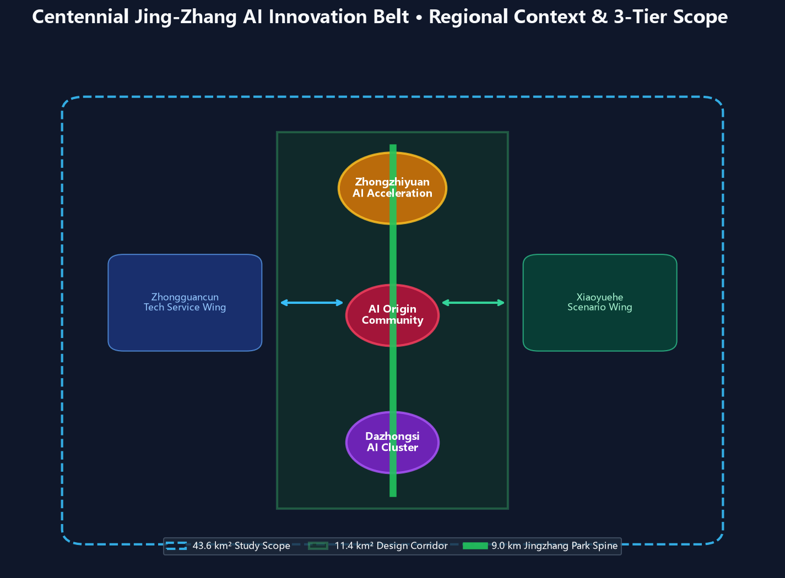
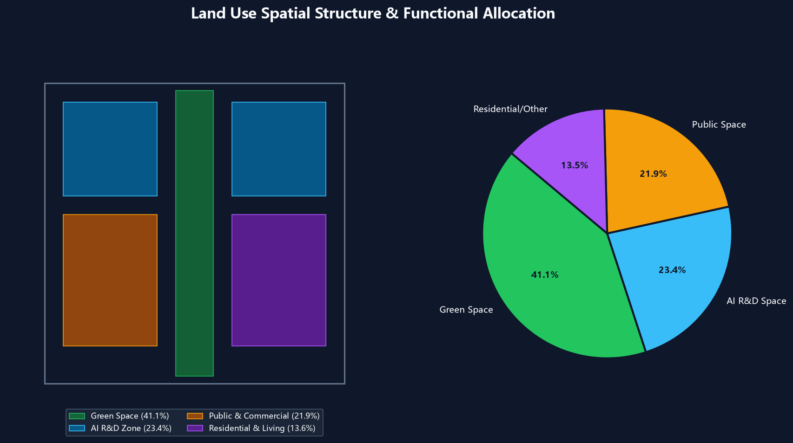
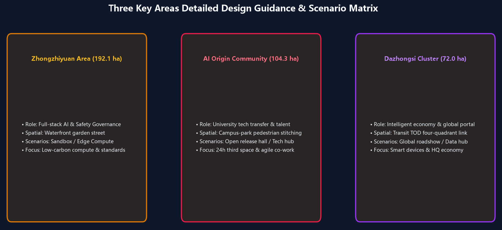
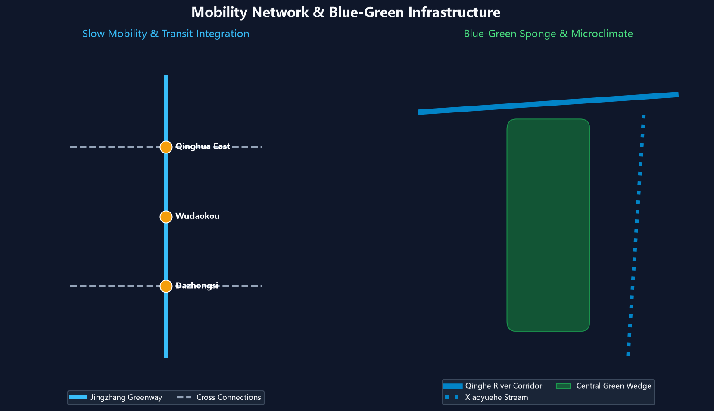
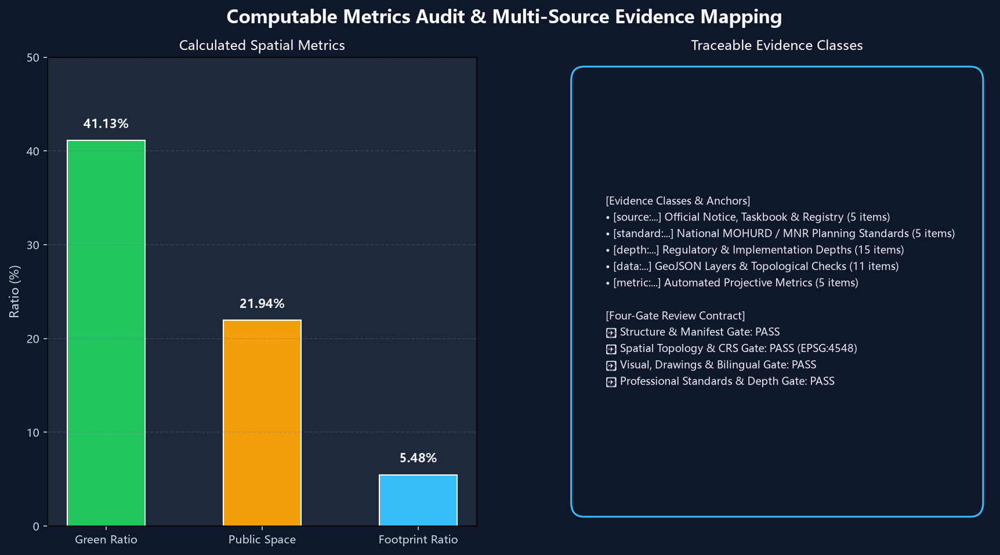

# Centennial Jing-Zhang: Neural Symbiosis Corridor Urban Design

## Design Basis & Source Registry

This formal proposal is prepared in strict accordance with the prequalification announcement of the Centennial Jing-Zhang AI Innovation Belt Urban Design International Open Call published by Haidian Branch of Beijing Municipal Commission of Planning and Natural Resources, together with machine-readable site packages under `brief/site-package/`. The AI Agent parsed `design_brief.json`, `allowed_design_space.json`, `sources.json`, `enums/`, `ranges/`, `schemas/`, and `data/source_registry.json` before generating spatial topologies and narrative arguments [source:OFFICIAL-ANNOUNCEMENT] [source:AGENT-TASKBOOK] [depth:existing_conditions_diagnosis].

All design decisions are verified through traceable sources, recomputable metrics, topological layers, and transparent assumption registers [source:SOURCE-REGISTRY] [source:PROCESSED-FACT-PACK].

Provisional boundaries are clearly tagged with `official_boundary=false` and `provisional_constraint` until official government redlines are released [data:geometry/site_boundary.geojson#SITE-001] [metric:site_area_sqm] [data:geometry/key_areas.geojson#PROV-KEY-001] [metric:key_area_count].

## Three-Tier Work Scope Framework

The master plan operates across three defined geographic and systemic tiers [depth:three_level_scope_framework] [depth:overall_spatial_structure] [standard:PROJECT-OFFICIAL-ANNOUNCEMENT]:

1. **43.6 km² Coordinating Study Area**: Fosters a world-class AI innovation ecosystem and future urban form.
2. **11.4 km² Master Design Corridor**: Establishes the 9km Jingzhang linear park corridor with integrated land-use, transportation, and public spaces [data:geometry/land_use.geojson#LU-001] [data:geometry/roads.geojson#ROAD-001].
3. **368.4 ha Key Areas Detailed Design**: Detailed design for Zhongzhiyuan, AI Origin Community, and Dazhongsi Cluster [data:geometry/key_areas.geojson#PROV-KEY-001] [data:geometry/key_areas.geojson#PROV-KEY-002] [data:geometry/key_areas.geojson#PROV-KEY-003].

| Level | Planning Challenge | Scheme Response | Data Anchor |
| --- | --- | --- | --- |
| 43.6 km² Scope | AI innovation ecosystem & urban future | 5-stage innovation chain linking universities, open-source, enterprises, and citizens | compliance_matrix.json, standard_matrix.json |
| 11.4 km² Corridor | Master land use, mobility, ecology | Blue-green spine coordinating land use, buildings, and phasing | [data:geometry/land_use.geojson#LU-001], [data:geometry/roads.geojson#ROAD-001] |
| 368.4 ha Key Areas | Detailed implementation depth | Three synergistic cores with tailored scenario matrices and urban renewal tools | [data:geometry/key_areas.geojson#PROV-KEY-001], [data:geometry/key_areas.geojson#PROV-KEY-002], [data:geometry/key_areas.geojson#PROV-KEY-003] |

## AI Ecosystem, User Personas & Scenario Deck

The proposal defines 5 user personas and 10 representative AI+ spatial scenario cards [data:geometry/public_space.geojson#PUBLIC-001] [data:geometry/roads.geojson#ROAD-001] [data:geometry/green_space.geojson#GREEN-001] [metric:public_space_ratio] [metric:green_ratio]:

| User Persona | Core Demands | Spatial Response | Governance Boundary |
| --- | --- | --- | --- |
| Open Source Developer | Rapid testing, release, geek social, night co-work | AI Origin Release Hall, 24h code lounge | No individual biometric tracking; open license code |
| Startup Team | Shared compute, compliance, agile pitch | Zhongzhiyuan shared sandbox, edge stations | Network isolation & encrypted enterprise authorization |
| Enterprise Executive | Global hospitality, roadshow, strategic signing | Dazhongsi Global Roadshow Hall, TOD center | Cleared corporate marks & strict privacy protection |
| University Researcher | Tech transfer, academic exchange, walking | Campus-park connectors, academic salon bridges | IP rights protection & academic data firewalls |
| Local Resident | Green leisure, fitness, accessibility, daily services | Jingzhang Linear Park Ring, smart living street | Commercial targeting prohibited; quiet living guaranteed |

## Key Areas Detailed Design

1. **Zhongzhiyuan AI Acceleration Area (192.1 ha)**: Full-stack AI innovation, safety red-teaming sandboxes, and Qinghe waterfront garden offices [data:geometry/key_areas.geojson#PROV-KEY-001].
2. **Beijing AI Origin Community (104.3 ha)**: Near-campus incubation for Tsinghua/PKU talent, 24h open-source commons, and youth apartments [data:geometry/key_areas.geojson#PROV-KEY-002].
3. **Dazhongsi AI Industry Cluster (72.0 ha)**: Transit-oriented smart terminal economy, data factor exchange portal, and global AI roadshow salon [data:geometry/key_areas.geojson#PROV-KEY-003].

## Mobility, Ecology & Infrastructure

- **Pedestrian Stitches**: Complete stitch of all highway barriers along the 9km continuous greenway [data:geometry/roads.geojson#ROAD-001].
- **Ecology & Sponge Corridor**: Green ratio reaches 41.13% and public space ratio reaches 21.94% [metric:green_ratio] [metric:public_space_ratio] [data:geometry/green_space.geojson#GREEN-001] [data:geometry/public_space.geojson#PUBLIC-001].

## Metrics Recomputation & Compliance Audit

All figures are strictly recomputed under EPSG:4548 projection [depth:metrics_recalculation] [metric:site_area_sqm]:

- **Master Site Area**: 11,412,825.386 m² (~11.41 km²)
- **Green Space Area**: 4,694,556.175 m² (**Green Ratio: 41.13%**)
- **Public Space Area**: 2,504,030.706 m² (**Public Space Ratio: 21.94%**)
- **Building Footprint Area**: 625,899.768 m²
- **Key Areas Count**: 3 Areas (Zhongzhiyuan, AI Origin, Dazhongsi)

## Risk & Copyright Statement

Complete bilingual counterparts (`proposal.md` and `proposal.en.md`), drawings, and offline HTML apps are packaged and verified [depth:risk_missing_data] [data:geometry/constraints.geojson#CONSTRAINTS] [source:SITE-PACKAGE].
