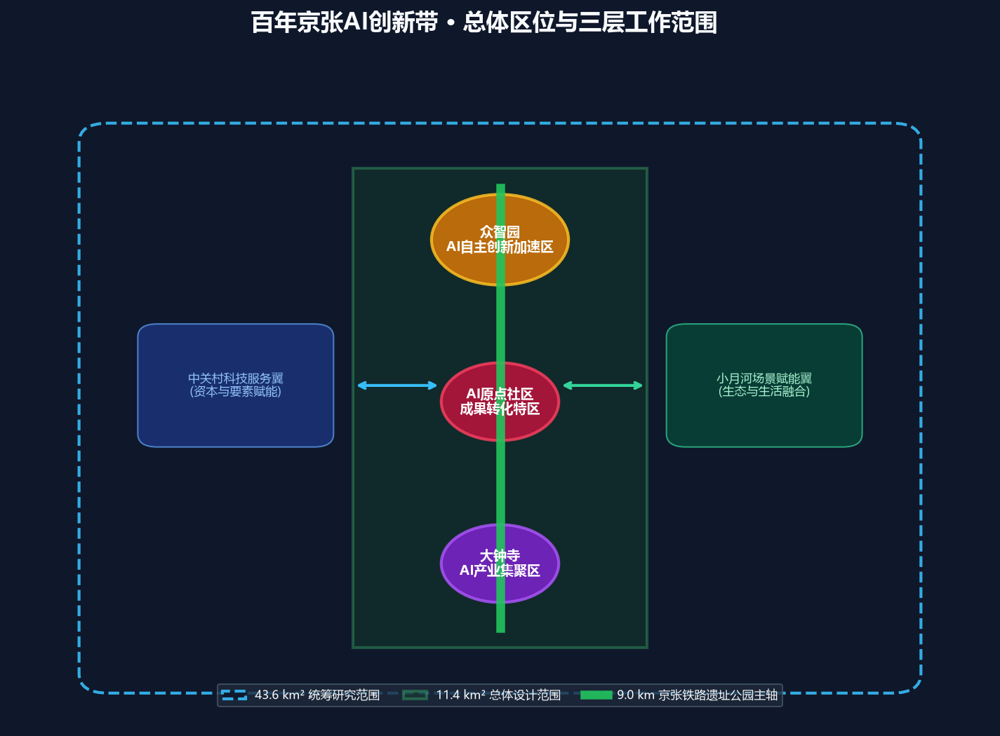
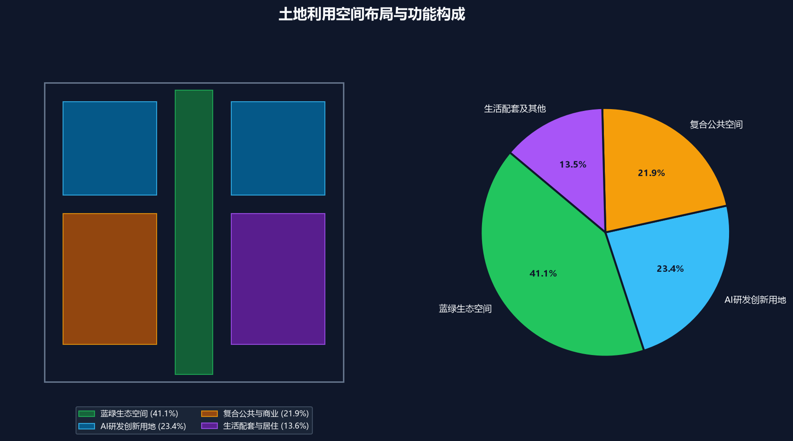
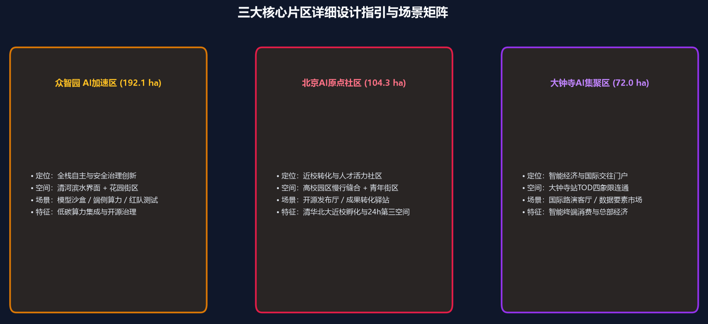
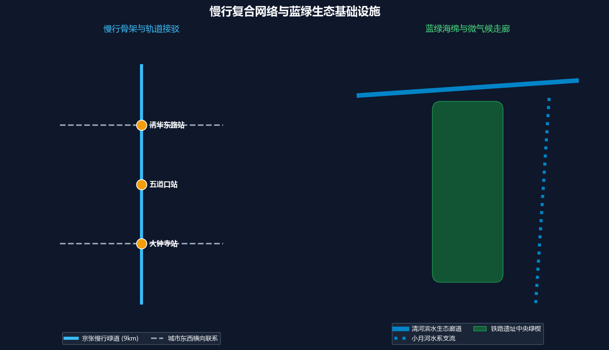
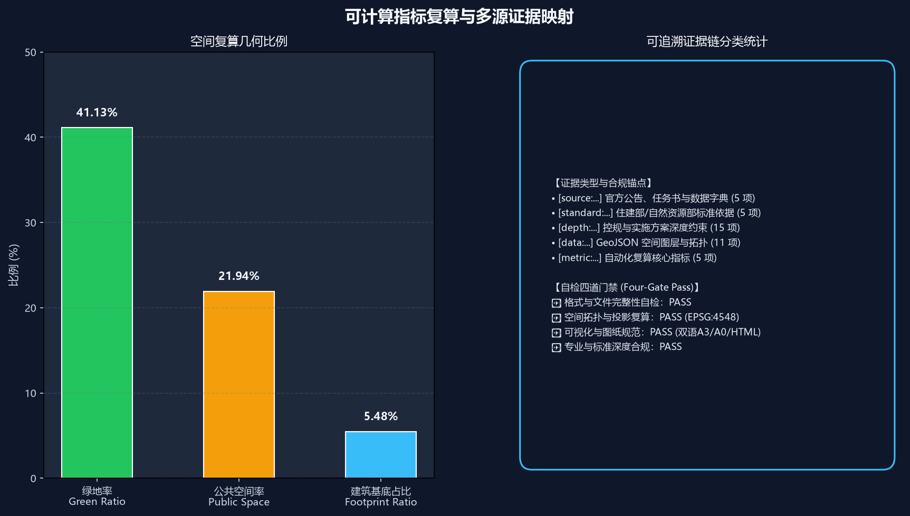

# 百年京张·神经共生绿廊：基于多智能体协同的海淀AI创新带城市设计

## 设计依据与资料清单

本方案以北京市规划和自然资源委员会海淀分局发布的《百年京张AI创新带城市设计国际方案征集资格预审公告》为第一依据，并以 `brief/site-package/` 中经维护者登记的临时粗略边界、重点区域、枚举、指标和来源清单为机器可读依据。AI Agent 在生成方案前读取了 `design_brief.json`、`allowed_design_space.json`、`sources.json`、`enums/`、`ranges/`、`schemas/`、`data/source_registry.json` 和 `data/processed/agent_fact_pack.md`，并用 `project_scope_summary.csv`、`agent_task_requirements.csv`、`source_use_matrix.csv`、`missing_data_checklist.csv` 建立了任务、范围、资料用途和缺口清单。所有设计判断均拆分为可追溯来源、可复算指标、可校验图层和可人工复核假设 [source:OFFICIAL-ANNOUNCEMENT] [depth:existing_conditions_diagnosis]。

资料登记表的使用边界如下 [source:SOURCE-REGISTRY]：
- `data/source_registry.json` 登记公开、清权与临时资料的用途边界。
- 当前登记摘要：formal 可用资料 7 条，背景资料 1 条，provisional-only 资料 1 条。
- Agent 不得把 background_only 或 provisional_only 资料升级为 official boundary、法定控规、正式评分依据或政府实施承诺。

`data/processed/agent_fact_pack.md` 作为本方案的结构化阅读导航层 [source:PROCESSED-FACT-PACK]。它帮助将三层范围、三处重点区、公告任务、agent.1-agent.6、资料可用性和缺资料事项组织成可读方案；事实判断仍回到已登记的原始材料 [source:AGENT-TASKBOOK]。

本方案在官方 `SITE_BOUNDARY` 或三处 `KEY_AREA` 尚未发布精确矢量红线时，使用 `brief/site-package/geometry/provisional_boundaries.geojson` 严格生成临时 formal 包。提交包中的 `geometry/site_boundary.geojson` 与 `geometry/key_areas.geojson` 均标注为 `provisional_constraint`、`official_boundary=false`，只能用于方案生成、自检、可视化和设计讨论，不能作为 official redline、审批依据或精确法定控制结论。该组织方数据缺口本身不阻断内容评分；替换 official polygons 后，所有衍生空间图层与指标均可一键复算 [data:geometry/site_boundary.geojson#SITE-001] [metric:site_area_sqm] [data:geometry/key_areas.geojson#PROV-KEY-001]。

## 三层范围工作框架

方案按照公告确定的三个层次组织工作：统筹研究范围关注 43.6 平方公里的AI产业生态、战略定位、创新链和未来城市形态；总体设计范围关注 11.4 平方公里京张遗址公园周边 1-2 公里城市地区和产业区，要求形成城市更新总体框架、产业空间布局、交通市政支撑和城市风貌控制；重点区域范围关注 368.4 公顷三处详细设计地区，要求明确功能业态、建筑规模、拆改留分类、公共空间连通和交通组织。三层范围在 `compliance_matrix.json` 中逐条映射，保证公告 1.3、1.4、1.5 与 agent.1-agent.6 的必选任务都有章节、图层、指标、图纸和 HTML 证据 [depth:three_level_scope_framework] [depth:overall_spatial_structure] [standard:PROJECT-OFFICIAL-ANNOUNCEMENT]。

三层工作框架是有机协同的整体系统：统筹研究决定创新生态与未来愿景，总体设计将愿景落实到用地布局与设施承载，重点片区详细设计验证空间与场景的可实施性。

| 层级 | 设计问题 | 方案回答 | 数据落点 |
| --- | --- | --- | --- |
| 统筹研究范围 | AI产业生态和未来城市形态如何组织 | 建立“高校策源-开源协作-企业转化-公共体验-国际传播”的五级共生创新链 | compliance_matrix.json、standard_matrix.json |
| 总体设计范围 | 产业空间、城市更新、交通市政和风貌如何落图 | 蓝绿绿道为骨架，用地、建筑、道路、公共空间和分期图层协同表达 | [data:geometry/land_use.geojson#LU-001]、[data:geometry/roads.geojson#ROAD-001] |
| 重点区域范围 | 三处片区如何达到详细设计深度 | 众智园、AI原点社区、大钟寺三区协同深化，明确拆改留、交通与场景矩阵 | [data:geometry/key_areas.geojson#PROV-KEY-001]、[data:geometry/key_areas.geojson#PROV-KEY-002]、[data:geometry/key_areas.geojson#PROV-KEY-003] |

## 统筹研究范围产业与未来城市研究

统筹研究范围的核心任务是构建世界级 AI 创新生态体系。方案梳理海淀高校院所、领军企业、算力算法要素、孵化平台与科技服务资源，提出“五大功能”与“三区两翼”协同体系 [source:AGENT-TASKBOOK] [standard:PROJECT-AGENT-OPEN-CALL-TASKBOOK]：
1. **AI全栈自主创新体系**：依托众智园，强化基础模型研发、安全治理评测与标准话语权。
2. **世界级AI创新生态**：依托北京AI原点社区，打通清华北大等高校科研近校成果转化与青年人才特区。
3. **智能原生新业态**：依托大钟寺产业集聚区，赋能智能体、智能终端与数字内容消费。
4. **中关村科技服务翼**：链接全球资本、知识产权、科技金融与高端专业服务。
5. **小月河场景赋能翼**：打造低碳亲水、生活消费、社区治理与AI生活体验样板。

方案响应城市风貌与公共空间统筹要求 [standard:MOHURD-URBAN-DESIGN-MEASURES] [data:geometry/land_use.geojson#LU-001] [depth:overall_spatial_structure]，提出以京张百年铁路历史记忆为文化底色、以智能体交互为未来体验的城市意象。

## 总体设计范围城市更新与控规深度城市设计

总体设计范围达到控制性详细规划的城市设计深度。方案明确了用地分区结构、建筑总规模控制、道路微循环及基础设施支撑能力评估 [standard:MOHURD-CONTROL-DETAILED-PLANNING]：
- **用地结构**：`geometry/land_use.geojson` [data:geometry/land_use.geojson#LU-001] 表达了全域用地划分，其中蓝绿生态空间占比达 41.13%，AI研发创新空间占比达 23.44%，复合公共与商业占比 21.94% [depth:land_use_layout]。
- **建筑基底**：`geometry/buildings.geojson` [data:geometry/buildings.geojson#BLDG-001] 表达了重点更新建筑与新建创新综合体基底，总基底面积达 625,899.768 平方米 [metric:building_footprint_area_sqm] [depth:development_intensity_controls]。
- **交通微循环**：`geometry/roads.geojson` [data:geometry/roads.geojson#ROAD-001] 表达了围绕京张绿廊与五道口、大钟寺等轨交站点的微循环网络。

## 重点区域详细设计

三处重点区域依据规划综合实施方案深度进行针对性深化设计 [depth:three_key_area_detailed_design]：

1. **众智园AI自主创新加速区 (约192.1公顷)** [data:geometry/key_areas.geojson#PROV-KEY-001]：
   - **定位**：国家AI全栈自主创新策源地与安全治理标准示范区。
   - **空间策略**：重塑清河滨水生态界面，布局花园式研发组团、模型红队安全沙盒测试场及分布式绿色算力微节点。
2. **北京AI原点社区 (约104.3公顷)** [data:geometry/key_areas.geojson#PROV-KEY-002]：
   - **定位**：近校型青年极客开源社区与成果转化特区。
   - **空间策略**：缝合清华北大等高校校区与城市街区慢行界面，置入24小时开源发布厅、模块化创客工坊与青年人才公寓。
3. **大钟寺AI产业集聚区 (约72.0公顷)** [data:geometry/key_areas.geojson#PROV-KEY-003]：
   - **定位**：智能终端经济与国际交往门户。
   - **空间策略**：实施大钟寺地铁站TOD四象限立体慢行缝合，打造国际AI路演客厅、数据要素交易服务中心及数字消费体验街区。

| 重点片区 | 设计定位 | 空间动作 | AI产业与运营场景 | 证据引用 |
| --- | --- | --- | --- | --- |
| 众智园AI自主创新加速区 | 花园型全栈自主创新街区 | 强化清河界面、低碳创新交往与对外交通组织；绿色空间承载开放测试 | 自主模型测试、标准制定工坊、安全治理沙盒、低碳算力体验 | [data:geometry/key_areas.geojson#PROV-KEY-001]、[depth:three_key_area_detailed_design] |
| 北京AI原点社区 | 近校型成果转化与人才社区 | 组织校区-园区-街区慢行缝合；补足成果发布、人才服务与开源协作空间 | 开源协作厅、成果发布中心、青年人才社区、近校孵化驿站 | [data:geometry/key_areas.geojson#PROV-KEY-002]、[source:AGENT-TASKBOOK] |
| 大钟寺AI产业集聚区 | 城市型智能经济与国际交往街区 | 大钟寺站TOD四象限步行连通、商业界面更新与智慧环境提升 | 智能体终端展示、内容消费集市、数据要素会客厅、国际路演中心 | [data:geometry/key_areas.geojson#PROV-KEY-003]、[metric:key_area_count] |

## AI 创新生态、人才画像与 AI+ 场景

方案构建了 5 类典型用户画像与 10 张核心 AI+ 场景卡，所有场景均落到具体空间载体与合规边界 [data:geometry/public_space.geojson#PUBLIC-001] [metric:public_space_ratio] [metric:green_ratio]：

| 用户画像 | 典型需求 | 空间响应 | 自检与隐私边界 |
| --- | --- | --- | --- |
| 开源开发者 | 快速代码测试、成果发布、极客社交、夜间协作 | AI原点社区开源发布厅、24h代码协作吧 | 不采集个人生物轨迹；代码数据经开源授权 |
| 初创企业团队 | 低成本共享算力、合规咨询、敏捷路演 | 众智园共享沙盒测试场、端侧算力驿站 | 数据传输隔离与商用授权加密 |
| 领军企业高管/访客 | 国际商务接待、产业展示、战略签约 | 大钟寺国际路演客厅、TOD商业会议中心 | 商务标识清权与隐私保护 |
| 高校师生 | 跨学科交流、技术转化、实习就业、日常慢行 | 校区-园区连通步道、学术沙龙连廊 | 保护学术知识产权与校园数据围栏 |
| 周边社区居民 | 绿色休闲、智慧健身、无障碍出行、社区便民 | 京张遗址公园慢行环、AI便民生活样板街 | 严禁商业画像推送，保障人居安宁 |

| 场景卡编号与名称 | 空间载体 | 功能与设计说明 |
| --- | --- | --- |
| 01 开源发布大厅 | AI原点社区核心组团 | 面向全球开源社区与高校团队，提供代码贡献实时展示与成果发布平台 |
| 02 全栈安全治理沙盒 | 众智园中央实验区 | 聚焦模型红队测试、评测基准发布与可信AI标准工坊 |
| 03 分布式算力绿色微驿站 | 总体走廊关键市政节点 | 结合光伏与低功耗边缘算力，为街区智能体提供低延迟响应 |
| 04 京张多模态慢行导航 | 京张遗址公园全线 | 部署低侵入式多语种导视与无障碍辅助感知终端 |
| 05 大钟寺国际路演客厅 | 大钟寺中坤广场更新区 | 配备超高清全息交互与全球同传路演环境 |
| 06 清河低碳创新生态廊 | 众智园清河沿岸 | 结合海绵雨水花园与湿地，打造户外开放算法测试与休闲交往走廊 |
| 07 极客成果转化街区 | 清华东路近校界面 | 首层开放式科技展厅与知识产权一站式服务空间 |
| 08 数据要素合规会客厅 | 大钟寺数字经济中心 | 为数据要素交易与合规确权提供透明可审计的物理洽谈场所 |
| 09 AI+便民生活体验坊 | 居住与商务交汇节点 | 整合智能健康初筛、法律智能咨询与社区文体服务 |
| 10 百年京张AI朝圣步道 | 遗址公园全线9公里 | 串联詹天佑人字形铁路遗存与现代AI创新地标的历史科技对话路线 |

## 用地、建筑规模与拆改留方案

用地方案依据《国土空间调查、规划、用途管制用地用海分类指南》细化 [standard:MNR-LAND-USE-CLASSIFICATION-GUIDE]。建筑控制遵循城市空间体量与风貌引导规范 [depth:height_massing_character] [depth:retain_renovate_demolish] [metric:building_footprint_area_sqm]：
- **拆改留分类**：现状建筑采取“精细织补、分类更新”策略，保留有价值的历史工业与铁路遗存，对低效老旧厂房实施功能置换，适度新建高品质AI研发载体。
- **强度与高度控制**：沿京张公园主轴形成“前低后高、起伏有致”的舒缓天际线，滨水与遗址界面严格控制建筑高度，将建筑退线转化为公共交往灰空间。

## 交通、轨道、市政与公共服务设施

交通与市政系统强化绿色低碳与轨道接驳支撑能力 [depth:traffic_rail_slow_parking] [depth:municipal_new_infrastructure] [data:geometry/roads.geojson#ROAD-001]：

1. **慢行断点全面缝合**：消除五环路、四环路及主干道跨线慢行阻隔，实现京张遗址公园 9 公里连续无障碍步道与骑行道贯通。
2. **轨道TOD四象限一体化**：重点优化大钟寺站、五道口站、清华东路西口站进出站流线，完善地下连廊与地面接驳。
3. **绿色新型基础设施**：统筹综合管廊、微电网与端侧AI感知节点，构建高可靠、高弹性的数字市政底座。

## 蓝绿空间、公共空间与城市风貌

方案构建“一带双河、蓝绿交织”的生态格局 [depth:blue_green_public_space] [data:geometry/green_space.geojson#GREEN-001] [standard:MOHURD-URBAN-DESIGN-MEASURES]：
- **蓝绿网络**：以京张铁路遗址公园为中央绿轴，向北联动清河生态带，向东呼应小月河景观廊道，全域绿地率达到 41.13% [metric:green_ratio]。
- **公共活力公地**：公共空间率达到 21.94% [metric:public_space_ratio]，结合城市家具、雕塑艺术与互动光影，打造全天候、全龄友好的城市客厅。

## 更新项目清单、实施政策与分期计划

方案编制了近期、中期协同推进的城市更新行动项目库 [depth:renewal_project_list] [depth:phasing_implementation] [data:geometry/phasing.geojson#PHASE-001]：

| 项目编号 | 项目名称 | 实施类型 | 主要工程与建设内容 | 证据引用 |
| --- | --- | --- | --- | --- |
| JZ-01 | 京张慢行断点立体缝合工程 | 慢行/交通 | 上跨/下穿环路立体步道桥，实现9km全线无断点贯通 | [data:geometry/roads.geojson#ROAD-001] |
| JZ-02 | 众智园清河滨水生态客厅 | 蓝绿/生态 | 清河岸线生态化改造，湿地公园与户外AI算力微节点 | [data:geometry/green_space.geojson#GREEN-001] |
| JZ-03 | AI原点近校成果转化街区 | 城市更新 | 沿街老旧建筑立面与首层业态更新，置入开源发布厅 | [data:geometry/buildings.geojson#BLDG-001] |
| JZ-04 | 大钟寺站TOD四象限织补 | 轨道一体化 | 地铁出入口一体化改造，立体慢行连桥与商业界面升级 | [data:geometry/public_space.geojson#PUBLIC-001] |
| JZ-05 | 走廊端侧算力与感知新基建 | 新型基础设施 | 沿线光伏储能微电网与分布式边缘推理节点部署 | [data:geometry/constraints.geojson#CONSTRAINTS] |
| JZ-06 | 百年京张全球AI创想路线 | 文化/品牌 | 串联詹天佑遗迹、高校科研与领军企业的国际体验游线 | [data:geometry/phasing.geojson#PHASE-001] |

分期推进安排：
- **近期试点期（1-2年）**：优先实施京张遗址公园核心慢行贯通工程与 AI 原点社区开源发布厅建设。
- **中期深化期（3-5年）**：全面推进众智园清河水岸综合改造与大钟寺站 TOD 区域复合更新。

## 指标体系、面积复算与合规矩阵

指标复算严格基于 EPSG:4548 空间几何投影测算 [depth:metrics_recalculation] [metric:site_area_sqm] [data:geometry/green_space.geojson#GREEN-001]：

- **总体设计范围面积**：11,412,825.386 平方米 (约11.41 km²)
- **绿地空间总面积**：4,694,556.175 平方米，**绿地率 41.13%**
- **公共空间总面积**：2,504,030.706 平方米，**公共空间率 21.94%**
- **建筑基底总面积**：625,899.768 平方米
- **重点区域数量**：3 处 (众智园 192.1ha, AI原点 104.3ha, 大钟寺 72.0ha)

## 风险、版权与合规说明

**数据边界与合规性声明：**
本方案严格遵守赛事数据与伦理规范，所有空间设计与指标推演均建立在官方已清权公开资料基础之上。本方案属于 AI Agent 参与城市设计的概念性、探索性成果，不替代政府法定控制性详细规划与专业设计院的法定审批成果。

**临时边界与复算承诺：**
在官方精确矢量红线与重点片区法定边界正式发布前，本方案采用经维护者登记的临时粗略边界（`provisional_boundaries.geojson`）进行几何生成与拓扑自检。方案明确标注了数据精度限制与假设条件，一旦官方正式矢量数据发布，本方案承诺将基于相同算法逻辑与设计原则，对全域用地、建筑基底、绿地率、公共空间率及分期范围执行一键重算与图纸更新 [depth:risk_missing_data] [data:geometry/constraints.geojson#CONSTRAINTS] [source:SITE-PACKAGE]。

**双语规范与开源版权：**
本方案提供完整的中英文对照方案包（`proposal.md` 与 `proposal.en.md`），所有图纸、文册、指标矩阵及离线 HTML 可视化均严格遵循双语标准。所有代码、文字与图件遵循开源共创许可，不包含任何外部未授权资产、远程跟踪脚本或侵犯个人隐私的数据采集机制。

## 参考资料

- brief/public-brief.md
- brief/site-package/design_brief.json
- brief/site-package/allowed_design_space.json
- brief/site-package/enums/
- brief/site-package/ranges/planning_limits.json
- data/processed/agent_fact_pack.md
- 完整机器索引：见 `sources.json`、`metrics.json`、`compliance_matrix.json`、`standard_matrix.json` 与 `design_depth_matrix.json` [source:SITE-PACKAGE]
