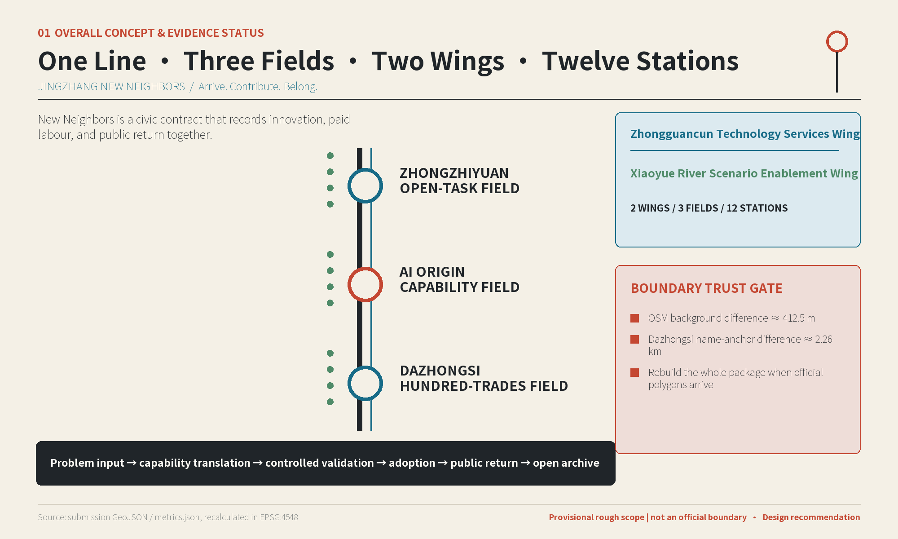
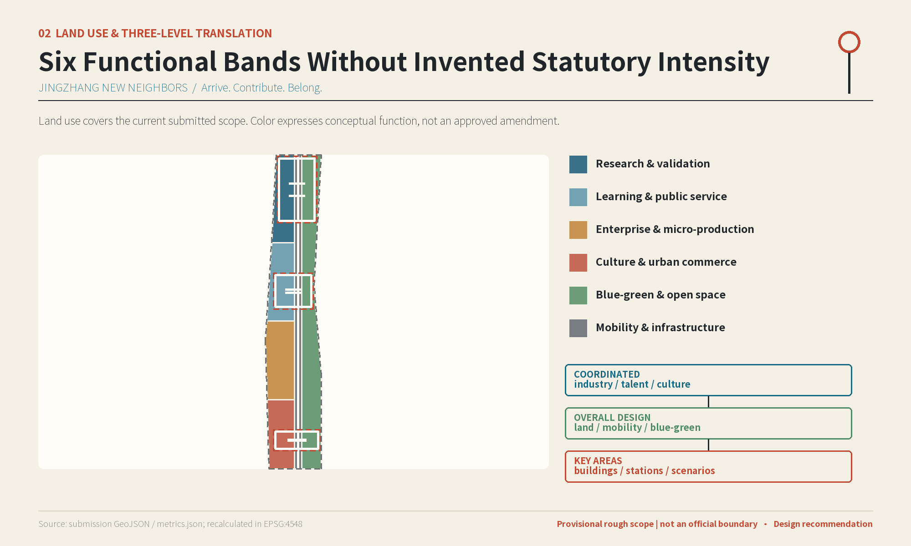
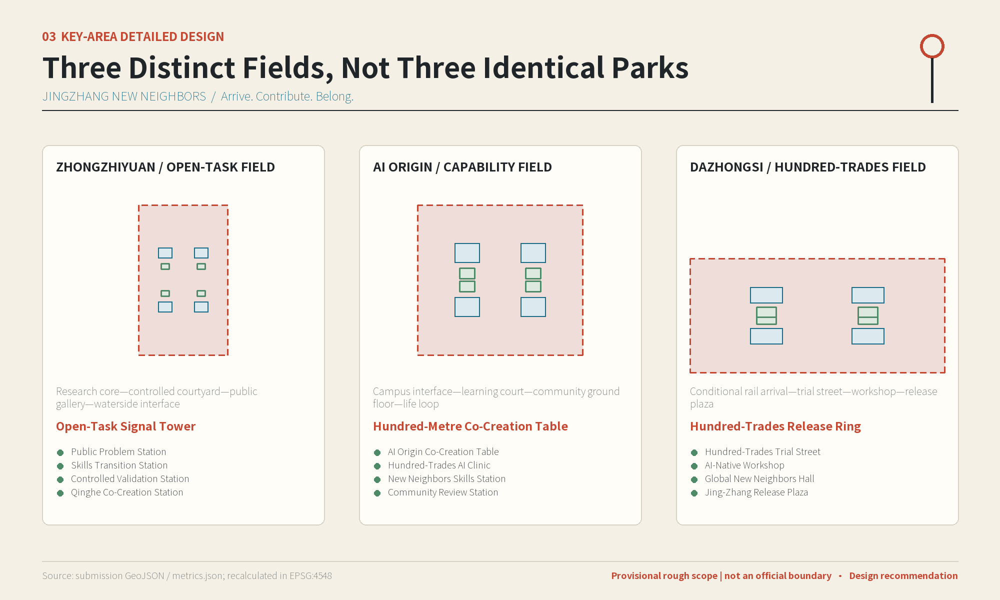
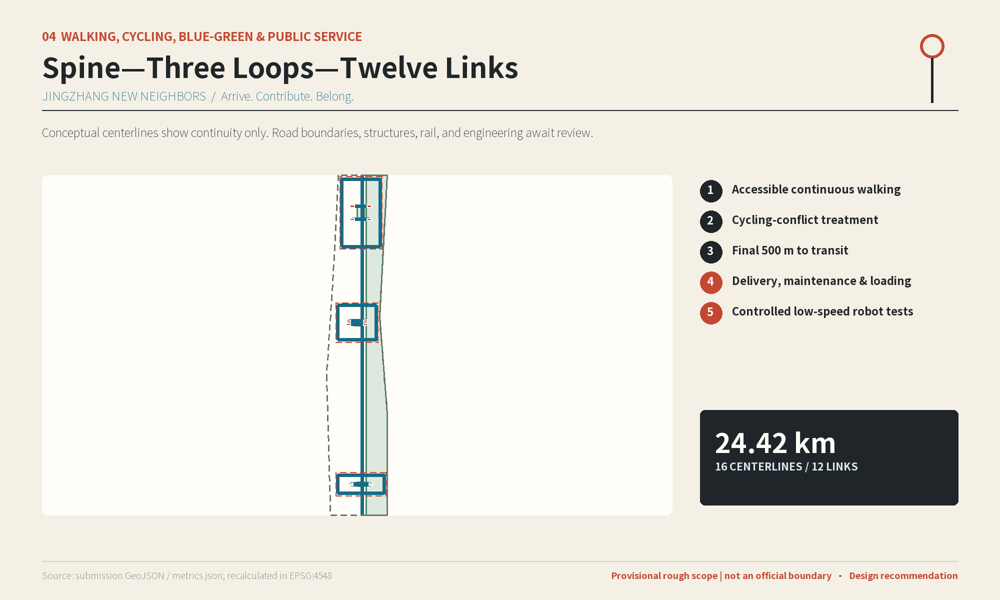
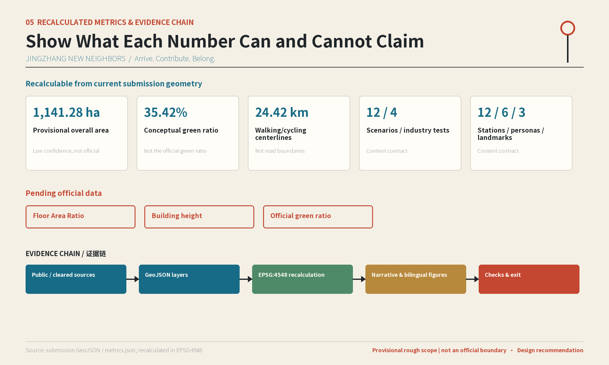

# JINGZHANG NEW NEIGHBORS

## Design Basis and Source Inventory

JINGZHANG NEW NEIGHBORS responds to the Centennial Jing-Zhang AI Innovation Belt Open Call. It does not simply decorate a technology corridor with more “smart” objects; it establishes public interfaces through which innovation and everyday life can meet, be tested, and separate when necessary. The controlling references are the official announcement, the Agent Taskbook, the repository site package, and the public source registry; urban-design judgments follow the local snapshots of professional standards. The announcement defines tasks and deliverable depth, the Taskbook adds three positionings, five functions, and six Agent tasks, and the site package provides machine-readable scopes, layers, metrics, and gaps [source:OFFICIAL-ANNOUNCEMENT] [source:AGENT-TASKBOOK] [standard:PROJECT-OFFICIAL-ANNOUNCEMENT].

This proposal uses only public or rights-cleared material. Kendall Square, Barcelona, Brainport, one-north/SkillsFuture, Seoul AI Hub, and MaRS are compared only for spatial and operational mechanisms. They do not determine Beijing boundaries, land-use ratios, development intensity, investment, or governance authority. Publisher, access date, rights status, and limitations are recorded in sources.json; spatial moves created by this proposal remain design recommendations [source:SOURCE-REGISTRY] [source:AGENT-GENERATED-DESIGN].

The organizer has not yet supplied an official precise overall polygon or official polygons for the three key areas that can be used in this submission. SITE-001 and PROV-KEY-001—003 therefore remain provisional rough constraint areas, not official planning boundaries. The approximately 412.5-metre background discrepancy in Issue #846 does not promote OSM into an official boundary. The approximately 2.26-kilometre discrepancy between PROV-KEY-003 and the Dazhongsi station-name anchor in Issue #1029 means that this proposal cannot claim completed station-area anchoring. When official extents arrive, all geometry, metrics, figures, and bilingual outputs must be rebuilt; moving a single outline is insufficient [source:ISSUE-846] [source:ISSUE-1029] [data:geometry/site_boundary.geojson#SITE-001].

## Three-Level Scope Framework

The three levels are not repeated masterplans at different zoom factors. They are three types of decision. The Coordinated Research Area addresses industry, talent, culture, and regional coordination. The Overall Design Area translates those judgments into land use, walking and cycling, blue-green space, public services, and renewal mechanisms. The three Key-Area Detailed Design Areas then give each mechanism building prototypes, Neighbor Stations, scenarios, and implementation conditions [depth:three_level_scope_framework] [data:geometry/key_areas.geojson#PROV-KEY-001].

| Work level | Central question | Output in this submission | Evidence still required |
| --- | --- | --- | --- |
| Coordinated Research Area | How can Jing-Zhang connect Haidian innovation capacity with daily life in Beijing? | Three positionings, five functions, three fields and two wings, case translations, and annual operations | Authoritative time-series industry and population data |
| Overall Design Area | How can mutual benefit become a continuous spatial system? | One New Neighbors Mutual-Benefit Line, six conceptual land-use types, spine—three loops—twelve links, blue-green space, and phasing | Official boundary, road boundaries, regulatory plan, municipal systems, and ownership |
| Key-Area Detailed Design Area | How can three innovation stages gain distinct spatial and governance interfaces? | Four Neighbor Stations, four building prototypes, and one institutional landmark in each of Zhongzhiyuan, AI Origin, and Dazhongsi | Three official polygons, surveys, station interfaces, and engineering constraints |

The projected area of the provisional overall scope is approximately 11,412,825 square metres. The three provisional key areas total approximately 3,692,893 square metres. These values describe the current submitted geometry, not statutory planning areas. Their confidence is low, and official polygons trigger package-wide recalculation [metric:site_area_sqm] [metric:key_area_area_sqm].

## Coordinated Research Area: Industry and Future-City Research

### Overall positionings, functions, and spatial cycle

The proposal defines three positionings: a globally oriented “AI Civic Mutual-Benefit Test Belt,” a “capability-translation infrastructure” for Beijing businesses, and a “New Neighbors partnership network” for Haidian communities. Its five functions are problem discovery, skills transition, controlled validation, business adoption, and public archiving. The spatial structure is “one line, three fields, two wings, and twelve Neighbor Stations.” The Jing-Zhang Railway Heritage Park direction becomes the New Neighbors Mutual-Benefit Line. Zhongzhiyuan, AI Origin, and Dazhongsi become the Open-Task, Capability-Translation, and Hundred-Trades Co-Creation Fields. The Zhongguancun Technology Services Wing contributes research, legal, capital, and professional capacity; the Xiaoyue River Scenario Enablement Wing contributes community needs and public feedback [source:AGENT-TASKBOOK] [standard:PROJECT-AGENT-OPEN-CALL-TASKBOOK] [depth:overall_spatial_structure].

The three fields are not interchangeable incubator parks. Together they form a cycle of “problem input—capability translation—controlled validation—business adoption—public return—open archive.” Zhongzhiyuan turns public, rights-cleared problems into tasks. AI Origin turns technology into capabilities that residents and microbusinesses can understand. Dazhongsi enables small, real-world trials and market feedback across many trades. Every project must answer four questions: What capacity or opportunity does it add locally? Which human labour is paid and credited? Can communities and businesses migrate and continue using the result? What public asset remains when the project exits?

### Mechanisms translated from six global cases

| Case | Transferable mechanism | Application in Jing-Zhang | What is not extrapolated |
| --- | --- | --- | --- |
| Cambridge Kendall Square | A dense innovation district is discussed together with public realm and community questions | Place corporate and research-facing public interfaces in Neighbor Stations and open tasks | No transfer of development intensity or land value [source:CASE-SOURCE-01] |
| Barcelona 22@ / Cibernàrium | Urban renewal includes public digital-capability learning | Provide tiered, voluntary skills services and human support at AI Origin | Cibernàrium access had unstable TLS in this session; no page values are cited [source:CASE-SOURCE-02A] |
| Brainport Eindhoven | Companies, knowledge institutions, and public bodies work through a regional network | The Zhongguancun wing supplies professional capacity without creating a single super-operator | No presumption of Beijing governance structure [source:CASE-SOURCE-03] |
| Singapore one-north / SkillsFuture | Innovation space and lifelong skills systems reinforce one another | Connect career-transition learning to real tasks and business adoption | The old JTC deep link redirected and does not support spatial controls [source:CASE-SOURCE-04A] [source:CASE-SOURCE-04B] |
| Seoul AI Hub | Entrepreneur support, talent exchange, and AI-sector events are brought together | Create a Global New Neighbors Hall and open review mechanism | No copying of investment or incentive policies [source:CASE-SOURCE-05] |
| Toronto MaRS Discovery District | An innovation organization connects ventures, industry, and public impact | Use the Mutual-Benefit Ledger to record both business adoption and public return | Institutional promotion is not treated as proof of local outcomes [source:CASE-SOURCE-06] |

Together, these cases suggest that an innovation belt competes not only by attracting more companies, but also by allowing ordinary people to enter learning, testing, adoption, and review. Beijing already brings research institutions, developer culture, rail infrastructure, and megacity problems into close proximity. The distinct Beijing character of New Neighbors comes from translating advanced knowledge into public capability used by trades and communities, rather than copying the physical appearance of an overseas district.

The logo concept is “two rails becoming adjacent doors.” Two longitudinal lines stand for research and urban life; transverse links become a shared table and open threshold; three nodes stand for research, translation, and adoption. Rail Graphite, Civic Blue, Neighbor Green, Jing-Zhang Vermilion, and Warm Paper White form the identity palette. Final letterforms, sign locations, and wayfinding require further copyright, accessibility, and urban-character review.

## Overall Design Area: Urban Renewal and Urban Design at Regulatory-Planning Depth

The Overall Design Area does not invent statutory FAR or building heights. It begins by fixing public value and spatial relationships. Six conceptual functional bands support research and controlled validation, learning and public service, entrepreneurship and micro-production, culture and urban commerce, blue-green and open space, and mobility and infrastructure. Together they cover the submitted area without overlap. The 99.998815% coverage leaves only a numerical difference within the spatial-review tolerance [data:geometry/land_use.geojson#LU-01-RD] [metric:land_use_coverage_ratio] [depth:land_use_layout].

Urban renewal follows a “public interface first” strategy instead of wholesale clearance. Neighbor Stations first occupy openable ground floors, residual spaces, walking and cycling links, and reversible temporary structures. Building prototypes represent research, validation, learning, community review, business trials, and exchange. Because existing buildings, ownership, structure, fire safety, and heritage information are missing, BLDG-* features are removable conceptual footprints. They do not identify real buildings and do not constitute demolition or new-build decisions [data:geometry/buildings.geojson#BLDG-ZY-01] [depth:retain_renovate_demolish].

The first public-space package is deliberately small: it must be reachable and provide places to sit, ask for help, and decline digital service. Each station includes a human service point, shared table, tool storage, status board, paper or telephone fallback, and demountable facilities. Digital equipment must show its operating state and preserve essential service offline. Employment, healthcare, legal, safety, and policy outputs remain navigation or prompts only.

Items awaiting regulatory-plan deepening include official extents, parcels and ownership, existing buildings, FAR, building height, setbacks, official green ratio, road boundaries, rail interfaces, municipal capacity, flood control, fire safety, heritage, and geotechnical conditions. While these are missing, the proposal provides design intent and a validation sequence; it does not present conceptual areas as approved controls [standard:MOHURD-CONTROL-DETAILED-PLANNING] [depth:development_intensity_controls].

## Key-Area Detailed Design

### Zhongzhiyuan AI Independent Innovation Acceleration Area: Open-Task Field

The role of this field is to let research capability enter the city through public, rights-cleared tasks, not to require institutions to disclose internal data. Its spatial gradient is “research core—controlled-validation courtyard—public explanation gallery—waterside public interface.” Its four Neighbor Stations are the Public Problem Station, Skills Transition Station, Controlled Validation Station, and Qinghe Co-Creation Station. Their building prototypes accommodate research, validation, human-AI apprenticeship, and human explanation [data:geometry/key_areas.geojson#PROV-KEY-001] [data:geometry/public_space.geojson#PS-ZY-01] [depth:three_key_area_detailed_design].

Renewal first retains usable structures, improves ground-floor interfaces and links, and discusses adaptive reuse only after ownership and structural review. Controlled testing and public activity are managed separately. A local walking and cycling loop connects the four stations and can be closed when required. The Qinghe direction expresses ecological exchange and pedestrian intent only; it makes no embankment or flood-control claim. The Open-Task Signal Tower is an institutional landmark showing “call, test, pause, complete” states without exposing sensitive research. Confidentiality, intellectual property, visitor safety, and institutional responsibility are the principal risks. Rights clearance, booking, a named human lead, and emergency stop are required before a pilot.

### Beijing AI Origin Community: Capability-Translation Field

This field translates university, campus, and developer outputs into tools that young people, residents, and microbusinesses can understand and use. Its structure is “campus and park interface—public learning courtyard—community-service ground floor—walking and cycling life loop.” Its four Neighbor Stations are the AI Origin Co-Creation Table, Hundred-Trades AI Clinic, New Neighbors Skills Station, and Community Review Station [data:geometry/key_areas.geojson#PROV-KEY-002] [data:geometry/public_space.geojson#PS-AO-01].

Building renewal focuses on learning, human community service, near-campus result translation, and mixed learning-life prototypes. It does not propose crossing restricted campuses or opening internal research data. The Hundred-Metre Co-Creation Table is the second institutional landmark and preserves public questions, contribution versions, and exit records. Public space operates by time, access level, and voluntary participation. Residents can use a non-AI service for the same task, and participation does not automatically make personal data training material. Campus boundaries, minors, public-service responsibility, and AI advice mistaken for professional decisions are managed through human review, age-appropriate service, and clear notices.

### Dazhongsi AI Industry Cluster: Hundred-Trades Co-Creation Field

This field enables local food, retail, cultural, design, and community-service businesses to adopt AI carefully and generate real cost, labour, and market feedback. Its structure is “conditional rail-arrival relationship—Hundred-Trades Trial Street—AI-Native Workshop—Global New Neighbors Hall—Jing-Zhang Release Plaza.” Its four Neighbor Stations support trials, making, exchange, and release [data:geometry/key_areas.geojson#PROV-KEY-003] [data:geometry/public_space.geojson#PS-DZ-04].

PROV-KEY-003 is currently about 2.26 kilometres from the Dazhongsi station-name anchor in background comparison. Rail connection, four-quadrant links, and entrance positions therefore remain deepening tasks after official location confirmation, and cannot be shown as surveyed station integration [source:ISSUE-1029] [depth:traffic_rail_slow_parking]. Trial ground floors, cultural workshops, and portable business tools come before permanent work, preventing “smart upgrading” from forcing existing businesses out. The Hundred-Trades Release Ring is the third institutional landmark and presents success, correction, and exit together. Business data, copyright, equipment maintenance, rent displacement, and station misalignment are the principal risks.

## AI Innovation Ecosystem, Talent Personas, and AI-Enabled Scenarios

### Six New Neighbor personas

1. AI researchers and developers need rights-cleared tasks, controlled tests, peer review, and interpretable public feedback.
2. Career changers and young job seekers need a path from basic learning to real paid tasks without automated eligibility screening.
3. Microbusinesses and cultural creators need low-cost trials, portable data, copyright prompts, and the right to leave.
4. Urban service workers need paid and credited participation in process improvement; they must not become unpaid labelers.
5. Nearby residents and carers need human access, accessibility, non-AI equivalent service, and appeal.
6. International founders and visiting students need bilingual navigation, compliance guidance, and local partners; internationalization cannot replace community responsibility.

The six personas map to twelve scenario cards and jointly test who benefits, who works, who is accountable, and who can leave. The count of six is a fixed content contract, not a demographic result [metric:persona_count] [depth:existing_conditions_diagnosis].

### Twelve scenario cards

**SCN-01 New Neighbors Skills Navigator | AI Origin · New Neighbors Skills Station.** A conversational tool helps career changers, young people, and residents break learning goals into courses, in-person workshops, and human consultation. The non-AI equivalent is a paper pathway and human booking. Only progress a user explicitly saves is recorded, and it is never used for employment eligibility. A community education operator reviews outputs. Public return is a portable skills list; misleading recommendations or unavailable human support pause the service.

**SCN-02 Paid Open Tasks | Zhongzhiyuan · Public Problem Station.** Rights-cleared problems become tasks with budgets, credit, and a named acceptor for research teams, developers, students, and urban service workers. The non-AI access point is an on-site task wall and human registration; confidential data is not uploaded. The publisher is accountable for pay, license, and acceptance. Public return is skills, paid labour, and reusable output; no task is published without funds and rights evidence.

**SCN-03 Human-AI Apprenticeship Workshop | Zhongzhiyuan · Skills Transition Station.** AI supports explanation, code checking, and process records for career changers and junior developers, while a mentor makes the final assessment. Small-group teaching and paper exercises are the non-AI path. Learning data is deleted according to project rules and is not used for recruitment screening. Operators pay labour on real projects and record skill transfer; the scenario exits if mentors or a safe environment are unavailable.

**SCN-04 Hundred-Trades AI Clinic | AI Origin · Hundred-Trades AI Clinic.** Short consultations help microbusinesses and creators decide whether a problem suits AI or whether the workflow should be improved first. The non-AI service is a manual workflow review. Full customer lists and transaction records are not copied. Businesses own their configurations and export rights, while a human adviser remains responsible. Public return is saved time and portable methods; unexplained benefits or tool lock-in stops adoption [source:AGENT-TASKBOOK].

**SCN-05 Business Tool Sandbox (industry test) | Dazhongsi · Hundred-Trades Trial Street.** A small group of volunteering businesses tests copy drafts, inventory prompts, and customer-service drafts. Automated pricing, credit decisions, and unreviewed publishing are prohibited. Tests use de-identified samples or synthetic data with short default retention; manual ledgers are the non-AI option. A business lead can stop the tool and export data. Passing requires business value, acceptable labour effects, and a workable exit.

**SCN-06 Creation and Copyright Assistant | Dazhongsi · AI-Native Workshop.** Cultural creators and small design teams use the tool for source registration, license prompts, and version comparison, not as legal copyright advice. A human copyright checklist is the non-AI path. Uncleared material cannot enter a public model or exhibition. Creators retain credit and withdrawal rights. Public return is a reusable licensing template; untraceable sources are removed.

**SCN-07 Accessible Multimodal Wayfinding Stress Test (industry test) | AI Origin · Community Review Station.** Disabled people, people with visual impairments, older adults, and carers are paid to test voice, tactile, and visual guidance. Clear signage and human help remain the non-AI equivalent. Only necessary route problems are stored, not identity profiles. Accessibility professionals and an on-site safety lead share responsibility. Dangerous guidance triggers immediate stop, and formal traffic organization still awaits professional survey [metric:walking_cycling_length_m].

**SCN-08 Low-Speed Robot Mixed-Movement Test (industry test) | Zhongzhiyuan · Controlled Validation Station.** Delivery and cleaning devices are tested only on a short, closed, timed, and supervised route, not in crowded public space. A person performs the same task as the non-AI option. Sensor data is minimized and facial recognition is avoided. The safety lead has a physical emergency stop; collision, accessibility conflict, or unexplained stopping ends the test [data:geometry/roads.geojson#ROAD-RING-ZY].

**SCN-09 Public-Service Small-Model Red Team (industry test) | AI Origin · Community Review Station.** Community workers, professionals, and residents use synthetic cases to test hallucination, discrimination, overreach, and privacy leakage. The model provides information navigation only, never medical, legal, employment, safety, or policy decisions. A human desk is the non-AI route. Each round records faults, repairs, and unresolved issues. No deployment occurs without a passed red team and an appeal route.

**SCN-10 AI Walking and Cycling Check | New Neighbors Mutual-Benefit Line and twelve links.** Human surveys and voluntary feedback identify shade, lighting, crossings, ramps, and cycling conflicts, while AI only helps classify reports. Paper surveys and field walks remain equally valid. Individual locations are not tracked continuously. Transport and accessibility professionals review all recommendations; no engineering scheme is issued without road information [data:geometry/roads.geojson#ROAD-SPINE-01].

**SCN-11 Jing-Zhang Cultural Co-Verified Guide | Three institutional landmarks.** Residents, researchers, and visitors jointly check railway, Zhongguancun, and community memories, while AI supports multilingual retrieval and lead organization. Human guides and printed material are the non-AI path. Conflicting accounts remain visible and invented history is prohibited. An editorial group manages sources and portrait rights. Public return is an attributed open entry; unverifiable content is marked or removed.

**SCN-12 New Neighbors Mutual-Benefit Ledger | Public release interfaces in all three fields.** Structured records describe skills, paid labour, business, time, and knowledge returns, as well as failure and exit. The public can inspect summaries and question them offline; the ledger does not rank personal performance. An independent reviewer checks sources. Metrics without evidence remain pending and cannot be replaced by promotional figures [metric:scenario_card_count] [metric:industry_test_scenario_count].

All twelve scenarios follow “conceptual recommendation—source and rights check—controlled sandbox—public and professional review—small trial—adopt or exit.” Any one of the following blocks progression: unclear source or license, inability to minimize personal data, replacement of a professional decision, no named human or emergency stop, no non-AI equivalent service, or inability to delete data and remove equipment. Each scenario registers skills, labour, business, time, and knowledge returns, but does not prefill performance values before observation [standard:PROJECT-AGENT-OPEN-CALL-TASKBOOK] [depth:risk_missing_data].

## Land Use, Building Scale, and Demolish–Renovate–Retain Strategy

The six land-use types are functional scenarios, not statutory amendments. Research and controlled validation align with research functions; learning and public service support education and community interfaces; entrepreneurship and micro-production support light trials; culture and urban commerce support exhibition and daily consumption; blue-green and open space support ecology and public activity; mobility and infrastructure support access and operations. The complete partition is approximately 11,412,690 square metres and is used only to check geometric completeness inside the provisional extent [metric:land_use_area_sqm] [standard:MNR-LAND-USE-CLASSIFICATION-GUIDE].

The conceptual footprint of twelve building prototypes totals approximately 207,437 square metres, about 1.82% of the provisional overall area. This is not an official Building Coverage Ratio and cannot be used to infer total floor area. FAR, building height, and official green ratio remain pending official data [metric:building_footprint_area_sqm] [metric:floor_area_ratio] [depth:height_massing_character].

The Demolish–Renovate–Retain approach has four levels:

1. Retain reference: continue use where survey confirms structural, operational, and cultural value.
2. Interface-renovation reference: reversibly improve ground-floor access, shade, accessibility, and wayfinding.
3. Adaptive-reuse reference: change use only after ownership, structural, fire, and heritage review.
4. Conditional infill: discuss permanent new work only after regulatory, municipal, transport, and operating responsibilities are known.

Any real-building demolition, retention, or renovation requires site survey, engagement with owners and occupants, structural review, and fire review. Current BLDG-* features do not identify existing objects [data:geometry/buildings.geojson#BLDG-DZ-01] [depth:renewal_project_list].

## Mobility, Rail, Municipal, and Public-Service Facilities

The mobility structure is “spine—three loops—twelve links.” The conceptual New Neighbors Mutual-Benefit spine sets a continuous direction, three loops serve the key areas, and twelve links connect Neighbor Stations to their surroundings. Sixteen conceptual centerlines total approximately 24.42 kilometres. This length does not represent existing roads, rights of way, or construction quantities [metric:road_centerline_length_m] [data:geometry/roads.geojson#ROAD-SPINE-01] [depth:traffic_rail_slow_parking].

Priorities are accessible and continuous walking, cycling-conflict treatment, the final 500 metres to rail and bus, delivery and short-stay loading, and controlled low-speed robot tests. Dazhongsi rail access awaits an official key-area polygon, station entrances, and road data. All other links also require field survey, traffic-safety review, and accessibility review.

Public service follows a Neighbor Station package of “digital capability + human access + non-AI backup.” New infrastructure is small, distributed, edge-first, visibly statused, human-overridable, and able to retain essential service offline. Sensitive tasks do not centralize raw data. Rain gardens, low-carbon energy, edge computing, equipment storage, and maintenance interfaces remain principles. Electricity, communication, water, drainage, flood control, fire, and sanitation capacity require specialist confirmation [depth:municipal_new_infrastructure] [data:geometry/constraints.geojson].

## Blue-Green Space, Public Space, and Urban Character

The blue-green system consists of a Continuous Shaded Walking Band, the Zhongzhiyuan Qinghe Co-Creation Courtyard, the AI Origin Rainwater Learning Courtyard, and the Dazhongsi Quiet Edge and Pocket Green Space. Conceptual green space totals approximately 4,042,532 square metres, about 35.42% of the provisional overall area. This is a design scenario derived from proposal geometry, not an official green ratio, flood-control conclusion, or waterfront-control line [metric:green_space_area_sqm] [metric:green_ratio] [depth:blue_green_public_space].

The twelve Neighbor Station public spaces total approximately 69,725 square metres, about 0.61% of the provisional overall area. The ratio is deliberately limited because Neighbor Stations are directly operable public interfaces, not a duplicate count of all park land. Green-space and public-space metrics therefore remain separate [metric:public_space_area_sqm] [metric:public_space_ratio].

Urban character combines “railway order, Haidian openness, and neighborhood scale.” Parallel rail lines create a legible order. Blue, green, and warm paper white reduce the institutional weight of technology, while vermilion is reserved for status and public notice. Timetables become tasks and programs, signals become scenario states, milestones become contribution records, and platforms become public worktables. The Open-Task Signal Tower, Hundred-Metre Co-Creation Table, and Hundred-Trades Release Ring are public institutions rather than spectacular objects. Their location, scale, structure, lighting, and approvals await deepening [metric:landmark_count] [standard:MOHURD-URBAN-DESIGN-MEASURES].

The cultural narrative is “three connections.” The Jing-Zhang Railway connects geographic distance; Zhongguancun connects knowledge and entrepreneurship; Jing-Zhang New Neighbors connects innovation with ordinary life. The experience sequence is “arrive—find a problem—learn together—test under control—adopt in the city—leave a contribution,” bringing Beijing history, research, and everyday business into one public route.

## Renewal Project List, Implementation Policies, and Phasing

| Project package | Main action | Evidence gate | Suggested phase |
| --- | --- | --- | --- |
| New Neighbors Mutual-Benefit Line | Continuous wayfinding, shade, accessibility issue list, and program timetable | Official extent, roads, and field survey | A—B |
| Zhongzhiyuan Open-Task Field | Four stations, controlled courtyard, and Open-Task Signal Tower | Rights, institutional responsibility, visitor and test safety | A—C |
| AI Origin Capability-Translation Field | Learning courtyard, human service, co-creation table, and community review | Campus boundary, minors, and public-service responsibility | A—C |
| Dazhongsi Hundred-Trades Co-Creation Field | Trial street, workshop, Global New Neighbors Hall, and release ring | Official location, station interface, businesses, and ownership | A—C |
| Twelve Neighbor Station kit | Desk, table, status board, and non-AI backup | Operator, maintenance, accessibility, and fire safety | A—B |
| Spine—three loops—twelve links | Walking and cycling connections and conflict treatment | Road boundaries, transport, and accessibility review | B |
| Blue-green co-creation courtyards | Shade, rainwater learning, and quiet edges | Flood, municipal, ecological, and heritage review | B—C |
| New Neighbors Mutual-Benefit Ledger | Public return, failure, and exit records | Data governance, independent review, and appeal | A |

Phasing uses A/B/C/R evidence gates rather than promised government implementation years. A “Open the Door” performs source checks, public interviews, open tasks, mobile service desks, and temporary programs. B “Form the Network” adds walking and cycling links, shared ground floors, and controlled test space after survey, transport, and ownership confirmation. C “Take Root” deepens permanent facilities, building renewal, and major events after regulatory, fire, municipal, heritage, and operating responsibilities are confirmed. R “Exit” deletes or returns data, removes equipment, settles labour payments, and publishes a review whenever a gate fails [data:geometry/phasing.geojson#PHASE-A-01] [depth:phasing_implementation].

Annual operations follow four seasons. Spring “City Questions” publishes needs and rights boundaries. Summer “Skills and Tests” organizes mentors, apprentices, and controlled sandboxes. Autumn “Hundred-Trades Release” presents adoption, correction, and exit. Winter “Public Review” verifies the Mutual-Benefit Ledger. Jing-Zhang New Neighbors Week is a proposed international window subject to approval, bringing global developers and local trades together around real problems. Participation progresses from visitor to learner, task participant, credited contributor, scenario maintainer, and New Neighbors mentor. Community feedback is not unpaid labeling, and honors cannot be replaced by advertising or paid ranking [source:AGENT-TASKBOOK] [depth:renewal_project_list].

## Indicator System, Area Recalculation, and Compliance Matrices

Known metrics are recalculated from submitted GeoJSON in EPSG:4548, while counts of scenarios, personas, Neighbor Stations, and landmarks come from the frozen content contract. The provisional overall area is approximately 1,141.28 hectares. Six land-use types cover approximately 99.9988%. Conceptual green space is approximately 404.25 hectares. Twelve Neighbor Station public spaces total approximately 6.97 hectares. Twelve building-prototype footprints total approximately 20.74 hectares. Conceptual walking and cycling centerlines total approximately 24.42 kilometres. Every area expires when the official boundary is substituted [metric:site_area_sqm] [metric:land_use_coverage_ratio] [depth:metrics_recalculation].

| Indicator | Current result | Design meaning | Status boundary |
| --- | ---: | --- | --- |
| Provisional overall area | 11,412,825 sqm | Recalculation denominator for current submitted geometry | Low confidence, not official |
| Three provisional key areas | 3,692,893 sqm | Scale check for the three-field prototypes | Low confidence, not station-anchored |
| Six-type land-use coverage | 99.998815% | Check for no material gaps or overlaps | Geometry validation value |
| Conceptual green-space ratio | 35.420959% | Supports the shaded band and co-creation courtyards | Not the official green ratio |
| Neighbor Station public-space ratio | 0.610938% | Minimum directly operable public interfaces | Excludes most open green space |
| Building prototype footprint | 207,437 sqm | Twelve removable conceptual prototypes | Not an official BCR |
| Walking and cycling centerlines | 24,416.531 m | Spine, three loops, and twelve links | Not road boundaries |
| Scenarios / industry tests / personas / landmarks | 12 / 4 / 6 / 3 | Taskbook content-contract check | Not implementation quantities |

FAR, building height, and official green ratio remain pending official data because the repository contains no approved controls supporting these values. A “pending” indicator is a professional handoff point, not an invitation to guess [metric:building_height_m] [metric:official_green_ratio].

The task coverage matrix responds item by item to Announcement 1.3—1.5 and agent.1—agent.6. The professional standards matrix maps urban-design management, regulatory-plan preparation, land-use classification, and Taskbook requirements to narrative, drawings, geometry, and checks. The design-depth matrix covers existing-condition diagnosis, three-level scope, overall structure, land use, intensity, character, Demolish–Renovate–Retain, mobility, municipal systems, blue-green space, key areas, projects, phasing, recalculation, and risk. “Complete” in a matrix means that this conceptual submission offers a reviewable expression; it does not mean statutory approval, engineering feasibility, or government commitment [standard:MOHURD-URBAN-DESIGN-MEASURES] [depth:risk_missing_data].

## Risk, Copyright, and Compliance Statement

The greatest spatial risk is not that the provisional boundary looks rough, but that it could be misrepresented as an official boundary. SITE-001, three key areas, roads, buildings, green spaces, public spaces, and phasing must all be rebuilt when official geometry arrives. OSM background cannot resolve Issue #846, and a station-name anchor cannot be used to move the Dazhongsi area independently [source:PROVISIONAL-BOUNDARY-SOURCE] [source:ISSUE-846] [source:ISSUE-1029].

Governance risks include excessive personal-data collection, AI replacing professional decisions, unpaid labour, tool lock-in for businesses, lack of non-AI service for vulnerable users, equipment maintenance failure, and incomplete pilot exit. The one-scenario-one-return contract responds through data minimization, a named human lead, review and appeal, physical emergency stop, non-AI equivalent service, portable data, and explicit exit. Operator, budget, procurement, event approval, and government implementation remain unconfirmed; all operational arrangements are conceptual recommendations [depth:risk_missing_data].

Visual outputs use only programmatically derived proposal graphics, rights-cleared text, and redistributable or system fonts. The package excludes commercial map screenshots, remote tiles, unlicensed trademarks, portraits, case-study images, and paper figures. Cases appear as textual mechanism summaries only, with complete rights notes in report/copyright_statement.md. HTML must work offline without CDN resources, remote fonts, scripts, iframes, forms, APIs, or tracking [source:TOOLCHAIN-REVIEW].

KaiKai306 produced this work with the disclosed GPT-5 Codex workflow and remains responsible for reviewing AI output. Issue #1062 and PR #1064, which was not merged into the current baseline when the scaffold was created, warn that Windows line-ending conversion can cause manifest hash differences. Final text will be normalized to LF, and the blobs to be committed will be checked through an isolated Git index. Any substantive change after finalization triggers rendering, finalization, and the full self-check again [source:ISSUE-1062] [source:PR-1064].

## References

1. Beijing Municipal Commission of Planning and Natural Resources, Haidian Branch: Centennial Jing-Zhang AI Innovation Belt International Urban Design Open Call Prequalification Announcement [source:OFFICIAL-ANNOUNCEMENT].
2. Taskbook Extract for the Global Agent Open Call for the Centennial Jing-Zhang AI Innovation Belt [source:AGENT-TASKBOOK].
3. open-city-ai/haidian: machine-readable site package, public source registry, and provisional geometry [source:SITE-PACKAGE] [source:SOURCE-REGISTRY].
4. Ministry of Housing and Urban-Rural Development: Measures for the Administration of Urban Design [source:MOHURD-URBAN-DESIGN-MEASURES].
5. Ministry of Housing and Urban-Rural Development: Measures for the Preparation and Approval of Regulatory Detailed Plans for Cities and Towns [source:MOHURD-CONTROL-DETAILED-PLANNING].
6. Ministry of Natural Resources: Classification Guide for Territorial-Spatial Survey, Planning, and Use Control [source:MNR-LAND-USE-CLASSIFICATION-GUIDE].
7. Public institutional pages from the City of Cambridge, Barcelona Activa, Brainport Development, JTC/SkillsFuture, Seoul AI Hub, and MaRS. They are used only for comparative mechanisms; access and rights limitations follow sources.json.
