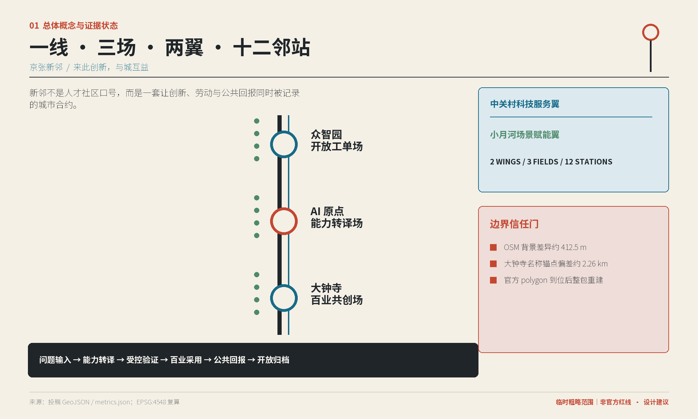
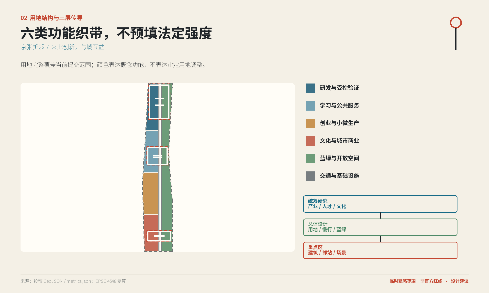
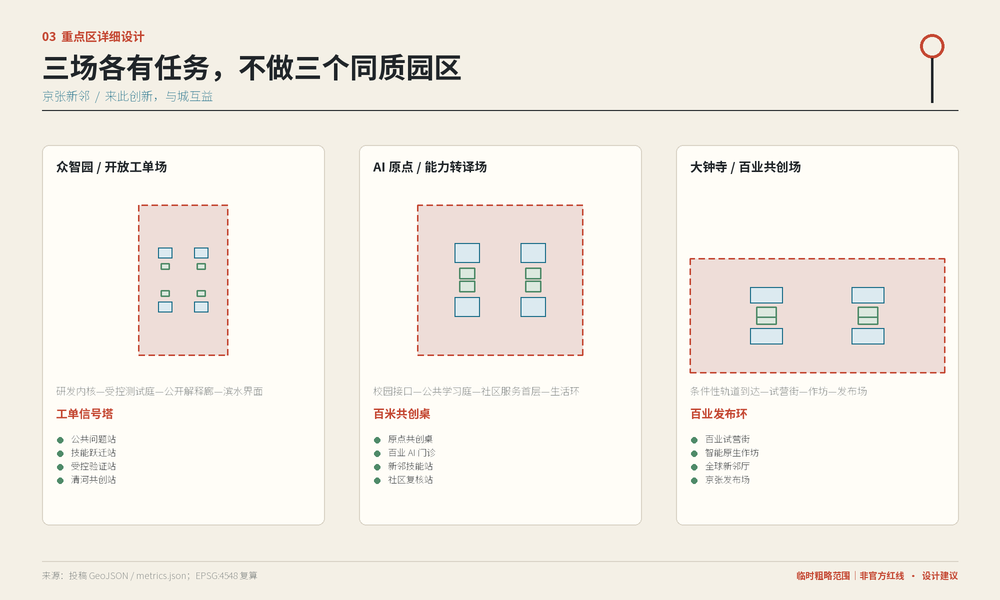
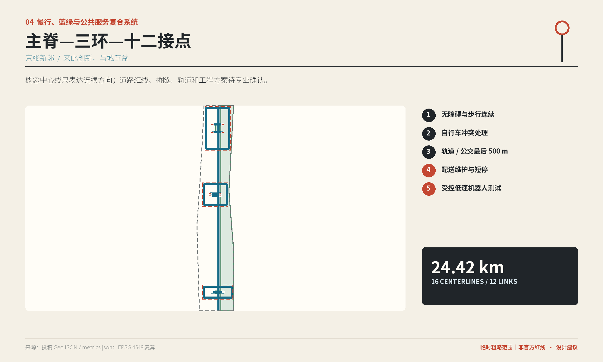
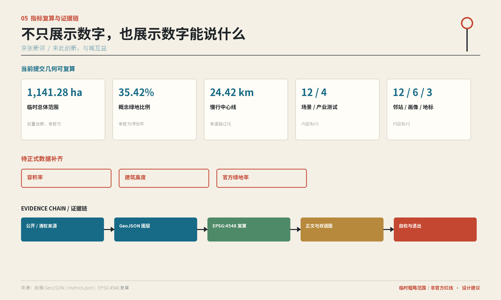

# 京张新邻

## 设计依据与资料清单

“京张新邻”回应百年京张 AI 创新带公开征集：它不是把一条科技走廊装饰得更“智能”，而是建立创新与普通生活之间可被使用、检验和退出的公共接口。主控依据为征集公告、面向智能体任务书、仓库场地包与公开来源登记；城市设计判断遵循仓库保存的专业标准快照。公告确定工作任务与成果深度，任务书补充三大定位、五大功能和六项智能体任务，场地包负责机器可读的范围、图层、指标和缺口 [source:OFFICIAL-ANNOUNCEMENT] [source:AGENT-TASKBOOK] [standard:PROJECT-OFFICIAL-ANNOUNCEMENT]。

本方案只使用公开或已清权资料。Kendall Square、Barcelona、Brainport、one-north/SkillsFuture、Seoul AI Hub 与 MaRS 只用于比较空间和运营机制，不用于推导北京本地的边界、用地比例、开发强度、投资额或治理权限。完整的发布者、访问日期、许可状态和限制保存在 sources.json；所有由本方案生成的空间判断标记为设计建议 [source:SOURCE-REGISTRY] [source:AGENT-GENERATED-DESIGN]。

当前组织方尚未提供可供本次投稿使用的官方精确总体 polygon 与三处重点区 polygon。提交中的 SITE-001 与 PROV-KEY-001—003 因而保持“临时粗略约束范围”，不是官方红线。Issue #846 所述约 412.5 米背景差异不会使 OSM 升级为红线；Issue #1029 所述 PROV-KEY-003 与大钟寺站名称锚点约 2.26 公里偏差，意味着本方案不能声称已完成大钟寺站城锚定。正式范围到位后，必须重建全部几何、指标、图件和双语成果，而不是只移动一条边界线 [source:ISSUE-846] [source:ISSUE-1029] [data:geometry/site_boundary.geojson#SITE-001]。

## 三层范围工作框架

三层范围不是三张重复的总图，而是三种不同尺度的决定。统筹研究范围回答产业、人才、文化和区域协同；总体设计范围把这些判断转译成用地、慢行、蓝绿、公共服务和更新机制；三处重点区再把机制落实为建筑原型、邻站、场景和实施条件 [depth:three_level_scope_framework] [data:geometry/key_areas.geojson#PROV-KEY-001]。

| 工作层 | 核心问题 | 本次成果 | 仍需补齐 |
| --- | --- | --- | --- |
| 统筹研究范围 | 京张如何连接海淀创新能力与北京日常生活 | 三大定位、五大功能、三场两翼、案例转译、年度运营 | 区域产业和人口的权威时序数据 |
| 总体设计范围 | 互益机制如何成为连续空间系统 | 一条新邻互益线、六类概念用地、主脊—三环—十二接点、蓝绿与分期 | 官方边界、道路红线、控规、市政和权属 |
| 重点区详细设计范围 | 三种创新环节如何拥有不同的空间和治理接口 | 众智园、AI 原点、大钟寺各四座邻站、四类建筑原型和一处制度地标 | 三处官方 polygon、现状测绘、站点和工程接口 |

临时总体范围投影面积约 11,412,825 平方米，三处临时重点区合计约 3,692,893 平方米。这些数值只说明“当前提交几何有多大”，不说明法定规划范围有多大；置信度低，正式 polygon 到位即触发整包复算 [metric:site_area_sqm] [metric:key_area_area_sqm]。

## 统筹研究范围产业与未来城市研究

### 总体定位、功能与空间循环

方案提出三大定位：面向全球的“AI 城市互益试验带”、面向北京百业的“能力转译基础设施”、面向海淀社区的“新邻合伙网络”。五大功能为问题发现、技能跃迁、受控验证、百业采用和公共归档。空间结构概括为“一线、三场、两翼、十二邻站”：京张遗址公园方向构成新邻互益线；众智园、AI 原点和大钟寺分别承担开放工单、能力转译和百业共创；中关村科技服务翼提供科研、法务、资本和专业服务，小月河场景赋能翼带来社区问题与公众反馈 [source:AGENT-TASKBOOK] [standard:PROJECT-AGENT-OPEN-CALL-TASKBOOK] [depth:overall_spatial_structure]。

三场不是三个相同的孵化园。它们构成“问题输入—能力转译—受控验证—百业采用—公共回报—开放归档”的闭环：众智园把可公开、已清权的问题变成工单；AI 原点把技术转成普通人和小微企业可理解的能力；大钟寺让工具在真实百业中小规模试用并形成市场反馈。每个项目都必须回答四个问题：给本地人增加什么能力或机会，哪些劳动获得报酬和署名，社区与商户能否迁移成果，项目退出后留下什么公共资产。

### 六个全球案例的机制转译

| 案例 | 可转译机制 | 京张采用方式 | 不作何种外推 |
| --- | --- | --- | --- |
| Cambridge Kendall Square | 高密度创新区与公共领域、社区议题共同讨论 | 把企业和研发活动的公共接口放进邻站与开放工单 | 不外推开发强度或地价 [source:CASE-SOURCE-01] |
| Barcelona 22@ / Cibernàrium | 城市更新同时提供面向市民的数字能力学习 | 在 AI 原点设置分级、可退出的技能站和人工服务 | 本次 Cibernàrium 访问 TLS 不稳定，不引用页面数值 [source:CASE-SOURCE-02A] |
| Brainport Eindhoven | 企业、知识机构与公共部门以区域网络协作 | 中关村翼只作为专业能力输入，不设单一超级主体 | 不推定北京治理架构 [source:CASE-SOURCE-03] |
| Singapore one-north / SkillsFuture | 创新空间与终身技能体系形成相互支撑 | 把转岗学习与真实工单、商户采用连接 | JTC 旧深链发生重定向，不支撑空间控制 [source:CASE-SOURCE-04A] [source:CASE-SOURCE-04B] |
| Seoul AI Hub | 创业支持、人才交流与 AI 产业活动聚合 | 形成全球新邻厅与开放复盘机制 | 不复制投资或扶持政策 [source:CASE-SOURCE-05] |
| Toronto MaRS Discovery District | 创新机构连接创业、产业与公共影响 | 用互益账本同时记录商业采用和公共回报 | 不把机构宣传转成当地成效证明 [source:CASE-SOURCE-06] |

这些案例共同说明，创新带的竞争力不只来自“聚集更多公司”，也来自普通人能否进入学习、测试、采用和复盘环节。北京的优势是科研机构、开发者文化、轨道与超大城市问题同场存在；“新邻”的北京性正来自把顶尖知识翻译为可被百业和社区使用的公共能力，而不是复制海外园区外形。

Logo 概念为“两条轨道成为相邻的门”：两条纵线代表科研与城市生活，横向连接形成共享长桌和开放门槛，三个节点代表研发、转译与采用。轨道石墨、公共蓝、邻里绿、京张朱红与暖纸白组成识别系统；最终字形、标识设置与导视位置需在版权、无障碍和城市风貌审查后深化。

## 总体设计范围城市更新与控规深度城市设计

总体设计不预填法定容积率和建筑高度，而是先锁定公共价值与空间关系。六类概念功能织带分别为研发与受控验证、学习与公共服务、创业与小微生产、文化与城市商业、蓝绿与开放空间、交通与基础设施。它们共同覆盖当前提交范围，彼此无重叠；覆盖率 99.998815% 的微小差额位于空间复核容差内 [data:geometry/land_use.geojson#LU-01-RD] [metric:land_use_coverage_ratio] [depth:land_use_layout]。

城市更新采用“公共接口优先”而不是“整体推倒重来”。邻站优先进入可开放首层、边角空间、慢行接点和可逆临时设施；建筑原型分别表达研发、验证、学习、社区复核、百业试营和交流功能。由于缺少现状建筑、权属、结构、消防和文保资料，BLDG-* 只是可拆卸的概念基底，不对应真实楼栋，也不构成拆除或新建决定 [data:geometry/buildings.geojson#BLDG-ZY-01] [depth:retain_renovate_demolish]。

总体公共空间先形成“可达、可坐、可问、可退出”的最小服务包：人工服务台、共创长桌、工具储存、状态牌、纸质或电话备用服务与可拆卸设施。数字设备必须显示运行状态，断网时保留基本服务，涉及就业、医疗、法律、安全和政策的输出只作导航或提示。

控规深化的待补清单包括官方范围、地块权属、现状建筑、容积率、建筑高度、退线、绿地率、道路红线、轨道接口、市政容量、防洪、消防、文保与工程地质。上述资料缺失时，本方案只给出设计意图和验证顺序，不把概念面积写成审定指标 [standard:MOHURD-CONTROL-DETAILED-PLANNING] [depth:development_intensity_controls]。

## 重点区域详细设计

### 众智园 AI 自主创新加速区：开放工单场

定位是让研究能力通过可公开、已清权的工单进入城市，而不是要求机构开放内部数据。空间梯度为“研发内核—受控测试庭—公开解释廊—滨水公共界面”。四座邻站分别是公共问题站、技能跃迁站、受控验证站和清河共创站；对应建筑原型承载研发、验证、人机学徒与人工解释服务 [data:geometry/key_areas.geojson#PROV-KEY-001] [data:geometry/public_space.geojson#PS-ZY-01] [depth:three_key_area_detailed_design]。

更新策略优先保留可用结构，改造首层界面与连廊，在完成权属和结构审查后再讨论适应性再利用；受控测试与公众活动分区管理。慢行环把四站串成可关闭的小循环，清河方向仅表达生态交流与步行联系意图，不提出岸线或防洪工程。工单信号塔作为制度地标，显示“征集、测试、暂停、完成”状态，不展示敏感研发信息。风险在于保密、知识产权、访客安全和研究机构责任边界，进入试点前必须形成清权、预约、人工负责人和急停制度。

### 北京 AI 原点社区：能力转译场

定位是把高校、园区和开发者成果转译成青年、居民与小微企业能理解和使用的工具。空间结构为“校园与园区接口—公共学习庭—社区服务首层—慢行生活环”。四座邻站是原点共创桌、百业 AI 门诊、新邻技能站和社区复核站 [data:geometry/key_areas.geojson#PROV-KEY-002] [data:geometry/public_space.geojson#PS-AO-01]。

建筑更新聚焦学习空间、社区人工服务、近校成果转译和学习生活混合原型；不主张穿越受限校园，也不开放内部科研数据。百米共创桌是第二处制度地标，保存公开问题、贡献版本和退出记录。公共空间采用分时、分级、可退出的使用规则：居民可用非 AI 服务完成同一事务，个人数据不因参与活动自动成为训练材料。风险在于校园边界、未成年人、社区服务责任与算法建议被误解为专业决定，必须通过人工复核、年龄适配和清晰提示控制。

### 大钟寺 AI 产业聚集区：百业共创场

定位是让餐饮、零售、文化、设计和社区服务等本地行业审慎采用 AI，形成真实的成本、劳动和市场反馈。空间结构为“条件性轨道到达关系—百业试营街—智能原生作坊—全球新邻厅—京张发布场”；四座邻站对应试营、制作、交流与发布 [data:geometry/key_areas.geojson#PROV-KEY-003] [data:geometry/public_space.geojson#PS-DZ-04]。

当前 PROV-KEY-003 与大钟寺站名称锚点存在约 2.26 公里背景偏差，因此轨道接驳、四象限连通和入口位置均是待官方区位确认后的深化任务，不得在图纸上表示为已测绘站城关系 [source:ISSUE-1029] [depth:traffic_rail_slow_parking]。更新策略以试营首层、文化作坊与可迁移商户工具为先，避免以“智能化”迫使原有商户退出。百业发布环作为第三处制度地标，同时展示成功、修正与退出项目；风险集中于商业数据、版权、设备运维、租金挤出和站点错位。

## AI 创新生态、人才画像与 AI+ 场景

### 六类新邻画像

1. AI 研究者与开发者：需要清权工单、受控测试、同行评议与可解释的公众反馈。
2. 转岗者与青年求职者：需要从基础学习走向真实付费任务的路径，不接受自动资格筛选。
3. 小微商户与文化创作者：需要低成本试用、数据可迁移、版权提示和随时退出。
4. 城市服务劳动者：需要以有报酬、有署名的方式参与流程改进，不能成为免费标注者。
5. 周边居民与照护者：需要人工入口、无障碍、非 AI 等价服务和可申诉机制。
6. 国际创业者与来访学生：需要双语导航、合规说明和本地合作者，不以国际化替代社区责任。

六类画像对应 12 张场景卡，并共同检验“谁获益、谁劳动、谁负责、谁能退出”。画像数量作为内容契约固定为 6，不代表人口统计结论 [metric:persona_count] [depth:existing_conditions_diagnosis]。

### 十二张场景卡

**SCN-01 新邻技能导航｜AI 原点·新邻技能站。** 服务转岗者、青年和居民，用对话式工具把学习目标拆成课程、线下工作坊与人工咨询；非 AI 等价服务是纸质路线图和人工预约。只记录用户主动保存的学习进度，不进行就业资格判断。社区教育运营者负责复核；公共回报是可迁移技能清单，连续无人工服务或出现误导推荐即暂停。

**SCN-02 付费开放工单｜众智园·公共问题站。** 服务研究团队、开发者、学生和城市服务劳动者，把已清权问题拆成有预算、有署名、有验收人的任务。非 AI 入口是现场工单墙和人工报名；不上传保密数据。工单发布者承担报酬、许可与验收责任；公共回报是技能、劳动报酬和可复用成果，缺少资金或权利证明不得发布。

**SCN-03 人机学徒工坊｜众智园·技能跃迁站。** 服务转岗者和初级开发者，由 AI 辅助讲解、代码检查和过程记录，导师作最终评价。非 AI 路径是小组教学与纸面练习；学习数据按项目删除，不进入招聘筛选。运营者须支付真实项目劳动并记录技能转移，无法提供导师或安全环境时退出。

**SCN-04 百业 AI 门诊｜AI 原点·百业 AI 门诊。** 服务小微商户和创作者，通过短时会诊判断问题是否适合 AI、现有流程能否先优化。非 AI 服务是经营流程梳理；不复制完整客户名册或交易明细。商户拥有工具配置和导出权，人工顾问负责建议；公共回报是节省时间与可迁移方法，若工具造成锁定或收益不可解释则停止采用 [source:AGENT-TASKBOOK]。

**SCN-05 商户工具沙盒（产业测试）｜大钟寺·百业试营街。** 在少量自愿商户中测试文案、库存提示和客服草稿；禁止自动定价、信用判断和无人工发布。使用脱敏样本或合成数据，默认短期保留；线下手工台账作为非 AI 方案。商户负责人可一键停用并导出数据；测试通过需同时证明经营价值、劳动影响可接受和退出可行。

**SCN-06 创作与版权助手｜大钟寺·智能原生作坊。** 服务文化创作者与小型设计团队，用于来源登记、授权提示和版本比较，不替代版权法律意见。非 AI 路径是人工版权清单；未清权素材不得进入公开模型或展览。创作者保留署名和撤回权；公共回报是可复用许可模板，来源无法追溯即下架。

**SCN-07 无障碍多模态导行压力测试（产业测试）｜AI 原点·社区复核站。** 由行动不便者、视障者、老年人和照护者以有报酬方式测试语音、触觉和视觉提示。非 AI 方案是清晰标识与人工引导；只保存必要的路线问题，不采集身份画像。无障碍专业人员和现场安全员共同负责，出现危险指引立即急停，正式交通组织仍待专业测绘 [metric:walking_cycling_length_m]。

**SCN-08 低速机器人混行测试（产业测试）｜众智园·受控验证站。** 只在封闭、分时、有人看护的短路线测试低速配送与清洁设备；不进入拥挤公共空间。非 AI 方案由人工完成同一任务；传感数据最小化并避开人脸识别。现场安全员拥有物理急停，碰撞、无障碍冲突或无法解释的停留立即终止 [data:geometry/roads.geojson#ROAD-RING-ZY]。

**SCN-09 公共服务小模型红队（产业测试）｜AI 原点·社区复核站。** 服务社区工作者、专业人员与居民代表，用合成案例测试幻觉、歧视、越权和隐私泄露。模型只做信息导航，不做医疗、法律、就业、安全或政策决定；非 AI 入口是人工服务台。每轮记录问题、修复与未解决项，未通过红队或没有申诉路径不得部署。

**SCN-10 AI 慢行体检｜新邻互益线与十二接点。** 结合人工踏勘和自愿反馈发现遮阴、照明、过街、坡道与骑行冲突，AI 只辅助归类。纸质问卷和现场走访保持同等有效；不持续追踪个人位置。交通和无障碍专业人员复核后才形成建议；公共回报是公开问题清单，未取得道路资料时不输出工程方案 [data:geometry/roads.geojson#ROAD-SPINE-01]。

**SCN-11 京张文化共证导览｜三处制度地标。** 居民、研究者和来访者共同核对铁路、中关村与社区记忆，AI 辅助多语检索和线索整理。非 AI 路径是人工讲解与纸本资料；争议叙事并列保留，不生成虚构史实。编辑委员会负责来源和肖像许可；公共回报是带出处的开放条目，无法验证的内容明确标注或撤下。

**SCN-12 新邻互益账本｜三场公共发布界面。** 用结构化记录说明项目带来的技能、付费劳动、生意、时间和知识回报，同时记录失败与退出。公众可查看摘要并通过线下渠道质疑，账本不记录个人绩效排名。独立复核人核对来源；缺少证据的指标保持待验证，不能用宣传数字替代 [metric:scenario_card_count] [metric:industry_test_scenario_count]。

十二场景共同遵循“概念建议—来源与权利清查—受控沙盒—公众与专业复核—小规模试用—采用或退出”。来源或许可不清、无法最小化个人数据、替代专业决定、缺少人工负责人或急停、缺少非 AI 等价服务、无法删除数据或撤除设备，任一条件出现都阻断升级。每个场景登记技能、劳动、生意、时间和知识五类公共回报，但在真实观察前不预填绩效数值 [standard:PROJECT-AGENT-OPEN-CALL-TASKBOOK] [depth:risk_missing_data]。

## 用地、建筑规模与拆改留方案

六类用地是功能情景，不是法定用地调整。研发与受控验证对应科研功能，学习与公共服务承载教育和社区接口，创业与小微生产支持轻量试营，文化与城市商业承载展览和日常消费，蓝绿与开放空间提供生态与公共活动，交通与基础设施保障到达和运维。完整剖分面积约 11,412,690 平方米，只用于校验当前临时范围内的几何完整性 [metric:land_use_area_sqm] [standard:MNR-LAND-USE-CLASSIFICATION-GUIDE]。

12 个建筑原型的概念基底合计约 207,437 平方米，占临时总体范围约 1.82%。这不是建筑密度控制，更不能据此反推总建筑规模；容积率、建筑高度与官方绿地率均保持“待正式数据补齐” [metric:building_footprint_area_sqm] [metric:floor_area_ratio] [depth:height_massing_character]。

拆改留采用四级判断：

1. 保留参考：结构、使用和文化价值经调查确认后优先继续使用。
2. 界面改造参考：用可逆方式改善首层开放、遮阴、无障碍和导视。
3. 适应性再利用参考：完成权属、结构、消防和文保审查后再转换功能。
4. 条件性补点：只有控规、市政、交通和运营责任明确后才讨论永久新建。

任何具体楼栋的拆除、保留或改造都需要现场测绘、产权人和使用者沟通、结构与消防审查；当前 BLDG-* 不指向现状对象 [data:geometry/buildings.geojson#BLDG-DZ-01] [depth:renewal_project_list]。

## 交通、轨道、市政与公共服务设施

交通结构为“主脊—三环—十二接点”：新邻互益线概念主脊约束连续方向，三条环线服务三个重点区，十二条接点把邻站连入周边。16 条概念中心线合计约 24.42 公里；该长度不代表已建道路、路权或施工规模 [metric:road_centerline_length_m] [data:geometry/roads.geojson#ROAD-SPINE-01] [depth:traffic_rail_slow_parking]。

优先顺序为无障碍和步行连续、自行车冲突处理、轨道与公交最后五百米、配送维护与短时装卸、受控低速机器人测试。大钟寺的轨道到达关系必须等官方重点区 polygon、站点出入口和道路资料确认；其他接点也需现场踏勘、交通安全和无障碍复核。

公共服务采用“数字能力 + 人工入口 + 非 AI 备份”的邻站标准包。新型基础设施坚持小型分布式、端侧优先、状态可见、人工接管和断网可运行；敏感任务不把原始数据集中上传。市政方面只提出雨水花园、低碳能源、边缘计算、设备储存和维护接口的原则，电力、通信、给排水、防洪、消防和环卫容量仍需专项确认 [depth:municipal_new_infrastructure] [data:geometry/constraints.geojson]。

## 蓝绿空间、公共空间与城市风貌

蓝绿系统由连续荫行带、众智园清河共创庭、AI 原点雨水学习庭和大钟寺安静边界与口袋绿地组成。概念绿地约 4,042,532 平方米，占临时总体范围约 35.42%；这是方案几何的设计情景，不是官方绿地率，也不构成防洪或岸线结论 [metric:green_space_area_sqm] [metric:green_ratio] [depth:blue_green_public_space]。

十二邻站公共空间约 69,725 平方米，占临时总体范围约 0.61%。比例看似小，是因为邻站被定义为可直接运营的公共接口，而非把全部公园面积重复统计为公共空间；绿地与公共空间指标保持分层计算 [metric:public_space_area_sqm] [metric:public_space_ratio]。

城市风貌采用“铁路秩序、海淀开放、邻里尺度”三层语言：轨道平行线形成清晰秩序，蓝绿与暖纸白降低科技设施的压迫感，朱红只用于状态和公共提示。时刻表转译为工单与活动计划，信号转译为场景状态，里程碑转译为贡献记录，站台转译为公共工作台。三处地标不是炫技巨构，而是工单信号塔、百米共创桌和百业发布环三种公共制度；其位置、尺度、结构、照明和审批条件均待深化 [metric:landmark_count] [standard:MOHURD-URBAN-DESIGN-MEASURES]。

文化主叙事是“三次连接”：京张铁路连接地理距离，中关村连接知识与创业，京张新邻连接创新与普通生活。体验顺序为“抵达—发现问题—共同学习—受控试验—城市采用—留下贡献”，让北京的历史、科研和日常商业在同一条公共路径上互相可见。

## 更新项目清单、实施政策与分期计划

| 项目包 | 主要动作 | 证据闸门 | 建议阶段 |
| --- | --- | --- | --- |
| 新邻互益线 | 连续导视、遮阴、无障碍问题清单与活动时刻表 | 官方范围、道路与现场踏勘 | A—B |
| 众智园开放工单场 | 四邻站、受控测试庭、工单信号塔 | 清权、机构责任、访客与测试安全 | A—C |
| AI 原点能力转译场 | 学习庭、人工服务、共创桌、社区复核 | 校园边界、未成年人和公共服务责任 | A—C |
| 大钟寺百业共创场 | 试营街、作坊、全球新邻厅、发布环 | 官方区位、站点接口、商户与权属 | A—C |
| 十二邻站标准包 | 服务台、长桌、状态牌、非 AI 备份 | 运营者、维护费、无障碍与消防 | A—B |
| 主脊三环十二接点 | 步行骑行连通与冲突治理 | 道路红线、交通和无障碍审查 | B |
| 蓝绿共创庭 | 荫行、雨水学习与安静边界 | 防洪、市政、生态与文保审查 | B—C |
| 新邻互益账本 | 公开回报、失败和退出记录 | 数据治理、独立复核与申诉 | A |

分期不承诺政府实施年份，而采用 A/B/C/R 证据闸门。A“开门”完成来源清查、公众访谈、开放工单、移动服务台和临时活动；B“成网”在测绘、交通和权属明确后完善慢行接点、共享首层与受控试验空间；C“扎根”在控规、消防、市政、文保和运营责任明确后深化永久设施、建筑更新与大型活动；R“退出”在任一门槛失败时删除或归还数据、撤除设备、结清劳动报酬并公开复盘 [data:geometry/phasing.geojson#PHASE-A-01] [depth:phasing_implementation]。

年度运营形成四季循环：春季“城市出题”公开需求与权利边界；夏季“技能与测试”组织导师、学徒和受控沙盒；秋季“百业发布”展示采用、修正和退出；冬季“公共复盘”核对互益账本。“京张新邻周”作为待审批的国际窗口，邀请全球开发者与本地百业围绕真实问题协作。参与路径为访客—学习者—工单参与者—署名贡献者—场景维护者—新邻导师；社区反馈不得成为免费标注劳动，荣誉也不得被广告或付费排名取代 [source:AGENT-TASKBOOK] [depth:renewal_project_list]。

## 指标体系、面积复算与合规矩阵

本方案的已知指标来自当前提交 GeoJSON 在 EPSG:4548 下的复算，场景、画像、邻站和地标数量来自冻结的内容契约。临时总体面积约 1,141.28 公顷；六类用地覆盖率约 99.9988%；概念绿地约 404.25 公顷；12 座邻站公共空间约 6.97 公顷；12 个建筑原型基底约 20.74 公顷；概念慢行中心线约 24.42 公里。所有面积均随官方边界替换而失效 [metric:site_area_sqm] [metric:land_use_coverage_ratio] [depth:metrics_recalculation]。

| 指标 | 当前结果 | 设计含义 | 状态边界 |
| --- | ---: | --- | --- |
| 临时总体范围面积 | 11,412,825 平方米 | 当前提交几何的复算分母 | 低置信度，非官方 |
| 三处临时重点区面积 | 3,692,893 平方米 | 检查三场原型的覆盖尺度 | 低置信度，非站点锚定 |
| 六类用地覆盖率 | 99.998815% | 检查无大面积空洞或重叠 | 几何校验值 |
| 概念绿地比例 | 35.420959% | 支撑连续荫行与共创庭情景 | 非官方绿地率 |
| 邻站公共空间比例 | 0.610938% | 表示直接运营接口的最小空间 | 不含全部开放绿地 |
| 建筑原型基底 | 207,437 平方米 | 表示 12 个可拆卸概念原型 | 非建筑密度控制 |
| 慢行中心线 | 24,416.531 米 | 表示主脊、三环和十二接点 | 非道路红线 |
| 场景 / 产业测试 / 画像 / 地标 | 12 / 4 / 6 / 3 | 检查任务书内容契约 | 不代表实施数量 |

容积率、建筑高度和官方绿地率保持待正式数据补齐，因为仓库没有可支撑这些控制项的审定条件。指标出现“待补”不是用猜测补齐的邀请，而是明确的专业交接点 [metric:building_height_m] [metric:official_green_ratio]。

任务覆盖矩阵逐项回应公告 1.3—1.5 与 agent.1—agent.6；专业标准矩阵把城市设计管理、控规编制、用地分类和任务书要求映射到正文、图纸、几何与自检；设计深度矩阵覆盖现状诊断、三层范围、总体结构、用地、强度、风貌、拆改留、交通、市政、蓝绿、重点区、项目、分期、复算和风险。矩阵中的 complete 表示本次概念投稿已形成可审阅表达，不表示法定审批、工程可行或政府承诺 [standard:MOHURD-URBAN-DESIGN-MEASURES] [depth:risk_missing_data]。

## 风险、版权与合规说明

最大的空间风险不是“临时边界不够漂亮”，而是把临时范围误称为官方红线。SITE-001、三处重点区、道路、建筑、绿地、公共空间和分期都必须在正式 geometry 到位后重建。尤其不能用 OSM 背景修正 Issue #846，也不能用名称锚点自行移动大钟寺范围 [source:PROVISIONAL-BOUNDARY-SOURCE] [source:ISSUE-846] [source:ISSUE-1029]。

治理风险包括个人数据过度收集、AI 代替专业决定、劳动无报酬、商户被工具锁定、弱势群体缺少非 AI 服务、设备难以维护和试点退出不彻底。应对方式是一场景一回报合约、最小化数据、人工负责人、复核与申诉、物理急停、非 AI 等价服务、可迁移数据和明确退出。运营、预算、采购、活动审批与政府实施主体均未确定，所有安排是概念建议 [depth:risk_missing_data]。

视觉成果只使用本方案程序化派生图、清权文本和可再分发字体或系统字体；不提交商业地图截图、远程瓦片、未授权商标、人物肖像、案例图片或论文图。案例只以文字机制摘要出现，完整权利说明见 report/copyright_statement.md。HTML 必须断网可读，不加载 CDN、远程字体、脚本、iframe、表单、API 或追踪代码 [source:TOOLCHAIN-REVIEW]。

本成果由 KaiKai306 与已披露的 GPT-5 Codex 工作流协作生成，AI 输出仍由投稿者负责审阅。Issue #1062 与尚未合入当前基线的 PR #1064 提示 Windows 行尾可能造成 manifest 哈希差异；最终将统一 LF，并用隔离 Git index 复核将要提交的 blob。任何 finalization 后的实质修改都触发重新渲染、finalize 和全套自检 [source:ISSUE-1062] [source:PR-1064]。

## 参考资料

1. 北京市规划和自然资源委员会海淀分局：《百年京张 AI 创新带城市设计国际方案征集资格预审公告》 [source:OFFICIAL-ANNOUNCEMENT]。
2. 《面向全球智能体开展百年京张 AI 创新带城市设计开源征集任务书摘录》 [source:AGENT-TASKBOOK]。
3. open-city-ai/haidian：机器可读场地包、公开来源登记与临时几何 [source:SITE-PACKAGE] [source:SOURCE-REGISTRY]。
4. 住房和城乡建设部：《城市设计管理办法》 [source:MOHURD-URBAN-DESIGN-MEASURES]。
5. 住房和城乡建设部：《城市、镇控制性详细规划编制审批办法》 [source:MOHURD-CONTROL-DETAILED-PLANNING]。
6. 自然资源部：《国土空间调查、规划、用途管制用地用海分类指南》 [source:MNR-LAND-USE-CLASSIFICATION-GUIDE]。
7. City of Cambridge、Barcelona Activa、Brainport Development、JTC/SkillsFuture、Seoul AI Hub 与 MaRS 的公开机构页面；仅用于案例机制比较，访问和许可限制以 sources.json 为准。
