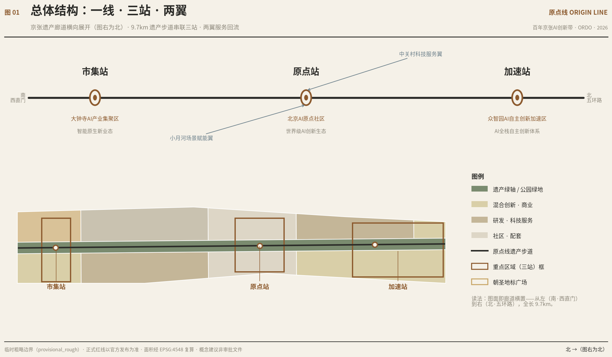
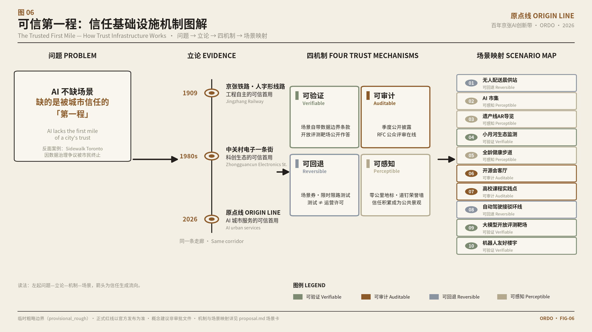
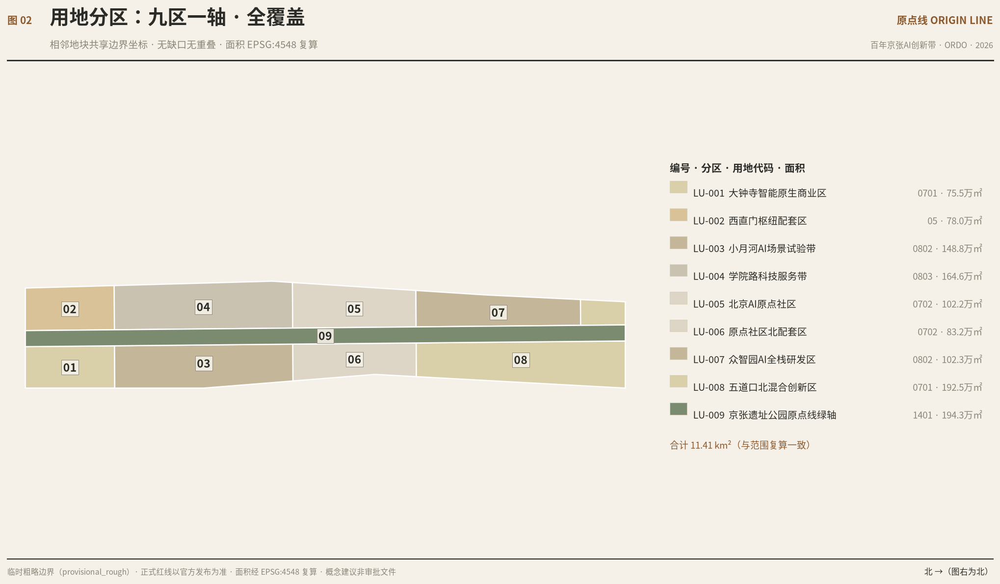
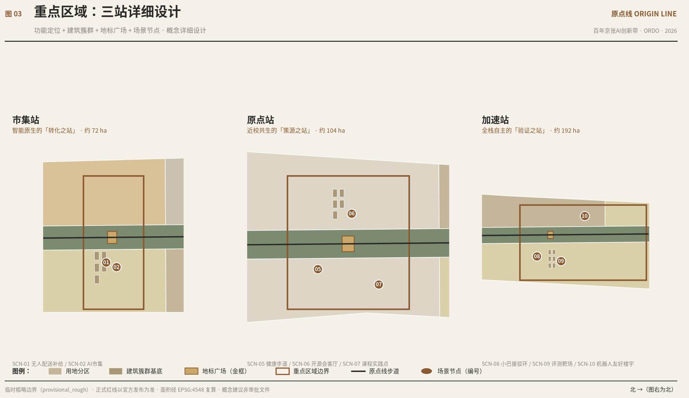
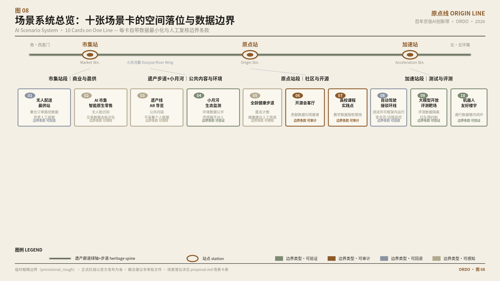
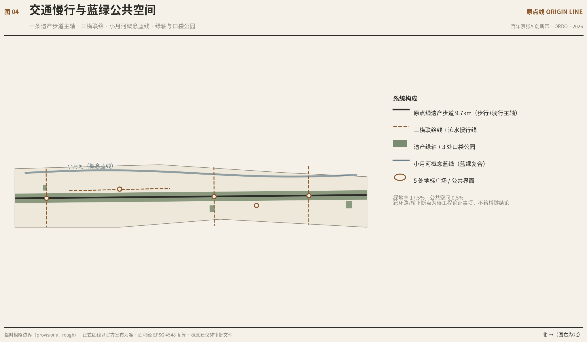
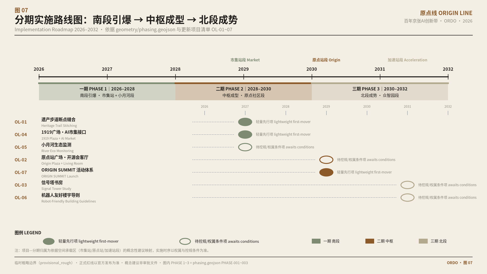
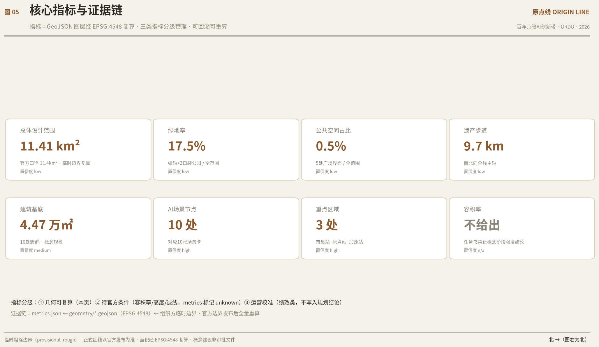

# ORIGIN LINE: Concept Design for the Centennial Jingzhang AI Innovation Belt

> **Core thesis: AI does not lack scenarios; it lacks the first mile of a city's trust.**
> As every city rushes to deploy AI, what is truly scarce is not the supply of technology but public trust — Sidewalk Toronto was terminated by citizens over data-governance disputes, proving that a smart city without trust design cannot go far. The bottleneck for AI entering the city is where, and how, "the first chance to be trusted" happens.
> Our answer: **trust is not proclaimed; it is earned through a verifiable, auditable, reversible "first use."** In 1909, the Beijing–Zhangjiakou Railway (Jingzhang Railway) completed the trusted first mile of Chinese engineering self-reliance through the creative solution of the switchback (herringbone) alignment; in the 1980s, Zhongguancun's Electronics Street completed the trusted first mile of Chinese technological innovation; today, this same corridor can become the site of the trusted first mile for AI urban services.
> We name this belt "ORIGIN LINE" — a **Trusted-First-Mile corridor** designed for AI urban services: allowing AI to complete its first public service in a real urban environment with minimal intrusion, full auditability, and immediate reversibility, converting a century of engineering trust into the public trust of the intelligent era.

## Design Basis and Source List

This formal proposal takes as its primary basis the Pre-Qualification Announcement for the International Competition on Urban Design of the Centennial Jingzhang AI Innovation Belt issued by the Haidian Branch of the Beijing Municipal Commission of Planning and Natural Resources [source:OFFICIAL-ANNOUNCEMENT] [standard:PROJECT-OFFICIAL-ANNOUNCEMENT], adopts the Open-Call Taskbook for Global Agents on the Centennial Jingzhang AI Innovation Belt as its task framework [source:AGENT-TASKBOOK] [standard:PROJECT-AGENT-OPEN-CALL-TASKBOOK], and relies on the maintainer-registered provisional rough boundaries, key areas, enumerations, metrics, and source registry in `brief/site-package/` as machine-readable basis [source:SITE-PACKAGE] [source:SOURCE-REGISTRY] [source:BOUNDARY-SOURCE] [source:KEY-AREA-SOURCE]. The generation process follows the navigation structure of `data/processed/agent_fact_pack.md` [source:PROCESSED-FACT-PACK]; professional depth is benchmarked against the MOHURD urban design management measures, regulatory detailed planning depth, and the MNR land-use classification standards [standard:MOHURD-URBAN-DESIGN-MEASURES] [standard:MOHURD-CONTROL-DETAILED-PLANNING] [standard:MNR-LAND-USE-CLASSIFICATION-GUIDE] [standard:MOHURD-ARCH-DESIGN-DEPTH-2016]; the existing-conditions assessment corresponds to [depth:existing_conditions_diagnosis].

Statement on the boundaries of source use:

- 5 formally usable sources and 1 provisional-only source (source-registry summary); this proposal does not upgrade background_only / provisional_only material into official red lines, statutory regulatory detailed planning, formal scoring criteria, or implementation commitments.
- Case studies (Station F, Kendall Square, Brainport, 22@Barcelona, etc.) are public background knowledge, used only as references for ecosystem design, not as local factual evidence.
- The organizer's official `SITE_BOUNDARY` and the precise polygons of the three `KEY_AREA`s have not yet been released; all spatial layers in this proposal are based on `provisional_boundaries.geojson` (`geometry_role=provisional_constraint`, `official_boundary=false`, `boundary_precision=provisional_rough`). **This data gap on the organizer's side does not block content scoring; once the official boundary is published, all layers, metrics, and drawing boards must be recalculated.**

## Three-Level Scope Framework

The proposal is organized according to the three levels specified in the announcement [depth:three_level_scope_framework]:

| Level | Scale | Design Question | This Proposal's Answer | Data Anchor |
| --- | --- | --- | --- | --- |
| Coordination study scope | 43.6 km² | AI industry ecosystem and future urban form | "Origin Chain" innovation ecosystem: five loops of origination–collaboration–translation–experience–dissemination | compliance_matrix.json |
| Overall design scope | 11.4 km² | Renewal framework, industrial space, transport and municipal systems, urban character | One Line, Three Stations, Two Wings + Nine Zones, One Axis land-use zoning | [data:geometry/land_use.geojson#LU-001] |
| Key area scope | 368.4 ha | Detailed design of three districts | Detailed design of the three stations: Acceleration Station / Origin Station / Market Station | [data:geometry/key_areas.geojson#PROV-KEY-001] |

The boundary evidence for the three levels is [data:geometry/site_boundary.geojson#SITE-001] (provisional constraint, provisional_rough) and [data:geometry/key_areas.geojson#PROV-KEY-001]. The three levels are not a disjointed set of drawings: the coordination study determines the industry-chain judgments; the overall design lands those judgments on land use, buildings, roads, green space, public space, and phasing layers; the key areas verify implementability. Any area, ratio, or scale that cannot be recomputed from structured data is not written into formal conclusions [depth:metrics_recalculation].

## Overall Concept: ORIGIN LINE (agent.1 Response)

### Core Proposition: The Trusted First Mile

**Problem**: AI urban services face a "Trusted First Mile" gap — scenario lists keep growing, while public trust is not being built in parallel. The lesson of global cases is consistent: technical feasibility is not the bottleneck; trust is (Sidewalk Toronto was terminated over data-governance disputes; see the case table in the coordination study).

**Argument**: Trust can only come from a verifiable first time. The 1909 Jingzhang Railway was the trusted first mile of Chinese engineering self-reliance — Zhan Tianyou (Jeme Tien-yow), under limited technical conditions, offered the creative solution of the switchback (herringbone) alignment and traded one visible success for national trust; the 1980s Zhongguancun Electronics Street was the trusted first mile of Chinese technological innovation. ORIGIN LINE translates this historical structure into a design method: **heritage is not decoration; it is the evidence for the argument** — this corridor once completed a "first mile of being trusted"; today, AI walks it once more.

**Design translation**: The entire line is organized as "trust infrastructure." All spatial and operational design in this proposal falls under four trust mechanisms —

1. **Verifiable**: All 10 scenario cards carry their own data-boundary clauses (data minimization, anonymization, aggregated statistics); the Open Evaluation Range for Foundation Models (SCN-09) turns "is AI reliable" from corporate self-attestation into a publicly verifiable question.
2. **Auditable**: Quarterly public disclosure of scenario operation data, an online RFC public-review system, and human review present throughout every scenario.
3. **Reversible**: Scenario-voucher application system + time-windowed and route-limited testing; testing does not equal operating approval, and any scenario can be downgraded or withdrawn.
4. **Perceptible**: The Kilometer-Zero Marker, the Spike Honor Wall, and milepost-gradation signage materialize and archive the accumulation of trust — the very process by which trust forms becomes public landscape.

The three positionings and five functions are therefore not parallel slogans but a spatial division of labor along a single trust chain: the innovation belt produces verifiable technology (the validation loop at Acceleration Station); the living belt carries perceptible first use (everyday scenarios at Origin Station); the culture belt deposits auditable trust archives (the Heritage Line narrative system).

### Naming System

- **Primary name: 原点线 (ORIGIN LINE)**; English name: **ORIGIN LINE**. The subtitle follows the official project name, "Centennial Jingzhang AI Innovation Belt."
- Naming logic: the connotations of "origin" correspond one-to-one with the genealogy of the "Trusted First Mile" — the 1909 Jingzhang Railway (led by Zhan Tianyou, the first trunk railway independently surveyed, designed, and built by China) is the **origin where engineering self-reliance won trust**; the 1980s Zhongguancun Electronics Street is the **origin where the innovation ecosystem won trust**; this belt faces the **origin where AI wins a city's trust**. "Line" carries four readings: the railway line, the urban central axis, the data-stream line, and the generational relay line.
- Naming of the three stations (borrowing the railway-station system, echoing the corridor space): **Acceleration Station** (Zhongzhiyuan AI Independent-Innovation Acceleration Zone), **Origin Station** (Beijing AI Origin Community), **Market Station** (Dazhongsi AI Industry Cluster). The two wings follow the official wording: Xiaoyue River Scenario-Enablement Wing and Zhongguancun Tech-Services Wing.
- Naming restraint statement: the above are conceptual naming suggestions for further development by professional teams and the organizer; they do not replace statutory place names and claim no trademark rights [source:AGENT-TASKBOOK].

### Visual Identity and Logo Direction

Logo concept: **one line + three node circles + one "0".** The line form plays on the double meaning of rail tracks and circuit traces; the three circles correspond to the three stations, with the first circle enlarged into a "0" (origin); the palette draws on the industrial-heritage colors of **rail-tea brown × bluestone gray**, deliberately avoiding the tech blue-purple cliché to match the temporal depth of "a century of Jingzhang." Extension system: milepost gradations (1909→2026→future) as the motif graphic for district-wide wayfinding. Typefaces are recommended to be open-source and commercially usable, involving no unauthorized fonts, trademarks, or portraits.

### Three Positionings, Five Functions, and the Three-District Two-Wing Synergy Loop

The three positionings (Centennial Jingzhang Culture Belt, Urban AI Life Experience Belt, AI-Integrated Innovation Belt) are translated in this proposal into three spatial lines: the **Heritage Line** (the green axis of the Jingzhang heritage park [data:geometry/green_space.geojson#GREEN-001]), the **Life Line** (everyday scenarios at Origin Station and the Xiaoyue River Wing), and the **Innovation Line** (the industry chain from Acceleration Station to Market Station). Spatial placement of the five functions: full-stack independent AI innovation system → Acceleration Station; world-class AI innovation ecosystem → Origin Station; new paradigm of AI+ scenario enablement → Xiaoyue River Wing; intelligent, vibrant AI city → district-wide slow mobility and public space; global voice in AI governance → governance display nodes at Acceleration Station. The synergy loop: origination at Origin Station (universities/open source) → validation at Acceleration Station (standards/evaluation) → translation at Market Station (commerce/consumption) → services flowing back from the two wings (the Tech-Services Wing supplies factors; the Scenario-Enablement Wing supplies scenarios), forming an operable closed loop.

### Overall Spatial Structure

"One Line, Three Stations, Two Wings": the line = the ORIGIN LINE Heritage Trail (a 9.7 km walking-and-cycling main axis, [data:geometry/roads.geojson#ROAD-001] [metric:heritage_spine_length_m]); the three stations = the three key areas; the two wings = the Xiaoyue River Scenario-Enablement Wing to the west and the Zhongguancun Tech-Services Wing to the east. Innovation in territorial spatial planning: replace pancake-style park expansion with a "linear heritage corridor + station-type innovation nodes" structure; use stock renewal to carry incremental functions; use scenario operation to replace one-off construction [depth:overall_spatial_structure].

## Coordinated Research Area: Industry and Future City Research (agent.2 Response)

### Global AI Innovation Ecosystem Case References (public background material, not local fact)

| Case | Transferable Mechanism | Implication for This Proposal |
| --- | --- | --- |
| Station F (Paris) | Conversion of an existing station building into a startup campus; event-driven ecosystem | Railway-heritage space is naturally compatible with innovation functions (Origin Station) |
| Kendall Square (Cambridge) | High-density mix of university–industry–venture capital | Near-campus technology-transfer street and factor allocation in the Tech-Services Wing |
| Brainport Eindhoven | Open innovation campus + public access to corporate test fields | Open evaluation range at Acceleration Station and robot-friendly buildings |
| 22@Barcelona | Industrial-area urban renewal + mixed-use innovation district | Intelligent-native retrofit of the Dazhongsi stock commercial district |
| Shenzhen Bay Technology Eco Park | Full-chain industrial community operation | The "origination–validation–translation" division of labor among the three stations |
| Zurich AI cluster | University-lab spillover + international-talent life services | Talent amenities and international communication in the Origin Community |
| Sidewalk Toronto (cautionary case) | Data-governance disputes led to project termination | Scenario principles of data minimization, human review, and governance-first |

### AI Innovation Ecosystem Map and Mechanism Design

Five loops of the ecosystem map: the **Origination Loop** (universities and research institutes, open-source communities — Origin Station), the **Validation Loop** (standards, evaluation, safety governance — Acceleration Station), the **Translation Loop** (agent/terminal/content enterprises — Market Station), the **Services Loop** (legal, intellectual property, investment and financing, compute and data services — Tech-Services Wing), and the **Experience Loop** (public scenarios, cultural events — Scenario-Enablement Wing). Eight categories of factor mechanisms (land, space, industry, capital, talent, compute, data, scenarios) are all written as **mechanism suggestions**: e.g., the "scenario voucher" — the government opens public-space scenarios in lieu of direct subsidies; the "compute way-station" — distributed edge compute as a prototype of new public infrastructure. All mechanisms are conceptual suggestions and do not constitute fiscal, investment-promotion, or policy commitments [source:AGENT-TASKBOOK].

## Overall Design Area: Urban Renewal and Regulatory-Plan-Level Urban Design

The overall-design scope is organized as urban design at regulatory detailed planning depth [standard:MOHURD-CONTROL-DETAILED-PLANNING] [depth:land_use_layout] [depth:development_intensity_controls]:

- **Land-use structure**: Nine Zones, One Axis full-coverage zoning; adjacent parcels share boundary coordinates with no gaps and no overlaps [data:geometry/land_use.geojson#LU-001] (including LU-009 Heritage Green Axis). The zones: Dazhongsi Intelligent-Native Commercial District, Xizhimen Hub Support Zone, Xiaoyue River AI Scenario Test Belt, Xueyuan Road Tech-Services Belt, Beijing AI Origin Community, Origin Community North Support Zone, Zhongzhiyuan AI Full-Stack R&D Zone, Wudaokou North Mixed-Innovation Zone + the Heritage Green Axis.
- **Building footprints**: 16 cluster footprints express the intent of renewal construction scale [data:geometry/buildings.geojson#BLDG-A-01] [metric:building_footprint_area_sqm]; retain–renovate–demolish is given only at the methodological level (retention first, renovation as the main approach, point-like new construction), with no parcel-level conclusions [depth:retain_renovate_demolish].
- **Intensity control**: floor area ratio, building height, density, and setbacks await confirmation of official regulatory detailed planning conditions; `floor_area_ratio` is marked as unknown in metrics with the reason stated — speculative values are not passed off as approved indicators.

## Detailed Design of Key Areas (The Three Stations)

The three key areas reference [data:geometry/key_areas.geojson#PROV-KEY-001] [data:geometry/key_areas.geojson#PROV-KEY-002] [data:geometry/key_areas.geojson#PROV-KEY-003], benchmarked against [depth:three_key_area_detailed_design] (provisional boundaries; to be recalculated after replacement by official polygons).

### Acceleration Station | Zhongzhiyuan AI Independent-Innovation Acceleration Zone (approx. 192.1 ha scope)

Positioning: **the "Station of Validation" for full-stack independence**. Spatial moves: a low-carbon innovation interaction corridor along the Qing River frontage; full-stack R&D clusters (6 footprints [data:geometry/buildings.geojson#BLDG-A-01]); the Signal Tower Study plaza as a spiritual landmark [data:geometry/public_space.geojson#PUBLIC-002]. Scenarios: Open Evaluation Range for Foundation Models (SCN-09), robot-friendly building pilot (SCN-10), autonomous shuttle-bus loop (SCN-08) [data:geometry/public_space.geojson#PUBLIC-002]. Implementation dependencies: property-rights coordination in the park, the operating entity for evaluation facilities, and review of external traffic organization.

### Origin Station | Beijing AI Origin Community (approx. 104.3 ha scope)

Positioning: **the "Station of Origination" in symbiosis with campuses**. Spatial moves: slow-mobility stitching of campus–park–neighborhood; co-creation clusters (5 footprints [data:geometry/buildings.geojson#BLDG-B-01]); Origin Station Plaza as the spiritual origin of the whole line [data:geometry/public_space.geojson#PUBLIC-001]; the Open-Source Living Room and technology-transfer way-station embedded in community amenities. Scenarios: Open-Source Living Room (SCN-06), university-course street practice points (SCN-07), all-age-friendly AI health trail (SCN-05). Implementation dependencies: campus boundaries and property rights, ground-floor retail renewal, and talent housing policy.

### Market Station | Dazhongsi AI Industry Cluster (approx. 72.0 ha scope)

Positioning: **the "Station of Translation" for intelligent-native commerce**. Spatial moves: integration of Dazhongsi Station and pedestrian connectivity across the four quadrants of the intersection; intelligent-native commercial clusters (5 footprints [data:geometry/buildings.geojson#BLDG-C-01]); the 1919 Milepost Plaza [data:geometry/public_space.geojson#PUBLIC-003]; composite use of planned green space (the Market rainwater garden [data:geometry/green_space.geojson#GREEN-003]). Scenarios: AI Market intelligent-native retail experiment (SCN-02), unmanned-delivery morning supply station (SCN-01). Implementation dependencies: coordination with the rail station, commercial property rights, and nighttime operation safety.

## AI Innovation Ecosystem, Personas, and AI+ Scenarios (Talent Profiles; agent.3 Response)

### User Profiles (5 types)

| Profile | Typical Needs | Spatial Response | Self-Check Boundary |
| --- | --- | --- | --- |
| Open-source developers | Publishing, collaboration, community reputation | Open-Source Living Room at Origin Station, code-contribution wall, nighttime collaboration space | No collection of personal movement traces; event data aggregated only |
| Startup teams | Low-cost office, compute access, test fields | Shared test fields at Acceleration Station, edge compute way-stations, standards consulting | Compute and data services require separate authorization |
| Corporate visitors | Showcasing, business, international reception | Roadshow lounge at Market Station, rail connection, public environment | Corporate logos and cases must be rights-cleared |
| Nearby residents | Commuting, leisure, low-disturbance renewal | Heritage Trail slow-mobility loop, embedded community services, graded events | Resident profiles not used for commercial recommendation |
| University faculty and students | Technology transfer, cross-campus collaboration, daily slow mobility | Campus–park slow-mobility stitching, technology-transfer way-station, course practice points | Campus data and research outputs require authorization |

### AI Scenario Cards (10 cards; spatial anchors distributed across the three station landmarks and the green axis ([data:geometry/public_space.geojson#PUBLIC-001], [data:geometry/green_space.geojson#GREEN-001]))

| # | Scenario Card | Spatial Carrier | Target Users and Suggested Operator | Privacy and Human-Review Boundary |
| --- | --- | --- | --- | --- |
| 01 | Unmanned-delivery morning supply station | Market Station | Commuters; third-party logistics operator + site owner | Aggregated order and route data only; manual takeover on anomalies |
| 02 | AI Market · intelligent-native retail experiment | Market Station | Consumers/merchants; commercial operating company | No facial recognition; transaction data de-identified |
| 03 | Heritage Line AR tour · switchback-slope narrative | Heritage Trail | Public/tourists; cultural operating institution | Public content; no personal data collection |
| 04 | Xiaoyue River water-quality and ecological AI monitoring belt | Xiaoyue River Wing | Urban management departments; environmental service providers | Environmental data made public; sensors not directed at individuals |
| 05 | All-age-friendly AI health trail | Origin Station | Residents/elderly and children; community operation | Anonymous counting; health advice backed by human services |
| 06 | Origin Community Open-Source Living Room | Origin Station | Developers; community-foundation-style operation | Contribution data owned by contributors |
| 07 | University AI course street practice points | Origin Station | Faculty and students; university + sub-district co-building | Teaching data used under authorization |
| 08 | Autonomous shuttle-bus connection loop | Acceleration Station | Park commuters; licensed operators | Operates within a testing-permit framework; safety officer / remote monitoring |
| 09 | Open Evaluation Range for Foundation Models | Acceleration Station | Enterprises/research institutions; third-party evaluation bodies | Evaluation data isolated; red-team testing by appointment |
| 10 | Robot-friendly building pilot | Acceleration Station | Building owners/robotics companies; building operator | Access data closed-looped within the building |

### Industrial Testing and Validation Scenarios (3)

1. **Market Station unmanned-delivery commercialization test**: within limited time windows and routes, test the coordination of unmanned delivery vehicles with commercial circulation, validating the "robot-friendly commercial street" retrofit checklist. Boundary: testing ≠ operating approval; applications follow current road and park management regulations.
2. **Acceleration Station Open Evaluation Range for Foundation Models**: provide small and medium-sized enterprises with a standardized evaluation environment (safety, performance, compliance), forming a reusable evaluation public service. Boundary: evaluation conclusions do not constitute official certification.
3. **Heritage Trail robot-friendly passage test**: validate the yielding-passage strategies and facility standards (ramps, signage, docking bays) for delivery/patrol robots in high-density pedestrian environments. Boundary: pedestrian priority is the supreme principle; human patrols are present throughout.

## AI Public Space, Intelligent-Native New Business Formats, and Pilgrimage Landmarks (agent.4 Response)

### AI Public Space and Stitching Strategy for the Jingzhang Heritage Park

The Heritage Green Axis [data:geometry/green_space.geojson#GREEN-001] is the main skeleton of district-wide public space: **east–west stitching** relies on three transverse connectors (the Dazhongsi / Origin Community / Zhongzhiyuan connectors [data:geometry/roads.geojson#ROAD-002]) to open up the blocks severed by the corridor; **north–south continuity** relies on the single Heritage Trail line. Breakpoints such as crossings of the ring road and under-bridge spaces are listed as items pending engineering demonstration; no bridge or tunnel conclusions are given.

### Three AI Pilgrimage Landmarks (Honors Display System)

1. **Origin Station Plaza · "Kilometer-Zero Marker"** — the spiritual origin of the whole line: three time rings of 1909/1980/2026 are embedded in the ground plane; at the center stands the "Origin Pillar," a digital honor wall that inscribes, annually, individuals and teams who have contributed to open source and AI public value (the Contributor Spike — a physical honor component with a railroad-spike motif).
2. **Signal Tower Study** (Acceleration Station) — the memory of the Jingzhang Railway's signal towers × an AI study: a 24-hour public reading and publishing space, with collections themed on engineering history and artificial intelligence, and a rooftop lookout over the heritage line.
3. **1919 Milepost Plaza** (Market Station) — a time-paved plaza with a railway-milepost motif, projecting the light band of the "switchback (herringbone) alignment" at night; the surrounding ground floors form the intelligent-native retail experiment interface.

Honors display system: the annual "Origin Honors List" (three categories: open-source contribution, AI public value, youth innovation), with physical spike inscriptions + an online archive; all portraits and logos must be authorized. Public-space component library: heritage-color wayfinding family, milepost paving units, spike honor components, AR narrative trigger points, robot docking bays — for unified deployment across the line, avoiding a monotonous sameness at every node.

### Dazhongsi Intelligent-Native Consumption and Business Scenarios

Centered on the "AI Market" concept: a first-store cluster of intelligent products that can be experienced, purchased, and fed back on + a data-factor living room (a compliant, authorized, and auditable interface for data circulation services) + an international roadshow lounge. All new business formats are investment-attraction direction suggestions and do not constitute investment commitments.

## Cultural Fusion Narrative (agent.5 Response)

Narrative mainline: **"From the Herringbone to the Neuron."** The switchback (herringbone) alignment of the Jingzhang Railway was Zhan Tianyou's creative solution under limited technical conditions — independent, pragmatic, elegant; Zhongguancun's path from Electronics Street to Innovation Avenue was the ecological solution that turned innovation into a mass undertaking; the proposition of the new AI culture is the cultural solution that makes intelligence a public good. The three generations of culture are not decorative overlays but a single spiritual genealogy of "creatively solving problems" — **their essence is each era's answer to the same question: how does the new win society's trust**. The switchback alignment made society believe in Chinese engineering; Electronics Street made society believe in mass innovation; ORIGIN LINE will make the city believe in AI.

Spatial culture system: the Heritage Green Axis serves as the narrative mainline, with each of the three stations carrying one chapter (Market Station tells "construction," Origin Station tells "entrepreneurship," Acceleration Station tells "independence"); the wayfinding system takes milepost gradations as its motif, with a unified heritage color palette across the line; the core international communication copy: **"Every era has its origin. This is ours."** The cultural identity system and the belt's logo system are managed in separate layers and are not mixed [source:AGENT-TASKBOOK].

## Global AI Innovation Event System and Long-Term Operation (agent.6 Response)

- **Annual flagship: ORIGIN SUMMIT** (autumn, three-station linkage: Technology Day at Acceleration Station, Open-Source Day at Origin Station, Consumer Day at Market Station) — a conceptual event suggestion.
- **Four seasons for developers**: spring open-source sprint, summer scenario hackathon, autumn ORIGIN SUMMIT, winter open evaluation competition.
- **Monthly scenario open days**: the ten scenario-card nodes take turns opening to the public by reservation; testing scenarios simultaneously publish their safety boundaries.
- **Jingzhang Culture Week**: public cultural events in cooperation with heritage conservation institutions (subject to authorization).
- **Developer community operation**: an online RFC system (public review of scenario proposals) + an offline living-room duty roster; open scenario operation uses the "scenario voucher" application system, with quarterly public disclosure of operation data.
- **Conversion pathway**: event participants → developer community members → scenario testing applicants → landed-team service matchmaking (undertaken by the Tech-Services Wing); subsequent conversion of talent, enterprises, and developers all has clearly defined receiving space and mechanisms — effects are not exaggerated and no policies are promised.

## Land Use, Building Scale, and Retain-Renovate-Demolish Strategy

Land-use classification follows [standard:MNR-LAND-USE-CLASSIFICATION-GUIDE]; the Nine Zones, One Axis close completely [data:geometry/land_use.geojson#LU-001]. The 16 building-cluster footprints, totaling [metric:building_footprint_area_sqm], represent only conceptual scale intent; height, massing, and interfaces are managed at the advisory level under [depth:height_massing_character]. The retain–renovate–demolish method: retention first (heritage and quality existing buildings), renovation as the main approach (functional replacement of stock), point-like new construction (cluster footprints), and a to-be-confirmed list (parcels lacking property-rights or regulatory planning conditions). No parcel-level retain–renovate–demolish conclusions are given.

## Transport, Rail, Municipal Infrastructure, and Public Services

Traffic organization: the Heritage Trail is the slow-mobility main axis; the three transverse connectors stitch east and west; the waterfront slow-mobility line serves the Xiaoyue River Wing [data:geometry/roads.geojson#ROAD-001] [depth:traffic_rail_slow_parking]. Rail-station integration (Dazhongsi Station, Wudaokou, Qinghua East Road West Entrance direction) and crossings of the North Fifth Ring Road are listed as pending engineering demonstration. Municipal and new infrastructure: edge compute way-stations, distributed energy, and integrated sensing-and-communication poles are incorporated into the public-space component library [depth:municipal_new_infrastructure]; missing engineering material on pipelines, flood control, and fire protection is listed under assumptions to be supplemented. Public service facilities are configured according to the division of labor among the three stations (Acceleration Station emphasizes industrial services, Origin Station emphasizes living amenities, Market Station emphasizes business services); service radii and standards await confirmation of formal conditions.

## Blue-Green Network, Public Space, and Urban Character

Blue-green system: the Heritage Green Axis (whole line) + three pocket parks (Origin Community, Market rainwater garden, Zhongzhiyuan conservation woodland) + the Xiaoyue River conceptual blue line [data:geometry/green_space.geojson#GREEN-001] [metric:green_ratio] [depth:blue_green_public_space]. Public space: three landmark plazas + two public interfaces [metric:public_space_ratio]. Character guidance: heritage industrial palette (tea brown / bluestone gray), milepost motifs, and suggestions for low-rise, high-density cluster forms; character-control zones are divided into three layers — official control, design suggestion, and to-be-confirmed conditions — with no pseudo-precise control lines [standard:MOHURD-URBAN-DESIGN-MEASURES].

## Renewal Projects, Implementation Policy, and Phasing Plan

| No. | Project | Type | Main Dependencies | Evidence |
| --- | --- | --- | --- | --- |
| OL-01 | Heritage Trail continuity and breakpoint stitching | Public space / transport | Under-bridge space, ring-road crossing engineering demonstration | [data:geometry/roads.geojson#ROAD-001] |
| OL-02 | Origin Station Plaza and Open-Source Living Room | Public space / operation | Site property rights, operating entity | [data:geometry/public_space.geojson#PUBLIC-001] |
| OL-03 | Signal Tower Study | Cultural facility | Heritage designation, conservation requirements | [data:geometry/constraints.geojson#CONS-001] |
| OL-04 | 1919 Milepost Plaza and AI Market interface | Commercial / public space | Commercial property rights, nighttime operation | [data:geometry/public_space.geojson#PUBLIC-003] |
| OL-05 | Xiaoyue River ecological monitoring and waterfront slow mobility | Blue-green / new infrastructure | River blue line, ecological conditions | [data:geometry/green_space.geojson#GREEN-001] |
| OL-06 | Robot-friendly building retrofit guidelines | Industrial services | Building-owner coordination, standards research | [data:geometry/buildings.geojson#BLDG-A-01] |
| OL-07 | ORIGIN SUMMIT and event-system launch | Operation / branding | Public-space permits, copyright clearance | [data:geometry/phasing.geojson#PHASE-001] |

The project-list depth is benchmarked against [depth:renewal_project_list]. Phasing [depth:phasing_implementation] [data:geometry/phasing.geojson#PHASE-001]: **Phase 1 (2026–2028) southern ignition** — the Market Station + Xiaoyue River section, with lightweight facilities and operational activities first; **Phase 2 (2028–2030) central spine taking shape** — the Origin Community section; **Phase 3 (2030–2032) northern momentum** — the Zhongzhiyuan section. Lightweight first-mover items and items that must wait for formal regulatory planning conditions are distinguished in the list.

## Metrics, Area Recalculation, and Compliance Matrix

Indicators are managed in three categories [depth:metrics_recalculation]: **① Geometrically recomputable** — site_area_sqm [metric:site_area_sqm], green_ratio [metric:green_ratio], public_space_ratio [metric:public_space_ratio], building_footprint_area_sqm [metric:building_footprint_area_sqm], heritage_spine_length_m [metric:heritage_spine_length_m], scenario_node_count [metric:scenario_node_count], key_area_count [metric:key_area_count], all recomputed from GeoJSON via EPSG:4548 projection, with confidence limited by the provisional boundaries and annotated accordingly; **② Pending official conditions** — floor area ratio, height, density, setbacks, red lines (marked unknown in metrics with reasons given); **③ Operational calibration** — performance indicators such as event participation and scenario usage frequency enter continuous calibration during the operating period and are not written into planning conclusions.

The mapping of all tasks in Sections 1.3, 1.4, and 1.5 of the announcement to agent.1–agent.6 chapters, layers, indicators, and drawings is given in `compliance_matrix.json`; the response comparison against professional standards is in `standard_matrix.json`; and the completion status of depth items is in `design_depth_matrix.json`.

## Risk, Copyright, and Compliance Notes

Missing material and risk-item management follow [depth:risk_missing_data].

- **Boundary risk**: all spatial layers are based on the organizer's provisional rough boundary (provisional_rough), not official red lines; once the official boundary is published, everything must be recalculated in full. All spatial expressions in this proposal are conceptual suggestions for further development by professional teams, and do not constitute a statutory plan, an approval conclusion, an engineering-feasibility conclusion, or an investment commitment [source:AGENT-TASKBOOK].
- **Data boundary**: only public and rights-cleared material is used; case studies are public background knowledge; no secret maps, non-public tables, or personal privacy data are used.
- **AI governance boundary**: all scenarios observe the principles of data minimization, explainability, and human review; urban-agent-assisted recognition services do not replace planning approval or final human judgment.
- **Copyright**: the text, drawing boards, and layers are content generated for this proposal, submitted under the COMMUNITY-DISPLAY-ONLY license; fonts are system open-source fonts; no unauthorized trademarks, portraits, or images are used. See `report/copyright_statement.md` for details.
- **HTML and PDF**: `visual/index.html` is a purely offline static page with no remote resources and no tracking code; the A3/A0 drawings are for display purposes; machine-readable data in JSON/GeoJSON prevails.

## References

- [source:OFFICIAL-ANNOUNCEMENT] Pre-Qualification Announcement for the International Competition on Urban Design of the Centennial Jingzhang AI Innovation Belt
- [source:AGENT-TASKBOOK] Open-Call Taskbook for Global Agents (0518)
- [source:SITE-PACKAGE] / [source:BOUNDARY-SOURCE] / [source:KEY-AREA-SOURCE] Site package and provisional boundaries
- [source:SOURCE-REGISTRY] Public source registry; [source:PROCESSED-FACT-PACK] fact navigation pack
- Standards referenced: [standard:PROJECT-OFFICIAL-ANNOUNCEMENT] [standard:PROJECT-AGENT-OPEN-CALL-TASKBOOK] [standard:MOHURD-URBAN-DESIGN-MEASURES] [standard:MOHURD-CONTROL-DETAILED-PLANNING] [standard:MNR-LAND-USE-CLASSIFICATION-GUIDE] [standard:MOHURD-ARCH-DESIGN-DEPTH-2016]
- Background cases (public material): Station F, Kendall Square, Brainport Eindhoven, 22@Barcelona, Shenzhen Bay, Zurich AI cluster, Sidewalk Toronto (governance lesson)

# 中文正式译文

# 原点线 ORIGIN LINE：百年京张AI创新带概念设计

> **核心命题：AI 不缺场景，缺的是被城市信任的第一程。**
> 当每座城市都在部署 AI，真正稀缺的不是技术供给，而是公共信任——Sidewalk Toronto 因数据治理争议被市民终止，证明没有信任设计的智能城市走不远。AI 进入城市的瓶颈，是「第一次被信任的机会」在哪里发生、如何发生。
> 我们的回答：**信任不是宣传出来的，而是在可验证、可审计、可回退的「首用」中挣来的。**1909 年，京张铁路以人字形线路的创造性解法完成中国工程自主的可信首用；1980 年代，中关村电子一条街完成中国科创的可信首用；今天，同一条走廊可以成为 AI 城市服务的可信首用之地。
> 我们把这条带子命名为「原点线 ORIGIN LINE」——一条为 AI 城市服务设计的**可信首用走廊**：让 AI 在真实城市环境中，以最小侵入、全程可审计、随时可回退的方式完成第一次公共服务，把百年工程信任转化为智能时代的公共信任。

## 设计依据与资料清单

本 formal 方案以北京市规划和自然资源委员会海淀分局发布的《百年京张AI创新带城市设计国际方案征集资格预审公告》为第一依据 [source:OFFICIAL-ANNOUNCEMENT] [standard:PROJECT-OFFICIAL-ANNOUNCEMENT]，以《面向全球智能体开展百年京张AI创新带城市设计开源征集任务书》为任务框架 [source:AGENT-TASKBOOK] [standard:PROJECT-AGENT-OPEN-CALL-TASKBOOK]，并以 `brief/site-package/` 中经维护者登记的临时粗略边界、重点区域、枚举、指标和来源清单为机器可读依据 [source:SITE-PACKAGE] [source:SOURCE-REGISTRY] [source:BOUNDARY-SOURCE] [source:KEY-AREA-SOURCE]。生成过程遵循 `data/processed/agent_fact_pack.md` 的导航结构 [source:PROCESSED-FACT-PACK]，专业深度对照住建部城市设计管理办法、控规深度与国土空间用地分类标准 [standard:MOHURD-URBAN-DESIGN-MEASURES] [standard:MOHURD-CONTROL-DETAILED-PLANNING] [standard:MNR-LAND-USE-CLASSIFICATION-GUIDE] [standard:MOHURD-ARCH-DESIGN-DEPTH-2016]，现状研判对应 [depth:existing_conditions_diagnosis]。

资料使用边界声明：

- 正式可用资料 5 条、provisional-only 资料 1 条（来源登记摘要）；本方案不将 background_only / provisional_only 资料升级为官方红线、法定控规、正式评分依据或实施承诺。
- 案例研究（Station F、Kendall Square、Brainport、22@Barcelona 等）为公开背景知识，仅用于生态设计参照，不作为本地事实依据。
- 组织方官方 `SITE_BOUNDARY` 与三处 `KEY_AREA` 精确 polygon 尚未发布，本方案全部空间图层基于 `provisional_boundaries.geojson`（`geometry_role=provisional_constraint`、`official_boundary=false`、`boundary_precision=provisional_rough`）。**该组织方数据缺口不阻断内容评分；官方边界发布后，全部图层、指标、图版须重算。**

## 三层范围工作框架

方案按公告三个层次组织 [depth:three_level_scope_framework]：

| 层级 | 规模口径 | 设计问题 | 本方案回答 | 数据落点 |
| --- | --- | --- | --- | --- |
| 统筹研究范围 | 43.6 km² | AI产业生态与未来城市形态 | 「原点链」创新生态：策源-协作-转化-体验-传播五环 | compliance_matrix.json |
| 总体设计范围 | 11.4 km² | 更新框架、产业空间、交通市政、风貌 | 一线三站两翼 + 九区一轴用地分区 | [data:geometry/land_use.geojson#LU-001] |
| 重点区域范围 | 368.4 ha | 三处片区详细设计 | 加速站 / 原点站 / 市集站三站详设 | [data:geometry/key_areas.geojson#PROV-KEY-001] |

三层范围的边界证据为 [data:geometry/site_boundary.geojson#SITE-001]（临时约束，provisional_rough）与 [data:geometry/key_areas.geojson#PROV-KEY-001]。三层不是割裂的图纸集合：统筹研究确定产业链判断，总体设计把判断落到用地、建筑、道路、绿地、公共空间和分期图层，重点区域验证可实施性。任何无法从结构化数据复算的面积、比例、规模，均不写入正式结论 [depth:metrics_recalculation]。

## 总体概念：原点线 ORIGIN LINE（agent.1 响应）

### 核心命题：可信首用（The Trusted First Mile）

**问题**：AI 城市服务面临「可信首用」缺口——场景清单越来越长，公众信任却没有同步建立。全球案例的教训一致：技术可行性不是瓶颈，信任才是（Sidewalk Toronto 因数据治理争议而终止，见统筹研究案例表）。

**立论**：信任只能来自可验证的第一次。1909 年京张铁路是中国工程自主的可信首用——詹天佑以人字形线路在有限技术条件下给出创造性解法，用一次看得见的成功换取国家信任；1980 年代中关村电子一条街是中国科创的可信首用。原点线把这一历史结构转译为设计方法：**遗产不是装饰，而是立论证据**——这条走廊曾经完成过一次「被信任的第一程」，今天由 AI 再走一次。

**设计转译**：全线按「信任基础设施」组织，本方案全部空间与运营设计均可归入四条信任机制——

1. **可验证**：10 张场景卡全部自带数据边界条款（数据最小化、匿名化、聚合统计）；大模型评测开放靶场（SCN-09）把「AI 是否可靠」从企业自证变成公共可验证的问题。
2. **可审计**：场景运营数据季度公开、线上 RFC 公开评审制度、所有场景人工复核全程在场。
3. **可回退**：场景券申请制 + 限定时段限定路线测试，测试不等于运营批准，任何场景可降级、可退出。
4. **可感知**：0 公里标、道钉荣誉墙、里程碑导视把信任积累实体化、档案化——信任的形成过程本身成为公共景观。

三大定位与五大功能因此不是并列口号，而是同一条信任链的空间分工：创新带生产可验证的技术（加速站验证环）、生活带承载可感知的首用（原点站日常场景）、文化带沉淀可审计的信任档案（遗产线叙事系统）。

### 命名体系

- **主名称：原点线**；英文名称：**ORIGIN LINE**。副标题沿用官方项目名「百年京张AI创新带」。
- 命名逻辑：「原点」意涵与「可信首用」谱系一一对应——1909 年京张铁路（詹天佑主持，中国自主勘测设计建造的第一条干线铁路）是**工程自主赢得信任的原点**；1980 年代中关村电子一条街是**科创生态赢得信任的原点**；本条带面向的是**AI 赢得城市信任的原点**。「线」四关：铁路线、城市中轴线、数据流线、代际接力线。
- 三站命名（借用铁路站点体系，呼应走廊空间）：**加速站**（众智园AI自主创新加速区）、**原点站**（北京AI原点社区）、**市集站**（大钟寺AI产业集聚区）。两翼沿用官方表述：小月河场景赋能翼、中关村科技服务翼。
- 命名克制声明：以上为概念命名建议，供专业团队与主办方深化；不替代法定地名，不主张任何商标权益 [source:AGENT-TASKBOOK]。

### 视觉识别与 Logo 方向

Logo 概念：**一条线 + 三个节点圆 + 一枚「0」**。线形取铁轨与电路走线的双关；三圆对应三站，首圆放大为「0」（原点）；色系取**铁轨茶棕 × 青石灰**的工业遗产色系，刻意回避科技蓝紫套路，与「百年京张」的时间厚度匹配。延展系统：里程碑刻度（1909→2026→未来）作为全域导视的母题图形。字体建议使用开源可商用字体，不涉及未授权字体、商标与人物肖像。

### 三大定位、五大功能与三区两翼协同回路

三大定位（百年京张文化带、都市AI生活体验带、AI融合创新带）在本方案转译为三条空间线：**遗产线**（京张遗址公园绿轴 [data:geometry/green_space.geojson#GREEN-001]）、**生活线**（原点站与小月河翼的日常场景）、**创新线**（加速站—市集站的产业链条）。五大功能的空间落位：AI全栈自主创新体系→加速站；世界级AI创新生态→原点站；AI+场景赋能新范式→小月河翼；智能化AI活力城市→全域慢行与公共空间；AI治理全球话语权→加速站治理展示节点。协同回路：原点站策源（高校/开源）→加速站验证（标准/评测）→市集站转化（商业/消费）→两翼服务回流（科技服务翼配要素、场景赋能翼给场景），形成可运营闭环。

### 总体空间结构

「一线三站两翼」：一线=原点线遗产步道（9.7km 步行骑行主轴，[data:geometry/roads.geojson#ROAD-001] [metric:heritage_spine_length_m]）；三站=三处重点区域；两翼=西侧小月河场景赋能翼、东侧中关村科技服务翼。国土空间规划创新思路：以「线性遗产廊道+站点式创新节点」替代摊大饼式园区扩张，用存量更新承载增量功能，用场景运营替代一次性建设 [depth:overall_spatial_structure]。

## 统筹研究范围产业与未来城市研究（agent.2 响应）

### 全球 AI 创新生态案例参照（公开背景资料，非本地事实）

| 案例 | 可借鉴机制 | 对本方案的启示 |
| --- | --- | --- |
| Station F（巴黎） | 存量车站建筑改造为创业校园，活动驱动生态 | 铁路遗产空间与创新功能天然适配（原点站） |
| Kendall Square（剑桥） | 大学-企业-风险投资高密度混合 | 近校成果转化街与科技服务翼要素配置 |
| Brainport Eindhoven | 开放式创新园区+企业测试场公共化 | 加速站开放靶场与机器人友好楼宇 |
| 22@Barcelona | 工业区城市更新+创新区混合用地 | 大钟寺存量商业区的智能原生改造 |
| 深圳湾科技生态园 | 全链条产业社区运营 | 三站「策源-验证-转化」分工 |
| 苏黎世 AI 集群 | 高校实验室外溢+国际人才生活服务 | 原点社区人才配套与国际传播 |
| Sidewalk Toronto（反面案例） | 数据治理争议导致项目终止 | 数据最小化、人工复核、治理先行的场景原则 |

### AI 创新生态图谱与机制设计

生态图谱五环：**策源环**（高校院所、开源社区——原点站）、**验证环**（标准、评测、安全治理——加速站）、**转化环**（智能体/终端/内容企业——市集站）、**服务环**（法务、知识产权、投融资、算力数据服务——科技服务翼）、**体验环**（公共场景、文化活动——场景赋能翼）。八类要素机制（土地、空间、产业、资金、人才、算力、数据、场景）全部写为**机制建议**：如「场景券」——政府以公共空间场景开放代替直接补贴；「算力驿站」——分布式端侧算力作为公共新基建原型。所有机制均为概念建议，不构成财政、招商或政策承诺 [source:AGENT-TASKBOOK]。

## 总体设计范围城市更新与控规深度城市设计

总体设计范围按控规深度城市设计组织 [standard:MOHURD-CONTROL-DETAILED-PLANNING] [depth:land_use_layout] [depth:development_intensity_controls]：

- **用地结构**：九区一轴全覆盖分区，相邻地块共享边界坐标、无缺口无重叠 [data:geometry/land_use.geojson#LU-001]（含 LU-009 遗产绿轴）。分区：大钟寺智能原生商业区、西直门枢纽配套区、小月河AI场景试验带、学院路科技服务带、北京AI原点社区、原点社区北配套区、众智园AI全栈研发区、五道口北混合创新区 + 遗产绿轴。
- **建筑基底**：16 处簇群基底表达更新建设规模意向 [data:geometry/buildings.geojson#BLDG-A-01] [metric:building_footprint_area_sqm]；拆改留仅给出方法层级（保留优先、改造为主、点状新建），不给出地块级结论 [depth:retain_renovate_demolish]。
- **强度控制**：容积率、建筑高度、密度、退线等待官方控规条件确认，metrics 中 `floor_area_ratio` 标记为 unknown 并说明原因——不以推测值冒充审定指标。

## 重点区域详细设计（三站）

三处重点区域引用 [data:geometry/key_areas.geojson#PROV-KEY-001] [data:geometry/key_areas.geojson#PROV-KEY-002] [data:geometry/key_areas.geojson#PROV-KEY-003]，深度对照 [depth:three_key_area_detailed_design]（临时边界，待官方 polygon 替换后重算）。

### 加速站｜众智园AI自主创新加速区（约192.1 ha 口径）

定位：**全栈自主的「验证之站」**。空间动作：临清河界面组织低碳创新交往廊；全栈研发簇群（6 处基底 [data:geometry/buildings.geojson#BLDG-A-01]）；信号所书房广场作为精神地标 [data:geometry/public_space.geojson#PUBLIC-002]。场景：大模型评测开放靶场（SCN-09）、机器人友好楼宇试点（SCN-10）、自动驾驶小巴接驳环（SCN-08）[data:geometry/public_space.geojson#PUBLIC-002]。实施依赖：园区权属协同、评测设施运营主体、对外交通组织复核。

### 原点站｜北京AI原点社区（约104.3 ha 口径）

定位：**近校共生的「策源之站」**。空间动作：校区-园区-街区慢行缝合；共创簇群（5 处基底 [data:geometry/buildings.geojson#BLDG-B-01]）；原点站广场作为全线精神原点 [data:geometry/public_space.geojson#PUBLIC-001]；开源会客厅、成果转化驿站嵌入社区配套。场景：开源会客厅（SCN-06）、高校课程街区实践点（SCN-07）、全龄友好AI健康步道（SCN-05）。实施依赖：校区边界与权属、首层业态更新、人才居住政策。

### 市集站｜大钟寺AI产业集聚区（约72.0 ha 口径）

定位：**智能原生的「转化之站」**。空间动作：大钟寺站一体化与路口四象限步行连通；智能原生商业簇群（5 处基底 [data:geometry/buildings.geojson#BLDG-C-01]）；1919里程广场 [data:geometry/public_space.geojson#PUBLIC-003]；规划绿地复合利用（市集聚水园 [data:geometry/green_space.geojson#GREEN-003]）。场景：AI市集智能原生零售试验（SCN-02）、无人配送晨间补给站（SCN-01）。实施依赖：轨道站点协同、商业权属、夜间运营安全。

## AI 创新生态、人才画像与 AI+ 场景（agent.3 响应）

### 用户画像（5类）

| 画像 | 典型需求 | 空间响应 | 自检边界 |
| --- | --- | --- | --- |
| 开源开发者 | 发布、协作、社区声誉 | 原点站开源会客厅、代码贡献墙、夜间协作空间 | 不采集个人行为轨迹，活动数据仅聚合统计 |
| 初创团队 | 低成本办公、算力入口、试验场 | 加速站共享测试场、端侧算力驿站、标准咨询 | 算力与数据服务需另行授权 |
| 企业访客 | 展示、商务、国际接待 | 市集站路演客厅、轨道接驳、公共环境 | 企业标识与案例须清权 |
| 周边居民 | 通勤、休闲、低扰动更新 | 遗产步道慢行环、社区服务嵌入、活动分级 | 居民画像不用于商业推荐 |
| 高校师生 | 成果转化、跨校协作、日常慢行 | 校区-园区慢行缝合、成果转化驿站、课程实践点 | 校园数据与科研成果需授权 |

### AI 场景卡（10张，空间落点分布于三站地标与绿轴（[data:geometry/public_space.geojson#PUBLIC-001]、[data:geometry/green_space.geojson#GREEN-001]））

| # | 场景卡 | 空间载体 | 服务对象与运营主体建议 | 隐私与人工复核边界 |
| --- | --- | --- | --- | --- |
| 01 | 无人配送晨间补给站 | 市集站 | 通勤人群；第三方物流运营商+场地方 | 仅订单与路径聚合数据；异常人工接管 |
| 02 | AI市集·智能原生零售试验 | 市集站 | 消费者/商户；商业运营公司 | 不做人脸识别；交易数据脱敏 |
| 03 | 遗产线AR导览·人字坡叙事 | 遗产步道 | 公众/游客；文化运营机构 | 公共内容，无个人数据采集 |
| 04 | 小月河水质-生态AI监测带 | 小月河翼 | 城市管理部门；环保服务商 | 环境数据公开；传感器不指向个人 |
| 05 | 全龄友好AI健康步道 | 原点站 | 居民/老人儿童；社区运营 | 匿名计数；健康建议由人工服务兜底 |
| 06 | 原点社区开源会客厅 | 原点站 | 开发者；社区基金会式运营 | 贡献数据归贡献者所有 |
| 07 | 高校AI课程街区实践点 | 原点站 | 师生；高校+街道共建 | 教学数据授权使用 |
| 08 | 自动驾驶小巴接驳环 | 加速站 | 园区通勤；持牌运营商 | 测试许可框架内运行，安全员/远程监控 |
| 09 | 大模型评测开放靶场 | 加速站 | 企业/研究机构；第三方评测机构 | 评测数据隔离；红队测试预约制 |
| 10 | 机器人友好楼宇试点 | 加速站 | 楼宇业主/机器人企业；楼宇运营方 | 通行数据楼宇内闭环 |

### 产业测试验证场景（3个）

1. **市集站无人配送接驳商业化测试**：在限定时段与路线内测试无人配送车辆与商业动线的协同，验证「机器人友好商业街区」改造清单。边界：测试≠运营批准，按现行道路与园区管理规定申请。
2. **加速站大模型评测开放靶场**：为中小企业提供标准化评测环境（安全、性能、合规），形成可复用的评测公共服务。边界：评测结论不构成官方认证。
3. **遗产步道机器人友好通行测试**：验证配送/巡检机器人在高密度步行环境的礼让通行策略与设施标准（坡道、标识、停靠位）。边界：以行人优先为最高原则，人工巡查全程在场。

## AI 公共空间、智能原生新业态与朝圣地标（agent.4 响应）

### 京张遗址公园 AI 公共空间与缝合策略

遗产绿轴 [data:geometry/green_space.geojson#GREEN-001] 是全域公共空间主骨架：**东西缝合**靠三横联络线（大钟寺/原点社区/众智园联络线 [data:geometry/roads.geojson#ROAD-002]）打通被走廊分割的街区；**南北贯通**靠遗产步道一线串联。跨环路、桥下空间等断点列为待工程论证事项，不给出桥隧结论。

### 三处 AI 朝圣地标（荣誉展示体系）

1. **原点站广场·「0公里标」**——全线精神原点：地面嵌入 1909/1980/2026 三道时间环，中央设「原点柱」数字荣誉墙，年度铭刻对开源与AI公共贡献的个人与团队（贡献者道钉——以铁路道钉为母题的实体荣誉组件）。
2. **信号所书房**（加速站）——京张铁路信号所记忆 × AI 书房：24 小时开放的公共阅读与发布空间，藏书主题为工程史与人工智能，屋顶设观测 heritage line 的眺望台。
3. **1919里程广场**（市集站）——以铁路里程碑为母题的时光铺装广场，夜间以投影呈现「人字形线路」光带；周边首层为智能原生零售试验界面。

荣誉展示体系：年度「原点榜」（开源贡献、AI公共价值、青年创新三类），实体道钉铭刻 + 线上档案；所有肖像、标识须经授权。公共空间组件库：遗产色导视族、里程碑铺装单元、道钉荣誉组件、AR叙事触发点、机器人停靠位——供全线统一调用，避免千点一面。

### 大钟寺智能原生消费与商务场景

以「AI市集」为概念：可体验、可购买、可反馈的智能产品首店集群 + 数据要素会客厅（合规授权可审计的数据流通服务界面）+ 国际路演客厅。新业态均为招商方向建议，不构成投资承诺。

## 文化融合叙事（agent.5 响应）

叙事主线：**「从人字形到神经元」**。京张铁路的人字形线路，是詹天佑在有限技术条件下的创造性解法——自主、务实、优雅；中关村从电子一条街到创业大街，是把创新变成大众事业的生态解法；AI 新文化的命题，是让智能成为公共福祉的文化解法。三代文化不是装饰贴层，而是同一条「创造性解决问题」的精神谱系——**其本质是各自时代对同一个问题的回答：新事物如何赢得社会信任**。人字形线路让社会相信中国工程，电子一条街让社会相信大众创新，原点线要让城市相信 AI。

空间文化系统：以遗产绿轴为叙事主线，三站各承担一段叙事（市集站讲「营造」、原点站讲「创业」、加速站讲「自主」）；导视系统以里程碑刻度为母题，全线统一遗产色系；国际传播核心文案：**"Every era has its origin. This is ours."（每个时代都有自己的原点。这里是我们的。）** 文化标识系统与一带 Logo 系统分层管理，不混用 [source:AGENT-TASKBOOK]。

## 全球AI创新活动体系与长期运营（agent.6 响应）

- **年度旗舰：原点大会 ORIGIN SUMMIT**（秋季，三站联动：加速站技术日、原点站开源日、市集站消费日）——概念活动建议。
- **开发者四季**：春·开源冲刺、夏·场景黑客松、秋·原点大会、冬·评测公开赛。
- **月度场景开放日**：十个场景卡节点轮流面向公众预约开放，测试场景同步公示安全边界。
- **京张文化周**：与遗产保护机构合作的公共文化活动（以授权为前提）。
- **开发者社区运营**：线上 RFC 制度（场景提案公开评审）+ 线下会客厅值班制；场景开放运营采用「场景券」申请制，运营数据季度公开。
- **转化路径**：活动参与者→开发者社区成员→场景测试申请方→落地团队服务对接（科技服务翼承接）；人才、企业、开发者的后续转化均有明确承接空间与机制，不夸大效果、不承诺政策。

## 用地、建筑规模与拆改留方案

用地分类对照 [standard:MNR-LAND-USE-CLASSIFICATION-GUIDE]，九区一轴完整闭合 [data:geometry/land_use.geojson#LU-001]。建筑簇群基底 16 处、合计 [metric:building_footprint_area_sqm]，仅代表概念规模意向；高度、体量、界面由 [depth:height_massing_character] 管理为建议层级。拆改留方法：保留优先（遗产与现状优质建筑）、改造为主（存量功能置换）、点状新建（簇群基底）、待确认清单（权属与控规条件缺失地块）。不给地块级拆改留结论。

## 交通、轨道、市政与公共服务设施

交通组织：遗产步道为慢行主轴，三横联络线缝合东西，滨水慢行线服务小月河翼 [data:geometry/roads.geojson#ROAD-001] [depth:traffic_rail_slow_parking]。轨道站点一体化（大钟寺站、五道口、清华东路西口方向）与跨北五环节点列为待工程论证。市政与新基建：端侧算力驿站、分布式能源、传感与通信杆件整合进公共空间组件库 [depth:municipal_new_infrastructure]；管线、防洪、消防等工程资料缺失项列入 assumptions 待补。公共服务设施按三站分工配置（加速站重产业服务、原点站重生活配套、市集站重商务服务），服务半径与标准待正式条件确认。

## 蓝绿空间、公共空间与城市风貌

蓝绿体系：遗产绿轴（全线）+ 三处口袋公园（原点社区、市集聚水园、众智园涵养林）+ 小月河概念蓝线 [data:geometry/green_space.geojson#GREEN-001] [metric:green_ratio] [depth:blue_green_public_space]。公共空间：三处地标广场 + 两处公共界面 [metric:public_space_ratio]。风貌引导：遗产工业色系（茶棕/青石灰）、里程碑母题、低层高密度簇群形态建议；风貌控制区分官方管控、设计建议与待确认条件三层，不给伪精确控制线 [standard:MOHURD-URBAN-DESIGN-MEASURES]。

## 更新项目清单、实施政策与分期计划

| 编号 | 项目 | 类型 | 主要依赖 | 证据 |
| --- | --- | --- | --- | --- |
| OL-01 | 遗产步道贯通与断点缝合 | 公共空间/交通 | 桥下空间、跨环路工程论证 | [data:geometry/roads.geojson#ROAD-001] |
| OL-02 | 原点站广场与开源会客厅 | 公共空间/运营 | 场地权属、运营主体 | [data:geometry/public_space.geojson#PUBLIC-001] |
| OL-03 | 信号所书房 | 文化设施 | 遗产认定、文保要求 | [data:geometry/constraints.geojson#CONS-001] |
| OL-04 | 1919里程广场与AI市集界面 | 商业/公共空间 | 商业权属、夜间运营 | [data:geometry/public_space.geojson#PUBLIC-003] |
| OL-05 | 小月河生态监测与滨水慢行 | 蓝绿/新基建 | 河道蓝线、生态条件 | [data:geometry/green_space.geojson#GREEN-001] |
| OL-06 | 机器人友好楼宇改造指引 | 产业服务 | 楼宇业主协同、标准研究 | [data:geometry/buildings.geojson#BLDG-A-01] |
| OL-07 | 原点大会与活动体系启动 | 运营/品牌 | 公共空间许可、版权清权 | [data:geometry/phasing.geojson#PHASE-001] |

项目清单深度对照 [depth:renewal_project_list]。分期 [depth:phasing_implementation] [data:geometry/phasing.geojson#PHASE-001]：**一期（2026-2028）南段引爆**——市集站+小月河段，以轻量设施与运营活动先行；**二期（2028-2030）中枢成型**——原点社区段；**三期（2030-2032）北段成势**——众智园段。轻量先行项与需等正式控规条件项已在清单中区分。

## 指标体系、面积复算与合规矩阵

指标分三类管理 [depth:metrics_recalculation]：**①几何可复算**——site_area_sqm [metric:site_area_sqm]、green_ratio [metric:green_ratio]、public_space_ratio [metric:public_space_ratio]、building_footprint_area_sqm [metric:building_footprint_area_sqm]、heritage_spine_length_m [metric:heritage_spine_length_m]、scenario_node_count [metric:scenario_node_count]、key_area_count [metric:key_area_count]，均由 GeoJSON 经 EPSG:4548 投影复算，置信度受临时边界限制已标注；**②待官方条件**——容积率、高度、密度、退线、红线（metrics 中标记 unknown 并给出原因）；**③运营校准**——活动参与度、场景使用频次等绩效指标进入运营期持续校准，不写入规划结论。

公告 1.3、1.4、1.5 全部任务与 agent.1–agent.6 的章节-图层-指标-图纸映射见 `compliance_matrix.json`；专业标准响应对照见 `standard_matrix.json`；深度项完成状态见 `design_depth_matrix.json`。

## 风险、版权与合规说明

缺失资料与风险项管理对照 [depth:risk_missing_data]。

- **边界风险**：全部空间图层基于组织方临时粗略边界（provisional_rough），非官方红线；官方边界发布后须全量重算。本方案所有空间表达均为概念建议，供专业团队深化，不构成法定规划、审批结论、工程可行性结论或投资承诺 [source:AGENT-TASKBOOK]。
- **数据边界**：仅使用公开与清权资料；案例研究为公开背景知识；不使用秘密地图、非公开表格、个人隐私数据。
- **AI 治理边界**：所有场景遵守数据最小化、可解释、人工复核原则；城市智能体辅助识别服务，不替代规划审批与人类最终判断。
- **版权**：文本、图版、图层为本方案生成内容，按 COMMUNITY-DISPLAY-ONLY 许可提交；字体使用系统开源字体；不使用未授权商标、肖像、图片。详见 `report/copyright_statement.md`。
- **HTML 与 PDF**：`visual/index.html` 为纯离线静态页面，无远程资源、无跟踪代码；A3/A0 图纸为展示用途，机读数据以 JSON/GeoJSON 为准。

## 参考资料

- [source:OFFICIAL-ANNOUNCEMENT] 百年京张AI创新带城市设计国际方案征集资格预审公告
- [source:AGENT-TASKBOOK] 面向全球智能体开源征集任务书（0518）
- [source:SITE-PACKAGE] / [source:BOUNDARY-SOURCE] / [source:KEY-AREA-SOURCE] 站点资料包与临时边界
- [source:SOURCE-REGISTRY] 公开来源登记；[source:PROCESSED-FACT-PACK] 事实导航包
- 标准对照：[standard:PROJECT-OFFICIAL-ANNOUNCEMENT] [standard:PROJECT-AGENT-OPEN-CALL-TASKBOOK] [standard:MOHURD-URBAN-DESIGN-MEASURES] [standard:MOHURD-CONTROL-DETAILED-PLANNING] [standard:MNR-LAND-USE-CLASSIFICATION-GUIDE] [standard:MOHURD-ARCH-DESIGN-DEPTH-2016]
- 背景案例（公开资料）：Station F、Kendall Square、Brainport Eindhoven、22@Barcelona、深圳湾、苏黎世 AI 集群、Sidewalk Toronto（治理教训）
