# 开源地表：京张知识生产空间的公共转型

京张铁路曾把知识、人口和产业带入北京。今天，这条走廊两侧汇聚高校、科研机构、AI企业、轨道站点、成熟社区与城市公园，资源密度已经具备世界级创新走廊的基础，公共空间却仍由围墙、首层门槛、横向断点和分散服务切成多个内部系统。“开源地表”以京张铁路遗产公园为连续公共基底，把两侧建筑首层、机构前场、横向街道、站点、河岸和社区入口编织成一套开放接入、持续学习、可被重新编程的城市公共系统，让高校、企业、居民与AI系统共同生产知识、空间和公共服务。

方案沿南北走廊建立连续公共地表，以五条横向接入带缝合高校、园区、社区和轨道站点，以十五分钟开放单元配置日常服务，以地表协议单元管理入口、时段、权限和维护；物理地表、数字地表、生成地表与知识地表叠合在同一总平面、同一地块和同一建筑首层。北段形成环境学习型地表，中段形成知识编译型地表，南段形成公共服务编排型地表；众智园、北京AI原点和大钟寺进一步完成平面、剖面与公共生活场景的详细设计。

这套设计把“开源”落实为六项可感知的城市权利：看见开放内容、到达公共界面、使用空间与设施、贡献问题与知识、参与规则修订、退出数据与技术系统。空间、知识、数据与模型、设施、城市问题、公共服务和治理接口共同成为可被公众接入的城市资源。京张铁路遗产由此从线性背景转化为知识生产进入城市生活的公共地表。

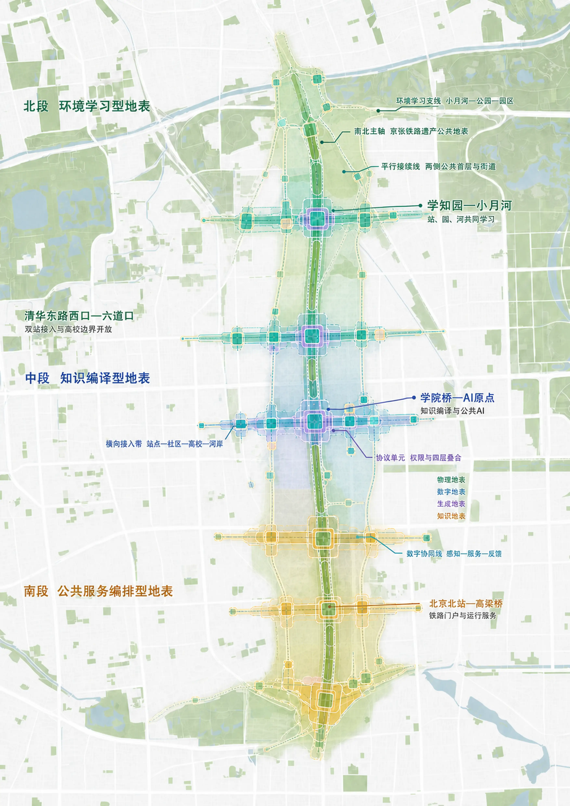

*开源地表总体空间关系：南北连续公共基底、五条横向接入带、三段原型、重点空间单元与数字协同线共同组织整个研究区。图面表达概念性空间结构，正式边界与工程条件到位后校准。*

## 设计依据与资料清单

本方案由三项连续工作共同构成：前期场地研究负责建立空间事实和问题证据，案例学习与方案方向研究负责比较国内外转型机制，最终设计把判断落实到总体结构、重点区平面、关键剖面、代表性场景、实施项目和运营规则。三项工作属于同一设计过程，前两项直接进入本正文的论证链；参考资料仅列支撑事实、案例和方法的原始官方、公共机构、学术及开放数据来源。

任务范围依据公开资格预审公告和面向智能体任务书建立，包含约43.6平方公里统筹研究范围、约11.4平方公里总体设计范围及众智园、北京AI原点、大钟寺三处重点区域。场地研究以2026年8月12日取得的OpenStreetMap北京摘录为现状背景，在EPSG:4548坐标系中采用250米输出网格和400米活动观察窗口，形成区位、轨道、慢行、阻隔、建筑肌理、功能活力、创新教育、公共服务、文化、商业、蓝绿、更新线索及重点区差异等22张专题图。[source:SRC-OFFICIAL-ANNOUNCEMENT] [source:SRC-AGENT-TASKBOOK] [source:SRC-OSM-BBBIKE-20260812]

现状数据支持走廊尺度的结构判断、相对强弱比较和优先介入选点。研究网格约43.25平方公里，共识别3975处兴趣点，绿地占比约13.2%、蓝水约0.7%、建筑覆盖约17.8%，轨道站点中位直线距离约606米。步行与骑行时间依据路网供给和道路铁路阻隔进行修正，服务圈用于比较站点潜力；真实入口、过街等待、坡度、开放时段及人群体验将在现场调查阶段校准。

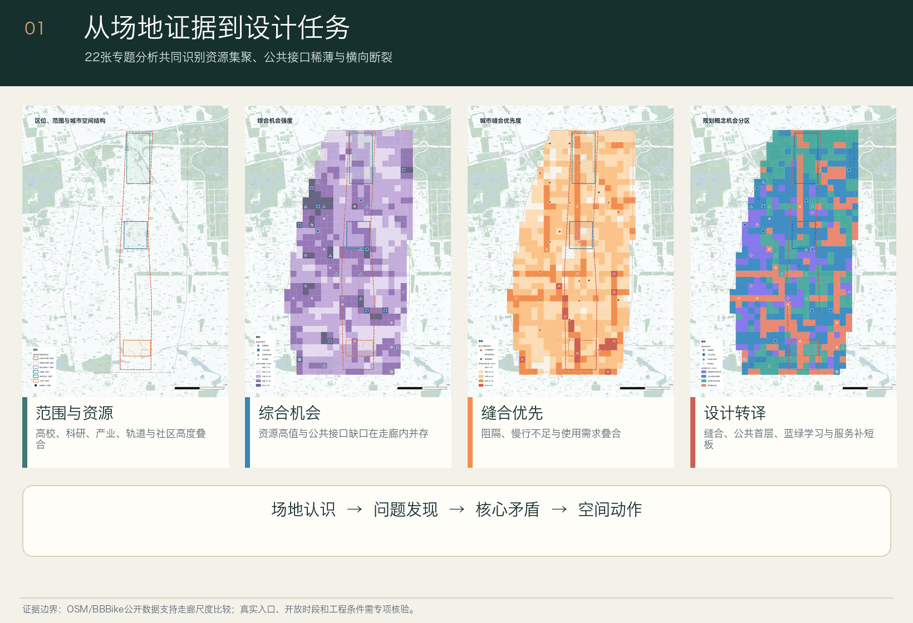

*场地研究证据链总览：区位、资源、交通、阻隔、公共服务、蓝绿与更新线索共同推导核心矛盾，并进入案例选择和空间设计。该图承担全篇索引，后文22张专题图提供逐项证据。*

案例研究从27项候选中选取12项进入统一比较，重点考察连续公共空间、铁路缝合、知识机构公共界面、蓝绿试验、遗产复用、分期实施和多主体运营。King’s Cross、Paris Rive Gauche与杨浦滨江南段构成核心案例，创智天地、22@ Barcelona、Kendall Square、京义线林荫道、The Bentway、Stockholm Royal Seaport、北京首钢园、深圳前海桂湾公园及香港科学园补充不同机制。案例照片和规划图均采用具有明确开放许可的资产，并在图注中标明作者、来源、许可和处理方式。

当前研究采用临时范围支持概念设计和图件校核。正式重点区边界、站口、道路红线、权属、建筑质量、河道、防洪、市政容量和跨线工程资料到位后，将进入地块与工程层面的复核。现阶段大钟寺以站点周边东、西、南、北四个方向的潜在接入框架开展设计，图面保留后续校准空间。

## 三层范围工作框架

三层范围对应三个连续问题：区域层面研究创新资源怎样转化为公共能力，总体设计层面研究铁路遗产公园及两侧怎样形成完整城市结构，重点区域层面研究空间如何被进入、使用、维护和持续调整。每一层都承接上一层结论，并向下一层提供明确的空间任务。[depth:three_level_scope_framework]

| 工作层级 | 需要回答的问题 | 设计工作 | 主要成果 |
|---|---|---|---|
| 统筹研究范围 | 高校、企业、社区与未来AI怎样形成开放创新生态 | 研究产业链、知识链、人才链、公共服务链、空间可达性与南北差异 | 现状专题图、核心矛盾、案例机制、三段发展方向 |
| 总体设计范围 | 京张遗产公园及两侧怎样形成连续公共城市结构 | 组织连续公共基底、五条横向接入带、十五分钟开放单元、公共首层与蓝绿交通系统 | 总体总平面、专项系统、更新单元、分期项目 |
| 重点区域范围 | 三类创新集聚区怎样形成各自可使用、可运营的公共界面 | 细化众智园、AI原点、大钟寺的功能、平面、剖面、场景和实施条件 | 三套局部平面、三条关键剖面、三幅代表性场景、项目清单 |

统筹研究从北京城市结构和京张走廊资源分布出发，解释“为什么做”；总体设计把研究结论转化为用地、道路、公共空间、建筑首层和基础设施，回答“做成什么”；重点区域把入口、路径、门槛、设备、运营与日常活动放入具体空间，验证“怎样使用”。这三层共同构成从产业与未来城市研究到控规深度城市设计，再到重点区域详细设计的完整链条。

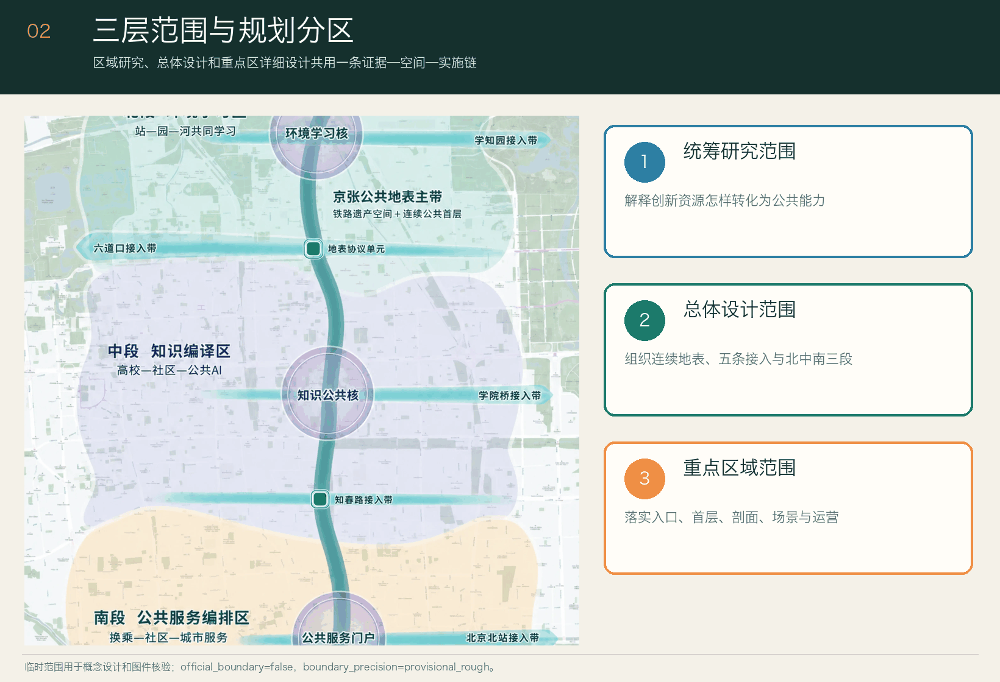

*三层范围与用地空间结构索引：区域研究、总体设计和重点区详细设计共用一条问题—空间—实施链，正式总平面与分区图在第四章展开。*

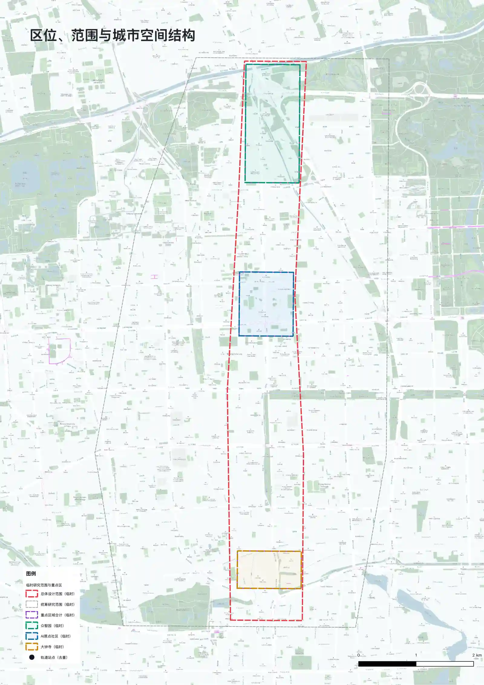

*前期分析01：京张走廊位于高校、科研、产业、轨道与成熟社区高度叠合的城市区域。底图与分析数据：© OpenStreetMap contributors，ODbL 1.0；BBBike北京摘录，2026-08-12。*

## 统筹研究范围产业与未来城市研究

### 3.1 从一条铁路走廊认识一座知识城市

京张铁路遗产空间从北部小月河、学知园与科研园区，经六道口、学院桥和高校院所集聚区，延伸至知春路、大钟寺、蓟门桥及北京北站周边。南北沿线同时出现三类城市肌理：北部园区与蓝绿空间相邻，中部高校科研大院和城市街区密集交错，南部成熟社区、商业、轨道与铁路门户叠合。建筑覆盖、地块尺度和用地混合度进一步显示，走廊内部缺少一种可以覆盖多种肌理的单一更新模板，连续公共结构需要与各段具体条件结合。

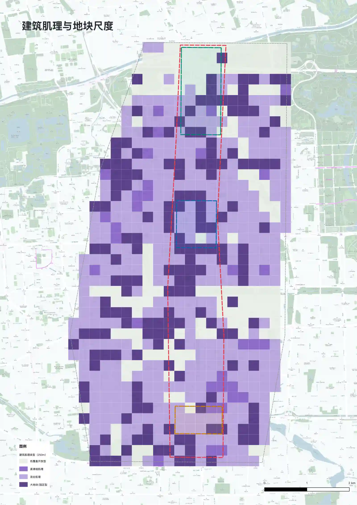

*前期分析10：中部大尺度机构地块与周边细密街区并置，公共路径需要穿过机构边缘并连接平行街道。*

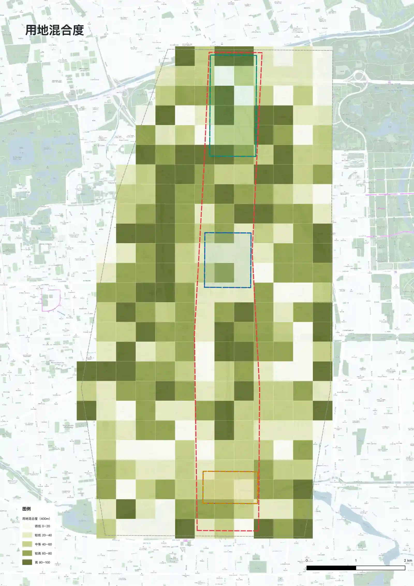

*前期分析18：南部生活服务和交通功能更为混合，北部园区与蓝绿资源突出，中部知识资源密度最高。*

这种南北梯度构成方案的第一项认识：京张的潜力来自多种城市系统共存，其困难也来自这些系统各自运行。高校内部的知识生产、企业内部的技术测试、社区内部的日常服务、轨道站点的快速流动和公园的公共活动，在地理上十分接近，在使用规则和空间入口上仍然彼此错开。

### 3.2 轨道覆盖较好，最后一段连接决定实际可达

轨道站点潜在可达性分析显示，走廊整体拥有较好的站点基础。估测结果中，5分钟步行覆盖约13.4%，10分钟约48.2%，15分钟约78.6%；5分钟骑行约85.5%，10分钟和15分钟骑行达到整个研究网格。高覆盖意味着轨道和骑行可以支撑跨区协作，站口到社区、机构入口和公共首层之间的最后一段路径将直接决定这些资源能否被公众使用。

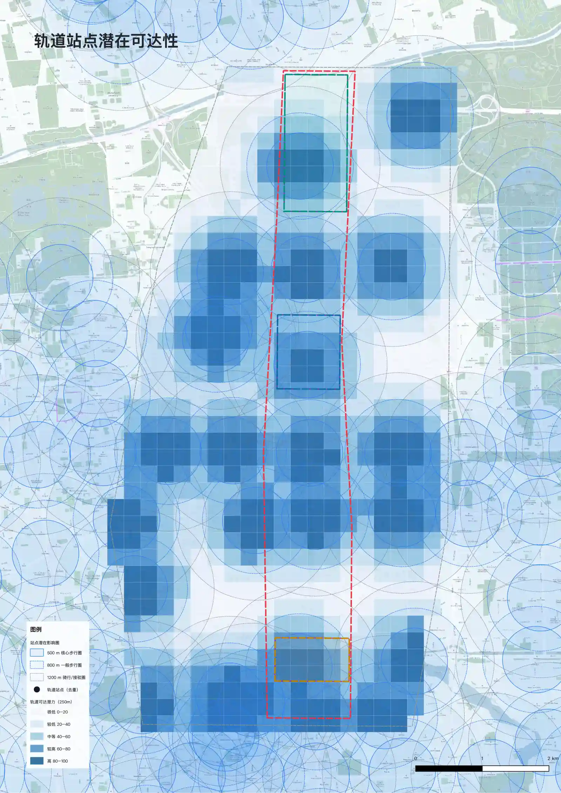

*前期分析03：站点影响圈揭示轨道资源的总体基础，真实服务范围由路网、入口和过街条件共同决定。*

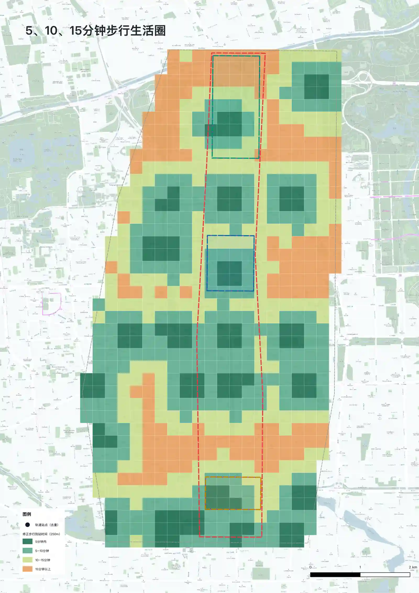

*前期分析04：步行生活圈经过慢行供给和道路铁路阻隔修正，10分钟以内仍存在明显空隙。*

慢行网络供给、道路铁路阻隔和城市缝合优先度把“最后一段”进一步拆开：平行街道和园路提供备选南北联系，铁路、快速路、环路和封闭大地块增加横向绕行；站点附近、校园园区边缘和跨线节点同时出现“需求高、连接弱”的缝合热点。因此，总体设计把五条横向接入带作为优先空间工程，每条接入带同时处理站口、过街、骑行、无障碍、机构入口、首层和蓝绿停留。

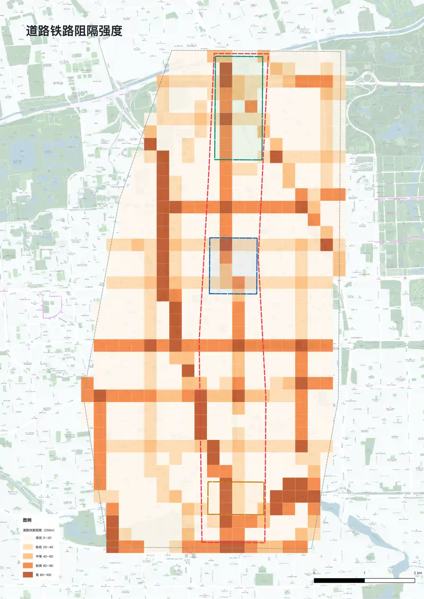

*前期分析07：铁路、快速路和主干路共同形成横向压力，提示连接工程应优先落在真实需求与可实施条件叠合的位置。*

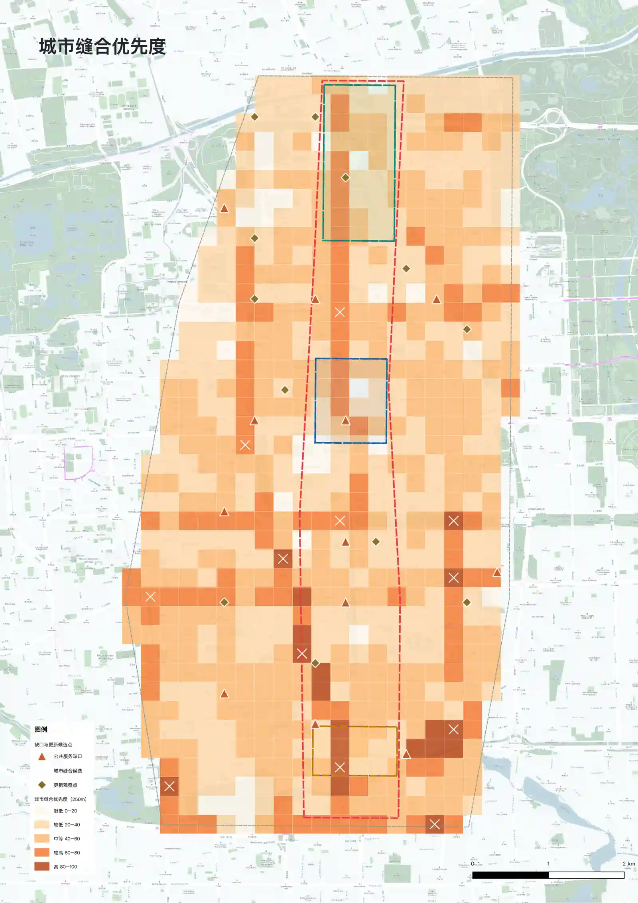

*前期分析08：阻隔、慢行不足与建成强度叠合后，形成五条横向接入带和重点空间单元的选点依据。*

### 3.3 知识资源高度集聚，公共转化界面持续稀薄

城市功能活力、功能多样性和创新教育资源强度显示，中部学院路及高校园区周边形成连续高值，北部科研园区和南部轨道商业节点各有集聚。知识生产已经具有规模，公共空间中的知识解释、公共课程、共享设施、社区问题入口和日常服务仍呈点状分布。创新资源与公共服务补短板候选在多个位置相邻出现，说明资源总量和公众获得之间存在结构性距离。

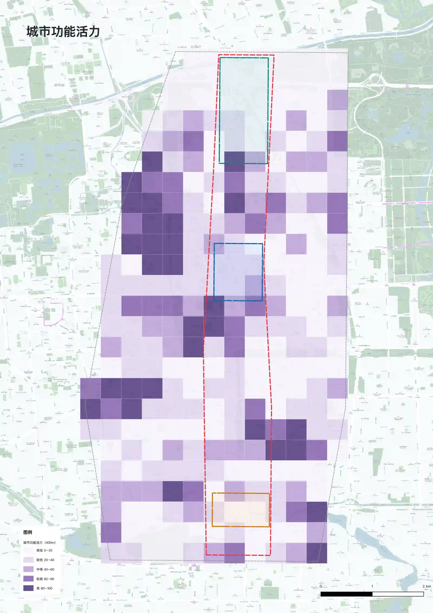

*前期分析11：日常活动密度沿站点、商业和高校周边集聚，为公共首层和夜间服务选点提供依据。*

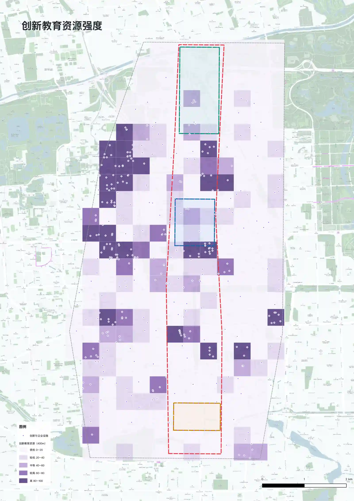

*前期分析13：创新、教育与文化资源沿中部形成高密度集聚，是京张知识生产空间的核心基础。*

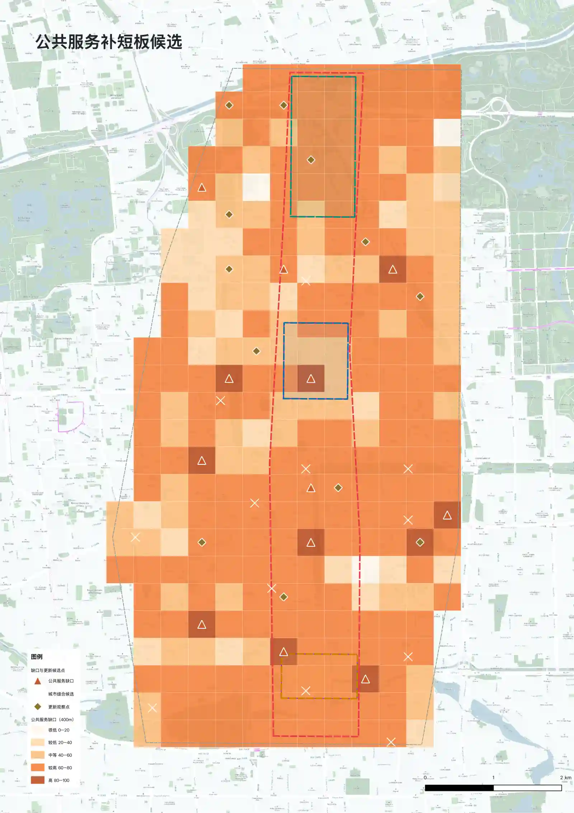

*前期分析15：低供给与较高估测需求叠合，筛选出站点前场、社区入口和机构边缘的补短板位置。*

文化遗产和商业日常生活分析补充了另一层判断。京张铁路遗产、高校历史、工业与社区记忆可以构成贯穿全线的知识叙事；商业与生活服务则决定公共空间能否在课程、展览和技术活动之外保持日常使用。文化路线与普通生活结合，能够让创新带同时服务通勤、照护、休息、学习和社区交往。

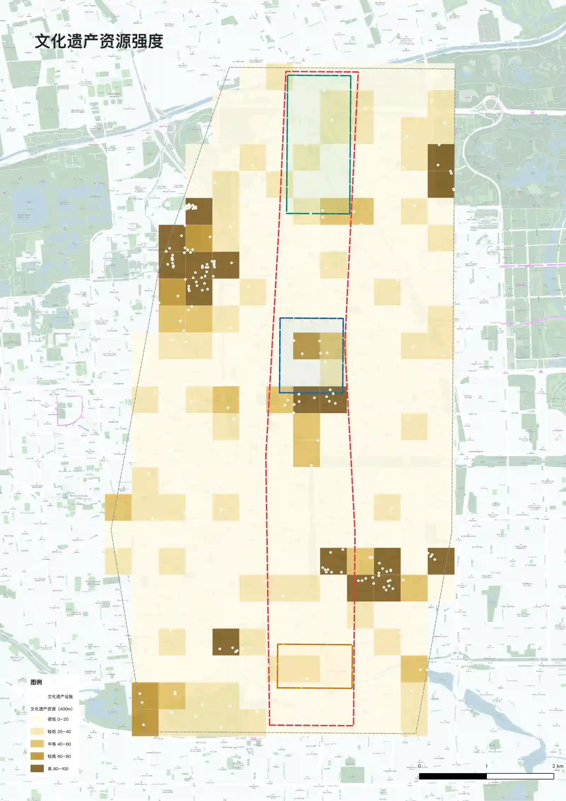

*前期分析16：铁路工程史、高校文化与城市记忆为全线公共知识路线提供内容基础。*

### 3.4 蓝绿、更新线索与三个重点区的差异

北部小月河、园区公园和铁路绿地提供较好的蓝绿基础，中部蓝绿空间被机构边界和道路切分，南部需要通过街道树阵、社区前场和铁路边缘形成小尺度接续。蓝绿空间因此同时承担雨洪、生境、热舒适、运动休闲和环境学习；它与站点、首层、社区入口的连接质量比单纯绿量更接近公众体验。

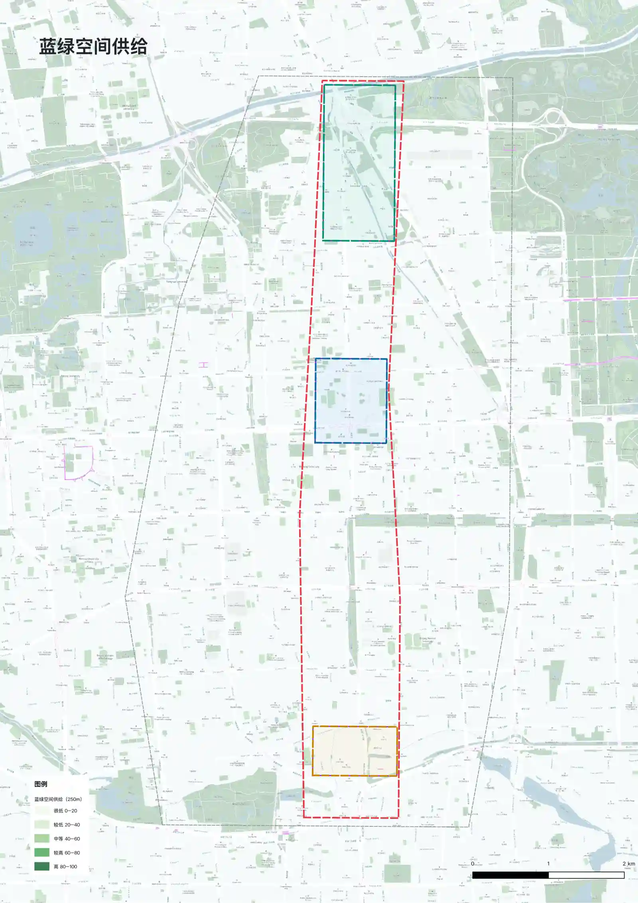

*前期分析19：北部蓝绿条件支持环境学习和河岸公共空间，中南段需要补足遮阴、口袋空间和连续步行环境。*

更新线索图识别建设中、棕地和待开发地段，建筑与地块分析同时提示大部分公共转型可以从既有空间开始：打开机构边界、转换建筑首层、改善横向街道、补充公共前场、整理后勤接口。涉及拆建的项目进入逐栋调查后再确定，使早期公共收益可以在较低工程依赖下出现。

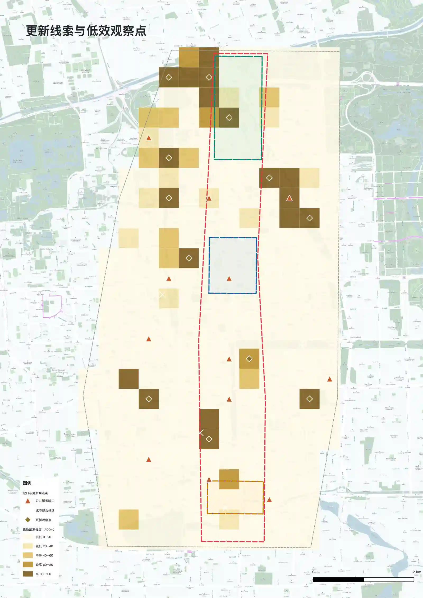

*前期分析20：更新候选位置用于安排逐栋调查和首期项目，拆改留结论由权属、结构、消防、历史价值和现状使用共同确定。*

三个重点区代表三种完全不同的转化任务。众智园的蓝绿与研发园区基础适合“站—园—河”环境学习；AI原点的创新教育与公共服务集聚适合把研究成果编译为公共知识；大钟寺周边的高流动、成熟社区和商业基础适合组织换乘、就业、健康和文化服务。三种原型共享开放标准，同时保持空间形态、功能和运营的差异。

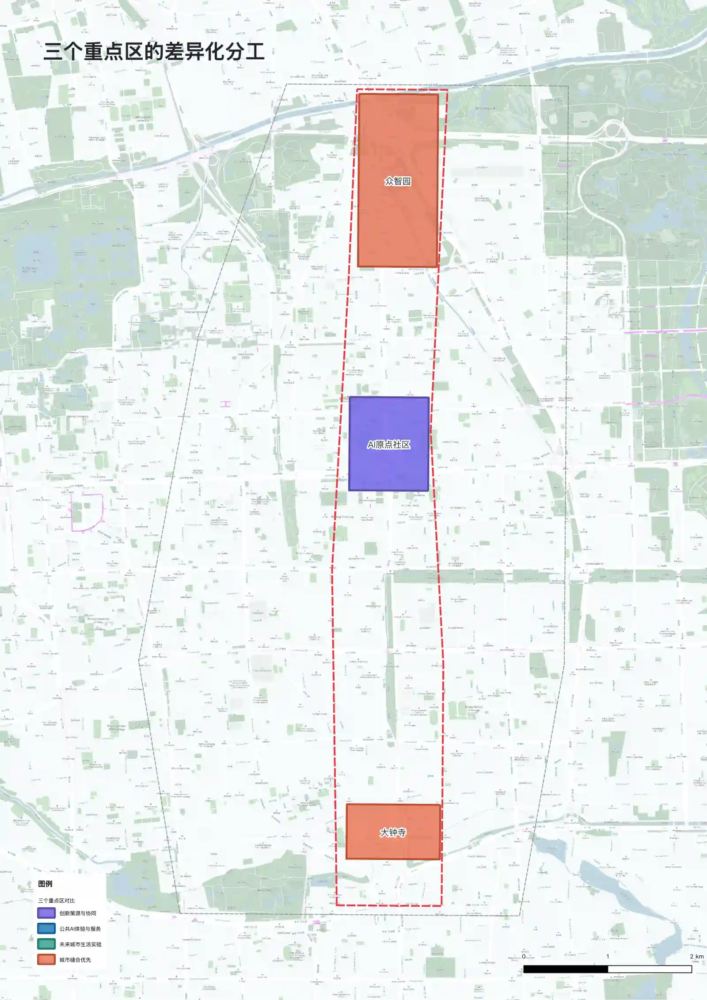

*前期分析21：重点区指标比较转化为环境学习、知识编译和公共服务编排三类设计原型。大钟寺指标将在正式范围到位后复算。*

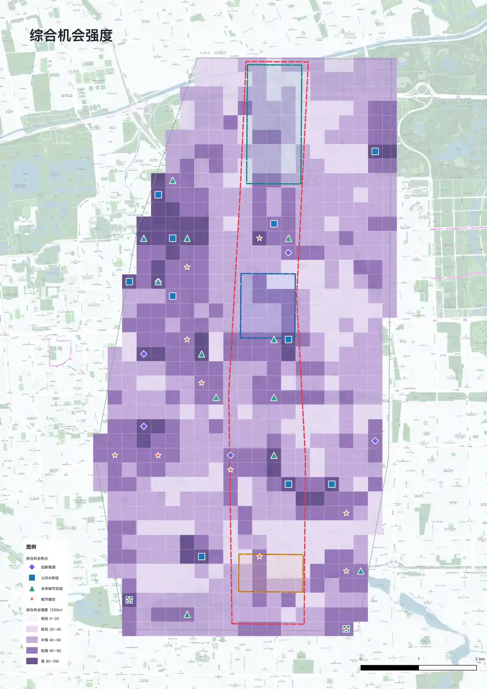

*前期分析02：创新、服务、交通、慢行、蓝绿和阻隔的综合叠合揭示资源集聚与公共接口缺口同时存在。*

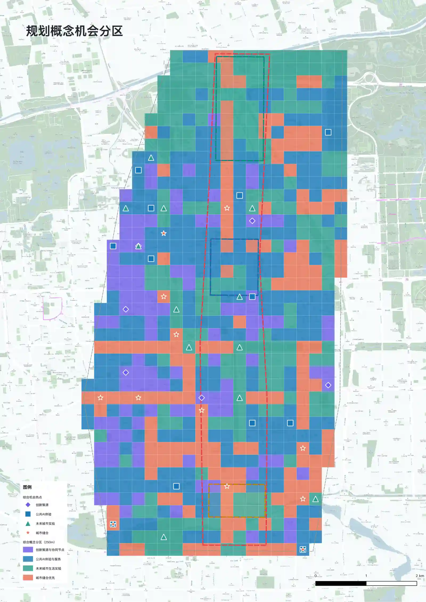

*前期分析22：四类机会分区把现状证据转译为缝合、公共首层、蓝绿学习和服务补短板的空间方向。*

### 3.5 从证据中得到核心矛盾

前期研究最终归纳出五组相互印证的事实：创新教育资源高度集聚，功能与公共服务在局部形成高值，轨道和骑行具有较好的总体覆盖，横向阻隔和大地块边界造成真实绕行，公共首层与连续蓝绿空间仍然稀薄。由此得到全案核心矛盾：**创新资源高度集聚，公共转化接口持续断裂。**

问题的关键落在“接口”上。城市已经拥有高校、实验室、企业、轨道、公园和社区，设计需要建立它们进入公共生活的空间条件：知识通过课程、模型和解释进入首层；技术通过受控测试和人工服务进入公共空间；城市问题通过社区入口和公开清单进入研究系统；公园、河岸和街道通过连续路径进入日常生活；每项开放都由明确时段、权限、责任和维护支撑。

### 3.6 案例怎样把集中资源转化为公共能力

案例研究围绕四个问题展开：铁路和基础设施怎样被缝合，知识机构怎样进入公共空间，不同区段怎样保持共同标准，长期项目怎样持续实施与运营。核心案例提供完整的空间—制度链，扩展案例补充具体机制。

#### Paris Rive Gauche：以城市街道分段跨越运行铁路

Paris Rive Gauche把铁路束分成Austerlitz、Tolbiac、Masséna和Bruneseau等实施区段，以桥街、公共设施、开放空间和公共开发机构的长期推进逐步恢复城市连续性。对京张的启示是把五条横向接入带分别建立项目包，地面改善、入口开放与长期跨线工程分层推进，使近期公共空间和远期结构性缝合可以并行。[source:SRC-SEMAPA-PRG] [source:SRC-COUR-DES-COMPTES-PRG]

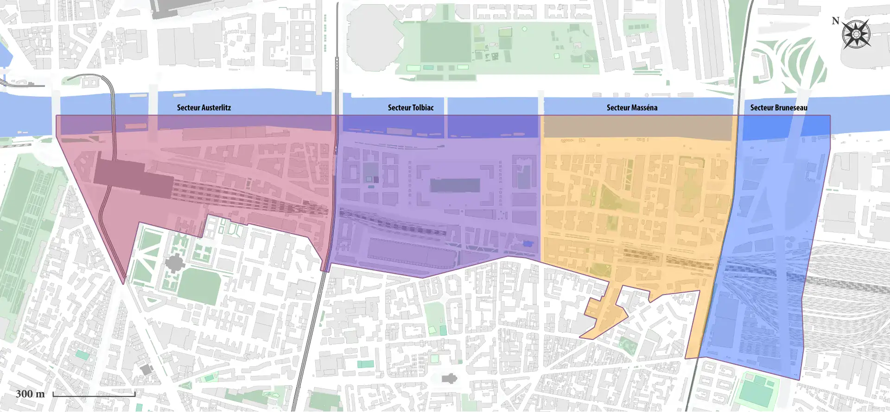

*Paris Rive Gauche四个实施分区，2022。制图：Paris 16；底图数据：OpenStreetMap contributors；CC BY-SA 4.0；Wikimedia栅格化，图面未改。*

#### 杨浦滨江：以连续公共空间串联遗产、社区与日常运营

杨浦滨江南段通过连续慢行、横向通道、遗产节点和分段更新，把工业岸线转化为日常公共空间。空间开放与总师、平台运营和持续活动共同推进，使遗产价值在普通步行、运动、休息和社区使用中被体验。京张借鉴其“连续基底＋横向接入＋遗产节点＋长期运营”的组合，并把滨水逻辑转译为铁路遗产公园与两侧公共首层。[source:SRC-YANGPU-RENEWAL] [source:SRC-MDPI-YANGPU-PLAN]

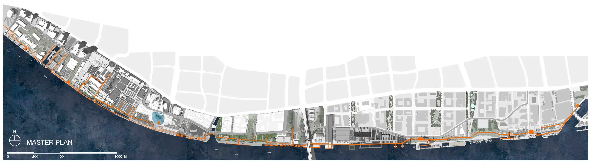

*杨浦滨江南段5.5公里更新总平面。来源：Yihao Wu、Yang Liu，Figure 5，Sustainability 15(6):5060，2023；CC BY 4.0；图面未改。*

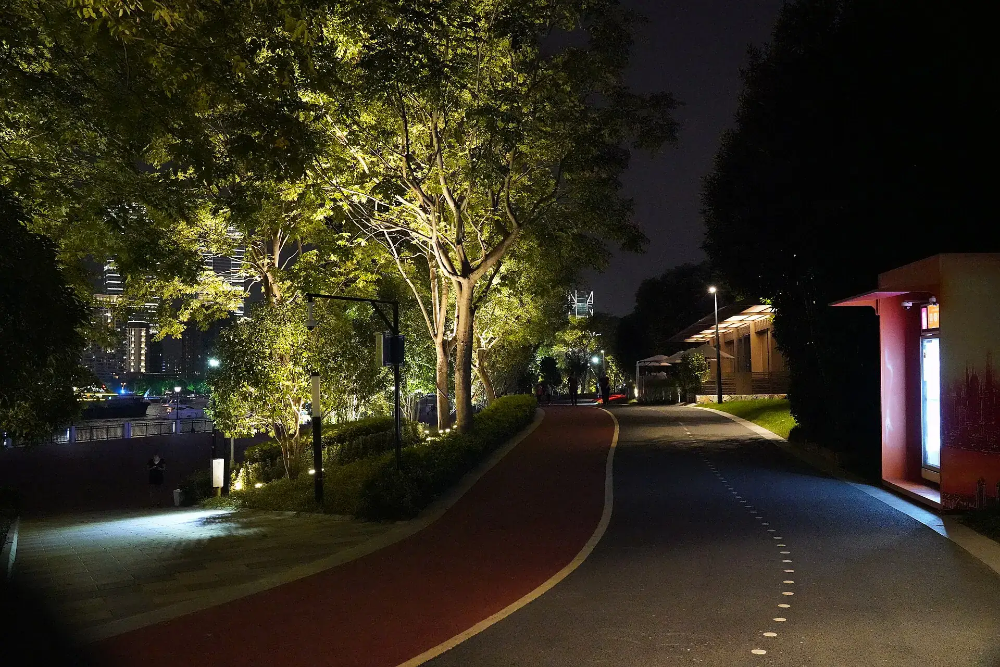

*杨浦滨江夜间慢行空间，2019。摄影：Ding Kezhong；CC BY-SA 4.0；来源：Wikimedia Commons。*

#### King’s Cross：以大学锚点、公共空间和遗产复用建立创新城区

King’s Cross将大学、研发、商业、住房、遗产建筑和高质量公共空间纳入长期开发，以Granary Square等公共空间先行建立地区识别和日常活动。它提示京张把高校与研究机构的公共入口、共享前场、知识服务和遗产空间放在总体结构的核心位置，同时把开放责任写入长期运营。[source:SRC-KINGS-CROSS-DEVELOPER] [source:SRC-CAMDEN-KINGS-CROSS]

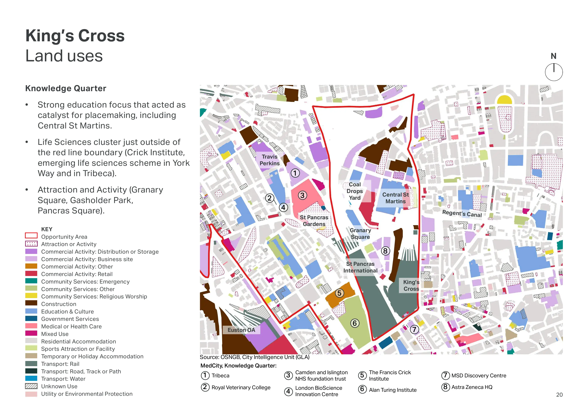

*King’s Cross机会区土地使用、知识机构与活力节点，2025。来源：Greater London Authority，Opportunity Area Portrait: King’s Cross，第20页；Open Government Licence v3.0。*

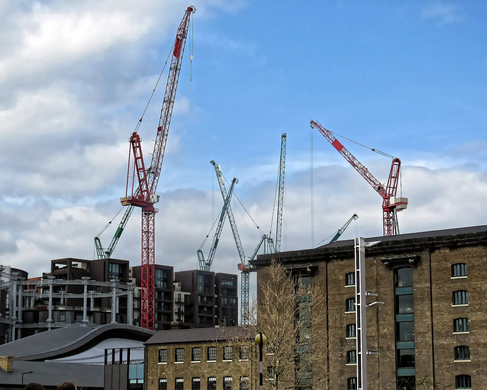

*King’s Cross Central建设期的新旧空间并置，2019。摄影：Acabashi；CC BY-SA 4.0；来源：Wikimedia Commons。*

#### 22@、创智天地与Kendall Square：让知识机构进入街道和社区

22@ Barcelona通过用途转换、基础设施更新、公共回馈、绿色轴与遗产创意轴组织创新城区；创智天地通过高校—园区—社区的小街区、公共首层和持续运营形成日常交往；Kendall Square把大学研究、企业、住房、开放空间和社区活动组合在步行可达范围。三项案例共同说明，创新生态需要普通街道、可进入首层、日常服务与社区参与共同支撑。[source:SRC-BARCELONA-22AT] [source:SRC-KIC-OPERATOR] [source:SRC-MIT-KENDALL]

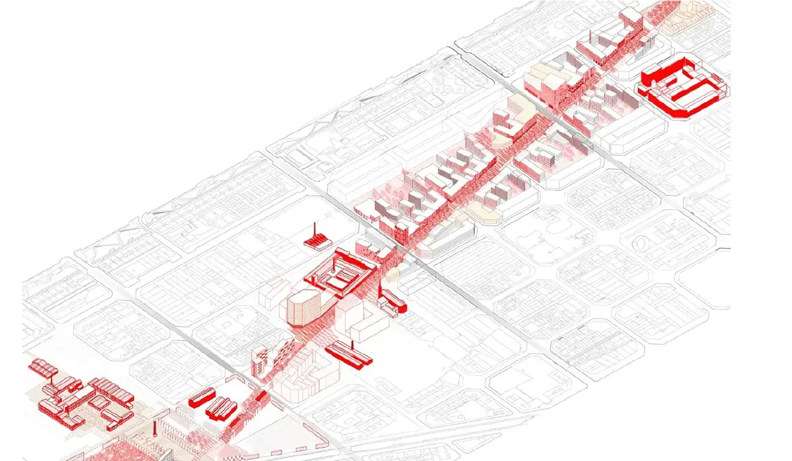

*Pere IV遗产、文化与创意轴。来源：Barcelona City Council / Barcelona Activa，Impulsem el 22@，第31页；原图：BIT Habitat 2019；CC BY 4.0；从完整页面裁出图面。*

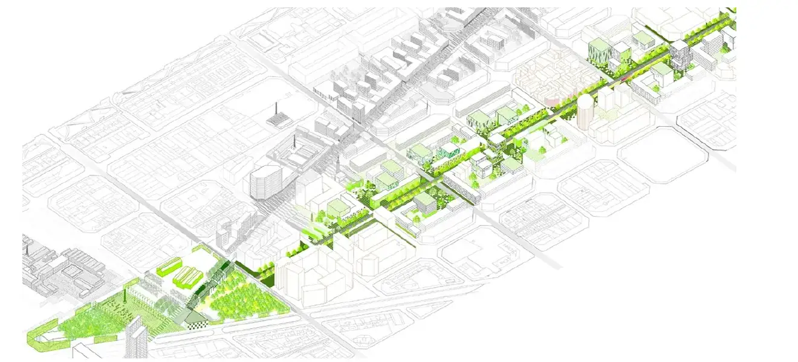

*Cristóbal de Moura绿色轴。来源：Barcelona City Council / Barcelona Activa，Impulsem el 22@，第32页；原图：BIT Habitat 2019；CC BY 4.0；从完整页面裁出图面。*

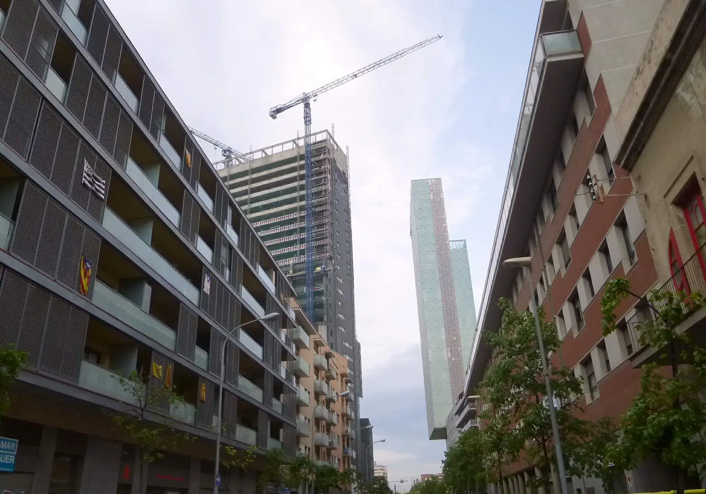

*Pere IV沿线住宅、旧工业建筑与新办公建设并置，2016。摄影：Zarateman；CC0 1.0；来源：Wikimedia Commons。*

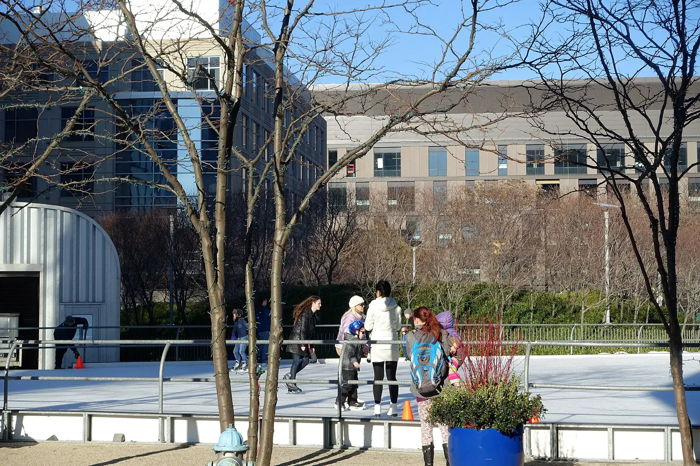

*Kendall Square社区季节性滑冰活动，2014。摄影：Daderot；CC0 1.0；来源：Wikimedia Commons。*

#### 扩展案例：线性公园、城市房间、蓝绿试验与长期运营

| 案例 | 可转译机制 | 京张落位 |
|---|---|---|
| 京义线林荫道 | 多入口线性公园与沿线社区日常使用 | 铁路遗产公园与横向街道的密集接入 |
| The Bentway | 基础设施下方可逆城市房间、季节活动和运营组织 | 桥下、路口与基础设施边缘的分时公共空间 |
| Stockholm Royal Seaport | 蓝绿指标、土地条件、履约台账与城市试验 | 众智园环境学习、全线版本治理与后评估 |
| 北京首钢园 | 工业遗产再利用、科技产业与事件运营 | 铁路遗产节点、建筑适应性改造和文化活动 |
| 前海桂湾公园 | 雨洪、生境、公共活动与数字维护协同 | 小月河、铁路公园和街道雨水空间 |
| 香港科学园 | 分期科研载体、协作空间、人才服务与滨水开放 | 众智园和AI原点的研发—公共界面与运营服务 |

12项案例共同给出四个稳定结论：连续纵向基底需要密集横向入口；知识机构需要公共首层和日常业态；差异区段可以共用开放标准；长期项目需要分期责任、维护资金和运营台账。京张的方案由这些机制与本地证据共同推导，形成面向空间、知识、数据、设施、城市问题、公共服务和治理接口的“开源地表”。

## 总体设计范围城市更新与控规深度城市设计

### 4.1 开源地表的空间原型

“开源地表”（Open-Source Ground）把开源对象从代码扩展到城市空间、知识、数据与模型、设施、城市问题、公共服务和治理接口。每个公众可以到达的界面同时回答六件事：这里开放什么、怎样到达、何时可用、怎样贡献、谁负责调整、怎样退出。入口、开放时段、权限、责任、版本和恢复方式共同组成“地表协议单元”。[depth:overall_spatial_structure]

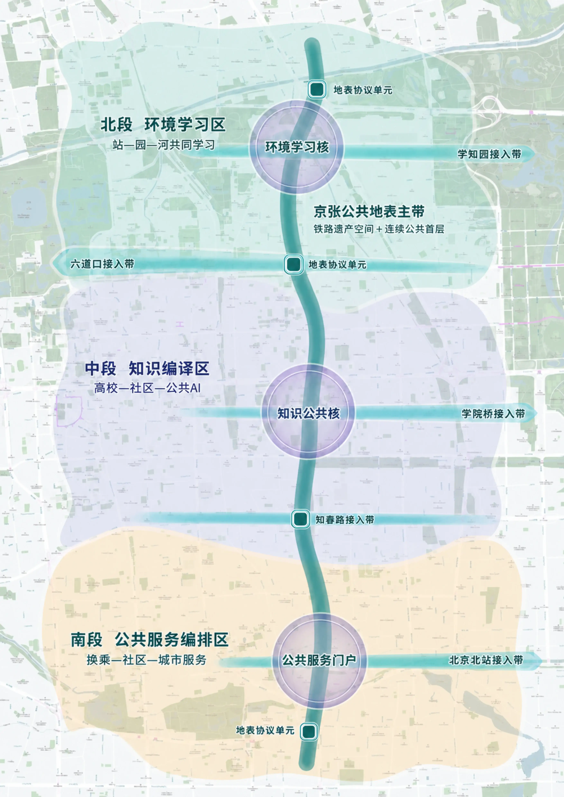

*开源地表规划分区结构：连续主带、五条横向接入带、北中南三段和三个重点区共同构成总体空间骨架。色块与圈层表达概念分区，具体空间动作在全域总平面中进一步落实。*

| 公共权利 | 对应空间动作 | 日常可感知结果 |
|---|---|---|
| 看见 | 入口、开放内容、责任人和状态清晰可读 | 公众在到达前即可理解服务和使用条件 |
| 到达 | 连续无障碍、主备慢行、横向过街和站点接续 | 社区、轨道、公园与机构首层形成完整路径 |
| 使用 | 基础开放、时段共享、协作使用、受控贡献分级 | 普通通行和专业设施共享各有明确门槛 |
| 贡献 | 城市问题入口、课程、模型、工具和社区经验 | 真实城市问题进入研究与公共服务系统 |
| 修改 | 公开评估、申诉、更正和版本记录 | 空间规则可以根据使用证据持续调整 |
| 退出 | 数据删除、设备停机、活动关闭和空间恢复 | 技术变化后公共路径与基础服务保持连续 |

五类空间操作把权利转化为城市设计：打开机构边界，增加公共入口和独立夜间路径；加厚公共地表，使遗产公园、前场和首层形成复合界面；建立横向接入，修复站点、社区和高校之间的最后一段；嵌入公共接口，配置人工服务、工具、模型和基础设施；实行版本管理，让临时布置、开放时段和技术模块可以评估、调整与恢复。

### 4.2 四层地表在同一空间叠合

物理地表提供步行骑行、公共首层、蓝绿、遮阴、卫生、储物和后勤；数字地表公开开放状态、环境、容量、能耗、数据来源与误差；生成地表在限定权限内辅助调整遮阴、灌溉、照明、活动布置和服务调度；知识地表把课程、研究成果、社区经验、维护记录和失败案例转化为公共资源。四层共用同一几何，在总平面、地块、首层、公共空间和运营系统中同步出现。

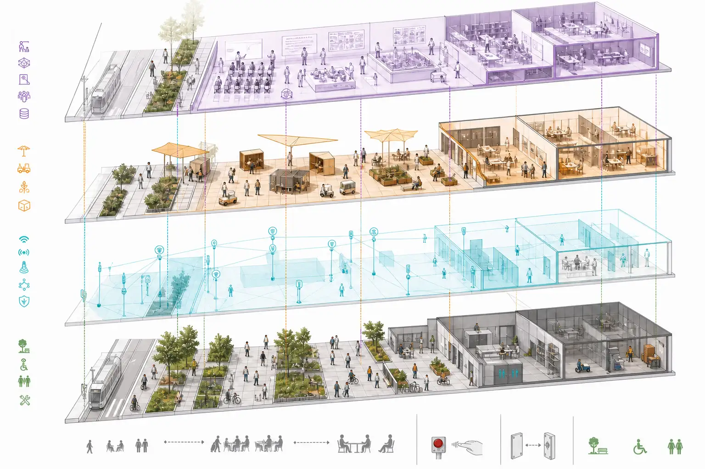

*四层地表关键剖面：受控研究空间、公共首层、共享前场、慢行与蓝绿空间构成物理基础；开放状态、生成式调节与知识内容叠加在相同空间单元。*

### 4.3 一条连续公共地表与五条横向接入带

总体总平面以京张铁路遗产公园为连续公共基底，同时借助平行街道、园路和社区路径形成南北备选线。五条横向接入带分别连接学知园—小月河、清华东路西口—六道口、学院桥—AI原点、知春路—大钟寺—蓟门桥、北京北站—高梁桥。每条接入带同时处理交通、首层、蓝绿、公共服务和运营，形成可以独立实施的城市更新项目包。

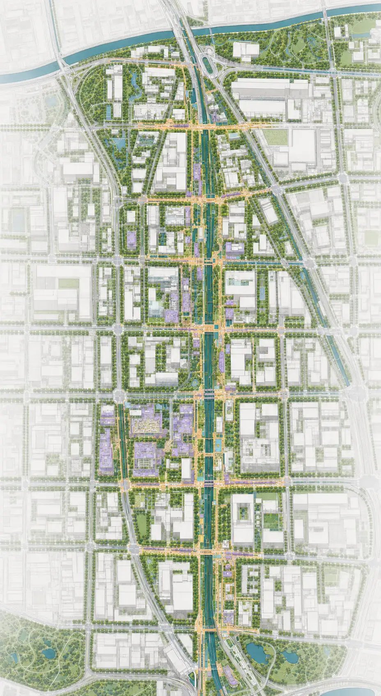

*全域总体设计：在统一现状地图约束下组织南北连续公共基底、五条横向接入带、三段原型、三个重点区、公共首层、蓝绿节点、站点接续与技术后勤接口。外围底图淡化，图面范围集中于京张走廊。*

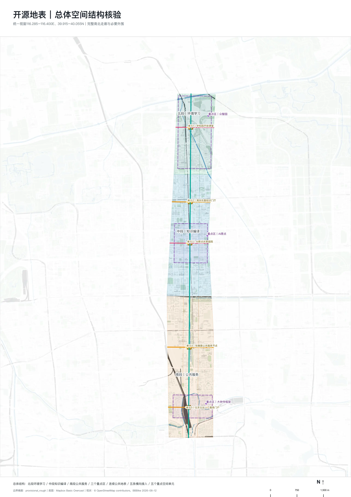

*QGIS核验：九层正式GeoJSON实载并叠加项目底图，总体结构保留北中南三段、三个重点区、连续公共地表、五条横向接入与五个重点空间单元。临时范围用于概念校核。*

总体空间部件产生四类直接转型：铁路遗产公园保留可识别的线位、站场和工程遗存，叠加连续慢行、生态空间和公共学习；机构边界与建筑首层按基础开放、时段共享、专业协作和受控贡献组织入口、门厅、前场与后勤；横向街道与轨道站点把站口、过街、骑行、无障碍、公共导向和换乘前场组成完整接入带；河岸与社区接口把生态缓冲、健康活动、照护和社区问题登记接入公共地表。

### 4.4 十五分钟开放单元与重点空间单元

十五分钟开放单元依据真实入口、路网、过街等待、坡度和开放时段划定。五分钟范围保障通行、休息、饮水、卫生、人工咨询与求助；十分钟范围提供公共首层、工具维修、学习与照护；十五分钟范围连接课程、工坊、城市模型、河岸生态学习和跨机构协作。地表协议单元承担管理，十五分钟开放单元承担服务覆盖，重点空间单元承担成套空间设计。

| 重点空间单元 | 核心空间介入 | 对应总体任务 |
|---|---|---|
| 学知园—小月河 | 站园河主备路径、园区公共首层、河岸生态学习、设备维护接口 | 北段环境学习与众智园重点区 |
| 清华东路西口—六道口 | 两站接续、校园门户、路口与桥下、夜间路径、骑行和设备交接 | 中段横向缝合 |
| 学院桥—AI原点 | 公共首层群、城市模型室、共享前场、社区服务和夜间运营 | 中段知识编译与AI原点重点区 |
| 知春路—大钟寺—蓟门桥 | 四方向潜在接入、连续骑行、社区商业首层、公共服务 | 南段服务编排与大钟寺重点区 |
| 北京北站—高梁桥 | 无障碍换乘、社区通行、访客服务与铁路遗产信息 | 南端铁路门户 |

清华东路西口—六道口是五个单元中最典型的横向连接：两处轨道站点、道路两侧高校园区、社区和铁路遗产空间通过多路径步行、骑行、无障碍、换乘前场和可开放首层组成连续公共地表。桥下与路口空间承担等候、导向、夜间照明与共享设备交接，校园安防和公共通行各自拥有清晰边界。

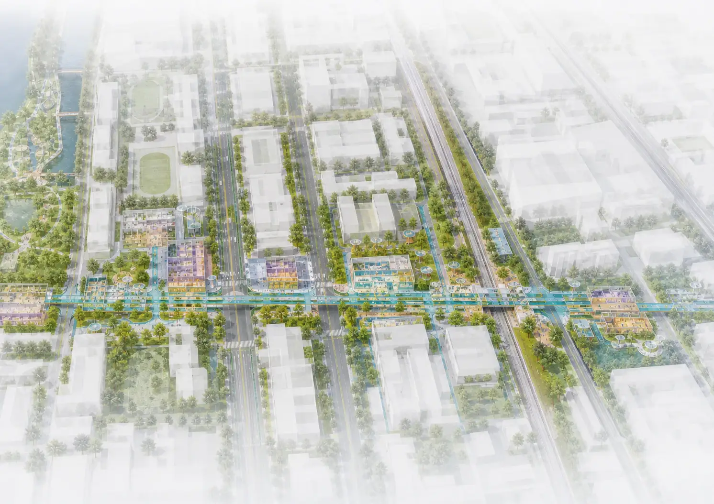

*清华东路西口—六道口重点空间单元：横向公共路径串联两处站点、高校园区、社区、商业首层与铁路遗产空间；具体站口、过街方式和跨线净空在专项调查后确定。*

### 4.5 北中南三种地表原型

| 分段 | 资源基础与主要问题 | 地表原型 | 主要空间动作 |
|---|---|---|---|
| 北段 | 众智园、学知园、小月河和科研产业邻近，站园河接续与开放首层较弱 | 环境学习型地表 | 连接站点、园区、社区与河岸，叠加环境课程、共享工具、自适应景观和可控设备路线 |
| 中段 | 高校科研、AI企业与社区密集，知识生产与公共生活缺少共同界面 | 知识编译型地表 | 建立跨机构横向接入、公共首层群、城市模型、公共AI与夜间学习服务 |
| 南段 | 轨道、成熟社区、商业、高校与铁路门户叠合，换乘和公共服务分散 | 公共服务编排型地表 | 组织四方向潜在接入、连续骑行与无障碍、社区及商业首层、就业生活服务和铁路门户 |

三种原型共享六项公共权利、四层地表和版本治理。各段依据资源组合形成不同的首层功能、蓝绿任务和技术系统，使整个走廊同时具有连续性和场所差异。

## 重点区域详细设计

众智园、北京AI原点和大钟寺分别承担环境学习、知识编译和公共服务编排。三处设计共用开放权利和四层地表，平面结构、剖面关系、使用人群、日夜节律与实施条件均针对各自场地建立。[depth:three_key_area_detailed_design]

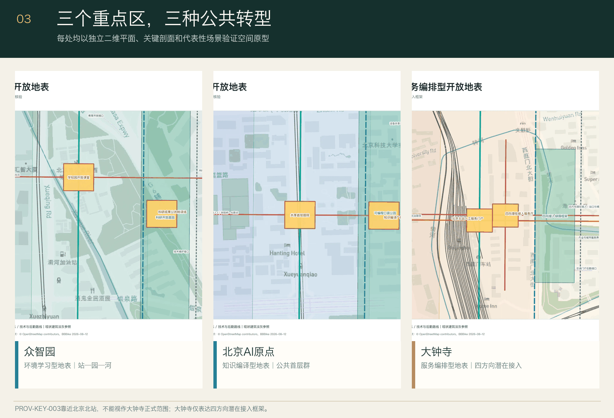

*三处重点区域设计索引：每个重点区均由一张局部平面、一条关键剖面和一幅代表性公共生活场景构成，后续九张图逐区展开。*

### 5.1 众智园AI自主创新加速区：环境与具身系统共同学习

众智园以“学知园站—园区公共首层—公园—小月河”为主接入链，利用平行街道和园路形成备选路径。园区边界设置多个可识别的公共门厅和共享前场，河岸生态缓冲与日常慢行保持连续。站点前区布置导向、人工咨询、换乘休息和基础服务；园区首层布置环境课程、共享工具、维修储充、健康服务和可解释环境模型；河岸承担生态学习、运动休憩和社区环境议题记录。

交通与技术系统采用主备无障碍路径，低速设备和维护路线避开高峰步行空间。热环境、雨洪、生境和能耗信息进入公开环境模型，自适应遮阴、灌溉与维护设备设置固定模式、物理停机和人工接管。站口、园区入口、首层消防安防、河道管理、生态缓冲、洪水条件、设备维护与运营主体是下一步详细工程设计的基础资料。

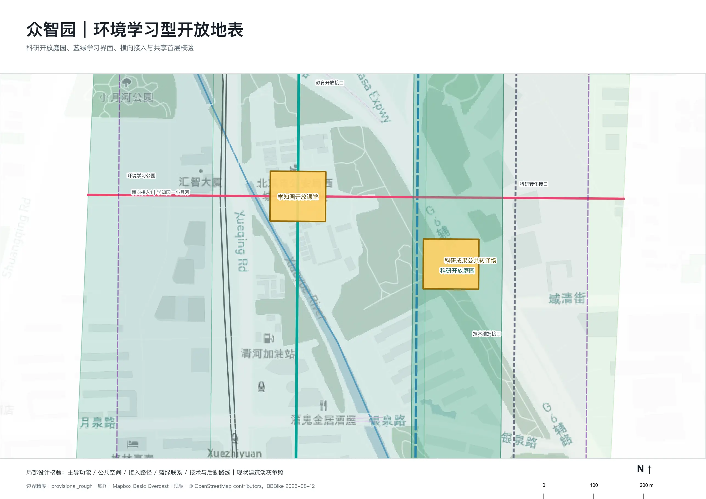

*QGIS核验：众智园现状建筑以淡灰定位，站园河主链、公共首层与生态缓冲在真实底图上表达。*

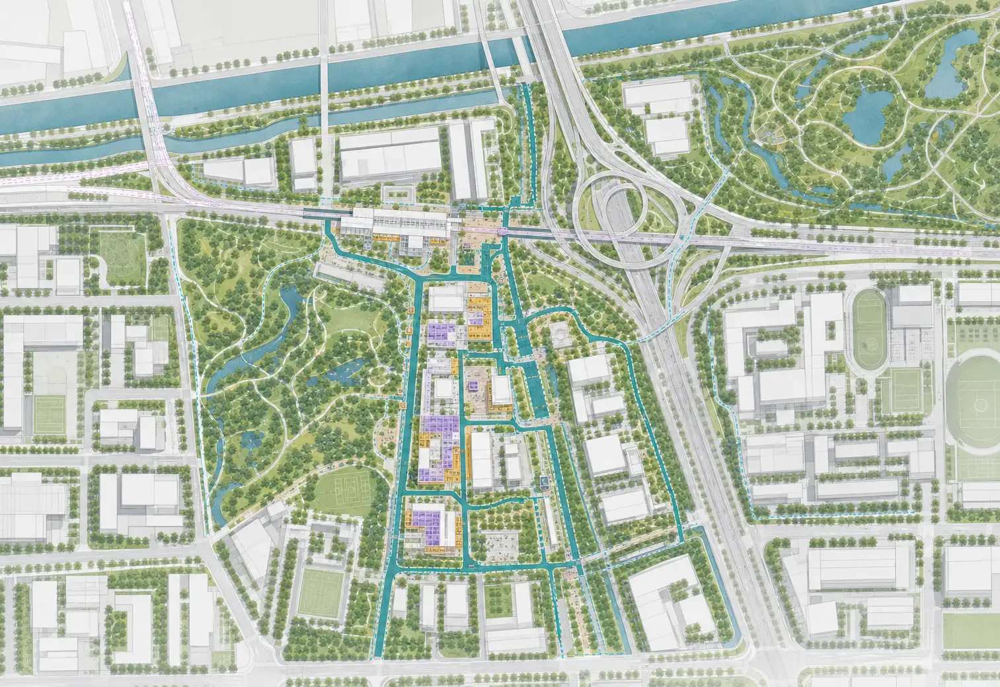

*众智园平面：站园河主链连接潜在站点接入、园区公共首层、环境学习场与河岸生态课堂，备选慢行、蓝绿缓冲和维护路线分别组织。*

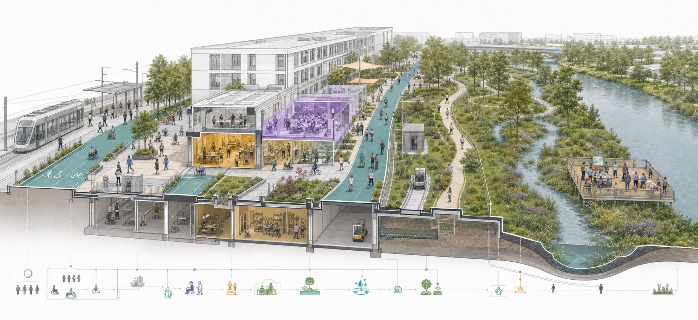

*众智园关键剖面：潜在站点接入、公共首层、共享前场、慢行主路径、设备维护路线、生态缓冲与河岸学习空间沿连续地表展开。*

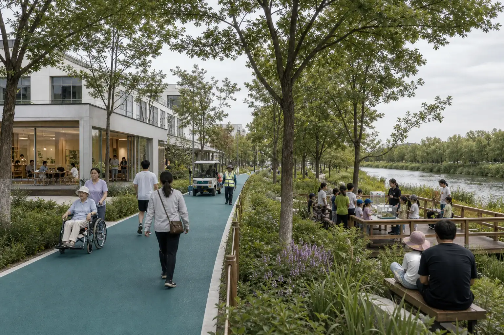

*众智园河岸环境学习：儿童与照护者、轮椅使用者、研究人员和维护人员共享河岸步道、树荫平台与园区公共首层，环境课程位于生态缓冲外侧。*

### 5.2 北京AI原点社区：知识编译与公共AI

AI原点以学院桥横向接入、机构公共首层群、共享前场和社区路径构成开放网络。每个机构明确公共入口、夜间可连续使用的外部路径和可独立运营的首层；公园与街道承担跨机构活动和日常停留。公共首层集中城市模型室、公共AI与人工服务、开放课程、研究成果解释、共同制作、社区咨询和基本生活服务，受控科研区保持独立安防、物流和消防边界。

学院桥两侧入口、过街、骑行停放和无障碍链形成连续接入，活动前场与街道绿地共同改善遮阴和停留。公共城市模型公开数据来源、假设、版本和负责人；空间预测、可重组模块与具身设备限定使用范围，涉及资源分配的建议由人工确认。正式深化将逐栋核实产权、现状使用、消防、安防、开放时段、知识许可、公益额度和后勤组织。

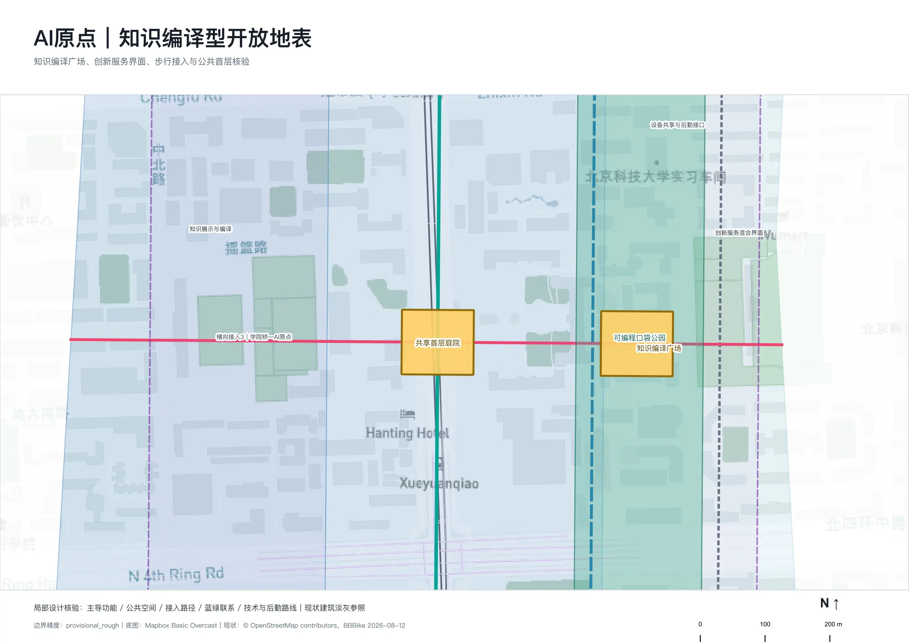

*QGIS核验：AI原点公共知识街、机构首层群与后勤环在真实底图上表达。*

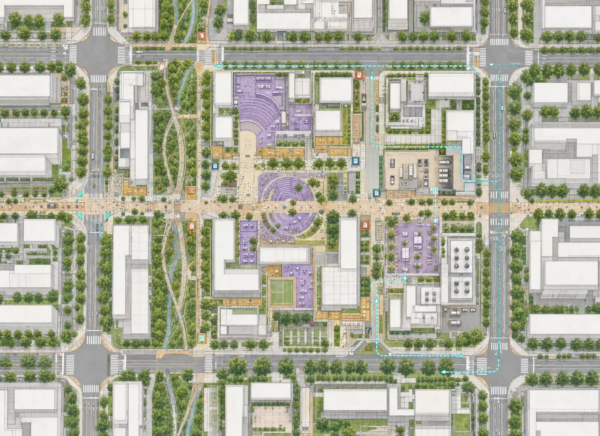

*AI原点平面：东西向知识街、南北夜间路径、公共前场与外围后勤环共同组织，机构首层形成清晰的开放梯度。*

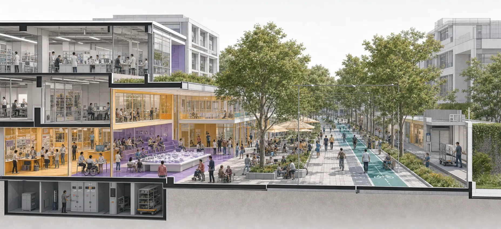

*AI原点关键剖面：受控研究区通过独立安防与物流边界连接开放首层；城市模型室、公共AI与人工服务、共享前场、知识街、骑行和后勤路线在地面层分区叠合。*

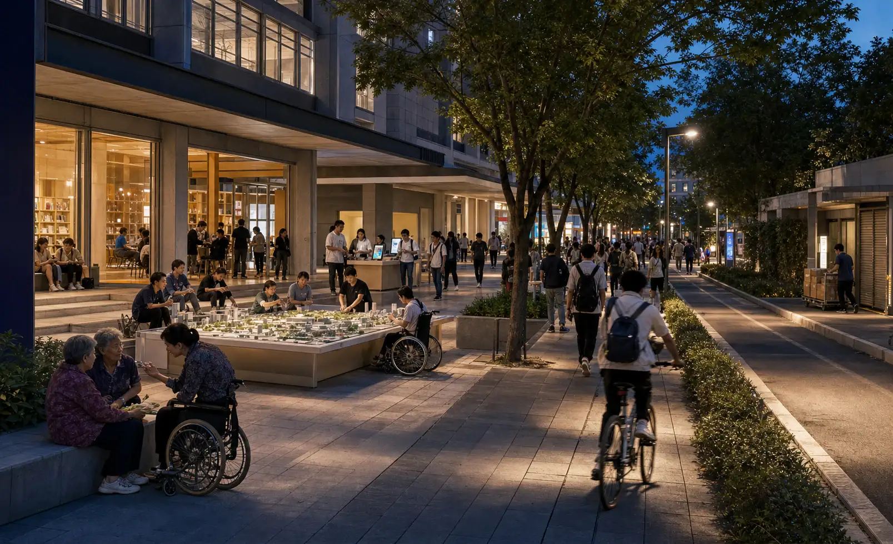

*AI原点夜间场景：可独立运营的公共首层与共享前场承载城市模型讲解、社区咨询、开放课程和日常停留，人工服务与无障碍席位持续可用。*

### 5.3 大钟寺AI产业聚集区：高流动公共服务编排

大钟寺以站点周边四个方向的潜在接入为框架，沿知春路—大钟寺—蓟门桥组织连续步行、骑行和无障碍接续，并把铁路遗产空间、成熟社区、商业与高校首层纳入同一公共服务网络。四方向前场承担换乘导向、休息、人工咨询和应急服务；沿线商业及机构首层组合就业服务、社区健康文化、学习会议、公共AI与人工服务、共享设备和基本生活功能。

街道绿地、口袋空间和首层前场共同形成高客流停留节点。客流与服务容量模型用于导向和资源调度，共享物流与机器人采用分时低速路线并与主要人流分离。现阶段图纸聚焦四方向潜在接入、连续骑行、社区备选路径和铁路边缘公共空间；正式重点区范围、站口道路、权属、客流、轨道安全与跨线工程资料到位后，平面和指标进入下一轮校准。

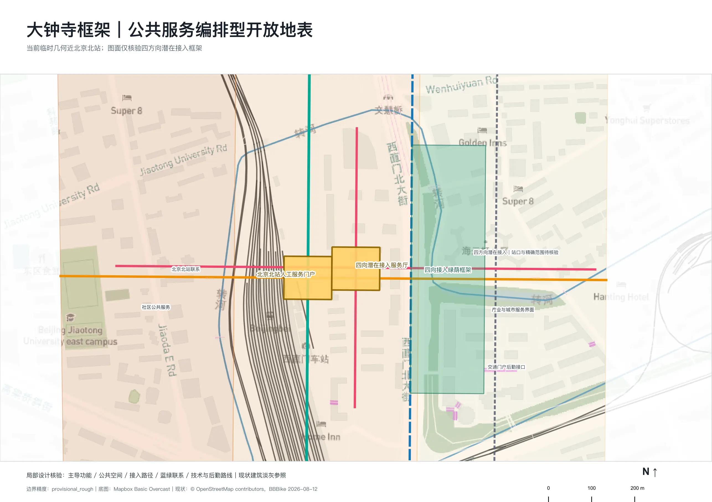

*QGIS核验：大钟寺只表达四方向潜在接入框架，不确认站口；正式范围到位后重绘。*

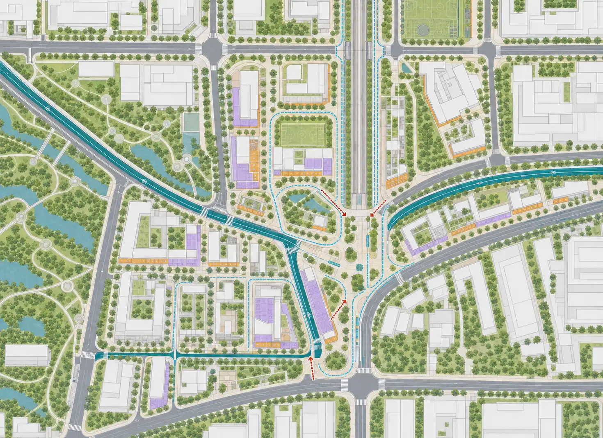

*大钟寺平面：建筑屋顶轮廓、道路、水系和铁路构成平面参照，四向潜在接入、知春路沿线公共路径、社区备选路径与三处公共服务空间连接社区、机构首层、铁路遗产景观和蓟门桥方向。虚线箭头表示待核实的潜在接入方向。*

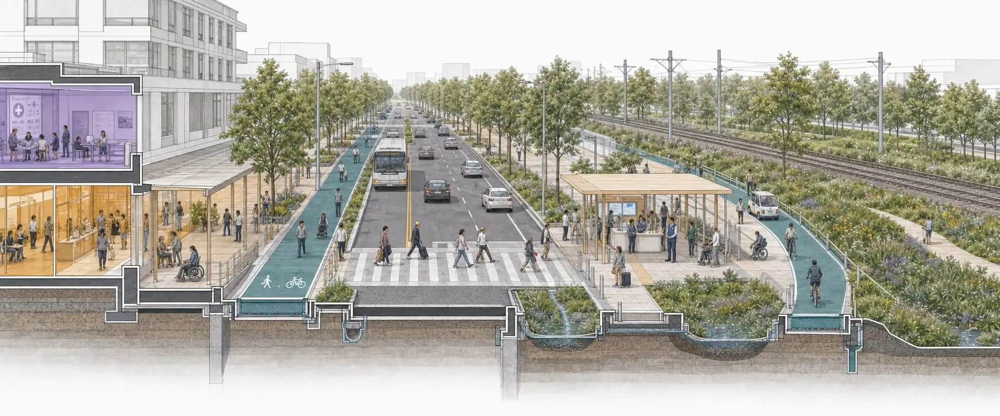

*大钟寺关键剖面：社区和商业公共首层、服务前场、机动车道路、安全过街、连续步行骑行、潜在接入前场与铁路遗产绿带形成横向次序。*

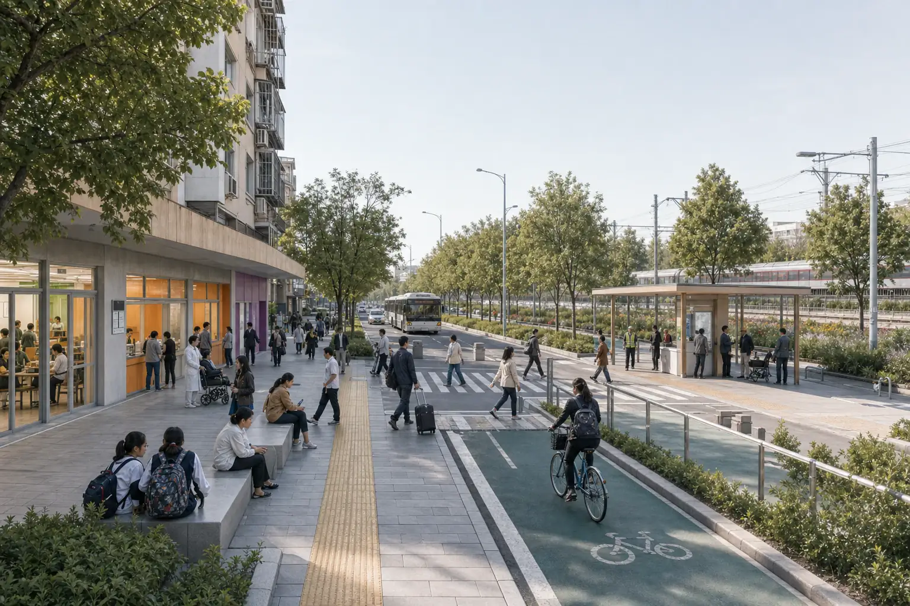

*大钟寺公共服务前场：社区健康与就业咨询、休息等候、无障碍过街、连续骑行和铁路边缘步行空间在街道节点叠合。*

### 5.4 三个重点区的共同标准与差异成果

| 重点区 | 核心公共界面 | 关键剖面关系 | 代表性公共生活 | 首期项目 |
|---|---|---|---|---|
| 众智园 | 站点—园区首层—公园—河岸 | 研发边界—公共首层—共享前场—生态缓冲 | 环境课程、低速共测、河岸健康和维护学习 | 主备慢行、公共门厅、河岸课堂、维护接口 |
| AI原点 | 学院桥—公共知识街—机构首层群 | 受控研究—公共首层—前场—街道 | 模型审议、开放课程、共同制作和社区服务 | 夜间入口、城市模型室、共享前场、后勤环 |
| 大钟寺 | 四方向潜在接入—社区商业首层—铁路边缘 | 社区首层—街道—接入前场—遗产绿带 | 换乘协助、就业学习、健康文化和人工服务 | 连续骑行、无障碍过街、服务前场、社区入口 |

三个重点区共同满足基础通行、休息卫生、独立运营公共首层、室外共享空间、人工服务和设备后勤接口；各区根据资源与人群形成完全不同的平面、剖面和场景，避免以同一空间模板覆盖南北差异。

## AI 创新生态、人才画像与 AI+ 场景

开源地表把创新生态组织为“问题提出—研究与模型—测试验证—成果转译—公共采用—反馈修正”的持续回路。高校院所开放问题说明、课程和可分享成果；企业提供合规测试能力、服务接口和维护支持；社区及公共部门提出真实城市问题并参与评估；公共空间提供低门槛体验、人工服务和退出渠道；运营平台记录开放时段、使用、故障、申诉与公共回馈。[source:SRC-AGENT-TASKBOOK]

### 6.1 六类使用者

| 使用者 | 日常需求 | 空间与服务响应 | 公共保障 |
|---|---|---|---|
| 高校研究者与教师 | 跨机构协作、成果解释、真实问题 | 开放课程、模型论坛、预约工坊 | 成果许可、专业责任、人工复核 |
| 学生、开发者与初创团队 | 低成本协作、测试、发布与声誉 | 夜间公共首层、共测场、工具和发布空间 | 公益时段、培训、退出与失败记录 |
| 企业员工与产业服务人员 | 通勤、展示、招聘、法务与供应链服务 | 站点前场、公共会客、就业和企业服务 | 基础公共服务获得稳定空间与时段 |
| 周边居民与照护者 | 通行、健康、教育、维修与社区活动 | 十五分钟开放单元、人工服务、社区前场 | 线下渠道和普通免注册使用 |
| 儿童、老人和残障人士 | 无障碍、安全、休息、陪伴与低认知负担 | 连续无障碍、休息卫生、简明导向、陪同路径 | 技术停用后由人工和固定设施接续 |
| 访客、通勤者与国际人才 | 换乘、短时停留、理解场地与获得服务 | 多语导向、铁路文化、行李辅助、公共活动 | 个人信息采集遵循最小范围 |

### 6.2 十二个AI+公共生活场景

| 场景 | 主要位置 | 空间配置 | 运营与安全 |
|---|---|---|---|
| 具身系统低速共测 | 众智园园区—公园缓冲带 | 独立低速路线、观察点、物理停机区 | 现场安全员、分时运行、事件记录 |
| 蓝绿自适应维护 | 小月河与公园 | 环境传感、灌溉、遮阴和维护接口 | 人工维护计划优先，洪水与生态敏感期采用固定模式 |
| 公共城市模型审议 | AI原点公共首层 | 可解释模型桌、资料墙、讨论席和人工服务 | 公开数据来源、假设、版本与负责人 |
| 公共AI与人工服务 | AI原点知识街 | 数字查询、人工柜台、私密咨询与等候 | 人工渠道持续，服务结果提供更正与申诉 |
| 开源成果编译课程 | AI原点共享前场 | 课程、成果解释、社区议题与移动设施 | 内容责任人审核，明确知识许可 |
| 共享机器人末端交接 | 机构边缘和后勤环 | 低速路线、交接点、储充和维修 | 与无障碍主线分离，人工完成最终交接 |
| 四方向换乘协助 | 大钟寺周边潜在接入 | 固定导向、人工服务、休息与辅助设备 | 使用聚合客流和主动求助信息 |
| 就业与终身学习客厅 | 大钟寺社区公共首层 | 企业服务、学习会议、人工顾问和社区课程 | 机会推荐保留人工复核与解释 |
| 健康文化日常站 | 大钟寺社区前场 | 健康转介、文化活动、休息和照护支持 | 专业机构负责，隐私信息分区管理 |
| 京张遗产知识路线 | 全线遗产公园与门户 | 历史节点、口述档案、课程和多语导向 | 史实、作者和版权信息随内容发布 |
| 无障碍动态导向 | 五条横向接入带 | 固定导向、设施状态、人工协助和反馈点 | 固定系统与人工服务共同接续 |
| 城市问题开放清单 | 各十五分钟开放单元 | 问题登记、项目状态、研究匹配和社区讨论 | 代表性审核、紧急转介、公开关闭与申诉 |

其中具身系统低速共测、蓝绿自适应维护、公共城市模型审议和共享机器人末端交接形成产业测试验证场景。所有场景采用“问题登记—范围限定—试运行—公开评估—修改、扩展或退出”的流程，并在物理空间中设置人工服务、停机和恢复方式。

### 6.3 文化识别与长期吸引力

开源地表的文化识别来自铁路轨枕的连续节奏、开放边界和可插接端口。京张百年知识里程沿遗产公园记录铁路工程、校园科学、社区记忆和开源贡献；AI原点公共模型厅把城市模型的来源、假设、版本、争议和人工负责人置于公共首层；众智园地表学习台以河岸环境、具身测试和维护记录展示“城市如何学习”。三处节点共同构成可持续更新的知识地标，普通通行、休息、课程和社区活动构成其日常底层。

## 用地、建筑规模与拆改留方案

总体用地采用七类概念分类：铁路遗产与公园、蓝绿生态、公共服务与开放首层、创新研发、混合生活服务、交通市政和待核实控制区。空间供给优先利用既有公园、街道、前场、首层和院落边缘，通过开放责任与功能转换提高公共使用；新增建设依据正式控规、权属、结构与市政条件进一步研究。[source:SRC-MNR-LAND-USE]

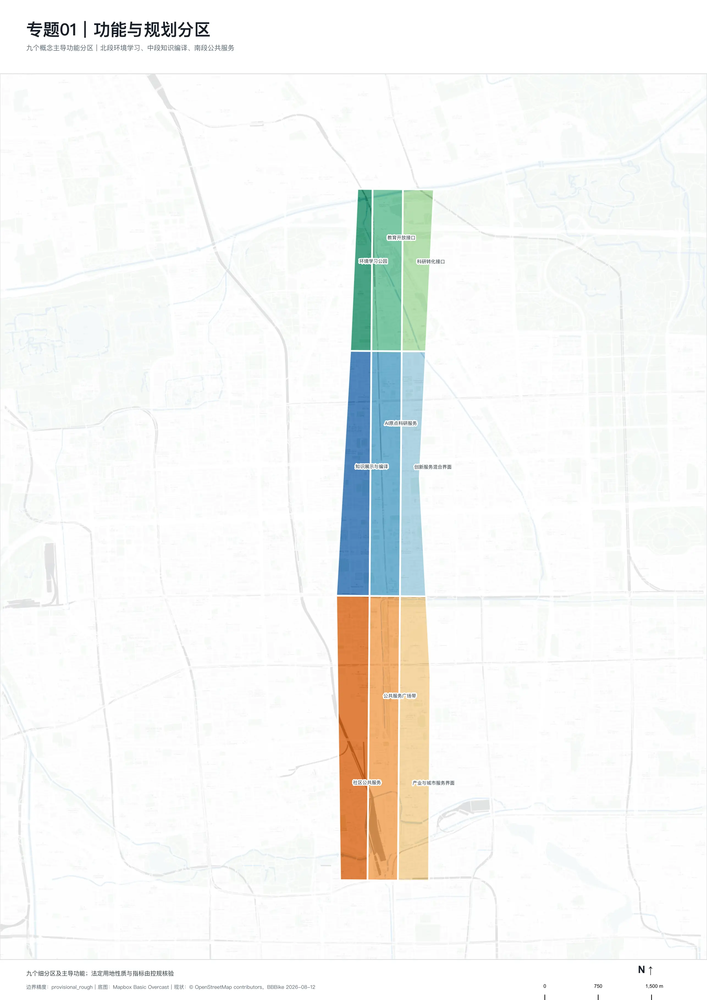

*QGIS核验：九个功能分区沿走廊组织，功能名称、代码与几何南北位置一致。*

| 用地系统 | 总体布局 | 设计控制 |
|---|---|---|
| 铁路遗产与公园 | 沿京张线形成南北连续公共基底 | 保留铁路工程线索、公共慢行、开放视廊和文化节点 |
| 蓝绿生态 | 小月河、铁路绿带、校园园区绿地、街道雨水空间串联 | 生态缓冲、雨洪高程、遮阴、生境与维护通道共同确定 |
| 公共服务与开放首层 | 集中在五条横向接入带、站点前场和社区入口 | 独立入口、稳定时段、基础服务、无障碍和人工值守 |
| 创新研发 | 维持高校、科研和企业专业空间 | 通过公共前场、课程、模型和受控设施接口连接城市 |
| 混合生活服务 | 南部成熟社区、中部站点与机构边缘 | 组合就业、健康、餐饮、学习、照护和夜间活动 |
| 交通市政 | 站点、道路、骑行、后勤和设备接口 | 主备路径、分时物流、消防和维护空间清晰分区 |
| 待核实控制区 | 边界、站口、跨线、河道及权属条件待专项确认位置 | 保留多方案和可逆项目，资料到位后进入精确控制 |

建筑按保留使用、适应性改造、公共首层转换、待专业评估四类建立清单。具有铁路、工业、校园或社区记忆价值的建筑与构筑物优先保留并进入日常服务；沿主路径的首层优先配置门厅、学习、健康、工具维修、展示与人工服务；设备、物流、储充和垃圾房沿后勤界面独立组织。

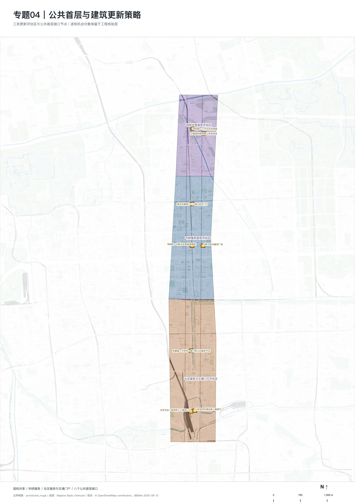

*QGIS核验：公共首层机会、建筑更新策略与三个重点区的接口位置沿同一底图表达。*

| 建筑类别 | 判断依据 | 设计动作 | 下一步资料 |
|---|---|---|---|
| 保留使用 | 使用稳定、结构适宜、文化或社区价值明确 | 改善入口、无障碍、导向和外部公共空间 | 产权、现状使用、消防和历史价值 |
| 适应性改造 | 空间可转换、位置连接公共地表 | 植入课程、健康、工具、展陈、社区与企业服务 | 结构、设备、消防、安防和运营主体 |
| 公共首层转换 | 位于接入带和公共空间交汇位置 | 独立入口、共享前场、夜间时段和后勤分流 | 首层面积、门槛、开放协议和公益额度 |
| 待专业评估 | 建筑质量、使用效率或工程条件尚待调查 | 保留多种拆改留路径 | 测绘、鉴定、权属、控规和经济评估 |

当前资料支持建筑类型和优先级判断。总建筑规模、容积率、高度、密度、退线和逐栋拆改量将在正式边界、法定控规、现状测绘、结构鉴定和权属调查后复算。体量控制重点保护铁路遗产空间尺度、河岸风环境与日照，形成连续、可识别的公共首层界面。

## 交通、轨道、市政与公共服务设施

交通系统由南北公共基底、平行接续线和五条横向接入带组成主备网络，优先修复站点—社区—高校—园区—河岸间的真实步行骑行链。评价单位从直线服务半径转向完整出行链，逐段核对入口、过街等待、坡度、遮阴、照明、停放、维修、夜间连续和人工导向。[depth:transport_municipal_facilities]

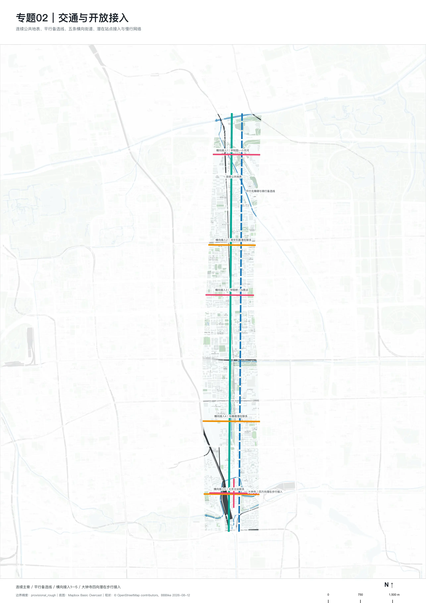

*QGIS核验：站点接续、步行骑行、无障碍与五条横向接入在统一底图上表达。*

| 出行链 | 主路径要求 | 备选与冲突控制 | 专项核实条件 |
|---|---|---|---|
| 站点—公共首层 | 最短可理解路径连接站前服务、无障碍过街和公共入口 | 高峰分流、夜间可见路径、人工导向 | 站口、开放时段、客流、坡度、过街等待 |
| 社区—遗产公园 | 多入口步行与骑行接入 | 平行街道备选，学校与居住入口错峰 | 社区入口、权属、停车、夜间安全 |
| 园区—河岸 | 园区公共门厅连接河岸安全慢行和停留点 | 维护路线与公众路径分离，洪水期采用高位路径 | 河道、防洪、生态缓冲、园区开放 |
| 配送—设备接口 | 建筑背侧或公共前场边缘分时低速接入 | 高峰和活动时段暂停，与无障碍主链分离 | 装卸容量、消防、噪声、保险和管理责任 |

轨道站点周边采用四方向潜在接入和地面公共前场框架，站口、跨线、上盖、净空和施工组织由专项资料确定。机动车、配送和机器人运行采用分时、分区和低速管理；共享机器人使用独立路线和交接点，主要步行流线与无障碍通道保持完整。

市政与技术设施形成“公共基础设施＋可关闭技术模块”两层。基础层包括给排水、供电、照明、消防、通信、环卫、卫生间、饮水、遮阴和应急；技术层包括环境感知、端侧算力、储充、机器人停靠、可变设施和城市模型接口。设备位于公共前场边缘或建筑后勤侧，消防、无障碍和生态缓冲获得完整空间。分布式能源、余热利用、河道工程和新增通信设施依据容量、产权、安全与运维专项推进。

*QGIS核验：技术后勤走廊、设备接口与市政基础在统一底图上分区组织。*

公共服务按五、十、十五分钟梯度组织，并由人工与数字入口共同提供。站点前场配置导向、求助、休息、卫生和行李辅助；公共首层提供健康、就业、教育、维修和照护；协作层提供开放课程、工坊、城市模型和专业设施。服务目录同步说明时段、容量、公益额度、责任人、故障状态和投诉渠道。

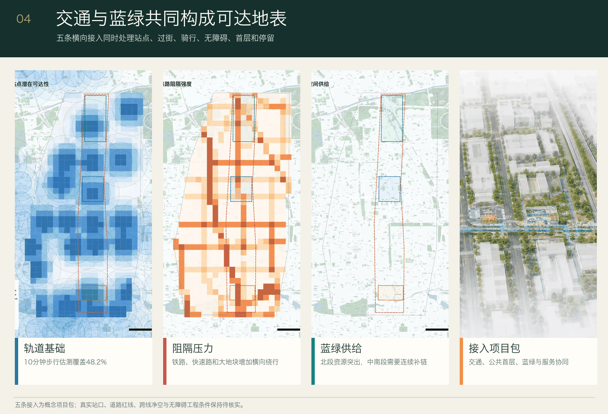

*专项系统索引：站点接续、步行骑行、公共首层、蓝绿网络、市政基础与技术后勤在同一空间中复合组织；具体关系由总体平面、重点区平面和专项表格共同说明。*

## 蓝绿空间、公共空间与城市风貌

小月河、京张铁路遗产公园、校园园区绿地、街道树阵、雨水花园和口袋空间共同构成蓝绿系统。北段强化河岸生境、雨洪与环境学习；中段借校园园区绿地与街道树阵补足连续遮阴；南段以社区前场、平行街道和铁路边缘形成小尺度接续。河岸活动设置高位备选路径、生态缓冲、季节性运行和维护通道。[depth:public_space_bluegreen_character]

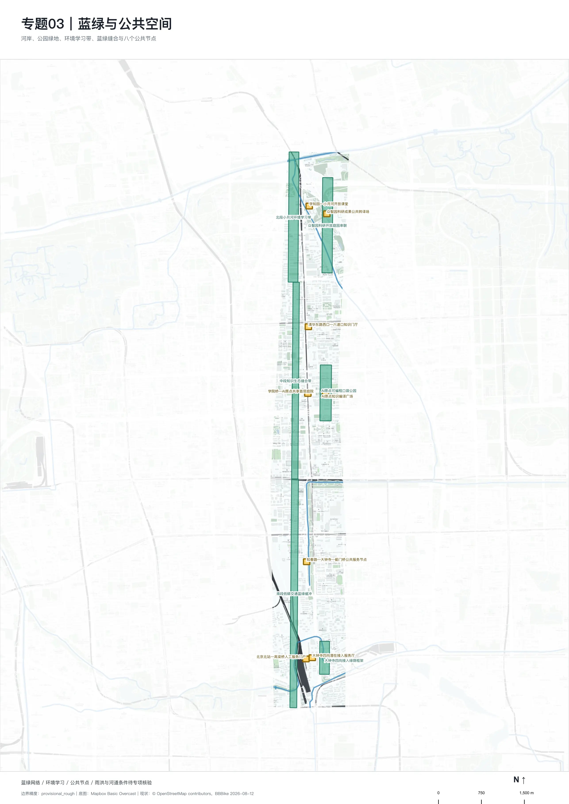

*QGIS核验：小月河、铁路遗产公园、校园园区绿地与街道雨水空间沿同一底图串联。*

| 蓝绿对象 | 空间后果 | 知识与公共用途 | 工程和维护条件 |
|---|---|---|---|
| 小月河及沿岸 | 生态缓冲保持连续，慢行位于安全高程，课程平台避让敏感区域 | 环境监测解释、季节课程、社区健康和问题登记 | 河道范围、防洪高程、生境、亲水安全和维护责任 |
| 铁路遗产公园 | 连续林荫路径连接横向街道，保留铁路线索和开敞视廊 | 铁路工程史、城市扩展、日常运动与休息 | 遗产线位、管理边界、植被和设施维护 |
| 街道与共享前场 | 雨水花园、遮阴、座椅和安全过街共同组织停留 | 热舒适解释、社区活动、机构成果外溢 | 地下管线、交通视距、排水、消防与无障碍 |
| 屋面和院落边缘 | 承担蓄排、降温和生境补充 | 机构课程、维护培训和长期监测 | 结构、排水、消防、安防与养护经费 |

公共空间采用“遗产公园＋横向街道＋机构前场＋公共首层”的加厚结构。每处重点单元提供全天候无障碍链、基础休息卫生、独立运营公共首层、室外共享空间、设备后勤接口和清晰关闭线。未来AI设施采用低侵入、可解释、可停机、可替换的方式，普通通行、交往、儿童与照护活动始终占据空间主体。

城市风貌以铁路遗产材料和线性秩序为基础，通过连续树阵、可识别入口、透明首层、克制夜景、整合屋顶设备和清晰的公共—受控边界形成共同语言。京张铁路工程史、中关村创新史和公共AI伦理构成知识路线，导视同时呈现历史事件、当前空间状态、开放责任和知识来源，并提供中文、英文、简明图形与非视觉提示。

## 更新项目清单、实施政策与分期计划

实施从低工程依赖、可快速建立公共收益的项目开始，逐步进入跨机构协作和结构性工程。边界开放、首层转换、过街改善、公共前场、导向、环境课程和人工服务构成近期项目；五条横向接入带、完整重点区、共享设备和公共模型进入成长阶段；跨线、河道、结构改造和全线运营平台依据专项条件进入长期实施。[data:geometry/phasing.geojson#PHASE-001]

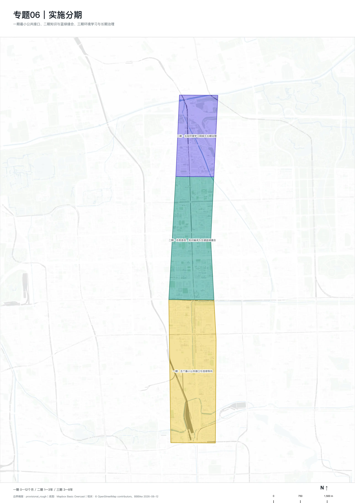

*QGIS核验：近期、成长、长期三期项目包沿走廊布局，依赖条件与范围保持一致。*

| 阶段 | 项目包 | 直接成果 | 依赖条件 |
|---|---|---|---|
| 近期：最低可用地表 | 三个优先重点空间单元、基础导向与无障碍、首批公共首层、河岸课程、人工服务与开放台账 | 建立可到达、可使用、可反馈的样板 | 入口、时段、消防、安防、河道和运营主体 |
| 成长：多单元协作 | 五条横向接入带、十五分钟开放单元、三个重点区完整项目包、共享设备与公共模型 | 形成跨机构服务和场景网络 | 多主体协议、维护经费、数据与专业审查 |
| 长期：持续更新 | 全线版本治理、遗产知识路线、指标后评估、成熟项目扩展与低效项目退出 | 形成持续学习的公共地表 | 长期运营平台、公众监督、年度审计与法定衔接 |

每个地表协议单元建立“空间开放协议＋数据模型协议＋运营维护协议”。空间协议明确入口、时段、容量、消防安防与关闭线；数据协议明确来源、最小化、访问、日志、纠错和删除；运营协议明确责任人、公益额度、维护经费、投诉和退出。项目准入同时审查公共收益、基础服务、技术停用、专业责任和恢复成本。

治理结构由公共协调、专业审查、机构运营、社区代表和独立评估共同组成。AI系统辅助问题归类、方案生成、运行预测与后评估；空间取舍、公共资源配置和权利影响由相应专业与公共主体共同决策。年度公开报告记录开放时长、无障碍可用、服务人次、故障、投诉、能耗、维护和退出项目。

长期活动形成四季节律：春季发布城市问题和开放课程；夏季开展河岸学习、环境维护与低速共测；秋季以京张开放知识周连接高校、企业、社区和国际来访；冬季公开模型、故障、投诉、修复与退出记录。活动路线覆盖三个重点区和五条横向接入带，基础公共服务在全年持续运行。开发者社区通过开放议题、课程、工具、空间预约、失败档案和公共贡献记录形成稳定协作；“城市中试”作为局部场景的试运行方法，在限定范围和时段内开展。

## 指标体系、面积复算与合规矩阵

指标分为现状证据、设计供给和运营绩效三类。现状证据解释为什么选择某处介入，设计供给检验空间是否具备最低公共能力，运营绩效判断公共收益能否持续。指标与图件使用同一范围和同一空间对象，正式边界与专项资料更新后按同一坐标系复算。[depth:metrics_recalculation]

| 指标组 | 当前基线或方向 | 设计含义 | 复核方式 |
|---|---|---|---|
| 范围与层级 | 公告约43.6平方公里统筹研究、约11.4平方公里总体设计、三处重点区 | 控制三层工作范围与成果深度 | 正式范围到位后以EPSG:4548统一复算 |
| 轨道与生活圈 | 中位站点距离约606米；10分钟步行约48.2%，15分钟约78.6%，5分钟骑行约85.5% | 确定横向接入和真实入口的优先级 | 现场步测、入口、等待、坡度与开放时段校正 |
| 蓝绿与建筑 | 研究网格绿地约13.2%、蓝水约0.7%、建筑覆盖约17.8% | 支撑三段差异、遮阴、蓝绿补链和首层选点 | 正式用地、现状测绘与河道资料复算 |
| 重点区差异 | 众智园蓝绿基础较好；AI原点创新服务集中；大钟寺承担高流动公共服务 | 确定环境学习、知识编译、服务编排三类原型 | 重点区正式范围与地块资料到位后复算 |
| 公共地表供给 | 公共入口、无障碍链、公共首层、室外空间、设备接口、人工服务 | 检验每个开放单元的最低可用状态 | 按重点空间单元逐项测绘与验收 |
| 运营绩效 | 开放时长、公益额度、使用、故障、投诉、修复、退出 | 判断公共收益与维护能力 | 建成运营后按单元年度公开 |

面积和规模采用“来源—时间—范围—方法—状态”五项记录。可由现状数据稳定复算的指标进入基线，依赖正式边界、法定控规、权属、建筑质量和工程条件的指标进入待核实清单。总体设计进一步建立任务—正文—图件—空间对象—指标的对应关系，使产业研究、城市设计、重点区详细设计和实施评估使用同一套判断。

公共收益采用六项核心指标：开放入口和稳定时段增加，真实步行与无障碍链缩短，公共首层与基础服务覆盖扩大，蓝绿与热舒适改善，城市问题进入研究和公共服务的数量增加，故障、投诉、修复和退出过程可被公众查询。专业团队可在正式资料到位后为每项指标设定基线、目标值和年度评估方式。

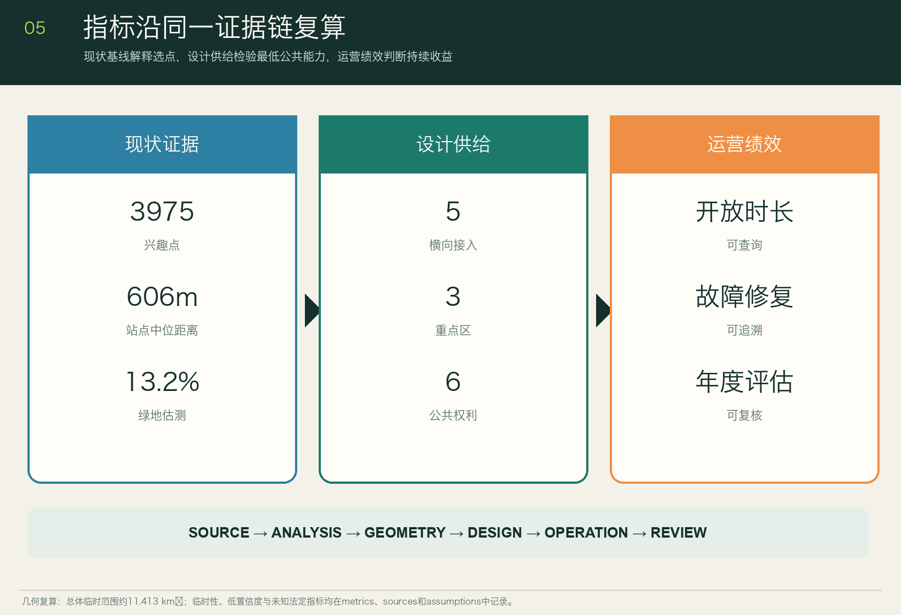

*指标证据索引：现状基线、设计供给和运营绩效分别对应场地分析、空间图件和年度评估，正式资料更新时沿相同证据链复算。*

## 风险、版权与合规说明

当前成果定位为城市设计概念与实施框架，精度支持空间结构、优先级、重点区原型和实施条件判断。正式边界、法定控规、站口道路、权属、逐栋建筑、河道防洪、市政容量、投资和跨线工程资料到位后，方案进入地块、工程与建设决策层面的深化。[depth:risk_missing_data]

| 关键条件 | 当前表达 | 后续工作 |
|---|---|---|
| 临时边界与大钟寺范围 | 总体结构采用临时研究范围；大钟寺表达四方向潜在接入框架 | 正式范围到位后重绘平面并复算指标 |
| 站口、权属与跨线条件 | 图纸保留潜在接入方向和地面改善路径 | 核实轨道、道路、铁路、产权、净空和施工条件 |
| 建筑首层、消防安防 | 以开放类型、入口和功能组合表达 | 逐栋测绘、鉴定、消防安防审查与运营协商 |
| 河道、雨洪和生态 | 设置生态缓冲、高位备选和季节性运行 | 水务、防洪、生境、亲水安全与维护专项 |
| 数据与模型权利 | 最小化、聚合、分级访问、人工复核、删除与申诉 | 个人、医疗、交通安全和专业决策场景开展专项审查 |
| 技术依赖与维护 | 基础公共服务独立运行，设备具备停机、替换和恢复方式 | 明确维护主体、经费、备件和故障响应 |
| 公共性与商业平衡 | 公益时段、基础服务和公共回馈进入开放协议 | 年度评估开放时长、可达性、基础服务和使用公平 |

案例图片、规划图和照片直接回溯作者、发布机构、原始文件页与开放许可。QGIS分析图使用OpenStreetMap ODbL背景数据，记录获取日期、处理方法和署名；案例图片依照CC BY-SA 4.0、CC BY 4.0、CC0 1.0或Open Government Licence v3.0的具体条件使用。方案概念图由项目团队生成并以QGIS现状地图作为空间约束，图注明确其概念设计属性。

现状估测用于方案比较和空间选点；案例事实由原始官方、公共机构、大学、审计或同行评审资料支持；空间、政策、活动和运营安排属于可供专业团队深化研究的概念建议。来源边界与待核实条件紧邻相应判断表达，使读者能够区分现状事实、分析推断、案例证据和设计提案。

## 参考资料

1. 北京市规划和自然资源委员会海淀分局：《[百年京张AI创新带城市设计国际方案征集资格预审公告](https://ghzrzyw.beijing.gov.cn/zhengwuxinxi/tzgg/hd/202605/t20260509_4643047.html)》，2026。[source:SRC-OFFICIAL-ANNOUNCEMENT]
2. 百年京张AI创新带面向智能体任务书、正式投稿指南与公开场地资料。[source:SRC-AGENT-TASKBOOK]
3. OpenStreetMap contributors：北京开放地图数据；[BBBike北京摘录](https://download.bbbike.org/osm/bbbike/Beijing/Beijing.osm.pbf)，文件时间2026-08-08，本地获取日期2026-08-12；[Open Database License 1.0](https://opendatacommons.org/licenses/odbl/1-0/)。[source:SRC-OSM-BBBIKE-20260812]
4. King’s Cross：[项目运营方](https://www.kingscross.co.uk/about-the-development)；[Camden Council](https://www.camden.gov.uk/kings-cross-central)；Greater London Authority，[Opportunity Area Portrait: King’s Cross](https://data.london.gov.uk/dataset/opportunity-area-pen-portraits-emxwg)，2025。
5. Paris Rive Gauche：[SEMAPA项目资料](https://www.semapa.fr/paris-rive-gauche/)；Cour des comptes，[Paris Rive Gauche与SEMAPA审计报告](https://www.ccomptes.fr/sites/default/files/2023-10/IDR2022-33.pdf)，审计期2012—2019。
6. 杨浦滨江：上海市杨浦区人民政府，[杨浦滨江老工业区城市更新](https://www.shyp.gov.cn/shypq/shxd-db/20240510/454601.html)；Wu, Y. 与 Liu, Y.，[Transforming Industrial Waterfronts into Inclusive Landscapes](https://doi.org/10.3390/su15065060)，*Sustainability* 15(6):5060，2023。
7. 创智天地：瑞安新天地，[上海创智天地](https://www.xintiandi.com/project/kic-shanghai/)；上海市杨浦区人民政府，[创智天地二十年发展](https://www.shyp.gov.cn/shypq/xwzx-bmdt/20231222/444695.html)。
8. 22@ Barcelona：Barcelona City Council，[22@ Barcelona Innovation District 2024](https://www.barcelona.cat/internationalwelcome/sites/default/files/22%40%20Barcelona%20Innovation%20District_2024_EN.PDF)；Barcelona City Council与Barcelona Activa，[Impulsem el 22@](https://bcnroc.ajuntament.barcelona.cat/jspui/handle/11703/123349)，2020。
9. Kendall Square：MIT，[Kendall Square Initiative](https://kendallsquare.mit.edu/)与[Planning the Transformation of Kendall Square](https://kendallsquare.mit.edu/planning/)；Dávila, J.，[Spatial Qualities of Innovation Districts](http://hdl.handle.net/1721.1/81653)，MIT DUSP，2013。
10. 线性基础设施公共空间：Seoul Metropolitan Government，[Gyeongui Line Forest Park](https://english.seoul.go.kr/gyeongui-line-forest-park/)；The Bentway，[About](https://thebentway.ca/about/)；PUBLIC WORK，[The Bentway](https://publicwork.ca/projects/the-bentway?category=all)。
11. 蓝绿试验与长期治理：City of Stockholm，[Stockholm Royal Seaport](https://vaxer.stockholm/en/areas/city-development-areas/stockholm-royal-seaport/)；C40，[Stockholm Royal Seaport Good Practice](https://www.c40.org/case-studies/c40-good-practice-guides-stockholm-royal-seaport/)；深圳市城市管理和综合执法局，[桂湾公园](https://cgj.sz.gov.cn/xsmh/gysz/csgy/content/post_10775020.html)。
12. 遗产与科研园区更新：北京市国资委，[首钢集团深化改革推动转型升级](https://gzw.beijing.gov.cn/ztzl/xxgc20djs/20xxgc/202301/t20230116_2900847.html)；香港科技园公司，[香港科学园](https://www.hkstp.org/zh-cn/discover/sites/science-park)；香港规划署，[香港科学园分期和用地](https://www.pland.gov.hk/file/publications/nt_pamphlet/ebook/tp/tc/files/basic-html/page11.html)。
