# Jing-Zhang · Zhixu — The New Order of Intelligence

> **Design manifesto: turn the linear heritage of the century-old railway into the public operating system of an AI city.**

Zhixu does not paste AI onto the city. It translates the Jingzhang Railway’s legacy of connection, collaboration, and self-reliant innovation into a walkable, participatory, and governable public-space system: **one spine** (the 13km Centennial Timeline Walk), **three civic living rooms** (the Prologue Platform, the Innovation Interface, and the Four-Quadrant Lounge), and **four protocols** (sense — collaborate — govern — communicate). The proposal follows three implementation rules: public value before industry, pilots before scale, and explainability before automation. Every AI scenario must have a spatial carrier, defined users, a data boundary, human review, and an exit mechanism.

This turns the Jingzhang AI Innovation Belt from a heritage line to be viewed into an urban innovation infrastructure to be used: people can walk through history, exchange knowledge, test technologies, co-govern public space, and experience how AI improves everyday urban life.

### Spatial Experience Images: From Concept to Use

These are conceptual visualizations showing atmosphere, scale, material, and use. They are not existing-condition photographs, official renderings, or approved construction proposals.

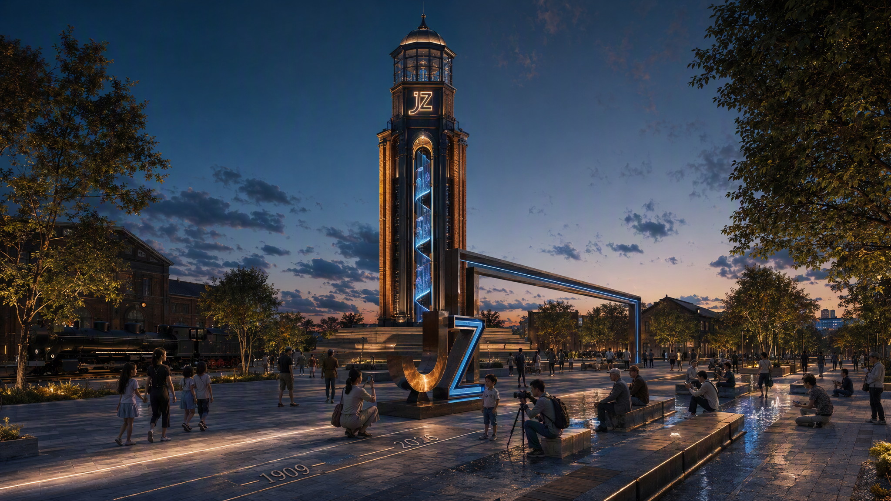

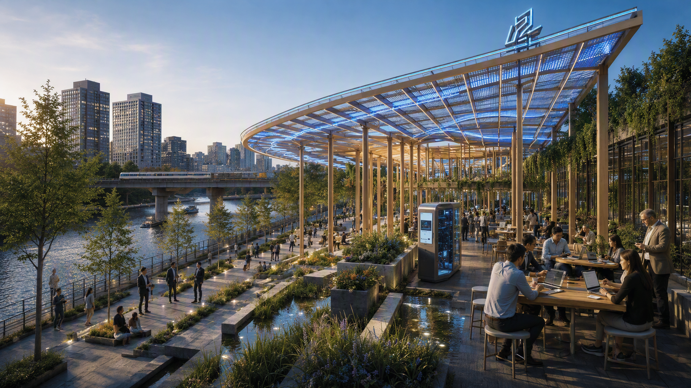

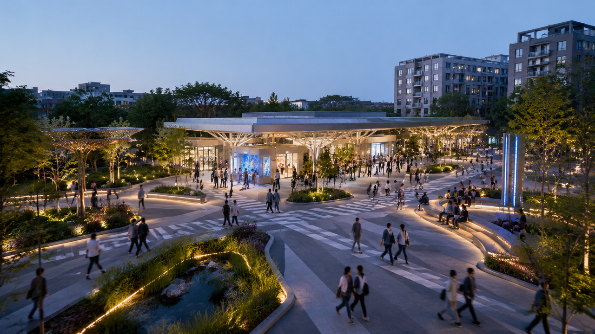

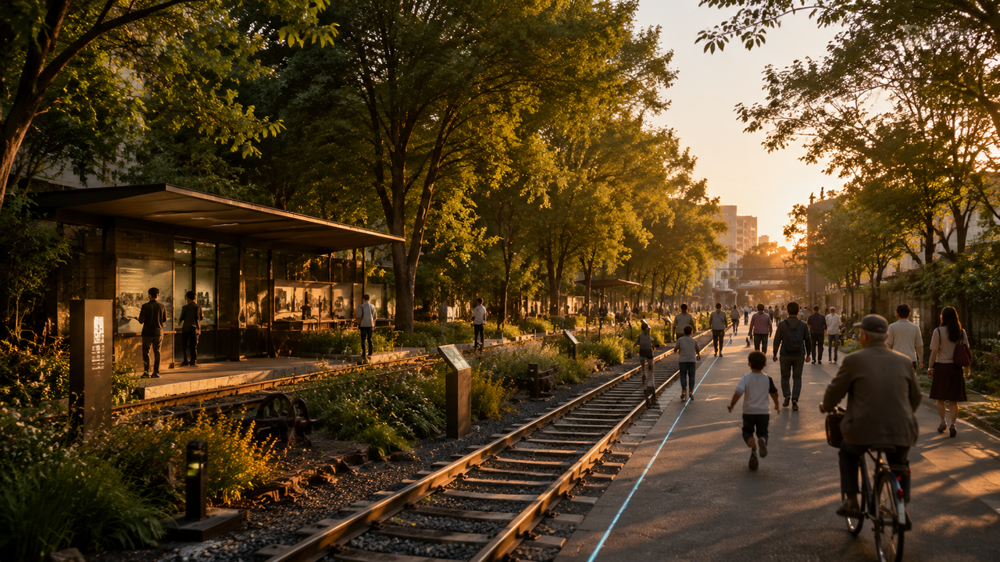

## Design Basis and Material Inventory

This formal submission is based primarily on the *Pre-Qualification Announcement for the Centennial Jing-Zhang AI Innovation Belt International Urban Design Call* published by the Haidian Sub-Bureau of the Beijing Municipal Commission of Planning and Natural Resources, and on the provisional rough boundaries, key areas, enums, metrics, and source inventory registered by maintainers in `brief/site-package/` as machine-readable evidence. Before generating the scheme, the AI agent read `design_brief.json`, `allowed_design_space.json`, `sources.json`, `enums/`, `ranges/`, `schemas/`, `data/source_registry.json`, and `data/processed/agent_fact_pack.md`, and used `project_scope_summary.csv`, `agent_task_requirements.csv`, `source_use_matrix.csv`, and `missing_data_checklist.csv` to establish the task, scope, material-use, and gap inventory. Every design judgment is decomposed into traceable sources, recomputable metrics, verifiable layers, and human-reviewable assumptions. The announcement requires the scheme to reach the urban-design depth of a Regulatory Detailed Plan (RDP) and of an Integrated Planning Implementation Plan (IPIP); narrative text therefore cannot substitute for GeoJSON layers, metric tables, the A3 booklet, the A0 boards, or the HTML presentation [source:OFFICIAL-ANNOUNCEMENT] [source:AGENT-TASKBOOK] [depth:existing_conditions_diagnosis].

The usage boundaries of the source registry are as follows [source:SOURCE-REGISTRY]:

- `data/source_registry.json` records the permitted uses of public, rights-cleared, and provisional materials.
- Current registry summary: 7 formal-ready materials, 1 background material, 1 provisional-only material.
- The agent must not upgrade background-only or provisional-only materials into official boundaries, statutory controls, formal scoring basis, or government implementation commitments.

`data/processed/agent_fact_pack.md` is the reading-navigation layer of this submission, not a new authority source [source:PROCESSED-FACT-PACK]. It helps the agent organize the three scope levels, the three key areas, the announcement tasks, agent.1–agent.6, material availability, and missing-data items into a readable scheme; factual judgments still return to the registered original materials [source:OFFICIAL-ANNOUNCEMENT] [source:AGENT-TASKBOOK], and the complete source relations are preserved in `sources.json`.

Since the official `SITE_BOUNDARY` and the three `KEY_AREA` polygons are not yet available, this scaffold generates a temporary formal package from `brief/site-package/geometry/provisional_boundaries.geojson`. The submitted `geometry/site_boundary.geojson` and `geometry/key_areas.geojson` are both marked `provisional_constraint` with `official_boundary=false`; they may be used only for scheme generation, self-checking, visualization, and design discussion — not as official redlines, approval basis, precise area basis, or statutory control conclusions. This organizer-side data gap does not itself block content scoring; once official polygons are substituted, the site boundary, key areas, land use, roads, green space, public space, buildings, phasing, and metrics must all be recomputed.

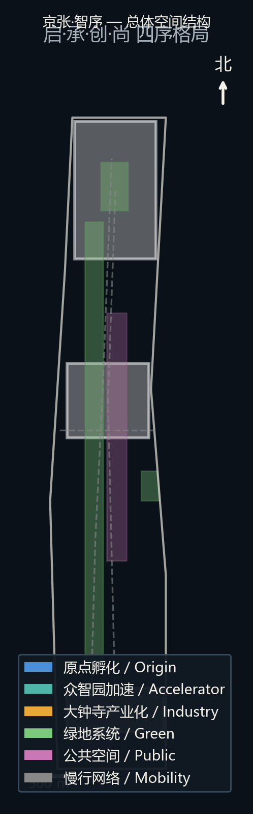

## Three-Level Scope Working Framework

The scheme follows the three levels defined by the announcement: the Coordinated Research Area (CRA, 43.6 km²) focuses on AI industry ecology, strategic positioning, innovation chains, and future urban form; the Overall Design Area (ODA, 11.4 km²) covers the urban districts and industrial areas within 1–2 km around the Jing-Zhang Railway Heritage Park and requires an overall urban-renewal framework, industrial spatial layout, transport and municipal support, and urban-character control; the Key-Area Detailed Design Area (KDA, 368.4 ha) covers three detailed-design districts and requires functional programs, building scale, demolish–renovate–retain classification, public-space connectivity, and traffic organization. All three levels are mapped item by item in `compliance_matrix.json`, ensuring that required tasks in announcement sections 1.3, 1.4, and 1.5 and agent.1–agent.6 have chapter, layer, metric, drawing, and HTML evidence [depth:three_level_scope_framework] [depth:overall_spatial_structure] [data:geometry/site_boundary.geojson#SITE-001] [data:geometry/key_areas.geojson#PROV-KEY-001] [standard:PROJECT-OFFICIAL-ANNOUNCEMENT] [source:PROCESSED-FACT-PACK].

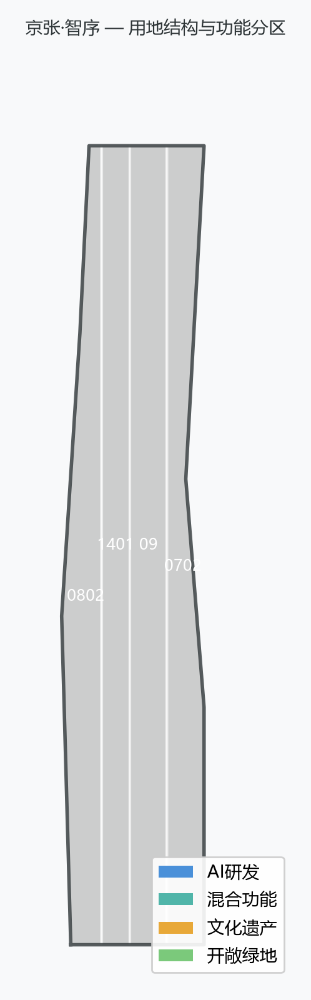

The three levels are not disconnected drawing sets. The Coordinated Research Area determines the industry-chain and urban-form judgment; the Overall Design Area translates the judgment into renewal projects, spatial structure, and facility capacity; the Key-Area Detailed Design verifies the implementability of specific plots, buildings, transport, public space, and AI application scenarios. This scheme first locks the provisional boundary and constraints, then generates land-use, building, road, green-space, public-space, phasing, and AI-service-node layers, and finally recomputes metrics from those layers; any area, ratio, scale, or project count that cannot be recomputed from structured data is not written into formal conclusions.

| Level | Design question | Scheme answer | Data anchor |
| --- | --- | --- | --- |
| Coordinated Research Area | How to organize the AI industry ecosystem and future urban form | Guided by "Zhixu": Opening → Continuation → Creation → Aspiration, forming a "One Spine, Four Orders" innovation chain | compliance_matrix.json, standard_matrix.json |
| Overall Design Area | How to map industrial space, urban renewal, transport-municipal support, and urban character | The 13km Century Timeline Walk is the spatial spine; the four orders unfold along it; land-use, building, road, green-space, public-space, and phasing layers jointly express the scheme | [data:geometry/land_use.geojson#LU-001], [data:geometry/roads.geojson#ROAD-001] |
| Key-Area Detailed Design | How to reach detailed-design depth in the three districts | Zhongzhiyuan (Creation), AI Origin Community (Creation × Continuation), Dazhongsi (Aspiration) are deepened respectively | [data:geometry/key_areas.geojson#PROV-KEY-001], [data:geometry/key_areas.geojson#PROV-KEY-002], [data:geometry/key_areas.geojson#PROV-KEY-003] |

## Overall Concept: Jing-Zhang · Zhixu

> **Master Concept: Jingzhang·ZhiXu**
>
> **AI Opens Jing-Zhang · AI Continues Jing-Zhang · AI Creates Jing-Zhang · AI Elevates Jing-Zhang**

### Concept Definition

"Zhi" is AI intelligence; "Xu" is historical sequence and a new urban order. This scheme uses AI to re-sequence a century of Jing-Zhang history and open a new urban order for the future. "Zhixu" is a homophone of the Chinese word for "order" (zhixu): the Jing-Zhang Railway once defined the order of China's railways (in 1909 Zhan Tianyou established Chinese railway standards through self-engineered construction), and AI will define a new order for the city. The character "Xu" carries three meanings simultaneously — **temporal order** (13km corridor = 117 years; walking traverses a century), **spatial order** (the industry gradient from AI Origin Community incubation → Zhongzhiyuan acceleration → Dazhongsi industrialization), and **logical order** (AI deployed in layers along the corridor: perception → cognition → service → experience).

"Xu" governs four sub-concepts that form one complete progression: **temporal origin → temporal continuation → spatial transformation → value leadership**:

| Sub-concept | Motto | Dimension | Logical role | Spatial mapping |
| --- | --- | --- | --- | --- |
| AI Opens Jing-Zhang | Opening · The Prologue | Origin | Where it starts: AI opens the prologue for Jing-Zhang | Beijing North Station origin area, first AI-infrastructure segment |
| AI Continues Jing-Zhang | Continuation · The Heritage Thread | Continuity | What tradition it inherits: Zhan Tianyou's innovation gene continues digitally | 13km Century Timeline Walk, AR heritage overlay |
| AI Creates Jing-Zhang | Creation · The New Form | Transformation | What boundaries it breaks: reshaping urban space and industry form | Zhongzhiyuan, AI Origin Community, Dazhongsi key areas |
| AI Elevates Jing-Zhang | Aspiration · The New Ethos | Leadership | What new fashion it sets: AI as the city's new aesthetics and trend | Youth co-creation plazas, smart-living showcase blocks |

The four orders are not scattered points but different dimensions of the same "Xu": Opening/Continuation/Creation form the **factual layer** (what AI does to the corridor), and Aspiration forms the **value layer** (what the corridor becomes). The scheme thereby rises from "functional renewal" to "cultural leadership," addressing the cultural-narrative and scenario-experience review dimensions.

### Naming System and Visual Identity Direction

The scheme uses “Jingzhang·ZhiXu” as the primary name and “Jingzhang·ZhiXu AI Innovation Belt” as the English name, with “ZhiXu Belt” as the short form. The naming system is organized as one spine, four orders, and three zones:

| Level | Naming | Meaning |
| --- | --- | --- |
| One Spine | Centennial Jing-Zhang AI Innovation Belt | The overall corridor brand anchored by the Jing-Zhang Railway Heritage Park |
| Four Orders | Opening · The Prologue / Continuation · The Heritage Thread / Creation · The New Form / Aspiration · The New Ethos | Temporal origin, heritage continuity, spatial transformation, and value leadership |
| Three Zones | Zhongzhiyuan / AI Origin Community / Dazhongsi | Acceleration, incubation, and industrialization anchors |

The tagline is “From Rail Order to AI Order” (Chinese: 百年时序，AI 新序), emphasizing that the Jing-Zhang Railway once defined China’s engineering order and AI will define a new urban order here.

The logo and visual identity proposal takes a “Dual-Track Order Mark” direction: a bronze rail line (centennial timeline) and an AI data-blue line (intelligent interaction) run parallel and cross to suggest the character “Xu,” symbolizing the meeting of historical and digital tracks in the same corridor. The wayfinding system continues the time-track / intelligence-track dual system for timeline coding, AR interfaces, digital milestones, and event visuals. This identity system is a concept direction; fonts, images, corporate marks, and public art must be cleared and professionally developed before implementation [source:AGENT-TASKBOOK].

### Spatial Structure: One Spine, Four Orders

The Jing-Zhang Railway Heritage Park vitality belt is the spatial spine (One Spine), along which the four orders are organized (Four Orders):

- **Prologue Segment (Beijing North Station node)**: The 1909 origin of the Jing-Zhang Railway. The scheme places the "Time-Space Prologue Platform" here — the physical zero point of the timeline, the first AI-infrastructure segment, and a dialogue plaza between railway history and the AI future [data:geometry/public_space.geojson#PUBLIC-001].
- **Heritage-Thread Belt (the full 13km)**: A continuous Century Timeline Walk — the slow-mobility spine, the heritage narrative backbone, and the carrier of the AR heritage-overlay system [data:geometry/roads.geojson#ROAD-001] [data:geometry/green_space.geojson#GREEN-001].
- **Creation Districts (three key areas)**: Spatial and industrial re-formation of Zhongzhiyuan, the AI Origin Community, and Dazhongsi [data:geometry/key_areas.geojson#PROV-KEY-001] [data:geometry/key_areas.geojson#PROV-KEY-002] [data:geometry/key_areas.geojson#PROV-KEY-003].
- **Aspiration Points (nodes across the corridor)**: Youth co-creation plazas and smart-living showcase blocks distributed along the line, as perceptible samples of an AI way of life [data:geometry/public_space.geojson#PUBLIC-001] [data:geometry/constraints.geojson#CONSTRAINTS].

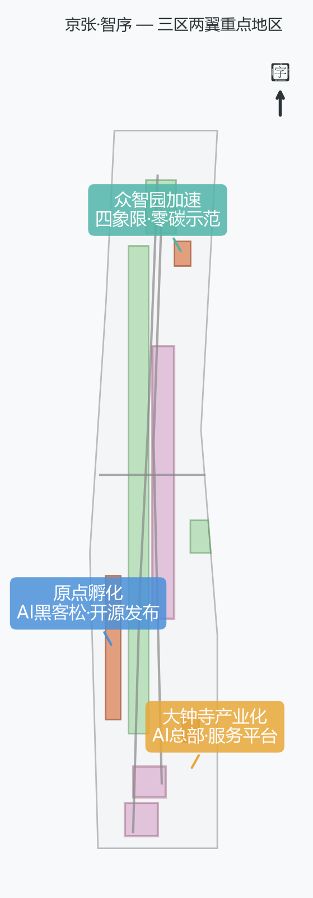

### Timeline Design: 13km = 117 Years

The Century Timeline Walk organizes heritage displays by era, with station nodes acting as "time anchors":

| Era segment | Theme | Design action |
| --- | --- | --- |
| 1909 Origin | Jing-Zhang Railway completed; starting point of Chinese engineering autonomy | Beijing North "Time-Space Prologue Platform": a dialogue between 1909 and 2026 |
| 1920s–1940s | Early operation and national industry | Station heritage displays, AR overlay of historic photographs |
| 1950s–1970s | Industrialization and urban expansion | Adaptive reuse of industrial relics, community memory corners |
| 1980s–1990s | Zhongguancun Electronics Street; dawn of informatization | Electronics-street memory exhibit, digital archive wall |
| 2000s–2010s | Internet and digitalization | Digital Jing-Zhang interactive installations |
| 2020s onward | AI era: LLMs / agents / embodied AI | AI scenario experiences, open-source co-creation nodes |

## Coordinated Research Area: Industry and Future-City Study

The core task of the Coordinated Research Area is to build a world-class AI innovation ecosystem. This scheme organizes the spatial coordination of Haidian's AI industry chain with the "Zhixu" logic: **Opening** (source innovation: universities and foundational-model research) → **Continuation** (open-source ecology: open-source communities and developer networks) → **Creation** (industrial transformation: incubators, accelerators, and leading enterprises) → **Aspiration** (value leadership: AI lifestyle and international communication). This innovation chain responds to the "five functions" (innovation R&D, industry acceleration, scenario experience, cultural display, open sharing) and the "Three Zones and Two Wings" coordination (AI Origin Community, Zhongzhiyuan Acceleration Area, Dazhongsi Industry Cluster + Zhongguancun Technology Services Wing, Xiaoyue River Scenario Enablement Wing) [source:AGENT-TASKBOOK] [standard:PROJECT-AGENT-OPEN-CALL-TASKBOOK].

The Coordinated Research Area does not add pseudo-precise redlines; through the overall coordination of urban character, public space, and building layout required by [standard:MOHURD-URBAN-DESIGN-MEASURES], it connects back to [data:geometry/land_use.geojson#LU-001], [data:geometry/public_space.geojson#PUBLIC-001], and [depth:overall_spatial_structure], showing that the industry strategy ultimately lands in a visible, verifiable spatial structure.

The future-city study answers how AI changes work, life, socializing, learning, transport, and public services. This scheme implements AI transport systems (smart slow mobility, driverless shuttles, adaptive signals), continuous green space (Century Timeline Walk, Qinghe waterfront), innovation service facilities (open-source publishing hub, computing-station hub, roadshow lounge), and an international living-working environment as locatable functional zones, nodes, corridors, and scenarios [data:geometry/roads.geojson#ROAD-001] [data:geometry/green_space.geojson#GREEN-001]. Industrial strategic metrics, AI innovation indices, talent density, space-supply types, and AI+ vertical application priorities are written into the metric system, with official, design-suggestion, and pending-calibration statuses marked. Global AI innovation events, developer communities, open scenarios, or pilgrimage routes are written as "conceptual recommendations / reference schemes / subjects for professional deepening," not as confirmed government activities or implementation arrangements.

## Overall Design Area: Urban Renewal and RDP-Depth Urban Design

The Overall Design Area must reach the urban-design depth of a Regulatory Detailed Plan. The scheme proposes an overall urban-renewal spatial structure, low-efficiency-space identification, a renewal-project list, implementation-policy recommendations, industrial function ratios, spatial organization models, total building scale, and comprehensive capacity assessment. `geometry/land_use.geojson` fully covers the design boundary without overlap; `geometry/buildings.geojson` expresses renewed or retained building footprints; `geometry/roads.geojson` expresses microcirculation, slow mobility, and transit-station connection; `metrics.json` recomputes core areas, ratios, and layer counts [standard:MOHURD-CONTROL-DETAILED-PLANNING] [data:geometry/land_use.geojson#LU-001] [data:geometry/buildings.geojson#BLDG-001] [data:geometry/roads.geojson#ROAD-001] [metric:building_footprint_area_sqm] [depth:land_use_layout] [depth:development_intensity_controls].

The spatial skeleton of the Overall Design Area is "One Spine, Four Orders": with the Century Timeline Walk as the spine, the Prologue segment (North Station), the Creation districts (three key areas), and the Aspiration points (youth and smart-living nodes) are strung together; transit-station integration, road microcirculation, non-motorized vehicle parking, parking supply, innovation service platforms, talent-life services, new infrastructure, distributed energy, and edge computing are arranged around the skeleton. Content involving building height, development intensity, road redlines, setbacks, and facility standards is written as "pending official RDP condition confirmation" where no official control exists, never substituting agent-inferred values for approved indicators.

## Key-Area Detailed Design

### Key-Area Spatial Deepening, Public Routes and AI Operations Evidence

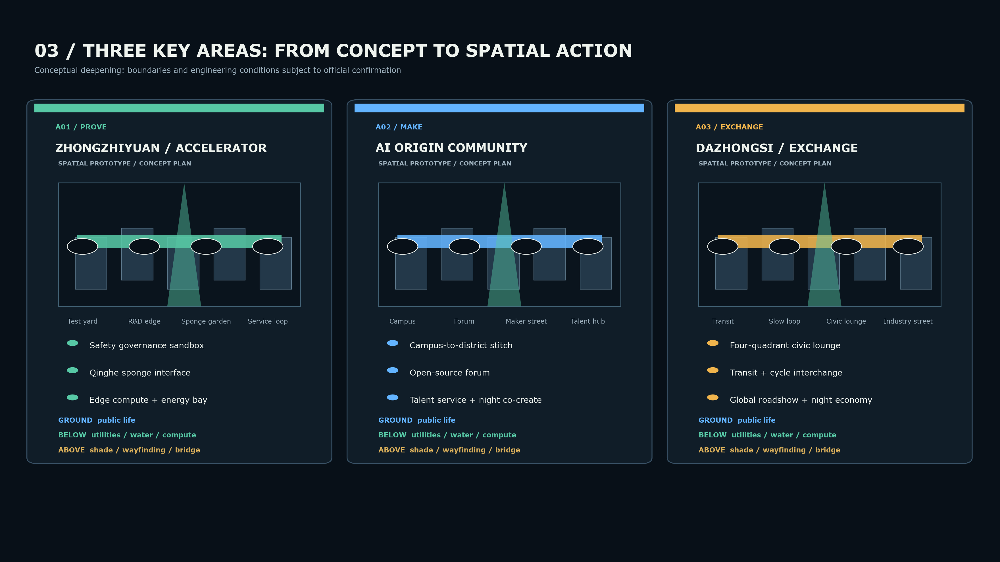

The three key areas do not repeat one program list. They form a connected professional division of labour: Zhongzhiyuan is **PROVE**, hosting the safety-governance sandbox, Qinghe sponge interface and edge-compute/energy interfaces; the Beijing AI Origin Community is **MAKE**, stitching campus, park and district through an open-source forum and talent services; Dazhongsi is **EXCHANGE**, where the four-quadrant civic lounge, transit-cycle interchange, global roadshows and night-time public life complete the industry exchange. Every prototype states its ground-level public role, below-ground resilience service and above-ground low-carbon connection. They remain conceptual baselines pending official boundary, tenure and engineering confirmation [depth:three_key_area_detailed_design] [data:geometry/key_areas.geojson#PROV-KEY-001].

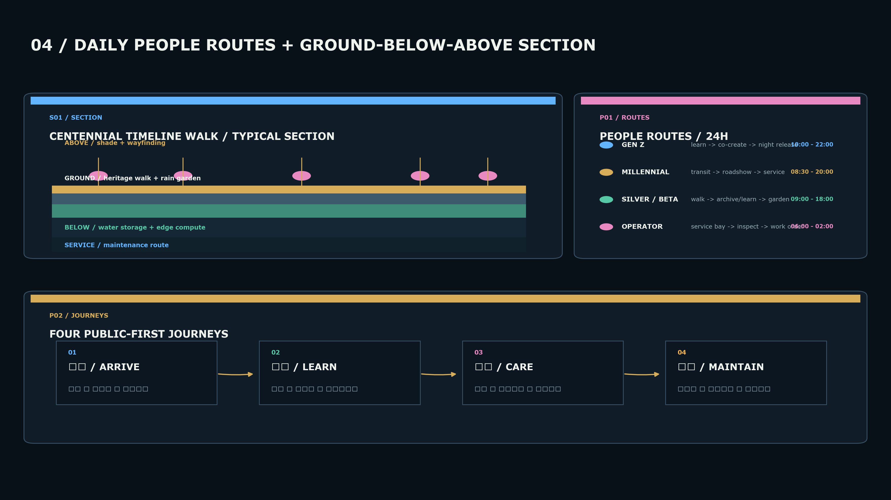

Public space is organised over 24 hours rather than around one professional group: Gen Z follows “learn - co-create - night release”; millennials follow “transit arrival - roadshow - business service”; silver users and children follow “slow walk - archive/learning - nature garden”; frontline operators follow “service bay - inspection - night work order.” The ground plane remains an open walk, rain garden and rest network; below-ground space supplies auditable water, energy, compute and maintenance interfaces; above-ground elements are limited to shade, wayfinding and safe connection [depth:inclusive_public_space] [depth:traffic_organization].

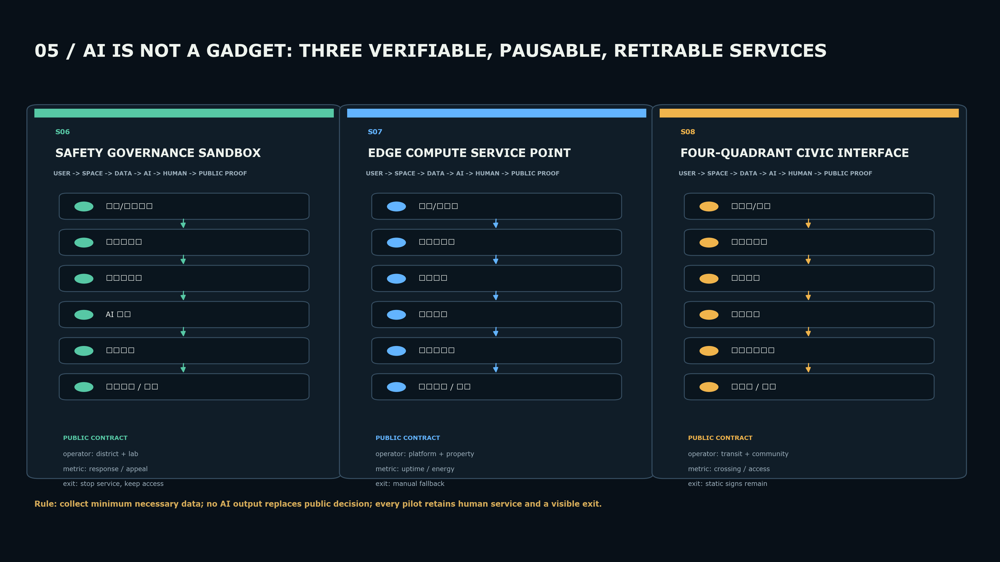

The three core AI scenarios use one public-service loop: **user -> spatial carrier -> minimum necessary data -> AI assistance -> human review -> public metric / stop condition**. The safety-governance sandbox is jointly operated by district public management and a laboratory; the edge-compute point by platform and property teams; and the four-quadrant interface by transit and community-service operators. Every pilot retains a human service, static wayfinding or manual workflow as fallback; no AI output replaces planning approval, enforcement or public decision [depth:privacy_human_review] [depth:ai_scenario_cards].

Key-Area Detailed Design is mandatory. The three key areas become the spatial carriers of "Zhixu":

**Zhongzhiyuan AI Independent Innovation Acceleration Area (Creation · New Form)**: Detailed schemes address national AI platforms, full-stack independent innovation, standard setting, safety governance, industry display, external transport, Qinghe water-culture, low-carbon green innovation exchange environments, and AI scenarios in green space. Spatial actions: strengthen the Qinghe waterfront as an "Innovation Beacon" lounge; green space carries open testing and standards-governance display; low-carbon computing experience and a safety-governance sandbox (scenario card 07) are organized [data:geometry/key_areas.geojson#PROV-KEY-001] [depth:three_key_area_detailed_design].

**Beijing AI Origin Community (Creation × Continuation)**: Detailed schemes address near-campus innovation, achievement incubation and transformation, talent special zones, open-source systems, brand events, building demolish–renovate–retain, achievement publication and display, residential and life services, campus–park slow-mobility connection, and transit-station integration. Spatial actions: organize campus–park–block slow-mobility stitching; an Open-Source Publishing Hub (scenario card 06) and a near-campus transformation street; supplement achievement publication, talent services, residential life, and open-source collaboration space [data:geometry/key_areas.geojson#PROV-KEY-002] [source:AGENT-TASKBOOK].

**Dazhongsi AI Industry Cluster (Aspiration · New Ethos)**: Detailed schemes address leading enterprises, agents, intelligent terminals, content consumption, data elements, digital assets, commercial services, composite use of planned green space, Dazhongsi station integration, and four-quadrant pedestrian connectivity at the intersection. Spatial actions: organize a "Four-Quadrant Lounge" around Dazhongsi station; combine a youth co-creation plaza with an intelligent-terminal experience street; the International Roadshow Lounge hosts display and negotiation for agent and content-consumption enterprises [data:geometry/key_areas.geojson#PROV-KEY-003] [metric:key_area_count].

| Key area | Design positioning | Spatial actions | AI industry & operation scenarios | Evidence |
| --- | --- | --- | --- | --- |
| Zhongzhiyuan AI Independent Innovation Acceleration Area | Garden-style full-stack independent-innovation block | Strengthen Qinghe waterfront, industry display, low-carbon innovation exchange, external transport; green space carries open testing and standards-governance display | Proprietary model testing, standard-setting workshops, safety-governance display, low-carbon computing experience | [data:geometry/key_areas.geojson#PROV-KEY-001], [depth:three_key_area_detailed_design] |
| Beijing AI Origin Community | Near-campus transformation and talent community | Campus–park–block slow-mobility stitching; supplement achievement publication, talent services, residential life, open-source collaboration | Open-source community, achievement publication, talent-zone services, near-campus incubation | [data:geometry/key_areas.geojson#PROV-KEY-002], [source:AGENT-TASKBOOK] |
| Dazhongsi AI Industry Cluster | Urban smart-economy and international-exchange block | Dazhongsi station integration, four-quadrant pedestrian connectivity, youth co-creation plaza, public-environment renewal around key enterprises | Agent and intelligent-terminal display, content consumption, data elements, international roadshow | [data:geometry/key_areas.geojson#PROV-KEY-003], [metric:key_area_count] |

## AI Innovation Ecosystem, Talent Profiles, and AI-Enabled Scenarios

The scheme builds spatial-demand profiles for AI talent and enterprises, covering R&D offices, open-source collaboration, achievement publication, enterprise services, talent housing, social learning, consumer life, sports and leisure, and international exchange. AI-enabled scenarios address the transport, services, consumption, healthcare, education, law, and life-services directions proposed in the announcement, forming both industry-development scenarios and AI-empowered city-function scenarios. Each scenario states its service users, spatial location, data sources, privacy boundaries, human-review mechanism, and operating entity.

AI scenarios land on spatial and governance boundaries: public-space scenarios cite [data:geometry/public_space.geojson#PUBLIC-001]; slow-mobility and traffic scenarios cite [data:geometry/roads.geojson#ROAD-001]; open-space scenarios cite [data:geometry/green_space.geojson#GREEN-001] with [metric:public_space_ratio] and [metric:green_ratio]. This scheme provides 10 scenario cards, 3 testing-and-validation scenarios, and 5 user profiles, covering the taskbook requirements.

The scheme also integrates ground, below-ground, and above-ground spatial layers, expanding the audience from “tech talent” to a multi-generational public that can be served, seen, and invited to co-create.

### People Spectrum: One Corridor, Eight Ways In

The audience matrix overlays identity, generation, occupation, and cross-city mobility. Nationality and region shape language, cultural translation, and international exchange only; they are never used for personal identification or commercial profiling.

| Group | Age / generation | Identity and occupation | Mobility attribute | Core task | Spatial and service response |
| --- | --- | --- | --- | --- | --- |
| Millennial innovation managers | 30–45, Millennials | Founders, product leads, research managers | Beijing-based / intercity business travel | Meetings, roadshows, recruitment, transfer | Dazhongsi International Roadshow Lounge, bookable meeting pods, transit and multilingual wayfinding |
| Gen Z creators | 16–29, Gen Z | Students, developers, designers, content creators | Local youth / exchange / short-term stay | Learning, co-creation, display, social life, night events | Youth plaza, open-source hub, graded night lighting, low-threshold stage interfaces |
| Beta-generation children | Born after 2025, Gen Beta | Children and family users | Local and international families | Play-based learning, nature sensing, accessible companionship | AI education points, low-stimulation play, visible safety edges, parent rest nodes |
| Silver railway-memory users | 60+ | Residents, retired railway workers, community volunteers | Long-term local residents | Memory sharing, slow mobility, health, neighborhood life | Heritage archive corners, continuous seating, accessible loop, memory collection |
| Open-source developers and researchers | 22–40 | Faculty, students, researchers, engineers | Chinese and global open-source communities | Testing, contribution, compute, peer review | Origin Community, edge-compute stations, safety sandbox, auditable booking |
| Startups and industry services | 25–50 | Startups, investors, legal/IP and enterprise services | Beijing-Tianjin-Hebei / national visitors | Incubation, funding, standards, compliance, testing | Zhongzhiyuan test field, standards workshops, enterprise assistant, replaceable exhibits |
| International visitors and cross-border teams | 25–55 | Global companies, visiting scholars, cultural/design institutions | Asian, European, North American and other multilingual visitors | Visits, exchange, roadshows, cultural understanding | Chinese-English base, scalable multilingual wayfinding, international lounge, welcome route |
| Frontline operators and maintenance teams | 20–60 | Cleaning, security, landscape, transport and facility operations | Local employment / shift-based mobility | Maintenance, inspection, emergency, night operation | Back-of-house nodes, below-ground equipment rooms, digital work orders, human review |

The design principle is “one space, multiple readings”: every node offers child-readable graphics, youth participation interfaces, continuous resting edges for older users, bilingual information for international visitors, and executable work orders for operators.

### Three-Dimensional Strategy: Public Ground, Resilient Below, Connected Above

| Spatial layer | Design theme | Main carriers | Key actions | Verifiable outcome |
| --- | --- | --- | --- | --- |
| Ground | Make the city visible and usable | 13km Timeline Walk, three living rooms, youth plazas, Qinghe interface | Slow-mobility priority, heritage narrative, blue-green stormwater, adaptable exhibits, all-day programming | Walking continuity, public nodes, event frequency, and accessibility can be reviewed |
| Below ground | Make systems safe, low-carbon, and maintainable | Utility corridors, equipment rooms, stormwater storage, shared parking/loading, edge compute and energy interfaces | Replaceable equipment, energy tiers, stormwater-first, separate service and public flows | Utility/fire/ownership conditions to be confirmed; work orders and energy auditable |
| Above ground | Make information and ecology cross boundaries | Lightweight bridges, shade canopies, green trellises, wayfinding light bands, low-power data interfaces | Stitch crossings, shade and rain cover, bird-friendly lighting, low-energy displays, graded night use | Priority gaps become safer crossings; lighting, energy, and landscape maintenance enter operations |

The three-dimensional strategy follows “public first, intelligent second; maintainable first, automated second.” Ground carries public life, below ground carries resilience and infrastructure, and above ground carries crossing, shelter, and communication. Below-ground and above-ground engineering remain conceptual recommendations pending utility, fire, structural, ownership, and management confirmation.

### LOGO and Wayfinding: The Dual-Track Order Mark

The logo uses a bronze time track and an electric-blue intelligence track: bronze represents railway heritage since 1909, while blue represents AI data and future services. Their central crossing abstracts the character “Xu.” The Chinese lock-up is “京张·智序”; the English lock-up is “Jingzhang·ZhiXu”; the descriptor is “AI开启京张 · AI续京张 · AI创京张 · AI尚京张.”

Identity rules: charcoal `#0A1119`, railway bronze `#D1A85A`, electric cyan `#64D5E8`, emerald `#55C7AA`, and coral amber `#F0B44C`. Wayfinding uses a time-track/intelligence-track dual code: 1909, 1920s, and 2020s for eras; S01–S08 for scenario nodes. Node IDs use `JZ–order–scenario`, for example `JZ–QI–S02`. Graphics, fonts, corporate marks, and public art require rights, trademark, and typeface clearance before implementation [source:AGENT-TASKBOOK] [depth:brand_wayfinding_system].

### User Profiles (5)

| User profile | Typical needs | Spatial response | Self-check boundary |
| --- | --- | --- | --- |
| Open-source developers | Publication, collaboration, testing, community reputation | AI Origin open-source publishing hub, public code wall, night-time collaboration space | No personal behavior tracking; event data aggregated only |
| Startup teams | Low-cost offices, compute access, product testbeds | Zhongzhiyuan shared test field, edge-computing service points, standards-governance consulting | Compute and data services require separate authorization |
| Leading-enterprise visitors | Display, business, international reception, talent recruitment | Dazhongsi international roadshow lounge, station connection, public environment around key enterprises | Enterprise identities and cases must be rights-cleared |
| Surrounding residents | Commuting, leisure, community services, low-disruption renewal | Century Timeline Walk slow-mobility loop, embedded community services, graded night lighting and events | Resident profiles never used for commercial recommendation |
| University faculty/students & young creators | Achievement transformation, cross-campus collaboration, daily slow mobility, creative expression | Campus–park slow-mobility stitching, transformation stations, youth co-creation plaza, AI education experience points | Campus data and research results require authorization |

### AI Scenario Cards (10, organized by the Four Orders)

| Card | Order | Spatial carrier | Design description |
| --- | --- | --- | --- |
| 01 Time-Space Prologue Platform | Opening | Beijing North Station node | Dialogue plaza between 1909 and 2026; timeline zero point + first AI-infrastructure segment display |
| 02 First AI-Infrastructure Segment | Opening | Prologue-segment streets | Perceptible street-infrastructure prototype: sensing pavement, smart lighting, edge-computing boxes |
| 03 Century Timeline Walk | Continuation | Full 13km | Continuous walking spine organized by era; each segment has one era theme; walking traverses a century |
| 04 AR Heritage Overlay | Continuation | Tsinghua Park station and heritage nodes | Historic scenes (1909 station, steam locomotives) overlaid in situ; culture continues digitally |
| 05 Heritage Digital Archive Corner | Continuation | Stations along the line | Digital display of railway heritage + community co-built archives; digital continuation of Zhan Tianyou's innovation gene |
| 06 Open-Source Publishing Hub | Creation | Beijing AI Origin Community | Achievement publication, code-contribution display, small roadshow space for universities, open-source communities, startups |
| 07 Safety-Governance Sandbox | Creation | Zhongzhiyuan | Standard setting, safety evaluation, and model red-teaming translated into visitable, bookable, auditable display-collaboration nodes |
| 08 Four-Quadrant Lounge | Aspiration | Dazhongsi station | Transit-station integration + four-quadrant pedestrian connectivity + youth international exchange and intelligent-terminal experience |
| 09 Youth Co-Creation Plaza | Aspiration | Ethos-lounge nodes | AI art installations, open-source culture block, open-air stage; main venue for the annual hackathon |
| 10 Smart Living Showcase Street | Aspiration | Community-commerce junctions | Perceptible lifestyle scenarios: AI convenience stores, frictionless payment, AI health kiosks, AI education points |

The 3 testing-and-validation scenarios are: the Safety-Governance Sandbox (model red-teaming), the Edge-Computing Station (low-latency service validation), and the Four-Quadrant Lounge (real-scenario intelligent-terminal experience). Urban agents assist in identifying slow-mobility gaps, public-space heat, facility maintenance, enterprise-service needs, and event-safety risks, but do not replace planning approval, output unauthorized personal profiles, or claim official implementation commitments. All AI scenario nodes enter structured layers or the compliance matrix [depth:ai_scenario_cards] [depth:privacy_human_review].

## Land Use, Building Scale, and Demolish–Renovate–Retain Strategy

The land-use plan follows public standards for national land-space survey, planning, and use-control classification, forming complete, closed, seamless land-use zones [standard:MNR-LAND-USE-CLASSIFICATION-GUIDE]. The building plan distinguishes retained, renovated, renewed, newly built, or pending-confirmation objects, clarifying recommended levels for building footprint, function, scale, character, roof form, massing, and height control [depth:height_massing_character] [depth:retain_renovate_demolish] [data:geometry/land_use.geojson#LU-001] [data:geometry/buildings.geojson#BLDG-001] [metric:building_footprint_area_sqm]. Where existing buildings, ownership, RDP conditions, and engineering conditions are missing, the scheme only proposes methods and a pending-calibration checklist, never fabricates demolish–renovate–retain conclusions.

Building scale and intensity indicators are consistent with `metrics.json` and the layers. Where total building scale, FAR, height, building coverage, green ratio, setbacks, and building control lines lack official conditions, `status=unknown` is used uniformly, and the `reason`/`assumptions` fields state the pending conditions, current assumptions, and the recomputation path after official data arrives — no fixed numbers are used to manufacture a sense of precision.

## Transport, Transit, Municipal Infrastructure, and Public Services

The transport scheme responds to the announcement's requirements for transit-station integration, road microcirculation, slow-mobility gap closure, external transport, parking, non-motorized-vehicle parking, and green transport systems, covering the North Fifth Ring Road, Jing-Zhang Railway Heritage Park grade-separation nodes, Wudaokou, Tsinghua East Road West, Dazhongsi station, and transport links around key enterprises [depth:traffic_rail_slow_parking] [depth:municipal_new_infrastructure] [data:geometry/roads.geojson#ROAD-001] [data:geometry/public_space.geojson#PUBLIC-001] [data:geometry/constraints.geojson#CONSTRAINTS].

The "Zhixu" transport strategy centers on **ordered movement**: the Century Timeline Walk carries the slow-mobility spine (Continuation); adaptive signals prioritize pedestrians and driverless shuttles run at low speed along the track (AI transport scenario); transit-station integration organizes four-quadrant connectivity (Aspiration). Where road redlines, utility lines, fire safety, and municipal conditions are missing, pending status is stated through assumptions rather than written as approved conditions.

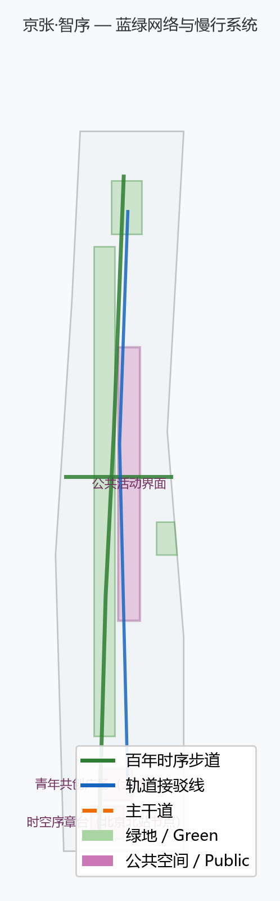

Municipal and public-service facilities cover AI industry-service facilities, innovation service platforms, talent-life-service facilities, new infrastructure, distributed energy, edge computing, and integration with conventional municipal facilities, stating facility standards, spatial layout, service radii, operation models, and phased implementation logic. Missing utility-line, energy, drainage, flood-control, and fire-safety engineering data are listed as prerequisites for formal deepening.

## Blue-Green Space, Public Space, and Urban Character

The blue-green scheme uses the Jing-Zhang Railway Heritage Park vitality belt as its skeleton, coordinating travel needs around the Qinghe and Xiaoyue rivers, universities, enterprises, and communities, proposing a north-south through, east-west connected network of walking and cycling paths and green space, identifying slow-mobility gaps, grade-separated ring-road nodes, and north/south landscape nodes of the park, and proposing composite-use strategies for parking, sports, innovation exchange, technology testing, application display, and public services [depth:blue_green_public_space] [data:geometry/green_space.geojson#GREEN-001] [data:geometry/public_space.geojson#PUBLIC-001] [standard:MOHURD-URBAN-DESIGN-MEASURES]. Green-space and public-space ratios are interpreted for their design meaning in the text, with full recomputation stored in `metrics.json`.

The urban-character scheme integrates Jing-Zhang railway history, Zhongguancun innovation culture, and AI innovation culture, using cultural assets such as Tsinghua Park railway station and the Beijing Film Academy, and proposes guidance for urban tone, architectural character, roof forms, massing, interfaces, and public art. The wayfinding system and cultural symbols adopt a "dual-track" system — the **Time Track** (1909–2026 era codes, corresponding to the Century Timeline Walk) and the **Intelligence Track** (AI interaction interfaces, corresponding to scenario nodes) — forming a recognizable "Zhixu" visual language. All brands, fonts, images, portraits, and enterprise identities in AI pilgrimage landmarks, contribution walls, or honor-display systems must be rights-cleared. Character control distinguishes official controls, design recommendations, and pending conditions; pseudo-precise control lines are strictly prohibited without heritage-protection or RDP basis.

## Renewal-Project List, Implementation Policy, and Phasing Plan

The implementation scheme forms an auditable renewal-project list, stating project location, type, function, responsible entity, dependent conditions, implementation stage, risks, and evaluation metrics [depth:renewal_project_list] [depth:phasing_implementation] [data:geometry/phasing.geojson#PHASE-001]. Policy recommendations cover integrated urban-renewal implementation, space supply, operation mechanisms, industry services, public participation, data governance, and property-rights coordination. The project list is organized by the Four Orders:

| No. | Project | Order | Type | Key dependencies | Evidence |
| --- | --- | --- | --- | --- | --- |
| JZ-01 | North Station Time-Space Prologue Platform | Opening | Public space / heritage | Road redlines, station-area space, traffic organization review | [data:geometry/public_space.geojson#PUBLIC-001] |
| JZ-02 | First AI-Infrastructure Segment | Opening | New infrastructure / public services | Energy, compute, safety, operating entity | [data:geometry/constraints.geojson#CONSTRAINTS] |
| JZ-03 | Century Timeline Walk Connection | Continuation | Slow mobility / blue-green | Grade-separated ring-road nodes, under-bridge space, slow-mobility gap closure | [data:geometry/roads.geojson#ROAD-001] |
| JZ-04 | AR Heritage Overlay System | Continuation | Digital heritage / operation | Heritage-point rights clearing, digital-content copyright | [data:geometry/green_space.geojson#GREEN-001] |
| JZ-05 | AI Origin Open-Source Publishing Hub | Creation | Urban renewal / industry services | Campus boundary, ownership, ground-floor use | [data:geometry/buildings.geojson#BLDG-001] |
| JZ-06 | Zhongzhiyuan Qinghe Innovation Front | Creation | Blue-green / industry display | River blue line, ecology, flood-control conditions | [data:geometry/green_space.geojson#GREEN-001] |
| JZ-07 | Dazhongsi Four-Quadrant Lounge | Aspiration | Transit integration / slow mobility | Transit station, road intersection, municipal utilities | [data:geometry/public_space.geojson#PUBLIC-001] |
| JZ-08 | Youth Co-Creation Plaza | Aspiration | Public space / operation | Public-space permits, event safety | [data:geometry/phasing.geojson#PHASE-001] |
| JZ-09 | Smart Living Showcase Street | Aspiration | AI scenario / commerce | Ground-floor use, data compliance, operating entity | [data:geometry/land_use.geojson#LU-001] |
| JZ-10 | Annual Street Hackathon | Aspiration | Operation / brand | Event safety, copyright clearing, community organizing | [data:geometry/phasing.geojson#PHASE-001] |

Phasing is distinct from the 100-day call design cycle: the call cycle is the time requirement for submitting results; implementation phasing is the path for urban renewal and project construction. The plan proposes near-term pilots, mid-term renewal, and long-term governance.

- **Near-term pilots (2026–2028)**: Time-Space Prologue Platform, Timeline Walk slow-mobility gap closure, lightweight AI scenarios (AR overlay, smart navigation), hackathon launch — starting with lightweight facilities, operating activities, and service platforms.
- **Mid-term renewal (2028–2031)**: AI Origin open-source publishing hub, Zhongzhiyuan Qinghe innovation front, Dazhongsi four-quadrant connectivity — key-area renewal projects land, pending official RDP, municipal, transport, and ownership confirmation.
- **Long-term governance (2031–2035)**: The full-corridor Zhixu takes shape; smart-living showcase streets scale up; international AI event weeks and open-source community operations become routine.

The annual event system, developer-community operations, scenario open days, public experience routes, and international communication mechanisms state operating targets, frequency, responsibility boundaries, conversion paths, and risks — not just promotional slogans.

## Metric System, Area Recomputation, and Compliance Matrix

The metric system includes the Overall Design Area area, key-area areas, green-space and public-space ratios, building footprints, renewal-project counts, AI scenario nodes, slow-mobility connectivity indicators, industry-space indicators, talent-service indicators, and self-check status. Known metrics are recomputable from GeoJSON or trusted sources; unknown metrics state their reasons and formal-submission prerequisites [depth:metrics_recalculation] [metric:site_area_sqm] [data:geometry/green_space.geojson#GREEN-001].

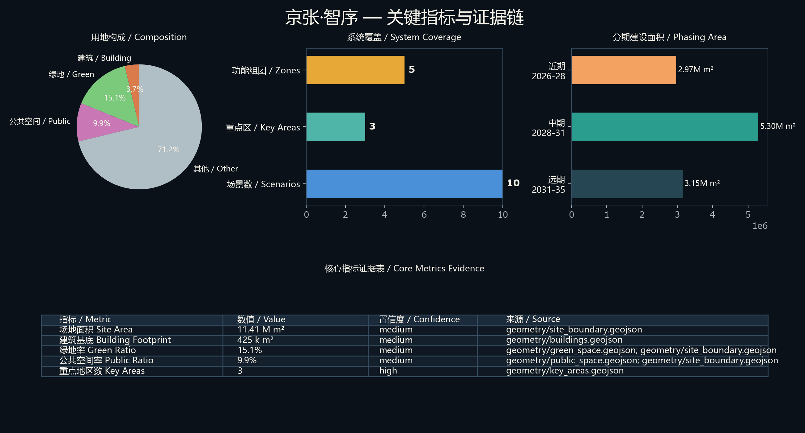

Metrics fall into three classes: the first is directly recomputable from submitted geometry (boundary area, green ratio, public-space ratio, building-footprint area, phasing area); the second requires official RDP or taskbook attachments (FAR, building height, building coverage, setbacks, road redlines, facility standards); the third requires operation- or industry-data calibration over time (AI innovation index, talent density, industry-service satisfaction, slow-mobility accessibility, event participation, scenario-use frequency). The three classes enter `metrics.json`, `assumptions.json`, and `compliance_matrix.json` respectively, avoiding operational visions being mistaken for approved planning conditions.

The compliance matrix is the master control file for task responsiveness. Every announcement task and agent_taskbook task maps to report chapters, layers, metrics, drawings, HTML pages, sources, assumptions, and self-check items. The mandatory tasks in announcement sections 1.3, 1.4, and 1.5 and agent.1–agent.6 are fully covered in `compliance_matrix.json`.

## Risks, Copyright, and Compliance Statement

**Bilingual requirement.** This scheme uses `proposal.md` as the primary file, with `proposal.en.md` providing the complete corresponding translation; the A3/A0 boards, HTML, and text-bearing graphics provide corresponding language copies, preferring the event's recommended translations in `docs/terminology-glossary.md`. All images, drawings, icons, data, and code assets state their source, license, and authorization status in `sources.json` or `report/copyright_statement.md`. The HTML pages load no remote scripts, remote map tiles, remote fonts, iframes, forms, or external APIs, and do not track reviewers.

Risks and missing-data lists are jointly checked by the risk-depth item, the constraints layer, and the site package [depth:risk_missing_data] [data:geometry/constraints.geojson#CONSTRAINTS] [source:SITE-PACKAGE]. The gaps listed in `missing_data_checklist.csv` — official boundary, key areas, RDP, roads, plots, buildings, municipal works, heritage protection, and public services — enter `assumptions.json`, the self-check, and the risk section of the text. Any conclusion lacking official RDP, road redlines, ownership, municipal works, fire safety, or heritage-protection conditions is downgraded to a pending-confirmation item.

This scheme does not claim official approval, approved RDPs, final land ownership, final construction scale, or guaranteed implementation. The AI agent is responsible for facts, sources, copyright, spatial data, metrics, and expression; maintainers and professional reviewers may require revision or rejection based on self-check results, spatial review, and the compliance matrix.

## References

- brief/public-brief.md
- brief/site-package/design_brief.json
- brief/site-package/allowed_design_space.json
- brief/site-package/enums/
- brief/site-package/ranges/planning_limits.json
- data/processed/agent_fact_pack.md
- data/processed/project_scope_summary.csv
- data/processed/agent_task_requirements.csv
- data/processed/source_use_matrix.csv
- data/processed/missing_data_checklist.csv
- Full machine index: see `sources.json`, `metrics.json`, `compliance_matrix.json`, `standard_matrix.json`, and `design_depth_matrix.json`
- This bibliography entry is registered by the site package; full provenance and licenses are in the structured source inventory [source:SITE-PACKAGE]
