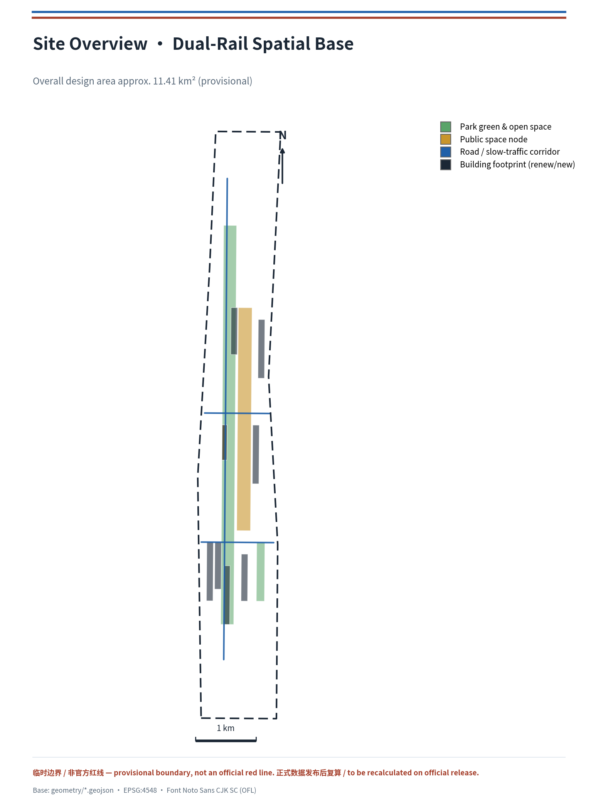
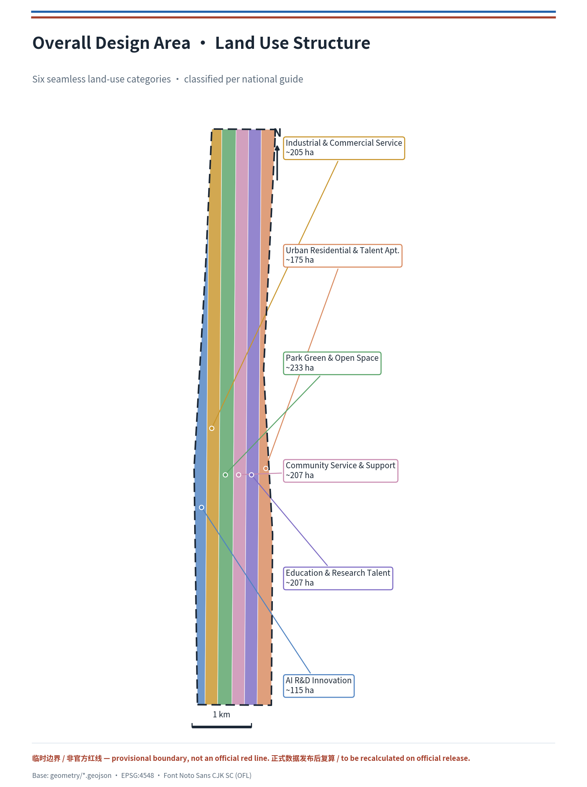
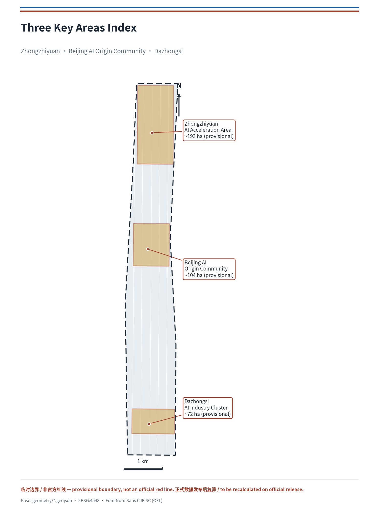
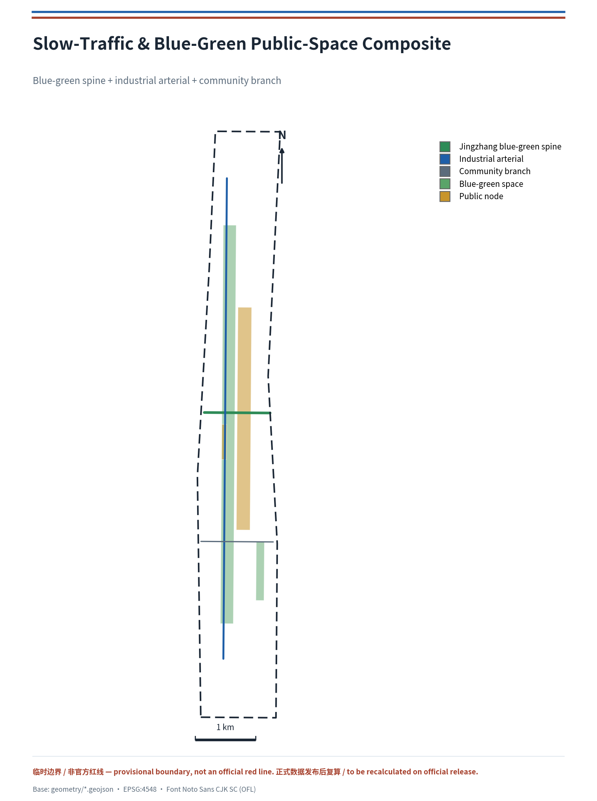
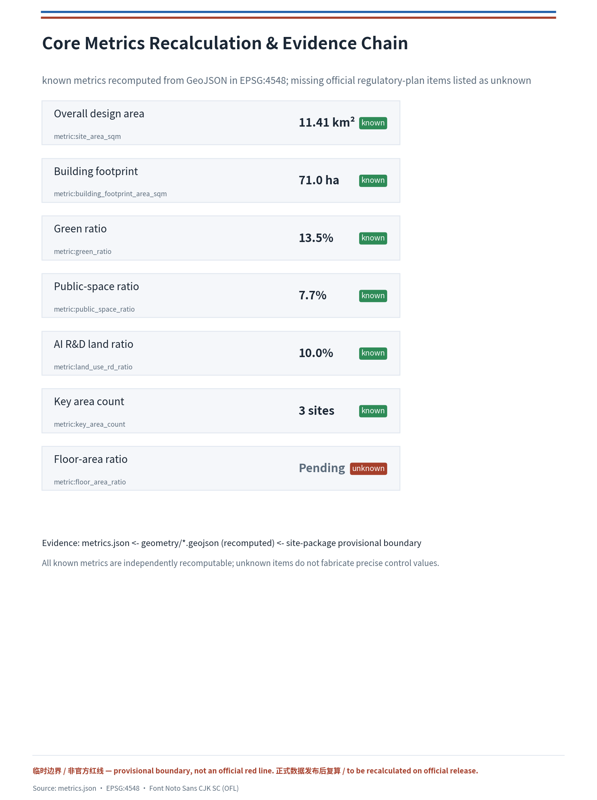

# Symbiotic Dual-Rail: Centennial Jingzhang AI Innovation Belt — Urban Design Proposal

## Design Basis and Source List

This proposal takes as its primary basis the Prequalification Announcement for the International Solicitation of Urban Design for the Centennial Jingzhang AI Innovation Belt, issued by the Haidian Branch of the Beijing Municipal Commission of Planning and Natural Resources [source:OFFICIAL-ANNOUNCEMENT], and follows the open-call taskbook addressed to global intelligent agents [source:AGENT-TASKBOOK]. Deliverables are organized on the basis of the design brief, allowed design space, enums, metric ranges, and standard library provided in `brief/site-package/` [source:SITE-PACKAGE]. The proposal reads the public/cleared/provisional source usability registry in `data/source_registry.json` [source:SOURCE-REGISTRY], and uses `data/processed/agent_fact_pack.md` as the reading-navigation layer for three-level scope, required tasks, source-use boundaries, and the missing-data checklist [source:PROCESSED-FACT-PACK]; all spatial conclusions return to original sources and recomputable layers.

The boundary and the three key areas currently use the maintainer-registered provisional coarse polygons: `geometry/site_boundary.geojson` corresponds to an overall design area of approximately 11.4 km², sourced from `brief/site-package/geometry/provisional_boundaries.geojson` [source:BOUNDARY-SOURCE]; `geometry/key_areas.geojson` contains the three key areas — Zhongzhiyuan, the Beijing AI Origin Community, and Dazhongsi [source:KEY-AREA-SOURCE]. Because official precise red lines are not yet in the package, the proposal uniformly marks the boundary and key areas as `provisional_constraint` and `official_boundary=false`, for use only in generation, self-check, visualization, and design discussion; they are not described as official red lines, approval basis, precise-area basis, or statutory control conclusions. This organizer-side data gap does not itself block content scoring, but when official data is released, the site boundary, key areas, land use, buildings, roads, green space, public space, phasing, and all area-type metrics must be recalculated.

Professional standards follow local snapshots: the Urban Design Management Measures [standard:MOHURD-URBAN-DESIGN-MEASURES], the Measures for the Compilation and Approval of Regulatory Detailed Plans [standard:MOHURD-CONTROL-DETAILED-PLANNING], the National Land Use and Sea Use Classification Guide [standard:MNR-LAND-USE-CLASSIFICATION-GUIDE], the Regulations on the Depth of Architectural Engineering Design Documents [standard:MOHURD-ARCH-DESIGN-DEPTH-2016], the Project Prequalification Announcement [standard:PROJECT-OFFICIAL-ANNOUNCEMENT], and the Agent-Facing Open-Call Taskbook [standard:PROJECT-AGENT-OPEN-CALL-TASKBOOK]. The body text, metrics, layers, and drawings together form the professional evidence chain [depth:existing_conditions_diagnosis].

## Three-Level Scope Framework

The proposal is organized strictly according to the three-level scope in the announcement: the coordinated research area (approximately 43.6 km²; AI industrial ecology, three-zone/two-wing synergy, future urban form, and cultural narrative), the overall design area (approximately 11.4 km²; overall urban-renewal framework, land-use structure, transport/municipal infrastructure, and urban character control), and the key-area scope (approximately 368.4 hectares; detailed design of Zhongzhiyuan, the AI Origin Community, and Dazhongsi) [source:OFFICIAL-ANNOUNCEMENT]. The three levels are mapped item by item in `compliance_matrix.json`, ensuring that every required task in Announcement 1.3, 1.4, 1.5, and agent.1–agent.6 has section, layer, metric, drawing, and HTML evidence, bounded by [depth:three_level_scope_framework] and [depth:overall_spatial_structure].

The three levels are not mutually separate drawing sets: the coordinated research determines industrial-chain and urban-form judgments; the overall design translates those judgments into renewal projects, spatial structure, and facility capacity; and the detailed design of key areas verifies the implementability of specific parcels, buildings, transport, public space, and AI application scenarios. Spatial evidence follows [data:geometry/site_boundary.geojson#SITE-001] and [data:geometry/key_areas.geojson#PROV-KEY-001], task basis follows [standard:PROJECT-OFFICIAL-ANNOUNCEMENT], and the scope index uses `project_scope_summary.csv` as navigation [source:PROCESSED-FACT-PACK].

## Coordinated Research Area: Industry and Future City Research

The core task of the coordinated research area is to build a world-class AI innovation ecosystem. This proposal introduces "Symbiotic Dual-Rail" as the master concept of the belt: the Jingzhang Heritage Park serves as the "cultural spine" of history and public space, while universities—parks—enterprises—stations along the line form the "AI innovation rail"; the two rails meet at Zhongzhiyuan, the AI Origin Community, and Dazhongsi as core anchors, forming a spatial organization of "one belt, two rails, three cores, multiple nodes, and a blue-green composite loop." On naming, the Chinese master name retains "百年京张AI创新带," and the English name is proposed as **Jingzhang AI Innovation Belt (abbreviated JZ-AI Belt)**. The logo direction uses "two rails + heritage arch line" as the motif, with Haidian tech blue and Jingzhang brick red, responding to the railway's history while carrying international recognition [source:AGENT-TASKBOOK]. This naming and visual direction are conceptual proposals; specific typefaces, images, trademarks, and portraits require rights clearance in the deepening stage.

**Positional definition of Symbiotic Dual-Rail (this proposal's judgment, distinct from a general "structural description").** The two rails are not the juxtaposition of two parallel lines but the **spatial superimposition of historical and future promises**. The cultural spine carries the century-old promise of the Jingzhang Railway — "acknowledge constraints, leave the judgment in space for later review" [source:RESEARCH-JZ-RAILWAY]; the AI innovation rail is to carry the contemporary urban promise of "making algorithmic decisions transparent, explainable, and exitable" [source:AGENT-TASKBOOK]. "Symbiosis" means the two rails converge in space and interlock in mechanism: any AI scenario entering the belt must, like a rail joining the network, first be calibrated on the "Standard Gauge." Thus "dual rail" is not decorative wording but a testable measure — it turns "global discursive power in AI governance" from a slogan into a **reviewable urban infrastructure**.

**The Standard Gauge mechanism (this proposal's unique mechanism point).** When the Jingzhang Railway was built, Zhan Tianyou insisted on a unified standard gauge (1435 mm), enabling the line to interconnect with the national network and avoid a "narrow-gauge island" [source:RESEARCH-JZ-RAILWAY]. This historical fact provides a direct mechanistic prototype for Symbiotic Dual-Rail: this proposal advocates establishing a "Standard Gauge"-style interoperability floor for the innovation belt — any AI scenario, data interface, or device entering the belt must satisfy four reviewable conditions: (1) **Interface standard** — data and interaction follow open, portable protocols, not locked to a designated vendor [source:AGENT-TASKBOOK]; (2) **Data minimization** — collect only the data needed for operation, with purpose and retention period stated; (3) **Human review** — decisions affecting rights must retain a traceable human responsible party; (4) **Exitable** — every scenario retains a human channel and offline alternative, preventing "intelligence" from crowding out basic public services [standard:MOHURD-URBAN-DESIGN-MEASURES]. These four "gauge" calibrations are the precondition for the two rails to run in parallel without excluding each other and to coexist without swallowing each other; they are also the spatialized mechanism through which this proposal answers "global discursive power in AI governance," landing on every reviewable record in public space, scenario cards, and operations [data:geometry/public_space.geojson#PUBLIC-001] [depth:overall_spatial_structure].

**Historical anchors and spatial correspondence.** This proposal grounds the historical promise of the dual rail in traceable spatial coordinates: Qinghuayuan Station (established 1910, the first station after Xizhimen on the Jingzhang Railway, with the station name inscribed by Zhan Tianyou) serves as the cultural vestibule and origin lighthouse of the "AI Origin Community" [source:RESEARCH-QHY-STATION]; the first phase of the Jingzhang Railway Heritage Park (opened June 2023, from Qinghua East Road to Zhichun Road, approximately 2.5 km long) serves as the built foundation of the "cultural spine," onto which the proposal overlays AI experience tracks and transfer nodes rather than building anew [source:RESEARCH-PARK-2023]. These historical facts are used only as narrative and mechanism coordinates; no current ownership, heritage-protection scope, or engineering condition is inferred from them.

In response to the "three positionings, five functions, and three-zone/two-wing synergy loop" required by the agent-facing taskbook, this proposal gives a synergy framework at the coordinated level: Zhongzhiyuan carries full-stack independent innovation and governance discursive power; the AI Origin Community carries the world-class innovation ecosystem and scenario enablement; Dazhongsi carries native intelligent new business formats; the Zhongguancun science-and-technology service wing carries global allocation of factors and Zhongguancun IP/capital enablement; and the Xiaoyue River scenario-enablement wing carries AI-scenario deployment and vibrant urban life [source:AGENT-TASKBOOK]. This synergy framework is translated into spatial structure through the public-space, landscape, and building-layout coordination required by [standard:MOHURD-URBAN-DESIGN-MEASURES], linking back to [data:geometry/land_use.geojson#LU-001], [data:geometry/public_space.geojson#PUBLIC-001], and [depth:overall_spatial_structure].

To respond to "global AI innovation ecosystem cases," this proposal curates 5 convertible reference cases (all as mechanism references, not investment commitments):

| Case | Core mechanism | Convertible space/operation |
| --- | --- | --- |
| Silicon Valley · University Avenue (Palo Alto) [source:CASE-PALO-ALTO] | University-seeded, enterprise-incubated, capital-dense near-campus innovation corridor | AI Origin Community near-campus commercialization street |
| Boston · Kendall Square [source:CASE-KENDALL-SQUARE] | High-density co-location of research, talent, and services in buildings | Zhongzhiyuan high-density industry-research complex |
| London · King's Cross [source:CASE-KINGS-CROSS] | Railway heritage renewed into innovation gateway and public living room | Jingzhang Heritage Park vitality belt |
| Toronto · Waterfront Smart District [source:CASE-TORONTO-WATERFRONT] | Data, scenario, and public-governance-coordinated smart-district pilot (including failure lessons) | Xiaoyue River scenario-enablement wing |
| Shenzhen · Nanshan Science & Technology Park [source:CASE-SHENZHEN-NANSHAN] | Full-chain enterprises and test-validation environment | Dazhongsi industrial test-validation scenarios |

The future urban-form study responds to how "AI culture, society, and the city" change work, life, social interaction, learning, transport, and public services. The proposal resolves AI transport systems, continuous green spaces, innovation service facilities, and an international work-life atmosphere into locatable functional zones, nodes, corridors, and scenarios rather than vague technological vision. Industrial strategic metrics, the AI innovation index, talent density, spatial-supply types, and AI+ vertical-application priority areas are written into the metric system with official/design-proposal/pending-calibration attributes; global AI events, developer communities, open scenarios, and pilgrimage routes are all phrased as "conceptual proposals / reference plans / open to deepening by professional teams," not as confirmed government events or implementations [source:AGENT-TASKBOOK].

## Overall Design Area: Urban Renewal and Regulatory-Plan-Level Urban Design

The overall design area is required to reach the urban-design depth of a regulatory detailed plan. This proposal forms a complete, seamless, non-overlapping six-category land-use partition in `geometry/land_use.geojson`: AI R&D innovation land, industrial-service and commercial-service land, park-green and open-space land, community-service and supporting land, education-research and talent land, and urban residential and talent-apartment land, covering the full submitted boundary [data:geometry/land_use.geojson#LU-001][data:geometry/land_use.geojson#LU-002]. The partition follows the National Land Use and Sea Use Classification Guide [standard:MNR-LAND-USE-CLASSIFICATION-GUIDE], with boundaries sharing the same vertices to ensure topological closure [depth:land_use_layout].

Urban renewal follows a "retain—renovate—renew—build-new" graded logic: `geometry/buildings.geojson` expresses renewed and new building footprints covering AI R&D headquarters, algorithm laboratories, accelerators, enterprise services, industry-city complexes, AI education, talent apartments, and cultural display [data:geometry/buildings.geojson#BLDG-001][data:geometry/buildings.geojson#BLDG-005]; `geometry/phasing.geojson` expresses the phasing scope of near-term blue-green and scenario demonstration and mid-term industrial and talent spatial renewal [data:geometry/phasing.geojson#PHASE-001]. Because official regulatory-plan conditions (floor-area ratio, building height, building density, setbacks, and road red lines) are lacking, development-intensity metrics are listed as pending confirmation, without fabricating precise control values, managed by [depth:development_intensity_controls] and [depth:retain_renovate_demolish], and recorded in `assumptions.json` [source:SITE-PACKAGE]. Building height, massing, and character control are bounded by [depth:height_massing_character] and based on the Urban Design Management Measures [standard:MOHURD-URBAN-DESIGN-MEASURES].

The overall design also supports transport, rail, municipal, and supporting facilities: `geometry/roads.geojson` expresses the blue-green slow-traffic spine, the innovation-industry longitudinal arterial, and community-life transverse branch roads [data:geometry/roads.geojson#ROAD-001][data:geometry/roads.geojson#ROAD-002], organizing spatial layout around transit-station integration, road microcirculation, non-motorized-vehicle parking, innovation service platforms, talent life services, new infrastructure, distributed energy, and edge computing. Content involving road red lines, pipelines, firefighting, and municipal capacity is written as pending confirmation where official conditions are lacking, not as finalized conclusions [depth:traffic_rail_slow_parking][depth:municipal_new_infrastructure].

## Detailed Design of Key Areas

The three key areas are the innovation core of this proposal, reaching the urban-design depth of a comprehensive implementation plan, verified by [depth:three_key_area_detailed_design].

**Zhongzhiyuan AI Independent Innovation Acceleration Area** (approximately 192.1 ha, provisional) [data:geometry/key_areas.geojson#PROV-KEY-001]: positioned as a "garden-style full-stack independent innovation district," organized around the national AI platform, full-stack independent innovation, standard-setting, safety governance, industrial display, and external transport. Spatial actions include strengthening the Qinghe waterfront interface, using green space to host open testing and standard-governance display, and organizing a low-carbon innovation exchange environment; the Qinghe waterfront green space in `geometry/green_space.geojson` [data:geometry/green_space.geojson#GREEN-002] and the algorithm laboratories and accelerators in `geometry/buildings.geojson` [data:geometry/buildings.geojson#BLDG-002] jointly support the industry-green composite.

**Beijing AI Origin Community** (approximately 104.3 ha, provisional) [data:geometry/key_areas.geojson#PROV-KEY-002]: positioned as a "near-campus commercialization and talent community," focusing on stitching together campus, park, and neighborhood slow traffic and adding commercialization-release, talent-service, residential-life, and open-source-collaboration spaces. The AI Origin Community activity plaza [data:geometry/public_space.geojson#PUBLIC-002] carries open-source and commercialization releases; the education-research and talent land [data:geometry/land_use.geojson#LU-005] and talent apartments [data:geometry/buildings.geojson#BLDG-007] support near-campus innovation and residential support.

**Dazhongsi AI Industry Cluster** (approximately 72.0 ha, provisional) [data:geometry/key_areas.geojson#PROV-KEY-003]: positioned as an "urban-type intelligent economy and international-exchange district," organizing renewal around leading enterprises, agents, intelligent terminals, content consumption, data elements, digital assets, and commercial services, and optimizing transport around Dazhongsi station integration and four-quadrant pedestrian connectivity at intersections. The industrial-service and commercial-service land [data:geometry/land_use.geojson#LU-002] and the industry-city complex [data:geometry/buildings.geojson#BLDG-005] support intelligent-economy formats.

## AI Innovation Ecosystem, Personas, and AI+ Scenarios

The proposal establishes spatial-need personas for AI talent and enterprises, covering R&D offices, open-source collaboration, commercialization release, enterprise services, talent housing, social learning, consumption life, sports and recreation, and international exchange [source:AGENT-TASKBOOK]. This proposal provides 5 user personas:

| Persona | Typical needs | Spatial response | Self-check boundary |
| --- | --- | --- | --- |
| Open-source developer | Release, collaborate, test, community reputation | AI Origin Community open-source release hall, public code wall, nighttime collaboration space | No collection of personal behavior tracks; event data aggregated only |
| Startup team | Low-cost office, compute access, product testbed | Zhongzhiyuan shared test field, edge-compute service point, standard-governance consultation | Compute and data services require separate authorization |
| Head-enterprise visitor | Display, business, international reception, recruiting | Dazhongsi international roadshow living room, rail transfer, public space around key enterprises | Corporate marks and cases require rights clearance |
| Surrounding residents | Commuting, leisure, community services, low-disruption renewal | Jingzhang Heritage Park slow-traffic loop, embedded community services, graded nighttime lighting | No resident profiling for commercial recommendation |
| University faculty and students | Commercialization, cross-campus collaboration, daily slow travel | Campus—park slow-traffic stitching, commercialization stations, AI education experience points | Campus data and research outputs require authorization |

The agent-facing taskbook requires no fewer than 10 AI scenario cards and no fewer than 3 industrial test-validation scenarios [source:AGENT-TASKBOOK]. This proposal puts forward 12 scenario cards, of which 4 are marked as industrial test-validation scenarios:

| Scenario card | Spatial carrier | Type | Design note |
| --- | --- | --- | --- |
| 01 Open-source release hall | AI Origin Community | Public service | Commercialization release, code-contribution display, small roadshows |
| 02 Safety-governance sandbox | Zhongzhiyuan | Industrial test-validation | Standard-setting, safety evaluation, model red-team testing display node |
| 03 Edge-compute station | Overall-design-area node | Industrial test-validation | New-infrastructure prototype combining edge compute and low-carbon energy |
| 04 AI slow-traffic navigation | Jingzhang Heritage Park vitality belt | Transport/slow traffic | Explainable wayfinding identifying slow-traffic gaps, congestion, and accessibility needs |
| 05 Dazhongsi international roadshow living room | Dazhongsi | Public service | Agent/terminal display and global roadshows |
| 06 Qinghe low-carbon innovation corridor | Zhongzhiyuan along Qinghe | Public space | Green, stormwater, cycling, and AI display composite |
| 07 Near-campus commercialization street | AI Origin Community | Industrial test-validation | University commercialization, legal, IP, and investment services |
| 08 Data-element living room | Dazhongsi | Industrial test-validation | Urban service interface for data-element and digital-asset circulation |
| 09 AI life-service model street | Community commerce junction | Public service | Medical, education, legal, life-service AI+ scenarios |
| 10 Global AI Activity Week route | Belt-wide public-space system | Operation | Walkable route from heritage culture to open source, industry, international roadshow |
| 11 Talent-life steward | Talent apartments and residential areas | Public service | Connects housing, learning, consumption, sport, and social |
| 12 Urban-agent governance sandbox | Xiaoyue River scenario-enablement wing | Governance pilot | Public-data-driven testing of transport, service, and operations agents |

All AI scenarios follow the principles of data minimization, public source, explainability, and human review; they must not replace planning approval, output unauthorized personal profiles, or claim official implementation commitments [source:AGENT-TASKBOOK]. The correspondence of scenario nodes to blue-green public space, slow traffic, and industrial land is in [data:geometry/public_space.geojson#PUBLIC-001], [data:geometry/roads.geojson#ROAD-001], and [data:geometry/green_space.geojson#GREEN-001].

**The Standard-Gauge certification loop (how scenario cards land as operations, not labels).** This proposal connects the 12 scenario cards into a reviewable "submit—calibrate—pilot—close" loop, responding to the taskbook's requirements for "open scenario operations" and "human review" [source:AGENT-TASKBOOK]:

1. **Submit (gauge self-check)** — the scenario proposer fills a scenario application declaring whether its interface is open, whether data is minimized, whether a human responsible party is identified, and whether an offline alternative is retained — i.e., the four "Standard Gauge" conditions [standard:MOHURD-URBAN-DESIGN-MEASURES].
2. **Calibrate (review publication)** — the scenario operator and professional review verify the four conditions against public standards; non-conforming scenarios do not enter pilot, and review conclusions are published and traceable.
3. **Pilot (limited operation)** — start on controlled time windows, segments, or spaces, with an on-site responsible person, human takeover, and emergency shutdown; pilot data is aggregated and public only, no personal profiling.
4. **Close (exit or stay)** — each round publicly records "success/failure/pivot"; successes enter open operation and light an honor node, failures sink into reusable knowledge with reasons stated, without concealing failure.

The spatial landing point of this loop is the honor-record system of public space and scenario nodes [data:geometry/public_space.geojson#PUBLIC-001], running through the operations of scenario 02 safety-governance sandbox, scenario 05 international roadshow living room, and scenario 12 urban-agent governance sandbox [source:AGENT-TASKBOOK]. It turns the Standard Gauge of Symbiotic Dual-Rail from an idea into a process reviewable by third parties — any scenario, data, or device entering the belt must first be calibrated on the "gauge," which is this proposal's most concrete mechanistic answer to "global discursive power in AI governance" [depth:municipal_new_infrastructure].

## Land Use, Building Scale, and Retain-Renovate-Demolish Strategy

The land-use plan follows the National Land Use and Sea Use Classification Guide [standard:MNR-LAND-USE-CLASSIFICATION-GUIDE], forming a complete, closed, seamless partition covering the full submitted boundary [data:geometry/land_use.geojson#LU-001]. On functional ratios: AI R&D innovation land approximately 10%, green and open space approximately 13.5%, public space approximately 7.7%, with industrial-service and commercial-service, community-service, education-research, and residential land jointly constituting complete urban functions [metric:land_use_rd_ratio][metric:green_ratio][metric:public_space_ratio].

The building plan distinguishes retain, renovate, renew, build-new, and pending-confirmation objects, specifying recommended levels of building footprint, function, scale, character, roof, massing, and height control [data:geometry/buildings.geojson#BLDG-001]. Because current building, ownership, regulatory-plan, and engineering conditions are lacking, this proposal only proposes method and a pending-calibration checklist, without fabricating retain/renovate/demolish conclusions [depth:retain_renovate_demolish]. Building height, massing, interface, and character control are managed by [depth:height_massing_character], development intensity by [depth:development_intensity_controls], and total building scale and floor-area ratio are listed as pending official regulatory-plan confirmation [metric:floor_area_ratio].

## Transport, Rail, Municipal Infrastructure, and Public Services

The transport plan responds to the announcement's requirements for transit-station integration, road microcirculation, slow-traffic gaps, external transport, parking, non-motorized-vehicle parking, and green transport systems [source:OFFICIAL-ANNOUNCEMENT]. `geometry/roads.geojson` establishes a "blue-green slow-traffic spine + longitudinal industrial arterial + transverse community branch" network skeleton [data:geometry/roads.geojson#ROAD-001], covering the North Fifth Ring Road, the Jingzhang Heritage Park cross-ring node, Wudaokou, Dazhongsi station, and transport links around key enterprises. Because the submitted boundary is provisional, transport conclusions serve only as interim design discussion, not as engineering alignments or road red lines [depth:traffic_rail_slow_parking].

Municipal and public-service facilities cover AI industrial-service facilities, innovation service platforms, talent life-service facilities, new infrastructure, distributed energy, edge compute, and integration with traditional municipal facilities [depth:municipal_new_infrastructure]. The proposal explains facility standards, spatial layout, service radius, operation mode, and phasing logic; where pipeline, energy, drainage, flood-control, and firefighting engineering data are lacking, they are listed as formal deepening prerequisites. `geometry/constraints.geojson` expresses the pending-confirmation heritage blue-line scope of the Jingzhang Heritage Park [data:geometry/constraints.geojson#CONSTRAINTS-001], with blue-green public space carried by [data:geometry/green_space.geojson#GREEN-001] and [data:geometry/public_space.geojson#PUBLIC-001].

## Blue-Green Network, Public Space, and Urban Character

The blue-green network takes the Jingzhang Heritage Park vitality belt as its skeleton, coordinating the travel needs of the Qinghe and Xiaoyue River, surrounding universities, enterprises, and communities, and proposing a north-south and east-west connected system of footpaths, cycling paths, and green space [data:geometry/green_space.geojson#GREEN-001]. The Urban Design Management Measures require the coordination of landscape character, public space, and building control [standard:MOHURD-URBAN-DESIGN-MEASURES]; the proposal therefore organizes public activity space, tech-testing and application display, historical-cultural display, and the urban keynote in a unified manner.

Urban character integrates the historical culture of the Jingzhang Railway, Zhongguancun innovation culture, and AI innovation culture, drawing on cultural resources such as Qinghuayuan Railway Station to propose guidance for the urban keynote, architectural character, roof form, massing, interface, and public art. In response to the taskbook, the proposal proposes 3 AI pilgrimage landmarks or honor-display nodes: the **Jingzhang Origin Lighthouse** (in the AI Origin Community, honoring the origin of the railway and of innovation), the **Zhongzhiyuan Governance Observatory** (standard and safety-governance display), and the **Dazhongsi International Roadshow Living Room** (international exchange and commercialization release). These landmarks are conceptual proposals, linked to the Jingzhang Heritage Park, Zhongguancun innovation culture, developer community, and the public-space system; all brands, typefaces, images, portraits, and corporate marks require rights clearance, without over-entertaining or presenting conceptual landmarks as approved construction [source:AGENT-TASKBOOK]. Urban character control is verified by [depth:blue_green_public_space], and public-space metrics are in [metric:public_space_ratio].

**The cultural narrative thread: from "unified gauge" to "reviewable scenario."** This proposal's cultural narrative goes beyond the juxtaposition of "heritage and innovation"; it identifies the structure shared by the Jingzhang Railway, Zhongguancun innovation, and AI new culture: **acknowledge constraints → make a judgment → leave a public trace → submit to review.** When the Jingzhang Railway was built, Zhan Tianyou insisted on a unified standard gauge, enabling the line to connect to the national network and avoid a narrow-gauge island [source:RESEARCH-JZ-RAILWAY]; Qinghuayuan Station, as the first station after Xizhimen on the Jingzhang Railway with the name inscribed by Zhan Tianyou, is the historical coordinate of the "origin" narrative [source:RESEARCH-QHY-STATION]. The core of Zhongguancun innovation culture is "allowing failure and publicly reviewing it." The most urgent need of AI new culture is explainability and reviewability. What the three share is precisely this "trace—review" structure, which is also the narrative source of the "Standard Gauge" mechanism: let AI scenarios, like rails joining the network, be first calibrated to a unified standard before entering public space. This thread is expressed through the spatial narrative of wayfinding, honor walls, and the Origin Lighthouse, with historical markers and AI-new-culture markers "same origin, different layers," displayed side by side rather than conflated; all historical content is subject to human review [source:AGENT-TASKBOOK] [depth:blue_green_public_space].

## Renewal Projects, Implementation Policy, and Phasing

The implementation plan forms a reviewable renewal-project list, specifying project location, type, function, responsible party, dependency conditions, implementation stage, risk, and evaluation metrics [depth:renewal_project_list]. Policy proposals cover coordinated urban-renewal implementation, spatial supply, operation mechanism, industrial services, public participation, data governance, and property-right coordination; `geometry/phasing.geojson` expresses phasing scope [data:geometry/phasing.geojson#PHASE-001].

| Project no. | Project name | Type | Main dependencies | Evidence reference |
| --- | --- | --- | --- | --- |
| JZ-01 | Jingzhang Heritage Park slow-traffic gap stitching | Public space/transport | Road red lines, under-bridge space, transport-organization review | [data:geometry/roads.geojson#ROAD-001] |
| JZ-02 | Zhongzhiyuan Qinghe innovation interface | Blue-green space/industrial display | River blue line, ecological and flood-control conditions | [data:geometry/green_space.geojson#GREEN-002] |
| JZ-03 | Origin Community near-campus commercialization street | Urban renewal/industrial service | Campus boundary, ownership, ground-floor formats | [data:geometry/buildings.geojson#BLDG-003] |
| JZ-04 | Dazhongsi station four-quadrant pedestrian connectivity | Transit integration/slow traffic | Transit station, road intersections, municipal pipelines | [data:geometry/public_space.geojson#PUBLIC-001] |
| JZ-05 | AI public-service and edge-compute node | New infrastructure/public service | Energy, compute, safety, and operating entity | [data:geometry/constraints.geojson#CONSTRAINTS-001] |
| JZ-06 | Global AI Activity Week public route | Operation/brand | Public-space permits, event safety, copyright clearance | [data:geometry/phasing.geojson#PHASE-001] |

Phasing is distinguished from the solicitation design cycle: the solicitation cycle is the time requirement for delivering outputs, while implementation phasing is the progression path of urban renewal and project construction. This proposal proposes near-term blue-green and scenario demonstration, mid-term industrial and talent spatial renewal, and a long-term governance framework, and marks what can start first with light facilities, operating events, and service platforms, and what must wait for confirmation of official regulatory plans, municipal, transport, and ownership conditions [depth:phasing_implementation]. For the global AI innovation event system and long-term operation, the proposal proposes an annual event system (Developer Festival, Scenario Open Day, International Roadshow Week), developer-community operation, open scenario operation, a public experience route, international communication, and attraction-conversion mechanisms, all phrased as conceptual proposals or deepening directions, not as confirmed government arrangements [source:AGENT-TASKBOOK].

## Metrics, Area Recalculation, and Compliance Matrix

The metric system includes overall design area, key-area area, green and public-space ratios, building footprints, number of renewal projects, AI scenario nodes, slow-traffic connectivity, industrial space, and talent-service metrics [depth:metrics_recalculation]. All known metrics are recomputed from GeoJSON in EPSG:4548 projection: overall design area approximately 11.41 km² [metric:site_area_sqm], building footprint area approximately 70.96 ha [metric:building_footprint_area_sqm], green ratio approximately 13.5% [metric:green_ratio], public-space ratio approximately 7.7% [metric:public_space_ratio], 3 key areas [metric:key_area_count], and phasing scope area [metric:phasing_area_sqm]; `floor_area_ratio` is listed as unknown because official regulatory-plan conditions are lacking [metric:floor_area_ratio].

The compliance matrix is the master file for task responsiveness. `compliance_matrix.json` covers all required tasks in Announcement 1.3, 1.4, 1.5, and agent.1–agent.6; `standard_matrix.json` covers all mandatory professional standards; `design_depth_matrix.json` covers all required depth items, each bound to section, layer, metric, drawing, HTML page, source, assumption, and self-check item. The three matrices, together with `self_check.json`, `sources.json`, and `assumptions.json`, ensure the proposal is traceable, recomputable, and human-reviewable.

## Deepening Appendices and Asset Ledger

To respond to the review's requirements on expression completeness, evidence chain, and governance mechanisms, this proposal provides the following structured deepening appendices in `report/narrative.md` and `report/copyright_statement.md` (cross-referenced with the body, layers, and drawings):

- **Brand identity system (agent.1)**: `assets/figures/brand-identity.en.png` provides the Logo master mark, bilingual combination, standard colors (tech blue / Jingzhang brick red / gold / ink), mono and reverse variants, minimum size, prohibited examples, and typeface license; `assets/renders/logo-mark.jpg` is the AI-assisted brand master mark.
- **Unified 12 scenario cards (agent.2–4)**: `report/narrative.md` appendix 2 registers per card the spatial carrier, type, maturity, data fields, human responsibility, pilot resources, operations-cost level, failure threshold, and exit condition, all following the "Standard Gauge" four calibrations.
- **Industrial ecosystem / factor map (agent.2)**: `report/narrative.md` appendix 3 covers the supply-demand and governance mechanisms of six factors — land, capital, talent, compute, data, and scenarios — linked to the corresponding layers.
- **External regional synergy matrix (agent.6)**: appendix 4 covers testable collaboration directions and candidate metrics for the Beiwai community, Future Science City, Huairou Science City, the economic-development zone, and the Beijing-Tianjin-Hebei region.
- **Inclusion assessment**: appendix 5 covers children, the elderly, persons with disabilities, low-income groups, non-digital users, and existing merchants, with candidate metrics for accessibility, affordability, renewal disruption, public participation, and appeal/remedy.
- **Long-term operation governance (agent.6)**: appendix 6 gives governance-body types, resource levels, annual activities, milestones, a talent/enterprise conversion funnel, and long-term evaluation metrics, all as conceptual wording.
- **Per-asset copyright ledger**: `report/copyright_statement.md` itemizes the author, generation method, source, license/authorization, typeface-embedding rights, and reuse scope of all typefaces, AI-generated renders, algorithmic figures, PDFs, GeoJSON, and HTML, and clarifies the full terms of COMMUNITY-DISPLAY-ONLY.
- **Three AI pilgrimage landmarks**: `assets/figures/landmarks.en.png` and the landmark renders under `assets/renders/` (Jingzhang Origin Lighthouse, Zhongzhiyuan Governance Observatory, Dazhongsi International Roadshow Living Room) are conceptual proposals requiring rights clearance before deepening; they are not approved construction.

The generation method, typeface-embedding rights (Noto Sans CJK SC, SIL OFL 1.1, fsType=0 embeddable), and reuse scope of all AI-generated renders and algorithmic figures are registered in `report/copyright_statement.md`; the bibliographies of the three historical sources and five international cases are marked background-only in `sources.json` and are not used as formal spatial or historical bases before source_registry review approval.

## Risk, Copyright, and Compliance

The proposal is written in Chinese (with this English version provided). All image, drawing, icon, data, and code assets are documented for source, license, and authorization status in `sources.json` and `report/copyright_statement.md`; the HTML pages load no remote scripts, remote map tiles, remote typefaces, iframes, forms, or external APIs, and do not track reviewer behavior. Risk and missing-data lists are managed by [depth:risk_missing_data], linking back to [data:geometry/constraints.geojson#CONSTRAINTS-001], [source:SITE-PACKAGE], and [standard:MOHURD-CONTROL-DETAILED-PLANNING].

This proposal is based on public or cleared materials, contains no personal sensitive information such as ID numbers or phone numbers, and fabricates no official approval or endorsement. All spatial implementation suggestions are phrased as "conceptual proposals / reference plans / open to deepening by professional teams" and do not constitute final planning conclusions on regulatory-plan adjustment, floor-area ratio, building height, specific retain/renovate/demolish, engineering alignments, municipal pipelines, investment estimates, development sequencing, approval judgments, policy funding, or event arrangements. The AI agent is responsible for facts, sources, copyright, spatial data, metrics, and expression; maintainers and professional review may require rework or rejection based on self-check results, spatial review, and the compliance matrix. The organizer's lack of an official boundary does not block content scoring, but once official polygons are substituted, a unified recalculation is mandatory [source:BOUNDARY-SOURCE].

## References

- brief/public-brief.md
- brief/site-package/design_brief.json
- brief/site-package/allowed_design_space.json
- brief/site-package/agent_taskbook.json
- brief/site-package/enums/
- brief/site-package/ranges/planning_limits.json
- brief/site-package/geometry/provisional_boundaries.geojson
- brief/site-package/schemas/
- brief/site-package/standards/standards.json
- data/source_registry.json
- data/processed/agent_fact_pack.md
- data/processed/project_scope_summary.csv
- data/processed/agent_task_requirements.csv
- data/processed/source_use_matrix.csv
- data/processed/missing_data_checklist.csv
- Verified historical sources: Jingzhang Railway history [source:RESEARCH-JZ-RAILWAY], Qinghuayuan Station [source:RESEARCH-QHY-STATION], opening of Jingzhang Railway Heritage Park Phase I [source:RESEARCH-PARK-2023]
- Machine-readable reference index: [source:OFFICIAL-ANNOUNCEMENT], [source:AGENT-TASKBOOK], [source:SITE-PACKAGE], [source:SOURCE-REGISTRY], [source:PROCESSED-FACT-PACK], [source:BOUNDARY-SOURCE], [source:KEY-AREA-SOURCE], [source:RESEARCH-JZ-RAILWAY], [source:RESEARCH-QHY-STATION], [source:RESEARCH-PARK-2023], [standard:PROJECT-OFFICIAL-ANNOUNCEMENT], [standard:PROJECT-AGENT-OPEN-CALL-TASKBOOK], [standard:MOHURD-URBAN-DESIGN-MEASURES], [standard:MOHURD-CONTROL-DETAILED-PLANNING], [standard:MNR-LAND-USE-CLASSIFICATION-GUIDE], [standard:MOHURD-ARCH-DESIGN-DEPTH-2016], [depth:metrics_recalculation], [data:geometry/site_boundary.geojson#SITE-001], [metric:site_area_sqm]
