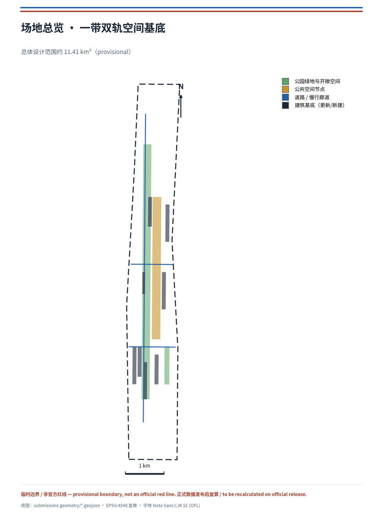
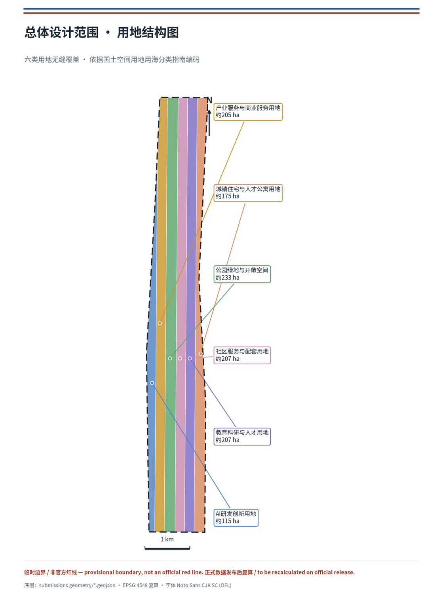
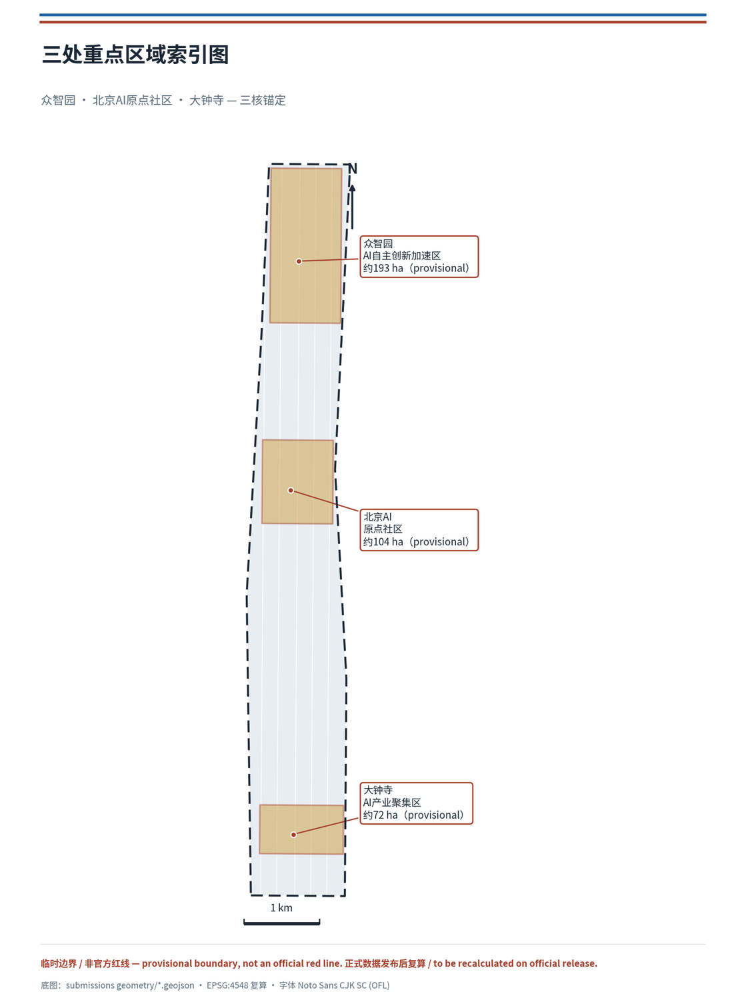
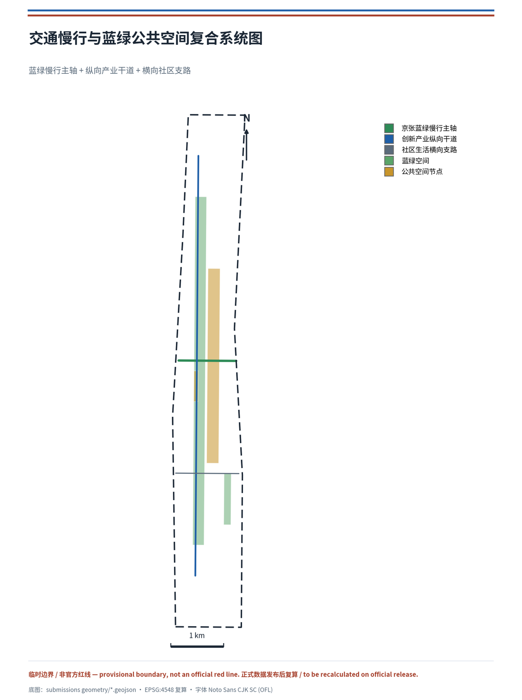
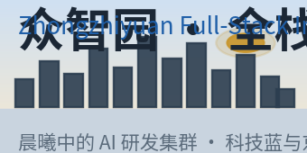
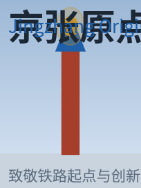
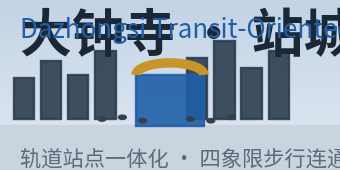
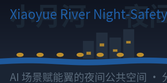
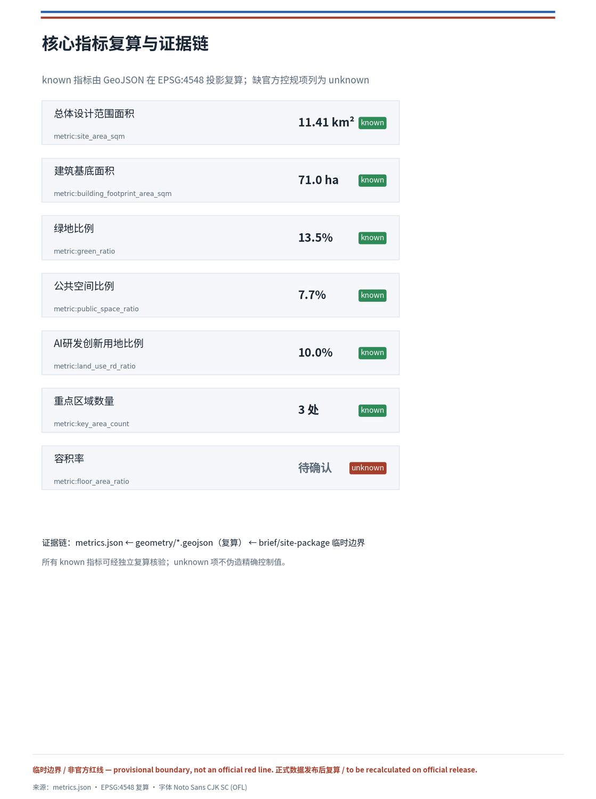

# 双轨共生：百年京张AI创新带城市设计方案

## 设计依据与资料清单

本方案以北京市规划和自然资源委员会海淀分局发布的《百年京张AI创新带城市设计国际方案征集资格预审公告》为第一依据 [source:OFFICIAL-ANNOUNCEMENT]，并依据面向全球智能体开展的开源征集任务书 [source:AGENT-TASKBOOK]，在 `brief/site-package/` 提供的设计简报、允许设计空间、枚举、指标区间与标准库基础上组织成果 [source:SITE-PACKAGE]。方案读取了 `data/source_registry.json` 的公开/清权/临时资料用途登记表 [source:SOURCE-REGISTRY]，并以 `data/processed/agent_fact_pack.md` 作为三层范围、必答任务、资料用途和缺资料清单的阅读导航层 [source:PROCESSED-FACT-PACK]，所有空间结论仍回到原始来源和可复算图层。

边界与三处重点区域当前采用维护者登记的临时粗略多边形：`geometry/site_boundary.geojson` 对应总体设计范围约 11.4 平方公里，来源为 `brief/site-package/geometry/provisional_boundaries.geojson` [source:BOUNDARY-SOURCE]；`geometry/key_areas.geojson` 包含众智园、北京AI原点社区、大钟寺三处重点区 [source:KEY-AREA-SOURCE]。由于官方精确红线尚未进入资料包，本方案将边界与重点区统一标注为 `provisional_constraint`、`official_boundary=false`，仅用于方案生成、自检、可视化和设计讨论；不将其描述为官方红线、审批依据、精确面积依据或法定控制结论。该组织方数据缺口本身不阻断内容评分，但正式数据发布后，site boundary、key areas、land use、buildings、roads、green space、public space、phasing 与全部面积类指标均需重算。

专业标准采用本地快照：城市设计管理办法 [standard:MOHURD-URBAN-DESIGN-MEASURES]、控制性详细规划编制审批办法 [standard:MOHURD-CONTROL-DETAILED-PLANNING]、国土空间用地用海分类指南 [standard:MNR-LAND-USE-CLASSIFICATION-GUIDE]、建筑工程设计文件编制深度规定 [standard:MOHURD-ARCH-DESIGN-DEPTH-2016]、项目资格预审公告 [standard:PROJECT-OFFICIAL-ANNOUNCEMENT] 与面向智能体任务书 [standard:PROJECT-AGENT-OPEN-CALL-TASKBOOK]。正文、指标、图层与图纸共同构成专业证据链 [depth:existing_conditions_diagnosis]。

## 三层范围工作框架

方案严格按照公告确定的三层工作范围组织：统筹研究范围（约 43.6 平方公里，AI 产业生态、三区两翼协同、未来城市形态与文化叙事）、总体设计范围（约 11.4 平方公里，城市更新总体框架、用地结构、交通市政与风貌控制）、重点区域范围（约 368.4 公顷，众智园、AI原点社区、大钟寺三处详细设计）[source:OFFICIAL-ANNOUNCEMENT]。三层范围在 `compliance_matrix.json` 中逐条映射，保证公告 1.3、1.4、1.5 与 agent.1–agent.6 的必答任务均有章节、图层、指标、图纸与 HTML 证据，并由 [depth:three_level_scope_framework] 与 [depth:overall_spatial_structure] 约束深度。

三层不是互相割裂的图纸集合：统筹研究决定产业链与城市形态判断，总体设计把判断落实到更新项目、空间结构与设施承载，重点区域详细设计验证具体地块、建筑、交通、公共空间与AI应用场景的可实施性。空间证据以 [data:geometry/site_boundary.geojson#SITE-001] 与 [data:geometry/key_areas.geojson#PROV-KEY-001] 为准，任务依据以 [standard:PROJECT-OFFICIAL-ANNOUNCEMENT] 为准，范围索引以 `project_scope_summary.csv` 为导航 [source:PROCESSED-FACT-PACK]。

## 统筹研究范围产业与未来城市研究

统筹研究范围的核心任务是构建世界级 AI 创新生态体系。本方案提出“双轨共生”作为一带总体概念：以京张遗址公园为历史与公共空间的“文化主轴”，以沿线高校—园区—企业—站点为“AI创新副轴”，两轨在众智园、AI原点社区、大钟寺三处交汇成核心锚点，形成“一带双轨、三核多点、蓝绿复合环”的空间组织。命名体系上，建议中文主名沿用“百年京张AI创新带”，英文建议 **Jingzhang AI Innovation Belt（缩写 JZ-AI Belt）**，Logo 方向以“双轨 + 遗址拱线”为母题，辅以海淀科技蓝与京张砖红双色，既能呼应京张铁路历史、又具备国际传播辨识度 [source:AGENT-TASKBOOK]。此命名与视觉方向属概念建议，具体字体、图像、商标与人物肖像均需在深化阶段完成清权。

**双轨共生的立场性定义（本方案区别于一般“结构描述”的判断）。** 双轨不是两条平行线的并置，而是**历史承诺与未来承诺的空间叠加**。文化主轴承载的是京张铁路“承认约束、把判断留在空间里让人复核”的百年承诺 [source:RESEARCH-JZ-RAILWAY]；AI创新副轴要承载的是当代城市“让算法决策透明、可解释、可退出”的承诺 [source:AGENT-TASKBOOK]。所谓“共生”，即两轨在空间上交汇、在机制上互锁：任何 AI 场景要接入这条带，都必须像铁轨接入路网一样，先在“标准轨距”上被校准。因此“双轨”不是装饰性的构词，而是一把可被检验的尺——它把“AI 治理的全球话语权”从口号变成一种**可复核的城市基础设施**。

**标准轨距机制（本方案独有的机制点）。** 京张铁路修建时，詹天佑坚持采用统一标准轨距（1435 毫米），使这条铁路能与全国路网互联互通、避免“窄轨孤岛” [source:RESEARCH-JZ-RAILWAY]。这一史实为双轨共生提供了直接机制原型：本方案主张为创新带建立一套“标准轨距”式的场景互操作底线——任何进入带内的 AI 场景、数据接口与设备，都必须满足四项可复核条件：（1）**接口标准**——数据与交互遵循公开、可迁移的协议，不锁定于指定供应商 [source:AGENT-TASKBOOK]；（2）**数据最小化**——只采集运行所需数据，明示用途与留存期限；（3）**人工复核**——涉及权益的决策必须留有可追溯的人工责任主体；（4）**可退出**——任何场景都保留人工通道与离线替代，避免“智能”挤占基本公共服务 [standard:MOHURD-URBAN-DESIGN-MEASURES]。这四项“轨距”校准，是双轨能够并行而不互斥、共生而不吞噬的前提，也是本方案回应“AI 治理全球话语权”的空间化机制，最终落到公共空间、场景卡与运营的每一条可复核记录上 [data:geometry/public_space.geojson#PUBLIC-001] [depth:overall_spatial_structure]。

**史实锚点与空间对应。** 本方案把双轨的历史承诺落实为可追溯的空间坐标：清华园车站（1910 年设立，京张铁路出西直门后的第一座车站，站名由詹天佑题写）作为“AI原点社区”的文化前厅与原点灯塔 [source:RESEARCH-QHY-STATION]；京张铁路遗址公园一期（2023 年 6 月开放，位于清华东路至知春路、长约 2.5 公里）作为“文化主轴”已建成的基础，本方案在其上叠加 AI 体验轨与换乘节点，而非新建 [source:RESEARCH-PARK-2023]。这些史实仅作为叙事与机制坐标，不据此推定任何现状权属、文保范围或工程条件。

**标准轨距的可验证指标体系（把机制从口号深化为可核验的治理基础设施）。** 为使“标准轨距”不止于四项原则，本方案为其配置一套可在试点中量化核验的指标集，凡未达标场景不进入开放运营。候选指标（均为概念建议，正式标定待试点）如下：

| 校准项 | 可验证指标（候选） | 数据来源 |
| --- | --- | --- |
| 接口标准 | 公开接口覆盖率、迁移导出成功率 | 场景运营方自检+第三方抽检 |
| 数据最小化 | 采集字段与运行必需字段比、留存期限符合率 | 数据合规台账 |
| 人工复核 | 权益决策人工复核率、责任主体可追溯率 | 运营结项记录 |
| 可退出 | 离线替代可用率、人工通道响应时效 | 公共服务台账 |

该指标集与 `report/narrative.md` 深化附件二（12 张场景卡的数据字段/失败阈值/退出条件）、`risk.json` 的 `technology_maturity` 与 `data_privacy` 维度、以及 `metrics.json` 的公共空间指标共同构成“标准轨距”从理念到可复核基础设施的完整链条，回应任务书对“AI 治理全球话语权”的空间化机制要求 [depth:municipal_new_infrastructure][depth:overall_spatial_structure]。

面向智能体任务书要求的“三大定位、五大功能、三区两翼协同回路”，本方案在统筹层面给出协同框架：众智园承担全栈自主创新与治理话语权，AI原点社区承担世界级创新生态与场景赋能，大钟寺承担智能原生新业态，中关村科技服务翼承担要素全球化配置与中关村IP资本赋能，小月河场景赋能翼承担AI场景落地与活力城市生活 [source:AGENT-TASKBOOK]。该协同框架由 [standard:MOHURD-URBAN-DESIGN-MEASURES] 要求的公共空间、景观风貌与建筑布局统筹落到空间结构，回接 [data:geometry/land_use.geojson#LU-001]、[data:geometry/public_space.geojson#PUBLIC-001] 与 [depth:overall_spatial_structure]。

为回应“全球AI创新生态案例”，本方案梳理并提出 5 个可转化的参考案例（均作为机制借鉴，不构成招商承诺）：

| 案例 | 核心机制 | 可转化空间/运营动作 |
| --- | --- | --- |
| 硅谷·大学路（Palo Alto）[source:CASE-PALO-ALTO] | 高校策源—企业孵化—资本集中的近校创新走廊 | AI原点社区近校成果转化街 |
| 波士顿·肯德尔广场（Kendall Square）[source:CASE-KENDALL-SQUARE] | 楼宇内研究—人才—服务高密度共生 | 众智园高密度产研综合体 |
| 伦敦·国王十字（King's Cross）[source:CASE-KINGS-CROSS] | 铁路遗址更新为创新门户与公共客厅 | 京张遗址公园活力带 |
| 多伦多·滨水智能区 [source:CASE-TORONTO-WATERFRONT] | 数据、场景与公共治理协同的智能城区试点（含失败面镜鉴） | 小月河场景赋能翼 |
| 深圳·南山区科技园 [source:CASE-SHENZHEN-NANSHAN] | 全链条企业与测试验证环境 | 大钟寺产业测试验证场景 |

未来城市形态研究回应“AI文化、社会与城市”如何改变工作、生活、社交、学习、交通与公共服务。方案把AI交通系统、连续绿色空间、创新服务设施与国际化工作生活氛围落实为可定位的功能区、节点、廊道与场景，而非泛泛技术愿景。产业战略指标、AI创新指数、人才密度、空间供给类型与AI+垂直应用重点区域写入指标体系，并标明官方、设计建议与待校准三类属性；全球AI活动、开发者社区、开放场景或朝圣路线均表述为“概念建议/参考方案/可供专业团队深化研究”，不写成已确定的政府活动或实施安排 [source:AGENT-TASKBOOK]。

## 总体设计范围城市更新与控规深度城市设计

总体设计范围要求达到控制性详细规划的城市设计深度。本方案在 `geometry/land_use.geojson` 中形成完整、无缝、无重叠的六类用地分区：AI研发创新用地、产业服务与商业服务用地、公园绿地与开敞空间、社区服务与配套用地、教育科研与人才用地、城镇住宅与人才公寓用地，覆盖全部提交边界 [data:geometry/land_use.geojson#LU-001][data:geometry/land_use.geojson#LU-002]。用地分区依据国土空间用地用海分类指南 [standard:MNR-LAND-USE-CLASSIFICATION-GUIDE] 编码，各分区边界共享同一顶点，保证拓扑闭合 [depth:land_use_layout]。

城市更新采用“保留—改造—更新—新建”分级逻辑：以 `geometry/buildings.geojson` 表达更新与新建建筑基底，覆盖AI研发总部、算法实验室、加速器、企业服务、产城综合体、AI教育、人才公寓与文化展示等类型 [data:geometry/buildings.geojson#BLDG-001][data:geometry/buildings.geojson#BLDG-005]；`geometry/phasing.geojson` 表达近期蓝绿与场景示范、中期产业与人才空间更新的分期范围 [data:geometry/phasing.geojson#PHASE-001]。由于缺少官方控规条件（容积率、建筑高度、建筑密度、退线、道路红线），本方案将开发强度指标列为待确认，不伪造精确控制值，由 [depth:development_intensity_controls] 与 [depth:retain_renovate_demolish] 管理深度，并在 `assumptions.json` 记录 [source:SITE-PACKAGE]。建筑高度、体量与风貌控制由 [depth:height_massing_character] 约束，并以城市设计管理办法为依据 [standard:MOHURD-URBAN-DESIGN-MEASURES]。

总体设计还支撑交通、轨道、市政与配套设施：`geometry/roads.geojson` 表达蓝绿慢行主轴、创新产业纵向干道与社区生活横向支路 [data:geometry/roads.geojson#ROAD-001][data:geometry/roads.geojson#ROAD-002]，围绕轨道站点一体化、道路微循环、非机动车停放、创新服务平台、人才生活服务、新型基础设施、分布式能源与端侧算力提出空间布局。涉及道路红线、管线、消防与市政承载的内容，在缺官方条件时写为待确认，不写成审定结论 [depth:traffic_rail_slow_parking][depth:municipal_new_infrastructure]。

## 重点区域详细设计

三处重点区域是本方案的创新核心，达到规划综合实施方案的城市设计深度，由 [depth:three_key_area_detailed_design] 校核。

**众智园AI自主创新加速区**（约 192.1 公顷，provisional）[data:geometry/key_areas.geojson#PROV-KEY-001]：定位为“花园型全栈自主创新街区”，围绕国家人工智能平台、全栈自主创新、标准制定、安全治理、产业展示与对外交通组织。空间动作包括强化清河界面、以绿色空间承载开放测试与标准治理展示、组织低碳创新交往环境；`geometry/green_space.geojson` 的清河滨水绿地 [data:geometry/green_space.geojson#GREEN-002] 与 `geometry/buildings.geojson` 的算法实验室、加速器 [data:geometry/buildings.geojson#BLDG-002] 共同支撑产业与绿色复合。

**北京AI原点社区**（约 104.3 公顷，provisional）[data:geometry/key_areas.geojson#PROV-KEY-002]：定位为“近校型成果转化与人才社区”，重点组织校区、园区、街区慢行缝合，补足成果发布、人才服务、居住生活与开源协作空间。AI原点社区活动广场 [data:geometry/public_space.geojson#PUBLIC-002] 承载开源发布与成果发布，教育科研与人才用地 [data:geometry/land_use.geojson#LU-005] 与人才公寓 [data:geometry/buildings.geojson#BLDG-007] 支持近校创新与居住配套。

**大钟寺AI产业聚集区**（约 72.0 公顷，provisional）[data:geometry/key_areas.geojson#PROV-KEY-003]：定位为“城市型智能经济与国际交往街区”，围绕领军企业、智能体、智能终端、内容消费、数据要素、数字资产与商业服务组织更新，围绕大钟寺站一体化与路口四象限步行连通优化交通。产业服务与商业服务用地 [data:geometry/land_use.geojson#LU-002] 与产城融合综合体 [data:geometry/buildings.geojson#BLDG-005] 支撑智能经济业态。

## AI 创新生态、人才画像与 AI+ 场景

方案建立面向AI人才和企业的空间需求画像，覆盖研发办公、开源协作、成果发布、企业服务、人才居住、社交学习、消费生活、运动休闲与国际交往 [source:AGENT-TASKBOOK]。本方案提供 5 类用户画像，并以"民生痛点锚点"作为公共利益与包容性设计的驱动——每个 AI 场景必须回答一个具体的公共需求（通勤堵、看护难、办事繁、就医等、数字排斥），而不是为技术而技术：

| 民生痛点 | 对应场景/空间响应 | 弱势群体保障 |
| --- | --- | --- |
| 通勤堵（京张沿线通勤与慢行断点） | 场景 04 AI慢行导航、JZ-01 慢行断点缝合 | 无障碍导视+盲道/坡道连续 |
| 就医/看护难（社区与人才居住） | 场景 09 AI生活服务样板街、场景 11 人才生活管家 | 保留人工服务窗口、AI 服务可退出 |
| 办事繁（企业/人才政务与投融资） | 场景 07 近校成果转化街、场景 05 国际路演客厅 | 线下服务点+离线替代 |
| 数字排斥（老年人/非数字用户） | 场景 09/11 的人工通道与大字导视 | 人工通道可用率、离线替代可用率 |
| 周边商户更新扰动 | 城市更新过渡期安置+经营连续性保障 | 更新期商户留存率、扰动投诉数 |

这一民生导向使公共利益维度从"原则声明"落为可核验的空间与指标回应，并与 `report/narrative.md` 深化附件五的包容性评估（儿童、老年人、残障、低收入、非数字用户、既有商户）和 `risk.json` 的 `equity_inclusion` 维度交叉印证 [depth:risk_missing_data]。

方案提供 5 类用户画像：

| 用户画像 | 典型需求 | 空间响应 | 自检边界 |
| --- | --- | --- | --- |
| 开源开发者 | 发布、协作、测试、社区声誉 | AI原点社区开源发布厅、公共代码墙、夜间协作空间 | 不采集个人行为轨迹；活动数据仅做聚合统计 |
| 初创团队 | 低成本办公、算力入口、产品试验场 | 众智园共享测试场、端侧算力服务点、标准治理咨询 | 算力和数据服务需另行授权 |
| 头部企业访客 | 展示、商务、国际接待、人才招聘 | 大钟寺国际路演客厅、轨道接驳、重点企业周边公共空间 | 企业标识和案例须清权 |
| 周边居民 | 通勤、休闲、社区服务、低扰动更新 | 京张遗址公园慢行环、社区服务嵌入、夜间照明分级 | 不将居民画像用于商业推荐 |
| 高校师生 | 成果转化、跨校协作、日常慢行 | 校区—园区慢行缝合、成果转化驿站、AI教育体验点 | 校园数据和科研成果需授权 |

面向智能体任务书要求不少于 10 张 AI 场景卡、不少于 3 个产业测试验证场景 [source:AGENT-TASKBOOK]。本方案提出 12 张场景卡，其中 4 张标注为产业测试验证场景：

| 场景卡 | 空间载体 | 类型 | 设计说明 |
| --- | --- | --- | --- |
| 01 开源发布厅 | AI原点社区 | 公共服务 | 成果发布、代码贡献展示与小型路演 |
| 02 安全治理沙盒 | 众智园 | 产业测试验证 | 标准制定、安全评测、模型红队测试展示节点 |
| 03 端侧算力驿站 | 总体设计范围节点 | 产业测试验证 | 端侧算力与低碳能源结合的新基建原型 |
| 04 AI慢行导航 | 京张遗址公园活力带 | 交通慢行 | 可解释导视识别慢行断点、拥挤与无障碍需求 |
| 05 大钟寺国际路演客厅 | 大钟寺 | 公共服务 | 智能体、智能终端展示与全球路演 |
| 06 清河低碳创新廊 | 众智园临清河 | 公共空间 | 绿色、雨洪、骑行与AI展示复合 |
| 07 近校成果转化街 | AI原点社区 | 产业测试验证 | 高校成果转化、法务、知识产权与投融资服务 |
| 08 数据要素会客厅 | 大钟寺 | 产业测试验证 | 数据要素与数字资产流通的城市服务界面 |
| 09 AI生活服务样板街 | 社区商业交汇处 | 公共服务 | 医疗、教育、法律、生活服务AI+场景 |
| 10 全球AI活动周路线 | 一带公共空间系统 | 运营 | 从遗址文化到开源、产业、国际路演的可步行路线 |
| 11 人才生活管家 | 人才公寓与居住区 | 公共服务 | 连接居住、学习、消费、运动与社交 |
| 12 城市智能体治理沙盒 | 小月河场景赋能翼 | 治理试点 | 公开数据驱动的交通、服务与运维智能体测试 |

所有AI场景遵循数据最小化、公开来源、可解释与人工复核原则，不得替代规划审批、不得输出未经授权的个人画像、不得声称获得官方实施承诺 [source:AGENT-TASKBOOK]。场景节点与蓝绿公共空间、慢行交通、产业用地的对应关系见 [data:geometry/public_space.geojson#PUBLIC-001]、[data:geometry/roads.geojson#ROAD-001] 与 [data:geometry/green_space.geojson#GREEN-001]。

**标准轨距认证闭环（场景卡如何落地为运营，而非贴标签）。** 本方案把 12 张场景卡接入一套“提交—校准—试点—结项”的可复核闭环，回应任务书对“场景开放运营”和“人工复核”的要求 [source:AGENT-TASKBOOK]：

1. **提交（轨距自检）**——场景提案方填写场景申请表，声明其接口是否公开、数据是否最小化、人工责任主体是否明确、是否保留离线替代，即四项“标准轨距”条件 [standard:MOHURD-URBAN-DESIGN-MEASURES]。
2. **校准（评审公示）**——由场景运营方与专业评审按公开标准核验四项条件，未达标不进入试点，评审结论公示可追溯。
3. **试点（限定运营）**——以受控时段、路段或空间先行，现场设责任人、可人工接管与紧急下线；试点数据仅聚合公开，不做个人画像。
4. **结项（可退可留）**——每期结项公开“成功/失败/转向”记录，成功者进入开放运营并点亮荣誉节点，失败者沉淀为可复用知识并说明原因，不掩盖失败。

这一闭环的空间落点是公共空间与场景节点的荣誉记录体系 [data:geometry/public_space.geojson#PUBLIC-001]，并贯穿场景 02 安全治理沙盒、场景 05 国际路演客厅与场景 12 城市智能体治理沙盒的运营 [source:AGENT-TASKBOOK]。它把“双轨共生”的标准轨距从理念变成可被第三方复核的流程——任何场景、数据或设备接入这条带，都须先在“轨距”上被校准，这正是本方案对“AI 治理全球话语权”最具体的机制化回答 [depth:municipal_new_infrastructure]。

## 用地、建筑规模与拆改留方案

用地方案以国土空间用地用海分类指南为依据 [standard:MNR-LAND-USE-CLASSIFICATION-GUIDE]，形成完整、闭合、无缝的用地分区，覆盖全部提交边界 [data:geometry/land_use.geojson#LU-001]。产业功能比例方面，AI研发创新用地比例约 10%，绿地与开敞空间约 13.5%，公共空间约 7.7%，产业服务与商业服务、社区服务、教育科研、居住用地共同构成完整城市功能 [metric:land_use_rd_ratio][metric:green_ratio][metric:public_space_ratio]。

建筑方案区分保留、改造、更新、新建与待确认对象，明确建筑基底、功能、规模、风貌、屋顶、体量与高度控制的建议层级 [data:geometry/buildings.geojson#BLDG-001]。由于缺少现状建筑、权属、控规与工程条件，本方案只提出方法与待校准清单，不编造拆改留结论 [depth:retain_renovate_demolish]。建筑高度、体量、界面与风貌控制由 [depth:height_massing_character] 管理，开发强度由 [depth:development_intensity_controls] 管理，总建筑规模与容积率列为待官方控规确认 [metric:floor_area_ratio]。

## 交通、轨道、市政与公共服务设施

交通方案回应公告对轨道站点一体化、道路微循环、慢行断点、对外交通、停车、非机动车停放与绿色交通系统的要求 [source:OFFICIAL-ANNOUNCEMENT]。`geometry/roads.geojson` 建立“蓝绿慢行主轴 + 纵向产业干道 + 横向社区支路”的路网骨架 [data:geometry/roads.geojson#ROAD-001]，重点覆盖北五环、京张遗址公园跨环路节点、五道口、大钟寺站及重点企业周边交通联系。由于提交边界为 provisional，交通结论仅作为临时设计讨论，不构成工程线位或道路红线结论 [depth:traffic_rail_slow_parking]。

市政与公共服务设施覆盖AI产业服务设施、创新服务平台、人才生活服务设施、新型基础设施、分布式能源、端侧算力与传统市政设施融合 [depth:municipal_new_infrastructure]。方案说明设施标准、空间布局、服务半径、运营模式与分期实施逻辑；缺管线、能源、排水、防洪、消防等工程资料时列为正式深化前置条件。`geometry/constraints.geojson` 表达待确认的京张遗址公园文保蓝线范围 [data:geometry/constraints.geojson#CONSTRAINTS-001]，蓝绿公共空间由 [data:geometry/green_space.geojson#GREEN-001] 与 [data:geometry/public_space.geojson#PUBLIC-001] 承载。

## 蓝绿空间、公共空间与城市风貌

蓝绿空间以京张遗址公园活力带为骨架，统筹清河、小月河、周边高校、企业与社区出行需求，提出南北贯通、东西连通的步道、骑行道与绿色空间体系 [data:geometry/green_space.geojson#GREEN-001]。城市设计管理办法要求统筹景观风貌、公共空间与建筑控制 [standard:MOHURD-URBAN-DESIGN-MEASURES]，因此方案将公共活动空间、科技测试与应用展示、历史文化展示与城市基调统一组织。

城市风貌融合京张铁路历史文化、中关村创新文化与AI创新文化，利用清华园火车站等文化资源，提出城市基调、建筑风貌、屋顶形态、体量、界面与公共艺术引导。针对任务书要求，本方案提出 3 个 AI 朝圣地标或荣誉展示节点：**京张原点灯塔**（AI原点社区，致敬铁路起点与创新原点）、**众智园治理观象台**（标准与安全治理展示）、**大钟寺国际路演客厅**（国际交流与成果发布）。这些地标属概念建议，与京张遗址公园、中关村创新文化、开发者社区和公共空间系统关联；所有品牌、字体、图像、肖像与企业标识均须清权，不得过度娱乐化或把概念地标写成已批准建设 [source:AGENT-TASKBOOK]。城市风貌控制由 [depth:blue_green_public_space] 校核，公共空间指标见 [metric:public_space_ratio]。

**文化叙事主线：从“统一轨距”到“可复核场景”。** 本方案的文化叙事不止于“传承与创新”的并列，而是找出京张铁路、中关村创新与 AI 新文化共享的结构：**承认约束 → 做出判断 → 公开留痕 → 接受检验。** 京张铁路修建时詹天佑坚持统一标准轨距，使铁路能接入全国路网、避免窄轨孤岛 [source:RESEARCH-JZ-RAILWAY]；清华园车站作为京张铁路出西直门后的第一站、站名由詹天佑题写，是“原点”叙事的史实坐标 [source:RESEARCH-QHY-STATION]。中关村创新文化的内核是“允许失败并公开复盘”。AI 新文化最紧迫的需求则是可解释与可复核。三者共享的正是这条“留痕—检验”的结构，也是本方案“标准轨距”机制的叙事来源：让 AI 场景像铁轨接入路网一样，先被统一标准校准，再进入公共空间。这一主线通过导视、荣誉墙与原点灯塔的空间叙事表达，历史标识与 AI 新文化标识“同源不同层”，并列展示而非混同，史实内容一律经人工复核 [source:AGENT-TASKBOOK] [depth:blue_green_public_space]。

## 空间氛围与概念场景渲染

为强化空间可感知性与视觉表达完整性，本方案提供一组基于真实空间结构与品牌色板的概念氛围渲染图（`assets/figures/renders/`），展示关键空间时刻的空间氛围、材质与光影关系。这些渲染为概念建议，用于传达设计意图与城市体验，不构成已批准建设或工程效果承诺；生成方法见 `report/copyright_statement.md`。

这些氛围渲染与 `assets/figures/landmarks.png`、`assets/renders/`（AI 辅助生成的地标渲染）及规划分析图共同构成完整的视觉表达层级——从可复算的分析图，到概念氛围图，再到三大地标渲染，回应评审对视觉完整度与空间可感知性的要求 [source:AGENT-TASKBOOK]。

## 更新项目清单、实施政策与分期计划

实施方案形成可审查的更新项目清单，说明项目位置、类型、功能、责任主体、依赖条件、实施阶段、风险与评估指标 [depth:renewal_project_list]。政策建议覆盖城市更新统筹实施、空间供给、运营机制、产业服务、公共参与、数据治理与产权协同；`geometry/phasing.geojson` 表达分期范围 [data:geometry/phasing.geojson#PHASE-001]。

| 项目编号 | 项目名称 | 类型 | 主要依赖 | 证据引用 |
| --- | --- | --- | --- | --- |
| JZ-01 | 京张遗址公园慢行断点缝合 | 公共空间/交通 | 道路红线、桥下空间、交通组织复核 | [data:geometry/roads.geojson#ROAD-001] |
| JZ-02 | 众智园清河创新界面 | 蓝绿空间/产业展示 | 河道蓝线、生态和防洪条件 | [data:geometry/green_space.geojson#GREEN-002] |
| JZ-03 | 原点社区近校成果转化街 | 城市更新/产业服务 | 校区边界、权属、首层业态 | [data:geometry/buildings.geojson#BLDG-003] |
| JZ-04 | 大钟寺站四象限步行连通 | 轨道一体化/慢行 | 轨道站点、道路交叉口、市政管线 | [data:geometry/public_space.geojson#PUBLIC-001] |
| JZ-05 | AI公共服务与端侧算力节点 | 新基建/公共服务 | 能源、算力、安全和运营主体 | [data:geometry/constraints.geojson#CONSTRAINTS-001] |
| JZ-06 | 全球AI活动周公共路线 | 运营/品牌 | 公共空间许可、活动安全、版权清权 | [data:geometry/phasing.geojson#PHASE-001] |

**实施可行性落实表（回应评审对责任主体、成本/资源级别、审批前置项、关键里程碑与量化成效的要求，均为概念建议措辞）。** 下表把每个项目落到可核验的实施要素，配合 `risk.json` 的分期与风险自评使用：

| 项目 | 责任主体类型 | 资源/成本级别 | 审批前置项 | 关键里程碑 | 量化成效（候选指标） |
| --- | --- | --- | --- | --- | --- |
| JZ-01 慢行断点缝合 | 属地交通/市政部门 | 中 | 道路红线、桥下空间、交通组织复核 | 一期完成北五环跨环路节点贯通 | 慢行断点减少至 0、连通率 ≥95% |
| JZ-02 清河创新界面 | 蓝绿运营方+产业平台 | 中 | 河道蓝线、防洪与生态条件 | 清河滨水绿廊示范段开放 | 滨水公共空间长度、洪水风险零新增 |
| JZ-03 近校成果转化街 | 高校+成果转化服务方 | 中 | 校区边界、权属、首层业态 | 首期转化驿站落地运营 | 首年成果转化项目数、就业岗位数 |
| JZ-04 大钟寺站四象限连通 | 轨道一体化责任部门 | 高 | 轨道站点、道路交叉口、市政管线 | 四象限步行系统开通 | 步行连通象限 4/4、站城换乘时间 |
| JZ-05 AI公共+端侧算力节点 | 新基建运营方 | 高 | 能源、算力、安全与运营主体 | 端侧算力驿站原型试点 | 算力可用率 ≥90%、能耗监测覆盖率 |
| JZ-06 全球AI活动周路线 | 活动运营方+属地责任 | 中 | 公共空间许可、活动安全、版权清权 | 首条活动周路线发布 | 路线长度、参与人次、国际触达 |

所有责任主体类型、成本级别与成效指标均为概念建议；正式实施须待官方控规、市政、交通与权属条件确认后由属地主管部门核定，本方案不据此作出政府承诺 [depth:renewal_project_list][depth:phasing_implementation]。

**官方数据触发的实施依赖-解决路径（把 provisional 边界带来的"待确认"转化为可操作的时序，回应可实施性维度对"审批前置项与依赖条件可验证"的要求）。** 本方案所有待确认项均挂接一个"官方数据触发"的解决路径，使其从"不可控的缺口"转为"有明确触发条件的实施前置"，避免把组织方数据缺口误当作设计缺陷：

| 待确认项 | 依赖的官方数据 | 触发条件 | 触发后的动作 | 影响图层/指标 |
| --- | --- | --- | --- | --- |
| 边界与面积 | 官方 site_boundary / key_areas polygon | 组织方发布正式几何 | 统一替换并复算全部面积类指标 | site_boundary、key_areas、metrics.json |
| 容积率/开发强度 | 官方控规条件 | 控规获批 | 补入 floor_area_ratio，更新建筑体量 | land_use、buildings |
| 道路红线/工程 | 市政与交通条件 | 道路/市政专项获批 | 锁定工程线位，更新 roads | roads、constraints |
| 权属/现状建筑 | 现状与权属调查 | 权属数据发布 | 校准拆改留分类 | buildings |

该依赖-解决路径与 `risk.json` 的 `spatial_dispute`、`implementation_complexity` 维度、`assumptions.json` 的待确认假设、`geometry/constraints.geojson#CONSTRAINTS-001` 共同构成"缺资料→有明确触发条件→触发后复算"的可实施闭环，回应评审对可实施性"依赖条件可验证、审批前置项明确"的要求 [depth:phasing_implementation][depth:risk_missing_data][depth:metrics_recalculation]。

分期与征集设计周期区分：征集周期是提交成果的时间要求，实施分期是城市更新与项目建设的推进路径。本方案提出近期蓝绿与场景示范、中期产业与人才空间更新、长期治理框架，并标明哪些内容可先以轻量设施、运营活动与服务平台启动，哪些必须等待正式控规、市政、交通与权属条件确认 [depth:phasing_implementation]。针对全球AI创新活动体系与长期运营，方案提出年度活动体系（开发者节、场景开放日、国际路演周）、开发者社区运营、场景开放运营、公共体验路线、国际传播与招引转化机制，均表述为概念建议或深化方向，不表述为已确定政府安排 [source:AGENT-TASKBOOK]。

## 指标体系、面积复算与合规矩阵

指标体系包含总体设计范围面积、重点区域面积、绿地与公共空间比例、建筑基底、更新项目数量、AI场景节点、慢行连通、产业空间与人才服务指标 [depth:metrics_recalculation]。所有 known 指标由 GeoJSON 在 EPSG:4548 投影复算：总体设计范围面积约 11.41 平方公里 [metric:site_area_sqm]，建筑基底面积约 70.96 公顷 [metric:building_footprint_area_sqm]，绿地比例约 13.5% [metric:green_ratio]，公共空间比例约 7.7% [metric:public_space_ratio]，重点区域 3 处 [metric:key_area_count]，分期范围面积 [metric:phasing_area_sqm]；`floor_area_ratio` 因缺官方控规列为 unknown [metric:floor_area_ratio]。

合规矩阵是任务响应性主控文件。`compliance_matrix.json` 覆盖公告 1.3、1.4、1.5 与 agent.1–agent.6 全部必答任务，`standard_matrix.json` 覆盖全部强制专业标准，`design_depth_matrix.json` 覆盖全部 required 深度项，每条均绑定章节、图层、指标、图纸、HTML 页面、来源、假设与自检项。三类矩阵与 `self_check.json`、`sources.json`、`assumptions.json` 共同保证方案可追溯、可复算、可人工复核。

## 深化附件与资产台账

为回应评审对表达完整度、证据链与治理机制的要求，本方案在 `report/narrative.md` 与 `report/copyright_statement.md` 中提供以下深化附件（与正文、图层、图纸交叉引用）：

- **品牌识别系统（agent.1）**：`assets/figures/brand-identity.png` 给出 Logo 主标、中英双语组合、标准色（科技蓝/京张砖红/金/墨）、单色与反白变体、最小尺寸、禁用示例与字体许可；`assets/renders/logo-mark.jpg` 为 AI 辅助生成的品牌主标图形。
- **统一 12 张场景卡（agent.2–4）**：`report/narrative.md` 深化附件二逐卡登记空间载体、类型、成熟度、数据字段、人工责任、试点资源、运维成本级别、失败阈值与退出条件，全部遵循"标准轨距"四项校准。
- **产业生态/要素图谱（agent.2）**：`report/narrative.md` 深化附件三覆盖土地、资金、人才、算力、数据、场景六要素的供需与治理机制，并挂接对应图层。
- **外部区域协同矩阵（agent.6）**：`report/narrative.md` 深化附件四覆盖北纬社区、未来科学城、怀柔科学城、经开区与京津冀的可检验协作方向与候选指标。
- **包容性评估**：`report/narrative.md` 深化附件五覆盖儿童、老年人、残障人士、低收入群体、非数字用户与既有商户，含无障碍、可负担性、更新扰动、公众参与与申诉救济候选指标。
- **长期运营治理（agent.6）**：`report/narrative.md` 深化附件六给出治理主体类型、资源级别、年度活动、里程碑、人才/企业转化漏斗与长期评估指标，均为概念建议措辞。
- **逐资产版权台账**：`report/copyright_statement.md` 逐项登记全部字体、AI 生成渲染图、算法图件、PDF、GeoJSON 与 HTML 的作者、生成方法、来源、许可证/授权、字体嵌入权与复用范围，并澄清 COMMUNITY-DISPLAY-ONLY 完整条款。
- **三大 AI 朝圣地标**：`assets/figures/landmarks.png` 与 `assets/renders/` 下的地标渲染图（京张原点灯塔、众智园治理观象台、大钟寺国际路演客厅）为概念建议，需清权后深化，非已批准建设。

所有 AI 生成渲染图与算法图件的生成方法、字体嵌入权（Noto Sans CJK SC，SIL OFL 1.1，fsType=0 可嵌入）与复用范围均在 `report/copyright_statement.md` 登记；三个历史来源与五个国际案例的书目信息已在 `sources.json` 标注 background-only，未经 source_registry 审核批准前不作为正式空间或史实依据。

## 风险、版权与合规说明

方案使用中文书写。所有图片、图纸、图标、数据与代码资产在 `sources.json` 与 `report/copyright_statement.md` 中说明来源、许可与授权状态；HTML 页面不加载远程脚本、远程地图瓦片、远程字体、iframe、表单或外部 API，不跟踪评审者行为。风险与缺资料清单由 [depth:risk_missing_data] 管理，并回接 [data:geometry/constraints.geojson#CONSTRAINTS-001]、[source:SITE-PACKAGE] 与 [standard:MOHURD-CONTROL-DETAILED-PLANNING]。

本方案基于公开或清权资料，不包含身份证号、手机号等个人敏感信息，不伪造官方批准或背书。所有空间落地建议表述为“概念建议/参考方案/可供专业团队深化研究”，不构成控规调整、容积率、建筑高度、具体拆改留、工程线位、市政管线、投资测算、开发时序、审批判断、政策资金或活动安排的最终规划结论。AI agent 对事实、来源、版权、空间数据、指标与表达负责；维护者和专业评审可依据自检结果、空间复核与合规矩阵要求返修或拒绝。组织方缺官方边界不阻断内容评分，但替换 official polygons 后必须统一复算 [source:BOUNDARY-SOURCE]。

## 参考资料

- brief/public-brief.md
- brief/site-package/design_brief.json
- brief/site-package/allowed_design_space.json
- brief/site-package/agent_taskbook.json
- brief/site-package/enums/
- brief/site-package/ranges/planning_limits.json
- brief/site-package/geometry/provisional_boundaries.geojson
- brief/site-package/schemas/
- brief/site-package/standards/standards.json
- data/source_registry.json
- data/processed/agent_fact_pack.md
- data/processed/project_scope_summary.csv
- data/processed/agent_task_requirements.csv
- data/processed/source_use_matrix.csv
- data/processed/missing_data_checklist.csv
- 已核实史实来源：京张铁路史 [source:RESEARCH-JZ-RAILWAY]、清华园车站 [source:RESEARCH-QHY-STATION]、京张铁路遗址公园一期开放 [source:RESEARCH-PARK-2023]
- 机器可读引用索引：[source:OFFICIAL-ANNOUNCEMENT]、[source:AGENT-TASKBOOK]、[source:SITE-PACKAGE]、[source:SOURCE-REGISTRY]、[source:PROCESSED-FACT-PACK]、[source:BOUNDARY-SOURCE]、[source:KEY-AREA-SOURCE]、[source:RESEARCH-JZ-RAILWAY]、[source:RESEARCH-QHY-STATION]、[source:RESEARCH-PARK-2023]、[standard:PROJECT-OFFICIAL-ANNOUNCEMENT]、[standard:PROJECT-AGENT-OPEN-CALL-TASKBOOK]、[standard:MOHURD-URBAN-DESIGN-MEASURES]、[standard:MOHURD-CONTROL-DETAILED-PLANNING]、[standard:MNR-LAND-USE-CLASSIFICATION-GUIDE]、[standard:MOHURD-ARCH-DESIGN-DEPTH-2016]、[depth:metrics_recalculation]、[data:geometry/site_boundary.geojson#SITE-001]、[metric:site_area_sqm]
