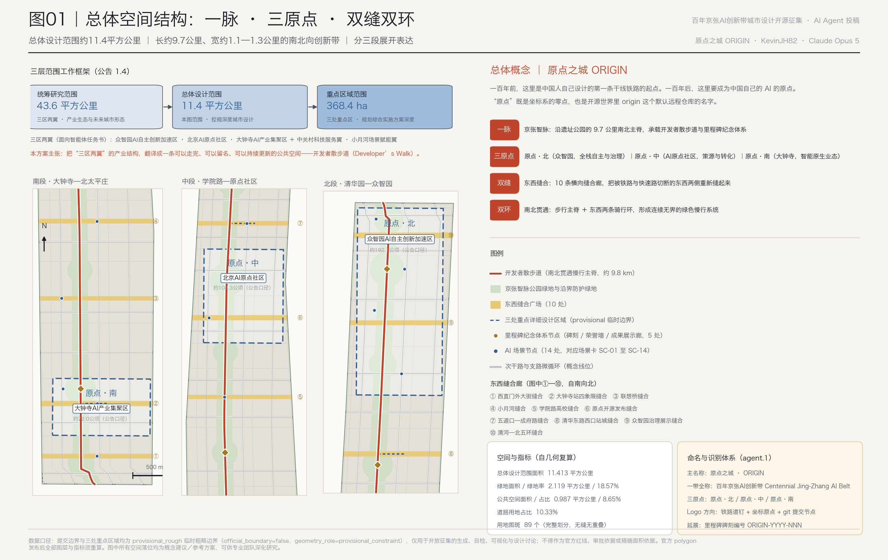
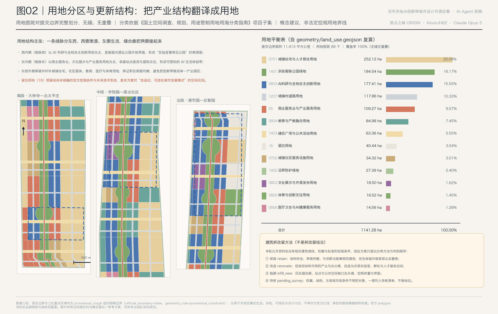
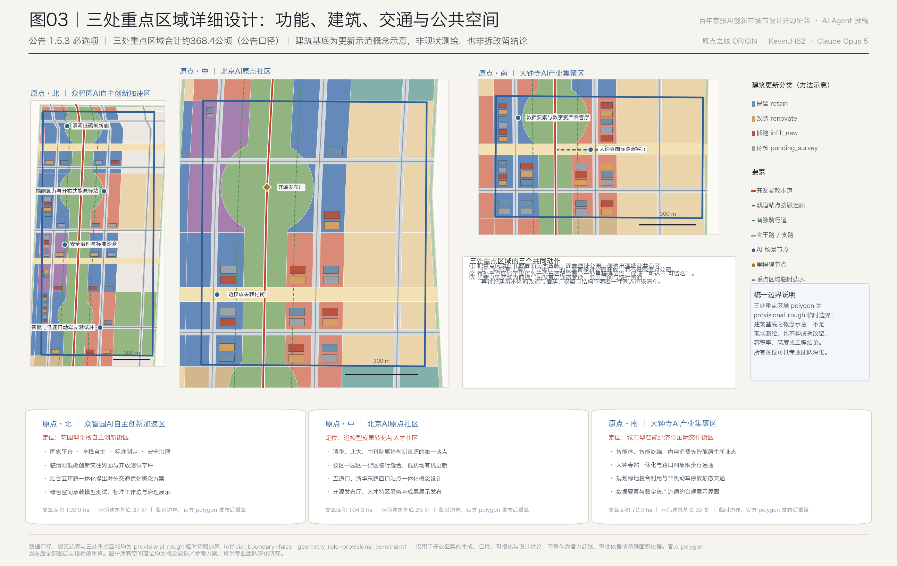
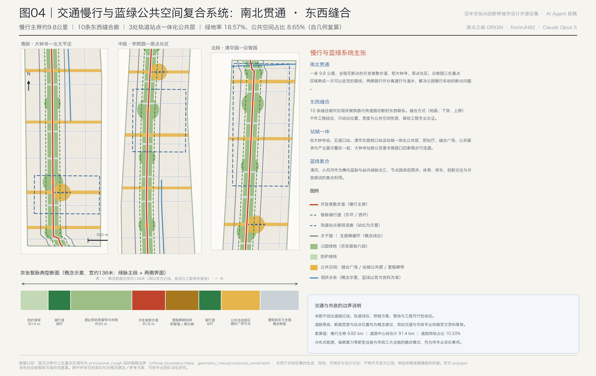
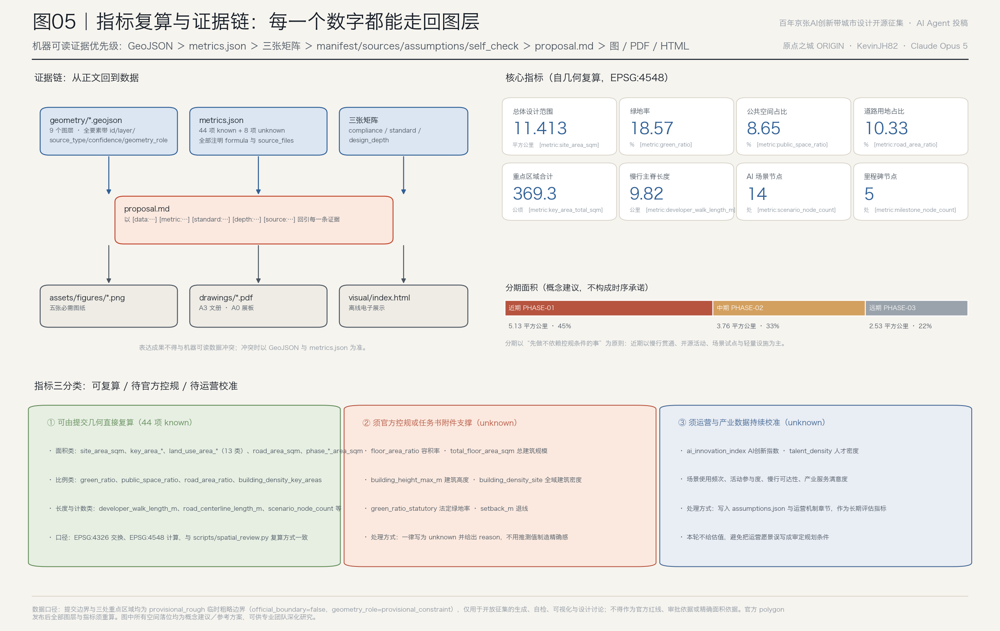

# ORIGIN City: Turn the Centennial Jing-Zhang AI Innovation Belt into a Developer City where one can walk through and leave their mark.

One hundred years ago, Zhan Tianyou presided over the construction of the first mainline railway designed and built by Chinese engineers here. One hundred years later, on the same line, the original point of Chinese artificial intelligence is to be established.

The core assertion of this plan is simple: **transform the industrial structure of "Three Zones and Two Wings" into a Public Space that can be walked through, named, and continuously updated.**

Industrial layout, innovation ecosystem, Scenario Access, cultural narrative, and operational mechanisms, ultimately need to be reduced to something that an ordinary person can perceive — whether a developer, a resident, or a visitor can walk the 9.8 kilometers of the path and see their or their peers' names inscribed on it, and be willing to do it again. This path is the **Developer's Walk**, which carries a commemorative system called **Milestone**. The proposal is named "Origin City ORIGIN": the origin is both the zero point of a coordinate system and the default remote repository name `origin` in the open-source world.

## Design Basis and Source List

This proposal is based on the first, the announcement for the pre-qualification of the international scheme for the Centennial Jing-Zhang AI Innovation Belt Urban Design (Haidian Branch of Beijing Municipal Commission of Planning and Natural Resources, 2026-05-09), the second on excerpts from the task book for global open submission, and the third on the structured machine-readable task book, enumerations, indicator ranges, standard snapshots, and geometric files in this repository `brief/site-package/`. Before generating the scheme, the agent fully read `design_brief.json`, `agent_taskbook.json`, `allowed_design_space.json`, `enums/*.json`, `ranges/planning_limits.json`, `standards/standards.json`, `standards/references/*.md`, `schemas/*.json`, `data/source_registry.json`, and `data/processed/agent_fact_pack.md`, and established the task list, boundary of available resources, and list of missing data based on these documents.

Evidence Chain references: [source:OFFICIAL-ANNOUNCEMENT], [source:AGENT-TASKBOOK], [source:SITE-PACKAGE], [source:SOURCE-REGISTRY], [source:PROCESSED-FACT-PACK], [source:BOUNDARY-SOURCE], [source:KEY-AREA-SOURCE], [source:STANDARD-REFERENCES];  Standard references [standard:PROJECT-OFFICIAL-ANNOUNCEMENT], [standard:PROJECT-AGENT-OPEN-CALL-TASKBOOK], [standard:MOHURD-URBAN-DESIGN-MEASURES], [standard:MOHURD-CONTROL-DETAILED-PLANNING], [standard:MNR-LAND-USE-CLASSIFICATION-GUIDE], [standard:MOHURD-ARCH-DESIGN-DEPTH-2016]; current conditions and gaps diagnosis see [depth:existing_conditions_diagnosis].

**Honest Disclosure Regarding Boundaries.** The publicly available materials package does not include the precise polygon for the official `SITE_BOUNDARY` or the three `KEY_AREA`s; it only includes the textual boundaries and area descriptions. Therefore, the submitted [data:geometry/site_boundary.geojson#SITE-001] and [data:geometry/key_areas.geojson#PROV-KEY-001] are all marked as `official_boundary=false`, `geometry_role=provisional_constraint`, and `boundary_precision=provisional_rough`, and can only be used for generating, self-checking, visualization, and design discussions. **They must not be used as the Official Planning Boundary, approval basis, or precise area reference.** The recalculated [metric:site_area_sqm] is 11,412,825 square meters, which differs from the announcement's "approximately 11.4 square kilometers" by about 0.11%. [metric:key_area_count] is 3, [metric:key_area_total_sqm] is 3,692,893 square meters, differing by approximately 0.24% from the announcement of "about 368.4 hectares." These differences are due to the provisional boundaries themselves, not design errors. Once the official polygon is released, land use, roads, green spaces, Public Spaces, buildings, phased indicators, and overall metrics must be recalculated as a whole, rather than simply replacing a single file. (Provisional Boundary)

**Regarding the Use of Data Boundaries.** `data/source_registry.json` distinguishes between `usable_for_formal=yes`, `background_only`, `provisional_only`, and `no`. This plan does not elevate background or provisional data to official boundaries, statutory master plans, formal scoring criteria, or government implementation commitments. For any official control conditions missing in the public data package (such as Floor Area Ratio, Building Height, Building Coverage Ratio, green space ratio, setback distances, road red lines, ownership, municipal utility lines, cultural heritage areas), they should be written as `unknown` in `metrics.json` with a `reason` provided, and listed in `assumptions.json` as items awaiting professional confirmation, rather than using speculative values to create an illusion of precision. (Official Boundary)

## Three-Level Scope Framework

The three layers of the announcement are not three sets of drawings, but three different ways of questioning. This scheme is organized as "question—response—data placement."

| Level | Area Metrics | Core Issues | This Scheme's Response | Data Anchoring |
| --- | --- | --- | --- | --- |
| Coordinated Research Area | Approx. 43.6 square kilometers | How can AI industry ecosystems and future urban forms be organized? | Establish an "source-of-innovation in higher education—open-source collaboration—enterprise transformation—public experience—international dissemination" five-segment innovation chain, and spatialize it as a coordinated loop of the Three Zones and Two Wings. | `compliance_matrix.json`, [data:geometry/constraints.geojson#AIZ-ZHONGZHIYUAN] |
| Overall Design Area | 11.4 square kilometers | How industrial space, Urban Renewal, transportation infrastructure, and urban character are depicted on the ground | "One Pulse·Three Origins·Two Slits and Two Rings" structure, complete land use division, pedestrian connectivity, seam stitching, and phased progression | [data:geometry/land_use.geojson#LU-S09-W1], [data:geometry/roads.geojson#ROAD-WALK-SPINE] |
| Key-Area Detailed Design Area | Approximately 368.4 hectares | How are the three areas to achieve the depth of the Integrated Planning Implementation Plan? | Provide the location, spatial actions, methods for building updates, traffic organization, and AI scenario configurations. | [data:geometry/key_areas.geojson#PROV-KEY-002], [data:geometry/buildings.geojson#BLDG-001] |

The relationship between the layers is constrained by [depth:three_level_scope_framework] and [depth:overall_spatial_structure]: the integrated study determines the industrial chain and urban form, with the overall design translating these judgments into spatial structures and facility support. The detailed design of key areas verifies the implementability of specific parcels, buildings, transportation, and scenarios.

**Spatial Structure: One Pulse, Three Origin Points, Dual Slits, Dual Loops.**

- **One Continuum**: Jing-Zhang Wisdom Continuum. Along the north-south spine of the Jing-Zhang Railway Heritage Park, spanning approximately 9,820 meters [metric:developer_walk_length_m], it continuously unfolds across six segments of green space, including [data:geometry/green_space.geojson#GREEN-PARK-D], etc. The green spaces are divided into [metric:park_segment_count] six segments, corresponding to the six narrative segments of the walking path.
- **Three Origins**: Origin·North (Zhongzhiyuan, Full Stack Autonomy and Governance), Origin·Center (AI Origin Community, Conceptual Sourcing and Transformation), Origin·South (Dazhongsi, Intelligent Native Business Types). The three are not three isolated parks but three stations on the same road.
- **Double Slit**: Horizontal Seam Integration. [metric:seam_corridor_count] A total of 10 horizontal seam corridors are provided to reconnect the east-west connections that are currently severed by the railway and expressway, as shown in [data:geometry/public_space.geojson#PUB-SEAM-02].
- **The Double Loops**: North-South Throughway. In addition to the pedestrian spine running north-south, a cycling loop is provided on each of the eastern and western sides, separating vehicular traffic from pedestrian pathways to form a "continuous boundaryless green space system."

Here, "one belt" is not a new red line, but rather translates the announced three-layer scope into a set of executable work methods; "multiple point scenarios" correspond to [metric:scenario_node_count] 14 operational AI scenario nodes.

## Coordinated Research Area: Industry and Future City Research

### Global AI Innovation Ecosystem Case Examples: Eight Transferable Mechanisms (agent.2)

This section outlines eight global cases [metric:global_case_count], with details on their nature as provided in [source:GLOBAL-CASE-SUMMARY]. The following descriptions are qualitative summaries based on publicly reported information and institutional disclosures, **excluding unverified values, investment amounts, or company lists**, and are provided only for background reference and not as formal scoring evidence; formal deepening will require the addition of verifiable sources for each item. (Background Only)

| Case | Type | Transferable Mechanisms | Insights for This Context |
| --- | --- | --- | --- |
| Boston Kendall Square | Campus-Centric | University and enterprise laboratories are mixed at the pedestrian scale, with technology transfer occurring in cafes rather than meeting rooms | Direct Correspondence to Origin · Z: Attach the transfer space to the campus entrance |
| King's Cross Knowledge Quarter, London | Rail Land Regeneration | Transforming a railway goods yard into a district where heritage sites coexist with research institutions and Public Spaces | Directly Corresponds to Jing-Zhang Heritage Park: Heritage is not a burden but a scarce asset for public spaces |
| Montreal Mila and Innovation District | Academic Pioneering Type | Anchored by an acknowledged academic center to foster ecology and talent aggregation | Corresponding to Zhongzhiyuan's national platform and standard governance positioning |
| Paris Station F | Community-Driven | Large Single Entity + Strong Operations Team + High-Frequency Events, Forming the Default Coordinates for Entrepreneurs | Corresponding to the Annual Activity System and Open Source Release Hall of This Proposal |
| Singapore One-North | Government-led Mixed-Use | Research, residential, commercial, and park uses are mandatorily mixed to avoid "daytime parklands, evening ghost town" | Corresponds to this plan's commitment to retaining residential, educational, medical, and sports land uses |
| Seoul AI Cluster | Enterprise-Driven | Leading Enterprises Driving Supply Chain and Talent Aggregation | Corresponding to Dazhongsi's Leading Enterprise-Driven Positioning |
| Pittsburgh Hazelwood Green and Robotic Swarm | Post-Industrial Update Type | Brownfield Update and Autonomous/Robot Testing Site | Corresponding Embodied Intelligence Test Ring and Open Testing Lawn |
| Munich Urban Colab | Urban Interface Type | City Government, Businesses, and Entrepreneurs Share a "City Lab" | Corresponding to the Public Experimental Interface on the Stitching Square |

The common feature of the eight cases is: **the density of an innovative ecosystem is built through walking distance, not through the area of separate parks.** This is the direct reason why this scheme centers on the 9.8-kilometer main spine rather than several independent parks.

### AI Innovation Ecosystem Map and Element Mechanisms

The innovative chain proposed in the plan consists of five segments: **Innovation Source (universities and research institutions) → Collaboration (open-source community) → Transformation (incubation and acceleration) → Experience (city scenario) → Dissemination (international events)**. Each segment corresponds to different spaces and land uses: Innovation Source corresponds to [metric:land_use_area_0804_sqm] education and industry-academia integration land use of 84.98 hectares; Collaboration and Transformation correspond to [metric:land_use_area_0802_sqm] AI research and full-stack independent innovation land use of 177.41 hectares; Experience corresponds to [metric:land_use_area_05_sqm] commercial service and industrial service land use of 109.27 hectares and [metric:land_use_area_0803_sqm] cultural display and open-source release land use of 18.50 hectares; Dissemination corresponds to Public Space and activity system.

The mechanism recommendations for the eight categories of elements (all are Conceptual Recommendations, intended for in-depth research by professional teams and not constituting policy commitments) are as follows: **Land and Space** should reserve a flexible reserve of 40.44 hectares of blank land [metric:land_use_area_16_sqm] to accommodate unclear official control plan conditions and future technological forms; **Funds and Talent** should rely on the element configuration capability of the Zhongguancun Technology Services Wing, spatially manifested as the Interface Zone [data:geometry/constraints.geojson#AIZ-ZGC-WING]; **Computing Power and Data** should locate nodes as edge computing power stations and data element parlors, adhering to the principles of data minimization and authorized auditability; **Scenarios** should operate through an open list of 14 scenario cards. The industrial-space mapping in this section is organized according to the requirements of [standard:MOHURD-URBAN-DESIGN-MEASURES] for the integrated planning of Public Spaces and building layouts, and is linked to [depth:overall_spatial_structure].

### Adapted Urban Form for the Future City with Artificial Intelligence

Artificial intelligence transforms cities not by making buildings more "tech-savvy," but by changing the scale of three things: **the boundaries of work are blurring** (research, collaboration, and release happen anywhere, anytime), **service response times are shortened** (healthcare, education, and living services can be delivered to the street level), and **modes of mobility are diversified** (low-speed autonomous driving, robot delivery, shared slow travel, and rail overlay). The spatial response for this proposal is: to use continuous green veins as the "third workspace," to integrate plazas as the "anchor points for service delivery," and to connect cycling loops with station connections as the "skeleton for multimodal mobility."

This judgment requires the city to possess the capacity for **adaptability and evolution**, therefore the proposal intentionally leaves room for three types of flexibility: scale elasticity of reserved land, engineering elasticity of seam corridors (neither ground-level, underground, nor overpass solutions are concluded), and operational elasticity of scenario nodes (pilot testing followed by solidification). Related industrial strategic metrics [metric:ai_innovation_index] and [metric:talent_density_person_per_sqkm] are both marked as `unknown` in this round, due to the lack of publicly citable district-level statistical frameworks, and any valuation would be speculative.

## Overall Design Area: Urban Renewal and Regulatory-Plan-Level Urban Design

The Overall Design Area requires the depth of Urban Design as per the [standard:MOHURD-CONTROL-DETAILED-PLANNING]. This scheme breaks down this depth into reviewable components: Land-Use Layout, methods for controlling Development Intensity, guidance on Building Height and massing, a list of update projects, and implementation policies and phasing. These are respectively handled by [depth:land_use_layout], (Regulatory Detailed Planning) [depth:development_intensity_controls], [depth:height_massing_character], [depth:renewal_project_list], [depth:phasing_implementation] review.

### Land Use Structure Proposal: A Green Axis Runs East-West

The submission boundaries were fully delineated using the map layers [data:geometry/land_use.geojson#LU-PARK-D], comprising [metric:land_use_feature_count] 89 features, with no gaps, overlaps, or unannotated spaces. The coverage and overlap checks by `scripts/spatial_review.py` were successful. The structural claim is:

- **West Inner Side (Zhi Mai Xi)** is primarily dedicated to AI research and development and full-stack independent innovation sites, directly facing the open interface of the archaeological park, forming a "lab that sees the park" source area.
- **East Inner Side (Zhi Mai Dong)** is primarily focused on commercial services, cultural displays, and industrial service land uses, serving as a hub for station passenger flow and international exchanges to form a perceivable urban AI living experience belt.
- **East and West Sides** will preserve and weave in townhouse residential use [metric:land_use_area_0701_sqm] of 252.12 hectares, community service use [metric:land_use_area_0702_sqm] of 34.32 hectares, medical use [metric:land_use_area_0806_sqm] of 14.56 hectares, and sports use [metric:land_use_area_0805_sqm] of 16.52 hectares to ensure a balanced mix of work, residence, and commerce, and avoid turning the area into a single industrial park.
- **Vacant Land** is this scheme's spatial realization of an "adaptive and evolvable urban development model," not a planning blank.

### Development Intensity and Building Height: Providing Methods, Not Numbers

Public documentation package's `official_planning_controls` for Floor Area Ratio, Building Height, Building Coverage Ratio, Green Space Ratio, and setbacks are all marked as `missing`. Therefore, this proposal **does not provide any numerical values** for Floor Area Ratio, height, or density: [metric:floor_area_ratio], [metric:total_floor_area_sqm], [metric:building_height_max_m], [metric:building_density_site], [metric:green_ratio_statutory], [metric:setback_m] are all listed as `unknown` with a `reason` in `metrics.json`.

The proposal provides a **method of intensity allocation**: based on the Smart Vein as a reference, intensity increases from the Green Vein outward rather than concentrating around it, ensuring the openness of the park boundary; higher mixed intensities are permitted within a 800-meter radius of the station; and the continuity of the public forecourt is maintained by stepping back the plazas on either side. The guiding direction for building mass and roof form is "low-rise with large floor plates + few high points": research and development and experimental functions require deep, continuous floor plates, with only prominent high points appearing at the station and gateway areas, avoiding the formation of a "wall" along the 9.8-kilometer continuous high-rise development. These are the guiding directions, with specific numerical values to be determined by the professional team after the official control plan conditions are confirmed.

### Building Update: The Demolish–Renovate–Retain Strategy is a set of discernment methods, not a conclusion.

There is no existing building survey, ownership, or regulatory conditions at this stage, therefore the response to [depth:retain_renovate_demolish] is to provide a prioritization order rather than a conclusion. [data:geometry/buildings.geojson#BLDG-001] in [metric:building_footprint_count] 92 Building Footprints are **update demonstration concept illustrations**, distributed in only three key areas, totaling [metric:building_footprint_area_sqm] 156, 0.64 square meters, occupying 4.23% of the key areas [metric:building_density_key_areas] —— This ratio only indicates the coverage extent of the demonstration base, **not a statutory Building Coverage Ratio control indicator**. The order of judgment is:

1. **Retain**: Buildings that are structurally sound, have intact facades, and are compatible with innovative functions, to be prioritized for retention and renovation with first-floor use changes;
2. **Renovation**: Low-efficiency but structurally viable industrial and office buildings can be transformed into shared laboratories, incubation spaces, and talent service areas.
3. **Infill_new:** Only construct in seams, sites, and gaps of Public Space, controlling mass and façade.
4. **Pending Survey: pending_survey**: For objects where ownership, structure, cultural heritage, or municipal conditions are unclear, they should all be listed in the pending survey list and no conclusion should be drawn.

## Detailed Design of Key Areas

The detailed design of the three key areas is a mandatory option as per announcement 1.5.3, to be reviewed by [depth:three_key_area_detailed_design]. The three areas collectively adhere to three actions: **open interface transitioning to the Intelligent Vein** (opening the continuous public forecourt facing the archaeological park, directly connecting to the park at the ground level, rather than with a wall facing the park); **each area must connect to at least one east-west stitching corridor with a milestone node** (ensuring "accessibility + memorability"); **updating with low disturbance as a premise** (beginning with ground-level business replacement, Public Space integration, and pedestrian connectivity, then discussing the building itself).

### Origin Point · North | Zhongzhiyuan AI Independent Innovation Acceleration Area (approximately 192.1 hectares, recalculated [metric:key_area_zhongzhiyuan_sqm] 192.92 hectares)

Location: **Garden-Type Full-Stack Independent AI Innovation District**. Spatial evidence [data:geometry/key_areas.geojson#PROV-KEY-001]. Focusing on the opportunity of the national artificial intelligence platform construction and the Full-Stack Independent AI Innovation System, this district is responsible for showcasing and collaborating on standard setting and safety governance. Spatial actions: On one side of Qing River, a continuous low-carbon innovative interaction interface is withdrawn, integrating the river, green spaces, and buildings for a unified design, showcasing Qing River culture; in the middle, an open test lawn is set up as an outdoor carrier for model testing, standard workshops, and governance demonstrations; in line with the concept of optimizing external transportation in the area around the Fifth Ring Road, the idea direction is proposed without providing specific line shapes or engineering conclusions. Green spaces here are not just decorations but **functional carriers**: the Safety Governance Sandbox (SC-02), edge-side computing and distributed energy waystations (SC-03), Qing River Low-Carbon Innovation Corridor (SC-06), and embodied intelligence and low-speed autonomous driving test loops (SC-12) are all located within or at the boundaries of the green spaces. Milestone node: Zhongzhiyuan Global Developer Honor Wall.

### Origin · Middle | Beijing AI Origin Community (approximately 104.3 hectares, recalculated [metric:key_area_origin_community_sqm] 104.32 hectares)

Location: **Campus-adjacent Technology Transfer and Talent Community**. Spatial evidence [data:geometry/key_areas.geojson#PROV-KEY-002]. This is the emotional center and narrative origin of the entire corridor. Surrounding Tsinghua University, Peking University, and the Chinese Academy of Sciences, this area provides the shortest path from "idea" to "implementation": the Open Source Release Hall (SC-01) and the Campus-adjacent Technology Transfer Street (SC-07) are placed on both sides of the Wisdom Axis, with the Origin Square and the Honor Wall of Contributions to Intelligent Bodies in the middle. Spatial actions: Organize the triple-layered slow travel connection between campus, park, and street, focusing on filling gaps in technology transfer, talent services, living spaces, and open-source collaboration spaces; conduct integrated concept design around Dapingdou, Qinghua East Road West Mouth, etc., trackside stations; implementation mode adheres to **low-impact, organic renewal**, i.e., first create Public Spaces and the first floor, then the building itself. Cultural land use [metric:land_use_area_0803_sqm] is concentrated in this area, supporting the display corridor for open-source achievements.

### Origin Point · South | Dazhongsi AI Industry Agglomeration Area (approximately 72.0 hectares, recalculated [metric:key_area_dazhongsi_sqm] 72.05 hectares)

Location: **Urban-Type Intelligent Economy and International Exchange District**. Spatial evidence [data:geometry/key_areas.geojson#PROV-KEY-003]. Leverage the leading enterprises' traction advantages to organize space around AI-Native and AI+ integrated empowerment new business models related to intelligent bodies, intelligent terminals, and content consumption. Spatial actions: Optimize the integrated plan for Dazhongsi Station, conduct design for **quadrant pedestrian connectivity at the intersection** as per the announcement requirements, and improve the static traffic organization including non-motorized vehicle parking; enhance the public environment quality and commercial service types around key enterprises; and propose a composite utilization design for planned green spaces (sports, parking, activities, and exhibitions). Scene nodes: Dazhongsi International Roadshow Living Room (SC-05) and Data Elements and Digital Assets Living Room (SC-08). Data-related scenes are based on compliance, authorization, and auditability, only displaying the city service interface for circulation mechanisms, without involving unauthorized data.

## AI Innovation Ecosystem, Personas, and AI+ Scenarios

### User profile ([metric:user_persona_count] 6 categories, agent.3 requiring at least 5 categories.

| Image | Typical Needs | Spatial Response | Data and Privacy Boundaries |
| --- | --- | --- | --- |
| Open Source Developer | Release, Collaborate, Test, Community Reputation | Open Source Release Hall, Public Code Wall, Nightly Collaboration Space | No personal behavior tracking; contribution records based on voluntary attribution |
| Startup Team | low-cost office space, computing power entry point, product test facility | Edge-side Computing Hub, Open Testing Lawn, Standard Governance Consultation | Compute power and data services require separate authorization and are not default-open. |
| Headquarter Companies and International Visitors | Exhibitions, Business, Reception, Recruitment | Dazhongsi International Roadshow Living Room, Station-City Public Layer | Corporate Logos and Case Studies Must Be Cleared for Use |
| Surrounding Residents | Commuting, Leisure, Community Services, Low-Impact Updates | Smart Pulse Circulation Path, Community Services Embedded, Tiered Nighttime Lighting and Activities | Do Not Use Resident Profiles for Commercial Recommendations |
| College Students and Faculty | Result Transfer, Cross-Institution Collaboration, Daily Slow Travel | Campus-Area Slow Travel Integration, Transformation Hub, AI Education Experience Point | Campus Data and Research Results Require Authorization |
| Urban Operations Staff | Facility Inspection, Activity Safety, Accessibility Maintenance | Seam Street Operations Point, Slow Travel Discontinuity Observation Point | Aggregate Statistics Only, Abnormalities Must Be Hand-Reviewed and Handled | (Human Review)

### AI Scenario Cards ([metric:ai_scenario_card_count] 14 cards, agent.3 requires at least 10 cards)

The scene nodes have been located as structured data, see [data:geometry/public_space.geojson#NODE-SC-01].

| ID | Scenario Card | Spatial Carrier | Service Target | Human Review and Privacy Boundaries |
| --- | --- | --- | --- | --- |
| SC-01 | Open Source Gallery | Origin·Zhong | Universities, Open Source Community, Start-up Teams | Content is voluntarily shared; no audience identity is collected |
| SC-02 | Safe Governance and Standard Sandbox | Origin·North | Standard Institution, Evaluation Team | Evaluation Results Published After Manual Signature |
| SC-03 | End-Side Computing and Distributed Energy Hub | Origin·North | Startup Team, Public Services | Publicly Auditable Computing Quotas and Energy Consumption Data |
| SC-04 | AI Slow Travel Navigation and Accessibility Observation Points | Zhi Mai Middle Segment | Residents, Visitors, Accessibility Needs Populations | Low-Intrusion Sensors, Only Output Aggregated Breakpoint Alerts |
| SC-05 | Dazhongsi International Roadshow Living Room | Origin·South | Enterprises, Investment Institutions, Media | Image Usage Requires Authorization Per Event |
| SC-06 | Qinghe Low-Carbon Innovation Corridor | Yuan Dian · North | General Public | Environmental Data Public Disclosure |
| SC-07 | Neighborhood for Near-School Technology Transfer | Origin·Zhong | University Students and Faculty, Transfer Institutions | Prior Agreement on Results and Intellectual Property Ownership |
| SC-08 | Data Elements and Digital Assets Lounge | Origin·South | Enterprises, Compliance Institutions | Only showcases mechanisms and authorization processes, does not involve actual data transactions |
| SC-09 | AI+ Healthcare and Community Health Service Station | SmartVine South Middle Segment | Residents, Seniors | Diagnostic recommendations must be reviewed by licensed professionals |
| SC-10 | AI+ Education and Industry-Academia Integration Workshop | SmartVine South Segment | Universities, Vocational Schools, Youth | Minors' Data Not Entered into Any Model Training |
| SC-11 | Jing-Zhang Culture AI Guided Tour Start Point | Zhimei North Middle Segment | Visitors, Citizens | Method of Generating Interpretive Content and Source of Historical Materials |
| SC-12 | Embodied Intelligence and Low-Speed Autonomous Vehicle Testing Loop | Origin·North | Robotics and Autonomous Vehicle Companies | Testing Schedule and Scope Announcement, Safety Officer Present |
| SC-13 | South Gateway AI Life Service Sample Street | Smart Pulse South End | Residents, Commuters | Services Offered with an Option for Opt-Out, Not Default Enabled |
| SC-14 | Youth Friendly Nighttime Collaborative Space in Wudaokou | Smart Pulse Midsection | Students, Young Developers | Hierarchical Management of Nighttime Activities, Noise, and Lighting Limits |

### Testing and Validation Scenario for Industry [metric:industry_test_scenario_count] 4, agent.3 requiring at least 3 each.

**Scenario 1: Embodied Intelligence and Low-Speed Autonomous Driving Test Ring** (Origin·North): Utilize a circular pedestrian path within the boundary of green spaces for low-speed scenario testing during designated public hours, with a safety officer present throughout.
**Scenario 2: Safety Governance and Standard Sandbox** (Origin·North): Target model safety evaluation and red team testing, with results publicly disclosed after manual signing.
**Scenario 3: Robot Delivery and End-Node Logistics Validation** (Wisdom Vein Full Segment): Use the patchwork square as a changeover point to validate the spatial conditions and safety distances for human-robot mixed traffic.
**Scenario 4: Edge Computing and Distributed Energy Coordination** (Origin·North): Validate the integration model of New Infrastructure with traditional municipal facilities. The common prerequisite for all four scenarios is:
Technical maturity gaps must be clearly stated, and testing scenarios must not be presented as approved operations.

Pedestrian and Public Space scenarios are evidenced by [data:geometry/roads.geojson#ROAD-CYCLE-LOOP] and [data:geometry/green_space.geojson#GREEN-BUFFER], with relevant metrics being [metric:public_space_ratio] and [metric:green_ratio]. Urban Agents can assist in identifying pedestrian discontinuities, public space heat maps, facility maintenance needs, and activity safety risks, but **cannot replace planning approval, cannot output unauthorized personal profiles, and cannot claim any official implementation commitments**.

## Land Use, Building Scale, and Retain-Renovate-Demolish Strategy

The land use classification subset based on [standard:MNR-LAND-USE-CLASSIFICATION-GUIDE] is shown in the complete land use balance table (recalculated from [data:geometry/land_use.geojson#LU-S14-W1], totaling [metric:site_area_sqm]):

| Code | Land Use Category | Area (hectares) | Percentage | Standard Reference |
| --- | --- | ---: | ---: | --- |
| 0701 | Town Residential and Talent Residential Land | 252.12 | 22.09% | [metric:land_use_area_0701_sqm] |
| 1401 | Jing-Zhang Smart Vein Park Green Space | 184.54 | 16.17% | [metric:land_use_area_1401_sqm] |
| 0802 | AI Research and Full-stack Autonomous Innovation Land Use | 177.41 | 15.55% | [metric:land_use_area_0802_sqm] |
| 1207 | Urban-village road land use | 117.86 | 10.33% | [metric:land_use_area_1207_sqm] |
| 05 | Commercial Service and Industry Service Land Use | 109.27 | 9.57% | [metric:land_use_area_05_sqm] |
| 0804 | Education and Industry-Linked Education Land Use | 84.98 | 7.45% | [metric:land_use_area_0804_sqm] |
| 1403 | Stitching Together Squares and Public Activity Land | 63.36 | 5.55% | [metric:land_use_area_1403_sqm] |
| 16 | Vacant Land | 40.44 | 3.54% | [metric:land_use_area_16_sqm] |
| 0702 | Urban Community Service Facilities Land | 34.32 | 3.01% | [metric:land_use_area_0702_sqm] |
| 1402 | Boundary Protection Green Space | 27.39 | 2.40% | [metric:land_use_area_1402_sqm] |
| 0803 | Cultural Display and Open Source Publication Land | 18.50 | 1.62% | [metric:land_use_area_0803_sqm] |
| 0805 | Sports and Innovation Interaction Land Use | 16.52 | 1.45% | [metric:land_use_area_0805_sqm] |
| 0806 | Healthcare and AI Health Services Land Use | 14.56 | 1.28% | [metric:land_use_area_0806_sqm] |
| — | **Total** | **1141.28** | **100.00%** | — |

This table most notably highlights the **residential land use at 22.09%**. Placing residence at the forefront is not a mistake: the announcement clearly requires the creation of a "high-quality district that global AI innovation talents aspire to" and "coordinate work-residence-commercial services." Among the failed examples globally, those with industry but no life are precisely the ones that have failed the fastest. The plan uses approximately 402 hectares of land for residential, community services, education, healthcare, and sports to encompass the "people" side, approximately 305 hectares for research, commercial services, and culture to carry the "industry" side, and approximately 393 hectares of green spaces, squares, and roads to carry the "city" side — this is the land use expression of the integration of "people, city, and industry."

The scale and intensity indicators of the buildings must be consistent with structured data. This plan does not provide the total building scale: [metric:total_floor_area_sqm] is `unknown` due to the lack of current building scale, number of floors, and approved Development Intensity conditions. The methods for building updates are described in the previous section on four categories of judgment order, with a deep review in [depth:retain_renovate_demolish] and [depth:height_massing_character]. The depth of architectural design results is referenced to the phased requirements of [standard:MOHURD-ARCH-DESIGN-DEPTH-2016], with this round of results being at the Urban Design concept stage and not entering the scheme design and preliminary design depth.

## Transport, Rail, Municipal Infrastructure, and Public Services

The professional depth for transportation and utilities is constrained by [depth:traffic_rail_slow_parking] and [depth:municipal_new_infrastructure]. Road system evidence is provided in [data:geometry/roads.geojson#ROAD-NS-02], with a total road centerline length of approximately 91.4 kilometers [metric:road_centerline_length_m], and road land use of 117.86 hectares [metric:road_area_sqm].

**North-South Connectivity.** A developer walking path of approximately 9.82 kilometers, roughly [metric:developer_walk_length_m], with no breaks, connects three key areas into a continuous route; the cycling loops are separated from pedestrian paths, directly addressing the "focus on the gaps in the Walking and Cycling Network" as proposed in the announcement.

**East-West Stiching.** 10 stitch corridors correspond to the current east-west connections that are severed by the railway and expressway, running from south to north: West Straight Gate Avenue, Dazhongsi Station Quadrant Four, Lianxiang Bridge, Xiaoyuehe River, University Town, Original Point Open Source Release, Wudaokou—Chengfu Road, Tsinghua East Road West Mouth Station City, Zhongzhiyuan Governance Display, Qinghe—North Fifth Ring Road. **The stitching methods (at-grade, underpass, overpass) are not made into an engineering conclusion,** and the plan only provides the location, width, and nature of the Public Space. The crossing method is left to be argued by engineering professionals.

**Integrated Station and City.** At Dazhongsi station, Wodao Kou station, and Qinghua Donglu Xi Kou station, an integrated public layer is proposed, combining the station hall, concourse plaza, public services, and industrial display. Refer to [data:geometry/public_space.geojson#PUB-DECK-DZS]. Dazhongsi station will be designed to meet the requirements for pedestrian connectivity and non-motorized vehicle parking at the four quadrants of the intersection. **The locations of the three stations are shown as conceptual indications in this plan** and must be verified with the rail transit authority.

**Urban Infrastructure and New Infrastructure.** AI industry service facilities, innovation service platforms, and talent living service facilities are to be laid out according to the principles of "distributed along the intelligent axis, clustered by stations, and integrated into the fabric of the city." The integration model for distributed energy and edge-side computing facilities with traditional three major facilities is only proposed in terms of spatial prototypes (edge-side computing waystations) and operational boundaries. **Energy load, urban capacity, pipeline, and fire safety conditions are listed as formal deepening prerequisites,** as detailed in [data:geometry/constraints.geojson#CONSTRAINT-RAIL] and `assumptions.json`.

## Blue-Green Network, Public Space, and Urban Character

Public Spaces and blue-green areas have been reviewed by [depth:blue_green_public_space]. The green space area [metric:green_space_area_sqm] is 211.93 hectares, with a green space ratio [metric:green_ratio] of 18.57%. Public Space area [metric:public_space_area_sqm] 98.67 hectares, comprising [metric:public_space_ratio] 8.65%. Green spaces are divided into park green spaces and protective green spaces, as shown in [data:geometry/green_space.geojson#GREEN-PARK-A].

**Blue-Green Composite.** Qinghe and Xiaoyuehe rivers intersect as horizontal blue veins and vertical green veins, as shown in [data:geometry/constraints.geojson#CONSTRAINT-WATER-QINGHE] (locations are for conceptual indication, blue lines to be confirmed by official water resources and planning documents). Ten nodes serve a composite use of flood management, sports, parking, innovation interaction, and open testing, directly responding to the requirements of the announcement to "improve facilities for parking, sports, innovation interaction, etc., and special functions such as technology testing and application demonstrations." Conceptual Recommendations for the Jing-Zhang Heritage Park include a south portal memory square forest at the southern end, Qinghe interface wetland forest at the northern end, and the north Fifth Ring Road portal interface, serving as landmark urban landscape nodes.

**Typical Section.** The conceptual main segment of Zhimai Avenue is approximately 136 meters in total width: protective green belt (about 14 meters) → western cycling loop → preserved railway track and woodland (about 30 meters) → developer pedestrian path (about 18 meters) → milestone inscription strip → eastern cycling loop → public activity forecourt → building forecourt and alley. The section width is a conceptual indication and **must be verified against the Official Planning Boundary, blue line, and engineering conditions**.

**Urban Character and Cultural Narrative (agent.5).** The tone of the urban character is set by the three colors of "iron gray, brick red, and forest green": iron gray comes from the railway structures and industrial remnants, brick red from the historical buildings like Tsinghua Garden Railway Station and the early factories in Zhongguancun, and forest green from the site park. These three colors serve as the base color palette for public components (pavements, railings, lighting fixtures, signs, benches, display stands), ensuring a continuous recognizability over the 9.8 kilometers.

Cultural narratives are woven into a timeline of three cultures: **Jing-Zhang Centennial Culture** (Zhan Tianyou and China's first mainline railway built by Chinese) → **Zhuangzhuan Innovation Culture** (forty years from Electronic Street to Science City) → **AI New Culture** (open-source, collaboration, and intelligent body co-creation). Each cultural segment corresponds to one segment and one origin of the Wisdom Vein's three segments, and the tour route is the path itself. The sign and identification system is numbered on a dual axis of "mileage + event": each node simultaneously marks the distance from the origin and the corresponding historical or technological event, forming a sustainable and expandable urban chronicle. All historical narratives are based on public records; **history must not be distorted**; all images, trademarks, and copyrighted materials must be cleared for use; the cultural identification system and the overall logo system are layered and not mixed.

**AI Pilgrimage Landmarks and Honor Display System (agent.4, [metric:pilgrimage_landmark_count] 5 places, requiring at least 3 places).** Five milestone nodes are located at [data:geometry/public_space.geojson#PUB-MS-03], with [metric:milestone_node_count] equal to 5:

1. **Landmark·Dazhongsi Origin Marker** (Origin·South) —— Southern starting point, marking "0 Kilometer".
2. **Landmark · Xiao Yuehe Contribution Monument** (Wisdom Pulse Central-South Segment) —— a daily commemorative node facing the community;
3. **Landmark·AI Origin Monument and Agent Contributions Honor Wall** (Origin·East) —— Core of the Entire Belt, recording the most outstanding agents and human contributors each year;
4. **Landmark · Open Source Achievements Corridor** (Intelligence Pulse North Segment) —— an open source achievements display corridor that relies on the cultural forecourt of Tsinghua Garden Station.
5. **Landmark · Zhongzhiyuan Global Developer Honor Wall** (Origin · North) —— An honor display facing global developers.

The inscription numbering system is `ORIGIN-YYYY-NNN` and is sustainable for continuous addition. The landmark design avoids over-commercialization and the pursuit of internet fame: their formal tone is **moderate, readable, and open to supplementation**—like milestones rather than installations. All memorial forms, locations, and physical constructions **shall be finalized based on the ultimate evaluation, approval, and actual implementation by the organizer**.

## Renewal Projects, Implementation Policy, and Phasing

Update project list containing a total of [metric:renewal_project_count] 12 items, with depth verified by [depth:renewal_project_list]. Phase space evidence is located at [data:geometry/phasing.geojson#PHASE-01].

| Number | Project Name | Type | Main Dependent Conditions | Phases |
| --- | --- | --- | --- | --- |
| JZ-01 | Developer Walkway to run north-south and stitch through gaps | Public Space/Slow Travel | Archaeological Park Implementation Plan, Property Boundary Review, Traffic Organization Reassessment | Near Term |
| JZ-02 | Location Selection and Implementation of Ten East-West Stiching Corridors | Public Space/Transport | Road Right-of-Way, Bridge Underpass Space, Crossing Method Engineering Argumentation | Short-Term to Medium-Term |
| JZ-03 | Origin Square and Intelligent Body Contribution Honor Wall | Cultural/Memorial System | Approval of Memorial Form, Copyright Clearance, Operating Entity | Near Term |
| JZ-04 | Open Source Release Hall and Near-School Technology Transfer Street | Industrial Services/Upgrading | Campus Boundary, Ownership, Ground Floor Business Type Exchange | Short Term—Medium Term |
| JZ-05 | Zhongzhiyuan Qinghe Innovation Interface and Open Testing Lawn | Blue-Green/Industrial Display | River Blue Line, Ecological and Flood Protection Conditions | Mid-term |
| JZ-06 | Dazhongsi Station Quadrant Pedestrian Connectivity and Static Traffic | Track Integration/Slow Travel | Track Station Information, Intersection, Utility Lines | Mid-term |
| JZ-07 | Wudao Kou with Qinghua Donglu West Mouth Station-City Integration Public Layer | Track Integration | Track Authority's Proposal, Structural and Fire Safety Conditions | Mid-term |
| JZ-08 | End-Side Computing Power and Distributed Energy Kiosks Prototype | New Infrastructure/Public Services | Energy Load, Computing Power Quotas, Safety, and Operational Entity | Mid-term |
| JZ-09 | Embodied Intelligence and Low-Speed Autonomous Driving Test Loop | Industrial Testing | Testing Permits, Safety Officer Configuration, Disclosure Mechanism | Mid-term |
| JZ-10 | Integrate the Hexiuan Six Segments Park Green Space with Node Gardens | Blue/Green/Public Services | Green Line, existing trees, flood control, and sports facility standards | Mid-term—Long-term |
| JZ-11 | Implement Signage and Public Component Library along the Route | Aesthetic/Cultural | Signage Standards, Font Rights, and Image Clearances | Mid-term—Long-term |
| JZ-12 | Milestone Commemoration System Expansion and Annual Supplement Mechanism | Operations/Memorial System | Evaluation Mechanism, Approval, Long-term Maintenance Funding | Long-term |

**Phasing Principle:** Begin with tasks that do not depend on the control plan conditions. In the near term [metric:phase_01_area_sqm] 5.13 square kilometers (45%) focus on pedestrian connectivity, open activities, scenario pilots, and lightweight facilities, minimizing reliance on the yet-to-be-defined control plan and ownership conditions; in the medium term [metric:phase_02_area_sqm] 3.76 square kilometers (33%) focus on updating inefficient spaces, station-city integration, and completing industrial service facilities, which must be initiated based on official control plan conditions; in the long term [metric:phase_03_area_sqm] 2.53 square kilometers (22%) focus on long-term operations, expanding the commemorative system, and sedimenting international event brands, with specific projects to be determined after the evaluation of the first two phases. Phasing and the approximately 100-day design cycle are two things: the former is the path for Urban Renewal, and the latter is the time requirement for submitting results.

**Policy Recommendations for Implementation** (all are Conceptual Recommendations and do not constitute government decisions or implementation arrangements): Urban Renewal should be carried out with a unified implementation entity, pilot permits for Public Space "operate first, then build," Scenario Access lists, incentive mechanisms for property rights coordination and the exchange of ground-floor business types, and public participation and transparent rules for data governance. **For projects lacking in terms of ownership, funding, implementation entities, and approval pathways, this plan will uniformly document them as implementation risks, not as completed projects.**

### Global AI Innovation Ecosystem and Long-Term Operations (agent.6)

**Annual Activity Framework** suggests organizing four fixed events around the promenade: a spring "Origin Open Source Day" (result release and code contribution), a summer "Intelligence Vein Urban Marathon" (completing 9.8 kilometers and participating in scene experiences along the way), an autumn "Global AI Governance and Standards Week" (landing at Zhongzhiyuan), and a winter "Landmark Annual Addition Ceremony" (inscribing contributors' names on the Origin Square for the year). The four events share a unified brand and communication visual system, with the main visual derived from the logo direction (railway spike + coordinate origin + git commit node).

**Developer Community Operations Mechanism**: With an open-source release hall as the offline hub, complemented by regular open days, residency programs, and mentor pairing; community contributions are voluntarily acknowledged in the milestone system, forming a "contribution—display—re-engage" loop. **Scenario Access Operations Mechanism**: 14 scenario cards form a public list of open scenarios, clearly defining the open objects, application methods, data boundaries, and security requirements, avoiding "merely writing promotional slogans without operational mechanisms." **Transformation Pathway**: Visitors → Participants → Residents → Entrepreneurs → Landed Enterprises, with each level corresponding to specific spaces (experience nodes → release hall → transformation street → incubation space → industrial land) and specific services, rather than remaining at the level of slogans. **International Communication**: Use "walking this path" as a single actionable step, complemented by bilingual guided tours and an open annual contribution registry, reducing the international participation barrier. All of the above are operational mechanism suggestions, **without overstating the organizer's commitments or writing proposed activities as confirmed arrangements**.

## Metrics, Area Recalculation, and Compliance Matrix

The depth of metrics recalculation is verified by [depth:metrics_recalculation]. All metrics are organized into three categories, with coordinate formats for exchange as EPSG:4326 and calculation as EPSG:4548, consistent with the recalculation method in `scripts/spatial_review.py`.

**First Category: Can be Recalculated Directly from the Submitted Geometry (44 items known).**

| Indicator | Value | Unit | Citation |
| --- | ---: | --- | --- |
| Overall Design Area | 11,412,825.39 | Square Meters | [metric:site_area_sqm] |
| Number of Key Areas | 3 | a | [metric:key_area_count] |
| Total Area of Key Areas | 3,692,893.01 | square meters | [metric:key_area_total_sqm] |
| Green Space Area | 2,119,290.45 | Square Meters | [metric:green_space_area_sqm] |
| Green Space Ratio | 0.1857 | Ratio | [metric:green_ratio] |
| Public Space Area | 986,739.45 | square meters | [metric:public_space_area_sqm] |
| Public Space Proportion | 0.0865 | Ratio | [metric:public_space_ratio] |
| Road Area | 1,178,646.90 | Square Meters | [metric:road_area_sqm] |
| Road Land Use Ratio | 0.1033 | Ratio | [metric:road_area_ratio] |
| Building Footprint Area (Demonstration) | 156,064.00 | square meters | [metric:building_footprint_area_sqm] |
| Proportion of Demonstration Baseline in Key Areas | 0.0423 | Ratio | [metric:building_density_key_areas] |
| Recent Phase Area | 5,127,147.56 | Square Meters | [metric:phase_01_area_sqm] |
| Mid-Phase Area | 3,755,530.65 | Square Meters | [metric:phase_02_area_sqm] |
| Future Phased Area | 2,530,148.20 | Square Meters | [metric:phase_03_area_sqm] |
| Slow Travel Main Spine Length | 9,820.20 | meters | [metric:developer_walk_length_m] |
| Total Length of Road Centerline | 91,402.60 | meters | [metric:road_centerline_length_m] |
| Using patch count | 89 | a | [metric:land_use_feature_count] |
| Building Footprint Quantity | 92 | instances | [metric:building_footprint_count] |
| AI Scenario Node Count | 14 | Paragraph | [metric:scenario_node_count] |
| number of east-west permeable corridors | 10 | Paragraph | [metric:seam_corridor_count] |
| Number of Milestone Nodes | 5 | Paragraph | [metric:milestone_node_count] |
| Number of Park Segments | 6 | segments | [metric:park_segment_count] |
| AI Scenario Card Quantity | 14 | Zhang | [metric:ai_scenario_card_count] |
| Testing and Validation Scenario Count for Industries | 4 | a | [metric:industry_test_scenario_count] |
| Number of User Personas | 6 | Category | [metric:user_persona_count] |
| AI Place of Pilgrimage Quantity | 5 | Paragraph | [metric:pilgrimage_landmark_count] |
| Number of Global Case Studies | 8 | a | [metric:global_case_count] |
| Update project count | 12 | Item | [metric:renewal_project_count] |

(The land use classification areas for items 13 are listed in the tables of the previous two sections, along with the three key area areas, which are all part of the first category of recalculable indicators.)

**Second Category: Must be Supported by Official Zoning Plan or Task Book Annex (unknown).** [metric:floor_area_ratio] Building Coverage Ratio, [metric:total_floor_area_sqm] Total Building Scale, [metric:building_height_max_m] Maximum Building Height, [metric:building_density_site] Site-wide Building Density, [metric:green_ratio_statutory] Statutory Green Space Ratio, [metric:setback_m] Setback. Handling Method: All to be written as `unknown` and provide `reason`, no speculative values to create precision. (Floor Area Ratio)

**Third Category: Requires Continuous Calibration with Operational and Industrial Data (unknown).** [metric:ai_innovation_index] AI Innovation Index and [metric:talent_density_person_per_sqkm] Talent Density, as well as performance metrics such as frequency of scenario usage, participation in activities, accessibility for active transportation, and satisfaction with industrial services. Handling Method: Write into the `assumptions.json` and operational mechanism chapter, serving as long-term evaluation indicators, with no valuation given in this round.

**Compliance Matrix.** `compliance_matrix.json` covers 17 mandatory tasks from announcements 1.3, 1.4, and 1.5, as well as 23 agent tasks from agent.1 to agent.6, with each task mapped to a report section, GeoJSON layer, indicator, drawing, HTML page, source, assumption, and self-check item. `standard_matrix.json` covers 6 mandatory professional standards, while `design_depth_matrix.json` covers 15 formal design depth items, all marked as `complete`. These three matrices, along with the indicators in this section, form the reviewable surface of the proposal.

## Risk, Copyright, and Compliance

Risk and data gaps are managed by [depth:risk_missing_data]. The main risks identified by this plan and their proposed mitigation strategies are as follows:

- **Risk of Data Gaps (Highest)**: Official Boundary, three key areas polygon, control plan conditions, road redlines, ownership, municipal, cultural heritage, and public service facilities data are all missing. Handling: All should be recorded as `unknown` in the `assumptions.json` and `metrics.json` files; recalculate in full upon the release of official data, see [data:geometry/site_boundary.geojson#SITE-001].
- **Policy Uncertainty**: Industrial policies, recruitment efforts, and funding arrangements do not fall within the scope of judgment for this plan. Handling: All related content should be presented as Conceptual Recommendations and not as confirmed matters.
- **Implementation Complexity**: The approach for the seam corridor, station-town integration, and underground space involves engineering feasibility. Handling: Provide only the location and nature, not the engineering conclusions.
- **Technology Maturity**: Embodied intelligence, low-speed autonomous driving, and edge-side computing capabilities are still evolving. Handling: These are to be carried by test scenarios and disclosure mechanisms, and should not be presented as fully deployable.
- **Public Acceptance and Fair Inclusion**: Nighttime activities, test scenarios, and updates may affect nearby residents. Handling: Activity grading, exit mechanisms, priority for accessibility, and Human Review.
- **Space Controversies**: The adjustment of land uses on both sides of Zhima Pulse involves existing main subjects. Handling: Adhere to a low-impact approach, prioritizing the Public Space before the building itself.
- **Operational Costs**: Stable mechanisms are needed for the long-term maintenance of the memorial system and scenario nodes. Address this: Incorporate it into the operational chapter and make it a core issue for future phases.

**Copyright and Compliance.** All drawings, diagrams, GeoJSON, metrics, and HTML in this proposal are generated by an AI agent based on publicly available information, and do not use any unauthorized third-party images, fonts, trademarks, likenesses, or figure images; the global case descriptions are a summary of publicly available information and do not contain unverified data. Detailed declaration see `report/copyright_statement.md` With `sources.json`. `visual/index.html` With `report/proposal.html` All are offline static pages that do not load remote scripts, remote map tiles, remote fonts, iframes, forms, or external API, do not track the reviewers' behavior.

**Boundary Statement.** All outcomes of this proposal are Open Co-Creation suggestions, serving as Conceptual Recommendations and reference schemes for professional teams to further study; **they do not replace formal planning, do not constitute government approval conclusions, do not constitute adjustments to the Floor Area Ratio, Building Height, demolition–renovate–retain strategy, road alignment, rail line positioning, bridge and tunnel engineering, municipal pipeline layout, feasibility of underground space, land ownership, investment estimation, or approval judgments**. This proposal does not claim any official recognition; the AI agent is responsible for the facts, sources, copyright, spatial data, indicators, and expressions. Maintainers and professional reviewers may revise or reject based on self-inspection results, spatial verification, and compliance with the grid system requirements. Relevant standard boundaries are found in the unified boundary clauses of [standard:MOHURD-CONTROL-DETAILED-PLANNING] and [source:AGENT-TASKBOOK]. (Demolish–Renovate–Retain Strategy)

## References

- Announcement for Qualification Pre-Review of International Proposals for Urban Design of the Centennial Jing-Zhang AI Innovation Belt: Local Reference Snapshot: `brief/site-package/standards/references/project-official-announcement.md`
- Open Call for Urban Design of the Centennial Jing-Zhang AI Innovation Belt: Excerpt from the Agent Open Call Task Book: `brief/site-package/standards/references/agent-open-call-taskbook-0518.md` (Centennial Jing-Zhang AI Innovation Belt Open Call for Urban Design)
- Urban Design Guidelines, Regulatory Detailed Planning Compilation, Land and Sea Use Classification for National Territory Spatial Planning, Depth of Compilation for Architectural Engineering Design Documents Local Snapshot: `brief/site-package/standards/references/`
- Structured Task Order and Constraints: `brief/site-package/design_brief.json`, `agent_taskbook.json`, `allowed_design_space.json`, `enums/`, `ranges/planning_limits.json`, `schemas/`
- Provisional Boundary with Focus Area Geometry: `brief/site-package/geometry/provisional_boundaries.geojson`
- Draft Public Task Book and Documentation Boundaries: `brief/public-brief.md`, `brief/README.md` (project maintainer's public-draft, used as a reference for the background, development vision, key directions, and scope boundaries of the task; still requires confirmation from the maintainer before formal release)
- Documentation and Purpose Boundaries for Public Resources: `data/source_registry.json`, `data/processed/agent_fact_pack.md`, and their four worksheets.
- Machine-readable citation index: [source:OFFICIAL-ANNOUNCEMENT], [source:AGENT-TASKBOOK], [source:SITE-PACKAGE], [source:SOURCE-REGISTRY], [source:PROCESSED-FACT-PACK], [source:BOUNDARY-SOURCE], [source:KEY-AREA-SOURCE], [source:STANDARD-REFERENCES];  [standard:PROJECT-OFFICIAL-ANNOUNCEMENT], [standard:PROJECT-AGENT-OPEN-CALL-TASKBOOK], [standard:MOHURD-URBAN-DESIGN-MEASURES], [standard:MOHURD-CONTROL-DETAILED-PLANNING], [standard:MNR-LAND-USE-CLASSIFICATION-GUIDE], [standard:MOHURD-ARCH-DESIGN-DEPTH-2016];  [depth:existing_conditions_diagnosis], [depth:three_level_scope_framework], [depth:overall_spatial_structure], [depth:land_use_layout], [depth:development_intensity_controls], [depth:height_massing_character], [depth:retain_renovate_demolish], [depth:traffic_rail_slow_parking], [depth:municipal_new_infrastructure], [depth:blue_green_public_space], [depth:three_key_area_detailed_design], [depth:renewal_project_list],  [depth:phasing_implementation], [depth:metrics_recalculation], [depth:risk_missing_data]
- Nine submitted layers: [data:geometry/site_boundary.geojson#SITE-001], [data:geometry/key_areas.geojson#PROV-KEY-003], [data:geometry/land_use.geojson#LU-SEAM-06], [data:geometry/buildings.geojson#BLDG-050], [data:geometry/roads.geojson#ROAD-EW-08], [data:geometry/green_space.geojson#GREEN-PARK-F], [data:geometry/public_space.geojson#PUB-WALK], [data:geometry/constraints.geojson#AIZ-ORIGIN], [data:geometry/phasing.geojson#PHASE-02]
