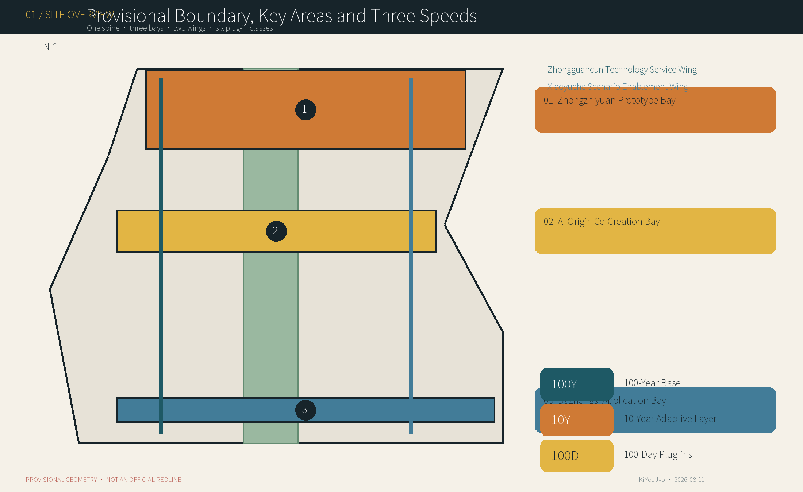
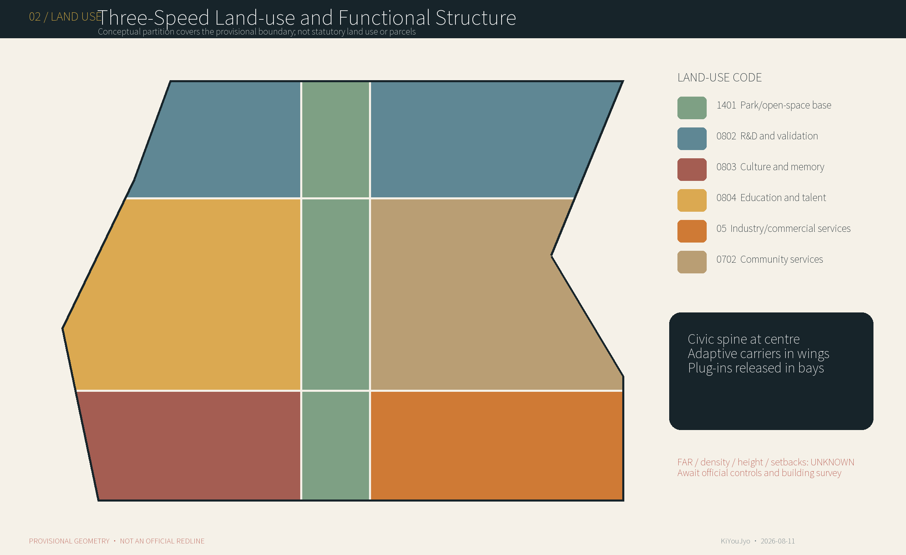
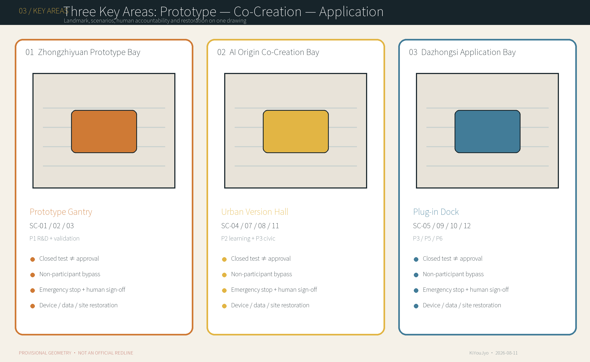
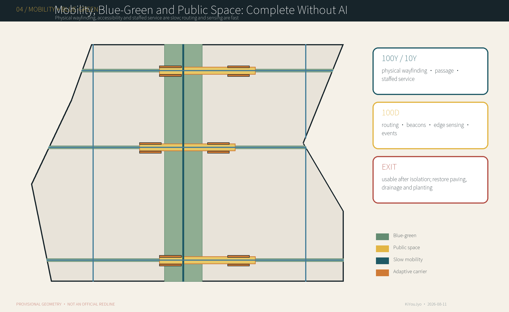
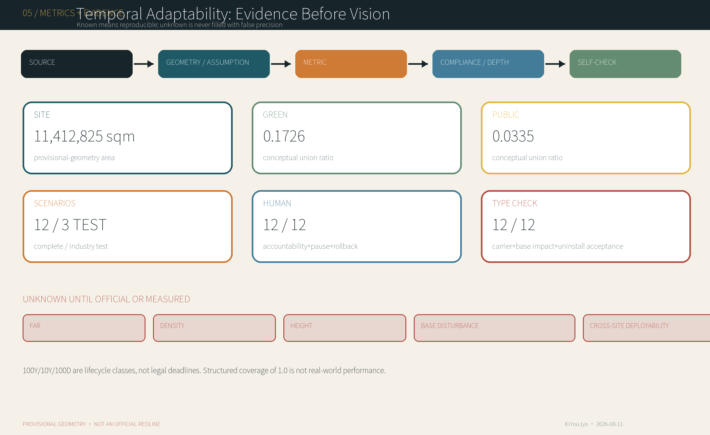

# 100-Year Base / 100-Day Plug-ins — Jing-Zhang Three-Speed City

> **Let the City Outlive the Model.**
>
> 100 years, 10 years and 100 days are lifecycle classes and design metaphors—not statutory deadlines, procurement cycles or implementation promises. This is a local urban-design candidate based on repository provisional geometry and public/cleared information. It is not a survey, statutory plan, construction document, product certification, operating permit or government commitment.

## Design Basis and Source List

The proposal fixes its evidence boundary before designing. The announcement defines three working scales and three key areas; the Agent Taskbook requires open scenarios, personas, identity, operations, protocol and professional deliverables; the site package provides enums, matrices and rough provisional geometry. No official precise `SITE_BOUNDARY`, key-area polygons or statutory planning controls are currently available. The site and key-area layers therefore remain `provisional_constraint` with `official_boundary=false`, usable for replaceable working geometry and local content review only. Areas are reproducible EPSG:4548 calculations on that temporary geometry and the whole package must be regenerated when official data arrive. [source:OFFICIAL-ANNOUNCEMENT] [source:BOUNDARY-SOURCE]

Evidence has four levels: the official announcement establishes tasks and verbal scope; registered public/cleared material supports facts; provisional polygons support generation and discussion only; package GeoJSON, figures and metrics are design proposals. The processed fact pack is navigation, not a new authority. Global cases use first-party operator, government or public-review sources; this package extracts mechanisms without copying outside images, maps, brands or plan numbers. [source:SOURCE-REGISTRY] [source:PROCESSED-FACT-PACK]

Nine data groups remain outstanding: official overall boundary; official key areas; regulatory controls; roads/rail/transport; parcels and tenure; existing buildings; heritage/archaeology; utilities/fire/hydrology/safety; and population/public facilities. They are recorded as assumptions with recalculation triggers for geometry, metrics, figures, HTML and PDFs. The trace is source → geometry/assumption → metric → compliance/depth → self-check; a provisional-boundary warning is never recast as a high-confidence official conclusion. [depth:existing_conditions_diagnosis]

## Three-Level Scope Framework

The coordinated-research scale examines the roughly 43.6 km² industry, talent and future-city relationship; the overall-design scale uses the announcement's roughly 11.4 km² verbal extent to establish an urban-renewal and regulatory-plan-level framework; the key-area scale covers detailed design at Zhongzhiyuan, Beijing AI Origin Community and Dazhongsi. These are not three disconnected drawing sets: research establishes temporal and ecosystem mechanisms, overall design converts them into civic base, adaptive carriers and land/transport/blue-green systems, and key areas test space, governance and exit through twelve plug-in scenarios. [standard:PROJECT-OFFICIAL-ANNOUNCEMENT] [depth:three_level_scope_framework]

| Scale | Question | Deliverable | Boundary |
| --- | --- | --- | --- |
| Coordinated research | How do AI industry and urban lifespans work together? | three speeds, six plug-in classes, six cases and annual operations | no invented precise research boundary |
| Overall design | How can long civic value coexist with rapid innovation? | one spine, three bays, two wings, land/building/transport/blue-green/projects/phasing | conceptual structure inside provisional SITE_BOUNDARY |
| Key areas | How are scenarios released, paused and restored? | three landmarks, twelve scenarios, fifteen components and object protocol | detailed-design candidate inside provisional KEY_AREA geometry |

The proposal is not a simple permanent-city versus temporary-technology binary. It decouples three spatial time constants:

| Lifecycle class | Protected / carried object | Design rule |
| --- | --- | --- |
| 100Y Base | heritage, civic rights, blue-green systems, basic mobility, accessibility, services and memory | do not rebuild for model churn; fast layers cannot privatise or damage it |
| 10Y Adaptive Layer | vendor-neutral ground floors, shared test space, open interfaces, service strips and maintainable carriers | adjust with industry and population without following each model version |
| 100D Plug-ins | agents, robots, edge devices, temporary services and events | predeclare activation, review, override, pause, rollback, removal, restoration and archive |

A **temporal firewall** is not a generic fast/slow metaphor but a testable directed dependency. A 100D plug-in cannot touch the 100Y base or leave proprietary anchors; it must attach through one named, versioned, vendor-neutral 10Y `carrier_interface_id`. This replaceable carrier absorbs wear. Before RELEASE it records structural load, power, data, accessible clearance, noise and fire limits in an `interface_envelope`, plus a `base_impact_budget`; a missing or exceeded field returns the object to TEST. Retirement does not end at power-off. ARCHIVE/REUSE requires asset/data portability, capped interfaces and named-human acceptance—against the pre-release baseline—of paving, drainage, planting, passage, staffed service and heritage interfaces. Public passage, accessibility, staffed service, blue-green continuity, heritage authenticity, human appeal and a non-digital alternative remain uneditable 100Y invariants. [standard:MOHURD-URBAN-DESIGN-MEASURES] [depth:overall_spatial_structure]

## Coordinated Research Area: Industry and Future City Research

An AI innovation belt cannot rely on clustering companies or displaying technology. It must organise R&D validation, open learning, civic service, mobility operations, cultural experience and global exchange as an ecosystem that can admit, remove and learn. The Zhongguancun Technology Service Wing connects research, professional services, incubation and knowledge networks; the Xiaoyuehe Scenario Enablement Wing connects communities, ecology, public services and real-use feedback; the three bays carry prototype, co-creation and application at different release intensities. Shared interfaces are not default-open data; a completed trial is not procurement; display is not government endorsement; an operator cannot assume statutory authority. [source:AGENT-TASKBOOK] [depth:industry_future_city_research]

### Six global cases: mechanisms, not copied controls

| Case / verified status | Transferable mechanism | Jing-Zhang translation | Do not transplant |
| --- | --- | --- | --- |
| Punggol Digital District: JTC master-planned development; SIT is open and the district is entering operation, while the 2026 physical-AI testbed was still announced for later launch. [source:CASE-PDD-JTC] | District digital base, virtual test and controlled field test with tiered data access. | Separate digital base, simulation and field release; share interfaces without default data openness. | Singapore land/regulatory integration and reported sensor scale are not transferable targets. |
| 22@Barcelona: Incremental renewal since 2000, amended in 2022 with a 2023 infrastructure plan; the south is more consolidated while the north remains in development. [source:CASE-22BARCELONA] | Mixed knowledge production, housing, facilities and public space with infrastructure recalibrated by phase. | Tie each increment to public-space, service and infrastructure obligations. | Catalan planning law and historic development-right ratios cannot become Beijing controls. |
| Brainport / High Tech Campus Eindhoven: A mature R&D campus with separate layers for regional strategy, execution and on-site management. [source:CASE-BRAINPORT] | Triple-Helix regional governance, a professional delivery body and shared-site operations. | Separate civic-interest strategy, technically capable execution and daily operations. | A privately managed specialist campus is not a complete mixed city; open innovation is not unconditional IP openness. |
| Toyota Woven City: Phase 1 has begun while Phase 2 remains under construction; the resident/project sample is small and company-governed. [source:CASE-WOVEN] | Prototype garage, controlled field and lived-environment test sequence. | Give each plug-in a prototype, closed test, limited street trial and evidence-led expansion path. | Operator-reported small samples are not independent long-term evidence. |
| Smart Kalasatama: The 2013-2021 programme ended after 25 agile pilots, while its method continues in later city programmes. [source:CASE-KALASATAMA] | Open call, co-development, real-world trial and evaluation, including rapid identification of dead ends. | Predeclare sunset, review and asset destination; archive failures as public learning. | Finnish pilots were often around six months and used different procurement/funding systems. |
| Sidewalk Toronto / Quayside Warning: Sidewalk Labs withdrew in 2020 and that plan was not built; the later Quayside process is distinct. [source:CASE-SIDEWALK] | Formal reviews exposed gaps in accountability, data flows, procurement, fallback, maintenance and minimum viable alternatives. | Set public authority, data classes, procurement responsibility, independent oversight and vendor exit before choosing a platform. | Privacy controversy cannot be asserted as the single direct cause of withdrawal. |

Together, the cases suggest an adaptive base from 22@, layered coordination from Brainport, a tiered digital base from PDD, time-bounded testing from Woven/Kalasatama and public-authority/vendor-exit safeguards from Sidewalk. Foreign plan numbers, institutions and powers do not become Beijing controls. Reported present conditions are kept separate from future announcements. [source:CASE-SIDEWALK]

Five separately permitted annual events give an operating rhythm: the `100-Day Plug-in Challenge` publishes problems and exit conditions; `Jing-Zhang Version Day` reports additions, pauses, rollback and unresolved issues; `Open Model Week` exposes model capability and limits; the `Urban Rollback Drill` exercises human takeover, power isolation, data removal and physical restoration; `Heritage × AI Open Week` links railway engineering to current innovation. A developer path runs from public problem, rights/safety screen and prototype through closed test, public review, limited release, audit and exit/upgrade. No stage promises purchase, deployment or scale. [standard:PROJECT-AGENT-OPEN-CALL-TASKBOOK]

## Overall Design Area: Urban Renewal and Regulatory-Plan-Level Urban Design

The structure is **one spine, three bays, two wings and six plug-in classes**. The Jing-Zhang Long-life Public Spine carries heritage memory, walking, blue-green systems, accessibility, physical wayfinding and staffed-service fallback. Prototype, Co-Creation and Application Bays take different activities; the two wings connect knowledge industry and real urban settings. In P1–P6, `P` means plug-in class—not persona or phase: R&D/validation, learning/knowledge, civic service, mobility/operations, culture/experience, and events/exchange. Each object states purpose, carrier interface and public boundary before occupying space. A complete, non-overlapping conceptual land-use partition records the structure, but it is not statutory land use, parcels or intensity control. [standard:MOHURD-CONTROL-DETAILED-PLANNING] [depth:land_use_layout]

| Plug-in class | Permitted 10Y carrier / components | 100Y invariants that cannot be touched |
| --- | --- | --- |
| P1 R&D and validation | IF-ZY-*; C01/C02/C03/C07/C08 | no passive public testing; public bypass and safety accountability remain |
| P2 learning and knowledge | IF-AO-*; C02/C03/C07/C09/C13 | teachers/guardians, accessible material and no-account learning remain |
| P3 civic services | IF-AO-* / IF-DZS-*; C03/C05/C08/C09/C13 | staffed service, appeal and human judgement cannot be overwritten |
| P4 mobility and operations | IF-SPINE-*; C03/C07/C09/C13 | public passage, statutory wayfinding, accessibility and emergency access remain |
| P5 culture and experience | IF-JZ-*; C03/C04/C09/C12 | heritage fabric, authenticity, sources and no-camera choice remain |
| P6 events and global exchange | IF-DZS-*; C02/C03/C04/C14/C15 | egress, everyday passage, human translation and quiet edges remain |

The central conceptual 1401 park/open-space band is flanked by research, education, culture, commercial and community-service envelopes. Exact partitioning enables topology and area review, while its planning meaning is “civic base in the middle, adaptive carriers in the wings, plug-ins in the bays.” It does not replace current uses, statutory classification, parcel compatibility or permission. Codes use the repository's registered classification subset and must be redone once official parcels and controls arrive. [standard:MNR-LAND-USE-CLASSIFICATION-GUIDE]

The building layer contains only twelve conceptual 10Y carriers: test workshops, prototype pods, staffed fallback and version/memory pavilions. With no building survey, structure, tenure, fire or heritage-value evidence, the package makes no building-specific retain/renovate/demolish decision and gives no FAR, density, total floor area, storeys or height. Those metrics remain `unknown`. Principles are heritage-view priority, low-disturbance edges, adaptable ground floors, independently removable equipment, permanent analogue fallback, graduated night activity and restrained landmarks. [depth:development_intensity_controls] [depth:height_massing_character]

Capacity follows “evidence before capacity.” Without road/rail capacity, crowds, fire, power, water, soil, hydrology, noise and service baselines, scenario counts are not converted into people or floor area. The geometry proves that relationships can be organised, not that engineering capacity exists. Before Phase 2 each project needs a discipline capacity sheet, minimum viable non-digital alternative, accountable operator and whole-life cost. [depth:municipal_new_infrastructure]

## Detailed Design of Key Areas

All three key areas use repository rough provisional rectangles rather than official polygons. The detailed-design framework is consistent: position, spatial action, scenarios, landmark, exit and missing evidence. Each place combines conventional urban design with AI governance. Shared requirements are continuous public passage, accessible bypass, physical service, human emergency stop, clear operator, recoverable paving and non-invasive heritage treatment. Exact dimensions, building scale, transport and project limits remain subject to official evidence. [data:geometry/key_areas.geojson#PROV-KEY-001] [depth:three_key_area_detailed_design]

| Key area / role | Function and spatial action | Landmark | Scenarios and governance | Before engineering |
| --- | --- | --- | --- | --- |
| Zhongzhiyuan Prototype Bay | P1 R&D and validation | Prototype Gantry | SC-01–03: closed tests, public observation and human emergency stop; never approval | roads/tenure/fire/utilities/safety distances |
| Beijing AI Origin Co-Creation Bay | P2 learning + P3 civic service | Urban Version Hall | SC-04/07/08/11: shared classroom, co-design, audit, release and correction | existing buildings/tenure/capacity/fire/campus links |
| Dazhongsi Application Bay | P3/P5/P6 application, culture and exchange | Plug-in Dock | SC-05/09/10/12: demonstration, micro-retail, heritage and events | rail/four-quadrant walking/noise/logistics/heritage setting |

**Zhongzhiyuan** locates industry testing in a closable, observable bay so uninvolved people are not passive test subjects. The Prototype Gantry displays state, accountable human and emergency stop; a clear buffer separates tests from public walking. SC-01–03 remain explicitly “test/validation, not approval.” No permanent site or foundation is fixed before Qinghe/water, Fifth Ring transport, utilities, safety distances and tenure are known.

**Beijing AI Origin Community** converts near-campus innovation into shared classrooms, prototype pods, a co-design station and public audit rather than a closed park. The Urban Version Hall should prioritise adaptive reuse and host staffed service, model explanation, appeals, release notes and archive. Campus–park–community walking, daily services and shared ground floors support ordinary life. Building value, tenure, fire, housing demand and rail links await survey.

**Dazhongsi** carries application and global exchange, but demonstration is not endorsement, an event is not permanent operation, and micro-retail is not licence-free. The Plug-in Dock handles inspection, repair, storage, return and restoration. Station/four-quadrant walking, logistics, crowding, noise, fire and the historic setting are preconditions. Beyond the three landmarks, the Jing-Zhang Version Archive retains evidence and Urban Release Notes disclose additions, pauses, rollback and unresolved work. [depth:public_space_system]

### Fifteen reversible components

| ID | Component | Class | Installation / exit rule |
| --- | --- | --- | --- |
| C01 | Reversible Foundation Grid | 10Y | Prefer ballast or reversible joints; cap interfaces and reinstate paving after removal |
| C02 | Service Spine Cabinet | 10Y | Standard power/data docking, separate metering, physical isolation and a port register |
| C03 | Accessible Deck | 100D/10Y | Protect clear width, gradient and slip resistance; reinstate continuous levels at exit |
| C04 | Demountable Canopy | 100D | Review wind and fire for every deployment; return components for reuse |
| C05 | Privacy / Acoustic Screen | 100D | Provide privacy without creating unsafe blind corners |
| C06 | Edge Compute Box | 100D | Label data flows, provide physical stop and keep equipment replaceable |
| C07 | Standard Data / Power Port | 10Y | Publish interface documents, isolate safely and cap unused ports |
| C08 | Human Override Console | 100D/10Y | Give people priority, work offline and log every intervention |
| C09 | Analog Fallback Sign | 100Y/10Y | Remain when a plug-in is offline and receive scheduled human checks |
| C10 | Modular Paving / Utility Strip | 10Y | Number parts for reinstatement, reduce excavation and maintain drainage |
| C11 | Rain-garden Edge | 10Y | Use only after soil/drainage checks and retain safe overflow |
| C12 | Version Archive Rail | 10Y | Display reviewed information only and keep the assembly relocatable |
| C13 | Universal Street Furniture | 10Y | Keep core furniture usable offline and remove smart parts independently |
| C14 | Mobile Demo Dock | 100D | Review structure, electrical safety and crowd capacity for every use |
| C15 | Repair / Storage Pod | 10Y | Provide fire separation, an asset ledger and classified contaminant handling |

The component library does not make RE:RAIL-style material circularity the concept's main claim. It supplies connection, isolation, maintenance, accessibility, fallback and restoration tools for three speeds. Foundations, canopies, services, rain gardens and storage require structural, fire, utilities, soil/drainage and operational review; illustrated forms are component families, not products. [depth:building_ground_floor_interface]

## AI Innovation Ecosystem, Personas, and AI+ Scenarios

Seven personas and twelve complete scenario cards answer who needs what, what AI can do, who is responsible, how it stops and how the place recovers. Personas cover research, education, startups, residents including older people and families, visitors, maintenance/operations and planning/architecture/transport/governance/safety professionals. Every group retains city rights without a smart device; AI cannot replace safety responsibility, public decisions, professional sign-off, teachers/guardians, consumer appeal or heritage authenticity. [depth:ai_scenario_governance]

### Seven personas

| Persona | Need / pain | Space and scenarios | AI provides / never replaces | Layer and rights |
| --- | --- | --- | --- | --- |
| PER-01 Researcher / Engineer | real settings, reproducible tests and clear accountability; pain: tests detached from public safety and permits | SC-01/02/03, Prototype Gantry and shared interfaces | Provides: simulation, diagnostics and test records; never replaces: safety sign-off, ethics or approval | a 10Y carrier hosts 100D test plug-ins; exportable data, disclosed failures, tiered confidentiality and no passive public testing |
| PER-02 Student / Young Developer | low-barrier learning, equipment, mentors and a route to show work; pain: lack of safe settings and civic context | SC-04/07/10 and the open classroom | Provides: teaching, code and prototype aid; never replaces: teachers, academic integrity or child protection | 10Y shared classrooms and pods host 100D courses; anonymous learning, withdrawal, guardian consent and accessible material |
| PER-03 Startup / SME | low-cost prototyping, shared facilities, public validation and easy exit; pain: long leases and bespoke fit-out lock-in | SC-07/09/10 and adaptable ground floors | Provides: design, operations and feedback; never replaces: product safety, consumer duties or investment judgement | 10Y ground-floor carriers host 100D tenants and operations; IP separation, data portability, transparent tenancy and reliable deletion |
| PER-04 Resident / Elderly / Family | safety, legibility, appeal, staffed services and continuous passage; pain: capture, complex interfaces and technological exclusion | SC-06/08/09/11 and the public spine | Provides: navigation, translation and information organisation; never replaces: staffed service, community decisions or appeal | 100Y civic rights take precedence; usable without a smart device, consent, opt-out and staffed alternative |
| PER-05 Visitor | quick orientation, language/accessibility and trusted history; pain: fragmented information during a temporary visit | SC-05/06/10/12 | Provides: guidance, translation and itinerary support; never replaces: statutory signs, on-site safety or heritage authenticity | 100D content attaches through carriers to the 100Y public spine; anonymous access, no-camera zones, location off-switch and sourced information |
| PER-06 Maintainer / Operator | common interfaces, asset ledgers, power isolation and replaceable parts; pain: black boxes and drifting responsibility | all scenarios, especially SC-03/06/09/12 and the Plug-in Dock | Provides: predictive maintenance and fault grouping; never replaces: inspection, on-site confirmation or safety responsibility | operations connect 100Y infrastructure, 10Y interfaces and 100D equipment; least privilege, complete logs, human override and maintainability after vendor exit |
| PER-07 Professional Reviewer | clear sources, consistent methods, auditability and statutory links; pain: missing official geometry and controls | SC-01/02/03/11 and the version archive | Provides: comparison, compliance indexing and evidence organisation; never replaces: survey, engineering, approval or professional sign-off | review crosses all three layers and controls release, pause and exit; evidence access, dissent, authority to pause and a full responsibility chain |

### Urban Version Protocol: an object contract for 100D plug-ins only

The protocol is not an annual planning ledger, source-control process, general service receipt or product approval, and field count is not offered as originality. It makes every 100D object pass a slow-layer type-check and uninstall acceptance: bind a 10Y carrier ID and interface envelope, prohibit bypass to 100Y, declare base-impact budget, asset/data portability and site-restoration acceptance. States are `PROPOSE → TEST → REVIEW → RELEASE → OPERATE → AUDIT → ROLLBACK/UPGRADE → ARCHIVE/REUSE`; RELEASE, PAUSE, EXIT and final restoration sign-off remain human decisions. [source:AGENT-TASKBOOK]

| No. | 26 required fields |
| --- | --- |
| 1 | plugin_id |
| 2 | version |
| 3 | plugin_type |
| 4 | location/spatial_scope |
| 5 | target_users |
| 6 | purpose |
| 7 | expected_lifecycle_class |
| 8 | carrier_interface_id |
| 9 | interface_envelope |
| 10 | base_impact_budget |
| 11 | operator_role |
| 12 | human_accountable_role |
| 13 | required_data |
| 14 | privacy_boundary |
| 15 | installation_condition |
| 16 | activation_condition |
| 17 | review_condition |
| 18 | human_override |
| 19 | pause_condition |
| 20 | rollback_condition |
| 21 | removal_condition |
| 22 | asset_data_portability |
| 23 | site_restoration_acceptance |
| 24 | archive_method |
| 25 | evidence_record |
| 26 | next_review_trigger |

### Twelve scenario cards

### SC-01 Reversible Robotics Test Yard

Class: P1 R&D and validation. **Industry test/validation only; not product, facility or regulatory approval.**

| Field | Scenario card |
| --- | --- |
| Purpose / users | Test accessibility, safety and exit capacity of low-speed delivery, inspection and cleaning robots in a real public-space setting; results are not product approval, regulatory certification or permission for routine operation. Users: engineers, test staff, operators, safety professionals and invited public observers. |
| Three bays / two wings / space | Prototype Bay at Zhongzhiyuan, linked to the Zhongguancun Technology Service Wing; exact siting awaits boundary, tenure and safety checks; spatial type: a closable, time-shared modular hardscape with buffers, staffed observation and an accessible bypass. |
| Three speeds / AI boundary | the 100Y layer protects public passage and safety; the 10Y layer provides adjustable paving and common interfaces; robots, chargers and test fixtures are 100D. AI role: navigation, avoidance, scheduling and simulation, never the on-site safety lead or emergency staff. |
| 10Y carrier / interface type-check | IF-ZY-01 using C01/C02/C03/C07/C08. concept carrier formed by C01/C02/C03/C07/C08; structural load, power, data, accessible clearance, noise and fire limits must be measured and entered by professionals before RELEASE, never inferred from concept values. Base-impact rule: zero allowance for proprietary direct anchors in the 100Y base; the named 10Y carrier absorbs foreseeable wear, penetrations, connections and restoration duty, while actual disturbance awaits a surveyed baseline and method statement. |
| Data / personal data | device trajectories, speed, fault codes, environmental sensing and incident records; video only where necessary. Personal-data boundary: images and location may be involved; default de-identification, minimum retention and observation zones without capture. |
| Human accountability / preconditions | joint sign-off by the yard safety lead and each device test lead. Preconditions: enclosure and egress review, geofence, emergency-stop test, public notice, insurance, accessible bypass, fire and electrical checks. |
| Audit / pause | immutable records of version, task, takeover, collision or near miss, complaints and correction. Pause: failed emergency stop, boundary breach, human conflict, unauthorised collection, severe weather or safety-lead instruction. |
| Rollback / physical restoration | stop and isolate power, remove devices and temporary charging, preserve logs; failed tests cannot become routine services. Restoration: remove anchors and restore modular paving, drainage, planted edges and continuous passage. |
| Portability / uninstall acceptance | before exit, export authorised data and configuration, transfer or recover assets and spares, revoke credentials, cap ports and retain a reviewable inventory. Acceptance: the object may move from ROLLBACK to ARCHIVE/REUSE only after a named human compares the pre-release baseline and exit evidence and accepts reinstatement of paving, drainage, planting, passage, staffed service and heritage interfaces. |
| Metrics / missing data / follow-up | test hours, incidents per 1,000 test hours, takeover success, stop response, restoration time and closure rate. Missing: road and tenure boundaries, utilities, emergency access, baseline footfall and noise. Professional follow-up: joint review by transport, safety engineering, robotics testing, fire, electrical, accessibility and insurance specialists. |

### SC-02 Public AI Agent Evaluation Station

Class: P1 R&D and validation. **Industry test/validation only; not product, facility or regulatory approval.**

| Field | Scenario card |
| --- | --- |
| Purpose / users | Enable public and professional evaluation of accuracy, bias, explainability and human takeover under controlled conditions; evaluation is not model approval. Users: residents, service staff, model developers, independent evaluators, privacy and governance staff. |
| Three bays / two wings / space | Prototype Bay at Zhongzhiyuan, linked to the Zhongguancun Technology Service Wing; spatial type: an open evaluation room and acoustic interview booth convertible to staffed service. |
| Three speeds / AI boundary | 100Y protects equal service and appeal; 10Y provides reconfigurable workstations; candidate models and test kits are 100D. AI role: the object under test and an aid to classification; people decide scoring, release and pause. |
| 10Y carrier / interface type-check | IF-ZY-02 using C02/C03/C07/C08/C09. concept carrier formed by C02/C03/C07/C08/C09; structural load, power, data, accessible clearance, noise and fire limits must be measured and entered by professionals before RELEASE, never inferred from concept values. Base-impact rule: zero allowance for proprietary direct anchors in the 100Y base; the named 10Y carrier absorbs foreseeable wear, penetrations, connections and restoration duty, while actual disturbance awaits a surveyed baseline and method statement. |
| Data / personal data | versioned prompts, answers, failure classes, human review and feedback. Personal-data boundary: synthetic or de-identified cases by default; real cases require explicit consent and authority. |
| Human accountability / preconditions | service owner, independent evaluation lead and privacy lead. Preconditions: model card, test scope, red-team test, accessible interface, content safety, consent/withdrawal and staffed fallback. |
| Audit / pause | trace the fixed test-set version, raw output, human finding, dissent, correction and appeal. Pause: sensitive-data leakage, persistent misinformation, discriminatory outcome, advice beyond authority or failed takeover. |
| Rollback / physical restoration | withdraw the model, switch to staffed service, delete temporary data under policy and retain the necessary audit summary. Restoration: after terminal removal, return the room to ordinary public service or teaching. |
| Portability / uninstall acceptance | before exit, export authorised data and configuration, transfer or recover assets and spares, revoke credentials, cap ports and retain a reviewable inventory. Acceptance: the object may move from ROLLBACK to ARCHIVE/REUSE only after a named human compares the pre-release baseline and exit evidence and accepts reinstatement of paving, drainage, planting, passage, staffed service and heritage interfaces. |
| Metrics / missing data / follow-up | cases, failure-class coverage, takeover success, correction time, withdrawal fulfilment and accessible-task success. Missing: real service process, eligible models, risk tiers, legal and records duties, current demand. Professional follow-up: AI assurance, public administration, privacy, accessibility, legal and domain experts to set the protocol. |

### SC-03 Edge-AI Urban Furniture Test Interface

Class: P1 R&D and validation. **Industry test/validation only; not product, facility or regulatory approval.**

| Field | Scenario card |
| --- | --- |
| Purpose / users | Test durability, privacy boundaries and maintainability of local computing, sensing and urban-furniture interfaces; not municipal type approval or procurement. Users: facility developers, municipal maintainers, environmental and privacy professionals, everyday users. |
| Three bays / two wings / space | Prototype Bay at Zhongzhiyuan, linked to the Xiaoyuehe Scenario Enablement Wing; spatial type: a standard interface strip for replaceable seats, poles, information columns and shelters. |
| Three speeds / AI boundary | 100Y keeps public space continuous; bases and utility interfaces are 10Y; sensors, edge boxes and interactions are 100D. AI role: local environmental recognition, anonymous flow estimation and diagnostics; no enforcement or identity recognition. |
| 10Y carrier / interface type-check | IF-ZY-03 using C02/C03/C06/C07/C13. concept carrier formed by C02/C03/C06/C07/C13; structural load, power, data, accessible clearance, noise and fire limits must be measured and entered by professionals before RELEASE, never inferred from concept values. Base-impact rule: zero allowance for proprietary direct anchors in the 100Y base; the named 10Y carrier absorbs foreseeable wear, penetrations, connections and restoration duty, while actual disturbance awaits a surveyed baseline and method statement. |
| Data / personal data | temperature, humidity, noise, device state and aggregate flow; raw imagery stays on device by default. Personal-data boundary: normally none; unavoidable collection requires separate assessment, conspicuous notice and short retention. |
| Human accountability / preconditions | municipal facility operator and test-device owner. Preconditions: structural, electrical, cyber, accessible-clearance, privacy-notice, maintenance and isolation review. |
| Audit / pause | record inventory, firmware/model hash, sensing envelope, data flow, faults, maintenance and removal. Pause: collection beyond authority, intrusion, loose structure, blocked passage, persistent false alarms or lost maintenance contact. |
| Rollback / physical restoration | physically isolate power, remove modules, cap interfaces and delete non-essential cache. Restoration: restore ordinary furniture function, paving, drainage and accessible clearance. |
| Portability / uninstall acceptance | before exit, export authorised data and configuration, transfer or recover assets and spares, revoke credentials, cap ports and retain a reviewable inventory. Acceptance: the object may move from ROLLBACK to ARCHIVE/REUSE only after a named human compares the pre-release baseline and exit evidence and accepts reinstatement of paving, drainage, planting, passage, staffed service and heritage interfaces. |
| Metrics / missing data / follow-up | on-device share, unauthorised transfer, failure rate, maintenance response, removal time and obstruction incidents. Missing: utilities, asset ownership, footfall, microclimate, furniture standards and maintenance duties. Professional follow-up: industrial design, structural, electrical, cyber, landscape, privacy and accessibility review. |

### SC-04 Open Model Classroom

Class: P2 learning and knowledge. Release requires professional preconditions and a named accountable human.

| Field | Scenario card |
| --- | --- |
| Purpose / users | Teach model principles, limits, open tools and urban problem practice. Users: students, young developers, teachers and resident learners. |
| Three bays / two wings / space | Co-Creation Bay in Beijing AI Origin Community, serving the Technology Service Wing; spatial type: reconfigurable classroom, workshop and small compute-demonstration room. |
| Three speeds / AI boundary | 100Y protects public learning; the shared classroom is 10Y; curricula, models and terminals are 100D. AI role: teaching aid, code prompting and simulation, not teacher assessment, guardianship or value judgement. |
| 10Y carrier / interface type-check | IF-AO-01 using C02/C03/C07/C09/C13. concept carrier formed by C02/C03/C07/C09/C13; structural load, power, data, accessible clearance, noise and fire limits must be measured and entered by professionals before RELEASE, never inferred from concept values. Base-impact rule: zero allowance for proprietary direct anchors in the 100Y base; the named 10Y carrier absorbs foreseeable wear, penetrations, connections and restoration duty, while actual disturbance awaits a surveyed baseline and method statement. |
| Data / personal data | open course materials, exercises, feedback and optional progress. Personal-data boundary: accounts and minors may be involved; anonymous access and guardian consent are required. |
| Human accountability / preconditions | course owner, teacher and venue operator. Preconditions: curriculum review, model card, teacher presence, content safety, accessible material, child protection and teacher-led fallback. |
| Audit / pause | record course version, sampled outputs, corrections, complaints and teacher review. Pause: harmful content, repeated factual error, manipulative advice, privacy or copyright risk. |
| Rollback / physical restoration | disable the model, return to teacher-led delivery and clear temporary accounts/data. Restoration: remain an ordinary classroom and community room after terminal removal. |
| Portability / uninstall acceptance | before exit, export authorised data and configuration, transfer or recover assets and spares, revoke credentials, cap ports and retain a reviewable inventory. Acceptance: the object may move from ROLLBACK to ARCHIVE/REUSE only after a named human compares the pre-release baseline and exit evidence and accepts reinstatement of paving, drainage, planting, passage, staffed service and heritage interfaces. |
| Metrics / missing data / follow-up | participation/completion, correction, human escalation, accessibility and anonymous access. Missing: age profile, demand, capacity, network/compute, school partners and guardianship. Professional follow-up: education, child protection, copyright, AI safety and accessibility specialists to set standards. |

### SC-05 AI Heritage Interpretation Module

Class: P5 culture and experience. Release requires professional preconditions and a named accountable human.

| Field | Scenario card |
| --- | --- |
| Purpose / users | Connect Jing-Zhang railway engineering, local industrial memory and current innovation through verifiable interpretation. Users: residents, visitors, students, researchers and heritage stewards. |
| Three bays / two wings / space | the long-life public spine, potentially linked to the Dazhongsi Application Bay, subject to heritage survey; spatial type: non-invasive pavilion, digital guide, demountable signs and archive access point. |
| Three speeds / AI boundary | 100Y protects fabric and memory; exhibition space is 10Y; digital content and events are 100D. AI role: retrieval, translation and assisted narration from cleared archives, never authenticity judgement. |
| 10Y carrier / interface type-check | IF-JZ-01 using C03/C04/C09/C12/C13. concept carrier formed by C03/C04/C09/C12/C13; structural load, power, data, accessible clearance, noise and fire limits must be measured and entered by professionals before RELEASE, never inferred from concept values. Base-impact rule: zero allowance for proprietary direct anchors in the 100Y base; the named 10Y carrier absorbs foreseeable wear, penetrations, connections and restoration duty, while actual disturbance awaits a surveyed baseline and method statement. |
| Data / personal data | rights-cleared archives, image catalogues, oral-history metadata and anonymous queries. Personal-data boundary: oral histories may be personal and require tiered authority; visitor identity is not logged by default. |
| Human accountability / preconditions | heritage curator and rights steward. Preconditions: heritage assessment, copyright clearance, expert review, non-invasive installation and required permits. |
| Audit / pause | retain source, version, expert review and public correction for every narrative. Pause: unsourced narrative, serious factual error, rights dispute or impact on heritage fabric. |
| Rollback / physical restoration | withdraw the digital version, use reviewed static content and remove temporary equipment. Restoration: no permanent anchors in heritage fabric; restore surfaces and landscape. |
| Portability / uninstall acceptance | before exit, export authorised data and configuration, transfer or recover assets and spares, revoke credentials, cap ports and retain a reviewable inventory. Acceptance: the object may move from ROLLBACK to ARCHIVE/REUSE only after a named human compares the pre-release baseline and exit evidence and accepts reinstatement of paving, drainage, planting, passage, staffed service and heritage interfaces. |
| Metrics / missing data / follow-up | traceable answers, expert correction, cleared material, language/accessibility and heritage impacts. Missing: heritage inventory, protection limits, condition, archive rights and archaeology. Professional follow-up: heritage, archaeology, history, archives, IP and accessibility review. |

### SC-06 Multilingual Accessible Navigation Plug-in

Class: P3 civic services / P4 mobility and operations. Release requires professional preconditions and a named accountable human.

| Field | Scenario card |
| --- | --- |
| Purpose / users | Provide consistent walking and interchange information for older people, disabled people, families and international visitors. Users: all users, prioritising mobility, visual, hearing and language needs. |
| Three bays / two wings / space | across the three bays, public spine and both wings; spatial type: app, web, voice terminal, tactile map, low screen and removable beacons. |
| Three speeds / AI boundary | 100Y retains physical wayfinding and passage; information interfaces are 10Y; algorithms, language packs and diversions are 100D. AI role: multilingual Q&A, route tailoring and alerts, never statutory signs, staff or safety judgement. |
| 10Y carrier / interface type-check | IF-SPINE-01 using C03/C07/C09/C13. concept carrier formed by C03/C07/C09/C13; structural load, power, data, accessible clearance, noise and fire limits must be measured and entered by professionals before RELEASE, never inferred from concept values. Base-impact rule: zero allowance for proprietary direct anchors in the 100Y base; the named 10Y carrier absorbs foreseeable wear, penetrations, connections and restoration duty, while actual disturbance awaits a surveyed baseline and method statement. |
| Data / personal data | network, slopes, barriers, entrances, works and optional current location. Personal-data boundary: location and assistance needs may be sensitive; on-device, no-login and switch-off by default. |
| Human accountability / preconditions | transport/site operator and accessible-information owner. Preconditions: surveyed accessible map, retained statutory signs, staffed help, update owner and public correction. |
| Audit / pause | record route version, barrier source, failed routes, complaints, correction and human verification. Pause: unsafe route, stale data, critical facility outage or discriminatory recommendation. |
| Rollback / physical restoration | disable smart routing and fall back to static maps, staffed help and fixed signs. Restoration: repair surfaces after beacon removal without weakening existing wayfinding. |
| Portability / uninstall acceptance | before exit, export authorised data and configuration, transfer or recover assets and spares, revoke credentials, cap ports and retain a reviewable inventory. Acceptance: the object may move from ROLLBACK to ARCHIVE/REUSE only after a named human compares the pre-release baseline and exit evidence and accepts reinstatement of paving, drainage, planting, passage, staffed service and heritage interfaces. |
| Metrics / missing data / follow-up | route success, wrong routes, freshness, staffed fallback, correction time and complaint closure. Missing: official roads, entrances, slopes, barriers, transit, works and facility state. Professional follow-up: transport, GIS, accessibility, cybersecurity, privacy and multilingual field testing. |

### SC-07 Startup Shared Prototype Pod

Class: P1 R&D and validation / P2 learning and knowledge. Release requires professional preconditions and a named accountable human.

| Field | Scenario card |
| --- | --- |
| Purpose / users | Offer low-barrier shared prototyping, review and demonstration space for startups and small teams. Users: startups, SMEs, student teams, mentors and facility operators. |
| Three bays / two wings / space | Co-Creation Bay in Beijing AI Origin Community, linked to the Technology Service Wing; spatial type: demountable pods, shared desks, small making benches and confidential review room. |
| Three speeds / AI boundary | 100Y protects fair access; adaptive interiors are 10Y; tenant equipment, projects and software are 100D. AI role: code, design and scheduling aid, not IP, product-safety or investment judgement. |
| 10Y carrier / interface type-check | IF-AO-02 using C01/C02/C07/C10/C15. concept carrier formed by C01/C02/C07/C10/C15; structural load, power, data, accessible clearance, noise and fire limits must be measured and entered by professionals before RELEASE, never inferred from concept values. Base-impact rule: zero allowance for proprietary direct anchors in the 100Y base; the named 10Y carrier absorbs foreseeable wear, penetrations, connections and restoration duty, while actual disturbance awaits a surveyed baseline and method statement. |
| Data / personal data | project files, equipment logs, tenant accounts and access records. Personal-data boundary: accounts, trade secrets and authorship require tenant isolation, least privilege and export. |
| Human accountability / preconditions | facility manager and each tenant project owner. Preconditions: tenancy rules, fire, electrical, training, insurance, IP isolation and data-exit agreement. |
| Audit / pause | record access, equipment use, safety events, data migration and pod reset. Pause: unsafe making, unauthorised access, fire-load breach, isolation failure or tenancy breach. |
| Rollback / physical restoration | revoke access, export data, clear environments and remove equipment/interiors. Restoration: return to a standard shell or public workspace. |
| Portability / uninstall acceptance | before exit, export authorised data and configuration, transfer or recover assets and spares, revoke credentials, cap ports and retain a reviewable inventory. Acceptance: the object may move from ROLLBACK to ARCHIVE/REUSE only after a named human compares the pre-release baseline and exit evidence and accepts reinstatement of paving, drainage, planting, passage, staffed service and heritage interfaces. |
| Metrics / missing data / follow-up | utilisation, turnover, reset time, safety events, isolation tests and exit-data delivery. Missing: demand, rent, tenure, fire load, power, network and equipment inventory. Professional follow-up: architecture, MEP, fire, operations, IP, cyber and enterprise-service appraisal. |

### SC-08 Civic Service Co-design Station

Class: P3 civic services. Release requires professional preconditions and a named accountable human.

| Field | Scenario card |
| --- | --- |
| Purpose / users | Let residents and public-service staff define problems, test processes and trace responses together. Users: residents, older people, families, community groups and public-service staff. |
| Three bays / two wings / space | Co-Creation Bay in Beijing AI Origin Community, facing the Xiaoyuehe Scenario Enablement Wing; spatial type: co-design workshop, private consultation booth, public issue wall and staffed desk. |
| Three speeds / AI boundary | 100Y protects participation, appeal and equal service; shared community space is 10Y; themed workshops and tools are 100D. AI role: translation, minutes and issue clustering, never public decisions, allocation or appeal ruling. |
| 10Y carrier / interface type-check | IF-AO-03 using C03/C05/C08/C09/C13. concept carrier formed by C03/C05/C08/C09/C13; structural load, power, data, accessible clearance, noise and fire limits must be measured and entered by professionals before RELEASE, never inferred from concept values. Base-impact rule: zero allowance for proprietary direct anchors in the 100Y base; the named 10Y carrier absorbs foreseeable wear, penetrations, connections and restoration duty, while actual disturbance awaits a surveyed baseline and method statement. |
| Data / personal data | voluntary issues, meeting records, service processes and optional demographics. Personal-data boundary: family/service cases may be personal; recording needs separate consent and public material is de-identified. |
| Human accountability / preconditions | public-service owner and independent facilitator. Preconditions: participation rules, consent, staffed/paper channels, appeal, facilitation and accessibility. |
| Audit / pause | trace original input, summary, response, decision and correction. Pause: misrepresentation, manipulative grouping, privacy leakage or blocked human complaint channel. |
| Rollback / physical restoration | disable automated summaries, use human records and delete recordings/temporary data under policy. Restoration: return to community meeting and consultation after device removal. |
| Portability / uninstall acceptance | before exit, export authorised data and configuration, transfer or recover assets and spares, revoke credentials, cap ports and retain a reviewable inventory. Acceptance: the object may move from ROLLBACK to ARCHIVE/REUSE only after a named human compares the pre-release baseline and exit evidence and accepts reinstatement of paving, drainage, planting, passage, staffed service and heritage interfaces. |
| Metrics / missing data / follow-up | participation coverage, response, summary correction, appeal closure, human review and accessibility. Missing: community profile and needs, administrative responsibility, service points and vulnerable groups. Professional follow-up: sociology, participatory planning, public administration, privacy and accessibility review. |

### SC-09 AI-native Micro-retail Prototype

Class: P3 civic services. Release requires professional preconditions and a named accountable human.

| Field | Scenario card |
| --- | --- |
| Purpose / users | Test small, low-fit-out retail formats that retain staffed service. Users: residents, commuters, visitors, micro-retailers and operators. |
| Three bays / two wings / space | Dazhongsi Application Bay, linked to the Xiaoyuehe Scenario Enablement Wing; spatial type: demountable micro-store, shared ground-floor bay or event stall. |
| Three speeds / AI boundary | 100Y protects street life and consumer rights; adaptable ground floor and interfaces are 10Y; tenants, devices and themes are 100D. AI role: inventory, translation, rostering and advice; no face recognition, discriminatory pricing or removal of appeal. |
| 10Y carrier / interface type-check | IF-DZS-01 using C01/C02/C07/C10/C14. concept carrier formed by C01/C02/C07/C10/C14; structural load, power, data, accessible clearance, noise and fire limits must be measured and entered by professionals before RELEASE, never inferred from concept values. Base-impact rule: zero allowance for proprietary direct anchors in the 100Y base; the named 10Y carrier absorbs foreseeable wear, penetrations, connections and restoration duty, while actual disturbance awaits a surveyed baseline and method statement. |
| Data / personal data | inventory, transactions, energy and complaints; loyalty data only by choice. Personal-data boundary: payment/accounts may be personal; biometrics prohibited by default with cash or staffed alternatives. |
| Human accountability / preconditions | licensed retailer and venue operator. Preconditions: licensing, fire, food/consumer safety, price disclosure, privacy assessment, staffed payment and accessibility. |
| Audit / pause | record price/recommendation changes, stock, returns, complaints and anomalies. Pause: misleading recommendation, unfair pricing, payment failure, data misuse, food or fire risk. |
| Rollback / physical restoration | switch to staffed POS, disconnect smart systems and remove equipment/fit-out. Restoration: restore standard shell, continuous paving and public frontage. |
| Portability / uninstall acceptance | before exit, export authorised data and configuration, transfer or recover assets and spares, revoke credentials, cap ports and retain a reviewable inventory. Acceptance: the object may move from ROLLBACK to ARCHIVE/REUSE only after a named human compares the pre-release baseline and exit evidence and accepts reinstatement of paving, drainage, planting, passage, staffed service and heritage interfaces. |
| Metrics / missing data / follow-up | transaction success, staffed fallback, price disclosure, complaint correction, waste, reuse and reset time. Missing: commercial demand, rent, footfall, tenure, utilities, licences and logistics. Professional follow-up: retail, architecture, fire, food/consumer protection, accessibility and privacy review. |

### SC-10 Developer Public Demo Ground

Class: P6 events and global exchange. Release requires professional preconditions and a named accountable human.

| Field | Scenario card |
| --- | --- |
| Purpose / users | Provide a public, challengeable demonstration ground with explicit limitations. Users: developers, public, investors, enterprise services, media and event operators. |
| Three bays / two wings / space | Dazhongsi Application Bay, linked to the Technology Service Wing; spatial type: demountable pavilion, demo platform, small stand, queue and safety buffer. |
| Three speeds / AI boundary | 100Y protects public space and safety; support/service interfaces are 10Y; demonstrations and event fixtures are 100D. AI role: demonstration, translation and event scheduling; display is not public or venue endorsement. |
| 10Y carrier / interface type-check | IF-DZS-02 using C01/C02/C04/C08/C14. concept carrier formed by C01/C02/C04/C08/C14; structural load, power, data, accessible clearance, noise and fire limits must be measured and entered by professionals before RELEASE, never inferred from concept values. Base-impact rule: zero allowance for proprietary direct anchors in the 100Y base; the named 10Y carrier absorbs foreseeable wear, penetrations, connections and restoration duty, while actual disturbance awaits a surveyed baseline and method statement. |
| Data / personal data | product telemetry, registration, feedback and necessary safety data. Personal-data boundary: registration, images or interaction may be personal; provide no-camera zones and anonymous entry. |
| Human accountability / preconditions | event producer and each demonstration owner. Preconditions: event permit, crowd/fire, electrical, structure, insurance, accessibility, disclaimers and privacy zoning. |
| Audit / pause | record demo version, data flow, limitation disclosure, incidents, complaints and response. Pause: crowding, misleading claim, dangerous action, unauthorised capture or failed takeover. |
| Rollback / physical restoration | stop, isolate power, remove products/structures and preserve necessary incident evidence. Restoration: restore plaza paving, planting, drainage and accessible routes. |
| Portability / uninstall acceptance | before exit, export authorised data and configuration, transfer or recover assets and spares, revoke credentials, cap ports and retain a reviewable inventory. Acceptance: the object may move from ROLLBACK to ARCHIVE/REUSE only after a named human compares the pre-release baseline and exit evidence and accepts reinstatement of paving, drainage, planting, passage, staffed service and heritage interfaces. |
| Metrics / missing data / follow-up | disclosure completeness, safety incidents, accessibility, complaint closure, setup and restoration time. Missing: capacity, emergency access, noise, crowd flow, power and tenure. Professional follow-up: event, crowd safety, fire, structural, electrical, privacy and accessibility review. |

### SC-11 Algorithm Explanation & Public Audit Station

Class: P3 civic services. Release requires professional preconditions and a named accountable human.

| Field | Scenario card |
| --- | --- |
| Purpose / users | Expose model scope, evidence, risks and correction so independent review and public appeal are possible. Users: residents, public bodies, auditors, developers, legal and civil-society representatives. |
| Three bays / two wings / space | Urban Version Hall in Beijing AI Origin Community, serving all bays and wings; spatial type: public hearing room, comparison bench, evidence reading area and private appeal room. |
| Three speeds / AI boundary | 100Y fixes rights to know, appeal and human decision; audit space/archive interfaces are 10Y; audited models/issues are 100D. AI role: assist explanation and case comparison, never independent audit, legal process or final decision. |
| 10Y carrier / interface type-check | IF-AO-04 using C02/C05/C07/C08/C12. concept carrier formed by C02/C05/C07/C08/C12; structural load, power, data, accessible clearance, noise and fire limits must be measured and entered by professionals before RELEASE, never inferred from concept values. Base-impact rule: zero allowance for proprietary direct anchors in the 100Y base; the named 10Y carrier absorbs foreseeable wear, penetrations, connections and restoration duty, while actual disturbance awaits a surveyed baseline and method statement. |
| Data / personal data | model cards, versions, tests, decision logs, synthetic cases and authorised appeal files. Personal-data boundary: appeal files may be highly sensitive and require zoning, redaction, access control and retention rules. |
| Human accountability / preconditions | independent audit lead and the responsible human public decision-maker. Preconditions: audit authority, accessible logs, conflict disclosure, evidence chain, appeal access and legal review. |
| Audit / pause | retain inputs, outputs, method, reproduction, dissent, correction and closure evidence. Pause: insufficient evidence, trade-secret/personal leakage, deceptive explanation or failed independent reproduction. |
| Rollback / physical restoration | pause the model and restore human procedure; preserve evidence and clear sensitive public-terminal data. Restoration: remain a public hearing and archive-reading room after exhibit removal. |
| Portability / uninstall acceptance | before exit, export authorised data and configuration, transfer or recover assets and spares, revoke credentials, cap ports and retain a reviewable inventory. Acceptance: the object may move from ROLLBACK to ARCHIVE/REUSE only after a named human compares the pre-release baseline and exit evidence and accepts reinstatement of paving, drainage, planting, passage, staffed service and heritage interfaces. |
| Metrics / missing data / follow-up | audits, issue closure, reproducibility, appeal handling, pause response and public understanding. Missing: responsible institutions, model access, legal authority, records and appeal system. Professional follow-up: algorithm audit, administrative law, privacy, records, participation and domain review. |

### SC-12 Global AI Event Plug-in Kit

Class: P6 events and global exchange. Release requires professional preconditions and a named accountable human.

| Field | Scenario card |
| --- | --- |
| Purpose / users | Use reusable modules for cross-cultural exchange, exhibitions and developer events. Users: international visitors, developers, research bodies, communities, event operators and volunteers. |
| Three bays / two wings / space | Dazhongsi Application Bay as main node, linked through the public spine; spatial type: demountable stage, translation booth, info point, canopy, display, logistics and recovery modules. |
| Three speeds / AI boundary | 100Y protects passage and memory; connections/storage are 10Y; each event kit is 100D. AI role: translation, scheduling, matching and Q&A, never visa, security screening or personal risk scoring. |
| 10Y carrier / interface type-check | IF-DZS-03 using C02/C03/C04/C14/C15. concept carrier formed by C02/C03/C04/C14/C15; structural load, power, data, accessible clearance, noise and fire limits must be measured and entered by professionals before RELEASE, never inferred from concept values. Base-impact rule: zero allowance for proprietary direct anchors in the 100Y base; the named 10Y carrier absorbs foreseeable wear, penetrations, connections and restoration duty, while actual disturbance awaits a surveyed baseline and method statement. |
| Data / personal data | registration, schedule preference, language/accessibility needs and equipment state. Personal-data boundary: may involve cross-border participants; local processing and shortest retention by default, transfers need separate clearance. |
| Human accountability / preconditions | event organiser, data-protection lead and on-site safety lead. Preconditions: event permit, capacity, fire, emergency, translation/accessibility, cross-border data plan and staffed service. |
| Audit / pause | record kit version, module custody, data inventory, translation corrections, incidents, deletion and recovery. Pause: crowding, severe weather, translation safety risk, cyberattack or data overreach. |
| Rollback / physical restoration | disable smart service, use paper/staffed process, return modules and delete data on schedule. Restoration: restore plaza, lawn, paving, drainage and fire access. |
| Portability / uninstall acceptance | before exit, export authorised data and configuration, transfer or recover assets and spares, revoke credentials, cap ports and retain a reviewable inventory. Acceptance: the object may move from ROLLBACK to ARCHIVE/REUSE only after a named human compares the pre-release baseline and exit evidence and accepts reinstatement of paving, drainage, planting, passage, staffed service and heritage interfaces. |
| Metrics / missing data / follow-up | setup/removal, translation correction, timely deletion, module reuse, waste and drill correction. Missing: event capacity, noise, utilities, storage, cross-border rules, emergency and transport. Professional follow-up: event, fire, crowd safety, data protection, international communication, accessibility and transport review. |

Scenario metrics define methods, not invented baselines or targets. Performance values are populated only after actual tests with valid samples and professional baselines. The package can machine-confirm twelve cards, three industry test/validation scenarios and complete accountability, pause, rollback, restoration, carrier-ID, interface-envelope, base-impact, portability and uninstall-acceptance fields; it cannot confirm any permit, construction or operation. [metric:scenario_count] [metric:human_override_coverage] [metric:carrier_interface_contract_coverage]

## Land Use, Building Scale, and Retain-Renovate-Demolish Strategy

Land use is a seamless conceptual partition inside the provisional boundary. The central spine expresses long-life park/open space and civic rights; the two wings express research, education, culture, commercial and community-service relationships. It does not replace existing use, statutory classification, parcel compatibility or permission. Once official boundary, parcels and controls arrive, locked constraints must precede a new partition, area calculation, public-benefit obligations and delivery roles. [data:geometry/land_use.geojson#LU-001] [depth:land_use_layout]

The honest building boundary is “complete method, objects awaiting survey.” Each existing building needs tenure, age, use, structure, fire, energy, heritage value, ground-floor publicness and adaptation potential before classification as retain, repair, adaptive reuse, remove or new build. The twelve polygons in this package are conceptual tests of 10Y carriers with `existing_status=unknown` and `no demolition decision`. Labels such as inefficient, derelict or vacant cannot be used to infer demolition without evidence. [depth:retain_renovate_demolish]

Controls are reviewable principles rather than false numbers: protect views and walking scale along heritage/public spine; make public purpose and legible accountability—not height—the landmarks; retain continuous passage, staffed service, open interfaces and recoverable construction at ground level; treat rooftop equipment, lighting, signs and event structures as removable; require daylight, wind, fire, structure, transport, heritage and energy studies for new massing. FAR, density, height, setbacks and total floor area remain unknown. [metric:floor_area_ratio] [metric:maximum_building_height_m]

Adaptable ground floors use standard data/power, modular partitions, human-override consoles, analogue fallback, movable furniture and service strips. At vendor exit, data can be exported, ports capped, devices removed and the shell re-let or returned to public use. A 10Y intermediary is not claimed as an exclusive time-layer idea; the specific move here is to make it the unavoidable wear-absorbing and type-checking layer between 100D and 100Y. Proprietary interfaces cannot lock public space to one operator. [depth:building_ground_floor_interface]

## Transport, Rail, Municipal Infrastructure, and Public Services

A continuous public slow spine, two wing cycle interfaces and three east-west stitches form a conceptual network without inventing roads, rail or station entrances. Physical wayfinding, accessible routes and staffed information are 100Y/10Y; routing, works updates and beacons are 100D. Fixed signs and people still serve users when SC-06 is off. Missing road redlines, sections, counts, transit, parking, rail protection, emergency routes and logistics mean no section, capacity or parking number is promised. [depth:traffic_rail_slow_parking]

Robot tests, everyday public movement, event crowds, logistics and fire access must be separated. SC-01 uses enclosure, buffer, accessible bypass and emergency stop; Dazhongsi events and the Plug-in Dock review capacity, noise, setup and logistics each time; every bay keeps a public route for non-participants. Station integration states goals of pedestrian stitching, consistent information and accessible interchange; entrances, four-quadrant works, feeder service and construction require transport/rail confirmation.

Municipal strategy is a 10Y kit of open interfaces, sectional isolation, separate metering, offline function, maintenance access and cappable exit. Edge computing defaults to local processing and short cache; isolating a device cannot disable ordinary light, seating, wayfinding or staffed service. Rain gardens, canopy, charging, storage, compute and communications require load, structure, fire, cyber, hydrology and operations review. With no utility capacity, no energy-saving or capacity percentage is stated. [data:geometry/constraints.geojson#CONSTRAINTS] [depth:municipal_new_infrastructure]

Public services form a network of open classroom, co-design, audit, heritage interpretation, accessible navigation, micro-retail and events. Every smart entrance retains staffed, paper or fixed-sign fallback. Population demand, service radius, responsible agencies and operators determine capacity; until then the proposal defines functions, rights, spatial interfaces and professional follow-up only. [depth:public_service_facilities]

## Blue-Green Network, Public Space, and Urban Character

The central spine and three bay connectors make a conceptual blue-green network combining shade, stormwater, walking, memory and low-disturbance activity. Union area and ratio are recalculated from design polygons but are not statutory green-space ratio, greenline or ecological performance. Xiaoyuehe, Qinghe, hydrology, soil, trees, drainage and flood evidence are absent, so rain gardens, waterfront edges and planting await discipline surveys. [data:geometry/green_space.geojson#GREEN-001] [metric:green_ratio]

Public space starts from “the place still works after AI removal”: continuous paving, usable seats, clear physical wayfinding, uninterrupted accessibility, lighting without identity recognition and complaints reaching a person. Bay commons support observation, deliberation, display and events without displacing everyday passage or turning people into unconsenting test subjects. Opening duties, tenure and management remain to be confirmed. [data:geometry/public_space.geojson#PUBLIC-001] [metric:public_space_ratio]

The cultural sequence is `RAILWAY ENGINEERING → LONG-LIFE CITY → ADAPTIVE URBAN FRAME → RAPID AI EXPERIMENT → HUMAN REVIEW → URBAN MEMORY`. Railway engineering becomes long-lived public infrastructure, standard interfaces, maintainability and engineering memory—not a backdrop for technology spectacle. AI heritage interpretation uses cleared archives, sourced narrative, expert review and non-invasive installation; locations wait for heritage inventory, protection limits, archaeology and view analysis. [depth:heritage_culture]

Identity uses restrained 100Y/100D marks, railway linear order, paper/oxidised-metal/blue-green colours and legible state language. It avoids AI brains, chips, cyberpunk skylines, unlicensed corporate logos, portraits and promotional images. Landmarks gain identity through public use, readable status and demountable construction rather than giant screens or permanent branding. [depth:urban_character]

## Renewal Projects, Implementation Policy, and Phasing

Twelve independently reviewable project packages each begin with an evidence gate, public interest, accountable operator, exit and professional follow-up. They are not funded projects or government commitments. R-01 evidence mapping precedes all engineering; R-12 connects the conceptual candidate to statutory planning and professional design. Priority is low regret, recoverability, civic rights first and adaptive reuse. [depth:renewal_project_list]

| Project | Project name | Scope and prerequisite |
| --- | --- | --- |
| R-01 | Evidence & Boundary Base | Verify official boundaries, three areas, roads, parcels, buildings, heritage, utilities, facilities and safety evidence before engineering |
| R-02 | Jing-Zhang Long-life Spine | Organise heritage narrative, continuous walking, accessibility, blue-green systems and physical wayfinding without promising a permanent section |
| R-03 | Prototype Bay Renewal | Create a time-shared, closable and restorable test ground with the Prototype Gantry |
| R-04 | Co-Creation Bay Renewal | Provide adaptable ground floors, shared classrooms, prototype pods, co-design and the Urban Version Hall |
| R-05 | Application Bay Renewal | Host micro-retail, public demonstration, global events and the Plug-in Dock |
| R-06 | Zhongguancun Service Wing | Link R&D, professional services, incubation and knowledge networks; scope awaits industry and tenure surveys |
| R-07 | Xiaoyuehe Scenario Wing | Link communities, ecology, public services and real-use feedback |
| R-08 | Blue-Green & Slow Mobility Network | Join shade, stormwater, walking, cycling and accessibility; targets await survey, hydrology and transport studies |
| R-09 | Open-interface Utility Kit | Standardise power/data, isolation, metering, maintenance and exit interfaces to reduce vendor lock-in |
| R-10 | Heritage & Version Archive | Coordinate railway records, plug-in versions, audits, rollback and material records |
| R-11 | Safety, Logistics & Maintenance | Organise emergency stop, fire safety, module movement, repair, storage and restoration acceptance |
| R-12 | Planning Integration | Complete statutory controls, transport, structure, fire, building services, landscape, resilience and cost work after official evidence arrives |

Implementation phases are separate from 100Y/10Y/100D lifecycle classes. Phase 0–4 are an evidence, trial, framework, operation and audit decision sequence—not promised years. `phasing.geojson` maps reproducible workload envelopes with intentional overlap because the same place passes through multiple reviews. [data:geometry/phasing.geojson#PHASE-000] [depth:phasing_implementation]

| Phase | Phase name | Release condition |
| --- | --- | --- |
| Phase 0 | Evidence Gate | Verify boundaries, tenure, heritage, roads, buildings, utilities, facilities, planning controls and safety conditions |
| Phase 1 | Low-regret Trials | Allow only temporary guidance, classes and closed tests that avoid permanent structural change, retain human fallback and protect public rights |
| Phase 2 | Adaptive Framework | After professional review, build common bay interfaces, blue-green slow links, three landmarks and operations, prioritising adaptive reuse |
| Phase 3 | Network Operation | Connect twelve scenarios in stages, link both wings and operate a periodic public release process |
| Phase 4 | Audit / Rollback / Archive | Use evidence to continue, upgrade, pause, remove or reuse; complete physical restoration and public release notes |

Policies keep the civic base free from exclusive plug-in occupation; place open interfaces and data portability in procurement/leases; name the human who releases, pauses and exits; separate tests from procurement and events from permanent operation; include equipment, data, anchors, paving and planting in exit acceptance; archive failures and dissent; and permit annual events separately. Governance may separate a civic-interest strategy board, technically capable delivery body and on-site operator, but legal form, authority, procurement and finance remain open. [source:CASE-BRAINPORT]

## Metrics, Area Recalculation, and Compliance Matrix

Known values are limited to reproducible facts; unknowns state why. Provisional site area, conceptual green/public union, slow-line length and structured-content counts are known working values, not statutory targets. FAR, density, height, base disturbance and cross-site deployability remain unknown until official or measured evidence exists. Areas use EPSG:4548 and union-based ratios avoid double counting. [depth:metrics_recalculation] [metric:site_area_sqm]

| Metric | Status | Value | Formula | Meaning / gap |
| --- | --- | --- | --- | --- |
| site_area_sqm | known | 11412825.386 sqm | EPSG:4548 area of the submitted provisional site polygon | Recomputed from package structured files; not a statutory target |
| green_space_area_sqm | known | 1969634.272 sqm | area(union(design green-space polygons)) | Recomputed from package structured files; not a statutory target |
| green_ratio | known | 0.172581 ratio | green_space_area_sqm / site_area_sqm | Recomputed from package structured files; not a statutory target |
| public_space_area_sqm | known | 382418.123 sqm | area(union(conceptual public-space polygons)) | Recomputed from package structured files; not a statutory target |
| public_space_ratio | known | 0.033508 ratio | public_space_area_sqm / site_area_sqm | Recomputed from package structured files; not a statutory target |
| slow_mobility_length_m | known | 32240.927 m | sum(length(conceptual greenway, cycleway and pedestrian centerlines)) | Recomputed from package structured files; not a statutory target |
| scenario_count | known | 12 count | count(structured scenarios) | Recomputed from package structured files; not a statutory target |
| persona_count | known | 7 count | count(structured personas) | Recomputed from package structured files; not a statutory target |
| landmark_count | known | 3 count | count(primary landmarks) | Recomputed from package structured files; not a statutory target |
| protocol_field_count | known | 26 count | count(Urban Version Protocol fields) | Recomputed from package structured files; not a statutory target |
| human_override_coverage | known | 1.0 ratio | scenarios with accountable human and pause/rollback fields / 12 | Recomputed from package structured files; not a statutory target |
| physical_restoration_coverage | known | 1.0 ratio | scenarios with physical restoration fields / 12 | Recomputed from package structured files; not a statutory target |
| carrier_interface_contract_coverage | known | 1.0 ratio | scenarios with carrier interface, envelope, base-impact, portability and restoration-acceptance fields / 12 | Recomputed from package structured files; not a statutory target |
| pending_official_data_count | known | 9 count | count(pending official/professional data groups) | Recomputed from package structured files; not a statutory target |
| floor_area_ratio | unknown | unknown | total_floor_area_sqm / official_site_area_sqm | Official FAR controls, official boundary and verified total floor area are unavailable. |
| building_density | unknown | unknown | official building footprint / official site area | Existing building survey, official boundary and statutory density control are unavailable. |
| maximum_building_height_m | unknown | unknown | max(approved building height) | Approved height, heritage views and aviation/technical controls are unavailable. |
| base_disturbance_index | unknown | unknown | field-verified disturbed long-life fabric / intervention area | Requires surveyed existing conditions and a construction method statement. |
| cross_site_deployability_index | unknown | unknown | verified plug-ins passing interface and transfer tests / tested plug-ins | No prototype deployment or transfer test has yet occurred. |

Temporal Adaptability does not reward the quantity of AI. It tests protection of slow layers, human takeover, physical restoration, data/asset portability, vendor neutrality and archived failure. The twelve structured cards all contain accountability, pause/rollback and restoration fields, so design-field coverage is 1.0; that proves completeness of cards, not a successful real drill. `base_disturbance_index` and `cross_site_deployability_index` remain unknown rather than converting conceptual completeness into implementation performance. [metric:physical_restoration_coverage]

The compliance matrix covers 17 announcement tasks plus agent.1–agent.6; the standard matrix covers five current mandatory references; the design-depth matrix covers fifteen professional items. Structured files hold the exhaustive audit index while prose uses one to three claim-adjacent anchors. Any official-boundary replacement or managed-file edit requires rerender, finalisation/hash, self-check and preflight. Local PASS is not an award, official adoption, professional certification, approval or implementation. [standard:PROJECT-AGENT-OPEN-CALL-TASKBOOK]

## Risk, Copyright, and Compliance

The main risk is misreading provisional geometry as an official redline. Every map, caption, HTML and PDF labels it provisional; area is a working calculation, not a precise statutory control. AI intrusion on rights is controlled through non-participant routes, physical service, minimum data, named humans, emergency stop, pause, appeal and physical restoration. Vendor lock-in is addressed through open interfaces, export, offline fallback, asset ledgers and exit inspection. Technology spectacle is countered by land use, buildings, transport, municipal systems, blue-green/public space, heritage, projects, phasing and fifteen professional-depth items, with engineering unknowns kept visible. [depth:risk_missing_data]

At `open-city-ai/haidian@f72d89db35aa182db803aae50339aec58c4f814b`, this proposal does not claim multi-lifespan layering, a century civic base, reversible interfaces, 90/100-day trials, object passports, versioning/rollback, human takeover or physical retirement as inventions. Slow Variables already separates stable, adaptive and fast-change layers; JZ 1:1 uses 100-year, 30-year, 3-year and 90-day lifespans with prototype passports; Civic Foundry defines a permanent base, reversible interfaces and time-limited AI services; Bounded Sky adds a budget protocol, versions and recovery actions, Playable Jing-Zhang adds demountable components, reinstatement and retirement, and CommonRail Ground adds a four-layer fallback; Address Line, Encounter Commons and Listening Line provide object cards, tickets and lifecycle receipts. One spine, three points, two wings and twelve nodes is also a saturated task translation. The contribution is therefore limited to a testable combination: the `100D → 10Y → 100Y` temporal firewall is a mandatory dependency. Each plug-in must type-check through a versioned, vendor-neutral carrier interface and cannot touch 100Y civic invariants; removal closes only after accepted site restoration, asset/data portability and archive-or-reuse receipts. Six plug-in classes, fifteen components and three landmarks spatialise compatibility checking, public release/appeal, and uninstall/repair/recovery/restoration. This is a narrow independently authored implementation, not a first-of-kind claim.

The copyright statement records that OpenAI Codex (GPT-5 family; exact deployment identifier unavailable to the agent) generated text, programmatic figures, HTML and PDFs under human direction. The five figure pairs use only package GeoJSON/JSON; no outside case photo, map, logo, portrait or promotional image is used. Noto Sans SC is used under SIL Open Font License 1.1 with subsets embedded in PDFs; libraries are Pillow, Shapely, pyproj and ReportLab. Original proposal content is CC BY 4.0, without relicensing cited official/third-party material. [source:SITE-PACKAGE]

Human judgement remains necessary on whether the three-speed architecture is sufficiently urban rather than procedural; architectural and public-space quality of the landmarks; relationship to real surrounding fabric; case transfer; English equivalence; component aesthetics; legal/ethical operators for scenarios; and professional feasibility after official data. Automated validation cannot replace these judgements, statutory approval, survey, engineering, sign-off, product certification or participation.

## References

The formal source index is `sources.json`, assumptions and recalculation triggers are in `assumptions.json`, and exhaustive machine evidence is in the three matrices. The official announcement and Agent Taskbook define tasks; repository rough provisional polygons provide working geometry; registered professional references guide method; and global cases are conservative paraphrases of first-party government, operator or public-review material. [source:OFFICIAL-ANNOUNCEMENT] [source:AGENT-TASKBOOK]

Case sources include JTC/IMDA for PDD, Barcelona municipal material, Brainport/HTCE records, Toyota/Woven City releases, Forum Virium Helsinki reports and Waterfront Toronto public review/withdrawal records. Each source record gives publisher, URL, retrieval date, licence judgement, permitted use and limits. Except for the BCNROC record marked CC BY 4.0, sources are used for factual paraphrase/linking only, with no imagery or extended quotation. [source:CASE-PDD-JTC] [source:CASE-22BARCELONA]

Local design evidence comprises `geometry/*.geojson`, `visual/assets/design_program.json`, `metrics.json`, five bilingual figure pairs, bilingual HTML, bilingual A3/A0 and persisted self-check. When official/cleared data arrive, record source, version, CRS and transformation; replace locked geometry; regenerate every derivative; and repeat three QA rounds and formal gates. Values or warnings must never be hand-edited away. [source:KEY-AREA-SOURCE] [depth:professional_evidence_chain]
