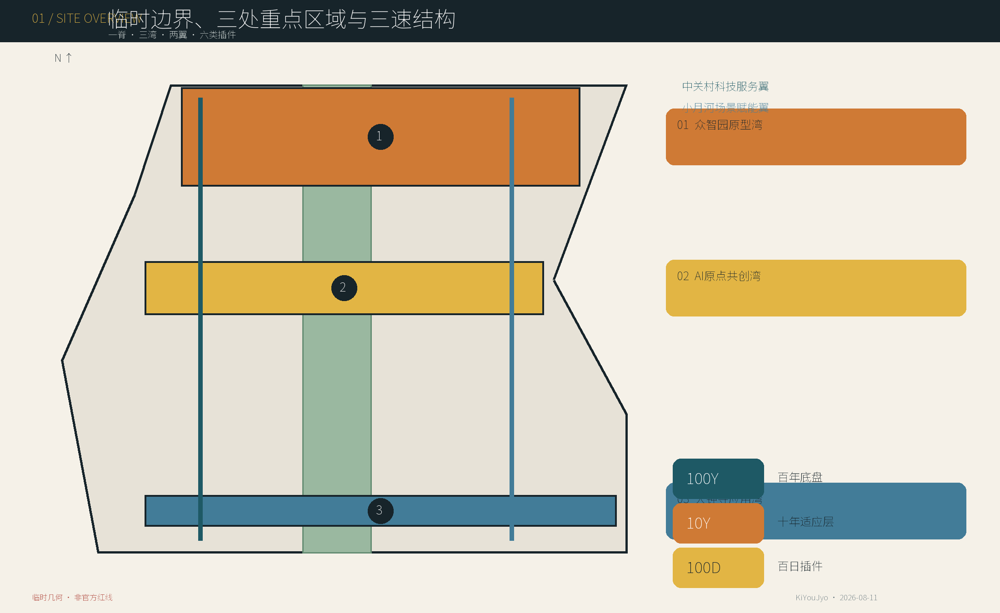
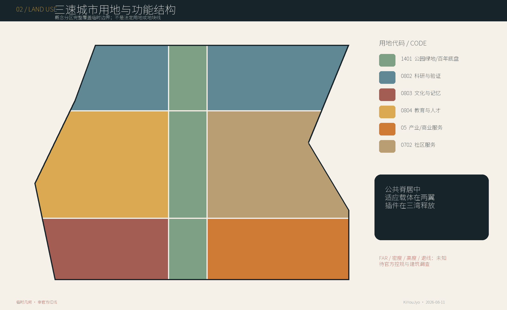
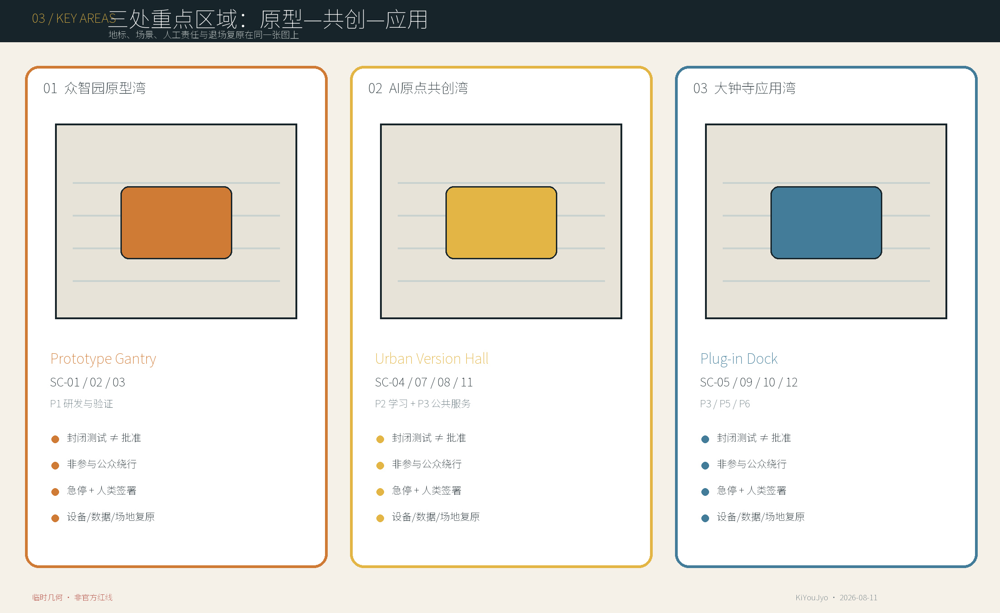
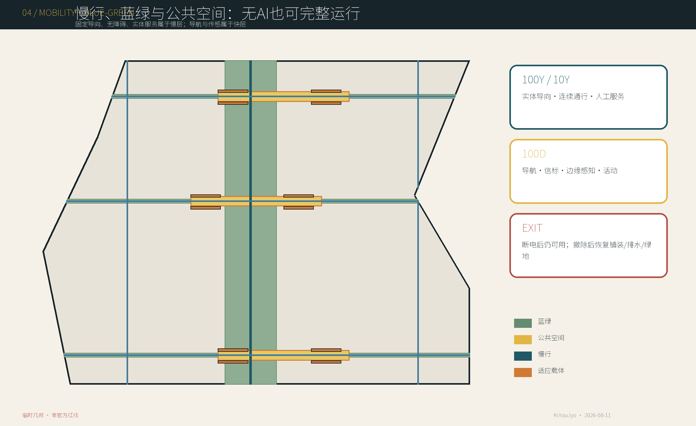
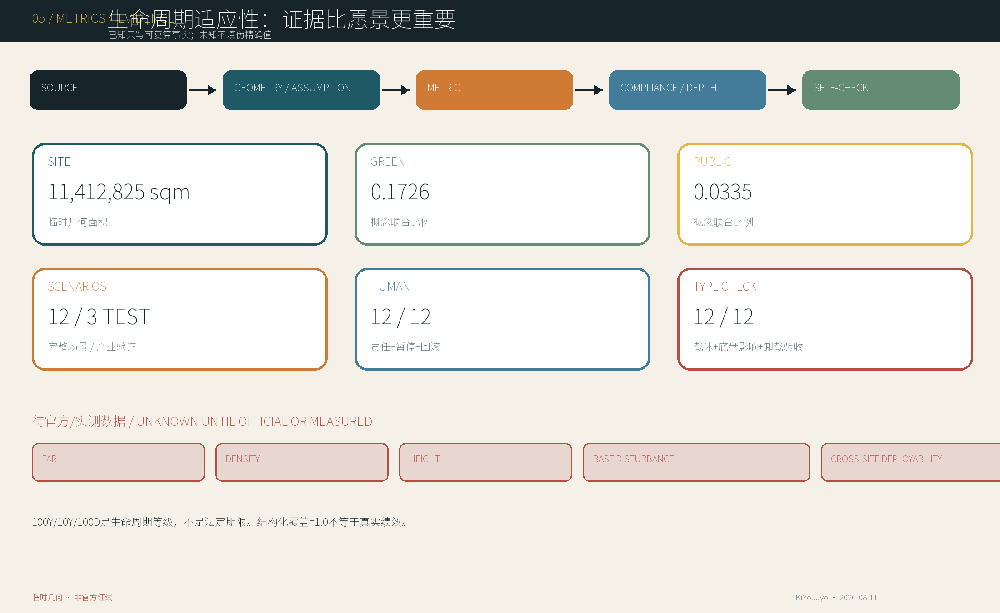

# 百年底盘 · 百日插件——京张三速城市

> **城市应该比算法活得更久。 / Let the City Outlive the Model.**
>
> 100年、10年与100日是生命周期等级和设计隐喻，不是法定期限、采购周期或实施承诺。本方案是基于仓库临时几何与公开/清权资料形成的本地城市设计候选，不是测绘成果、法定规划、施工图、产品认证、运营许可或政府实施承诺。

## 设计依据与资料清单

本方案先锁定证据边界再做设计：公告定义三层工作范围和三处重点区域；Agent任务书要求开放场景、人物画像、品牌、运营、协议与专业成果；仓库场地包提供枚举、矩阵和临时粗略几何。当前没有官方精确 `SITE_BOUNDARY`、三处重点区polygon或法定控规条件，因此 `geometry/site_boundary.geojson` 与 `geometry/key_areas.geojson` 均保持 `provisional_constraint`、`official_boundary=false`，只用于可替换的工作底图和本地内容评分。任何面积仅是EPSG:4548下对临时几何的复算值，官方数据到位后必须整包重算，而不是只换一张图。[source:OFFICIAL-ANNOUNCEMENT] [source:BOUNDARY-SOURCE]

资料分为四级：官方公告用于任务与文字范围；仓库登记的公开/清权资料用于事实；临时边界仅用于生成与讨论；本方案自行生成的GeoJSON、图件和指标属于设计建议。`data/processed/agent_fact_pack.md`只是导航，不升级任何资料权威性。外部案例全部来自运营方、政府或公共审查的一手页面，只提炼机制，不复制外部图像、地图、品牌或规划数值。[source:SOURCE-REGISTRY] [source:PROCESSED-FACT-PACK]

必须补齐的九组资料为：官方总体边界、官方三重点区、法定控规、道路/轨道/交通、地块权属、现状建筑、遗产/考古、管线/消防/水文安全、人口与公共设施。它们分别写入 `assumptions.json`，并触发边界、用地、建筑、交通、蓝绿、分期、指标、图件、HTML和PDF的联动复算。可追溯链为：source → geometry/assumption → metric → compliance/depth → self-check；临时边界warning不会被包装成高置信官方结论。[depth:existing_conditions_diagnosis]

## 三层范围工作框架

统筹研究层理解约43.6平方公里产业、人才与未来城市关系；总体设计层以公告约11.4平方公里为文字尺度，形成城市更新与控规深度的设计框架；重点区域层对应众智园、北京AI原点社区和大钟寺三处详细设计。三层之间不是三套互不相干的图：统筹层提出时间架构与生态机制，总体层把它落为公共底盘、适应载体、用地交通蓝绿系统，重点层以12个插件场景验证空间、治理和退出。[standard:PROJECT-OFFICIAL-ANNOUNCEMENT] [depth:three_level_scope_framework]

| 层级 | 核心问题 | 本案交付 | 边界 |
| --- | --- | --- | --- |
| 统筹研究范围 | AI产业与城市寿命如何协同 | 三速城市、六类插件、六案机制、年度运营 | 不新增伪精确研究红线 |
| 总体设计范围 | 长期公共利益与快速创新如何共存 | 一脊三湾两翼、用地/建筑/交通/蓝绿/项目/分期 | 临时SITE_BOUNDARY内的概念结构 |
| 重点区域 | 场景如何释放、暂停和复原 | 三地标、12场景、15构件、对象级协议 | 临时KEY_AREA内的详细设计候选 |

核心不是“永久城市”对“临时技术”的二分，而是三种时间常数的空间解耦：

| 生命周期等级 | 保护/承载对象 | 设计规则 |
| --- | --- | --- |
| 100Y 百年底盘 | 遗产、公共权利、蓝绿、基本交通、无障碍、基础服务与记忆 | 原则上不因模型更新而重建；任何快层不得私有化或破坏 |
| 10Y 十年适应层 | 供应商中立首层、共享实验空间、开放接口、设备带与可维护载体 | 随产业、人口和使用方式校准，但不追随每个模型版本 |
| 100D 百日插件 | Agent、机器人、边缘设备、临时服务与活动 | 预设启用、复核、人工覆盖、暂停、回滚、移除、复原与归档 |

**时序防火墙**不是泛指“快慢分层”，而是一条可检查的有向依赖：100D插件不得直接触碰100Y底盘或留下专有锚点，必须经一个具名、版本化、供应商中立的10Y `carrier_interface_id` 挂接。10Y载体是可替换的承损层，在RELEASE前登记结构荷载、电力、数据、无障碍净宽、噪声与消防六类 `interface_envelope`，并声明 `base_impact_budget`；任何字段缺失或越界即退回TEST。退役也不以“设备关机”为终点，只有资产/数据可迁移、接口封闭，并由具名人类依据启用前基线验收铺装、排水、绿化、通行、实体服务与遗产界面恢复，才可进入ARCHIVE/REUSE。公共通行、无障碍、实体服务、蓝绿连续、遗产真实性、人工申诉和非数字替代始终属于100Y不可改写项。[standard:MOHURD-URBAN-DESIGN-MEASURES] [depth:overall_spatial_structure]

## 统筹研究范围产业与未来城市研究

AI创新带不应只靠企业集聚或技术展示，而应把研发验证、开放学习、公共服务、交通运营、文化体验和全球交流组织成可进、可退、可积累知识的生态。中关村科技服务翼连接研发、专业服务、孵化和知识网络；小月河场景赋能翼连接社区、生态、公共服务和真实使用反馈；三湾承担从原型、共创到应用的不同释放强度。产业成功的公共条件是：共享接口不等于数据默认开放，试验完成不等于采购，展示不等于政府背书，运营主体不能替代法定责任。[source:AGENT-TASKBOOK] [depth:industry_future_city_research]

### 六个全球案例：只转译机制

| 案例 / 真实状态 | 可转化机制 | 京张转译 | 不可直接套用 |
| --- | --- | --- | --- |
| 新加坡榜鹅数字园区 / Punggol Digital District：JTC总体规划开发；SIT校区已启用，园区渐进运营；2026实体AI试验场仍属计划启动状态。 [source:CASE-PDD-JTC] | 城区数字底座—虚拟测试—受控实地试验，数据分级授权。 | 把数字底座、仿真与实测分成三级；接口共用但数据不默认开放。 | 土地统筹、监管与20,000+传感器规模不可移植。 |
| 巴塞罗那22@ / 22@Barcelona：2000年起渐进更新，2022再修编、2023更新基础设施规划；南区较成熟、北区仍发展。 [source:CASE-22BARCELONA] | 知识型生产、居住、设施和公共空间混合，并随阶段校准基础设施。 | 增量开发同步锁定公共空间、服务与基础设施责任。 | 加泰罗尼亚开发权与价值回收制度、历史比例不可套用。 |
| Brainport / 埃因霍温高科技园 / Brainport / High Tech Campus Eindhoven：成熟研发园区持续运营；区域战略、执行机构与园区现场管理分层。 [source:CASE-BRAINPORT] | 企业—知识机构—政府三方区域治理，加专业园区运营与共享设施。 | 公共战略委员会、专业执行机构与现场运营团队分责。 | 私营专业园区不是完整混合城市，开放创新不等于无条件开放IP。 |
| 丰田Woven City / Toyota Woven City：Phase 1已启动、Phase 2仍建设；居民和项目样本仍小，属公司治理的受控试验城。 [source:CASE-WOVEN] | 原型车库—受控验证—真实居住环境的分级测试链。 | 每插件配置原型、封闭测试、限定街区试运行、复盘扩展。 | 运营方自报、样本有限，不能视作长期独立成效。 |
| 赫尔辛基智慧Kalasatama / Smart Kalasatama：2013—2021项目已结束，25个敏捷试验的方法被后续城市项目延用。 [source:CASE-KALASATAMA] | 公开征集—共同开发—真实环境试用—评估；允许快速识别死路。 | 百日批次预先声明日落、评估、资产去向，失败也归档。 | 芬兰试验常约六个月，采购与欧盟资助背景不同。 |
| Sidewalk Toronto / Quayside警示 / Sidewalk Toronto / Quayside Warning：Sidewalk Labs于2020退出，原方案未建成；后续Quayside是另一个开发进程。 [source:CASE-SIDEWALK] | 正式审查暴露实施责任、数据流、采购、技术失败、维护升级与最低可行方案的不足。 | 平台之前先锁定公共权力、数据分类、采购责任、独立监督和供应商退出。 | 不能把隐私争议写成退出的单一直接原因。 |

六案合成的工作假设是：以22@的渐进底盘承载Brainport式组织分层，以PDD的分级数字底座支撑Woven/Kalasatama式试验，并以Sidewalk警示锁定公共权力、数据权利和供应商退出。案例数值、规划制度和运营权力不被移植到北京；任何“成效”只按来源中已发生的状态陈述，未来计划与已运营严格区分。[source:CASE-SIDEWALK]

年度运营以五个可单独许可的事件形成节奏：`100-Day Plug-in Challenge`公开提出问题与退出条件；`Jing-Zhang Version Day`发布新增、暂停、回滚和遗留问题；`Open Model Week`公开模型能力与局限；`Urban Rollback Drill`演练人工接管、断电、数据撤离和物理复原；`Heritage × AI Open Week`连接铁路工程史与当代创新。开发者路径为公开问题—安全/权利筛查—原型—封闭测试—公众复核—限定释放—审计—退出/升级；任何阶段均不自动承诺采购、落地或规模化。[standard:PROJECT-AGENT-OPEN-CALL-TASKBOOK]

## 总体设计范围城市更新与控规深度城市设计

总体结构为“**一脊、三湾、两翼、六类插件**”。京张百年底盘公共脊承担遗产记忆、连续慢行、蓝绿、无障碍、实体导向和公共服务备份；三湾分别承接Prototype、Co-Creation和Application；两翼连接产业知识与真实城市场景。P1—P6中的 `P` 明确表示 plug-in class，而非人物画像或分期：研发验证、学习知识、公共服务、交通运营、文化体验、活动交流。每个插件先说明用途、载体接口和公共边界再占用空间。该结构已写入完整覆盖且无重叠的概念用地分区，但不是法定地类、地块线或强度控制。[standard:MOHURD-CONTROL-DETAILED-PLANNING] [depth:land_use_layout]

| 插件类 | 允许进入的10Y载体 / 构件 | 不得触碰的100Y不变量 |
| --- | --- | --- |
| P1 研发与验证 | IF-ZY-*；C01/C02/C03/C07/C08 | 公众不得被动成为样本；公共绕行与安全责任不可取消 |
| P2 学习与知识 | IF-AO-*；C02/C03/C07/C09/C13 | 教师/监护、无障碍材料与无账户学习不可被替代 |
| P3 公共服务 | IF-AO-* / IF-DZS-*；C03/C05/C08/C09/C13 | 实体服务、申诉与人工裁决不可被插件覆盖 |
| P4 交通与运营 | IF-SPINE-*；C03/C07/C09/C13 | 公共通行、法定导向、无障碍与应急通道不可改写 |
| P5 文化与体验 | IF-JZ-*；C03/C04/C09/C12 | 遗产本体、真实性、出处与不拍摄选择不可受损 |
| P6 活动与全球交流 | IF-DZS-*；C02/C03/C04/C14/C15 | 消防疏散、日常通行、人工翻译与安静边界不可占用 |

用地采用中央1401公园绿地概念带和两侧科研、教育、文化、商业、社区服务等功能包络，全部由临时场地polygon精确分割，因此可进行拓扑与面积复核；其意义是表达“公共底盘居中、适应载体在两翼、插件进入三湾”，不是替代现行国土空间用途管制。分类引用当前仓库登记的用途分类子集，官方地块和兼容性到位后必须重新编码。[standard:MNR-LAND-USE-CLASSIFICATION-GUIDE]

建筑层只画出12个概念性10Y适应载体，包括测试工坊、原型舱、人工服务备份和版本/记忆展亭。由于没有现状建筑测绘、结构、产权、消防与遗产价值，本阶段不做任何具体建筑的拆、改、留判定，不给出容积率、建筑密度、总建筑规模、层数或高度；这些值在 `metrics.json` 保持 `unknown`。空间控制原则包括遗产视廊优先、沿公共脊低扰动界面、首层可转换、设备独立拆除、模拟备份常在、夜间活动分级和地标克制。[depth:development_intensity_controls] [depth:height_massing_character]

综合承载能力由“先证据、再容量”控制：在道路容量、轨道出入口、人流、消防、供电、给排水、土壤水文、噪声与公共服务基线缺失时，不把场景数量换算为人口或建筑规模。当前图层只证明空间关系可组织，不能证明工程容量已满足；每个项目进入Phase 2前须形成专业容量表、最小可行非数字方案、运维责任和全寿命成本。[depth:municipal_new_infrastructure]

## 重点区域详细设计

三处重点区均使用仓库临时粗略矩形而非官方polygon。详细设计采取“定位—空间动作—场景—地标—撤场—待核资料”的同一审查框架，保证每处既有传统城市设计内容，也有AI插件治理。共同底线为连续公共通行、无障碍绕行、实体服务、人工急停、清楚运营责任、可恢复铺装和不侵入遗产；每处具体尺寸、建筑规模、交通组织与项目边界仍待官方资料。[data:geometry/key_areas.geojson#PROV-KEY-001] [depth:three_key_area_detailed_design]

| 重点区 / 定位 | 功能与空间动作 | 地标 | 场景与治理 | 工程化前置 |
| --- | --- | --- | --- | --- |
| 众智园 Prototype Bay | P1研发与验证 | Prototype Gantry | SC-01—03；封闭测试、公共观察、人工急停；不构成批准 | 道路/权属/消防/管线/安全距离 |
| 北京AI原点社区 Co-Creation Bay | P2学习知识 + P3公共服务 | Urban Version Hall | SC-04/07/08/11；共享课堂、共创、审计、发布与纠错 | 既有建筑/产权/容量/消防/近校联系 |
| 大钟寺 Application Bay | P3/P5/P6应用文化交流 | Plug-in Dock | SC-05/09/10/12；公开演示、微零售、遗产阐释与活动 | 轨道/四象限步行/噪声/物流/遗产环境 |

**众智园**把产业测试放在可围合、可观察且不让无关公众被动参与的原型湾。原型架公示状态、人类负责人和急停位置，测试场与公共慢行之间设置清晰缓冲；SC-01—03始终标注“测试/验证，不构成批准”。清河、水系、五环交通、管线、安全距离和场地权属未核验前，不确定永久场地和基础。

**北京AI原点社区**把近校创新转化为共享课堂、原型舱、共创站和公众审计，而不是封闭园区。城市版本馆优先利用既有建筑，承担人工服务、模型解释、申诉、发布说明与版本档案；校区—园区—社区慢行连接、生活服务和首层共享界面共同支撑人才日常。建筑价值、产权、消防、居住需求和轨道接驳仍须调查。

**大钟寺**承担应用与国际交流，但演示不等于背书、活动不等于常设、微零售不等于免许可。插件码头管理检测、维修、仓储、模块回收和场地复原；轨道站四象限步行连接、物流、人群、噪声、消防和大钟寺历史环境是设计深化前置。三地标之外，`Jing-Zhang Version Archive`保存证据，`Urban Release Notes`用公众可读语言记录新增、暂停、回滚和未解决事项。[depth:public_space_system]

### 15件可逆构件库

| 编号 | 构件 | 层级 | 安装/退出规则 |
| --- | --- | --- | --- |
| C01 | 可逆基础网格 / Reversible Foundation Grid | 10Y | 优先压载或可逆连接；拆除后封闭接口并恢复铺装 |
| C02 | 服务脊柜 / Service Spine Cabinet | 10Y | 标准数电接驳、独立计量、物理断电、端口登记 |
| C03 | 无障碍模块平台 / Accessible Deck | 100D/10Y | 保证净宽、坡度、防滑和退场后高程连续 |
| C04 | 可拆遮棚 / Demountable Canopy | 100D | 逐次核验风荷载与消防，构件回库复用 |
| C05 | 隐私声学屏 / Privacy / Acoustic Screen | 100D | 形成私密性但不制造危险死角 |
| C06 | 边缘计算盒 / Edge Compute Box | 100D | 标识数据流、物理急停和设备可更换 |
| C07 | 标准数电接口 / Standard Data / Power Port | 10Y | 开放接口文档、隔离保护与停用封帽 |
| C08 | 人工覆盖台 / Human Override Console | 100D/10Y | 人工优先、离线可用、动作留痕 |
| C09 | 模拟备份标识 / Analog Fallback Sign | 100Y/10Y | 不随插件下线并定期人工核验 |
| C10 | 模块铺装管线带 / Modular Paving / Utility Strip | 10Y | 编号回装、减少开挖并保持排水连续 |
| C11 | 雨水花园边缘模块 / Rain-garden Edge | 10Y | 在土壤排水核验后采用并保持溢流安全 |
| C12 | 版本档案轨 / Version Archive Rail | 10Y | 只展示已审定信息，构件可迁移 |
| C13 | 通用城市家具 / Universal Street Furniture | 10Y | 核心功能离线可用，智能件独立拆除 |
| C14 | 移动演示台 / Mobile Demo Dock | 100D | 逐次核验结构、电气和人群容量 |
| C15 | 维修储存舱 / Repair / Storage Pod | 10Y | 防火分区、资产台账与污染物分类处理 |

构件库不把RE:RAIL式材料循环作为本案主轴；它只为三速架构提供可实施的连接、断电、维护、无障碍、备份和复原工具。任何基础、遮棚、机电、雨水或仓储构件都需结构、消防、管线、土壤/排水和运营核验后才能选用，图板中的形态是组件族而不是定型产品。[depth:building_ground_floor_interface]

## AI 创新生态、人才画像与 AI+ 场景

本案用7类画像和12张完整场景卡回答“谁需要什么、AI能做什么、谁负责、如何停、撤后如何恢复”。人物画像覆盖研发、教育、创业、居民/老年人/家庭、访客、维护运营和规划建筑交通治理安全专业人员。每类均保留不用智能设备也能获得的城市权利；AI不得替代安全责任、公共决定、专业签章、教师/监护、消费者申诉或遗产真实性判断。[depth:ai_scenario_governance]

### 七类人物画像

| 画像 | 需求 / 痛点 | 空间与场景 | AI提供 / 不替代 | 层级与权利 |
| --- | --- | --- | --- | --- |
| PER-01 研究者与工程师 / Researcher / Engineer | 真实场景、可复现实验与明确责任边界；痛点：测试常与公众安全和场地许可脱节 | SC-01/02/03、Prototype Gantry 与共享接口 | 提供：仿真、诊断与测试记录；不替代：安全签字、伦理与准入判断 | 10Y适应层承载100D测试插件；数据可导出、失败可披露、商业秘密分级，公众不被动成为测试对象 |
| PER-02 学生与青年开发者 / Student / Young Developer | 低门槛学习、设备、导师与展示路径；痛点：缺安全环境和公共问题语境 | SC-04/07/10 与开放课堂 | 提供：教学、代码与原型辅助；不替代：教师、学术诚信和未成年人保护 | 10Y共享课堂与原型舱，100D课程；匿名学习、数据撤回、监护同意与无障碍材料 |
| PER-03 初创企业与中小企业 / Startup / SME | 低成本试制、共享设施、公开验证与快速退出；痛点：长租与专用装修锁定 | SC-07/09/10 与适应性首层 | 提供：设计、运营与反馈；不替代：产品安全、消费者责任和投资判断 | 10Y首层载体，100D租户/经营插件；IP隔离、数据可携、透明租赁与可靠清除 |
| PER-04 居民（含老年人和家庭） / Resident / Elderly / Family | 安全、可理解、可申诉、实体服务与连续通行；痛点：被采集、复杂界面与技术排斥 | SC-06/08/09/11 与公共脊 | 提供：导航、翻译与信息整理；不替代：人工服务、社区决定与申诉裁决 | 100Y公共权利底盘优先；无智能设备也可使用、明确同意、退出与人工替代 |
| PER-05 访客 / Visitor | 快速理解场所、语言、无障碍与可信历史；痛点：临时访问缺少可信、连续信息 | SC-05/06/10/12 | 提供：导览、翻译与行程建议；不替代：法定标识、现场安全与遗产真实性判断 | 100D内容依附100Y公共脊；匿名访问、不拍摄区、位置可关、信息有出处 |
| PER-06 维护与运营人员 / Maintainer / Operator | 统一接口、资产台账、断电与备件替换；痛点：黑箱系统与责任漂移 | 全场景，重点SC-03/06/09/12与Plug-in Dock | 提供：预测维护与故障归类；不替代：巡检、现场确认与安全责任 | 连接100Y基础设施、10Y接口与100D设备；最小权限、完整日志、人工覆盖与退出后可运维 |
| PER-07 规划/建筑/交通/治理/安全专业人员 / Professional Reviewer | 来源清晰、口径一致、可审计并衔接法定程序；痛点：官方边界与控制指标缺失 | SC-01/02/03/11 与版本档案 | 提供：方案比较、合规索引与证据整理；不替代：测绘、工程计算、审批与专业签章 | 跨越三层并负责释放/暂停/退出门槛；访问必要证据、保留不同意见、可要求暂停与完整责任链 |

### Urban Version Protocol：只管理100D插件对象

协议不是年度规划版本账本、开源代码流程、一般服务回执或产品审批，也不以字段数量作为原创证据。它把每个100D物件做成“慢层类型检查 + 卸载验收”：必须绑定10Y载体ID和接口包络，禁止绕过载体触碰100Y，登记底盘影响预算、资产/数据可携和场地复原验收。状态为 `PROPOSE → TEST → REVIEW → RELEASE → OPERATE → AUDIT → ROLLBACK/UPGRADE → ARCHIVE/REUSE`；RELEASE、PAUSE、EXIT和最终复原签收只能由有名有责的人作出。[source:AGENT-TASKBOOK]

| 序号 | 26个必填字段 |
| --- | --- |
| 1 | plugin_id |
| 2 | version |
| 3 | plugin_type |
| 4 | location/spatial_scope |
| 5 | target_users |
| 6 | purpose |
| 7 | expected_lifecycle_class |
| 8 | carrier_interface_id |
| 9 | interface_envelope |
| 10 | base_impact_budget |
| 11 | operator_role |
| 12 | human_accountable_role |
| 13 | required_data |
| 14 | privacy_boundary |
| 15 | installation_condition |
| 16 | activation_condition |
| 17 | review_condition |
| 18 | human_override |
| 19 | pause_condition |
| 20 | rollback_condition |
| 21 | removal_condition |
| 22 | asset_data_portability |
| 23 | site_restoration_acceptance |
| 24 | archive_method |
| 25 | evidence_record |
| 26 | next_review_trigger |

### 十二张场景卡

### SC-01 可逆机器人测试场 / Reversible Robotics Test Yard

插件类：P1 研发与验证。**产业测试/验证场景；不构成产品、设施或监管批准。**

| 字段 | 场景卡 |
| --- | --- |
| 目的与用户 | 验证低速配送、巡检、清扫机器人在真实公共空间中的可达性、安全性与退出能力；测试结果不构成产品准入、监管认证或日常运营批准。 用户：研发工程师、测试员、场地运维、安全专业人员、受邀公众观察者。 |
| 三区两翼 / 空间 | 众智园 Prototype Bay；连接中关村科技服务翼；确切位置待红线、权属与安全距离核验；空间类型：可封闭、分时开放的模块化硬质场地，含缓冲区、人工观察位与无障碍绕行线。 |
| 三速关系 / AI边界 | 100Y层保留公共通行和安全底线；10Y层提供可变铺装及通用接口；100D层为机器人、充电和测试设施。AI角色：导航、避障、任务调度与仿真；不得替代现场安全主管或应急处置人员。 |
| 10Y载体 / 接口类型检查 | IF-ZY-01，采用C01/C02/C03/C07/C08。由C01/C02/C03/C07/C08组成概念载体；结构荷载、电力、数据、无障碍净宽、噪声与消防六类上限须在RELEASE前由专业人员实测并写入，不以概念值放行。底盘影响规则：100Y底盘上的专有直接锚固许可为零；全部可预见磨损、开孔、接驳与恢复责任由具名10Y载体承接，真实扰动量待现状基线和施工方法核验。 |
| 数据 / 个人信息 | 设备轨迹、速度、故障码、环境传感、事件记录；视频只在必要范围启用。个人信息边界：可能涉及影像和位置；默认去识别、最小留存并设置不采集观察区。 |
| 人类责任 / 启用前提 | 测试场安全负责人和每台设备的测试负责人共同签署放行。前提：围界与疏散审查、地理围栏、急停测试、公众告知、保险、无障碍绕行、消防与电气核验。 |
| 审计 / 暂停 | 记录版本、任务、人工接管、碰撞/近失事件、投诉与整改，且原记录不可覆盖。暂停：急停失效、越界、人员冲突、未授权采集、恶劣天气或安全主管指令。 |
| 回滚 / 物理复原 | 立即停机断电，撤出设备和临时充电模块，封存日志；未通过者不得转为日常运营。复原：拆除锚固件，恢复模块铺装、排水、绿化边缘与连续通行。 |
| 可携性 / 卸载验收 | 退场前导出经授权数据和配置、移交或回收资产与备件、撤销凭据、封闭端口，并保留可复核清单。验收：只有具名人类验收人依据启用前基线与退场证据确认铺装、排水、绿化、通行、实体服务和遗产界面恢复，对象才可由ROLLBACK转入ARCHIVE/REUSE。 |
| 指标 / 缺资料 / 深化 | 测试小时、每千测试小时安全事件、人工接管成功率、急停响应、复原时间、整改闭环率。缺资料：道路及产权边界、地下管线、应急通道、背景人流与噪声基线。专业跟进：交通、安全工程、机器人测试、消防、电气、无障碍与保险联合审查。 |

### SC-02 公共AI智能体评测站 / Public AI Agent Evaluation Station

插件类：P1 研发与验证。**产业测试/验证场景；不构成产品、设施或监管批准。**

| 字段 | 场景卡 |
| --- | --- |
| 目的与用户 | 由公众和专业人员在受控条件下评测公共服务智能体的准确性、偏差、可解释性与人工接管；不等于模型获批。 用户：居民、公共服务人员、模型开发者、独立评测员、隐私与治理人员。 |
| 三区两翼 / 空间 | 众智园 Prototype Bay；连接中关村科技服务翼；空间类型：可切换为人工服务台的开放评测室与隔音访谈舱。 |
| 三速关系 / AI边界 | 100Y层保障平等服务与申诉权；10Y层提供可重排工作站；100D层为候选模型与评测套件。AI角色：作为被测对象与辅助归类工具；最终评分、发布、暂停由人作出。 |
| 10Y载体 / 接口类型检查 | IF-ZY-02，采用C02/C03/C07/C08/C09。由C02/C03/C07/C08/C09组成概念载体；结构荷载、电力、数据、无障碍净宽、噪声与消防六类上限须在RELEASE前由专业人员实测并写入，不以概念值放行。底盘影响规则：100Y底盘上的专有直接锚固许可为零；全部可预见磨损、开孔、接驳与恢复责任由具名10Y载体承接，真实扰动量待现状基线和施工方法核验。 |
| 数据 / 个人信息 | 版本化测试问题、回答、失败分类、人工复核与用户反馈。个人信息边界：默认使用合成或去识别案例；真实个案仅经明确同意与授权。 |
| 人类责任 / 启用前提 | 公共服务业务负责人、独立评测负责人和隐私负责人。前提：模型卡、测试范围、红队测试、无障碍界面、内容安全、同意/撤回机制与人工服务备份。 |
| 审计 / 暂停 | 固定测试集版本、原始输出、人工结论、少数意见、纠错与申诉全过程留痕。暂停：泄露敏感信息、持续误导、歧视性结果、越权建议或无法人工接管。 |
| 回滚 / 物理复原 | 撤下模型并切换人工服务；按政策删除临时数据，保留必要审计摘要。复原：终端撤出后恢复为普通公共服务或教学空间。 |
| 可携性 / 卸载验收 | 退场前导出经授权数据和配置、移交或回收资产与备件、撤销凭据、封闭端口，并保留可复核清单。验收：只有具名人类验收人依据启用前基线与退场证据确认铺装、排水、绿化、通行、实体服务和遗产界面恢复，对象才可由ROLLBACK转入ARCHIVE/REUSE。 |
| 指标 / 缺资料 / 深化 | 测试案例数、失败类别覆盖、人工接管成功率、纠错闭环时间、撤回履行率、无障碍任务成功率。缺资料：真实服务流程、适用模型、风险等级、法律与档案要求、现状需求。专业跟进：AI保障、公共管理、隐私、无障碍、法律与行业专家共同确定评测协议。 |

### SC-03 边缘AI城市家具测试接口 / Edge-AI Urban Furniture Test Interface

插件类：P1 研发与验证。**产业测试/验证场景；不构成产品、设施或监管批准。**

| 字段 | 场景卡 |
| --- | --- |
| 目的与用户 | 验证本地计算、传感和城市家具接口的耐久性、隐私边界与可维护性；不构成市政定型或采购批准。 用户：设施研发者、市政维护人员、环境与隐私专业人员、日常使用者。 |
| 三区两翼 / 空间 | 众智园 Prototype Bay；连接小月河场景赋能翼；空间类型：可拆换座椅、灯杆、信息柱和遮棚的标准接口带。 |
| 三速关系 / AI边界 | 100Y层保持公共空间连续；10Y层为家具基座和管线接口；100D层为传感器、边缘盒与交互模块。AI角色：本地环境识别、匿名流量估计与设备诊断；不得执法或身份识别。 |
| 10Y载体 / 接口类型检查 | IF-ZY-03，采用C02/C03/C06/C07/C13。由C02/C03/C06/C07/C13组成概念载体；结构荷载、电力、数据、无障碍净宽、噪声与消防六类上限须在RELEASE前由专业人员实测并写入，不以概念值放行。底盘影响规则：100Y底盘上的专有直接锚固许可为零；全部可预见磨损、开孔、接驳与恢复责任由具名10Y载体承接，真实扰动量待现状基线和施工方法核验。 |
| 数据 / 个人信息 | 温湿度、噪声、设备状态、聚合人流；原始影像默认不出端。个人信息边界：原则上不采集；如不可避免，须单独评估、明显提示并缩短留存。 |
| 人类责任 / 启用前提 | 市政设施运营人及试验设备负责人。前提：结构、电气、网络安全、无障碍净宽、隐私告知、维护和断电方案通过审查。 |
| 审计 / 暂停 | 记录设备清单、固件/模型哈希、传感范围、数据流、故障、维护与拆除。暂停：越权采集、网络入侵、结构松动、阻挡通行、持续误报或运维失联。 |
| 回滚 / 物理复原 | 物理断电、卸下模块、封闭接口并删除非必要缓存。复原：恢复原家具功能、铺装完整、排水与无障碍净宽。 |
| 可携性 / 卸载验收 | 退场前导出经授权数据和配置、移交或回收资产与备件、撤销凭据、封闭端口，并保留可复核清单。验收：只有具名人类验收人依据启用前基线与退场证据确认铺装、排水、绿化、通行、实体服务和遗产界面恢复，对象才可由ROLLBACK转入ARCHIVE/REUSE。 |
| 指标 / 缺资料 / 深化 | 本地处理比例、未授权外传、故障率、维护响应、移除时间、通行阻碍事件。缺资料：管线、设施权属、客流、微气候、既有家具标准与维护责任。专业跟进：工业设计、结构、电气、网络安全、景观、隐私与无障碍复核。 |

### SC-04 开放模型课堂 / Open Model Classroom

插件类：P2 学习与知识。该场景只有在专业前置条件满足、有人类责任人签署后才可释放。

| 字段 | 场景卡 |
| --- | --- |
| 目的与用户 | 提供模型原理、局限、开源工具和城市问题实践课程。 用户：学生、青年开发者、教师、居民学习者。 |
| 三区两翼 / 空间 | 北京AI原点社区 Co-Creation Bay；服务中关村科技服务翼；空间类型：可重排课堂、工作坊与小型算力演示室。 |
| 三速关系 / AI边界 | 100Y层保障公共教育机会；10Y层为共享课堂；100D层为课程、模型和终端。AI角色：教学助理、代码提示和模拟；不得替代教师评价、未成年人监护或价值判断。 |
| 10Y载体 / 接口类型检查 | IF-AO-01，采用C02/C03/C07/C09/C13。由C02/C03/C07/C09/C13组成概念载体；结构荷载、电力、数据、无障碍净宽、噪声与消防六类上限须在RELEASE前由专业人员实测并写入，不以概念值放行。底盘影响规则：100Y底盘上的专有直接锚固许可为零；全部可预见磨损、开孔、接驳与恢复责任由具名10Y载体承接，真实扰动量待现状基线和施工方法核验。 |
| 数据 / 个人信息 | 开放课程、练习记录、反馈与可选学习进度。个人信息边界：可能涉及账号与未成年人；允许匿名参与，未成年人数据需监护同意。 |
| 人类责任 / 启用前提 | 课程负责人、授课教师和场地运营人。前提：课程审查、模型卡、教师在场、内容安全、无障碍材料、未成年人保护与人工教学备份。 |
| 审计 / 暂停 | 记录课程版本、输出抽检、错误更正、投诉与教师复核。暂停：有害内容、持续事实错误、诱导性建议、隐私或版权风险。 |
| 回滚 / 物理复原 | 停用模型并切换为教师主导，清理临时账号和数据。复原：终端撤除后仍作为普通课堂和社区活动室。 |
| 可携性 / 卸载验收 | 退场前导出经授权数据和配置、移交或回收资产与备件、撤销凭据、封闭端口，并保留可复核清单。验收：只有具名人类验收人依据启用前基线与退场证据确认铺装、排水、绿化、通行、实体服务和遗产界面恢复，对象才可由ROLLBACK转入ARCHIVE/REUSE。 |
| 指标 / 缺资料 / 深化 | 参与/完成、事实纠错、人工升级成功、无障碍覆盖、匿名参与可用性。缺资料：年龄结构、课程需求、容量、网络算力、学校合作与监护机制。专业跟进：教育、儿童保护、版权、AI安全与无障碍专家共同制定标准。 |

### SC-05 AI遗产阐释模块 / AI Heritage Interpretation Module

插件类：P5 文化与体验。该场景只有在专业前置条件满足、有人类责任人签署后才可释放。

| 字段 | 场景卡 |
| --- | --- |
| 目的与用户 | 把京张铁路工程史、地区工业记忆和当代创新以可核验方式连接。 用户：居民、访客、学生、研究者、遗产维护人员。 |
| 三区两翼 / 空间 | 京张百年底盘公共脊；可优先联系大钟寺 Application Bay，点位待遗产普查；空间类型：非侵入式展亭、数字导览、可拆信息牌与档案查阅点。 |
| 三速关系 / AI边界 | 100Y层保护遗产本体和公共记忆；10Y层承载展示空间；100D层更新数字内容与活动。AI角色：基于许可档案检索、翻译和辅助叙事；不得替代遗产专家真实性判断。 |
| 10Y载体 / 接口类型检查 | IF-JZ-01，采用C03/C04/C09/C12/C13。由C03/C04/C09/C12/C13组成概念载体；结构荷载、电力、数据、无障碍净宽、噪声与消防六类上限须在RELEASE前由专业人员实测并写入，不以概念值放行。底盘影响规则：100Y底盘上的专有直接锚固许可为零；全部可预见磨损、开孔、接驳与恢复责任由具名10Y载体承接，真实扰动量待现状基线和施工方法核验。 |
| 数据 / 个人信息 | 已核权档案、图像目录、口述史元数据与匿名查询。个人信息边界：口述史可能涉及个人信息，须分级授权；默认不记录访客身份。 |
| 人类责任 / 启用前提 | 遗产策展人与资料权利负责人。前提：遗产价值评估、版权核验、专家审稿、非侵入安装与必要许可。 |
| 审计 / 暂停 | 每条叙事保留出处、版本、专家复核与公众纠错。暂停：无来源叙述、严重史实错误、权利争议或对遗产本体造成影响。 |
| 回滚 / 物理复原 | 下线数字版本、切换已审静态内容并拆除临时设备。复原：不得在遗产本体永久锚固；恢复墙面、地面与景观。 |
| 可携性 / 卸载验收 | 退场前导出经授权数据和配置、移交或回收资产与备件、撤销凭据、封闭端口，并保留可复核清单。验收：只有具名人类验收人依据启用前基线与退场证据确认铺装、排水、绿化、通行、实体服务和遗产界面恢复，对象才可由ROLLBACK转入ARCHIVE/REUSE。 |
| 指标 / 缺资料 / 深化 | 可追溯回答、专家纠错闭环、授权素材、语言/无障碍覆盖、遗产影响事件。缺资料：遗产名录、保护范围、建筑状态、档案权属与考古敏感区。专业跟进：文保、考古、历史、档案、知识产权与无障碍专项。 |

### SC-06 多语言无障碍导航插件 / Multilingual Accessible Navigation Plug-in

插件类：P3 公共服务 / P4 交通运营。该场景只有在专业前置条件满足、有人类责任人签署后才可释放。

| 字段 | 场景卡 |
| --- | --- |
| 目的与用户 | 为老年人、残障人士、儿童家庭和国际访客提供一致的步行与换乘信息。 用户：全体公众，重点为行动、视觉、听觉或语言受限者。 |
| 三区两翼 / 空间 | 贯通三湾、公共脊及中关村科技服务翼、小月河场景赋能翼；空间类型：应用、网页、语音终端、触觉地图、低位屏与可拆信标。 |
| 三速关系 / AI边界 | 100Y层保留实体导向和通行权；10Y层维护信息接口；100D层更新算法、语言包与绕行数据。AI角色：多语言问答、路线个性化和异常提示；不得替代法定标识、现场人员与安全判断。 |
| 10Y载体 / 接口类型检查 | IF-SPINE-01，采用C03/C07/C09/C13。由C03/C07/C09/C13组成概念载体；结构荷载、电力、数据、无障碍净宽、噪声与消防六类上限须在RELEASE前由专业人员实测并写入，不以概念值放行。底盘影响规则：100Y底盘上的专有直接锚固许可为零；全部可预见磨损、开孔、接驳与恢复责任由具名10Y载体承接，真实扰动量待现状基线和施工方法核验。 |
| 数据 / 个人信息 | 路网、坡度、障碍、出入口、施工变化与可选当前位置。个人信息边界：位置与辅助需求可能敏感；默认端侧处理、无需登录、可随时关闭。 |
| 人类责任 / 启用前提 | 交通/场地运营人和无障碍信息负责人。前提：实测无障碍底图、法定标识保留、人工服务、更新责任与公开纠错入口。 |
| 审计 / 暂停 | 记录路线版本、障碍来源、失败路线、投诉、修正与人工核验。暂停：危险路线、数据过期、关键设施失联或明显歧视性推荐。 |
| 回滚 / 物理复原 | 关闭智能推荐，退回静态地图、人工问询和固定标识。复原：撤除信标后修复立面和铺装，不削弱既有导向。 |
| 可携性 / 卸载验收 | 退场前导出经授权数据和配置、移交或回收资产与备件、撤销凭据、封闭端口，并保留可复核清单。验收：只有具名人类验收人依据启用前基线与退场证据确认铺装、排水、绿化、通行、实体服务和遗产界面恢复，对象才可由ROLLBACK转入ARCHIVE/REUSE。 |
| 指标 / 缺资料 / 深化 | 路线任务成功、错误路线、数据新鲜度、人工备份、纠错时长与投诉闭环。缺资料：官方道路、出入口、坡度、障碍、公交、施工和设施状态。专业跟进：交通、GIS、无障碍、网络安全、隐私与多语言服务实测。 |

### SC-07 初创共享原型舱 / Startup Shared Prototype Pod

插件类：P1 研发与验证 / P2 学习与知识。该场景只有在专业前置条件满足、有人类责任人签署后才可释放。

| 字段 | 场景卡 |
| --- | --- |
| 目的与用户 | 为初创企业和中小团队提供低门槛的共享原型开发、评审与展示空间。 用户：初创团队、中小企业、学生团队、导师与设备运维人员。 |
| 三区两翼 / 空间 | 北京AI原点社区 Co-Creation Bay；连接中关村科技服务翼；空间类型：可拆隔舱、共享工位、小型制作台与保密评审室。 |
| 三速关系 / AI边界 | 100Y层维持公平准入；10Y层为适应性室内框架；100D层为租户设备、项目与软件环境。AI角色：代码、设计与设备排程助手；不得替代知识产权、产品安全与投资判断。 |
| 10Y载体 / 接口类型检查 | IF-AO-02，采用C01/C02/C07/C10/C15。由C01/C02/C07/C10/C15组成概念载体；结构荷载、电力、数据、无障碍净宽、噪声与消防六类上限须在RELEASE前由专业人员实测并写入，不以概念值放行。底盘影响规则：100Y底盘上的专有直接锚固许可为零；全部可预见磨损、开孔、接驳与恢复责任由具名10Y载体承接，真实扰动量待现状基线和施工方法核验。 |
| 数据 / 个人信息 | 项目文件、设备日志、租户账户与访问记录。个人信息边界：涉及账户、商业秘密与创作权；须租户隔离、最小权限和可导出。 |
| 人类责任 / 启用前提 | 设施经理与每个租户项目负责人。前提：租赁规则、消防、电气、培训、保险、IP隔离与数据退出协议。 |
| 审计 / 暂停 | 记录访问、设备使用、安全事件、数据迁移与舱体重置。暂停：危险制作、越权访问、消防负荷超限、隔离失败或租户违规。 |
| 回滚 / 物理复原 | 撤销权限、导出数据、清除环境、撤走设备与内装。复原：恢复为标准空壳或公共工作区。 |
| 可携性 / 卸载验收 | 退场前导出经授权数据和配置、移交或回收资产与备件、撤销凭据、封闭端口，并保留可复核清单。验收：只有具名人类验收人依据启用前基线与退场证据确认铺装、排水、绿化、通行、实体服务和遗产界面恢复，对象才可由ROLLBACK转入ARCHIVE/REUSE。 |
| 指标 / 缺资料 / 深化 | 利用率、团队周转、重置时间、安全事件、隔离测试与退出数据交付。缺资料：实际需求、租金、产权、消防负荷、电力、网络与设备清单。专业跟进：建筑、机电、消防、运营、IP、网络安全与产业服务论证。 |

### SC-08 公共服务共创站 / Civic Service Co-design Station

插件类：P3 公共服务。该场景只有在专业前置条件满足、有人类责任人签署后才可释放。

| 字段 | 场景卡 |
| --- | --- |
| 目的与用户 | 让居民与公共服务人员共同定义问题、测试流程并追踪回应。 用户：居民、老年人、家庭、社区组织、街道与公共服务人员。 |
| 三区两翼 / 空间 | 北京AI原点社区 Co-Creation Bay；面向小月河场景赋能翼；空间类型：共创工作坊、私密咨询舱、公开问题墙与人工服务台。 |
| 三速关系 / AI边界 | 100Y层保障参与、申诉与平等服务；10Y层为社区共享空间；100D层为主题工作坊和工具。AI角色：翻译、会议摘要与议题聚类；不得替代公共决定、资源分配或申诉裁决。 |
| 10Y载体 / 接口类型检查 | IF-AO-03，采用C03/C05/C08/C09/C13。由C03/C05/C08/C09/C13组成概念载体；结构荷载、电力、数据、无障碍净宽、噪声与消防六类上限须在RELEASE前由专业人员实测并写入，不以概念值放行。底盘影响规则：100Y底盘上的专有直接锚固许可为零；全部可预见磨损、开孔、接驳与恢复责任由具名10Y载体承接，真实扰动量待现状基线和施工方法核验。 |
| 数据 / 个人信息 | 自愿提交的问题、会议记录、服务流程与可选人口属性。个人信息边界：可能包含家庭和服务个案；录音需单独同意，公开前去识别。 |
| 人类责任 / 启用前提 | 公共服务负责人及独立主持人。前提：参与规则、同意、人工/纸质渠道、申诉、主持与无障碍安排。 |
| 审计 / 暂停 | 保留原始意见—摘要—回应—决定的可追溯链与纠错。暂停：错误代表群体意见、操纵性归类、隐私泄露或投诉无法进入人工渠道。 |
| 回滚 / 物理复原 | 取消自动摘要、改用人工记录并按政策删除录音和临时数据。复原：设备撤走后恢复社区会议与咨询功能。 |
| 可携性 / 卸载验收 | 退场前导出经授权数据和配置、移交或回收资产与备件、撤销凭据、封闭端口，并保留可复核清单。验收：只有具名人类验收人依据启用前基线与退场证据确认铺装、排水、绿化、通行、实体服务和遗产界面恢复，对象才可由ROLLBACK转入ARCHIVE/REUSE。 |
| 指标 / 缺资料 / 深化 | 参与覆盖、回应率、摘要纠错、申诉闭环、人工复核与无障碍参与。缺资料：社区人口与需求、行政责任、现有服务点与弱势群体需求。专业跟进：社会学、参与式规划、公共管理、隐私与无障碍专项。 |

### SC-09 AI原生微零售原型 / AI-native Micro-retail Prototype

插件类：P3 公共服务。该场景只有在专业前置条件满足、有人类责任人签署后才可释放。

| 字段 | 场景卡 |
| --- | --- |
| 目的与用户 | 测试小尺度、低装修负担且保留人工服务的零售模式。 用户：居民、通勤者、访客、小微商户与运营人员。 |
| 三区两翼 / 空间 | 大钟寺 Application Bay；连接小月河场景赋能翼；空间类型：可拆微店、临街首层共享档口或活动摊位。 |
| 三速关系 / AI边界 | 100Y层保障街道活力与消费者权利；10Y层为可变首层和接口；100D层为商户、设备与经营主题。AI角色：库存、翻译、排班与建议；不得人脸识别、歧视性定价或取代申诉。 |
| 10Y载体 / 接口类型检查 | IF-DZS-01，采用C01/C02/C07/C10/C14。由C01/C02/C07/C10/C14组成概念载体；结构荷载、电力、数据、无障碍净宽、噪声与消防六类上限须在RELEASE前由专业人员实测并写入，不以概念值放行。底盘影响规则：100Y底盘上的专有直接锚固许可为零；全部可预见磨损、开孔、接驳与恢复责任由具名10Y载体承接，真实扰动量待现状基线和施工方法核验。 |
| 数据 / 个人信息 | 库存、交易、能耗与投诉；忠诚度数据仅自愿。个人信息边界：支付与账户可能存在；默认禁止生物识别并提供现金或人工替代。 |
| 人类责任 / 启用前提 | 持证经营者与场地运营人。前提：经营许可、消防、食品/消费安全、价格披露、隐私评估、人工支付与无障碍。 |
| 审计 / 暂停 | 记录价格/推荐变化、库存、退换、投诉与异常交易。暂停：误导推荐、不公平定价、支付故障、数据滥用、食品或消防风险。 |
| 回滚 / 物理复原 | 切换人工POS，断开智能系统，撤走设备和商户内装。复原：恢复标准空壳、连续铺装与公共界面。 |
| 可携性 / 卸载验收 | 退场前导出经授权数据和配置、移交或回收资产与备件、撤销凭据、封闭端口，并保留可复核清单。验收：只有具名人类验收人依据启用前基线与退场证据确认铺装、排水、绿化、通行、实体服务和遗产界面恢复，对象才可由ROLLBACK转入ARCHIVE/REUSE。 |
| 指标 / 缺资料 / 深化 | 交易成功、人工备份、价格披露、投诉纠正、废弃物、模块复用与重置时间。缺资料：商业需求、租金、客流、产权、管线、许可与物流。专业跟进：商业策划、建筑、消防、食品/消费者保护、无障碍与隐私审查。 |

### SC-10 开发者公共演示场 / Developer Public Demo Ground

插件类：P6 活动与全球交流。该场景只有在专业前置条件满足、有人类责任人签署后才可释放。

| 字段 | 场景卡 |
| --- | --- |
| 目的与用户 | 为开发者提供公开、可质询且明确披露局限的产品演示空间。 用户：开发者、公众、投资与产业服务机构、媒体、活动运维人员。 |
| 三区两翼 / 空间 | 大钟寺 Application Bay；连接中关村科技服务翼；空间类型：可拆展棚、演示台、小型看台、排队与安全缓冲空间。 |
| 三速关系 / AI边界 | 100Y层维护公共空间与安全；10Y层提供承载和服务接口；100D层为演示及活动设施。AI角色：演示、翻译与活动调度；展示不构成政府或场地方背书。 |
| 10Y载体 / 接口类型检查 | IF-DZS-02，采用C01/C02/C04/C08/C14。由C01/C02/C04/C08/C14组成概念载体；结构荷载、电力、数据、无障碍净宽、噪声与消防六类上限须在RELEASE前由专业人员实测并写入，不以概念值放行。底盘影响规则：100Y底盘上的专有直接锚固许可为零；全部可预见磨损、开孔、接驳与恢复责任由具名10Y载体承接，真实扰动量待现状基线和施工方法核验。 |
| 数据 / 个人信息 | 产品遥测、活动登记、反馈与必要现场安全数据。个人信息边界：登记、影像或交互可能涉及个人；设不拍摄区和匿名入场。 |
| 人类责任 / 启用前提 | 活动制作人与各演示项目负责人。前提：活动许可、人群/消防、电气、结构、保险、无障碍、免责声明与隐私分区。 |
| 审计 / 暂停 | 记录演示版本、数据流、局限披露、事故、投诉与处置。暂停：拥挤、误导主张、危险动作、未授权采集或无法人工接管。 |
| 回滚 / 物理复原 | 停演断电，撤下产品与临时构筑物，保留必要事故证据。复原：恢复广场铺装、绿地、排水与无障碍路径。 |
| 可携性 / 卸载验收 | 退场前导出经授权数据和配置、移交或回收资产与备件、撤销凭据、封闭端口，并保留可复核清单。验收：只有具名人类验收人依据启用前基线与退场证据确认铺装、排水、绿化、通行、实体服务和遗产界面恢复，对象才可由ROLLBACK转入ARCHIVE/REUSE。 |
| 指标 / 缺资料 / 深化 | 披露完整率、安全事件、无障碍服务、投诉闭环、搭拆与复原时间。缺资料：场地承载、应急通道、噪声、人流、供电与产权。专业跟进：活动、人群安全、消防、结构、电气、隐私与无障碍审查。 |

### SC-11 算法解释与公众审计站 / Algorithm Explanation & Public Audit Station

插件类：P3 公共服务。该场景只有在专业前置条件满足、有人类责任人签署后才可释放。

| 字段 | 场景卡 |
| --- | --- |
| 目的与用户 | 公开模型适用范围、证据、风险与纠错过程，支持独立复核与公众申诉。 用户：居民、公共机构、审计员、开发者、法律与社会组织代表。 |
| 三区两翼 / 空间 | 北京AI原点社区 Urban Version Hall；服务三湾两翼；空间类型：公开听证室、对照测试台、证据阅览区与私密申诉室。 |
| 三速关系 / AI边界 | 100Y层固定知情、申诉与人工裁决权；10Y层为审计空间与档案接口；100D层为被审模型和议题。AI角色：生成辅助解释与案例对照；不得替代独立审计、法律程序或最终裁决。 |
| 10Y载体 / 接口类型检查 | IF-AO-04，采用C02/C05/C07/C08/C12。由C02/C05/C07/C08/C12组成概念载体；结构荷载、电力、数据、无障碍净宽、噪声与消防六类上限须在RELEASE前由专业人员实测并写入，不以概念值放行。底盘影响规则：100Y底盘上的专有直接锚固许可为零；全部可预见磨损、开孔、接驳与恢复责任由具名10Y载体承接，真实扰动量待现状基线和施工方法核验。 |
| 数据 / 个人信息 | 模型卡、版本、测试结果、决策日志、合成案例与经授权申诉材料。个人信息边界：申诉材料可能高度敏感，需分区、脱敏、访问控制与留存规则。 |
| 人类责任 / 启用前提 | 独立审计负责人及相关公共机构的人类决策者。前提：审计授权、日志可得、利益冲突披露、证据链、申诉入口与法律审查。 |
| 审计 / 暂停 | 保留输入、输出、方法、复现、少数意见、整改与关闭证据。暂停：证据不足、泄露商业秘密/个人信息、解释欺骗或无法独立复现。 |
| 回滚 / 物理复原 | 暂停相关模型并恢复人工程序；冻结必要证据，清除公开端敏感数据。复原：展陈撤除后仍作为公众听证与档案阅览空间。 |
| 可携性 / 卸载验收 | 退场前导出经授权数据和配置、移交或回收资产与备件、撤销凭据、封闭端口，并保留可复核清单。验收：只有具名人类验收人依据启用前基线与退场证据确认铺装、排水、绿化、通行、实体服务和遗产界面恢复，对象才可由ROLLBACK转入ARCHIVE/REUSE。 |
| 指标 / 缺资料 / 深化 | 审计项目、问题闭环、复现成功、申诉处理、暂停响应与公众理解。缺资料：适用机构、模型访问权、法律权限、档案与申诉制度。专业跟进：算法审计、行政法、隐私、档案、公共参与与领域专家联合审查。 |

### SC-12 全球AI活动插件套件 / Global AI Event Plug-in Kit

插件类：P6 活动与全球交流。该场景只有在专业前置条件满足、有人类责任人签署后才可释放。

| 字段 | 场景卡 |
| --- | --- |
| 目的与用户 | 用可重复使用模块支持跨文化交流、展览与开发者活动。 用户：国际访客、开发者、研究机构、社区、活动运营与志愿者。 |
| 三区两翼 / 空间 | 大钟寺 Application Bay 为主节点，经公共脊联动三湾两翼；空间类型：可拆舞台、翻译亭、信息点、遮棚、展台、储运与回收模块。 |
| 三速关系 / AI边界 | 100Y层维护公共通行和城市记忆；10Y层提供接驳及仓储；100D层为具体活动套件。AI角色：翻译、日程、匹配与问答；不得用于签证、安全审查或人员风险判定。 |
| 10Y载体 / 接口类型检查 | IF-DZS-03，采用C02/C03/C04/C14/C15。由C02/C03/C04/C14/C15组成概念载体；结构荷载、电力、数据、无障碍净宽、噪声与消防六类上限须在RELEASE前由专业人员实测并写入，不以概念值放行。底盘影响规则：100Y底盘上的专有直接锚固许可为零；全部可预见磨损、开孔、接驳与恢复责任由具名10Y载体承接，真实扰动量待现状基线和施工方法核验。 |
| 数据 / 个人信息 | 登记、日程偏好、语言与无障碍需求、设备状态。个人信息边界：涉及跨境参与者；默认本地处理、最短留存，跨境传输须专项确认。 |
| 人类责任 / 启用前提 | 活动主办方、数据保护负责人和现场安全负责人。前提：活动许可、容量、消防、应急、翻译/无障碍方案、跨境数据计划与人工服务。 |
| 审计 / 暂停 | 记录套件版本、模块去向、数据清单、翻译纠错、安全事件、删除与回收。暂停：拥挤、危险天气、翻译造成安全风险、网络攻击或数据越权。 |
| 回滚 / 物理复原 | 关闭智能服务、切换纸质/人工流程、拆除回库并按期删除数据。复原：恢复广场、草地、铺装、排水与消防通道。 |
| 可携性 / 卸载验收 | 退场前导出经授权数据和配置、移交或回收资产与备件、撤销凭据、封闭端口，并保留可复核清单。验收：只有具名人类验收人依据启用前基线与退场证据确认铺装、排水、绿化、通行、实体服务和遗产界面恢复，对象才可由ROLLBACK转入ARCHIVE/REUSE。 |
| 指标 / 缺资料 / 深化 | 搭拆时间、翻译纠错、按期删除、模块复用、废弃物与演练整改。缺资料：活动容量、噪声、管线、仓储、跨境规则、应急与交通。专业跟进：活动策划、消防、人群安全、数据保护、国际沟通、无障碍与交通专项。 |

12个场景的指标是口径，不是编造的现状值或目标值；只有在真实试验发生、样本和专业基线成立后才填入绩效。当前可以机器确认的是场景数12、前三个产业测试验证场景、每卡均有人类责任、暂停、回滚、物理复原，以及载体ID、接口包络、底盘影响、可携性和卸载验收字段；不能确认任何场景已获许可、建设或运营。[metric:scenario_count] [metric:human_override_coverage] [metric:carrier_interface_contract_coverage]

## 用地、建筑规模与拆改留方案

用地图层是临时边界内的无缝概念分区，完整覆盖场地且不相互重叠；中央公共脊表达长期公园绿地与公共权利，两翼表达科研、教育、文化、商业和社区服务的功能关系。它不替代现状用途、法定地类、地块兼容性或规划许可。官方边界、地块与控规到位后，应先锁定不可编辑约束，再重做分区、面积、公共利益义务与实施主体。[data:geometry/land_use.geojson#LU-001] [depth:land_use_layout]

建筑工作的真实边界是“方法完整、对象待查”：对每栋现状建筑建立产权、年代、用途、结构、消防、能耗、遗产价值、首层公共性与改造潜力档案，之后才判定保留、修缮、适应性改造、拆除或新建。本包12个建筑polygon只是测试10Y载体的概念基底，属性明确写明 `existing_status=unknown` 和 `no demolition decision`。没有现状调查时，不以低效、破旧、空置等标签推定拆除。[depth:retain_renovate_demolish]

建筑控制采用可审查原则而非伪数值：沿遗产/公共脊保持视线和步行尺度；重点地标用公共功能和可读责任建立识别，而非追求高度；首层保留连续通行、人工服务、开放接口和可恢复构造；屋顶设备、灯光、标识和活动设施属于可拆插件；任何新增体量须完成日照、风环境、消防、结构、交通、遗产和能源论证。FAR、密度、高度、退线和总建筑规模仍是unknown。[metric:floor_area_ratio] [metric:maximum_building_height_m]

适应性首层以标准数电接口、模块隔断、人工覆盖台、模拟备份标识、可移家具和设备带支持十年尺度调整。供应商退出时，数据可导出、端口可封闭、设备可拆除、空壳可重新出租或回到公共用途。10Y中介层不是本案独占的时间分层主张；本案的具体做法是把它设为100D进入100Y之前不可绕过的承损与类型检查层。构件与空间不得通过专有接口把公共场所锁给单一运营商。[depth:building_ground_floor_interface]

## 交通、轨道、市政与公共服务设施

交通结构以连续公共慢行脊、两翼骑行接口和三条东西缝合线构成概念网络，服务三湾而不把既有道路、铁路或轨道出入口画成未核实事实。实体导向、无障碍路线与人工问询属于100Y/10Y；导航、施工绕行和信标属于100D。SC-06即使下线，固定标识和有人服务仍须工作。官方道路红线、断面、流量、公交、停车、轨道保护、应急通道和物流资料缺失，因此不承诺断面、通行能力或停车数量。[depth:traffic_rail_slow_parking]

机器人测试流线、日常公众流线、活动人群、物流和消防路线必须分离：SC-01以围合、缓冲、无障碍绕行和急停控制；大钟寺活动与插件码头逐次核验容量、噪声、搭拆与物流时窗；三个湾节点都保留不参与测试的公共通道。轨道站一体化只提出步行缝合、信息一致和换乘可达目标，具体出入口、四象限工程、接驳和施工须由交通/轨道专业确认。

市政采用“开放接口、分区断电、独立计量、离线可用、维护可达、退出可封”的10Y套件。边缘计算默认本地处理和最短缓存，设备断电不能让照明、座椅、导向或人工服务失效；雨水花园、遮棚、充电、储能、算力和通信均需负荷、结构、消防、网络安全、水文和运维审查。当前没有管线或负荷数据，不给出容量或节能百分比。[data:geometry/constraints.geojson#CONSTRAINTS] [depth:municipal_new_infrastructure]

公共服务形成开放课堂、共创站、审计站、遗产阐释、无障碍导航、微零售和活动服务网络；所有智能入口都有人工/纸质/固定标识备份。设施容量、服务半径、主管部门和运营主体需由人口需求和现状清单确定；在此之前只定义服务功能、权利底线、空间接口和专业跟进。[depth:public_service_facilities]

## 蓝绿空间、公共空间与城市风貌

中央公共脊和三条湾接口形成概念蓝绿网络，以连续树荫、雨洪、慢行、公共记忆和低扰动活动连接三处重点区。当前绿色空间联合面积和比例由设计polygon复算，但不是法定绿地率、绿线或生态绩效；小月河、清河、水文、土壤、树木、排水和洪涝条件未取得，任何雨水花园、滨水界面或树种方案必须在专项调查后深化。[data:geometry/green_space.geojson#GREEN-001] [metric:green_ratio]

公共空间设计从“即使AI移除仍能完整使用”开始：路面连续、座椅可用、实体导向清楚、无障碍不中断、夜间照明不依赖个性识别、投诉能进入人工渠道。三湾公共客厅提供观察、议事、展示和活动，但不让商业演示排斥日常通行，不让测试把公众变成未同意的样本；开放时间、权属和管理责任仍待核验。[data:geometry/public_space.geojson#PUBLIC-001] [metric:public_space_ratio]

文化叙事沿六步展开：`RAILWAY ENGINEERING → LONG-LIFE CITY → ADAPTIVE URBAN FRAME → RAPID AI EXPERIMENT → HUMAN REVIEW → URBAN MEMORY`。铁路工程的价值被转译为长期公共基础、标准接口、可维护性和工程记忆，不把遗产当技术展览背景。AI遗产阐释只用清权档案、有出处叙事和专家复核，默认非侵入安装；遗产名录、保护范围、考古和视廊缺失时不确定点位。[depth:heritage_culture]

视觉识别使用克制的100Y/100D双标记、铁路工程线性秩序、纸张/氧化金属/蓝绿色谱和清晰状态语言。避免AI大脑、芯片、赛博朋克天际线、未经授权的企业Logo、肖像或宣传图。地标的识别度来自公共用途、状态可读和可拆构造，而非巨大屏幕或永久品牌化。[depth:urban_character]

## 更新项目清单、实施政策与分期计划

项目清单把设计拆成12个可独立核验的包，每个包先定义资料门、公共利益、运营责任、退出和专业深化。它们不是已立项、已获资金或政府实施承诺；R-01证据底图是所有工程包的前置，R-12负责把当前概念候选接入法定规划与专业设计。项目优先级遵循低遗憾、可恢复、公共权利先行和既有建筑再利用。[depth:renewal_project_list]

| 项目 | 中英文名称 | 范围与前置 |
| --- | --- | --- |
| R-01 | 证据与边界底图 / Evidence & Boundary Base | 核实官方边界、三区、道路、地块、建筑、遗产、管线、设施与安全资料；是工程化前置。 |
| R-02 | 京张百年底盘公共脊 / Jing-Zhang Long-life Spine | 组织遗产叙事、连续步行、无障碍、蓝绿与实体导向骨架；当前不承诺永久断面。 |
| R-03 | 众智园原型湾更新 / Prototype Bay Renewal | 建设可分时、可围合、可复原的测试场地与原型架。 |
| R-04 | AI原点共创湾更新 / Co-Creation Bay Renewal | 适应性首层、共享课堂、原型舱、共创站与城市版本馆。 |
| R-05 | 大钟寺应用湾更新 / Application Bay Renewal | 微零售、公开演示、全球活动与插件码头。 |
| R-06 | 中关村科技服务翼接口提升 / Zhongguancun Service Wing | 对接研发、专业服务、孵化与知识网络；范围待产业和产权调查。 |
| R-07 | 小月河场景赋能翼接口提升 / Xiaoyuehe Scenario Wing | 对接社区、生态、公共服务与真实使用反馈。 |
| R-08 | 蓝绿慢行网络 / Blue-Green & Slow Mobility Network | 连续绿荫、雨洪、步行、自行车与无障碍；指标待测绘、水文和交通专项。 |
| R-09 | 开放接口市政套件 / Open-interface Utility Kit | 标准化数电、断电、计量、维护和退出接口，降低供应商锁定。 |
| R-10 | 遗产与版本档案 / Heritage & Version Archive | 统筹铁路工程档案、插件版本、审计、回滚与材料记录。 |
| R-11 | 安全物流运维系统 / Safety, Logistics & Maintenance | 组织急停、消防、模块运送、维修、仓储与复原验收。 |
| R-12 | 规划与专业深化 / Planning Integration | 官方资料可得后完成法定控制、交通、结构、消防、机电、景观、韧性与成本深化。 |

实施分期与100Y/10Y/100D生命周期等级严格分开。Phase 0—4是证据、试验、框架、运营和审计的决策顺序，不是承诺年限；`geometry/phasing.geojson`只表达可复算的空间工作包，重叠有意，用来说明同一场地会经历不同审查阶段。[data:geometry/phasing.geojson#PHASE-000] [depth:phasing_implementation]

| 阶段 | 中英文名称 | 释放条件 |
| --- | --- | --- |
| Phase 0 | 证据闸门 / Evidence Gate | 核验边界、产权、遗产、道路、建筑、管线、设施、控规与安全条件。 |
| Phase 1 | 低风险可逆试验 / Low-regret Trials | 只实施无需永久结构改变、可人工回退且不妨碍公众权利的临时导览、课堂与封闭测试。 |
| Phase 2 | 适应性框架 / Adaptive Framework | 专业审查后建设三湾通用接口、蓝绿慢行段、三大地标与运维体系，优先既有建筑再利用。 |
| Phase 3 | 网络化运营 / Network Operation | 逐步接入12场景，联动两翼并运行年度版本制度。 |
| Phase 4 | 审计回滚归档 / Audit / Rollback / Archive | 据证据继续、升级、暂停、移除或复用，完成物理复原与发布说明。 |

政策工具包括：公共底盘不可被插件排他占用；开放接口与数据可携写入采购/租赁；发布、暂停与退出必须有具名人类责任；试验与采购分离；活动与常设运营分离；设备、数据、锚固、铺装和绿地复原进入退场验收；失败与少数意见进入版本档案；年度事件逐次许可。运营可采用“公共利益战略委员会—专业执行机构—现场运营团队”分层，但具体法人、法定权限、采购和资金结构需另行确定。[source:CASE-BRAINPORT]

## 指标体系、面积复算与合规矩阵

指标遵循“已知只写可复算事实，未知明确原因”的原则。临时site面积、概念绿地/公共空间面积比例、慢行线长度和结构化内容计数是known但不等于法定目标；FAR、建筑密度、高度、底盘扰动和跨场景可部署性必须在官方/实测数据到位后再算。所有面积采用EPSG:4548，比例使用几何联合避免重复计算。[depth:metrics_recalculation] [metric:site_area_sqm]

| 指标 | 状态 | 值 | 公式 | 解释 / 缺口 |
| --- | --- | --- | --- | --- |
| site_area_sqm | known | 11412825.386 sqm | EPSG:4548 area of the submitted provisional site polygon | 由包内结构化文件复算；不等于法定目标 |
| green_space_area_sqm | known | 1969634.272 sqm | area(union(design green-space polygons)) | 由包内结构化文件复算；不等于法定目标 |
| green_ratio | known | 0.172581 ratio | green_space_area_sqm / site_area_sqm | 由包内结构化文件复算；不等于法定目标 |
| public_space_area_sqm | known | 382418.123 sqm | area(union(conceptual public-space polygons)) | 由包内结构化文件复算；不等于法定目标 |
| public_space_ratio | known | 0.033508 ratio | public_space_area_sqm / site_area_sqm | 由包内结构化文件复算；不等于法定目标 |
| slow_mobility_length_m | known | 32240.927 m | sum(length(conceptual greenway, cycleway and pedestrian centerlines)) | 由包内结构化文件复算；不等于法定目标 |
| scenario_count | known | 12 count | count(structured scenarios) | 由包内结构化文件复算；不等于法定目标 |
| persona_count | known | 7 count | count(structured personas) | 由包内结构化文件复算；不等于法定目标 |
| landmark_count | known | 3 count | count(primary landmarks) | 由包内结构化文件复算；不等于法定目标 |
| protocol_field_count | known | 26 count | count(Urban Version Protocol fields) | 由包内结构化文件复算；不等于法定目标 |
| human_override_coverage | known | 1.0 ratio | scenarios with accountable human and pause/rollback fields / 12 | 由包内结构化文件复算；不等于法定目标 |
| physical_restoration_coverage | known | 1.0 ratio | scenarios with physical restoration fields / 12 | 由包内结构化文件复算；不等于法定目标 |
| carrier_interface_contract_coverage | known | 1.0 ratio | scenarios with carrier interface, envelope, base-impact, portability and restoration-acceptance fields / 12 | 由包内结构化文件复算；不等于法定目标 |
| pending_official_data_count | known | 9 count | count(pending official/professional data groups) | 由包内结构化文件复算；不等于法定目标 |
| floor_area_ratio | unknown | 未知 / unknown | total_floor_area_sqm / official_site_area_sqm | 缺少官方容积率控制、官方边界和核实的总建筑面积。 |
| building_density | unknown | 未知 / unknown | official building footprint / official site area | 缺少现状建筑测绘、官方边界和法定建筑密度控制。 |
| maximum_building_height_m | unknown | 未知 / unknown | max(approved building height) | 缺少批准高度、遗产视廊及航空或其他技术控制。 |
| base_disturbance_index | unknown | 未知 / unknown | field-verified disturbed long-life fabric / intervention area | 需要经现场核实的现状基线与施工方法说明。 |
| cross_site_deployability_index | unknown | 未知 / unknown | verified plug-ins passing interface and transfer tests / tested plug-ins | 尚未发生原型部署或跨地点接口测试。 |

Temporal Adaptability不以“装了多少AI”计分，而以慢层不被破坏、人工接管可用、撤场复原完成、数据/资产可携、接口不锁定、失败可归档来评价。当前可以确认12/12场景具有人类责任、暂停/回滚和物理复原字段，故结构化覆盖率为1.0；这只证明设计卡字段齐全，不证明真实演练或绩效达标。`base_disturbance_index`与`cross_site_deployability_index`保持unknown，避免把概念完整度冒充实施成效。[metric:physical_restoration_coverage]

`compliance_matrix.json`覆盖公告17项与agent.1—agent.6共23项；`standard_matrix.json`覆盖5项当前mandatory标准；`design_depth_matrix.json`覆盖15项专业深度。矩阵保存完整机器索引，正文只保留判断旁1—3条关键证据。每次官方边界替换或受manifest管理文件修改后，都要重渲染、finalize/hash、自检和preflight；本地PASS不等于获奖、官方采纳、专业认证、批准或实施。[standard:PROJECT-AGENT-OPEN-CALL-TASKBOOK]

## 风险、版权与合规说明

首要风险是临时几何被误读为官方红线。所有地图、图题、HTML和PDF均显著写明provisional；面积是工作复算值而非精确法定指标。第二类风险是AI试验侵入公共权利：通过非参与通道、实体服务、最小数据、人工责任、急停、暂停、申诉和物理复原控制。第三类风险是供应商锁定：以开放接口、数据导出、离线备份、资产台账和退场检查控制。第四类风险是技术展示替代城市设计：本包同时提供用地、建筑、交通、市政、蓝绿、公共空间、遗产、项目、分期和15项专业深度，并诚实保留工程未知。[depth:risk_missing_data]

截至 `open-city-ai/haidian@f72d89db35aa182db803aae50339aec58c4f814b`，本案不声称多寿命分层、百年公共底座、可逆接口、90/100日试验、对象护照、版本/回滚、人工接管或物理退场本身原创。Slow Variables 已有稳定/适应/快换层，JZ 1:1 已有100年/30年/3年/90天寿命与原型护照，Civic Foundry 已有永久底座/可逆接口/限期AI服务；Bounded Sky 已有预算协议、版本与恢复动作，Playable Jing-Zhang 已有可撤组件、物理复原与退役流程，CommonRail Ground 已有四层兜底；Address Line、Encounter Commons、Listening Line等也已有对象卡、票据与生命周期回执。“一脊三点两翼十二节点”同样是高度饱和的任务转译。因而本案只把贡献限定为一项可测试的组合实现：`100D → 10Y → 100Y` 时序防火墙形成强制依赖，插件必须通过版本化、供应商中立的载体接口类型检查，不能直触100Y公共不变量；下线只有在场地复原、资产/数据可迁移及归档/复用回执验收后才闭环。六类插件、15件构件和三座地标分别把兼容检查、公众签发/申诉、卸载/维修/回收/复原空间化。这是独立完成的窄化贡献，不是“首创”声明。

版权与生成披露详见 `report/copyright_statement.md`：文字、图件、HTML和PDF由OpenAI Codex（GPT-5 family，准确部署标识对Agent不可见）在用户指导下生成；五组图完全由包内GeoJSON/JSON和程序绘制；未使用外部案例照片、地图、Logo、肖像或宣传图；Noto Sans SC字体按SIL Open Font License 1.1使用并嵌入PDF子集；第三方库为Pillow、Shapely、pyproj与ReportLab。原创建议内容以CC BY 4.0许可，引用的官方/第三方事实和材料不被重新许可。[source:SITE-PACKAGE]

必须由人继续判断：三速架构是否有足够城市性而非流程性；三地标的建筑与公共空间品质；三湾与周边真实肌理的关系；案例转译是否合宜；英文等义性；构件美学；各场景的法律、伦理和运营主体；官方资料到位后的专业可实施性。任何自动校验都不能替代这些判断，也不能替代法定审批、测绘、工程计算、专业签章、产品认证或公众参与。

## 参考资料

本方案的正式资料索引在 `sources.json`，假设与复算触发在 `assumptions.json`，机器合规索引在三个矩阵。核心任务依据为官方公告与Agent任务书；空间工作底图为仓库临时粗略边界；专业方法引用住建与自然资源相关标准索引；全球案例仅使用政府、运营方或公共审查一手资料并保守转述。[source:OFFICIAL-ANNOUNCEMENT] [source:AGENT-TASKBOOK]

主要外部案例来源包括JTC/IMDA的PDD资料、Barcelona市政资料、Brainport/HTCE运营资料、Toyota/Woven City公告、Forum Virium Helsinki项目总结、Waterfront Toronto公共审查与退出说明。各记录均给出publisher、URL、获取日期、许可判断、允许用途和不可使用边界；除22@资料库明示CC BY 4.0外，其余均只作事实释义与链接，不复制图像或长段文本。[source:CASE-PDD-JTC] [source:CASE-22BARCELONA]

本地设计证据由 `geometry/*.geojson`、`visual/assets/design_program.json`、`metrics.json`、五组中英核心图、双语HTML、双语A3/A0和持久化self-check构成。版本替换规则是：取得官方/清权数据后记录来源、版本、坐标系与转换方法，替换锁定图层，重新生成全部派生物并重复三轮QA与正式门禁；不得只手改数值或隐藏既有warning。[source:KEY-AREA-SOURCE] [depth:professional_evidence_chain]
