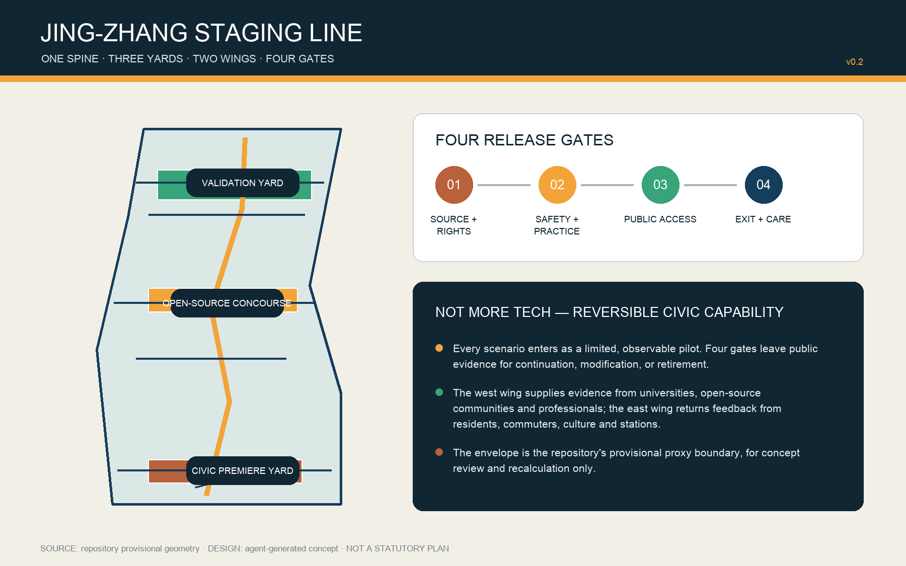
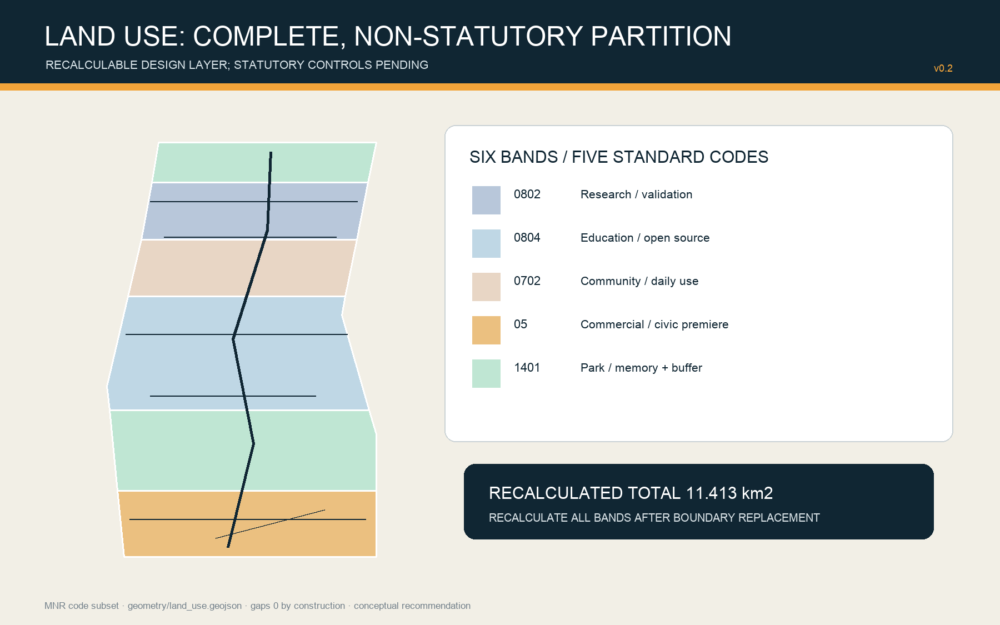
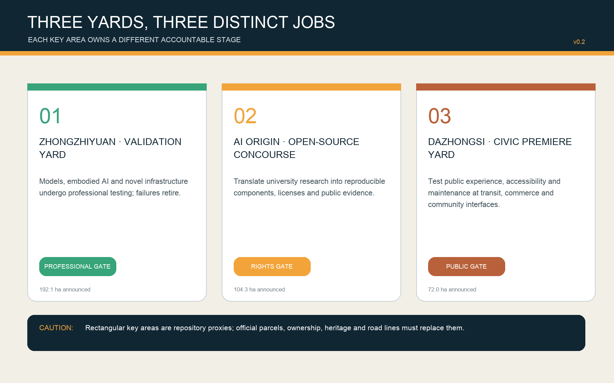
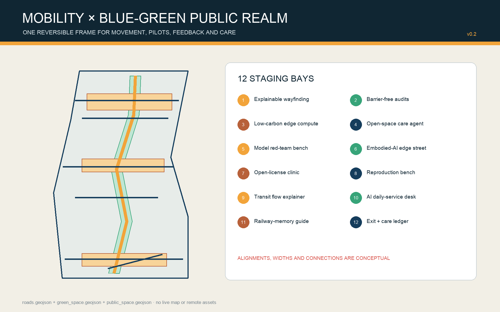
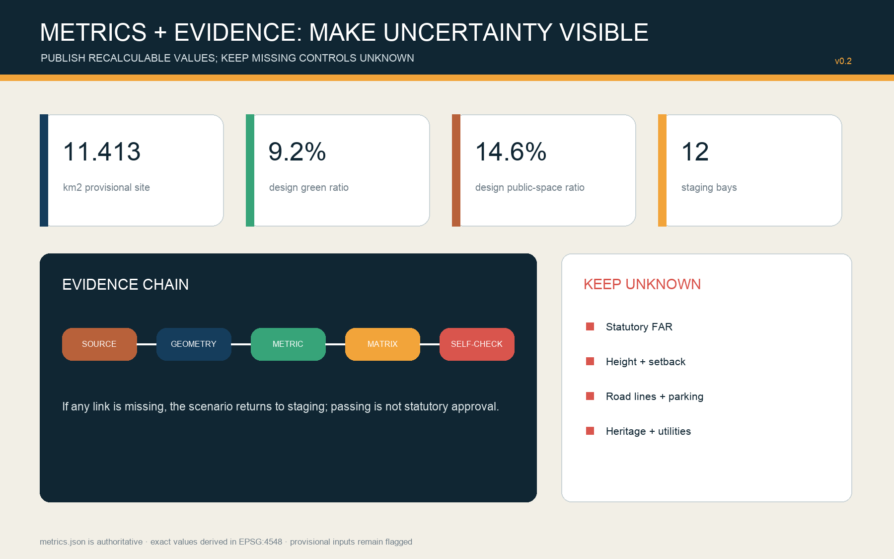

# JING-ZHANG STAGING LINE

> Let every AI city service stage before release. Passing is not permanent; exit is a civic capability too.

## Design Basis and Source List

The project basis is the public announcement issued by the Haidian branch of the Beijing Municipal Commission of Planning and Natural Resources, the agent taskbook and the repository site package. Professional references include the national urban-design measures, control-detailed-planning rules and land-use classification guidance. The announcement specifies a 43.6 km² coordinated research area, an 11.4 km² overall design area and three key areas totaling 368.4 ha. No publicly usable official GIS/CAD redlines are available in the repository, so `SITE-001` and the three `PROV-KEY` polygons are maintainer-defined rough proxies. They support concept generation, topology checks and later recalculation only; they are not statutory, ownership, road or heritage boundaries.[source:OFFICIAL-ANNOUNCEMENT] [source:SITE-PACKAGE] [assumption:A-BOUNDARY-001]

The proposal treats each AI city service as a train awaiting dispatch. It first enters a limited, observable trial, then passes four gates: source and rights; professional safety; public accessibility; and exit plus maintenance. Public evidence determines continuation, revision or retirement. All layers derive from a shared GeoJSON set, areas are recalculated in EPSG:4548, and missing statutory controls remain `unknown`. The package connects human-readable claims to sources, geometry, metrics, matrices and self-checks.[standard:PROJECT-OFFICIAL-ANNOUNCEMENT] [depth:existing_conditions_diagnosis] [metric:site_area_sqm]

Issue #846 records an approximately 412.5 m separation between the proxy overall area and a public-map heritage-park feature, while #1029 questions the proxy Dazhongsi centroid. These are quality alerts, not authoritative corrections. The design therefore keeps heritage, station and parcel relationships pending professional verification.[source:SOURCE-REGISTRY] [source:PROCESSED-FACT-PACK] [assumption:A-HERITAGE-001]

## Three-Level Scope Framework

The three scopes form a research–design–validation evidence chain. The 43.6 km² research scope identifies missing capabilities among universities, research institutes, firms, communities and international partners. The 11.4 km² overall scope translates those gaps into a staging spine, two dependency wings and reversible spatial units. Zhongzhiyuan, Beijing AI Origin Community and Dazhongsi respectively host professional validation, open-source translation and civic premiere. Each strategic claim must find a spatial carrier, and feedback from a key-area trial must return upstream to update the strategy.[standard:PROJECT-AGENT-OPEN-CALL-TASKBOOK] [depth:three_level_scope_framework] [data:geometry/key_areas.geojson#PROV-KEY-001]

The west wing supplies evidence from universities, open-source communities and professional bodies; the east wing returns evidence from residents, commuters, cultural places and transport interfaces. A north–south staging spine coordinates walking, cycling, public interpretation and maintenance access. Every alignment and width remains a conceptual recommendation pending official survey, traffic, rail and utility information.[data:geometry/roads.geojson#ROAD-001] [assumption:A-ROADS-001] [depth:overall_spatial_structure]

| Scope | Area basis | Assignment | Exit condition |
| --- | ---: | --- | --- |
| Coordinated research | 43.6 km² announced | ecosystem, personas, case transfer | no public value, no entry |
| Overall design | 11.4 km² announced; 11.413 km² proxy calculation | spine, yards, land use, mobility, projects | no provenance or care plan, return to staging |
| Key areas | 368.4 ha announced | validation, open-source staging, civic premiere | no four-gate pass, no release claim |

## Coordinated Research Area: Industry and Future City Research

The industry strategy shifts from counting firms to asking whether the city can convert a new capability into a safe public service. An open-scenario catalogue, reproducibility vouchers, named professional responsibility and an exit ledger create the operating loop: research discloses data and licenses; prototypes undergo safety and maintenance tests; community use creates public evidence; only qualified capabilities proceed to longer-term procurement or construction study. The ecosystem thus gains an accelerator and a brake.[source:AGENT-TASKBOOK] [standard:MOHURD-URBAN-DESIGN-MEASURES] [depth:overall_spatial_structure]

Seven global cases contribute mechanisms, not transferable promises. Punggol Digital District offers district digital infrastructure; Forum Virium Helsinki offers time-bounded agile pilots; Marineterrein supports inclusive and ethical digital experiments.[source:PDD-JTC] [source:FORUM-VIRIUM] [source:MARINETERREIN]

Seoul AI Hub anchors education, incubation and R&D; Barcelona Decidim demonstrates open-source, traceable hybrid participation; Toyota Woven City demonstrates resident-supported corporate testing while exposing private-governance limits; Toronto MaRS demonstrates intermediation among research, startups, capital and policy. The design imports open interfaces, limited pilots, public evidence and cross-sector brokerage only.[source:SEOUL-AI-HUB] [source:BARCELONA-DECIDIM] [source:WOVEN-CITY] MaRS separately supports the intermediary comparison.[source:MARS-DISCOVERY]

The visual identity combines deep rail blue, signal amber, evidence green and heritage copper. A signal, play/pause symbol and open bracket form a mark for “continue, hold, review.” Proposed annual prototypes include an Open-source Reproduction Week, Safety Validation Open Day, Civic Premiere Season and Exit-and-Care Audit Day. Hosts, budgets, approvals, accessibility, security and rights remain for professional coordination.

## Overall Design Area: Urban Renewal and Regulatory-Plan-Level Urban Design

The spatial structure is “one spine, three yards, two wings, twelve bays.” The spine is a north–south public-service route; the yards are Zhongzhiyuan Validation Yard, AI Origin Open-source Staging Concourse and Dazhongsi Civic Premiere Yard; the wings supply evidence and receive feedback; twelve small bays place scenarios in research, education, community, park and commercial settings. This is an accountability framework, not an added redline.[data:geometry/site_boundary.geojson#SITE-001] [data:geometry/public_space.geojson#PUBLIC-001] [depth:overall_spatial_structure]

The design uses land-use codes 05, 0702, 0802, 0804 and 1401 in six complete bands. It tests program balance without replacing current-condition survey or statutory zoning. Twelve building footprints are conceptual envelopes: “retrofit first” is a method and “new-build envelope pending survey” is not a demolition decision. FAR, gross floor area, height, setback, road redlines and parking remain unknown until official controls are obtained.[standard:MNR-LAND-USE-CLASSIFICATION-GUIDE] [data:geometry/land_use.geojson#LU-001] [data:geometry/buildings.geojson#BLDG-001] The FAR unknown is separately registered.[metric:floor_area_ratio]

Urban renewal follows “verify cheaply and reversibly before investing permanently.” Phase 1 uses information, temporary components and existing or cleared interiors. Phase 2 links the yards through shared evidence and public-realm interfaces. Phase 3 studies permanent building and infrastructure only after official boundaries, planning controls, ownership and engineering data arrive.[data:geometry/phasing.geojson#PHASE-001] [depth:phasing_implementation] [assumption:A-CONTROLS-001]

## Detailed Design of Key Areas

Zhongzhiyuan Validation Yard owns the professional gate. Four suggested units are a model red-team bench, an embodied-AI edge street, a low-carbon compute/infrastructure integration bench and a standards-governance gallery. Public interpretation and high-risk testing are separated by time, access and physical containment; all trials require isolation, a human takeover route and incident records. The proxy area calculates to roughly 192.9 ha, close to the announced 192.1 ha but unable to replace an official polygon.[data:geometry/key_areas.geojson#PROV-KEY-001] [metric:key_area_zhongzhiyuan_sqm] [assumption:A-BOUNDARY-001]

Beijing AI Origin Open-source Staging Concourse owns the rights and reproducibility gate. Suggested units include an open-license clinic, reproduction benches, talent daily-service desk and campus–district walking interfaces. Before public display, every project provides a data card, model card, license, dependency, energy and human-review note. Retrofit uses removable partitions and active ground floors so that unverified operational demand does not prematurely become permanent construction.[data:geometry/key_areas.geojson#PROV-KEY-002] [metric:key_area_origin_sqm] [depth:three_key_area_detailed_design]

Dazhongsi Civic Premiere Yard owns public accessibility and maintenance. A station–city loop combines four-quadrant walking continuity, commerce, resident use and railway-culture interpretation. AI retail or data-asset exhibits must retain non-digital alternatives, clear notice and staffed service. Because the public-map heritage relationship conflicts with the proxy geometry, no demolition or heritage conclusion is based on that relationship.[data:geometry/key_areas.geojson#PROV-KEY-003] [metric:key_area_dazhongsi_sqm] [assumption:A-HERITAGE-001]

## AI Innovation Ecosystem, Personas, and AI+ Scenarios

Seven personas guide service design without profiling individuals: open-source developers seek reproducibility and contribution credit; researchers need isolation and IP clarity; startups need affordable trials and professional responsibility; established firms need real but controlled environments; residents need low disturbance, refusal and human service; commuters and visitors need accessible continuity and trustworthy wayfinding; operators need visible faults, work orders, spares and exit routes. No persistent tracking or commercial recommendation dossier is proposed.[source:GENERATIVE-AI-MEASURES] [source:BARRIER-FREE-LAW] [assumption:A-DATA-GOV-001]

The twelve staging cards are explainable wayfinding, barrier-free break audits, low-carbon edge compute, open-space care agent, model red-team bench, embodied-AI edge street, open-license clinic, reproduction bench, station-flow explainer, AI daily-service desk, Jing-Zhang memory guide, and exit-and-care ledger. Each records the user, place, minimum data, accountable human, failure condition, trial period and restoration route. Mapping a bay never claims that a service is deployed.[data:geometry/roads.geojson#ROAD-001] [data:geometry/green_space.geojson#GREEN-001] [metric:staging_bay_count]

Four industrial tests are deliberately hard: model safety tests attacks, bias and human takeover; embodied-AI street tests mixed traffic, emergency stop, liability and weather; low-carbon compute integration tests peak load, noise, heat and energy ledgers; the data-element room tests consent, purpose limitation, revocation and audit. Public premiere follows professional validation, and a high-risk failure triggers pause, disclosure and a human alternative.[scenario:public-safety-operations-review] [metric:industry_test_count] [depth:municipal_new_infrastructure]

Four pilgrimage landmarks make governance memorable: the “Safety Roundhouse” displays failure samples and responsibility chains; the “Open-source Signal Box” displays licenses and reproducibility; the “Civic Premiere Clock” records feedback and maintenance state; the “Century Gauge Gate” translates railway measurability into an AI governance datum. These are new conceptual names, not claimed historic assets, and need heritage, landscape and architecture review.

## Land Use, Building Scale, and Retain-Renovate-Demolish Strategy

The six land-use polygons are intersections with one shared proxy boundary, so they cover it without designed gaps or overlaps. Code 05 supports the southern civic premiere; 1401 supports railway memory and the northern buffer; 0804 supports open-source translation; 0702 supports daily community trials; 0802 supports northern safety validation. Their calculated areas describe a design allocation, not current ownership, approval or development capacity.[data:geometry/land_use.geojson#LU-001] [metric:land_use_1401_area_sqm] [depth:land_use_layout]

The twelve building envelopes total approximately 11.66 ha of footprint. Alternating units are labelled retrofit-first, while every third unit is a possible new-build envelope pending survey. This classification is a working assumption, not a retain/renovate/demolish determination. A formal list requires building age, structure, fire safety, energy, leases, ownership, occupancy and heritage surveys. Gross floor area, FAR, density, height and parking remain unknown.[data:geometry/buildings.geojson#BLDG-001] [metric:building_footprint_area_sqm] [metric:total_floor_area_sqm] The professional depth is separately checked.[depth:retain_renovate_demolish]

Architectural character uses readable engineering: repeatable modules, demountable joints, deep shading, visible maintenance routes and durable materials. Heritage copper appears only at touchpoints; fake historicism is avoided. Ground floors present controlled test interfaces with staffed observation. Heights and protected views cannot be fixed without official urban-design and heritage constraints.[standard:MOHURD-ARCH-DESIGN-DEPTH-2016] [assumption:A-BUILDING-001] [depth:height_massing_character]

## Transport, Rail, Municipal Infrastructure, and Public Services

The mobility layer contains one north–south greenway spine, five east–west cross-links and a conceptual Dazhongsi transit connection. Their combined centreline length is about 15.10 km. The spine supports movement, interpretation, trial access and maintenance; cross-links create multiple entries. Road class, width, junction geometry, rail protection, bus stops, parking and traffic impact require professional confirmation based on official surveys.[data:geometry/roads.geojson#ROAD-001] [metric:conceptual_mobility_length_m] [assumption:A-ROADS-001]

Municipal infrastructure follows “interface before capacity.” Each bay reserves conceptual electrical, communications, data-isolation, emergency-stop, drainage, thermal and maintenance interfaces without inventing capacities. Low-carbon edge compute is an option requiring load, noise, fire, cyber-security and life-cycle carbon assessment. Status panels expose operation and human takeover, never personal or commercially sensitive data.[assumption:A-UTILITIES-001] [source:GENERATIVE-AI-MEASURES] [depth:municipal_new_infrastructure]

Every digital public service has a staffed, paper or non-smart alternative. Interfaces provide accessible information, plain language, pause and complaint channels. Older people, children, disabled people and non-Chinese speakers join co-testing without group labels overriding individual choice. Facility quantities and operators remain pending demographic, supply and departmental review.[source:BARRIER-FREE-LAW] [source:ELDERLY-TECH-PLAN] [assumption:A-PUBLIC-SERVICE-001]

## Blue-Green Network, Public Space, and Urban Character

The submitted green layer combines a conceptual buffer along the spine with three yard greens. It calculates to 104.85 ha or 9.19% of the proxy site. Three public-space yards calculate to 166.64 ha or 14.60%. These are design-layer ratios, not statutory green-space rates or current-condition findings. Official water, blue-line, tree, soil, stormwater and park data are missing; ecological and sponge-city performance awaits specialist evidence.[data:geometry/green_space.geojson#GREEN-001] [metric:green_ratio] [metric:public_space_ratio]

Public space is where residents review whether a service deserves release. Every yard includes visible status, staffed service, data-free rest, feedback and fault disclosure. Temporary elements and reversible circulation manage peaks. Lighting balances safety and quiet; sensors minimize data and exclude facial recognition for visitor counting. Refusal never blocks basic movement or service.[data:geometry/public_space.geojson#PUBLIC-001] [assumption:A-DATA-GOV-001] [depth:blue_green_public_space]

Urban character uses abstract signals, gauges, roundhouses and platforms rather than literal railway imitation. Blue means direction and rules, amber means staging, green means evidence passed, copper recalls a century of engineering. Signage makes the scenario, responsible party, trial end date, current gate and exit route publicly legible.

## Renewal Projects, Implementation Policy, and Phasing

Eight packages organize delivery: P1 four-gate evidence protocol; P2 spine wayfinding and barrier-free audit; P3 Zhongzhiyuan Validation Yard; P4 Origin Open-source Concourse; P5 Dazhongsi Civic Premiere Yard; P6 twelve-card operating kit; P7 four landmarks and annual program; P8 replacement of boundary, planning, ownership, heritage and utility data followed by full recalculation. Each package has a lead profession, collaborators, minimum output, failure condition, restoration action and public record.[depth:renewal_project_list] [source:AGENT-TASKBOOK] [metric:renewal_project_count]

Phase 1 implements low-cost, reversible information and indoor prototypes: source ledger, scenario catalogue, gate rules, wayfinding, accessibility audits and three small trials. Phase 2 links the yards through common evidence, public realm and an annual program. Phase 3 studies permanent construction only after controls and long-term care become reliable. Geometry covers the proxy site, but priorities may be reordered when official evidence arrives.[data:geometry/phasing.geojson#PHASE-001] [metric:phase_1_area_sqm] [depth:phasing_implementation]

Policy prototypes include an open-scenario license, model/data cards, named professional sign-off, public refusal rights, quarterly fault disclosure, procurement exit clauses, open-source contribution return and restoration bonds. Evaluation uses reproducibility, successful human takeover, accessible task completion, recovery time, objection closure and post-exit restoration rather than footfall alone. All require legal, procurement, data, planning and operational review.

## Metrics, Area Recalculation, and Compliance Matrix

`metrics.json` is authoritative for exact values: proxy overall area 11412825.386 sqm; conceptual building footprint 116607.051 sqm; design green space 1048463.021 sqm; design public space 1666420.412 sqm; conceptual movement centrelines 15104.053 m. Areas are calculated from submitted GeoJSON in EPSG:4548, and display files reuse rather than recreate them.[metric:site_area_sqm] [metric:building_footprint_area_sqm] [metric:conceptual_mobility_length_m] Recalculation depth is separately checked.[depth:metrics_recalculation]

Metrics are grouped into recalculable spatial values, governance process counts, and statutory controls. Spatial values and counts describe the proposal rather than existing performance. FAR, gross floor area, building density, road area and similar controls remain unknown. `compliance_matrix.json` maps the announcement and agent.1–agent.6; `standard_matrix.json` maps five core references plus one recorded data gap; `design_depth_matrix.json` maps fifteen professional depth items.[standard:MOHURD-CONTROL-DETAILED-PLANNING] [metric:floor_area_ratio] [assumption:A-CONTROLS-001]

## Risk, Copyright, and Compliance

The highest risk is incomplete base evidence: official overall/key-area boundaries, road and rail controls, parcels, ownership, existing buildings, heritage, water, utilities and public facilities are not fully available. Replacing any one source can change areas, connectivity, yard positions, land use and phasing. The package supports open-call review, concept discussion and later recalculation only; it is not a statutory plan, engineering instruction, procurement decision or government commitment.[assumption:A-BOUNDARY-001] [assumption:A-CONTROLS-001] [depth:risk_missing_data]

The four gates manage AI risk. Source/rights checks input, training and output permissions; professional/safety checks error, bias, emergency stop and human responsibility; public accessibility checks notice, refusal, alternatives and barrier-free use; exit/care checks lock-in, faults, deletion, restoration and lifetime cost. An urban agent never replaces professional approval or emergency judgement. High-risk tests stay isolated and any public trial has an accountable human and immediate stop route.[source:GENERATIVE-AI-MEASURES] [source:BARRIER-FREE-LAW] [scenario:public-safety-operations-review]

Text, diagrams, GeoJSON, HTML and PDFs were generated for this submission without third-party photographs, live map tiles or restricted media. System fonts are rasterized or embedded for display and are not redistributed. Software and method notes appear in `report/copyright_statement.md`. Case summaries retain corporate-source limitations. The community-display license does not transfer third-party rights.[source:SOURCE-REGISTRY] [standard:PROJECT-AGENT-OPEN-CALL-TASKBOOK]

## References

Primary project sources are the Haidian announcement, repository taskbook, site package, source registry and processed fact pack. Professional sources are the national urban-design measures, control-detailed-planning rules and land-use classification guidance. Governance context includes China’s generative-AI measures, barrier-free law and older-person smart-technology policy. Authority, allowed uses, prohibited uses and access dates are recorded item by item in `sources.json`.[source:OFFICIAL-ANNOUNCEMENT] [source:MOHURD-UD] [source:MNR-LAND-USE]

Comparative sources include JTC Punggol Digital District, Forum Virium Helsinki Agile Pilots and Marineterrein Experiments.[source:PDD-JTC] [source:FORUM-VIRIUM] [source:MARINETERREIN]

Additional cases are Seoul AI Hub, Barcelona Decidim, Toyota Woven City and Toronto MaRS. They support mechanism comparison only; Beijing site facts, regulation, areas and implementation responsibility continue to depend on public Beijing evidence and later professional verification.[source:SEOUL-AI-HUB] [source:BARCELONA-DECIDIM] [source:WOVEN-CITY] The MaRS intermediary mechanism is separately registered.[source:MARS-DISCOVERY]
