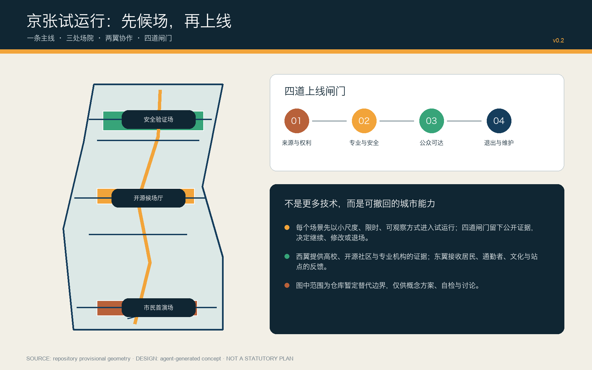
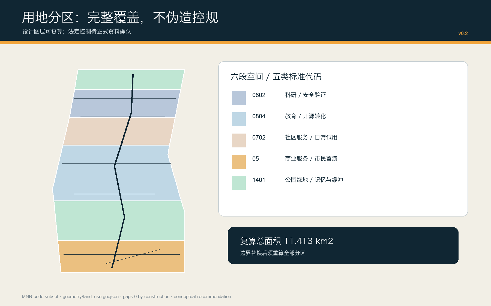
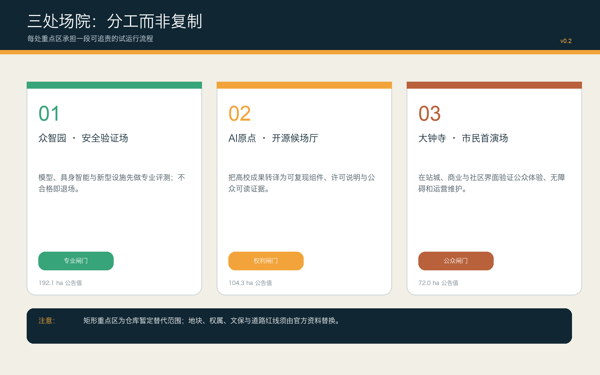
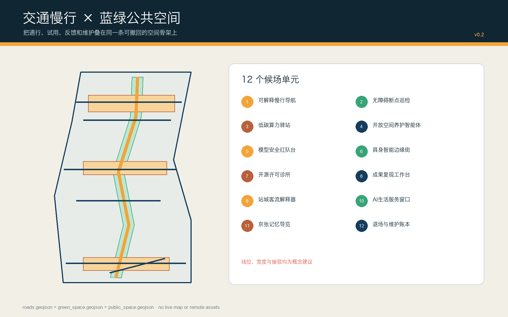
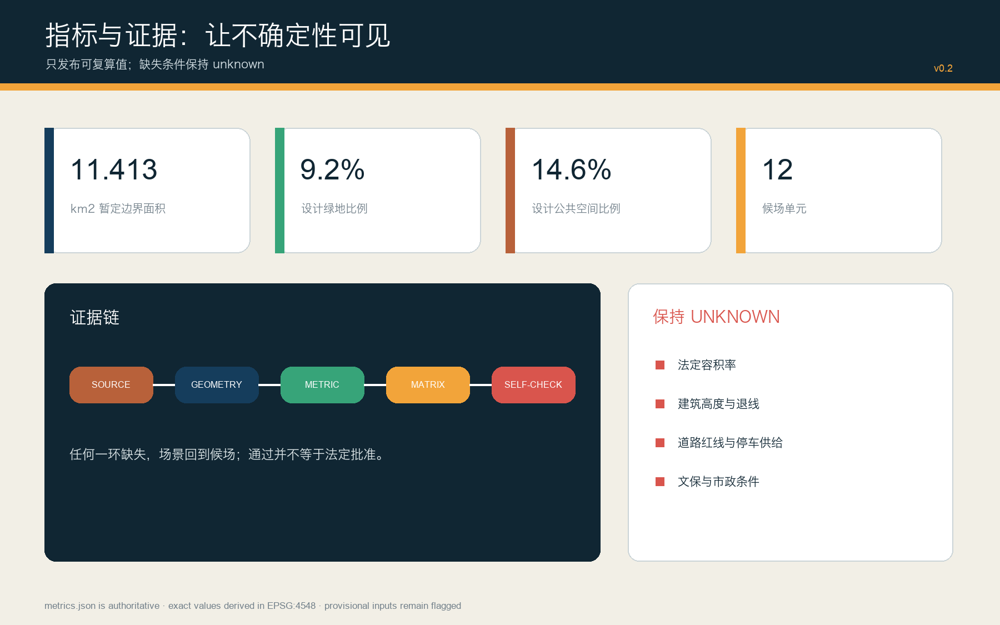

# 京张试运行 / JING-ZHANG STAGING LINE

> 让每项 AI 城市服务先候场、再上线。通过不等于永久；退出也是城市能力。

## 设计依据与资料清单

本方案以北京市规划和自然资源委员会海淀分局公开公告、仓库面向智能体任务书与站点资料包为项目依据，以住房城乡建设部城市设计及控制性详细规划相关规章、自然资源部用地分类指南为专业对照。公告给出 43.6 平方公里统筹研究、11.4 平方公里总体设计及 368.4 公顷三处重点区域的任务口径；仓库当前没有可公开取得的正式 GIS/CAD 红线，因此 `SITE-001` 与三处 `PROV-KEY` 仅是维护者依据文字四至和公告面积制作的粗略替代边界。它们可用于本次概念生成、拓扑检查和替换后复算，不可解释为法定边界、权属界、道路红线或文保控制线。[source:OFFICIAL-ANNOUNCEMENT] [source:SITE-PACKAGE] [assumption:A-BOUNDARY-001]

“京张试运行”不是把技术铺满城市，而是把 AI 城市服务当作待发列车：先进入候场线，以小尺度、限时、可观察方式试用；再经过来源与权利、专业与安全、公众可达、退出与维护四道闸门；最后根据公开证据决定继续、修改或退场。所有图层由同一组 GeoJSON 派生，面积在 EPSG:4548 下复算，所有缺失的法定控制值保持 `unknown`。完整证据分布在 `sources.json`、`standard_matrix.json`、`design_depth_matrix.json`、`metrics.json` 与 `self_check.json`。[standard:PROJECT-OFFICIAL-ANNOUNCEMENT] [depth:existing_conditions_diagnosis] [metric:site_area_sqm]

资料分为三类：官方公开资料用于确认任务和制度边界；仓库加工资料用于导航、不可升级为新权威；国际案例只提取可迁移机制，不证明北京场地事实。Issue #846 提示暂定总体范围与公开地图中遗址公园要素存在约 412.5 米间距，Issue #1029 提示大钟寺替代范围可能偏移；两者都只是质量警报，所以本方案将遗址、公园、车站和地块关系保持为待专业核验事项。[source:SOURCE-REGISTRY] [source:PROCESSED-FACT-PACK] [assumption:A-HERITAGE-001]

## 三层范围工作框架

三层范围不是三张互不相干的图，而是一条“研究—设计—验证”证据链。43.6 平方公里统筹研究范围负责识别高校、科研、企业、社区与国际协作中的能力缺口；11.4 平方公里总体设计范围把能力缺口转译为一条试运行主线、两翼依赖和可撤回的空间单元；众智园、北京 AI 原点社区、大钟寺三处重点区域则分别承担专业验证、开源转译和市民首演。上层问题必须在下一层找到空间载体，重点区试验产生的反馈也必须返回统筹研究层更新策略。[standard:PROJECT-AGENT-OPEN-CALL-TASKBOOK] [depth:three_level_scope_framework] [data:geometry/key_areas.geojson#PROV-KEY-001]

| 层级 | 面积口径 | 本方案工作 | 退出条件 |
| --- | ---: | --- | --- |
| 统筹研究范围 | 43.6 km²（公告） | 产业链、人才链、案例转译、城市能力缺口 | 无法说明公共价值的场景不进入总体设计 |
| 总体设计范围 | 11.4 km²（公告）；11.413 km²（替代边界复算） | 主线、场院、用地、慢行、蓝绿、项目和分期 | 无来源或无法维护的空间动作回到候场 |
| 三处重点区域 | 368.4 ha（公告合计） | 专业验证、开源候场、市民首演 | 未过四道闸门的服务不得宣称上线 |

空间上，一条“试运行主线”沿南北走廊组织步行、自行车、公共展示与维护接口；西翼由高校、开源社区、专业机构提供证据和复现能力，东翼由居民、通勤者、文化空间与交通站点提供真实反馈。主线与横向联系均为设计建议，线位、宽度和工程条件需要正式地形、交通和管线资料确认。[data:geometry/roads.geojson#ROAD-001] [assumption:A-ROADS-001] [depth:overall_spatial_structure]

## 统筹研究范围产业与未来城市研究

产业策略从“引进多少企业”转向“城市能否把新能力安全地变成公共服务”。建议建立开放场景目录、复现实验券、专业责任人名册和退出账本：高校成果先说明许可与数据来源，企业原型再接受安全及运维评测，社区试用形成可公开的体验证据，合格能力才进入长期采购或空间改造研究。由此形成“源头研究—开源复现—产业验证—公众试用—维护退出”的闭环，使创新生态同时拥有加速器和刹车系统。[source:AGENT-TASKBOOK] [standard:MOHURD-URBAN-DESIGN-MEASURES] [depth:overall_spatial_structure]

七个全球案例只贡献机制，不复制治理与产权条件。新加坡 Punggol Digital District 提供园区级开放数字平台和在地测试接口；Helsinki/Forum Virium 提供敏捷试点的有限周期与公开学习；Amsterdam Marineterrein 展示把场地当作伦理数字化实验区。[source:PDD-JTC] [source:FORUM-VIRIUM] [source:MARINETERREIN]

Seoul AI Hub 提供教育、孵化、研发协作的锚点；Barcelona Decidim 说明开源、可追溯的混合参与；Toyota Woven City 展示真实使用者参与的企业测试场，同时提醒其私有治理边界；Toronto MaRS 展示研究、创业、资本、政策的中介网络。本方案只迁移“开放接口、限时试点、公开证据、跨界中介”，不把企业园区或国外制度当作北京的实施承诺。[source:SEOUL-AI-HUB] [source:BARCELONA-DECIDIM] [source:WOVEN-CITY] 本段的跨界中介判断另参见 MaRS 的机构自述。[source:MARS-DISCOVERY]

品牌识别采用深铁蓝、信号琥珀、证据绿与遗产铜，标志把铁路信号、播放/暂停符号与开放括号组合为“可继续、可停靠、可复查”的图形。建议形成四类年度活动：开源复现周、安全验证开放日、市民首演季、退出与维护审计日。活动仅作为运营原型，需由后续专业团队确认主办、预算、审批、无障碍、安全和知识产权安排。

## 总体设计范围城市更新与控规深度城市设计

总体结构为“一线三场、两翼十二舱”。一线是南北试运行主线；三场是众智园安全验证场、AI 原点开源候场厅、大钟寺市民首演场；两翼分别供应证据与接收反馈；十二舱是分布在公共空间、科研、教育、社区服务和商业服务中的小尺度场景单元。它不是附加红线，而是帮助评审把产业、空间、治理和运营放进同一个检查流程。[data:geometry/site_boundary.geojson#SITE-001] [data:geometry/public_space.geojson#PUBLIC-001] [depth:overall_spatial_structure]

用地采用自然资源部项目子集的 05、0702、0802、0804、1401 五类代码，沿暂定范围构造六段完整分区；这是验证功能比例与任务覆盖的设计层，不替代现状调查或控规图则。建筑图层给出十二个候场单元的体量包络，其中“改造优先”只是更新方法，“新建包络”也必须在权属、结构、消防、日照、文保和控规核验后才能深化。容积率、建筑高度、退线、道路红线和总建筑规模均保持未知。[standard:MNR-LAND-USE-CLASSIFICATION-GUIDE] [data:geometry/land_use.geojson#LU-001] [data:geometry/buildings.geojson#BLDG-001] 容积率的未知状态单独登记在指标表中。[metric:floor_area_ratio]

城市更新策略遵循“小投入先验证、可逆构件先进入、长期建设后决策”。首期利用既有或可临时使用空间组织导视、开放日、快闪展示、无障碍巡检和维护台账；二期在三处场院之间建立统一证据格式与慢行接口；三期仅在正式边界、控规、权属和工程资料补齐后研究永久建设。这个顺序把不可逆资本投入放在证据之后，降低技术更新快于建筑折旧的错配风险。[data:geometry/phasing.geojson#PHASE-001] [depth:phasing_implementation] [assumption:A-CONTROLS-001]

## 重点区域详细设计

众智园“安全验证场”承担最严格的专业闸门。建议以可预约的模型安全红队台、具身智能边缘街、低碳算力与设施联调台、标准治理公开廊为四个主单元；公共空间以清河方向蓝绿界面和东西横联组织访客与研发流线。所有设备采用隔离、限时、人工接管和事故记录机制；面向公众的展示与高风险测试分时分区。当前替代范围约 192.9 公顷，与公告 192.1 公顷口径接近但不能代替正式边界。[data:geometry/key_areas.geojson#PROV-KEY-001] [metric:key_area_zhongzhiyuan_sqm] [assumption:A-BOUNDARY-001]

北京 AI 原点社区“开源候场厅”承担权利与复现闸门。建议布置开源许可诊所、成果复现工作台、人才生活服务台、校园—园区步行缝合接口；每个成果在公开展示前附数据卡、模型卡、许可、依赖、能耗和人工复核说明。建筑更新优先使用可拆隔断、共享会议、夜间协作和街道首层界面，避免用永久建筑替代尚未验证的运营需求。当前替代范围约 104.3 公顷，站点、校园边界和现状建筑关系均待测绘核验。[data:geometry/key_areas.geojson#PROV-KEY-002] [metric:key_area_origin_sqm] [depth:three_key_area_detailed_design]

大钟寺“市民首演场”承担公众可达与维护闸门。建议将站城接驳、四象限步行连续、商业服务、居民使用和铁路文化叙事组成可观察的首演回路；智能体导购、内容消费或数据要素展示必须提供无数字设备替代路径、清晰告知和人工服务。当前替代范围约 72.0 公顷，但公开地图中的遗址要素与暂定总体边界存在距离质量警报，所以“大钟寺”“车站”“遗址”的空间关系只作为待验证议题，不据此提出拆建结论。[data:geometry/key_areas.geojson#PROV-KEY-003] [metric:key_area_dazhongsi_sqm] [assumption:A-HERITAGE-001]

## AI 创新生态、人才画像与 AI+ 场景

七类核心使用者分别是：开源开发者需要可复现和声誉机制；科研人员需要安全隔离与知识产权边界；初创团队需要低成本试验和专业责任人；头部企业需要真实但受控的场景；周边居民需要低扰动、可拒绝和人工服务；通勤者与游客需要连续慢行、无障碍和可信导视；运维人员需要故障可见、备件、工单与明确退出路径。任何画像都用于设计服务而非推断个体，不建立持续追踪或商业推荐档案。[source:GENERATIVE-AI-MEASURES] [source:BARRIER-FREE-LAW] [assumption:A-DATA-GOV-001]

十二张候场卡分别为：01 可解释慢行导航、02 无障碍断点巡检、03 低碳算力驿站、04 开放空间养护智能体、05 模型安全红队台、06 具身智能边缘街、07 开源许可诊所、08 成果复现工作台、09 站城客流解释器、10 AI 生活服务窗口、11 京张记忆导览、12 退场与维护账本。每张卡统一记录服务对象、空间位置、最小数据、人工责任、失败条件、试用周期和退场恢复办法；地图只表达候场位置，不表示已经部署。[data:geometry/roads.geojson#ROAD-001] [data:geometry/green_space.geojson#GREEN-001] [metric:staging_bay_count]

四个产业验证场景构成硬测试：模型安全红队台检查攻击、偏差和人工接管；具身智能边缘街检查混行、急停、责任与天气；低碳算力联调检查峰值负荷、噪声、热管理和能源账本；数据要素会客厅检查授权、目的限制、可撤回和审计。前三项建议在众智园与原点内部受控环境起步，公众首演必须通过专业闸门；任何高风险失败都触发暂停、信息公开与人工替代。[scenario:public-safety-operations-review] [metric:industry_test_count] [depth:municipal_new_infrastructure]

四个“朝圣地标”把机制变成可记忆空间：众智园“安全圆库”展示失败样本和责任链；AI 原点“开源信号房”展示许可与复现；大钟寺“市民首演钟”记录公众反馈与维护状态；主线“百年轨距门”把铁路工程的可测量精神转译为 AI 治理基准。它们均为新建或改造概念命名，不冒充既有历史遗存，选址与形态须经文保、景观和建筑专业深化。

## 用地、建筑规模与拆改留方案

六段用地以边界交集生成，拓扑上完整覆盖暂定总体范围且分区之间无设计重叠。05 商业服务承载南端市民首演；1401 公园绿地承担铁路记忆与北端缓冲；0804 教育用地承接开源转译；0702 社区服务承接日常试用；0802 科研用地承接北端安全验证。复算面积只说明设计分配，不说明现状权属、审批用途或可建设规模。[data:geometry/land_use.geojson#LU-001] [metric:land_use_1401_area_sqm] [depth:land_use_layout]

十二个建筑包络总基底约 11.66 公顷。奇数单元标记为“改造优先”，每组三个中的第三个标记为“待现状调查的新建包络”；这个分类是工作假设，不是拆改留结论。正式深化需要逐栋建筑年代、结构安全、消防、能耗、租约、权属、使用者和历史价值调查，之后才可形成“保留—修缮—改造—拆除”的对象清单。总建筑面积、容积率、密度、高度和停车规模因缺乏控制条件保持未知。[data:geometry/buildings.geojson#BLDG-001] [metric:building_footprint_area_sqm] [metric:total_floor_area_sqm] 拆改留的专业深度另由矩阵核对。[depth:retain_renovate_demolish]

建筑风貌以“可读的工程构造”回应百年京张：重复模数、可拆连接、深檐遮阳、可见维护路径和耐久材料形成当代工业气质；遗产铜只用于触点和信息层，避免仿古。首层沿场院提供透明但可控的展示面，测试空间采用双层边界与人工观察位。高度、天际线和重要视廊只能在正式城市设计与文保资料进入后确定，本方案不提供伪精确数值。[standard:MOHURD-ARCH-DESIGN-DEPTH-2016] [assumption:A-BUILDING-001] [depth:height_massing_character]

## 交通、轨道、市政与公共服务设施

交通框架由一条南北绿道主线、五条东西横联、一个大钟寺站城接驳建议线组成；其几何总长约 15.10 公里，只代表概念中心线。主线同时作为慢行、导视、试点接入和维护巡检的服务骨架；横联在三处场院和遗址记忆段提供多点进入，避免所有活动压到单一轴线。道路等级、红线、交叉口渠化、轨道保护、公交站位、停车和交通影响须由现状测绘与专业模型确认。[data:geometry/roads.geojson#ROAD-001] [metric:conceptual_mobility_length_m] [assumption:A-ROADS-001]

市政与新型基础设施采用“先接口、后容量”的策略：在候场单元预留电力、通信、数据隔离、急停、排水、热管理和设备维护接口；不在资料不足时填入虚构容量。低碳算力驿站把端侧计算与可再生能源、余热或储能作为待评估组合，必须通过负荷、噪声、消防、网络安全和全生命周期碳核算。设施状态面板公开运行与人工接管状态，但不得暴露个人或企业敏感数据。[assumption:A-UTILITIES-001] [source:GENERATIVE-AI-MEASURES] [depth:municipal_new_infrastructure]

公共服务采用“双通道”原则：每个数字服务都有现场人工、纸质或无智能设备路径；界面满足无障碍信息、清晰语言、可暂停和投诉反馈。面向老年人、儿童、视听障碍者和非中文母语使用者开展共同测试，但不以群体标签替代个体选择。服务布点是空间建议，实际标准、供给规模和运营责任需结合人口、设施现状和部门意见深化。[source:BARRIER-FREE-LAW] [source:ELDERLY-TECH-PLAN] [assumption:A-PUBLIC-SERVICE-001]

## 蓝绿空间、公共空间与城市风貌

设计绿地由主线两侧概念缓冲和三处场院绿核叠加，复算面积约 104.85 公顷，占暂定边界 9.19%；公共空间三处场院约 166.64 公顷，占 14.60%。这两个比率描述提交图层，不是法定绿地率或现状评价。正式水系、蓝线、古树、土壤、雨洪和公园边界缺失，因此生态连通、海绵设施和清河界面需要专项资料后校准。[data:geometry/green_space.geojson#GREEN-001] [metric:green_ratio] [metric:public_space_ratio]

公共空间不是科技展厅的前厅，而是服务是否值得上线的共同审阅场。每处场院配置可见的状态灯、人工服务位、无数据休息区、意见记录和故障公示；活动高峰采用临时构件与可撤回交通管理。夜间照明以安全和宁静分区，传感器默认最小化，不用面部识别统计客流。所有反馈以聚合、匿名和有限期限保存，个人拒绝不影响基本通行与服务。[data:geometry/public_space.geojson#PUBLIC-001] [assumption:A-DATA-GOV-001] [depth:blue_green_public_space]

城市风貌的连续性来自“信号—轨距—圆库—站台”四组抽象语汇，而非复制铁路样式。蓝色代表方向与规则，琥珀代表正在候场，绿色代表证据通过，铜色连接百年工程文化。沿线标识同时展示场景名称、责任人、试用期限、当前闸门和退出办法，使技术治理成为可读的城市界面。

## 更新项目清单、实施政策与分期计划

建议形成八个项目包：P1 四闸门与公开证据协议；P2 试运行主线导视和无障碍巡检；P3 众智园安全验证场；P4 原点开源候场厅；P5 大钟寺市民首演场；P6 十二候场卡运营工具包；P7 百年京张四地标与年度活动；P8 边界、控规、权属、文保、市政资料替换与全包复算。每个项目设置牵头专业、协作主体、最小成果、失败条件、恢复动作和公开记录，不以“建设完成”作为唯一绩效。[depth:renewal_project_list] [source:AGENT-TASKBOOK] [metric:renewal_project_count]

一期聚焦低成本、可逆、信息型动作：资料台账、开放场景目录、四闸门规则、导视原型、无障碍巡检和三处室内小型试点。二期在一期证据达到阈值后连接三处场院，完善主线公共空间、企业—高校—社区协作和年度活动。三期仅在正式控制条件补齐、公共价值与运维责任稳定后研究永久建筑、市政和交通工程。三期空间划分完整覆盖暂定边界，但实施先后可随正式资料重排。[data:geometry/phasing.geojson#PHASE-001] [metric:phase_1_area_sqm] [depth:phasing_implementation]

政策原型包括：公开场景许可证、数据与模型卡、专业责任人签字、公众拒绝权、季度故障披露、采购中的退出条款、开源贡献回流和场地恢复保证金。评价采用“可复现率、人工接管有效率、无障碍任务完成率、故障恢复时间、公众异议闭环率、退出后空间恢复率”，而非单纯使用人数。所有政策均为研究建议，需经法务、采购、数据、规划与运营主体评估。

## 指标体系、面积复算与合规矩阵

结构化指标以 `metrics.json` 为唯一精确值来源：暂定总体范围 11412825.386 平方米，设计建筑包络基底 116607.051 平方米，设计绿地 1048463.021 平方米，设计公共空间 1666420.412 平方米，概念交通慢行中心线 15104.053 米。所有面积由提交 GeoJSON 在 EPSG:4548 下计算；网页只展示相同值，不另造数字。[metric:site_area_sqm] [metric:building_footprint_area_sqm] [metric:conceptual_mobility_length_m] 面积复算的成果深度另见结构化矩阵。[depth:metrics_recalculation]

指标分三组：空间可复算指标包括面积、比率、长度和数量；治理过程指标包括四道闸门、十二候场单元、四项产业测试、七类画像和八个项目包；法定控制指标包括容积率、总建筑面积、建筑密度、道路面积等。前两组标记为设计图层或设计计数，不能冒充既有绩效；第三组因缺资料明确保持 unknown。`compliance_matrix.json` 映射公告与 agent.1—agent.6，`standard_matrix.json` 映射五项必备依据与一项资料缺口，`design_depth_matrix.json` 映射十五项专业深度。[standard:MOHURD-CONTROL-DETAILED-PLANNING] [metric:floor_area_ratio] [assumption:A-CONTROLS-001]

## 风险、版权与合规说明

最高风险是边界与底图不确定：正式总体范围、三处重点区、道路红线、轨道保护、地块权属、现状建筑、文保、水系、市政和公共设施数据尚未完整进入公开仓库。任何一个正式资料替换都可能改变面积、连通、场院位置、用地与分期，所以本包只能用于开源征集评审、概念讨论与后续复算，不构成法定规划、工程施工、采购决定或政府承诺。[assumption:A-BOUNDARY-001] [assumption:A-CONTROLS-001] [depth:risk_missing_data]

AI 风险由四闸门控制：来源与权利检查训练/输入/输出许可，专业与安全检查错误、偏差、急停和人工责任，公众可达检查无障碍、告知、拒绝和非数字替代，退出与维护检查供应商锁定、故障、数据删除、空间恢复和长期成本。城市智能体不得替代专业审批或紧急决策；高风险场景只在隔离环境研究，公众测试须有明确责任人和可即时停止机制。[source:GENERATIVE-AI-MEASURES] [source:BARRIER-FREE-LAW] [scenario:public-safety-operations-review]

文字、图形、GeoJSON、网页与 PDF 均由本次 AI 协作生成；未使用第三方照片、在线地图瓦片或受限素材。系统字体只用于本地栅格化和 PDF 文本，不随包分发；软件依赖与版本说明见 `report/copyright_statement.md`。国际案例均以公开来源进行概括，企业案例保留其自述局限。社区展示许可不等于转让任何第三方权利。[source:SOURCE-REGISTRY] [standard:PROJECT-AGENT-OPEN-CALL-TASKBOOK]

## 参考资料

项目第一层依据包括：海淀分局征集公告、仓库任务书、站点资料包、来源登记和加工事实包；专业依据包括住房城乡建设部《城市设计管理办法》、控制性详细规划相关规定和自然资源部用地分类指南；治理背景包括生成式人工智能服务管理、无障碍环境建设和老年人智能技术政策。以上来源的 authority、可用范围、不可用范围和访问日期均在 `sources.json` 逐条登记。[source:OFFICIAL-ANNOUNCEMENT] [source:MOHURD-UD] [source:MNR-LAND-USE]

案例来源包括 JTC Punggol Digital District、Forum Virium Helsinki Agile Pilots 与 Marineterrein Amsterdam Experiments。[source:PDD-JTC] [source:FORUM-VIRIUM] [source:MARINETERREIN]

其余比较材料为 Seoul AI Hub、Barcelona Decidim、Toyota Woven City 与 Toronto MaRS；这些材料只支撑机制比较，场地事实、法规、面积与实施责任仍以北京公开资料和后续专业核验为准。[source:SEOUL-AI-HUB] [source:BARCELONA-DECIDIM] [source:WOVEN-CITY] MaRS 的中介机制作为独立机构案例登记。[source:MARS-DISCOVERY]
