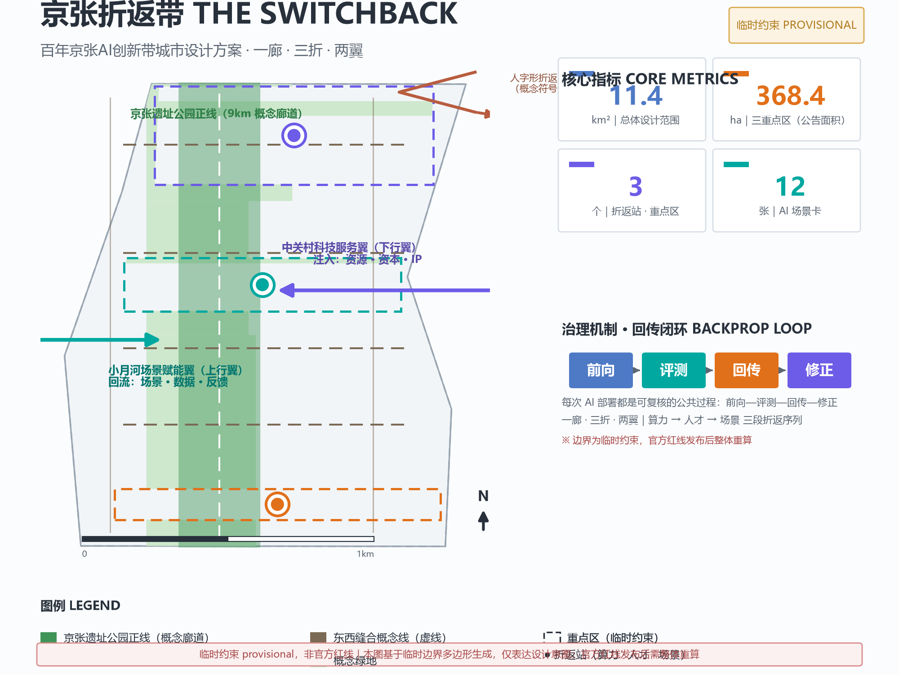
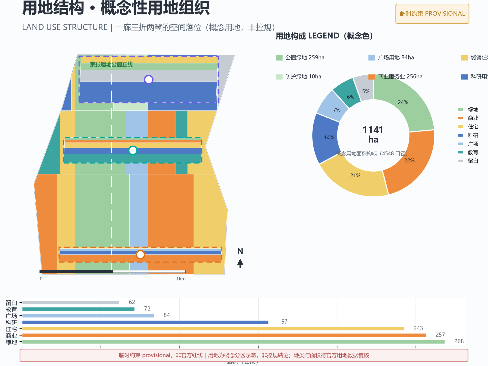
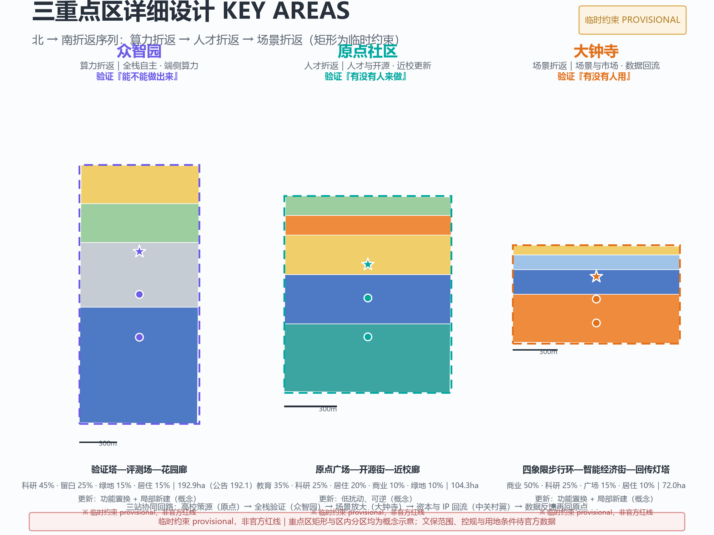
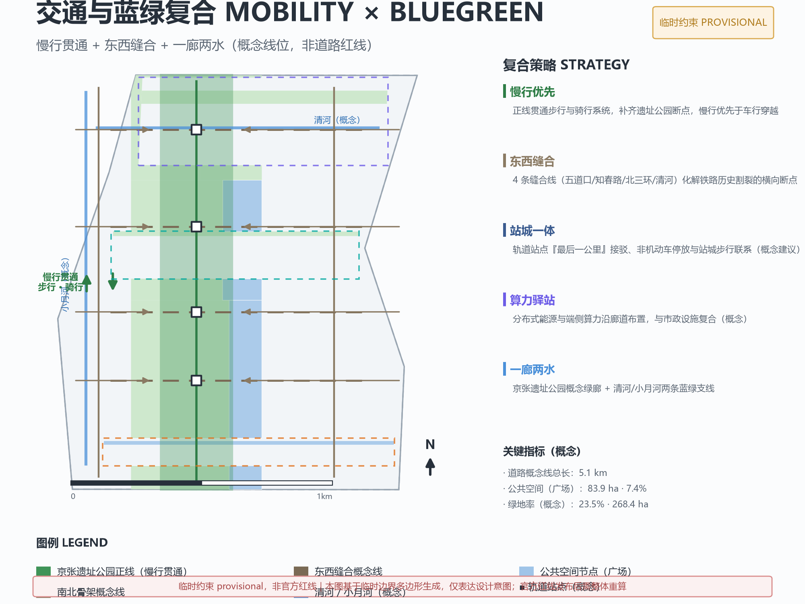
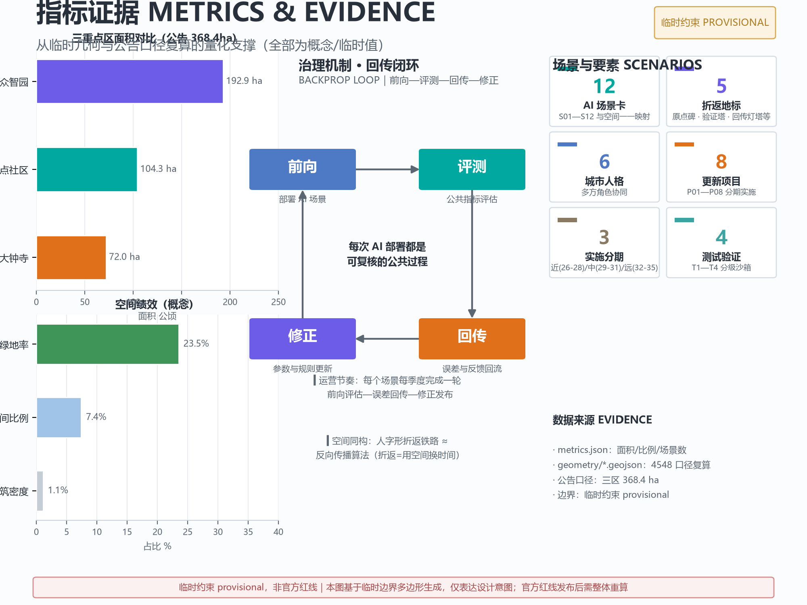

# 京张折返带 THE SWITCHBACK

> **百年京张，自主之路。面对陡坡不硬爬——折返，是京张铁路教给 AI 创新带的第一个动作。**

1905 年，詹天佑在八达岭 33‰ 的陡坡前没有选择蛮力展长隧道，而是用"人"字形折返线把爬升坡度摊薄，让中国自主设计的第一条干线铁路翻过了关沟。一百年后，深度学习靠"反向传播"（backpropagation）完成了同样的事：误差不硬扛，而是折返回去修正参数，再向前推进。

本方案把这两次"折返"放在同一条时间轴上：**折返不是绕路，而是用空间换时间、用协同换难度的智慧**。京张 AI 创新带面对的三座"陡坡"——研究到产业的转化落差、企业到社区的信任落差、北京到世界的传播落差——都可以用折返的方式翻越。

## 设计依据与资料清单

本方案以北京市规划和自然资源委员会海淀分局《百年京张AI创新带城市设计国际方案征集资格预审公告》为第一依据 [source:OFFICIAL-ANNOUNCEMENT]，以面向智能体的开源征集任务书摘录为参与契约 [source:AGENT-TASKBOOK]，并以 `brief/site-package/` 登记的结构化资料（设计任务书、允许设计空间、来源清单、枚举、规划限制、专业标准本地快照）为机器可读依据，资料用途边界以中央来源登记表为准 [source:SOURCE-REGISTRY]。处理后的任务导航见事实包 [source:PROCESSED-FACT-PACK]。

**临时边界披露（必读）**：截至本稿提交日，公开渠道未提供可验证坐标系的官方精确 polygon 或红线；本方案的空间图层基于 `brief/site-package/geometry/provisional_boundaries.geojson` 的临时约束生成 [source:BOUNDARY-SOURCE]，`geometry/site_boundary.geojson` 与 `geometry/key_areas.geojson` 均标注 `official_boundary=false`、`geometry_role=provisional_constraint` [data:geometry/site_boundary.geojson#SITE-001]。临时多边形按公告文字四至与公告面积拟合，**不得作为官方红线、审批依据或精确面积结论**；公告面积与临时几何复算面积相对偏差约 0.02%—0.43%，官方 polygon 发布后须整包重算 [data:geometry/key_areas.geojson#PROV-KEY-001]。此外，2026-08-08 基于 OpenStreetMap 的背景核对（Issue #846）显示，OSM 实测的京张遗址公园建成段与本临时总体范围存在约 412 米级空间不确定性——这是组织方数据缺口造成的，不阻断内容评分，但意味着所有空间落点都应按"待官方红线校准"理解。

依据公告任务 [standard:PROJECT-OFFICIAL-ANNOUNCEMENT] 与面向智能体任务书 [standard:PROJECT-AGENT-OPEN-CALL-TASKBOOK]，本方案达到控制性详细规划的城市设计深度与规划综合实施方案的城市设计深度，同时遵守《城市设计管理办法》与《城市、镇控制性详细规划编制审批办法》的原则性要求 [standard:MOHURD-URBAN-DESIGN-MEASURES]。方案中的一切空间落地、活动、招商与政策建议均为**概念建议、参考方案或可供专业团队深化研究的材料**，不构成法定规划判断、政府审定结论或实施承诺；涉及容积率、建筑高度、道路红线、拆改留等事项，在官方控规条件补齐前一律作为待确认条件表述 [standard:MOHURD-CONTROL-DETAILED-PLANNING]。完整来源、指标、标准与任务覆盖分别保存在 `sources.json`、`metrics.json`、`standard_matrix.json`、`design_depth_matrix.json` 与 `compliance_matrix.json`，正文不重复机器索引。

## 三层范围工作框架

方案按公告确定的三层范围组织工作，每层回答不同尺度的设计问题 [standard:PROJECT-OFFICIAL-ANNOUNCEMENT]：

| 层级 | 官方面积 | 设计问题 | 本方案的落点 |
| --- | ---: | --- | --- |
| 统筹研究范围 | 43.6 km² | AI 产业生态、未来城市形态、三区两翼协同 | 折返带总体概念、生态图谱、命名与视觉体系 |
| 总体设计范围 | 11.4 km² | 城市更新、控规深度城市设计、交通市政风貌 | 一廊三折两翼空间结构、用地分区、更新项目清单 |
| 重点区域范围 | 368.4 ha | 三处重点区详细设计 | 三个折返站的片区级设计 |

三层范围逐级落实：统筹研究解决"往哪折返"（战略方向），总体设计解决"在哪设折返点"（空间结构），重点区域解决"折返点内部怎么组织"（详细设计）[depth:three_level_scope_framework]。三层范围的面积与图层证据见 `geometry/site_boundary.geojson` 与 `geometry/key_areas.geojson`：总体设计范围临时几何复算面积约 11.41 km² [metric:site_area_sqm]，三处重点区合计 368.4 公顷、共 3 个 KEY_AREA 要素 [metric:key_area_count]。

**总体概念：一廊三折两翼。** 本方案提出的空间骨架为：一条正线（京张遗址公园 9 公里主廊道，承载百年京张文化带）、三个折返站（对应三处重点区：众智园·算力折返、原点社区·人才折返、大钟寺·场景折返）、两条上下行翼（中关村科技服务翼为"下行翼"——资源、资本、IP 注入；小月河场景赋能翼为"上行翼"——生活场景、公共数据、用户反馈回流）。"正线"承担文化主轴与慢行贯通，"折返站"承担 AI 全栈环节的验证与换乘，"两翼"承担要素双向流动 [data:geometry/land_use.geojson#LU-001] [depth:overall_spatial_structure]。

三层工作不是割裂的图纸集合：统筹研究决定产业链与城市形态判断，总体设计把判断落实到用地、道路、绿地与更新项目，重点区域详细设计验证具体地块、建筑、交通与 AI 场景的可实施性。所有从临时几何派生的面积、比例与规模均标注 provisional 精度，官方 polygon 替换后须重新复算 [source:BOUNDARY-SOURCE]。

## 统筹研究范围产业与未来城市研究

### 3.1 命名体系与视觉识别（agent.1）

**主名称：京张折返带（JINGZHANG SWITCHBACK，缩写 JZ-SB / THE SWITCHBACK）**。命名逻辑：京张铁路最著名的工程创举是"人"字形折返线，深度学习最核心的训练算法是"反向传播"，两者共享同一个动作——**折返**。名称把百年工程智慧与 AI 技术基因压缩为一个词，可读、可译、可延展，且不与任何现存城市、园区或企业名称冲突 [source:AGENT-TASKBOOK]。

命名体系：三大定位各配一个"折返语义"——百年京张文化带对应"正线"（历史主轴），都市 AI 生活体验带对应"站台"（人人可上车的体验界面），AI 融合创新带对应"编组"（要素重组与协同）。五大功能在空间上对应五个可运营单元：全栈自主创新体系→众智园折返站；世界级 AI 创新生态→原点社区折返站；AI+ 场景赋能新范式→大钟寺折返站；智能化 AI 活力城市→小月河上行翼；AI 治理全球话语权→"折返公约"治理平台（详见 3.3 与第六章）。

**Logo 方向**：以"人"字形双轨折返为母题——两条平行轨道自左下行至折返点后反向折叠，折返点以圆点强调（象征"校准"）；负形构成"人"字，同时暗示反向传播的回传箭头。视觉规范建议三色体系：**轨道灰**（历史与工程）、**京张绿**（遗址公园与公共空间）、**信号蓝**（AI 与数字界面），折线母题贯穿导视、场景卡与活动视觉 [depth:brand_identity_direction]。Logo、字体与图形均为本方案原创概念，未使用未授权素材 [source:AGENT-TASKBOOK]。

### 3.2 全球 AI 创新生态案例（agent.2）

方案从全球创新生态中提取 6 个可迁移案例，每个案例提炼一个"折返机制"——即把某个环节的落差转化为可持续循环的机制：

1. **硅谷·斯坦福（研究→产业折返）**：教授创业、风险资本与大学专利办公室构成"技术-资本"折返回路。迁移：把清华、北航、北邮等高校周边组织为"近校折返带"，用成果转化机构做折返点 [source:AGENT-TASKBOOK]。
2. **深圳·南山（硬件→软件折返）**：华强北供应链与南山软件园互为上下行，快速原型→市场反馈→再设计。迁移：众智园的"全栈验证场"承接端侧硬件与模型联调。
3. **伦敦·国王十字（旧城→新经济折返）**：铁路工业遗址更新为知识经济街区，历史建筑与科创办公同构。迁移：京张遗址公园沿线"道砟剧场""站台展厅"等工业遗产再利用。
4. **波士顿·肯德尔广场（科学家→创业者折返）**：MIT 周边形成"创业密度"，人才在实验室与公司间高频折返。迁移：原点社区设置"人才折返公寓"与共享实验平台。
5. **杭州·未来科技城（平台→生态折返）**：大平台开放场景与数据，中小开发者反向供给创新。迁移：小月河场景赋能翼作为"场景开放试验段"，平台企业与开发者共同运营。
6. **新加坡·榜鹅数字园区（治理→实验折返）**：政府以"监管沙盒"提供可控实验环境，边测边调。迁移：本方案"测试验证场景"与"回传闭环"的治理原型 [standard:PROJECT-AGENT-OPEN-CALL-TASKBOOK]。

**AI 创新生态图谱**：以"算力-模型-数据-场景-人才-资本-治理"七要素构建海淀全栈创新生态 [source:OFFICIAL-ANNOUNCEMENT]。空间上，七要素分别锚定：算力与模型→众智园；人才与数据→原点社区；场景与治理→大钟寺与小月河；资本与全球化→中关村科技服务翼。三区两翼的协同回路为：**高校策源（原点社区）→ 全栈验证（众智园）→ 场景放大（大钟寺/小月河）→ 资本与 IP 回流（中关村翼）→ 数据与反馈再回原点**，形成闭环 [data:geometry/key_areas.geojson#PROV-KEY-002] [depth:ecosystem_map]。

### 3.3 未来城市形态与 AI 治理话语权

统筹研究范围还承担"未来 AI 城市形态"的设想任务 [source:OFFICIAL-ANNOUNCEMENT]。本方案提出三个判断：其一，AI 城市是"可回滚的城市"——任何 AI 服务都应有手动扳回的点位，对应铁路道岔；其二，AI 城市是"可读时刻表的城市"——公共服务的运行状态像列车时刻表一样公开可查；其三，AI 城市是"人工复核优先的城市"——每个部署都经过"前向-评测-回传-修正"闭环（回传闭环，BACKPROP LOOP），由专业团队与公众共同复核，呼应共创原则中的人类最终判断与人本治理 [source:AGENT-TASKBOOK]。面向全球话语权，方案建议发起"折返公约"：一个开放、可复现的 AI 部署复核协议，把每次折返都留痕为公共知识——这是概念建议，具体形态供专业团队与治理机构深化研究。

## 总体设计范围城市更新与控规深度城市设计

### 4.1 空间结构与更新框架

总体设计范围以"一廊三折两翼"组织 11.4 平方公里 [standard:MOHURD-URBAN-DESIGN-MEASURES]：正线（京张遗址公园概念廊道）纵贯南北，缝合被铁路历史割裂的东西城市；三个折返站沿正线错落布置，分别承接算力验证、人才孵化与场景消费；两翼向西向东展开，中关村科技服务翼承担要素全球化配置，小月河场景赋能翼承担场景试验与公共生活 [data:geometry/land_use.geojson#LU-001] [data:geometry/roads.geojson#RD-001]。

城市更新采用"低扰动折返"原则：**能不拆则不拆，能共用则共用，拆改留以现状底数为准**。由于现状建筑底数、权属与控规条件均属待补资料（见 `assumptions.json` 的 A-BUILDING-001、A-OWNERSHIP-001、A-CONTROLS-001），本方案不给出地块级拆改留结论，只给出更新策略分级：**保留类**（高校院所、成熟住区、文保点）、**改造类**（低效园区、老旧商业、沿线闲置设施）、**新建类**（折返站周边潜力用地、测试验证场景用地），具体落位待官方底数补齐后由专业团队深化 [source:PROCESSED-FACT-PACK]。

### 4.2 用地布局（概念分区）

`geometry/land_use.geojson` 对总体设计范围做无缝概念分区，全部要素标注为概念建议、非控规结论 [data:geometry/land_use.geojson#LU-001]：廊道带以公园绿地与广场为主（1401/1403），西侧带按"科研+居住""教育+居住""商服+居住"分段组织，东侧带以"科研+留白""商服+教育+居住"组织，三处重点区内部再做产业/教育/商业/绿地细分（详见第五章）[depth:land_use_layout]。分区逻辑服务于三个判断：**近校靠教**（教育用地贴近高校集聚区）、**近轨靠商**（商服用地贴近轨道站点与三环路）、**近廊靠绿**（绿地与广场沿遗址公园廊道连续布置）[metric:green_ratio]。

### 4.3 功能比例与建筑规模（待确认口径）

在官方控规条件补齐前，容积率、建筑高度、建筑密度、绿地率与退线一律按待确认处理 [metric:floor_area_ratio] [source:SOURCE-REGISTRY]。方案仅提供**结构性的功能比例设想**（概念建议）：产业与科研空间约占总设计范围的 30%—35%，居住约 25%—30%，绿地与开敞空间约 20%—25%，商服与公服约 15%—20%，最终比例须由专业团队依据官方控规与现状底数复算。建筑总规模、分地块强度与高度分区不给出数字结论，避免以推测冒充审定指标 [standard:MOHURD-CONTROL-DETAILED-PLANNING]。

## 重点区域详细设计

三处重点区自北向南构成"算力—人才—场景"的完整折返序列：众智园验证"能不能做出来"（全栈自主），原点社区验证"有没有人来做"（人才与开源），大钟寺验证"有没有人用"（场景与市场）[source:OFFICIAL-ANNOUNCEMENT] [data:geometry/key_areas.geojson#PROV-KEY-001]。

### 5.1 众智园 AI 自主创新加速区（折返站一·算力折返，192.1 ha）

**定位**：AI 全栈自主创新体系的验证中枢——花园型人工智能创新街区 [standard:PROJECT-OFFICIAL-ANNOUNCEMENT]。

**空间结构**：以"验证塔—评测场—花园廊"组织。验证塔（概念地标）：把模型评测过程可视化为一组沿街数字塔，公众可实时看到"折返次数/收敛状态"；评测场：集中布置全栈验证场景（见 6.2 的 T1）；花园廊：沿清河方向延续蓝绿空间，把"花园型街区"落实为可步行、可停留的绿廊 [data:geometry/key_areas.geojson#PROV-KEY-001] [depth:key_area_zhongzhiyuan_detailed_design]。

**建筑更新**：以"改造+填充"为主——保留成熟产业园区与科研设施，改造低效厂房与闲置楼宇为测试与中试用房，在潜力用地填充少量新建验证设施。**交通**：强化北五环方向对外联系与清河方向慢行，增设园区内部微循环与接驳。**AI 场景**：全栈验证场、模型评测可视化、能耗与算力调度中心。**实施风险**：全栈验证涉及数据与安全分级，须由专业机构与主管部门共同制定准入门槛；具体拆改留待现状底数补齐后确定 [source:PROCESSED-FACT-PACK]。

### 5.2 北京 AI 原点社区（折返站二·人才折返，104.3 ha）

**定位**：近校型人才特区——把"清华园车站"这个历史原点变成 AI 时代的"人才折返点"：人才在校园、实验室与创业空间之间高频往返 [source:OFFICIAL-ANNOUNCEMENT]。

**空间结构**：以"原点广场—开源街—近校廊"组织。原点广场（概念）：以清华园车站旧址为文化锚点（文保控制范围待官方数据，本方案仅做概念性提示 [data:geometry/constraints.geojson#CON-002]），组织"折返原点碑"（0 公里纪念）与露天发布场；开源街：沿高校与轨道站之间布置开源社区、孵化器与成果转化窗口；近校廊：校区—园区慢行联系，弱化围墙感，强化"近校型"特征 [data:geometry/key_areas.geojson#PROV-KEY-002] [depth:key_area_origin_detailed_design]。

**建筑更新**：以"低扰动更新"为主——保留高校与成熟住区，改造沿街低效商业与闲置楼宇为孵化与展示空间，严格控制新增量。**交通**：轨道站点一体化设计（站点接驳、慢行优先），五道口方向强化步行与骑行连通。**AI 场景**：开源夜市、成果发布会、人才折返公寓、校园共创课堂。**实施风险**：近校区域人流密集、文保与教学秩序敏感，方案须以"低扰动、可逆"为底线 [source:PROCESSED-FACT-PACK]。

### 5.3 大钟寺 AI 产业聚集区（折返站三·场景折返，72.0 ha）

**定位**：智能原生新业态的"场景折返站"——把 AI 从生产端折返到消费端，形成世界影响力、城市活力的城市型 AI 创新区 [standard:PROJECT-OFFICIAL-ANNOUNCEMENT]。

**空间结构**：以"四象限步行环—智能经济街—回传灯塔"组织。四象限步行环：围绕大钟寺站组织四个街区的无障碍步行环，缝合被干道割裂的路口 [data:geometry/roads.geojson#RD-003]；智能经济街：智能终端、内容消费、数字资产交易等新业态沿街布置；回传灯塔（概念地标）：把场景运行的真实反馈数据实时可视化，成为"数据回流"的公共界面 [data:geometry/key_areas.geojson#PROV-KEY-003] [depth:key_area_dazhongsi_detailed_design]。

**建筑更新**：以"功能置换+局部新建"为主——保留商业与商务基底，置换低效业态，在规划绿地复合利用前提下布置少量体验型新建（须待官方绿地与用地条件确认）。**交通**：大钟寺站一体化开发（概念建议），路口四象限步行连通，停车换乘与慢行优先。**AI 场景**：智能消费街区、场景 A/B 测试街（T2）、数字资产展示。**实施风险**：商业更新涉及权属与市场条件，须由专业机构评估业态与投资可行性 [source:PROCESSED-FACT-PACK]。

## AI 创新生态、人才画像与 AI+ 场景

### 6.1 用户画像（5 类以上）

1. **高校研究者与开发者**：清华、北航、北邮等在校师生与开源贡献者。需求：低成本实验空间、跨校交流、成果快速转化 [source:AGENT-TASKBOOK]。
2. **AI 创业者与初创团队**：0—5 年创业期团队。需求：验证环境、测试场景、融资对接、政策与合规辅导。
3. **产业从业者与大厂工程师**：AI 企业、平台公司员工。需求：通勤效率、创新交往空间、继续教育与行业活动。
4. **周边社区居民**：老海淀居民、新青年家庭。需求：可达的公共服务、安全的数据边界、可参与的公共空间与真实收益（就业、服务、环境）。
5. **游客与国际访客（AI 朝圣者）**：慕名而来的开发者、研究者与公众。需求：可体验的 AI 场景、清晰导览、文化叙事与纪念体系。
6. **公共治理者与专业机构**：政府、规划、运营与评审团队。需求：可复核的数据、可审计的决策过程、可回滚的部署机制 [depth:persona_table]。

### 6.2 AI 场景卡（12 张，含 4 张测试验证场景）

| 编号 | 场景卡 | 空间落点 | 服务对象 | 数据与隐私边界 | 人工复核 | 运营主体（建议） |
| --- | --- | --- | --- | --- | --- | --- |
| S01 | 折返导览：AI 文化导游 | 正线全程 | 游客/居民 | 仅位置与偏好，匿名化 | 内容审核 | 公园运营方+社区 |
| S02 | 道砟剧场：户外发布会 | 遗址公园节点 | 开发者/公众 | 公开内容审核 | 活动报批 | 运营平台+专业团队 |
| S03 | 验证塔：模型评测可视化 | 众智园 | 开发者/公众 | 仅公开指标 | 评测基准委员会 | 产业联盟+第三方评测 |
| S04 | 全栈验证场（**测试验证 T1**） | 众智园 | 企业/初创 | 分级数据沙箱 | 安全审查 | 主管部门+专业机构 |
| S05 | 开源夜市：代码与作品集市 | 原点社区开源街 | 开发者/学生 | 开源许可管理 | 社区自治 | 开发者社区+运营方 |
| S06 | 人才折返公寓：短租共创居所 | 原点社区 | 开发者/创业者 | 实名入住，隐私保护 | 管理方审核 | 运营方+高校 |
| S07 | 智能消费街区：AI 零售体验 | 大钟寺智能经济街 | 消费者 | 交易数据最小化 | 消费投诉渠道 | 商业运营方 |
| S08 | 场景 A/B 测试街（**测试验证 T2**） | 大钟寺 | 企业 | 脱敏实验数据 | 伦理与合规审查 | 商业+学术联合体 |
| S09 | 社区健康监测亭：AI+医疗 | 沿线社区 | 居民 | 医疗数据不出社区 | 医生复核 | 医疗机构+社区 |
| S10 | 校园共创课堂：AI+教育 | 原点社区近校廊 | 学生/教师 | 教育数据最小化 | 教师主导 | 高校+教育机构 |
| S11 | 公共空间智能体试点（**测试验证 T3**） | 小月河上行翼 | 居民 | 视觉数据脱敏 | 人工接管按钮 | 政府+运营方 |
| S12 | 自动驾驶接驳试验段（**测试验证 T4**） | 正线南段 | 通勤者 | 行程数据最小化 | 安全员随车 | 交通部门+车企 |

每张场景卡均明确空间位置、服务对象、运行数据、隐私边界、人工复核、运营主体与风险（完整字段见 `compliance_matrix.json` 与场景卡详表）[source:AGENT-TASKBOOK] [depth:scenario_cards]。**四条红线**：不采集非必要个人隐私；所有场景保留人工复核与一键回滚；未成熟技术不得表述为已可全面部署；测试场景不得表述为已批准运营。四个测试验证场景（T1—T4）均以"沙盒+监理"方式运作，向社会公开评测基准与结果 [standard:PROJECT-AGENT-OPEN-CALL-TASKBOOK]。

### 6.3 场景-空间-运营映射

场景卡与空间结构一一映射：S01/S02 落在正线；S03/S04 落在众智园折返站；S05/S06/S10 落在原点社区折返站；S07/S08 落在大钟寺折返站；S09/S11/S12 沿小月河上行翼与社区网络布置 [data:geometry/public_space.geojson#PS-001]。运营上，全部场景纳入"回传闭环"：每个场景每季度完成一次"前向评估—误差回传—修正发布"，形成可追踪的运营日志 [depth:scenario_space_operation_matrix]。

## 用地、建筑规模与拆改留方案

用地概念分区见 `geometry/land_use.geojson`：32 个概念分区无缝覆盖总体设计范围，无缝隙、无重叠 [data:geometry/land_use.geojson#LU-001]，其中公园绿地与广场类约 23.5% 与 7.4%（复算值见 `metrics.json`），科研、教育、商服、居住与留白按 4.2 的"近校靠教、近轨靠商、近廊靠绿"逻辑布置 [depth:land_use_layout]。建筑基底为概念示意（18 处），仅表达"改造+填充+少量新建"的空间分布，不构成现状底数与拆改结论 [data:geometry/buildings.geojson#BD-001]。

拆改留按三档策略（概念建议，落位待官方底数）：**保留**——高校院所、成熟住区、文保点及沿线历史建筑；**改造**——低效园区、老旧商业、闲置设施，重点改造为测试验证、孵化与展示空间；**新建**——仅限折返站周边潜力用地与测试场景用地，且须通过官方规划程序确认 [source:PROCESSED-FACT-PACK]。建筑高度、容积率与开发强度一律待官方控规条件确认（A-CONTROLS-001）[metric:floor_area_ratio]。

## 交通、轨道、市政与公共服务设施

**道路微循环（概念线位）**：`geometry/roads.geojson` 提出南北两轴骨架（学院路方向、荷清路方向概念线）与四条东西缝合线（五道口、知春路、北三环、清河方向），缝合线重点解决"铁路历史割裂"造成的横向断点 [data:geometry/roads.geojson#RD-001]。**慢行**：正线贯通步行与骑行系统，重点补齐遗址公园断点（现状断点底数待官方数据），慢行优先于车行穿越 [depth:mobility_system]。**轨道站点一体化**：五道口、知春路、大钟寺等站点周边组织"最后一公里"接驳、非机动车停放与站城步行联系（概念建议，线位与红线待官方资料）。**新型基础设施**：分布式能源与端侧算力沿廊道布置"算力驿站"（概念），与市政设施复合；市政管线、消防与海绵条件待官方专项资料（A-MUNICIPAL-001），本方案不给出工程结论 [source:PROCESSED-FACT-PACK]。

## 蓝绿空间、公共空间与城市风貌

### 9.1 蓝绿系统

以"一廊两水"组织蓝绿空间：一廊即京张遗址公园概念绿廊（全线连续公园绿地 [data:geometry/green_space.geojson#GS-001]）；两水即清河与小月河方向的两条蓝绿支线。绿廊承担文化展示、慢行贯通与 AI 场景展示三重职能，绿地率目标为概念建议值（约 15%—20%，待官方绿地系统规划确认）[metric:green_ratio]。

### 9.2 AI 朝圣地标与荣誉展示体系（agent.4，3 个以上）

1. **折返原点碑（清华园）**：以清华园车站旧址为锚点（文保范围待官方数据 [data:geometry/constraints.geojson#CON-002]），设"0 公里"纪念碑与百年时间轴，记录 1909 建路—1988 建园—2026 建城的"三次折返"叙事。
2. **人字形观景台（正线中段）**：以"人"字形折返为母题的观景与发布平台，是 Logo 与导视系统的空间原型，同时作为 S02 道砟剧场的主场地。
3. **开源贡献荣誉墙（原点社区）**：面向全球开发者的开源成果展示与贡献者铭刻体系，与智能体贡献荣誉体系衔接，入选方案与贡献者信息按项目规则保留 [source:AGENT-TASKBOOK]。
4. **验证塔（众智园）**：模型评测与全栈验证的可视化地标（S03）。
5. **回传灯塔（大钟寺）**：场景真实反馈数据的实时可视化界面（S07/S08 的公共展示端）。

荣誉展示体系分三级：城市级（地标）、街区级（节点装置）、社区级（日常界面），所有地标均为**概念建议**，不构成已批准建设事项；地标设计须通过文保、绿地与安全审查，且不得过度娱乐化 [standard:MOHURD-URBAN-DESIGN-MEASURES] [depth:landmark_catalog]。

### 9.3 城市风貌

风貌基调为"百年工程肌理 + AI 数字界面"：保留铁路工业遗产的材质与尺度记忆（道砟、枕木、钢轨元素），叠加轻量数字界面（信息屏、地坪投影、灯光），避免大拆大建与风格化堆砌。建筑风貌以"低层高密度、街区式、可步行"为方向（概念建议），屋顶与立面鼓励绿植与光伏复合 [standard:MOHURD-URBAN-DESIGN-MEASURES]。

## 更新项目清单、实施政策与分期计划

### 10.1 更新项目清单（概念建议）

| 编号 | 项目 | 类型 | 空间位置 | 依赖条件 | 分期 |
| --- | --- | --- | --- | --- | --- |
| P01 | 折返原点改造（清华园节点） | 文化/公共空间 | 原点社区 | 文保控制范围 | 近期 |
| P02 | 遗址公园断点贯通 | 公共空间/慢行 | 正线 | 现状底数与权属 | 近期 |
| P03 | 开源孵化街更新 | 产业/城市更新 | 原点社区 | 权属与底数 | 近期 |
| P04 | 全栈验证中心 | 产业新建/改造 | 众智园 | 控规与安全准入 | 中期 |
| P05 | 智能经济街功能置换 | 商业/城市更新 | 大钟寺 | 市场与权属 | 中期 |
| P06 | 算力驿站网络 | 新型基础设施 | 沿线 | 市政专项 | 中期 |
| P07 | 场景 A/B 测试街 | 产业/场景 | 大钟寺 | 伦理与合规框架 | 中期 |
| P08 | 小月河 AI 生活试验段 | 公共空间/场景 | 小月河翼 | 绿地与水务条件 | 远期 |

实施政策建议（概念建议）：设立"折返基金"支持测试验证场景的公共评测；对改造类项目给予容积率转移与更新激励的可行性研究；建立"公共数据沙盒"制度，为 T1—T4 提供分级数据环境。所有政策均须经法定程序，本方案不构成政策承诺 [source:AGENT-TASKBOOK]。分期逻辑对应 `geometry/phasing.geojson`：近期（2026—2028）先贯通正线与原点社区，中期（2029—2031）落众智园与大钟寺，远期（2032—2035）全域场景联网 [data:geometry/phasing.geojson#PH-001] [depth:phasing_plan]。

### 10.2 全球 AI 创新活动体系与长期运营（agent.6）

**年度活动体系（概念建议）**：
- **折返季（秋季，年度主活动）**：全球 AI 创新带大会——发布年度评测基准、更新"折返地图"、揭幕新地标与荣誉墙铭刻，对标国际科技节庆组织方式。
- **回传日（每季度）**：所有场景运营方公开"前向-评测-回传-修正"日志，公众可复核、可提案。
- **开发者折返营（寒暑假）**：高校与开源社区联合的驻场开发活动，产出直接进入场景测试。
- **原点论坛（月度）**：围绕 AI 治理、伦理与公共价值的公共讨论，沉淀为"折返公约"条款草案。

**运营机制**：开发者社区由专业运营团队与社区自治双轨运作；场景开放采取"申请—评测—授权—回传"四步流程；公共体验与地标运营纳入公园与街区日常维护体系；国际传播以"折返"母题为统一叙事，链接 GitHub 仓库、方案展示页与开源社区 [source:AGENT-TASKBOOK] [depth:annual_event_system]。活动、招商、资金与政策安排均为概念建议或深化方向，不表述为已确定的政府安排 [standard:PROJECT-AGENT-OPEN-CALL-TASKBOOK]。

## 指标体系、面积复算与合规矩阵

核心指标分四类：**空间类**（site_area_sqm、key_area_count、各重点区面积、green_ratio、public_space_ratio、building_footprint_area_sqm、road_network_length_m、phasing_count）；**产业类**（产业空间占比、场景节点数、测试验证场景数、更新项目数——概念值，完整口径见 `metrics.json`）；**社区类**（慢行贯通率、公共空间可达性——待官方底数，标记 unknown）；**治理类**（回传闭环执行率、人工复核覆盖率——运营指标，待运营启动后统计）。所有指标公式、来源文件与假设见 `metrics.json` [metric:site_area_sqm] [metric:key_area_count] [depth:metrics_evidence]。

**面积复算**：总体设计范围临时几何复算 11,412,825 m²（公告约 11.4 km²）；三处重点区临时几何复算分别为众智园 192.9 ha、原点社区 104.3 ha、大钟寺 72.0 ha（公告 192.1 / 104.3 / 72.0 ha），偏差 0.02%—0.43%，属临时拟合精度范围 [data:geometry/key_areas.geojson#PROV-KEY-001] [data:geometry/key_areas.geojson#PROV-KEY-003]。合规覆盖：公告 1.3/1.4/1.5 全部任务、agent.1—agent.6 全部任务、5 份强制专业标准、全部设计深度项分别在 `compliance_matrix.json`、`standard_matrix.json`、`design_depth_matrix.json` 中逐条映射，自检结果见 `self_check.json` [depth:compliance_matrix]。

## 风险、版权与合规说明

**资料与版权**：本方案仅使用公开或已清权资料，来源登记见 `sources.json`；几何与图件基于仓库提供的临时约束生成，OSM 背景数据按 ODbL 边界使用并保留署名与局限说明 [source:SOURCE-REGISTRY]。全部叙事、命名、Logo 方向、场景卡与图表均为本方案原创概念；未使用未授权字体、图像、商标、人物肖像或论文材料 [source:AGENT-TASKBOOK]。详细版权声明见 `report/copyright_statement.md`。

**风险**：边界风险（临时 polygon 非官方红线，官方发布后整包重算）；控规风险（容积率、高度等全部待官方条件）；数据风险（现状底数、权属、市政、文保范围待补齐，见 `assumptions.json` A-BOUNDARY-001 至 A-SERVICE-001）；实施风险（拆改留、工程可行性、投资测算均须专业团队深化）；伦理风险（全部 AI 场景保留人工复核与回滚）。**合规边界**：方案不披露非公开规划资料；不伪造官方背书；不将概念建议表述为政府审定结论或实施承诺 [standard:PROJECT-AGENT-OPEN-CALL-TASKBOOK]。

## 参考资料

1. 北京市规划和自然资源委员会海淀分局：《百年京张AI创新带城市设计国际方案征集资格预审公告》（2026-05-09）[source:OFFICIAL-ANNOUNCEMENT]。
2. 面向全球智能体开展百年京张AI创新带城市设计开源征集任务书摘录（用户提供清权材料，2026-05-18）[source:AGENT-TASKBOOK]。
3. 北京市科委、中关村科技园区管委会：三区两翼与全球 AI 创新带背景公开资料（2026-04-03）。
4. 住房和城乡建设部：《城市设计管理办法》（2017）[standard:MOHURD-URBAN-DESIGN-MEASURES]。
5. 住房和城乡建设部：《城市、镇控制性详细规划编制审批办法》（2011）[standard:MOHURD-CONTROL-DETAILED-PLANNING]。
6. 自然资源部：《国土空间调查、规划、用途管制用地用海分类指南（试行）》（2023-11）。
7. open-city-ai/haidian 仓库：site-package 设计任务书、来源登记表、临时边界与生成依据（核查日期 2026-08-10）[source:BOUNDARY-SOURCE]。
8. Issue #846：基于 OpenStreetMap/Overpass 的京张遗址公园背景核对记录（2026-08-08）[source:OSM-BACKGROUND-CHECK-846]。
